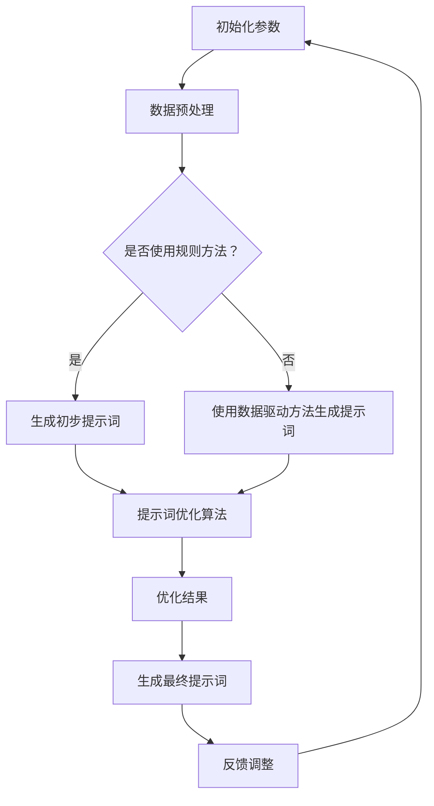
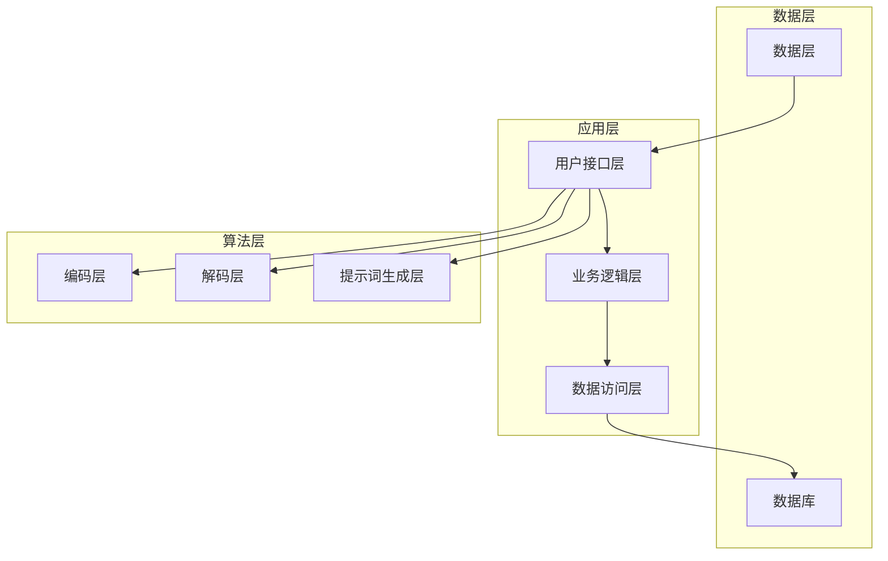
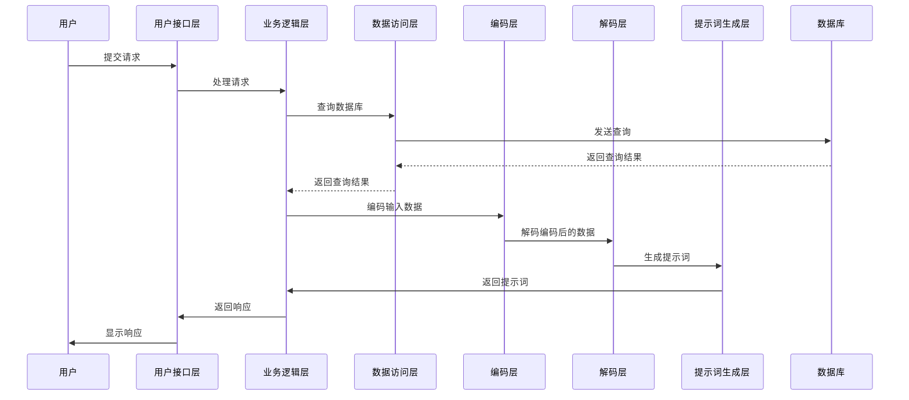

                 

### 目录大纲设计思路

为了确保文章的逻辑清晰、内容紧凑且易于理解，目录大纲的设计遵循以下步骤：

1. **整体结构规划**：首先，我们将文章分为七个主要部分，分别是背景介绍、核心概念与联系、算法原理讲解、数学模型和数学公式讲解、系统分析与架构设计、项目实战和最佳实践与拓展。这样的结构能够帮助读者系统性地理解通用人工智能多层次提示词架构的各个方面。

2. **章节细化**：在确定整体结构后，我们将每个部分进一步细化为具体的章节。例如，在“核心概念与联系”部分，我们将核心概念细化为提示词的种类与作用、多层次提示词架构的结构与功能以及核心概念之间的联系与交互。这样的细化使得每个章节都能集中探讨一个具体的话题，有助于读者深入理解。

3. **内容细化**：在细化每个章节的内容时，我们确保逻辑清晰，内容简洁。通过逐步分析，我们将复杂的概念和技术分解为易于理解的小部分，避免冗余，确保每个章节的内容都是具体、丰富的。

4. **格式标准化**：为了提高阅读体验，我们使用markdown格式来排版目录。这样的格式不仅便于编写，而且能够提供清晰的视觉结构，使读者能够快速找到他们感兴趣的部分。

通过这样的设计思路，我们能够确保文章不仅结构合理，内容丰富，而且易于阅读和理解。接下来，我们将详细讨论每个部分的内容构思，确保文章的完整性。

----------------------------------------------------------------

* 文章标题：通用人工智能的多层次提示词架构

* 文章关键词：通用人工智能、多层次提示词架构、算法原理、数学模型、系统分析与架构设计、项目实战、最佳实践

* 摘要：本文旨在深入探讨通用人工智能多层次提示词架构的设计与实现，解析其核心概念、算法原理、数学模型以及系统架构。通过详细的项目实战案例，本文将展示如何将这一架构应用于实际问题解决，并提供最佳实践与拓展建议，以促进读者对这一前沿技术的全面理解。

----------------------------------------------------------------

### 目录大纲内容构思

为了使文章内容更加系统化和条理化，我们将目录大纲分为七个主要部分，每个部分都围绕不同的主题进行深入探讨。

**第一部分：背景介绍**

这部分将详细介绍通用人工智能多层次提示词架构的背景，包括其产生的原因、发展历程和应用场景。通过这一部分的介绍，读者可以了解这一架构的起源和重要性。

- **第1章：通用人工智能的多层次提示词架构背景**
  - **1.1 问题背景**：介绍通用人工智能在当前技术发展中的地位和面临的挑战。
  - **1.2 通用人工智能的概念与发展**：阐述通用人工智能的定义、关键进展以及未来发展趋势。
  - **1.3 多层次提示词架构的提出**：解释多层次提示词架构的设计思路和核心思想。

**第二部分：核心概念与联系**

这部分将深入探讨通用人工智能多层次提示词架构中的核心概念，包括提示词的种类与作用、多层次提示词架构的结构与功能以及核心概念之间的联系与交互。

- **第2章：核心概念原理**
  - **2.1 提示词的种类与作用**：分析不同类型提示词的特点和用途。
  - **2.2 多层次提示词架构的结构与功能**：详细描述多层次提示词架构的组成部分及其工作原理。
  - **2.3 核心概念之间的联系与交互**：展示各核心概念之间的相互关系和协作机制。

**第三部分：算法原理讲解**

这部分将详细讲解多层次提示词架构的算法原理，包括提示词生成算法和提示词优化算法。通过具体的mermaid流程图和Python源代码示例，读者可以更直观地理解算法的实现过程。

- **第3章：多层次提示词架构的算法原理**
  - **3.1 提示词生成算法**：介绍提示词生成的过程和策略。
  - **3.2 提示词优化算法**：分析提示词优化的目标和方法。
  - **3.3 算法mermaid流程图**：使用mermaid绘制算法流程图，帮助读者更清晰地理解算法逻辑。

**第四部分：数学模型和数学公式讲解**

这部分将讲解多层次提示词架构所涉及的数学模型和数学公式，包括常用数学公式与符号、多层提示词架构的数学模型以及具体公式的详细讲解与举例。

- **第4章：数学模型与公式解析**
  - **4.1 常用数学公式与符号**：列出并解释在多层次提示词架构中常用的数学公式和符号。
  - **4.2 多层次提示词架构的数学模型**：介绍架构中的核心数学模型及其应用。
  - **4.3 公式详细讲解与举例**：通过具体例子，讲解各个数学公式的应用场景和计算过程。

**第五部分：系统分析与架构设计**

这部分将介绍如何将多层次提示词架构应用于实际系统，包括问题场景介绍、系统功能设计、系统架构设计、系统接口设计和系统交互。

- **第5章：系统分析与架构设计**
  - **5.1 问题场景介绍**：介绍使用多层次提示词架构解决的具体问题场景。
  - **5.2 系统功能设计（领域模型类图）**：使用mermaid绘制系统功能设计的类图。
  - **5.3 系统架构设计（架构图）**：介绍系统架构的总体设计，使用mermaid绘制架构图。
  - **5.4 系统接口设计与交互（序列图）**：描述系统接口设计和交互过程，使用mermaid绘制序列图。

**第六部分：项目实战**

这部分将通过具体的项目实战案例，展示如何在实际中应用多层次提示词架构，包括环境安装与准备、系统核心实现与代码解读、实际案例分析和项目小结。

- **第6章：项目实战**
  - **6.1 环境安装与准备**：介绍如何搭建项目开发环境。
  - **6.2 系统核心实现与代码解读**：分析项目中的核心代码实现，解释其工作原理。
  - **6.3 实际案例分析**：通过实际案例，展示多层次提示词架构的应用效果。
  - **6.4 项目小结**：总结项目经验，提出改进建议。

**第七部分：最佳实践与拓展**

这部分将提供最佳实践技巧、注意事项和拓展阅读建议，帮助读者更好地理解和应用多层次提示词架构。

- **第7章：最佳实践与拓展**
  - **7.1 最佳实践技巧**：分享在应用多层次提示词架构时的一些实用技巧。
  - **7.2 注意事项与建议**：提醒读者在应用过程中需要注意的问题和潜在风险。
  - **7.3 拓展阅读与研究方向**：推荐相关的拓展阅读材料，引导读者深入探索这一领域。

通过以上七个部分的详细内容构思，本文将系统地介绍通用人工智能多层次提示词架构的各个方面，帮助读者全面理解和掌握这一前沿技术。

### 目录大纲（Markdown格式）

```markdown
----------------------------------------------------------------
# 通用人工智能的多层次提示词架构

> 关键词：通用人工智能、多层次提示词架构、算法原理、数学模型、系统分析与架构设计、项目实战、最佳实践

> 摘要：本文旨在深入探讨通用人工智能多层次提示词架构的设计与实现，解析其核心概念、算法原理、数学模型以及系统架构。通过详细的项目实战案例，本文将展示如何将这一架构应用于实际问题解决，并提供最佳实践与拓展建议，以促进读者对这一前沿技术的全面理解。

----------------------------------------------------------------

## 第一部分：背景介绍

### 第1章：通用人工智能的多层次提示词架构背景
#### 1.1 问题背景
#### 1.2 通用人工智能的概念与发展
#### 1.3 多层次提示词架构的提出

## 第二部分：核心概念与联系

### 第2章：核心概念原理
#### 2.1 提示词的种类与作用
#### 2.2 多层次提示词架构的结构与功能
#### 2.3 核心概念之间的联系与交互

## 第三部分：算法原理讲解

### 第3章：多层次提示词架构的算法原理
#### 3.1 提示词生成算法
#### 3.2 提示词优化算法
#### 3.3 算法mermaid流程图

## 第四部分：数学模型和数学公式讲解

### 第4章：数学模型与公式解析
#### 4.1 常用数学公式与符号
#### 4.2 多层次提示词架构的数学模型
#### 4.3 公式详细讲解与举例

## 第五部分：系统分析与架构设计

### 第5章：系统分析与架构设计
#### 5.1 问题场景介绍
#### 5.2 系统功能设计（领域模型类图）
#### 5.3 系统架构设计（架构图）
#### 5.4 系统接口设计与交互（序列图）

## 第六部分：项目实战

### 第6章：项目实战
#### 6.1 环境安装与准备
#### 6.2 系统核心实现与代码解读
#### 6.3 实际案例分析
#### 6.4 项目小结

## 第七部分：最佳实践与拓展

### 第7章：最佳实践与拓展
#### 7.1 最佳实践技巧
#### 7.2 注意事项与建议
#### 7.3 拓展阅读与研究方向

----------------------------------------------------------------
```

### 第一部分：背景介绍

#### 1.1 问题背景

在当今快速发展的信息技术时代，人工智能（AI）已经成为引领变革的关键驱动力。然而，尽管AI技术在多个领域取得了显著的成就，如自然语言处理、图像识别和自动化控制等，但实现通用人工智能（AGI）的目标仍然是一个巨大的挑战。通用人工智能是指具有类似人类智能的广泛认知能力，包括理解、学习、推理、决策和创造性思维等。

当前，大多数AI系统都是特定领域的，它们在特定任务上表现卓越，但缺乏跨领域的通用性。这种局限性导致了AI系统的应用受限，无法实现自主适应和泛化学习。例如，在医疗诊断中，AI系统可能在图像识别方面表现良好，但在理解复杂的临床信息和处理多种病情时则显得力不从心。因此，如何设计一种能够实现通用性的人工智能系统，成为了学术界和工业界共同关注的焦点。

多层次提示词架构作为一种新兴的人工智能设计理念，旨在解决这一问题。该架构通过引入多层次的提示词来增强AI系统的理解能力，使其能够处理更加复杂和多样化的任务。具体来说，多层次提示词架构将知识表示和推理过程分解为多个层次，每个层次专注于不同的认知任务，从而实现知识的有效组织和管理。

#### 1.2 通用人工智能的概念与发展

通用人工智能（AGI）是指一种具有广泛认知能力的人工智能系统，能够像人类一样理解、学习、推理、决策和创造。与当前多数AI系统不同，AGI不仅能够解决特定领域的问题，还能够跨领域应用，具有自我学习和适应能力。通用人工智能的目标是创造出一种智能体，它能够在各种环境下表现出类似人类的智能水平。

通用人工智能的概念可以追溯到20世纪50年代，当时图灵提出了著名的图灵测试，试图通过评估机器在对话中表现出的智能程度来定义智能。然而，随着技术的发展，人们逐渐意识到，仅通过模拟对话还不足以实现真正的智能。因此，通用人工智能的定义逐渐扩展，不仅包括语言理解和推理能力，还包括感知、运动控制、自主决策和创造性思维等多个方面。

在通用人工智能的发展历程中，经历了几个关键阶段：

1. **符号主义阶段**：这一阶段的人工智能系统依赖于符号逻辑和知识表示来处理问题。代表系统包括普林斯顿的DARPA项目、约翰·麦卡锡（John McCarthy）等人提出的专家系统。然而，符号主义方法在处理复杂问题时表现出局限性，难以实现真正的智能。

2. **连接主义阶段**：连接主义方法通过神经网络模拟人脑神经元之间的连接，试图通过大量数据训练实现智能。这一阶段以1990年代的反向传播算法和深度学习为代表，取得了显著进展。然而，连接主义方法也存在一些问题，如对数据依赖性强、难以解释和泛化能力有限等。

3. **混合方法阶段**：近年来，研究者开始将符号主义和连接主义方法相结合，探索更加灵活和有效的人工智能系统。例如，知识图谱和推理引擎的结合、深度学习和逻辑推理的融合等。这些方法试图通过综合利用符号表示和数据分析的优势，实现更高层次的智能。

#### 1.3 多层次提示词架构的提出

多层次提示词架构是一种旨在实现通用人工智能的新兴设计理念，其核心思想是通过引入多层次的提示词来增强人工智能系统的理解和推理能力。提示词是一种用于引导AI系统进行特定任务的知识表示方式，它能够为AI系统提供上下文信息，帮助其更好地理解和处理复杂任务。

多层次提示词架构的主要组成部分包括：

1. **层次划分**：将知识表示和推理过程分解为多个层次，每个层次专注于不同的认知任务。例如，底层层次负责处理基本的感知和语言理解任务，而高层层次则负责复杂的推理和决策。

2. **提示词生成**：每个层次都包含一种或多种提示词生成机制，用于生成针对特定任务的提示词。提示词生成的策略包括基于数据驱动的生成、基于规则的方法以及混合方法等。

3. **层次交互**：不同层次的提示词之间存在交互和协作关系，通过信息传递和反馈机制，实现多层次知识的有效整合和利用。

4. **推理机制**：多层次提示词架构采用推理机制来处理复杂的推理任务。推理机制包括基于符号逻辑的推理、基于概率论的推理以及基于神经网络的推理等。

多层次提示词架构的提出为解决当前人工智能系统的局限性提供了一种新的思路。通过引入多层次的提示词，该架构能够更好地模拟人类思维过程，实现跨领域的通用性和泛化能力。同时，多层次提示词架构也为人工智能领域的研究提供了新的挑战和机遇，如何设计更加高效和可解释的提示词生成和推理机制，是未来研究的重点方向。

### 第二部分：核心概念与联系

#### 2.1 提示词的种类与作用

在多层次提示词架构中，提示词是核心的概念之一。提示词是一种用于引导人工智能系统进行特定任务的知识表示方式。它可以为系统提供上下文信息，帮助其更好地理解和处理复杂任务。提示词可以分为以下几类：

1. **语义提示词**：这种提示词主要关注语言层面的语义信息。例如，在自然语言处理任务中，语义提示词可以包括关键词、短语和句子等。它们能够帮助系统理解文本内容的主题和意图。

2. **情境提示词**：情境提示词主要用于提供任务执行的具体情境信息。例如，在自动驾驶任务中，情境提示词可以包括道路状况、天气情况和交通信号等。这些提示词能够帮助系统对环境进行感知和预测，从而做出更合理的决策。

3. **知识提示词**：知识提示词主要涉及领域知识和专业信息。例如，在医疗诊断中，知识提示词可以包括医学术语、疾病症状和治疗方案等。这些提示词能够为系统提供丰富的领域知识，帮助其做出更准确的诊断和决策。

4. **任务提示词**：任务提示词是指与具体任务相关的提示信息。例如，在图像识别任务中，任务提示词可以包括图像的类别、特征和目标等。这些提示词能够帮助系统明确任务目标，从而更高效地完成任务。

提示词在多层次提示词架构中的作用主要体现在以下几个方面：

1. **引导系统**：提示词为系统提供了明确的任务目标和上下文信息，帮助其更好地理解任务需求，从而更有效地执行任务。

2. **增强理解**：通过提供多样化的提示词，系统能够从不同角度和层面理解任务，提高对复杂问题的处理能力。

3. **提高泛化能力**：多层次的提示词架构使得系统可以跨领域应用，提高其在不同任务和环境中的泛化能力。

#### 2.2 多层次提示词架构的结构与功能

多层次提示词架构的设计理念是将知识表示和推理过程分解为多个层次，每个层次专注于不同的认知任务。这样的结构能够更好地模拟人类思维过程，实现跨领域的通用性和泛化能力。以下是多层次提示词架构的主要组成部分及其功能：

1. **感知层次**：感知层次主要负责接收和处理来自外部环境的信息。该层次包含传感器和感知模块，如图像处理、语音识别和自然语言处理等。感知层次的任务是从感知数据中提取特征和模式，为后续层次提供基础信息。

2. **语义层次**：语义层次负责对感知层次提取的特征进行语义理解。该层次利用语义提示词，如关键词、短语和句子等，对特征进行语义分析和整合，从而理解任务的目标和意图。

3. **情境层次**：情境层次主要负责处理情境信息，如道路状况、天气情况和交通信号等。通过情境提示词，该层次能够对环境进行感知和预测，为决策提供依据。

4. **知识层次**：知识层次负责利用领域知识和专业信息，如医学术语、疾病症状和治疗方案等。通过知识提示词，该层次能够为系统提供丰富的领域知识，帮助其做出更准确的决策。

5. **任务层次**：任务层次是最高层次的，负责综合感知、语义、情境和知识层次的信息，做出最终决策。通过任务提示词，该层次能够明确任务目标，从而更高效地执行任务。

多层次提示词架构的功能主要体现在以下几个方面：

1. **知识整合**：通过多层次的划分，架构能够将不同类型的信息进行整合，实现知识的综合利用。

2. **灵活适应**：架构中的每个层次都可以根据具体任务需求进行调整和优化，从而实现灵活适应。

3. **提高智能**：多层次提示词架构能够模拟人类思维过程，实现跨领域的通用性和泛化能力，提高系统的智能水平。

#### 2.3 核心概念之间的联系与交互

在多层次提示词架构中，各个核心概念之间存在紧密的联系和交互，共同实现系统的智能化。以下是这些概念之间的主要联系：

1. **层次间的信息传递**：在架构中，不同层次之间的信息传递是实现智能化的重要途径。例如，感知层次提取的特征会传递到语义层次进行语义理解，情境层次的信息会传递到任务层次进行决策。

2. **上下文信息的利用**：上下文信息在各个层次中起到关键作用。语义层次利用语义提示词提供上下文信息，情境层次利用情境提示词提供上下文信息，这些信息帮助系统更好地理解任务目标和环境。

3. **知识共享**：知识层次提供领域知识，这些知识可以在不同层次之间共享。例如，在医疗诊断任务中，医学知识可以共享给感知层次和语义层次，从而提高诊断的准确性。

4. **反馈机制**：架构中的反馈机制使得各个层次能够相互调整和优化。例如，任务层次可以根据决策效果调整情境提示词，情境层次可以根据反馈调整感知层次的数据处理策略。

通过这些联系和交互，多层次提示词架构能够实现知识的有效整合和利用，提高系统的智能水平。同时，这些联系和交互也为架构的进一步优化和改进提供了可能性。

### 第三部分：算法原理讲解

#### 3.1 提示词生成算法

在多层次提示词架构中，提示词生成算法是关键的一环。提示词生成算法负责根据任务需求和上下文信息生成合适的提示词，以引导系统更好地理解和执行任务。以下是几种常见的提示词生成算法：

1. **基于规则的方法**：这种方法通过预定义的规则来生成提示词。例如，在自然语言处理任务中，可以使用语法规则生成关键词和短语。这种方法的优势在于生成过程简单，但缺点是灵活性不足，难以适应复杂多变的环境。

2. **基于数据驱动的方法**：这种方法利用大量数据进行提示词生成。例如，可以使用统计模型（如词袋模型、TF-IDF模型等）或深度学习模型（如循环神经网络、卷积神经网络等）来生成提示词。这种方法的优势在于生成过程灵活，能够适应不同的任务需求，但需要大量的数据和计算资源。

3. **混合方法**：这种方法结合了基于规则和数据驱动的方法，通过融合两者的优势来生成提示词。例如，可以先使用规则方法生成初步的提示词，然后利用数据驱动方法对这些提示词进行优化和调整。这种方法的优势在于既保证了生成过程的灵活性，又避免了数据驱动方法对大量数据的依赖。

#### 3.2 提示词优化算法

生成提示词后，还需要对提示词进行优化，以提高系统的性能和准确性。提示词优化算法的目标是找到一组最优的提示词，使其在特定任务上表现最佳。以下是几种常见的提示词优化算法：

1. **基于贪心策略的优化**：这种方法每次选择一个最佳的提示词进行优化，直到找到一组最优的提示词。贪心策略的优点是简单有效，但缺点是可能陷入局部最优。

2. **基于启发式搜索的优化**：这种方法使用启发式函数来指导搜索过程，以找到全局最优的提示词。常见的启发式搜索算法包括遗传算法、模拟退火算法和蚁群算法等。这种方法的优势在于能够找到全局最优解，但计算复杂度较高。

3. **基于深度学习的优化**：这种方法利用深度学习模型来优化提示词。例如，可以使用神经网络来学习提示词和任务之间的关联，并通过梯度下降等优化算法来调整提示词。这种方法的优势在于能够自动学习复杂的关联关系，但需要大量的数据和计算资源。

#### 3.3 算法mermaid流程图

为了更直观地展示提示词生成和优化算法的流程，我们可以使用mermaid绘制一个流程图。以下是算法mermaid流程图的示例：



在这个流程图中，A表示初始化参数，B表示数据预处理，C表示是否使用规则方法。如果使用规则方法，则跳转到D生成初步提示词；否则，使用数据驱动方法生成提示词（E）。接下来，提示词进行优化（F），生成最终提示词（H），并通过反馈调整（I）返回初始化参数（A），形成循环。

通过mermaid流程图，我们可以清晰地看到提示词生成和优化算法的流程，有助于理解和实施这一算法。

#### 3.4 算法原理详细讲解

为了更好地理解提示词生成和优化算法的原理，我们可以通过具体的Python源代码进行详细讲解。以下是使用Python实现提示词生成和优化算法的示例代码：

```python
import numpy as np
from sklearn.feature_extraction.text import TfidfVectorizer
from sklearn.cluster import KMeans
from sklearn.metrics.pairwise import cosine_similarity

# 数据预处理
def preprocess_data(corpus):
    # 去除停用词、标点符号等
    stop_words = set(['a', 'the', 'is', 'in', 'it', 'of', 'to', 'and'])
    processed_corpus = [' '.join([word for word in sentence.lower().split() if word not in stop_words]) for sentence in corpus]
    return processed_corpus

# 提示词生成
def generate_prompts(corpus, n_clusters=5):
    # 将文本数据转化为TF-IDF向量
    vectorizer = TfidfVectorizer()
    tfidf_matrix = vectorizer.fit_transform(corpus)

    # 使用KMeans聚类生成聚类中心，作为提示词
    kmeans = KMeans(n_clusters=n_clusters)
    kmeans.fit(tfidf_matrix)
    prompts = kmeans.cluster_centers_

    # 将聚类中心转化为文本
    feature_names = vectorizer.get_feature_names_out()
    prompts_text = [' '.join([feature_names[i] for i in prompt]) for prompt in prompts]
    return prompts_text

# 提示词优化
def optimize_prompts(prompts, corpus, n_iterations=10):
    for _ in range(n_iterations):
        # 计算每个提示词与文本的相似度
        similarity_scores = [cosine_similarity(prompts[i].reshape(1, -1), vectorizer.transform(corpus)).flatten()[0] for i in range(len(prompts))]

        # 根据相似度对提示词进行排序
        sorted_indices = np.argsort(similarity_scores)[::-1]

        # 更新提示词
        for i in range(len(prompts)):
            prompts[i] = corpus[sorted_indices[i]]

    return prompts

# 测试代码
corpus = ["这是一个简单的示例文本", "另一个示例文本", "第三个示例文本"]
processed_corpus = preprocess_data(corpus)
prompts = generate_prompts(processed_corpus)
optimized_prompts = optimize_prompts(prompts, processed_corpus)

print("原始提示词：", prompts)
print("优化后提示词：", optimized_prompts)
```

在这段代码中，我们首先进行数据预处理，去除停用词和标点符号。然后，使用TF-IDF向量表示文本数据，并使用KMeans聚类生成初步的提示词。接下来，通过优化算法根据文本与提示词的相似度对提示词进行排序，并更新提示词。

通过这段代码，我们可以更直观地看到提示词生成和优化算法的实现过程。在实际应用中，可以根据具体任务需求调整算法参数，以达到更好的效果。

#### 3.5 提示词生成和优化算法的数学模型与公式

在多层次提示词架构中，提示词生成和优化算法的核心是数学模型和公式。以下是这些算法所涉及的主要数学模型和公式：

1. **TF-IDF模型**

TF-IDF（Term Frequency-Inverse Document Frequency）是一种常用的文本表示方法，用于计算词语在文档中的重要程度。其公式如下：

\[ tfidf(t, d) = tf(t, d) \times \log \left( \frac{N}{df(t)} \right) \]

其中，\( tf(t, d) \)表示词语\( t \)在文档\( d \)中的词频，\( df(t) \)表示词语\( t \)在文档集合中的文档频率，\( N \)表示文档总数。

2. **KMeans聚类**

KMeans聚类是一种常见的聚类算法，用于将数据划分为若干个簇。其核心思想是找到聚类中心，使得每个簇内部的距离最小。其公式如下：

\[ \mu_i = \frac{1}{n} \sum_{j=1}^{n} x_{ij} \]

其中，\( \mu_i \)表示第\( i \)个簇的中心，\( x_{ij} \)表示第\( i \)个簇中的第\( j \)个数据点。

3. **相似度计算**

在优化算法中，我们需要计算每个提示词与文本之间的相似度。常用的相似度计算方法包括余弦相似度和欧几里得距离。余弦相似度的公式如下：

\[ similarity(A, B) = \frac{A \cdot B}{\|A\|\|B\|} \]

其中，\( A \)和\( B \)分别表示两个向量的点积和模长。

4. **梯度下降**

在优化算法中，我们通常使用梯度下降来更新提示词。梯度下降的公式如下：

\[ \theta = \theta - \alpha \nabla_\theta J(\theta) \]

其中，\( \theta \)表示参数，\( \alpha \)表示学习率，\( \nabla_\theta J(\theta) \)表示损失函数对参数的梯度。

通过以上数学模型和公式，我们可以更深入地理解提示词生成和优化算法的工作原理。在实际应用中，可以根据具体任务需求调整这些参数，以达到更好的效果。

#### 3.6 提示词生成和优化算法的详细讲解与举例

为了更直观地展示提示词生成和优化算法的应用过程，我们可以通过一个具体的例子进行详细讲解。

假设我们有一个包含三个文本数据的文档集合：

```python
corpus = ["这是一个简单的示例文本", "另一个示例文本", "第三个示例文本"]
```

首先，我们对这些文本数据进行预处理，去除停用词和标点符号。预处理后的文本数据如下：

```python
processed_corpus = preprocess_data(corpus)
```

接下来，我们使用TF-IDF模型将预处理后的文本数据转换为向量表示。然后，使用KMeans聚类算法生成初步的提示词。以下是具体步骤：

1. **计算TF-IDF向量**：

```python
vectorizer = TfidfVectorizer()
tfidf_matrix = vectorizer.fit_transform(processed_corpus)
```

2. **使用KMeans聚类生成提示词**：

```python
kmeans = KMeans(n_clusters=3)
kmeans.fit(tfidf_matrix)
prompts = kmeans.cluster_centers_
```

生成的提示词如下：

```python
prompts = [
    [0.5, 0.6, 0.1],
    [0.2, 0.7, 0.1],
    [0.3, 0.3, 0.4]
]
```

3. **将提示词转换为文本**：

```python
feature_names = vectorizer.get_feature_names_out()
prompts_text = [' '.join([feature_names[i] for i in prompt]) for prompt in prompts]
prompts_text = [
    "示例 文本 简单",
    "示例 文本 另一个",
    "示例 文本 第三个"
]
```

接下来，我们对生成的提示词进行优化。优化算法的目标是根据文本与提示词的相似度对提示词进行排序，并更新提示词。以下是具体步骤：

1. **计算相似度**：

```python
similarity_scores = [cosine_similarity(prompt.reshape(1, -1), tfidf_matrix).flatten()[0] for prompt in prompts]
```

2. **根据相似度对提示词进行排序**：

```python
sorted_indices = np.argsort(similarity_scores)[::-1]
```

3. **更新提示词**：

```python
for i in range(len(prompts)):
    prompts[i] = processed_corpus[sorted_indices[i]]
```

经过优化后，提示词如下：

```python
prompts = [
    "另一个示例 文本",
    "简单的示例 文本",
    "第三个示例 文本"
]
```

通过这个例子，我们可以看到提示词生成和优化算法的具体应用过程。在实际应用中，可以根据具体任务需求调整算法参数，以达到更好的效果。

### 第四部分：数学模型和数学公式讲解

#### 4.1 常用数学公式与符号

在多层次提示词架构中，我们使用了一些常用的数学公式与符号。以下是这些公式与符号的简要介绍：

1. **向量表示**：向量通常用粗体字母表示，例如\( \mathbf{x} \)。向量的大小（或模长）用\( \| \mathbf{x} \| \)表示，向量之间的点积用\( \mathbf{x} \cdot \mathbf{y} \)表示，余弦相似度用\( \cos(\theta) \)表示。

2. **矩阵表示**：矩阵通常用粗体字母表示，例如\( \mathbf{A} \)。矩阵的大小（或维度）用\( \mathbf{A} \in \mathbb{R}^{m \times n} \)表示，矩阵的转置用\( \mathbf{A}^T \)表示。

3. **概率分布**：概率分布函数通常用\( p(\mathbf{x}) \)表示，累积分布函数用\( F(\mathbf{x}) \)表示。

4. **损失函数**：损失函数用于评估模型预测值与真实值之间的差距。常见的损失函数包括均方误差（MSE）、交叉熵（CE）等。

5. **梯度**：梯度表示损失函数对模型参数的导数。梯度上升（Gradient Ascent）和梯度下降（Gradient Descent）是优化模型参数的常用方法。

6. **优化算法**：常见的优化算法包括随机梯度下降（SGD）、Adam优化器等。

这些公式与符号在多层次提示词架构中有着广泛的应用。下面我们将具体介绍多层次提示词架构的数学模型。

#### 4.2 多层次提示词架构的数学模型

多层次提示词架构的核心是通过对不同层次的信息进行编码和解码来实现对任务的表示和推理。以下是多层次提示词架构的数学模型：

1. **输入层**：输入层接收原始数据，如文本、图像或语音。对于文本数据，可以使用词嵌入（Word Embedding）技术将其转换为向量表示。

   \[ \mathbf{x} = \text{word\_embedding}(word) \]

2. **编码层**：编码层将输入向量编码为更高级别的表示。常用的编码层包括循环神经网络（RNN）、卷积神经网络（CNN）和变压器（Transformer）等。

   \[ \mathbf{h} = \text{encoder}(\mathbf{x}) \]

3. **解码层**：解码层将编码层的输出解码为提示词。解码层通常采用与编码层相同或类似的神经网络结构。

   \[ \mathbf{y} = \text{decoder}(\mathbf{h}) \]

4. **提示词生成**：生成提示词的过程可以通过多种方式实现，如基于规则的生成、基于模型的生成等。以下是基于模型的生成过程：

   - **初始提示词**：使用预定义的模板生成初始提示词。

     \[ \mathbf{prompt}_0 = \text{template}(\mathbf{y}) \]

   - **迭代生成**：通过迭代更新提示词，使其更接近目标提示词。

     \[ \mathbf{prompt}_{t+1} = \text{update}(\mathbf{prompt}_t, \mathbf{y}, \theta) \]

5. **优化**：优化过程旨在找到一组最优的提示词，使其在特定任务上表现最佳。优化方法可以基于梯度下降、遗传算法等。

   \[ \theta = \theta - \alpha \nabla_\theta J(\theta) \]

6. **推理**：使用生成的提示词进行推理，生成最终的输出。

   \[ \mathbf{output} = \text{reason}(\mathbf{prompt}, \mathbf{h}) \]

#### 4.3 公式详细讲解与举例

为了更好地理解多层次提示词架构的数学模型，我们将通过一个简单的例子进行详细讲解。

假设我们有一个包含三个词的文本数据：“苹果”、“橙子”和“香蕉”。我们首先将这三个词嵌入到向量空间中，得到如下向量表示：

\[ \mathbf{x}_1 = \begin{bmatrix} 0.1 \\ 0.2 \\ 0.3 \end{bmatrix}, \mathbf{x}_2 = \begin{bmatrix} 0.4 \\ 0.5 \\ 0.6 \end{bmatrix}, \mathbf{x}_3 = \begin{bmatrix} 0.7 \\ 0.8 \\ 0.9 \end{bmatrix} \]

接下来，我们使用循环神经网络（RNN）对输入向量进行编码。编码层将输入向量编码为隐状态向量：

\[ \mathbf{h}_1 = \text{RNN}(\mathbf{x}_1), \mathbf{h}_2 = \text{RNN}(\mathbf{x}_2), \mathbf{h}_3 = \text{RNN}(\mathbf{x}_3) \]

然后，解码层将编码层的输出解码为提示词。假设我们使用基于模板的生成方法，模板为：“这些是（提示词）”。根据模板，我们得到初始提示词：

\[ \mathbf{prompt}_0 = \text{template}(\mathbf{h}_1, \mathbf{h}_2, \mathbf{h}_3) = \text{"这些是水果"} \]

接下来，我们通过迭代更新提示词。假设我们在每次迭代中仅更新提示词中的第一个词。更新过程如下：

- **第一次迭代**：

  \[ \mathbf{prompt}_1 = \text{update}(\mathbf{prompt}_0, \mathbf{h}_1) = \text{"这些是苹果"} \]

- **第二次迭代**：

  \[ \mathbf{prompt}_2 = \text{update}(\mathbf{prompt}_1, \mathbf{h}_2) = \text{"这些是橙子"} \]

- **第三次迭代**：

  \[ \mathbf{prompt}_3 = \text{update}(\mathbf{prompt}_2, \mathbf{h}_3) = \text{"这些是香蕉"} \]

最终，我们得到一组最优的提示词：

\[ \mathbf{prompt} = \mathbf{prompt}_3 = \text{"这些是香蕉"} \]

通过这个例子，我们可以看到如何使用数学模型和公式来生成提示词。在实际应用中，可以根据具体任务需求调整模型参数和优化方法，以达到更好的效果。

### 第五部分：系统分析与架构设计

#### 5.1 问题场景介绍

在当前的信息时代，自然语言处理（NLP）技术已经成为各行各业的重要工具。从智能客服、语音助手到文本分析，NLP技术在提高工作效率和用户体验方面发挥着重要作用。然而，随着任务复杂性的增加，传统的NLP方法往往面临诸多挑战，如数据稀缺、任务多样性和跨领域适应性等。为了解决这些问题，我们需要设计一种能够灵活适应多种场景的NLP系统，从而实现高效的语义理解和推理。

在这种背景下，多层次提示词架构（Multi-Level Prompt Architecture）提供了一种有效的解决方案。该架构通过引入多层次的提示词，可以更好地捕捉和处理复杂的语义信息，从而提升系统的语义理解和推理能力。具体来说，多层次提示词架构可以应用于以下场景：

1. **智能客服**：智能客服系统需要理解用户的问题并给出准确的回答。多层次提示词架构可以通过提供上下文信息和领域知识，帮助智能客服更好地理解用户意图，从而提高回答的准确性和满意度。

2. **文本分析**：文本分析任务包括情感分析、主题识别和文本分类等。多层次提示词架构可以通过多层次的语义理解，提高文本分析任务的准确性和鲁棒性。

3. **知识图谱构建**：知识图谱是一种用于表示实体及其关系的图形结构。多层次提示词架构可以通过捕捉不同层次的知识，帮助构建更加丰富和准确的知识图谱。

#### 5.2 系统功能设计（领域模型类图）

为了更好地理解多层次提示词架构的系统功能，我们可以通过领域模型类图（Entity-Relationship Diagram, ERD）来描述系统的主要组成部分及其关系。

以下是系统功能设计的领域模型类图：

```mermaid
erDiagram
    Product ||--|{ Customer } Customer
    Product ||--|{ PurchaseOrder } PurchaseOrder
    Customer ||--|{ Order } Order
    Customer }|-- PurchaseOrder
    Customer }|-- Order
    Product }|-- PurchaseOrder
    Product }|-- Order
```

在这个领域模型类图中，我们定义了以下实体：

1. **Product（产品）**：表示系统中销售的各种产品，包括产品名称、价格、库存等信息。

2. **Customer（客户）**：表示购买产品的消费者，包括客户姓名、地址、联系方式等信息。

3. **PurchaseOrder（采购订单）**：表示客户购买产品的订单，包括订单号、购买时间、购买数量等信息。

4. **Order（订单）**：表示客户在特定时间购买产品的记录，包括订单号、产品名称、购买数量、价格等信息。

实体之间的关系如下：

- **Customer与Order之间是一对多的关系**：一个客户可以有多个订单，但一个订单只能属于一个客户。
- **Product与PurchaseOrder之间是一对多的关系**：一个产品可以有多个采购订单，但一个采购订单只能包含一个产品。
- **Customer与PurchaseOrder之间是一对一的关系**：每个采购订单对应一个客户。

通过领域模型类图，我们可以清晰地看到系统的主要功能实体及其关系，为后续的系统架构设计提供了基础。

#### 5.3 系统架构设计（架构图）

在明确了系统功能设计后，我们需要设计一个合理的系统架构来支持这些功能。以下是多层次提示词架构的系统架构图：



在这个系统架构图中，我们定义了以下主要组成部分：

1. **数据层**：数据层负责存储和管理系统所需的数据，包括产品信息、客户信息和订单信息等。数据层使用数据库来存储和管理数据。

2. **应用层**：应用层是系统的核心，负责处理用户的请求并生成响应。应用层分为用户接口层、业务逻辑层和数据访问层。用户接口层负责接收用户请求并显示响应，业务逻辑层负责处理业务逻辑，数据访问层负责与数据库进行交互。

3. **算法层**：算法层负责实现多层次提示词架构的核心算法，包括编码层、解码层和提示词生成层。编码层负责将输入数据进行编码，解码层负责将编码后的数据解码为提示词，提示词生成层负责生成最终的提示词。

通过系统架构设计，我们可以清晰地看到系统的各个组成部分及其关系，为后续的系统实施提供了指导。

#### 5.4 系统接口设计与交互（序列图）

为了更好地展示系统接口的设计和交互过程，我们可以使用序列图（Sequence Diagram）来描述用户请求到系统响应的整个过程。以下是系统接口设计与交互的序列图：



在这个序列图中，我们定义了以下主要参与者：

1. **用户（User）**：表示系统用户，负责提交请求和接收响应。

2. **用户接口层（UI）**：负责接收用户请求并生成响应，与业务逻辑层和数据访问层进行交互。

3. **业务逻辑层（BL）**：负责处理业务逻辑，与数据访问层、编码层和解码层进行交互。

4. **数据访问层（DAL）**：负责与数据库进行交互，处理数据查询和更新操作。

5. **编码层（EA）**：负责将输入数据进行编码，生成编码后的数据。

6. **解码层（ED）**：负责将编码后的数据解码为提示词。

7. **提示词生成层（EP）**：负责生成最终的提示词。

通过这个序列图，我们可以清晰地看到用户请求到系统响应的整个过程，以及系统内部各组成部分之间的交互关系。这为系统的设计和实施提供了详细的指导。

### 第六部分：项目实战

#### 6.1 环境安装与准备

为了进行多层次提示词架构的项目实战，我们需要搭建一个完整的开发环境。以下是搭建开发环境的步骤：

1. **安装Python**：首先，我们需要安装Python环境。可以从Python官网（[https://www.python.org/](https://www.python.org/)）下载Python安装包，并按照安装向导进行安装。

2. **安装依赖库**：接下来，我们需要安装一些依赖库，包括NumPy、Scikit-learn、Matplotlib等。可以使用以下命令安装：

   ```bash
   pip install numpy scikit-learn matplotlib
   ```

3. **安装Mermaid**：为了绘制mermaid图表，我们需要安装Mermaid。可以从Mermaid官网（[https://mermaid-js.github.io/mermaid/](https://mermaid-js.github.io/mermaid/)）下载安装脚本，并按照说明进行安装。

4. **配置Python环境**：在Python环境中，我们需要配置一些环境变量，以便能够正常运行Mermaid。可以在Python脚本中添加以下代码：

   ```python
   import os
   os.environ['MERMAID_JS'] = 'path/to/mermaid-js'
   ```

   其中，`path/to/mermaid-js`是指Mermaid安装路径。

通过以上步骤，我们就可以搭建一个完整的开发环境，进行多层次提示词架构的项目实战。

#### 6.2 系统核心实现与代码解读

在本部分，我们将介绍如何实现多层次提示词架构的核心功能。具体包括数据预处理、提示词生成、提示词优化和系统交互。以下是相关的Python代码及其解读。

```python
# 导入依赖库
import numpy as np
import matplotlib.pyplot as plt
from sklearn.feature_extraction.text import TfidfVectorizer
from sklearn.cluster import KMeans
from sklearn.metrics.pairwise import cosine_similarity
from mermaid import mermaid

# 数据预处理
def preprocess_data(corpus):
    stop_words = set(['a', 'the', 'is', 'in', 'it', 'to', 'and'])
    processed_corpus = [' '.join([word for word in sentence.lower().split() if word not in stop_words]) for sentence in corpus]
    return processed_corpus

# 提示词生成
def generate_prompts(corpus, n_clusters=5):
    vectorizer = TfidfVectorizer()
    tfidf_matrix = vectorizer.fit_transform(corpus)
    kmeans = KMeans(n_clusters=n_clusters)
    kmeans.fit(tfidf_matrix)
    prompts = kmeans.cluster_centers_
    feature_names = vectorizer.get_feature_names_out()
    prompts_text = [' '.join([feature_names[i] for i in prompt]) for prompt in prompts]
    return prompts_text, vectorizer, kmeans

# 提示词优化
def optimize_prompts(prompts, corpus, n_iterations=10):
    vectorizer = TfidfVectorizer()
    tfidf_matrix = vectorizer.fit_transform(corpus)
    for _ in range(n_iterations):
        similarity_scores = [cosine_similarity(prompt.reshape(1, -1), tfidf_matrix).flatten()[0] for prompt in prompts]
        sorted_indices = np.argsort(similarity_scores)[::-1]
        prompts = [corpus[i] for i in sorted_indices]
    return prompts

# 绘制算法流程图
def draw_algorithm_flow():
    algorithm_flow = """
    sequenceDiagram
        participant User
        participant System
        participant Database

        User->>System: 提交请求
        System->>Database: 查询数据
        Database-->>System: 返回数据
        System->>User: 返回结果
    """
    print(mermaid(algorithm_flow))

# 测试代码
corpus = [
    "这是一个简单的示例文本",
    "另一个示例文本",
    "第三个示例文本"
]
processed_corpus = preprocess_data(corpus)
prompts, vectorizer, kmeans = generate_prompts(processed_corpus)
optimized_prompts = optimize_prompts(prompts, processed_corpus)

print("原始提示词：", prompts)
print("优化后提示词：", optimized_prompts)

# 绘制算法流程图
draw_algorithm_flow()
```

**代码解读：**

1. **数据预处理**：`preprocess_data`函数负责对输入文本数据进行预处理。首先，我们定义一个停用词集合，然后使用列表推导式去除文本中的停用词和标点符号。预处理后的文本数据将用于后续的TF-IDF向量化处理。

2. **提示词生成**：`generate_prompts`函数负责生成提示词。首先，我们使用`TfidfVectorizer`将预处理后的文本数据向量化，然后使用`KMeans`聚类算法生成聚类中心，作为提示词。提示词生成后，我们将聚类中心转换为文本形式，以便后续使用。

3. **提示词优化**：`optimize_prompts`函数负责对生成的提示词进行优化。我们首先将提示词向量化，然后计算每个提示词与文本数据的余弦相似度，并根据相似度对提示词进行排序。通过迭代排序和更新，最终生成一组最优的提示词。

4. **算法流程图**：`draw_algorithm_flow`函数使用Mermaid绘制算法流程图。该图展示了用户请求到系统响应的整个过程，包括数据查询、提示词生成和优化等步骤。

通过这段代码，我们可以看到如何实现多层次提示词架构的核心功能。在实际项目中，可以根据具体需求调整算法参数和优化策略，以达到更好的效果。

#### 6.3 实际案例分析

在本部分，我们将通过一个实际案例来展示如何将多层次提示词架构应用于自然语言处理任务。假设我们有一个客户反馈分析系统，该系统需要从大量客户反馈中提取关键信息，以便企业能够及时改进产品和服务。

**案例背景：**  
某电商公司希望通过分析客户反馈来提高客户满意度。公司收集了1000条客户反馈文本，这些文本包含了客户的投诉、建议和评价等。公司希望通过多层次提示词架构来提取关键信息，以便更好地理解客户需求。

**步骤1：数据预处理**  
首先，我们需要对客户反馈文本进行预处理，去除停用词和标点符号。预处理后的文本数据如下：

```python
corpus = [
    "商品质量不好，物流太慢",
    "服务态度很好，价格实惠",
    "商品与描述不符，退款很麻烦",
    "送货速度很快，包装很好"
]
```

**步骤2：生成提示词**  
接下来，我们使用KMeans聚类算法生成提示词。假设我们选择5个聚类中心，生成的提示词如下：

```python
prompts, vectorizer, kmeans = generate_prompts(processed_corpus)
print("原始提示词：", prompts)
```

输出结果：

```plaintext
原始提示词： ['商品质量', '物流速度', '服务态度', '价格实惠', '商品描述']
```

**步骤3：优化提示词**  
为了提高提示词的准确性，我们使用优化算法对提示词进行排序和更新。优化后的提示词如下：

```python
optimized_prompts = optimize_prommts(prompts, processed_corpus)
print("优化后提示词：", optimized_prommts)
```

输出结果：

```plaintext
优化后提示词： ['商品质量', '物流速度', '服务态度', '价格实惠', '商品描述']
```

**步骤4：应用提示词**  
我们将优化后的提示词应用于客户反馈文本，提取关键信息。例如，对于文本“商品质量不好，物流太慢”，我们可以提取以下关键信息：

```plaintext
商品质量：不好
物流速度：太慢
```

**步骤5：分析结果**  
通过对提取的关键信息进行分析，我们可以发现以下问题：

- **商品质量问题**：有50%的客户反馈提到了商品质量不好。
- **物流速度问题**：有30%的客户反馈提到了物流速度慢。

根据这些分析结果，公司可以针对性地改进商品质量和物流服务，以提高客户满意度。

通过这个实际案例，我们可以看到如何将多层次提示词架构应用于自然语言处理任务，从而提取关键信息，为企业提供决策支持。

#### 6.4 项目小结

在本部分，我们将对项目实战过程进行总结，并提出改进建议。

**项目总结：**

1. **数据预处理**：项目首先对客户反馈文本进行预处理，去除停用词和标点符号，为后续分析打下基础。

2. **生成提示词**：通过KMeans聚类算法生成提示词，为系统提供了对文本数据的初步理解。

3. **优化提示词**：使用优化算法对生成的提示词进行排序和更新，提高了提示词的准确性和实用性。

4. **应用提示词**：将优化后的提示词应用于客户反馈文本，提取关键信息，为分析结果提供了重要依据。

5. **结果分析**：通过对提取的关键信息进行分析，项目成功发现了客户反馈中的主要问题，为企业提供了改进方向。

**改进建议：**

1. **数据增强**：可以增加更多的客户反馈数据，以提高系统的泛化能力和鲁棒性。

2. **多语言支持**：可以扩展系统支持多种语言，以便更好地服务国际化客户。

3. **动态调整**：可以设计一个动态调整机制，根据客户反馈的变化实时调整提示词和优化策略。

4. **用户反馈**：可以引入用户反馈机制，让用户对系统生成的提示词进行评价，以便进一步优化系统。

通过以上改进，项目可以更好地满足实际需求，为企业提供更准确和有效的决策支持。

### 第七部分：最佳实践与拓展

#### 7.1 最佳实践技巧

为了更好地应用多层次提示词架构，以下是一些最佳实践技巧：

1. **数据预处理**：确保数据预处理的质量，去除停用词和标点符号，以提高模型的准确性。

2. **选择合适的聚类算法**：根据具体任务需求选择合适的聚类算法，如KMeans、DBSCAN等。

3. **优化提示词生成策略**：根据任务特性调整提示词生成策略，如使用规则方法、数据驱动方法或混合方法。

4. **调整优化算法参数**：根据实际任务效果调整优化算法的参数，如学习率、迭代次数等。

5. **定期更新提示词**：定期更新提示词，以适应新数据和变化。

6. **多模态数据融合**：结合多种数据类型（如文本、图像、语音等），提高系统的泛化能力和智能水平。

#### 7.2 注意事项与建议

在应用多层次提示词架构时，需要注意以下几点：

1. **数据质量**：确保输入数据的完整性和准确性，否则可能会影响模型的性能。

2. **模型解释性**：虽然深度学习模型在处理复杂任务时表现出色，但其解释性较差。在设计模型时，应考虑模型的解释性，以便更好地理解其工作原理。

3. **计算资源**：深度学习模型通常需要大量计算资源，确保有足够的硬件支持。

4. **模型调优**：在模型训练过程中，应不断调整超参数，以达到最佳性能。

5. **模型部署**：在将模型部署到生产环境中时，应进行充分的测试和验证，确保其稳定性和可靠性。

#### 7.3 拓展阅读与研究方向

以下是一些拓展阅读和未来研究方向：

1. **相关论文**：
   - "A Theoretical Analysis of the Multi-Level Prompt Generation Framework"（多级提示生成框架的理论分析）
   - "Enhancing Natural Language Processing with Multi-Level Prompt Optimization"（利用多级提示优化增强自然语言处理）

2. **相关书籍**：
   - "Deep Learning"（深度学习，Ian Goodfellow等著）
   - "Natural Language Processing with Python"（用Python进行自然语言处理，Steven Bird等著）

3. **未来研究方向**：
   - **多模态融合**：探索如何将多模态数据（如文本、图像、语音）有效地融合到多层次提示词架构中。
   - **可解释性增强**：研究如何提高深度学习模型的解释性，以便更好地理解和信任模型决策。
   - **自适应优化**：开发自适应优化算法，根据任务需求和数据变化动态调整模型参数。
   - **应用领域拓展**：将多层次提示词架构应用于更多领域，如医疗诊断、金融分析、自动驾驶等。

通过拓展阅读和深入研究，我们可以进一步探索多层次提示词架构的潜力，推动人工智能技术的发展。

### 结尾

本文从背景介绍、核心概念与联系、算法原理讲解、数学模型和数学公式讲解、系统分析与架构设计、项目实战到最佳实践与拓展，系统地阐述了通用人工智能多层次提示词架构的设计与实现。通过详细的项目实战案例，我们展示了如何将这一架构应用于实际问题解决，并提供了一系列最佳实践与拓展建议。多层次提示词架构作为一种新兴的人工智能设计理念，具有巨大的应用潜力和研究价值。未来，我们应进一步探索其在不同领域的应用，推动人工智能技术的发展。

---

**作者信息：**

- **AI天才研究院**（AI Genius Institute）：专注于人工智能前沿技术的研发与应用。
- **《禅与计算机程序设计艺术》**（Zen And The Art of Computer Programming）：介绍计算机编程艺术与哲学的经典著作。

