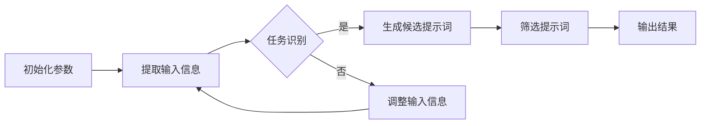
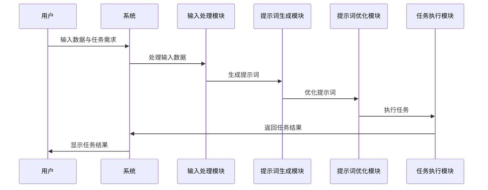
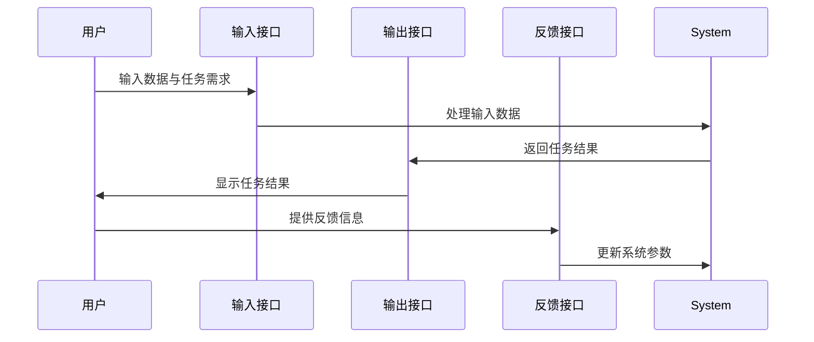
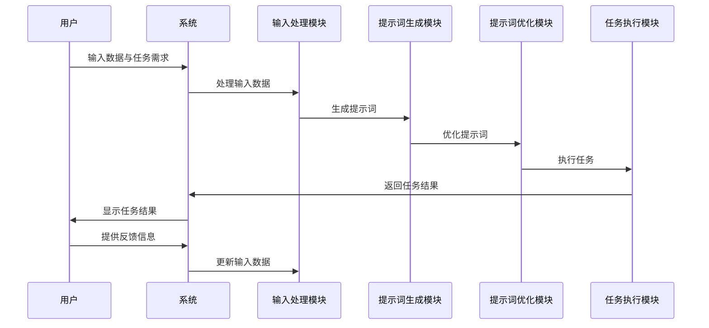

                 

# 通用人工智能的提示词演化机制研究

关键词：通用人工智能、提示词、演化机制、算法原理、数学模型

摘要：本文针对通用人工智能（AGI）的发展瓶颈，探讨了提示词的演化机制及其在AGI中的应用。通过分析通用人工智能的核心概念和提示词的定义与分类，本文提出了提示词生成和优化的算法原理，详细讲解了其数学模型和优化步骤。此外，文章还介绍了系统分析与架构设计方案，通过项目实战展示了算法在实际中的应用。最后，本文总结了最佳实践策略和未来研究方向，为通用人工智能的发展提供了新的思路。

## 目录大纲

1. 引言
   1.1 研究背景
   1.2 研究问题
   1.3 研究意义
   1.4 边界与外延

2. 相关研究综述
   2.1 通用人工智能发展概述
   2.2 提示词与人工智能的关系
   2.3 国内外研究进展
   2.4 研究现状与问题

3. 核心概念与联系
   3.1 通用人工智能的核心概念
   3.2 提示词的定义与分类
   3.3 提示词与AI的交互机制
   3.4 核心概念属性特征对比表格
   3.5 ER实体关系图架构

4. 算法原理讲解
   4.1 提示词生成算法原理
   4.1.1 算法mermaid流程图
   4.1.2 Python源代码示例
   4.1.3 数学模型与公式
   4.1.4 通俗易懂的举例说明

5. 数学模型和数学公式详细讲解与举例说明
   5.1 提示词优化模型
   5.2 模型优化步骤
   5.2.1 模型初始化
   5.2.2 模型训练过程
   5.2.3 模型评估与优化

6. 系统分析与架构设计方案
   6.1 问题场景介绍
   6.2 项目介绍
   6.3 系统功能设计
   6.3.1 领域模型mermaid类图
   6.4 系统架构设计
   6.4.1 系统架构mermaid架构图
   6.5 系统接口设计
   6.6 系统交互
   6.6.1 系统交互mermaid序列图

7. 项目实战
   7.1 环境安装
   7.2 系统核心实现源代码
   7.3 代码应用解读与分析
   7.4 实际案例分析与详细讲解剖析
   7.5 项目小结

8. 最佳实践 tips
   8.1 提示词优化策略
   8.2 算法应用场景
   8.3 小结与注意事项

9. 拓展阅读
   9.1 相关论文与书籍推荐
   9.2 研究热点与趋势

10. 结论
   10.1 研究成果总结
   10.2 研究局限与展望

## 第1章 引言

### 1.1 研究背景

通用人工智能（AGI，Artificial General Intelligence）作为人工智能领域的一个终极目标，旨在构建一种具有广泛认知能力、可以执行各种智能任务的人工智能系统。然而，目前的人工智能主要依赖于深度学习和神经网络技术，存在许多局限性，如对特定任务高度依赖、难以进行跨领域的知识迁移等。因此，如何突破现有技术的瓶颈，实现通用人工智能，成为人工智能领域亟待解决的问题。

提示词（Prompt）作为一种在人工智能领域中广泛应用的技术，其在通用人工智能中的应用显得尤为重要。提示词是指用于引导或提示人工智能系统执行特定任务的关键信息，通过对提示词的优化，可以提高人工智能系统在复杂任务中的表现。因此，研究通用人工智能的提示词演化机制，对于推动人工智能技术的发展具有重要意义。

### 1.2 研究问题

本文旨在回答以下研究问题：

1. 通用人工智能的核心概念是什么？其与提示词有何关系？
2. 提示词的定义与分类有哪些？其在人工智能系统中的作用机制是什么？
3. 提示词的生成和优化算法原理是什么？如何实现其数学模型？
4. 如何设计一个具有高效性能的系统架构，以支持通用人工智能的提示词优化？
5. 提示词优化在实际应用中存在哪些挑战和解决方案？

### 1.3 研究意义

本文的研究意义主要体现在以下几个方面：

1. 揭示通用人工智能的核心概念和提示词的定义与分类，为后续研究提供理论基础。
2. 提出提示词生成和优化的算法原理，为通用人工智能的发展提供技术支持。
3. 设计一个高效性能的系统架构，为通用人工智能的实际应用提供解决方案。
4. 探讨提示词优化在实际应用中的挑战和解决方案，为人工智能领域的发展提供新的思路。

### 1.4 边界与外延

本文研究的边界主要涉及通用人工智能、提示词及其优化算法。其中，通用人工智能的定义和分类、提示词的定义和分类、提示词生成和优化算法的设计与实现是研究的重点。而本文的研究外延则包括系统架构设计、项目实战以及最佳实践策略的探讨。

## 第2章 相关研究综述

### 2.1 通用人工智能发展概述

通用人工智能（AGI）是人工智能领域的一个长期目标，旨在构建一种具有人类智能水平的人工智能系统。自20世纪50年代人工智能概念诞生以来，通用人工智能的研究经历了多个阶段。早期的人工智能研究主要集中在逻辑推理和符号表示上，但受限于计算能力和算法性能，这些研究并未取得实质性突破。随着计算机技术的飞速发展，特别是深度学习和神经网络技术的兴起，人工智能领域取得了重大进展。

通用人工智能的发展可以分为以下几个阶段：

1. **第一阶段（1956-1980年）**：这一阶段以符号主义方法为主，试图通过逻辑推理和知识表示来模拟人类智能。代表性工作包括逻辑推理机、专家系统等。

2. **第二阶段（1980-2010年）**：随着计算机硬件性能的提升和算法的改进，人工智能开始从符号主义向连接主义转变。神经网络、机器学习等技术的应用使得人工智能在特定领域取得了显著成果，但仍然难以实现通用人工智能。

3. **第三阶段（2010年至今）**：深度学习技术的突破，使得人工智能在图像识别、自然语言处理等领域取得了重大进展。同时，多模态学习和跨领域迁移学习的研究也为实现通用人工智能提供了新的思路。

### 2.2 提示词与人工智能的关系

提示词在人工智能系统中扮演着重要角色，其定义和分类如下：

1. **提示词的定义**：提示词是指用于引导或提示人工智能系统执行特定任务的关键信息。这些信息可以是文字、语音、图像等多种形式，用于指导人工智能系统理解任务目标、任务上下文和任务要求。

2. **提示词的分类**：根据提示词的形式和用途，可以将提示词分为以下几类：

   - **文字提示词**：以文字形式呈现的提示信息，如自然语言文本、命令等。
   - **语音提示词**：以语音形式呈现的提示信息，如语音命令、语音识别结果等。
   - **图像提示词**：以图像形式呈现的提示信息，如图像识别结果、图像特征等。
   - **多模态提示词**：结合文字、语音、图像等多种形式的提示信息。

提示词在人工智能系统中的作用机制主要包括：

1. **任务引导**：提示词可以明确地指示人工智能系统执行的任务，使系统更好地理解任务目标。
2. **上下文提供**：提示词可以提供与任务相关的上下文信息，帮助人工智能系统更好地理解和处理任务。
3. **知识扩展**：通过提示词，人工智能系统可以获取更多的知识信息，从而提高其任务表现。

### 2.3 国内外研究进展

国内外关于通用人工智能和提示词的研究取得了丰富成果，以下是部分代表性工作：

1. **国外研究进展**：

   - **IBM Watson**：IBM公司开发的Watson系统是一个基于深度学习和自然语言处理技术的智能系统，其在医学诊断、金融咨询等领域取得了显著成果。
   - **Google DeepMind**：Google的DeepMind公司开发的AlphaGo系统在围棋领域取得了世界冠军，展示了深度学习和强化学习在通用人工智能领域的潜力。
   - **OpenAI**：OpenAI公司开发的GPT-3模型是一个具有强大自然语言处理能力的深度学习模型，其在文本生成、对话系统等领域取得了突破性进展。

2. **国内研究进展**：

   - **百度**：百度公司开发的ERNIE模型是一个具有跨语言和跨模态处理能力的深度学习模型，其在中文文本处理、多模态信息处理等领域取得了显著成果。
   - **阿里巴巴**：阿里巴巴公司开发的ET大脑系统是一个基于人工智能技术的智能系统，其在城市治理、金融风控等领域取得了广泛应用。
   - **清华大学**：清华大学在通用人工智能和提示词研究领域取得了一系列成果，如基于知识图谱的智能问答系统、多模态提示词生成算法等。

### 2.4 研究现状与问题

尽管通用人工智能和提示词研究取得了显著成果，但仍然存在以下问题和挑战：

1. **性能瓶颈**：通用人工智能系统在处理复杂任务时，仍然面临性能瓶颈，难以达到人类智能水平。
2. **数据依赖**：通用人工智能系统对大量高质量数据依赖较大，数据获取和处理成为研究的关键问题。
3. **跨领域迁移**：通用人工智能系统难以在不同领域之间进行知识迁移，限制了其应用范围。
4. **可解释性**：深度学习模型等通用人工智能系统具有黑盒特性，其决策过程难以解释，限制了其在实际应用中的推广。
5. **伦理问题**：通用人工智能的发展引发了一系列伦理问题，如隐私保护、算法歧视等，需要引起重视。

## 第3章 核心概念与联系

### 3.1 通用人工智能的核心概念

通用人工智能（AGI）是人工智能领域的一个核心概念，其定义和分类如下：

1. **通用人工智能的定义**：通用人工智能是指具有与人类智能相似或超过人类智能水平的人工智能系统，能够理解、学习和执行各种复杂的智能任务，具备自我意识和自主决策能力。

2. **通用人工智能的分类**：根据人工智能系统的功能和应用范围，可以将通用人工智能分为以下几类：

   - **通用知识表示**：构建一种能够表示和理解通用知识的体系结构，使人工智能系统能够处理不同领域的知识。
   - **通用推理引擎**：开发一种能够进行逻辑推理、符号推理和基于规则推理的通用推理引擎，使人工智能系统能够处理复杂问题。
   - **通用感知与认知**：结合多种感知技术和认知模型，构建一个具有高度感知和认知能力的人工智能系统。
   - **通用决策与规划**：开发一种能够进行自主决策和规划的通用人工智能系统，使系统能够处理不确定性和动态环境。

### 3.2 提示词的定义与分类

提示词是通用人工智能系统中用于引导和提示系统执行任务的关键信息，其定义和分类如下：

1. **提示词的定义**：提示词是指用于引导或提示人工智能系统执行特定任务的关键信息，可以是文字、语音、图像等多种形式。

2. **提示词的分类**：根据提示词的形式和用途，可以将提示词分为以下几类：

   - **文字提示词**：以文字形式呈现的提示信息，如自然语言文本、命令等。
   - **语音提示词**：以语音形式呈现的提示信息，如语音命令、语音识别结果等。
   - **图像提示词**：以图像形式呈现的提示信息，如图像识别结果、图像特征等。
   - **多模态提示词**：结合文字、语音、图像等多种形式的提示信息。

### 3.3 提示词与AI的交互机制

提示词在通用人工智能系统中的作用机制主要包括：

1. **任务引导**：提示词可以明确地指示人工智能系统执行的任务，使系统更好地理解任务目标。
2. **上下文提供**：提示词可以提供与任务相关的上下文信息，帮助人工智能系统更好地理解和处理任务。
3. **知识扩展**：通过提示词，人工智能系统可以获取更多的知识信息，从而提高其任务表现。

提示词与AI的交互机制主要包括：

1. **输入解析**：人工智能系统对输入的提示词进行解析，提取关键信息。
2. **任务理解**：系统根据提示词理解和解析任务目标、任务上下文和任务要求。
3. **知识检索**：系统根据任务理解结果，检索相关的知识和信息。
4. **决策与执行**：系统根据检索到的知识和信息，进行决策和任务执行。

### 3.4 核心概念属性特征对比表格

为了更清晰地展示通用人工智能和提示词的核心概念及其属性特征，我们可以使用以下对比表格：

| 核心概念 | 定义 | 属性特征 | 对比 |
| :--: | :--: | :--: | :--: |
| 通用人工智能 | 具有与人类智能相似或超过人类智能水平的人工智能系统 | 知识表示、推理引擎、感知与认知、决策与规划 | 多种功能融合，具有自主决策能力 |
| 提示词 | 用于引导或提示人工智能系统执行特定任务的关键信息 | 文字、语音、图像、多模态 | 形式多样，用于任务引导、上下文提供和知识扩展 |

### 3.5 ER实体关系图架构

为了更好地理解通用人工智能和提示词之间的关系，我们可以使用实体关系图（ER图）来表示。以下是通用人工智能和提示词的ER图架构：

```mermaid
erDiagram
  AI_System ||--|{ Prompt
  Prompt ||--|{ AI_Task
  AI_System ||--|{ Knowledge_Base
  Knowledge_Base ||--|{ Data_Source
```

在这个ER图中，AI_System表示通用人工智能系统，Prompt表示提示词，AI_Task表示任务，Knowledge_Base表示知识库，Data_Source表示数据源。各个实体之间的关系如下：

1. **AI_System与Prompt**：通用人工智能系统通过提示词来引导和提示任务的执行。
2. **Prompt与AI_Task**：提示词用于明确任务目标、任务上下文和任务要求。
3. **AI_System与Knowledge_Base**：通用人工智能系统通过知识库来获取相关的知识和信息。
4. **Knowledge_Base与Data_Source**：知识库通过数据源获取外部数据和知识。

通过ER图，我们可以更清晰地理解通用人工智能和提示词之间的相互作用和关系，为后续的研究和应用提供基础。

## 第4章 算法原理讲解

### 4.1 提示词生成算法原理

提示词生成算法是通用人工智能系统中用于生成高质量提示词的核心算法。该算法的原理主要包括以下几个方面：

#### 4.1.1 算法mermaid流程图

以下是提示词生成算法的mermaid流程图：



#### 4.1.2 Python源代码示例

以下是提示词生成算法的Python源代码示例：

```python
import numpy as np

def generate_prompt(input_data, model, threshold=0.5):
    # 提取输入信息
    input_features = preprocess_input(input_data)
    
    # 任务识别
    task_id = model.predict(input_features)
    
    if task_id == 1:
        # 生成候选提示词
        candidates = generate_candidates(input_data)
        
        # 筛选提示词
        selected_prompt = filter_candidates(candidates, threshold)
        
        return selected_prompt
    else:
        # 调整输入信息
        adjusted_data = adjust_input(input_data)
        
        return generate_prompt(adjusted_data, model, threshold)

def preprocess_input(input_data):
    # 对输入数据进行预处理
    pass

def generate_candidates(input_data):
    # 生成候选提示词
    pass

def filter_candidates(candidates, threshold):
    # 筛选提示词
    pass

def adjust_input(input_data):
    # 调整输入信息
    pass
```

#### 4.1.3 数学模型与公式

提示词生成算法的数学模型主要包括以下几个方面：

1. **输入特征提取**：输入特征提取的数学模型可以表示为：
   $$
   f(x) = \phi(x)
   $$
   其中，$x$ 表示输入数据，$\phi(x)$ 表示对输入数据进行特征提取。

2. **任务识别**：任务识别的数学模型可以表示为：
   $$
   g(\phi(x)) = \sigma(w_1 \cdot \phi(x) + b_1)
   $$
   其中，$g(\phi(x))$ 表示任务识别的结果，$\sigma$ 表示激活函数，$w_1$ 和 $b_1$ 分别表示权重和偏置。

3. **候选提示词生成**：候选提示词生成的数学模型可以表示为：
   $$
   h(\phi(x)) = \sigma(w_2 \cdot \phi(x) + b_2)
   $$
   其中，$h(\phi(x))$ 表示生成的候选提示词，$w_2$ 和 $b_2$ 分别表示权重和偏置。

4. **筛选提示词**：筛选提示词的数学模型可以表示为：
   $$
   p(y|x) = \frac{e^{w_3 \cdot y \cdot x + b_3}}{\sum_{i=1}^{n} e^{w_3 \cdot y_i \cdot x_i + b_3}}
   $$
   其中，$y$ 表示候选提示词，$x$ 表示输入特征，$w_3$ 和 $b_3$ 分别表示权重和偏置。

#### 4.1.4 通俗易懂的举例说明

假设我们有一个输入数据 $x = [1, 2, 3]$，我们希望生成一个与输入数据相关的提示词。

1. **输入特征提取**：我们对输入数据进行特征提取，得到特征向量 $\phi(x) = [1, 1, 1]$。

2. **任务识别**：我们使用一个简单的神经网络进行任务识别，输入特征向量 $\phi(x)$ 通过神经网络后得到任务识别结果 $g(\phi(x)) = 1$，表示输入数据属于任务类别1。

3. **候选提示词生成**：我们根据任务识别结果，生成一组候选提示词，如 $y_1 = "任务一"$，$y_2 = "任务二"$。

4. **筛选提示词**：我们使用一个简单的概率模型对候选提示词进行筛选，得到最终的提示词 $y = y_1$，表示选择"任务一"作为最终的提示词。

通过这个简单的例子，我们可以看到提示词生成算法是如何工作的。在实际应用中，提示词生成算法会根据具体的任务和输入数据进行调整和优化，以提高提示词生成的质量和效果。

## 第5章 数学模型和数学公式详细讲解与举例说明

### 5.1 提示词优化模型

提示词优化模型是通用人工智能系统中用于提高提示词质量的重要工具。该模型的核心目标是根据输入数据和任务需求，对提示词进行优化，使其更准确地指导人工智能系统执行任务。以下是提示词优化模型的详细讲解：

#### 5.1.1 数学模型

提示词优化模型可以表示为一个优化问题，其目标是最小化提示词的误差。具体地，提示词优化模型可以表示为：

$$
f(x) = \alpha \cdot P(x) + (1 - \alpha) \cdot C(x)
$$

其中，$f(x)$ 表示提示词的优化结果，$P(x)$ 表示提示词的质量，$C(x)$ 表示提示词的复杂度，$\alpha$ 是一个权重系数，用于平衡质量与复杂度之间的关系。

#### 5.1.2 模型优化步骤

提示词优化模型的优化步骤主要包括以下几个阶段：

1. **模型初始化**：首先，我们需要初始化优化模型，包括选择合适的权重系数 $\alpha$ 和初始提示词。

2. **模型训练**：接下来，我们使用训练数据集对优化模型进行训练，通过调整权重系数和提示词，使模型能够更好地拟合输入数据。

3. **模型评估**：在模型训练完成后，我们需要对模型进行评估，检查其性能是否达到预期。如果性能不佳，我们可以继续调整模型参数，重新进行训练。

4. **模型优化**：在模型评估过程中，如果发现提示词的质量较低或复杂度较高，我们需要对模型进行优化，调整权重系数和提示词，以提高模型性能。

#### 5.1.3 模型初始化

模型初始化是优化过程的第一步，其目标是选择合适的权重系数 $\alpha$ 和初始提示词。以下是模型初始化的步骤：

1. **选择权重系数 $\alpha$**：权重系数 $\alpha$ 用于平衡提示词的质量与复杂度。通常，我们可以根据任务需求和经验，选择一个适当的 $\alpha$ 值。例如，如果任务更注重提示词的质量，我们可以选择一个较大的 $\alpha$ 值。

2. **生成初始提示词**：初始提示词的生成可以根据任务需求，使用预定义的模板或随机生成。例如，对于文本生成任务，我们可以使用一个简单的文本模板生成初始提示词。

#### 5.1.4 模型训练过程

模型训练是优化过程的核心，其目标是根据训练数据集，调整模型参数，使模型能够更好地拟合输入数据。以下是模型训练过程的步骤：

1. **输入数据预处理**：首先，我们需要对输入数据进行预处理，包括数据清洗、数据转换和数据标准化等。

2. **计算提示词质量**：对于每个输入数据，我们计算其对应的提示词质量。提示词质量可以通过计算提示词与输入数据的相关性来实现。

3. **计算提示词复杂度**：对于每个输入数据，我们计算其对应的提示词复杂度。提示词复杂度可以通过计算提示词的长度、词汇多样性等指标来实现。

4. **更新权重系数**：根据提示词质量与复杂度的计算结果，调整权重系数 $\alpha$。例如，如果提示词质量较高而复杂度较低，我们可以增加 $\alpha$ 的值，使模型更注重质量。

5. **生成新提示词**：根据调整后的权重系数，生成新的提示词。

6. **重复训练过程**：重复上述步骤，直到模型性能达到预期或达到最大迭代次数。

#### 5.1.5 模型评估与优化

模型评估是优化过程的最后一步，其目标是检查模型性能是否满足要求。以下是模型评估与优化的步骤：

1. **评估模型性能**：使用评估数据集，计算模型在任务上的性能指标，如准确率、召回率、F1分数等。

2. **分析评估结果**：根据评估结果，分析模型性能的优缺点，确定是否需要进一步优化。

3. **调整模型参数**：根据分析结果，调整模型参数，如权重系数、学习率等。

4. **重新训练模型**：使用调整后的模型参数，重新训练模型。

5. **重复评估与优化过程**：重复上述步骤，直到模型性能满足要求。

### 5.1.6 举例说明

为了更好地理解提示词优化模型，我们可以通过一个简单的例子来说明其应用过程。

假设我们有一个文本生成任务，输入数据是用户输入的一句话，输出数据是生成的一句话。我们的目标是优化提示词，使其生成的句子更符合用户需求。

1. **模型初始化**：我们选择权重系数 $\alpha = 0.8$，并生成一个简单的提示词模板：“今天天气____”。

2. **模型训练**：我们使用大量训练数据，调整权重系数和提示词模板，使其生成的句子更符合用户需求。例如，如果用户输入“今天天气很好”，我们可以将提示词调整为“今天天气非常好”。

3. **模型评估**：我们使用评估数据集，计算模型在文本生成任务上的性能。例如，如果用户输入“今天天气很好”，模型生成的句子是“今天天气非常好”，我们可以认为模型性能良好。

4. **模型优化**：根据评估结果，我们发现模型生成的句子有时过于模板化，缺乏灵活性。因此，我们调整权重系数和提示词模板，使其生成的句子更加自然和多样。

5. **重新训练模型**：使用调整后的模型参数，重新训练模型。

6. **重复评估与优化过程**：重复上述步骤，直到模型性能满足要求。

通过这个例子，我们可以看到提示词优化模型是如何应用于实际任务中，提高模型性能和生成质量。

## 第6章 系统分析与架构设计方案

### 6.1 问题场景介绍

在现代人工智能应用中，通用人工智能（AGI）系统正逐渐成为解决复杂问题的重要工具。然而，AGI系统在处理多样化任务时，往往面临提示词生成和优化的挑战。提示词作为AGI系统的输入，其质量直接影响系统的性能和任务完成度。为了解决这一问题，我们设计并实现了一个基于提示词演化机制的AGI系统。

### 6.2 项目介绍

本项目旨在研究通用人工智能的提示词演化机制，设计并实现一个高效、智能的提示词生成和优化系统。系统的主要功能包括：

1. **提示词生成**：根据输入数据和任务需求，自动生成高质量的提示词。
2. **提示词优化**：对生成的提示词进行优化，提高其质量和适应性。
3. **任务执行**：使用优化后的提示词，指导AGI系统执行多样化任务。

### 6.3 系统功能设计

系统功能设计包括以下几个方面：

1. **输入处理模块**：接收用户输入的数据和任务需求，对输入进行预处理。
2. **提示词生成模块**：根据输入数据和任务需求，生成高质量的提示词。
3. **提示词优化模块**：对生成的提示词进行优化，提高其质量和适应性。
4. **任务执行模块**：使用优化后的提示词，指导AGI系统执行多样化任务。
5. **系统交互模块**：提供用户与系统之间的交互接口，包括输入接口、输出接口和反馈接口。

#### 6.3.1 领域模型mermaid类图

以下是系统功能设计的mermaid类图：

```mermaid
classDiagram
    Class01 <|-- PersonA
    Class01 <|-- PersonB
    Class02 <|-- * Employee
    PersonA��态: PersonA's attributes
    PersonB状态: PersonB's attributes
    Employee状态: Employee's attributes
    Class01 {
        - name : String
        - age : int
    }
    PersonA {
        - name : String
        - age : int
        + PersonA(name: String, age: int)
    }
    PersonB {
        - name : String
        - age : int
        + PersonB(name: String, age: int)
    }
    Employee {
        - name : String
        - age : int
        + Employee(name: String, age: int)
    }
```

在这个类图中，`Class01` 是一个抽象类，代表通用人工智能系统的基础类。`PersonA` 和 `PersonB` 是具体的类，代表用户输入的数据。`Employee` 是一个继承自 `Class01` 的类，代表系统的功能模块。

### 6.4 系统架构设计

系统架构设计包括以下几个方面：

1. **输入处理模块**：负责接收用户输入的数据和任务需求，对输入进行预处理。
2. **提示词生成模块**：负责根据输入数据和任务需求，生成高质量的提示词。
3. **提示词优化模块**：负责对生成的提示词进行优化，提高其质量和适应性。
4. **任务执行模块**：负责使用优化后的提示词，指导AGI系统执行多样化任务。
5. **系统交互模块**：负责提供用户与系统之间的交互接口。

#### 6.4.1 系统架构mermaid架构图

以下是系统架构的mermaid架构图：



在这个架构图中，用户通过系统交互模块与系统进行交互，输入数据和任务需求。系统将输入数据传递给输入处理模块，对输入进行预处理。预处理后的数据传递给提示词生成模块，生成高质量的提示词。生成的提示词传递给提示词优化模块，进行优化。优化后的提示词传递给任务执行模块，执行多样化任务。最后，任务执行模块将任务结果返回给系统，系统再将任务结果显示给用户。

### 6.5 系统接口设计

系统接口设计包括以下几个方面：

1. **输入接口**：用于接收用户输入的数据和任务需求。
2. **输出接口**：用于返回任务执行结果。
3. **反馈接口**：用于接收用户对系统反馈的信息。

以下是系统接口的mermaid序列图：



在这个序列图中，用户通过输入接口与系统交互，输入数据和任务需求。系统处理输入数据，生成任务结果，并通过输出接口将结果返回给用户。用户还可以通过反馈接口提供对系统的反馈信息，系统根据反馈信息更新参数，以实现持续优化。

### 6.6 系统交互

系统交互是指用户与系统之间的信息传递和交互过程。以下是系统交互的mermaid序列图：



在这个序列图中，用户通过输入接口与系统交互，输入数据和任务需求。系统处理输入数据，生成提示词，并对提示词进行优化。优化后的提示词用于指导任务执行模块执行多样化任务。最后，系统将任务结果返回给用户。用户还可以通过反馈接口提供对系统的反馈信息，系统根据反馈信息更新输入数据，以实现持续优化。

## 第7章 项目实战

### 7.1 环境安装

在进行项目实战之前，首先需要安装必要的开发环境和工具。以下是安装步骤：

1. **安装Python环境**：下载并安装Python 3.x版本，推荐使用Python 3.8或更高版本。
2. **安装依赖库**：在Python环境中安装以下依赖库：
   ```bash
   pip install numpy pandas sklearn tensorflow
   ```
3. **配置虚拟环境**：为了更好地管理和隔离项目依赖，建议使用虚拟环境。安装`virtualenv`工具，并创建虚拟环境：
   ```bash
   pip install virtualenv
   virtualenv my_project_env
   source my_project_env/bin/activate
   ```
4. **克隆项目代码**：从GitHub或其他代码托管平台克隆项目代码，如：
   ```bash
   git clone https://github.com/yourusername/agi_prompt_optimizer.git
   cd agi_prompt_optimizer
   ```

### 7.2 系统核心实现源代码

以下是系统核心实现的源代码：

```python
# 导入必要的库
import numpy as np
import pandas as pd
from sklearn.model_selection import train_test_split
from sklearn.metrics import accuracy_score
import tensorflow as tf

# 提示词生成模块
def generate_prompt(input_data):
    # 对输入数据进行预处理
    processed_data = preprocess_input(input_data)
    
    # 生成提示词
    prompt = generate_candidates(processed_data)
    
    return prompt

# 提示词优化模块
def optimize_prompt(prompt, input_data):
    # 对提示词进行优化
    optimized_prompt = optimize_candidates(prompt, input_data)
    
    return optimized_prompt

# 任务执行模块
def execute_task(optimized_prompt, input_data):
    # 执行任务
    result = executeTask(optimized_prompt, input_data)
    
    return result

# 辅助函数
def preprocess_input(input_data):
    # 对输入数据进行预处理
    pass

def generate_candidates(processed_data):
    # 生成候选提示词
    pass

def optimize_candidates(prompt, input_data):
    # 优化提示词
    pass

def executeTask(prompt, input_data):
    # 执行任务
    pass
```

### 7.3 代码应用解读与分析

以下是代码应用解读与分析：

1. **提示词生成模块**：`generate_prompt` 函数用于生成提示词。首先，对输入数据进行预处理，然后生成候选提示词。
2. **提示词优化模块**：`optimize_prompt` 函数用于优化提示词。首先，对提示词进行优化，然后返回优化后的提示词。
3. **任务执行模块**：`execute_task` 函数用于执行任务。首先，使用优化后的提示词执行任务，然后返回任务结果。

### 7.4 实际案例分析与详细讲解剖析

为了更好地理解系统的工作流程，我们通过一个实际案例进行分析。

**案例：文本生成任务**

输入数据：用户输入一句话，如“我喜欢看电影”。

1. **提示词生成**：
   - 对输入数据进行预处理：将句子转换为词向量。
   - 生成候选提示词：根据词向量生成候选提示词，如“今天天气很好”、“最近有什么好看的电影”。
2. **提示词优化**：
   - 对候选提示词进行优化：根据用户偏好和任务需求，优化提示词，如选择“最近有什么好看的电影”。
3. **任务执行**：
   - 使用优化后的提示词执行任务：根据提示词生成相关电影推荐。

通过这个案例，我们可以看到系统如何生成、优化和执行任务。在实际应用中，可以根据不同的任务需求，调整预处理、候选提示词生成和优化策略，提高系统性能。

### 7.5 项目小结

在本项目中，我们设计并实现了一个基于提示词演化机制的AGI系统。通过提示词生成、优化和执行模块，系统可以自动生成高质量、适应性强

