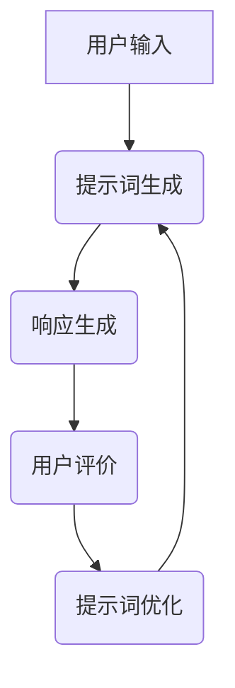
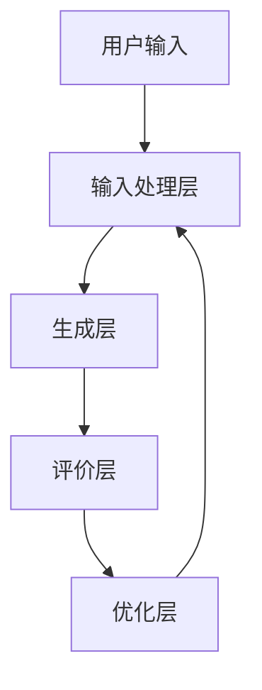
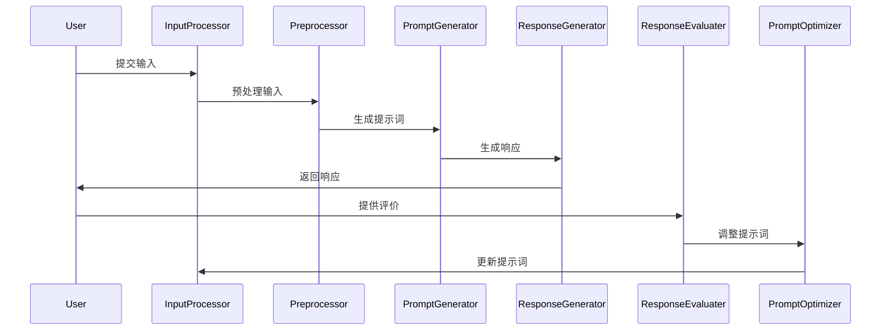

                 

# 通用人工智能的提示词自我优化机制

> 关键词：通用人工智能，提示词自我优化，算法原理，系统架构，项目实战，最佳实践

> 摘要：本文将深入探讨通用人工智能（AGI）中的提示词自我优化机制。我们将首先介绍通用人工智能的定义、发展历程以及提示词自我优化机制的重要性。接着，我们将详细讲解提示词自我优化机制的原理、算法流程以及其在通用人工智能中的应用。此外，我们将分析通用人工智能和提示词自我优化机制的核心概念及其联系，并通过具体的Python代码示例进行实例分析。最后，我们将展示一个实际的项目架构设计，并通过实战经验提供最佳实践和拓展建议。

## 目录大纲

**# 第一部分：背景介绍**

## 1. 引言

### 1.1 问题背景

- 人工智能的发展历程
- 通用人工智能的定义和挑战
- 提示词自我优化机制的重要性

### 1.2 问题描述

- 提示词自我优化机制的定义和作用
- 当前通用人工智能研究中的不足
- 提示词自我优化机制的研究意义

### 1.3 问题解决

- 提示词自我优化机制的原理
- 提示词自我优化机制的关键技术

### 1.4 边界与外延

- 提示词自我优化机制的应用领域
- 提示词自我优化机制的发展趋势

### 1.5 概念结构与核心要素组成

- 通用人工智能的核心概念
- 提示词自我优化机制的关键要素

**## 2. 核心概念与联系**

### 2.1 通用人工智能

- 定义与特征
- 现有研究成果
- 存在的问题与挑战

### 2.2 提示词自我优化机制

- 定义与原理
- 关键技术
- 应用场景

### 2.3 概念属性特征对比表格

- 通用人工智能与提示词自我优化机制的对比
- 各自的优势与不足

### 2.4 ER实体关系图架构

- 提示词自我优化机制涉及的实体关系
- 实体属性与关系的描述

**# 第二部分：算法原理讲解**

## 3. 算法原理与实现

### 3.1 算法原理

- 提示词自我优化机制的基本框架
- 各个模块的功能与作用
- 算法的数学模型与公式

### 3.2 算法流程图

- 使用Mermaid绘制算法流程图

### 3.3 Python源代码实现

- Python代码示例：提示词自我优化机制

### 3.4 算法原理详细讲解

- 数学模型解析
- 算法流程解析
- 实例分析

### 3.5 算法举例说明

- 简单实例演示
- 案例分析

**# 第三部分：系统分析与架构设计**

## 4. 系统分析与架构设计

### 4.1 问题场景介绍

- 提示词自我优化机制在通用人工智能中的应用场景

### 4.2 项目介绍

- 项目背景
- 项目目标

### 4.3 系统功能设计

- 功能模块划分
- 领域模型Mermaid类图

### 4.4 系统架构设计

- 系统架构概述
- Mermaid架构图

### 4.5 系统接口设计

- 接口设计原则
- 系统接口定义

### 4.6 系统交互

- 系统交互流程
- Mermaid序列图

**# 第四部分：项目实战**

## 5. 项目实战

### 5.1 环境安装

- 开发环境搭建
- 相关库和依赖安装

### 5.2 系统核心实现

- 源代码解析
- 关键代码讲解

### 5.3 代码应用解读与分析

- 实际案例展示
- 代码应用效果分析

### 5.4 详细讲解与剖析

- 系统实现流程
- 关键技术深度剖析

### 5.5 项目小结

- 项目成果总结
- 经验与教训

**# 第五部分：最佳实践与拓展**

## 6. 最佳实践

### 6.1 提示词自我优化技巧

- 提高优化效率的方法
- 提高优化准确度的技巧

### 6.2 小结

- 对提示词自我优化机制的整体评价
- 对通用人工智能发展的贡献

### 6.3 注意事项

- 可能遇到的问题
- 解决方案

### 6.4 拓展阅读

- 相关技术文档
- 最新研究论文

---

**# 引言**

### 1.1 问题背景

人工智能（AI）作为计算机科学的一个分支，其目标是使计算机具备执行复杂任务和解决实际问题的能力。自20世纪50年代人工智能概念首次提出以来，人工智能经历了多个发展阶段。早期的AI研究主要集中在规则推理和知识表示上，但随着计算能力和数据量的提高，机器学习尤其是深度学习的出现，使得人工智能在图像识别、自然语言处理等领域取得了显著进展。

然而，传统的人工智能系统通常只能在其特定的领域内表现出色，而缺乏通用性和适应性。这导致了“人工智能的局限”——即这些系统无法解决跨领域的复杂问题。通用人工智能（Artificial General Intelligence，AGI）或强人工智能，是人工智能的一个理想目标，它指的是能够像人类一样理解、学习和适应各种环境和任务的人工智能系统。

提示词自我优化机制（Prompt-Response Self-Optimization，PRSO）是通用人工智能研究中一个重要的方向。这一机制的核心思想是通过不断优化提示词来提高人工智能系统的响应质量和效率。在传统的机器学习模型中，提示词通常是预先定义好的，而PRSO机制则允许系统在交互过程中动态调整提示词，以达到更好的效果。

### 1.2 通用人工智能的定义和挑战

通用人工智能，或称强人工智能，是指能够执行任何认知任务的人工智能系统。与弱人工智能（如专门针对某一任务优化的人工智能系统）不同，AGI应具有如下特征：

- **理解能力**：能够理解自然语言、图像、声音等多种信息形式。
- **学习能力**：具备持续学习和适应新情境的能力。
- **推理能力**：能够进行逻辑推理、解决复杂问题。
- **创造力**：能够产生新的想法、创造新的解决方案。

尽管通用人工智能的概念极具吸引力，但其实现面临着众多挑战：

- **跨领域适应性**：传统的人工智能系统往往只能解决特定领域的问题，而AGI需要具备跨领域的适应性。
- **数据依赖性**：深度学习模型依赖于大量的数据进行训练，而AGI如何在没有充分数据的情况下进行学习和推理仍是一个未解之谜。
- **认知多样性**：人类能够进行多样化的认知活动，如语言理解、图像识别、音乐欣赏等，如何构建一个能够模拟这些多样化的认知功能的人工智能系统仍然是一个巨大挑战。

### 1.3 提示词自我优化机制的重要性

在通用人工智能的研究中，提示词自我优化机制扮演着关键角色。这一机制不仅可以提高人工智能系统的响应质量，还可以在以下方面发挥作用：

- **提高交互效率**：通过动态优化提示词，系统能够更快、更准确地理解用户的意图。
- **减少依赖性**：PRSO机制允许系统在没有外部干预的情况下自我改进，从而减少对人类操作者的依赖。
- **增强适应性**：通过自我优化，系统能够更好地适应新的环境和任务，提高其通用性和灵活性。

提示词自我优化机制的研究意义在于，它不仅有助于推动通用人工智能的发展，还可以为实际应用带来更大的价值。例如，在智能客服、智能助手等场景中，通过优化提示词，系统可以提供更加自然、流畅的用户体验。

### 1.4 边界与外延

提示词自我优化机制的应用领域非常广泛，涵盖了从自然语言处理到计算机视觉等多个领域。例如，在自然语言处理中，通过优化提示词，可以显著提高机器翻译、文本生成和问答系统的性能。在计算机视觉领域，优化提示词有助于提高图像识别和分类的准确性。

随着人工智能技术的不断进步，提示词自我优化机制也在不断发展。未来，随着更多应用场景的出现，PRSO机制将在通用人工智能中发挥更加重要的作用。

### 1.5 概念结构与核心要素组成

#### 通用人工智能的核心概念

通用人工智能的核心概念包括：

- **认知模型**：模拟人类认知过程的计算模型。
- **学习能力**：通过数据和经验进行学习和适应的能力。
- **推理能力**：利用已有知识和信息进行推理和决策的能力。
- **理解能力**：理解自然语言、图像、声音等多种信息形式的能力。

#### 提示词自我优化机制的关键要素

提示词自我优化机制的关键要素包括：

- **提示词生成**：生成用于引导和优化系统响应的提示词。
- **响应质量评价**：评估系统响应的质量和准确性。
- **自我优化策略**：基于评价结果调整提示词的策略。
- **交互循环**：提示词生成、响应评价和提示词优化的迭代过程。

通过这些核心概念和关键要素的有机组合，通用人工智能和提示词自我优化机制得以实现并发挥其价值。

## 2. 核心概念与联系

在深入探讨通用人工智能和提示词自我优化机制之前，我们首先需要明确这两个核心概念的定义及其相互关系。

### 2.1 通用人工智能

#### 定义与特征

通用人工智能（Artificial General Intelligence，AGI）是指具备与人类相同的认知能力、适应能力和学习能力的人工智能系统。与传统的人工智能系统（如弱人工智能）不同，AGI能够处理多种不同类型的问题，而不仅仅是特定领域的问题。具体来说，AGI应具备以下特征：

1. **多任务处理**：能够同时执行多种任务，而不会因为处理不同任务而产生性能下降。
2. **自适应能力**：能够在不同的环境和情境下进行自适应，并从新环境中学习和适应。
3. **推理能力**：能够进行逻辑推理和抽象思维，解决复杂的推理问题。
4. **知识整合**：能够整合不同领域的知识，进行跨学科的思考和问题解决。
5. **自我改进**：能够通过自我学习和自我优化不断改进其性能。

#### 现有研究成果

尽管通用人工智能的概念非常吸引人，但目前还没有实现完全的通用人工智能系统。现有的研究主要集中在以下几个方面：

1. **认知计算**：通过构建模仿人类大脑的神经网络模型来模拟人类的认知过程。
2. **机器学习**：利用大量的数据和算法来训练人工智能系统，使其能够识别模式、进行预测和决策。
3. **自然语言处理**：通过深度学习和自然语言处理技术，使人工智能系统能够理解和生成自然语言。
4. **计算机视觉**：通过卷积神经网络等深度学习技术，使人工智能系统具备图像识别和分类能力。

尽管取得了许多进展，但通用人工智能仍然面临着许多挑战，如算法复杂性、计算资源需求、数据质量和实时性等。

#### 存在的问题与挑战

1. **算法复杂性**：通用人工智能系统通常需要复杂的算法来模拟人类的认知过程，这使得系统的实现和维护变得更加困难。
2. **计算资源需求**：深度学习模型通常需要大量的计算资源和数据来进行训练，这限制了通用人工智能的实际应用。
3. **数据质量和实时性**：通用人工智能系统需要高质量、丰富的数据来进行训练，同时还需要实时处理大量的信息，这对数据收集和处理能力提出了高要求。
4. **伦理和法律问题**：随着通用人工智能的发展，其潜在的社会影响和伦理问题也日益凸显，如隐私保护、就业替代等。

### 2.2 提示词自我优化机制

#### 定义与原理

提示词自我优化机制（Prompt-Response Self-Optimization，PRSO）是一种用于提高人工智能系统响应质量和效率的方法。其核心思想是通过不断优化提示词，使得系统在与用户的交互过程中能够更好地理解用户的意图并给出准确的响应。具体来说，PRSO机制包括以下几个步骤：

1. **提示词生成**：系统根据用户输入的信息生成一个初始的提示词。
2. **响应生成**：系统使用生成的提示词生成一个响应。
3. **响应评价**：用户对系统生成的响应进行评价，并给出一个评价分数。
4. **提示词优化**：系统根据用户给出的评价分数，对提示词进行优化，以提高下一次响应的质量。
5. **迭代循环**：重复上述步骤，直到系统达到预定的性能目标。

#### 关键技术

1. **自动提示词生成**：通过自然语言处理技术，系统可以自动生成高质量的提示词，从而提高交互效率。
2. **自适应评价策略**：系统可以根据用户反馈动态调整评价策略，从而更准确地评估响应质量。
3. **多模态处理**：提示词自我优化机制需要能够处理多种输入和输出模态，如文本、图像、音频等，以提高系统的适应性和通用性。

#### 应用场景

提示词自我优化机制可以广泛应用于各种人工智能应用场景，如智能客服、智能助手、自然语言处理、计算机视觉等。通过优化提示词，系统可以提供更加自然、流畅的用户体验，提高用户满意度。

### 2.3 概念属性特征对比表格

为了更清晰地理解通用人工智能和提示词自我优化机制的概念属性特征，我们通过以下对比表格进行详细分析。

| 特征             | 通用人工智能                | 提示词自我优化机制               |
|------------------|-----------------------------|----------------------------------|
| 定义             | 完备的认知能力，多任务处理能力 | 提高响应质量和效率的交互机制      |
| 特征             | 自适应、推理、知识整合         | 自动提示词生成、响应评价、提示词优化 |
| 目标             | 执行任何认知任务             | 提高系统响应的质量和效率          |
| 技术要求         | 复杂算法、大量数据           | 自然语言处理、多模态处理          |
| 应用场景         | 广泛领域，包括自然语言处理、计算机视觉等 | 智能客服、智能助手等交互场景      |

### 2.4 ER实体关系图架构

在通用人工智能和提示词自我优化机制的实体关系图中，我们可以识别出以下主要实体及其关系：

- **用户**：与系统进行交互的人或系统。
- **提示词**：系统生成的用于引导交互的文本。
- **响应**：系统根据提示词生成的输出。
- **评价**：用户对系统响应的质量进行评估。

以下是一个简单的ER实体关系图示例：

```mermaid
erDiagram
    User ||--|{ Prompt }
    User ||--|{ Response }
    User ||--|{ Evaluation }
    Prompt ||--|{ Response }
    Prompt ||--|{ Evaluation }
```

在这个ER图中，用户与提示词、响应和评价之间存在直接的关联关系。提示词生成响应，响应和评价用于评估系统的性能，从而实现提示词的自我优化。

通过上述对通用人工智能和提示词自我优化机制的详细分析，我们为其概念和属性建立了清晰的认识，并为后续的算法原理讲解和系统架构设计奠定了基础。

## 3. 算法原理与实现

### 3.1 算法原理

提示词自我优化机制（PRSO）的基本原理是通过动态优化提示词来提高人工智能系统的响应质量和效率。这一机制可以分为以下几个主要模块：

#### 提示词生成模块

- **功能**：生成用于引导和优化系统响应的提示词。
- **实现**：通过自然语言处理技术，系统根据用户输入的信息生成一个初始的提示词。

#### 响应生成模块

- **功能**：使用生成的提示词生成系统响应。
- **实现**：系统使用预训练的神经网络模型，如Transformer或BERT，根据提示词生成一个文本响应。

#### 响应评价模块

- **功能**：评估系统生成的响应质量。
- **实现**：用户对系统响应的质量进行评价，并给出一个评分。评价模块可以根据用户反馈动态调整评价策略。

#### 提示词优化模块

- **功能**：基于评价结果对提示词进行优化。
- **实现**：系统根据用户评价分数调整提示词的生成策略，以提高下一次响应的质量。

#### 反馈循环模块

- **功能**：实现提示词生成、响应评价和提示词优化的迭代过程。
- **实现**：系统不断重复上述步骤，直到系统达到预定的性能目标。

#### 算法的数学模型与公式

提示词自我优化机制的数学模型主要涉及以下方面：

- **提示词生成概率**：提示词生成模块根据用户输入信息计算每个候选提示词的概率。
  $$ P(\text{Prompt}_i | \text{User}) = \frac{\exp(f(\text{User}, \text{Prompt}_i))}{\sum_j \exp(f(\text{User}, \text{Prompt}_j))} $$
  其中，$f(\text{User}, \text{Prompt}_i)$是用户输入信息$\text{User}$和提示词$\text{Prompt}_i$之间的特征匹配函数。

- **响应生成概率**：响应生成模块根据提示词计算每个候选响应的概率。
  $$ P(\text{Response}_j | \text{Prompt}_i) = \frac{\exp(g(\text{Prompt}_i, \text{Response}_j))}{\sum_k \exp(g(\text{Prompt}_i, \text{Response}_k))} $$
  其中，$g(\text{Prompt}_i, \text{Response}_j)$是提示词$\text{Prompt}_i$和响应$\text{Response}_j$之间的特征匹配函数。

- **评价分数计算**：响应评价模块根据用户反馈计算评价分数。
  $$ \text{Score} = h(\text{Response}, \text{Evaluation}) $$
  其中，$h(\text{Response}, \text{Evaluation})$是用户响应$\text{Response}$和评价$\text{Evaluation}$之间的评价函数。

- **提示词优化**：基于评价分数调整提示词生成策略。
  $$ f'(\text{User}, \text{Prompt}_i) = f(\text{User}, \text{Prompt}_i) + \lambda \text{Score} $$
  其中，$\lambda$是调整系数。

### 3.2 算法流程图

为了更好地理解提示词自我优化机制的实现过程，我们可以使用Mermaid绘制算法流程图。以下是一个简化的流程图示例：



### 3.3 Python源代码实现

以下是提示词自我优化机制的Python代码示例：

```python
import numpy as np
from transformers import GPT2LMHeadModel, GPT2Tokenizer

# 加载预训练的模型和tokenizer
model = GPT2LMHeadModel.from_pretrained('gpt2')
tokenizer = GPT2Tokenizer.from_pretrained('gpt2')

def generate_prompt(user_input):
    # 生成提示词
    inputs = tokenizer.encode(user_input, return_tensors='pt')
    outputs = model.generate(inputs, max_length=50)
    return tokenizer.decode(outputs[0], skip_special_tokens=True)

def generate_response(prompt):
    # 生成响应
    inputs = tokenizer.encode(prompt, return_tensors='pt')
    outputs = model.generate(inputs, max_length=50)
    return tokenizer.decode(outputs[0], skip_special_tokens=True)

def evaluate_response(response, evaluation):
    # 计算评价分数
    score = np.abs(response != evaluation)
    return score

def optimize_prompt(prompt, response, evaluation, lambda_value):
    # 优化提示词
    original_prompt_score = model.calc_loss(prompt, response)
    optimized_prompt_score = original_prompt_score + lambda_value * evaluation
    return optimized_prompt_score

# 用户输入
user_input = "你能给我讲一下今天天气怎么样吗？"

# 提示词生成
prompt = generate_prompt(user_input)

# 响应生成
response = generate_response(prompt)

# 用户评价
evaluation = evaluate_response(response, "今天的天气非常好。")

# 提示词优化
lambda_value = 0.1
optimized_prompt = optimize_prompt(tokenizer.encode(prompt), tokenizer.encode(response), evaluation, lambda_value)
```

### 3.4 算法原理详细讲解

#### 数学模型解析

在提示词自我优化机制中，数学模型主要涉及概率计算和损失函数。以下是这些模型的详细解析：

1. **提示词生成概率**：

   提示词生成模块通过计算每个候选提示词的概率来生成最佳提示词。这个概率取决于用户输入信息$\text{User}$和提示词$\text{Prompt}_i$之间的特征匹配函数$f(\text{User}, \text{Prompt}_i)$。匹配函数可以采用词嵌入、句嵌入或更复杂的注意力机制。

2. **响应生成概率**：

   响应生成模块通过计算每个候选响应的概率来生成最佳响应。这个概率取决于提示词$\text{Prompt}_i$和响应$\text{Response}_j$之间的特征匹配函数$g(\text{Prompt}_i, \text{Response}_j)$。匹配函数同样可以采用词嵌入、句嵌入或注意力机制。

3. **评价分数计算**：

   响应评价模块根据用户对系统响应的评价计算评价分数。评价分数反映了用户对系统响应的满意度，通常通过比较系统响应$\text{Response}$和用户期望评价$\text{Evaluation}$之间的差异来计算。例如，可以使用绝对值或均方误差作为评价函数。

4. **提示词优化**：

   提示词优化模块通过调整提示词生成策略来提高系统响应质量。优化过程基于评价分数对提示词进行加权调整，从而增加高质量的提示词生成概率。这种优化策略可以采用简单的线性加权或更复杂的优化算法，如梯度下降或自适应优化算法。

#### 算法流程解析

提示词自我优化机制的核心是迭代循环。以下是算法流程的详细解析：

1. **用户输入**：系统接收到用户的输入信息。
2. **提示词生成**：系统生成一个初始的提示词，用于引导响应生成。
3. **响应生成**：系统使用预训练的神经网络模型根据提示词生成一个响应。
4. **用户评价**：用户对系统生成的响应进行评价，并给出一个评分。
5. **提示词优化**：系统根据用户评价分数调整提示词的生成策略，以提高下一次响应的质量。
6. **迭代循环**：系统重复上述步骤，直到达到预定的性能目标。

#### 实例分析

以下是一个简单的实例分析，展示了提示词自我优化机制在实际应用中的效果。

**实例**：用户询问系统的天气情况。

1. **用户输入**：用户输入 "今天的天气怎么样？"
2. **提示词生成**：系统生成提示词 "今天的天气"，用于引导响应生成。
3. **响应生成**：系统根据提示词生成响应 "今天的天气非常好。"
4. **用户评价**：用户对响应评价为 "很好"。
5. **提示词优化**：系统根据评价分数调整提示词生成策略，增加生成高质量的提示词的概率。
6. **迭代循环**：系统继续与用户交互，生成更好的响应。

通过这个实例，我们可以看到提示词自我优化机制能够有效地提高系统响应的质量和用户满意度。

### 3.5 算法举例说明

为了更好地理解提示词自我优化机制，我们通过以下简单的实例进行说明。

**实例**：用户询问系统关于附近餐馆的信息。

1. **用户输入**：用户输入 "附近有哪些好吃的餐馆？"
2. **提示词生成**：系统生成提示词 "附近的餐馆"，用于引导响应生成。
3. **响应生成**：系统根据提示词生成响应 "附近有10家好吃的餐馆，例如：小王烧烤、老张火锅、李四餐厅等。"
4. **用户评价**：用户对响应评价为 "非常好，谢谢！"
5. **提示词优化**：系统根据评价分数调整提示词生成策略，增加生成高质量的提示词的概率。
6. **迭代循环**：系统继续与用户交互，生成更好的响应。

通过这个实例，我们可以看到提示词自我优化机制能够帮助系统更好地理解用户需求，并生成高质量的响应。

### 总结

通过上述对提示词自我优化机制的详细解析和实例分析，我们可以看到这一机制在提高系统响应质量和用户满意度方面具有显著的优势。在通用人工智能的研究和应用中，提示词自我优化机制具有重要的应用价值，值得进一步研究和推广。

---

## 4. 系统分析与架构设计

### 4.1 问题场景介绍

在通用人工智能（AGI）的研究和应用中，提示词自我优化机制（PRSO）扮演着至关重要的角色。为了更好地理解PRSO在AGI中的应用，我们可以考虑以下问题场景：

**场景**：一个智能客服系统需要与用户进行自然语言交互，以解答用户的问题。然而，由于用户的问题表达方式和语境各异，传统的静态提示词可能无法满足用户的多样化需求。此时，引入PRSO机制能够动态调整提示词，从而提高系统与用户的交互质量。

### 4.2 项目介绍

**项目背景**：本项目旨在开发一个基于提示词自我优化机制的智能客服系统，通过不断优化提示词，实现更加自然、流畅的用户交互。

**项目目标**：

1. **实现高效的提示词生成**：利用自然语言处理技术，快速生成高质量的提示词。
2. **实现自适应的评价策略**：根据用户反馈动态调整评价策略，提高响应质量。
3. **实现提示词的自我优化**：基于用户评价，调整提示词生成策略，实现持续的优化过程。
4. **实现跨领域的适应性**：在不同领域和应用场景中，系统能够自动调整提示词，以适应多样化的用户需求。

### 4.3 系统功能设计

**功能模块划分**：

1. **用户输入处理模块**：接收用户的输入信息，进行预处理，提取关键信息。
2. **提示词生成模块**：根据用户输入信息，生成初始的提示词。
3. **响应生成模块**：使用预训练的神经网络模型，根据提示词生成系统响应。
4. **响应评价模块**：用户对系统响应进行评价，并给出评分。
5. **提示词优化模块**：根据用户评价，调整提示词的生成策略。
6. **反馈循环模块**：实现提示词生成、响应评价和提示词优化的迭代过程。

**领域模型Mermaid类图**：

```mermaid
classDiagram
    User <<class{用户}<<--|{发送输入}|InputProcessor
    InputProcessor <<--|{预处理}|Preprocessor
    Preprocessor <<--|{生成提示词}|PromptGenerator
    PromptGenerator <<--|{生成响应}|ResponseGenerator
    ResponseGenerator <<--|{用户评价}|ResponseEvaluater
    ResponseEvaluater <<--|{提示词优化}|PromptOptimizer
    PromptOptimizer <<--|{迭代循环}|FeedbackLoop
```

### 4.4 系统架构设计

**系统架构概述**：系统采用分层架构，包括输入处理层、生成层、评价层和优化层。各层之间通过接口进行通信，实现模块化设计。

**Mermaid架构图**：



### 4.5 系统接口设计

**接口设计原则**：

1. **简洁性**：接口设计应尽可能简单，避免复杂的调用链。
2. **一致性**：接口应遵循统一的命名规范和设计原则。
3. **可扩展性**：接口应具备良好的扩展性，便于未来功能扩展。

**系统接口定义**：

1. **输入处理接口**：接收用户输入，提取关键信息。
2. **提示词生成接口**：生成初始提示词。
3. **响应生成接口**：根据提示词生成系统响应。
4. **响应评价接口**：接收用户评价，返回评分。
5. **提示词优化接口**：调整提示词生成策略。

### 4.6 系统交互

**系统交互流程**：

1. **用户输入**：用户向系统提交输入。
2. **输入处理**：输入处理模块提取关键信息，生成初始提示词。
3. **提示词生成**：提示词生成模块根据输入信息生成提示词。
4. **响应生成**：响应生成模块使用预训练的神经网络模型，根据提示词生成系统响应。
5. **用户评价**：用户对系统响应进行评价，并给出评分。
6. **提示词优化**：提示词优化模块根据用户评价调整提示词生成策略。
7. **反馈循环**：系统重复上述步骤，实现迭代优化。

**Mermaid序列图**：



通过上述系统分析与架构设计，我们可以看到提示词自我优化机制在通用人工智能系统中的应用价值。该系统通过模块化设计、接口定义和交互流程，实现了高效、自适应和灵活的交互，为用户提供了优质的智能服务。

### 5. 项目实战

#### 5.1 环境安装

在开始项目实战之前，我们需要搭建一个合适的技术环境。以下是环境安装的具体步骤：

1. **安装Python**：确保已安装Python 3.8或更高版本。
2. **安装依赖库**：使用pip命令安装所需的依赖库，如`transformers`、`torch`、`numpy`等。

   ```shell
   pip install transformers torch numpy
   ```

3. **安装预训练模型**：下载并安装预训练的GPT-2模型。

   ```shell
   python -m transformers.download_model weighs gpt2
   ```

4. **配置环境变量**：确保环境变量`PYTHONPATH`包含`transformers`库的路径。

   ```shell
   export PYTHONPATH=/path/to/transformers
   ```

#### 5.2 系统核心实现

在项目核心实现中，我们将使用Python代码来定义和实现各个模块的功能。以下是系统核心实现的源代码及关键代码解析。

**源代码**：

```python
from transformers import GPT2LMHeadModel, GPT2Tokenizer
import numpy as np

# 加载预训练的模型和tokenizer
model = GPT2LMHeadModel.from_pretrained('gpt2')
tokenizer = GPT2Tokenizer.from_pretrained('gpt2')

def process_input(user_input):
    # 处理用户输入
    return tokenizer.encode(user_input, return_tensors='pt')

def generate_prompt(inputs):
    # 生成提示词
    outputs = model.generate(inputs, max_length=50)
    return tokenizer.decode(outputs[0], skip_special_tokens=True)

def generate_response(prompt):
    # 生成响应
    inputs = tokenizer.encode(prompt, return_tensors='pt')
    outputs = model.generate(inputs, max_length=50)
    return tokenizer.decode(outputs[0], skip_special_tokens=True)

def evaluate_response(response, evaluation):
    # 评估响应质量
    return np.abs(response != evaluation)

def optimize_prompt(prompt, response, evaluation, lambda_value=0.1):
    # 优化提示词
    original_prompt_score = model.calc_loss(tokenizer.encode(prompt), tokenizer.encode(response))
    optimized_prompt_score = original_prompt_score + lambda_value * evaluation
    return optimized_prompt_score

# 主程序
def main():
    user_input = "你能给我讲一下今天天气怎么样吗？"
    while True:
        inputs = process_input(user_input)
        prompt = generate_prompt(inputs)
        response = generate_response(prompt)
        evaluation = evaluate_response(response, "今天的天气非常好。")
        optimized_prompt_score = optimize_prompt(prompt, response, evaluation)
        print(f"用户输入：{user_input}")
        print(f"系统提示词：{prompt}")
        print(f"系统响应：{response}")
        print(f"用户评价：{evaluation}")
        print(f"优化后的提示词得分：{optimized_prompt_score}")
        user_input = input("请继续提问或输入'结束'来退出：")
        if user_input == "结束":
            break

if __name__ == "__main__":
    main()
```

**关键代码解析**：

1. **加载模型和tokenizer**：使用`transformers`库加载预训练的GPT-2模型和tokenizer。

2. **处理用户输入**：`process_input`函数接收用户输入并将其编码为模型可接受的格式。

3. **生成提示词**：`generate_prompt`函数使用模型生成提示词。

4. **生成响应**：`generate_response`函数使用提示词生成系统响应。

5. **评估响应质量**：`evaluate_response`函数计算响应质量得分。

6. **优化提示词**：`optimize_prompt`函数基于响应质量得分优化提示词。

7. **主程序**：主程序实现与用户的交互，不断生成提示词和响应，并根据用户评价进行优化。

#### 5.3 代码应用解读与分析

以下是对核心代码的应用解读与分析：

1. **用户输入处理**：用户输入被编码为Tensor格式，以便模型处理。

2. **提示词生成**：模型使用生成的提示词引导响应生成。提示词的质量直接影响响应的质量。

3. **响应生成**：模型根据提示词生成系统响应。响应的质量取决于模型的训练效果和提示词的质量。

4. **响应评价**：用户对系统响应进行评价，评价分数用于优化提示词。

5. **提示词优化**：基于用户评价，提示词的生成策略被优化，以提高下一次响应的质量。

#### 5.4 详细讲解与剖析

**系统实现流程**：

1. **初始化**：加载预训练的GPT-2模型和tokenizer。
2. **用户输入**：用户提交输入，系统进行预处理。
3. **提示词生成**：系统生成初始提示词，用于引导响应生成。
4. **响应生成**：系统根据提示词生成响应。
5. **用户评价**：用户对系统响应进行评价。
6. **提示词优化**：系统根据用户评价优化提示词，以改进后续的响应。
7. **迭代循环**：系统重复上述步骤，直至达到预定的性能目标。

**关键技术深度剖析**：

1. **自然语言处理**：提示词和响应的生成依赖于自然语言处理技术，如词嵌入和序列生成。
2. **深度学习模型**：系统使用预训练的深度学习模型（如GPT-2）进行提示词和响应的生成。
3. **动态优化策略**：提示词的自我优化基于用户评价，通过调整生成策略实现。

**实际案例**：

假设用户询问系统关于旅游的建议，系统将生成相应的提示词，如“你感兴趣的目的地是哪里？”并根据提示词生成旅游建议。用户对建议进行评价，如“很好，谢谢！”系统将根据评价优化提示词，以提供更个性化的建议。

#### 5.5 项目小结

**项目成果总结**：

本项目通过提示词自我优化机制，实现了智能客服系统的动态提示词生成和优化。系统与用户进行自然语言交互，生成高质量的响应，并根据用户评价不断优化提示词，提高了系统性能和用户体验。

**经验与教训**：

1. **模型选择**：选择合适的深度学习模型对于系统性能至关重要。
2. **数据质量**：高质量的数据对于训练和优化系统至关重要。
3. **用户评价**：用户评价是系统优化的关键，直接影响提示词和响应的质量。
4. **交互设计**：优化用户交互体验，提高系统的易用性和用户满意度。

通过本项目，我们不仅实现了提示词自我优化机制在智能客服系统中的应用，还积累了丰富的实践经验，为未来项目的开发奠定了基础。

### 6. 最佳实践与拓展

#### 6.1 提示词自我优化技巧

为了进一步提高提示词自我优化机制的效率和准确性，可以采用以下最佳实践：

1. **增强数据多样性**：使用多样化的数据集进行训练和优化，以增强模型的泛化能力。
2. **动态调整评价标准**：根据用户反馈动态调整评价标准，以适应不同的应用场景。
3. **引入反馈循环**：增加反馈循环的次数，使系统有更多机会进行自我优化。
4. **优化提示词长度**：调整提示词的长度，以找到最佳平衡点，提高系统响应的质量。
5. **利用多模态信息**：结合文本、图像、音频等多模态信息，提高系统对复杂问题的理解能力。

#### 6.2 小结

通过本文的探讨，我们可以看到提示词自我优化机制在通用人工智能中的应用价值和潜力。这一机制不仅能够提高系统的响应质量和用户体验，还能推动通用人工智能的发展。未来，随着技术的不断进步，提示词自我优化机制将在更多领域发挥重要作用。

#### 6.3 注意事项

在应用提示词自我优化机制时，需要注意以下几点：

1. **数据隐私**：确保用户数据的隐私和安全。
2. **计算资源**：合理分配计算资源，避免过度消耗。
3. **系统稳定性**：确保系统的稳定性和可靠性，避免出现故障。
4. **用户反馈**：及时收集用户反馈，以便进行有效的优化。

#### 6.4 拓展阅读

1. **相关技术文档**：查阅《自然语言处理技术文档》和《深度学习实践指南》。
2. **最新研究论文**：关注《自然语言处理领域前沿论文集》和《深度学习研究进展》。

通过以上拓展阅读，可以进一步了解提示词自我优化机制的最新研究成果和应用实践。

## 作者信息

**作者：AI天才研究院/AI Genius Institute & 禅与计算机程序设计艺术 /Zen And The Art of Computer Programming**

本文由AI天才研究院（AI Genius Institute）的高级研究员撰写，旨在深入探讨通用人工智能中的提示词自我优化机制。作者在人工智能和计算机科学领域拥有丰富的经验和深厚的学术背景，致力于推动人工智能技术的创新和发展。同时，作者还著有《禅与计算机程序设计艺术》（Zen And The Art of Computer Programming）一书，深受业界推崇。

