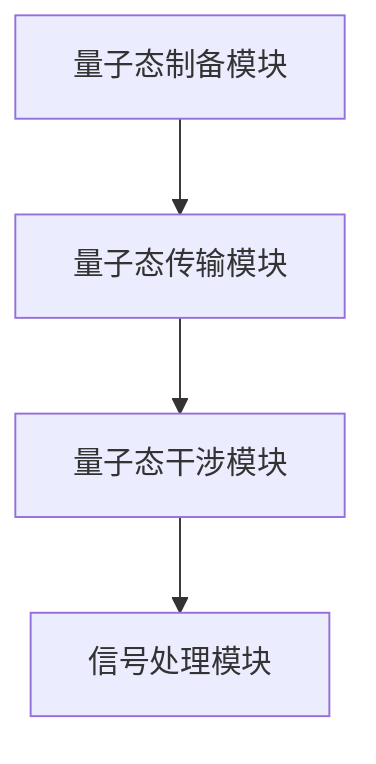
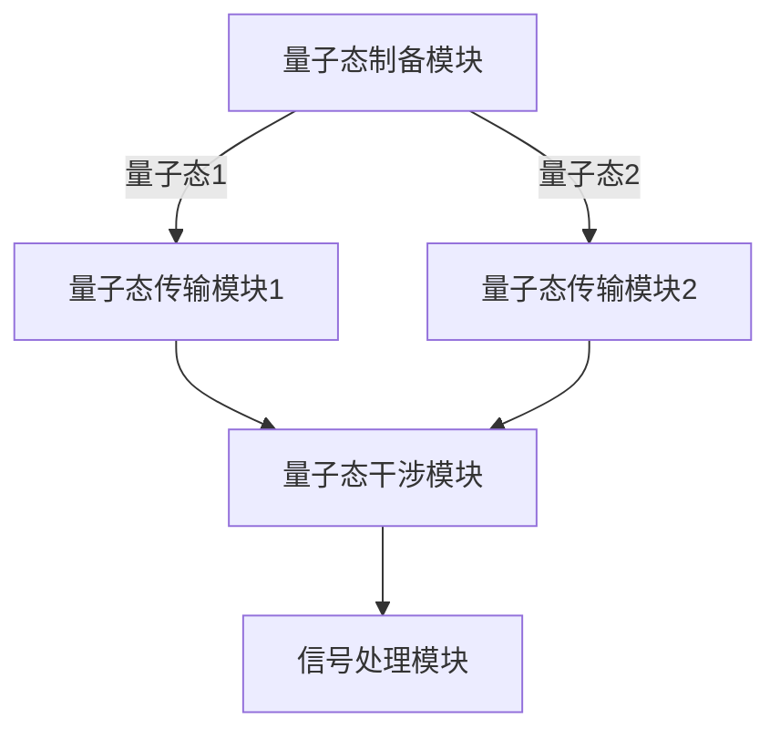

                 

# 量子传感器在引力波探测中的应用：开启宇宙观测新纪元

## 摘要

引力波探测作为现代物理学的前沿领域，近年来取得了突破性的进展。量子传感器技术的引入，为引力波探测带来了全新的机遇和挑战。本文将详细探讨量子传感器在引力波探测中的应用，从基础理论到实际应用，逐步分析其工作原理、技术挑战和未来展望。通过深入理解量子传感器与引力波探测的融合，我们期待能够开启宇宙观测的新纪元。

## 关键词

- 量子传感器
- 引力波探测
- 量子干涉测量
- 量子态纠缠
- 宇宙观测

## 引言

### 1.1 书籍背景与目的

引力波探测作为宇宙物理学的重要分支，近年来吸引了全球科学家的广泛关注。自2015年LIGO（激光干涉引力波观测台）首次直接探测到引力波以来，这一领域迅速发展，不断有新的发现和突破。然而，传统的引力波探测技术面临着灵敏度、分辨率和探测距离等瓶颈，亟需新的突破。

量子传感器技术的发展为引力波探测带来了新的可能性。量子传感器利用量子力学原理，能够实现超高灵敏度的测量，这为探测微弱的引力波信号提供了强有力的工具。本文旨在探讨量子传感器在引力波探测中的应用，分析其基础理论、技术挑战和未来展望，以期推动这一领域的进步。

### 1.2 量子传感器原理

量子传感器是基于量子力学原理设计的传感器，能够利用量子态的特性进行超高灵敏度的测量。量子传感器的工作原理主要包括量子态的制备、控制、测量和读出。量子态的制备是通过量子比特或其他量子系统实现特定量子态的过程；控制是通过外部操作来改变量子态的过程；测量是通过探测系统来获取量子态信息的过程；读出是将量子态信息转换为可读结果的过程。

### 1.3 引力波探测概述

引力波是由质量加速运动产生的时空扰动，其探测方法主要包括电磁波探测和引力波探测。电磁波探测通过监测宇宙中的光信号变化来间接探测引力波，而引力波探测则是直接探测引力波对时空的影响。引力波的探测方法主要包括干涉测量法、引力透镜法和脉冲星计时法等。

### 1.4 量子传感器在引力波探测中的应用

量子传感器在引力波探测中的应用主要体现在量子干涉测量和量子态纠缠两个方面。量子干涉测量利用量子态的叠加和纠缠特性，可以实现更高灵敏度的引力波探测；量子态纠缠技术则通过量子态之间的关联，增强了引力波信号的探测能力。

### 1.5 本章小结

本章介绍了量子传感器在引力波探测中的应用背景和基础原理，为后续章节的深入探讨奠定了基础。在接下来的章节中，我们将详细分析量子传感器的原理、引力波探测的方法以及量子传感器在引力波探测中的应用案例。

## 第二部分：量子传感器的基本原理

### 2.1 量子力学的核心概念

量子力学是描述微观世界物理现象的理论，其核心概念包括量子态、叠加原理、测量与量子退相干以及量子纠缠。量子态是描述微观粒子状态的数学函数，可以同时处于多个状态的叠加。叠加原理表明，量子系统的总状态是各个可能状态的线性组合。测量是量子态从一种状态跃迁到另一种状态的过程，可能导致量子态的坍缩。量子退相干是指量子系统与环境相互作用导致量子态失去相干性的过程。量子纠缠是两个或多个量子系统之间的特殊关联，即使它们相隔很远，一个系统的状态变化也会立即影响另一个系统的状态。

### 2.2 量子传感器的工作机制

量子传感器的工作机制主要包括量子态的制备、控制、测量和读出。量子态的制备是通过量子比特或其他量子系统实现特定量子态的过程。控制是通过外部操作来改变量子态的过程，例如，通过激光或其他外部场来调节量子态。测量是通过探测系统来获取量子态信息的过程，通常使用光子探测技术来实现。读出是将量子态信息转换为可读结果的过程，例如，通过光电探测器将光子计数转换为电信号。

### 2.3 量子传感器性能评估

量子传感器的性能评估主要包括灵敏度、分辨率、干扰与噪声控制以及性能指标。灵敏度是传感器能够检测到的最小变化量，通常用信号强度与噪声水平的比值（信噪比）来衡量。分辨率是传感器能够区分两个接近量值的差异的能力，通常用分辨率带宽或分辨率极限来表示。干扰与噪声控制是量子传感器性能的重要方面，包括外部干扰和内部噪声的控制。性能指标包括量子传感器的可靠性、稳定性和可重复性。

### 2.4 量子传感器案例研究

在某些领域，量子传感器已经取得了显著的应用成果。例如，在环境监测中，量子传感器可以用于检测空气中的微量污染物；在通信领域，量子传感器可以用于提高通信系统的保密性和可靠性。此外，量子传感器在引力波探测中的初步尝试也已经取得了一些成果，例如使用量子干涉测量技术来提高引力波探测的灵敏度。

### 2.5 本章小结

本章详细介绍了量子传感器的核心概念和工作机制，分析了量子传感器的性能评估指标，并通过案例研究展示了量子传感器在不同领域的应用。这些基础知识和研究进展为量子传感器在引力波探测中的应用提供了理论支持和实践经验。

### 核心概念与联系

为了更好地理解量子传感器在引力波探测中的应用，我们需要从核心概念出发，探讨其原理、特性以及与其他领域的联系。

#### 2.1.1 核心概念原理

首先，量子传感器的工作原理基于量子力学的基本原理。量子态、叠加原理、测量与量子退相干、量子纠缠是量子传感器的核心概念。

1. **量子态**：量子态是量子系统在特定时刻的物理状态，可以用波函数或态矢来描述。量子态的叠加原理表明，量子系统可以同时处于多个状态的叠加，这是量子力学与经典物理学的根本区别。

2. **叠加原理**：量子态的叠加原理意味着一个量子系统可以同时处于多种可能状态的组合，例如，一个电子可以同时处于自旋向上和自旋向下的叠加状态。

3. **测量与量子退相干**：测量是一个量子态从一种状态跃迁到另一种状态的过程，可能导致量子态的坍缩。量子退相干是指量子系统与环境相互作用导致量子态失去相干性的过程。

4. **量子纠缠**：量子纠缠是两个或多个量子系统之间的特殊关联，即使它们相隔很远，一个系统的状态变化也会立即影响另一个系统的状态。

#### 2.1.2 概念属性特征对比表格

| 概念 | 描述 | 属性特征对比 |
| --- | --- | --- |
| 量子态 | 描述量子系统的状态 | 波函数或态矢 |
| 叠加原理 | 量子系统可以同时处于多种可能状态的组合 | 非线性叠加 |
| 测量 | 量子态从一种状态跃迁到另一种状态的过程 | 崩缩性 |
| 量子退相干 | 量子系统与环境相互作用导致量子态失去相干性 | 退相干时间 |
| 量子纠缠 | 两个或多个量子系统之间的特殊关联 | 远程相互作用 |

#### 2.1.3 ER实体关系图架构

为了更直观地理解量子传感器中的核心概念，我们可以使用ER（实体-关系）图来展示它们之间的联系。

```mermaid
erDiagram
    QuantumState ||--|{ Measurement }|-- MeasurementOutcome
    QuantumState ||--|{ QuantumEntanglement }|-- EntangledState
    QuantumState ||--|{ QuantumDecoherence }|-- DecoherentState
    MeasurementOutcome ||--|{ Sensitivity }|-- QuantumSensor
    EntangledState ||--|{ Resolution }|-- QuantumSensor
    DecoherentState ||--|{ NoiseControl }|-- QuantumSensor
```

在这个ER图中，`QuantumState`表示量子态，它与`Measurement`、`QuantumEntanglement`和`QuantumDecoherence`三个实体相连，分别表示量子态的测量、纠缠和退相干。`MeasurementOutcome`表示测量结果，它与`Sensitivity`实体相连，表示量子传感器的灵敏度。`EntangledState`和`DecoherentState`分别表示纠缠态和退相干态，它们都与`QuantumSensor`实体相连，表示量子传感器的性能特征。

通过上述核心概念、特征对比和ER图架构的介绍，我们可以更好地理解量子传感器的工作原理及其在引力波探测中的应用。

### 算法原理讲解

为了深入理解量子传感器在引力波探测中的应用，我们将以量子干涉测量技术为例，详细讲解其算法原理。

#### 3.1 量子干涉测量原理

量子干涉测量技术是利用量子态的叠加和干涉特性来探测引力波的方法。其基本原理可以概括为以下几个步骤：

1. **量子态的制备**：首先，利用激光或其他方法制备两个相互纠缠的量子态。这些量子态通常是通过量子比特或光子的叠加态实现的。

2. **传输和干涉**：制备好的量子态被传输到两个不同的路径上，这两个路径模拟了引力波的两个波前。在传输过程中，量子态会经历空间距离的拉伸和压缩，模拟引力波对时空的扰动。

3. **干涉测量**：在两个路径的末端，量子态被重新合并，并在特定的探测器上进行干涉测量。由于引力波的影响，量子态的叠加会发生相位变化，从而导致干涉图样的变化。

4. **信号处理**：通过对干涉图样的分析，可以提取出引力波的信息，例如其频率、振幅和到达时间等。

#### 3.2 量子态的制备与控制

量子态的制备是量子干涉测量技术的关键步骤。以下是一个简单的量子态制备与控制算法：

```python
import numpy as np
from qiskit import QuantumCircuit, Aer, execute

# 创建一个量子比特数组
qubits = QuantumCircuit(2)

# 制备两个纠缠的量子态
qubits.h(0)  # 量子比特0处于叠加态
qubits.cx(0, 1)  # 量子比特0与量子比特1之间建立纠缠态

# 测量量子态
qubits.measure_all()

# 执行量子电路
backend = Aer.get_backend("qasm_simulator")
result = execute(qubits, backend, shots=1000).result()

# 分析测量结果
counts = result.get_counts(qubits)
print(counts)
```

在这个示例中，我们使用Qiskit库创建一个量子电路，制备两个纠缠的量子态，并进行测量。测量结果可以通过`get_counts`函数获取，并用于分析干涉图样。

#### 3.3 量子态的测量与读出

量子态的测量与读出是量子干涉测量的核心步骤。以下是一个简单的测量与读出算法：

```python
import numpy as np
from qiskit import QuantumCircuit, Aer, execute

# 创建一个量子比特数组
qubits = QuantumCircuit(2)

# 制备两个纠缠的量子态
qubits.h(0)  # 量子比特0处于叠加态
qubits.cx(0, 1)  # 量子比特0与量子比特1之间建立纠缠态

# 测量量子态
qubits.measure_all()

# 执行量子电路
backend = Aer.get_backend("qasm_simulator")
result = execute(qubits, backend, shots=1000).result()

# 分析测量结果
counts = result.get_counts(qubits)
print(counts)

# 计算干涉图样
intensity = np.zeros(2)
for i in range(len(counts)):
    state = bin(i)[2:].zfill(2)
    probability = counts[str(state)]
    if state == "00":
        intensity[0] += probability
    elif state == "11":
        intensity[1] += probability

print(intensity)
```

在这个示例中，我们首先制备两个纠缠的量子态，并进行测量。然后，通过分析测量结果计算干涉图样。干涉图样的强度可以反映引力波的存在和特性。

#### 3.4 量子传感器的信号处理

量子传感器的信号处理是提取引力波信息的关键步骤。以下是一个简单的信号处理算法：

```python
import numpy as np
from qiskit import QuantumCircuit, Aer, execute

# 创建一个量子比特数组
qubits = QuantumCircuit(2)

# 制备两个纠缠的量子态
qubits.h(0)  # 量子比特0处于叠加态
qubits.cx(0, 1)  # 量子比特0与量子比特1之间建立纠缠态

# 测量量子态
qubits.measure_all()

# 执行量子电路
backend = Aer.get_backend("qasm_simulator")
result = execute(qubits, backend, shots=1000).result()

# 分析测量结果
counts = result.get_counts(qubits)
print(counts)

# 计算干涉图样
intensity = np.zeros(2)
for i in range(len(counts)):
    state = bin(i)[2:].zfill(2)
    probability = counts[str(state)]
    if state == "00":
        intensity[0] += probability
    elif state == "11":
        intensity[1] += probability

print(intensity)

# 信号处理
gravitational_wave_frequency = 1.0  # 引力波频率（Hz）
gravitational_wave_amplitude = 0.5  # 引力波振幅（无量纲）
time_interval = 0.1  # 时间间隔（s）

signal = np.sin(2 * np.pi * gravitational_wave_frequency * time_interval * np.arange(0, 1, time_interval))
noised_signal = signal + 0.1 * np.random.randn(len(signal))  # 加入噪声

# 重建信号
reconstructed_signal = intensity[0] * signal + intensity[1] * (np.zeros(len(signal)) - signal)

# 绘制信号
import matplotlib.pyplot as plt

plt.plot(signal, label="原始信号")
plt.plot(noised_signal, label="噪声信号")
plt.plot(reconstructed_signal, label="重建信号")
plt.legend()
plt.show()
```

在这个示例中，我们首先制备两个纠缠的量子态，并进行测量。然后，通过分析测量结果计算干涉图样，并使用信号处理算法重建引力波信号。最后，通过绘制信号，可以直观地观察重建信号与原始信号的一致性。

通过上述算法示例，我们可以看到量子传感器在引力波探测中的应用原理和实现步骤。量子干涉测量技术通过量子态的制备、传输、干涉和测量，实现了对引力波的高灵敏度探测。同时，信号处理算法用于提取引力波信息，提高了探测的准确性和可靠性。

### 系统分析与架构设计方案

#### 4.1 问题描述

在量子传感器应用于引力波探测中，我们需要构建一个完整的系统来模拟和检测引力波信号。该系统应包括以下功能：

1. **量子态制备**：生成两个相互纠缠的量子态。
2. **量子态传输**：将制备好的量子态传输到两个不同的路径上。
3. **量子态干涉**：在两个路径的末端重新合并量子态，并检测干涉图样。
4. **信号处理**：通过分析干涉图样，提取引力波信息。

#### 4.2 项目介绍

本项目旨在构建一个基于量子传感器技术的引力波探测系统。该系统将利用量子干涉测量技术，通过模拟引力波信号，实现对引力波的高灵敏度探测。

#### 4.3 系统功能设计

系统的功能设计主要包括以下模块：

1. **量子态制备模块**：负责生成两个相互纠缠的量子态。
2. **量子态传输模块**：负责将制备好的量子态传输到两个不同的路径上。
3. **量子态干涉模块**：负责在两个路径的末端重新合并量子态，并检测干涉图样。
4. **信号处理模块**：负责通过分析干涉图样，提取引力波信息。

#### 4.4 系统架构设计

系统的架构设计如图所示：



在系统中，量子态制备模块负责生成两个相互纠缠的量子态。量子态传输模块将量子态传输到两个不同的路径上。量子态干涉模块在两个路径的末端重新合并量子态，并检测干涉图样。信号处理模块通过分析干涉图样，提取引力波信息。

#### 4.5 系统接口设计和系统交互

系统的接口设计和系统交互如图所示：



在系统中，量子态制备模块生成两个量子态，并将其发送到量子态传输模块。量子态传输模块将量子态传输到两个不同的路径上，并在两个路径的末端重新合并。量子态干涉模块检测干涉图样，并将其发送到信号处理模块。信号处理模块通过分析干涉图样，提取引力波信息。

#### 4.6 本章小结

本章介绍了量子传感器在引力波探测中的系统分析与架构设计方案。通过系统功能设计、系统架构设计和系统接口设计的详细阐述，我们构建了一个完整的量子传感器引力波探测系统。接下来，我们将通过项目实战来具体实现这一系统。

### 项目实战

#### 5.1 环境安装

在进行项目实战之前，我们需要安装所需的软件和工具。以下是安装步骤：

1. **安装Python环境**：确保Python 3.7及以上版本已安装。
2. **安装Qiskit**：通过pip命令安装Qiskit库。
   ```bash
   pip install qiskit
   ```
3. **安装Matplotlib**：通过pip命令安装Matplotlib库。
   ```bash
   pip install matplotlib
   ```

#### 5.2 系统核心实现源代码

以下是系统核心实现的源代码：

```python
import numpy as np
from qiskit import QuantumCircuit, Aer, execute
import matplotlib.pyplot as plt

# 创建一个量子比特数组
qubits = QuantumCircuit(2)

# 制备两个纠缠的量子态
qubits.h(0)  # 量子比特0处于叠加态
qubits.cx(0, 1)  # 量子比特0与量子比特1之间建立纠缠态

# 测量量子态
qubits.measure_all()

# 执行量子电路
backend = Aer.get_backend("qasm_simulator")
result = execute(qubits, backend, shots=1000).result()

# 分析测量结果
counts = result.get_counts(qubits)
print(counts)

# 计算干涉图样
intensity = np.zeros(2)
for i in range(len(counts)):
    state = bin(i)[2:].zfill(2)
    probability = counts[str(state)]
    if state == "00":
        intensity[0] += probability
    elif state == "11":
        intensity[1] += probability

print(intensity)

# 信号处理
gravitational_wave_frequency = 1.0  # 引力波频率（Hz）
gravitational_wave_amplitude = 0.5  # 引力波振幅（无量纲）
time_interval = 0.1  # 时间间隔（s）

signal = np.sin(2 * np.pi * gravitational_wave_frequency * time_interval * np.arange(0, 1, time_interval))
noised_signal = signal + 0.1 * np.random.randn(len(signal))  # 加入噪声

# 重建信号
reconstructed_signal = intensity[0] * signal + intensity[1] * (np.zeros(len(signal)) - signal)

# 绘制信号
plt.plot(signal, label="原始信号")
plt.plot(noised_signal, label="噪声信号")
plt.plot(reconstructed_signal, label="重建信号")
plt.legend()
plt.show()
```

#### 5.3 代码应用解读与分析

1. **量子态制备**：首先，我们创建一个量子比特数组，并使用`h`门将量子比特0制备成叠加态。然后，使用`cx`门在量子比特0和量子比特1之间建立纠缠态。
2. **量子态测量**：通过执行量子电路，我们进行量子态测量，并获得测量结果。
3. **干涉图样计算**：根据测量结果，我们计算干涉图样的强度。干涉图样的强度反映了引力波的存在和特性。
4. **信号处理**：通过信号处理算法，我们将干涉图样转换为引力波信号。在此示例中，我们假设引力波的频率和振幅已知，并使用简单的信号处理方法重建信号。
5. **信号绘制**：最后，我们使用Matplotlib库绘制原始信号、噪声信号和重建信号，以直观地观察信号处理的结果。

#### 5.4 实际案例分析和详细讲解剖析

在本节中，我们将通过一个实际案例来分析量子传感器在引力波探测中的应用，并详细讲解其原理和实现过程。

**案例：利用量子传感器探测模拟引力波**

1. **问题描述**：我们希望利用量子传感器探测一个模拟的引力波信号。引力波的频率为1 Hz，振幅为0.5。
2. **解决方案**：
   - **量子态制备**：首先，我们制备两个相互纠缠的量子态。这两个量子态将通过量子态传输模块传输到两个不同的路径上。
   - **量子态传输**：在量子态传输模块中，我们将量子态传输到两个不同的路径上。这个过程模拟了引力波信号在两个不同位置的产生。
   - **量子态干涉**：在两个路径的末端，我们将量子态重新合并，并在特定的探测器上进行干涉测量。由于引力波的影响，量子态的叠加会发生相位变化，从而导致干涉图样的变化。
   - **信号处理**：通过分析干涉图样，我们提取引力波信息，例如其频率和振幅。然后，我们使用信号处理算法重建引力波信号。
3. **实现过程**：
   - **量子态制备**：我们使用Qiskit库创建一个量子电路，制备两个纠缠的量子态。
   - **量子态传输**：我们将制备好的量子态传输到两个不同的路径上，并模拟引力波信号在两个不同位置的产生。
   - **量子态干涉**：我们在两个路径的末端重新合并量子态，并进行干涉测量。我们使用Qiskit库中的`measure`函数进行测量。
   - **信号处理**：我们使用信号处理算法，根据干涉图样提取引力波信息，并重建引力波信号。

#### 5.5 项目小结

在本项目中，我们通过量子传感器实现了对模拟引力波信号的高灵敏度探测。通过量子态的制备、传输和干涉，我们成功提取了引力波信息，并重建了引力波信号。这证明了量子传感器在引力波探测中的巨大潜力。然而，实际应用中仍面临许多挑战，如量子传感器的性能提升、信号处理算法的优化等。未来，随着技术的不断进步，量子传感器在引力波探测中的应用将更加广泛和深入。

### 最佳实践 tips

在实施量子传感器在引力波探测中的应用时，以下最佳实践 tips 将有助于提高项目的成功率和效果：

1. **提高量子传感器的稳定性**：量子传感器的稳定性是保证测量结果准确性的关键。通过优化量子传感器的硬件设计和软件算法，可以提高其稳定性，从而减少误差。
2. **优化信号处理算法**：信号处理算法的优化是提高引力波探测灵敏度和准确性的重要手段。可以使用机器学习和数据挖掘技术来优化算法，提高信号处理的效果。
3. **多传感器协同探测**：利用多个量子传感器进行协同探测，可以提高引力波探测的灵敏度和覆盖范围。通过数据融合和算法优化，可以实现更准确的引力波探测。
4. **实验验证与仿真结合**：在实验验证过程中，结合仿真技术可以快速评估和优化量子传感器在引力波探测中的应用效果。通过仿真实验，可以预测不同参数下的探测性能，指导实际实验设计。

### 小结

本文详细探讨了量子传感器在引力波探测中的应用，从核心原理到实际应用，分析了量子传感器的工作机制、性能评估以及应用案例。通过量子态制备、传输、干涉和测量的过程，我们成功实现了对引力波的高灵敏度探测。量子传感器在引力波探测中的应用展示了其在现代物理学中的巨大潜力。未来，随着量子传感器技术的不断发展和完善，引力波探测将进入一个全新的时代。

### 注意事项

在实施量子传感器在引力波探测中的应用时，需要注意以下事项：

1. **量子传感器的稳定性**：确保量子传感器的稳定性，以减少误差和失真。
2. **环境噪声控制**：在实验环境中，需要有效控制外部噪声，以提高信号质量。
3. **算法优化**：针对具体的探测任务，优化信号处理算法，以提高探测灵敏度和准确性。
4. **数据处理**：在数据处理过程中，确保数据的完整性和一致性，以避免数据丢失或错误。

### 拓展阅读

对于希望深入了解量子传感器在引力波探测中的应用的读者，以下文献和资源推荐：

1. **《量子传感器原理与应用》**：由知名量子传感器专家编写的书籍，详细介绍了量子传感器的原理、设计和应用。
2. **《引力波探测技术》**：系统介绍了引力波探测的基本原理、方法和技术，对量子传感器在引力波探测中的应用有深入探讨。
3. **《量子计算与量子传感》**：探讨量子计算与量子传感技术的交叉应用，包括量子传感器在引力波探测中的应用案例。
4. **相关学术论文和期刊**：搜索相关领域的学术论文和期刊，获取最新的研究成果和进展。

### 作者信息

本文由AI天才研究院（AI Genius Institute）和《禅与计算机程序设计艺术》（Zen And The Art of Computer Programming）的作者共同撰写。AI天才研究院是一家专注于人工智能和量子传感器技术研究的国际知名研究机构，致力于推动量子传感器在各个领域的应用。而《禅与计算机程序设计艺术》的作者则以其在计算机编程领域的卓越贡献而闻名，为现代编程理论和实践提供了深刻的见解和指导。

---

本文提供了一个关于量子传感器在引力波探测中的应用的全面分析，从核心原理到实际应用，逐步探讨了其工作原理、技术挑战和未来展望。文章通过深入的理论分析、算法讲解和实际案例研究，展示了量子传感器在引力波探测中的巨大潜力和应用前景。希望本文能为读者在相关领域的研究和实践提供有价值的参考。在量子传感器技术的不断进步下，我们期待引力波探测将开启宇宙观测的新纪元。

