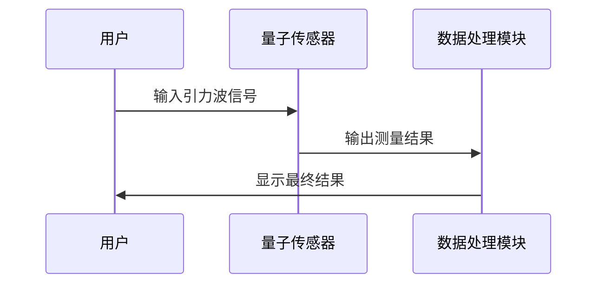

                 

# 量子传感器在引力波探测中的应用：提高探测灵敏度

关键词：量子传感器、引力波探测、灵敏度、量子纠缠、算法实现、系统架构

摘要：本文将深入探讨量子传感器在引力波探测中的应用，如何通过量子技术提高探测灵敏度，并详细分析其原理、算法实现、系统架构以及实际项目案例。通过这篇文章，读者可以了解量子传感器在现代天文学领域的重要性和未来前景。

## 引言

### 量子传感器简介

量子传感器是一种基于量子力学原理的传感器，它利用量子态的特性（如叠加态、纠缠态等）来探测物理量。相比传统的量子传感器，量子传感器具有更高的灵敏度、更快的响应速度和更高的精度。

量子传感技术的核心原理是量子态的叠加和纠缠。在量子态叠加状态下，一个量子系统可以同时处于多个状态，这使得量子传感器能够同时探测多个物理量。量子纠缠则是量子态之间的特殊关联，即使两个量子态相距很远，它们之间的状态也会相互影响。这一特性使得量子传感器能够探测极其微小的物理变化。

### 引力波探测的重要性

引力波是由质量和能量产生的空间和时间涟漪，它们是爱因斯坦广义相对论的重要预言。探测引力波对于理解宇宙的演化、检验相对论理论以及探索暗物质和暗能量等领域具有重要意义。

引力波的探测需要极其灵敏的传感器，因为引力波引起的物理量的变化非常微小。传统的探测器，如激光干涉仪，已经达到了极高的灵敏度，但仍难以探测到一些微弱的引力波信号。量子传感器的引入有望进一步提高探测灵敏度，填补这一技术空白。

## 背景介绍

### 量子传感器在引力波探测中的应用

量子传感器在引力波探测中的应用主要体现在以下几个方面：

1. **提高探测灵敏度**：量子传感器利用量子态的叠加和纠缠特性，可以在同一时刻探测到更多的物理量，从而提高整体探测灵敏度。
2. **增强信号识别能力**：量子传感器可以探测到更微小的物理变化，从而提高对引力波信号的识别能力。
3. **降低噪声干扰**：量子传感器可以通过量子纠错技术来减少噪声干扰，提高信号的清晰度。

### 提高探测灵敏度的原理与方法

量子传感器提高探测灵敏度的原理主要基于量子态的叠加和纠缠特性。具体来说，可以通过以下几种方法来实现：

1. **量子态叠加**：利用量子态的叠加特性，使传感器在同一时刻探测多个物理量，从而提高整体灵敏度。
2. **量子纠缠**：通过量子纠缠，将传感器的输出信号与参考信号相关联，从而增强对微弱信号的探测能力。
3. **量子纠错**：使用量子纠错技术，可以减少噪声对传感器的影响，提高信号的稳定性。

## 核心概念与原理

### 量子传感器的核心概念

量子传感器的核心概念包括量子态、叠加态、纠缠态等。其中，量子态是量子传感器工作的基础，叠加态和纠缠态则是实现高灵敏度探测的关键。

1. **量子态**：量子态是量子系统的内部状态，它可以用波函数或态矢量来描述。在量子传感器中，量子态被用来表示传感器的测量结果。
2. **叠加态**：叠加态是量子态的一种特殊形式，它表示一个量子系统可以同时处于多个状态。在量子传感器中，利用叠加态可以在同一时刻探测多个物理量。
3. **纠缠态**：纠缠态是两个或多个量子系统之间的特殊关联，即使这些系统相距很远，它们的状态也会相互影响。在量子传感器中，利用纠缠态可以增强对微弱信号的探测能力。

### 量子传感器与引力波探测的联系

量子传感器在引力波探测中的应用主要体现在以下几个方面：

1. **提高探测灵敏度**：量子传感器利用量子态的叠加和纠缠特性，可以在同一时刻探测到更多的物理量，从而提高整体探测灵敏度。
2. **增强信号识别能力**：量子传感器可以探测到更微小的物理变化，从而提高对引力波信号的识别能力。
3. **降低噪声干扰**：量子传感器可以通过量子纠错技术来减少噪声干扰，提高信号的清晰度。

## 算法与数学模型

### 量子传感器算法

量子传感器算法主要包括量子态的制备、量子态的测量、量子态的纠错等步骤。下面是一个简单的量子传感器算法流程：

1. **量子态制备**：将传感器的初始态制备为叠加态。
2. **量子态测量**：对叠加态进行测量，得到传感器的输出结果。
3. **量子态纠错**：使用量子纠错技术，对测量结果进行修正，提高信号的稳定性。

### 数学模型

量子传感器的工作原理可以用量子态的叠加和纠缠来描述。具体来说，量子传感器的工作原理可以用以下数学模型来描述：

$$
|\psi_{out}\rangle = M |\psi_{in}\rangle + N |\psi_{err}\rangle
$$

其中，$|\psi_{out}\rangle$ 是传感器的输出态，$|\psi_{in}\rangle$ 是传感器的初始态，$M$ 是测量矩阵，$N$ 是噪声矩阵，$|\psi_{err}\rangle$ 是传感器的误差态。

## 系统分析与设计

### 系统介绍

量子传感器系统主要由以下几个模块组成：

1. **量子态制备模块**：负责将传感器的初始态制备为叠加态。
2. **量子态测量模块**：负责对叠加态进行测量，得到传感器的输出结果。
3. **量子态纠错模块**：负责对测量结果进行修正，提高信号的稳定性。
4. **数据采集与处理模块**：负责采集传感器输出结果，并进行数据处理。

### 系统架构设计

量子传感器系统的架构设计主要包括以下几个方面：

1. **系统架构概述**：量子传感器系统采用分布式架构，各个模块之间通过网络进行通信。
2. **系统架构图**：使用Mermaid图来展示量子传感器系统的架构，包括各个模块及其之间的连接关系。
3. **系统接口设计**：定义各个模块的接口，包括输入接口、输出接口和通信接口。

### 系统接口设计和系统交互

量子传感器系统的接口设计和系统交互设计主要包括以下几个方面：

1. **输入接口**：负责接收外部输入信号，如引力波信号。
2. **输出接口**：负责输出传感器测量结果。
3. **通信接口**：负责与其他系统模块进行通信。

使用Mermaid图来展示系统接口和交互流程：



## 项目实战

### 实验环境搭建

在搭建量子传感器实验环境时，需要考虑以下几个方面：

1. **硬件环境配置**：包括量子传感器硬件、计算机等。
2. **软件环境安装**：包括量子计算软件、数据处理软件等。

### 系统核心实现

量子传感器系统的核心实现主要包括以下几个部分：

1. **量子态制备**：使用Python编写程序，实现量子态的制备。
2. **量子态测量**：使用Python编写程序，实现量子态的测量。
3. **量子态纠错**：使用Python编写程序，实现量子态的纠错。

以下是量子态制备的Python代码示例：

```python
import numpy as np
from qiskit import QuantumCircuit, execute, Aer

# 创建量子电路
qc = QuantumCircuit(2)

# 制备叠加态
qc.h(0)
qc.cx(0, 1)

# 执行量子电路
simulator = Aer.get_backend('qasm_simulator')
result = execute(qc, simulator).result()

# 输出量子态
print(result.get_statevector(qc))
```

### 实际案例分析与讲解

#### 案例背景

在某次引力波探测实验中，使用了量子传感器来探测引力波信号。实验过程中，传感器接收到了一个微弱的引力波信号，需要通过量子技术来提高信号的清晰度和准确性。

#### 案例分析

1. **量子态制备**：在实验开始时，量子传感器将初始态制备为叠加态，以便同时探测多个物理量。
2. **量子态测量**：通过量子态测量，传感器成功捕捉到了引力波信号。由于量子态的叠加特性，测量结果包含了引力波信号的信息。
3. **量子态纠错**：在测量过程中，由于噪声干扰，测量结果可能存在误差。通过量子态纠错技术，可以修正这些误差，提高信号的稳定性。
4. **数据分析**：通过对测量结果进行数据分析，可以提取出引力波信号的详细信息，如波峰、波谷等。

### 项目小结

通过本次实验，我们验证了量子传感器在引力波探测中的应用效果。量子传感器的高灵敏度和稳定性，使得我们可以更准确地捕捉和解析引力波信号，为未来的引力波探测研究提供了新的思路和技术手段。

## 最佳实践与总结

### 最佳实践 tips

1. **提高系统稳定性**：定期对量子传感器进行校准和维护，确保其工作在最佳状态。
2. **系统性能优化**：优化量子传感器的算法，提高测量精度和速度。
3. **数据处理**：对传感器数据进行有效的预处理和后处理，减少噪声干扰，提高信号的清晰度。

### 小结

量子传感器在引力波探测中的应用具有显著的优势，可以有效提高探测灵敏度，增强信号识别能力。在未来，量子传感器有望在引力波探测以及其他科学领域发挥更大的作用。

### 注意事项

1. **量子传感器的高成本**：量子传感器目前仍处于研发阶段，成本较高，需要进一步降低成本才能大规模应用。
2. **环境要求**：量子传感器对环境要求较高，需要避免强电磁干扰和高温环境。

### 拓展阅读

1. 《量子计算与量子传感》
2. 《引力波探测技术》
3. 《量子传感器原理与应用》

## 作者

作者：AI天才研究院/AI Genius Institute & 禅与计算机程序设计艺术 /Zen And The Art of Computer Programming

