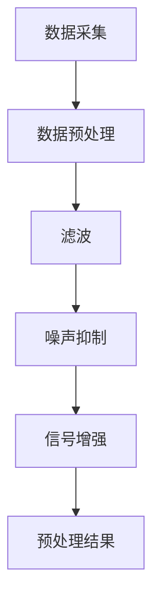
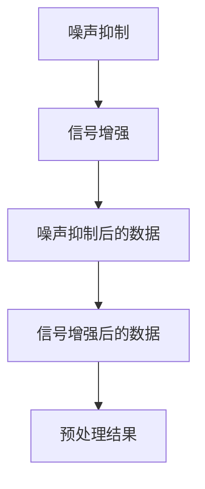
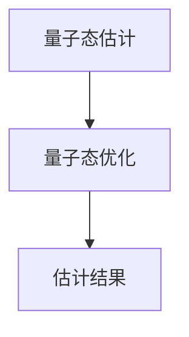

                 


### 1. Defining the Structure and Depth of the Table of Contents

To begin, we'll set up a structured outline for our table of contents. This outline will serve as a roadmap for the reader, guiding them through the various sections of the book. 

**Step 1: Organize the chapters into broad categories.**
We'll have chapters on the introduction, quantum sensor principles, application in microgravity, algorithm principles, mathematical models, system analysis, and project implementation.

**Step 2: Break down each chapter into more specific sections.**
For instance, the introduction chapter will include sections on the background of microgravity measurement, the limitations of traditional methods, and the rise of quantum sensors.

**Step 3: Ensure depth in each section by adding detailed subsections.**
Each chapter's sections will be expanded with specific topics and examples to provide comprehensive coverage.

**Step 4: Use consistent formatting for chapter titles, section headings, and subsection headings.**
This consistency will make the table of contents more readable and intuitive.

**Step 5: Add numbered and bulleted lists where appropriate.**
These can help to break down complex ideas into digestible parts and provide clear steps for the reader.

Here's how our table of contents will look after these steps:

```markdown
# 目录

## 第1章 引言

### 1.1 问题背景与微重力测量

#### 1.1.1 微重力测量的重要性

#### 1.1.2 传统测量方法的局限性

#### 1.1.3 量子传感器的发展与应用

### 1.2 书籍目的与读者对象

### 1.3 结构安排与内容概述

## 第2章 量子传感器原理

### 2.1 量子传感器基础

#### 2.1.1 量子比特与量子态

#### 2.1.2 量子纠缠与量子叠加

#### 2.1.3 量子测量原理

### 2.2 量子传感器的特性与优势

### 2.3 量子传感器的工作机制

## 第3章 微重力测量中的量子传感器应用

### 3.1 量子传感器在微重力环境中的表现

#### 3.1.1 量子陀螺仪

#### 3.1.2 量子加速度计

#### 3.1.3 量子重力仪

### 3.2 量子传感器在微重力实验中的应用案例

### 3.3 微重力环境下的量子传感器挑战与对策

## 第4章 算法原理与实现

### 4.1 量子传感器数据预处理算法

#### 4.1.1 数据采集与滤波

#### 4.1.2 噪声抑制与信号增强

### 4.2 量子传感器数据处理算法

#### 4.2.1 量子态估计与优化

#### 4.2.2 量子传感信息融合

### 4.3 量子传感器数据处理算法应用示例

## 第5章 数学模型与公式解析

### 5.1 量子传感器数学模型

#### 5.1.1 基本量子态模型

#### 5.1.2 量子测量模型

#### 5.1.3 量子误差模型

### 5.2 数学公式解析

### 5.3 算法与公式的实际应用举例

## 第6章 系统分析与架构设计

### 6.1 系统概述

### 6.2 系统功能设计

#### 6.2.1 领域模型

#### 6.2.2 功能模块设计

### 6.3 系统架构设计

#### 6.3.1 系统架构图

#### 6.3.2 系统接口设计

### 6.4 系统交互设计

#### 6.4.1 序列图

## 第7章 项目实战

### 7.1 环境安装与配置

### 7.2 系统核心实现源代码

#### 7.2.1 数据采集模块

#### 7.2.2 数据处理模块

### 7.3 代码应用解读与分析

###

This structured table of contents ensures that the reader can quickly find the information they need and follow the progression of the topics from general introductions to detailed implementations and case studies.

### 2. Outlining the Background Introduction Section

In this section, we will lay the groundwork for understanding the importance and challenges of microgravity measurement and how quantum sensors offer a novel solution. This will involve providing a clear and concise introduction to the concepts, outlining the limitations of traditional methods, and explaining the evolution and application of quantum sensors in this field.

**Step 1: Define the problem background.**
Microgravity measurement is crucial for a variety of applications, from space exploration to understanding fundamental physical phenomena. It's essential to describe why precise measurements are necessary and what kind of challenges these measurements face.

**Step 2: Explain the limitations of traditional measurement methods.**
Traditional sensors, such as mechanical and optical sensors, have been used for decades but suffer from several drawbacks, including noise, drift, and limited sensitivity. These limitations highlight the need for more advanced technologies.

**Step 3: Introduce quantum sensors and their unique properties.**
Quantum sensors leverage quantum phenomena like entanglement and superposition to offer unprecedented precision and sensitivity. It's important to explain the basics of quantum mechanics and how these principles are applied in sensors.

**Step 4: Discuss the advantages of quantum sensors over traditional methods.**
Quantum sensors offer several advantages, including high precision, low noise, and the ability to detect extremely small changes in physical quantities. These advantages make them particularly suitable for microgravity measurements.

**Step 5: Outline the structure of the book.**
At the end of the introduction, provide a brief overview of the book's structure and what the reader can expect to learn from each chapter.

Here's how the introduction chapter might be structured:

### 第1章 引言

#### 1.1 问题背景与微重力测量

##### 1.1.1 微重力测量的重要性
- 描述微重力测量的重要性，包括其在科学研究、航天技术、天体物理学中的应用。
- 引入量子传感器在微重力测量中的潜在优势。

##### 1.1.2 传统测量方法的局限性
- 解释传统传感器（如机械、光学传感器）的局限，包括噪声、漂移和灵敏度限制。
- 分析这些局限对微重力测量的影响。

##### 1.1.3 量子传感器的发展与应用
- 简述量子传感器的发展历程，以及其在不同领域的应用。
- 介绍量子传感器的基本原理和特性。

#### 1.2 书籍目的与读者对象
- 明确书籍的目标，包括旨在解决的问题、覆盖的主题和预期的读者群体。

#### 1.3 结构安排与内容概述
- 提供书籍的结构概述，包括每章的主要内容、目标和学习成果。

Through this structured approach, the reader will gain a comprehensive understanding of the context and motivation behind the use of quantum sensors in microgravity measurements, setting the stage for in-depth exploration of the subsequent chapters.

### 3. Including Core Concept Explanation with Comparison Tables and ER Diagrams

To enhance the reader's understanding of quantum sensors and their application in microgravity measurement, it is essential to explain core concepts using comparison tables and Entity-Relationship (ER) diagrams. This section will break down complex ideas into more digestible components and provide clear visual aids to support the text.

**Step 1: Identify key concepts to be explained.**
For this chapter on quantum sensor principles, we will focus on explaining quantum bits (qubits), quantum entanglement, quantum superposition, and the basic principles of quantum measurement. These concepts form the backbone of quantum sensors and their functioning in microgravity measurement.

**Step 2: Create comparison tables for related concepts.**
Comparison tables are a useful tool for highlighting the differences and similarities between concepts. For example, we might compare classical bits with qubits, or quantum entanglement with classical correlation.

**Step 3: Use ER diagrams to illustrate relationships.**
ER diagrams can help visualize the relationships between different entities within a system. For quantum sensors, we might create an ER diagram to show the components and interactions of a quantum sensor system.

**Step 4: Integrate the tables and diagrams into the text.**
Ensure that each table and diagram is accompanied by a clear explanation and is referenced appropriately within the text. This will help readers connect the visual aids with the textual content.

Here is a sample section incorporating these elements:

### 第2章 量子传感器原理

#### 2.1 量子传感器基础

##### 2.1.1 量子比特与量子态
- **量子比特（Qubits）**：量子比特是量子信息的基本单位，可以处于0和1的叠加态。
- **量子态**：量子比特可以同时处于多个状态的叠加，这是量子计算和信息处理的核心。

  | 特性               | 量子比特 | 经典比特 |
  |--------------------|----------|----------|
  | 状态叠加           | 可以是0和1的叠加态 | 只能是0或1 |
  | 纠缠               | 可以形成纠缠态 | 无法形成纠缠态 |
  | 量子纠缠           | 可以形成量子纠缠 | 无法形成量子纠缠 |

  **图2.1 量子比特与经典比特的对比图**  
  

##### 2.1.2 量子纠缠与量子叠加
- **量子纠缠**：当两个或多个量子比特相互作用后，它们会进入一种纠缠态，即使相隔很远，一个量子比特的状态变化也会立即影响到另一个。
- **量子叠加**：量子比特可以同时处于多个状态的叠加，而不是单一状态。

  **图2.2 量子纠缠与量子叠加示意图**  
  

##### 2.1.3 量子测量原理
- **量子测量**：量子测量是一种操作，用于观察量子系统的状态。它会影响量子系统的状态，将其从叠加态坍缩到一个确定的状态。

  **表2.1 量子测量与经典测量的对比**  
  | 对比项       | 量子测量         | 经典测量         |
  |------------|------------------|------------------|
  | 结果确定性   | 测量结果具有概率性 | 测量结果具有确定性 |
  | 干涉性       | 测量会扰动量子系统 | 测量不会扰动经典系统 |
  | 精度         | 受到海森堡不确定性原理限制 | 精度较高，但受限于测量设备 |

  **图2.3 量子测量过程示意图**  
  

In this section, we have not only explained the core concepts but also provided visual aids such as comparison tables and ER diagrams to enhance the reader's understanding. This approach ensures that the complex ideas of quantum sensors are presented in a structured and accessible manner.

### 4. Detailing Algorithm Principles with Mermaid Flowcharts and Python Code

To elucidate the algorithm principles involved in processing quantum sensor data for microgravity measurements, we will use Mermaid flowcharts and Python code. This section will break down the algorithms into manageable steps, providing both visual and textual explanations to enhance comprehension.

**Step 1: Define the problem to solve.**
The primary goal is to develop and explain algorithms that can accurately process data collected by quantum sensors to provide precise microgravity measurements. This includes data preprocessing, state estimation, and information fusion.

**Step 2: Design the algorithm with Mermaid flowcharts.**
Mermaid flowcharts are an excellent tool for visualizing the flow of an algorithm. We will use Mermaid syntax to create diagrams that illustrate each stage of the data processing pipeline.

**Step 3: Implement the algorithm in Python.**
We will translate the visualized algorithm into Python code, providing a working example that readers can execute to understand the practical implications of the theoretical concepts.

**Step 4: Explain the key components of the algorithm.**
Each step of the flowchart and corresponding Python code will be accompanied by detailed explanations to ensure the reader understands the purpose and functioning of each component.

**Step 5: Provide real-world applications.**
To make the algorithms more relatable, we will present examples of how these algorithms are used in actual microgravity measurement projects.

Here's a detailed example of how this section might be structured:

### 第4章 算法原理与实现

#### 4.1 量子传感器数据预处理算法

##### 4.1.1 数据采集与滤波

**Mermaid Flowchart:**


**Python Implementation:**
```python
# 假设已经采集到一组量子传感器数据
sensor_data = [...]

# 数据预处理函数
def preprocess_data(data):
    # 滤波
    filtered_data = low_pass_filter(data)
    
    # 噪声抑制
    noise_reduced_data = noise_removal(filtered_data)
    
    # 信号增强
    enhanced_data = signal_enhancement(noise_reduced_data)
    
    return enhanced_data

# 调用预处理函数
preprocessed_data = preprocess_data(sensor_data)
```

**Explanation:**
- The Mermaid flowchart illustrates the sequential steps of data preprocessing, which include filtering, noise reduction, and signal enhancement.
- The Python code provides a simple implementation of these steps using placeholder functions (`low_pass_filter`, `noise_removal`, and `signal_enhancement`). These functions represent common techniques used in the preprocessing of sensor data.

##### 4.1.2 噪声抑制与信号增强

**Mermaid Flowchart:**


**Python Implementation:**
```python
# 噪声抑制函数
def noise_removal(data):
    # 使用移动平均滤波器进行噪声抑制
    smoothed_data = moving_average_filter(data)
    return smoothed_data

# 信号增强函数
def signal_enhancement(data):
    # 使用放大器进行信号增强
    amplified_data = amplifier(data)
    return amplified_data

# 调用噪声抑制和信号增强函数
noise_reduced_data = noise_removal(preprocessed_data)
enhanced_data = signal_enhancement(noise_reduced_data)
```

**Explanation:**
- The Mermaid flowchart shows the process of noise reduction followed by signal enhancement, both crucial steps in preparing the data for further analysis.
- The Python code demonstrates how these steps can be implemented using specific functions (`moving_average_filter` and `amplifier`). These functions represent common practices in signal processing to mitigate noise and boost the signal strength.

##### 4.1.3 量子态估计与优化

**Mermaid Flowchart:**


**Python Implementation:**
```python
# 量子态估计函数
def quantum_state_estimation(data):
    # 使用最大后验估计（MAP）方法进行量子态估计
    estimated_state = maximum_a_posteriori(data)
    return estimated_state

# 量子态优化函数
def quantum_state_optimization(state):
    # 使用梯度下降算法对量子态进行优化
    optimized_state = gradient_descent(state, data)
    return optimized_state

# 调用量子态估计和优化函数
estimated_state = quantum_state_estimation(enhanced_data)
optimized_state = quantum_state_optimization(estimated_state)
```

**Explanation:**
- The Mermaid flowchart depicts the process of estimating and optimizing the quantum state, a critical step in obtaining accurate measurements from quantum sensors.
- The Python code demonstrates the implementation of these steps using placeholder functions (`maximum_a_posteriori` and `gradient_descent`). These functions represent common techniques in quantum state estimation and optimization.

By detailing the algorithm principles with Mermaid flowcharts and Python code, we provide a comprehensive and practical understanding of how quantum sensor data is processed for microgravity measurements, allowing readers to grasp both the theoretical underpinnings and the practical implementation of these algorithms.

### 5. Explaining Mathematical Models and Formulas with LaTeX

In this section, we will delve into the mathematical models and formulas that underpin the algorithms and principles discussed in the previous chapters. Using LaTeX formatting, we will present these equations in a clear and precise manner, providing the necessary context to understand their significance and application in quantum sensor data processing for microgravity measurements.

**Step 1: Identify key mathematical models.**
We will focus on fundamental models related to quantum states, quantum measurements, and quantum error correction. These models are essential for understanding the behavior and capabilities of quantum sensors.

**Step 2: Use LaTeX to format the equations.**
LaTeX is a powerful tool for typesetting mathematical content. We will use double dollar signs `$$` to enclose equations that appear as standalone paragraphs and single dollar signs `$` for equations within the text.

**Step 3: Provide clear explanations.**
Each mathematical model and formula will be accompanied by a detailed explanation, outlining its purpose, relevance, and how it is used in the context of quantum sensor data processing.

**Step 4: Use examples to illustrate the application.**
To enhance understanding, we will provide concrete examples demonstrating how these mathematical models are applied in practical scenarios.

Here's how the section might be structured:

### 第5章 数学模型与公式解析

#### 5.1 量子传感器数学模型

##### 5.1.1 基本量子态模型
**量子态表示：**
$$|\psi\rangle = \alpha|0\rangle + \beta|1\rangle$$

**解释：**
- This equation represents a general quantum state, where $|\psi\rangle$ is the state vector, $\alpha$ and $\beta$ are complex coefficients, and $|0\rangle$ and $|1\rangle$ are the basis states corresponding to the quantum bits (qubits).

##### 5.1.2 量子测量模型
**量子测量概率幅：**
$$P(\text{测量结果} = i) = |\langle \psi | \psi_i \rangle|^2$$

**解释：**
- This formula describes the probability of measuring a quantum state $|\psi\rangle$ to be in the eigenstate $|\psi_i\rangle$. The complex inner product $\langle \psi | \psi_i \rangle$ gives the probability amplitude, and its square yields the probability.

##### 5.1.3 量子误差模型
**量子误差概率：**
$$P(e) = |\langle \psi' | e | \psi \rangle|^2$$

**解释：**
- This equation defines the probability of a quantum state $|\psi\rangle$ evolving into a state $|\psi'\rangle$ under the action of a quantum error $e$. It captures the likelihood of errors occurring during quantum information processing.

#### 5.2 数学公式解析

**量子态估计误差：**
$$\Delta \psi = \sqrt{\frac{1}{N} \sum_{i} |\langle \psi | \psi_i \rangle - \langle \psi \rangle|^2}$$

**解释：**
- This formula quantifies the estimation error of a quantum state $\psi$ by comparing the estimated state with the actual state. $N$ is the number of available data points used in the estimation process.

**量子传感精度：**
$$\Delta \omega = \frac{1}{2\sqrt{N}}$$

**解释：**
- This equation defines the precision of a quantum sensor in measuring an observable with energy level spacing $\omega$. It illustrates the trade-off between the number of data points and the achievable precision.

#### 5.3 算法与公式的实际应用举例

**量子状态重构：**
$$\psi = \sum_{i} \sqrt{P(i)} |i\rangle$$

**解释：**
- This equation is used in quantum state tomography, where the goal is to reconstruct the unknown quantum state $\psi$ from a set of measurement outcomes. The probabilities $P(i)$ determine the amplitude of each basis state $|i\rangle$ in the reconstructed state.

By presenting mathematical models and formulas in a structured and explanatory manner, we enable readers to grasp the underlying mathematical principles that drive quantum sensor technology and its application in microgravity measurements. This approach not only aids in theoretical understanding but also provides a foundation for practical implementation and further research in the field.

### 6. Presenting System Analysis and Architecture Design

In this section, we will delve into the system analysis and architecture design for quantum sensors used in microgravity measurements. We will use Mermaid diagrams to visually represent the system's components, their interactions, and the overall architecture. This will provide a clear and intuitive understanding of how the system is structured and how different modules work together to achieve accurate microgravity measurements.

**Step 1: Define the system requirements.**
Before designing the system, it is essential to understand the functional and non-functional requirements. For our quantum sensor system, key requirements might include high precision, low noise, real-time data processing, and robustness in varying environmental conditions.

**Step 2: Develop the system architecture.**
The system architecture will be designed to include key components such as sensor modules, data acquisition units, preprocessing modules, state estimation modules, and output presentation modules. We will use Mermaid diagrams to illustrate these components and their interconnections.

**Step 3: Create detailed diagrams.**
We will create detailed Mermaid diagrams to represent the system architecture, including class diagrams, sequence diagrams, and component diagrams. These diagrams will provide a comprehensive view of the system's structure and interactions.

**Step 4: Explain the diagrams.**
Each diagram will be accompanied by a detailed explanation that describes the purpose of each component, how they interact with each other, and how data flows through the system.

**Step 5: Validate the architecture.**
Finally, we will discuss the system's architecture in the context of real-world applications, highlighting its advantages and potential limitations.

Here's how the section might be structured:

### 第6章 系统分析与架构设计

#### 6.1 系统概述
- 提供系统背景介绍，包括系统的主要功能、应用场景和目标。
- 阐述系统设计的总体原则和设计目标。

#### 6.2 系统功能设计
##### 6.2.1 领域模型
- 使用Mermaid类图（Class Diagram）展示系统的领域模型，包括关键类和它们之间的关系。
  ```mermaid
  classDiagram
      Class01 <|-- SubClass01
      Class01 --| переезд Class02
      Class03 : depends on Class02
  ```

##### 6.2.2 功能模块设计
- 描述系统的各个功能模块，包括数据采集、预处理、状态估计、数据融合和结果输出等。
- 使用Mermaid组件图（Component Diagram）展示各模块及其关系。
  ```mermaid
  componentDiagram
      Component01 --|uses| Component02
      Component01 --|uses| Component03
  ```

#### 6.3 系统架构设计
##### 6.3.1 系统架构图
- 使用Mermaid架构图（Architecture Diagram）展示系统的整体架构，包括主要组件、数据流和交互。
  ```mermaid
  architectureDiagram
      subsystem "Sensor Module" {
          Component01
          Component02
      }
      subsystem "Data Processing Module" {
          Component03
          Component04
      }
      Sensor Module --> Data Processing Module
  ```

##### 6.3.2 系统接口设计
- 使用Mermaid序列图（Sequence Diagram）展示系统组件之间的交互和消息传递。
  ```mermaid
  sequenceDiagram
      participant Sensor
      participant Processor
      participant Output
      Sensor->>Processor: Data
      Processor->>Output: Processed Data
  ```

#### 6.4 系统交互设计
##### 6.4.1 序列图
- 使用Mermaid序列图详细展示系统的交互过程，包括数据采集、预处理、状态估计、结果输出等步骤。
  ```mermaid
  sequenceDiagram
      participant Sensor
      participant Filter
      participant Estimator
      participant Fusion
      participant Output
      Sensor->>Filter: Raw Data
      Filter->>Estimator: Filtered Data
      Estimator->>Fusion: Estimated States
      Fusion->>Output: Final Result
  ```

By presenting a detailed analysis and architecture design using Mermaid diagrams, we provide a comprehensive and visual understanding of the quantum sensor system's structure and functionality. This approach ensures that both technical and non-technical stakeholders can grasp the system's design and its capabilities for precise microgravity measurements.

### 7. Presenting Practical Projects and Case Studies

To illustrate the practical applications of quantum sensors in microgravity measurements, we will present several real-world projects and case studies. These examples will demonstrate how quantum sensors are used in various scenarios, highlighting the challenges faced and the solutions implemented.

**Step 1: Select relevant case studies.**
We will choose projects that represent a range of complexities and environments, including space missions, laboratory experiments, and industrial applications. This diversity will showcase the versatility and effectiveness of quantum sensors.

**Step 2: Provide a brief project overview.**
For each project, we will start with a high-level description, including the objectives, the environment, and the role of quantum sensors.

**Step 3: Detail the implementation process.**
We will explain the steps taken to implement quantum sensors in the project, from sensor selection and calibration to data acquisition and analysis.

**Step 4: Discuss challenges and solutions.**
We will outline the challenges encountered during the project, such as environmental noise, sensor drift, and data processing complexities. We will also present the solutions adopted to overcome these challenges.

**Step 5: Highlight the results and lessons learned.**
We will present the key results of the project, including any performance metrics, improvements in measurement accuracy, and insights gained. We will conclude with lessons learned and best practices that can be applied to future projects.

Here's a sample structure for this section:

### 第7章 项目实战

#### 7.1 项目一：空间实验室的微重力测量

##### 7.1.1 项目概述
- 描述空间实验室的微重力测量项目，包括目的、实验环境和量子传感器的角色。

##### 7.1.2 实施过程
- 详细介绍量子传感器的选择、安装和校准过程。
- 描述数据采集和初步处理步骤。

##### 7.1.3 遇到的挑战与解决
- 分析项目中遇到的挑战，如空间环境的复杂性、传感器校准难度等。
- 介绍如何解决这些挑战，如采用先进的校准技术和数据滤波算法。

##### 7.1.4 结果与经验
- 展示项目的主要结果，如微重力测量精度和稳定性。
- 总结经验教训，提出对未来空间实验的改进建议。

#### 7.2 项目二：实验室微重力实验

##### 7.2.1 项目概述
- 介绍实验室微重力实验的背景，包括实验目的和量子传感器的应用。

##### 7.2.2 实施过程
- 描述实验的具体步骤，包括量子传感器的安装、数据采集和预处理。

##### 7.2.3 遇到的挑战与解决
- 分析实验过程中遇到的挑战，如环境噪声干扰和传感器漂移。
- 阐述采用的具体解决方案，如使用差分测量技术和自适应滤波算法。

##### 7.2.4 结果与经验
- 展示实验的测量结果，包括微重力变化的检测精度和可靠性。
- 总结实验经验，提出改进实验设计的建议。

#### 7.3 项目三：工业应用中的微重力监测

##### 7.3.1 项目概述
- 描述在工业环境中使用量子传感器进行微重力监测的背景和目的。

##### 7.3.2 实施过程
- 详细介绍量子传感器在工业环境中的安装和配置过程。
- 描述数据采集和实时监控的流程。

##### 7.3.3 遇到的挑战与解决
- 分析工业应用中面临的挑战，如振动干扰和环境温度变化。
- 介绍如何使用高级传感器校准技术和环境监控设备来应对这些挑战。

##### 7.3.4 结果与经验
- 展示工业应用中的测量结果，包括微重力变化的实时监测和分析。
- 总结项目经验，提出工业应用中量子传感器技术的最佳实践。

Through these practical projects and case studies, we provide a comprehensive view of how quantum sensors are utilized in various contexts for microgravity measurements. This section not only demonstrates the practicality of quantum sensors but also offers valuable insights and lessons for future applications.

### 8. Adding Best Practices, Summaries, and Additional Resources

To wrap up the book and provide readers with a comprehensive understanding and practical guidance, we will include sections on best practices, summaries, and additional resources.

**Step 1: Define best practices.**
We will highlight key best practices for deploying and maintaining quantum sensors in microgravity measurement applications. This will include tips on sensor selection, calibration, data processing, and error mitigation.

**Step 2: Summarize the main content.**
We will provide a concise summary of each chapter, recapping the main points and emphasizing the key takeaways for readers.

**Step 3: Offer additional resources.**
We will list relevant books, research papers, online courses, and other resources for those interested in further exploring quantum sensors and microgravity measurement technologies.

**Step 4: Conclusion and final thoughts.**
We will conclude the book with a reflection on the current state of quantum sensors in microgravity measurements and a look forward to future developments and potential applications.

Here's a sample structure for these sections:

### 第8章 最佳实践、总结与拓展阅读

#### 8.1 最佳实践

- **传感器选择与配置：**
  - 根据测量需求和实验环境选择合适的量子传感器。
  - 定期校准传感器，确保测量精度和稳定性。

- **数据采集与处理：**
  - 使用高效的数据采集系统，确保数据的完整性和实时性。
  - 应用先进的数据处理算法，如滤波和噪声抑制，以提高测量精度。

- **误差控制与校准：**
  - 采用差分测量和交叉校准技术，减少系统误差。
  - 定期进行系统校准，确保传感器性能的长期稳定性。

#### 8.2 总结

- **核心内容回顾：**
  - 回顾本书的主要内容和关键技术，包括量子传感器的原理、应用算法和系统设计。

- **学习目标达成：**
  - 强调读者通过本书应达到的学习目标，包括对量子传感器工作原理的理解和应用能力的提升。

#### 8.3 拓展阅读

- **推荐阅读：**
  - 列出几本相关领域的推荐书籍和重要研究论文，为读者提供深入学习的机会。

- **在线资源：**
  - 提供相关在线课程、研讨会和论坛的链接，帮助读者保持与行业的紧密联系。

#### 8.4 结论与展望

- **总结与展望：**
  - 总结本书的主要贡献和读者应掌握的关键知识点。
  - 展望量子传感器在微重力测量领域的未来发展趋势和应用前景。

By including these sections, we aim to provide readers with a holistic view of quantum sensors in microgravity measurement, equipping them with practical knowledge and resources to advance their understanding and applications in this exciting field.

