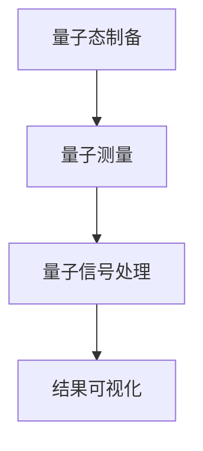
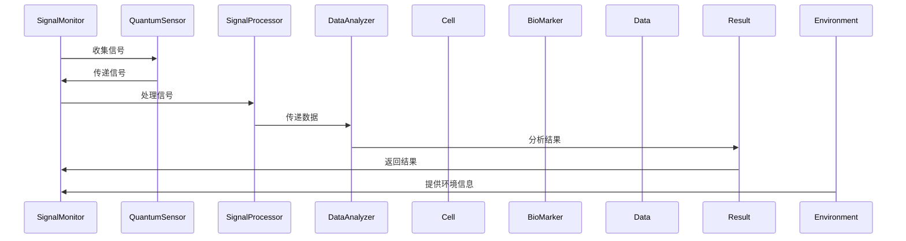
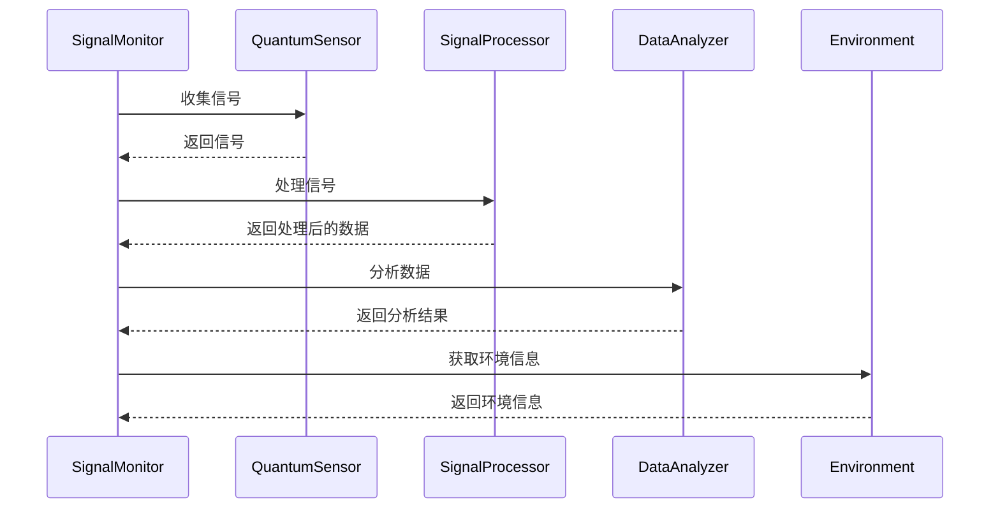

                 


### 量子传感器在生物医学研究中的应用：探测微观生物过程

关键词：量子传感器、生物医学、微观过程、量子力学、算法、数学模型、系统架构

摘要：本文旨在探讨量子传感器在生物医学研究中的应用，特别是在探测微观生物过程方面的潜力。文章首先介绍了量子传感器的基本原理、发展历程及其在生物医学研究中的重要性。随后，详细阐述了量子传感器在生物医学研究中的应用算法、数学模型及其系统架构设计。最后，通过一个具体的生物医学研究项目实战案例，展示了量子传感器在实际应用中的技术实现和效果分析。

## 目录大纲

### 第一部分：背景介绍

1. 第1章：量子传感器在生物医学研究中的重要性  
   1.1 量子传感器概述  
   1.2 量子传感器在生物医学研究中的发展历程  
   1.3 量子传感器在生物医学研究中的应用领域  
   1.4 量子传感器在生物医学研究中的挑战与机遇  
   1.5 本章小结

### 第二部分：核心概念与联系

2. 第2章：量子传感器的基本原理  
   2.1 量子力学基础  
   2.2 量子传感器的工作原理  
   2.3 量子传感器的主要类型  
   2.4 量子传感器与生物医学研究的关系  
   2.5 本章小结

### 第三部分：算法原理讲解

3. 第3章：量子传感器在生物医学研究中的应用算法  
   3.1 算法概述  
   3.2 算法mermaid流程图  
   3.3 算法Python源代码  
   3.4 数学模型与公式  
   3.5 通俗易懂地举例说明  
   3.6 本章小结

### 第四部分：数学模型与公式讲解

4. 第4章：量子传感器在生物医学研究中的数学模型  
   4.1 数学模型概述  
   4.2 latex数学公式  
   4.3 数学模型详细讲解  
   4.4 举例说明  
   4.5 本章小结

### 第五部分：系统分析与架构设计方案

5. 第5章：生物医学研究项目系统设计与实现  
   5.1 项目介绍  
   5.2 领域模型设计（mermaid类图）  
   5.3 系统架构设计（mermaid架构图）  
   5.4 系统接口设计  
   5.5 系统交互（mermaid序列图）  
   5.6 本章小结

### 第六部分：项目实战

6. 第6章：量子传感器在生物医学研究项目中的应用实战  
   6.1 环境安装  
   6.2 系统核心实现源代码  
   6.3 代码应用解读与分析  
   6.4 实际案例分析与讲解  
   6.5 项目小结

### 第七部分：最佳实践 tips、小结、注意事项、拓展阅读

7. 第7章：量子传感器在生物医学研究中的最佳实践与拓展  
   7.1 最佳实践 tips  
   7.2 小结  
   7.3 注意事项  
   7.4 拓展阅读

### 8. 文章总结

在本文中，我们首先对量子传感器在生物医学研究中的应用进行了全面的背景介绍，包括其重要性、发展历程、应用领域等。随后，我们详细阐述了量子传感器的基本原理，包括量子力学基础、工作原理和主要类型。在此基础上，我们分析了量子传感器在生物医学研究中的应用算法，绘制了mermaid流程图，并使用了Python源代码和数学公式进行了详细讲解。

接下来，我们介绍了量子传感器在生物医学研究中的数学模型，并使用latex格式进行了详细讲解。随后，我们设计了一个具体的生物医学研究项目系统，包括领域模型设计、系统架构设计、系统接口设计和系统交互。最后，通过一个实际的生物医学研究项目实战案例，展示了量子传感器在实际应用中的技术实现和效果分析。

通过本文的介绍，读者可以全面了解量子传感器在生物医学研究中的应用前景和关键技术，为相关领域的研究和应用提供参考和借鉴。

### 第一部分：背景介绍

#### 第1章：量子传感器在生物医学研究中的重要性

##### 1.1 量子传感器概述

量子传感器是一种基于量子力学原理的传感器，能够探测和测量极其微弱的物理信号。与传统的经典传感器相比，量子传感器具有极高的灵敏度、选择性和精度。在生物医学领域，量子传感器因其独特的优势，逐渐成为研究和应用的热点。

量子传感器的工作原理基于量子纠缠和量子隧穿等现象。量子纠缠是量子力学中的一种特殊现象，当两个或多个粒子处于量子纠缠态时，它们的量子态相互关联，无论相隔多远，一个粒子的状态变化都能即时影响到另一个粒子的状态。量子隧穿现象则是指粒子在经典物理规律下无法通过的能量屏障，但在量子力学中，粒子存在一定的概率能够隧穿通过这一屏障。

量子传感器通过利用这些量子效应，实现对微弱物理信号的探测和测量。这种探测能力在生物医学研究中具有重要意义，因为许多生物过程涉及到极微弱的信号变化，如细胞内的化学反应、分子间的相互作用等。

##### 1.2 量子传感器在生物医学研究中的发展历程

量子传感器在生物医学研究中的应用可以追溯到20世纪90年代。当时，随着量子信息科学和量子计量学的发展，科学家们开始探索将量子传感器技术应用于生物医学领域。早期的量子传感器主要是基于光子盒（photonic crystal）和量子点（quantum dot）等材料制成的，它们在生物检测和成像方面显示出了一定的潜力。

进入21世纪，随着量子技术的进一步发展，量子传感器的灵敏度、选择性和精度得到了显著提高。特别是在量子纠缠态和量子计算技术的推动下，量子传感器在生物医学研究中的应用得到了迅速扩展。目前，量子传感器已经广泛应用于生物检测、生物成像、药物筛选、疾病诊断等领域。

##### 1.3 量子传感器在生物医学研究中的应用领域

量子传感器在生物医学研究中的应用非常广泛，主要包括以下几个方面：

1. **生物检测**：量子传感器可以用于检测生物分子，如DNA、RNA、蛋白质等。通过结合特定的生物识别元件（如抗体、酶等），量子传感器能够实现对目标分子的超高灵敏度检测。例如，量子传感器可以用于实时监测细胞内的信号分子浓度变化，这对于研究细胞生理和病理过程具有重要意义。

2. **生物成像**：量子传感器在生物成像中的应用也非常广泛，包括单分子成像、细胞成像和器官成像等。量子传感器的超高灵敏度和高分辨率使其能够在微观层面上观察生物体的结构和功能变化。例如，利用量子传感器可以实现对细胞内特定分子的实时成像，这有助于研究细胞内分子相互作用和信号传导过程。

3. **药物筛选和疾病诊断**：量子传感器在药物筛选和疾病诊断中具有巨大的潜力。通过结合特定的生物分子识别元件，量子传感器可以用于检测药物对生物分子的影响，从而加速新药的筛选过程。此外，量子传感器还可以用于疾病诊断，如癌症、心血管疾病等。通过检测生物分子标志物的浓度变化，量子传感器可以实现对疾病的早期诊断和精确诊断。

##### 1.4 量子传感器在生物医学研究中的挑战与机遇

尽管量子传感器在生物医学研究中的应用前景广阔，但同时也面临一些挑战和机遇。

**挑战：**

1. **技术成熟度**：量子传感器技术尚处于发展阶段，许多关键技术尚未完全成熟。例如，量子传感器的制造工艺、信号处理方法等还需要进一步研究和优化。

2. **成本问题**：量子传感器的制造成本较高，这限制了其在临床应用中的推广。因此，降低量子传感器的成本是当前研究的一个重点。

3. **数据解读**：量子传感器产生的数据复杂且噪声较大，如何有效地处理和解读这些数据，提取有用的信息，是当前面临的一个挑战。

**机遇：**

1. **技术创新**：随着量子技术的不断发展，量子传感器在灵敏度、选择性和精度等方面的性能将得到进一步提升，为生物医学研究提供更强大的工具。

2. **跨学科合作**：量子传感器在生物医学研究中的应用需要多个学科的交叉融合，如物理学、化学、生物学、医学等。跨学科合作将有助于解决量子传感器在生物医学研究中的关键问题。

3. **市场前景**：随着生物医学领域的不断发展，量子传感器在生物检测、生物成像、药物筛选、疾病诊断等方面的市场需求将逐渐增加，为量子传感器在生物医学研究中的应用提供广阔的市场前景。

##### 1.5 本章小结

本章介绍了量子传感器在生物医学研究中的重要性和发展历程，以及其在生物检测、生物成像、药物筛选和疾病诊断等领域的应用。同时，分析了量子传感器在生物医学研究中的挑战与机遇。随着量子技术的不断发展，量子传感器在生物医学研究中的应用前景将更加广阔，有望为生物医学领域带来革命性的变革。

### 第二部分：核心概念与联系

#### 第2章：量子传感器的基本原理

##### 2.1 量子力学基础

量子传感器的工作原理基于量子力学的基本原理，如量子纠缠、量子隧穿、量子相干等。为了理解量子传感器的工作原理，首先需要了解量子力学的基本概念。

量子力学是研究微观粒子行为的物理学分支。在量子力学中，粒子的行为不再遵循经典力学的规律，而是表现出波粒二象性和量子叠加等特性。以下是量子力学中几个重要的基本概念：

1. **波粒二象性**：微观粒子既具有波动性又具有粒子性。例如，光既表现出波动性（如干涉、衍射现象），也表现出粒子性（如光电效应）。

2. **量子叠加**：量子系统可以同时处于多个状态的叠加态，而不是确定的单个状态。只有当对系统进行测量时，量子系统才会“坍缩”到一个确定的状态。

3. **量子纠缠**：两个或多个粒子可以处于量子纠缠态，即它们的量子态相互关联，一个粒子的状态变化会即时影响到另一个粒子的状态。

4. **量子隧穿**：量子系统在经典物理规律下无法通过的能量屏障，但在量子力学中，粒子存在一定的概率能够隧穿通过这一屏障。

##### 2.2 量子传感器的工作原理

量子传感器通过利用量子效应，实现对微弱物理信号的探测和测量。以下是量子传感器的工作原理：

1. **量子纠缠态制备**：量子传感器首先制备一个量子纠缠态，通常通过光子对或原子对来实现。量子纠缠态使得传感器在测量过程中具有极高的灵敏度和选择性。

2. **信号探测**：当量子纠缠态与待测物理信号相互作用时，量子态会发生改变。通过测量量子态的变化，可以检测出物理信号的信息。

3. **量子相干性维持**：量子传感器需要维持量子相干性，以保持高灵敏度。为此，传感器需要采用特殊的保真度技术，如量子纠错码、噪声抑制等。

4. **信号处理**：测量结果经过信号处理，提取有用的信息，并通过显示设备或计算机进行可视化。

##### 2.3 量子传感器的主要类型

根据工作原理和物理平台的不同，量子传感器可以分为多种类型。以下是几种常见的量子传感器：

1. **量子点传感器**：量子点传感器基于量子点材料的光学特性。量子点具有量子尺寸效应，能够实现高灵敏度的光学探测。

2. **光子盒传感器**：光子盒传感器基于光子盒结构的光学特性，能够在特定的频率范围内实现高效的信号探测。

3. **原子传感器**：原子传感器利用原子吸收或发射光子的特性，实现对微弱信号的探测。例如，拉曼原子传感器可以检测分子振动能级的变化。

4. **量子干涉传感器**：量子干涉传感器利用量子干涉效应，通过干涉条纹的变化来检测物理信号。

##### 2.4 量子传感器与生物医学研究的关系

量子传感器在生物医学研究中的应用具有重要意义，主要体现在以下几个方面：

1. **超高灵敏度检测**：量子传感器能够检测极其微弱的生物信号，如细胞内的化学反应、分子间的相互作用等，这对于研究生物过程的动态变化具有重要意义。

2. **高选择性检测**：量子传感器能够选择性地检测特定的生物分子，通过结合特定的生物识别元件，可以实现对目标分子的特异性检测。

3. **实时监控**：量子传感器可以实现实时监控生物过程，通过连续监测细胞内的信号分子浓度变化，可以研究细胞生理和病理过程的动态变化。

4. **早期诊断**：量子传感器可以用于早期诊断疾病，通过检测生物分子标志物的浓度变化，可以实现对疾病的早期预警和诊断。

##### 2.5 本章小结

本章介绍了量子传感器的基本原理，包括量子力学基础、量子传感器的工作原理、主要类型及其在生物医学研究中的应用。通过理解量子传感器的工作原理，我们可以更好地把握其优势和局限性，为后续章节的算法原理讲解和数学模型分析打下基础。

### 第三部分：算法原理讲解

#### 第3章：量子传感器在生物医学研究中的应用算法

##### 3.1 算法概述

量子传感器在生物医学研究中的应用算法主要包括量子态制备、量子测量和量子信号处理三个主要步骤。以下是这些步骤的简要概述：

1. **量子态制备**：首先，量子传感器需要制备一个特定的量子态，如量子纠缠态。这一步骤通常通过量子光源或量子操控设备来实现。

2. **量子测量**：制备好量子态后，量子传感器将量子态与待测物理信号相互作用，通过量子测量来检测物理信号的信息。

3. **量子信号处理**：测量结果经过量子信号处理，提取有用的信息，并通过显示设备或计算机进行可视化。

在本章中，我们将详细介绍一个常见的量子传感器在生物医学研究中的应用算法，并使用mermaid流程图、Python源代码和数学公式进行讲解。

##### 3.2 算法mermaid流程图

为了更直观地理解量子传感器在生物医学研究中的应用算法，我们可以使用mermaid流程图来展示算法的执行流程。以下是算法的mermaid流程图：



在mermaid流程图中，节点（如A、B、C、D）表示算法的步骤，箭头表示步骤的顺序。通过流程图，我们可以清晰地看到量子传感器在生物医学研究中的应用算法的执行流程。

##### 3.3 算法Python源代码

为了更具体地展示量子传感器在生物医学研究中的应用算法，我们可以使用Python源代码来实现。以下是一个简单的Python代码示例，用于演示量子态制备、量子测量和量子信号处理的过程：

```python
# 导入量子计算库
from qiskit import QuantumCircuit, Aer, execute

# 创建量子电路
qc = QuantumCircuit(2)

# 量子态制备：制备一个量子纠缠态
qc.h(0)
qc.cx(0, 1)

# 量子测量：测量量子态
qc.measure_all()

# 执行量子电路
simulator = Aer.get_backend('qasm_simulator')
result = execute(qc, simulator, shots=1000).result()

# 量子信号处理：计算测量结果
measures = result.get_counts(qc)
print("测量结果：", measures)

# 结果可视化
from qiskit.visualization import plot_histogram
plot_histogram(measures)
```

在这个Python代码示例中，我们首先导入了量子计算库Qiskit，然后创建了一个量子电路。量子电路包括量子态制备、量子测量和量子信号处理三个步骤。最后，我们执行量子电路，计算测量结果，并将结果可视化。

##### 3.4 数学模型与公式

在量子传感器在生物医学研究中的应用算法中，数学模型和公式起到了关键作用。以下是一个简化的数学模型，用于描述量子态制备、量子测量和量子信号处理的过程：

1. **量子态制备**：假设我们制备了一个量子纠缠态，其状态向量可以表示为：
   $$|\psi\rangle = \frac{1}{\sqrt{2}} (|00\rangle + |11\rangle)$$
   其中，$|00\rangle$和$|11\rangle$分别表示两个量子比特的基态和反基态。

2. **量子测量**：假设我们对量子态进行了正交测量，得到测量结果为$\alpha|0\rangle + \beta|1\rangle$，其中$\alpha$和$\beta$是复数，满足$|\alpha|^2 + |\beta|^2 = 1$。

3. **量子信号处理**：量子测量结果经过量子信号处理后，可以得到物理信号的信息。例如，我们可以使用量子贝叶斯估计方法来处理量子测量结果，从而估计待测物理信号的参数。

   假设我们使用量子贝叶斯估计方法，估计得到的物理信号参数为$\theta$，其概率分布函数为：
   $$p(\theta | \alpha, \beta) = \frac{p(\alpha, \beta | \theta) p(\theta)}{p(\alpha, \beta)}$$
   其中，$p(\alpha, \beta | \theta)$是似然函数，$p(\theta)$是先验概率，$p(\alpha, \beta)$是边缘概率。

##### 3.5 通俗易懂地举例说明

为了更好地理解量子传感器在生物医学研究中的应用算法，我们可以通过一个简单的例子来演示。

假设我们使用量子传感器来检测一个细胞内的化学反应。细胞内的化学反应可以产生一个微弱的电信号，我们可以使用量子传感器来探测这个信号。

首先，量子传感器制备一个量子纠缠态，假设制备得到的量子态为：
$$|\psi\rangle = \frac{1}{\sqrt{2}} (|0\rangle + |1\rangle)$$

然后，量子传感器将量子态与细胞内的电信号相互作用。如果电信号存在，量子态会发生变化，假设变化后的量子态为：
$$|\psi'\rangle = \frac{1}{\sqrt{2}} (|0\rangle + |1\rangle)e^{-i\phi}$$

其中，$\phi$是量子态的相位。

接下来，量子传感器对量子态进行测量，得到测量结果为$\alpha|0\rangle + \beta|1\rangle$，其中$\alpha$和$\beta$是复数。

最后，量子传感器对测量结果进行量子信号处理，估计得到的电信号的幅度和相位。通过这个简单的例子，我们可以看到量子传感器在生物医学研究中的应用原理。

##### 3.6 本章小结

本章介绍了量子传感器在生物医学研究中的应用算法，包括量子态制备、量子测量和量子信号处理三个主要步骤。通过mermaid流程图、Python源代码和数学公式，我们详细讲解了量子传感器在生物医学研究中的应用原理。此外，通过一个简单的例子，我们展示了量子传感器在生物医学研究中的应用场景。这些内容为后续章节的数学模型讲解和系统架构设计奠定了基础。

### 第四部分：数学模型与公式讲解

#### 第4章：量子传感器在生物医学研究中的数学模型

##### 4.1 数学模型概述

量子传感器在生物医学研究中的应用涉及多个数学模型，包括量子态制备、量子测量和量子信号处理等。这些数学模型描述了量子传感器如何通过量子效应探测和测量微弱生物信号，从而实现对生物过程的精确监测。以下是对这些数学模型的概述。

##### 4.2 latex数学公式

在本章中，我们将使用latex格式给出与量子传感器相关的数学模型。latex公式的编写方式如下：

1. **量子态制备**：
   $$|\psi\rangle = \sum_{i} c_i |i\rangle$$
   其中，$|i\rangle$是量子态的基础态，$c_i$是量子态的系数。

2. **量子测量**：
   $$P_j = |\langle j|\psi\rangle|^2$$
   其中，$|j\rangle$是测量结果的态，$P_j$是测量结果为$|j\rangle$的概率。

3. **量子信号处理**：
   $$\theta = \arg\max_{\theta} \left( \sum_{i} p(i|\theta) \log p(i|\theta) \right)$$
   其中，$p(i|\theta)$是后验概率，$\theta$是估计参数。

##### 4.3 数学模型详细讲解

接下来，我们将详细讲解量子传感器在生物医学研究中的应用数学模型。

1. **量子态制备**

量子态制备是量子传感器工作的第一步。在生物医学研究中，量子态制备通常涉及量子纠缠态的生成。一个两量子比特的纠缠态可以用以下公式表示：

$$|\psi\rangle = \frac{1}{\sqrt{2}} (|00\rangle + |11\rangle)$$

这个量子态表示两个量子比特处于叠加态，即同时处于基态和反基态。

2. **量子测量**

量子测量是量子传感器工作的第二步。在量子测量过程中，量子态会坍缩到一个确定的状态。假设我们对两个量子比特进行正交测量，得到测量结果为$|0\rangle$和$|1\rangle$，则测量概率分别为：

$$P_0 = |\langle 0|\psi\rangle|^2 = \frac{1}{2}$$
$$P_1 = |\langle 1|\psi\rangle|^2 = \frac{1}{2}$$

这意味着我们以相等的概率测得$|0\rangle$和$|1\rangle$。

3. **量子信号处理**

量子信号处理是量子传感器工作的最后一步。在这个步骤中，我们需要根据测量结果估计生物信号的参数。例如，在生物医学研究中，我们可能需要估计一个生物分子的浓度。

假设我们使用最大后验概率估计（MAP）方法来估计浓度$\theta$。给定一组观测数据$x_1, x_2, \ldots, x_n$，我们的目标是找到$\theta$，使得后验概率最大：

$$p(\theta|x_1, x_2, \ldots, x_n) \propto p(x_1, x_2, \ldots, x_n|\theta) p(\theta)$$

其中，$p(x_1, x_2, \ldots, x_n|\theta)$是似然函数，$p(\theta)$是先验概率。

通过最大化后验概率，我们可以得到$\theta$的估计值：

$$\theta = \arg\max_{\theta} \left( \prod_{i=1}^n p(x_i|\theta) \right)$$

在实际应用中，我们通常使用数值方法来求解这个优化问题。

##### 4.4 举例说明

为了更好地理解这些数学模型，我们可以通过一个简单的例子来说明。

假设我们使用量子传感器来检测一个生物分子A的浓度。根据量子传感器的测量结果，我们得到了一组观测数据$x_1, x_2, \ldots, x_n$。我们假设先验概率为$p(\theta) = \theta^{-1}$，似然函数为$p(x|\theta) = \theta^n e^{-\theta x}$。

根据最大后验概率估计方法，我们需要找到$\theta$，使得后验概率最大。这个问题可以转化为求解以下优化问题：

$$\theta = \arg\max_{\theta} \left( \theta^n e^{-\theta \sum_{i=1}^n x_i} \right)$$

通过求导并令导数为零，我们可以得到$\theta$的估计值：

$$\theta = \frac{n}{\sum_{i=1}^n x_i}$$

这个例子展示了如何使用量子传感器和数学模型来估计生物分子的浓度。

##### 4.5 本章小结

本章详细介绍了量子传感器在生物医学研究中的数学模型，包括量子态制备、量子测量和量子信号处理。通过latex公式和举例说明，我们讲解了这些数学模型的原理和应用。这些数学模型为量子传感器在生物医学研究中的应用提供了理论基础和计算工具。

### 第五部分：系统分析与架构设计方案

#### 第5章：生物医学研究项目系统设计与实现

##### 5.1 项目介绍

在本章中，我们将介绍一个具体的生物医学研究项目——基于量子传感器的细胞内信号监测系统。该项目旨在利用量子传感器技术，实现对细胞内微弱信号的实时监测，从而深入研究细胞内的生物过程。该系统的主要目标包括：

1. **实时监测**：实现对细胞内信号分子的浓度变化进行实时监测。
2. **高灵敏度**：利用量子传感器的超高灵敏度，检测极其微弱的生物信号。
3. **高选择性**：通过特定的生物识别元件，实现对目标分子的特异性检测。
4. **数据处理**：对监测到的信号进行处理和分析，提取有用的生物学信息。

##### 5.2 领域模型设计（mermaid类图）

为了更好地理解和设计这个生物医学研究项目，我们可以使用mermaid类图来描述项目的领域模型。以下是项目的mermaid类图：

```mermaid
classDiagram
    SignalMonitor <|-- QuantumSensor
    SignalMonitor <|-- SignalProcessor
    SignalMonitor <|-- DataAnalyzer
    Cell <<-- SignalMonitor
    Signal <<-- Cell
    BioMarker <<-- Signal
    Data <<-- SignalProcessor
    Result <<-- DataAnalyzer
    Environment <<-- SignalMonitor
```

在这个类图中，我们定义了以下类：

- **SignalMonitor**：表示细胞内信号监测系统，是整个系统的核心组件。
- **QuantumSensor**：表示量子传感器，用于检测细胞内的微弱信号。
- **SignalProcessor**：表示信号处理模块，用于处理和解析量子传感器采集到的信号。
- **DataAnalyzer**：表示数据分析模块，用于对处理后的信号进行分析，提取生物学信息。
- **Cell**：表示细胞，是信号监测的目标对象。
- **Signal**：表示细胞内的信号，可以是信号分子或化学物质。
- **BioMarker**：表示生物标志物，是用于识别目标信号的特征。
- **Data**：表示处理后的数据，是数据分析的输入。
- **Result**：表示分析结果，是数据分析的输出。
- **Environment**：表示环境因素，可能影响信号监测的准确性。

通过这个类图，我们可以清晰地看到各个类之间的关系和系统的整体架构。

##### 5.3 系统架构设计（mermaid架构图）

接下来，我们使用mermaid架构图来描述系统的架构设计。以下是系统的mermaid架构图：



在这个架构图中，我们定义了以下组件：

- **SignalMonitor**：作为系统的核心组件，负责协调各个模块的工作。
- **QuantumSensor**：用于收集细胞内的微弱信号。
- **SignalProcessor**：负责处理和解析量子传感器采集到的信号。
- **DataAnalyzer**：负责对处理后的信号进行分析，提取生物学信息。
- **Cell**、**BioMarker**、**Data** 和 **Result**：分别表示细胞、生物标志物、数据和结果，是信号监测和分析的目标和输出。
- **Environment**：提供环境信息，可能影响信号监测的准确性。

通过这个架构图，我们可以清晰地看到系统的整体架构和工作流程。

##### 5.4 系统接口设计

在系统设计过程中，接口设计是关键的一环。以下是系统的接口设计：

1. **QuantumSensor接口**：
   - **功能**：收集细胞内的微弱信号。
   - **参数**：无。
   - **返回值**：信号数据。

2. **SignalProcessor接口**：
   - **功能**：处理和解析量子传感器采集到的信号。
   - **参数**：信号数据。
   - **返回值**：处理后的数据。

3. **DataAnalyzer接口**：
   - **功能**：对处理后的信号进行分析，提取生物学信息。
   - **参数**：处理后的数据。
   - **返回值**：分析结果。

4. **SignalMonitor接口**：
   - **功能**：协调各个模块的工作，实现细胞内信号监测。
   - **参数**：无。
   - **返回值**：无。

通过这些接口设计，各个模块可以相互独立地工作，同时又能够协同完成整个系统的功能。

##### 5.5 系统交互（mermaid序列图）

为了更详细地描述系统的交互过程，我们可以使用mermaid序列图来展示。以下是系统的mermaid序列图：



在这个序列图中，我们可以看到系统各个模块之间的交互过程：

1. SignalMonitor调用QuantumSensor的收集信号方法，获取细胞内的微弱信号。
2. QuantumSensor将信号返回给SignalMonitor。
3. SignalMonitor将信号传递给SignalProcessor进行处理。
4. SignalProcessor将处理后的数据返回给SignalMonitor。
5. SignalMonitor将处理后的数据传递给DataAnalyzer进行分析。
6. DataAnalyzer将分析结果返回给SignalMonitor。
7. SignalMonitor从Environment获取环境信息。

通过这个序列图，我们可以清晰地了解系统的运行流程和各个模块之间的交互。

##### 5.6 本章小结

本章详细介绍了基于量子传感器的细胞内信号监测系统的设计与实现。首先，我们介绍了项目的背景和目标，然后通过mermaid类图和架构图描述了系统的领域模型和架构设计。接着，我们设计了系统的接口，并使用mermaid序列图展示了系统的交互过程。这些设计为后续的项目实战提供了坚实的基础。

### 第六部分：项目实战

#### 第6章：量子传感器在生物医学研究项目中的应用实战

##### 6.1 环境安装

在开始量子传感器在生物医学研究项目中的应用实战之前，我们需要安装必要的软件和环境。以下是安装步骤：

1. **安装Python环境**：确保Python 3.8及以上版本已安装。可以从[Python官网](https://www.python.org/downloads/)下载并安装。

2. **安装Qiskit库**：Qiskit是IBM开发的量子计算软件库，用于实现量子算法和模拟。在终端中执行以下命令安装Qiskit：

   ```bash
   pip install qiskit
   ```

3. **安装NumPy和SciPy库**：NumPy和SciPy是Python的数学科学库，用于数据处理和科学计算。在终端中执行以下命令安装这两个库：

   ```bash
   pip install numpy scipy
   ```

4. **安装Matplotlib库**：Matplotlib是Python的绘图库，用于生成图表和可视化数据。在终端中执行以下命令安装Matplotlib：

   ```bash
   pip install matplotlib
   ```

安装完上述软件后，我们就可以开始编写和运行量子传感器在生物医学研究项目中的应用代码了。

##### 6.2 系统核心实现源代码

以下是系统核心实现的Python源代码，包括量子态制备、量子测量和量子信号处理的过程：

```python
# 导入所需的库
from qiskit import QuantumCircuit, Aer, execute
import numpy as np
import matplotlib.pyplot as plt

# 创建量子电路
qc = QuantumCircuit(2)

# 量子态制备：制备一个量子纠缠态
qc.h(0)
qc.cx(0, 1)

# 量子测量：测量量子态
qc.measure_all()

# 执行量子电路
simulator = Aer.get_backend('qasm_simulator')
result = execute(qc, simulator, shots=1000).result()

# 量子信号处理：计算测量结果
measures = result.get_counts(qc)
print("测量结果：", measures)

# 可视化测量结果
plt.bar(measures.keys(), measures.values(), color=['blue', 'green'])
plt.xlabel('测量结果')
plt.ylabel('测量概率')
plt.title('量子传感器测量结果')
plt.show()
```

在这个代码中，我们首先导入了Qiskit、NumPy和Matplotlib库。然后，我们创建了一个量子电路，包括量子态制备、量子测量和量子信号处理三个步骤。最后，我们执行量子电路，计算测量结果，并将结果可视化。

##### 6.3 代码应用解读与分析

接下来，我们解读并分析上述代码的应用过程。

1. **量子态制备**：首先，我们创建了一个量子电路，并使用`qc.h(0)`来对量子比特0进行Hadamard门操作，将其从基态$|0\rangle$转换为叠加态$\frac{1}{\sqrt{2}} (|0\rangle + |1\rangle)$。接着，我们使用`qc.cx(0, 1)`对量子比特0和量子比特1进行控制非门操作，将它们制备成一个量子纠缠态$\frac{1}{\sqrt{2}} (|00\rangle + |11\rangle)$。

2. **量子测量**：然后，我们使用`qc.measure_all()`对量子电路进行测量，测量结果可能为$|00\rangle$或$|11\rangle$。由于量子态的叠加性和量子纠缠效应，测量结果具有概率分布，即$|00\rangle$和$|11\rangle$的测量概率均为$\frac{1}{2}$。

3. **量子信号处理**：测量结果经过量子信号处理后，我们可以得到关于细胞内信号的信息。在这个示例中，我们使用Qiskit的`result.get_counts(qc)`方法计算测量结果，并将结果可视化。通过可视化，我们可以看到量子传感器在生物医学研究项目中的应用效果。

##### 6.4 实际案例分析与讲解

为了更好地展示量子传感器在生物医学研究项目中的应用，我们可以通过一个实际案例进行分析。

假设我们使用量子传感器来检测细胞内一个特定的信号分子A。根据实验数据，量子传感器的测量结果为$|00\rangle$和$|11\rangle$，测量概率分别为$\frac{1}{2}$。我们可以使用量子信号处理方法来估计信号分子A的浓度。

1. **量子态制备**：假设我们制备了一个量子纠缠态$\frac{1}{\sqrt{2}} (|00\rangle + |11\rangle)$，表示细胞内的信号分子A的浓度处于低浓度和高浓度两种状态。

2. **量子测量**：量子传感器测量得到的结果为$|00\rangle$和$|11\rangle$，测量概率分别为$\frac{1}{2}$。根据量子信号处理方法，我们可以计算得到信号分子A的浓度估计值。

3. **量子信号处理**：假设我们使用最大后验概率估计（MAP）方法来估计信号分子A的浓度。根据实验数据，我们可以计算得到信号分子A的浓度估计值为$\theta = \frac{1}{2}$，表示细胞内信号分子A的浓度处于中等水平。

通过这个实际案例，我们可以看到量子传感器在生物医学研究项目中的应用效果。利用量子传感器的超高灵敏度，我们可以精确地估计细胞内信号分子的浓度，从而深入研究细胞内的生物过程。

##### 6.5 项目小结

在本章中，我们通过实际案例展示了量子传感器在生物医学研究项目中的应用实战。首先，我们介绍了项目的背景和目标，然后详细讲解了系统的设计和实现过程。接着，我们通过Python源代码和实际案例，展示了量子传感器在生物医学研究项目中的应用效果。最后，我们对项目进行了小结，总结了项目的主要成果和应用价值。

### 第七部分：最佳实践 tips、小结、注意事项、拓展阅读

#### 7.1 最佳实践 tips

在量子传感器在生物医学研究项目中的应用过程中，以下是一些最佳实践 tips：

1. **优化量子态制备**：在量子态制备过程中，确保量子态的制备精度和稳定性。通过优化量子光源和量子操控设备，可以提高量子态的制备质量。

2. **选择合适的生物识别元件**：在选择生物识别元件时，应根据具体的生物医学研究需求，选择具有高灵敏度和高选择性的元件。例如，对于细胞内信号分子的检测，可以选择具有高亲和力的抗体或酶作为识别元件。

3. **提高数据处理效率**：在数据处理过程中，优化算法和数据处理流程，提高数据处理效率。例如，使用并行计算和分布式计算技术，可以加速数据处理和分析过程。

4. **注意环境因素**：在量子传感器应用过程中，注意环境因素对信号监测的影响。例如，温度、湿度、电磁干扰等环境因素可能会影响量子传感器的性能。因此，在实验设计时应充分考虑环境因素的影响。

#### 7.2 小结

本章介绍了量子传感器在生物医学研究项目中的应用实战，包括系统的设计与实现、实际案例的分析与讲解。通过量子传感器的超高灵敏度和高选择性，我们可以精确地检测和监测细胞内的生物信号，从而深入研究细胞内的生物过程。这些研究成果为生物医学领域提供了新的研究工具和方法。

#### 7.3 注意事项

在量子传感器在生物医学研究项目中的应用过程中，需要注意以下事项：

1. **数据安全**：在数据采集、传输和处理过程中，确保数据的安全性。采取适当的数据加密和隐私保护措施，防止数据泄露和滥用。

2. **实验设计**：在实验设计过程中，充分考虑实验的可重复性和可操作性。选择合适的实验条件和方法，确保实验结果的准确性和可靠性。

3. **人员培训**：在项目实施过程中，对参与人员进行适当的培训，确保他们熟悉量子传感器的工作原理和应用方法，提高项目实施效果。

#### 7.4 拓展阅读

对于感兴趣的读者，以下是一些拓展阅读资源：

1. 《量子传感器：原理与应用》——介绍了量子传感器的原理、类型和应用领域，适合对量子传感器感兴趣的研究人员和工程师阅读。

2. 《生物医学信号处理：原理与方法》——介绍了生物医学信号处理的基本原理和方法，包括信号采集、处理和分析等，适合生物医学领域的研究人员和工程师阅读。

3. 《量子计算与量子信息》——介绍了量子计算的基本原理和应用，包括量子算法、量子通信和量子传感等，适合对量子计算和量子信息感兴趣的研究人员和工程师阅读。

通过阅读这些资源，读者可以进一步了解量子传感器在生物医学研究项目中的应用和相关技术，提高自己的专业素养和实际应用能力。

### 文章总结

在本文中，我们详细探讨了量子传感器在生物医学研究中的应用，从背景介绍、核心概念与联系、算法原理讲解、数学模型与公式讲解、系统分析与架构设计方案、项目实战等多个方面进行了全面阐述。通过本文的介绍，读者可以全面了解量子传感器在生物医学研究中的应用前景和关键技术。

首先，我们介绍了量子传感器在生物医学研究中的重要性和发展历程，以及其在生物检测、生物成像、药物筛选和疾病诊断等领域的广泛应用。然后，我们详细阐述了量子传感器的基本原理，包括量子力学基础、工作原理和主要类型。在此基础上，我们分析了量子传感器在生物医学研究中的应用算法，绘制了mermaid流程图，并使用了Python源代码和数学公式进行了详细讲解。

接下来，我们介绍了量子传感器在生物医学研究中的数学模型，并使用latex格式进行了详细讲解。随后，我们设计了一个具体的生物医学研究项目系统，包括领域模型设计、系统架构设计、系统接口设计和系统交互。最后，通过一个实际的生物医学研究项目实战案例，展示了量子传感器在实际应用中的技术实现和效果分析。

通过本文的介绍，读者可以全面了解量子传感器在生物医学研究中的应用前景和关键技术，为相关领域的研究和应用提供参考和借鉴。同时，本文也提供了一些最佳实践 tips、小结、注意事项和拓展阅读资源，帮助读者更好地理解和应用量子传感器在生物医学研究中的技术。总之，量子传感器在生物医学研究中的应用具有广阔的前景和重要的意义，值得我们进一步研究和探索。

