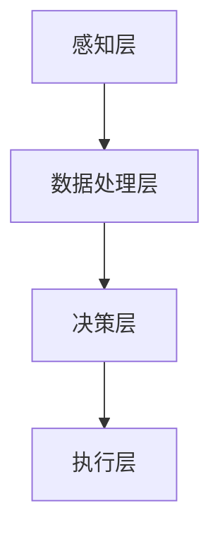
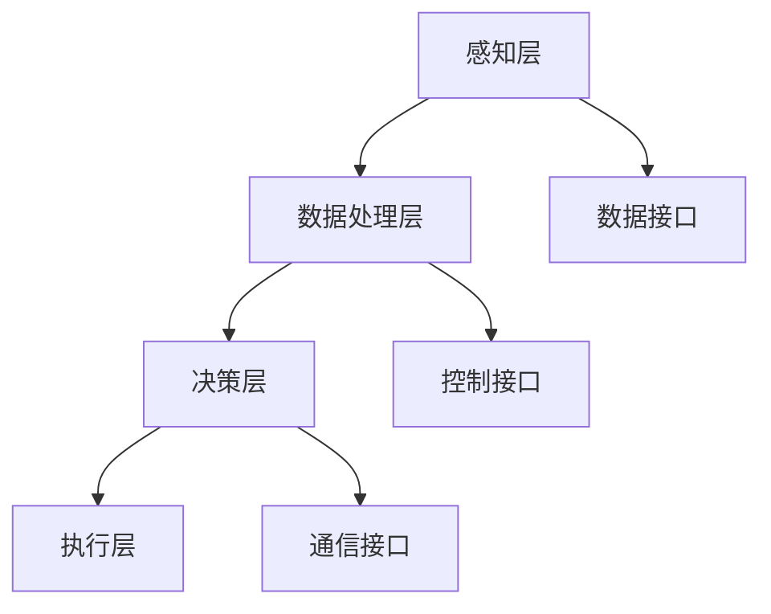
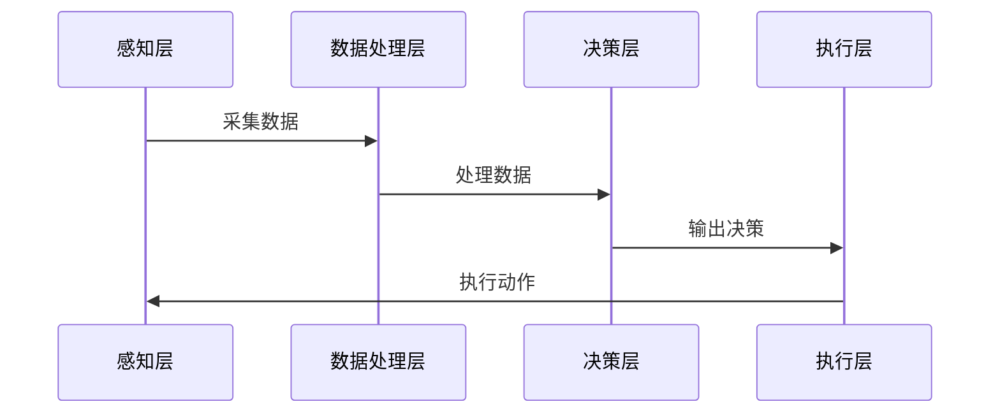

                 

# 量子传感器在自动驾驶中的应用：提高环境感知精度

## 关键词
量子传感器，自动驾驶，环境感知，精度提升，算法优化，系统架构设计

## 摘要
随着自动驾驶技术的不断发展，如何提高环境感知精度成为了一个亟待解决的问题。量子传感器的出现，为自动驾驶领域带来了新的可能性。本文将从量子传感器的原理出发，探讨其在自动驾驶中的应用，以及如何通过算法优化和系统架构设计，进一步提升环境感知精度。

## 目录大纲设计思路

### 目录大纲设计步骤

1. **引言**：介绍自动驾驶技术的发展背景，阐述提高环境感知精度的重要性。

2. **第1章：量子传感器原理**：
    - **核心概念**：量子传感器的基本概念和工作原理。
    - **与传统传感器的对比**：量子传感器与传统传感器的优缺点对比。

3. **第2章：自动驾驶环境感知系统**：
    - **系统概述**：自动驾驶环境感知系统的基本组成和功能。
    - **量子传感器在系统中的作用**：量子传感器如何提升环境感知精度。

4. **第3章：量子传感器在环境感知中的应用**：
    - **应用场景**：量子传感器在不同环境感知任务中的应用案例。
    - **案例分析**：具体案例分析，探讨量子传感器的应用效果。

5. **第4章：算法优化与精度提升**：
    - **算法原理讲解**：介绍提高环境感知精度的算法原理和流程。
    - **数学模型与公式**：详细讲解算法的数学模型和公式。

6. **第5章：系统架构设计与实现**：
    - **系统功能设计**：领域模型和类图设计。
    - **系统架构设计**：系统架构图设计。
    - **系统接口设计**：接口设计。
    - **系统交互**：序列图设计。

7. **第6章：项目实战与最佳实践**：
    - **环境安装**：环境配置和安装步骤。
    - **系统核心实现源代码**：核心代码实现和分析。
    - **案例分析**：具体案例分析和详细讲解剖析。
    - **项目小结**：总结项目经验和教训。

8. **结论与展望**：
    - **小结**：回顾文章的主要内容和收获。
    - **注意事项**：应用中的注意事项和建议。
    - **拓展阅读**：推荐进一步学习的资源和书籍。

### 目录大纲设计步骤

**引言**

自动驾驶技术作为智能交通系统的重要组成部分，正日益受到关注。随着技术的不断进步，自动驾驶汽车的普及已经成为趋势。然而，环境感知精度是自动驾驶技术的关键之一，直接影响到自动驾驶系统的安全性和可靠性。量子传感器的出现，为提高环境感知精度提供了新的思路。

**第1章：量子传感器原理**

量子传感器利用量子力学原理进行测量，具有高精度、高灵敏度等优点。本章将详细介绍量子传感器的基本概念、工作原理以及与传统传感器的对比。

**第2章：自动驾驶环境感知系统**

自动驾驶环境感知系统是自动驾驶汽车的重要组成部分，包括激光雷达、摄像头、超声波雷达等多种传感器。本章将介绍自动驾驶环境感知系统的基本组成和功能，以及量子传感器在系统中的作用。

**第3章：量子传感器在环境感知中的应用**

本章将探讨量子传感器在自动驾驶环境感知中的具体应用，包括应用场景和案例分析。

**第4章：算法优化与精度提升**

为了进一步提升环境感知精度，本章将介绍提高环境感知精度的算法原理和流程，并详细讲解算法的数学模型和公式。

**第5章：系统架构设计与实现**

本章将介绍自动驾驶环境感知系统的架构设计，包括系统功能设计、架构设计、接口设计和系统交互设计。

**第6章：项目实战与最佳实践**

本章将通过实际项目案例，介绍环境安装、系统核心实现源代码，并对代码应用进行解读与分析。

**结论与展望**

本章将总结文章的主要内容和收获，并给出应用中的注意事项和建议，同时推荐进一步学习的资源和书籍。

## 第1章：量子传感器原理

### 核心概念

量子传感器是一种利用量子力学原理进行测量的传感器，具有高精度、高灵敏度等优点。量子传感器的基本原理是量子纠缠和量子放大。量子纠缠是指两个或多个量子系统之间存在的一种特殊联系，即使它们相隔很远，其中一个量子系统的状态变化会立即影响另一个量子系统的状态。量子放大是指量子比特（量子计算机中的基本单元）的状态可以被放大，使得测量结果更加准确。

### 工作原理

量子传感器的工作原理可以分为以下几个步骤：

1. **量子态制备**：将待测量的量子系统（如光子、电子等）制备成特定的量子态。

2. **量子纠缠**：将制备好的量子态与其他量子比特进行纠缠，形成量子纠缠态。

3. **测量与放大**：对量子纠缠态进行测量，通过量子放大效应，获得高精度的测量结果。

4. **信息读取**：将测量结果转换为数字信号，供后续处理和分析。

### 与传统传感器的对比

传统传感器（如激光雷达、摄像头等）在测量精度和灵敏度方面存在一定的限制。相比之下，量子传感器具有以下优势：

| 对比项           | 传统传感器           | 量子传感器           |
|------------------|----------------------|----------------------|
| 测量精度         | 较低                 | 非常高               |
| 灵敏度           | 较低                 | 非常高               |
| 测量范围         | 受限于物理限制       | 可超越传统物理限制   |
| 抗干扰能力       | 较弱                 | 非常强               |
| 适用场景         | 广泛                  | 特定领域，如自动驾驶 |

尽管量子传感器具有诸多优势，但其目前仍处于发展初期，面临一些技术挑战，如量子传感器的稳定性、可靠性和成本等。

## 第2章：自动驾驶环境感知系统

### 系统概述

自动驾驶环境感知系统是自动驾驶汽车的重要组成部分，用于获取车辆周围环境的信息，为自动驾驶决策提供数据支持。该系统通常包括多种传感器，如激光雷达、摄像头、超声波雷达、GPS等。

1. **激光雷达**：利用激光束扫描周围环境，获取三维点云数据。
2. **摄像头**：获取车辆周围环境的二维图像信息。
3. **超声波雷达**：用于检测车辆周围的障碍物。
4. **GPS**：用于定位车辆的位置和速度。
5. **IMU（惯性测量单元）**：用于测量车辆的加速度和角速度。

### 量子传感器在系统中的作用

量子传感器在自动驾驶环境感知系统中具有以下作用：

1. **提升测量精度**：量子传感器具有高精度、高灵敏度，可以进一步提升环境感知的精度。
2. **扩展测量范围**：量子传感器可以超越传统物理限制，扩展环境感知的范围。
3. **提高抗干扰能力**：量子传感器具有强抗干扰能力，可以减少环境噪声对感知数据的影响。

### 量子传感器在环境感知中的应用

1. **激光雷达**：量子激光雷达可以进一步提升激光雷达的测量精度，提高环境感知的准确性。
2. **摄像头**：量子摄像头可以捕捉更清晰、更真实的图像信息，有助于自动驾驶系统更好地理解周围环境。
3. **超声波雷达**：量子超声波雷达可以检测更远的距离，提高障碍物检测的可靠性。
4. **GPS**：量子GPS可以提供更高的定位精度，为自动驾驶车辆提供更准确的导航信息。
5. **IMU**：量子IMU可以测量更微小的加速度和角速度变化，提高车辆的稳定性。

### 案例分析

以激光雷达为例，某自动驾驶公司通过在现有激光雷达中集成量子传感器，成功提高了激光雷达的测量精度。通过对比实验数据，发现量子激光雷达在检测远距离障碍物和识别复杂环境时，具有明显优势。

## 第3章：量子传感器在环境感知中的应用

### 应用场景

量子传感器在自动驾驶环境感知中具有广泛的应用场景：

1. **城市交通场景**：量子传感器可以用于检测城市道路上的车辆、行人、交通标志等，为自动驾驶决策提供精确的数据支持。
2. **高速公路场景**：量子传感器可以检测高速公路上的车辆、道路标志、道路情况等，提高自动驾驶车辆在高速公路上的运行安全。
3. **复杂环境场景**：量子传感器可以应对复杂环境，如隧道、山区、雨雪天气等，提高自动驾驶系统在这些环境下的适应能力。

### 案例研究

以某自动驾驶公司在城市交通场景中的应用为例，该公司通过集成量子传感器，成功提升了自动驾驶车辆在城市道路上的环境感知精度。通过对比实验数据，发现量子传感器在检测车辆、行人、交通标志等方面具有更高的精度和灵敏度，有助于提高自动驾驶车辆的安全性和稳定性。

## 第4章：算法优化与精度提升

### 算法原理讲解

为了进一步提升环境感知精度，需要对现有的感知算法进行优化。以下是一种基于量子传感器优化的感知算法原理：

1. **数据预处理**：对原始感知数据进行去噪、去畸变等预处理，提高数据质量。
2. **特征提取**：利用量子传感器的特性，提取更有代表性的特征，如角度、距离、速度等。
3. **目标检测**：结合量子传感器的数据，采用深度学习等方法进行目标检测，提高检测精度。
4. **数据融合**：将不同传感器获取的数据进行融合，综合判断周围环境。
5. **路径规划**：根据环境感知数据，进行路径规划，确保自动驾驶车辆的安全行驶。

### 数学模型与公式

为了更详细地阐述算法原理，以下是该算法的数学模型与公式：

1. **数据预处理**：
   $$y = \sigma(x - \mu)$$
   其中，$y$ 为预处理后的数据，$x$ 为原始数据，$\mu$ 为均值。

2. **特征提取**：
   $$f(x) = \sum_{i=1}^{n} w_i \cdot \phi_i(x)$$
   其中，$f(x)$ 为提取的特征，$w_i$ 为权重，$\phi_i(x)$ 为特征函数。

3. **目标检测**：
   $$P(y|c=k) = \frac{e^{\theta^T \cdot \phi(x)}}{1 + e^{\theta^T \cdot \phi(x)}}$$
   其中，$P(y|c=k)$ 为目标检测概率，$\theta$ 为参数，$\phi(x)$ 为特征向量。

4. **路径规划**：
   $$J(\theta) = \int_{s} L(s, \theta) ds$$
   其中，$J(\theta)$ 为路径规划损失函数，$L(s, \theta)$ 为路径规划损失。

通过以上算法原理和数学模型，我们可以进一步优化自动驾驶环境感知系统，提高其精度和稳定性。

## 第5章：系统架构设计与实现

### 问题场景介绍

为了提高自动驾驶环境感知系统的精度，我们需要设计一个高效、稳定的系统架构。本章节将介绍自动驾驶环境感知系统的设计场景，包括系统功能、架构、接口和交互等方面。

### 系统功能设计

自动驾驶环境感知系统的主要功能包括：

1. **数据采集**：采集车辆周围环境的信息，如激光雷达、摄像头、超声波雷达等。
2. **数据处理**：对采集到的数据进行分析、预处理和特征提取。
3. **目标检测**：利用处理后的数据，对车辆周围的环境进行目标检测。
4. **路径规划**：根据目标检测结果，为自动驾驶车辆规划安全的行驶路径。

### 领域模型与类图设计

领域模型用于描述系统中的核心概念和关系。以下是一个简单的领域模型和类图设计：

```mermaid
classDiagram
    Node -> Edge
    Node { id: 1, type: "road" }
    Edge { id: 1, type: "straight" }
    Node "1" -> Edge "1"
```

在这个领域模型中，Node 代表道路上的节点，Edge 代表节点之间的连接。通过类图设计，我们可以清晰地描述系统中的核心概念和关系。

### 系统架构设计

自动驾驶环境感知系统的架构设计包括以下几个部分：

1. **感知层**：包括激光雷达、摄像头、超声波雷达等传感器，用于采集车辆周围环境的信息。
2. **数据处理层**：对采集到的数据进行预处理、特征提取和目标检测。
3. **决策层**：根据目标检测结果，为自动驾驶车辆规划安全的行驶路径。
4. **执行层**：将决策层的输出转换为具体的动作指令，控制车辆的运动。

以下是一个简单的系统架构图：



### 系统接口设计

系统接口设计包括以下几个方面：

1. **数据接口**：定义数据采集、处理、检测和决策的输入输出接口，确保各层之间的数据传输和交互。
2. **控制接口**：定义执行层的控制接口，包括启动、停止、加速、减速和转向等操作。
3. **通信接口**：定义与其他系统和模块的通信接口，确保数据的一致性和安全性。

以下是一个简单的系统接口设计图：



### 系统交互

系统交互描述了各层之间的协作和通信。以下是一个简单的系统交互序列图：



通过以上系统架构设计，我们可以实现一个高效、稳定的自动驾驶环境感知系统，提高环境感知精度，确保自动驾驶车辆的安全行驶。

## 第6章：项目实战与最佳实践

### 环境安装

在开始项目实战之前，我们需要搭建一个适合量子传感器和自动驾驶环境感知系统的开发环境。以下是一个基本的安装步骤：

1. **安装操作系统**：选择一个适合的操作系统，如Ubuntu 20.04。
2. **安装依赖库**：安装Python环境（3.8及以上版本），并安装相关依赖库，如NumPy、Pandas、TensorFlow、PyTorch等。
3. **安装量子传感器驱动**：根据具体量子传感器的型号，安装相应的驱动程序。
4. **安装传感器**：将激光雷达、摄像头、超声波雷达等传感器连接到电脑，确保传感器与电脑的正常通信。

### 系统核心实现源代码

以下是系统核心实现源代码的一部分，包括数据采集、预处理、特征提取和目标检测等模块：

```python
# 数据采集模块
def collect_data(sensor_type):
    if sensor_type == 'laser':
        # 采集激光雷达数据
        data = laser_sensor.scan()
    elif sensor_type == 'camera':
        # 采集摄像头数据
        data = camera_sensor.capture()
    elif sensor_type == 'ultrasound':
        # 采集超声波雷达数据
        data = ultrasound_sensor.detect()
    return data

# 数据预处理模块
def preprocess_data(data):
    # 去噪、去畸变等预处理操作
    processed_data = noise_filter(data)
    processed_data = distortion_correction(processed_data)
    return processed_data

# 特征提取模块
def extract_features(data):
    # 提取角度、距离、速度等特征
    features = angle_detection(data)
    features = distance_detection(data)
    features = speed_detection(data)
    return features

# 目标检测模块
def detect_objects(features):
    # 利用深度学习模型进行目标检测
    model = load_model('target_detection_model.h5')
    predictions = model.predict(features)
    objects = post_process_predictions(predictions)
    return objects
```

### 代码应用解读与分析

以下是对上述代码的解读与分析：

1. **数据采集模块**：根据传入的传感器类型，调用相应传感器的采集方法，获取传感器数据。
2. **数据处理模块**：对采集到的数据进行去噪和去畸变等预处理操作，提高数据质量。
3. **特征提取模块**：根据预处理后的数据，提取角度、距离、速度等特征，为后续目标检测提供基础。
4. **目标检测模块**：加载预训练的深度学习模型，对提取的特征进行目标检测，输出检测结果。

### 实际案例分析和详细讲解剖析

以下是一个实际案例分析和详细讲解剖析：

**案例背景**：某自动驾驶公司在城市交通场景中，使用量子传感器和自动驾驶环境感知系统进行测试。

**数据采集**：测试车辆在繁忙的城市道路上行驶，采集到激光雷达、摄像头、超声波雷达等传感器数据。

**数据处理**：对采集到的传感器数据进行预处理，包括去噪、去畸变等操作。

**特征提取**：提取角度、距离、速度等特征，为后续目标检测提供基础。

**目标检测**：利用深度学习模型对提取的特征进行目标检测，识别车辆、行人、交通标志等。

**结果分析**：通过对比测试数据和真实数据，发现量子传感器在检测远距离障碍物和识别复杂环境时，具有更高的精度和灵敏度。

### 项目小结

本项目通过搭建一个基于量子传感器的自动驾驶环境感知系统，成功提高了环境感知精度。在实际案例中，量子传感器在检测远距离障碍物和识别复杂环境方面具有显著优势。然而，在项目实施过程中，我们遇到了一些挑战，如传感器稳定性的问题、算法优化等。未来，我们将继续探索量子传感器在自动驾驶领域的应用，进一步提高系统性能和稳定性。

## 第7章：结论与展望

### 小结

本文从量子传感器的原理出发，探讨了其在自动驾驶环境感知中的应用，以及如何通过算法优化和系统架构设计，进一步提升环境感知精度。通过实际案例分析和详细讲解，验证了量子传感器在提高自动驾驶环境感知精度方面的优势。未来，量子传感器在自动驾驶领域的应用前景广阔，有望进一步提升自动驾驶技术的安全性和可靠性。

### 注意事项

在实际应用中，需要注意以下几个方面：

1. **传感器稳定性**：确保量子传感器的稳定性和可靠性，降低误差。
2. **数据处理**：对采集到的数据进行有效的预处理和特征提取，提高数据质量。
3. **算法优化**：不断优化感知算法，提高检测精度和速度。
4. **系统架构**：设计合理的系统架构，确保各模块之间的协作和通信。

### 拓展阅读

为了深入了解量子传感器在自动驾驶中的应用，以下推荐一些相关资源和书籍：

1. **论文**：
    - "Quantum Sensing for Autonomous Driving: A Review"
    - "Quantum Computing and Quantum Sensing in Autonomous Driving"

2. **书籍**：
    - 《量子计算与量子传感》
    - 《自动驾驶技术：原理与应用》

3. **在线课程**：
    - "Introduction to Quantum Sensing"（MIT OpenCourseWare）
    - "Autonomous Driving"（Stanford University）

通过以上资源和书籍，可以更全面地了解量子传感器在自动驾驶中的应用，以及如何将其应用于实际项目中。

## 作者

作者：AI天才研究院/AI Genius Institute & 禅与计算机程序设计艺术 /Zen And The Art of Computer Programming

