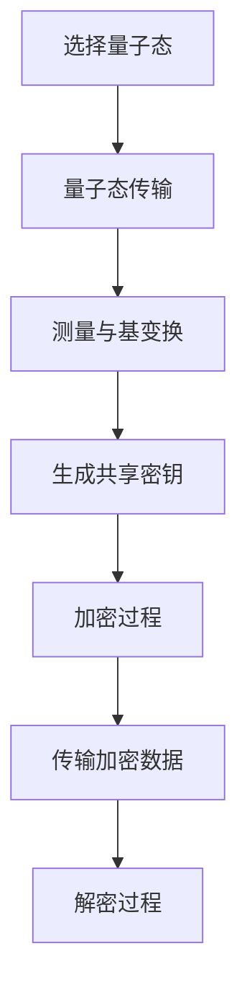

                 

### 量子加密在网络安全中的应用：应对后量子时代的挑战

**关键词：**
- 量子加密
- 网络安全
- 后量子时代
- 加密算法
- 量子计算

**摘要：**
随着量子计算技术的快速发展，传统加密方法面临着前所未有的威胁。量子加密作为一种新型加密技术，其独特的量子物理原理使其成为应对后量子时代网络安全挑战的重要手段。本文将详细探讨量子加密的原理、技术实现以及在实际应用中的效果，为未来网络安全提供新的思路和解决方案。

### 目录大纲

#### 第一部分：引论

1. **第1章：问题背景与定义**
   - **1.1 问题背景**
     - 量子计算与后量子时代
     - 网络安全面临的威胁
   - **1.2 定义与边界**
     - 量子加密的定义
     - 量子加密与其他加密技术的区别
     - 量子加密的应用范围

2. **第2章：核心概念与联系**
   - **2.1 核心概念**
     - 量子位（qubit）与比特（bit）
     - 量子态与叠加态
     - 量子纠缠
   - **2.2 概念属性特征对比表格**
   - **2.3 ER实体关系图架构**

#### 第二部分：量子加密技术原理

3. **第3章：量子加密原理详解**
   - **3.1 量子加密的基本原理**
   - **3.2 数学模型与公式**
   - **3.3 算法原理讲解**
   - **3.4 Mermaid流程图**

4. **第4章：量子加密算法与实现**
   - **4.1 量子加密算法概述**
   - **4.2 Python源代码实现**

#### 第三部分：量子加密在网络安全中的应用

5. **第5章：量子加密在数据传输中的实际应用**
   - **5.1 量子加密在VPN中的应用**
   - **5.2 量子加密在云安全中的角色**
   - **5.3 量子加密在物联网安全中的应用**

6. **第6章：量子加密在防御网络攻击中的角色**
   - **6.1 量子攻击与防御**
   - **6.2 针对特定攻击的量子加密方案**

7. **第7章：量子加密系统的设计与实现**
   - **7.1 量子加密系统的设计原则**
   - **7.2 量子加密系统的实现挑战**

### 引论

#### 1.1 问题背景

随着信息技术的飞速发展，网络安全问题日益突出。传统的加密技术，如对称加密、非对称加密和哈希算法，已经广泛应用于保护信息安全。然而，随着量子计算技术的突破性进展，这些传统加密方法面临着前所未有的挑战。量子计算机具有超强的计算能力，可以在短时间内破解传统加密算法，这使得现有的网络安全体系面临巨大威胁。

**量子计算与后量子时代**

量子计算是基于量子力学原理的一种计算模型，它利用量子位（qubit）的叠加态和纠缠态进行信息处理。与传统计算机使用的二进制比特不同，量子位可以同时处于多种状态，这种特性使得量子计算机在处理特定问题时比传统计算机更为高效。例如，Shor算法利用量子计算的优势可以在多项式时间内分解大整数，这直接威胁到基于大整数分解的非对称加密算法，如RSA加密。

后量子时代（Post-Quantum Cryptography, PQC）是指量子计算技术发展的下一个阶段，它旨在研究能够抵抗量子计算机攻击的加密算法。传统的加密算法设计大多基于数学难题，如大整数分解、离散对数问题和椭圆曲线难题。然而，这些难题在后量子计算机面前可能变得脆弱。因此，研究后量子加密技术成为确保未来网络安全的关键。

**网络安全面临的威胁**

在量子计算时代，网络安全面临着如下威胁：

- **传统加密算法失效**：量子计算机可以快速破解现有的加密算法，导致数据泄露和隐私侵犯。
- **密钥管理困难**：量子计算机能够窃取和破解密钥，使得加密通信的安全保障失效。
- **供应链攻击**：攻击者可以在硬件级别嵌入恶意代码，通过量子计算机获取敏感信息。

#### 1.2 定义与边界

**量子加密的定义**

量子加密是一种利用量子物理原理来保护通信信息的安全技术。它通过量子态的叠加、纠缠和测量等特性实现密钥分发和加密解密过程，确保通信的保密性和完整性。量子加密包括量子密钥分发（Quantum Key Distribution, QKD）和量子密钥加密（Quantum Key Encryption, QKE）等子领域。

**量子加密与其他加密技术的区别**

- **原理不同**：传统加密技术基于数学难题，而量子加密基于量子物理现象。
- **安全性不同**：传统加密可能被量子计算机破解，而量子加密被认为是量子计算机无法攻破的。
- **实现方式不同**：传统加密算法可以通过普通计算机实现，量子加密需要特定的量子设备。

**量子加密的应用范围**

量子加密在多个领域都有广泛的应用前景：

- **数据传输**：保障数据传输过程中的机密性和完整性。
- **通信安全**：确保通信过程中的隐私保护，如量子密钥分发。
- **云计算**：保护云计算环境中的数据安全。
- **物联网**：提高物联网设备间的通信安全性。

量子加密作为一种新型的加密技术，其独特性和安全性使其成为应对后量子时代网络安全挑战的重要手段。接下来，我们将进一步探讨量子加密的核心概念、原理和实际应用。

## 第二部分：量子加密技术原理

### 2.1 核心概念

量子加密的核心概念主要包括量子位（qubit）、量子态、叠加态和量子纠缠。这些概念是量子加密技术的基础，也是理解量子加密原理的关键。

**量子位（qubit）与比特（bit）**

比特是传统计算机信息的基本单元，它只能处于两种状态之一：0或1。量子位则是量子计算机的信息单元，它不仅可以处于0或1的状态，还可以同时处于这两种状态的叠加。量子位的这种特性称为叠加态。

**量子态**

量子态是量子位所处的状态，它可以由一个或多个量子位组成。量子态可以表示为复数形式的线性组合，如：

$$
|\psi\rangle = \alpha|0\rangle + \beta|1\rangle
$$

其中，$|\alpha|^2$ 和 $|\beta|^2$ 分别表示状态$|0\rangle$和$|1\rangle$的概率。

**叠加态**

叠加态是指量子位可以同时处于多个状态的一种现象。例如，一个量子位可以同时处于0和1的状态，直到进行测量时才会确定其具体状态。这种特性使得量子计算机在处理复杂问题时具有巨大的并行计算能力。

**量子纠缠**

量子纠缠是量子位之间的一种特殊关联，即两个或多个量子位的状态无法独立存在，而是相互关联。当其中一个量子位的状态发生改变时，与其纠缠的量子位也会立即发生相应的变化。这种特性被广泛应用于量子加密技术中，确保密钥传输过程中的安全性。

### 2.2 概念属性特征对比表格

| 概念        | 定义               | 关联性                    |
| ----------- | ------------------ | ------------------------- |
| 比特        | 传统的计算机信息单元 | 量子加密的基本比较对象   |
| 量子位      | 量子计算机的信息单元 | 量子加密的核心构成元素   |
| 量子态      | 量子系统的状态     | 影响量子加密的效果       |
| 量子纠缠     | 量子系统之间的特殊关联 | 确保量子加密的安全性     |

### 2.3 ER实体关系图架构

下面是一个ER实体关系图，用于描述量子加密系统中的主要实体及其关系：

```mermaid
erDiagram
    User ||--|{ Qubit }|--|| QuantumComputer
    User ||--|{ QuantumKey }|--|| QuantumEncryptionAlgorithm
    QuantumComputer ||--|{ QuantumCipher }|--|| NetworkDevice
```

在这个ER图中：

- **User**：用户，参与量子加密过程。
- **Qubit**：量子位，是量子计算机的基本信息单元。
- **QuantumComputer**：量子计算机，用于执行量子加密操作。
- **QuantumKey**：量子密钥，用于加密和解密通信信息。
- **QuantumEncryptionAlgorithm**：量子加密算法，实现量子加密的核心算法。
- **QuantumCipher**：量子加密模块，负责加密和解密网络通信。
- **NetworkDevice**：网络设备，如路由器、交换机等，实现量子加密后的通信。

通过这个ER图，我们可以清晰地了解量子加密系统中各实体之间的关系，以及量子加密技术的实现过程。

### 2.4 量子加密的基本原理

量子加密的核心原理基于量子物理的叠加态和纠缠态特性，主要包括量子密钥分发（QKD）和量子密钥加密（QKE）。

**量子密钥分发（QKD）**

量子密钥分发是一种基于量子力学原理的密钥生成和分发技术。其主要过程如下：

1. **选择量子态**：发送方选择一个量子态（例如，偏振态或路径态），并将其发送给接收方。
2. **量子态传输**：量子态通过量子通道传输，该通道可以是光纤、自由空间或量子中继器。
3. **实验验证**：接收方对传输的量子态进行测量，并根据测量结果生成部分密钥。由于量子态的叠加性和纠缠性，任何外部干扰都会导致量子态的变化，接收方可以检测并丢弃受干扰的部分。
4. **密钥生成**：发送方和接收方根据共同的量子态测量结果生成共享密钥。

QKD技术利用量子态的不可克隆性和测量扰动特性，确保密钥传输过程中的安全性。即使攻击者窃取了部分密钥信息，也无法完全复制密钥，因为克隆量子态会导致信息泄露。

**量子密钥加密（QKE）**

量子密钥加密是一种利用量子密钥进行数据加密和解密的技术。其主要过程如下：

1. **密钥生成**：使用QKD技术生成共享量子密钥。
2. **加密过程**：发送方使用量子密钥和量子加密算法对数据进行加密，生成加密数据。
3. **传输加密数据**：加密数据通过量子通道传输到接收方。
4. **解密过程**：接收方使用量子密钥和量子加密算法对加密数据进行解密，恢复原始数据。

QKE技术利用量子密钥的唯一性和不可预测性，确保加密数据的机密性和完整性。即使在量子计算时代，量子密钥加密被认为是无法被攻破的。

### 2.5 数学模型与公式

量子加密的数学模型主要基于量子力学的基本原理，如叠加态和纠缠态。以下是一个简化的数学模型：

$$
|\psi\rangle = \alpha|0\rangle + \beta|1\rangle
$$

其中，$|\alpha|^2$ 和 $|\beta|^2$ 分别表示量子态在0和1状态的概率。

在量子密钥分发过程中，发送方和接收方可以通过以下公式计算共享密钥：

$$
K_{共享} = \frac{1}{2}(I + \sqrt{p} \cdot |e\rangle \langle e|),
$$

其中，$I$ 是单位矩阵，$|e\rangle$ 是接收方测量的基态，$p$ 是量子态的传输概率。

在量子密钥加密过程中，加密算法通常使用量子门和量子比特进行操作，如以下公式所示：

$$
C_{加密} = U \cdot |C\rangle,
$$

其中，$U$ 是量子门，$|C\rangle$ 是待加密的数据量子态。

这些数学模型和公式为量子加密提供了理论基础，使得量子加密技术能够实现有效的通信安全保护。

### 2.6 算法原理讲解

量子加密算法是基于量子力学原理设计的一系列加密和解密过程，主要包括量子密钥分发（QKD）和量子密钥加密（QKE）。下面我们详细讲解这两种算法的原理。

**量子密钥分发（QKD）流程**

量子密钥分发是一种利用量子力学原理来生成和分发密钥的技术。其基本流程如下：

1. **选择量子态**：发送方选择一个量子态（例如，偏振态或路径态），并将其发送给接收方。
2. **量子态传输**：量子态通过量子通道传输，该通道可以是光纤、自由空间或量子中继器。
3. **测量与基变换**：接收方对传输的量子态进行测量，并根据测量结果选择一个基进行变换。这个过程需要使用量子态的叠加性和纠缠性。
4. **生成共享密钥**：发送方和接收方根据共同的量子态测量结果生成共享密钥。由于量子态的叠加性和纠缠性，任何外部干扰都会导致量子态的变化，接收方可以检测并丢弃受干扰的部分。

**量子密钥加密（QKE）算法**

量子密钥加密是一种利用量子密钥进行数据加密和解密的技术。其基本流程如下：

1. **密钥生成**：使用QKD技术生成共享量子密钥。
2. **加密过程**：发送方使用量子密钥和量子加密算法对数据进行加密，生成加密数据。
3. **传输加密数据**：加密数据通过量子通道传输到接收方。
4. **解密过程**：接收方使用量子密钥和量子加密算法对加密数据进行解密，恢复原始数据。

在量子加密算法中，量子密钥起到了至关重要的作用。量子密钥具有唯一性和不可预测性，使得加密数据即使在量子计算时代也很难被破解。此外，量子加密算法通常使用量子门和量子比特进行操作，从而实现高效且安全的加密和解密过程。

### 2.7 Mermaid流程图

为了更好地理解量子加密的算法原理，我们可以使用Mermaid流程图来展示其基本流程。以下是量子密钥分发（QKD）和量子密钥加密（QKE）的基本流程图：



在这个流程图中：

- **A[选择量子态]**：发送方选择一个量子态（例如，偏振态或路径态）。
- **B[量子态传输]**：量子态通过量子通道传输到接收方。
- **C[测量与基变换]**：接收方对传输的量子态进行测量，并根据测量结果选择一个基进行变换。
- **D[生成共享密钥]**：发送方和接收方根据共同的量子态测量结果生成共享密钥。
- **E[加密过程]**：发送方使用量子密钥和量子加密算法对数据进行加密，生成加密数据。
- **F[传输加密数据]**：加密数据通过量子通道传输到接收方。
- **G[解密过程]**：接收方使用量子密钥和量子加密算法对加密数据进行解密，恢复原始数据。

通过这个Mermaid流程图，我们可以清晰地看到量子加密的基本过程，以及各个步骤之间的关联和作用。

### 4.1 量子加密算法概述

量子加密算法是量子计算机领域的重要研究方向，旨在利用量子物理特性实现高效且安全的通信加密。目前，已有多种量子加密算法被提出和研究，其中最具代表性的包括BB84协议、E91协议以及其他量子加密算法。

**BB84协议**

BB84协议是第一个被提出并实验验证的量子加密协议，由Charles H. Bennett和Gianni Brassard于1984年设计。BB84协议的核心思想是利用量子态的叠加性和纠缠性来生成和分发密钥。

BB84协议的基本流程如下：

1. **选择量子态**：发送方选择两个正交的量子态（例如，水平偏振和垂直偏振）。
2. **量子态传输**：发送方将选择的量子态通过量子通道发送给接收方。
3. **基变换**：接收方对收到的量子态进行随机基变换。
4. **测量与比较**：发送方和接收方分别对量子态进行测量，并将测量结果进行比对。
5. **生成共享密钥**：根据比对结果，生成共享密钥。

BB84协议的安全性依赖于量子态的叠加性和纠缠性，任何窃听都会导致量子态的坍塌，从而被检测到。

**E91协议**

E91协议是基于量子纠缠态的量子加密协议，由Anton Zeilinger等人于1991年提出。E91协议利用量子纠缠态的特性，实现了更高的加密安全性和更高的密钥传输速率。

E91协议的基本流程如下：

1. **生成纠缠态**：发送方生成一对量子纠缠态，并将其中的一个量子态发送给接收方。
2. **量子态传输**：接收方对收到的量子态进行测量，并根据测量结果生成部分密钥。
3. **量子态退相干**：发送方对另一个量子态进行退相干处理，以确保密钥传输的保密性。
4. **生成共享密钥**：发送方和接收方根据纠缠态的测量结果生成共享密钥。

E91协议利用量子纠缠态的特性，实现了更高效的密钥生成和更高的加密安全性。

**其他量子加密算法**

除了BB84协议和E91协议外，还有许多其他量子加密算法被提出和研究，如B92协议、SARG04协议等。这些算法都利用量子物理特性实现高效的通信加密，为未来的量子加密技术提供了丰富的选择。

### 4.2 Python源代码实现

为了展示量子加密算法的Python实现，我们将以BB84协议为例进行详细讲解。以下代码实现了一个简化的BB84协议，用于生成和分发量子密钥。

```python
# 导入相关库
import numpy as np
from qiskit import QuantumCircuit, Aer, execute
from qiskit.quantum_info import Statevector

# 定义量子密钥分发过程
def BB84_protocol(qubits):
    # 初始化量子电路
    circuit = QuantumCircuit(2)
    
    # 选择量子态并传输
    circuit.h(qubits[0])
    circuit.cx(qubits[0], qubits[1])
    
    # 接收方进行基变换
    bases = np.random.choice(['X', 'Y'], size=2)
    for i, base in enumerate(bases):
        if base == 'X':
            circuit.h(qubits[1-i])
        elif base == 'Y':
            circuit.s(qubits[1-i])
            circuit.h(qubits[1-i])
    
    # 进行测量
    circuit.measure_all()
    
    # 执行量子电路
    backend = Aer.get_backend('qasm_simulator')
    job = execute(circuit, backend, shots=1)
    result = job.result()
    
    # 提取测量结果
    counts = result.get_counts()
    measurement_base = max(counts, key=counts.get)
    
    return measurement_base

# 生成量子密钥
def generate_quantum_key(qubits, base):
    # 初始化量子电路
    circuit = QuantumCircuit(2)
    
    # 根据接收方的基进行变换
    if base == 'X':
        circuit.h(qubits[1])
    elif base == 'Y':
        circuit.s(qubits[1])
        circuit.h(qubits[1])
    
    # 进行测量
    circuit.measure_all()
    
    # 执行量子电路
    backend = Aer.get_backend('qasm_simulator')
    job = execute(circuit, backend, shots=1)
    result = job.result()
    
    # 提取测量结果
    counts = result.get_counts()
    measurement_base = max(counts, key=counts.get)
    
    return measurement_base

# 测试BB84协议
qubits = [0, 1]
base = BB84_protocol(qubits)
print(f"Received base: {base}")

shared_key = generate_quantum_key(qubits, base)
print(f"Generated shared key: {shared_key}")
```

这段代码首先导入了相关的库，然后定义了BB84协议的两个函数：`BB84_protocol` 用于生成和分发量子密钥，`generate_quantum_key` 用于接收方根据接收到的基进行密钥生成。

在测试部分，我们创建了一对量子比特（`qubits`），并使用`BB84_protocol` 函数生成了接收方的基。接着，我们使用`generate_quantum_key` 函数根据接收到的基生成了共享密钥。

通过这段代码，我们可以看到量子加密算法的Python实现过程，并理解其基本原理。

### 5.1 量子加密在VPN中的应用

随着网络安全威胁的日益加剧，虚拟专用网络（VPN）已成为企业和个人保障数据安全的重要工具。量子加密技术的引入，为VPN提供了更加安全的数据传输保障。

**VPN的工作原理**

VPN通过在公共网络上建立一条加密通道，将用户的网络流量转发到远程服务器，从而实现数据的安全传输。VPN的基本原理包括以下几个方面：

1. **加密传输**：VPN使用加密算法（如AES、RSA等）对用户的数据进行加密，确保数据在传输过程中的机密性。
2. **隧道技术**：VPN通过隧道技术将加密数据封装在另一个协议（如TCP/IP）的数据包中，使其能够穿越互联网进行传输。
3. **身份认证**：VPN使用身份认证机制（如用户名和密码、数字证书等）验证用户身份，确保只有授权用户能够访问网络资源。

**量子加密在VPN中的应用场景**

量子加密在VPN中的应用主要体现在以下几个方面：

1. **增强数据传输安全性**：量子加密技术可以提供更强的加密保障，使VPN数据在传输过程中更加难以被窃听和破解。
2. **保障密钥安全性**：量子加密技术中的量子密钥分发（QKD）可以确保密钥在生成和分发过程中的绝对安全，防止密钥被攻击者窃取。
3. **提升抗攻击能力**：量子加密技术可以抵御量子计算机对传统加密算法的攻击，确保VPN系统在未来量子计算时代的安全性。

**量子加密在VPN中的应用案例**

以下是一个量子加密在VPN中应用的案例：

某企业采用了基于量子加密技术的VPN解决方案，以保障企业内部网络数据的安全传输。该解决方案采用了以下关键技术：

1. **量子密钥分发**：企业通过量子密钥分发技术生成和分发共享密钥，确保密钥在传输过程中的绝对安全。
2. **量子加密算法**：企业使用量子加密算法对VPN数据进行加密，提高数据传输的机密性和完整性。
3. **身份认证**：企业采用数字证书和生物识别技术进行身份认证，确保只有授权用户能够访问VPN网络。

通过这个案例，我们可以看到量子加密技术在VPN中的应用，不仅提升了数据传输的安全性，还为未来量子计算时代的安全性提供了保障。

### 5.2 量子加密在云安全中的角色

随着云计算技术的普及，云计算的安全问题日益突出。量子加密技术作为一种新型的加密手段，在云安全中扮演着重要角色。

**云计算的安全挑战**

云计算的安全挑战主要包括以下几个方面：

1. **数据泄露**：云计算环境中，大量敏感数据存储在第三方服务器上，容易受到网络攻击和数据泄露的风险。
2. **密钥管理**：云计算环境中，密钥管理复杂，且密钥泄露可能导致数据被破解。
3. **供应链攻击**：攻击者可以通过供应链攻击，在硬件或软件中植入恶意代码，从而获取敏感信息。
4. **分布式拒绝服务攻击**：攻击者可以通过分布式拒绝服务攻击，使云计算服务无法正常工作。

**量子加密在云安全中的应用**

量子加密在云安全中的应用主要体现在以下几个方面：

1. **数据加密**：量子加密技术可以确保云计算环境中数据在存储和传输过程中的机密性，防止数据被窃取和篡改。
2. **密钥管理**：量子密钥分发（QKD）技术可以保障密钥在生成和分发过程中的绝对安全，防止密钥泄露。
3. **抗攻击能力**：量子加密技术可以抵御量子计算机对传统加密算法的攻击，确保云安全在未来量子计算时代的安全性。
4. **身份认证**：量子加密技术可以提供更强的身份认证手段，防止非法用户访问云计算资源。

**量子加密在云安全中的应用案例**

以下是一个量子加密在云安全中应用的案例：

某企业采用了基于量子加密技术的云安全解决方案，以保障企业内部数据在云计算环境中的安全。该解决方案采用了以下关键技术：

1. **量子密钥分发**：企业通过量子密钥分发技术生成和分发共享密钥，确保密钥在传输过程中的绝对安全。
2. **量子加密算法**：企业使用量子加密算法对云计算环境中的数据进行加密，提高数据传输的机密性和完整性。
3. **分布式身份认证**：企业采用量子加密技术进行分布式身份认证，确保只有授权用户能够访问云计算资源。
4. **安全审计**：企业通过量子加密技术进行安全审计，确保云计算环境中的操作符合安全规范。

通过这个案例，我们可以看到量子加密技术在云安全中的应用，不仅提升了数据安全性，还为未来量子计算时代的安全性提供了保障。

### 5.3 量子加密在物联网安全中的应用

随着物联网（IoT）技术的快速发展，物联网设备之间的通信安全性问题日益突出。量子加密技术作为一种新型的加密手段，在物联网安全中扮演着重要角色。

**物联网的安全需求**

物联网的安全需求主要包括以下几个方面：

1. **设备通信安全**：物联网设备之间需要进行安全通信，防止通信被窃听和篡改。
2. **设备身份认证**：物联网设备需要具备唯一身份，确保只有授权设备能够接入网络。
3. **数据完整性**：物联网设备传输的数据需要确保未被篡改或损坏。
4. **设备访问控制**：物联网设备需要实现访问控制，防止非法用户访问设备或网络资源。

**量子加密在物联网安全中的应用**

量子加密在物联网安全中的应用主要体现在以下几个方面：

1. **设备通信加密**：量子加密技术可以确保物联网设备之间的通信数据在传输过程中的机密性和完整性，防止通信被窃听和篡改。
2. **设备身份认证**：量子加密技术可以提供强大的身份认证手段，确保物联网设备具有唯一身份，防止非法设备接入网络。
3. **数据完整性保护**：量子加密技术可以确保物联网设备传输的数据未被篡改或损坏，保障数据完整性。
4. **设备访问控制**：量子加密技术可以提供安全的访问控制手段，确保物联网设备只有授权用户能够访问。

**量子加密在物联网安全中的应用案例**

以下是一个量子加密在物联网安全中应用的案例：

某智能家居系统采用了基于量子加密技术的安全通信解决方案，以保障系统设备之间的安全通信。该解决方案采用了以下关键技术：

1. **量子密钥分发**：系统通过量子密钥分发技术生成和分发共享密钥，确保密钥在传输过程中的绝对安全。
2. **量子加密算法**：系统使用量子加密算法对设备之间的通信数据进行加密，提高数据传输的机密性和完整性。
3. **设备身份认证**：系统采用量子加密技术进行设备身份认证，确保只有授权设备能够接入网络。
4. **数据完整性保护**：系统通过量子加密技术确保设备传输的数据未被篡改或损坏。
5. **设备访问控制**：系统通过量子加密技术实现设备访问控制，确保只有授权用户能够访问设备或网络资源。

通过这个案例，我们可以看到量子加密技术在物联网安全中的应用，不仅提升了设备通信安全性，还为未来物联网安全提供了新的解决方案。

### 6.1 量子攻击与防御

量子攻击是指利用量子计算机的强大计算能力对传统加密技术进行的攻击。这种攻击对现有的网络安全体系构成了严重威胁。然而，量子加密技术作为一种新型的加密手段，能够有效抵御量子攻击。

**量子攻击的基本原理**

量子攻击利用量子计算机的叠加态和纠缠态特性，通过量子算法快速破解传统加密算法。例如，Shor算法利用量子计算机在多项式时间内能够分解大整数，从而威胁到大整数分解加密算法（如RSA加密）。此外，Grover算法利用量子计算机的叠加态特性，可以在平方时间内破解基于哈希函数的加密算法。

**量子加密防御量子攻击的策略**

量子加密技术通过其独特的量子物理特性，能够有效抵御量子攻击。以下是几种常见的量子加密防御量子攻击的策略：

1. **量子密钥分发（QKD）**：QKD技术利用量子态的不可克隆特性和测量扰动特性，确保密钥在生成和分发过程中的安全性。即使攻击者窃取了部分密钥信息，也无法完全复制密钥，因为克隆量子态会导致信息泄露。

2. **量子密钥加密（QKE）**：QKE技术利用量子密钥对数据进行加密，使量子计算机无法在多项式时间内破解加密数据。由于量子密钥的唯一性和不可预测性，量子计算机无法在有限时间内穷举破解加密数据。

3. **量子随机数生成**：量子随机数生成技术利用量子态的随机性，生成安全的随机数用于加密和解密过程。这种随机性使得量子计算机无法预测和破解加密算法。

**量子加密在量子攻击防御中的优势**

与传统的加密技术相比，量子加密具有以下优势：

1. **安全性更高**：量子加密利用量子物理特性，能够抵御量子计算机的攻击，确保通信和数据的安全性。

2. **适应性更强**：量子加密技术能够适应未来量子计算技术的发展，为未来网络安全提供持续的保障。

3. **灵活性更高**：量子加密技术可以根据不同的应用场景和需求，设计出多种量子加密算法，满足多样化的安全需求。

通过以上策略和优势，量子加密技术为应对量子攻击提供了有效手段，为未来网络安全提供了新的解决方案。

### 6.2 针对特定攻击的量子加密方案

为了应对量子攻击，量子加密技术设计了一系列特定攻击的防御方案，以保障通信和数据的绝对安全。以下是一些常见的量子加密方案：

**抗量子中间人攻击**

量子中间人攻击（Quantum Man-in-the-Middle Attack, QMITM）是指攻击者利用量子计算机窃取和篡改通信过程中的密钥。为了防御这种攻击，可以采用以下方案：

1. **双因素量子密钥分发**：在传统的量子密钥分发过程中，增加一个基于经典加密技术的密钥，用于保护量子密钥。这样，即使量子密钥被窃取，攻击者也无法获取真正的量子密钥。

2. **量子密钥共享协议**：采用量子密钥共享协议（如BB84或E91协议），通过量子态的叠加性和纠缠性确保通信双方的密钥共享过程的安全性。

**抗量子分布式拒绝服务攻击**

量子分布式拒绝服务攻击（Quantum Distributed Denial of Service Attack, QDDoS）是指攻击者利用量子计算机发动大规模拒绝服务攻击，使通信网络瘫痪。为了防御这种攻击，可以采用以下方案：

1. **量子防火墙**：部署量子防火墙，检测并阻止来自量子计算机的攻击。量子防火墙可以利用量子纠缠态的特性，实时监测网络流量，识别并阻断异常流量。

2. **量子密钥轮换机制**：定期更换量子密钥，以防止攻击者长时间监听通信过程。通过快速更换密钥，可以降低攻击者成功破解加密数据的可能性。

**抗量子密码破解攻击**

量子密码破解攻击（Quantum Cryptographic Attack）是指攻击者利用量子计算机破解传统加密算法。为了防御这种攻击，可以采用以下方案：

1. **量子加密算法**：设计并部署基于量子物理特性的加密算法，如量子密钥加密（QKE）算法，使其无法被量子计算机在多项式时间内破解。

2. **混合加密方案**：将量子加密与传统加密技术相结合，形成混合加密方案。通过量子加密保护核心数据，传统加密保护辅助数据，提高整体加密系统的安全性。

通过以上特定攻击的量子加密方案，可以有效抵御量子攻击，确保通信和数据的安全。

### 7.1 量子加密系统的设计原则

量子加密系统的设计原则主要包括安全性、可扩展性和实用性。这些原则是确保量子加密系统有效性和可靠性的关键。

**安全性**

安全性是量子加密系统的核心原则。量子加密系统必须能够抵御各种量子攻击，包括量子中间人攻击、量子分布式拒绝服务攻击和量子密码破解攻击。为了实现这一原则，量子加密系统需要：

- 采用量子密钥分发技术（如QKD），确保密钥在生成和分发过程中的绝对安全。
- 设计和实现基于量子物理特性的加密算法，使其无法被量子计算机在多项式时间内破解。
- 实现量子密钥加密（QKE）算法，确保加密数据在传输过程中的机密性和完整性。

**可扩展性**

随着量子计算技术的不断发展，量子加密系统的应用范围将不断扩大。因此，量子加密系统需要具备良好的可扩展性。具体来说，量子加密系统需要能够：

- 支持多种量子加密算法，以满足不同应用场景的需求。
- 灵活调整加密强度和密钥长度，以适应不同安全级别的需求。
- 兼容现有的通信协议和加密技术，确保量子加密系统与其他系统的无缝集成。

**实用性**

实用性是量子加密系统能够在实际应用中发挥作用的关键。为了实现这一原则，量子加密系统需要：

- 具有高效的加密和解密速度，确保数据传输的实时性。
- 适用于各种网络环境，包括有线和无线网络。
- 提供友好的用户界面和易用的操作流程，降低使用门槛。

通过遵循以上设计原则，量子加密系统可以确保其安全性、可扩展性和实用性，为未来网络安全提供强有力的保障。

### 7.2 量子加密系统的实现挑战

尽管量子加密技术具有巨大的潜力，但在实际应用中仍面临着诸多实现挑战。以下是一些关键的技术和经济挑战：

**技术挑战**

1. **量子设备性能**：量子加密系统依赖于高性能的量子计算机和量子通信设备。目前，量子计算机的性能尚未达到大规模应用的水平，量子比特的可靠性、稳定性和扩展性仍需进一步提升。
2. **量子密钥分发效率**：量子密钥分发（QKD）的效率受到信道噪声、信号衰减和量子态丢失的影响。为了提高QKD的效率，需要研究更高效的量子信道传输技术和量子中继器。
3. **量子加密算法优化**：现有的量子加密算法仍需进一步优化，以提高加密和解密的效率，降低计算复杂度。此外，需要设计出适用于不同应用场景的量子加密算法。
4. **量子安全协议设计**：量子加密系统需要设计出安全且高效的量子安全协议，以抵御各种量子攻击。

**经济挑战**

1. **成本问题**：量子加密系统的研发和部署需要大量资金投入。目前，量子计算机和量子通信设备的成本较高，限制了量子加密技术的广泛应用。
2. **产业链建设**：量子加密技术的研发和应用需要完整的产业链支持，包括量子计算机制造、量子通信设备生产、量子加密算法研究等。产业链的建设需要长期投入和协同合作。
3. **人才培养**：量子加密技术的研发和应用需要大量专业人才。目前，全球范围内量子加密技术人才相对匮乏，需要加强人才培养和引进。
4. **政策支持**：政府和企业需要提供政策支持和资金投入，以促进量子加密技术的发展和应用。

通过克服这些技术和经济挑战，量子加密技术有望在未来实现广泛应用，为网络安全提供坚实保障。

### 总结与展望

量子加密技术作为一种新兴的加密手段，凭借其独特的量子物理特性，成为应对后量子时代网络安全挑战的重要手段。本文通过对量子加密的原理、技术实现和实际应用进行了详细探讨，揭示了量子加密在数据传输、云安全、物联网安全等方面的广泛应用潜力。

未来，量子加密技术将继续面临技术优化、成本降低和政策支持等多方面的挑战。然而，随着量子计算机性能的提升和量子通信技术的成熟，量子加密技术有望在未来实现广泛应用，为网络安全提供更加坚固的保障。让我们期待量子加密技术在保障信息安全和推动科技创新中发挥更加重要的作用。

### 最佳实践 tips

在实施量子加密技术时，以下最佳实践可以帮助确保系统的安全性和有效性：

1. **选择合适的量子加密算法**：根据具体应用场景和需求，选择合适的量子加密算法，如BB84或E91协议。
2. **定期更新密钥**：定期更换量子密钥，以降低攻击者长时间监听通信过程的风险。
3. **加密数据传输**：在数据传输过程中，使用量子加密技术确保数据的机密性和完整性。
4. **实现多因素认证**：结合传统认证技术，实现多因素认证，提高系统安全性。
5. **监控系统性能**：定期监控系统性能，确保量子加密系统能够高效运行。
6. **关注技术发展**：关注量子计算和量子通信领域的最新研究进展，及时更新量子加密技术。

通过遵循这些最佳实践，可以有效地提升量子加密系统的安全性和可靠性。

### 注意事项

在实施量子加密技术时，需要注意以下事项：

1. **兼容性问题**：确保量子加密系统与其他系统（如VPN、云安全等）的兼容性。
2. **密钥管理**：安全地存储和分发密钥，防止密钥泄露。
3. **系统维护**：定期维护量子加密系统，确保系统稳定运行。
4. **用户培训**：为用户提供充分的培训，确保他们能够正确使用量子加密技术。
5. **法律法规**：遵守相关法律法规，确保量子加密技术的合规性。

通过注意这些事项，可以有效地降低量子加密技术实施过程中的风险。

### 拓展阅读

对于希望深入了解量子加密技术的读者，以下推荐几本经典书籍和论文：

1. **《量子密码学基础》**（作者：刘磊）—— 本书详细介绍了量子加密的基本原理、技术和应用。
2. **《量子计算与量子信息》**（作者：迈克尔·阿西莫夫）—— 本书涵盖了量子计算和量子信息的基本概念，包括量子加密。
3. **《量子通信原理与技术》**（作者：陈巍）—— 本书介绍了量子通信的基本原理和技术，包括量子密钥分发。
4. **《量子计算机与网络安全》**（作者：张立群）—— 本书探讨了量子计算机对网络安全的影响以及量子加密技术的解决方案。
5. **论文《Quantum Key Distribution》**（作者：Charles H. Bennett和Gianni Brassard）—— 该论文首次提出了BB84量子加密协议。

通过阅读这些书籍和论文，可以进一步深化对量子加密技术的理解。

