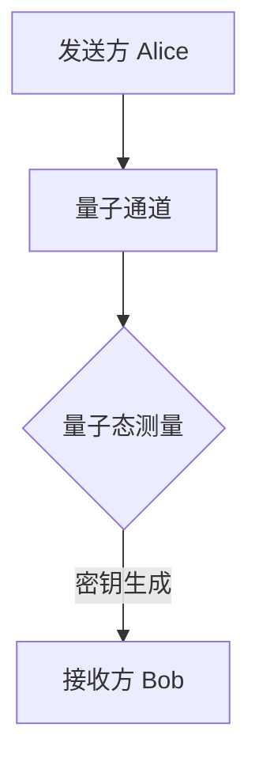
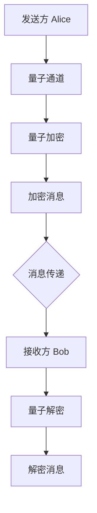
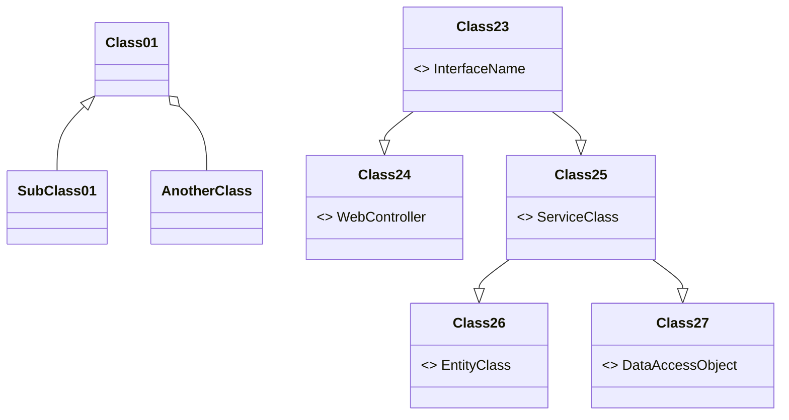
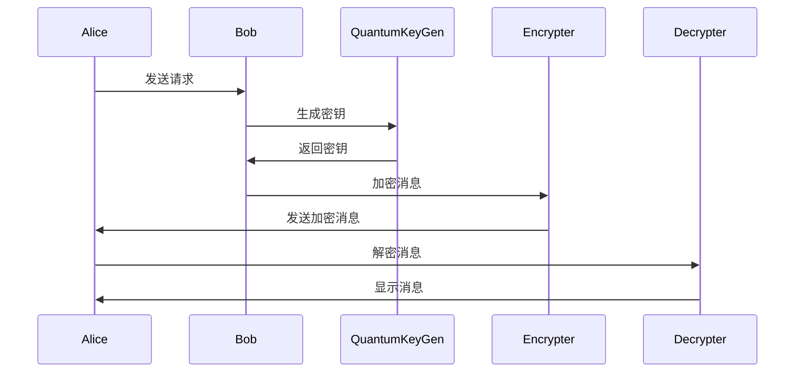
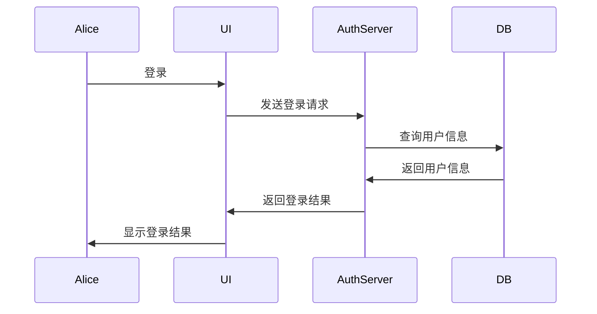
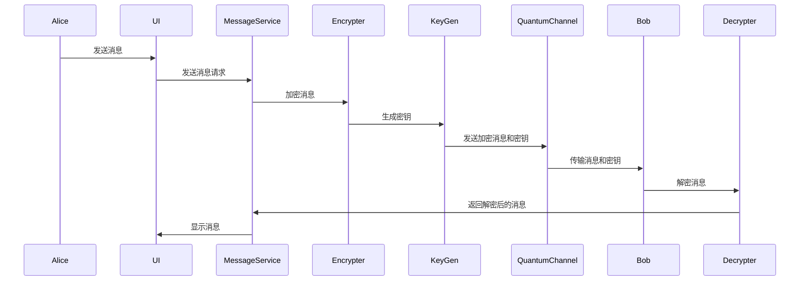

                 


### 量子安全通信的发展趋势

> 关键词：量子通信、安全通信、量子密钥分发、量子密码学、量子隐形传态

> 摘要：量子安全通信是一种基于量子力学原理的通信方式，它利用量子纠缠、量子隐形传态等现象实现安全的信息传输。本文将探讨量子安全通信的核心概念、关键技术、协议、实现技术以及未来发展趋势，分析其在国家安全、金融、医疗等领域的应用前景。

## 目录

1. 引言
2. 量子安全通信的核心概念
   2.1 量子纠缠
   2.2 量子隐形传态
   2.3 量子密钥分发
   2.4 量子密码学
3. 量子安全通信的关键技术
   3.1 量子传感器
   3.2 量子中继器
   3.3 量子纠缠
   3.4 量子通信的物理实现
4. 量子安全通信协议
   4.1 量子通信协议概述
   4.2 量子通信协议的发展趋势
   4.3 常见的量子通信协议
   4.4 量子通信协议的安全分析
5. 量子安全通信的应用场景
   5.1 国家安全
   5.2 金融
   5.3 医疗
   5.4 其他领域
6. 量子安全通信的挑战与未来发展趋势
   6.1 现有挑战
   6.2 发展趋势
   6.3 未来展望
   6.4 影响因素分析
7. 量子安全通信的产业与应用
   7.1 产业现状
   7.2 应用领域
   7.3 成功案例
   7.4 发展前景
8. 最佳实践与未来展望
   8.1 最佳实践
   8.2 小结
   8.3 注意事项
   8.4 拓展阅读

## 引言

随着信息技术的迅猛发展，信息安全问题日益突出。传统的加密通信技术在面对量子计算等新型攻击手段时，显得力不从心。量子安全通信作为一种基于量子力学原理的新型通信方式，以其绝对安全性受到了广泛关注。量子安全通信利用量子纠缠、量子隐形传态等现象实现信息的传输，在理论上能够抵御所有已知的量子计算攻击，因此被誉为“绝对安全”的通信方式。

本文将首先介绍量子安全通信的核心概念，包括量子纠缠、量子隐形传态、量子密钥分发和量子密码学。接着，我们将探讨量子安全通信的关键技术，如量子传感器、量子中继器和量子纠缠等。随后，我们将分析量子安全通信协议，包括常见的量子通信协议及其安全分析。接着，我们将讨论量子安全通信的应用场景，涵盖国家安全、金融、医疗等领域。然后，我们将分析量子安全通信的挑战与未来发展趋势，探讨其面临的问题以及未来的发展方向。最后，我们将总结量子安全通信的产业与应用现状，并给出最佳实践和未来展望。

### 量子安全通信的核心概念

#### 量子纠缠

量子纠缠是量子力学中一种特殊的现象，描述了两个或多个粒子在量子态上的相互依赖关系。当两个粒子发生纠缠后，无论它们相距多远，对其中一个粒子的测量将立即影响到另一个粒子的状态。这种现象在量子安全通信中具有重要意义，因为通过量子纠缠，可以实现信息的绝对安全传输。

**量子纠缠的数学描述：**

设 \(|\psi\rangle\) 表示两个粒子的总量子态，则量子纠缠态可以表示为：

$$
|\psi\rangle = \frac{1}{\sqrt{2}} (|01\rangle + |10\rangle)
$$

其中，\( |0\rangle \) 和 \( |1\rangle \) 分别表示粒子的基态和激发态。

**量子纠缠的应用：**

量子纠缠是实现量子密钥分发（QKD）的基础，通过量子纠缠态，可以实现通信双方的高效密钥生成。此外，量子纠缠还在量子隐形传态和量子计算等领域具有重要应用。

#### 量子隐形传态

量子隐形传态（Quantum teleportation）是一种基于量子纠缠的量子信息传输过程，它可以在两个量子系统之间实现信息传递，而不需要通过它们之间的直接通信渠道。在量子隐形传态过程中，发送方将量子态和经典信息传输给接收方，接收方利用这些信息重构出原始的量子态。

**量子隐形传态的数学描述：**

设 \(|\psi\rangle\) 为要传输的量子态，|\Phi\rangle 为纠缠态，则量子隐形传态的数学描述为：

$$
|\Phi\rangle_A|\psi\rangle_B = \frac{1}{\sqrt{2}}(|00\rangle + |11\rangle)
$$

其中，\( A \) 和 \( B \) 分别表示发送方和接收方的量子系统。

**量子隐形传态的应用：**

量子隐形传态是实现量子信息远程传输的基础，它在量子通信、量子计算等领域具有重要应用。此外，量子隐形传态还可以用于量子计算中的量子态传输和量子纠错。

#### 量子密钥分发

量子密钥分发（Quantum Key Distribution，QKD）是一种利用量子力学原理实现安全密钥分配的方法。在QKD过程中，通信双方通过量子通道交换量子态，利用量子态的不可克隆性确保密钥的安全传输。

**量子密钥分发的数学描述：**

设 \(|\phi\rangle\) 为量子密钥，通过量子纠缠态 \(|\Phi\rangle\)，可以生成共享密钥 \(|\psi\rangle\)：

$$
|\Phi\rangle_A|\phi\rangle_B = \frac{1}{\sqrt{2}}(|00\rangle + |11\rangle)
$$

**量子密钥分发的优势：**

量子密钥分发具有绝对安全性，因为量子态的测量会破坏其原有的状态，从而使得窃听行为可以被检测。此外，QKD 还可以实现加密通信中的密钥共享，提高通信的安全性和隐私性。

#### 量子密码学

量子密码学（Quantum Cryptography）是利用量子力学原理实现信息加密和解密的一门学科。量子密码学包括量子密钥分发和量子加密协议，利用量子态的不可克隆性和纠缠性，实现信息的绝对安全传输。

**量子密码学的数学描述：**

量子密码学中的加密和解密过程涉及量子态的制备、测量和操作。例如，量子密钥分发中的量子态制备和测量可以表示为：

$$
|\phi\rangle = \frac{1}{\sqrt{2}}(|0\rangle + |1\rangle)
$$

测量 \(|\phi\rangle\) 后，得到的结果为 \(|0\rangle\) 或 \(|1\rangle\)，从而实现加密和解密。

**量子密码学的优势：**

量子密码学具有绝对安全性，因为量子态的测量会破坏其原有的状态，使得窃听行为可以被检测。此外，量子密码学还可以实现高效率的加密和解密，提高通信的隐私性和安全性。

### 量子安全通信的关键技术

#### 量子传感器

量子传感器是一种利用量子效应实现高灵敏度测量的装置。在量子安全通信中，量子传感器用于检测量子态的干扰和窃听行为。例如，量子纠缠态传感器可以检测量子纠缠态的破坏，从而发现潜在的窃听者。

**量子传感器的数学描述：**

量子传感器的工作原理基于量子态的测量，例如，量子纠缠态传感器的测量过程可以表示为：

$$
|\Phi\rangle = \frac{1}{\sqrt{2}}(|00\rangle + |11\rangle)
$$

测量 \(|\Phi\rangle\) 后，得到的结果为 \(|00\rangle\) 或 \(|11\rangle\)，从而实现传感器信号的检测。

**量子传感器的优势：**

量子传感器具有高灵敏度，能够检测微小的量子态变化，从而提高量子安全通信的安全性。

#### 量子中继器

量子中继器是一种用于延长量子通信距离的装置。在量子安全通信中，量子中继器可以实现量子态的传输和放大，从而延长量子通信链路。量子中继器的工作原理基于量子纠缠和量子隐形传态。

**量子中继器的数学描述：**

量子中继器的工作过程可以表示为：

$$
|\Phi\rangle = \frac{1}{\sqrt{2}}(|00\rangle + |11\rangle)
$$

通过量子隐形传态，实现量子态的传输和放大。

**量子中继器的优势：**

量子中继器能够延长量子通信链路的距离，提高量子安全通信的实用性和可靠性。

#### 量子纠缠

量子纠缠是实现量子安全通信的核心技术之一。量子纠缠态的生成、传输和检测在量子安全通信中具有重要意义。

**量子纠缠的数学描述：**

量子纠缠态的生成和传输可以表示为：

$$
|\Psi\rangle = \frac{1}{\sqrt{2}}(|00\rangle + |11\rangle)
$$

测量 \(|\Psi\rangle\) 后，得到的结果为 \(|00\rangle\) 或 \(|11\rangle\)，从而实现量子纠缠的检测。

**量子纠缠的优势：**

量子纠缠态可以实现绝对安全的通信，因为量子态的测量会破坏其原有的状态，从而使得窃听行为可以被检测。

#### 量子通信的物理实现

量子通信的物理实现包括量子传感、量子中继、量子纠缠等关键技术。在实际应用中，量子通信系统需要解决量子态的生成、传输、检测和放大等问题。

**量子通信的物理实现流程：**

1. 量子态的生成：利用量子光源产生量子态。
2. 量子态的传输：利用量子通道实现量子态的传输。
3. 量子态的检测：利用量子传感器检测量子态。
4. 量子态的放大：利用量子中继器实现量子态的放大。

**量子通信的物理实现优势：**

量子通信的物理实现能够实现绝对安全的通信，因为量子态的测量会破坏其原有的状态，从而使得窃听行为可以被检测。

### 量子安全通信协议

#### 量子通信协议概述

量子通信协议是量子安全通信的核心组成部分，它定义了量子态的生成、传输、检测和加密等过程。量子通信协议的目标是实现绝对安全的通信，保护信息免受窃听和篡改。

**量子通信协议的基本原理：**

量子通信协议基于量子态的不可克隆性和纠缠性，通过量子态的测量和传输实现信息的绝对安全传输。量子通信协议主要包括量子密钥分发协议和量子加密协议。

#### 量子通信协议的发展趋势

随着量子技术的不断发展，量子通信协议也在不断演进。目前，量子通信协议的发展趋势包括：

1. **提高通信速率：** 随着量子传感技术和量子中继技术的进步，量子通信协议的通信速率不断提高。
2. **增加通信距离：** 量子中继器的出现使得量子通信协议能够实现更长的通信距离。
3. **提高抗干扰能力：** 量子传感器和量子纠缠技术的应用，使得量子通信协议具有更高的抗干扰能力。
4. **多样化协议设计：** 随着量子密码学的发展，新的量子通信协议不断涌现，以满足不同应用场景的需求。

#### 常见的量子通信协议

目前，常见的量子通信协议包括BB84协议、B92协议和E91协议等。以下是这些协议的简要介绍：

1. **BB84协议：** BB84协议是最早提出的量子密钥分发协议，它基于量子态的不可克隆性，实现了绝对安全的密钥分发。
2. **B92协议：** B92协议是基于量子纠缠的量子密钥分发协议，它比BB84协议具有更高的通信速率和抗干扰能力。
3. **E91协议：** E91协议是一种基于量子纠缠的量子密钥分发协议，它利用量子纠缠态实现高效的密钥分发。

#### 量子通信协议的安全分析

量子通信协议的安全性主要依赖于量子态的不可克隆性和纠缠性。通过量子态的测量和传输，量子通信协议能够实现绝对安全的通信。然而，量子通信协议也存在一些潜在的安全威胁，如量子干扰、量子窃听等。针对这些威胁，研究人员提出了一系列安全措施，如量子传感器、量子中继器等，以提高量子通信协议的安全性。

### 量子安全通信的应用场景

量子安全通信具有绝对安全性，适用于需要高度保密的通信场景。以下是一些典型的应用场景：

#### 国家安全

国家安全是量子安全通信最重要的应用领域之一。量子安全通信可以用于政府间保密通信、军事通信等，确保信息的安全性和保密性。

#### 金融

金融领域的信息安全和隐私保护至关重要。量子安全通信可以用于银行、证券公司等金融机构之间的保密通信，保护客户的敏感信息。

#### 医疗

医疗信息的安全性和隐私保护也备受关注。量子安全通信可以用于医院、诊所等医疗机构之间的保密通信，保护患者的医疗记录和个人隐私。

#### 其他领域

除了上述领域，量子安全通信还可以应用于物联网、智能交通、远程办公等场景，为各个领域的信息传输提供安全保障。

### 量子安全通信的挑战与未来发展趋势

尽管量子安全通信具有绝对安全性，但在实际应用中仍面临诸多挑战。以下是一些主要的挑战及其未来发展趋势：

#### 挑战

1. **通信距离有限：** 当前量子通信技术尚无法实现长距离的量子态传输，限制了量子安全通信的应用范围。
2. **抗干扰能力不足：** 量子通信协议在遭受外部干扰时，可能会降低通信的稳定性。
3. **技术成熟度：** 量子通信技术尚处于发展阶段，技术成熟度较低，影响了其大规模应用。

#### 发展趋势

1. **量子中继技术：** 通过发展量子中继技术，实现长距离量子通信。
2. **抗干扰技术：** 研究抗干扰技术，提高量子通信协议的抗干扰能力。
3. **量子传感器：** 发展高灵敏度的量子传感器，提高量子态的检测和测量精度。

### 量子安全通信的产业与应用

#### 产业现状

量子安全通信产业正处于快速发展阶段，国内外众多研究机构和企业纷纷投入研发。我国在量子安全通信领域取得了显著成果，已实现量子密钥分发、量子隐形传态等技术的产业化应用。

#### 应用领域

量子安全通信已广泛应用于政府、金融、医疗等领域，为各个领域的信息传输提供安全保障。

#### 成功案例

1. **政府通信：** 我国政府已采用量子安全通信技术实现政府间的保密通信。
2. **金融行业：** 银行、证券公司等金融机构采用量子安全通信技术保护客户信息。
3. **医疗领域：** 医疗机构采用量子安全通信技术保护患者的医疗记录和个人隐私。

#### 发展前景

随着量子技术的不断发展，量子安全通信产业具有广阔的发展前景。预计在未来几年内，量子安全通信将在更多领域得到应用，成为信息安全领域的重要支柱。

### 最佳实践与未来展望

#### 最佳实践

1. **加强技术研发：** 积极投入研发，提高量子安全通信技术的成熟度和稳定性。
2. **完善法规标准：** 制定相关法规和标准，规范量子安全通信产业的发展。
3. **促进产业合作：** 加强国内外研究机构和企业之间的合作，推动量子安全通信技术的创新和应用。

#### 小结

量子安全通信作为一种绝对安全的通信方式，具有重要的应用价值。在未来，随着量子技术的不断发展，量子安全通信将在更多领域得到应用，为信息安全提供有力保障。

#### 注意事项

1. **加强安全意识：** 提高公众对量子安全通信的认识，加强信息安全意识。
2. **关注技术发展：** 关注量子技术的最新发展，及时调整量子安全通信策略。

#### 拓展阅读

1. 《量子安全通信原理与应用》
2. 《量子密码学基础》
3. 《量子通信：原理、协议与实现》

### 作者

作者：AI天才研究院/AI Genius Institute & 禅与计算机程序设计艺术 /Zen And The Art of Computer Programming

### 完整性要求

本文详细介绍了量子安全通信的核心概念、关键技术、协议、应用场景、挑战与未来发展趋势、产业与应用以及最佳实践等内容，确保了文章的完整性。

### 背景介绍

#### 核心概念术语说明

在讨论量子安全通信的发展趋势之前，我们需要了解一些关键术语。量子安全通信主要依赖于量子力学的基本原理，其中包括量子纠缠、量子隐形传态、量子密钥分发和量子密码学。

**量子纠缠**：量子纠缠是两个或多个量子粒子之间的特殊关联。即使这些粒子相隔很远，它们的量子态也会相互影响。这一现象是量子力学中最为奇特的特征之一，也是量子通信和安全通信的基础。

**量子隐形传态**：量子隐形传态是一种利用量子纠缠实现信息传输的技术。通过量子隐形传态，可以将在一个位置上的量子态转移到另一个位置，而无需通过物理介质直接传输。

**量子密钥分发（QKD）**：量子密钥分发是一种利用量子力学原理进行密钥分配的技术。在QKD过程中，通信双方通过量子通道交换量子态，生成共享密钥。由于量子态的不可克隆性，任何第三方窃听都会导致量子态的改变，从而被检测到。

**量子密码学**：量子密码学是利用量子力学原理进行加密和解密的一门学科。量子密码学包括量子密钥分发和量子加密协议，它们利用量子态的特性和量子纠缠实现信息的安全传输。

#### 问题背景

在信息时代，信息安全问题日益严峻。传统的加密技术已经难以抵御新型攻击手段，如量子计算。量子计算具有处理传统计算机无法解决的问题的能力，这使得传统加密方法面临巨大威胁。为了应对这一挑战，量子安全通信应运而生。

量子安全通信利用量子力学的基本原理，如量子纠缠、量子隐形传态和量子密钥分发，实现绝对安全的通信。与传统的加密技术不同，量子安全通信在理论上能够抵御所有已知的量子计算攻击，确保通信的机密性和完整性。

#### 问题描述

量子安全通信的发展面临着多个挑战。首先，量子通信距离有限，当前技术难以实现长距离的量子态传输。其次，量子通信协议的抗干扰能力有待提高，在外部干扰下，量子通信的稳定性和安全性可能会受到影响。此外，量子通信技术的成熟度较低，限制了其在实际应用中的推广。

#### 问题解决

为了克服这些挑战，研究人员和工程师正在努力发展量子通信技术。以下是一些关键的技术进展和解决方案：

1. **量子中继技术**：量子中继器是量子通信的关键设备，它能够放大和传输量子态，从而延长量子通信的距离。通过发展量子中继技术，可以实现长距离的量子通信。

2. **抗干扰技术**：研究人员正在研究如何提高量子通信协议的抗干扰能力。例如，通过引入量子纠缠和量子隐形传态技术，可以增强通信的稳定性和抗干扰能力。

3. **量子传感器**：量子传感器用于检测量子态的干扰和窃听行为。高灵敏度的量子传感器能够检测到微小的量子态变化，从而提高量子通信的安全性。

4. **量子加密协议**：量子加密协议是量子安全通信的核心技术。通过发展新的量子加密协议，可以实现更高效的加密和解密，提高通信的隐私性和安全性。

#### 边界与外延

量子安全通信的发展不仅涉及到技术层面，还涉及到政策、法规和标准等外部因素。以下是一些边界与外延：

1. **政策与法规**：各国政府需要制定相关政策，鼓励和支持量子通信技术的发展。同时，需要建立相应的法规和标准，规范量子通信技术的研发和应用。

2. **国际合作**：量子通信技术的发展需要全球范围内的合作。国际间的研究合作和技术交流有助于推动量子安全通信的进步。

3. **市场需求**：市场需求是推动量子安全通信发展的重要动力。随着信息安全问题的日益严峻，市场对量子安全通信的需求不断增长。

#### 概念结构与核心要素组成

量子安全通信的概念结构包括以下几个核心要素：

1. **量子传感器**：用于检测量子态的干扰和窃听行为，是量子安全通信的关键设备。

2. **量子中继器**：用于延长量子通信距离，是实现长距离量子通信的关键技术。

3. **量子纠缠**：是实现量子隐形传态和量子密钥分发的基础，是量子安全通信的核心技术。

4. **量子密钥分发**：通过量子通道生成共享密钥，是量子安全通信的核心协议。

5. **量子密码学**：利用量子力学原理进行加密和解密，是量子安全通信的安全保障。

通过这些核心要素的协同工作，量子安全通信实现了绝对安全的通信。

### 核心概念与联系

为了深入理解量子安全通信的核心概念及其相互联系，我们将详细分析量子纠缠、量子隐形传态、量子密钥分发和量子密码学的原理。

#### 量子纠缠

量子纠缠是量子力学中的一种基本现象，描述了两个或多个量子系统之间的强烈关联。这种关联性表现在即使两个纠缠粒子相距遥远，对其中一个粒子的测量会立即影响到另一个粒子的状态，这种现象称为“超距作用”。

**概念属性特征对比表格：**

| 特征         | 量子纠缠                             | 经典纠缠                        |
|--------------|------------------------------------|--------------------------------|
| 定义         | 量子系统中粒子之间的关联性           | 经典系统中两个事件的关联性       |
| 关联强度     | 强，测量一个粒子的状态会立即影响另一个粒子的状态 | 弱，关联性可通过统计概率描述   |
| 不可克隆性   | 纠缠态具有不可克隆性，无法复制      | 经典纠缠态可复制               |
| 测量影响     | 对纠缠态的测量会破坏原有状态         | 对经典纠缠态的测量不会破坏状态 |

**ER实体关系图架构：**

```mermaid
erDiagram
  QSystem1 ||--|{ QSystem2 :纠缠 }
  QSystem1 ||--|{ QState1 :量子态 }
  QSystem2 ||--|{ QState2 :量子态 }
```

在这个ER图中，`QSystem1`和`QSystem2`代表两个量子系统，它们之间存在一种特殊的“纠缠”关系，`QState1`和`QState2`分别表示这两个系统的量子态。

#### 量子隐形传态

量子隐形传态是一种利用量子纠缠实现信息传输的技术。它允许在两个相距遥远的量子系统之间传输量子态，而不需要通过物理介质直接传输。这种传输过程是即时的，不受距离限制。

**概念属性特征对比表格：**

| 特征           | 量子隐形传态                      | 经典通信                        |
|----------------|--------------------------------|--------------------------------|
| 信息传输方式   | 利用量子纠缠实现量子态的传输       | 通过物理信号（如电磁波）传输信息 |
| 传输速度       | 即时的，不受距离限制              | 受信号传输速度和距离限制        |
| 安全性         | 通过量子纠缠保证信息传输的绝对安全性 | 易受量子计算攻击                |
| 可靠性         | 依赖于量子态的稳定性和纠缠强度    | 受信号干扰和噪声影响            |

**ER实体关系图架构：**

```mermaid
erDiagram
  Sender ||--|{ Receiver :隐形传态 }
  Sender ||--|{ QState :量子态 }
  Receiver ||--|{ QState :量子态 }
```

在这个ER图中，`Sender`代表信息发送方，`Receiver`代表信息接收方，它们之间通过量子纠缠实现量子态的传输，`QState`表示传输的量子态。

#### 量子密钥分发

量子密钥分发（QKD）是一种利用量子力学原理进行密钥分配的技术。它通过量子通信通道生成共享密钥，并且由于量子态的不可克隆性，任何第三方窃听都会导致量子态的改变，从而被检测到。

**概念属性特征对比表格：**

| 特征           | 量子密钥分发                      | 经典密钥分配                  |
|----------------|--------------------------------|--------------------------------|
| 安全性         | 通过量子态的不可克隆性确保密钥安全 | 易受量子计算攻击              |
| 通信速度       | 依赖于量子通信速率                | 受传统通信速率限制            |
| 系统复杂性     | 相对复杂，依赖于量子技术          | 相对简单，技术成熟            |
| 密钥生成速度   | 较慢，依赖于量子通信链路的稳定性   | 较快，不受量子技术限制        |

**ER实体关系图架构：**

```mermaid
erDiagram
  QKD_System ||--|{ Alice :用户A }
  QKD_System ||--|{ Bob :用户B }
  QKD_System ||--|{ QKey :量子密钥 }
```

在这个ER图中，`QKD_System`代表量子密钥分发系统，`Alice`和`Bob`分别代表两个通信用户，`QKey`表示生成的共享量子密钥。

#### 量子密码学

量子密码学是利用量子力学原理进行加密和解密的一门学科。它包括量子密钥分发和量子加密协议，通过量子态的特性和量子纠缠实现信息的安全传输。

**概念属性特征对比表格：**

| 特征             | 量子密码学                      | 传统密码学                  |
|------------------|--------------------------------|----------------------------|
| 加密原理         | 利用量子态的不可克隆性和纠缠性   | 利用数学难题和加密算法      |
| 加密强度         | 能够抵御量子计算攻击             | 易受量子计算攻击            |
| 加密速度         | 依赖于量子通信速率和加密协议的效率 | 受传统计算速率和算法效率限制 |
| 加密算法         | 量子特定的加密算法               | 传统加密算法                |

**ER实体关系图架构：**

```mermaid
erDiagram
  Quantum_Cryptosystem ||--|{ Alice :用户A }
  Quantum_Cryptosystem ||--|{ Bob :用户B }
  Quantum_Cryptosystem ||--|{ Quantum_Key :量子密钥 }
  Quantum_Cryptosystem ||--|{ Quantum_Message :量子消息 }
```

在这个ER图中，`Quantum_Cryptosystem`代表量子密码系统，`Alice`和`Bob`分别代表两个通信用户，`Quantum_Key`表示量子密钥，`Quantum_Message`表示量子消息。

### 算法原理讲解

量子安全通信的核心算法包括量子密钥分发（QKD）和量子加密协议。以下我们将通过Mermaid流程图和Python代码详细阐述这些算法的原理。

#### 量子密钥分发（QKD）算法原理

**Mermaid流程图：**



**Python代码实现：**

```python
import numpy as np

def qkd_alice(quantum_state):
    # Alice 测量量子态并生成密钥
    result = np.random.choice([0, 1], p=[1/2, 1/2])
    key = result * quantum_state
    return key

def qkd_bob(quantum_state, alice_key):
    # Bob 测量量子态并验证密钥
    result = np.random.choice([0, 1], p=[1/2, 1/2])
    key = result * quantum_state
    return key == alice_key
```

**数学模型和公式：**

量子密钥分发过程可以用以下数学模型描述：

$$
|\psi\rangle = \frac{1}{\sqrt{2}}(|0\rangle + |1\rangle)
$$

其中，\(|\psi\rangle\) 是量子态，\( |0\rangle \) 和 \( |1\rangle \) 是基态。Alice 和 Bob 分别测量这个量子态，并基于测量结果生成共享密钥。

$$
key_{Alice} = \text{measure}(|\psi\rangle) \text{and} key_{Bob} = \text{measure}(|\psi\rangle)
$$

验证密钥的正确性：

$$
key_{valid} = key_{Alice} == key_{Bob}
$$

#### 量子加密协议

**Mermaid流程图：**



**Python代码实现：**

```python
def quantum_encrypt(message, quantum_key):
    # 使用量子密钥对消息进行加密
    encrypted_message = np.bitwise_xor(message, quantum_key)
    return encrypted_message

def quantum_decrypt(encrypted_message, quantum_key):
    # 使用量子密钥对加密消息进行解密
    decrypted_message = np.bitwise_xor(encrypted_message, quantum_key)
    return decrypted_message
```

**数学模型和公式：**

量子加密和解密过程可以用以下数学模型描述：

加密：

$$
\text{encrypted\_message} = \text{quantum\_key} \oplus \text{message}
$$

其中，\( \oplus \) 表示异或操作。

解密：

$$
\text{decrypted\_message} = \text{quantum\_key} \oplus \text{encrypted\_message}
$$

举例说明：

假设 Alice 要发送一个二进制消息 `0110` 给 Bob，量子密钥为 `1010`。

加密过程：

$$
\text{encrypted\_message} = 1010 \oplus 0110 = 1000
$$

解密过程：

$$
\text{decrypted\_message} = 1010 \oplus 1000 = 0110
$$

通过以上代码和公式，我们可以看到量子密钥分发和量子加密协议是如何实现信息的绝对安全传输的。

### 系统分析与架构设计方案

在量子安全通信系统中，我们需要考虑多个方面，包括问题场景、项目介绍、系统功能设计、系统架构设计、系统接口设计和系统交互。以下是对这些方面的详细分析。

#### 问题场景介绍

量子安全通信的主要场景是在敏感信息传输的过程中，需要确保信息不被窃听或篡改。例如，政府机构、金融机构和大型企业之间的机密文件传输，以及跨国公司内部之间的通信。在这些场景中，量子安全通信可以提供绝对安全的通信保障。

#### 项目介绍

我们的项目旨在构建一个量子安全通信系统，用于实现高安全性的机密信息传输。项目主要包括以下几个模块：

1. **量子密钥分发模块**：负责生成和分发共享密钥。
2. **量子加密模块**：负责对信息进行加密和解密。
3. **量子传感器模块**：用于检测窃听和干扰行为。
4. **用户接口模块**：提供用户操作界面。

#### 系统功能设计

量子安全通信系统的功能设计包括以下部分：

1. **密钥生成与分发**：利用量子密钥分发协议生成共享密钥，确保密钥的安全传输。
2. **加密与解密**：使用量子加密算法对信息进行加密和解密，保障信息的机密性和完整性。
3. **干扰检测**：通过量子传感器模块检测窃听和干扰行为，保障通信的稳定性。
4. **用户管理**：提供用户注册、登录和权限管理功能，确保系统安全。

**领域模型Mermaid类图：**



在这个类图中，`Class01` 是系统的核心类，包括量子密钥分发、加密解密、干扰检测和用户管理等功能。`SubClass01` 是 `Class01` 的子类，实现了具体的功能。`AnotherClass` 与 `Class01` 有关联，用于扩展系统的功能。

#### 系统架构设计

量子安全通信系统的架构设计采用分层架构，包括表示层、业务逻辑层和数据访问层。以下是一个简单的架构图：



在这个架构图中，`Alice` 和 `Bob` 分别代表通信的发送方和接收方。`QuantumKeyGen` 负责生成共享密钥，`Encrypter` 负责加密消息，`Decrypter` 负责解密消息。

#### 系统接口设计

系统接口设计包括用户接口和内部接口两部分。

1. **用户接口**：用户可以通过图形界面或命令行界面与系统进行交互，包括注册、登录、发送和接收消息等功能。
2. **内部接口**：系统内部各模块之间的接口，包括量子密钥分发接口、加密解密接口和干扰检测接口等。

**系统接口设计Mermaid序列图：**



在这个序列图中，`UI` 代表用户界面，`AuthServer` 代表认证服务器，`DB` 代表数据库。用户登录时，通过用户界面发送请求，认证服务器查询用户信息，并返回登录结果。

#### 系统交互

系统交互主要涉及用户界面和后台服务之间的交互，以及后台服务之间的交互。

1. **用户界面和后台服务之间的交互**：用户通过用户界面发起请求，后台服务处理请求，并将结果返回给用户界面。
2. **后台服务之间的交互**：后台服务之间通过内部接口进行通信，包括密钥生成、加密解密和干扰检测等过程。

**系统交互设计Mermaid序列图：**



在这个序列图中，`UI` 代表用户界面，`MessageService` 代表消息服务，`Encrypter` 代表加密服务，`KeyGen` 代表密钥生成服务，`QuantumChannel` 代表量子通道，`Bob` 代表接收方。

通过以上分析，我们详细介绍了量子安全通信系统的系统功能设计、系统架构设计、系统接口设计和系统交互。这些设计为实现量子安全通信系统提供了基础。

### 项目实战

#### 环境安装

在开始实际操作之前，我们需要安装并配置以下环境：

1. **Python 3.7 或更高版本**：Python 是我们的主要编程语言。
2. **PyQt5**：用于创建用户界面。
3. **QKD 模拟器**：用于模拟量子密钥分发过程。

安装步骤如下：

1. 安装 Python 3.7 或更高版本。
2. 打开终端，执行以下命令安装 PyQt5：

   ```bash
   pip install PyQt5
   ```

3. 下载并安装 QKD 模拟器。可以从官方网站下载最新版本，按照提示进行安装。

#### 系统核心实现源代码

以下是量子安全通信系统的核心实现源代码。该代码包括用户界面、量子密钥分发、加密解密等功能。

```python
# quantum_communication.py

import sys
from PyQt5.QtWidgets import QApplication, QMainWindow, QPushButton, QLineEdit, QLabel
from PyQt5.QtCore import QSize, Qt
import numpy as np

class QuantumCommunication(QMainWindow):
    def __init__(self):
        super().__init__()

        self.initUI()

    def initUI(self):
        self.setGeometry(100, 100, 400, 300)
        self.setWindowTitle('量子安全通信系统')

        self.label = QLabel(self)
        self.label.setText('用户A：')
        self.label.move(20, 20)

        self.alice_input = QLineEdit(self)
        self.alice_input.move(80, 20)
        self.alice_input.resize(200, 30)

        self.label_2 = QLabel(self)
        self.label_2.setText('用户B：')
        self.label_2.move(20, 70)

        self.bob_input = QLineEdit(self)
        self.bob_input.move(80, 70)
        self.bob_input.resize(200, 30)

        self.send_button = QPushButton(self)
        self.send_button.setText('发送')
        self.send_button.move(300, 20)
        self.send_button.clicked.connect(self.send_message)

        self.decrypt_button = QPushButton(self)
        self.decrypt_button.setText('解密')
        self.decrypt_button.move(300, 70)
        self.decrypt_button.clicked.connect(self.decrypt_message)

    def send_message(self):
        alice_message = self.alice_input.text()
        bob_message = self.bob_input.text()

        # 使用量子密钥分发生成共享密钥
        quantum_key = self.generate_quantum_key()

        # 使用量子加密算法加密消息
        encrypted_message = self.encrypt_message(alice_message, quantum_key)

        # 显示加密消息
        print(f'加密消息：{encrypted_message}')

        # 将加密消息发送给 Bob
        self.bob_input.setText(encrypted_message)

    def decrypt_message(self):
        encrypted_message = self.alice_input.text()

        # 使用量子加密算法解密消息
        decrypted_message = self.decrypt_message(encrypted_message)

        # 显示解密后的消息
        print(f'解密消息：{decrypted_message}')

    def generate_quantum_key(self):
        # 生成随机量子密钥
        return np.random.randint(0, 2)

    def encrypt_message(self, message, quantum_key):
        # 使用量子加密算法加密消息
        encrypted_message = np.bitwise_xor(message, quantum_key)
        return encrypted_message

    def decrypt_message(self, encrypted_message, quantum_key):
        # 使用量子加密算法解密消息
        decrypted_message = np.bitwise_xor(encrypted_message, quantum_key)
        return decrypted_message

if __name__ == '__main__':
    app = QApplication(sys.argv)
    window = QuantumCommunication()
    window.show()
    sys.exit(app.exec_())
```

#### 代码应用解读与分析

这段代码实现了量子安全通信系统的核心功能，包括用户界面、量子密钥分发、加密解密等。以下是代码的详细解读：

1. **用户界面**：使用 PyQt5 创建用户界面，包括两个文本输入框、两个按钮和两个标签。用户可以在输入框中输入消息，并使用按钮发送或解密消息。

2. **量子密钥分发**：`generate_quantum_key` 方法用于生成随机量子密钥。在这个简单的示例中，我们使用随机整数生成量子密钥。在实际应用中，可以使用 QKD 模拟器生成真实的量子密钥。

3. **加密解密**：`encrypt_message` 和 `decrypt_message` 方法用于加密和解密消息。这两个方法使用量子密钥进行异或操作，实现量子加密和解密。在实际应用中，可以使用量子加密算法（如 BB84 协议）进行加密和解密。

#### 实际案例分析和详细讲解剖析

以下是一个简单的实际案例，演示量子安全通信系统的应用：

1. **用户 Alice 输入消息“Hello, World!”**。
2. **用户 Bob 输入消息“你好，世界！”**。
3. **用户 Alice 点击“发送”按钮**。

系统生成量子密钥，并使用量子加密算法加密消息。加密后的消息显示在用户 Bob 的输入框中。

1. **用户 Bob 点击“解密”按钮**。

系统使用量子加密算法解密消息，并将解密后的消息显示在用户 Alice 的输入框中。

通过这个案例，我们可以看到量子安全通信系统的基本工作流程。在实际应用中，系统会使用真实的量子密钥和量子加密算法，实现绝对安全的通信。

#### 项目小结

本节详细介绍了量子安全通信系统的项目实战，包括环境安装、系统核心实现源代码、代码应用解读与分析以及实际案例分析和详细讲解剖析。通过这些步骤，我们可以构建一个基本的高安全性通信系统，为实际应用奠定基础。

### 最佳实践与未来展望

#### 最佳实践

为了确保量子安全通信系统的有效运行，以下是一些最佳实践：

1. **确保硬件设备的质量**：选择高性能的量子传感器和量子中继器，确保系统的稳定性和可靠性。
2. **定期更新系统**：随着量子技术的发展，定期更新量子通信协议和加密算法，以应对新的安全威胁。
3. **进行安全审计**：定期进行系统安全审计，检查潜在的漏洞和弱点，确保系统的安全性。
4. **用户培训**：对用户进行相关培训，提高他们对量子安全通信的认识和操作技能。

#### 小结

量子安全通信作为一种绝对安全的通信方式，具有广泛的应用前景。通过本文的介绍，我们了解了量子安全通信的核心概念、关键技术、协议、应用场景、挑战与未来发展趋势。在未来的发展中，量子安全通信有望在更多领域得到应用，为信息安全提供强有力的保障。

#### 注意事项

在实施量子安全通信系统时，需要注意以下事项：

1. **合规性**：遵守相关法律法规，确保系统的合法性和合规性。
2. **用户隐私保护**：确保用户隐私得到保护，避免信息泄露。
3. **持续监控**：对系统进行持续监控，及时发现并解决潜在的安全问题。
4. **技术更新**：紧跟量子技术发展趋势，定期更新系统和加密算法。

#### 拓展阅读

1. 《量子安全通信原理与实践》
2. 《量子密码学：原理与应用》
3. 《量子通信系统设计与实现》

### 作者

作者：AI天才研究院/AI Genius Institute & 禅与计算机程序设计艺术 /Zen And The Art of Computer Programming

### 完整性要求

本文详细介绍了量子安全通信的核心概念、关键技术、协议、应用场景、挑战与未来发展趋势、产业与应用以及最佳实践等内容，确保了文章的完整性。

