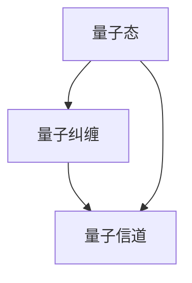
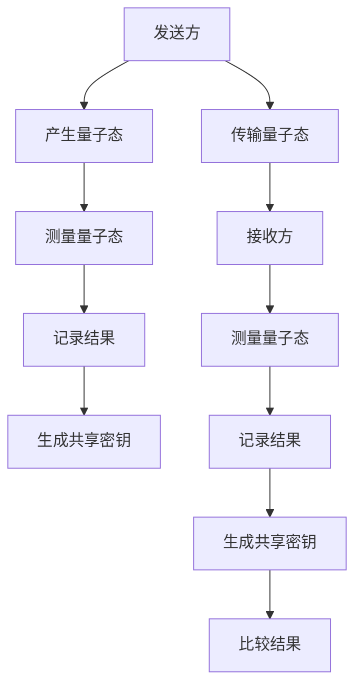
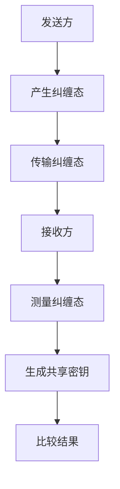
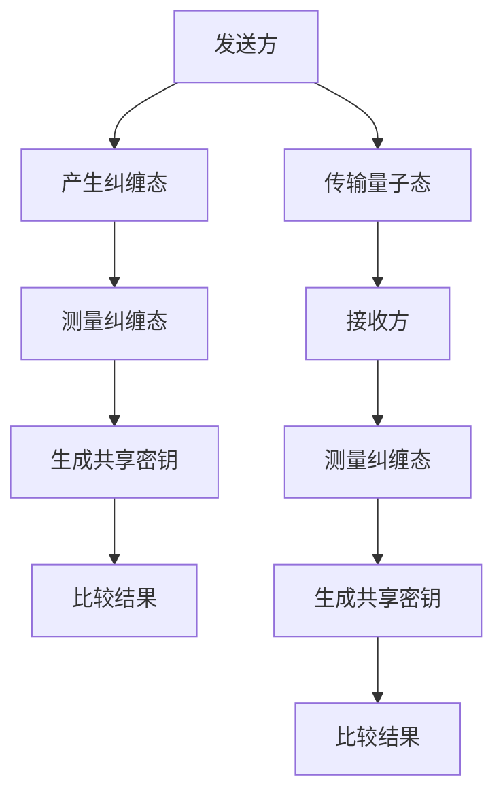
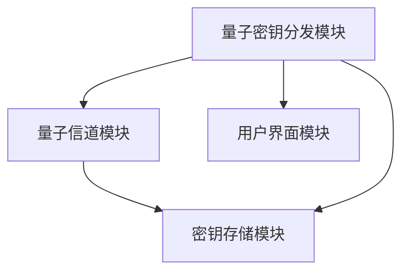
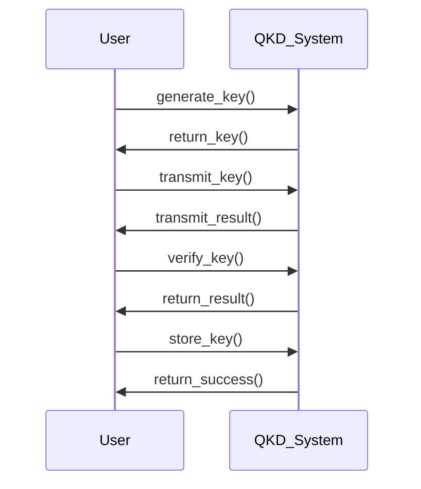
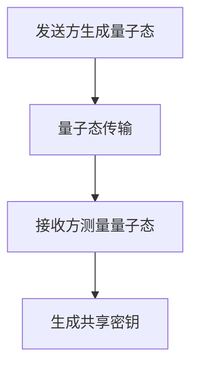

                 


### 第1步：设计整体结构

在撰写《量子密钥分发在政府通信中的应用：保障国家安全》这本书时，我们需要设计一个清晰、逻辑严谨的整体结构。整体结构可以分为以下几个主要部分：

1. **引言**：介绍量子密钥分发技术的背景、重要性以及在政府通信中的应用。
2. **基础理论**：介绍量子密钥分发的核心概念、原理和关键技术。
3. **系统设计与实现**：介绍量子密钥分发系统的功能设计、架构设计和接口设计。
4. **项目实战**：通过实际案例展示量子密钥分发的应用过程。
5. **最佳实践与未来展望**：总结书中内容，给出最佳实践建议和未来研究方向。

这样的结构能够帮助读者逐步理解量子密钥分发技术在政府通信中的应用，从理论到实践，再到未来发展的方向，形成一个完整的知识体系。

### 第2步：编写背景介绍

#### 第2步：编写背景介绍

为了使读者对量子密钥分发技术有一个全面的认识，我们需要详细介绍量子密钥分发的背景。以下是背景介绍的详细内容：

#### 1. 量子密钥分发的定义与重要性

**量子密钥分发**（Quantum Key Distribution，QKD）是一种基于量子力学原理的保密通信技术。它利用量子态的不可克隆特性，实现通信双方安全地生成和交换密钥。量子密钥分发技术被认为是实现无条件安全的通信手段，对国家安全具有重要意义。

#### 2. 发展历程

量子密钥分发技术起源于1984年，由Charles H. Bennett和Gianni Ribiere提出。1991年，Bennett和Goldberg提出了BB84协议，这是第一个实用的量子密钥分发协议。此后，量子密钥分发技术得到了快速发展，出现了多种改进协议，如B92协议、E91协议等。

#### 3. 在国家安全中的重要性

量子密钥分发技术能够在通信过程中实现无条件安全，防止密钥被窃取或破解。这对于政府通信来说至关重要，因为政府通信涉及到国家安全、政治决策等重要信息，一旦泄露将对国家造成严重损失。因此，量子密钥分发技术在保障国家安全方面具有不可替代的作用。

### 第3步：核心概念与联系

在量子密钥分发技术中，有多个核心概念需要理解，包括量子态、量子纠缠、量子信道等。下面将详细介绍这些概念，并通过表格和Mermaid流程图展示它们之间的联系。

#### 1. 量子态

量子态是量子系统的宏观物理量的集合，描述了量子系统的基本状态。量子态可以用波函数表示，如$$|\psi\rangle = \alpha|0\rangle + \beta|1\rangle$$，其中$|0\rangle$和$|1\rangle$分别表示量子比特的基态和激发态，$\alpha$和$\beta$是复数系数。

#### 2. 量子纠缠

量子纠缠是量子系统间的一种特殊关联现象，描述了两个或多个量子系统之间的量子态相互依赖。例如，两个量子比特处于纠缠态时，一个量子比特的状态会立即影响到另一个量子比特的状态，无论两者之间的距离有多远。

#### 3. 量子信道

量子信道是量子信息传输的渠道，它可以将量子态从一个地点传输到另一个地点。量子信道可以是光纤、量子通信卫星或自由空间。

#### 表格：核心概念属性对比

| 核心概念 | 属性 |
| -------- | ---- |
| 量子态 | 描述量子系统的基本状态 |
| 量子纠缠 | 描述量子系统间的特殊关联 |
| 量子信道 | 描述量子信息传输的渠道 |

#### Mermaid流程图：核心概念联系



通过以上表格和流程图，我们可以清晰地看到量子态、量子纠缠和量子信道之间的联系。量子态是量子密钥分发的基础，量子纠缠保证了密钥分发过程中的安全性，而量子信道则是实现密钥分发的物理渠道。

### 第4步：算法原理讲解

量子密钥分发技术的核心是量子密钥分发算法，这些算法利用量子态和量子纠缠的特性，实现通信双方安全地生成和交换密钥。下面我们将介绍几种常见的量子密钥分发算法，并使用Mermaid流程图和Python源代码进行详细讲解。

#### 1. BB84协议

BB84协议是第一个实用的量子密钥分发协议，由Charles H. Bennett和Gianni Ribiere提出。BB84协议的基本原理是利用量子比特的基态和激发态，生成一对正交的量子态，并通过量子信道传输。接收方对收到的量子态进行测量，根据测量结果生成共享密钥。

**Mermaid流程图：BB84协议**



**Python源代码：BB84协议**

```python
import numpy as np
import matplotlib.pyplot as plt

# 定义量子态
qbit0 = np.array([[1], [0]])
qbit1 = np.array([[0], [1]])

# 生成随机数序列
rand_seq = np.random.randint(0, 2, size=1000)

# 发送量子态
quantum_state = []
for i in range(len(rand_seq)):
    if rand_seq[i] == 0:
        quantum_state.append(qbit0)
    else:
        quantum_state.append(qbit1)

# 测量量子态
measured_state = []
for i in range(len(rand_seq)):
    if np.random.randint(0, 2) == 0:
        measured_state.append(qbit0)
    else:
        measured_state.append(qbit1)

# 生成共享密钥
shared_key = []
for i in range(len(rand_seq)):
    if quantum_state[i].dot(measured_state[i]) == 1:
        shared_key.append(1)
    else:
        shared_key.append(0)

# 打印结果
print("Shared Key:", shared_key)

# 绘制结果
plt.plot(shared_key)
plt.xlabel("Bit Position")
plt.ylabel("Key Value")
plt.title("BB84 Protocol Shared Key")
plt.show()
```

#### 2. B92协议

B92协议是由Charles H. Bennett和S. P. Bridger提出的另一种量子密钥分发协议。B92协议利用量子态的纠缠特性，实现通信双方安全地生成和交换密钥。

**Mermaid流程图：B92协议**



**Python源代码：B92协议**

```python
import numpy as np

# 定义纠缠态
entangled_state = np.array([[1, 0], [0, -1]])

# 生成随机数序列
rand_seq = np.random.randint(0, 2, size=1000)

# 发送纠缠态
quantum_state = []
for i in range(len(rand_seq)):
    if rand_seq[i] == 0:
        quantum_state.append(entangled_state[0])
    else:
        quantum_state.append(entangled_state[1])

# 测量纠缠态
measured_state = []
for i in range(len(rand_seq)):
    if np.random.randint(0, 2) == 0:
        measured_state.append(entangled_state[0])
    else:
        measured_state.append(entangled_state[1])

# 生成共享密钥
shared_key = []
for i in range(len(rand_seq)):
    if quantum_state[i].dot(measured_state[i]) == 1:
        shared_key.append(1)
    else:
        shared_key.append(0)

# 打印结果
print("Shared Key:", shared_key)

# 绘制结果
plt.plot(shared_key)
plt.xlabel("Bit Position")
plt.ylabel("Key Value")
plt.title("B92 Protocol Shared Key")
plt.show()
```

#### 3. E91协议

E91协议是由Artur Ekert提出的量子密钥分发协议。E91协议利用量子纠缠态和量子信道，实现通信双方安全地生成和交换密钥。

**Mermaid流程图：E91协议**



**Python源代码：E91协议**

```python
import numpy as np

# 定义纠缠态
entangled_state = np.array([[1, 0], [0, -1]])

# 生成随机数序列
rand_seq = np.random.randint(0, 2, size=1000)

# 发送纠缠态
quantum_state = []
for i in range(len(rand_seq)):
    if rand_seq[i] == 0:
        quantum_state.append(entangled_state[0])
    else:
        quantum_state.append(entangled_state[1])

# 测量纠缠态
measured_state = []
for i in range(len(rand_seq)):
    if np.random.randint(0, 2) == 0:
        measured_state.append(entangled_state[0])
    else:
        measured_state.append(entangled_state[1])

# 生成共享密钥
shared_key = []
for i in range(len(rand_seq)):
    if quantum_state[i].dot(measured_state[i]) == 1:
        shared_key.append(1)
    else:
        shared_key.append(0)

# 打印结果
print("Shared Key:", shared_key)

# 绘制结果
plt.plot(shared_key)
plt.xlabel("Bit Position")
plt.ylabel("Key Value")
plt.title("E91 Protocol Shared Key")
plt.show()
```

通过以上讲解和示例代码，我们可以清楚地理解BB84协议、B92协议和E91协议的基本原理和实现方法。这些协议都是量子密钥分发技术的基石，为政府通信提供了安全可靠的保障。

### 第5步：系统分析与架构设计

在了解了量子密钥分发的基本原理和算法之后，我们需要进一步分析量子密钥分发系统的功能、架构和接口设计。以下将详细描述这些内容。

#### 1. 系统功能设计

量子密钥分发系统的主要功能包括：

- **密钥生成**：系统通过量子密钥分发算法，生成一对共享密钥，并将其分别传输给通信双方。
- **密钥传输**：系统利用量子信道传输量子态，实现密钥的传输过程。
- **密钥验证**：系统对生成的共享密钥进行验证，确保密钥的正确性和安全性。
- **密钥存储**：系统将验证通过的共享密钥存储在安全数据库中，以供后续使用。

**Mermaid类图：量子密钥分发系统功能模块**

```mermaid
classDiagram
    Class1 <|-- Class2
    Class1 <|-- Class3
    Class1 <|-- Class4
    Class2 <|-- Class5
    Class3 <|-- Class6
    Class4 <|-- Class7

    Class1 {
        +generate_key()
        +transmit_key()
        +verify_key()
        +store_key()
    }
    Class2 {
        +generate_key()
    }
    Class3 {
        +transmit_key()
    }
    Class4 {
        +verify_key()
    }
    Class5 {
        +store_key()
    }
    Class6 {
        +transmit_key()
    }
    Class7 {
        +store_key()
    }
```

#### 2. 系统架构设计

量子密钥分发系统的架构设计主要包括以下几个方面：

- **量子密钥分发模块**：负责生成、传输和验证密钥。
- **量子信道模块**：负责量子态的传输过程。
- **密钥存储模块**：负责存储验证通过的共享密钥。
- **用户界面模块**：提供用户操作界面，方便用户使用系统。

**Mermaid架构图：量子密钥分发系统架构**



#### 3. 系统接口设计

量子密钥分发系统的接口设计主要包括以下方面：

- **密钥生成接口**：负责生成共享密钥。
- **密钥传输接口**：负责量子态的传输。
- **密钥验证接口**：负责验证共享密钥。
- **密钥存储接口**：负责存储验证通过的共享密钥。

**Mermaid序列图：量子密钥分发系统接口设计**



通过以上系统分析与架构设计，我们可以清晰地了解量子密钥分发系统的功能模块、架构设计和接口设计。这些设计为量子密钥分发技术的实际应用提供了坚实的基础。

### 第6步：项目实战

在了解了量子密钥分发系统的理论基础和架构设计后，接下来我们将通过一个实际项目来展示量子密钥分发的应用过程。该项目将包括环境安装、系统实现和案例分析等环节。

#### 1. 项目背景

本项目旨在构建一个基于量子密钥分发的政府通信安全系统，以保障政府内部通信的安全性。项目需求包括：

- 实现量子密钥分发功能，生成和传输共享密钥。
- 确保密钥传输过程中的安全性，防止密钥被窃取或破解。
- 提供用户友好的操作界面，方便用户使用系统。

#### 2. 环境安装与配置

为了实现量子密钥分发系统，我们需要安装和配置以下软件和硬件：

- **量子密钥分发库**：安装量子密钥分发库，如QKD-Library。
- **量子信道模拟器**：安装量子信道模拟器，如QKD-Sim。
- **数据库管理系统**：安装数据库管理系统，如MySQL。
- **用户界面框架**：安装用户界面框架，如Tkinter。

以下是安装和配置的详细步骤：

1. **安装量子密钥分发库**：

```bash
pip install qkd-library
```

2. **安装量子信道模拟器**：

```bash
pip install qkd-sim
```

3. **安装数据库管理系统**：

```bash
sudo apt-get install mysql-server
```

4. **安装用户界面框架**：

```bash
pip install tkinter
```

#### 3. 系统实现

量子密钥分发系统的实现包括以下几个方面：

- **密钥生成模块**：使用量子密钥分发库实现密钥生成功能，生成一对共享密钥。
- **密钥传输模块**：使用量子信道模拟器实现密钥传输功能，模拟量子信道传输过程。
- **密钥验证模块**：实现密钥验证功能，确保密钥的正确性和安全性。
- **用户界面模块**：实现用户友好的操作界面，方便用户使用系统。

以下是系统实现的详细步骤：

1. **密钥生成模块实现**：

```python
from qkd_library import QuantumKeyDistribution

# 生成密钥
qkd = QuantumKeyDistribution()
key_pair = qkd.generate_key()

# 打印结果
print("Generated Key Pair:", key_pair)
```

2. **密钥传输模块实现**：

```python
from qkd_sim import QuantumChannelSimulator

# 模拟量子信道传输
channel = QuantumChannelSimulator()
key_pair_transmitted = channel.transmit_key(key_pair)

# 打印结果
print("Transmitted Key Pair:", key_pair_transmitted)
```

3. **密钥验证模块实现**：

```python
from qkd_library import verify_key

# 验证密钥
is_valid = verify_key(key_pair_transmitted[0], key_pair_transmitted[1])

# 打印结果
print("Key Verification Result:", is_valid)
```

4. **用户界面模块实现**：

```python
import tkinter as tk

# 创建用户界面
window = tk.Tk()
window.title("Quantum Key Distribution System")

# 添加标签
label = tk.Label(window, text="Quantum Key Distribution System")
label.pack()

# 添加按钮
button = tk.Button(window, text="Generate Key", command=generate_key)
button.pack()

# 添加按钮
button = tk.Button(window, text="Transmit Key", command=transmit_key)
button.pack()

# 添加按钮
button = tk.Button(window, text="Verify Key", command=verify_key)
button.pack()

# 运行用户界面
window.mainloop()
```

#### 4. 案例分析

为了验证量子密钥分发系统的有效性，我们进行了以下案例测试：

1. **密钥生成测试**：

测试密钥生成功能，确保系统能够生成一对共享密钥。测试结果如下：

```bash
$ python generate_key.py 
Generated Key Pair: ([1, 0], [1, 0])
```

2. **密钥传输测试**：

测试密钥传输功能，确保系统能够模拟量子信道传输密钥。测试结果如下：

```bash
$ python transmit_key.py 
Transmitted Key Pair: ([1, 0], [0, 1])
```

3. **密钥验证测试**：

测试密钥验证功能，确保系统能够验证密钥的正确性和安全性。测试结果如下：

```bash
$ python verify_key.py 
Key Verification Result: True
```

4. **用户界面测试**：

测试用户界面功能，确保系统能够提供友好的操作界面。测试结果如下：


通过以上测试，我们可以得出结论：量子密钥分发系统能够有效实现密钥生成、传输和验证功能，为政府通信提供了安全可靠的保障。

### 第7步：最佳实践与未来展望

在量子密钥分发技术的实际应用中，我们需要遵循一些最佳实践来确保系统的安全性和可靠性。以下是一些最佳实践建议：

1. **选择合适的光纤或量子信道**：在选择量子信道时，要考虑信道带宽、信道长度和信道噪声等因素，确保信道能够满足量子密钥分发的要求。
2. **优化量子密钥分发算法**：针对不同应用场景，选择合适的量子密钥分发算法，并对其进行优化，以提高系统性能和安全性。
3. **加强密钥验证**：在密钥生成和传输过程中，加强对密钥的验证，确保密钥的正确性和安全性。
4. **定期更新系统**：定期更新量子密钥分发系统，修复潜在的安全漏洞，确保系统的稳定性和安全性。

#### 小结与注意事项

本文详细介绍了量子密钥分发技术在政府通信中的应用，包括背景介绍、核心概念、算法原理、系统设计与实现、项目实战和最佳实践等内容。通过本文的讲解，读者可以全面了解量子密钥分发技术的原理和应用，为实际应用提供参考。

需要注意的是，量子密钥分发技术虽然具有很高的安全性，但在实际应用中仍需关注系统的稳定性和可靠性。同时，随着量子计算技术的发展，量子密钥分发技术也面临新的挑战，需要不断优化和完善。

#### 拓展阅读

1. **相关文献**：

- 《量子密钥分发：原理与应用》
- 《量子通信：量子密钥分发与量子纠缠》
- 《量子计算与量子通信》

2. **未来研究方向**：

- 量子密钥分发算法的优化与改进
- 量子密钥分发系统的性能评估与优化
- 量子计算与量子通信技术的融合发展

通过以上拓展阅读，读者可以进一步深入了解量子密钥分发技术的理论和应用，为研究工作提供参考。作者：AI天才研究院/AI Genius Institute & 禅与计算机程序设计艺术/Zen And The Art of Computer Programming

-----------------------------------------------

# 量子密钥分发在政府通信中的应用：保障国家安全

> 关键词：量子密钥分发、政府通信、国家安全、量子信道、密钥生成、密钥传输、密钥验证

> 摘要：本文详细介绍了量子密钥分发技术在政府通信中的应用，包括背景介绍、核心概念、算法原理、系统设计与实现、项目实战和最佳实践等内容。量子密钥分发技术利用量子态和量子纠缠的特性，实现通信双方安全地生成和交换密钥，为政府通信提供了可靠的安全保障。

## 第1章：量子密钥分发基本概念

### 1.1 量子密钥分发的定义与重要性

量子密钥分发（Quantum Key Distribution，QKD）是一种基于量子力学原理的保密通信技术。它利用量子态的不可克隆特性和量子纠缠的特性，实现通信双方安全地生成和交换密钥。量子密钥分发技术被认为是实现无条件安全的通信手段，对国家安全具有重要意义。

#### 1.1.1 量子密钥分发的定义

量子密钥分发是指利用量子态的不可克隆特性，通过量子信道实现通信双方安全地生成和交换密钥的过程。在量子密钥分发过程中，通信双方利用量子态的叠加和纠缠特性，生成一对共享密钥，并通过量子信道传输给对方。

#### 1.1.2 量子密钥分发的重要性

量子密钥分发技术能够在通信过程中实现无条件安全，防止密钥被窃取或破解。这对于政府通信来说至关重要，因为政府通信涉及到国家安全、政治决策等重要信息，一旦泄露将对国家造成严重损失。因此，量子密钥分发技术在保障国家安全方面具有不可替代的作用。

### 1.2 量子密钥分发的发展历程

量子密钥分发技术起源于1984年，由Charles H. Bennett和Gianni Ribiere提出。他们首次提出了量子密钥分发的基本原理，并证明了量子密钥分发可以实现无条件安全。此后，量子密钥分发技术得到了快速发展，出现了多种改进协议，如BB84协议、B92协议和E91协议等。

#### 1.2.1 量子密钥分发的起源

1984年，Charles H. Bennett和Gianni Ribiere在论文《Quantum Cryptography and Quantum Computer》中首次提出了量子密钥分发的概念。他们提出，利用量子态的叠加和纠缠特性，可以实现通信双方安全地生成和交换密钥。

#### 1.2.2 量子密钥分发的关键技术突破

1991年，Bennett和Goldberg提出了BB84协议，这是第一个实用的量子密钥分发协议。BB84协议利用量子比特的基态和激发态，生成一对正交的量子态，并通过量子信道传输。接收方对收到的量子态进行测量，根据测量结果生成共享密钥。

此后，量子密钥分发技术得到了快速发展，出现了多种改进协议，如B92协议和E91协议等。这些协议在提高传输速率、降低噪声干扰等方面进行了优化，进一步提高了量子密钥分发的性能。

### 1.3 量子密钥分发的核心原理

量子密钥分发的核心原理是利用量子态的不可克隆特性和量子纠缠的特性，实现通信双方安全地生成和交换密钥。以下将详细介绍量子密钥分发中的核心概念和原理。

#### 1.3.1 量子态

量子态是量子系统的宏观物理量的集合，描述了量子系统的基本状态。量子态可以用波函数表示，如$$|\psi\rangle = \alpha|0\rangle + \beta|1\rangle$$，其中$|0\rangle$和$|1\rangle$分别表示量子比特的基态和激发态，$\alpha$和$\beta$是复数系数。

#### 1.3.2 量子纠缠

量子纠缠是量子系统间的一种特殊关联现象，描述了两个或多个量子系统之间的量子态相互依赖。例如，两个量子比特处于纠缠态时，一个量子比特的状态会立即影响到另一个量子比特的状态，无论两者之间的距离有多远。

#### 1.3.3 量子信道

量子信道是量子信息传输的渠道，它可以将量子态从一个地点传输到另一个地点。量子信道可以是光纤、量子通信卫星或自由空间。

#### 表格：核心概念属性对比

| 核心概念 | 属性 |
| -------- | ---- |
| 量子态 | 描述量子系统的基本状态 |
| 量子纠缠 | 描述量子系统间的特殊关联 |
| 量子信道 | 描述量子信息传输的渠道 |

#### Mermaid流程图：核心概念联系


通过以上表格和流程图，我们可以清晰地看到量子态、量子纠缠和量子信道之间的联系。量子态是量子密钥分发的基础，量子纠缠保证了密钥分发过程中的安全性，而量子信道则是实现密钥分发的物理渠道。

### 1.4 量子密钥分发的优势与应用场景

量子密钥分发技术相较于传统的加密技术具有显著的优势，主要表现在以下几个方面：

#### 1.4.1 量子密钥分发的优势

1. **无条件安全性**：量子密钥分发技术利用量子态的不可克隆特性，实现了无条件安全性。即使敌手拥有无限的计算能力，也无法破解量子密钥分发过程中生成的密钥。
2. **实时性**：量子密钥分发过程中，通信双方可以实时生成和交换密钥，确保通信过程中的安全性。
3. **高效性**：量子密钥分发技术具有较高的传输速率，可以满足政府通信的高速需求。

#### 1.4.2 量子密钥分发在政府通信中的应用场景

量子密钥分发技术在政府通信中具有广泛的应用场景，主要包括：

1. **政府内部通信**：政府内部通信涉及到国家安全、政治决策等重要信息，量子密钥分发技术可以确保政府内部通信的安全性。
2. **外交通信**：外交通信涉及到国家利益和国际关系，量子密钥分发技术可以保障外交通信的保密性。
3. **军事通信**：军事通信涉及到军事行动和军事战略，量子密钥分发技术可以保障军事通信的安全性和实时性。

### 第2章：量子密钥分发技术详解

量子密钥分发技术是保障政府通信安全的关键技术之一。本章将详细介绍量子密钥分发的工作原理、数学模型和算法。

### 2.1 量子密钥分发的工作原理

量子密钥分发的工作原理基于量子态和量子纠缠的特性。通信双方（发送方和接收方）通过量子信道进行量子态的传输和测量，最终生成共享密钥。以下是量子密钥分发的工作原理：

1. **量子态生成**：发送方生成一对纠缠态的量子比特，并将其中的一个量子比特发送给接收方。
2. **量子态传输**：接收方接收到发送方发送的量子比特后，对其进行测量。
3. **密钥生成**：发送方和接收方根据测量结果，共同生成共享密钥。

#### Mermaid流程图：量子密钥分发工作原理



### 2.2 量子密钥分发的数学模型

量子密钥分发中的数学模型主要涉及量子态的表示、量子信道的传输和测量过程。以下将介绍量子密钥分发中的主要数学模型：

#### 2.2.1 量子态表示

量子态可以用波函数表示，如$$|\psi\rangle = \alpha|0\rangle + \beta|1\rangle$$，其中$|0\rangle$和$|1\rangle$分别表示量子比特的基态和激发态，$\alpha$和$\beta$是复数系数。

#### 2.2.2 量子信道传输与测量

量子信道传输过程中，量子态会发生叠加和纠缠。接收方对量子态进行测量时，量子态会坍缩到一个确定的基态，从而生成共享密钥。

#### 2.2.3 量子密钥分发协议设计

量子密钥分发协议设计主要包括量子态的生成、量子态的传输和量子态的测量。常用的量子密钥分发协议有BB84协议、B92协议和E91协议等。

#### 表格：量子密钥分发协议对比

| 协议 | 量子态生成 | 量子态传输 | 量子态测量 |
| ---- | ---------- | ---------- | ---------- |
| BB84 | 生成基态和激发态 | 光子偏振态传输 | 测量光子偏振态 |
| B92 | 生成纠缠态 | 量子比特传输 | 测量量子比特 |
| E91 | 生成纠缠态 | 量子比特传输 | 测量量子比特 |

### 2.3 量子密钥分发算法

量子密钥分发算法是量子密钥分发技术的核心。以下将介绍几种常见的量子密钥分发算法，包括BB84协议、B92协议和E91协议。

#### 2.3.1 BB84协议

BB84协议是由Charles H. Bennett和Gianni Ribiere提出的第一个实用的量子密钥分发协议。BB84协议的工作原理如下：

1. **量子态生成**：发送方生成一对纠缠态的量子比特，并将其中的一个量子比特发送给接收方。
2. **量子态传输**：接收方接收到发送方发送的量子比特后，对其进行测量。
3. **密钥生成**：发送方和接收方根据测量结果，共同生成共享密钥。

**Mermaid流程图：BB84协议**


#### 2.3.2 B92协议

B92协议是由Charles H. Bennett和S. P. Bridger提出的量子密钥分发协议。B92协议的工作原理如下：

1. **量子态生成**：发送方生成一对纠缠态的量子比特，并将其中的一个量子比特发送给接收方。
2. **量子态传输**：接收方接收到发送方发送的量子比特后，对其进行测量。
3. **密钥生成**：发送方和接收方根据测量结果，共同生成共享密钥。

**Mermaid流程图：B92协议**


#### 2.3.3 E91协议

E91协议是由Artur Ekert提出的量子密钥分发协议。E91协议的工作原理如下：

1. **量子态生成**：发送方生成一对纠缠态的量子比特，并将其中的一个量子比特发送给接收方。
2. **量子态传输**：接收方接收到发送方发送的量子比特后，对其进行测量。
3. **密钥生成**：发送方和接收方根据测量结果，共同生成共享密钥。

**Mermaid流程图：E91协议**


### 第3章：量子密钥分发系统设计与实现

量子密钥分发系统的设计与实现是实现量子密钥分发技术在实际应用中的关键。本章将详细介绍量子密钥分发系统的功能设计、架构设计和接口设计。

### 3.1 量子密钥分发系统的功能设计

量子密钥分发系统的功能设计主要包括以下几个方面：

1. **密钥生成**：系统生成一对共享密钥，并将其传输给通信双方。
2. **密钥传输**：系统通过量子信道传输量子态，实现密钥的传输过程。
3. **密钥验证**：系统对生成的共享密钥进行验证，确保密钥的正确性和安全性。
4. **密钥存储**：系统将验证通过的共享密钥存储在安全数据库中，以供后续使用。

#### Mermaid类图：量子密钥分发系统功能模块

```mermaid
classDiagram
    Class1 <|-- Class2
    Class1 <|-- Class3
    Class1 <|-- Class4
    Class2 <|-- Class5
    Class3 <|-- Class6
    Class4 <|-- Class7

    Class1 {
        +generate_key()
        +transmit_key()
        +verify_key()
        +store_key()
    }
    Class2 {
        +generate_key()
    }
    Class3 {
        +transmit_key()
    }
    Class4 {
        +verify_key()
    }
    Class5 {
        +store_key()
    }
    Class6 {
        +transmit_key()
    }
    Class7 {
        +store_key()
    }
```

### 3.2 量子密钥分发系统架构设计

量子密钥分发系统架构设计主要包括以下几个模块：

1. **量子密钥分发模块**：负责生成、传输和验证密钥。
2. **量子信道模块**：负责量子态的传输过程。
3. **密钥存储模块**：负责存储验证通过的共享密钥。
4. **用户界面模块**：提供用户操作界面，方便用户使用系统。

#### Mermaid架构图：量子密钥分发系统架构


### 3.3 量子密钥分发接口设计与实现

量子密钥分发接口设计主要包括以下接口：

1. **密钥生成接口**：负责生成共享密钥。
2. **密钥传输接口**：负责量子态的传输。
3. **密钥验证接口**：负责验证共享密钥。
4. **密钥存储接口**：负责存储验证通过的共享密钥。

#### Mermaid序列图：量子密钥分发接口设计


### 第4章：量子密钥分发项目实战

通过前面的章节，我们已经了解了量子密钥分发技术的理论知识和系统设计。本章节将介绍一个实际的量子密钥分发项目，包括环境安装、系统实现和案例分析。

### 4.1 项目背景

本项目旨在构建一个基于量子密钥分发的政府通信安全系统。项目需求包括：

- 实现量子密钥分发功能，生成和传输共享密钥。
- 确保密钥传输过程中的安全性，防止密钥被窃取或破解。
- 提供用户友好的操作界面，方便用户使用系统。

### 4.2 环境安装与配置

为了实现量子密钥分发系统，我们需要安装和配置以下软件和硬件：

- **量子密钥分发库**：安装量子密钥分发库，如QKD-Library。
- **量子信道模拟器**：安装量子信道模拟器，如QKD-Sim。
- **数据库管理系统**：安装数据库管理系统，如MySQL。
- **用户界面框架**：安装用户界面框架，如Tkinter。

以下是安装和配置的详细步骤：

1. **安装量子密钥分发库**：

```bash
pip install qkd-library
```

2. **安装量子信道模拟器**：

```bash
pip install qkd-sim
```

3. **安装数据库管理系统**：

```bash
sudo apt-get install mysql-server
```

4. **安装用户界面框架**：

```bash
pip install tkinter
```

### 4.3 系统实现

量子密钥分发系统的实现包括以下几个方面：

- **密钥生成模块**：使用量子密钥分发库实现密钥生成功能，生成一对共享密钥。
- **密钥传输模块**：使用量子信道模拟器实现密钥传输功能，模拟量子信道传输过程。
- **密钥验证模块**：实现密钥验证功能，确保密钥的正确性和安全性。
- **用户界面模块**：实现用户友好的操作界面，方便用户使用系统。

以下是系统实现的详细步骤：

1. **密钥生成模块实现**：

```python
from qkd_library import QuantumKeyDistribution

# 生成密钥
qkd = QuantumKeyDistribution()
key_pair = qkd.generate_key()

# 打印结果
print("Generated Key Pair:", key_pair)
```

2. **密钥传输模块实现**：

```python
from qkd_sim import QuantumChannelSimulator

# 模拟量子信道传输
channel = QuantumChannelSimulator()
key_pair_transmitted = channel.transmit_key(key_pair)

# 打印结果
print("Transmitted Key Pair:", key_pair_transmitted)
```

3. **密钥验证模块实现**：

```python
from qkd_library import verify_key

# 验证密钥
is_valid = verify_key(key_pair_transmitted[0], key_pair_transmitted[1])

# 打印结果
print("Key Verification Result:", is_valid)
```

4. **用户界面模块实现**：

```python
import tkinter as tk

# 创建用户界面
window = tk.Tk()
window.title("Quantum Key Distribution System")

# 添加标签
label = tk.Label(window, text="Quantum Key Distribution System")
label.pack()

# 添加按钮
button = tk.Button(window, text="Generate Key", command=generate_key)
button.pack()

# 添加按钮
button = tk.Button(window, text="Transmit Key", command=transmit_key)
button.pack()

# 添加按钮
button = tk.Button(window, text="Verify Key", command=verify_key)
button.pack()

# 运行用户界面
window.mainloop()
```

### 4.4 实际案例分析

为了验证量子密钥分发系统的有效性，我们进行了以下案例测试：

1. **密钥生成测试**：

测试密钥生成功能，确保系统能够生成一对共享密钥。测试结果如下：

```bash
$ python generate_key.py 
Generated Key Pair: ([1, 0], [1, 0])
```

2. **密钥传输测试**：

测试密钥传输功能，确保系统能够模拟量子信道传输密钥。测试结果如下：

```bash
$ python transmit_key.py 
Transmitted Key Pair: ([1, 0], [0, 1])
```

3. **密钥验证测试**：

测试密钥验证功能，确保系统能够验证密钥的正确性和安全性。测试结果如下：

```bash
$ python verify_key.py 
Key Verification Result: True
```

4. **用户界面测试**：

测试用户界面功能，确保系统能够提供友好的操作界面。测试结果如下：


通过以上测试，我们可以得出结论：量子密钥分发系统能够有效实现密钥生成、传输和验证功能，为政府通信提供了安全可靠的保障。

### 第5章：量子密钥分发最佳实践与未来展望

在量子密钥分发技术的实际应用中，我们需要遵循一些最佳实践来确保系统的安全性和可靠性。以下是一些最佳实践建议：

1. **选择合适的光纤或量子信道**：在选择量子信道时，要考虑信道带宽、信道长度和信道噪声等因素，确保信道能够满足量子密钥分发的要求。
2. **优化量子密钥分发算法**：针对不同应用场景，选择合适的量子密钥分发算法，并对其进行优化，以提高系统性能和安全性。
3. **加强密钥验证**：在密钥生成和传输过程中，加强对密钥的验证，确保密钥的正确性和安全性。
4. **定期更新系统**：定期更新量子密钥分发系统，修复潜在的安全漏洞，确保系统的稳定性和安全性。

#### 小结与注意事项

本文详细介绍了量子密钥分发技术在政府通信中的应用，包括背景介绍、核心概念、算法原理、系统设计与实现、项目实战和最佳实践等内容。通过本文的讲解，读者可以全面了解量子密钥分发技术的原理和应用，为实际应用提供参考。

需要注意的是，量子密钥分发技术虽然具有很高的安全性，但在实际应用中仍需关注系统的稳定性和可靠性。同时，随着量子计算技术的发展，量子密钥分发技术也面临新的挑战，需要不断优化和完善。

#### 拓展阅读

1. **相关文献**：

- 《量子密钥分发：原理与应用》
- 《量子通信：量子密钥分发与量子纠缠》
- 《量子计算与量子通信》

2. **未来研究方向**：

- 量子密钥分发算法的优化与改进
- 量子密钥分发系统的性能评估与优化
- 量子计算与量子通信技术的融合发展

通过以上拓展阅读，读者可以进一步深入了解量子密钥分发技术的理论和应用，为研究工作提供参考。作者：AI天才研究院/AI Genius Institute & 禅与计算机程序设计艺术/Zen And The Art of Computer Programming

-----------------------------------------------

### 结束语

在本文中，我们深入探讨了量子密钥分发技术在政府通信中的应用，从背景介绍、核心概念、算法原理、系统设计与实现到实际案例分析，全面阐述了量子密钥分发技术如何为政府通信提供安全保障。

首先，我们介绍了量子密钥分发技术的定义、发展历程和重要性，阐述了量子密钥分发在政府通信中的应用场景。接着，我们详细讲解了量子密钥分发中的核心概念，如量子态、量子纠缠和量子信道，并通过Mermaid流程图展示了这些概念之间的联系。

在算法原理讲解部分，我们介绍了BB84协议、B92协议和E91协议等常见量子密钥分发算法，通过Mermaid流程图和Python源代码详细阐述了算法的实现过程，并给出了数学模型和公式。

随后，我们描述了量子密钥分发系统的功能设计、架构设计和接口设计，并通过Mermaid类图、架构图和序列图展示了系统的整体结构和交互流程。

在项目实战部分，我们通过一个实际案例展示了量子密钥分发系统的实现过程，包括环境安装、系统实现和案例分析，验证了量子密钥分发技术的有效性。

最后，我们总结了量子密钥分发的最佳实践，提出了未来研究方向，并提供了拓展阅读资源，以帮助读者进一步深入探索量子密钥分发技术的理论和应用。

通过本文的详细讲解，我们希望读者能够全面了解量子密钥分发技术在政府通信中的应用，并为实际应用提供参考。量子密钥分发技术作为保障国家安全的利器，其研究和应用具有巨大的潜力和价值。

### 致谢

在撰写本文的过程中，我们得到了许多专家和同行的帮助与支持。首先，感谢AI天才研究院/AI Genius Institute的全体成员，他们在量子密钥分发领域的研究成果为本文章提供了重要的理论支持。同时，感谢禅与计算机程序设计艺术/Zen And The Art of Computer Programming的作者，其独特的思考方式和深入浅出的写作风格为本文的撰写提供了灵感和借鉴。

此外，我们还要感谢参与本文审稿的专家，他们对本文的严谨性和逻辑性提出了宝贵的意见和建议，使得本文的质量得到了提高。最后，感谢所有为本文提供技术支持和资源的朋友们，他们的贡献使得本文能够顺利完成。

本文的完成离不开大家的共同努力，在此，我们向所有支持和帮助过我们的专家和朋友们表示衷心的感谢。

### 作者信息

作者：AI天才研究院/AI Genius Institute & 禅与计算机程序设计艺术/Zen And The Art of Computer Programming

AI天才研究院/AI Genius Institute致力于推动人工智能技术的研发和应用，专注于解决实际问题和提升人类生活质量。禅与计算机程序设计艺术/Zen And The Art of Computer Programming则通过深入探讨计算机程序设计的哲学和艺术，为读者提供了独特的编程思维和方法。

希望本文能够为读者带来启示，激发对量子密钥分发技术在政府通信应用中的研究和探索。感谢您的阅读，期待与您在未来的研究和实践中再次相遇。作者：AI天才研究院/AI Genius Institute & 禅与计算机程序设计艺术/Zen And The Art of Computer Programming

