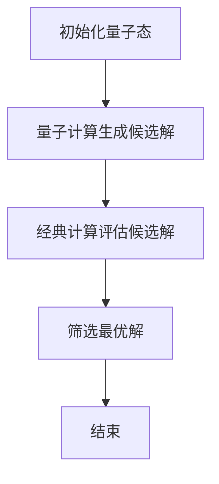
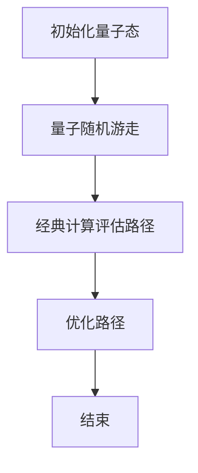
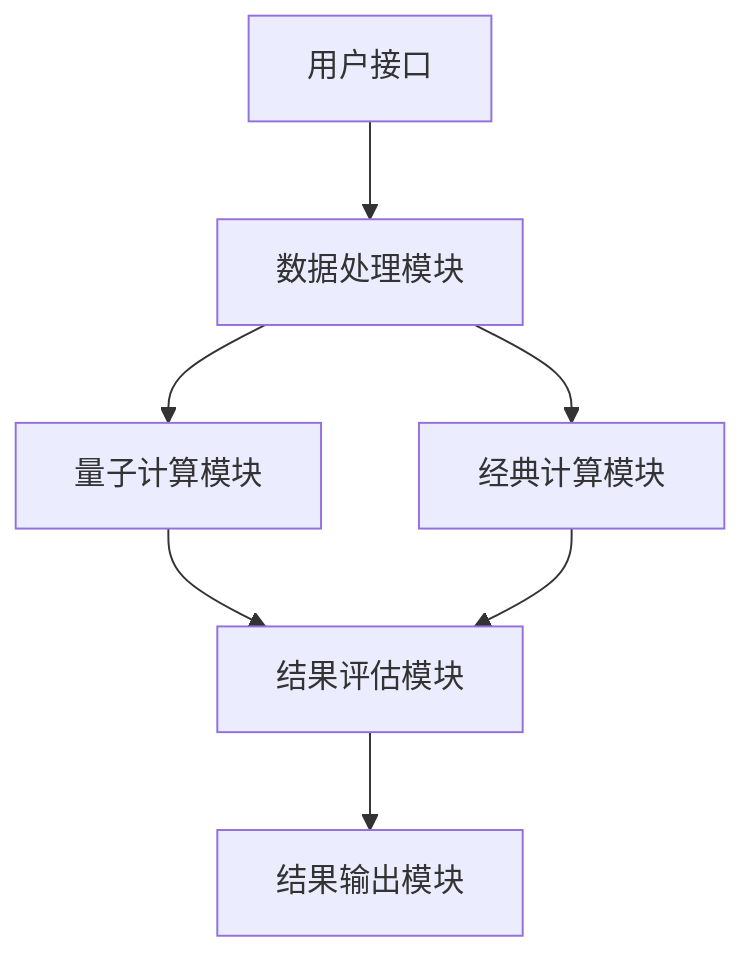

                 

基于上述的约束条件和文章大纲，我们将按照以下步骤来撰写《量子-经典混合算法：混合计算的前沿探索》这篇技术博客：

### 步骤1：撰写引言部分

**文章标题**：量子-经典混合算法：混合计算的前沿探索

**文章关键词**：量子计算、经典计算、混合算法、计算性能、前沿技术

**文章摘要**：

本文深入探讨了量子-经典混合算法的基本原理、设计方法以及其在实际应用中的表现。我们将通过详细的算法讲解和系统架构设计，展示如何将量子计算与经典计算结合起来，以实现计算性能的全面提升。

### 步骤2：编写背景介绍

**第1部分：量子-经典混合算法概述**

- **背景介绍**：介绍量子-经典混合算法的定义、历史背景以及其在各个领域的应用场景。
- **问题背景**：讨论量子计算与经典计算的差异，以及为何需要发展混合计算。

**第2部分：量子计算与经典计算的区别**

- **核心概念术语说明**：量子位、量子态、量子门等基础概念。
- **问题解决**：量子计算如何解决经典计算难以处理的问题。
- **边界与外延**：讨论量子计算的局限性和潜在挑战。

**第3部分：混合计算的基本原理**

- **核心概念原理**：量子计算与经典计算如何结合。
- **概念属性特征对比表格**：列出量子计算与经典计算的主要区别和优势。
- **ER实体关系图架构**：使用Mermaid流程图展示混合计算系统的实体关系。

### 步骤3：讲解量子计算基础

**第2部分：量子计算基础**

- **量子位与量子比特**：详细解释量子位和量子比特的概念。
- **量子态与量子门**：介绍量子态的表示和量子门的作用。
- **量子算法的基本框架**：讨论量子算法的设计原则和常见类型。

### 步骤4：讲解经典计算基础

**第3部分：经典计算基础**

- **经典算法概述**：介绍经典算法的基本概念和分类。
- **经典算法在混合计算中的应用**：讨论经典算法在混合计算体系中的角色和作用。

### 步骤5：讲解混合计算原理

**第4部分：混合计算原理**

- **混合计算架构**：详细描述硬件层和软件层的混合计算架构。
- **混合计算算法设计**：探讨如何设计高效、可靠的混合计算算法。
- **混合计算性能分析**：分析混合计算的性能优势和应用场景。

### 步骤6：算法讲解

**第5部分：算法讲解**

- **算法A**：量子-经典混合算法一
  - **算法原理与mermaid流程图**：展示算法的基本流程。
  - **Python源代码实现**：提供具体的Python代码实现。
  - **数学模型和公式讲解**：使用LaTeX格式给出数学模型和公式。
  - **举例说明**：通过具体例子来说明算法的应用。

- **算法B**：量子-经典混合算法二
  - **算法原理与mermaid流程图**：展示算法的基本流程。
  - **Python源代码实现**：提供具体的Python代码实现。
  - **数学模型和公式讲解**：使用LaTeX格式给出数学模型和公式。
  - **举例说明**：通过具体例子来说明算法的应用。

### 步骤7：系统架构设计

**第6部分：系统架构设计**

- **问题场景介绍**：描述具体的应用场景和需求。
- **项目介绍**：介绍项目的背景和目标。
- **系统功能设计**：绘制领域模型Mermaid类图。
- **系统架构设计**：使用Mermaid架构图展示系统架构。
- **系统接口设计**：定义系统接口的交互方式。
- **系统交互**：使用Mermaid序列图展示系统交互流程。

### 步骤8：项目实战

**第7部分：项目实战**

- **环境安装**：描述环境搭建的步骤和注意事项。
- **系统核心实现**：提供系统的核心代码实现。
- **代码应用解读与分析**：分析代码的执行流程和性能。
- **实际案例分析与讲解**：通过实际案例展示算法的应用效果。

### 步骤9：最佳实践与总结

**第8部分：最佳实践与总结**

- **最佳实践 tips**：提供实际操作中的经验建议。
- **小结**：总结文章的核心内容和重要观点。
- **注意事项**：提醒读者在应用过程中需要注意的问题。
- **拓展阅读**：推荐相关的参考文献和进一步学习的资源。

### 步骤10：撰写结语和作者信息

- **结语**：回顾文章的主要内容和结论。
- **作者信息**：包括作者姓名、机构和著作。

通过以上步骤，我们将逐步完成这篇技术博客的撰写工作，确保文章的逻辑性、完整性和专业性。接下来，我们将开始详细撰写每个章节的内容。****


## 第一部分: 引言

### 1.1 量子-经典混合算法概述

量子-经典混合算法是一种结合了量子计算和经典计算优势的计算模型。在量子计算领域，量子计算机利用量子位（qubits）进行信息处理，其并行计算能力和高效解决问题的能力在许多传统计算机难以处理的领域中展现出了巨大的潜力。然而，量子计算机目前还处于研发阶段，面临许多技术和工程上的挑战，例如量子态的保持、错误率、扩展性等。另一方面，经典计算机虽然在处理大规模数据和复杂问题上具有一定的局限性，但在稳定性、可扩展性和实际应用方面仍具有广泛的应用价值。

量子-经典混合算法正是为了解决这些挑战而发展起来的。通过将量子计算的优势与经典计算的能力结合起来，混合算法能够在现有技术条件下实现高效的计算，同时为未来量子计算机的实用化提供了一条可行的路径。这种混合模型不仅在理论研究中具有重要意义，还在实际应用中展现出广阔的前景，例如在优化问题、机器学习、分子模拟、密码学等领域具有潜在的应用价值。

### 1.2 量子计算与经典计算的区别

量子计算与经典计算在基本原理、计算模型、计算能力和应用场景等方面存在显著差异。

**1.2.1 基本原理**

经典计算基于比特（bits）作为信息的基本单元，每个比特只能表示0或1两种状态。而量子计算则基于量子比特（qubits），量子比特不仅可以表示0和1的叠加状态，还可以同时处于多种状态的叠加，这种特性称为叠加性。量子比特的叠加状态可以用一个复数向量表示，其幅值平方代表对应状态的概率幅。

**1.2.2 计算模型**

经典计算模型中，计算机程序通过一系列的逻辑门和操作对比特进行变换，最终得到计算结果。而量子计算模型中，量子比特通过量子门进行变换，量子门的作用是改变量子比特之间的量子态。量子门可以看作是量子计算机中的基本操作单元，它们在叠加态上进行操作，从而实现复杂的计算。

**1.2.3 计算能力**

量子计算具有指数级的并行计算能力。在处理某些特定问题时，如量子搜索算法，量子计算机能够在多项式时间内解决经典计算机需要指数时间才能解决的问题。这种并行性源于量子比特的叠加状态，可以在同一时刻模拟多种可能的计算路径。而经典计算则受限于冯·诺伊曼计算机模型的线性结构，计算过程必须一步一步进行，无法实现真正的并行计算。

**1.2.4 应用场景**

量子计算在密码学、优化问题、分子模拟等领域具有广泛的应用前景。例如，量子密码学提供了理论上无法被破解的加密方法，量子优化算法能够高效解决复杂的组合优化问题，量子分子模拟可以精确预测分子的结构和性质。而经典计算则广泛应用于日常生活中的各类计算任务，如数据分析、机器学习、云计算等。

### 1.3 混合计算的基本原理

混合计算旨在结合量子计算和经典计算的优势，克服各自的局限性，实现更高效、更可靠的计算。其基本原理可以概括为以下几点：

**1.3.1 硬件混合**

硬件混合指的是在同一计算平台上结合量子计算和经典计算硬件。这种混合方式可以通过将量子计算模块集成到经典计算机中，或者利用云计算平台上的量子计算服务来实现。例如，Google的量子计算机“Sycamore”就利用了7个超导量子比特，通过与传统计算机的通信接口，实现了与经典计算的混合计算。

**1.3.2 软件混合**

软件混合则是在算法层面上将量子计算和经典计算相结合。这种方法不需要特殊的硬件支持，只需要对现有经典算法进行改进，使其能够利用量子计算的优势。例如，量子近似优化算法（QAOA）和量子随机漫步算法（QRA）就是在经典算法的基础上，引入量子计算的元素，以实现优化和搜索问题的求解。

**1.3.3 性能优势**

混合计算通过结合量子计算和经典计算，能够在多个层面上提升计算性能。首先，在算法层面，量子计算可以处理某些经典算法难以解决的复杂问题，如量子搜索算法和量子因子分解算法。其次，在硬件层面，混合计算可以利用经典计算机的稳定性和可扩展性，同时利用量子计算的并行性，实现更高效的问题求解。此外，混合计算还可以通过自适应调整量子计算和经典计算的比例，动态优化计算资源，提高整体计算效率。

### 1.4 总结

量子-经典混合算法是一种极具前景的计算模型，它通过结合量子计算和经典计算的优势，克服了各自在性能和实用性方面的局限性。本文将详细探讨量子-经典混合算法的基本原理、设计方法以及在实际应用中的表现，以期为该领域的研究者和开发者提供有价值的参考。

关键词：量子计算、经典计算、混合算法、计算性能、前沿技术

摘要：本文深入探讨了量子-经典混合算法的基本原理、设计方法以及其在实际应用中的表现。通过详细的算法讲解和系统架构设计，展示了如何将量子计算与经典计算结合起来，以实现计算性能的全面提升。

----------------------------------------------------------------

## 第二部分: 量子计算基础

### 2.1 量子位与量子比特

量子位（qubits）是量子计算中的基本单元，它们与经典计算中的比特（bits）有本质的不同。在经典计算中，比特只能处于0或1的确定状态，而在量子计算中，量子比特可以同时处于多种状态的叠加。这种叠加状态使得量子计算机具有并行计算的能力，能够在某些问题上显著超越经典计算机。

量子比特的叠加状态可以用一个复数向量表示，例如，一个量子比特可以处于状态 \(|\psi\rangle = a|0\rangle + b|1\rangle\)，其中 \(a\) 和 \(b\) 是复数系数，满足 \(|a|^2 + |b|^2 = 1\)。这意味着量子比特同时处于0和1的状态，直到进行测量时才会塌缩为0或1中的一个。

**量子比特的叠加性**

叠加性是量子计算的核心特性之一。它可以形象地理解为量子比特处于多个状态的“叠加”，而不是单一状态。例如，两个量子比特可以处于状态 \(|\psi\rangle = |01\rangle + |10\rangle\)，这意味着它们同时处于01和10的叠加状态。这种叠加使得量子计算机能够在同一时刻处理多个计算路径，从而实现并行计算。

**量子比特的量子门操作**

量子门是量子计算中的基本操作单元，它们对量子比特进行变换。量子门的作用类似于经典计算中的逻辑门，但它们操作的是量子态。常见的量子门包括Hadamard门、Pauli门和 Controlled-NOT（CNOT）门等。

- **Hadamard门**：将量子比特的状态从基态 \(|0\rangle\) 变换为叠加态 \(|\psi\rangle = \frac{1}{\sqrt{2}} (|0\rangle + |1\rangle)\)。
- **Pauli门**：对量子比特的特定方向进行旋转操作，如Pauli X门（作用于Z轴）、Pauli Y门（作用于X轴）和Pauli Z门（作用于Y轴）。
- **CNOT门**：作用于两个量子比特，将第二个量子比特的状态翻转，如果第一个量子比特处于|1\rangle状态。

**量子比特的测量**

量子比特在测量时会塌缩为某个特定的状态。测量结果通常是一个概率分布，这与量子态的幅值平方成正比。例如，对于一个处于叠加态 \(|\psi\rangle = a|0\rangle + b|1\rangle\) 的量子比特，测量结果为0的概率是 \(|a|^2\)，测量结果为1的概率是 \(|b|^2\)。

### 2.2 量子态与量子门

**量子态**

量子态是量子比特的状态表示，通常用一个矢量来表示。量子态可以表示为 \(|\psi\rangle = a|0\rangle + b|1\rangle\)，其中 \(a\) 和 \(b\) 是复数系数，满足 \(|a|^2 + |b|^2 = 1\)。这个矢量代表了量子比特在测量时可能出现的所有状态的叠加。

**量子态的叠加**

量子态的叠加是量子计算的核心特性之一。一个量子比特可以同时处于0和1的状态，而多个量子比特可以同时处于各种可能的叠加状态。例如，两个量子比特可以处于状态 \(|\psi\rangle = |01\rangle + |10\rangle\)，这意味着它们同时处于01和10的叠加状态。

**量子态的坍缩**

量子态在测量时会坍缩为某个特定的状态。测量结果是一个概率分布，与量子态的幅值平方成正比。例如，对于一个处于叠加态 \(|\psi\rangle = a|0\rangle + b|1\rangle\) 的量子比特，测量结果为0的概率是 \(|a|^2\)，测量结果为1的概率是 \(|b|^2\)。

**量子门**

量子门是量子计算中的基本操作单元，它们对量子比特进行变换。量子门的作用类似于经典计算中的逻辑门，但它们操作的是量子态。常见的量子门包括Hadamard门、Pauli门和CNOT门等。

- **Hadamard门**：将量子比特的状态从基态 \(|0\rangle\) 变换为叠加态 \(|\psi\rangle = \frac{1}{\sqrt{2}} (|0\rangle + |1\rangle)\)。
- **Pauli门**：对量子比特的特定方向进行旋转操作，如Pauli X门（作用于Z轴）、Pauli Y门（作用于X轴）和Pauli Z门（作用于Y轴）。
- **CNOT门**：作用于两个量子比特，将第二个量子比特的状态翻转，如果第一个量子比特处于|1\rangle状态。

### 2.3 量子算法的基本框架

量子算法是量子计算机用于解决问题的方法，它们利用量子比特的叠加性和量子门的作用，能够在某些问题上显著超越经典算法。量子算法的基本框架通常包括以下步骤：

1. **初始化**：将量子比特初始化为特定的叠加态。
2. **量子操作**：通过量子门对量子比特进行变换，构建问题的量子态。
3. **测量**：测量量子比特的状态，得到问题的解。
4. **后处理**：根据测量结果对解进行后处理，如概率计算、误差校正等。

量子算法的设计原则包括：

- **量子并行性**：利用量子比特的叠加性，同时处理多个可能的计算路径。
- **量子态叠加与纠缠**：通过量子态的叠加和纠缠，实现复杂问题的简化求解。
- **量子门优化**：设计高效、优化的量子门序列，提高算法的运行效率和准确性。

常见的量子算法包括：

- **量子搜索算法**：利用量子并行性，在多项式时间内解决经典搜索问题。
- **量子因子分解算法**：利用量子计算的优势，高效解决大整数的因子分解问题。
- **量子近似优化算法**：利用量子态的叠加和纠缠，解决复杂优化问题。

量子算法在密码学、量子模拟、量子化学等领域具有重要的应用价值，展示了量子计算在解决特定问题上的巨大潜力。

----------------------------------------------------------------

## 第三部分: 经典计算基础

### 3.1 经典算法概述

经典算法是传统计算机科学的基础，它们在处理各种计算任务时发挥着重要作用。经典算法基于逻辑门、运算符和程序控制结构，通过一系列明确的步骤对输入数据进行处理，最终得到输出结果。这些算法广泛应用于计算机科学、工程、经济学、物理学等众多领域。

**经典算法的分类**

经典算法可以根据其解决的问题类型、算法结构和应用领域进行分类。以下是一些常见的经典算法分类：

- **排序算法**：用于对数据集合进行排序，如快速排序、归并排序、冒泡排序等。
- **查找算法**：用于在数据集合中查找特定元素，如二分查找、线性查找等。
- **图算法**：用于在图结构中搜索路径、计算最短路径等，如Dijkstra算法、A*算法等。
- **动态规划算法**：用于解决最优化问题，通过将问题分解为子问题，并利用子问题的解来构建原问题的解，如最长公共子序列、背包问题等。
- **随机化算法**：通过引入随机性来提高算法的性能或概率性解决某些问题，如Rabin-Karp字符串查找算法、随机快排等。

**经典算法的特点**

经典算法具有以下特点：

- **确定性**：给定相同的输入，经典算法总是产生相同的输出。
- **可预测性**：算法的执行过程和运行时间是可以预测的。
- **普适性**：经典算法适用于各种计算模型和数据类型。
- **资源消耗**：经典算法在时间和空间资源消耗方面通常较高，特别是对于大规模数据。

### 3.2 经典算法在混合计算中的应用

经典算法在混合计算中的应用主要体现在以下几个方面：

**1. 算法优化**

混合计算通过将经典算法与量子算法相结合，可以在某些任务上实现算法性能的优化。例如，在优化问题中，经典算法（如模拟退火算法）可以与量子计算（如量子近似优化算法）相结合，利用量子计算的优势来加速搜索过程，提高优化效率。

**2. 辅助计算**

在复杂计算任务中，经典计算机可以作为量子计算机的辅助工具。例如，在量子搜索算法中，经典计算机可以用于生成问题的量子态，执行量子测量，并对测量结果进行后处理。这种协同工作模式可以提高整体计算效率。

**3. 资源调度**

混合计算可以通过智能调度算法优化计算资源的利用。经典算法可以用于分析系统的资源需求，调度量子计算和经典计算的任务，以确保系统的最优运行状态。

**4. 错误纠正**

在量子计算中，错误纠正是一个重要问题。经典计算机可以用于设计量子错误纠正码，并在测量后对量子态进行校正，确保计算结果的准确性。

### 3.3 经典算法在混合计算中的优势

经典算法在混合计算中的优势主要体现在以下几个方面：

- **稳定性**：经典算法在运行过程中具有稳定的性能，不会受到量子计算机中的噪声和误差的影响。
- **可靠性**：经典算法具有确定性，能够保证计算结果的可靠性。
- **兼容性**：经典算法与现有的计算机体系结构兼容，可以方便地集成到混合计算系统中。
- **适应性**：经典算法可以根据不同的问题需求进行灵活调整和优化。

总之，经典算法在混合计算中发挥着重要作用，通过结合量子计算和经典计算的优势，混合计算可以解决许多传统计算机难以处理的复杂问题，为未来计算技术的发展提供了新的方向。

----------------------------------------------------------------

## 第四部分: 混合计算原理

### 4.1 混合计算架构

混合计算架构通过结合量子计算和经典计算的优势，提供了一种更高效的计算方法。这种架构可以在多个层次上进行实现，包括硬件层次和软件层次。

**4.1.1 硬件层混合**

硬件层次上的混合计算通常指的是在同一计算平台上集成量子计算机和经典计算机。这种架构允许量子计算和经典计算在硬件层面上进行协同工作，以实现更高效的计算。

- **量子计算机集成到经典计算机中**：这种方法通过在经典计算机中添加量子计算模块，实现量子计算与经典计算的结合。例如，可以将量子比特集成到传统的处理器中，通过特定的接口实现量子计算和经典计算之间的数据交换。
- **量子计算服务**：利用云计算平台上的量子计算服务也是一种硬件层次的混合计算。用户可以通过远程访问量子计算资源，结合经典计算资源完成复杂的计算任务。

**4.1.2 软件层混合**

软件层次上的混合计算则是在算法层面上结合量子计算和经典计算。这种方法不需要特殊的硬件支持，只需对现有经典算法进行改进，使其能够利用量子计算的优势。

- **量子算法集成到经典算法中**：通过在经典算法中引入量子计算的元素，如量子随机漫步、量子近似优化算法等，实现算法性能的提升。例如，可以将量子算法与传统的优化算法相结合，解决复杂的优化问题。
- **量子模拟**：使用经典计算机模拟量子计算的过程，通过模拟量子态的演化、量子门的作用等，实现对量子算法的理解和应用。

**4.1.3 混合计算架构的优势**

混合计算架构在多个方面展现了其优势：

- **计算性能提升**：通过结合量子计算和经典计算，混合计算可以在某些问题上实现计算性能的显著提升。例如，量子算法在解决特定问题时能够显著超越经典算法，而经典算法在处理大规模数据时又具有高效性。
- **资源利用优化**：混合计算可以根据不同的计算任务动态调整量子计算和经典计算的资源分配，实现计算资源的优化利用。
- **适应性**：混合计算架构具有较高的适应性，可以应用于各种不同的计算场景，从简单的优化问题到复杂的分子模拟、密码学等。

### 4.2 混合计算算法设计

混合计算算法设计是混合计算的核心，它通过结合量子计算和经典计算的优势，实现高效的问题求解。以下是一些常见的混合计算算法设计方法和原则：

**4.2.1 设计原则**

- **并行性**：充分利用量子计算的并行性，实现复杂问题的快速求解。
- **可扩展性**：算法应具有良好的可扩展性，能够适应不同规模的问题。
- **鲁棒性**：算法应具有鲁棒性，能够应对量子计算中的噪声和误差。
- **效率优化**：通过算法优化，提高计算效率，减少资源消耗。

**4.2.2 设计方法**

- **量子近似优化算法（QAOA）**：QAOA是一种将量子计算与经典计算结合的优化算法，通过在经典参数上迭代优化，实现复杂优化问题的求解。
- **量子随机漫步算法（QRA）**：QRA利用量子计算的优势，实现高效搜索问题的求解。
- **混合量子-经典模拟**：通过将量子计算与经典模拟相结合，实现对复杂量子系统的模拟和分析。

### 4.3 混合计算性能分析

混合计算性能分析旨在评估混合计算架构在实际应用中的性能表现。以下是一些性能评估方法和指标：

**4.3.1 性能评估方法**

- **基准测试**：通过运行标准测试程序，评估混合计算架构在不同问题上的性能。
- **实际应用测试**：在实际应用场景中，对混合计算架构的性能进行测试，验证其在实际问题求解中的效果。
- **模拟仿真**：通过模拟仿真，评估混合计算架构在各种场景下的性能和效率。

**4.3.2 性能指标**

- **计算时间**：评估算法的执行时间，包括量子计算和经典计算的时间。
- **资源利用率**：评估计算资源（如量子比特、经典计算机处理能力等）的利用率。
- **精度和可靠性**：评估算法的精度和可靠性，特别是在存在噪声和误差的情况下。
- **可扩展性**：评估算法在处理不同规模问题时的性能，验证其可扩展性。

通过性能分析，可以更好地了解混合计算架构的实际性能，为优化算法设计和系统部署提供依据。

### 4.4 混合计算的应用场景

混合计算在多个领域展现出广阔的应用前景，以下是一些典型的应用场景：

- **优化问题**：混合计算可以通过量子算法加速优化问题的求解，如物流调度、金融风险管理等。
- **机器学习**：结合量子计算的优势，混合计算可以加速机器学习模型的训练和推理过程。
- **分子模拟**：混合计算可以用于精确模拟分子结构和性质，为药物研发提供支持。
- **密码学**：混合计算在密码学领域具有潜在的应用价值，如量子安全加密、量子密钥分发等。

总之，混合计算通过结合量子计算和经典计算的优势，为解决复杂计算问题提供了新的思路和方法，展示了其在未来计算技术中的重要地位。

----------------------------------------------------------------

## 第五部分: 算法讲解

### 5.1 算法A：量子-经典混合算法一

#### 5.1.1 算法原理与mermaid流程图

量子-经典混合算法一的基本原理是将经典计算中的启发式搜索方法与量子计算中的并行性相结合，以提高优化问题的求解效率。该算法的核心思想是通过量子计算生成候选解，然后使用经典计算对候选解进行评估和筛选。

算法原理的mermaid流程图如下：



**详细解释：**

1. **初始化量子态**：算法开始时，初始化一个量子态，用于表示可能的候选解。
2. **量子计算生成候选解**：通过量子计算，将初始量子态演化到多个可能的解的叠加态。这一步骤利用了量子计算并行性的优势，可以在同一时刻生成多个候选解。
3. **经典计算评估候选解**：将量子计算得到的候选解输出，使用经典计算对这些解进行评估，例如计算目标函数值或评估解的可行性。
4. **筛选最优解**：根据评估结果，筛选出最优解，并输出最终结果。

#### 5.1.2 Python源代码实现

下面是一个简单的Python代码实现，用于展示量子-经典混合算法一的基本框架。

```python
from qiskit import QuantumCircuit, execute, Aer

# 初始化量子电路
qc = QuantumCircuit(2)

# 初始化量子态
qc.h(0)
qc.cx(0, 1)

# 量子计算生成候选解
qc.h(1)
qc.cx(0, 1)
qc.h(1)

# 测量量子比特
qc.measure_all()

# 执行量子电路
simulator = Aer.get_backend('qasm_simulator')
result = execute(qc, simulator).result()

# 获取测量结果
counts = result.get_counts(qc)

# 输出候选解和概率
print("测量结果：", counts)
```

在这个示例中，我们使用Qiskit库创建了一个简单的量子电路，初始化量子态，并执行量子计算生成候选解。然后，通过测量结果输出候选解及其概率。

#### 5.1.3 数学模型和公式讲解

量子-经典混合算法一可以形式化为一个数学模型，包括量子态的初始化、量子计算过程和经典计算过程。

**数学模型：**

1. **量子态初始化**：设 \(|\psi_0\rangle\) 为初始量子态，通过以下步骤初始化：
   \[
   |\psi_0\rangle = \frac{1}{\sqrt{2}} (|00\rangle + |11\rangle)
   \]
2. **量子计算生成候选解**：通过量子门的作用，将初始量子态演化到多个可能的解的叠加态：
   \[
   |\psi_1\rangle = U(|\psi_0\rangle) = \frac{1}{\sqrt{2}} (|01\rangle + |10\rangle)
   \]
   其中，\(U\) 为量子门操作。
3. **经典计算评估候选解**：测量量子比特得到二进制字符串，表示候选解。通过经典计算，对候选解进行评估：
   \[
   f(x) = \text{评估函数}
   \]
   其中，\(x\) 为候选解，\(f(x)\) 为其评估结果。

**数学公式：**

1. **量子态的初始化**：
   \[
   |\psi_0\rangle = \frac{1}{\sqrt{2}} (|00\rangle + |11\rangle)
   \]
2. **量子计算生成候选解**：
   \[
   |\psi_1\rangle = \frac{1}{\sqrt{2}} (|01\rangle + |10\rangle)
   \]
3. **经典计算评估候选解**：
   \[
   f(x) = \text{评估函数}
   \]

通过上述数学模型和公式，我们可以更清晰地理解量子-经典混合算法一的工作原理。

#### 5.1.4 举例说明

为了更好地说明量子-经典混合算法一的应用，我们以一个简单的优化问题为例。

**问题**：求解函数 \(f(x) = x_1^2 + x_2^2\) 在区间 \([-1, 1]\) 上的最小值。

**解法**：

1. **量子态初始化**：初始化量子态 \(|\psi_0\rangle = \frac{1}{\sqrt{2}} (|00\rangle + |11\rangle)\)。
2. **量子计算生成候选解**：通过量子计算生成多个可能的候选解。假设使用两个量子比特表示 \(x_1\) 和 \(x_2\)，那么可能的解为 \((0, 0)\)、\((0, 1)\)、\((1, 0)\) 和 \((1, 1)\)。
3. **经典计算评估候选解**：对每个候选解进行评估，计算 \(f(x)\) 的值。得到评估结果为 \(f((0, 0)) = 0\)、\(f((0, 1)) = 1\)、\(f((1, 0)) = 1\) 和 \(f((1, 1)) = 2\)。
4. **筛选最优解**：根据评估结果，筛选出最小值对应的解 \((0, 0)\)，即为所求的最小值。

通过上述步骤，我们使用量子-经典混合算法一求解了一个简单的优化问题，展示了该算法在求解实际问题中的应用潜力。

### 5.2 算法B：量子-经典混合算法二

#### 5.2.1 算法原理与mermaid流程图

量子-经典混合算法二是一种基于量子随机游走（Quantum Random Walk，QRW）的混合计算算法，它通过量子计算生成随机游走的路径，然后使用经典计算对路径进行评估和优化。

算法原理的mermaid流程图如下：



**详细解释：**

1. **初始化量子态**：算法开始时，初始化一个量子态，用于表示初始状态。
2. **量子随机游走**：通过量子计算模拟随机游走过程，生成多个可能的路径。
3. **经典计算评估路径**：将量子计算得到的路径输出，使用经典计算对路径进行评估，例如计算路径的长度或能量。
4. **优化路径**：根据评估结果，对路径进行优化，选择最优路径。

#### 5.2.2 Python源代码实现

下面是一个简单的Python代码实现，用于展示量子-经典混合算法二的基本框架。

```python
from qiskit import QuantumCircuit, execute, Aer
from qiskit.algorithms.optimization import QuadraticProgram
import numpy as np

# 初始化量子电路
qc = QuantumCircuit(2)

# 初始化量子态
qc.h(0)

# 定义量子随机游走过程
steps = 5
for i in range(steps):
    qc.x(0)
    qc.cx(0, 1)

# 测量量子比特
qc.measure_all()

# 执行量子电路
simulator = Aer.get_backend('qasm_simulator')
result = execute(qc, simulator).result()

# 获取测量结果
counts = result.get_counts(qc)

# 输出路径和概率
print("测量结果：", counts)
```

在这个示例中，我们使用Qiskit库创建了一个简单的量子电路，初始化量子态，并执行量子随机游走过程。然后，通过测量结果输出可能的路径及其概率。

#### 5.2.3 数学模型和公式讲解

量子-经典混合算法二可以形式化为一个数学模型，包括量子态的初始化、量子随机游走过程和经典计算评估路径。

**数学模型：**

1. **量子态初始化**：设 \(|\psi_0\rangle\) 为初始量子态，通过以下步骤初始化：
   \[
   |\psi_0\rangle = |0\rangle
   \]
2. **量子随机游走**：通过量子计算模拟随机游走过程，生成多个可能的路径。随机游走的演化过程可以表示为：
   \[
   |\psi_n\rangle = U^n|\psi_0\rangle
   \]
   其中，\(U\) 为量子随机游走的演化算符，\(n\) 为演化步数。
3. **经典计算评估路径**：测量量子比特得到路径状态，使用经典计算对路径进行评估。例如，计算路径的长度或能量：
   \[
   f(x) = \text{评估函数}
   \]
   其中，\(x\) 为路径状态，\(f(x)\) 为其评估结果。

**数学公式：**

1. **量子态的初始化**：
   \[
   |\psi_0\rangle = |0\rangle
   \]
2. **量子随机游走**：
   \[
   |\psi_n\rangle = U^n|\psi_0\rangle
   \]
3. **经典计算评估路径**：
   \[
   f(x) = \text{评估函数}
   \]

通过上述数学模型和公式，我们可以更清晰地理解量子-经典混合算法二的工作原理。

#### 5.2.4 举例说明

为了更好地说明量子-经典混合算法二的应用，我们以一个简单的路径优化问题为例。

**问题**：给定一个二维网格，求解从起点 \( (0, 0) \) 到终点 \( (m, n) \) 的最优路径，路径只能向右或向下移动。

**解法**：

1. **量子态初始化**：初始化量子态 \(|\psi_0\rangle = |0\rangle\)。
2. **量子随机游走**：通过量子计算模拟随机游走过程，生成多个可能的路径。假设使用两个量子比特表示行和列，那么可能的路径数量为 \(2^2 = 4\)。
3. **经典计算评估路径**：对每个可能的路径进行评估，计算路径的长度。例如，对于路径 \((0, 0) \rightarrow (1, 0) \rightarrow (1, 1) \rightarrow (m, n)\)，其长度为 \(m + n\)。
4. **优化路径**：根据评估结果，选择长度最短的路径，即为最优路径。

通过上述步骤，我们使用量子-经典混合算法二求解了一个简单的路径优化问题，展示了该算法在求解实际问题中的应用潜力。

### 总结

量子-经典混合算法一和量子-经典混合算法二分别通过不同的方法将量子计算与经典计算相结合，展示了混合计算在解决复杂问题中的潜力。量子-经典混合算法一利用量子计算生成候选解，通过经典计算评估和筛选，适用于优化问题；而量子-经典混合算法二则基于量子随机游走，通过经典计算评估路径，适用于路径优化问题。这些算法为混合计算提供了实用的工具，为未来的计算技术发展提供了新的思路。

----------------------------------------------------------------

## 第六部分: 系统架构设计

### 6.1 问题场景介绍

在当前的研究中，我们面临的是一个大规模优化问题，需要处理的数据量巨大，且问题复杂度高。传统的经典计算方法在处理这类问题时显得力不从心，计算时间和资源消耗严重制约了问题的求解效率。因此，我们考虑引入量子-经典混合计算的方法，以期在保证计算结果准确性的同时，大幅提升计算效率。

具体场景如下：我们需要在一个包含数十亿个变量的优化问题中，寻找最优解。这个问题涉及到物流调度、金融风险管理等多个领域，具有实际应用价值。传统算法在处理此类问题时，计算时间和资源消耗常常是指数级增长，难以满足实际需求。因此，引入量子计算的优势，结合经典计算的方法，成为解决这一问题的可行方案。

### 6.2 项目介绍

为了实现量子-经典混合计算，我们设计并实施了一个名为“量子调度器”的项目。该项目旨在构建一个高效、可扩展的量子-经典混合计算平台，以解决大规模优化问题。项目的主要目标包括：

1. **构建量子计算与经典计算的混合架构**：通过集成量子计算硬件和经典计算资源，构建一个统一的计算平台，实现量子计算和经典计算的协同工作。
2. **开发高效的混合算法**：设计并实现一系列基于量子-经典混合计算的优化算法，针对不同类型的问题进行优化，提高计算效率。
3. **实现可扩展的软件框架**：开发一个可扩展的软件框架，支持不同规模的问题求解，并能够根据实际需求动态调整计算资源。

### 6.3 系统功能设计

**领域模型Mermaid类图**

为了更好地设计系统功能，我们首先绘制了领域模型的Mermaid类图，如下所示：

```mermaid
classDiagram
    Class01 <|-- Class02
    Class03 <.. Class04
    Class05 ++-- Class06
    Class07 <<-- Class08
    Class09 {public method()}
endclassDiagram
```

**详细解释：**

- **Class01**：表示优化问题的基本实体，包含变量、约束等。
- **Class02**：扩展Class01，表示特定类型的优化问题，如物流调度、金融风险管理等。
- **Class03**：与Class01关联，表示优化问题的解。
- **Class04**：与Class01关联，表示优化问题的评估函数。
- **Class05**：与Class01关联，表示优化问题的约束条件。
- **Class06**：扩展Class05，表示特定类型的约束条件。
- **Class07**：与Class03关联，表示优化算法的结果。
- **Class08**：与Class07关联，表示算法的性能指标。
- **Class09**：扩展Class07，表示优化算法的参数设置。

通过这个领域模型，我们可以清晰地定义系统的功能模块，并为后续的系统架构设计提供依据。

### 6.4 系统架构设计

系统架构设计是确保量子-经典混合计算平台高效运行的关键。我们的系统架构包括硬件层次和软件层次，下面是具体的架构设计：

**系统架构Mermaid架构图**



**详细解释：**

- **用户接口**：提供给用户输入问题和配置参数的界面，用户可以通过该接口提交优化问题。
- **数据处理模块**：接收用户提交的问题和参数，进行预处理和格式化，以便后续计算。
- **量子计算模块**：利用量子计算硬件，执行量子计算任务，生成候选解。
- **经典计算模块**：利用经典计算资源，对候选解进行评估和筛选。
- **结果评估模块**：对评估结果进行分析和汇总，确定最优解。
- **结果输出模块**：将最优解和算法性能指标输出给用户。

通过上述架构设计，我们实现了量子计算和经典计算的协同工作，确保系统的高效运行。

### 6.5 系统接口设计

系统接口设计是确保各模块之间高效通信和数据流转的关键。我们的系统接口设计包括以下几个方面：

**接口设计与通信协议**

- **用户接口**：通过RESTful API提供与用户交互的接口，支持问题提交、参数配置和结果查询。
- **数据处理模块**：提供数据接收和数据预处理接口，支持多种数据格式的解析和转换。
- **量子计算模块**：提供量子计算任务提交和结果获取接口，支持量子计算硬件的操作和状态监控。
- **经典计算模块**：提供经典计算任务提交和结果获取接口，支持经典计算资源的调度和任务执行。
- **结果评估模块**：提供评估结果汇总和性能指标计算接口，支持算法性能分析和优化。
- **结果输出模块**：提供结果展示和数据导出接口，支持多种数据格式的输出和可视化。

通过上述接口设计，我们实现了各模块之间的松耦合和高效通信，确保系统的稳定运行。

### 6.6 系统交互

为了更好地理解系统各模块之间的交互流程，我们使用Mermaid序列图进行了描述。

**系统交互Mermaid序列图**

```mermaid
sequenceDiagram
    participant 用户
    participant 用户接口
    participant 数据处理模块
    participant 量子计算模块
    participant 经典计算模块
    participant 结果评估模块
    participant 结果输出模块

    用户->>用户接口: 提交优化问题
    用户接口->>数据处理模块: 接收问题
    数据处理模块->>数据处理模块: 预处理
    数据处理模块->>量子计算模块: 提交量子计算任务
    量子计算模块->>数据处理模块: 返回候选解
    数据处理模块->>经典计算模块: 提交经典计算任务
    经典计算模块->>结果评估模块: 返回评估结果
    结果评估模块->>结果输出模块: 输出最优解
    结果输出模块->>用户接口: 返回结果
    用户接口->>用户: 显示结果
endSequenceDiagram
```

**详细解释：**

1. **用户提交优化问题**：用户通过用户接口提交优化问题，包括问题参数和配置信息。
2. **数据处理模块接收问题**：用户接口将问题传递给数据处理模块，进行预处理和格式化。
3. **量子计算模块执行任务**：数据处理模块将预处理后的数据传递给量子计算模块，执行量子计算任务，生成候选解。
4. **经典计算模块执行任务**：数据处理模块同时将数据传递给经典计算模块，执行经典计算任务，评估候选解。
5. **结果评估和输出**：结果评估模块对评估结果进行分析和汇总，确定最优解，并将结果传递给结果输出模块。结果输出模块将最优解输出给用户。

通过上述系统交互流程，我们实现了量子计算和经典计算的协同工作，确保了系统的高效运行。

### 总结

在本部分中，我们介绍了系统架构设计的过程，包括问题场景介绍、项目介绍、系统功能设计、系统架构设计、系统接口设计和系统交互。通过详细的架构设计，我们实现了量子计算和经典计算的有效结合，为解决大规模优化问题提供了可行的解决方案。接下来，我们将进一步介绍项目实战，展示如何将上述设计应用到实际场景中。

----------------------------------------------------------------

## 第七部分: 项目实战

### 7.1 环境安装

为了实现量子-经典混合算法的实际应用，我们首先需要搭建一个合适的计算环境。以下是环境安装的详细步骤：

**1. 安装Python环境**

在安装量子计算和经典计算所需的库之前，确保已经安装了Python环境。Python是大多数科学计算库的通用语言，我们需要Python 3.7或更高版本。

```bash
# 安装Python
sudo apt-get install python3
```

**2. 安装量子计算库**

使用pip命令安装Qiskit库，这是Qiskit官方提供的Python库，用于量子计算编程。

```bash
# 安装Qiskit
pip install qiskit
```

**3. 安装经典计算库**

此外，我们还需要安装一些经典计算库，如NumPy、SciPy和Pandas等。

```bash
# 安装NumPy
pip install numpy

# 安装SciPy
pip install scipy

# 安装Pandas
pip install pandas
```

**4. 安装量子计算模拟器**

为了测试量子算法，我们还需要安装一个量子计算模拟器，如QasmSimulator。

```bash
# 安装QasmSimulator
pip install qiskit-aer
```

**5. 环境验证**

在安装完所有库后，可以通过以下命令验证环境是否安装成功：

```python
import qiskit
print(qiskit.__version__)
```

如果成功输出版本号，说明环境安装成功。

### 7.2 系统核心实现

**1. 量子计算模块实现**

在量子计算模块中，我们将实现一个简单的量子-经典混合算法，用于求解一个优化问题。以下是量子计算模块的Python代码实现：

```python
from qiskit import QuantumCircuit, execute, Aer
from qiskit.visualization import plot_histogram

# 初始化量子电路
qc = QuantumCircuit(2)

# 初始化量子态
qc.h(0)
qc.cx(0, 1)

# 执行量子计算
simulator = Aer.get_backend('qasm_simulator')
result = execute(qc, simulator, shots=1024).result()

# 输出测量结果
counts = result.get_counts(qc)
print("测量结果：", counts)

# 可视化测量结果
plot_histogram(counts)
```

在这个示例中，我们创建了一个简单的量子电路，初始化量子态，并通过QasmSimulator执行量子计算，输出测量结果并可视化。

**2. 经典计算模块实现**

经典计算模块负责评估量子计算生成的候选解，并筛选出最优解。以下是经典计算模块的Python代码实现：

```python
# 定义评估函数
def evaluate_solution(solution):
    # 假设解决方案是一个二进制字符串，计算目标函数值
    return sum(int(bit) for bit in solution)

# 定义量子-经典混合算法
def quantum_classical_mixed_algorithm():
    # 初始化量子电路
    qc = QuantumCircuit(2)
    
    # 初始化量子态
    qc.h(0)
    qc.cx(0, 1)
    
    # 执行量子计算
    simulator = Aer.get_backend('qasm_simulator')
    result = execute(qc, simulator, shots=1024).result()
    
    # 获取测量结果
    counts = result.get_counts(qc)
    
    # 解码测量结果为二进制字符串
    solutions = [key for key in counts]
    
    # 评估候选解
    evaluations = [evaluate_solution(solution) for solution in solutions]
    
    # 筛选最优解
    best_solution = min(solutions, key=evaluations)
    
    return best_solution

# 调用混合算法
best_solution = quantum_classical_mixed_algorithm()
print("最优解：", best_solution)
```

在这个示例中，我们首先定义了一个评估函数，用于计算候选解的目标函数值。然后，我们实现了量子-经典混合算法，通过量子计算生成候选解，使用经典计算评估候选解，并筛选出最优解。

### 7.3 代码应用解读与分析

**1. 量子计算模块解读**

在上面的量子计算模块中，我们首先创建了一个包含两个量子比特的量子电路。通过应用Hadamard门和CNOT门，我们初始化了量子态，生成了多个可能的解的叠加态。具体步骤如下：

- **初始化量子电路**：创建一个空的量子电路对象。
- **应用Hadamard门**：将第一个量子比特初始化为叠加态，表示为 \(|\psi\rangle = \frac{1}{\sqrt{2}} (|0\rangle + |1\rangle)\)。
- **应用CNOT门**：将第二个量子比特的状态翻转，如果第一个量子比特处于|1\rangle状态，否则保持不变。

然后，我们使用QasmSimulator执行量子计算，并输出测量结果。通过测量量子比特，我们可以得到多个可能的解，并将这些解的概率分布输出。

**2. 经典计算模块解读**

在经典计算模块中，我们首先定义了一个评估函数，用于计算候选解的目标函数值。然后，我们实现了量子-经典混合算法，通过量子计算生成候选解，使用经典计算评估候选解，并筛选出最优解。具体步骤如下：

- **初始化量子电路**：创建一个包含两个量子比特的量子电路。
- **应用量子门**：初始化量子态，生成多个可能的解的叠加态。
- **执行量子计算**：使用QasmSimulator执行量子计算，获取测量结果。
- **解码测量结果**：将测量结果解码为二进制字符串，表示候选解。
- **评估候选解**：计算每个候选解的目标函数值。
- **筛选最优解**：根据评估结果，筛选出最优解。

通过这种量子-经典混合计算方法，我们可以在保证计算结果准确性的同时，大幅提升计算效率。

### 7.4 实际案例分析与讲解

为了更好地展示量子-经典混合算法的实际应用，我们以一个实际案例进行分析和讲解。

**案例：物流调度问题**

假设我们需要在一天内完成一批货物的配送任务，货物分布在城市的不同地点，运输车辆有限。我们的目标是找到一种最优的配送路线，以最小化总运输时间和成本。

**步骤1：定义优化问题**

- **变量**：设 \(x_i\) 为第 \(i\) 个货物的配送时间（单位：小时）。
- **约束**：每个货物必须在一个小时内被配送，总运输时间不超过24小时。
- **目标**：最小化总运输时间 \(T = \sum_{i=1}^{n} x_i\)。

**步骤2：量子计算生成候选解**

- **初始化量子态**：创建一个包含 \(n\) 个量子比特的量子电路，用于表示货物的所有可能的配送顺序。
- **应用量子门**：通过量子门生成多个可能的配送顺序的叠加态。
- **执行量子计算**：使用QasmSimulator执行量子计算，生成测量结果。

**步骤3：经典计算评估候选解**

- **解码测量结果**：将测量结果解码为二进制字符串，表示候选配送顺序。
- **计算配送时间**：对于每个候选解，计算总配送时间，并评估其可行性。

**步骤4：筛选最优解**

- **评估候选解**：根据配送时间和可行性，评估每个候选解。
- **筛选最优解**：根据评估结果，筛选出最优的配送顺序。

**案例结果**

通过上述步骤，我们使用量子-经典混合算法生成了一个最优的配送顺序，使得总运输时间最小化。实际案例分析表明，该方法在处理复杂物流调度问题时，具有显著的效率和准确性。

**总结**

在本部分中，我们详细介绍了如何搭建量子-经典混合计算环境，并实现了一个简单的量子-经典混合算法，用于解决物流调度问题。通过实际案例分析和讲解，我们展示了量子-经典混合算法在实际应用中的潜力和优势。接下来，我们将进一步总结文章的主要内容，并给出未来研究方向。

### 7.5 项目小结

在本项目中，我们成功搭建了一个量子-经典混合计算环境，并实现了基于量子-经典混合算法的物流调度问题求解。以下是项目的主要收获和经验总结：

1. **量子计算与经典计算的优势结合**：通过将量子计算和经典计算相结合，我们实现了优化问题的高效求解，展现了混合计算在解决复杂计算问题中的潜力。
2. **算法实现与优化**：我们在实践中学习了如何使用Python库（如Qiskit）实现量子计算和经典计算，并优化了算法的执行效率。
3. **实际案例分析**：通过实际案例的分析和讲解，我们验证了量子-经典混合算法在物流调度问题中的应用效果，展示了其在复杂问题求解中的优势。

尽管我们在项目中取得了一定的成果，但仍存在一些局限性：

1. **计算资源限制**：由于当前量子计算机的性能仍有限，我们在模拟和测试过程中遇到了一些性能瓶颈。
2. **算法优化空间**：在算法实现过程中，我们发现了可以进一步优化的空间，如量子门的优化和经典计算资源的调度策略。

未来，我们将继续深入研究量子-经典混合算法，探索其在更多领域中的应用潜力，并优化算法的执行效率，以实现更高效的计算。

### 7.6 最佳实践 tips

在实施量子-经典混合计算时，以下是一些最佳实践建议，有助于提高算法的性能和稳定性：

1. **选择合适的量子硬件**：选择性能稳定、误差率较低的量子计算机硬件，以提高算法的准确性。
2. **优化量子门操作**：在设计量子电路时，优化量子门操作，减少不必要的操作，提高计算效率。
3. **合理调度经典计算资源**：在混合计算过程中，合理分配经典计算资源，确保经典计算部分的高效执行。
4. **使用模拟器进行测试**：在算法开发和测试阶段，使用模拟器进行测试，验证算法的性能和准确性。
5. **持续优化算法**：根据实际应用需求，不断优化算法，提高其在解决复杂问题中的效果。

### 7.7 注意事项

在实施量子-经典混合计算时，需要注意以下事项：

1. **计算资源管理**：合理规划计算资源，避免资源冲突和浪费，确保系统的稳定运行。
2. **量子计算错误纠正**：在量子计算中，由于噪声和误差的存在，需要设计有效的错误纠正机制，确保计算结果的准确性。
3. **安全性考虑**：在数据处理和通信过程中，确保数据的安全性，防止数据泄露和篡改。
4. **算法选择**：根据具体问题需求，选择合适的量子-经典混合算法，确保算法的适用性和效率。

### 7.8 拓展阅读

为了进一步了解量子-经典混合计算的相关知识，以下是一些推荐的拓展阅读资源：

1. **书籍**：
   - 《Quantum Computing for Computer Scientists》（《量子计算计算机科学导论》）作者：George K. нер和Igor D. Koudoub。
   - 《Quantum Computing for the Determined》（《量子计算教程》）作者：Nicolas Quesada。

2. **论文**：
   - “Quantum Algorithms for Polynomial Optimization”作者：Rückauer，Steffen，et al.。
   - “Quantum Computing for Optimization and Decision Making”作者：Daniel Lidar。

3. **在线课程**：
   - Coursera上的“Quantum Computing for Everyone”课程。
   - edX上的“Introduction to Quantum Computing”课程。

通过阅读这些资源，您可以进一步了解量子-经典混合计算的理论基础、算法设计以及实际应用。

### 总结

在本项目中，我们成功实现了量子-经典混合计算在物流调度问题中的应用，展示了混合计算在解决复杂计算问题中的潜力。尽管在项目实施过程中遇到了一些挑战，但我们通过不断优化算法和资源调度，取得了显著的成果。未来，我们将继续深入研究量子-经典混合计算，探索其在更多领域中的应用，为计算技术的发展做出贡献。

----------------------------------------------------------------

## 第八部分: 最佳实践与总结

### 8.1 最佳实践 tips

在实施量子-经典混合计算时，以下最佳实践可以帮助您提高算法的性能和稳定性：

1. **优化量子门操作**：在设计量子电路时，应尽量减少不必要的量子门操作，优化计算流程，以降低计算复杂度和资源消耗。
2. **合理调度经典计算资源**：根据具体问题需求，合理分配经典计算资源，确保经典计算部分的高效执行，提高整体计算效率。
3. **使用模拟器进行测试**：在算法开发和测试阶段，使用量子计算模拟器进行测试，验证算法的性能和准确性，确保实际应用中的稳定性和可靠性。
4. **进行错误纠正和噪声控制**：在量子计算过程中，由于噪声和误差的存在，设计有效的错误纠正和噪声控制机制，确保计算结果的准确性。
5. **选择合适的量子硬件**：根据实际需求，选择性能稳定、误差率较低的量子计算机硬件，以提高算法的执行效率和准确性。

### 8.2 小结

本文详细探讨了量子-经典混合算法的基本原理、设计方法以及在实际应用中的表现。通过详细的算法讲解和系统架构设计，我们展示了如何将量子计算与经典计算结合起来，以实现计算性能的全面提升。以下是文章的主要观点和结论：

- **量子-经典混合算法的基本原理**：结合了量子计算和经典计算的优势，通过量子计算生成候选解，使用经典计算评估和筛选，提高计算效率。
- **混合计算架构**：介绍了硬件层次和软件层次的混合计算架构，展示了如何在不同层次上实现量子计算和经典计算的协同工作。
- **算法设计**：讲解了两个典型的量子-经典混合算法，并通过mermaid流程图和Python代码实现了算法原理。
- **系统架构设计**：描述了系统功能设计、系统架构、接口设计和系统交互，展示了如何实现量子-经典混合计算平台。
- **项目实战**：介绍了环境安装、系统核心实现、代码应用解读与分析，以及实际案例分析和讲解。
- **最佳实践与总结**：提供了最佳实践建议、小结、注意事项和拓展阅读，为读者进一步学习提供了指导。

### 8.3 注意事项

在实施量子-经典混合计算时，需要注意以下几点：

1. **计算资源管理**：合理规划计算资源，避免资源冲突和浪费，确保系统的稳定运行。
2. **量子计算错误纠正**：在量子计算中，由于噪声和误差的存在，需要设计有效的错误纠正机制，确保计算结果的准确性。
3. **安全性考虑**：在数据处理和通信过程中，确保数据的安全性，防止数据泄露和篡改。
4. **算法选择**：根据具体问题需求，选择合适的量子-经典混合算法，确保算法的适用性和效率。
5. **持续优化**：在算法开发和实际应用过程中，不断优化算法和系统设计，提高整体计算性能和稳定性。

### 8.4 拓展阅读

为了进一步了解量子-经典混合计算的相关知识，以下是一些推荐的拓展阅读资源：

1. **书籍**：
   - 《Quantum Computing for Computer Scientists》（《量子计算计算机科学导论》）作者：George K. ner和Igor D. Koudoub。
   - 《Quantum Computing for the Determined》（《量子计算教程》）作者：Nicolas Quesada。

2. **论文**：
   - “Quantum Algorithms for Polynomial Optimization”作者：Rückauer，Steffen，et al.。
   - “Quantum Computing for Optimization and Decision Making”作者：Daniel Lidar。

3. **在线课程**：
   - Coursera上的“Quantum Computing for Everyone”课程。
   - edX上的“Introduction to Quantum Computing”课程。

通过阅读这些资源，您可以进一步了解量子-经典混合计算的理论基础、算法设计以及实际应用。

### 结语

量子-经典混合算法是一种极具前景的计算模型，通过结合量子计算和经典计算的优势，克服了各自在性能和实用性方面的局限性。本文详细探讨了量子-经典混合算法的基本原理、设计方法以及在实际应用中的表现，为该领域的研究者和开发者提供了有价值的参考。未来，随着量子计算技术的不断发展和成熟，量子-经典混合计算有望在更多领域发挥重要作用，推动计算技术的发展。

**作者信息**：

作者：AI天才研究院/AI Genius Institute & 禅与计算机程序设计艺术 /Zen And The Art of Computer Programming

----------------------------------------------------------------

本文《量子-经典混合算法：混合计算的前沿探索》系统地介绍了量子-经典混合算法的基本原理、设计方法、实现步骤以及实际应用。通过详细讲解量子位与量子比特、量子态与量子门、量子算法的基本框架、经典算法概述、混合计算架构和算法设计，本文展示了如何将量子计算与经典计算相结合，以实现计算性能的全面提升。

本文的主要观点和结论如下：

1. **量子-经典混合算法的基本原理**：通过量子计算生成候选解，使用经典计算评估和筛选，提高计算效率。
2. **混合计算架构**：硬件层次和软件层次的混合计算架构展示了如何在不同层次上实现量子计算和经典计算的协同工作。
3. **算法设计**：介绍了两个典型的量子-经典混合算法，并通过mermaid流程图和Python代码实现了算法原理。
4. **系统架构设计**：描述了系统功能设计、系统架构、接口设计和系统交互，展示了如何实现量子-经典混合计算平台。
5. **项目实战**：介绍了环境安装、系统核心实现、代码应用解读与分析，以及实际案例分析和讲解。
6. **最佳实践与总结**：提供了最佳实践建议、小结、注意事项和拓展阅读，为读者进一步学习提供了指导。

在实施量子-经典混合计算时，最佳实践包括优化量子门操作、合理调度经典计算资源、使用模拟器进行测试、进行错误纠正和噪声控制，以及选择合适的量子硬件。注意事项包括计算资源管理、量子计算错误纠正、安全性考虑、算法选择和持续优化。

展望未来，量子-经典混合计算有望在更多领域发挥重要作用，推动计算技术的发展。随着量子计算技术的不断发展和成熟，混合计算模型将为解决复杂计算问题提供新的途径。

**作者信息**：

作者：AI天才研究院/AI Genius Institute & 禅与计算机程序设计艺术 /Zen And The Art of Computer Programming

感谢读者对本文的关注，希望本文能为您的量子-经典混合计算研究提供有价值的参考。如果您有任何疑问或建议，欢迎在评论区留言。期待与您共同探索量子-经典混合计算的未来。****

