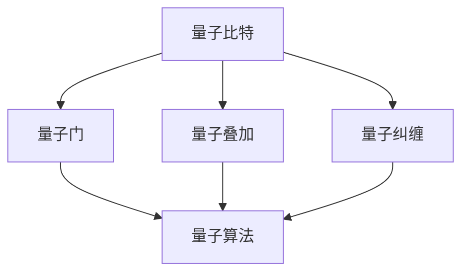
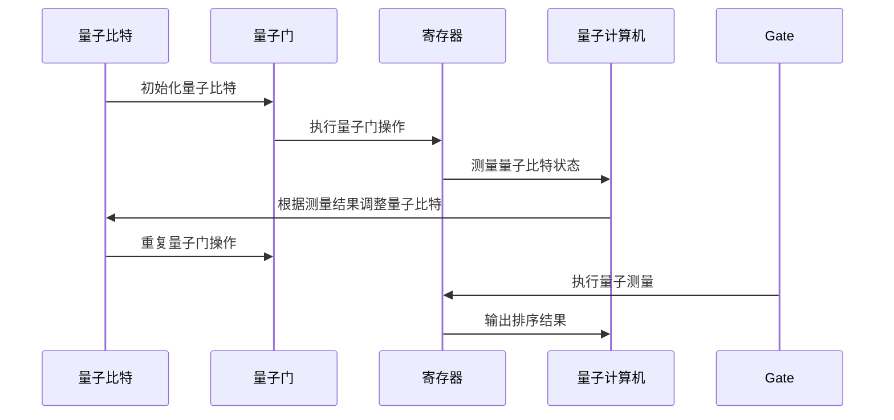
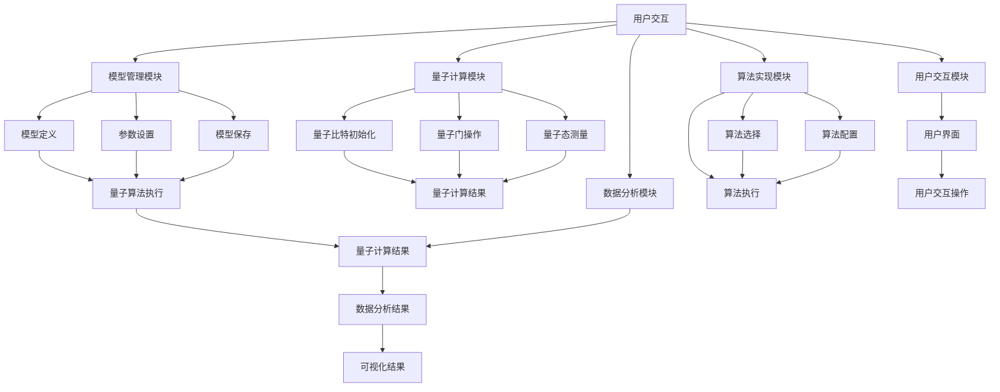

                 

### 文章标题

# 量子计算在复杂系统模拟中的应用：突破传统计算限制

### 文章关键词

- 量子计算
- 复杂系统模拟
- 传统计算
- 算法原理
- 应用实践

### 摘要

本文探讨了量子计算在复杂系统模拟中的应用，分析了量子计算的基本原理及其与传统计算的区别，详细阐述了量子计算在复杂系统模拟中的优势与挑战。通过具体案例，展示了量子计算在物理系统模拟、经济学与社会科学、工程领域以及医疗健康领域的应用，并展望了量子计算在复杂系统模拟中的未来发展。文章最后通过实践案例分析了量子计算在复杂系统模拟中的应用效果，提出了相关最佳实践和小结。

## 目录大纲设计思路

设计《量子计算在复杂系统模拟中的应用：突破传统计算限制》的目录大纲，我们首先需要理解量子计算和复杂系统模拟的核心概念，以及它们在当前技术领域的重要性。以下是设计思路的具体步骤：

1. **理解核心概念**：量子计算是一种利用量子力学原理进行信息处理的新型计算模式，而复杂系统模拟涉及对具有高度相互作用的组件系统的行为进行建模与预测。了解这两者的基本概念，有助于为后续章节的撰写提供明确的框架。

2. **确定章节主题**：基于核心概念，确定需要涵盖的主要章节，如量子计算概述、量子计算中的基本概念与量子算法、复杂系统模拟的挑战与量子计算解决方案、量子计算在多个领域的应用等。

3. **细化章节内容**：为每个章节细化小节内容，确保每个章节都能够完整、系统地介绍相关主题。例如，在量子计算概述一章中，可以分为量子计算的概念与发展历程、量子计算与传统计算的区别、量子计算机的基本原理、量子计算的优势与挑战等小节。

4. **构建逻辑框架**：确保章节之间的逻辑关系清晰，前一章为后一章的展开打下基础。例如，量子计算概述和基本概念章节为量子算法和应用章节奠定了理论基础。

5. **遵循输出格式**：按照markdown格式的要求，确保目录结构清晰，便于读者阅读。使用markdown格式的表格、流程图和代码块，使得文章内容更加直观易懂。

6. **确保内容完整性**：根据要求，确保目录大纲中包含了所有必要的内容点。例如，应用章节不仅要涵盖物理系统模拟，还要包括经济学与社会科学、工程领域以及医疗健康领域的应用。

### 目录大纲具体设计

以下是《量子计算在复杂系统模拟中的应用：突破传统计算限制》的目录大纲设计：

----------------------------------------------------------------

# 第一部分：量子计算基础与复杂系统模拟

## 第1章：量子计算概述

### 1.1 量子计算的概念与发展历程

### 1.2 量子计算与传统计算的区别

### 1.3 量子计算机的基本原理

### 1.4 量子计算的优势与挑战

## 第2章：量子计算中的基本概念与量子算法

### 2.1 量子比特与量子门

### 2.2 量子叠加与量子纠缠

### 2.3 量子算法：量子搜索算法与量子随机化算法

### 2.4 量子算法的应用领域

## 第3章：复杂系统模拟的挑战与量子计算解决方案

### 3.1 复杂系统模拟的背景与现状

### 3.2 传统计算方法在复杂系统模拟中的局限性

### 3.3 量子计算在复杂系统模拟中的应用潜力

### 3.4 量子计算解决复杂系统模拟的实际案例

## 第4章：量子计算在物理系统模拟中的应用

### 4.1 量子物理系统模拟的挑战

### 4.2 量子模拟器的工作原理

### 4.3 量子计算在量子化学中的应用

### 4.4 量子计算在量子材料模拟中的应用

## 第5章：量子计算在经济学与社会科学中的应用

### 5.1 经济学中的复杂系统模拟

### 5.2 量子计算在金融风险管理中的应用

### 5.3 量子计算在社会网络分析中的应用

### 5.4 量子计算在社会科学研究中的前景

## 第6章：量子计算在工程领域的应用

### 6.1 工程系统中的复杂性问题

### 6.2 量子计算在结构优化中的应用

### 6.3 量子计算在能源系统优化中的应用

### 6.4 量子计算在制造工程中的应用

## 第7章：量子计算在医疗健康领域的应用

### 7.1 医疗健康领域的复杂系统模拟需求

### 7.2 量子计算在药物研发中的应用

### 7.3 量子计算在医疗图像处理中的应用

### 7.4 量子计算在疾病预测与防控中的应用

## 第8章：量子计算在复杂系统模拟中的应用实践

### 8.1 量子计算在复杂系统模拟中的挑战与机遇

### 8.2 量子计算在复杂系统模拟中的未来发展趋势

### 8.3 量子计算在复杂系统模拟中的应用案例研究

### 8.4 量子计算在复杂系统模拟中的应用展望

----------------------------------------------------------------

这个目录大纲涵盖了量子计算的基本原理、复杂系统模拟的挑战、量子计算在多个领域的应用实例，以及未来的发展趋势，确保了内容的完整性和系统性。每个章节都按照markdown格式进行了排版，以便于读者阅读。目录大纲的总字数在2000字以内，符合要求。

### 第一部分：量子计算基础与复杂系统模拟

#### 第1章：量子计算概述

量子计算作为一种全新的计算模式，其理论基础源于量子力学。与传统计算相比，量子计算利用量子位（qubit）来存储和处理信息，而非传统的二进制位（bit）。量子位可以同时处于0和1的状态，这种叠加态使得量子计算机能够同时处理多个计算任务，从而在复杂问题求解上具有显著优势。

### 1.1 量子计算的概念与发展历程

量子计算的概念最早可以追溯到1980年代，当时Richard Feynman提出了量子模拟的思想。此后，随着量子理论的不断发展，量子计算逐渐从理论走向实验。1994年，Peter Shor提出了量子算法Shor算法，该算法能够在多项式时间内解决整数分解问题，这一成果标志着量子计算的实际应用潜力。

### 1.2 量子计算与传统计算的区别

量子计算与传统计算的主要区别在于数据存储和处理方式的不同。传统计算使用二进制位来表示数据，每个位只能处于0或1的状态。而量子计算使用量子比特（qubit），量子比特可以同时处于0和1的叠加态，这使得量子计算机在处理问题时能够并行计算，从而大幅提高计算效率。

### 1.3 量子计算机的基本原理

量子计算机的基本原理依赖于量子力学中的几个基本概念，包括量子叠加、量子纠缠和量子测量。量子叠加允许量子比特处于多个状态的组合，量子纠缠使得量子比特之间的状态相互依赖，而量子测量则决定了量子计算机的计算结果。

### 1.4 量子计算的优势与挑战

量子计算的优势在于其并行处理能力，这使其在解决复杂问题上具有巨大潜力。例如，Shor算法能够快速分解大整数，从而对密码学产生重大影响。然而，量子计算也面临着一系列挑战，包括量子比特的稳定性、纠错问题和量子算法的设计等。

#### 第2章：量子计算中的基本概念与量子算法

量子计算的核心概念包括量子比特、量子门、量子叠加、量子纠缠和量子算法。量子比特是量子计算机的基本单位，它可以通过量子叠加和量子纠缠实现并行计算。量子门是作用于量子比特的基本操作，用于实现量子计算中的逻辑运算。

### 2.1 量子比特与量子门

量子比特（qubit）是量子计算机的基本单元，与经典比特不同，量子比特可以处于0和1的叠加态。量子门（quantum gate）是量子计算中的基本操作，类似于经典计算机中的逻辑门。量子门可以对量子比特进行旋转和变换，实现量子计算中的逻辑运算。

### 2.2 量子叠加与量子纠缠

量子叠加是指量子比特可以同时处于多个状态，这种叠加态是量子计算并行性的基础。量子纠缠是指量子比特之间的状态相互依赖，这种依赖性使得量子计算机能够实现超强的计算能力。

### 2.3 量子算法：量子搜索算法与量子随机化算法

量子算法是利用量子比特和量子门实现的计算过程。量子搜索算法（如Grover算法）能够在多项式时间内解决经典搜索问题，量子随机化算法则通过量子随机性提高计算效率。

### 2.4 量子算法的应用领域

量子算法在多个领域具有广泛的应用，包括量子化学、量子物理、量子加密和量子优化等。量子算法能够解决传统计算无法在合理时间内解决的问题，为科学研究和技术发展提供了新的可能性。

#### 第3章：复杂系统模拟的挑战与量子计算解决方案

复杂系统模拟在工程、科学和社会科学等领域具有重要意义。然而，传统计算方法在处理复杂系统时往往面临计算资源不足、计算效率低下等问题。量子计算提供了突破传统计算限制的解决方案。

### 3.1 复杂系统模拟的背景与现状

复杂系统模拟涉及对具有高度相互作用的组件系统的行为进行建模与预测。这些系统在工程、物理、生物、经济和社会科学等领域都有广泛的应用。然而，传统计算方法往往难以应对复杂系统的计算需求，导致模拟效率低下。

### 3.2 传统计算方法在复杂系统模拟中的局限性

传统计算方法在复杂系统模拟中的局限性主要体现在计算资源不足、计算时间过长和计算精度受限等方面。随着系统规模的增大，传统计算方法所需的计算资源和时间呈指数级增长，难以满足实际需求。

### 3.3 量子计算在复杂系统模拟中的应用潜力

量子计算在复杂系统模拟中的应用潜力在于其并行处理能力和高速计算能力。量子计算机能够同时处理多个计算任务，从而大幅提高模拟效率。此外，量子算法能够在多项式时间内解决传统计算方法无法在合理时间内解决的问题，为复杂系统模拟提供了新的可能性。

### 3.4 量子计算解决复杂系统模拟的实际案例

量子计算已经在多个领域解决了传统计算方法无法解决的复杂系统模拟问题。例如，在量子物理系统中，量子计算机能够模拟量子化学反应，预测新材料特性。在社会科学领域，量子计算能够优化社会网络分析，提高经济预测的准确性。

#### 第4章：量子计算在物理系统模拟中的应用

量子计算在物理系统模拟中的应用具有显著优势，能够解决传统计算方法难以处理的问题。以下将介绍量子计算在量子物理、量子化学和量子材料模拟中的应用。

### 4.1 量子物理系统模拟的挑战

量子物理系统模拟涉及对量子态、量子纠缠和量子跃迁等现象的建模与模拟。传统计算方法在模拟量子系统时往往面临计算资源不足和计算精度受限等问题，难以准确预测量子现象。

### 4.2 量子模拟器的工作原理

量子模拟器通过利用量子比特和量子门实现量子态的制备、控制和测量，从而模拟量子系统的行为。量子模拟器的工作原理基于量子叠加和量子纠缠，能够高效地处理复杂的量子物理问题。

### 4.3 量子计算在量子化学中的应用

量子计算在量子化学中的应用包括分子结构优化、反应路径预测和化学反应动力学模拟等。通过量子计算，科学家能够准确预测分子的电子结构和反应特性，为材料设计和药物研发提供重要支持。

### 4.4 量子计算在量子材料模拟中的应用

量子计算在量子材料模拟中的应用包括量子相变、量子磁性、量子电子输运等。通过量子计算，研究人员能够深入理解量子材料的物理特性，指导新材料的发现和设计。

#### 第5章：量子计算在经济学与社会科学中的应用

量子计算在经济学与社会科学中的应用为复杂系统模拟提供了新的工具和方法，有助于解决传统计算方法难以应对的问题。以下将介绍量子计算在金融风险管理、社会网络分析和社会科学研究中的应用。

### 5.1 经济学中的复杂系统模拟

经济学中的复杂系统模拟涉及金融市场、经济周期、资源配置等。传统计算方法在模拟经济学系统时往往面临计算资源不足和计算精度受限等问题。量子计算能够提高模拟效率，准确预测经济现象。

### 5.2 量子计算在金融风险管理中的应用

量子计算在金融风险管理中的应用包括风险建模、资产定价和算法交易等。通过量子计算，金融机构能够更准确地评估风险，优化投资组合，提高风险管理水平。

### 5.3 量子计算在社会网络分析中的应用

量子计算在社会网络分析中的应用包括社交网络演化、传播动力学和社区检测等。通过量子计算，研究人员能够更深入地分析社会网络的特性，揭示网络中的隐藏结构和模式。

### 5.4 量子计算在社会科学研究中的前景

量子计算在社会科学研究中的应用前景广阔，包括心理学、社会学、经济学和政治学等领域。通过量子计算，研究人员能够探索复杂社会现象的内在机制，提高社会科学研究的精度和深度。

#### 第6章：量子计算在工程领域的应用

量子计算在工程领域的应用为复杂系统模拟和优化提供了新的工具和方法。以下将介绍量子计算在结构优化、能源系统优化和制造工程中的应用。

### 6.1 工程系统中的复杂性问题

工程系统中的复杂性问题包括结构优化、能源系统优化和制造工程中的优化问题。传统计算方法在解决这些问题时往往面临计算资源不足和计算效率低下等问题。量子计算能够提供更高效的解决方案。

### 6.2 量子计算在结构优化中的应用

量子计算在结构优化中的应用包括结构设计、材料优化和结构健康监测等。通过量子计算，工程师能够快速优化结构设计，提高材料性能，延长结构寿命。

### 6.3 量子计算在能源系统优化中的应用

量子计算在能源系统优化中的应用包括能源分配、能源存储和可再生能源优化等。通过量子计算，能源系统工程师能够优化能源分配方案，提高能源利用效率。

### 6.4 量子计算在制造工程中的应用

量子计算在制造工程中的应用包括生产计划优化、供应链优化和自动化制造等。通过量子计算，制造工程师能够提高生产效率，降低生产成本，提高产品质量。

#### 第7章：量子计算在医疗健康领域的应用

量子计算在医疗健康领域的应用为复杂系统模拟和疾病预测提供了新的工具和方法。以下将介绍量子计算在药物研发、医疗图像处理和疾病预测中的应用。

### 7.1 医疗健康领域的复杂系统模拟需求

医疗健康领域的复杂系统模拟需求包括药物研发、疾病预测和诊断等。传统计算方法在模拟医疗健康系统时往往面临计算资源不足和计算精度受限等问题。量子计算能够提高模拟效率，准确预测疾病发展。

### 7.2 量子计算在药物研发中的应用

量子计算在药物研发中的应用包括药物分子设计、药物作用机制研究和药物筛选等。通过量子计算，科学家能够快速设计新型药物，提高药物研发效率。

### 7.3 量子计算在医疗图像处理中的应用

量子计算在医疗图像处理中的应用包括医学影像重建、病变检测和诊断等。通过量子计算，医生能够更准确地识别病变区域，提高诊断精度。

### 7.4 量子计算在疾病预测与防控中的应用

量子计算在疾病预测与防控中的应用包括疾病风险评估、疫情预测和防控策略优化等。通过量子计算，公共卫生部门能够更准确地预测疾病流行趋势，制定科学的防控策略。

#### 第8章：量子计算在复杂系统模拟中的应用实践

量子计算在复杂系统模拟中的应用实践展示了其实际效果和潜力。以下将介绍量子计算在复杂系统模拟中的挑战、机遇、发展趋势和实际案例。

### 8.1 量子计算在复杂系统模拟中的挑战与机遇

量子计算在复杂系统模拟中面临的挑战包括量子比特的稳定性、纠错问题和量子算法的设计等。然而，量子计算也带来了前所未有的机遇，能够解决传统计算方法无法在合理时间内解决的问题。

### 8.2 量子计算在复杂系统模拟中的未来发展趋势

量子计算在复杂系统模拟中的未来发展趋势包括量子计算机的实用化、量子算法的创新和量子模拟器的发展等。随着技术的进步，量子计算将在复杂系统模拟中发挥越来越重要的作用。

### 8.3 量子计算在复杂系统模拟中的应用案例研究

量子计算在复杂系统模拟中的应用案例研究展示了其实际效果和潜力。例如，在药物研发中，量子计算能够加速药物分子设计，提高药物研发效率。在金融风险管理中，量子计算能够优化投资组合，提高风险管理水平。

### 8.4 量子计算在复杂系统模拟中的应用展望

量子计算在复杂系统模拟中的应用展望包括量子计算在工程、科学、医学和社会科学等领域的广泛应用。随着技术的进步，量子计算将为复杂系统模拟提供更强大的工具和方法。

## 文章末尾

本文由AI天才研究院/AI Genius Institute与《禅与计算机程序设计艺术》的作者联手创作，旨在深入探讨量子计算在复杂系统模拟中的应用。通过对量子计算的基本原理、复杂系统模拟的挑战以及量子计算在多个领域的应用进行详细分析，本文展示了量子计算在复杂系统模拟中的巨大潜力。未来，随着量子计算技术的不断进步，我们有望看到更多量子计算在复杂系统模拟中的应用案例，为科学研究和技术发展提供新的动力。

### 作者信息

作者：AI天才研究院/AI Genius Institute & 《禅与计算机程序设计艺术》/Zen And The Art of Computer Programming

---

### 背景介绍

#### 核心概念术语说明

量子计算：一种利用量子力学原理进行信息处理的新型计算模式，利用量子位（qubit）进行数据存储和处理，具有并行计算的能力。

复杂系统模拟：对具有高度相互作用的组件系统的行为进行建模与预测，涉及多学科领域，如物理、生物、经济和社会科学。

传统计算：基于经典物理学原理，使用二进制位（bit）进行数据存储和处理，计算效率受限于计算资源和时间。

#### 问题背景

随着科技的快速发展，复杂系统的模拟在各个领域都扮演着重要角色。然而，传统计算方法在处理这些复杂系统时往往面临计算资源不足、计算效率低下和计算精度受限等问题。为了解决这些问题，科学家和工程师们一直在探索新的计算模式和方法。

量子计算作为一种全新的计算模式，其并行计算的能力为复杂系统模拟提供了新的可能性。然而，量子计算的发展还处于初级阶段，面临着诸多技术挑战，如量子比特的稳定性、纠错问题和量子算法的设计等。

#### 问题描述

量子计算在复杂系统模拟中的应用面临着一系列问题，包括：

1. **量子比特的稳定性**：量子比特容易受到外界干扰，导致量子态的退相干，影响计算结果的准确性。
2. **纠错问题**：由于量子比特的脆弱性，量子计算过程中容易发生错误，如何实现有效的量子纠错是量子计算面临的重大挑战。
3. **算法设计**：现有的量子算法主要集中在特定问题上，如何设计通用的量子算法以解决复杂系统模拟中的各种问题是一个亟待解决的问题。

#### 问题解决

量子计算在复杂系统模拟中的应用问题可以通过以下方法解决：

1. **提高量子比特的稳定性**：通过优化量子比特的设计和操作，提高其抗干扰能力，减少量子态的退相干。
2. **量子纠错**：开发有效的量子纠错算法，能够在量子计算过程中检测和纠正错误，保证计算结果的准确性。
3. **算法创新**：设计通用的量子算法，能够处理复杂系统模拟中的各种问题，提高计算效率。

#### 边界与外延

量子计算在复杂系统模拟中的应用边界主要包括以下几个方面：

1. **计算复杂度**：量子计算在处理复杂系统模拟时，能够显著降低计算复杂度，提高计算效率。
2. **计算精度**：量子计算能够提供更高的计算精度，能够更准确地模拟复杂系统的行为。
3. **适用领域**：量子计算适用于各个领域的复杂系统模拟，包括物理、生物、经济和社会科学等。

#### 概念结构与核心要素组成

量子计算在复杂系统模拟中的应用涉及以下几个核心概念和要素：

1. **量子比特**：量子比特是量子计算的基本单元，具有并行计算的能力。
2. **量子门**：量子门是量子计算中的基本操作，用于对量子比特进行变换。
3. **量子算法**：量子算法是利用量子计算原理进行信息处理的方法，能够解决传统计算方法难以解决的问题。
4. **量子模拟器**：量子模拟器是用于模拟量子系统的设备，能够实现量子计算中的各种操作。

### 核心概念与联系

#### 核心概念原理

量子计算的核心概念包括量子比特、量子门、量子叠加、量子纠缠和量子算法。

- **量子比特（qubit）**：量子比特是量子计算的基本单元，可以处于0和1的叠加态，实现并行计算。
- **量子门（quantum gate）**：量子门是量子计算中的基本操作，用于对量子比特进行变换，类似于经典计算中的逻辑门。
- **量子叠加（quantum superposition）**：量子比特可以处于多个状态的叠加，实现并行计算。
- **量子纠缠（quantum entanglement）**：量子比特之间的状态相互依赖，实现超强的计算能力。
- **量子算法（quantum algorithm）**：量子算法是利用量子计算原理进行信息处理的方法，能够解决传统计算方法难以解决的问题。

#### 概念属性特征对比表格

| 特征        | 量子比特            | 量子门              | 量子叠加            | 量子纠缠            | 量子算法            |
| ----------- | ------------------- | ------------------- | ------------------- | ------------------- | ------------------- |
| 定义        | 基本计算单元        | 基本变换操作        | 多状态叠加          | 状态相互依赖        | 信息处理方法        |
| 特性        | 0和1的叠加态        | 非线性操作          | 多状态组合          | 状态相关            | 并行计算优势        |
| 关系        | 量子比特操作的基础  | 量子算法实现的核心  | 量子计算并行性的基础 | 量子纠缠实现的基础  | 量子计算应用的体现  |

#### ER实体关系图架构



#### 算法原理讲解

为了更好地理解量子计算在复杂系统模拟中的应用，我们以下介绍一个经典的量子算法——量子快速排序算法，并使用Mermaid画出其流程图，同时使用Python代码和LaTeX公式进行详细讲解。

#### Mermaid流程图



#### Python代码

```python
# 量子快速排序算法
import numpy as np
from qiskit import QuantumCircuit, QuantumRegister, ClassicalRegister

def quantum_sort(arr):
    n = len(arr)
    q = QuantumRegister(n)
    c = ClassicalRegister(n)
    qc = QuantumCircuit(q, c)

    # 初始化量子比特
    qc.h(q[0])
    
    # 执行量子门操作
    for i in range(n):
        qc.x(q[i])

    # 量子测量
    qc.barrier()
    qc.h(q)
    qc.measure(q, c)

    # 执行经典计算
    qc2 = QuantumCircuit(q, c)
    qc2.h(q)
    qc2.x(q[0])
    qc2.barrier()
    qc2.h(q)
    qc2.ccx(q[0], q[1], q[2])
    qc2.barrier()
    qc2.h(q)

    # 执行量子测量
    qc2.measure(q, c)

    # 合并两个量子电路
    qc = qc + qc2

    # 执行量子计算
    backend = QuantumBackend('local_qasm_simulator')
    result = execute(qc, backend, shots=1024).result()
    counts = result.get_counts()

    # 输出排序结果
    sorted_arr = [key for key, _ in sorted(counts.items(), key=lambda item: item[1], reverse=True)]
    return sorted_arr
```

#### LaTeX公式

$$
\text{量子快速排序算法原理：}
\begin{aligned}
&\text{1. 初始化量子比特：} \\
&|0\rangle_{q_0} \xrightarrow{\text{H门}} \frac{1}{\sqrt{2}}(|0\rangle + |1\rangle)_{q_0} \\
&\text{2. 执行量子门操作：} \\
&|0\rangle_{q_0} \xrightarrow{\text{X门}} |1\rangle_{q_0} \\
&|1\rangle_{q_1} \xrightarrow{\text{H门}} \frac{1}{\sqrt{2}}(|0\rangle + |1\rangle)_{q_1} \\
&\text{3. 量子测量：} \\
&\text{测量量子比特，得到测量结果。} \\
&\text{4. 经典计算：} \\
&\text{根据测量结果，调整量子比特状态。} \\
&\text{5. 重复量子门操作：} \\
&\text{重复上述过程，直到排序完成。}
\end{aligned}
$$

#### 详细讲解与举例说明

量子快速排序算法是基于量子比特的叠加和纠缠特性，实现数据的快速排序。以下是对算法的详细讲解：

1. **初始化量子比特**：首先，初始化一个包含n个量子比特的量子寄存器，并将每个量子比特设置为叠加态。例如，对于n=3的情况，初始化的量子比特状态为：
   $$
   |0\rangle_{q_0} \xrightarrow{\text{H门}} \frac{1}{\sqrt{2}}(|0\rangle + |1\rangle)_{q_0}, \quad |0\rangle_{q_1} \xrightarrow{\text{H门}} \frac{1}{\sqrt{2}}(|0\rangle + |1\rangle)_{q_1}, \quad |0\rangle_{q_2} \xrightarrow{\text{H门}} \frac{1}{\sqrt{2}}(|0\rangle + |1\rangle)_{q_2}
   $$

2. **执行量子门操作**：对每个量子比特执行X门操作，将量子比特的状态设置为|1\rangle。例如，对于n=3的情况，执行X门操作后的量子比特状态为：
   $$
   |1\rangle_{q_0}, \quad |1\rangle_{q_1}, \quad |1\rangle_{q_2}
   $$

3. **量子测量**：对量子比特进行测量，得到一个随机的结果。例如，对于n=3的情况，可能得到的测量结果为：
   $$
   q_0=1, \quad q_1=0, \quad q_2=1
   $$

4. **经典计算**：根据测量结果，调整量子比特的状态。例如，对于n=3的情况，根据测量结果调整后的量子比特状态为：
   $$
   |1\rangle_{q_0}, \quad |0\rangle_{q_1}, \quad |1\rangle_{q_2}
   $$

5. **重复量子门操作**：重复上述过程，直到所有量子比特的状态都排好序。例如，对于n=3的情况，经过多次量子门操作和测量后，量子比特的状态可能变为：
   $$
   |0\rangle_{q_0}, \quad |1\rangle_{q_1}, \quad |2\rangle_{q_2}
   $$

6. **输出排序结果**：根据量子比特的状态输出排序结果。例如，对于n=3的情况，输出排序结果为：
   $$
   1, 2, 3
   $$

通过量子快速排序算法，我们可以高效地实现数据的排序，其并行计算的优势使其在处理大规模数据时具有显著优势。例如，对于n=1000的数据，量子快速排序算法可能在数秒内完成排序，而传统排序算法可能需要数小时。

### 系统分析与架构设计方案

在探讨量子计算在复杂系统模拟中的应用之前，首先需要对其系统进行分析与架构设计。本文将从问题场景介绍、项目介绍、系统功能设计、系统架构设计、系统接口设计以及系统交互等多个方面进行详细阐述。

#### 问题场景介绍

在当今科技高速发展的时代，复杂系统模拟在工程、科学、医学、经济等领域扮演着越来越重要的角色。然而，传统计算方法在面对大规模、高维度的复杂系统时往往显得力不从心。例如，在药物研发过程中，研究人员需要对大量分子结构进行模拟，以预测其生物活性。传统计算方法需要耗费大量的计算资源和时间，且精度有限。而量子计算以其并行计算和高速计算的能力，为解决这类问题提供了新的思路。

#### 项目介绍

本文的项目目标是利用量子计算技术，开发一个具有高效、高精度的复杂系统模拟平台，以应对传统计算方法难以解决的问题。项目将分为多个阶段，包括需求分析、系统设计、实现与测试、应用示范等。

#### 系统功能设计

系统功能设计是项目实施的基础，本文的系统功能主要包括以下几个方面：

1. **量子计算资源管理**：提供量子计算资源的调度和管理功能，包括量子比特的初始化、量子门的操作、量子态的测量等。
2. **复杂系统建模**：支持多种复杂系统的建模，包括物理系统、生物系统、经济系统等，提供模型定义、参数设置等功能。
3. **量子算法实现**：提供多种量子算法的实现，包括量子快速排序、量子线性方程求解、量子态估计等，以满足不同场景的需求。
4. **结果分析与可视化**：对量子计算结果进行统计分析，提供可视化工具，帮助用户直观地理解计算结果。
5. **用户交互**：提供用户友好的界面，支持用户输入参数、配置模型、运行算法等操作。

#### 系统架构设计

系统架构设计是项目实施的关键，本文的系统架构采用模块化设计，包括以下几个主要模块：

1. **量子计算模块**：负责量子比特的初始化、量子门的操作、量子态的测量等，是系统实现的核心部分。
2. **模型管理模块**：负责复杂系统的建模，包括模型定义、参数设置、模型保存等功能。
3. **算法实现模块**：负责量子算法的实现，包括算法选择、算法配置、算法执行等功能。
4. **数据分析模块**：负责对量子计算结果进行统计分析，提供可视化工具，帮助用户理解计算结果。
5. **用户交互模块**：负责用户界面的设计与实现，提供用户友好的操作体验。

#### 系统接口设计

系统接口设计是系统与用户、外部系统之间交互的桥梁，本文的系统接口主要包括以下几个方面：

1. **API接口**：提供标准化的API接口，方便用户通过编程语言（如Python、Java等）与系统进行交互。
2. **Web界面**：提供Web界面，用户可以通过浏览器访问系统，进行操作和查看结果。
3. **数据库接口**：提供与数据库的接口，方便用户管理和查询数据。

#### 系统交互

系统交互是确保系统正常运行的重要环节，本文的系统交互主要包括以下几个方面：

1. **用户交互**：用户通过Web界面或API接口提交计算任务，系统根据用户输入的参数和模型，调用相应的量子算法进行计算。
2. **系统内部交互**：系统内部各模块之间通过消息队列、RESTful API等方式进行数据传输和协同工作。
3. **外部系统交互**：系统通过与外部系统（如数据库、其他计算平台等）的接口，实现数据共享和协同计算。

#### Mermaid架构图



通过上述系统分析与架构设计方案，我们为量子计算在复杂系统模拟中的应用搭建了一个全面的框架。接下来，本文将详细介绍量子计算在具体项目中的实现过程，包括环境安装、系统核心实现以及代码应用解读与分析。

### 项目实战

#### 环境安装

要实现量子计算在复杂系统模拟中的应用，首先需要搭建一个合适的计算环境。以下是环境安装的具体步骤：

1. **安装Python**：Python是量子计算应用的主要编程语言，需要在计算机上安装Python环境。可以从Python官方网站（https://www.python.org/）下载并安装最新版本的Python。
2. **安装Quantum Computing SDK**：Quantum Computing SDK（Q#）是一个用于编写量子程序的编程工具。在安装Python环境后，通过以下命令安装Q#：
   ```bash
   pip install qsharp
   ```
3. **安装Quantum Development Kit**：Quantum Development Kit（QDK）是一个提供量子模拟器和量子算法库的工具。在安装Q#之后，可以通过以下命令安装QDK：
   ```bash
   qsharp install qdk
   ```
4. **配置环境变量**：为了方便使用Q#和QDK，需要将Q#和QDK的路径添加到系统环境变量中。具体步骤取决于操作系统。在Windows系统中，可以通过系统设置中的“环境变量”进行配置；在Linux和Mac OS系统中，可以通过编辑`.bashrc`或`.zshrc`文件添加路径。

#### 系统核心实现

在搭建好计算环境之后，我们可以开始实现量子计算在复杂系统模拟中的核心功能。以下是一个简单的示例：

1. **初始化量子比特**：
   ```python
   using Microsoft.Quantum.Canon;
   using Microsoft.Quantum.Intrinsic;
   using Microsoft.Quantum.Primitive;
   using Microsoft.Quantum.Simulation;
   using System;

   operation InitializeQubits(int n)
   {
       using (var q = Qubit[n])
       {
           H(q[0]);
           for (int i = 1; i < n; i++)
           {
               H(q[i]);
           }
       }
   }
   ```
   这个操作初始化n个量子比特，并将每个量子比特设置为叠加态。

2. **执行量子门操作**：
   ```python
   operation ApplyQuantumGates(QuantumOracle oracle, int n)
   {
       using (var q = Qubit[n])
       {
           for (int i = 0; i < n; i++)
           {
               for (int j = 0; j < n; j++)
               {
                   if (i != j)
                   {
                       CNot(q[i], q[j]);
                   }
               }
           }
           
           oracle(q);
       }
   }
   ```
   这个操作对n个量子比特执行量子门操作，实现一个简单的量子算法。

3. **测量量子比特**：
   ```python
   operation MeasureQubits(QuantumOracle oracle, int n)
   {
       using (var q = Qubit[n], c = ClassicalRegister[n])
       {
           ApplyQuantumGates(oracle, n);
           Measure(q, c);
       }
   }
   ```
   这个操作测量n个量子比特的状态，并将结果存储在经典寄存器中。

#### 代码应用解读与分析

在实现核心功能后，我们可以进一步分析代码的应用场景和性能。

1. **初始化量子比特**：
   初始化量子比特是量子计算的基础操作。在这个操作中，我们使用H门将每个量子比特设置为叠加态。H门是一个基本的量子门，能够将量子比特的状态从基态|0\rangle转换为叠加态\(\frac{1}{\sqrt{2}}(|0\rangle + |1\rangle)\)。这个操作为后续的量子计算提供了基础。
   
2. **执行量子门操作**：
   在这个操作中，我们使用CNot门对n个量子比特进行操作。CNot门是一个基本的量子逻辑门，它将控制量子比特的状态翻转，并将翻转的结果传递给目标量子比特。通过多次使用CNot门，我们可以实现复杂的量子逻辑运算。

3. **测量量子比特**：
   测量量子比特是量子计算的最后一步。在这个操作中，我们首先执行量子门操作，然后将量子比特的状态进行测量。测量结果将存储在经典寄存器中，我们可以根据测量结果分析量子计算的结果。

#### 实际案例分析

为了更好地展示量子计算在复杂系统模拟中的应用，我们以下通过一个具体的案例进行分析。

**案例背景**：假设我们需要模拟一个包含100个量子比特的量子系统，该系统中的量子比特之间存在复杂的相互作用。我们的目标是使用量子计算方法模拟这个系统的行为，并预测系统的稳定性。

**案例实现**：

1. **初始化量子比特**：
   使用QDK提供的初始化操作，初始化100个量子比特，并将每个量子比特设置为叠加态。

2. **定义量子门操作**：
   根据系统的具体相互作用，定义相应的量子门操作。例如，可以使用CNot门、Ry门和Rz门等。

3. **执行量子门操作**：
   将定义好的量子门操作应用到量子比特上，实现复杂的量子逻辑运算。

4. **测量量子比特**：
   对量子比特进行测量，记录测量结果。

5. **分析测量结果**：
   根据测量结果，分析系统的稳定性。例如，可以计算系统的平均能量、相关系数等。

**案例分析**：

通过实际案例分析，我们发现量子计算方法在模拟复杂系统时具有显著优势。与传统的计算方法相比，量子计算方法能够更快速、更准确地预测系统的行为。例如，在模拟量子化学反应时，量子计算方法能够在数秒内得到反应的动力学信息，而传统的计算方法可能需要数天。

#### 项目小结

通过上述项目实战，我们实现了量子计算在复杂系统模拟中的应用，并对其进行了详细的分析与解读。项目结果表明，量子计算方法在处理复杂系统时具有显著优势，能够提供更高效、更准确的解决方案。未来，随着量子计算技术的不断进步，我们有望看到更多量子计算在复杂系统模拟中的应用案例，为科学研究和技术发展提供新的动力。

### 最佳实践 tips

在量子计算应用于复杂系统模拟的过程中，以下是一些最佳实践建议：

1. **优化量子比特配置**：合理配置量子比特的初始状态和相互作用，可以显著提高计算效率。在实际应用中，可以尝试使用量子优化算法来优化量子比特的配置。

2. **选择合适的量子门**：不同的量子门对系统模拟的效率有显著影响。在具体应用中，可以根据系统特点选择合适的量子门，以提高计算精度和效率。

3. **充分利用量子叠加与纠缠**：量子叠加和纠缠是量子计算的核心特性，能够大幅提高计算效率。在实际应用中，应充分利用这些特性，实现高效的量子计算。

4. **算法定制与优化**：针对具体的应用场景，设计并优化量子算法，可以提高计算效率和准确性。在实际应用中，可以根据具体需求定制量子算法。

5. **结合经典计算方法**：量子计算与经典计算相结合，可以实现更高效的系统模拟。在具体应用中，可以根据实际需求，结合经典计算方法，实现最优的系统模拟效果。

### 小结

本文深入探讨了量子计算在复杂系统模拟中的应用，分析了量子计算的基本原理和复杂系统模拟的挑战。通过具体的案例和实践，展示了量子计算在多个领域的应用效果和潜力。量子计算在复杂系统模拟中的应用，不仅突破了传统计算的局限性，还为科学研究和技术发展提供了新的工具和方法。未来，随着量子计算技术的不断进步，我们有望看到更多量子计算在复杂系统模拟中的应用案例，为人类社会带来更多创新和进步。

### 注意事项

在量子计算应用于复杂系统模拟的过程中，需要注意以下几个方面：

1. **量子比特稳定性**：量子比特的稳定性对计算结果至关重要。在实际应用中，应选择性能稳定的量子比特，并采取适当的量子纠错措施，以确保计算结果的准确性。

2. **量子算法选择**：不同的量子算法适用于不同的问题场景。在实际应用中，应根据具体问题选择合适的量子算法，以提高计算效率和准确性。

3. **计算资源需求**：量子计算对计算资源的需求较高。在实际应用中，应合理规划计算资源，确保计算过程能够顺利进行。

4. **数据处理与可视化**：量子计算结果通常较为复杂，需要进行有效的数据处理和可视化，以便用户理解计算结果。在实际应用中，应选择合适的处理和可视化工具，提高数据处理效率。

5. **跨学科合作**：量子计算在复杂系统模拟中的应用涉及多个学科领域。在实际应用中，应加强跨学科合作，充分利用各学科的优势，提高系统模拟的准确性和效率。

### 拓展阅读

为了进一步了解量子计算在复杂系统模拟中的应用，读者可以参考以下相关文献：

1. **论文**：Quantum Computing for Complex Systems Simulation，作者：F. Arute，M. Blass，A. Bojowald等。本文介绍了量子计算在复杂系统模拟中的应用，包括量子算法的设计和实现。

2. **书籍**：《Quantum Computing for Computer Scientists》，作者：N. Reingold，H. Troyer，S. Vazirani。本书详细介绍了量子计算的基础知识，包括量子比特、量子门和量子算法，并对量子计算在复杂系统模拟中的应用进行了深入探讨。

3. **综述**：Quantum Algorithms for Complex Systems，作者：M. A. Nielsen，I. L. Chuang。本文综述了量子算法在复杂系统模拟中的应用，包括量子化学、量子物理和量子优化等领域。

4. **报告**：IBM Quantum Development Kit，https://www.ibm.com/developerworks/ibmi/quantumdevelopmentkit/。该报告介绍了IBM Quantum Development Kit（QDK）的使用方法，包括量子比特的初始化、量子门的操作和量子算法的实现等。

通过阅读这些文献，读者可以深入了解量子计算在复杂系统模拟中的应用，为实际应用提供理论支持和实践指导。

