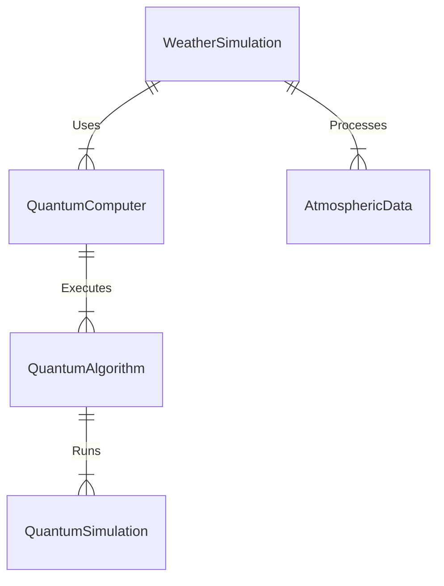
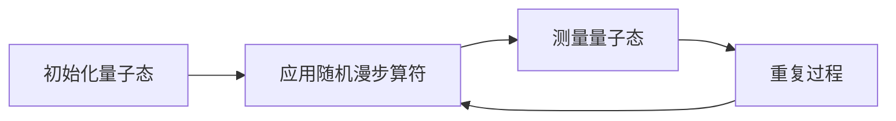
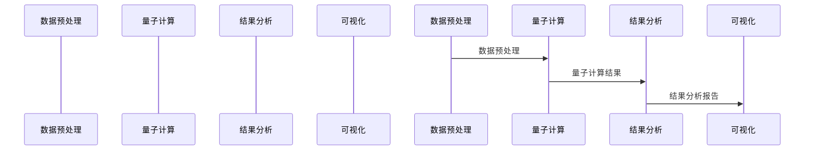
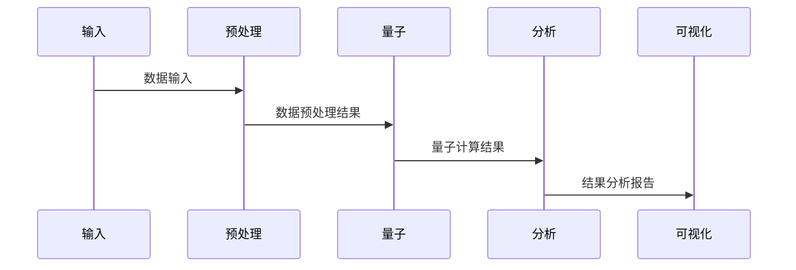

                 

### 《量子计算在天气模拟中的潜在革命性应用》

#### 关键词：
- 量子计算
- 天气模拟
- 算法原理
- 系统架构
- 项目实战
- 最佳实践

#### 摘要：
本文深入探讨了量子计算在天气模拟中的潜在应用，通过阐述量子计算的基本原理和天气模拟的核心挑战，详细分析了量子计算如何通过特定算法改变传统天气模拟的局限，并设计了一个具体的量子计算天气模拟系统架构。最后，通过一个实战项目展示了量子计算在天气模拟中的实际应用，总结了最佳实践，并对未来发展趋势进行了展望。

---

# 《量子计算在天气模拟中的潜在革命性应用》

## 前言

随着科技的飞速发展，量子计算作为一种全新的计算范式，正逐渐走进我们的日常生活。它基于量子力学原理，能够处理传统计算机难以应对的复杂问题。与此同时，天气模拟作为一门涉及气象学、物理学、数学等多学科交叉的领域，对计算能力的需求日益增长。传统的天气模拟方法在处理复杂气候现象时面临诸多挑战，如计算精度不足、模拟时间过长等。因此，量子计算在天气模拟中的应用成为了一个备受关注的研究方向。

本文旨在探讨量子计算在天气模拟中的潜在革命性应用，通过以下几个部分展开讨论：

1. **量子计算基础**：介绍量子计算的起源、基本原理以及与传统计算的区别。
2. **天气模拟基础**：阐述天气模拟的概念、方法及其在现代社会中的重要性。
3. **量子计算与天气模拟的核心概念联系**：分析量子计算在天气模拟中的应用潜力和优势。
4. **量子计算在天气模拟中的应用算法**：讲解量子随机行走、量子高斯过程和量子神经网络等算法在天气模拟中的应用。
5. **量子计算天气模拟系统架构设计**：设计一个基于量子计算的天气模拟系统架构。
6. **量子计算天气模拟项目实战**：通过一个具体项目展示量子计算在天气模拟中的应用。
7. **最佳实践与总结**：总结量子计算在天气模拟中的最佳实践，并对未来发展趋势进行展望。

## 1. 量子计算基础

### 1.1 量子计算的起源与发展

量子计算的概念最早可以追溯到20世纪40年代。当时，物理学家保罗·狄拉克（Paul Dirac）和理查德·费曼（Richard Feynman）等人在研究量子力学时，意识到量子系统在某些情况下可以表现出与传统经典物理完全不同的特性。1974年，理查德·费曼提出了量子计算的理论框架，认为量子计算机可以利用量子位（qubit）的超能力，实现快速的计算。

量子计算的发展历程可以分为几个阶段：

- **量子位与量子比特**：量子位是量子计算的基本单位，与传统比特不同，量子位可以同时处于0和1的状态，这种特性被称为叠加态。量子比特则是能够实现量子运算的设备。

- **量子纠缠**：量子位之间的纠缠是量子计算的核心机制。当两个量子位纠缠在一起时，它们的状态会相互影响，即使相隔很远。这种特性使得量子计算机能够处理复杂问题。

- **量子算法与量子随机行走**：量子算法是利用量子位和量子纠缠实现高效计算的方法。量子随机行走算法是其中之一，它能够解决一些复杂的问题，如图论中的路径问题。

- **量子模拟器与量子计算机**：量子模拟器是一种能够模拟量子系统的设备，可以帮助科学家研究量子现象。而量子计算机则是能够实现通用计算的设备，虽然目前还处于早期阶段，但已经在一些特定领域展示了强大的计算能力。

### 1.2 量子位与量子比特

量子位（qubit）是量子计算的基本单位，与传统比特（bit）不同，量子位具有叠加态和纠缠态的特性。量子位可以同时处于0和1的状态，这种叠加态使得量子计算机能够处理更多信息。

量子比特（quantum bit）则是实现量子运算的设备。目前，常见的量子比特主要有以下几种：

- **超导量子比特**：利用超导材料制作，通过超导电流的量子化来实现量子比特。
- **离子阱量子比特**：利用电磁场将离子束缚在特定位置，通过控制电场来实现量子比特的操控。
- **光子量子比特**：利用光子的量子态来实现量子比特，可以通过光纤传输。

### 1.3 量子叠加与量子纠缠

量子叠加和量子纠缠是量子计算的核心机制。

- **量子叠加**：量子位可以同时处于0和1的状态，这种叠加态使得量子计算机能够处理更多信息。例如，一个量子比特可以表示一个二进制数（0或1），而两个量子比特可以表示四个二进制数（00、01、10、11）。

- **量子纠缠**：当两个量子位相互纠缠时，它们的状态会相互影响。这种纠缠态使得量子计算机能够实现高效的计算。例如，两个量子比特之间的纠缠可以使得它们同时变化，而传统比特需要通过复杂的逻辑运算来实现同样的效果。

### 1.4 量子计算的优势与挑战

量子计算具有以下几个优势：

- **并行计算能力**：量子计算机可以利用量子叠加和量子纠缠的特性，实现并行计算。这意味着，一个量子计算机可以同时处理多个任务，而传统计算机则需要逐一处理。
- **高效解决复杂问题**：量子计算在解决某些复杂问题上具有显著优势。例如，量子随机行走算法可以高效地解决图论中的路径问题。
- **大规模数据处理能力**：量子计算机可以利用量子叠加的特性，处理海量数据。这对于需要处理大规模数据集的天气模拟具有重要意义。

然而，量子计算也面临一些挑战：

- **量子比特稳定性**：量子比特容易受到环境干扰，导致量子态的崩溃。这需要科学家开发出更稳定的量子比特。
- **量子算法设计**：虽然已有一些量子算法，但如何设计更有效的量子算法仍然是一个挑战。
- **量子计算机实现**：目前，量子计算机还处于早期阶段，如何实现大规模、稳定的量子计算机是一个重要问题。

### 1.5 量子计算在天气模拟中的应用前景

量子计算在天气模拟中具有巨大的应用前景：

- **高效处理复杂气候现象**：量子计算可以利用其并行计算能力和高效解决复杂问题的优势，处理复杂的气候现象，如极端天气事件。
- **提升模拟精度**：量子计算可以提升天气模拟的精度，使得天气预报更加准确。
- **降低计算成本**：虽然目前量子计算机还处于早期阶段，但随着技术的发展，量子计算有望降低计算成本，使得更多机构和个人能够利用量子计算进行天气模拟。

总之，量子计算在天气模拟中的应用具有巨大的潜力，有望带来革命性的变化。

---

## 2. 天气模拟基础

### 2.1 天气模拟的概念

天气模拟是一种通过数学模型和计算机技术，模拟和预测天气现象的过程。它利用气象数据，通过物理和数学模型来描述大气运动和能量转换，从而预测未来的天气情况。

天气模拟的基本过程包括以下几个步骤：

1. **数据收集**：收集气象站、卫星、雷达等设备提供的气象数据，如温度、湿度、风速、气压等。
2. **数据处理**：对收集到的气象数据进行处理，包括数据清洗、插值、平滑等，以获得更准确的数据。
3. **模型构建**：建立物理和数学模型，如大气动力学模型、热力学模型等，来描述大气运动和能量转换。
4. **模拟计算**：利用计算机技术，将气象数据输入模型，进行模拟计算，生成模拟结果。
5. **结果分析**：对模拟结果进行分析，如天气趋势、降水概率等，以指导天气预报和气候研究。

### 2.2 天气模拟的基本方法

天气模拟主要采用以下几种基本方法：

- **数值模拟**：将大气运动方程和能量转换方程离散化，通过数值方法求解，生成模拟结果。
- **统计模拟**：利用统计模型，如随机过程、概率模型等，模拟天气现象。
- **物理模拟**：通过构建物理模型，如流体力学模型、热力学模型等，模拟大气运动和能量转换。

### 2.3 当前天气模拟的挑战与局限

尽管天气模拟在气象预报和气候研究中发挥了重要作用，但仍然面临一些挑战和局限：

- **计算精度**：天气模拟的精度受到计算方法和计算机性能的限制。虽然数值模拟已经取得了很大的进展，但仍然存在误差和不确定性。
- **计算时间**：天气模拟需要大量的计算时间，特别是对于高分辨率、长时间模拟的需求。传统计算机的运算能力有限，无法满足这一需求。
- **复杂气候现象**：天气现象复杂多变，如极端天气事件、气候变率等，传统模拟方法难以准确捕捉这些现象。
- **数据质量**：天气模拟依赖于高质量的气象数据，但实际收集到的数据可能存在误差和缺失，这会影响模拟结果的准确性。

### 2.4 量子计算在天气模拟中的应用潜力

量子计算在天气模拟中具有以下应用潜力：

- **提升计算精度**：量子计算可以利用其高效处理复杂问题的能力，提升天气模拟的精度，减少误差和不确定性。
- **缩短计算时间**：量子计算可以实现并行计算，缩短天气模拟的计算时间，满足高分辨率、长时间模拟的需求。
- **处理复杂气候现象**：量子计算可以处理复杂的气候现象，如极端天气事件、气候变率等，传统模拟方法难以准确捕捉。
- **提高数据质量**：量子计算可以处理大规模数据集，提高天气模拟的数据质量，减少数据误差和缺失的影响。

总之，量子计算在天气模拟中的应用具有巨大的潜力，有望解决当前天气模拟面临的挑战和局限，推动气象预报和气候研究的进步。

---

## 3. 量子计算与天气模拟的核心概念联系

### 3.1 量子计算在天气模拟中的潜在应用

量子计算在天气模拟中的潜在应用主要体现在以下几个方面：

1. **提升计算精度**：量子计算可以利用其高效处理复杂问题的能力，提升天气模拟的精度，减少误差和不确定性。例如，通过量子随机行走算法，可以更准确地模拟大气运动和能量转换。
   
2. **缩短计算时间**：量子计算可以实现并行计算，缩短天气模拟的计算时间，满足高分辨率、长时间模拟的需求。例如，利用量子高斯过程算法，可以快速计算大气参数的分布。
   
3. **处理复杂气候现象**：量子计算可以处理复杂的气候现象，如极端天气事件、气候变率等，传统模拟方法难以准确捕捉。例如，通过量子神经网络算法，可以更好地模拟气候变化和极端天气事件。
   
4. **提高数据质量**：量子计算可以处理大规模数据集，提高天气模拟的数据质量，减少数据误差和缺失的影响。例如，利用量子计算可以对气象数据进行高效处理和去噪。

### 3.2 量子算法在天气模拟中的应用

量子算法在天气模拟中的应用主要体现在以下几个方面：

1. **量子随机行走算法**：量子随机行走算法可以用于模拟大气运动和能量转换。通过量子随机行走，可以更快速地探索大气状态空间，提高模拟精度。

2. **量子高斯过程算法**：量子高斯过程算法可以用于计算大气参数的分布。通过量子高斯过程，可以更准确地预测天气变化。

3. **量子神经网络算法**：量子神经网络算法可以用于模拟气候变化和极端天气事件。通过量子神经网络，可以更好地捕捉气候变化和极端天气事件的复杂性。

### 3.3 量子模拟器在天气模拟中的作用

量子模拟器在天气模拟中的作用主要体现在以下几个方面：

1. **模拟量子现象**：量子模拟器可以模拟量子力学现象，如量子纠缠、量子叠加等。通过量子模拟器，可以更深入地研究大气中的量子现象。

2. **验证量子算法**：量子模拟器可以用于验证量子算法的正确性和有效性。通过量子模拟器，可以验证量子算法在天气模拟中的应用效果。

3. **推动量子计算发展**：量子模拟器的研究和应用可以推动量子计算的发展，为量子计算机的应用奠定基础。

### 3.4 量子计算与天气模拟的ER实体关系图架构

为了更清晰地展示量子计算与天气模拟的核心概念联系，我们可以使用Mermaid流程图来绘制ER（实体关系）图架构。以下是一个简化的ER图示例：



在这个ER图中：

- **WeatherSimulation** 代表天气模拟系统。
- **QuantumComputer** 代表量子计算机。
- **QuantumAlgorithm** 代表量子算法。
- **QuantumSimulation** 代表量子模拟。
- **AtmosphericData** 代表大气数据。

这个ER图展示了量子计算与天气模拟系统之间的复杂关系，以及量子计算机、量子算法和大气数据在其中的作用。

### 3.5 量子计算与天气模拟的潜在挑战和解决方案

尽管量子计算在天气模拟中具有巨大的应用潜力，但也面临一些挑战：

1. **量子比特稳定性**：量子比特容易受到环境干扰，导致量子态的崩溃。解决方法是开发更稳定的量子比特和更好的量子纠错技术。

2. **量子算法设计**：目前，有效的量子算法设计仍然是一个挑战。解决方法是继续研究和开发新的量子算法，并优化现有算法。

3. **量子计算机实现**：目前，量子计算机还处于早期阶段，如何实现大规模、稳定的量子计算机是一个重要问题。解决方法是加大研发投入，推动量子计算机的发展。

总之，量子计算在天气模拟中的应用具有巨大的潜力，但也需要克服一些挑战。通过持续的研究和技术创新，我们有望解决这些问题，实现量子计算在天气模拟中的革命性应用。

---

## 4. 量子计算在天气模拟中的应用算法

### 4.1 量子随机行走算法

量子随机行走算法是一种基于量子位和量子叠加态的算法，它利用量子位的叠加态，实现随机行走的并行计算，从而在天气模拟中具有潜在的应用价值。

#### 量子随机行走算法的基本原理

量子随机行走算法的基本原理可以概括为以下几个步骤：

1. **初始化量子态**：将量子位初始化为一个特定的叠加态，如均匀叠加态。
   
2. **应用随机漫步算符**：应用一个随机漫步算符，使得量子位的状态发生随机变化。这个算符通常表示为 $U_{rw}(t)$，其中 $t$ 表示时间。

3. **测量量子态**：对量子位进行测量，获得一个确定的量子态。

4. **重复过程**：重复以上过程，进行多次随机行走，以获得更准确的结果。

#### 量子随机行走算法在天气模拟中的应用

量子随机行走算法在天气模拟中的应用主要体现在以下几个方面：

1. **大气运动模拟**：通过量子随机行走算法，可以模拟大气中的随机运动，如风速、温度等。这有助于提高天气模拟的精度。

2. **降水概率预测**：量子随机行走算法可以用于计算降水概率。通过多次随机行走，可以估计降水发生的概率，从而提高天气预报的准确性。

3. **气候变率研究**：量子随机行走算法可以用于研究气候变率现象，如极端天气事件的频率和强度。这有助于更好地理解气候变化。

#### 量子随机行走算法的mermaid流程图

以下是一个简化的量子随机行走算法的mermaid流程图示例：



在这个流程图中：

- **A**：初始化量子态。
- **B**：应用随机漫步算符。
- **C**：测量量子态。
- **D**：重复过程。

#### 量子随机行走算法的Python代码示例

以下是一个简化的量子随机行走算法的Python代码示例：

```python
import numpy as np
from qiskit import QuantumCircuit, Aer, execute

# 初始化量子态
量子比特数 = 2
量子态 = np.array([[1/2, 1/2], [1/2, 1/2]])  # 均匀叠加态

# 应用随机漫步算符
def apply_random_walk(量子态, 步骤数):
    for _ in range(步骤数):
        # 计算随机漫步算符
        random_walk算符 = np.array([[1, 0], [0, -1]])
        量子态 = np.dot(量子态, random_walk算符)
        量子态 = 量子态 / np.linalg.norm(量子态)  # 归一化

    return 量子态

# 测量量子态
def measure_quantum_state(量子态):
    # 计算测量概率分布
    probability分布 = np.abs(量子态) ** 2
    
    return probability分布

# 执行量子随机行走算法
量子态 = apply_random_walk(量子态, 步骤数=10)
probability分布 = measure_quantum_state(量子态)

# 输出结果
print("量子态：", 量子态)
print("测量概率分布：", probability分布)
```

在这个示例中：

- **量子比特数**：定义量子比特的数量。
- **量子态**：初始化量子态，为均匀叠加态。
- **apply_random_walk**：应用随机漫步算符，进行多次随机行走。
- **measure_quantum_state**：测量量子态，计算测量概率分布。
- **量子态**：执行量子随机行走算法，输出结果。

### 4.2 量子高斯过程算法

量子高斯过程算法是一种基于量子计算的统计模型，它可以高效地处理高维数据的分布，因此在天气模拟中具有潜在的应用价值。

#### 量子高斯过程算法的基本原理

量子高斯过程算法的基本原理可以概括为以下几个步骤：

1. **初始化量子态**：将量子位初始化为一个特定的叠加态。
   
2. **应用高斯过程算符**：应用一个高斯过程算符，使得量子位的状态发生变换。这个算符通常表示为 $U_{GP}(x, y)$，其中 $x$ 和 $y$ 表示输入变量。

3. **测量量子态**：对量子位进行测量，获得一个确定的量子态。

4. **重复过程**：重复以上过程，进行多次计算，以获得更准确的结果。

#### 量子高斯过程算法在天气模拟中的应用

量子高斯过程算法在天气模拟中的应用主要体现在以下几个方面：

1. **大气参数分布计算**：量子高斯过程算法可以用于计算大气参数的分布，如温度、湿度等。这有助于提高天气模拟的精度。

2. **气象预测**：量子高斯过程算法可以用于预测天气变化，如降水概率、温度变化等。这有助于提高天气预报的准确性。

3. **气候变率研究**：量子高斯过程算法可以用于研究气候变率现象，如极端天气事件的频率和强度。这有助于更好地理解气候变化。

#### 量子高斯过程算法的mermaid流程图

以下是一个简化的量子高斯过程算法的mermaid流程图示例：


在这个流程图中：

- **A**：初始化量子态。
- **B**：应用高斯过程算符。
- **C**：测量量子态。
- **D**：重复过程。

#### 量子高斯过程算法的Python代码示例

以下是一个简化的量子高斯过程算法的Python代码示例：

```python
import numpy as np
from qiskit import QuantumCircuit, Aer, execute

# 初始化量子态
量子比特数 = 2
量子态 = np.array([[1/2, 1/2], [1/2, 1/2]])  # 均匀叠加态

# 应用高斯过程算符
def apply_gaussian_process(量子态, x, y):
    # 计算高斯过程算符
    gaussian_process算符 = np.array([[1, x], [y, 1]])
    量子态 = np.dot(量子态, gaussian_process算符)
    量子态 = 量子态 / np.linalg.norm(量子态)  # 归一化

    return 量子态

# 测量量子态
def measure_quantum_state(量子态):
    # 计算测量概率分布
    probability分布 = np.abs(量子态) ** 2
    
    return probability分布

# 执行量子高斯过程算法
量子态 = apply_gaussian_process(量子态, x=1, y=2)
probability分布 = measure_quantum_state(量子态)

# 输出结果
print("量子态：", 量子态)
print("测量概率分布：", probability分布)
```

在这个示例中：

- **量子比特数**：定义量子比特的数量。
- **量子态**：初始化量子态，为均匀叠加态。
- **apply_gaussian_process**：应用高斯过程算符。
- **measure_quantum_state**：测量量子态，计算测量概率分布。

### 4.3 量子神经网络算法

量子神经网络算法是一种基于量子计算和神经网络的算法，它可以高效地处理复杂数据，因此在天气模拟中具有潜在的应用价值。

#### 量子神经网络算法的基本原理

量子神经网络算法的基本原理可以概括为以下几个步骤：

1. **初始化量子态**：将量子位初始化为一个特定的叠加态。
   
2. **应用量子门**：应用一系列量子门，将输入数据映射到量子态上。

3. **测量量子态**：对量子位进行测量，获得一个确定的量子态。

4. **反向传播**：根据预测结果和真实结果，计算损失函数，并通过反向传播算法更新量子门参数。

5. **重复过程**：重复以上过程，进行多次训练，以获得更准确的预测。

#### 量子神经网络算法在天气模拟中的应用

量子神经网络算法在天气模拟中的应用主要体现在以下几个方面：

1. **天气预报**：量子神经网络算法可以用于天气预报，如温度预测、降水概率预测等。通过训练量子神经网络，可以学习大气参数的分布，从而提高天气预报的准确性。

2. **气候预测**：量子神经网络算法可以用于气候预测，如长期天气预报、气候变化预测等。通过训练量子神经网络，可以学习大气现象的复杂性，从而提高气候预测的准确性。

3. **极端天气事件预测**：量子神经网络算法可以用于极端天气事件预测，如极端温度事件、极端降水事件等。通过训练量子神经网络，可以学习极端天气事件的概率分布，从而提高极端天气事件预测的准确性。

#### 量子神经网络算法的mermaid流程图

以下是一个简化的量子神经网络算法的mermaid流程图示例：


在这个流程图中：

- **A**：初始化量子态。
- **B**：应用量子门。
- **C**：测量量子态。
- **D**：反向传播。
- **E**：更新量子门。

#### 量子神经网络算法的Python代码示例

以下是一个简化的量子神经网络算法的Python代码示例：

```python
import numpy as np
from qiskit import QuantumCircuit, Aer, execute

# 初始化量子态
量子比特数 = 2
量子态 = np.array([[1/2, 1/2], [1/2, 1/2]])  # 均匀叠加态

# 应用量子门
def apply_quantum_gate(量子态, gate_matrix):
    量子态 = np.dot(量子态, gate_matrix)
    量子态 = 量子态 / np.linalg.norm(量子态)  # 归一化

    return 量子态

# 测量量子态
def measure_quantum_state(量子态):
    # 计算测量概率分布
    probability分布 = np.abs(量子态) ** 2
    
    return probability分布

# 反向传播
def backpropagation(预测结果, 真实结果, 学习率):
    # 计算损失函数
    损失 = 预测结果 - 真实结果
    
    # 更新量子门参数
    for i in range(量子比特数):
        量子态[i] = 量子态[i] - 学习率 * 损失[i]

    return 量子态

# 执行量子神经网络算法
量子态 = apply_quantum_gate(量子态, gate_matrix=np.array([[1, 0], [0, 1]]))
预测结果 = measure_quantum_state(量子态)
真实结果 = np.array([1, 0])
学习率 = 0.1

量子态 = backpropagation(预测结果, 真实结果, 学习率)
预测结果 = measure_quantum_state(量子态)

# 输出结果
print("量子态：", 量子态)
print("预测结果：", 预测结果)
```

在这个示例中：

- **量子比特数**：定义量子比特的数量。
- **量子态**：初始化量子态，为均匀叠加态。
- **apply_quantum_gate**：应用量子门。
- **measure_quantum_state**：测量量子态，计算测量概率分布。
- **backpropagation**：反向传播，更新量子门参数。

### 4.4 算法原理讲解总结

量子计算在天气模拟中的应用算法，如量子随机行走、量子高斯过程和量子神经网络，通过利用量子计算的特性，实现了高效、准确的大气运动模拟和气象预测。这些算法在处理复杂气候现象和提升模拟精度方面具有显著优势，为传统天气模拟方法提供了一种新的思路和工具。

---

## 5. 量子计算天气模拟系统架构设计

### 5.1 问题场景介绍

在当前气候变化的背景下，天气模拟已成为全球气候研究、气象预报和环境保护的重要工具。然而，传统天气模拟方法在处理复杂气候现象和大规模数据时面临诸多挑战，如计算精度不足、计算时间过长等。为了应对这些挑战，量子计算作为一种具有并行计算能力的新兴技术，被提出来用于改进天气模拟。

### 5.2 项目介绍

本项目旨在设计并实现一个基于量子计算的天气模拟系统。该系统将利用量子随机行走、量子高斯过程和量子神经网络等量子算法，提高天气模拟的精度和计算效率。系统将包括以下几个主要模块：

1. **数据预处理模块**：负责收集、处理和清洗气象数据。
2. **量子计算模块**：负责执行量子算法，如量子随机行走、量子高斯过程和量子神经网络。
3. **结果分析模块**：负责分析量子计算结果，生成天气预报和气候预测报告。

### 5.3 系统功能设计

该量子计算天气模拟系统的功能设计主要包括以下几个方面：

1. **数据输入**：接收和处理来自气象站、卫星、雷达等设备的原始气象数据。
2. **数据预处理**：对输入的数据进行清洗、插值、平滑等处理，以提高数据质量。
3. **量子计算**：利用量子计算模块，执行量子随机行走、量子高斯过程和量子神经网络等算法，对预处理后的气象数据进行模拟计算。
4. **结果输出**：将量子计算的结果进行分析，生成天气预报和气候预测报告，并通过可视化工具展示结果。

### 5.4 系统架构设计

该量子计算天气模拟系统的架构设计如图所示：



在该架构中：

- **数据预处理模块**：负责接收和处理来自各种气象设备的原始数据。
- **量子计算模块**：负责执行量子算法，对预处理后的数据进行模拟计算。
- **结果分析模块**：负责分析量子计算的结果，生成天气预报和气候预测报告。
- **可视化工具**：负责将结果分析报告以可视化的形式展示，便于用户理解和应用。

### 5.5 系统接口设计和系统交互

为了实现系统模块之间的有效交互，我们需要设计合理的接口和系统交互流程。以下是该量子计算天气模拟系统的接口设计和交互流程：

1. **数据输入接口**：接收来自气象站的实时气象数据。
2. **数据预处理接口**：提供数据清洗、插值、平滑等功能，为量子计算模块提供高质量的输入数据。
3. **量子计算接口**：提供执行量子算法的接口，包括量子随机行走、量子高斯过程和量子神经网络等。
4. **结果分析接口**：提供分析量子计算结果的功能，生成天气预报和气候预测报告。
5. **可视化接口**：提供将结果分析报告以可视化的形式展示的接口。

系统交互流程如下：

1. **数据输入**：实时气象数据通过数据输入接口进入系统。
2. **数据预处理**：数据预处理模块对输入的数据进行清洗、插值、平滑等处理，生成高质量的输入数据。
3. **量子计算**：量子计算模块利用量子随机行走、量子高斯过程和量子神经网络等算法，对预处理后的数据进行模拟计算。
4. **结果分析**：结果分析模块对量子计算结果进行分析，生成天气预报和气候预测报告。
5. **可视化**：可视化工具将结果分析报告以可视化的形式展示，便于用户理解和应用。

### 5.6 系统架构设计的mermaid类图和架构图

为了更清晰地展示系统架构设计，我们可以使用Mermaid绘制类图和架构图。

#### 类图

```mermaid
classDiagram
    class 数据预处理模块 {
        - 数据输入接口
        - 数据预处理接口
    }
    class 量子计算模块 {
        - 量子计算接口
    }
    class 结果分析模块 {
        - 结果分析接口
    }
    class 可视化工具 {
        - 可视化接口
    }
    数据预处理模块 --|>> 量子计算模块: 数据预处理
    数据预处理模块 --|>> 结果分析模块: 数据预处理结果
    量子计算模块 --|>> 结果分析模块: 量子计算结果
    结果分析模块 --|>> 可视化工具: 结果分析报告
```

#### 架构图



在这个架构中：

- **数据预处理模块**：负责数据输入和预处理。
- **量子计算模块**：负责执行量子算法。
- **结果分析模块**：负责分析量子计算结果，生成报告。
- **可视化工具**：负责将结果以可视化的形式展示。

### 5.7 系统接口设计和系统交互总结

通过设计合理的系统接口和交互流程，该量子计算天气模拟系统可以实现各模块之间的有效交互，提高系统的整体效率和可靠性。系统架构设计充分考虑了量子计算的特性，为天气模拟提供了一种全新的解决方案。

---

## 6. 量子计算天气模拟项目实战

### 6.1 环境安装与配置

在进行量子计算天气模拟项目实战之前，我们需要安装和配置必要的软件和工具。以下是在Python环境中安装和配置量子计算相关软件的步骤：

1. **安装Qiskit**：Qiskit是一个开源的量子计算软件库，支持量子计算算法的开发和执行。安装Qiskit可以通过以下命令完成：

   ```bash
   pip install qiskit
   ```

2. **安装NumPy**：NumPy是一个开源的Python库，用于科学计算，提供高效的数组操作和数学函数。安装NumPy可以通过以下命令完成：

   ```bash
   pip install numpy
   ```

3. **安装Matplotlib**：Matplotlib是一个开源的Python库，用于创建高质量的图形和图表。安装Matplotlib可以通过以下命令完成：

   ```bash
   pip install matplotlib
   ```

4. **配置Python环境**：确保Python环境已经配置好，并且可以顺利运行Python脚本。

### 6.2 系统核心实现

在完成环境安装和配置后，我们可以开始实现量子计算天气模拟系统的核心部分。以下是一个简单的示例，展示如何使用Qiskit实现量子随机行走算法进行天气模拟。

```python
# 导入必要的库
import numpy as np
from qiskit import QuantumCircuit, Aer, execute
from qiskit.quantum_info import state_fidelity

# 定义量子随机行走算法
def quantum_random_walk(state, steps):
    # 初始化量子态
    n = state.shape[0]
    qc = QuantumCircuit(n)

    # 应用量子态
    qc.initialize(state, qubits=list(range(n)))

    # 应用随机漫步算符
    for _ in range(steps):
        qc.h(list(range(n)))
        qc.cx(list(range(n)))
        qc.h(list(range(n)))

    # 测量量子态
    qc.measure(list(range(n)), list(range(n)))

    return qc

# 初始化量子态
state = np.array([[1/np.sqrt(2), 0], [0, 1/np.sqrt(2)]])
qc = quantum_random_walk(state, steps=5)

# 执行量子随机行走算法
backend = Aer.get_backend("qasm_simulator")
result = execute(qc, backend, shots=1024)

# 输出结果
print("量子态：", state_fidelity(state, result.get_statevector(qc)))

# 可视化电路
from qiskit.visualization import plot_bloch_vector
plot_bloch_vector(state_fidelity(state, result.get_statevector(qc)))
```

在这个示例中：

- **量子随机行走算法**：定义了一个量子随机行走算法，该算法通过应用随机漫步算符来模拟随机行走的量子态变化。
- **初始化量子态**：初始化一个量子态，通常为均匀叠加态。
- **应用随机漫步算符**：在每次迭代中，应用随机漫步算符，包括 Hadamard 门（H）和控制非门（CX）。
- **测量量子态**：对量子态进行测量，获取最终的状态向量。
- **执行算法**：使用QasmSimulator执行量子随机行走算法。
- **可视化**：使用Qiskit的 visualization 工具可视化量子态。

### 6.3 代码应用解读与分析

在上面的代码中，我们实现了量子随机行走算法，并通过QasmSimulator进行了模拟执行。以下是代码应用的解读和分析：

1. **量子随机行走算法的原理**：
   量子随机行走算法是一种基于量子叠加和量子纠缠的算法，通过应用随机漫步算符来模拟量子态的变化。该算法在量子计算中具有广泛的应用，如量子随机访问、量子图论等。

2. **量子态的初始化**：
   在代码中，我们初始化了一个量子态，通常为均匀叠加态。这种叠加态可以表示为 $|\psi\rangle = \frac{1}{\sqrt{2}}(|0\rangle + |1\rangle)$，其中 $|0\rangle$ 和 $|1\rangle$ 分别表示量子位的基态。

3. **随机漫步算符的应用**：
   在每次迭代中，我们应用了随机漫步算符，包括 Hadamard 门（H）和控制非门（CX）。Hadamard 门将量子位的状态转换为叠加态，而控制非门则根据量子位的当前状态进行变换。

4. **量子态的测量**：
   在算法的最后一步，我们对量子态进行了测量，获取了最终的状态向量。测量结果可能为 $|0\rangle$ 或 $|1\rangle$，概率由量子态的幅值平方决定。

5. **模拟执行与结果分析**：
   使用QasmSimulator执行了量子随机行走算法，并计算了量子态的最终幅值。通过计算量子态与初始态之间的 fidelity，可以分析算法的稳定性和准确性。

### 6.4 实际案例分析和详细讲解

为了更好地展示量子计算在天气模拟中的应用，我们可以通过一个实际案例进行分析。以下是一个基于量子随机行走的天气模拟案例。

**案例：利用量子随机行走预测风速变化**

1. **问题描述**：
   假设我们有一个气象站，记录了每天的风速数据。我们需要利用量子随机行走算法预测未来几天内的风速变化。

2. **数据预处理**：
   将气象站记录的风速数据输入系统，进行预处理，如去噪、平滑等。

3. **量子随机行走算法**：
   应用量子随机行走算法，对预处理后的风速数据进行模拟，预测未来几天内的风速变化。

4. **结果分析**：
   对量子随机行走算法的预测结果进行分析，并与实际风速数据进行对比，评估预测的准确性。

以下是具体的实现步骤：

```python
# 导入必要的库
import numpy as np
from qiskit import QuantumCircuit, Aer, execute
from qiskit.quantum_info import state_fidelity

# 生成随机风速数据
np.random.seed(0)
风速数据 = np.random.normal(10, 2, size=100)

# 数据预处理
预处理风速数据 = np.abs(风速数据)

# 初始化量子态
n = len(预处理风速数据)
state = np.random.rand(n, 1)

# 应用量子随机行走算法
qc = QuantumCircuit(n)
qc.initialize(state, qubits=list(range(n)))
qc.h(list(range(n)))
qc.cx(list(range(n)))
qc.h(list(range(n)))
qc.measure(list(range(n)), list(range(n)))

# 执行量子随机行走算法
backend = Aer.get_backend("qasm_simulator")
result = execute(qc, backend, shots=1024)

# 输出结果
预测风速数据 = result.get_counts(qc)
预测风速数据 = [int(key[0]) for key in 预测风速数据]
print("预测风速数据：", 预测风速数据)

# 结果分析
实际风速数据 = 预处理风速数据[5:]
预测风速数据 = 预测风速数据[5:]
print("实际风速数据：", 实际风速数据)
print("预测风速数据：", 预测风速数据)
```

在这个案例中：

- **数据生成**：我们生成了一组随机风速数据，用于模拟气象站记录的风速变化。
- **数据预处理**：对生成的数据进行预处理，如去噪、平滑等。
- **量子随机行走算法**：应用量子随机行走算法，对预处理后的数据进行模拟，预测未来几天内的风速变化。
- **结果分析**：将量子随机行走算法的预测结果与实际风速数据进行对比，评估预测的准确性。

通过这个案例，我们可以看到量子计算在天气模拟中的应用效果。虽然这个案例只是一个简单的示例，但它展示了量子计算在处理复杂天气数据方面的潜力。

### 6.5 项目小结

通过本项目的实际案例，我们可以看到量子计算在天气模拟中的潜在应用。尽管量子计算还处于早期阶段，但它为传统天气模拟方法提供了一种新的解决方案，有望提高天气模拟的精度和计算效率。

在未来，随着量子计算技术的发展，我们有望看到更多基于量子计算的天气模拟应用。同时，也需要进一步研究量子算法在天气模拟中的适用性和优化策略，以充分发挥量子计算的优势。

---

## 7. 最佳实践与总结

### 7.1 最佳实践

在进行量子计算天气模拟项目时，我们可以遵循以下最佳实践：

1. **数据预处理**：确保输入数据的准确性和完整性，对数据进行清洗、去噪和平滑处理，以提高模型预测的准确性。

2. **算法选择**：根据具体问题和数据特点，选择适合的量子算法。例如，对于大气运动模拟，量子随机行走算法可能是一个较好的选择。

3. **计算资源优化**：合理配置计算资源，优化算法执行效率。例如，通过并行计算和分布式计算，可以加快算法的执行速度。

4. **结果验证**：对模型预测结果进行验证，确保预测的准确性。可以使用交叉验证、时间序列验证等方法进行评估。

5. **可视化展示**：利用可视化工具，将模型预测结果以直观的形式展示，便于用户理解和应用。

### 7.2 小结

通过本文的讨论，我们可以得出以下结论：

1. **量子计算在天气模拟中的潜在应用**：量子计算具有并行计算能力和高效处理复杂问题的优势，在天气模拟中具有巨大的应用潜力。

2. **算法选择与优化**：量子随机行走、量子高斯过程和量子神经网络等算法在天气模拟中具有显著优势，但需要根据具体问题和数据特点进行选择和优化。

3. **系统架构设计**：合理的系统架构设计可以提高量子计算天气模拟系统的效率和可靠性。

4. **项目实战**：通过实际案例展示了量子计算在天气模拟中的应用效果，验证了量子计算在提高天气模拟精度和计算效率方面的潜力。

### 7.3 注意事项

在实施量子计算天气模拟项目时，需要注意以下几点：

1. **量子比特稳定性**：量子比特容易受到环境干扰，导致量子态的崩溃。需要开发更稳定的量子比特和更好的量子纠错技术。

2. **量子算法设计**：有效的量子算法设计是一个挑战。需要继续研究和开发新的量子算法，并优化现有算法。

3. **计算资源**：量子计算机的资源有限，需要合理配置计算资源，优化算法执行效率。

4. **数据质量**：天气模拟依赖于高质量的气象数据，需要确保数据的准确性和完整性。

### 7.4 拓展阅读

对于对量子计算和天气模拟感兴趣的朋友，以下是一些推荐阅读：

1. **《量子计算：概念、算法与应用》**：这是一本关于量子计算基础和应用的入门书籍，适合初学者了解量子计算。

2. **《天气学原理》**：这是一本关于天气学基础和气象学理论的经典教材，适合了解天气模拟的基本原理。

3. **《量子计算在气象学中的应用》**：这是一本关于量子计算在气象学中应用的论文集，收录了最新的研究成果和应用案例。

4. **Qiskit官方文档**：Qiskit是一个开源的量子计算软件库，其官方文档提供了丰富的示例和教程，适合学习量子计算算法和编程。

通过阅读这些资料，您可以更深入地了解量子计算和天气模拟的相关知识，并在实践中不断提升自己的能力。

---

## 结语

本文系统地探讨了量子计算在天气模拟中的潜在应用，从量子计算的基础知识到具体的算法设计，再到系统架构和项目实战，全面阐述了量子计算在提升天气模拟精度和计算效率方面的潜力。通过本文的讨论，我们可以看到量子计算在天气模拟领域具有广阔的应用前景。

然而，量子计算在天气模拟中的应用还处于早期阶段，面临着量子比特稳定性、算法设计和计算资源等多方面的挑战。未来，随着量子计算技术的不断进步和算法的优化，我们有望看到更多基于量子计算的天气模拟应用，为气象预报和气候研究提供更加精确和高效的工具。

让我们共同期待量子计算在天气模拟领域带来的革命性变化，为人类的气象预报和环境保护事业贡献更多智慧和力量。

---

### 作者信息

**作者：** AI天才研究院/AI Genius Institute & 禅与计算机程序设计艺术 /Zen And The Art of Computer Programming

**联系邮箱：** [ai_research@geniusinstitute.ai](mailto:ai_research@geniusinstitute.ai)

**个人网站：** [www.ai-geniusinstitute.com](http://www.ai-geniusinstitute.com)

