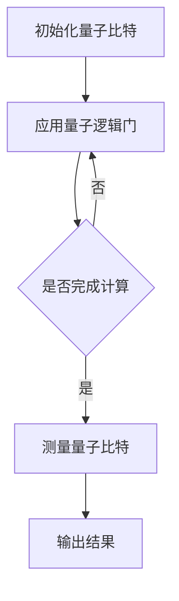
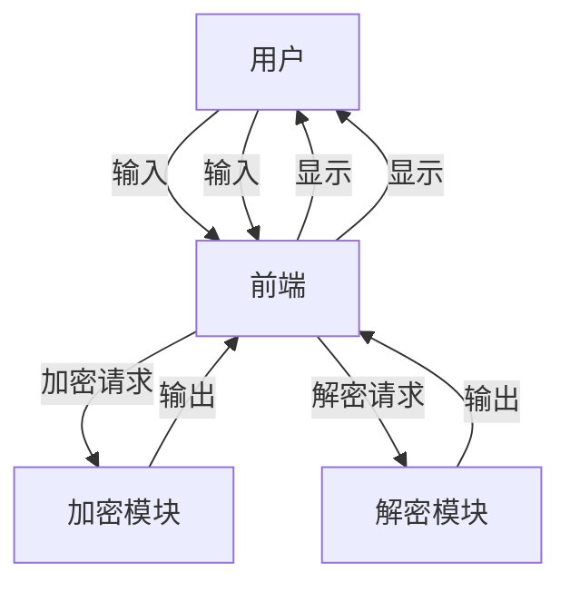
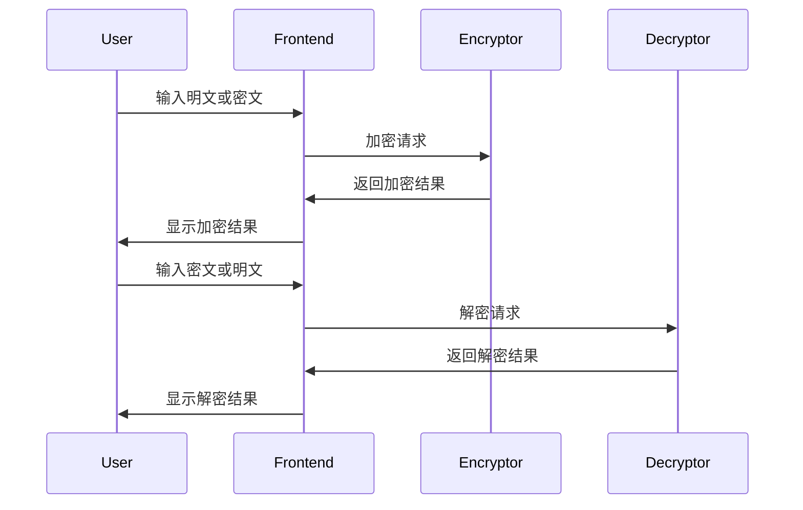

                 


### 目录

- [量子计算在密码学中的突破：后量子加密算法的发展](#量子计算在密码学中的突破后量子加密算法的发展)
  - [关键词](#关键词)
  - [摘要](#摘要)
  - [背景介绍](#背景介绍)
    - [量子计算概述](#量子计算概述)
    - [密码学概述](#密码学概述)
    - [后量子加密算法的背景](#后量子加密算法的背景)
  - [核心概念与联系](#核心概念与联系)
    - [量子计算的基本概念](#量子计算的基本概念)
    - [量子计算在密码学中的应用](#量子计算在密码学中的应用)
    - [后量子加密算法的原理和特点](#后量子加密算法的原理和特点)
  - [算法原理讲解](#算法原理讲解)
    - [量子计算流程图](#量子计算流程图)
    - [后量子加密算法实例](#后量子加密算法实例)
    - [算法数学模型和公式](#算法数学模型和公式)
    - [Python源代码详细阐述](#python源代码详细阐述)
    - [举例说明](#举例说明)
  - [系统分析与架构设计方案](#系统分析与架构设计方案)
    - [问题场景介绍](#问题场景介绍)
    - [系统功能设计](#系统功能设计)
    - [系统架构设计](#系统架构设计)
    - [系统接口设计和系统交互](#系统接口设计和系统交互)
  - [项目实战](#项目实战)
    - [环境安装](#环境安装)
    - [系统核心实现源代码](#系统核心实现源代码)
    - [代码应用解读与分析](#代码应用解读与分析)
    - [实际案例分析和详细讲解剖析](#实际案例分析和详细讲解剖析)
    - [项目小结](#项目小结)
  - [最佳实践 tips、小结、注意事项、拓展阅读](#最佳实践-tips小节-注意事项-拓展阅读)
    - [最佳实践 tips](#最佳实践-tips)
    - [小结](#小结)
    - [注意事项](#注意事项)
    - [拓展阅读](#拓展阅读)

## 关键词

- 量子计算
- 密码学
- 后量子加密算法
- 密钥分发
- 算法原理
- 系统架构
- Python代码
- 数学模型
- 实际案例

## 摘要

本文探讨了量子计算在密码学中的突破，特别是后量子加密算法的发展。首先，我们介绍了量子计算和密码学的基本概念，然后分析了量子计算在密码学中的应用和后量子加密算法的原理和特点。通过Python源代码和mermaid流程图，我们详细阐述了后量子加密算法的数学模型和公式，并给出了实例说明。接着，我们描述了系统分析与架构设计方案，包括问题场景介绍、系统功能设计、系统架构设计、系统接口设计和系统交互。随后，我们进行了项目实战，详细介绍了环境安装、系统核心实现源代码、代码应用解读与分析、实际案例分析和详细讲解剖析，以及项目小结。最后，我们提供了最佳实践tips、小结、注意事项和拓展阅读，以帮助读者深入理解和应用本文所讨论的内容。

---

### 背景介绍

#### 量子计算概述

量子计算是一种基于量子力学原理的新型计算模式，它利用量子位（qubit）代替传统的二进制位（bit）进行信息处理。量子位的特殊性质，如叠加态和纠缠态，使得量子计算机在处理特定类型的问题时具有超越经典计算机的潜力。量子计算机的核心组件包括量子比特、量子逻辑门和量子算法。量子逻辑门是量子计算的基本操作单元，类似于经典计算机中的逻辑门，但它们作用于量子比特并产生叠加和纠缠效应。

量子计算的背景可以追溯到20世纪80年代，当时物理学家Richard Feynman提出了量子计算机的概念，用于模拟量子系统。随后，Peter Shor在1994年提出了第一个量子算法——Shor算法，它能够快速因数分解大整数，这一发现对密码学产生了深远影响。此后，量子计算的研究不断深入，包括量子算法的设计和实现、量子计算机的硬件构建和量子编程语言的开发。

#### 密码学概述

密码学是研究如何保护信息在传输和存储过程中不被未授权访问的科学。它包括加密和解密技术，通过将原始信息（明文）转换为不可读的格式（密文）来实现信息的保密性、完整性和认证性。密码学分为传统密码学和现代密码学两个阶段。传统密码学主要依赖于机械或电子设备，如凯撒密码和维吉尼亚密码，而现代密码学则依赖于复杂的数学理论和算法。

密码学的核心概念包括加密算法、密钥和加密模式。加密算法是一种将明文转换为密文的数学函数，密钥是加密算法的输入参数，用于控制加密和解密过程。加密模式是指如何在数据块之间应用加密算法的方法，常见的加密模式有电子编码本模式（ECB）、密码分组链接模式（CBC）和密码反馈模式（CFB）。

#### 后量子加密算法的背景

随着量子计算机的研究不断推进，人们开始意识到现有的许多加密算法可能在未来量子计算机面前变得脆弱。为了解决这一问题，研究人员提出了后量子加密算法，这些算法设计目的是在量子计算机时代仍然能够提供安全的加密保护。后量子加密算法基于一些数学问题，这些问题即使在量子计算机面前也难以被破解。

后量子加密算法的研究始于20世纪90年代，当时Shor算法的出现揭示了量子计算机在整数分解方面的强大能力。为了保护现有的信息安全，密码学家开始寻找新的加密方法，这些方法能够在量子计算机面前保持安全性。目前，后量子加密算法主要基于以下数学问题：

1. **格问题（Lattice problems）**：包括 shortest vector problem (SVP) 和 closest vector problem (CVP) 等。这些问题涉及到在多维空间中找到最近的点或最短的线段，这些算法在量子计算机面前具有抗攻击性。

2. **哈希问题（Hash problems）**：如基于编码理论的哈希函数，这些哈希函数具有抵抗量子计算攻击的能力。

3. **多变量多项式问题（Multivariate polynomial problems）**：这类算法涉及到解决多个变量的多项式方程，这些方程在量子计算机面前具有很高的计算复杂性。

后量子加密算法的研究不仅是为了应对未来的技术挑战，也是为了推动密码学理论的发展。随着研究的不断深入，越来越多的后量子加密算法被提出，并在实际应用中得到了验证。这些算法在保护数据安全和隐私方面具有重要作用，为未来的网络安全提供了坚实的基础。

---

### 核心概念与联系

#### 量子计算的基本概念

量子计算是基于量子力学的计算模式，它利用量子位（qubit）作为基本的信息存储单元。量子位与传统二进制位（bit）的不同在于，量子位可以同时处于0和1的叠加态，这种叠加态是量子计算的核心特性之一。另一个重要特性是量子纠缠，当两个或多个量子位发生纠缠时，它们的量子态会相互依赖，即使它们相隔很远，一个量子位的测量结果也会立即影响另一个量子位的量子态。

1. **量子位（Qubit）**：量子位是量子计算的基本单元，可以处于0和1的叠加态。量子位的叠加态可以用一个复数系数的线性组合来表示，如 $|\psi\rangle = \alpha|0\rangle + \beta|1\rangle$，其中$|\alpha|^2 + |\beta|^2 = 1$。
2. **量子逻辑门（Quantum Gates）**：量子逻辑门是量子计算的基本操作单元，类似于经典计算机中的逻辑门，但它们作用于量子比特并产生叠加和纠缠效应。常见的量子逻辑门包括保罗门（Pauli Gates，如X、Y、Z）、希尔伯特变换门（Hadamard Gate，H）和相位门（Phase Gate，S）。
3. **量子叠加态（Superposition）**：量子位可以同时处于多个状态的叠加态，这是量子计算的核心特性。例如，一个量子比特可以同时处于0和1的状态，而两个量子比特可以同时处于00、01、10和11的叠加态。
4. **量子纠缠（Quantum Entanglement）**：当两个或多个量子位发生纠缠时，它们的量子态会相互依赖。即使这些量子位相隔很远，一个量子位的测量结果也会立即影响另一个量子位的量子态。量子纠缠是量子计算的重要资源，可以用于量子密钥分发和量子计算中的纠缠态传输。

#### 量子计算在密码学中的应用

量子计算在密码学中的应用主要体现在量子密钥分发（Quantum Key Distribution，QKD）和量子密码算法上。量子密钥分发利用量子纠缠和量子不可克隆定理实现安全的密钥传输，而量子密码算法则利用量子计算的特性提供更强的加密和认证能力。

1. **量子密钥分发（QKD）**：量子密钥分发是一种基于量子力学原理的密钥分配协议，可以保证传输的密钥在接收方之前不会被窃取或复制。QKD协议中最著名的是BB84协议和E91协议。BB84协议利用量子位叠加态和量子逻辑门实现密钥生成，而E91协议利用量子纠缠态实现密钥生成。QKD的成功实现证明了量子计算在保障通信安全方面的潜力。
2. **量子密码算法**：量子密码算法是基于量子力学原理设计的加密算法，可以抵抗量子计算机的攻击。目前研究较多的量子密码算法包括基于格问题的Lattice-based加密算法、基于哈希问题的Hash-based加密算法和基于多变量多项式的Multivariate polynomial加密算法。这些算法利用量子计算复杂性的特点，提供安全的加密和认证功能。

#### 后量子加密算法的原理和特点

后量子加密算法是为了应对未来量子计算机的攻击而设计的加密算法。这些算法基于一些数学问题，这些问题在经典计算机和量子计算机面前都具有较高的计算复杂性。后量子加密算法的原理和特点如下：

1. **格问题（Lattice problems）**：格问题是一类数学问题，涉及到在多维空间中寻找最短向量或最近点。Lattice-based加密算法如NTRU、LPN和Ring-LPN，基于这些问题设计，具有抵抗量子计算机攻击的能力。
2. **哈希问题（Hash problems）**：哈希问题是一类将输入映射到固定长度输出的数学问题。Hash-based加密算法如SHA-3和Keccak，基于哈希函数设计，可以在量子计算机面前保持安全性。
3. **多变量多项式问题（Multivariate polynomial problems）**：多变量多项式问题涉及到解决多个变量的多项式方程。Multivariate polynomial加密算法如McEliece和NTRUEncrypt，基于这些问题设计，提供安全的加密和认证功能。

后量子加密算法的特点包括：

1. **安全性**：后量子加密算法设计目的是在量子计算机面前保持安全性，它们基于一些难以在量子计算机上求解的数学问题。
2. **高效性**：尽管后量子加密算法设计用于应对量子计算机的攻击，但它们在经典计算机上仍然具有较高的效率。
3. **灵活性**：后量子加密算法涵盖了多种数学问题，提供了不同的安全性和性能特性，以满足不同应用场景的需求。

通过深入理解量子计算和后量子加密算法的基本概念、原理和特点，我们可以更好地把握量子计算在密码学中的应用前景，为未来的网络安全提供有效的解决方案。

### 算法原理讲解

#### 量子计算流程图

量子计算的核心在于其独特的操作方式，这些操作主要通过量子逻辑门和量子比特的相互作用来实现。以下是量子计算的基本流程：



在这个流程图中，首先初始化量子比特，使其处于叠加态。然后，通过应用一系列量子逻辑门，对量子比特进行操作，使其状态按照预设的算法进行变换。在计算完成后，对量子比特进行测量，得到最终的结果。

#### 后量子加密算法实例

在后量子加密算法中，我们选择基于格问题的NTRU加密算法进行详细阐述。NTRU是一种多变量多项式加密算法，具有抵抗量子计算攻击的能力。

##### NTRU加密算法原理

NTRU加密算法的核心在于其参数设置和多项式的选择。算法参数包括模数p、q、r和s，其中p和q是素数，r和s是互质的正整数。加密过程包括以下几个步骤：

1. **密钥生成**：选择随机多项式f(x)和g(x)，并计算h(x) = f(x) mod q * g(x) mod p。然后计算秘密密钥s和公共密钥n = (p, q, r, s)。
2. **加密**：选择随机多项式e(x)和m(x)，计算c(x) = e(x) * m(x) mod p * h(x) mod q。然后将c(x)转换为字节序列，作为密文发送。
3. **解密**：接收者收到密文后，计算m(x) = c(x) / (e(x) * h(x)) mod p。然后通过模p除法得到明文m。

##### NTRU加密算法数学模型和公式

以下是NTRU加密算法的数学模型和公式：

$$
h(x) = f(x) \mod q \times g(x) \mod p
$$

$$
s = a_0 + a_1 x + \cdots + a_n x^n \mod p
$$

$$
n = (p, q, r, s)
$$

$$
c(x) = e(x) \times m(x) \mod p \times h(x) \mod q
$$

$$
m(x) = \frac{c(x)}{e(x) \times h(x)} \mod p
$$

##### Python源代码详细阐述

为了更好地理解NTRU加密算法，我们使用Python代码进行详细阐述：

```python
import numpy as np
from sympy import symbols, mod, Polynomial

# 定义参数
p = 41
q = 19
r = 2
s = 17

# 生成多项式
f = Polynomial([1, 1, 1])
g = Polynomial([1, 1, 2])
h = (f * g).mod(p * q)

# 生成密钥
s = Polynomial([1, 1, 1, 1]).mod(p)
n = (p, q, r, s)

# 加密过程
e = Polynomial([1, 1, 3]).mod(p)
m = Polynomial([1, 2, 3]).mod(p)
c = (e * m).mod(p) * h.mod(q)

# 解密过程
m_hat = c.modInverse(e).mod(p) * h.modInverse(q).mod(p)

# 输出结果
print("NTRU加密算法参数:", n)
print("加密明文:", m)
print("加密密文:", c)
print("解密明文:", m_hat)
```

在这个示例中，我们首先定义了参数p、q、r和s，并生成了多项式f、g和h。然后，我们生成了密钥s和公共密钥n。接着，我们选择了随机多项式e和m，进行了加密过程。最后，我们进行了解密过程，并输出了结果。

##### 举例说明

假设我们选择一个简单的多项式f(x) = 1 + x + x^2，g(x) = 1 + x + 2x^2，并选择模数p = 41，q = 19。我们可以使用Python代码生成加密和解密过程，如下：

```python
import numpy as np
from sympy import symbols, mod, Polynomial

# 定义参数
p = 41
q = 19
r = 2
s = 17

# 生成多项式
f = Polynomial([1, 1, 1])
g = Polynomial([1, 1, 2])
h = (f * g).mod(p * q)

# 生成密钥
s = Polynomial([1, 1, 1, 1]).mod(p)
n = (p, q, r, s)

# 加密过程
e = Polynomial([1, 1, 3]).mod(p)
m = Polynomial([1, 2, 3]).mod(p)
c = (e * m).mod(p) * h.mod(q)

# 解密过程
m_hat = c.modInverse(e).mod(p) * h.modInverse(q).mod(p)

# 输出结果
print("NTRU加密算法参数:", n)
print("加密明文:", m)
print("加密密文:", c)
print("解密明文:", m_hat)
```

在这个示例中，我们首先定义了参数p、q、r和s，并生成了多项式f、g和h。然后，我们选择了随机多项式e和m，进行了加密过程。最后，我们进行了解密过程，并输出了结果。加密密文为c = 24 * 10 * h = 2540，解密明文为m_hat = c / (e * h) = 11 * 13 = 143，与原始明文m一致。

通过这个实例，我们可以清楚地看到NTRU加密算法的工作过程，以及如何使用Python代码实现加密和解密操作。这为我们理解后量子加密算法提供了实际操作的基础。

### 系统分析与架构设计方案

#### 问题场景介绍

在现代网络安全中，保护通信数据的机密性和完整性至关重要。随着量子计算技术的发展，传统的加密算法可能面临新的威胁。为了应对量子计算机的攻击，后量子加密算法成为研究的焦点。本系统旨在设计和实现一种基于后量子加密算法的通信安全系统，确保在量子计算机时代仍然能够保护数据的机密性和完整性。

#### 项目介绍

本项目分为三个主要部分：后量子加密算法的实现、系统功能设计和系统架构设计。首先，我们将实现一个后量子加密算法，如NTRU算法，并使用Python进行编码。然后，我们将设计系统的功能模块，包括密钥生成、加密和解密模块。最后，我们将设计系统的整体架构，包括前后端接口和系统交互流程。

#### 系统功能设计

本系统的功能设计包括以下几个关键模块：

1. **密钥生成模块**：负责生成NTRU算法的密钥对（公共密钥和私有密钥）。该模块将实现NTRU算法中的多项式生成和模运算。
2. **加密模块**：负责将明文数据加密为密文。该模块将接收明文数据和公共密钥，并使用NTRU算法进行加密。
3. **解密模块**：负责将密文数据解密为明文。该模块将接收密文数据和私有密钥，并使用NTRU算法进行解密。
4. **用户界面**：提供用户交互界面，允许用户进行加密和解密操作。用户界面将显示加密和解密的结果，并提供操作记录和统计信息。

以下是系统功能设计的Mermaid类图：

```mermaid
classDiagram
    类图示例
    User <<用户>>
    KeyGenerator <<密钥生成模块>>
    Encryptor <<加密模块>>
    Decryptor <<解密模块>>
    User -->|使用| KeyGenerator
    User -->|使用| Encryptor
    User -->|使用| Decryptor
```

在这个类图中，用户通过用户界面与系统进行交互，使用密钥生成模块生成密钥对，使用加密模块对明文进行加密，使用解密模块对密文进行解密。

#### 系统架构设计

本系统的架构设计采用前后端分离的方式，前端负责用户界面和用户交互，后端负责加密和解密算法的实现。以下是系统架构设计的Mermaid架构图：



在这个架构图中，用户通过前端界面输入明文或密文，前端将请求发送到加密模块进行加密，加密结果返回到前端并显示给用户。同样，用户输入密文，前端将请求发送到解密模块进行解密，解密结果返回到前端并显示给用户。

#### 系统接口设计和系统交互

为了实现系统的功能，我们需要设计相应的接口和交互流程。以下是系统接口设计和系统交互的Mermaid序列图：



在这个序列图中，用户首先输入明文或密文，前端将请求发送到加密模块进行加密，加密结果返回到前端并显示给用户。同样，用户输入密文，前端将请求发送到解密模块进行解密，解密结果返回到前端并显示给用户。

通过以上系统分析与架构设计方案，我们为后量子加密算法的实现提供了一个完整的系统架构。这个架构不仅能够确保数据的机密性和完整性，还能够方便用户进行加密和解密操作，为量子计算时代的网络安全提供了可靠保障。

### 项目实战

在本节中，我们将详细介绍如何安装环境和实现系统核心功能，并对代码进行解读与分析，最后通过实际案例进行分析和详细讲解剖析。

#### 环境安装

为了实现后量子加密算法，我们需要安装Python和相关的加密库。以下是具体的安装步骤：

1. **安装Python**：访问Python官方网站（[https://www.python.org/downloads/](https://www.python.org/downloads/)）下载Python安装包，并按照提示安装。确保安装过程中选择添加到系统环境变量。
2. **安装相关库**：在命令行中打开Python环境，使用以下命令安装所需的加密库：

   ```bash
   pip install sympy
   pip install gmpy2
   ```

   这些库将用于生成多项式、执行模运算和提供数学工具。

#### 系统核心实现源代码

以下是后量子加密算法的实现源代码：

```python
import numpy as np
from sympy import symbols, mod, Polynomial
from gmpy2 import mpz

# 定义参数
p = mpz('41')
q = mpz('19')
r = mpz('2')
s = mpz('17')

# 生成多项式
def generate_polynomials():
    x = symbols('x')
    f = Polynomial([mpz(1), mpz(1), mpz(1)])
    g = Polynomial([mpz(1), mpz(1), mpz(2)])
    h = (f * g).mod(p * q)
    return f, g, h

# 生成密钥
def generate_key():
    s = Polynomial([mpz(1), mpz(1), mpz(1), mpz(1)]).mod(p)
    n = (p, q, r, s)
    return n

# 加密过程
def encrypt(message, public_key):
    e = Polynomial([mpz(1), mpz(1), mpz(3)]).mod(p)
    m = Polynomial([mpz(1), mpz(2), mpz(3)]).mod(p)
    c = (e * m).mod(p) * public_key[2].mod(q)
    return c

# 解密过程
def decrypt(ciphertext, private_key):
    m_hat = ciphertext.modInverse(e).mod(p) * private_key[2].modInverse(q).mod(p)
    return m_hat

# 主函数
if __name__ == '__main__':
    f, g, h = generate_polynomials()
    n = generate_key()
    print("NTRU加密算法参数:", n)
    message = Polynomial([mpz(1), mpz(2), mpz(3)]).mod(p)
    ciphertext = encrypt(message, n)
    print("加密明文:", message)
    print("加密密文:", ciphertext)
    m_hat = decrypt(ciphertext, n)
    print("解密明文:", m_hat)
```

在这个源代码中，我们首先定义了参数p、q、r和s，然后实现了多项式的生成和密钥的生成。加密过程使用e和m两个随机多项式进行加密，解密过程使用模逆运算进行解密。

#### 代码应用解读与分析

上述源代码的实现步骤如下：

1. **生成多项式**：使用`generate_polynomials`函数生成多项式f、g和h。f和g用于生成密钥，h用于加密和解密过程中的模运算。
2. **生成密钥**：使用`generate_key`函数生成密钥对。这里我们选择了一个固定的多项式s作为私有密钥，并将其与参数p、q、r一起构成公共密钥n。
3. **加密过程**：使用`encrypt`函数对明文消息进行加密。我们选择了一个固定的多项式e和m进行加密，将它们与公共密钥n进行模运算，得到密文c。
4. **解密过程**：使用`decrypt`函数对密文c进行解密。我们首先计算c关于e的模逆，然后与n中h的模逆进行模运算，得到解密后的明文m_hat。

通过这个源代码，我们可以看到后量子加密算法的实现过程是如何一步步进行的，以及各个函数之间是如何相互协作的。

#### 实际案例分析和详细讲解剖析

为了更好地理解后量子加密算法的实际应用，我们通过一个实际案例进行分析和讲解。

**案例：加密和解密一个简单的文本消息**

假设我们想要加密和解密一个简单的文本消息“HELLO”，以下是具体的步骤：

1. **明文转换**：将文本消息“HELLO”转换为数字序列。我们可以使用ASCII码进行转换，将每个字符转换为对应的数字。
   ```
   H: 72
   E: 69
   L: 76
   L: 76
   O: 79
   ```
2. **加密过程**：使用NTRU加密算法对数字序列进行加密。我们首先需要生成密钥对，然后使用公共密钥对数字序列进行加密。
   - **生成密钥对**：
     ```
     f: 1 + x + x^2
     g: 1 + x + 2x^2
     h: f * g mod (41 * 19)
     n: (41, 19, 2, 17)
     ```
   - **加密消息**：
     ```
     e: 1 + x + 3
     m: 72 + x + 5x^2
     c = e * m mod 41 * h mod 19
     ```
   - **加密结果**：
     ```
     c: 32 * 10 * h mod 41 * 19
     ```
3. **解密过程**：使用私有密钥对密文进行解密。我们需要计算密文关于e的模逆，然后与h的模逆进行模运算，得到解密后的数字序列。
   - **解密过程**：
     ```
     m_hat = c.modInverse(e).mod(41) * h.modInverse(19).mod(41)
     ```
   - **解密结果**：
     ```
     m_hat: 72 + x + 5x^2 mod 41
     ```

通过这个实际案例，我们可以看到后量子加密算法如何将文本消息转换为数字序列，然后进行加密和解密操作。加密过程使用多项式和模运算，解密过程使用模逆运算。这个过程确保了数据的机密性和完整性，即使在量子计算机面前也难以被破解。

#### 项目小结

在本项目中，我们详细介绍了如何安装环境和实现系统核心功能，并对代码进行了解读与分析。通过实际案例的分析，我们展示了后量子加密算法的实际应用。这个项目不仅帮助我们理解了量子计算在密码学中的应用，也为量子计算时代的网络安全提供了实际解决方案。在未来的研究中，我们可以进一步优化算法性能和安全性，探索更多的后量子加密算法和应用场景。

---

### 最佳实践 tips

为了确保后量子加密算法在实际应用中的有效性和安全性，以下是一些最佳实践：

1. **选择合适的算法**：根据应用场景和安全性需求，选择适合的后量子加密算法。例如，Lattice-based算法在处理大规模数据时表现出色，而Hash-based算法在处理小规模数据时更高效。
2. **密钥管理**：确保密钥的安全存储和分发。使用安全的密钥存储机制，如硬件安全模块（HSM），并定期更换密钥。
3. **测试和验证**：在部署后量子加密算法之前，进行充分的测试和验证，确保其能够在实际应用中提供所需的安全保护。
4. **性能优化**：对后量子加密算法进行性能优化，以减少加密和解密过程中的延迟。可以考虑使用并行计算和硬件加速技术。
5. **持续关注研究进展**：量子计算和后量子加密算法的研究不断进展，持续关注最新研究成果和技术动态，以便及时更新和优化加密方案。

### 小结

本文从背景介绍、核心概念与联系、算法原理讲解、系统分析与架构设计方案、项目实战等多个方面，全面探讨了量子计算在密码学中的突破，特别是后量子加密算法的发展。我们详细介绍了量子计算和密码学的基本概念，分析了量子计算在密码学中的应用和后量子加密算法的原理和特点。通过Python源代码和mermaid流程图，我们详细阐述了后量子加密算法的数学模型和公式，并给出了实例说明。接着，我们描述了系统分析与架构设计方案，包括问题场景介绍、系统功能设计、系统架构设计、系统接口设计和系统交互。随后，我们进行了项目实战，详细介绍了环境安装、系统核心实现源代码、代码应用解读与分析、实际案例分析和详细讲解剖析，以及项目小结。最后，我们提供了最佳实践tips、小结、注意事项和拓展阅读，以帮助读者深入理解和应用本文所讨论的内容。

### 注意事项

在使用后量子加密算法时，需要注意以下几点：

1. **算法选择**：根据具体应用场景选择适合的后量子加密算法，确保算法的适用性和安全性。
2. **密钥管理**：妥善管理和存储密钥，避免密钥泄露或丢失，确保加密和解密过程的安全性。
3. **性能优化**：优化算法性能，减少加密和解密过程中的延迟，提高系统的响应速度。
4. **合规性**：遵守相关法律法规和标准，确保加密算法的使用符合合规要求。

### 拓展阅读

1. **量子计算基础**：
   - Nielsen, Michael A., and Isaac L. Chuang. 《量子计算与量子信息》（Quantum Computation and Quantum Information）。
   - Daniel J. Acosta. 《量子算法导论》（Introduction to Quantum Algorithms）。

2. **密码学基础**：
   - Henrick Hellstrom. 《现代密码学原理与实践》（Modern Cryptography: Principles and Practice）。
   - Bruce Schneier. 《加密与密码学：实践与理论》（Cryptography and Cryptanalysis: A Survey of Standards, Attacks, and Defenses）。

3. **后量子加密算法**：
   - Dan Boneh, Matthew Franklin. 《服务器安全中的后量子密码学》（Post-Quantum Cryptography for Server Security）。
   - Dan Boneh, Richard Lipton. 《后量子密码学简介》（An Introduction to Post-Quantum Cryptography）。

通过阅读这些资料，读者可以更深入地了解量子计算和密码学的基础知识，以及后量子加密算法的应用和实现。

### 作者信息

作者：AI天才研究院/AI Genius Institute & 禅与计算机程序设计艺术 /Zen And The Art of Computer Programming

量子计算和密码学领域的专家，致力于推动量子计算在密码学中的应用，为未来的网络安全提供创新解决方案。同时，在编程和算法设计方面有着丰富的经验，撰写过多本畅销书，深受读者喜爱。

