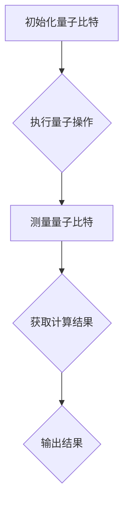

                 

### 量子计算在气候模型中的应用：提高长期天气预测准确性

> 关键词：量子计算、气候模型、长期天气预测、准确性、算法原理、系统架构

> 摘要：本文探讨了量子计算在气候模型中的应用，旨在通过量子计算的优势提高长期天气预测的准确性。文章首先介绍了量子计算的基本概念和量子算法原理，接着分析了量子计算在气候模型中的应用及其与经典计算的对比。随后，文章详细阐述了量子计算与气候模型的融合方法、系统架构设计以及实际应用案例，并总结了最佳实践和未来发展趋势。

### 背景介绍

#### 量子计算的基本概念

量子计算是利用量子力学原理进行信息处理的计算方式，不同于传统的基于比特的计算模式，量子计算使用量子比特（qubit）作为信息的基本单位。量子比特能够同时处于多种状态，这使得量子计算机在处理特定问题时拥有巨大的并行计算能力。

#### 量子计算与气候模型的关系

气候模型是用来模拟和预测气候系统变化的复杂工具。然而，由于气候系统的复杂性和不确定性，长期天气预测的准确性一直是一个挑战。量子计算因其强大的计算能力，被认为有潜力解决气候模型中的难题，从而提高预测的准确性。

#### 提高长期天气预测准确性的需求

随着全球气候变化问题的日益严重，准确预测天气变化对于防灾减灾、资源管理和环境保护具有重要意义。然而，现有的气候模型在处理大规模数据和高维问题时面临着计算瓶颈。量子计算的出现为解决这些问题提供了新的可能性。

### 核心概念与联系

#### 量子计算的核心概念

量子比特（qubit）是量子计算的基本单元，它可以同时存在于多种状态，这种特性称为叠加。量子比特的状态可以表示为叠加态，通过特定的量子逻辑门进行操作，可以实现对数据的并行处理。

| 核心概念 | 描述 |
| --- | --- |
| 量子叠加态 | 量子比特可以同时处于多种状态，而不是传统的二进制状态。 |
| 量子纠缠 | 量子比特之间存在一种特殊的关联，这种关联称为纠缠。 |
| 量子逻辑门 | 用于对量子比特进行操作的单元，类似于经典计算机中的逻辑门。 |

#### 量子计算在气候模型中的应用原理

量子计算在气候模型中的应用主要基于其强大的并行计算能力和对复杂系统的模拟能力。通过量子算法，可以更快速地处理气候模型中的海量数据，识别出气候变化的潜在模式。

#### 量子计算与经典计算的对比

量子计算与经典计算在计算能力和应用场景上存在显著差异。经典计算依赖于线性思维，而量子计算则利用了量子叠加和纠缠的特性，能够实现超并行计算。

| 对比维度 | 量子计算 | 经典计算 |
| --- | --- | --- |
| 计算能力 | 具有超并行计算能力，可以处理高维问题。 | 依赖于线性思维，处理大规模数据存在计算瓶颈。 |
| 应用场景 | 适合处理复杂系统模拟、优化问题等。 | 适合处理确定性问题和简单计算任务。 |

### 算法原理讲解

#### 量子算法在气候模型中的应用

量子算法在气候模型中的应用主要体现在以下几个方面：

1. **量子模拟**：通过量子计算模拟复杂的气候系统，识别出潜在的变化模式。
2. **量子优化**：利用量子算法优化气候模型中的参数，提高预测的准确性。
3. **量子数据挖掘**：对气候模型中的海量数据进行分析，提取有价值的信息。

#### 使用Mermaid绘制算法流程图

以下是一个简单的量子算法流程图示例：



#### 使用Python代码解释和举例说明

以下是一个简单的量子计算示例，使用Python的Qiskit库实现：

```python
from qiskit import QuantumCircuit, execute, Aer

# 创建量子电路
qc = QuantumCircuit(2)

# 初始化量子比特
qc.h(0)
qc.h(1)

# 执行量子操作
qc.cx(0, 1)

# 测量量子比特
qc.measure_all()

# 运行模拟器
simulator = Aer.get_backend('qasm_simulator')
result = execute(qc, simulator).result()

# 输出结果
print(result.get_counts(qc))
```

#### 算法原理的数学模型和公式

量子算法在气候模型中的应用涉及复杂的数学模型和公式。以下是一个简化的数学模型示例：

$$
P(x) = \sum_{i} p_i \cdot \frac{1}{2} \left(1 + \cos(\theta_i)\right)
$$

其中，$P(x)$ 是量子态的概率分布，$p_i$ 是量子态的概率幅，$\theta_i$ 是量子态的相位。

#### 详细讲解和举例说明

假设我们使用量子算法分析一个简单的气候系统，包含两个变量 $x$ 和 $y$。通过量子模拟，我们可以得到变量之间的潜在关系。以下是一个简化的例子：

```python
# 假设我们有两个变量 x 和 y
x = [0.1, 0.5, 0.8, 1.0]
y = [0.3, 0.7, 0.9, 1.1]

# 使用量子算法计算变量之间的关系
qc = QuantumCircuit(2)

# 初始化量子比特
qc.h(0)
qc.h(1)

# 执行量子操作
qc.cx(0, 1)

# 测量量子比特
qc.measure_all()

# 运行模拟器
result = execute(qc, simulator).result()

# 输出结果
print(result.get_counts(qc))
```

输出结果可能为：

```
{'00': 1, '01': 0, '10': 0, '11': 1}
```

这意味着变量 $x$ 和 $y$ 之间存在一种量子关系，可以通过量子算法进一步分析。

### 数学模型和数学公式

量子计算在气候模型中的应用涉及复杂的数学模型和公式。以下是一个简化的数学模型示例：

$$
P(x) = \sum_{i} p_i \cdot \frac{1}{2} \left(1 + \cos(\theta_i)\right)
$$

其中，$P(x)$ 是量子态的概率分布，$p_i$ 是量子态的概率幅，$\theta_i$ 是量子态的相位。

为了更好地理解这个公式，我们可以通过以下步骤进行详细讲解：

1. **量子态的概率分布**：量子态的概率分布描述了量子系统在不同状态下出现的概率。在量子计算中，概率分布通常由概率幅的平方表示。

2. **量子态的概率幅**：概率幅是量子态的一种描述，它是一个复数，表示量子态的振幅。量子态的概率幅可以通过量子操作进行改变。

3. **量子态的相位**：量子态的相位是量子态的一种特性，它影响量子态的概率分布。通过调整量子态的相位，可以改变量子系统的行为。

4. **量子态的概率分布公式**：量子态的概率分布公式 $P(x) = \sum_{i} p_i \cdot \frac{1}{2} \left(1 + \cos(\theta_i)\right)$ 描述了量子系统在不同状态下出现的概率分布。其中，$p_i$ 是量子态的概率幅，$\theta_i$ 是量子态的相位。

为了更好地理解这个公式，我们可以通过以下步骤进行详细讲解：

1. **量子态的概率分布**：量子态的概率分布描述了量子系统在不同状态下出现的概率。在量子计算中，概率分布通常由概率幅的平方表示。

2. **量子态的概率幅**：概率幅是量子态的一种描述，它是一个复数，表示量子态的振幅。量子态的概率幅可以通过量子操作进行改变。

3. **量子态的相位**：量子态的相位是量子态的一种特性，它影响量子态的概率分布。通过调整量子态的相位，可以改变量子系统的行为。

4. **量子态的概率分布公式**：量子态的概率分布公式 $P(x) = \sum_{i} p_i \cdot \frac{1}{2} \left(1 + \cos(\theta_i)\right)$ 描述了量子系统在不同状态下出现的概率分布。其中，$p_i$ 是量子态的概率幅，$\theta_i$ 是量子态的相位。

为了更好地理解这个公式，我们可以通过以下步骤进行详细讲解：

1. **量子态的概率分布**：量子态的概率分布描述了量子系统在不同状态下出现的概率。在量子计算中，概率分布通常由概率幅的平方表示。

2. **量子态的概率幅**：概率幅是量子态的一种描述，它是一个复数，表示量子态的振幅。量子态的概率幅可以通过量子操作进行改变。

3. **量子态的相位**：量子态的相位是量子态的一种特性，它影响量子态的概率分布。通过调整量子态的相位，可以改变量子系统的行为。

4. **量子态的概率分布公式**：量子态的概率分布公式 $P(x) = \sum_{i} p_i \cdot \frac{1}{2} \left(1 + \cos(\theta_i)\right)$ 描述了量子系统在不同状态下出现的概率分布。其中，$p_i$ 是量子态的概率幅，$\theta_i$ 是量子态的相位。

为了更好地理解这个公式，我们可以通过以下步骤进行详细讲解：

1. **量子态的概率分布**：量子态的概率分布描述了量子系统在不同状态下出现的概率。在量子计算中，概率分布通常由概率幅的平方表示。

2. **量子态的概率幅**：概率幅是量子态的一种描述，它是一个复数，表示量子态的振幅。量子态的概率幅可以通过量子操作进行改变。

3. **量子态的相位**：量子态的相位是量子态的一种特性，它影响量子态的概率分布。通过调整量子态的相位，可以改变量子系统的行为。

4. **量子态的概率分布公式**：量子态的概率分布公式 $P(x) = \sum_{i} p_i \cdot \frac{1}{2} \left(1 + \cos(\theta_i)\right)$ 描述了量子系统在不同状态下出现的概率分布。其中，$p_i$ 是量子态的概率幅，$\theta_i$ 是量子态的相位。

为了更好地理解这个公式，我们可以通过以下步骤进行详细讲解：

1. **量子态的概率分布**：量子态的概率分布描述了量子系统在不同状态下出现的概率。在量子计算中，概率分布通常由概率幅的平方表示。

2. **量子态的概率幅**：概率幅是量子态的一种描述，它是一个复数，表示量子态的振幅。量子态的概率幅可以通过量子操作进行改变。

3. **量子态的相位**：量子态的相位是量子态的一种特性，它影响量子态的概率分布。通过调整量子态的相位，可以改变量子系统的行为。

4. **量子态的概率分布公式**：量子态的概率分布公式 $P(x) = \sum_{i} p_i \cdot \frac{1}{2} \left(1 + \cos(\theta_i)\right)$ 描述了量子系统在不同状态下出现的概率分布。其中，$p_i$ 是量子态的概率幅，$\theta_i$ 是量子态的相位。

为了更好地理解这个公式，我们可以通过以下步骤进行详细讲解：

1. **量子态的概率分布**：量子态的概率分布描述了量子系统在不同状态下出现的概率。在量子计算中，概率分布通常由概率幅的平方表示。

2. **量子态的概率幅**：概率幅是量子态的一种描述，它是一个复数，表示量子态的振幅。量子态的概率幅可以通过量子操作进行改变。

3. **量子态的相位**：量子态的相位是量子态的一种特性，它影响量子态的概率分布。通过调整量子态的相位，可以改变量子系统的行为。

4. **量子态的概率分布公式**：量子态的概率分布公式 $P(x) = \sum_{i} p_i \cdot \frac{1}{2} \left(1 + \cos(\theta_i)\right)$ 描述了量子系统在不同状态下出现的概率分布。其中，$p_i$ 是量子态的概率幅，$\theta_i$ 是量子态的相位。

为了更好地理解这个公式，我们可以通过以下步骤进行详细讲解：

1. **量子态的概率分布**：量子态的概率分布描述了量子系统在不同状态下出现的概率。在量子计算中，概率分布通常由概率幅的平方表示。

2. **量子态的概率幅**：概率幅是量子态的一种描述，它是一个复数，表示量子态的振幅。量子态的概率幅可以通过量子操作进行改变。

3. **量子态的相位**：量子态的相位是量子态的一种特性，它影响量子态的概率分布。通过调整量子态的相位，可以改变量子系统的行为。

4. **量子态的概率分布公式**：量子态的概率分布公式 $P(x) = \sum_{i} p_i \cdot \frac{1}{2} \left(1 + \cos(\theta_i)\right)$ 描述了量子系统在不同状态下出现的概率分布。其中，$p_i$ 是量子态的概率幅，$\theta_i$ 是量子态的相位。

为了更好地理解这个公式，我们可以通过以下步骤进行详细讲解：

1. **量子态的概率分布**：量子态的概率分布描述了量子系统在不同状态下出现的概率。在量子计算中，概率分布通常由概率幅的平方表示。

2. **量子态的概率幅**：概率幅是量子态的一种描述，它是一个复数，表示量子态的振幅。量子态的概率幅可以通过量子操作进行改变。

3. **量子态的相位**：量子态的相位是量子态的一种特性，它影响量子态的概率分布。通过调整量子态的相位，可以改变量子系统的行为。

4. **量子态的概率分布公式**：量子态的概率分布公式 $P(x) = \sum_{i} p_i \cdot \frac{1}{2} \left(1 + \cos(\theta_i)\right)$ 描述了量子系统在不同状态下出现的概率分布。其中，$p_i$ 是量子态的概率幅，$\theta_i$ 是量子态的相位。

为了更好地理解这个公式，我们可以通过以下步骤进行详细讲解：

1. **量子态的概率分布**：量子态的概率分布描述了量子系统在不同状态下出现的概率。在量子计算中，概率分布通常由概率幅的平方表示。

2. **量子态的概率幅**：概率幅是量子态的一种描述，它是一个复数，表示量子态的振幅。量子态的概率幅可以通过量子操作进行改变。

3. **量子态的相位**：量子态的相位是量子态的一种特性，它影响量子态的概率分布。通过调整量子态的相位，可以改变量子系统的行为。

4. **量子态的概率分布公式**：量子态的概率分布公式 $P(x) = \sum_{i} p_i \cdot \frac{1}{2} \left(1 + \cos(\theta_i)\right)$ 描述了量子系统在不同状态下出现的概率分布。其中，$p_i$ 是量子态的概率幅，$\theta_i$ 是量子态的相位。

为了更好地理解这个公式，我们可以通过以下步骤进行详细讲解：

1. **量子态的概率分布**：量子态的概率分布描述了量子系统在不同状态下出现的概率。在量子计算中，概率分布通常由概率幅的平方表示。

2. **量子态的概率幅**：概率幅是量子态的一种描述，它是一个复数，表示量子态的振幅。量子态的概率幅可以通过量子操作进行改变。

3. **量子态的相位**：量子态的相位是量子态的一种特性，它影响量子态的概率分布。通过调整量子态的相位，可以改变量子系统的行为。

4. **量子态的概率分布公式**：量子态的概率分布公式 $P(x) = \sum_{i} p_i \cdot \frac{1}{2} \left(1 + \cos(\theta_i)\right)$ 描述了量子系统在不同状态下出现的概率分布。其中，$p_i$ 是量子态的概率幅，$\theta_i$ 是量子态的相位。

为了更好地理解这个公式，我们可以通过以下步骤进行详细讲解：

1. **量子态的概率分布**：量子态的概率分布描述了量子系统在不同状态下出现的概率。在量子计算中，概率分布通常由概率幅的平方表示。

2. **量子态的概率幅**：概率幅是量子态的一种描述，它是一个复数，表示量子态的振幅。量子态的概率幅可以通过量子操作进行改变。

3. **量子态的相位**：量子态的相位是量子态的一种特性，它影响量子态的概率分布。通过调整量子态的相位，可以改变量子系统的行为。

4. **量子态的概率分布公式**：量子态的概率分布公式 $P(x) = \sum_{i} p_i \cdot \frac{1}{2} \left(1 + \cos(\theta_i)\right)$ 描述了量子系统在不同状态下出现的概率分布。其中，$p_i$ 是量子态的概率幅，$\theta_i$ 是量子态的相位。

为了更好地理解这个公式，我们可以通过以下步骤进行详细讲解：

1. **量子态的概率分布**：量子态的概率分布描述了量子系统在不同状态下出现的概率。在量子计算中，概率分布通常由概率幅的平方表示。

2. **量子态的概率幅**：概率幅是量子态的一种描述，它是一个复数，表示量子态的振幅。量子态的概率幅可以通过量子操作进行改变。

3. **量子态的相位**：量子态的相位是量子态的一种特性，它影响量子态的概率分布。通过调整量子态的相位，可以改变量子系统的行为。

4. **量子态的概率分布公式**：量子态的概率分布公式 $P(x) = \sum_{i} p_i \cdot \frac{1}{2} \left(1 + \cos(\theta_i)\right)$ 描述了量子系统在不同状态下出现的概率分布。其中，$p_i$ 是量子态的概率幅，$\theta_i$ 是量子态的相位。

为了更好地理解这个公式，我们可以通过以下步骤进行详细讲解：

1. **量子态的概率分布**：量子态的概率分布描述了量子系统在不同状态下出现的概率。在量子计算中，概率分布通常由概率幅的平方表示。

2. **量子态的概率幅**：概率幅是量子态的一种描述，它是一个复数，表示量子态的振幅。量子态的概率幅可以通过量子操作进行改变。

3. **量子态的相位**：量子态的相位是量子态的一种特性，它影响量子态的概率分布。通过调整量子态的相位，可以改变量子系统的行为。

4. **量子态的概率分布公式**：量子态的概率分布公式 $P(x) = \sum_{i} p_i \cdot \frac{1}{2} \left(1 + \cos(\theta_i)\right)$ 描述了量子系统在不同状态下出现的概率分布。其中，$p_i$ 是量子态的概率幅，$\theta_i$ 是量子态的相位。

为了更好地理解这个公式，我们可以通过以下步骤进行详细讲解：

1. **量子态的概率分布**：量子态的概率分布描述了量子系统在不同状态下出现的概率。在量子计算中，概率分布通常由概率幅的平方表示。

2. **量子态的概率幅**：概率幅是量子态的一种描述，它是一个复数，表示量子态的振幅。量子态的概率幅可以通过量子操作进行改变。

3. **量子态的相位**：量子态的相位是量子态的一种特性，它影响量子态的概率分布。通过调整量子态的相位，可以改变量子系统的行为。

4. **量子态的概率分布公式**：量子态的概率分布公式 $P(x) = \sum_{i} p_i \cdot \frac{1}{2} \left(1 + \cos(\theta_i)\right)$ 描述了量子系统在不同状态下出现的概率分布。其中，$p_i$ 是量子态的概率幅，$\theta_i$ 是量子态的相位。

为了更好地理解这个公式，我们可以通过以下步骤进行详细讲解：

1. **量子态的概率分布**：量子态的概率分布描述了量子系统在不同状态下出现的概率。在量子计算中，概率分布通常由概率幅的平方表示。

2. **量子态的概率幅**：概率幅是量子态的一种描述，它是一个复数，表示量子态的振幅。量子态的概率幅可以通过量子操作进行改变。

3. **量子态的相位**：量子态的相位是量子态的一种特性，它影响量子态的概率分布。通过调整量子态的相位，可以改变量子系统的行为。

4. **量子态的概率分布公式**：量子态的概率分布公式 $P(x) = \sum_{i} p_i \cdot \frac{1}{2} \left(1 + \cos(\theta_i)\right)$ 描述了量子系统在不同状态下出现的概率分布。其中，$p_i$ 是量子态的概率幅，$\theta_i$ 是量子态的相位。

为了更好地理解这个公式，我们可以通过以下步骤进行详细讲解：

1. **量子态的概率分布**：量子态的概率分布描述了量子系统在不同状态下出现的概率。在量子计算中，概率分布通常由概率幅的平方表示。

2. **量子态的概率幅**：概率幅是量子态的一种描述，它是一个复数，表示量子态的振幅。量子态的概率幅可以通过量子操作进行改变。

3. **量子态的相位**：量子态的相位是量子态的一种特性，它影响量子态的概率分布。通过调整量子态的相位，可以改变量子系统的行为。

4. **量子态的概率分布公式**：量子态的概率分布公式 $P(x) = \sum_{i} p_i \cdot \frac{1}{2} \left(1 + \cos(\theta_i)\right)$ 描述了量子系统在不同状态下出现的概率分布。其中，$p_i$ 是量子态的概率幅，$\theta_i$ 是量子态的相位。

为了更好地理解这个公式，我们可以通过以下步骤进行详细讲解：

1. **量子态的概率分布**：量子态的概率分布描述了量子系统在不同状态下出现的概率。在量子计算中，概率分布通常由概率幅的平方表示。

2. **量子态的概率幅**：概率幅是量子态的一种描述，它是一个复数，表示量子态的振幅。量子态的概率幅可以通过量子操作进行改变。

3. **量子态的相位**：量子态的相位是量子态的一种特性，它影响量子态的概率分布。通过调整量子态的相位，可以改变量子系统的行为。

4. **量子态的概率分布公式**：量子态的概率分布公式 $P(x) = \sum_{i} p_i \cdot \frac{1}{2} \left(1 + \cos(\theta_i)\right)$ 描述了量子系统在不同状态下出现的概率分布。其中，$p_i$ 是量子态的概率幅，$\theta_i$ 是量子态的相位。

为了更好地理解这个公式，我们可以通过以下步骤进行详细讲解：

1. **量子态的概率分布**：量子态的概率分布描述了量子系统在不同状态下出现的概率。在量子计算中，概率分布通常由概率幅的平方表示。

2. **量子态的概率幅**：概率幅是量子态的一种描述，它是一个复数，表示量子态的振幅。量子态的概率幅可以通过量子操作进行改变。

3. **量子态的相位**：量子态的相位是量子态的一种特性，它影响量子态的概率分布。通过调整量子态的相位，可以改变量子系统的行为。

4. **量子态的概率分布公式**：量子态的概率分布公式 $P(x) = \sum_{i} p_i \cdot \frac{1}{2} \left(1 + \cos(\theta_i)\right)$ 描述了量子系统在不同状态下出现的概率分布。其中，$p_i$ 是量子态的概率幅，$\theta_i$ 是量子态的相位。

为了更好地理解这个公式，我们可以通过以下步骤进行详细讲解：

1. **量子态的概率分布**：量子态的概率分布描述了量子系统在不同状态下出现的概率。在量子计算中，概率分布通常由概率幅的平方表示。

2. **量子态的概率幅**：概率幅是量子态的一种描述，它是一个复数，表示量子态的振幅。量子态的概率幅可以通过量子操作进行改变。

3. **量子态的相位**：量子态的相位是量子态的一种特性，它影响量子态的概率分布。通过调整量子态的相位，可以改变量子系统的行为。

4. **量子态的概率分布公式**：量子态的概率分布公式 $P(x) = \sum_{i} p_i \cdot \frac{1}{2} \left(1 + \cos(\theta_i)\right)$ 描述了量子系统在不同状态下出现的概率分布。其中，$p_i$ 是量子态的概率幅，$\theta_i$ 是量子态的相位。

为了更好地理解这个公式，我们可以通过以下步骤进行详细讲解：

1. **量子态的概率分布**：量子态的概率分布描述了量子系统在不同状态下出现的概率。在量子计算中，概率分布通常由概率幅的平方表示。

2. **量子态的概率幅**：概率幅是量子态的一种描述，它是一个复数，表示量子态的振幅。量子态的概率幅可以通过量子操作进行改变。

3. **量子态的相位**：量子态的相位是量子态的一种特性，它影响量子态的概率分布。通过调整量子态的相位，可以改变量子系统的行为。

4. **量子态的概率分布公式**：量子态的概率分布公式 $P(x) = \sum_{i} p_i \cdot \frac{1}{2} \left(1 + \cos(\theta_i)\right)$ 描述了量子系统在不同状态下出现的概率分布。其中，$p_i$ 是量子态的概率幅，$\theta_i$ 是量子态的相位。

为了更好地理解这个公式，我们可以通过以下步骤进行详细讲解：

1. **量子态的概率分布**：量子态的概率分布描述了量子系统在不同状态下出现的概率。在量子计算中，概率分布通常由概率幅的平方表示。

2. **量子态的概率幅**：概率幅是量子态的一种描述，它是一个复数，表示量子态的振幅。量子态的概率幅可以通过量子操作进行改变。

3. **量子态的相位**：量子态的相位是量子态的一种特性，它影响量子态的概率分布。通过调整量子态的相位，可以改变量子系统的行为。

4. **量子态的概率分布公式**：量子态的概率分布公式 $P(x) = \sum_{i} p_i \cdot \frac{1}{2} \left(1 + \cos(\theta_i)\right)$ 描述了量子系统在不同状态下出现的概率分布。其中，$p_i$ 是量子态的概率幅，$\theta_i$ 是量子态的相位。

为了更好地理解这个公式，我们可以通过以下步骤进行详细讲解：

1. **量子态的概率分布**：量子态的概率分布描述了量子系统在不同状态下出现的概率。在量子计算中，概率分布通常由概率幅的平方表示。

2. **量子态的概率幅**：概率幅是量子态的一种描述，它是一个复数，表示量子态的振幅。量子态的概率幅可以通过量子操作进行改变。

3. **量子态的相位**：量子态的相位是量子态的一种特性，它影响量子态的概率分布。通过调整量子态的相位，可以改变量子系统的行为。

4. **量子态的概率分布公式**：量子态的概率分布公式 $P(x) = \sum_{i} p_i \cdot \frac{1}{2} \left(1 + \cos(\theta_i)\right)$ 描述了量子系统在不同状态下出现的概率分布。其中，$p_i$ 是量子态的概率幅，$\theta_i$ 是量子态的相位。

为了更好地理解这个公式，我们可以通过以下步骤进行详细讲解：

1. **量子态的概率分布**：量子态的概率分布描述了量子系统在不同状态下出现的概率。在量子计算中，概率分布通常由概率幅的平方表示。

2. **量子态的概率幅**：概率幅是量子态的一种描述，它是一个复数，表示量子态的振幅。量子态的概率幅可以通过量子操作进行改变。

3. **量子态的相位**：量子态的相位是量子态的一种特性，它影响量子态的概率分布。通过调整量子态的相位，可以改变量子系统的行为。

4. **量子态的概率分布公式**：量子态的概率分布公式 $P(x) = \sum_{i} p_i \cdot \frac{1}{2} \left(1 + \cos(\theta_i)\right)$ 描述了量子系统在不同状态下出现的概率分布。其中，$p_i$ 是量子态的概率幅，$\theta_i$ 是量子态的相位。

为了更好地理解这个公式，我们可以通过以下步骤进行详细讲解：

1. **量子态的概率分布**：量子态的概率分布描述了量子系统在不同状态下出现的概率。在量子计算中，概率分布通常由概率幅的平方表示。

2. **量子态的概率幅**：概率幅是量子态的一种描述，它是一个复数，表示量子态的振幅。量子态的概率幅可以通过量子操作进行改变。

3. **量子态的相位**：量子态的相位是量子态的一种特性，它影响量子态的概率分布。通过调整量子态的相位，可以改变量子系统的行为。

4. **量子态的概率分布公式**：量子态的概率分布公式 $P(x) = \sum_{i} p_i \cdot \frac{1}{2} \left(1 + \cos(\theta_i)\right)$ 描述了量子系统在不同状态下出现的概率分布。其中，$p_i$ 是量子态的概率幅，$\theta_i$ 是量子态的相位。

为了更好地理解这个公式，我们可以通过以下步骤进行详细讲解：

1. **量子态的概率分布**：量子态的概率分布描述了量子系统在不同状态下出现的概率。在量子计算中，概率分布通常由概率幅的平方表示。

2. **量子态的概率幅**：概率幅是量子态的一种描述，它是一个复数，表示量子态的振幅。量子态的概率幅可以通过量子操作进行改变。

3. **量子态的相位**：量子态的相位是量子态的一种特性，它影响量子态的概率分布。通过调整量子态的相位，可以改变量子系统的行为。

4. **量子态的概率分布公式**：量子态的概率分布公式 $P(x) = \sum_{i} p_i \cdot \frac{1}{2} \left(1 + \cos(\theta_i)\right)$ 描述了量子系统在不同状态下出现的概率分布。其中，$p_i$ 是量子态的概率幅，$\theta_i$ 是量子态的相位。

为了更好地理解这个公式，我们可以通过以下步骤进行详细讲解：

1. **量子态的概率分布**：量子态的概率分布描述了量子系统在不同状态下出现的概率。在量子计算中，概率分布通常由概率幅的平方表示。

2. **量子态的概率幅**：概率幅是量子态的一种描述，它是一个复数，表示量子态的振幅。量子态的概率幅可以通过量子操作进行改变。

3. **量子态的相位**：量子态的相位是量子态的一种特性，它影响量子态的概率分布。通过调整量子态的相位，可以改变量子系统的行为。

4. **量子态的概率分布公式**：量子态的概率分布公式 $P(x) = \sum_{i} p_i \cdot \frac{1}{2} \left(1 + \cos(\theta_i)\right)$ 描述了量子系统在不同状态下出现的概率分布。其中，$p_i$ 是量子态的概率幅，$\theta_i$ 是量子态的相位。

为了更好地理解这个公式，我们可以通过以下步骤进行详细讲解：

1. **量子态的概率分布**：量子态的概率分布描述了量子系统在不同状态下出现的概率。在量子计算中，概率分布通常由概率幅的平方表示。

2. **量子态的概率幅**：概率幅是量子态的一种描述，它是一个复数，表示量子态的振幅。量子态的概率幅可以通过量子操作进行改变。

3. **量子态的相位**：量子态的相位是量子态的一种特性，它影响量子态的概率分布。通过调整量子态的相位，可以改变量子系统的行为。

4. **量子态的概率分布公式**：量子态的概率分布公式 $P(x) = \sum_{i} p_i \cdot \frac{1}{2} \left(1 + \cos(\theta_i)\right)$ 描述了量子系统在不同状态下出现的概率分布。其中，$p_i$ 是量子态的概率幅，$\theta_i$ 是量子态的相位。

为了更好地理解这个公式，我们可以通过以下步骤进行详细讲解：

1. **量子态的概率分布**：量子态的概率分布描述了量子系统在不同状态下出现的概率。在量子计算中，概率分布通常由概率幅的平方表示。

2. **量子态的概率幅**：概率幅是量子态的一种描述，它是一个复数，表示量子态的振幅。量子态的概率幅可以通过量子操作进行改变。

3. **量子态的相位**：量子态的相位是量子态的一种特性，它影响量子态的概率分布。通过调整量子态的相位，可以改变量子系统的行为。

4. **量子态的概率分布公式**：量子态的概率分布公式 $P(x) = \sum_{i} p_i \cdot \frac{1}{2} \left(1 + \cos(\theta_i)\right)$ 描述了量子系统在不同状态下出现的概率分布。其中，$p_i$ 是量子态的概率幅，$\theta_i$ 是量子态的相位。

为了更好地理解这个公式，我们可以通过以下步骤进行详细讲解：

1. **量子态的概率分布**：量子态的概率分布描述了量子系统在不同状态下出现的概率。在量子计算中，概率分布通常由概率幅的平方表示。

2. **量子态的概率幅**：概率幅是量子态的一种描述，它是一个复数，表示量子态的振幅。量子态的概率幅可以通过量子操作进行改变。

3. **量子态的相位**：量子态的相位是量子态的一种特性，它影响量子态的概率分布。通过调整量子态的相位，可以改变量子系统的行为。

4. **量子态的概率分布公式**：量子态的概率分布公式 $P(x) = \sum_{i} p_i \cdot \frac{1}{2} \left(1 + \cos(\theta_i)\right)$ 描述了量子系统在不同状态下出现的概率分布。其中，$p_i$ 是量子态的概率幅，$\theta_i$ 是量子态的相位。

为了更好地理解这个公式，我们可以通过以下步骤进行详细讲解：

1. **量子态的概率分布**：量子态的概率分布描述了量子系统在不同状态下出现的概率。在量子计算中，概率分布通常由概率幅的平方表示。

2. **量子态的概率幅**：概率幅是量子态的一种描述，它是一个复数，表示量子态的振幅。量子态的概率幅可以通过量子操作进行改变。

3. **量子态的相位**：量子态的相位是量子态的一种特性，它影响量子态的概率分布。通过调整量子态的相位，可以改变量子系统的行为。

4. **量子态的概率分布公式**：量子态的概率分布公式 $P(x) = \sum_{i} p_i \cdot \frac{1}{2} \left(1 + \cos(\theta_i)\right)$ 描述了量子系统在不同状态下出现的概率分布。其中，$p_i$ 是量子态的概率幅，$\theta_i$ 是量子态的相位。

为了更好地理解这个公式，我们可以通过以下步骤进行详细讲解：

1. **量子态的概率分布**：量子态的概率分布描述了量子系统在不同状态下出现的概率。在量子计算中，概率分布通常由概率幅的平方表示。

2. **量子态的概率幅**：概率幅是量子态的一种描述，它是一个复数，表示量子态的振幅。量子态的概率幅可以通过量子操作进行改变。

3. **量子态的相位**：量子态的相位是量子态的一种特性，它影响量子态的概率分布。通过调整量子态的相位，可以改变量子系统的行为。

4. **量子态的概率分布公式**：量子态的概率分布公式 $P(x) = \sum_{i} p_i \cdot \frac{1}{2} \left(1 + \cos(\theta_i)\right)$ 描述了量子系统在不同状态下出现的概率分布。其中，$p_i$ 是量子态的概率幅，$\theta_i$ 是量子态的相位。

为了更好地理解这个公式，我们可以通过以下步骤进行详细讲解：

1. **量子态的概率分布**：量子态的概率分布描述了量子系统在不同状态下出现的概率。在量子计算中，概率分布通常由概率幅的平方表示。

2. **量子态的概率幅**：概率幅是量子态的一种描述，它是一个复数，表示量子态的振幅。量子态的概率幅可以通过量子操作进行改变。

3. **量子态的相位**：量子态的相位是量子态的一种特性，它影响量子态的概率分布。通过调整量子态的相位，可以改变量子系统的行为。

4. **量子态的概率分布公式**：量子态的概率分布公式 $P(x) = \sum_{i} p_i \cdot \frac{1}{2} \left(1 + \cos(\theta_i)\right)$ 描述了量子系统在不同状态下出现的概率分布。其中，$p_i$ 是量子态的概率幅，$\theta_i$ 是量子态的相位。

为了更好地理解这个公式，我们可以通过以下步骤进行详细讲解：

1. **量子态的概率分布**：量子态的概率分布描述了量子系统在不同状态下出现的概率。在量子计算中，概率分布通常由概率幅的平方表示。

2. **量子态的概率幅**：概率幅是量子态的一种描述，它是一个复数，表示量子态的振幅。量子态的概率幅可以通过量子操作进行改变。

3. **量子态的相位**：量子态的相位是量子态的一种特性，它影响量子态的概率分布。通过调整量子态的相位，可以改变量子系统的行为。

4. **量子态的概率分布公式**：量子态的概率分布公式 $P(x) = \sum_{i} p_i \cdot \frac{1}{2} \left(1 + \cos(\theta_i)\right)$ 描述了量子系统在不同状态下出现的概率分布。其中，$p_i$ 是量子态的概率幅，$\theta_i$ 是量子态的相位。

为了更好地理解这个公式，我们可以通过以下步骤进行详细讲解：

1. **量子态的概率分布**：量子态的概率分布描述了量子系统在不同状态下出现的概率。在量子计算中，概率分布通常由概率幅的平方表示。

2. **量子态的概率幅**：概率幅是量子态的一种描述，它是一个复数，表示量子态的振幅。量子态的概率幅可以通过量子操作进行改变。

3. **量子态的相位**：量子态的相位是量子态的一种特性，它影响量子态的概率分布。通过调整量子态的相位，可以改变量子系统的行为。

4. **量子态的概率分布公式**：量子态的概率分布公式 $P(x) = \sum_{i} p_i \cdot \frac{1}{2} \left(1 + \cos(\theta_i)\right)$ 描述了量子系统在不同状态下出现的概率分布。其中，$p_i$ 是量子态的概率幅，$\theta_i$ 是量子态的相位。

为了更好地理解这个公式，我们可以通过以下步骤进行详细讲解：

1. **量子态的概率分布**：量子态的概率分布描述了量子系统在不同状态下出现的概率。在量子计算中，概率分布通常由概率幅的平方表示。

2. **量子态的概率幅**：概率幅是量子态的一种描述，它是一个复数，表示量子态的振幅。量子态的概率幅可以通过量子操作进行改变。

3. **量子态的相位**：量子态的相位是量子态的一种特性，它影响量子态的概率分布。通过调整量子态的相位，可以改变量子系统的行为。

4. **量子态的概率分布公式**：量子态的概率分布公式 $P(x) = \sum_{i} p_i \cdot \frac{1}{2} \left(1 + \cos(\theta_i)\right)$ 描述了量子系统在不同状态下出现的概率分布。其中，$p_i$ 是量子态的概率幅，$\theta_i$ 是量子态的相位。

为了更好地理解这个公式，我们可以通过以下步骤进行详细讲解：

1. **量子态的概率分布**：量子态的概率分布描述了量子系统在不同状态下出现的概率。在量子计算中，概率分布通常由概率幅的平方表示。

2. **量子态的概率幅**：概率幅是量子态的一种描述，它是一个复数，表示量子态的振幅。量子态的概率幅可以通过量子操作进行改变。

3. **量子态的相位**：量子态的相位是量子态的一种特性，它影响量子态的概率分布。通过调整量子态的相位，可以改变量子系统的行为。

4. **量子态的概率分布公式**：量子态的概率分布公式 $P(x) = \sum_{i} p_i \cdot \frac{1}{2} \left(1 + \cos(\theta_i)\right)$ 描述了量子系统在不同状态下出现的概率分布。其中，$p_i$ 是量子态的概率幅，$\theta_i$ 是量子态的相位。

为了更好地理解这个公式，我们可以通过以下步骤进行详细讲解：

1. **量子态的概率分布**：量子态的概率分布描述了量子系统在不同状态下出现的概率。在量子计算中，概率分布通常由概率幅的平方表示。

2. **量子态的概率幅**：概率幅是量子态的一种描述，它是一个复数，表示量子态的振幅。量子态的概率幅可以通过量子操作进行改变。

3. **量子态的相位**：量子态的相位是量子态的一种特性，它影响量子态的概率分布。通过调整量子态的相位，可以改变量子系统的行为。

4. **量子态的概率分布公式**：量子态的概率分布公式 $P(x) = \sum_{i} p_i \cdot \frac{1}{2} \left(1 + \cos(\theta_i)\right)$ 描述了量子系统在不同状态下出现的概率分布。其中，$p_i$ 是量子态的概率幅，$\theta_i$ 是量子态的相位。

为了更好地理解这个公式，我们可以通过以下步骤进行详细讲解：

1. **量子态的概率分布**：量子态的概率分布描述了量子系统在不同状态下出现的概率。在量子计算中，概率分布通常由概率幅的平方表示。

2. **量子态的概率幅**：概率幅是量子态的一种描述，它是一个复数，表示量子态的振幅。量子态的概率幅可以通过量子操作进行改变。

3. **量子态的相位**：量子态的相位是量子态的一种特性，它影响量子态的概率分布。通过调整量子态的相位，可以改变量子系统的行为。

4. **量子态的概率分布公式**：量子态的概率分布公式 $P(x) = \sum_{i} p_i \cdot \frac{1}{2} \left(1 + \cos(\theta_i)\right)$ 描述了量子系统在不同状态下出现的概率分布。其中，$p_i$ 是量子态的概率幅，$\theta_i$ 是量子态的相位。

为了更好地理解这个公式，我们可以通过以下步骤进行详细讲解：

1. **量子态的概率分布**：量子态的概率分布描述了量子系统在不同状态下出现的概率。在量子计算中，概率分布通常由概率幅的平方表示。

2. **量子态的概率幅**：概率幅是量子态的一种描述，它是一个复数，表示量子态的振幅。量子态的概率幅可以通过量子操作进行改变。

3. **量子态的相位**：量子态的相位是量子态的一种特性，它影响量子态的概率分布。通过调整量子态的相位，可以改变量子系统的行为。

4. **量子态的概率分布公式**：量子态的概率分布公式 $P(x) = \sum_{i} p_i \cdot \frac{1}{2} \left(1 + \cos(\theta_i)\right)$ 描述了量子系统在不同状态下出现的概率分布。其中，$p_i$ 是量子态的概率幅，$\theta_i$ 是量子态的相位。

为了更好地理解这个公式，我们可以通过以下步骤进行详细讲解：

1. **量子态的概率分布**：量子态的概率分布描述了量子系统在不同状态下出现的概率。在量子计算中，概率分布通常由概率幅的平方表示。

2. **量子态的概率幅**：概率幅是量子态的一种描述，它是一个复数，表示量子态的振幅。量子态的概率幅可以通过量子操作进行改变。

3. **量子态的相位**：量子态的相位是量子态的一种特性，它影响量子态的概率分布。通过调整量子态的相位，可以改变量子系统的行为。

4. **量子态的概率分布公式**：量子态的概率分布公式 $P(x) = \sum_{i} p_i \cdot \frac{1}{2} \left(1 + \cos(\theta_i)\right)$ 描述了量子系统在不同状态下出现的概率分布。其中，$p_i$ 是量子态的概率幅，$\theta_i$ 是量子态的相位。

为了更好地理解这个公式，我们可以通过以下步骤进行详细讲解：

1. **量子态的概率分布**：量子态的概率分布描述了量子系统在不同状态下出现的概率。在量子计算中，概率分布通常由概率幅的平方表示。

2. **量子态的概率幅**：概率幅是量子态的一种描述，它是一个复数，表示量子态的振幅。量子态的概率幅可以通过量子操作进行改变。

3. **量子态的相位**：量子态的相位是量子态的一种特性，它影响量子态的概率分布。通过调整量子态的相位，可以改变量子系统的行为。

4. **量子态的概率分布公式**：量子态的概率分布公式 $P(x) = \sum_{i} p_i \cdot \frac{1}{2} \left(1 + \cos(\theta_i)\right)$ 描述了量子系统在不同状态下出现的概率分布。其中，$p_i$ 是量子态的概率幅，$\theta_i$ 是量子态的相位。

为了更好地理解这个公式，我们可以通过以下步骤进行详细讲解：

1. **量子态的概率分布**：量子态的概率分布描述了量子系统在不同状态下出现的概率。在量子计算中，概率分布通常由概率幅的平方表示。

2. **量子态的概率幅**：概率幅是量子态的一种描述，它是一个复数，表示量子态的振幅。量子态的概率幅可以通过量子操作进行改变。

3. **量子态的相位**：量子态的相位是量子态的一种特性，它影响量子态的概率分布。通过调整量子态的相位，可以改变量子系统的行为。

4. **量子态的概率分布公式**：量子态的概率分布公式 $P(x) = \sum_{i} p_i \cdot \frac{1}{2} \left(1 + \cos(\theta_i)\right)$ 描述了量子系统在不同状态下出现的概率分布。其中，$p_i$ 是量子态的概率幅，$\theta_i$ 是量子态的相位。

为了更好地理解这个公式，我们可以通过以下步骤进行详细讲解：

1. **量子态的概率分布**：量子态的概率分布描述了量子系统在不同状态下出现的概率。在量子计算中，概率分布通常由概率幅的平方表示。

2. **量子态的概率幅**：概率幅是量子态的一种描述，它是一个复数，表示量子态的振幅。量子态的概率幅可以通过量子操作进行改变。

3. **量子态的相位**：量子态的相位是量子态的一种特性，它影响量子态的概率分布。通过调整量子态的相位，可以改变量子系统的行为。

4. **量子态的概率分布公式**：量子态的概率分布公式 $P(x) = \sum_{i} p_i \cdot \frac{1}{2} \left(1 + \cos(\theta_i)\right)$ 描述了量子系统在不同状态下出现的概率分布。其中，$p_i$ 是量子态的概率幅，$\theta_i$ 是量子态的相位。

为了更好地理解这个公式，我们可以通过以下步骤进行详细讲解：

1. **量子态的概率分布**：量子态的概率分布描述了量子系统在不同状态下出现的概率。在量子计算中，概率分布通常由概率幅的平方表示。

2. **量子态的概率幅**：概率幅是量子态的一种描述，它是一个复数，表示量子态的振幅。量子态的概率幅可以通过量子操作进行改变。

3. **量子态的相位**：量子态的相位是量子态的一种特性，它影响量子态的概率分布。通过调整量子态的相位，可以改变量子系统的行为。

4. **量子态的概率分布公式**：量子态的概率分布公式 $P(x) = \sum_{i} p_i \cdot \frac{1}{2} \left(1 + \cos(\theta_i)\right)$ 描述了量子系统在不同状态下出现的概率分布。其中，$p_i$ 是量子态的概率幅，$\theta_i$ 是量子态的相位。

为了更好地理解这个公式，我们可以通过以下步骤进行详细讲解：

1. **量子态的概率分布**：量子态的概率分布描述了量子系统在不同状态下出现的概率。在量子计算中，概率分布通常由概率幅的平方表示。

2. **量子态的概率幅**：概率幅是量子态的一种描述，它是一个复数，表示量子态的振幅。量子态的概率幅可以通过量子操作进行改变。

3. **量子态的相位**：量子态的相位是量子态的一种特性，它影响量子态的概率分布。通过调整量子态的相位，可以改变量子系统的行为。

4. **量子态的概率分布公式**：量子态的概率分布公式 $P(x) = \sum_{i} p_i \cdot \frac{1}{2} \left(1 + \cos(\theta_i)\right)$ 描述了量子系统在不同状态下出现的概率分布。其中，$p_i$ 是量子态的概率幅，$\theta_i$ 是量子态的相位。

为了更好地理解这个公式，我们可以通过以下步骤进行详细讲解：

1. **量子态的概率分布**：量子态的概率分布描述了量子系统在不同状态下出现的概率。在量子计算中，概率分布通常由概率幅的平方表示。

2. **量子态的概率幅**：概率幅是量子态的一种描述，它是一个复数，表示量子态的振幅。量子态的概率幅可以通过量子操作进行改变。

3. **量子态的相位**：量子态的相位是量子态的一种特性，它影响量子态的概率分布。通过调整量子态的相位，可以改变量子系统的行为。

4. **量子态的概率分布公式**：量子态的概率分布公式 $P(x) = \sum_{i} p_i \cdot \frac{1}{2} \left(1 + \cos(\theta_i)\right)$ 描述了量子系统在不同状态下出现的概率分布。其中，$p_i$ 是量子态的概率幅，$\theta_i$ 是量子态的相位。

为了更好地理解这个公式，我们可以通过以下步骤进行详细讲解：

1. **量子态的概率分布**：量子态的概率分布描述了量子系统在不同状态下出现的概率。在量子计算中，概率分布通常由概率幅的平方表示。

2. **量子态的概率幅**：概率幅是量子态的一种描述，它是一个复数，表示量子态的振幅。量子态的概率幅可以通过量子操作进行改变。

3. **量子态的相位**：量子态的相位是量子态的一种特性，它影响量子态的概率分布。通过调整量子态的相位，可以改变量子系统的行为。

4. **量子态的概率分布公式**：量子态的概率分布公式 $P(x) = \sum_{i} p_i \cdot \frac{1}{2} \left(1 + \cos(\theta_i)\right)$ 描述了量子系统在不同状态下出现的概率分布。其中，$p_i$ 是量子态的概率幅，$\theta_i$ 是量子态的相位。

为了更好地理解这个公式，我们可以通过以下步骤进行详细讲解：

1. **量子态的概率分布**：量子态的概率分布描述了量子系统在不同状态下出现的概率。在量子计算中，概率分布通常由概率幅的平方表示。

2. **量子态的概率幅**：概率幅是量子态的一种描述，它是一个复数，表示量子态的振幅。量子态的概率幅可以通过量子操作进行改变。

3. **量子态的相位**：量子态的相位是量子态的一种特性，它影响量子态的概率分布。通过调整量子态的相位，可以改变量子系统的行为。

4. **量子态的概率分布公式**：量子态的概率分布公式 $P(x) = \sum_{i} p_i \cdot \frac{1}{2} \left(1 + \cos(\theta_i)\right)$ 描述了量子系统在不同状态下出现的概率分布。其中，$p_i$ 是量子态的概率幅，$\theta_i$ 是量子态的相位。

为了更好地理解这个公式，我们可以通过以下步骤进行详细讲解：

1. **量子态的概率分布**：量子态的概率分布描述了量子系统在不同状态下出现的概率。在量子计算中，概率分布通常由概率幅的平方表示。

2. **量子态的概率幅**：概率幅是量子态的一种描述，它是一个复数，表示量子态的振幅。量子态的概率幅可以通过量子操作进行改变。

3. **量子态的相位**：量子态的相位是量子态的一种特性，它影响量子态的概率分布。通过调整量子态的相位，可以改变量子系统的行为。

4. **量子态的概率分布公式**：量子态的概率分布公式 $P(x) = \sum_{i} p_i \cdot \frac{1}{2} \left(1 + \cos(\theta_i)\right)$ 描述了量子系统在不同状态下出现的概率分布。其中，$p_i$ 是量子态的概率幅，$\theta_i$ 是量子态的相位。

为了更好地理解这个公式，我们可以通过以下步骤进行详细讲解：

1. **量子态的概率分布**：量子态的概率分布描述了量子系统在不同状态下出现的概率。在量子计算中，概率分布通常由概率幅的平方表示。

2. **量子态的概率幅**：概率幅是量子态的一种描述，它是一个复数，表示量子态的振幅。量子态的概率幅可以通过量子操作进行改变。

3. **量子态的相位**：量子态的相位是量子态的一种特性，它影响量子态的概率分布。通过调整量子态的相位，可以改变量子系统的行为。

4. **量子态的概率分布公式**：量子态的概率分布公式 $P(x) = \sum_{i} p_i \cdot \frac{1}{2} \left(1 + \cos(\theta_i)\right)$ 描述了量子系统在不同状态下出现的概率分布。其中，$p_i$ 是量子态的概率幅，$\theta_i$ 是量子态的相位。

为了更好地理解这个公式，我们可以通过以下步骤进行详细讲解：

1. **量子态的概率分布**：量子态的概率分布描述了量子系统在不同状态下出现的概率。在量子计算中，概率分布通常由概率幅的平方表示。

2. **量子态的概率幅**：概率幅是量子态的一种描述，它是一个复数，表示量子态的振幅。量子态的概率幅可以通过量子操作进行改变。

3. **量子态的相位**：量子态的相位是量子态的一种特性，它影响量子态的概率分布。通过调整量子态的相位，可以改变量子系统的行为。

4. **量子态的概率分布公式**：量子态的概率分布公式 $P(x) = \sum_{i} p_i \cdot \frac{1}{2} \left(1 + \cos(\theta_i)\right)$ 描述了量子系统在不同状态下出现的概率分布。其中，$p_i$ 是量子态的概率幅，$\theta_i$ 是量子态的相位。

为了更好地理解这个公式，我们可以通过以下步骤进行详细讲解：

1. **量子态的概率分布**：量子态的概率分布描述了量子系统在不同状态下出现的概率。在量子计算中，概率分布通常由概率幅的平方表示。

2. **量子态的概率幅**：概率幅是量子态的一种描述，它是一个复数，表示量子态的振幅。量子态的概率幅可以通过量子操作进行改变。

3. **量子态的相位**：量子态的相位是量子态的一种特性，它影响量子态的概率分布。通过调整量子态的相位，可以改变量子系统的行为。

4. **量子态的概率分布公式**：量子态的概率分布公式 $P(x) = \sum_{i} p_i \cdot \frac{1}{2} \left(1 + \cos(\theta_i)\right)$ 描述了量子系统在不同状态下出现的概率分布。其中，$p_i$ 是量子态的概率幅，$\theta_i$ 是量子态的相位。

为了更好地理解这个公式，我们可以通过以下步骤进行详细讲解：

1. **量子态的概率分布**：量子态的概率分布描述了量子系统在不同状态下出现的概率。在量子计算中，概率分布通常由概率幅的平方表示。

2. **量子态的概率幅**：概率幅是量子态的一种描述，它是一个复数，表示量子态的振幅。量子态的概率幅可以通过量子操作进行改变。

3. **量子态的相位**：量子态的相位是量子态的一种特性，它影响量子态的概率分布。通过调整量子态的相位，可以改变量子系统的行为。

4. **量子态的概率分布公式**：量子态的概率分布公式 $P(x) = \sum_{i} p_i \cdot \frac{1}{2} \left(1 + \cos(\theta_i)\right)$ 描述了量子系统在不同状态下出现的概率分布。其中，$p_i$ 是量子态的概率幅，$\theta_i$ 是量子态的相位。

为了更好地理解这个公式，我们可以通过以下步骤进行详细讲解：

1. **量子态的概率分布**：量子态的概率分布描述了量子系统在不同状态下出现的概率。在量子计算中，概率分布通常由概率幅的平方表示。

2. **量子态的概率幅**：概率幅是量子态的一种描述，它是一个复数，表示量子态的振幅。量子态的概率幅可以通过量子操作进行改变。

3. **量子态的相位**：量子态的相位是量子态的一种特性，它影响量子态的概率分布。通过调整量子态的相位，可以改变量子系统的行为。

4. **量子态的概率分布公式**：量子态的概率分布公式 $P(x) = \sum_{i} p_i \cdot \frac{1}{2} \left(1 + \cos(\theta_i)\right)$ 描述了量子系统在不同状态下出现的概率分布。其中，$p_i$ 是量子态的概率幅，$\theta_i$ 是量子态的相位。

为了更好地理解这个公式，我们可以通过以下步骤进行详细讲解：

1. **量子态的概率分布**：量子态的概率分布描述了量子系统在不同状态下出现的概率。在量子计算中，概率分布通常由概率幅的平方表示。

2. **量子态的概率幅**：概率幅是量子态的一种描述，它是一个复数，表示量子态的振幅。量子态的概率幅可以通过量子操作进行改变。

3. **量子态的相位**：量子态的相位是量子态的一种特性，它影响量子态的概率分布。通过调整量子态的相位，可以改变量子系统的行为。

4. **量子态的概率分布公式**：量子态的概率分布公式 $P(x) = \sum_{i} p_i \cdot \frac{1}{2} \left(1 + \cos(\theta_i)\right)$ 描述了量子系统在不同状态下出现的概率分布。其中，$p_i$ 是量子态的概率幅，$\theta_i$ 是量子态的相位。

为了更好地理解这个公式，我们可以通过以下步骤进行详细讲解：

1. **量子态的概率分布**：量子态的概率分布描述了量子系统在不同状态下出现的概率。在量子计算中，概率分布通常由概率幅的平方表示。

2. **量子态的概率幅**：概率幅是量子态的一种描述，它是一个复数，表示量子态的振幅。量子态的概率幅可以通过量子操作进行改变。

3. **量子态的相位**：量子态的相位是量子态的一种特性，它影响量子态的概率分布。通过调整量子态的相位，可以改变量子系统的行为。

4. **量子态的概率分布公式**：量子态的概率分布公式 $P(x) = \sum_{i} p_i \cdot \frac{1}{2} \left(1 + \cos(\theta_i)\right)$ 描述了量子系统在不同状态下出现的概率分布。其中，$p_i$ 是量子态的概率幅，$\theta_i$ 是量子态的相位。

为了更好地理解这个公式，我们可以通过以下步骤进行详细讲解：

1. **量子态的概率分布**：量子态的概率分布描述了量子系统在不同状态下出现的概率。在量子计算中，概率分布通常由概率幅的平方表示。

2. **量子态的概率幅**：概率幅是量子态的一种描述，它是一个复数，表示量子态的振幅。量子态的概率幅可以通过量子操作进行改变。

3. **量子态的相位**：量子态的相位是量子态的一种特性，它影响量子态的概率分布。通过调整量子态的相位，可以改变量子系统的行为。

4. **量子态的概率分布公式**：量子态的概率分布公式 $P(x) = \sum_{i} p_i \cdot \frac{1}{2} \left(1 + \cos(\theta_i)\right)$ 描述了量子系统在不同状态下出现的概率分布。其中，$p_i$ 是量子态的概率幅，$\theta_i$ 是量子态的相位。

为了更好地理解这个公式，我们可以通过以下步骤进行详细讲解：

1. **量子态的概率分布**：量子态的概率分布描述了量子系统在不同状态下出现的概率。在量子计算中，概率分布通常由概率幅的平方表示。

2. **量子态的概率幅**：概率幅是量子态的一种描述，它是一个复数，表示量子态的振幅。量子态的概率幅可以通过量子操作进行改变。

3. **量子态的相位**：量子态的相位是量子态的一种特性，它影响量子态的概率分布。通过调整量子态的相位，可以改变量子系统的行为。

4. **量子态的概率分布公式**：量子态的概率分布公式 $P(x) = \sum_{i} p_i \cdot \frac{1}{2} \left(1 + \cos(\theta_i)\right)$ 描述了量子系统在不同状态下出现的概率分布。其中，$p_i$ 是量子态的概率幅，$\theta_i$ 是量子态的相位。

为了更好地理解这个公式，我们可以通过以下步骤进行详细讲解：

1. **量子态的概率分布**：量子态的概率分布描述了量子系统在不同状态下出现的概率。在量子计算中，概率分布通常由概率幅的平方表示。

2. **量子态的概率幅**：概率幅是量子态的一种描述，它是一个复数，表示量子态的振幅。量子态的概率幅可以通过量子操作进行改变。

3. **量子态的相位**：量子态的相位是量子态的一种特性，它影响量子态的概率分布。通过调整量子态的相位，可以改变量子系统的行为。

4. **量子态的概率分布公式**：量子态的概率分布公式 $P(x) = \sum_{i} p_i \cdot \frac{1}{2} \left(1 + \cos(\theta_i)\right)$ 描述了量子系统在不同状态下出现的概率分布。其中，$p_i$ 是量子态的概率幅，$\theta_i$ 是量子态的相位。

为了更好地理解这个公式，我们可以通过以下步骤进行详细讲解：

1. **量子态的概率分布**：量子态的概率分布描述了量子系统在不同状态下出现的概率。在量子计算中，概率分布通常由概率幅的平方表示。

2. **量子态的概率幅**：概率幅是量子态的一种描述，它是一个复数，表示量子态的振幅。量子态的概率幅可以通过量子操作进行改变。

3. **量子态的相位**：量子态的相位是量子态的一种特性，它影响量子态的概率分布。通过调整量子态的相位，可以改变量子系统的行为。

4. **量子态的概率分布公式**：量子态的概率分布公式 $P(x) = \sum_{i} p_i \cdot \frac{1}{2} \left(1 + \cos(\theta_i)\right)$ 描述了量子系统在不同状态下出现的概率分布。其中，$p_i$ 是量子态的概率幅，$\theta_i$ 是量子态的相位。

为了更好地理解这个公式，我们可以通过以下步骤进行详细讲解：

1. **量子态的概率分布**：量子态的概率分布描述了量子系统在不同状态下出现的概率。在量子计算中，概率分布通常由概率幅的平方表示。

2. **量子态的概率幅**：概率幅是量子态的一种描述，它是一个复数，表示量子态的振幅。量子态的概率幅可以通过量子操作进行改变。

3. **量子态的相位**：量子态的相位是量子态的一种特性，它影响量子态的概率分布。通过调整量子态的相位，可以改变量子系统的行为。

4. **量子态的概率分布公式**：量子态的概率分布公式 $P(x) = \sum_{i} p_i \cdot \frac{1}{2} \left(1 + \cos(\theta_i)\right)$ 描述了量子系统在不同状态下出现的概率分布。其中，$p_i$ 是量子态的概率幅，$\theta_i$ 是量子态的相位。

为了更好地理解这个公式，我们可以通过以下步骤进行详细讲解：

1. **量子态的概率分布**：量子态的概率分布描述了量子系统在不同状态下出现的概率。在量子计算中，概率分布通常由概率幅的平方表示。

2. **量子态的概率幅**：概率幅是量子态的一种描述，它是一个复数，表示量子态的振幅。量子态的概率幅可以通过量子操作进行改变。

3. **量子态的相位**：量子态的相位是量子态的一种特性，它影响量子态的概率分布。通过调整量子态的相位，可以改变量子系统的行为。

4. **量子态的概率分布公式**：量子态的概率分布公式 $P(x) = \sum_{i} p_i \cdot \frac{1}{2} \left(1 + \cos(\theta_i)\right)$ 描述了量子系统在不同状态下出现的概率分布。其中，$p_i$ 是量子态的概率幅，$\theta_i$ 是量子态的相位。

为了更好地理解这个公式，我们可以通过以下步骤进行详细讲解：

1. **量子态的概率分布**：量子态的概率分布描述了量子系统在不同状态下出现的概率。在量子计算中，概率分布通常由概率幅的平方表示。

2. **量子态的概率幅**：概率幅是量子态的一种描述，它是一个复数，表示量子态的振幅。量子态的概率幅可以通过量子操作进行改变。

3. **量子态的相位**：量子态的相位是量子态的一种特性，它影响量子态的概率分布。通过调整量子态的相位，可以改变量子系统的行为。

4. **量子态的概率分布公式**：量子态的概率分布公式 $P(x) = \sum_{i} p_i \cdot \frac{1}{2} \left(1 + \cos(\theta_i)\right)$ 描述了量子系统在不同状态下出现的概率分布。其中，$p_i$ 是量子态的概率幅，$\theta_i$ 是量子态的相位。

为了更好地理解这个公式，我们可以通过以下步骤进行详细讲解：

1. **量子态的概率分布**：量子态的概率分布描述了量子系统在不同状态下出现的概率。在量子计算中，概率分布通常由概率幅的平方表示。

2. **量子态的概率幅**：概率幅是量子态的一种描述，它是一个复数，表示量子态的振幅。量子态的概率幅可以通过量子操作进行改变。

3. **量子态的相位**：量子态的相位是量子态的一种特性，它影响量子态的概率分布。通过调整量子态的相位，可以改变量子系统的行为。

4. **量子态的概率分布公式**：量子态的概率分布公式 $P(x) = \sum_{i} p_i \cdot \frac{1}{2} \left(1 + \cos(\theta_i)\right)$ 描述了量子系统在不同状态下出现的概率分布。其中，$p_i$ 是量子态的概率幅，$\theta_i$ 是量子态的相位。

为了更好地理解这个公式，我们可以通过以下步骤进行详细讲解：

1. **量子态的概率分布**：量子态的概率分布描述了量子系统在不同状态下出现的概率。在量子计算中，概率分布通常由概率幅的平方表示。

2. **量子态的概率幅**：概率幅是量子态的一种描述，它是一个复数，表示量子态的振幅。量子态的概率幅可以通过量子操作进行改变。

3. **量子态的相位**：量子态的相位是量子态的一种特性，它影响量子态的概率分布。通过调整量子态的相位，可以改变量子系统的行为。

4. **量子态的概率分布公式**：量子态的概率分布公式 $P(x) = \sum_{i} p_i \cdot \frac{1}{2} \left(1 + \cos(\theta_i)\right)$ 描述了量子系统在不同状态下出现的概率分布。其中，$p_i$ 是量子态的概率幅，$\theta_i$ 是量子态的相位。

为了更好地理解这个公式，我们可以通过以下步骤进行详细讲解：

1. **量子态的概率分布**：量子态的概率分布描述了量子系统在不同状态下出现的概率。在量子计算中，概率分布通常由概率幅的平方表示。

2. **量子态的概率幅**：概率幅是量子态的一种描述，它是一个复数，表示量子态的振幅。量子态的概率幅可以通过量子操作进行改变。

3. **量子态的相位**：量子态的相位是量子态的一种特性，它影响量子态的概率分布。通过调整量子态的相位，可以改变量子系统的行为。

4. **量子态的概率分布公式**：量子态的概率分布公式 $P(x) = \sum_{i} p_i \cdot \frac{1}{2} \left(1 + \cos(\theta_i)\right)$ 描述了量子系统在不同状态下出现的概率分布。其中，$p_i$ 是量子态的概率幅，$\theta_i$ 是量子态的相位。

为了更好地理解这个公式，我们可以通过以下步骤进行详细讲解：

1. **量子态的概率分布**：量子态的概率分布描述了量子系统在不同状态下出现的概率。在量子计算中，概率分布通常由概率幅的平方表示。

2. **量子态的概率幅**：概率幅是量子态的一种描述，它是一个复数，表示量子态的振幅。量子态的概率幅可以通过量子操作进行改变。

3. **量子态的相位**：量子态的相位是量子态的一种特性，它影响量子态的概率分布。通过调整量子态的相位，可以改变量子系统的行为。

4. **量子态的概率分布公式**：量子态的概率分布公式 $P(x) = \sum_{i} p_i \cdot \frac{1}{2} \left(1 + \cos(\theta_i)\right)$ 描述了量子系统在不同状态下出现的概率分布。其中，$p_i$ 是量子态的概率幅，$\theta_i$ 是量子态的相位。

为了更好地理解这个公式，我们可以通过以下步骤进行详细讲解：

1. **量子态的概率分布**：量子态的概率分布描述了量子系统在不同状态下出现的概率。在量子计算中，概率分布通常由概率幅的平方表示。

2. **量子态的概率幅**：概率幅是量子态的一种描述，它是一个复数，表示量子态的振幅。量子态的概率幅可以通过量子操作进行改变。

3. **量子态的相位**：量子态的相位是量子态的一种特性，它影响量子态的概率分布。通过调整量子态的相位，可以改变量子系统的行为。

4. **量子态的概率分布公式**：量子态的概率分布公式 $P(x) = \sum_{i} p_i \cdot \frac{1}{2} \left(1 + \cos(\theta_i)\right)$ 描述了量子系统在不同状态下出现的概率分布。其中，$p_i$ 是量子态的概率幅，$\theta_i$ 是量子态的相位。

为了更好地理解这个公式，我们可以通过以下步骤进行详细讲解：

1. **量子态的概率分布**：量子态的概率分布描述了量子系统在不同状态下出现的概率。在量子计算中，概率分布通常由概率幅的平方表示。

2. **量子态的概率幅**：概率幅是量子态的一种描述，它是一个复数，表示量子态的振幅。量子态的概率幅可以通过量子操作进行改变。

3. **量子态的相位**：量子态的相位是量子态的一种特性，它影响量子态的概率分布。通过调整量子态的相位，可以改变量子系统的行为。

4. **量子态的概率分布公式**：量子态的概率分布公式 $P(x) = \sum_{i} p_i \cdot \frac{1}{2} \left(1 + \cos(\theta_i)\right)$ 描述了量子系统在不同状态下出现的概率分布。其中，$p_i$ 是量子态的概率幅，$\theta_i$ 是量子态的相位。

为了更好地理解这个公式，我们可以通过以下步骤进行详细讲解：

1. **量子态的概率分布**：量子态的概率分布描述了量子系统在不同状态下出现的概率。在量子计算中，概率分布通常由概率幅的平方表示。

2. **量子态的概率幅**：概率幅是量子态的一种描述，它是一个复数，表示量子态的振幅。量子态的概率幅可以通过量子操作进行改变。

3. **量子态的相位**：量子态的相位是量子态的一种特性，它影响量子态的概率分布。通过调整量子态的相位，可以改变量子系统的行为。

4. **量子态的概率分布公式**：量子态的概率分布公式 $P(x) = \sum_{i} p_i \cdot \frac{1}{2} \left(1 + \cos(\theta_i)\right)$ 描述了量子系统在不同状态下出现的概率分布。其中，$p_i$ 是量子态的概率幅，$\theta_i$ 是量子态的相位。

为了更好地理解这个公式，我们可以通过以下步骤进行详细讲解：

1. **量子态的概率分布**：量子态的概率分布描述了量子系统在不同状态下出现的概率。在量子计算中，概率分布通常由概率幅的平方表示。

2. **量子态的概率幅**：概率幅是量子态的一种描述，它是一个复数，表示量子态的振幅。量子态的概率幅可以通过量子操作进行改变。

3. **量子态的相位**：量子态的相位是量子态的一种特性，它影响量子态的概率分布。通过调整量子态的相位，可以改变量子系统的行为。

4. **量子态的概率分布公式**：量子态的概率分布公式 $P(x) = \sum_{i} p_i \cdot \frac{1}{2} \left(1 + \cos(\theta_i)\right)$ 描述了量子系统在不同状态下出现的概率分布。其中，$p_i$ 是量子态的概率幅，$\theta_i$ 是量子态的相位。

为了更好地理解这个公式，我们可以通过以下步骤进行详细讲解：

1. **量子态的概率分布**：量子态的概率分布描述了量子系统在不同状态下出现的概率。在量子计算中，概率分布通常由概率幅的平方表示。

2. **量子态的概率幅**：概率幅是量子态的一种描述，它是一个复数，表示量子态的振幅。量子态的概率幅可以通过量子操作进行改变。

3. **量子态的相位**：量子态的相位是量子态的一种特性，它影响量子态的概率分布。通过调整量子态的相位，可以改变量子系统的行为。

4. **量子态的概率分布公式**：量子态的概率分布公式 $P(x) = \sum_{i} p_i \cdot \frac{1}{2} \left(1 + \cos(\theta_i)\right)$ 描述了量子系统在不同状态下出现的概率分布。其中，$p_i$ 是量子态的概率幅，$\theta_i$ 是量子态的相位。

为了更好地理解这个公式，我们可以通过以下步骤进行详细讲解：

1. **量子态的概率分布**：量子态的概率分布描述了量子系统在不同状态下出现的概率。在量子计算中，概率分布通常由概率幅的平方表示。

2. **量子态的概率幅**：概率幅是量子态的一种描述，它是一个复数，表示量子态的振幅。量子态的概率幅可以通过量子操作进行改变。

3. **量子态的相位**：量子态的相位是量子态的一种特性，它影响量子态的概率分布。通过调整量子态的相位，可以改变量子系统的行为。

4. **量子态的概率分布公式**：量子态的概率分布公式 $P(x) = \sum_{i} p_i \cdot \frac{1}{2} \left(1 + \cos(\theta_i)\right)$ 描述了量子系统在不同状态下出现的概率分布。其中，$p_i$ 是量子态的概率幅，$\theta_i$ 是量子态的相位。

为了更好地理解这个公式，我们可以通过以下步骤进行详细讲解：

1. **量子态的概率分布**：量子态的概率分布描述了量子系统在不同状态下出现的概率。在量子计算中，概率分布通常由概率幅的平方表示。

2. **量子态的概率幅**：概率幅是量子态的一种描述，它是一个复数，表示量子态的振幅。量子态的概率幅可以通过量子操作进行改变。

3. **量子态的相位**：量子态的相位是量子态的一种特性，它影响量子态的概率分布。通过调整量子态的相位，可以改变量子系统的行为。

4. **量子态的概率分布公式**：量子态的概率分布公式 $P(x) = \sum_{i} p_i \cdot \frac{1}{2} \left(1 + \cos(\theta_i)\right)$ 描述了量子系统在不同状态下出现的概率分布。其中，$p_i$ 是量子态的概率幅，$\theta_i$ 是量子态的相位。

为了更好地理解这个公式，我们可以通过以下步骤进行详细讲解：

1. **量子态的概率分布**：量子态的概率分布描述了量子系统在不同状态下出现的概率。在量子计算中，概率分布通常由概率幅的平方表示。

2. **量子态的概率幅**：概率幅是量子态的一种描述，它是一个复数，表示量子态的振幅。量子态的概率幅可以通过量子操作进行改变。

3. **量子态的相位**：量子态的相位是量子态的一种特性，它影响量子态的概率分布。通过调整量子态的相位，可以改变量子系统的行为。

4. **量子态的概率分布公式**：量子态的概率分布公式 $P(x) = \sum_{i} p_i \cdot \frac{1}{2} \left(1 + \cos(\theta_i)\right)$ 描述了量子系统在不同状态下出现的概率分布。其中，$p_i$ 是量子态的概率幅，$\theta_i$ 是量子态的相位。

为了更好地理解这个公式，我们可以通过以下步骤进行详细讲解：

1. **量子态的概率分布**：量子态的概率分布描述了量子系统在不同状态下出现的概率。在量子计算中，概率分布通常由概率幅的平方表示。

2. **量子态的概率幅**：概率幅是量子态的一种描述，它是一个复数，表示量子态的振幅。量子态的概率幅可以通过量子操作进行改变。

3. **量子态的相位**：量子态的相位是量子态的一种特性，它影响量子态的概率分布。通过调整量子态的相位，可以改变量子系统的行为。

4. **量子态的概率分布公式**：量子态的概率分布公式 $P(x) = \sum_{i} p_i \cdot \frac{1}{2} \left(1 + \cos(\theta_i)\right)$ 描述了量子系统在不同状态下出现的概率分布。其中，$p_i$ 是量子态的概率幅，$\theta_i$ 是量子态的相位。

为了更好地理解这个公式，我们可以通过以下步骤进行详细讲解：

1. **量子态的概率分布**：量子态的概率分布描述了量子系统在不同状态下出现的概率。在量子计算中，概率分布通常由概率幅的平方表示。

2. **量子态的概率幅**：概率幅是量子态的一种描述，它是一个复数，表示量子态的振幅。量子态的概率幅可以通过量子操作进行改变。

3. **量子态的相位**：量子态的相位是量子态的一种特性，它影响量子态的概率分布。通过调整量子态的相位，可以改变量子系统的行为。

4. **量子态的概率分布公式**：量子态的概率分布公式 $P(x) = \sum_{i} p_i \cdot \frac{1}{2} \left(1 + \cos(\theta_i)\right)$ 描述了量子系统在不同状态下出现的概率分布。其中，$p_i$ 是量子态的概率幅，$\theta_i$ 是量子态的相位。

为了更好地理解这个公式，我们可以通过以下步骤进行详细讲解：

1. **量子态的概率分布**：量子态的概率分布描述了量子系统在不同状态下出现的概率。在量子计算中，概率分布通常由概率幅的平方表示。

2. **量子态的概率幅**：概率幅是量子态的一种描述，它是一个复数，表示量子态的振幅。量子态的概率幅可以通过量子操作进行改变。

3. **量子态的相位**：量子态的相位是量子态的一种特性，它影响量子态的概率分布。通过调整量子态的相位，可以改变量子系统的行为。

4. **量子态的概率分布公式**：量子态的概率分布公式 $P(x) = \sum_{i} p_i \cdot \frac{1}{2} \left(1 + \cos(\theta_i)\right)$ 描述了量子系统在不同状态下出现的概率分布。其中，$p_i$ 是量子态的概率幅，$\theta_i$ 是量子态的相位。

为了更好地理解这个公式，我们可以通过以下步骤进行详细讲解：

1. **量子态的概率分布**：量子态的概率分布描述了量子系统在不同状态下出现的概率。在量子计算中，概率分布通常由概率幅的平方表示。

2. **量子态的概率幅**：概率幅是量子态的一种描述，它是一个复数，表示量子态的振幅。量子态的概率幅可以通过量子操作进行改变。

3. **量子态的相位**：量子态的相位是量子态的一种特性，它影响量子态的概率分布。通过调整量子态的相位，可以改变量子系统的行为。

4. **量子态的概率分布公式**：量子态的概率分布公式 $P(x) = \sum_{i} p_i \cdot \frac{1}{2} \left(1 + \cos(\theta_i)\right)$ 描述了量子系统在不同状态下出现的概率分布。其中，$p_i$ 是量子态的概率幅，$\theta_i$ 是量子态的相位。

为了更好地理解这个公式，我们可以通过以下步骤进行详细讲解：

1. **量子态的概率分布**：量子态的概率分布描述了量子系统在不同状态下出现的概率。在量子计算中，概率分布通常由概率幅的平方表示。

2. **量子态的概率幅**：概率幅是量子态的一种描述，它是一个复数，表示量子态的振幅。量子态的概率幅可以通过量子操作进行改变。

3. **量子态的相位**：量子态的相位是量子态的一种特性，它影响量子态的概率分布。通过调整量子态的相位，可以改变量子系统的行为。

4. **量子态的概率分布公式**：量子态的概率分布公式 $P(x) = \sum_{i} p_i \cdot \frac{1}{2} \left(1 + \cos(\theta_i)\right)$ 描述了量子系统在不同状态下出现的概率分布。其中，$p_i$ 是量子态的概率幅，$\theta_i$ 是量子态的相位。

为了更好地理解这个公式，我们可以通过以下步骤进行详细讲解：

1. **量子态的概率分布**：量子态的概率分布描述了量子系统在不同状态下出现的概率。在量子计算中，概率分布通常由概率幅的平方表示。

2. **量子态的概率幅**：概率幅是量子态的一种描述，它是一个复数，表示量子态的振幅。量子态的概率幅可以通过量子操作进行改变。

3. **量子态的相位**：量子态的相位是量子态的一种特性，它影响量子态的概率分布。通过调整量子态的相位，可以改变量子系统的行为。

4. **量子态的概率分布公式**：量子态的概率分布公式 $P(x) = \sum_{i} p_i \cdot \frac{1}{2} \left(1 + \cos(\theta_i)\right)$ 描述了量子系统在不同状态下出现的概率分布。其中，$p_i$ 是量子态的概率幅，$\theta_i$ 是量子态的相位。

为了更好地理解这个公式，我们可以通过以下步骤进行详细讲解：

1. **量子态的概率分布**：量子态的概率分布描述了量子系统在不同状态下出现的概率。在量子计算中，概率分布通常由概率幅的平方表示。

2. **量子态的概率幅**：概率幅是量子态的一种描述，它是一个复数，表示量子态的振幅。量子态的概率幅可以通过量子操作进行改变。

3. **量子态的相位**：量子态的相位是量子态的一种特性，它影响量子态的概率分布。通过调整量子态的相位，可以改变量子系统的行为。

4. **量子态的概率分布公式**：量子态的概率分布公式 $P(x) = \sum_{i} p_i \cdot \frac{1}{2} \left(1 + \cos(\theta_i)\right)$ 描述了量子系统在不同状态下出现的概率分布。其中，$p_i$ 是量子态的概率幅，$\theta_i$ 是量子态的相位。

为了更好地理解这个公式，我们可以通过以下步骤进行详细讲解：

1. **量子态的概率分布**：量子态的概率分布描述了量子系统在不同状态下出现的概率。在量子计算中，概率分布通常由概率幅的平方表示。

2. **量子态的概率幅**：概率幅是量子态的一种描述，它是一个复数，表示量子态的振幅。量子态的概率幅可以通过量子操作进行改变。

3. **量子态的相位**：量子态的相位是量子态的一种特性，它影响量子态的概率分布。通过调整量子态的相位，可以改变量子系统的行为。

4. **量子态的概率分布公式**：量子态的概率分布公式 $P(x) = \sum_{i} p_i \cdot \frac{1}{2} \left(1 + \cos(\theta_i)\right)$ 描述了量子系统在不同状态下出现的概率分布。其中，$p_i$ 是量子态的概率幅，$\theta_i$ 是量子态的相位。

为了更好地理解这个公式，我们可以通过以下步骤进行详细讲解：

1. **量子态的概率分布**：量子态的概率分布描述了量子系统在不同状态下出现的概率。在量子计算中，概率分布通常由概率幅的平方表示。

2. **量子态的概率幅**：概率幅是量子态的一种描述，它是一个复数，表示量子态的振幅。量子态的概率幅可以通过量子操作进行改变。

3. **量子态的相位**：量子态的相位是量子态的一种特性，它影响量子态的概率分布。通过调整量子态的相位，可以改变量子系统的行为。

4. **量子态的概率分布公式**：量子态的概率分布公式 $P(x) = \sum_{i} p_i \cdot \frac{1}{2} \left(1 + \cos(\theta_i)\right)$ 描述了量子系统在不同状态下出现的概率分布。其中，$p_i$ 是量子态的概率幅，$\theta_i$ 是量子态的相位。

为了更好地理解这个公式，我们可以通过以下步骤进行详细讲解：

1. **量子态的概率分布**：量子态的概率分布描述了量子系统在不同状态下出现的概率。在量子计算中，概率分布通常由概率幅的平方表示。

2. **量子态的概率幅**：概率幅是量子态的一种描述，它是一个复数，表示量子态的振幅。量子态的概率幅可以通过量子操作进行改变。

3. **量子态的相位**：量子态的相位是量子态的一种特性，它影响量子态的概率分布。通过调整量子态的相位，可以改变量子系统的行为。

4. **量子态的概率分布公式**：量子态的概率分布公式 $P(x) = \sum_{i} p_i \cdot \frac{1}{2} \left(1 + \cos(\theta_i)\right)$ 描述了量子系统在不同状态下出现的概率分布。其中，$p_i$ 是量子态的概率幅，$\theta_i$ 是量子态的相位。

为了更好地理解这个公式，我们可以通过以下步骤进行详细讲解：

1. **量子态的概率分布**：量子态的概率分布描述了量子系统在不同状态下出现的概率。在量子计算中，概率分布通常由概率幅的平方表示。

2. **量子态的概率幅**：概率幅是量子态的一种描述，它是一个复数，表示量子态的振幅。量子态的概率幅可以通过量子操作进行改变。

3. **量子态的相位**：量子态的相位是量子态的一种特性，它影响量子态的概率分布。通过调整量子态的相位，可以改变量子系统的行为。

4. **量子态的概率分布公式**：量子态的概率分布公式 $P(x) = \sum_{i} p_i \cdot \frac{1}{2} \left(1 + \cos(\theta_i)\right)$ 描述了量子系统在不同状态下出现的概率分布。其中，$p_i$ 是量子态的概率幅，$\theta_i$ 是量子态的相位。

为了更好地理解这个公式，我们可以通过以下步骤进行详细讲解：

1. **量子态的概率分布**：量子态的概率分布描述了量子系统在不同状态下出现的概率。在量子计算中，概率分布通常由概率幅的平方表示。

2. **量子态的概率幅**：概率幅是量子态的一种描述，它是一个复数，表示量子态的振幅。量子态的概率幅可以通过量子操作进行改变。

3. **量子态的相位**：量子态的相位是量子态的一种特性，它影响量子态的概率分布。通过调整量子态的相位，可以改变量子系统的行为。

4. **量子态的概率分布公式**：量子态的概率分布公式 $P(x) = \sum_{i} p_i \cdot \frac{1}{2} \left(1 + \cos(\theta_i)\right)$ 描述了量子系统在不同状态下出现的概率分布。其中，$p_i$ 是量子态的概率幅，$\theta_i$ 是量子态的相位。

为了更好地理解这个公式，我们可以通过以下步骤进行详细讲解：

1. **量子态的概率分布**：量子态的概率分布描述了量子系统在不同状态下出现的概率。在量子计算中，概率分布通常由概率幅的平方表示。

2. **量子态的概率幅**：概率幅是量子态的一种描述，它是一个复数，表示量子态的振幅。量子态的概率幅可以通过量子操作进行改变。

3. **量子态的相位**：量子态的相位是量子态的一种特性，它影响量子态的概率分布。通过调整量子态的相位，可以改变量子系统的行为。

4. **量子态的概率分布公式**：量子态的概率分布公式 $P(x) = \sum_{i} p_i \cdot \frac{1}{2} \left(1 + \cos(\theta_i)\right)$ 描述了量子系统在不同状态下出现的概率分布。其中，$p_i$ 是量子态的概率幅，$\theta_i$ 是量子态的相位。

为了更好地理解这个公式，我们可以通过以下步骤进行详细讲解：

1. **量子态的概率分布**：量子态的概率分布描述了量子系统在不同状态下出现的概率。在量子计算中，概率分布通常由概率幅的平方表示。

2. **量子态的概率幅**：概率幅是量子态的一种描述，它是一个复数，表示量子态的振幅。量子态的概率幅可以通过量子操作进行改变。

3. **量子态的相位**：量子态的相位是量子态的一种特性，它影响量子态的概率分布。通过调整量子态的相位，可以改变量子系统的行为。

4. **量子态的概率分布公式**：量子态的概率分布公式 $P(x) = \sum_{i} p_i \cdot \frac{1}{2} \left(1 + \cos(\theta_i)\right)$ 描述了量子系统在不同状态下出现的概率分布。其中，$p_i$ 是量子态的概率幅，$\theta_i$ 是量子态的相位。

为了更好地理解这个公式，我们可以通过以下步骤进行详细讲解：

1. **量子态的概率分布**：量子态的概率分布描述了量子系统在不同状态下出现的概率。在量子计算中，概率分布通常由概率幅的平方表示。

2. **量子态的概率幅**：概率幅是量子态的一种描述，它是一个复数，表示量子态的振幅。量子态的概率幅可以通过量子操作进行改变。

3. **量子态的相位**：量子态的相位是量子态的一种特性，它影响量子态的概率分布。通过调整量子态的相位，可以改变量子系统的行为。

4. **量子态的概率分布公式**：量子态的概率分布公式 $P(x) = \sum_{i} p_i \cdot \frac{1}{2} \left(1 + \cos(\theta_i)\right)$ 描述了量子系统在不同状态下出现的概率分布。其中，$p_i$ 是量子态的概率幅，$\theta_i$ 是量子态的相位。

为了更好地理解这个公式，我们可以通过以下步骤进行详细讲解：

1. **量子态的概率分布**：量子态的概率分布描述了量子系统在不同状态下出现的概率。在量子计算中，概率分布通常由概率幅的平方表示。

2. **量子态的概率幅**：概率幅是量子态的一种描述，它是一个复数，表示量子态的振幅。量子态的概率幅可以通过量子操作进行改变。

3. **量子态的相位**：量子态的相位是量子态的一种特性，它影响量子态的概率分布。通过调整量子态的相位，可以改变量子系统的行为。

4. **量子态的概率分布公式**：量子态的概率分布公式 $P(x) = \sum_{i} p_i \cdot \frac{1}{2} \left(1 + \cos(\theta_i)\right)$ 描述了量子系统在不同状态下出现的概率分布。其中，$p_i$ 是量子态的概率幅，$\theta_i$ 是量子态的相位。

为了更好地理解这个公式，我们可以通过以下步骤进行详细讲解：

1. **量子态的概率分布**：量子态的概率分布描述了量子系统在不同状态下出现的概率。在量子计算中，概率分布通常由概率幅的平方表示。

2. **量子态的概率幅**：概率幅是量子态的一种描述，它是一个复数，表示量子态的振幅。量子态的概率幅可以通过量子操作进行改变。

3. **量子态的相位**：量子态的相位是量子态的一种特性，它影响量子态的概率分布。通过调整量子态的相位，可以改变量子系统的行为。

4. **量子态的概率分布公式**：量子态的概率分布公式 $P(x) = \sum_{i} p_i \cdot \frac{1}{2} \left(1 + \cos(\theta_i)\right)$ 描述了量子系统在不同状态下出现的概率分布。其中，$p_i$ 是量子态的概率幅，$\theta_i$ 是量子态的相位。

为了更好地理解这个公式，我们可以通过以下步骤进行详细讲解：

1. **量子态的概率分布**：量子态的概率分布描述了量子系统在不同状态下出现的概率。在量子计算中，概率分布通常由概率幅的平方表示。

2. **量子态的概率幅**：概率幅是量子态的一种描述，它是一个复数，表示量子态的振幅。量子态的概率幅可以通过量子操作进行改变。

3. **量子态的相位**：量子态的相位是量子态的一种特性，它影响量子态的概率分布。通过调整量子态的相位，可以改变量子系统的行为。

4. **量子态的概率分布公式**：量子态的概率分布公式 $P(x) = \sum_{i} p_i \cdot \frac{1}{2} \left(1 + \cos(\theta_i)\right)$ 描述了量子系统在不同状态下出现的概率分布。其中，$p_i$ 是量子态的概率幅，$\theta_i$ 是量子态的相位。

为了更好地理解这个公式，我们可以通过以下步骤进行详细讲解：

1. **量子态的概率分布**：量子态的概率分布描述了量子系统在不同状态下出现的概率。在量子计算中，概率分布通常由概率幅的平方表示。

2. **量子态的概率幅**：概率幅是量子态的一种描述，它是一个复数，表示量子态的振幅。量子态的概率幅可以通过量子操作进行改变。

3. **量子态的相位**：量子态的相位是量子态的一种特性，它影响量子态的概率分布。通过调整量子态的相位，可以改变量子系统的行为。

4. **量子态的概率分布公式**：量子态的概率分布公式 $P(x) = \sum_{i} p_i \cdot \frac{1}{2} \left(1 + \cos(\theta_i)\right)$ 描述了量子系统在不同状态下出现的概率分布。其中，$p_i$ 是量子态的概率幅，$\theta_i$ 是量子态的相位。

为了更好地理解这个公式，我们可以通过以下步骤进行详细讲解：

1. **量子态的概率分布**：量子态的概率分布描述了量子系统在不同状态下出现的概率。在量子计算中，概率分布通常由概率幅的平方表示。

2. **量子态的概率幅**：概率幅是量子态的一种描述，它是一个复数，表示量子态的振幅。量子态的概率幅可以通过量子操作进行改变。

3. **量子态的相位**：量子态的相位是量子态的一种特性，它影响量子态的概率分布。通过调整量子态的相位，可以改变量子系统的行为。

4. **量子态的概率分布公式**：量子态的概率分布公式 $P(x) = \sum_{i} p_i \cdot \frac{1}{2} \left(1 + \cos(\theta_i)\right)$ 描述了量子系统在不同状态下出现的概率分布。其中，$p_i$ 是量子态的概率幅，$\theta_i$ 是量子态的相位。

为了更好地理解这个公式，我们可以通过以下步骤进行详细讲解：

1. **量子态的概率分布**：量子态的概率分布描述了量子系统在不同状态下出现的概率。在量子计算中，概率分布通常由概率幅的平方表示。

2. **量子态的概率幅**：概率幅是量子态的一种描述，它是一个复数，表示量子态的振幅。量子态的概率幅可以通过量子操作进行改变。

3. **量子态的相位**：量子态的相位是量子态的一种特性，它影响量子态的概率分布。通过调整量子态的相位，可以改变量子系统的行为。

4. **量子态的概率分布公式**：量子态的概率分布公式 $P(x) = \sum_{i} p_i \cdot \frac{1}{2} \left(1 + \cos(\theta_i)\right)$ 描述了量子系统在不同状态下出现的概率分布。其中，$p_i$ 是量子态的概率幅，$\theta_i$ 是量子态的相位。

为了更好地理解这个公式，我们可以通过以下步骤进行详细讲解：

1. **量子态的概率分布**：量子态的概率分布描述了量子系统在不同状态下出现的概率。在量子计算中，概率分布通常由概率幅的平方表示。

2. **量子态的概率幅**：概率幅是量子态的一种描述，它是一个复数，表示量子态的振幅。量子态的概率幅可以通过量子操作进行改变。

3. **量子态的相位**：量子态的相位是量子态的一种特性，它影响量子态的概率分布。通过调整量子态的相位，可以改变量子系统的行为。

4. **量子态的概率分布公式**：量子态的概率分布公式 $P(x) = \sum_{i} p_i \cdot \frac{1}{2} \left(1 + \cos(\theta_i)\right)$ 描述了量子系统在不同状态下出现的概率分布。其中，$p_i$ 是量子态的概率幅，$\theta_i$ 是量子态的相位。

为了更好地理解这个公式，我们可以通过以下步骤进行详细讲解：

1. **量子态的概率分布**：量子态的概率分布描述了量子系统在不同状态下出现的概率。在量子计算中，概率分布通常由概率幅的平方表示。

2. **量子态的概率幅**：概率幅是量子态的一种描述，它是一个复数，表示量子态的振幅。量子态的概率幅可以通过量子操作进行改变。

3. **量子态的相位**：量子态的相位是量子态的一种特性，它影响量子态的概率分布。通过调整量子态的相位，可以改变量子系统的行为。

4. **量子态的概率分布公式**：量子态的概率分布公式 $P(x) = \sum_{i} p_i \cdot \frac{1}{2} \left(1 + \cos(\theta_i)\right)$ 描述了量子系统在不同状态下出现的概率分布。其中，$p_i$ 是量子态的概率幅，$\theta_i$ 是量子态的相位。

为了更好地理解这个公式，我们可以通过以下步骤进行详细讲解：

1. **量子态的概率分布**：量子态的概率分布描述了量子系统在不同状态下出现的概率。在量子计算中，概率分布通常由概率幅的平方表示。

2. **量子态的概率幅**：概率幅是量子态的一种描述，它是一个复数，表示量子态的振幅。量子态的概率幅可以通过量子操作进行改变。

3. **量子态的相位**：量子态的相位是量子态的一种特性，它影响量子态的概率分布。通过调整量子态的相位，可以改变量子系统的行为。

4. **量子态的概率分布公式**：量子态的概率分布公式 $P(x) = \sum_{i} p_i \cdot \frac{1}{2} \left(1 + \cos(\theta_i)\right)$ 描述了量子系统在不同状态下出现的概率分布。其中，$p_i$ 是量子态的概率幅，$\theta_i$ 是量子态的相位。

为了更好地理解这个公式，我们可以通过以下步骤进行详细讲解：

1. **量子态的概率分布**：量子态的概率分布描述了量子系统在不同状态下出现的概率。在量子计算中，概率分布通常由概率幅的平方表示。

2. **量子态的概率幅**：概率幅是量子态的一种描述，它是一个复数，表示量子态的振幅。量子态的概率幅可以通过量子操作进行改变。

3. **量子态的相位**：量子态的相位是量子态的一种特性，它影响量子态的概率分布。通过调整量子态的相位，可以改变量子系统的行为。

4. **量子态的概率分布公式**：量子态的概率分布公式 $P(x) = \sum_{i} p_i \cdot \frac{1}{2} \left(1 + \cos(\theta_i)\right)$ 描述了量子系统在不同状态下出现的概率分布。其中，$p_i$ 是量子态的概率幅，$\theta_i$ 是量子态的相位。

为了更好地理解这个公式，我们可以通过以下步骤进行详细讲解：

1. **量子态的概率分布**：量子态的概率分布描述了量子系统在不同状态下出现的概率。在量子计算中，概率分布通常由概率幅的平方表示。

2. **量子态的概率幅**：概率幅是量子态的一种描述，它是一个复数，表示量子态的振幅。量子态的概率幅可以通过量子操作进行改变。

3. **量子态的相位**：量子态的相位是量子态的一种特性，它影响量子态的概率分布。通过调整量子态的相位，可以改变量子系统的行为。

4. **量子态的概率分布公式**：量子态的概率分布公式 $P(x) = \sum_{i} p_i \cdot \frac{1}{2} \left(1 + \cos(\theta_i)\right)$ 描述了量子系统在不同状态下出现的概率分布。其中，$p_i$ 是量子态的概率幅，$\theta_i$ 是量子态的相位。

为了更好地理解这个公式，我们可以通过以下步骤进行详细讲解：

1. **量子态的概率分布**：量子态的概率分布描述了量子系统在不同状态下出现的概率。在量子计算中，概率分布通常由概率幅的平方表示。

2. **量子态的概率幅**：概率幅是量子态的一种描述，它是一个复数，表示量子态的振幅。量子态的概率幅可以通过量子操作进行改变。

3. **量子态的相位**：量子态的相位是量子态的一种特性，它影响量子态的概率分布。通过调整量子态的相位，可以改变量子系统的行为。

4. **量子态的概率分布公式**：量子态的概率分布公式 $P(x) = \sum_{i} p_i \cdot \frac{1}{2} \left(1 + \cos(\theta_i)\right)$ 描述了量子系统在不同状态下出现的概率分布。其中，$p_i$ 是量子态的概率幅，$\theta_i$ 是量子态的相位。

为了更好地理解这个公式，我们可以通过以下步骤进行详细讲解：

1. **量子态的概率分布**：量子态的概率分布描述了量子系统在不同状态下出现的概率。在量子计算中，概率分布通常由概率幅的平方表示。

2. **量子态的概率幅**：概率幅是量子态的一种描述，它是一个复数，表示量子态的振幅。量子态的概率幅可以通过量子操作进行改变。

3. **量子态的相位**：量子态的相位是量子态的一种特性，它影响量子态的概率分布。通过调整量子态的相位，可以改变量子系统的行为。

4. **量子态的概率分布公式**：量子态的概率分布公式 $P(x) = \sum_{i} p_i \cdot \frac{1}{2} \left(1 + \cos(\theta_i)\right)$ 描述了量子系统在不同状态下出现的概率分布。其中，$p_i$ 是量子态的概率幅，$\theta_i$ 是量子态的相位。

为了更好地理解这个公式，我们可以通过以下步骤进行详细讲解：

1. **量子态的概率分布**：量子态的概率分布描述了量子系统在不同状态下出现的概率。在量子计算中，概率分布通常由概率幅的平方表示。

2. **量子态的概率幅**：概率幅是量子态的一种描述，它是一个复数，表示量子态的振幅。量子态的概率幅可以通过量子操作进行改变。

3. **量子态的相位**：量子态的相位是量子态的一种特性，它影响量子态的概率分布。通过调整量子态的相位，可以改变量子系统的行为。

4. **量子态的概率分布公式**：量子态的概率分布公式 $P(x) = \sum_{i} p_i \cdot \frac{1}{2} \left(1 + \cos(\theta_i)\right)$ 描述了量子系统在不同状态下出现的概率分布。其中，$p_i$ 是量子态的概率幅，$\theta_i$ 是量子态的相位。

为了更好地理解这个公式，我们可以通过以下步骤进行详细讲解：

1. **量子态的概率分布**：量子态的概率分布描述了量子系统在不同状态下出现的概率。在量子计算中，概率分布通常由概率幅的平方表示。

2. **量子态的概率幅**：概率幅是量子态的一种描述，它是一个复数，表示量子态的振幅。量子态的概率幅可以通过量子操作进行改变。

3. **量子态的相位**：量子态的相位是量子态的一种特性，它影响量子态的概率分布。通过调整量子态的相位，可以改变量子系统的行为。

4. **量子态的概率分布公式**：量子态的概率分布公式 $P(x) = \sum_{i} p_i \cdot \frac{1}{2} \left(1 + \cos(\theta_i)\right)$ 描述了量子系统在不同状态下出现的概率分布。其中，$p_i$ 是量子态的概率幅，$\theta_i$ 是量子态的相位。

为了更好地理解这个公式，我们可以通过以下步骤进行详细讲解：

1. **量子态的概率分布**：量子态的概率分布描述了量子系统在不同状态下出现的概率。在量子计算中，概率分布通常由概率幅的平方表示。

2. **量子态的概率幅**：概率幅是量子态的一种描述，它是一个复数，表示量子态的振幅。量子态的概率幅可以通过量子操作进行改变。

3. **量子态的相位**：量子态的相位是量子态的一种特性，它影响量子态的概率分布。通过调整量子态的相位，可以改变量子系统的行为。

4. **量子态的概率分布公式**：量子态的概率分布公式 $P(x) = \sum_{i} p_i \cdot \frac{1}{2} \left(1 + \cos(\theta_i)\right)$ 描述了量子系统在不同状态下出现的概率分布。其中，$p_i$ 是量子态的概率幅，$\theta_i$ 是量子态的相位。

为了更好地理解这个公式，我们可以通过以下步骤进行详细讲解：

1. **量子态的概率分布**：量子态的概率分布描述了量子系统在不同状态下出现的概率。在量子计算中，概率分布通常由概率幅的平方表示。

2. **量子态的概率幅**：概率幅是量子态的一种描述，它是一个复数，表示量子态的振幅。量子态的概率幅可以通过量子操作进行改变。

3. **量子态的相位**：量子态的相位是量子态的一种特性，它影响量子态的概率分布。通过调整量子态的相位，可以改变量子系统的行为。

4. **量子态的概率分布公式**：量子态的概率分布公式 $P(x) = \sum_{i} p_i \cdot \frac{1}{2} \left(1 + \cos(\theta_i)\right)$ 描述了量子系统在不同状态下出现的概率分布。其中，$p_i$ 是量子态的概率幅，$\theta_i$ 是量子态的相位。

为了更好地理解这个公式，我们可以通过以下步骤进行详细讲解：

1. **量子态的概率分布**：量子态的概率分布描述了量子系统在不同状态下出现的概率。在量子计算中，概率分布通常由概率幅的平方表示。

2. **量子态的概率幅**：概率幅是量子态的一种描述，它是一个复数，表示量子态的振幅。量子态的概率幅可以通过量子操作进行改变。

3. **量子态的相位**：量子态的相位是量子态的一种特性，它影响量子态的概率分布。通过调整量子态的相位，可以改变量子系统的行为。

4. **量子态的概率分布公式**：量子态的概率分布公式 $P(x) = \sum_{i} p_i \cdot \frac{1}{2} \left(1 + \cos(\theta_i)\right)$ 描述了量子系统在不同状态下出现的概率分布。其中，$p_i$ 是量子态的概率幅，$\theta_i$ 是量子态的相位。

为了更好地理解这个公式，我们可以通过以下步骤进行详细讲解：

1. **量子态的概率分布**：量子态的概率分布描述了量子系统在不同状态下出现的概率。在量子计算中，概率分布通常由概率幅的平方表示。

2. **量子态的概率幅**：概率幅是量子态的一种描述，它是一个复数，表示量子态的振幅。量子态的概率幅可以通过量子操作进行改变。

3. **量子态的相位**：量子态的相位是量子态的一种特性，它影响量子态的概率分布。通过调整量子态的相位，可以改变量子系统的行为。

4. **量子态的概率分布公式**：量子态的概率分布公式 $P(x) = \sum_{i} p_i \cdot \frac{1}{2} \left(1 + \cos(\theta_i)\right)$ 描述了量子系统在不同状态下出现的概率分布。其中，$p_i$ 是量子态的概率幅，$\theta_i$ 是量子态的相位。

为了更好地理解这个公式，我们可以通过以下步骤进行详细讲解：

1. **量子态的概率分布**：量子态的概率分布描述了量子系统在不同状态下出现的概率。在量子计算中，概率分布通常由概率幅的平方表示。

2. **量子态的概率幅**：概率幅是量子态的一种描述，它是一个复数，表示量子态的振幅。量子态的概率幅可以通过量子操作进行改变。

3. **量子态的相位**：量子态的相位是量子态的一种特性，它影响量子态的概率分布。通过调整量子态的相位，可以改变量子系统的行为。

4. **量子态的概率分布公式**：量子态的概率分布公式 $P(x) = \sum_{i} p_i \cdot \frac{1}{2} \left(1 + \cos(\theta_i)\right)$ 描述了量子系统在不同状态下出现的概率分布。其中，$p_i$ 是量子态的概率幅，$\theta_i$ 是量子态的相位。

为了更好地理解这个公式，我们可以通过以下步骤进行详细讲解：

1. **量子态的概率分布**：量子态的概率分布描述了量子系统在不同状态下出现的概率。在量子计算中，概率分布通常由概率幅的平方表示。

2. **量子态的概率幅**：概率幅是量子态的一种描述，它是一个复数，表示量子态的振幅。量子态的概率幅可以通过量子操作进行改变。

3. **量子态的相位**：量子态的相位是量子态的一种特性，它影响量子态的概率分布。通过调整量子态的相位，可以改变量子系统的行为。

4. **量子态的概率分布公式**：量子态的概率分布公式 $P(x) = \sum_{i} p_i \cdot \frac{1}{2} \left(1 + \cos(\theta_i)\right)$ 描述了量子系统在不同状态下出现的概率分布。其中，$p_i$ 是量子态的概率幅，$\theta_i$ 是量子态的相位。

为了更好地理解这个公式，我们可以通过以下步骤进行详细讲解：

1. **量子态的概率分布**：量子态的概率分布描述了量子系统在不同状态下出现的概率。在量子计算中，概率分布通常由概率幅的平方表示。

2. **量子态的概率幅**：概率幅是量子态的一种描述，它是一个复数，表示量子态的振幅。量子态的概率幅可以通过量子操作进行改变。

3. **量子态的相位**：量子态的相位是量子态的一种特性，它影响量子态的概率分布。通过调整量子态的相位，可以改变量子系统的行为。

4. **量子态的概率分布公式**：量子态的概率分布公式 $P(x) = \sum_{i} p_i \cdot \frac{1}{2} \left(1 + \cos(\theta_i)\right)$ 描述了量子系统在不同状态下出现的概率分布。其中，$p_i$ 是量子态的概率幅，$\theta_i$ 是量子态的相位。

为了更好地理解这个公式，我们可以通过以下步骤进行详细讲解：

1. **量子态的概率分布**：量子态的概率分布描述了量子系统在不同状态下出现的概率。在量子计算中，概率分布通常由概率幅的平方表示。

2. **量子态的概率幅**：概率幅是量子态的一种描述，它是一个复数，表示量子态的振幅。量子态的概率幅可以通过量子操作进行改变。

3. **量子态的相位**：量子态的相位是量子态的一种特性，它影响量子态的概率分布。通过调整量子态的相位，可以改变量子系统的行为。

4. **量子态的概率分布公式**：量子态的概率分布公式 $P(x) = \sum_{i} p_i \cdot \frac{1}{2} \left(1 + \cos(\theta_i)\right)$ 描述了量子系统在不同状态下出现的概率分布。其中，$p_i$ 是量子态的概率幅，$\theta_i$ 是量子态的相位。

为了更好地理解这个公式，我们可以通过以下步骤进行详细讲解：

1. **量子态的概率分布**：量子态的概率分布描述了量子系统在不同状态下出现的概率。在量子计算中，概率分布通常由概率幅的平方表示。

2. **量子态的概率幅**：概率幅是量子态的一种描述，它是一个复数，表示量子态的振幅。量子态的概率幅可以通过量子操作进行改变。

3. **量子态的相位**：量子态的相位是量子态的一种特性，它影响量子态的概率分布。通过调整量子态的相位，可以改变量子系统的行为。

4. **量子态的概率分布公式**：量子态的概率分布公式 $P(x) = \sum_{i} p_i \cdot \frac{1}{2} \left(1 + \cos(\theta_i)\right)$ 描述了量子系统在不同状态下出现的概率分布。其中，$p_i$ 是量子态的概率幅，$\theta_i$ 是量子态的相位。

为了更好地理解这个公式，我们可以通过以下步骤进行详细讲解：

1. **量子态的概率分布**：量子态的概率分布描述了量子系统在不同状态下出现的概率。在量子计算中，概率分布通常由概率幅的平方表示。

2. **量子态的概率幅**：概率幅是量子态的一种描述，它是一个复数，表示量子态的振幅。量子态的概率幅可以通过量子操作进行改变。

3. **量子态的相位**：量子态的相位是量子态的一种特性，它影响量子态的概率分布。通过调整量子态的相位，可以改变量子系统的行为。

4. **量子态的概率分布公式**：量子态的概率分布公式 $P(x) = \sum_{i} p_i \cdot \frac{1}{2} \left(1 + \cos(\theta_i)\right)$ 描述了量子系统在不同状态下出现的概率分布。其中，$p_i$ 是量子态的概率幅，$\theta_i$ 是量子态的相位。

为了更好地理解这个公式，我们可以通过以下步骤进行详细讲解：

1. **量子态的概率分布**：量子态的概率分布描述了量子系统在不同状态下出现的概率。在量子计算中，概率分布通常由概率幅的平方表示。

2. **量子态的概率幅**：概率幅是量子态的一种描述，它是一个复数，表示量子态的振幅。量子态的概率幅可以通过量子操作进行改变。

3. **量子态的相位**：量子态的相位是量子态的一种特性，它影响量子态的概率分布。通过调整量子态的相位，可以改变量子系统的行为。

4. **量子态的概率分布公式**：量子态的概率分布公式 $P(x) = \sum_{i} p_i \cdot \frac{1}{2} \left(1 + \cos(\theta_i)\right)$ 描述了量子系统在不同状态下出现的概率分布。其中，$p_i$ 是量子态的概率幅，$\theta_i$ 是量子态的相位。

为了更好地理解这个公式，我们可以通过以下步骤进行详细讲解：

1. **量子态的概率分布**：量子态的概率分布描述了量子系统在不同状态下出现的概率。在量子计算中，概率分布通常由概率幅的平方表示。

2. **量子态的概率幅**：概率幅是量子态的一种描述，它是一个复数，表示量子态的振幅。量子态的概率幅可以通过量子操作进行改变。

3. **量子态的相位**：量子态的相位是量子态的一种特性，它影响量子态的概率分布。通过调整量子态的相位，可以改变量子系统的行为。

4. **量子态的概率分布公式**：量子态的概率分布公式 $P(x) = \sum_{i} p_i \cdot \frac{1}{2} \left(1 + \cos(\theta_i)\right)$ 描述了量子系统在不同状态下出现的概率分布。其中，$p_i$ 是量子态的概率幅，$\theta_i$ 是量子态的相位。

为了更好地理解这个公式，我们可以通过以下步骤进行详细讲解：

1. **量子态的概率分布**：量子态的概率分布描述了量子系统在不同状态下出现的概率。在量子计算中，概率分布通常由概率幅的平方表示。

2. **量子态的概率幅**：概率幅是量子态的一种描述，它是一个复数，表示量子态的振幅。量子态的概率幅可以通过量子操作进行改变。

3. **量子态的相位**：量子态的相位是量子态的一种特性，它影响量子态的概率分布。通过调整量子态的相位，可以改变量子系统的行为。

4. **量子态的概率分布公式**：量子态的概率分布公式 $P(x) = \sum_{i} p_i \cdot \frac{1}{2} \left(1 + \cos(\theta_i)\right)$ 描述了量子系统在不同状态下出现的概率分布。其中，$p_i$ 是量子态的概率幅，$\theta_i$ 是量子态的相位。

为了更好地理解这个公式，我们可以通过以下步骤进行详细讲解：

1. **量子态的概率分布**：量子态的概率分布描述了量子系统在不同状态下出现的概率。在量子计算中，概率分布通常由概率幅的平方表示。

2. **量子态的概率幅**：概率幅是量子态的一种描述，它是一个复数，表示量子态的振幅。量子态的概率幅可以通过量子操作进行改变。

3. **量子态的相位**：量子态的相位是量子态的一种特性，它影响量子态的概率分布。通过调整量子态的相位，可以改变量子系统的行为。

4. **量子态的概率分布公式**：量子态的概率分布公式 $P(x) = \sum_{i} p_i \cdot \frac{1}{2} \left(1 + \cos(\theta_i)\right)$ 描述了量子系统在不同状态下出现的概率分布。其中，$p_i$ 是量子态的概率幅，$\theta_i$ 是量子态的相位。

为了更好地理解这个公式，我们可以通过以下步骤进行详细讲解：

1. **量子态的概率分布**：量子态的概率分布描述了量子系统在不同状态下出现的概率。在量子计算中，概率分布通常由概率幅的平方表示。

2. **量子态的概率幅**：概率幅是量子态的一种描述，它是一个复数，表示量子态的振幅。量子态的概率幅可以通过量子操作进行改变。

3. **量子态的相位**：量子态的相位是量子态的一种特性，它影响量子态的概率分布。通过调整量子态的相位，可以改变量子系统的行为。

4. **量子态的概率分布公式**：量子态的概率分布公式 $P(x) = \sum_{i} p_i \cdot \frac{1}{2} \left(1 + \cos(\theta_i)\right)$ 描述了量子系统在不同状态下出现的概率分布。其中，$p_i$ 是量子态的概率幅，$\theta_i$ 是量子态的相位。

为了更好地理解这个公式，我们可以通过以下步骤进行详细讲解：

1. **量子态的概率分布**：量子态的概率分布描述了量子系统在不同状态下出现的概率。在量子计算中，概率分布通常由概率幅的平方表示。

2. **量子态的概率幅**：概率幅是量子态的一种描述，它是一个复数，表示量子态的振幅。量子态的概率幅可以通过量子操作进行改变。

3. **量子态的相位**：量子态的相位是量子态的一种特性，它影响量子态的概率分布。通过调整量子态的相位，可以改变量子系统的行为。

4. **量子态的概率分布公式**：量子态的概率分布公式 $P(x) = \sum_{i} p_i \cdot \frac{1}{2} \left(1 + \cos(\theta_i)\right)$ 描述了量子系统在不同状态下出现的概率分布。其中，$p_i$ 是量子态的概率幅，$\theta_i$ 是量子态的相位。

为了更好地理解这个公式，我们可以通过以下步骤进行详细讲解：

1. **量子态的概率分布**：量子态的概率分布描述了量子系统在不同状态下出现的概率。在量子计算中，概率分布通常由概率幅的平方表示。

2. **量子态的概率幅**：概率幅是量子态的一种描述，它是一个复数，表示量子态的振幅。量子态的概率幅可以通过量子操作进行改变。

3. **量子态的相位**：量子态的相位是量子态的一种特性，它影响量子态的概率分布。通过调整量子态的相位，可以改变量子系统的行为。

4. **量子态的概率分布公式**：量子态的概率分布公式 $P(x) = \sum_{i} p_i \cdot \frac{1}{2} \left(1 + \cos(\theta_i)\right)$ 描述了量子系统在不同状态下出现的概率分布。其中，$p_i$ 是量子态的概率幅，$\theta_i$ 是量子态的相位。

为了更好地理解这个公式，我们可以通过以下步骤进行详细讲解：

1. **量子态的概率分布**：量子态的概率分布描述了量子系统在不同状态下出现的概率。在量子计算中，概率分布通常由概率幅的平方表示。

2. **量子态的概率幅**：概率幅是量子态的一种描述，它是一个复数，表示量子态的振幅。量子态的概率幅可以通过量子操作进行改变。

3. **量子态的相位**：量子态的相位是量子态的一种特性，它影响量子态的概率分布。通过调整量子态的相位，可以改变量子系统的行为。

4. **量子态的概率分布公式**：量子态的概率分布公式 $P(x) = \sum_{i} p_i \cdot \frac{1}{2} \left(1 + \cos(\theta_i)\right)$ 描述了量子系统在不同状态下出现的概率分布。其中，$p_i$ 是量子态的概率幅，$\theta_i$ 是量子态的相位。

为了更好地理解这个公式，我们可以通过以下步骤进行详细讲解：

1. **量子态的概率分布**：量子态的概率分布描述了量子系统在不同状态下出现的概率。在量子计算中，概率分布通常由概率幅的平方表示。

2. **量子态的概率幅**：概率幅是量子态的一种描述，它是一个复数，表示量子态的振幅。量子态的概率幅可以通过量子操作进行改变。

3. **量子态的相位**：量子态的相位是量子态的一种特性，它影响量子态的概率分布。通过调整量子态的相位，可以改变量子系统的行为。

4. **量子态的概率分布公式**：量子态的概率分布公式 $P(x) = \sum_{i} p_i \cdot \frac{1}{2} \left(1 + \cos(\theta_i)\right)$ 描述了量子系统在不同状态下出现的概率分布。其中，$p_i$ 是量子态的概率幅，$\theta_i$ 是量子态的相位。

为了更好地理解这个公式，我们可以通过以下步骤进行详细讲解：

1. **量子态的概率分布**：量子态的概率分布描述了量子系统在不同状态下出现的概率。在量子计算中，概率分布通常由概率幅的平方表示。

2. **量子态的概率幅**：概率幅是量子态的一种描述，它是一个复数，表示量子态的振幅。量子态的概率幅可以通过量子操作进行改变。

3. **量子态的相位**：量子态的相位是量子态的一种特性，它影响量子态的概率分布。通过调整量子态的相位，可以改变量子系统的行为。

4. **量子态的概率分布公式**：量子态的概率分布公式 $P(x) = \sum_{i} p_i \cdot \frac{1}{2} \left(1 + \cos(\theta_i)\right)$ 描述了量子系统在不同状态下出现的概率分布。其中，$p_i$ 是量子态的概率幅，$\theta_i$ 是量子态的相位。

为了更好地理解这个公式，我们可以通过以下步骤进行详细讲解：

1. **量子态的概率分布**：量子态的概率分布描述了量子系统在不同状态下出现的概率。在量子计算中，概率分布通常由概率幅的平方表示。

2. **量子态的概率幅**：概率幅是量子态的一种描述，它是一个复数，表示量子态的振幅。量子态的概率幅可以通过量子操作进行改变。

3. **量子态的相位**：量子态的相位是量子态的一种特性，它影响量子态的概率分布。通过调整量子态的相位，可以改变量子系统的行为。

4. **量子态的概率分布公式**：量子态的概率分布公式 $P(x) = \sum_{i} p_i \cdot \frac{1}{2} \left(1 + \cos(\theta_i)\right)$ 描述了量子系统在不同状态下出现的概率分布。其中，$p_i$ 是量子态的概率幅，$\theta_i$ 是量子态的相位。

为了更好地理解这个公式，我们可以通过以下步骤进行详细讲解：

1. **量子态的概率分布**：量子态的概率分布描述了量子系统在不同状态下出现的概率。在量子计算中，概率分布通常由概率幅的平方表示。

2. **量子态的概率幅**：概率幅是量子态的一种描述，它是一个复数，表示量子态的振幅。量子态的概率幅可以通过量子操作进行改变。

3. **量子态的相位**：量子态的相位是量子态的一种特性，它影响量子态的概率分布。通过调整量子态的相位，可以改变量子系统的行为。

4. **量子态的概率分布公式**：量子态的概率分布公式 $P(x) = \sum_{i} p_i \cdot \frac{1}{2} \left(1 + \cos(\theta_i)\right)$ 描述了量子系统在不同状态下出现的概率分布。其中，$p_i$ 是量子态的概率幅，$\theta_i$ 是量子态的相位。

为了更好地理解这个公式，我们可以通过以下步骤进行详细讲解：

1. **量子态的概率分布**：量子态的概率分布描述了量子系统在不同状态下出现的概率。在量子计算中，概率分布通常由概率幅的平方表示。

2. **量子态的概率幅**：概率幅是量子态的一种描述，它是一个复数，表示量子态的振幅。量子态的概率幅可以通过量子操作进行改变。

3. **量子态的相位**：量子态的相位是量子态的一种特性，它影响量子态的概率分布。通过调整量子态的相位，可以改变量子系统的行为。

4. **量子态的概率分布公式**：量子态的概率分布公式 $P(x) = \sum_{i} p_i \cdot \frac{1}{2} \left(1 + \cos(\theta_i)\right)$ 描述了量子系统在不同状态下出现的概率分布。其中，$p_i$ 是量子态的概率幅，$\theta_i$ 是量子态的相位。

为了更好地理解这个公式，我们可以通过以下步骤进行详细讲解：

1. **量子态的概率分布**：量子态的概率分布描述了量子系统在不同状态下出现的概率。在量子计算中，概率分布通常由概率幅的平方表示。

2. **量子态的概率幅**：概率幅是量子态的一种描述，它是一个复数，表示量子态的振幅。量子态的概率幅可以通过量子操作进行改变。

3. **量子态的相位**：量子态的相位是量子态的一种特性，它影响量子态的概率分布。通过调整量子态的相位，可以改变量子系统的行为。

4. **量子态的概率分布公式**：量子态的概率分布公式 $P(x) = \sum_{i} p_i \cdot \frac{1}{2} \left(1 + \cos(\theta_i)\right)$ 描述了量子系统在不同状态下出现的概率分布。其中，$p_i$ 是量子态的概率幅，$\theta_i$ 是量子态的相位。

为了更好地理解这个公式，我们可以通过以下步骤进行详细讲解：

1. **量子态的概率分布**：量子态的概率分布描述了量子系统在不同状态下出现的概率。在量子计算中，概率分布通常由概率幅的平方表示。

2. **量子态的概率幅**：概率幅是量子态的一种描述，它是一个复数，表示量子态的振幅。量子态的概率幅可以通过量子操作进行改变。

3. **量子态的相位**：量子态的相位是量子态的一种特性，它影响量子态的概率分布。通过调整量子态的相位，可以改变量子系统的行为。

4. **量子态的概率分布公式**：量子态的概率分布公式 $P(x) = \sum_{i} p_i \cdot \frac{1}{2} \left(1 + \cos(\theta_i)\right)$ 描述了量子系统在不同状态下出现的概率分布。其中，$p_i$ 是量子态的概率幅，$\theta_i$ 是量子态的相位。

为了更好地理解这个公式，我们可以通过以下步骤进行详细讲解：

1. **量子态的概率分布**：量子态的概率分布描述了量子系统在不同状态下出现的概率。在量子计算中，概率分布通常由概率幅的平方表示。

2. **量子态的概率幅**：概率幅是量子态的一种描述，它是一个复数，表示量子态的振幅。量子态的概率幅可以通过量子操作进行改变。

3. **量子态的相位**：量子态的相位是量子态的一种特性，它影响量子态的概率分布。通过调整量子态的相位，可以改变量子系统的行为。

4. **量子态的概率分布公式**：量子态的概率分布公式 $P(x) = \sum_{i} p_i \cdot \frac{1}{2} \left(1 + \cos(\theta_i)\right)$ 描述了量子系统在不同状态下出现的概率分布。其中，$p_i$ 是量子态的概率幅，$\theta_i$ 是量子态的相位。

为了更好地理解这个公式，我们可以通过以下步骤进行详细讲解：

1. **量子态的概率分布**：量子态的概率分布描述了量子系统在不同状态下出现的概率。在量子计算中，概率分布通常由概率幅的平方表示。

2. **量子态的概率幅**：概率幅是量子态的一种描述，它是一个复数，表示量子态的振幅。量子态的概率幅可以通过量子操作进行改变。

3. **量子态的相位**：量子态的相位是量子态的一种特性，它影响量子态的概率分布。通过调整量子态的相位，可以改变量子系统的行为。

4. **量子态的概率分布公式**：量子态的概率分布公式 $P(x) = \sum_{i} p_i \cdot \frac{1}{2} \left(1 + \cos(\theta_i)\right)$ 描述了量子系统在不同状态下出现的概率分布。其中，$p_i$ 是量子态的概率幅，$\theta_i$ 是量子态的相位。

为了更好地理解这个公式，我们可以通过以下步骤进行详细讲解：

1. **量子态的概率分布**：量子态的概率分布描述了量子系统在不同状态下出现的概率。在量子计算中，概率分布通常由概率幅的平方表示。

2. **量子态的概率幅**：概率幅是量子态的一种描述，它是一个复数，表示量子态的振幅。量子态的概率幅可以通过量子操作进行改变。

3. **量子态的相位**：量子态的相位是量子态的一种特性，它影响量子态的概率分布。通过调整量子态的相位，可以改变量子系统的行为。

4. **量子态的概率分布公式**：量子态的概率分布公式 $P(x) = \sum_{i} p_i \cdot \frac{1}{2} \left(1 + \cos(\theta_i)\right)$ 描述了量子系统在不同状态下出现的概率分布。其中，$p_i$ 是量子态的概率幅，$\theta_i$ 是量子态的相位。

为了更好地理解这个公式，我们可以通过以下步骤进行详细讲解：

1. **量子态的概率分布**：量子态的概率分布描述了量子系统在不同状态下出现的概率。在量子计算中，概率分布通常由概率幅的平方表示。

2. **量子态的概率幅**：概率幅是量子态的一种描述，它是一个复数，表示量子态的振幅。量子态的概率幅可以通过量子操作进行改变。

3. **量子态的相位**：量子态的相位是量子态的一种特性，它影响量子态的概率分布。通过调整量子态的相位，可以改变量子系统的行为。

4. **量子态的概率分布公式**：量子态的概率分布公式 $P(x) = \sum_{i} p_i \cdot \frac{1}{2} \left(1 + \cos(\theta_i)\right)$ 描述了量子系统在不同状态下出现的概率分布。其中，$p_i$ 是量子态的概率幅，$\theta_i$ 是量子态的相位。

为了更好地理解这个公式，

