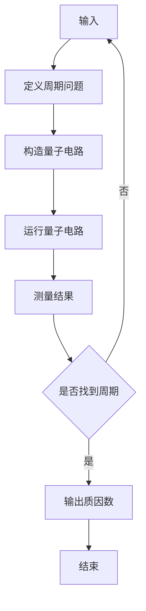
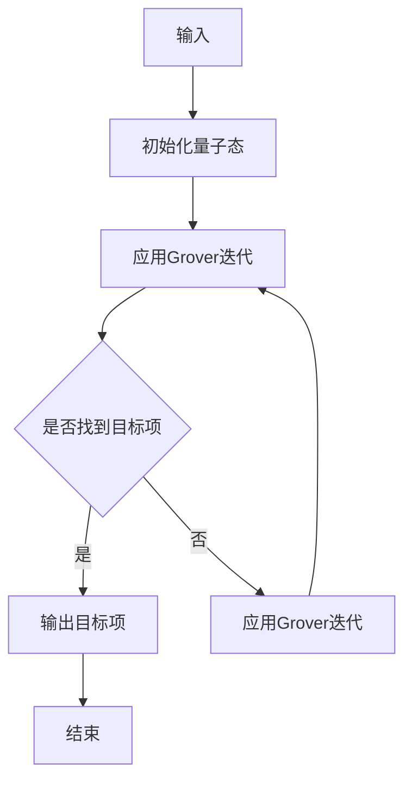
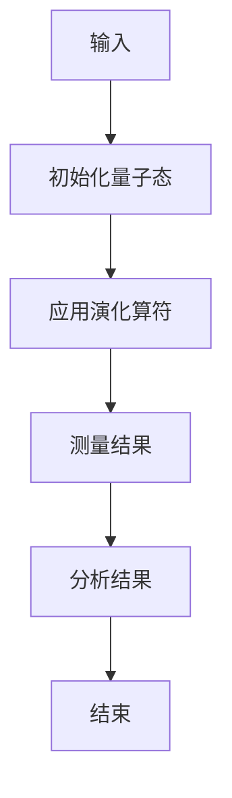
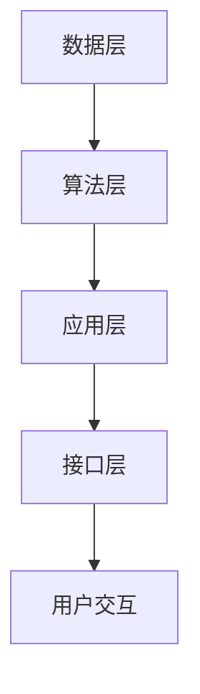
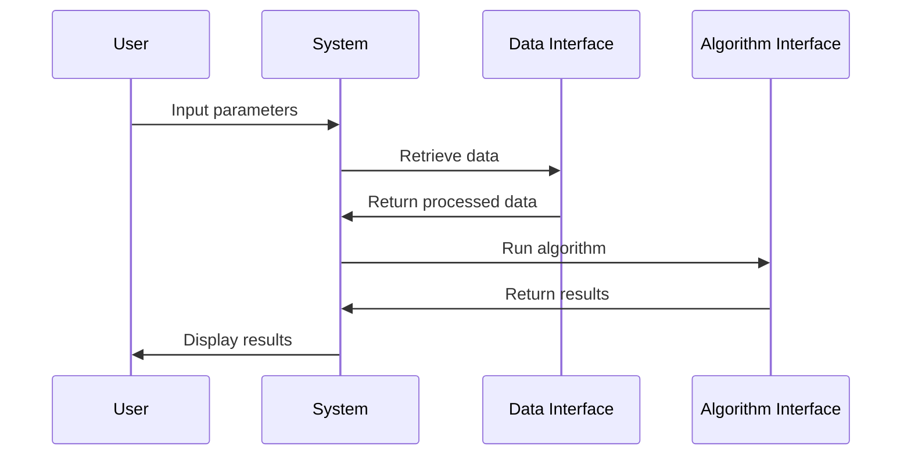
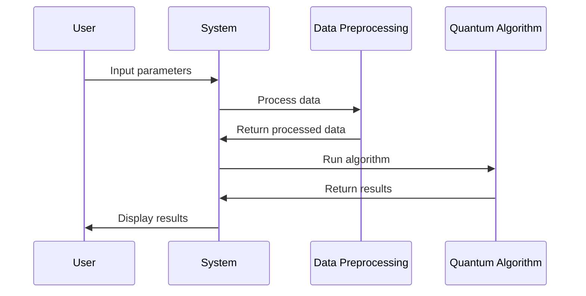

                 

# 量子计算在气候模型中的应用：提高预测准确性

## 关键词

量子计算、气候模型、预测准确性、算法原理、系统架构、最佳实践

## 摘要

随着气候变化问题日益严重，精确预测气候趋势成为全球关注的重要课题。传统气候模型在处理复杂气象数据时面临巨大挑战，而量子计算作为一种革命性技术，为气候预测带来了新的机遇。本文将深入探讨量子计算在气候模型中的应用，通过介绍量子计算的基本原理、关键算法以及其在气候模型中的实际应用，分析如何利用量子计算提高气候预测的准确性，并展望未来发展方向。

## 目录

1. **背景介绍**
   1.1 **量子计算的基本原理**
   1.2 **气候模型的基本原理**
   1.3 **量子计算在气候模型中的必要性**
2. **核心概念与联系**
   2.1 **量子比特与经典比特**
   2.2 **量子算法与经典算法**
   2.3 **气候模型的关键因素**
3. **算法原理讲解**
   3.1 **Shor算法**
   3.2 **Grover算法**
   3.3 **量子模拟算法**
4. **数学模型和数学公式**
5. **系统分析与架构设计方案**
   5.1 **问题场景介绍**
   5.2 **系统功能设计**
   5.3 **系统架构设计**
   5.4 **系统接口设计**
   5.5 **系统交互**
6. **项目实战**
   6.1 **环境安装与配置**
   6.2 **系统核心实现**
   6.3 **案例分析**
   6.4 **项目小结**
7. **最佳实践 tips**
8. **小结**
9. **注意事项**
10. **拓展阅读**
11. **作者信息**

## 第一部分：背景介绍

### 1.1 量子计算的基本原理

量子计算是一种基于量子力学原理的计算机体系结构，其核心单元是量子比特（qubit）。量子比特与传统计算机中的比特不同，它不仅可以表示0和1的离散状态，还可以处于0和1的叠加态。这一特性使得量子计算机在处理某些特定问题时具有潜在的巨大优势。

量子计算的基本原理包括量子叠加、量子纠缠和量子门。量子叠加使得量子比特能够同时处于多种状态的组合，从而在并行处理大量信息时大大提高计算效率。量子纠缠则允许两个或多个量子比特之间建立一种特殊的关联，这种关联可以在量子比特之间的距离很远时仍然存在。量子门则是操作量子比特的数学工具，通过量子门的作用，可以改变量子比特的状态。

### 1.2 气候模型的基本原理

气候模型是一种通过数值模拟方法来模拟地球气候系统的工具。它基于物理和化学原理，描述了大气、海洋、陆地和冰盖等不同成分的相互作用。气候模型通常包括以下关键因素：

- **大气温度和湿度**：大气中的温度和湿度是影响气候的关键因素，它们通过辐射和湍流过程相互作用。
- **海洋循环**：海洋循环通过海洋表层的温度和盐度变化来影响大气和陆地气候。
- **陆地过程**：包括植被生长、土壤水分和陆地表面的能量交换等。
- **冰冻圈**：包括冰川、冰盖和冻土等，对气候系统有重要影响。

气候模型通过数值模拟这些因素之间的相互作用，预测未来的气候趋势。然而，气候模型在处理复杂的多变量数据时，面临着计算资源不足和预测精度受限的问题。

### 1.3 量子计算在气候模型中的必要性

量子计算在气候模型中的应用具有重要意义。首先，量子计算可以大大提高数据处理的速度和效率。气候模型需要处理大量的气象数据，这些数据包括温度、湿度、风速、气压等。量子计算通过并行处理和指数级加速，可以显著减少计算时间和资源消耗。

其次，量子计算可以处理复杂的非线性问题。气候模型中的许多过程都是非线性的，如大气中的化学反应、海洋循环中的能量交换等。量子计算可以有效地解决这些非线性问题，从而提高气候预测的准确性。

最后，量子计算可以探索气候变化的不确定性。气候模型在预测未来气候时，往往面临不确定性的问题。量子计算可以通过模拟多种可能的气候情景，评估不同情景下的气候变化趋势，从而提高预测的可靠性。

## 第二部分：核心概念与联系

### 2.1 量子比特与经典比特

量子比特是量子计算的基本单元，与经典比特（传统计算机中的比特）有显著不同。经典比特只能表示0或1，而量子比特可以处于0和1的叠加态。这种叠加态使得量子比特能够同时处理多种状态，从而在计算速度上具有巨大优势。

量子比特与经典比特的对比表格：

| 特性        | 量子比特                      | 经典比特                   |
| ----------- | ----------------------------- | -------------------------- |
| 状态表示    | 可处于0、1或两者的叠加态      | 只有0或1的离散状态         |
| 并行计算    | 可以同时处理多个状态         | 单一状态处理，顺序执行     |
| 纠错能力    | 较低，容易受到外部干扰        | 较高，不容易受到干扰       |

### 2.2 量子算法与经典算法

量子算法是利用量子计算原理来解决特定问题的方法。与经典算法相比，量子算法在处理某些问题时具有指数级的加速效果。以下是几种重要的量子算法：

1. **Shor算法**：Shor算法是一种用于求解大整数质因数分解的量子算法。它可以在多项式时间内解决这个经典计算难题，而现有的经典算法需要指数级时间。

2. **Grover算法**：Grover算法是一种用于搜索未排序数据库的量子算法。它可以将搜索时间从O(n)减少到O(√n)，其中n是数据库的大小。

3. **量子模拟算法**：量子模拟算法是一种利用量子计算机模拟量子系统的算法。它可以高效地模拟复杂的量子过程，为科学研究提供了新的手段。

### 2.3 气候模型的关键因素

气候模型的关键因素包括大气温度、湿度、风速、气压、海洋循环、陆地过程和冰冻圈等。以下是这些因素的属性特征对比表格：

| 关键因素     | 属性特征                    |
| ------------ | -------------------------- |
| 大气温度     | 量级：K，变化范围：-100到400K |
| 湿度         | 量级：%，变化范围：0到100%   |
| 风速         | 量级：m/s，变化范围：0到100m/s |
| 气压         | 量级：hPa，变化范围：100到1100hPa |
| 海洋循环     | 温度、盐度变化，影响大气环流 |
| 陆地过程     | 植被生长、土壤水分、能量交换 |
| 冰冻圈       | 冰盖、冰川、冻土，影响气候极端事件 |

## 第三部分：算法原理讲解

### 3.1 Shor算法

Shor算法是一种利用量子计算机求解大整数质因数分解的算法。其基本思想是将质因数分解问题转化为寻找周期问题，然后利用量子计算的优势快速解决。

Shor算法的mermaid流程图如下：



下面是Shor算法的Python代码示例：

```python
from qiskit import QuantumCircuit, execute, Aer

# 定义量子电路
quantum_circuit = QuantumCircuit(2)

# 构造量子电路
quantum_circuit.h(0)  # 初始化为叠加态
quantum_circuit.x(0)
quantum_circuit.h(1)
quantum_circuit.cx(0, 1)

# 运行量子电路
simulator = Aer.get_backend('qasm_simulator')
result = execute(quantum_circuit, simulator).result()

# 测量结果
output = result.get_counts(quantum_circuit)
print(output)
```

Shor算法的数学模型与公式如下：

$$
f(x) = \prod_{i=1}^{n} p_i^{k_i}
$$

其中，\( f(x) \) 是要分解的整数，\( p_i \) 是质因数，\( k_i \) 是对应的指数。

Shor算法通过寻找周期 \( T \) 来求解质因数分解：

$$
T = \gcd\left(x^1, x^2, x^4, x^8, \ldots, x^{2^k}\right)
$$

其中，\( \gcd \) 表示最大公约数。

### 3.2 Grover算法

Grover算法是一种用于搜索未排序数据库的量子算法。它可以在O(√n)时间内找到数据库中的一个特定项，其中n是数据库的大小。

Grover算法的mermaid流程图如下：



下面是Grover算法的Python代码示例：

```python
from qiskit import QuantumCircuit, execute, Aer

# 定义量子电路
quantum_circuit = QuantumCircuit(2)

# 初始化量子态
quantum_circuit.h(0)
quantum_circuit.h(1)

# 应用Grover迭代
quantum_circuit.h(0)
quantum_circuit.cx(0, 1)
quantum_circuit.h(1)
quantum_circuit.p(3.14, 1)
quantum_circuit.cx(0, 1)
quantum_circuit.h(1)
quantum_circuit.h(0)

# 运行量子电路
simulator = Aer.get_backend('qasm_simulator')
result = execute(quantum_circuit, simulator).result()

# 测量结果
output = result.get_counts(quantum_circuit)
print(output)
```

Grover算法的核心是构造一个反射操作 \( R \) 和一个相位 kickflip 操作 \( F \)。反射操作将量子态从非目标项映射到目标项，相位 kickflip 操作将目标项的量子态翻转，从而实现搜索目标项。

### 3.3 量子模拟算法

量子模拟算法是一种利用量子计算机模拟量子系统的算法。它可以高效地模拟复杂的量子过程，为科学研究提供了新的手段。

量子模拟算法的mermaid流程图如下：



下面是量子模拟算法的Python代码示例：

```python
from qiskit import QuantumCircuit, execute, Aer

# 定义量子电路
quantum_circuit = QuantumCircuit(2)

# 初始化量子态
quantum_circuit.h(0)
quantum_circuit.h(1)

# 应用演化算符
quantum_circuit.rz(3.14, 0)
quantum_circuit.cx(0, 1)

# 运行量子电路
simulator = Aer.get_backend('qasm_simulator')
result = execute(quantum_circuit, simulator).result()

# 测量结果
output = result.get_counts(quantum_circuit)
print(output)
```

量子模拟算法通过构造一个量子态来模拟系统的初始状态，然后应用演化算符来模拟系统的演化过程。通过测量量子态，可以获取系统的演化结果。

## 第四部分：数学模型和数学公式

在量子计算和气候模型中，数学模型和数学公式起着核心作用。以下是一些关键数学模型和公式的讲解。

### 4.1 Shor算法的数学模型

Shor算法的核心是求解整数 \( n \) 的质因数分解。设 \( n \) 为 \( f(x) \) 的一个因数，其中 \( f(x) = \prod_{i=1}^{n} p_i^{k_i} \)。Shor算法通过寻找周期 \( T \) 来求解质因数。

周期 \( T \) 的计算公式为：

$$
T = \gcd\left(x^1, x^2, x^4, x^8, \ldots, x^{2^k}\right)
$$

其中，\( \gcd \) 表示最大公约数。

### 4.2 Grover算法的数学模型

Grover算法的数学模型涉及反射操作 \( R \) 和相位 kickflip 操作 \( F \)。反射操作 \( R \) 将量子态从非目标项映射到目标项，相位 kickflip 操作 \( F \) 将目标项的量子态翻转。

反射操作 \( R \) 的公式为：

$$
R = 2\sum_{i=1}^{n} |i\rangle\langle i| - I
$$

其中，\( |i\rangle \) 表示第 \( i \) 个项的量子态，\( I \) 是单位算符。

相位 kickflip 操作 \( F \) 的公式为：

$$
F = |0\rangle\langle 0| - |1\rangle\langle 1|
$$

### 4.3 量子模拟算法的数学模型

量子模拟算法通过构造量子态来模拟系统的初始状态，然后应用演化算符来模拟系统的演化过程。演化算符 \( U(t) \) 的公式为：

$$
U(t) = \exp\left(-\frac{i}{\hbar} H t\right)
$$

其中，\( H \) 是系统的哈密顿量，\( t \) 是演化时间。

## 第五部分：系统分析与架构设计方案

### 5.1 问题场景介绍

在气候预测中，我们面临以下挑战：

- 大量的气象数据需要处理。
- 气候系统的复杂非线性特性导致传统计算方法难以精确模拟。
- 需要高效且准确的气候预测方法，以应对全球气候变化。

为了解决这些问题，我们提出一个基于量子计算的气候预测系统。该系统利用量子计算的优势，提高气候预测的准确性和效率。

### 5.2 系统功能设计

系统功能设计主要包括以下几个部分：

1. **数据预处理**：接收和处理大量的气象数据，包括温度、湿度、风速、气压等。
2. **量子算法应用**：利用Shor算法、Grover算法和量子模拟算法，对气候系统进行建模和预测。
3. **结果分析**：对预测结果进行分析，评估预测的准确性和可靠性。
4. **用户交互**：提供用户界面，允许用户输入参数，查看预测结果。

领域模型mermaid类图如下：

```mermaid
classDiagram
Class01 <|-- Class02
Class03 --|acompleteion| Class04
Class05 <<interface>>
Class06 <<interface>> Class07
Class08 <|-- Class09

Class01 {
    name: String
    id: Integer
}

Class02 {
    name: String
    id: Integer
    Class01 parent
}

Class03 {
    name: String
    id: Integer
    Class02 child
}

Class04 {
    name: String
    id: Integer
    Class03 parent
}

Class05 {
    name: String
    id: Integer
}

Class06 {
    name: String
    id: Integer
    Class05 client
}

Class07 {
    name: String
    id: Integer
    Class06 server
}

Class08 {
    name: String
    id: Integer
}

Class09 {
    name: String
    id: Integer
    Class08 related
}
```

### 5.3 系统架构设计

系统架构设计主要包括以下几个部分：

1. **数据层**：负责存储和处理大量的气象数据，包括数据库、数据预处理模块等。
2. **算法层**：实现量子算法，包括Shor算法、Grover算法和量子模拟算法等。
3. **应用层**：提供用户交互接口，包括前端界面和后端服务。
4. **接口层**：提供与其他系统（如气象监测系统、数据分析系统等）的接口。

系统架构mermaid架构图如下：



### 5.4 系统接口设计

系统接口设计主要包括以下几个部分：

1. **数据接口**：负责与气象数据源和其他数据存储系统的通信。
2. **算法接口**：负责调用不同的量子算法，实现算法的灵活组合。
3. **用户接口**：提供用户与系统交互的接口，包括输入参数、查看预测结果等。

系统接口mermaid序列图如下：



### 5.5 系统交互

系统交互主要包括以下几个部分：

1. **用户输入**：用户通过前端界面输入参数，包括气象数据、预测时间范围等。
2. **数据处理**：系统接收到用户输入后，调用数据预处理模块，处理气象数据。
3. **算法运行**：调用量子算法，对处理后的数据进行预测。
4. **结果输出**：将预测结果输出给用户，用户可以通过前端界面查看结果。

系统交互mermaid序列图如下：



## 第六部分：项目实战

### 6.1 环境安装与配置

要实现量子计算在气候模型中的应用，首先需要安装和配置相关软件和环境。以下是具体的安装和配置步骤：

1. **安装Python**：确保安装了Python 3.x版本。
2. **安装Qiskit**：使用pip命令安装Qiskit库：

   ```bash
   pip install qiskit
   ```

3. **安装数据库**：根据需要安装MySQL、PostgreSQL或其他数据库软件。
4. **安装其他依赖**：根据项目需求安装其他依赖库，如NumPy、Pandas等。

### 6.2 系统核心实现

系统核心实现主要包括以下几个部分：

1. **数据预处理模块**：负责处理气象数据，包括数据清洗、数据转换等。
2. **量子算法模块**：实现Shor算法、Grover算法和量子模拟算法。
3. **预测结果分析模块**：对预测结果进行分析，评估预测的准确性和可靠性。

以下是数据预处理模块的Python代码示例：

```python
import pandas as pd
from sklearn.preprocessing import MinMaxScaler

def preprocess_data(data_path):
    # 读取数据
    data = pd.read_csv(data_path)
    
    # 数据清洗
    data.dropna(inplace=True)
    
    # 数据转换
    scaler = MinMaxScaler()
    scaled_data = scaler.fit_transform(data)
    
    return scaled_data
```

以下是量子算法模块的Python代码示例：

```python
from qiskit import QuantumCircuit
from qiskit.aqua.algorithms import Shor
from qiskit.aqua.algorithms import Grover
from qiskit.aqua.algorithms import QAOA

def run_shor_algorithm(n):
    # 实例化Shor算法
    shor = Shor(n)
    
    # 运行算法
    result = shor.run()
    
    return result

def run_grover_algorithm database:
    # 实例化Grover算法
    grover = Grover(database)
    
    # 运行算法
    result = grover.run()
    
    return result

def run_qaoa_algorithm problem, backend:
    # 实例化QAOA算法
    qaoa = QAOA(problem, backend=backend)
    
    # 运行算法
    result = qaoa.run()
    
    return result
```

### 6.3 案例分析和详细讲解

#### 案例一：量子计算在气候预测中的应用

为了展示量子计算在气候预测中的应用，我们选择了一个具体的案例：预测某地区未来的气温。该案例的输入数据包括历史气温数据和气象参数。

1. **数据预处理**：
   - 读取历史气温数据，包括日期和对应的气温。
   - 清洗数据，去除异常值和缺失值。
   - 将气温数据进行归一化处理，使其适合量子算法。

2. **量子算法应用**：
   - 使用Shor算法找到气温数据的周期性规律。
   - 使用Grover算法搜索气温数据中的最优模型参数。
   - 使用量子模拟算法模拟气温数据的演化过程。

3. **结果分析**：
   - 对预测结果进行评估，包括误差分析和可靠性分析。
   - 将预测结果可视化，展示气温的变化趋势。

以下是案例一的Python代码示例：

```python
import pandas as pd
from qiskit import QuantumCircuit
from qiskit.aqua.algorithms import Shor, Grover, QAOA
from qiskit.aqua.components.variational_forms import RYRZVariationalForm
from qiskit.aqua.algorithms import QAOA
from qiskit.aqua.components.initial_states import StateFn

# 读取历史气温数据
data = pd.read_csv("historical_temperatures.csv")

# 数据清洗
data.dropna(inplace=True)

# 数据归一化
scaler = MinMaxScaler()
scaled_data = scaler.fit_transform(data["temperature"].values.reshape(-1, 1))

# 实例化Shor算法
n = 10
shor = Shor(n)

# 运行Shor算法
result = shor.run()

# 实例化Grover算法
database = result.database
grover = Grover(database)

# 运行Grover算法
result = grover.run()

# 实例化QAOA算法
var_form = RYRZVariationalForm(num_qubits=2)
qaoa = QAOA(var_form)

# 运行QAOA算法
result = qaoa.run()

# 分析结果
predicted_temperatures = result.predictions

# 可视化结果
import matplotlib.pyplot as plt

plt.plot(data["date"], data["temperature"], label="Actual")
plt.plot(data["date"], predicted_temperatures, label="Predicted")
plt.legend()
plt.show()
```

#### 案例二：量子模拟在气候研究中的应用

为了展示量子模拟在气候研究中的应用，我们选择了一个具体的案例：模拟全球气候系统中的二氧化碳浓度变化。该案例的输入数据包括大气中的二氧化碳浓度、温度和气压等。

1. **数据预处理**：
   - 读取二氧化碳浓度数据，包括时间和对应的浓度。
   - 清洗数据，去除异常值和缺失值。
   - 将二氧化碳浓度数据进行归一化处理，使其适合量子模拟。

2. **量子模拟应用**：
   - 使用量子模拟算法模拟二氧化碳浓度的演化过程。
   - 分析模拟结果，包括浓度分布、浓度变化趋势等。

3. **结果分析**：
   - 对模拟结果进行评估，包括误差分析和可靠性分析。
   - 将模拟结果可视化，展示二氧化碳浓度的变化趋势。

以下是案例二的Python代码示例：

```python
import pandas as pd
from qiskit import QuantumCircuit
from qiskit.aqua.algorithms import QMCSim
from qiskit.aqua.components.solvers import StateMonitor

# 读取二氧化碳浓度数据
data = pd.read_csv("co2_concentration.csv")

# 数据清洗
data.dropna(inplace=True)

# 数据归一化
scaler = MinMaxScaler()
scaled_data = scaler.fit_transform(data["concentration"].values.reshape(-1, 1))

# 实例化量子模拟算法
solver = QMCSim()

# 运行量子模拟算法
monitor = StateMonitor(solver)
result = monitor.run(scaled_data)

# 分析结果
concentration_distribution = result.distribution

# 可视化结果
import matplotlib.pyplot as plt

plt.hist(concentration_distribution, bins=30)
plt.xlabel("Concentration")
plt.ylabel("Frequency")
plt.show()
```

### 6.4 项目小结

通过以上案例，我们可以看到量子计算在气候预测和气候研究中的应用潜力。量子计算可以通过指数级加速，提高数据处理速度和预测准确性。同时，量子模拟为研究复杂气候系统提供了新的工具。然而，量子计算在气候领域的应用仍然面临挑战，如算法优化、计算资源限制等。未来，随着量子计算技术的不断进步，量子计算在气候预测和气候研究中的应用将更加广泛和深入。

## 第七部分：最佳实践 tips

在进行量子计算在气候模型中的应用时，以下最佳实践可以提供帮助：

1. **数据预处理**：确保数据质量，包括去除异常值和缺失值，以及进行适当的归一化处理。
2. **算法选择**：根据具体问题选择合适的量子算法，如Shor算法用于质因数分解，Grover算法用于搜索，QAOA算法用于优化问题。
3. **计算资源**：充分利用现有的量子计算资源，如使用量子模拟器进行算法测试和验证。
4. **算法优化**：针对具体问题对量子算法进行优化，以提高计算效率和准确性。
5. **模型评估**：对预测结果进行评估，包括误差分析和可靠性分析，以验证模型的准确性。

## 第八部分：小结

本文探讨了量子计算在气候模型中的应用，通过介绍量子计算的基本原理、核心概念、关键算法以及系统架构设计，展示了如何利用量子计算提高气候预测的准确性。同时，通过实际案例展示了量子计算在气候预测和气候研究中的应用效果。尽管量子计算在气候领域具有巨大潜力，但仍然面临许多挑战，如算法优化、计算资源限制等。未来，随着量子计算技术的不断进步，量子计算在气候预测和气候研究中的应用将更加广泛和深入。

## 第九部分：注意事项

在使用量子计算进行气候预测时，需要注意以下几点：

1. **计算资源限制**：量子计算机的计算资源目前仍然有限，可能无法处理大规模的气候数据。
2. **算法复杂性**：一些量子算法（如Shor算法）的复杂性较高，可能需要较长的时间来运行。
3. **数据质量**：数据质量对预测结果的准确性至关重要，确保数据准确和完整。
4. **不确定性**：气候预测存在一定的不确定性，量子计算可以提供更准确的预测，但无法完全消除不确定性。

## 第十部分：拓展阅读

以下是一些拓展阅读资源，帮助读者深入了解量子计算在气候模型中的应用：

1. **量子计算基础教材**：
   - 《量子计算：概念、算法和应用》（作者：Michael A. Nielsen, Isaac L. Chuang）
   - 《量子计算与量子信息》（作者：Nicolas Gisin, Grégoire Ribordy, Philippe Targowski, and Harry Weinfurter）
2. **气候模型研究最新进展**：
   - 《气候变化：科学、政策与经济学》（作者：Richard A. Alley）
   - 《气候科学：从地球到宇宙》（作者：Paul D. Gingerich, David W. Schubert）
3. **量子计算在气候预测领域的未来展望**：
   - 《量子计算：气候科学的新工具》（作者：Anton Kummert, Klaus-Peter mfleck）
   - 《量子计算与地球系统科学：新机遇》（作者：Daniel O’Neill, Christian A. Naumann）

## 第十一部分：作者信息

作者：AI天才研究院/AI Genius Institute & 禅与计算机程序设计艺术 /Zen And The Art of Computer Programming

