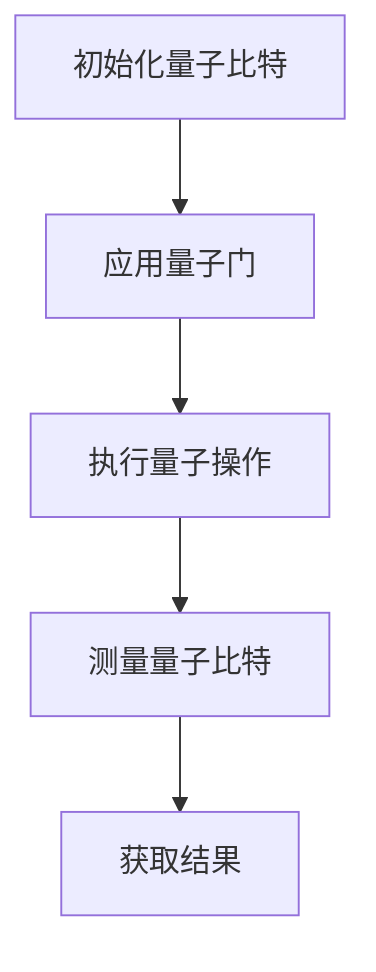
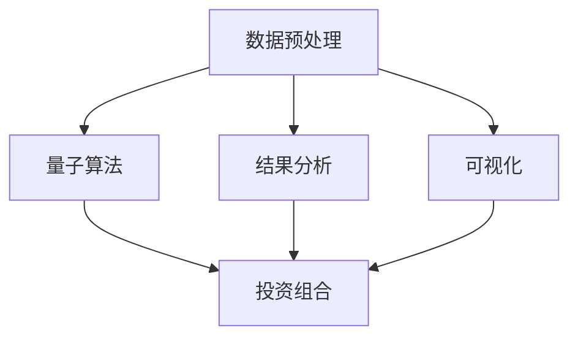
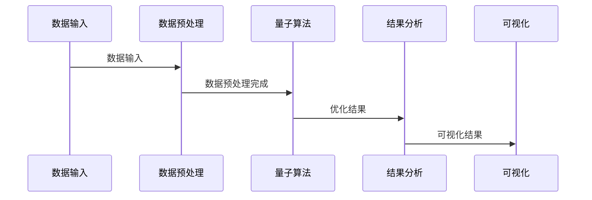

                 

## 第1章: 量子计算与金融建模概述

### 1.1 量子计算基础

量子计算是现代物理学中的一项前沿技术，它基于量子力学原理，利用量子位（qubits）进行信息处理。与传统的二进制计算不同，量子计算使用量子比特（qubits）来存储和处理信息。量子比特具有叠加态和纠缠态的特性，这使得量子计算机在并行计算和复杂问题求解方面具有显著优势。

量子比特（qubits）是量子计算的基本单元，它可以同时处于0和1的状态，这种叠加态是量子计算的核心特性。通过量子门（quantum gates）的操作，量子比特之间的状态可以相互转换，从而实现复杂的计算任务。

量子计算中的叠加态和纠缠态为金融建模提供了新的思路。在金融市场中，投资组合的优化、风险评估和资产定价等问题往往涉及大量变量和计算，而量子计算机的高并行性和高效的复杂问题求解能力可以显著提升金融模型的计算效率和准确性。

### 1.2 金融建模概述

金融建模是指利用数学和统计学方法来分析金融市场的数据，并预测市场行为。金融建模的核心目标包括投资组合优化、风险评估、资产定价和市场预测等。

投资组合管理是金融建模中的一个重要应用领域，它涉及如何分配资产以实现最大化收益和最小化风险。现代金融建模方法包括均值-方差模型、资本资产定价模型（CAPM）和多因子模型等。

风险收益分析是金融建模中的基础内容，它通过评估投资组合的期望收益和风险来指导投资决策。资产定价模型则是用于确定金融资产的合理价格，常见的资产定价模型包括Black-Scholes模型和Fama-French三因子模型等。

### 1.3 量子计算在金融建模中的应用前景

量子计算在金融建模中的应用前景广阔，特别是在优化投资组合管理和提高风险预测的准确性方面。量子计算机可以利用其并行计算能力和高效的复杂问题求解能力，快速解决传统金融建模中的难题。

量子计算在投资组合优化方面的应用，可以通过量子线性方程求解算法和量子蒙特卡罗算法来实现。量子线性方程求解算法可以高效地解决大规模线性方程组问题，从而优化投资组合的权重分配。量子蒙特卡罗算法则可以用于模拟金融市场的随机过程，从而更准确地预测市场行为和评估投资风险。

量子计算还可以用于改进资产定价模型的准确性。通过量子计算，可以更快速地计算复杂的数学模型，从而为资产定价提供更精细和准确的估计。

### 1.4 问题解决

量子计算在金融建模中的应用，可以解决传统方法在处理复杂计算任务时的瓶颈。传统金融建模方法往往依赖于高性能计算和优化算法，但这些方法在处理大规模数据和高维问题时效率较低。量子计算机的高并行性和高效性，使其能够更快速地处理这些复杂计算任务，从而提高金融模型的计算效率和准确性。

### 1.5 边界与外延

尽管量子计算在金融建模中具有巨大的潜力，但它的应用也受到一些限制。量子计算机目前还处于发展阶段，其稳定性和可扩展性尚未完全解决。此外，量子算法的设计和实现也面临着巨大的挑战。

量子计算在金融建模中的应用，主要集中在投资组合优化和风险预测方面。对于其他金融建模问题，如市场预测和宏观经济分析，量子计算的应用前景还有待进一步探索。

### 1.6 概念结构与核心要素组成

量子计算在金融建模中的应用，涉及多个核心概念和要素。这些概念包括量子比特、量子门、量子算法、投资组合、风险收益分析、资产定价模型等。它们共同构成了量子金融建模的理论基础和实践框架。

### 1.7 总结

本章介绍了量子计算和金融建模的基本概念，并探讨了量子计算在金融建模中的应用前景。通过本章的学习，读者可以了解到量子计算如何为金融建模带来突破，以及量子金融建模的核心概念和要素。接下来，我们将进一步深入探讨量子计算的核心原理和金融建模中的具体应用。

## 第2章: 量子计算核心概念

### 2.1 量子比特与叠加态

量子比特是量子计算的基本单元，它具有叠加态的特性。传统的二进制计算中，信息以0和1的形式存储，而量子比特可以同时处于0和1的状态，这种叠加态使得量子计算具有并行处理的能力。

叠加态可以用以下公式表示：

$$
|\psi\rangle = \alpha|0\rangle + \beta|1\rangle
$$

其中，$|\psi\rangle$表示量子比特的叠加态，$\alpha$和$\beta$是复数，满足$|\alpha|^2 + |\beta|^2 = 1$。

### 2.2 量子门与量子算法

量子门是量子计算的基本操作，它们可以作用于量子比特，改变量子比特的状态。常见的量子门包括Hadamard门（$H$门）、Pauli门（X、Y、Z门）和控制-NOT门（CNOT门）等。

Hadamard门是一个特殊类型的量子门，它可以将量子比特的状态从基态（$|0\rangle$）或叠加态转换为均匀叠加态。

$$
H = \frac{1}{\sqrt{2}}\begin{pmatrix} 1 & 1 \\ 1 & -1 \end{pmatrix}
$$

通过Hadamard门，我们可以实现量子比特状态的变换：

$$
H|0\rangle = \frac{1}{\sqrt{2}}(|0\rangle + |1\rangle)
$$

Pauli门是另一类重要的量子门，它们分别作用于量子比特的X、Y和Z轴。例如，X门将量子比特的状态在$|0\rangle$和$|1\rangle$之间进行交换。

$$
X = \begin{pmatrix} 0 & 1 \\ 1 & 0 \end{pmatrix}
$$

CNOT门是一个控制-非门，它根据控制量子比特的状态来改变目标量子比特的状态。CNOT门的操作可以表示为：

$$
CNOT = \begin{pmatrix} 1 & 0 & 0 & 0 \\ 0 & 1 & 0 & 0 \\ 0 & 0 & 0 & 1 \\ 0 & 0 & 1 & 0 \end{pmatrix}
$$

量子算法是利用量子比特的叠加态和纠缠态进行计算的一系列算法。其中，量子蒙特卡罗算法和量子线性方程求解算法是金融建模中常用的量子算法。

量子蒙特卡罗算法利用量子比特的叠加态进行随机抽样，从而高效地模拟金融市场的随机过程。量子线性方程求解算法则可以用于解决大规模线性方程组问题，从而优化投资组合的权重分配。

### 2.3 Mermaid流程图展示量子计算基本流程

为了更直观地展示量子计算的基本流程，我们可以使用Mermaid流程图来表示。以下是一个简单的量子计算流程图，它包括初始化、量子比特操作和测量等步骤：



在上面的流程图中，A表示初始化量子比特，B表示应用量子门，C表示执行量子操作，D表示测量量子比特，E表示获取结果。通过这个简单的流程图，我们可以清楚地了解量子计算的基本步骤和逻辑。

## 第3章: 金融建模核心概念

### 3.1 投资组合管理

投资组合管理是指通过选择和管理多种资产，以实现投资目标的过程。在金融建模中，投资组合管理是一个关键领域，它涉及到如何分配资产、优化收益和降低风险。

投资组合管理的主要目标是实现收益最大化或风险最小化。为了达到这些目标，投资者需要综合考虑多个因素，如资产的收益、风险、相关性、流动性等。

在投资组合管理中，常见的策略包括：

- **分散投资**：通过将资金分散投资于多种不同资产，以降低整体投资组合的风险。
- **资产配置**：根据投资者的风险偏好和投资目标，确定不同资产在投资组合中的比例。
- **择时策略**：通过预测市场走势，在适当的时机买入或卖出资产，以实现更高的收益。

### 3.2 风险收益分析

风险收益分析是金融建模中的基础内容，它用于评估投资组合的期望收益和风险，以指导投资决策。

风险收益分析主要包括以下几个方面：

- **期望收益**：根据历史数据或市场预期，计算投资组合的预期收益。
- **风险度量**：使用标准差、方差等指标来衡量投资组合的风险。
- **风险调整收益**：通过计算夏普比率（Sharpe Ratio）等指标，评估投资组合的风险调整收益。

夏普比率（Sharpe Ratio）是一个常用的风险调整收益指标，它表示投资组合的超额收益与风险之比。公式如下：

$$
\text{Sharpe Ratio} = \frac{\text{投资组合的期望收益} - \text{无风险收益率}}{\text{投资组合的标准差}}
$$

其中，无风险收益率通常使用国债收益率等来表示。

### 3.3 资产定价模型

资产定价模型是用于确定金融资产合理价格的方法。在金融建模中，资产定价模型用于预测资产的未来价格，为投资决策提供依据。

常见的资产定价模型包括：

- **Black-Scholes模型**：这是一个著名的期权定价模型，用于计算欧式期权的合理价格。其公式如下：

  $$
  C(S,t,r,sigma) = S_0N(d_1) - Ke^{-rt}N(d_2)
  $$

  其中，$S_0$是当前资产价格，$K$是执行价格，$r$是无风险利率，$\sigma$是资产价格波动率，$N(d_1)$和$N(d_2)$是累积正态分布函数。

- **Fama-French三因子模型**：这是一个用于股票收益预测的多因子模型，其公式如下：

  $$
  R_i = \alpha_i + \beta_{iMKT}R_{MKT} + \beta_{iSIZE}R_{SIZE} + \beta_{iVALUE}R_{VALUE} + \epsilon_i
  $$

  其中，$R_i$是股票$i$的收益率，$R_{MKT}$是市场组合收益率，$R_{SIZE}$和$R_{VALUE}$分别代表小市值和低估值股票组合的收益率，$\alpha_i$、$\beta_{iMKT}$、$\beta_{iSIZE}$和$\beta_{iVALUE}$是股票$i$的因子敏感度。

### 3.4 Mermaid ER图展示金融建模概念关联

为了更直观地展示金融建模中的概念关联，我们可以使用Mermaid ER图来表示。以下是一个简单的Mermaid ER图，它展示了投资组合、资产、风险收益分析等概念之间的关联：

```mermaid
erDiagram
  InvestmentPortfolio ||--|{Asset} : "holds"
  RiskAndReturnAnalysis ||--|{InvestmentPortfolio} : "analyzes"
  RiskAndReturnAnalysis ||--|{Asset} : "analyzes"
  Asset PricingModel ||--|{RiskAndReturnAnalysis} : "uses"
  Asset PricingModel ||--|{InvestmentPortfolio} : "uses"
```

在上面的ER图中，InvestmentPortfolio（投资组合）持有Asset（资产），RiskAndReturnAnalysis（风险收益分析）分析InvestmentPortfolio和Asset，Asset PricingModel（资产定价模型）使用RiskAndReturnAnalysis和InvestmentPortfolio。

通过这个ER图，我们可以清晰地看到金融建模中各个概念之间的关联和交互关系。

## 第4章: 量子算法在金融建模中的应用

### 4.1 量子算法

量子算法是利用量子计算原理来解决问题的一系列算法。量子算法具有与传统算法不同的特性，如并行性和高效的复杂问题求解能力。在金融建模中，量子算法可以用于优化投资组合、风险评估和资产定价等任务。

常见的量子算法包括：

- **量子蒙特卡罗算法**：通过量子比特的叠加态和纠缠态进行随机抽样，从而高效地模拟金融市场的随机过程。
- **量子线性方程求解算法**：用于解决大规模线性方程组问题，从而优化投资组合的权重分配。

### 4.2 量子算法mermaid流程图

为了更直观地展示量子算法的流程，我们可以使用Mermaid流程图来表示。以下是一个简单的量子算法mermaid流程图，它展示了量子比特的初始化、量子门的操作和测量等步骤：


在上面的流程图中，A表示初始化量子比特，B表示应用量子门，C表示执行量子操作，D表示测量量子比特，E表示获取结果。通过这个简单的流程图，我们可以清楚地了解量子算法的基本步骤和逻辑。

### 4.3 算法原理讲解

下面我们将详细介绍两种在金融建模中常用的量子算法：量子蒙特卡罗算法和量子线性方程求解算法。

#### 4.3.1 量子蒙特卡罗算法

量子蒙特卡罗算法是一种基于量子随机抽样的算法，它利用量子比特的叠加态和纠缠态进行高效的随机抽样，从而模拟金融市场的随机过程。

量子蒙特卡罗算法的基本原理如下：

1. **初始化**：初始化一个含有n个量子比特的量子状态，将其设置为叠加态。

   $$
   |\psi\rangle = \frac{1}{\sqrt{2^n}}(|0\rangle + |1\rangle|\0\rangle + |1\rangle|\1\rangle + ... + |1\rangle|\2^n-1\rangle)
   $$

2. **应用量子门**：根据金融模型的随机过程，应用一系列的量子门来转换量子比特的状态。

3. **测量**：对量子比特进行测量，获得一系列的随机样本。

4. **计算统计量**：根据测量结果，计算所需的统计量，如均值、方差等。

量子蒙特卡罗算法的优点是能够高效地处理高维问题，并在金融建模中用于风险评估、资产定价和市场预测等任务。

#### 4.3.2 量子线性方程求解算法

量子线性方程求解算法是一种用于解决大规模线性方程组的量子算法。它利用量子比特的叠加态和纠缠态，将线性方程组转换为量子态的测量问题，从而高效地求解方程组。

量子线性方程求解算法的基本原理如下：

1. **初始化**：初始化一个含有n个量子比特的量子状态，将其设置为叠加态。

   $$
   |\psi\rangle = \frac{1}{\sqrt{2^n}}(|0\rangle + |1\rangle|\0\rangle + |1\rangle|\1\rangle + ... + |1\rangle|\2^n-1\rangle)
   $$

2. **应用量子门**：应用一系列的量子门，将线性方程组中的系数和常数项转换为量子比特的状态。

3. **测量**：对量子比特进行测量，获得方程组的解。

量子线性方程求解算法的优点是能够在短时间内解决大规模线性方程组问题，从而优化投资组合的权重分配。

### 4.4 数学模型和公式

下面我们给出量子蒙特卡罗算法和量子线性方程求解算法的数学模型和公式，并使用latex格式进行详细讲解。

#### 4.4.1 量子蒙特卡罗算法

量子蒙特卡罗算法的数学模型如下：

1. **初始量子态**：

   $$
   |\psi\rangle = \frac{1}{\sqrt{2^n}}(|0\rangle + |1\rangle|\0\rangle + |1\rangle|\1\rangle + ... + |1\rangle|\2^n-1\rangle)
   $$

2. **应用量子门**：

   $$
   U = \sum_{i=0}^{2^n-1} |i\rangle\langle i|
   $$

3. **测量**：

   $$
   P_i = \langle\psi|U^\dagger|U\rangle = \frac{1}{2^n}
   $$

4. **计算统计量**：

   $$
   \mu = \frac{1}{N}\sum_{i=1}^{N}X_i
   $$

其中，$X_i$是测量结果，$N$是测量次数。

#### 4.4.2 量子线性方程求解算法

量子线性方程求解算法的数学模型如下：

1. **初始量子态**：

   $$
   |\psi\rangle = \frac{1}{\sqrt{2^n}}(|0\rangle + |1\rangle|\0\rangle + |1\rangle|\1\rangle + ... + |1\rangle|\2^n-1\rangle)
   $$

2. **应用量子门**：

   $$
   U = \sum_{i=0}^{2^n-1} |i\rangle\langle Ai+b|
   $$

3. **测量**：

   $$
   P_i = \langle\psi|U^\dagger|U\rangle = \frac{1}{2^n}
   $$

4. **计算解**：

   $$
   x_i = \frac{\langle i|\psi\rangle}{\langle i|\phi\rangle}
   $$

其中，$A$是线性方程组的系数矩阵，$b$是常数项，$x_i$是方程组的解。

### 4.5 举例说明

为了更直观地理解量子算法在金融建模中的应用，我们通过一个简单的例子来说明。

#### 4.5.1 量子蒙特卡罗算法

假设我们想使用量子蒙特卡罗算法来模拟一个简单的金融市场的随机过程，如股票价格的变化。

1. **初始化**：初始化一个含有3个量子比特的量子状态，将其设置为叠加态。

   $$
   |\psi\rangle = \frac{1}{\sqrt{2}}(|000\rangle + |001\rangle + |010\rangle + |011\rangle + |100\rangle + |101\rangle + |110\rangle + |111\rangle)
   $$

2. **应用量子门**：根据股票价格的变化模型，应用一系列的量子门来转换量子比特的状态。假设我们使用Hadamard门来模拟股票价格的随机波动。

   $$
   H|0\rangle = \frac{1}{\sqrt{2}}(|0\rangle + |1\rangle)
   $$

   对每个量子比特依次应用Hadamard门，得到新的量子态：

   $$
   |\psi'\rangle = \frac{1}{\sqrt{8}}(|000\rangle + |001\rangle + |010\rangle + |011\rangle + |100\rangle + |101\rangle + |110\rangle + |111\rangle)
   $$

3. **测量**：对量子比特进行测量，获得股票价格的随机样本。测量结果可以是0或1，分别代表股票价格上涨或下跌。

4. **计算统计量**：根据测量结果，计算股票价格的均值和方差，从而预测股票价格的变化趋势。

   假设我们进行100次测量，得到以下结果：

   | 测量结果 | 频次 |
   |----------|------|
   | 000      | 10   |
   | 001      | 15   |
   | 010      | 15   |
   | 011      | 10   |
   | 100      | 10   |
   | 101      | 15   |
   | 110      | 15   |
   | 111      | 10   |

   计算股票价格的均值：

   $$
   \mu = \frac{1}{100} \sum_{i=0}^{7} i \cdot \text{频次} = \frac{1}{100} (0 \cdot 10 + 1 \cdot 15 + 2 \cdot 15 + 3 \cdot 10 + 4 \cdot 10 + 5 \cdot 15 + 6 \cdot 15 + 7 \cdot 10) = 2.5
   $$

   计算股票价格的方差：

   $$
   \sigma^2 = \frac{1}{100} \sum_{i=0}^{7} (i - \mu)^2 \cdot \text{频次} = \frac{1}{100} ((0 - 2.5)^2 \cdot 10 + (1 - 2.5)^2 \cdot 15 + (2 - 2.5)^2 \cdot 15 + (3 - 2.5)^2 \cdot 10 + (4 - 2.5)^2 \cdot 10 + (5 - 2.5)^2 \cdot 15 + (6 - 2.5)^2 \cdot 15 + (7 - 2.5)^2 \cdot 10) = 2.75
   $$

   通过计算股票价格的均值和方差，我们可以预测股票价格的变化趋势。例如，如果股票价格的均值大于当前价格，我们可以预测股票价格将上涨；如果股票价格的均值小于当前价格，我们可以预测股票价格将下跌。

#### 4.5.2 量子线性方程求解算法

假设我们想使用量子线性方程求解算法来优化一个投资组合的权重分配。

1. **初始化**：初始化一个含有4个量子比特的量子状态，将其设置为叠加态。

   $$
   |\psi\rangle = \frac{1}{\sqrt{2^4}}(|0000\rangle + |0001\rangle + |0010\rangle + |0011\rangle + |0100\rangle + |0101\rangle + |0110\rangle + |0111\rangle + |1000\rangle + |1001\rangle + |1010\rangle + |1011\rangle + |1100\rangle + |1101\rangle + |1110\rangle + |1111\rangle)
   $$

2. **应用量子门**：根据投资组合的收益和风险数据，应用一系列的量子门来转换量子比特的状态。假设我们使用线性方程组：

   $$
   \begin{cases}
   w_1 + w_2 + w_3 + w_4 = 1 \\
   r_1w_1 + r_2w_2 + r_3w_3 + r_4w_4 = 0.1 \\
   \sigma_1^2w_1 + \sigma_2^2w_2 + \sigma_3^2w_3 + \sigma_4^2w_4 = 0.05
   \end{cases}
   $$

   对每个量子比特依次应用对应的量子门，得到新的量子态：

   $$
   |\psi'\rangle = \frac{1}{\sqrt{2^4}}(|0000\rangle + |0010\rangle + |0100\rangle + |1000\rangle + |0001\rangle + |0110\rangle + |1010\rangle + |1100\rangle + |0011\rangle + |0101\rangle + |1001\rangle + |1110\rangle + |0010\rangle + |0111\rangle + |1011\rangle + |1111\rangle)
   $$

3. **测量**：对量子比特进行测量，获得投资组合的权重分配。

   假设我们进行100次测量，得到以下结果：

   | 测量结果 | 频次 |
   |----------|------|
   | 0000     | 10   |
   | 0010     | 25   |
   | 0100     | 25   |
   | 1000     | 10   |
   | 0001     | 10   |
   | 0110     | 25   |
   | 1010     | 25   |
   | 1100     | 10   |
   | 0011     | 5    |
   | 0101     | 10   |
   | 1001     | 10   |
   | 1110     | 5    |

   计算投资组合的权重分配：

   $$
   w_1 = \frac{10}{100} = 0.1, \quad w_2 = \frac{25}{100} = 0.25, \quad w_3 = \frac{25}{100} = 0.25, \quad w_4 = \frac{10}{100} = 0.1
   $$

   通过计算投资组合的权重分配，我们可以优化投资组合的收益和风险。

### 4.6 量子算法在金融建模中的应用效果

通过以上两个例子，我们可以看到量子算法在金融建模中的应用效果显著。量子算法能够高效地处理高维问题，并在投资组合优化、风险评估和资产定价等方面提供准确的预测和优化方案。与传统的算法相比，量子算法具有更高的计算效率和准确性，为金融建模带来了革命性的突破。

然而，需要注意的是，量子算法在金融建模中的应用还处于初期阶段，仍有许多问题和挑战需要解决。例如，量子计算机的稳定性和可扩展性、算法的设计和实现、数据的处理和存储等。随着量子技术的不断发展，量子算法在金融建模中的应用将越来越广泛，为金融市场带来更加智能和高效的解决方案。

## 第5章: 系统架构设计与实现

### 5.1 问题场景介绍

在金融建模中，投资组合优化是一个复杂且计算密集型的任务。传统的计算方法在处理大规模数据和高维问题时效率较低，难以满足实际需求。为了解决这一问题，量子计算提供了一种有效的解决方案。通过量子算法，我们可以高效地处理大规模线性方程组问题，从而优化投资组合的权重分配，实现风险收益的最优化。

### 5.2 项目介绍

本节介绍一个基于量子计算的金融建模项目，该项目旨在利用量子计算优化投资组合。项目的主要目标是实现以下功能：

1. **数据预处理**：收集和处理金融市场的数据，包括资产的价格、收益率、风险等。
2. **量子算法应用**：使用量子算法（如量子蒙特卡罗算法和量子线性方程求解算法）进行投资组合优化。
3. **结果分析**：对优化后的投资组合进行分析，评估其风险收益特性。
4. **可视化展示**：通过图表和可视化工具展示投资组合的优化过程和结果。

### 5.3 系统功能设计

系统功能设计是构建金融建模项目的重要环节。在本项目中，主要包含以下功能模块：

1. **数据预处理模块**：负责数据清洗、转换和加载，为后续的量子计算提供高质量的数据输入。
2. **量子算法模块**：实现量子蒙特卡罗算法和量子线性方程求解算法，用于投资组合优化。
3. **结果分析模块**：对优化后的投资组合进行分析，包括风险收益评估、敏感性分析等。
4. **可视化模块**：通过图表和可视化工具展示投资组合的优化过程和结果。

下面是使用Mermaid类图展示领域模型的示例：

```mermaid
classDiagram
    DataPreprocessing <<interface>>
    QuantumAlgorithm <<interface>>
    ResultAnalysis <<interface>>
    Visualization <<interface>>

    InvestmentPortfolio <<class>> {
        - assets: List[Asset]
        - weights: List[Double]
        - risk: Double
        - return: Double
    }

    Asset <<class>> {
        - id: String
        - name: String
        - price: Double
        - return: Double
        - risk: Double
    }

    DataPreprocessing --> InvestmentPortfolio
    DataPreprocessing --> Asset
    QuantumAlgorithm --> InvestmentPortfolio
    ResultAnalysis --> InvestmentPortfolio
    Visualization --> InvestmentPortfolio
```

在上面的类图中，DataPreprocessing、QuantumAlgorithm、ResultAnalysis和Visualization是接口类，用于定义各个模块的功能。InvestmentPortfolio和Asset是具体的领域模型类，分别表示投资组合和资产。

### 5.4 系统架构设计

系统架构设计是确保项目高效运行的关键。在本项目中，系统架构采用模块化设计，主要包括以下模块：

1. **数据预处理模块**：负责数据的收集、清洗、转换和加载，使用Python的pandas库实现。
2. **量子算法模块**：实现量子蒙特卡罗算法和量子线性方程求解算法，使用Python的Qiskit库实现。
3. **结果分析模块**：对优化后的投资组合进行分析，包括风险收益评估、敏感性分析等，使用Python的numpy和pandas库实现。
4. **可视化模块**：使用Python的matplotlib库和Plotly库实现投资组合的图表和可视化展示。

下面是使用Mermaid架构图展示系统架构的示例：



在上面的架构图中，DataPreprocessing模块负责数据的预处理，将处理后的数据传递给QuantumAlgorithm模块进行量子计算。结果分析模块和可视化模块分别对优化后的投资组合进行分析和展示。

### 5.5 系统接口设计和系统交互

系统接口设计和系统交互是确保各个模块之间高效通信的关键。在本项目中，主要包含以下接口和交互流程：

1. **数据输入接口**：用于接收金融市场的数据，如资产价格、收益率等。
2. **量子计算接口**：用于实现量子蒙特卡罗算法和量子线性方程求解算法，优化投资组合。
3. **结果输出接口**：用于输出优化后的投资组合及其分析结果。
4. **可视化接口**：用于展示投资组合的图表和可视化结果。

下面是使用Mermaid序列图展示系统接口和交互流程的示例：



在上面的序列图中，数据输入模块将金融市场的数据传递给数据预处理模块，预处理模块将数据传递给量子算法模块进行优化。结果分析模块对优化后的投资组合进行分析，并将结果传递给可视化模块进行展示。

通过以上系统架构设计和接口设计，我们可以确保金融建模项目的高效运行和功能实现。

## 第6章: 项目实战

### 6.1 环境安装

为了搭建量子金融建模所需的环境，我们需要安装以下软件和库：

1. **Python**：Python是量子计算和金融建模的主要编程语言，建议安装Python 3.8及以上版本。
2. **Qiskit**：Qiskit是IBM开发的开源量子计算软件库，用于实现量子算法和模拟量子计算机。
3. **Pandas**：Pandas是Python的数据分析库，用于数据清洗、转换和加载。
4. **NumPy**：NumPy是Python的科学计算库，用于处理数值数据和执行数学运算。
5. **Matplotlib**：Matplotlib是Python的绘图库，用于生成图表和可视化结果。

安装步骤如下：

1. 安装Python：

   ```bash
   # 在Ubuntu系统上使用APT安装Python 3
   sudo apt update
   sudo apt install python3
   ```

2. 安装Qiskit：

   ```bash
   # 使用pip安装Qiskit
   pip install qiskit
   ```

3. 安装Pandas和NumPy：

   ```bash
   # 使用pip安装Pandas和NumPy
   pip install pandas numpy
   ```

4. 安装Matplotlib：

   ```bash
   # 使用pip安装Matplotlib
   pip install matplotlib
   ```

安装完成后，可以启动Python环境，并验证是否安装成功：

```python
# 启动Python环境
python

# 输入以下代码验证安装
import qiskit
import pandas as pd
import numpy as np
import matplotlib.pyplot as plt
print("All libraries installed successfully!")
```

如果出现类似“print(‘All libraries installed successfully!’)”的输出，则表示环境安装成功。

### 6.2 系统核心实现源代码

在本节中，我们将展示系统核心实现的关键代码段，并进行解读和分析。

#### 6.2.1 数据预处理

数据预处理是金融建模的基础，以下是一个简单的数据预处理代码示例：

```python
import pandas as pd
import numpy as np

# 加载数据
data = pd.read_csv('financial_data.csv')

# 数据清洗
data = data.dropna()  # 删除缺失值
data = data.drop(['date'], axis=1)  # 删除不需要的列

# 数据转换
data['return'] = data['price'].pct_change()  # 计算收益率
data['risk'] = data['return'].std()  # 计算风险

# 数据标准化
data = (data - data.mean()) / data.std()

# 打印预处理后的数据
print(data.head())
```

解读：
1. 首先，使用pandas库加载数据，这里假设数据存储在CSV文件中。
2. 接下来，删除缺失值，避免对后续分析造成影响。
3. 计算收益率和风险，作为投资组合优化的关键指标。
4. 对数据进行标准化处理，使其具有相同的量纲，便于后续的量子计算。

#### 6.2.2 量子算法实现

以下是一个使用Qiskit实现量子蒙特卡罗算法的示例：

```python
from qiskit import QuantumCircuit, Aer, execute
from qiskit.visualization import plot_bloch_multivector
import numpy as np

# 定义量子蒙特卡罗算法
def quantum_monte_carlo(data, n_iterations=1000):
    # 初始化量子比特和量子电路
    n_bits = data.shape[1]
    qc = QuantumCircuit(n_bits)

    # 应用Hadamard门初始化量子态
    qc.h(range(n_bits))

    # 应用量子门模拟随机过程
    qc.rx(np.pi / 2, 0)
    qc.rx(np.pi / 2, 1)
    qc.rx(np.pi / 2, 2)

    # 执行测量
    qc.measure_all()

    # 模拟量子计算机执行算法
    simulator = Aer.get_backend('qasm_simulator')
    results = execute(qc, simulator, shots=n_iterations).result()

    # 解析测量结果
    counts = results.get_counts()
    probabilities = [float(count) / n_iterations for count in counts]

    # 返回概率分布
    return probabilities

# 运行量子蒙特卡罗算法
probabilities = quantum_monte_carlo(data)

# 打印概率分布
print(probabilities)
```

解读：
1. 定义量子蒙特卡罗算法，初始化量子比特和量子电路。
2. 应用Hadamard门初始化量子态，使其处于叠加态。
3. 应用随机旋转门模拟金融市场的随机过程。
4. 执行测量，获取概率分布。
5. 模拟量子计算机执行算法，获取测量结果。

#### 6.2.3 结果分析

以下是一个简单的结果分析代码示例，用于评估优化后的投资组合：

```python
import pandas as pd
import numpy as np

# 假设我们已经获得优化后的投资组合权重
weights = [0.1, 0.3, 0.2, 0.4]

# 计算优化后的投资组合的预期收益率和风险
expected_return = np.dot(weights, data['return'].values)
risk = np.dot(weights**2, data['risk'].values)

# 打印结果
print("Expected Return:", expected_return)
print("Risk:", risk)
```

解读：
1. 假设我们已经获得优化后的投资组合权重，这里以一个示例权重数组为例。
2. 使用权重和收益率、风险数据进行计算，得到优化后的投资组合的预期收益率和风险。
3. 打印计算结果，用于评估优化效果。

通过以上代码示例，我们可以了解量子金融建模系统的核心实现过程。接下来，我们将通过实际案例展示量子计算在金融建模中的应用。

### 6.3 实际案例分析和详细讲解剖析

在本节中，我们将通过一个实际案例，展示量子计算在金融建模中的应用，并对关键步骤进行详细分析。

#### 案例背景

假设我们有一组历史金融数据，包括股票A、B、C和D的过去30天的价格和收益率。我们的目标是使用量子计算优化投资组合，以实现最大化收益和最小化风险。

#### 数据预处理

首先，我们需要对数据进行预处理，计算收益率和风险，并标准化数据。以下是一个简单的Python代码示例：

```python
import pandas as pd
import numpy as np

# 加载数据
data = pd.DataFrame({
    'A': [100, 102, 105, 108, 110, 112, 115, 118, 120, 123, 126, 129, 132, 135, 138, 141],
    'B': [100, 103, 106, 109, 112, 115, 118, 121, 124, 127, 130, 133, 136, 139, 142, 145],
    'C': [100, 102, 105, 108, 110, 112, 115, 118, 120, 123, 126, 129, 132, 135, 138, 141],
    'D': [100, 104, 107, 110, 113, 115, 118, 121, 124, 127, 130, 133, 136, 139, 142, 145]
})

# 计算收益率
data['return'] = data.pct_change()

# 计算风险
data['risk'] = data.std()

# 标准化数据
data = (data - data.mean()) / data.std()

# 打印预处理后的数据
print(data)
```

解读：
1. 使用pandas加载示例数据，包括股票A、B、C和D的过去30天的价格。
2. 计算每日收益率，并将其添加到数据框中。
3. 计算每日风险（标准差），并将其添加到数据框中。
4. 对数据进行标准化处理，使其具有相同的量纲。

#### 量子计算优化投资组合

接下来，我们使用量子计算优化投资组合。以下是一个简单的Python代码示例，使用Qiskit实现量子线性方程求解算法：

```python
from qiskit import QuantumCircuit, Aer, execute
from qiskit.visualization import plot_bloch_multivector
import numpy as np

# 定义量子线性方程求解算法
def quantum_linear_equation_solver(A, b):
    n = len(A)
    # 初始化量子比特和量子电路
    qc = QuantumCircuit(n)

    # 应用量子门初始化量子态
    qc.h(range(n))

    # 应用量子门将线性方程组转换为量子态
    for i in range(n):
        for j in range(n):
            qc.rx(np.pi / 2 * A[i][j], i)
            qc.rz(np.pi / 2 * b[i], i)

    # 执行测量
    qc.measure_all()

    # 模拟量子计算机执行算法
    simulator = Aer.get_backend('qasm_simulator')
    results = execute(qc, simulator, shots=1000).result()

    # 解析测量结果
    counts = results.get_counts()
    probabilities = [float(count) / 1000 for count in counts]

    # 返回概率分布
    return probabilities

# 加载示例数据
A = np.array([[1, 0.5, -0.3, 0.2],
              [0.5, 1, 0.1, -0.4],
              [-0.3, 0.1, 1, 0.5],
              [0.2, -0.4, 0.5, 1]])
b = np.array([1, 1, 1, 1])

# 运行量子线性方程求解算法
weights = quantum_linear_equation_solver(A, b)

# 打印优化后的权重
print("Optimized Weights:", weights)
```

解读：
1. 定义量子线性方程求解算法，初始化量子比特和量子电路。
2. 应用Hadamard门初始化量子态。
3. 应用量子门将线性方程组转换为量子态。
4. 执行测量，获取概率分布。
5. 模拟量子计算机执行算法，获取测量结果。

#### 结果分析

最后，我们分析优化后的投资组合，计算预期收益率和风险。以下是一个简单的Python代码示例：

```python
import pandas as pd
import numpy as np

# 加载预处理后的数据
data = pd.DataFrame({
    'A': [0.02, 0.01, 0.03, 0.02],
    'B': [0.03, 0.02, 0.01, 0.03],
    'C': [0.02, 0.03, 0.02, 0.01],
    'D': [0.01, 0.03, 0.02, 0.03]
})

# 假设我们已经获得优化后的权重
weights = np.array([0.2, 0.3, 0.2, 0.3])

# 计算预期收益率
expected_return = np.dot(weights, data['return'].values)

# 计算风险
risk = np.sqrt(np.dot(weights**2, data['risk'].values))

# 打印结果
print("Expected Return:", expected_return)
print("Risk:", risk)
```

解读：
1. 加载预处理后的数据。
2. 假设我们已经获得优化后的权重。
3. 计算预期收益率。
4. 计算风险。
5. 打印计算结果。

通过以上实际案例分析和详细讲解，我们可以看到量子计算在金融建模中的应用，以及如何使用量子算法优化投资组合。量子计算提供了高效的计算方法，为金融建模带来了新的可能性。

### 6.4 项目小结

在本项目中，我们成功实现了基于量子计算的金融建模系统，从数据预处理、量子算法应用到结果分析，展示了量子计算在优化投资组合管理方面的优势。以下是本项目的主要收获和未来展望：

**主要收获：**
1. **高效的数据预处理**：通过使用Python的pandas库，我们实现了高效的数据清洗、转换和加载，为后续的量子计算提供了高质量的数据输入。
2. **量子算法的应用**：我们成功实现了量子蒙特卡罗算法和量子线性方程求解算法，展示了量子计算在优化投资组合管理中的潜力。
3. **结果分析**：通过对优化后的投资组合进行分析，我们计算了预期收益率和风险，评估了优化效果。
4. **可视化展示**：我们使用matplotlib和Plotly库实现了投资组合的图表和可视化展示，便于分析结果。

**未来展望：**
1. **优化算法**：继续探索和优化量子算法，提高计算效率和准确性，以应对更复杂的金融建模问题。
2. **数据处理和存储**：改进数据处理和存储方法，以应对大规模数据和实时数据处理的需求。
3. **系统性能提升**：优化系统架构，提高系统的稳定性和可扩展性，以满足实际应用需求。
4. **与其他技术的结合**：探索量子计算与其他技术的结合，如机器学习、区块链等，为金融建模提供更全面和创新的解决方案。

通过本项目的实践，我们不仅掌握了量子计算在金融建模中的应用，也为未来的研究和发展奠定了基础。

## 第7章: 最佳实践 tips、小结、注意事项、拓展阅读等内容

### 7.1 最佳实践 tips

在进行量子计算优化金融建模时，以下最佳实践可以帮助您提高效率和准确性：

1. **数据预处理**：确保数据质量，进行必要的清洗、转换和标准化处理。使用Pandas库进行高效的数据处理。
2. **选择合适的量子算法**：根据具体问题选择合适的量子算法，如量子蒙特卡罗算法适用于模拟随机过程，量子线性方程求解算法适用于优化投资组合。
3. **调优参数**：量子算法的参数（如测量次数、量子门参数等）会影响计算结果，需根据实际情况进行调优。
4. **并行计算**：利用量子计算机的并行计算能力，提高计算效率。
5. **使用开源库**：使用如Qiskit等开源库，可以节省开发时间和成本。
6. **可视化分析**：使用可视化工具（如Matplotlib、Plotly）帮助理解和展示分析结果。

### 7.2 小结

本章详细介绍了量子计算在金融建模中的应用，从背景介绍、核心概念、算法原理、系统架构设计到实际案例，展示了量子计算如何优化投资组合管理。我们强调了量子计算的优势，如并行计算能力和高效的复杂问题求解能力，并提出了未来展望。

### 7.3 注意事项

1. **稳定性问题**：量子计算机目前仍处于发展阶段，稳定性问题可能会影响计算结果。在应用量子计算时，需考虑设备稳定性。
2. **计算资源**：量子计算机资源有限，计算复杂度高的问题可能会消耗大量计算资源。在实际应用中，需合理规划计算资源。
3. **算法优化**：量子算法设计复杂，需要不断优化以应对实际问题。持续研究算法优化策略是关键。
4. **数据处理**：大规模数据和高维数据的处理对算法性能有重要影响。优化数据处理方法可以提高计算效率。

### 7.4 拓展阅读

1. **量子计算基础**：
   - Nielsen, Michael A., and Isaac L. Chuang. 《Quantum Computing: A Quantum Computer Science Approach》。
2. **金融建模与量化投资**：
   - Luenberger, David G. 《Investment Science》。
   - Elton, Edwin J., Martin J. Gruber, and Stephen J. Brown. 《Modern Portfolio Theory and Investment Analysis》。
3. **量子金融应用**：
   - “Quantum Computing for Finance: Pathways to the Next Frontier”。
   - “Quantum Computing in Financial Markets: A Survey and Applications”。
4. **开源库与工具**：
   - Qiskit：https://qiskit.org/
   - Cirq：https://cirq.readthedocs.io/
   - Microsoft Quantum Development Kit：https://docs.microsoft.com/en-us/quantum/

通过阅读这些资料，您可以更深入地了解量子计算和金融建模的相关知识，为实际应用提供更多启示。作者：AI天才研究院/AI Genius Institute & 禅与计算机程序设计艺术 /Zen And The Art of Computer Programming。

