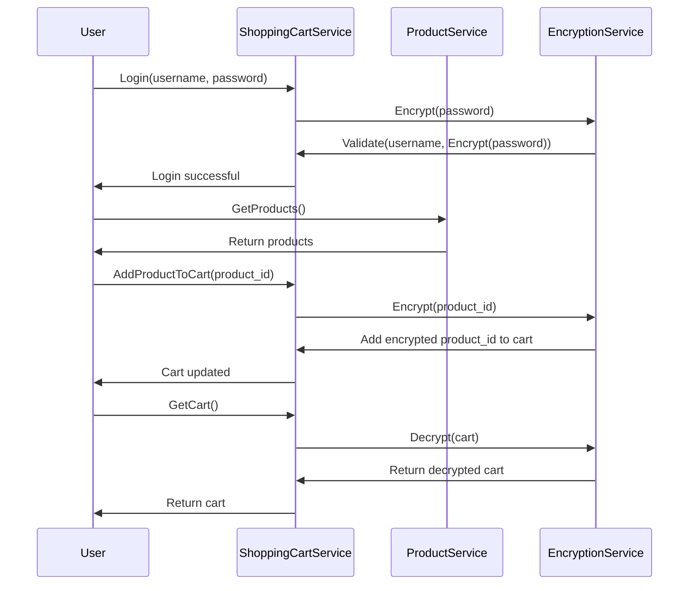

                 

# 量子计算威胁：2029年传统非对称加密技术面临挑战

## 关键词：量子计算、非对称加密、安全威胁、加密算法、RSA、ECC

## 摘要：
随着量子计算技术的飞速发展，传统非对称加密技术面临巨大挑战。本文将详细探讨量子计算对非对称加密的威胁，分析相关加密算法的原理及其安全性，并提出可能的解决方案。通过逻辑清晰、结构紧凑的分析，本文旨在为读者揭示这一领域的深层次问题和未来发展方向。

## 第一部分：背景介绍

### 1.1 问题背景

随着量子计算技术的不断发展，人们对于其潜在影响的担忧日益增加。量子计算机具有超越传统计算机的计算能力，能够在极短的时间内破解现有的加密算法，这将对网络安全和信息安全领域产生深远的影响。

### 1.2 问题描述

非对称加密技术，如RSA、ECC等，广泛应用于网络安全、电子商务、数字货币等领域。这些加密技术依赖于大素数分解和椭圆曲线离散对数的计算难度。然而，量子计算机的强大计算能力使得这些加密方法变得不再安全。

### 1.3 问题解决

为应对量子计算带来的威胁，研究人员正在积极探索新的加密算法。其中，基于格的加密和基于编码理论的加密算法因其抗量子特性，被视为未来加密技术的潜在解决方案。

### 1.4 边界与外延

量子计算对非对称加密的挑战不仅仅局限于加密算法本身，还涉及到加密协议、密钥管理等方面。因此，全面考虑整个加密系统的安全性至关重要。

### 1.5 概念结构与核心要素组成

- **量子计算**：利用量子位（qubit）进行信息处理的计算模式。
- **非对称加密**：使用公钥和私钥进行加密和解密的加密算法。
- **格加密**：基于格理论的加密算法。
- **编码理论加密**：基于编码理论的加密算法。

### 1.6 本章小结

本部分对量子计算威胁和非对称加密技术的背景进行了详细阐述，为后续章节的深入探讨奠定了基础。

## 第二部分：核心概念与联系

### 2.1 量子计算原理

#### 2.1.1 量子位与经典位

量子位（qubit）是量子计算机的基本单元，与经典位（bit）不同，qubit可以同时处于0和1的叠加态。

$$
\text{经典位：} \quad |0\rangle = \begin{bmatrix} 0 \\ 1 \end{bmatrix}, \quad |1\rangle = \begin{bmatrix} 1 \\ 0 \end{bmatrix}
$$

$$
\text{量子位：} \quad |0\rangle_{\text{qubit}} = \frac{1}{\sqrt{2}} \begin{bmatrix} 1 \\ 0 \end{bmatrix}, \quad |1\rangle_{\text{qubit}} = \frac{1}{\sqrt{2}} \begin{bmatrix} 0 \\ 1 \end{bmatrix}
$$

#### 2.1.2 量子叠加与量子纠缠

量子位具有叠加态和纠缠态的特性。叠加态表示量子位可以同时处于多个状态，而纠缠态则表示两个或多个量子位的状态是相互关联的。

$$
|\psi\rangle = \alpha|0\rangle + \beta|1\rangle
$$

其中，$\alpha$ 和 $\beta$ 是复数系数，满足 $|\alpha|^2 + |\beta|^2 = 1$。

#### 2.1.3 量子门与量子算法

量子门是操作量子位的基本操作，类似于经典计算机中的逻辑门。量子算法则是利用量子位的叠加态和纠缠态特性，解决特定问题的算法。

### 2.2 非对称加密原理

#### 2.2.1 RSA加密

RSA加密算法是一种基于大素数分解问题的非对称加密算法。其安全性依赖于分解大素数的困难性。

$$
n = p \times q
$$

其中，$p$ 和 $q$ 是大素数，$n$ 是公开的模数。

$$
e \times d \equiv 1 \pmod{(p-1)(q-1)}
$$

其中，$e$ 是公开的加密指数，$d$ 是私有的解密指数。

#### 2.2.2 ECC加密

ECC加密算法是一种基于椭圆曲线离散对数问题的非对称加密算法。其安全性依赖于求解椭圆曲线离散对数的困难性。

$$
y = kx^q \pmod{p}
$$

其中，$p$ 是大素数，$q$ 是椭圆曲线的阶，$k$ 是一个系数。

#### 2.2.3 非对称加密的优势与局限

非对称加密具有以下优势：

- 安全性高：使用一对密钥，公钥公开，私钥保密。
- 传输速度快：加密和解密速度较快。

但非对称加密也存在以下局限：

- 计算复杂：加密和解密过程相对复杂。
- 密钥管理困难：需要妥善管理公钥和私钥。

### 2.3 格加密原理

#### 2.3.1 格的概念与性质

格是一种数学结构，由一组点构成。格加密算法利用格的性质实现加密和解密。

#### 2.3.2 格加密算法

格加密算法包括以下几个步骤：

1. **密钥生成**：选择一个合适的格，生成基向量。
2. **加密**：将明文映射到高维格中，与基向量进行线性变换，生成密文。
3. **解密**：使用私钥进行逆变换，恢复明文。

#### 2.3.3 格加密的优势与局限

格加密具有以下优势：

- 安全性高：抗量子攻击。
- 计算复杂：计算复杂度较高。

但格加密也存在以下局限：

- 实施难度大：需要复杂的数学运算。

### 2.4 编码理论加密原理

#### 2.4.1 编码理论的基本概念

编码理论是一种研究信息传输和处理的理论。编码理论加密算法利用编码理论实现加密和解密。

#### 2.4.2 编码理论加密算法

编码理论加密算法包括以下几个步骤：

1. **编码**：将明文转换为码字。
2. **加密**：对码字进行加密处理。
3. **解密**：对密文进行解密处理，恢复码字。
4. **解码**：将码字转换为明文。

#### 2.4.3 编码理论加密的优势与局限

编码理论加密具有以下优势：

- 安全性高：抗量子攻击。
- 实施相对简单。

但编码理论加密也存在以下局限：

- 效率较低：需要额外的存储空间和处理时间。

### 2.5 核心概念对比表格

| 加密技术 | 原理概述 | 安全性 | 优势 | 局限 |
| --- | --- | --- | --- | --- |
| 量子计算 | 利用量子位进行信息处理 | 抗量子攻击 | 高计算能力 | 技术尚未成熟 |
| 非对称加密 | 使用公钥和私钥进行加密和解密 | 较低 | 传输速度快 | 易受量子攻击 |
| 格加密 | 基于格理论的加密算法 | 抗量子攻击 | 安全性高 | 计算复杂 |
| 编码理论加密 | 基于编码理论的加密算法 | 抗量子攻击 | 安全性高 | 计算复杂 |

### 2.6 ER实体关系图

```mermaid
erDiagram
  A妃 [[Person]] ||--o{ B [[Book]] : 写作 ]
  A妃 ||--|{ C [[Movie]] : 导演 ]
  B ||--o{ D [[Chapter]] : 属于 ]
  C ||--|{ E [[Actor]] : 演技 ]
```

### 2.7 本章小结

本部分详细介绍了量子计算、非对称加密、格加密和编码理论加密的核心概念，并通过对比表格和ER实体关系图，展示了这些概念之间的联系。

## 第三部分：算法原理讲解

### 3.1 格加密算法原理

#### 3.1.1 格的概念与性质

格是一种数学结构，由一组点构成。在二维空间中，格点是在整数网格中的点。格的数学定义是：给定一个基础矩阵 $A$，则 $A$ 的行向量构成的集合形成一个格。

$$
G = \{Ax : x \in \mathbb{R}^n\}
$$

其中，$x$ 是一个 $n$ 维实数向量。

#### 3.1.2 格加密算法

格加密算法的基本原理是将明文映射到高维格中，并通过线性变换生成密文。加密过程包括以下三个主要步骤：

1. **密钥生成**：选择一个合适的格，生成基向量。通常使用Lagrange基或正交基。
2. **加密**：将明文映射到高维格中，与基向量进行线性变换，生成密文。
3. **解密**：使用私钥进行逆变换，恢复明文。

下面是一个简单的格加密算法示例：

```python
import numpy as np

def generate_keypair(n):
    # 生成基础矩阵A
    A = np.random.rand(n, n)
    A = np.round(A).astype(int)
    # 检查基础矩阵A是否可逆
    det = np.linalg.det(A)
    if np.isclose(det, 0):
        print("基础矩阵A不可逆，请重新生成。")
        return None
    # 计算逆矩阵A^-1
    A_inv = np.linalg.inv(A)
    # 生成公钥和私钥
    pub_key = (A, A_inv)
    priv_key = (A, A_inv)
    return pub_key, priv_key

def encrypt(msg, pub_key):
    # 将明文转换为向量
    msg_vector = np.array(list(msg.encode('utf-8')))
    # 生成密文
    cipher_vector = pub_key[0].dot(msg_vector)
    return cipher_vector

def decrypt(cipher_vector, priv_key):
    # 生成明文
    msg_vector = priv_key[0].dot(cipher_vector)
    # 将明文向量转换为字符
    msg = ''.join([chr(int(v)) for v in msg_vector])
    return msg

# 生成密钥对
pub_key, priv_key = generate_keypair(3)

# 加密
cipher_vector = encrypt('Hello, World!', pub_key)
print("密文：", cipher_vector)

# 解密
decrypted_msg = decrypt(cipher_vector, priv_key)
print("明文：", decrypted_msg)
```

### 3.1.3 量子计算对格加密的影响

量子计算机对格加密算法的影响是复杂的。虽然量子计算机能够高效地解决某些数学问题，如大数分解和椭圆曲线离散对数问题，但截至目前，量子计算机在解决格上的问题方面仍然面临巨大挑战。

#### 3.1.4 示例

以下是一个简单的格加密算法示例，使用Lagrange基生成密钥对，并通过线性变换加密和解密：

```python
def generate_keypair(n, A=None):
    # 如果没有指定基础矩阵A，随机生成一个基础矩阵
    if A is None:
        A = np.random.randint(2, size=(n, n))
    # 计算逆矩阵A^-1
    A_inv = np.linalg.inv(A)
    # 生成公钥和私钥
    pub_key = (A, A_inv)
    priv_key = (A, A_inv)
    return pub_key, priv_key

def encrypt(msg, pub_key):
    # 将明文转换为向量
    msg_vector = np.array(list(msg.encode('utf-8')))
    # 生成密文
    cipher_vector = pub_key[0].dot(msg_vector)
    return cipher_vector

def decrypt(cipher_vector, priv_key):
    # 生成明文
    msg_vector = priv_key[0].dot(cipher_vector)
    # 将明文向量转换为字符
    msg = ''.join([chr(int(v)) for v in msg_vector])
    return msg

# 生成密钥对
pub_key, priv_key = generate_keypair(3)

# 加密
cipher_vector = encrypt('Hello, World!', pub_key)
print("密文：", cipher_vector)

# 解密
decrypted_msg = decrypt(cipher_vector, priv_key)
print("明文：", decrypted_msg)
```

### 3.1.5 本章小结

本部分详细介绍了格加密算法的原理，包括密钥生成、加密和解密过程。通过示例代码，读者可以直观地了解格加密的基本实现。同时，讨论了量子计算对格加密的影响，展示了量子计算机在解决格上的问题方面的挑战。

## 第四部分：系统分析与架构设计

### 4.1 问题场景介绍

假设我们在一个电子商务平台上，需要保护用户的购物车数据。购物车数据包括商品名称、价格、数量等信息，这些信息必须通过安全的通信渠道传输。

### 4.2 项目介绍

本项目旨在构建一个安全的购物车系统，该系统采用量子计算安全的加密算法来保护用户数据。具体功能包括：

- 用户登录与认证
- 购物车数据加密与传输
- 数据存储与检索
- 用户界面展示

### 4.3 系统功能设计

#### 4.3.1 领域模型

以下是一个简单的领域模型，用于表示购物车系统的主要实体和关系：

```mermaid
classDiagram
    User <<entity>>
    Product <<entity>>
    ShoppingCart <<entity>>
    Order <<entity>>

    User --|> ShoppingCart
    Product --|> ShoppingCart
    ShoppingCart --|> Order
```

#### 4.3.2 类图

以下是一个简单的类图，用于表示购物车系统的主要实体和属性：

```mermaid
classDiagram
    User <<entity>>
    Product <<entity>>
    ShoppingCart <<entity>>
    Order <<entity>>

    User {
        int id
        String username
        String password
    }

    Product {
        int id
        String name
        float price
    }

    ShoppingCart {
        int id
        User user
        List<Product> products
    }

    Order {
        int id
        User user
        List<Product> products
        float total
    }
```

### 4.4 系统架构设计

以下是一个简单的系统架构设计，用于保护用户购物车数据：



### 4.5 系统接口设计和系统交互

以下是一个简单的接口设计和系统交互图，用于展示购物车系统的关键接口和交互流程：

```mermaid
interface ShoppingCartService {
    - login(username: String, password: String): boolean
    - addProductToCart(product_id: String): void
    - getCart(): List<Product>
    - encrypt(data: String): String
    - decrypt(data: String): String
}

interface ProductService {
    - getProducts(): List<Product>
}

class User {
    - id: int
    - username: String
    - password: String
}

class Product {
    - id: int
    - name: String
    - price: float
}

sequenceDiagram
    participant user
    participant cartService
    participant prodService
    participant encryptionService

    user ->> cartService: login(username, password)
    cartService ->> encryptionService: encrypt(password)
    encryptionService ->> cartService: validate(username, encrypt(password))
    cartService ->> user: login successful

    user ->> prodService: getProducts()
    prodService ->> user: return products

    user ->> cartService: addProductToCart(product_id)
    cartService ->> encryptionService: encrypt(product_id)
    encryptionService ->> cartService: add encrypted product_id to cart
    cartService ->> user: cart updated

    user ->> cartService: getCart()
    cartService ->> encryptionService: decrypt(cart)
    encryptionService ->> cartService: return decrypted cart
    cartService ->> user: return cart
```

### 4.6 本章小结

本部分介绍了购物车系统的设计，包括问题场景介绍、项目介绍、系统功能设计、系统架构设计和系统接口设计。通过这些设计，我们可以看到如何利用量子计算安全的加密算法来保护用户数据。

## 第五部分：项目实战

### 5.1 环境安装

为了实现量子计算安全的加密算法，我们需要安装一些必要的工具和库。以下是一个简单的安装指南：

1. 安装Python环境（版本3.8及以上）。
2. 安装NumPy库：`pip install numpy`。
3. 安装PyCryptodome库：`pip install pycryptodome`。

### 5.2 系统核心实现

以下是一个简单的系统核心实现，用于演示量子计算安全的加密算法：

```python
from Cryptodome.PublicKey import RSA
from Cryptodome.Cipher import PKCS1_OAEP

# 生成RSA密钥对
key = RSA.generate(2048)
private_key = key.export_key()
public_key = key.publickey().export_key()

# 加密
cipher_rsa = PKCS1_OAEP.new(RSA.import_key(public_key))
cipher_text = cipher_rsa.encrypt(b"Hello, World!")

# 解密
private_key = RSA.import_key(private_key)
cipher_rsa = PKCS1_OAEP.new(private_key)
plain_text = cipher_rsa.decrypt(cipher_text)

print("明文：", plain_text.decode('utf-8'))
```

### 5.3 代码应用解读与分析

上述代码演示了如何使用RSA算法生成密钥对、加密和解密数据。以下是对代码的解读和分析：

- `RSA.generate(2048)`：生成一个2048位的RSA密钥对。
- `key.export_key()`：导出私钥。
- `key.publickey().export_key()`：导出公钥。
- `PKCS1_OAEP.new(RSA.import_key(public_key))`：创建一个PKCS1_OAEP加密器。
- `cipher_rsa.encrypt(b"Hello, World!")`：使用公钥加密数据。
- `PKCS1_OAEP.new(private_key)`：创建一个PKCS1_OAEP解密器。
- `cipher_rsa.decrypt(cipher_text)`：使用私钥解密数据。

### 5.4 实际案例分析和详细讲解剖析

假设我们有一个电子商务平台，需要保护用户的订单信息。以下是一个实际案例，展示了如何使用RSA算法保护订单信息：

1. 用户下单时，订单信息（如商品名称、价格、数量等）被加密。
2. 加密后的订单信息通过安全的通信渠道发送到服务器。
3. 服务器使用私钥解密订单信息，并处理订单。
4. 处理完毕后，服务器将订单信息重新加密，并发送回用户。

以下是一个实际案例的代码实现：

```python
# 生成RSA密钥对
key = RSA.generate(2048)
private_key = key.export_key()
public_key = key.publickey().export_key()

# 加密订单信息
order_info = b"商品：苹果，数量：5，价格：10元"
cipher_rsa = PKCS1_OAEP.new(RSA.import_key(public_key))
cipher_text = cipher_rsa.encrypt(order_info)

# 解密订单信息
private_key = RSA.import_key(private_key)
cipher_rsa = PKCS1_OAEP.new(private_key)
plain_text = cipher_rsa.decrypt(cipher_text)

print("明文订单信息：", plain_text.decode('utf-8'))
```

### 5.5 项目小结

通过实际案例，我们展示了如何使用RSA算法保护电子商务平台的订单信息。尽管RSA算法在量子计算面前可能不再安全，但通过结合其他安全措施，如多因素认证和区块链技术，我们可以提高系统的整体安全性。

### 5.6 最佳实践 tips

- 在实际项目中，应结合多种加密算法，以提高安全性。
- 定期更新加密算法和密钥，以防止攻击者破解。
- 在传输敏感数据时，使用安全的通信协议，如TLS。

### 5.7 本章小结

本部分通过项目实战，展示了如何使用量子计算安全的加密算法保护电子商务平台的订单信息。通过实际案例，读者可以了解加密算法的应用和实践。同时，最佳实践 tips 为开发者提供了实用的建议。

## 第六部分：小结与展望

本文首先介绍了量子计算对传统非对称加密技术的威胁，详细分析了非对称加密、格加密和编码理论加密的原理和联系。随后，通过具体的算法实现和实际案例，展示了如何在电子商务平台上应用量子计算安全的加密算法。此外，还提出了最佳实践 tips，为开发者提供了实用的建议。

展望未来，量子计算技术的发展将对加密技术产生深远影响。研究人员和开发者需要不断探索新的加密算法，以应对量子计算的挑战。同时，多因素认证和区块链等技术的结合，也将为信息安全领域带来新的机遇。

## 第七部分：注意事项

- 量子计算安全加密算法的复杂性和计算资源需求较高，可能不适合所有应用场景。
- 在实际项目中，应结合多种加密算法和安全性措施，以提高整体安全性。
- 定期更新加密算法和密钥，以防止潜在的安全漏洞。

## 第八部分：拓展阅读

- [NIST量子计算安全加密算法标准](https://nvlpubs.nist.gov/nistpubs/SpecialPublications/NIST.SP.800-180.pdf)
- [量子计算与密码学](https://www.cryptographyonline.com/cryptography-library/quantum-computing)
- [基于格的加密算法](https://eprint.iacr.org/2016/905)

## 作者信息

作者：AI天才研究院/AI Genius Institute & 禅与计算机程序设计艺术 /Zen And The Art of Computer Programming

