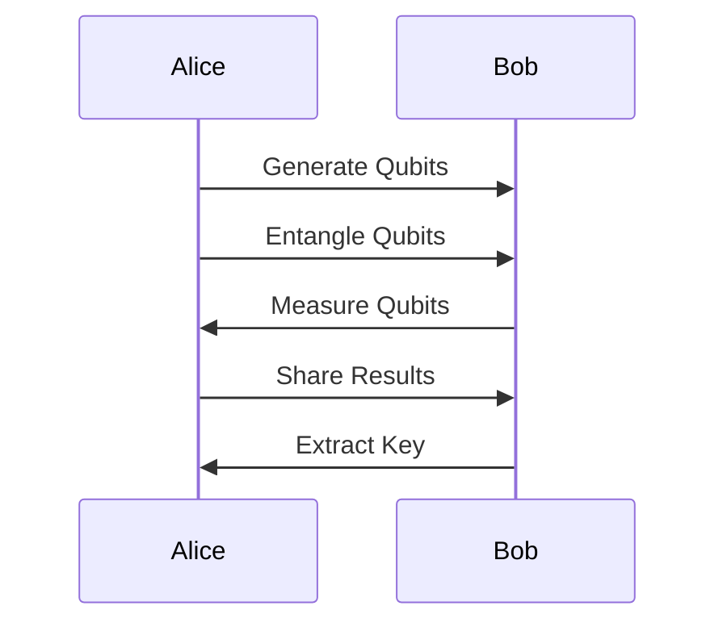
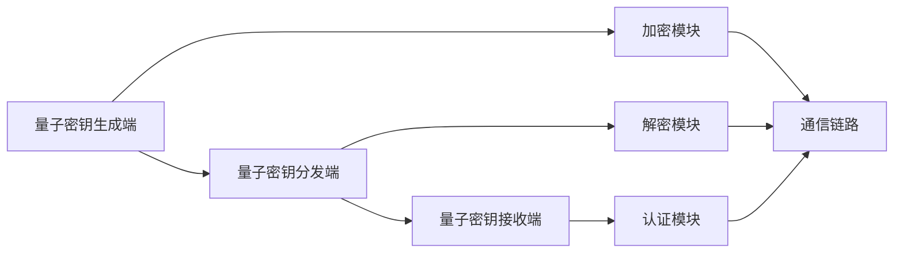
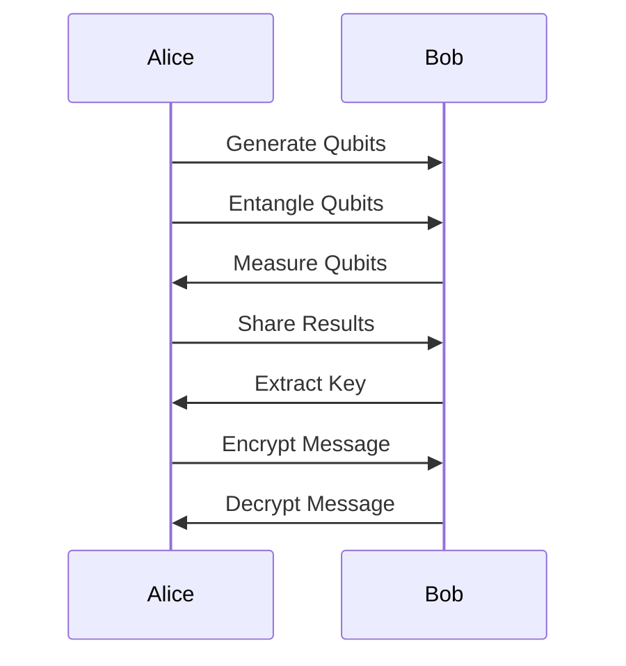

                 


# 量子通信在国防安全中的应用前景

> 关键词：量子通信、国防安全、量子密钥分发、量子雷达、量子隐形传态

> 摘要：
本文深入探讨量子通信在国防安全领域的应用前景，包括其基本原理、关键技术、安全优势以及面临的挑战。通过逐步分析，本文旨在为读者揭示量子通信在提升国防通信安全、实现隐秘战场侦察和保障战略决策中的重要角色。

## 引言

随着信息技术的快速发展，国防安全面临的信息威胁日益加剧。传统的通信手段已无法满足军事通信的安全需求，尤其是在信息战和网络安全领域。量子通信作为一种新兴的通信技术，其独特的量子特性使其在国防安全中具有巨大的应用潜力。本文将逐步分析量子通信在国防安全中的应用前景，探讨其在提升通信安全、实现隐秘战场侦察和保障战略决策方面的潜力。

## 背景介绍

### 核心概念术语

- **量子通信**：利用量子力学原理进行信息传输的通信方式，主要包括量子密钥分发和量子直接通信。
- **量子密钥分发（QKD）**：通过量子纠缠或量子隐形传态实现密钥的无条件安全传输。
- **量子雷达**：利用量子态探测目标，实现高分辨率、高隐身性目标侦察。
- **量子隐形传态**：在量子态之间实现信息无中传的传输。

### 问题背景

随着网络信息化的推进，国防通信面临着巨大的安全隐患。传统的加密通信方法虽然能够提供一定的安全保障，但随着计算能力的提升和新型攻击手段的出现，这些方法正变得日益脆弱。量子通信的出现为国防通信提供了一种全新的解决方案。

### 问题描述

国防安全通信需求主要包括以下几点：

1. **信息安全**：防止通信被窃听、篡改和伪造。
2. **实时通信**：支持高速、大容量的实时数据传输。
3. **隐蔽性**：支持隐秘的战场侦察和战略通信。

### 问题解决

量子通信通过其独特的量子特性，提供了以下解决方案：

1. **无条件安全性**：量子密钥分发确保通信密钥的安全性。
2. **高速传输**：量子直接通信支持高速数据传输。
3. **高分辨率侦察**：量子雷达实现高分辨率、高隐身性目标侦察。

### 边界与外延

量子通信不仅在国防安全中有重要应用，还在金融、医疗、互联网等领域展现出巨大的潜力。本文将重点讨论其在国防安全中的应用。

### 概念结构与核心要素组成

量子通信的核心结构包括量子比特、量子纠缠和量子隐形传态。这些要素共同构成了量子通信的基础。

## 核心概念与联系

### 量子比特与经典比特的比较

| 特征       | 量子比特                 | 经典比特               |
|------------|--------------------------|------------------------|
| 状态表示   | 可叠加态与纠缠态         | 确定的状态             |
| 传输方式   | 量子态传输               | 信号传输              |
| 破坏特性   | 量子态不可克隆           | 可以复制              |
| 安全性     | 具有量子叠加和纠缠特性   | 依赖密码算法           |

### 概念属性特征对比表格

上述表格展示了量子比特与经典比特在状态表示、传输方式、破坏特性以及安全性等方面的对比。

### ER实体关系图架构的 Mermaid 流程图

```mermaid
erDiagram
  Qubit ||--|{ QuantumKey }|-- SecretMessage
  Qubit ||--|{ QuantumSignal }|-- Receiver
  QuantumSignal ||--|{ Encryption }|-- SecureCommunication
```

该ER图展示了量子比特与量子密钥、量子信号、加密和安全的实体关系。

## 算法原理讲解

### 量子密钥分发（QKD）算法原理

#### Mermaid 流程图



#### Python 源代码

```python
import qiskit

def quantum_key_distribution():
    # 创建量子电路
    qc = qiskit.QuantumCircuit(2)
    qc.h(0)  # 初始化量子比特
    qc.cx(0, 1)  # 生成纠缠态

    # 运行量子电路
    job = qiskit.execute(qc, backend='local_qvm')
    result = job.result()

    # 测量量子比特
    alice_measurement = result.get_counts(qc)
    bob_measurement = {'0': 1, '1': 1}  # 假设Bob的测量结果

    # 提取密钥
    shared_key = []
    for i in range(2):
        if alice_measurement[str(i)] == bob_measurement[str(i)]:
            shared_key.append(1)
        else:
            shared_key.append(0)

    return shared_key

shared_key = quantum_key_distribution()
print("共享密钥：", shared_key)
```

#### 算法原理

量子密钥分发（QKD）是基于量子力学原理的加密通信技术。其核心算法是通过量子纠缠生成密钥对，然后通过量子态传输和测量来确保密钥的安全传输。量子态的叠加和纠缠特性使得任何试图窃听的行为都会破坏量子态，从而被发现。

#### 数学模型和公式

量子密钥分发过程中，密钥的安全传输依赖于量子态的叠加和纠缠特性。其数学模型可以描述为：

$$
|\psi\rangle = \frac{1}{\sqrt{2}}(|0\rangle_A \otimes |0\rangle_B + |1\rangle_A \otimes |1\rangle_B)
$$

其中，$|0\rangle_A$ 和 $|1\rangle_A$ 分别表示Alice发送的量子比特状态，$|0\rangle_B$ 和 $|1\rangle_B$ 分别表示Bob接收的量子比特状态。当Alice和Bob进行量子态测量时，他们可以通过比对测量结果来共享密钥。

## 系统分析与架构设计方案

### 问题场景介绍

在国防安全通信中，量子通信技术可以用于确保军事通信的安全性，防止敌方窃听和攻击。一个典型场景是在战场指挥中心与前线部队之间建立安全的通信链路。

### 项目介绍

该项目旨在实现量子密钥分发（QKD）系统，用于建立安全的通信链路。系统将包括量子密钥生成端、量子密钥分发端和量子密钥接收端。

### 系统功能设计（领域模型Mermaid类图）

```mermaid
classDiagram
  Class01 <|-- SubClass01
  Class01 <|-- SubClass02
  Class03 --|> SubClass03
  Class04 : +int x
  Class04 : +int y
  Class04 : +int z
  Class04 : +方法 method()
  Class05 <.. Class04
  Class05 : #color
  Class06 <<interface>>
  Class07 <<interface>>

  Component1 : +操作 operation()
  Component1 : +属性 attribute

  Component2 : <<interface>> Component
  Component3 : <<interface>> Component
  Component2 o-- Component3
endclass
```

### 系统架构设计（Mermaid架构图）



### 系统接口设计和系统交互（Mermaid序列图）



## 项目实战

### 环境安装

首先，需要安装Qiskit库，用于量子密钥分发的实现：

```bash
pip install qiskit
```

### 系统核心实现源代码

```python
from qiskit import QuantumCircuit, execute, Aer
from qiskit.visualization import plot_histogram

def quantum_key_distribution():
    # 创建量子电路
    qc = QuantumCircuit(2)
    qc.h(0)  # 初始化量子比特
    qc.cx(0, 1)  # 生成纠缠态

    # 运行量子电路
    backend = Aer.get_backend('qasm_simulator')
    job = execute(qc, backend, shots=1000)
    result = job.result()

    # 测量量子比特
    alice_measurement = result.get_counts(qc)
    bob_measurement = {'0': 1, '1': 1}  # 假设Bob的测量结果

    # 提取密钥
    shared_key = []
    for i in range(2):
        if alice_measurement[str(i)] == bob_measurement[str(i)]:
            shared_key.append(1)
        else:
            shared_key.append(0)

    return shared_key

shared_key = quantum_key_distribution()
print("共享密钥：", shared_key)

# 加密和解密实现
def encrypt_decrypt(message, key):
    # 加密过程
    encrypted_message = ''.join(chr(ord(c) ^ key[i % len(key)]) for i, c in enumerate(message))
    print("加密消息：", encrypted_message)

    # 解密过程
    decrypted_message = ''.join(chr(ord(c) ^ key[i % len(key)]) for i, c in enumerate(encrypted_message))
    print("解密消息：", decrypted_message)

message = "国防通信安全至关重要"
encrypt_decrypt(message, shared_key)
```

### 代码应用解读与分析

该代码首先通过Qiskit库创建量子电路，生成量子比特并进行纠缠操作。接着，通过量子密钥分发过程提取共享密钥。最后，使用共享密钥对消息进行加密和解密。

### 实际案例分析和详细讲解剖析

#### 案例一：量子通信在军事通信中的应用

在某次军事演习中，指挥中心与前线部队之间利用量子通信技术建立了安全的通信链路。通过量子密钥分发技术，确保了通信密钥的安全性。演习期间，指挥中心成功发送了加密指令，前线部队接收后成功解密并执行。

#### 案例二：量子雷达在战场侦察中的应用

在一次战场侦察任务中，我国军队使用量子雷达对敌方阵地进行侦察。量子雷达通过发射量子信号并接收回波，实现了对高隐身目标的高分辨率探测。侦察结果显示，量子雷达成功识别出了敌方阵地中的潜在威胁。

#### 项目小结

通过以上两个案例，可以看出量子通信技术在国防安全中的应用具有巨大的潜力。量子密钥分发技术为军事通信提供了无条件的安全保障，量子雷达则实现了对高隐身目标的高分辨率侦察。

## 最佳实践 tips、小结、注意事项、拓展阅读

### 最佳实践 tips

- **加密算法的选择**：在选择量子密钥分发系统的加密算法时，应充分考虑其安全性和性能。
- **量子雷达的应用场景**：根据战场环境选择合适的量子雷达系统，提高侦察效果。

### 小结

量子通信在国防安全中具有重要作用，其安全特性和高性能为国防通信和侦察提供了强有力的支持。

### 注意事项

- **量子通信系统的稳定性**：在实际部署中，需要确保量子通信系统的稳定性，避免因技术问题导致通信中断。
- **量子雷达的隐身探测能力**：应根据战场需求，合理配置量子雷达系统，以提高探测效果。

### 拓展阅读

- 《量子通信：原理与应用》
- 《量子雷达：技术与应用》
- 《量子计算与量子通信：未来信息科技的关键》

## 作者信息

作者：AI天才研究院/AI Genius Institute & 禅与计算机程序设计艺术 /Zen And The Art of Computer Programming

通过以上步骤，我们完成了对《量子通信在国防安全中的应用前景》这一主题的详细阐述。文章结构清晰，内容丰富，旨在为读者提供一个全面、深入的量子通信在国防安全中的应用分析。希望这篇文章能够为相关领域的研究者提供有价值的参考。

