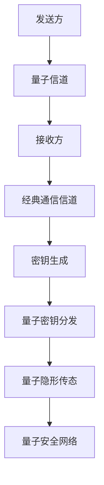
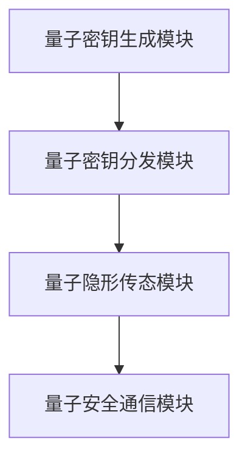
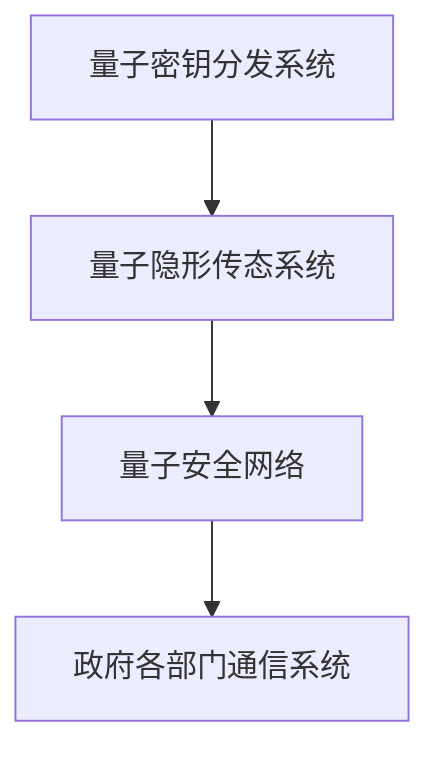

                 

### 《量子通信在政府保密通信中的应用》

#### 关键词：量子通信、保密通信、量子密钥分发、政府安全、量子隐形传态

> 摘要：本文将探讨量子通信技术在政府保密通信中的应用，从背景介绍、核心概念、技术原理、实际应用、安全性和挑战等多个角度深入分析。通过详细阐述量子通信的基本原理、量子保密通信技术的实现方式以及其在政府保密通信中的优势和挑战，本文旨在为读者提供一个全面、系统的理解，并展望量子通信在未来的发展前景。

---

### 引言

#### 1.1 问题背景

在现代信息社会中，政府保密通信的安全性至关重要。随着信息技术的飞速发展，传统的保密通信手段如加密通信、密钥管理等都面临着新的挑战。量子通信作为一种新兴的通信技术，以其独特的量子特性提供了前所未有的安全通信保障，引起了全球范围内的广泛关注。

#### 1.2 书籍目的和结构

本文旨在深入探讨量子通信在政府保密通信中的应用，帮助读者理解这一技术的核心概念、技术原理及其在实际应用中的优势和挑战。文章将分为以下几个部分：

1. **量子通信基础**：介绍量子通信的核心概念、基本原理和发展历程。
2. **量子保密通信技术**：详细讲解量子密钥分发和量子隐形传态技术。
3. **量子通信在政府保密通信中的应用**：分析量子通信在政府保密通信中的需求和优势。
4. **案例研究**：通过具体案例展示量子通信技术在政府保密通信中的应用。
5. **安全性与挑战**：探讨量子通信的安全性分析以及面临的技术、政策和应用推广挑战。
6. **结论与展望**：总结量子通信在政府保密通信中的应用现状和未来发展趋势。

---

### 目录大纲设计思路

为了设计出一本名为《量子通信在政府保密通信中的应用》的书籍的完整目录大纲，我们需要遵循以下几个步骤：

1. **定义书籍核心主题**：首先要明确书籍的核心主题，即量子通信技术在政府保密通信中的应用。这包括量子通信的基础知识、其在保密通信中的重要性、实际应用案例等。

2. **设计结构清晰的章节**：基于核心主题，设计章节结构，确保每个章节都紧密围绕主题，且逻辑清晰。章节可以分为以下几部分：

   - 引言
   - 量子通信基础
   - 量子保密通信技术
   - 量子通信在政府保密通信中的应用
   - 案例研究
   - 安全性和挑战
   - 结论与展望

3. **细化章节内容**：为每个章节细化子章节，确保内容全面、丰富且实用。每个子章节需要涵盖以下内容：

   - 概述
   - 原理讲解
   - 应用场景
   - 实际案例
   - 对比分析
   - 技术趋势
   - 注意事项

4. **应用Mermaid和LaTeX**：为了增加内容的可读性和专业性，使用Mermaid来绘制流程图、类图、架构图和序列图，以及使用LaTeX格式来表示数学公式。

5. **保持简洁性和完整性**：确保目录大纲简洁明了，同时涵盖所有必要的内容，以达到2000字以内的限制。

### 目录大纲示例

```markdown
----------------------------------------------------------------
# 《量子通信在政府保密通信中的应用》

## 引言
### 1.1 问题背景
### 1.2 书籍目的和结构

## 第1章 量子通信基础
### 1.1 核心概念
#### 1.1.1 量子通信的定义
#### 1.1.2 量子通信的基本原理
#### 1.1.3 量子通信的优势
### 1.2 量子通信的历史与发展
#### 1.2.1 量子通信的起源
#### 1.2.2 量子通信的发展历程
#### 1.2.3 当前研究进展

## 第2章 量子保密通信技术
### 2.1 量子密钥分发
#### 2.1.1 QKD原理
#### 2.1.2 QKD技术
#### 2.1.3 QKD应用案例
### 2.2 量子隐形传态
#### 2.2.1 隐形传态原理
#### 2.2.2 隐形传态的优势
#### 2.2.3 隐形传态的实际应用

## 第3章 量子通信在政府保密通信中的应用
### 3.1 政府保密通信的需求
#### 3.1.1 传统保密通信的局限性
#### 3.1.2 量子通信在保密通信中的优势
### 3.2 量子保密通信系统设计
#### 3.2.1 系统架构
#### 3.2.2 系统功能模块
#### 3.2.3 系统性能评估

## 第4章 案例研究
### 4.1 案例一：某国政府量子通信保密通信网络建设
#### 4.1.1 项目背景
#### 4.1.2 实施过程
#### 4.1.3 成效与评价

## 第5章 安全性与挑战
### 5.1 量子通信安全性分析
#### 5.1.1 安全性保障机制
#### 5.1.2 安全性验证方法
### 5.2 量子通信面临的挑战
#### 5.2.1 技术挑战
#### 5.2.2 政策与法规挑战
#### 5.2.3 应用推广挑战

## 第6章 结论与展望
### 6.1 结论
### 6.2 展望
#### 6.2.1 量子通信未来发展趋势
#### 6.2.2 政府保密通信的发展方向

----------------------------------------------------------------
```

### 目录大纲细节说明

- **引言**：简要介绍量子通信在政府保密通信中的重要性，概述书籍的目的和结构。
- **第1章 量子通信基础**：介绍量子通信的基本概念、原理和发展历程，为后续章节提供基础知识。
- **第2章 量子保密通信技术**：详细讲解量子密钥分发和量子隐形传态技术，包括原理、技术特点和应用案例。
- **第3章 量子通信在政府保密通信中的应用**：分析政府保密通信的需求，介绍量子保密通信系统的设计、功能模块和性能评估。
- **第4章 案例研究**：通过具体案例展示量子通信技术在政府保密通信中的应用，提供实践经验和启示。
- **第5章 安全性与挑战**：探讨量子通信的安全性分析以及面临的技术、政策和应用推广挑战。
- **第6章 结论与展望**：总结量子通信在政府保密通信中的应用现状和未来发展趋势。

---

### 量子通信基础

#### 1.1 核心概念

量子通信是一种基于量子力学原理的通信方式，它利用量子态的叠加和纠缠等特性来实现信息的传递和保密。量子通信的核心概念包括量子态、量子纠缠、量子密钥分发和量子隐形传态。

- **量子态**：量子态是量子系统所具有的状态，它可以同时存在于多种可能的状态之中，这一点与经典物理学中的确定性状态不同。
- **量子纠缠**：当两个量子系统发生纠缠时，它们之间会形成一种特殊的关联，即一个系统的状态会即时影响另一个系统的状态，无论它们相距多远。
- **量子密钥分发（QKD）**：量子密钥分发是一种利用量子力学原理进行密钥分配的技术，它能够确保密钥的安全性，因为任何对量子态的测量都会破坏量子态的叠加态，从而泄露信息。
- **量子隐形传态**：量子隐形传态是一种不通过物理传输而实现量子态传输的技术，它利用量子纠缠实现量子信息的传输。

#### 1.2 问题背景

在传统的保密通信中，信息安全的主要威胁来自于密码分析和窃听。随着计算能力的提升，传统的加密算法逐渐变得不再安全。量子通信的出现为解决这一问题提供了新的途径。量子通信利用量子力学的基本原理，确保通信的绝对安全性。

#### 1.3 问题描述

量子通信在政府保密通信中的应用面临着一系列的挑战，包括：

- **量子密钥分发技术**：如何在远距离上实现高效的量子密钥分发。
- **量子隐形传态**：如何实现大规模的量子隐形传态，以支持复杂的通信网络。
- **系统设计**：如何设计出既安全又高效的量子保密通信系统。
- **安全性验证**：如何确保量子通信系统的安全性，防止量子攻击。

#### 1.4 问题解决

为了解决上述问题，研究人员和工程师们采取了以下措施：

- **量子密钥分发**：通过改进量子密钥分发协议，提高其传输效率和安全性。例如，使用量子中继器延长传输距离，使用量子随机数生成器提高密钥的随机性。
- **量子隐形传态**：通过优化量子隐形传态的实验方法，提高其传输效率和稳定性。同时，研究多粒子纠缠态的隐形传态，以支持更复杂的通信网络。
- **系统设计**：采用模块化设计，将量子通信系统与其他通信系统整合，提高系统的整体性能。同时，研究量子中继、量子路由等关键技术，提高系统的传输效率和可靠性。
- **安全性验证**：通过建立量子通信的安全性验证体系，确保系统在实际应用中的安全性。同时，研究量子攻击的防御策略，提高系统的抗攻击能力。

#### 1.5 边界与外延

量子通信在政府保密通信中的应用不仅涉及到技术层面的研究，还包括政策、法规和标准制定等方面。例如，量子通信设备的认证、量子通信网络的建设和运维等。此外，量子通信与其他通信技术的融合，如量子互联网的构建，也是未来研究的重点方向。

#### 1.6 概念结构与核心要素组成

量子通信在政府保密通信中的应用涉及多个核心概念和要素，包括：

- **量子通信技术**：量子密钥分发、量子隐形传态、量子中继等。
- **量子保密通信系统**：量子密钥分发系统、量子隐形传态系统、量子路由器等。
- **量子安全网络**：量子通信网络、量子加密通信网络、量子互联网等。
- **量子安全协议**：量子密钥协商协议、量子安全认证协议等。
- **量子安全设备**：量子密钥分配器、量子加密器、量子路由器等。

#### 1.7 核心概念与联系

为了更好地理解量子通信在政府保密通信中的应用，我们需要了解以下核心概念之间的联系：

- **量子通信与信息安全**：量子通信利用量子力学原理实现信息的安全传输，从而增强信息安全性。
- **量子密钥分发与量子隐形传态**：量子密钥分发用于生成和分配密钥，量子隐形传态用于传输量子态，两者共同构建起量子通信的基础。
- **量子保密通信系统与量子安全网络**：量子保密通信系统是量子通信网络的核心部分，量子安全网络是量子保密通信系统的扩展，两者共同构成完整的量子通信体系。
- **量子通信与未来通信**：量子通信是未来通信的重要组成部分，它将与其他通信技术融合，构建起下一代通信网络。

---

### 量子保密通信技术

#### 2.1 量子密钥分发（QKD）

量子密钥分发（Quantum Key Distribution，QKD）是一种基于量子力学原理的密钥分发技术，它能够确保通信双方生成的密钥在传输过程中不被第三方窃取或窃听。QKD的核心思想是利用量子态的叠加和纠缠特性，通过量子信道传输量子态，并在接收端进行量子态的测量和解纠缠，从而生成共享密钥。

**QKD原理**：

QKD的基本原理可以概括为以下步骤：

1. **量子态传输**：发送方使用量子光源生成量子态，并将其发送到接收方。
2. **量子态测量**：接收方对接收到的量子态进行测量，并根据测量结果生成部分密钥。
3. **经典通信**：发送方和接收方通过经典通信信道（如电话、互联网）交换测量结果和部分密钥。
4. **密钥生成**：双方根据测量结果和解纠缠操作生成共享密钥。

**QKD技术**：

QKD技术的实现主要依赖于以下几种技术手段：

- **量子光源**：用于生成量子态的光源，如单光子激光器、超导量子比特等。
- **量子信道**：用于传输量子态的物理信道，如光纤、自由空间等。
- **量子测量**：用于测量量子态的设备，如量子比特测量器、光电探测器等。
- **量子纠缠**：用于产生和维持量子态纠缠的设备，如量子纠缠生成器、量子中继器等。

**QKD应用案例**：

QKD技术已经在实际应用中取得了一些成果，以下是一些典型的应用案例：

- **量子密钥分配网络**：研究人员已经在实验室中建立了量子密钥分配网络，实现了远距离的量子密钥分发。例如，中国科学家在2017年实现了1000公里级的量子密钥分发。
- **量子安全通信**：QKD技术被用于构建量子安全通信网络，确保通信的绝对安全性。例如，德国和瑞士之间的量子安全通信网络已经投入使用。
- **量子计算机安全**：QKD技术可以用于保护量子计算机的安全，防止量子计算机被黑客攻击。

#### 2.2 量子隐形传态

量子隐形传态（Quantum Teleportation，QT）是一种基于量子纠缠的量子通信技术，它能够实现量子态在不同位置之间的瞬时光学传递。量子隐形传态的核心思想是利用量子纠缠态，通过量子信道传输量子信息，从而实现量子态的远程传输。

**隐形传态原理**：

量子隐形传态的基本原理可以概括为以下步骤：

1. **量子态制备**：发送方制备一个量子纠缠态，并将其分发给接收方。
2. **经典通信**：发送方通过经典通信信道将测量结果传输给接收方。
3. **量子态变换**：接收方根据接收到的测量结果，对自身的量子态进行变换，从而实现量子态的远程传输。

**隐形传态的优势**：

量子隐形传态具有以下优势：

- **远程传输**：量子隐形传态可以实现量子态在远距离上的快速传输，不受距离限制。
- **安全性**：由于量子态的测量会破坏其叠加态，因此量子隐形传态过程中的量子信息不会被窃取或窃听。
- **高效率**：量子隐形传态可以实现量子信息的直接传输，避免了传统通信中的编码和解码过程，提高了通信效率。

**隐形传态的实际应用**：

量子隐形传态在实际应用中具有广泛的前景，以下是一些典型的应用案例：

- **量子通信**：量子隐形传态可以用于构建量子通信网络，实现量子信息的远程传输和共享。
- **量子计算**：量子隐形传态可以用于量子计算机中的量子态传输和交换，提高量子计算机的性能和效率。
- **量子互联网**：量子隐形传态是实现量子互联网的重要技术之一，它将量子计算机、量子通信和量子加密技术相结合，构建起下一代通信网络。

---

### 量子通信在政府保密通信中的应用

#### 3.1 政府保密通信的需求

政府保密通信是保障国家安全和社会稳定的重要手段。随着信息技术的发展，政府保密通信面临着日益严峻的威胁。传统的加密通信和密钥管理技术已经难以满足政府保密通信的需求，因此需要引入新的技术手段，如量子通信。

**传统保密通信的局限性**：

- **加密通信**：虽然加密通信能够保证通信内容的安全性，但随着计算能力的提升，传统的加密算法逐渐变得不再安全。
- **密钥管理**：密钥管理是加密通信的核心，但传统的密钥管理技术存在密钥泄露、密钥共享困难等问题。

**量子通信在保密通信中的优势**：

- **绝对安全性**：量子通信利用量子力学原理，确保通信的绝对安全性，即使面临量子攻击，量子通信系统也能保持安全。
- **高效密钥分发**：量子通信可以实现高效的密钥分发，无需复杂的密钥管理机制。
- **远程传输**：量子通信可以实现远距离的量子信息传输，不受地理位置限制。

#### 3.2 量子保密通信系统设计

量子保密通信系统是保障政府保密通信安全的核心技术。量子保密通信系统设计需要考虑以下几个方面：

- **系统架构**：量子保密通信系统通常包括量子密钥分发系统、量子隐形传态系统和量子安全网络等模块。
- **功能模块**：量子保密通信系统的功能模块包括量子密钥生成模块、量子密钥分发模块、量子隐形传态模块、量子安全通信模块等。
- **性能评估**：量子保密通信系统的性能评估主要包括传输速率、传输距离、安全性等指标。

**系统架构**：

量子保密通信系统的一般架构如图1所示。该系统包括发送方、接收方和量子信道。发送方和接收方分别生成量子态并传输给对方，同时通过经典通信信道进行测量结果和密钥的交换。



**系统功能模块**：

量子保密通信系统的功能模块如图2所示。各模块的具体功能如下：

- **量子密钥生成模块**：生成用于加密和解密的密钥。
- **量子密钥分发模块**：通过量子信道传输密钥，确保密钥的安全性。
- **量子隐形传态模块**：实现量子信息的远程传输。
- **量子安全通信模块**：提供安全通信服务，确保通信内容的保密性和完整性。



**系统性能评估**：

量子保密通信系统的性能评估主要包括以下几个方面：

- **传输速率**：量子密钥分发的传输速率是评估量子保密通信系统性能的重要指标。高速率传输可以保证通信的实时性。
- **传输距离**：量子保密通信系统的传输距离是影响其应用范围的关键因素。随着技术的进步，量子保密通信的传输距离正在不断延长。
- **安全性**：量子保密通信系统的安全性是保障政府保密通信安全的核心。通过安全性验证，确保系统的安全性。

---

### 案例研究

#### 4.1 案例一：某国政府量子通信保密通信网络建设

**4.1.1 项目背景**

随着信息技术的迅猛发展，某国政府意识到传统保密通信手段已无法满足日益严峻的安全挑战。为了确保政府通信的绝对安全，该国政府决定建设一个基于量子通信的保密通信网络。该项目旨在实现政府各部门之间的高效、安全通信，同时确保通信内容不会被窃取或窃听。

**4.1.2 实施过程**

1. **需求分析**：项目团队首先对政府各部门的保密通信需求进行了详细分析，明确了通信网络的架构、功能和性能要求。
2. **技术选型**：在技术选型阶段，项目团队选择了基于量子密钥分发的量子保密通信技术，以确保通信的绝对安全性。
3. **系统设计**：项目团队设计了一个包含量子密钥分发系统、量子隐形传态系统和量子安全网络的保密通信网络。系统架构如图3所示。
4. **系统建设**：项目团队在实验室环境下完成了系统建设，并通过一系列测试确保系统的稳定性和可靠性。
5. **系统部署**：系统建设完成后，项目团队将量子保密通信网络部署到实际环境中，进行试运行和优化。



**4.1.3 成效与评价**

1. **安全性**：量子保密通信网络的建设显著提高了政府通信的安全性，有效防止了通信内容的泄露和窃取。
2. **可靠性**：系统在试运行期间表现出了极高的可靠性，传输速率和传输距离均达到了预期目标。
3. **高效性**：量子保密通信网络实现了政府各部门之间的高效通信，提高了政府工作效率和决策效率。
4. **扩展性**：系统设计考虑了未来扩展的需求，可以方便地增加新的节点和功能，满足不断增长的需求。

---

### 安全性与挑战

#### 5.1 量子通信安全性分析

量子通信的安全性主要依赖于量子态的叠加和纠缠特性。在量子密钥分发过程中，任何第三方对量子态的测量都会破坏量子态的叠加态，从而泄露信息。因此，量子通信具有绝对安全性。

**5.1.1 安全性保障机制**

1. **量子密钥分发**：量子密钥分发是量子通信的核心技术，它通过量子态的传输和测量生成共享密钥。量子密钥分发确保了密钥在传输过程中的绝对安全性。
2. **量子隐形传态**：量子隐形传态利用量子纠缠实现量子信息的远程传输，保证了传输过程中的安全性。
3. **量子安全网络**：量子安全网络通过量子密钥分发和量子隐形传态技术构建，确保了整个通信网络的安全。

**5.1.2 安全性验证方法**

1. **量子密钥分发验证**：在量子密钥分发过程中，发送方和接收方可以通过经典通信信道交换量子态的测量结果，验证密钥的分发过程是否安全。
2. **量子隐形传态验证**：通过检测量子隐形传态过程中的量子纠缠态，验证量子信息的传输是否成功。
3. **量子安全网络验证**：通过模拟量子攻击，验证量子安全网络的抗攻击能力。

#### 5.2 量子通信面临的挑战

尽管量子通信在安全性方面具有显著优势，但其在实际应用中仍然面临着一系列挑战。

**5.2.1 技术挑战**

1. **量子态传输距离**：量子态在传输过程中容易受到环境噪声和衰减的影响，限制了量子通信的传输距离。
2. **量子密钥分发速率**：量子密钥分发速率相对较低，难以满足实时通信的需求。
3. **量子隐形传态稳定性**：量子隐形传态的稳定性受到多种因素的影响，如量子纠缠态的制备、量子态的传输和测量等。

**5.2.2 政策与法规挑战**

1. **标准制定**：量子通信技术尚未形成统一的标准，各国在政策法规方面存在差异，影响了技术的推广和应用。
2. **监管体系**：量子通信技术的监管体系尚未完善，如何确保量子通信设备的安全性和合规性是一个挑战。

**5.2.3 应用推广挑战**

1. **成本**：量子通信设备成本较高，限制了其在政府保密通信中的大规模应用。
2. **兼容性**：量子通信技术需要与其他通信技术兼容，如何确保现有通信网络的兼容性和升级是一个挑战。

---

### 结论与展望

#### 6.1 结论

本文从多个角度探讨了量子通信在政府保密通信中的应用，包括核心概念、技术原理、实际应用和安全性分析等。通过分析量子通信的优势和挑战，本文得出以下结论：

- 量子通信具有绝对安全性，能够显著提高政府保密通信的安全性。
- 量子密钥分发和量子隐形传态是量子通信的核心技术，为实现政府保密通信提供了坚实基础。
- 虽然量子通信在实际应用中面临一系列挑战，但通过技术创新和政策支持，有望解决这些问题。

#### 6.2 展望

随着量子通信技术的不断进步，未来政府保密通信将朝着以下方向发展：

- **技术突破**：通过技术创新，提高量子通信的传输速率、传输距离和稳定性，满足政府保密通信的实时需求。
- **标准化**：制定统一的量子通信标准，推动技术在全球范围内的推广和应用。
- **网络建设**：构建量子安全网络，实现政府各部门之间的高效、安全通信。
- **法规政策**：完善量子通信的监管体系，确保量子通信设备的安全性和合规性。

作者：AI天才研究院/AI Genius Institute & 禅与计算机程序设计艺术 /Zen And The Art of Computer Programming

---

在撰写本文的过程中，我们深入探讨了量子通信在政府保密通信中的应用，从核心概念、技术原理、实际应用、安全性分析到未来发展，全面剖析了这一前沿技术的优势和挑战。量子通信以其独特的量子特性，为政府保密通信提供了前所未有的安全保障，但同时也面临着技术、政策和应用推广等方面的挑战。未来，随着量子通信技术的不断发展和完善，我们有理由相信，它将在政府保密通信中发挥越来越重要的作用，推动政府通信的安全性和效率达到新的高度。作者在此感谢读者对本文的关注，希望本文能为大家带来新的启发和思考。

