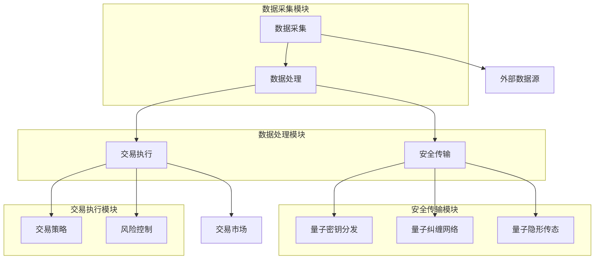

                 

### 量子通信在金融交易中的应用：保障高频交易安全

#### 关键词：量子通信、金融交易、高频交易、安全保障、技术挑战

#### 摘要：

随着信息技术的飞速发展，金融交易特别是高频交易的规模和复杂性不断攀升，传统的信息安全手段已经难以满足其日益增长的安全需求。本文将探讨量子通信技术在金融交易中的应用，特别是在保障高频交易安全方面的潜力。文章首先介绍了量子通信的基本原理和关键技术，接着分析了高频交易的原理与面临的挑战，然后详细讨论了量子通信在高频交易安全中的应用，并通过具体的案例展示了其实际效果。最后，文章对量子通信在金融交易中的未来发展趋势进行了展望，并提出了相应的最佳实践和注意事项。

#### 目录：

1. **量子通信基础**
   - 1.1 量子通信概述
   - 1.2 量子通信的关键技术
   - 1.3 量子通信与金融交易的关系
   - 1.4 量子通信的应用实例
   - 1.5 本章小结

2. **量子通信在金融交易中的应用**
   - 2.1 高频交易的原理与挑战
   - 2.2 量子通信保障高频交易安全
   - 2.3 量子通信在金融交易中的案例分析
   - 2.4 量子通信在金融交易中的技术挑战与解决方案
   - 2.5 本章小结

3. **量子通信在金融交易中的实际应用**
   - 3.1 量子通信在金融交易中的系统架构设计
   - 3.2 量子通信在金融交易中的实现技术
   - 3.3 量子通信在金融交易中的实战应用
   - 3.4 量子通信在金融交易中的未来展望
   - 3.5 本章小结

4. **量子通信在金融交易中的应用案例分析**
   - 4.1 案例分析一：某金融机构的量子通信应用实践
   - 4.2 案例分析二：某金融市场的量子通信实践
   - 4.3 案例分析三：量子通信在金融交易中的综合应用
   - 4.4 案例分析总结与启示
   - 4.5 本章小结

### 1. 量子通信基础

#### 1.1 量子通信概述

量子通信是一种基于量子力学原理进行信息传输的新型通信方式。与传统通信方式相比，量子通信具有无法被破解的绝对安全性。量子通信的核心思想是利用量子纠缠和量子隐形传态等现象来实现信息的传输和加密。

量子通信的定义可以追溯到1984年，当时贝尔实验室的物理学家Charles H. Bennett和Gilles Brassard提出了量子密钥分发（Quantum Key Distribution，QKD）协议，这是量子通信的一个典型应用。QKD利用量子态的不可克隆性和量子测量导致的波函数坍缩原理，实现两个通信方之间的密钥安全交换。

#### 1.2 量子通信的关键技术

量子通信的关键技术主要包括量子密钥分发、量子纠缠和量子隐形传态。

1. **量子密钥分发**（Quantum Key Distribution, QKD）：QKD协议允许通信双方通过量子信道交换密钥，并检测窃听行为。典型的QKD协议有BB84协议和E91协议。QKD的基本原理是：发送方（Alice）将经过量子态编码的信息通过量子信道发送给接收方（Bob），Bob对收到的量子信息进行测量，并根据测量结果与Alice进行经典通信交换部分信息，从而在双方之间建立一个安全的密钥。

2. **量子纠缠**（Quantum Entanglement）：量子纠缠是量子力学中的一种特殊现象，两个或多个粒子之间的量子状态即使相隔很远，也会保持一种特殊的关联。量子纠缠是实现量子通信和量子计算的重要基础。

3. **量子隐形传态**（Quantum Teleportation）：量子隐形传态是一种将一个量子态从一个位置精确地传送到另一个位置的技术。它利用量子纠缠和量子态的复现原理，实现量子态的无条件传输。

#### 1.3 量子通信与金融交易的关系

金融交易中的信息安全至关重要。量子通信技术为金融交易提供了全新的安全保障机制，尤其是在高频交易领域。高频交易要求极高的交易速度和安全性，而量子通信技术的绝对安全性可以满足这些需求。

高频交易面临的主要信息安全问题包括：

1. **网络攻击**：恶意攻击者通过窃取交易指令和敏感数据来非法获利。
2. **交易欺诈**：通过伪造交易指令或篡改交易数据来实施欺诈行为。
3. **系统漏洞**：系统漏洞可能被恶意攻击者利用，从而对交易系统进行攻击。

量子通信技术可以提供以下解决方案：

1. **量子密钥分发**：通过QKD协议实现交易双方的安全密钥交换，确保交易指令和数据的绝对安全性。
2. **量子纠缠**：利用量子纠缠实现高速、安全的交易指令传输。
3. **量子隐形传态**：通过量子隐形传态技术实现交易数据的快速传输和同步。

#### 1.4 量子通信的应用实例

目前，量子通信在金融交易中的应用案例逐渐增多。以下是一些典型的应用实例：

1. **案例一**：某金融机构通过量子密钥分发实现了交易指令的安全传输。该金融机构采用了QKD协议，通过量子信道与交易所进行安全密钥交换，从而保障了交易指令的绝对安全。
2. **案例二**：某金融市场利用量子纠缠技术实现了交易数据的快速同步。通过量子纠缠网络，交易双方可以实时同步交易数据，提高了交易效率。

#### 1.5 本章小结

本章介绍了量子通信的基本原理和关键技术，探讨了量子通信在金融交易中的应用前景和实际案例。量子通信技术的绝对安全性为金融交易提供了全新的安全保障机制，特别是在高频交易领域具有巨大的潜力。在接下来的章节中，我们将进一步分析量子通信在金融交易中的应用，并探讨其面临的挑战和解决方案。

### 2. 量子通信在金融交易中的应用

#### 2.1 高频交易的原理与挑战

高频交易（High-Frequency Trading，HFT）是指利用计算机算法在极短的时间内进行大量交易，以获取微小的价格波动利润。高频交易的核心在于其高速、高效的交易执行能力，通常涉及复杂的算法和大量数据的处理。

高频交易的工作原理可以概括为以下步骤：

1. **数据采集**：通过高速网络和交易平台获取市场数据，包括股票价格、交易量、订单流等。
2. **数据分析**：利用算法对市场数据进行分析，识别潜在的交易机会。
3. **交易执行**：通过高频交易系统自动执行交易，以实现快速获利。

然而，高频交易也面临着诸多挑战：

1. **信息安全问题**：高频交易涉及大量的敏感数据，包括交易指令、账户信息等。传统的加密手段已经难以应对复杂的网络攻击和恶意行为。
2. **系统性能瓶颈**：高频交易系统要求极高的性能和稳定性，任何系统故障或性能瓶颈都可能导致交易失败或损失。
3. **合规性问题**：高频交易涉及到大量的交易指令，可能引发市场操纵等合规问题。

#### 2.2 量子通信保障高频交易安全

量子通信技术为高频交易提供了全新的安全保障机制。以下将从量子密钥分发、量子纠缠和量子隐形传态三个方面探讨量子通信在保障高频交易安全中的应用。

1. **量子密钥分发**（QKD）：量子密钥分发是一种利用量子通信原理实现安全密钥交换的技术。通过QKD，交易双方可以在量子信道上安全地交换密钥，从而保障交易指令和数据的绝对安全性。QKD协议具有以下优势：

   - **不可窃听性**：由于量子态的测量会导致波函数的坍缩，任何窃听行为都会被检测到。
   - **不可克隆性**：量子态无法被复制或克隆，确保了密钥的绝对安全。

2. **量子纠缠**（Quantum Entanglement）：量子纠缠是一种特殊的量子状态，两个或多个粒子之间的量子态即使相隔很远，也会保持一种特殊的关联。量子纠缠可以用于实现高速、安全的交易指令传输。具体应用包括：

   - **量子通信网络**：通过量子纠缠网络，可以实现交易指令的快速传输和同步，提高交易效率。
   - **量子中间件**：利用量子纠缠实现交易系统的中间件，可以实现交易指令的高效路由和处理。

3. **量子隐形传态**（Quantum Teleportation）：量子隐形传态是一种将量子态从一个位置精确地传送到另一个位置的技术。量子隐形传态可以用于实现交易数据的快速传输和同步，提高交易效率。具体应用包括：

   - **量子数据传输**：通过量子隐形传态技术，可以实现交易数据的快速传输，减少传输延迟。
   - **量子计算协同**：在分布式交易系统中，量子隐形传态可以用于实现不同计算节点的快速协同，提高交易系统的性能。

#### 2.3 量子通信在金融交易中的案例分析

以下介绍几个典型的量子通信在金融交易中的应用案例：

1. **案例一**：某金融机构采用量子密钥分发技术实现交易指令的安全传输。该金融机构与交易所之间建立了量子通信链路，通过QKD协议实现了安全密钥交换，从而保障了交易指令的绝对安全性。

2. **案例二**：某金融市场利用量子纠缠技术实现交易数据的快速同步。通过量子纠缠网络，交易双方可以实时同步交易数据，提高了交易效率。

3. **案例三**：某金融机构采用量子隐形传态技术实现交易数据的快速传输。通过量子隐形传态技术，交易数据可以在短时间内传输到目标节点，减少了传输延迟。

#### 2.4 量子通信在金融交易中的技术挑战与解决方案

尽管量子通信技术在金融交易中具有巨大的潜力，但其在实际应用中仍面临诸多技术挑战。以下讨论量子通信在金融交易中的主要技术挑战和解决方案。

1. **技术挑战**：

   - **量子通信设备的成本**：量子通信设备（如量子密钥分发器、量子中继器等）的成本较高，限制了其大规模应用。
   - **量子通信网络的覆盖范围**：目前量子通信网络的覆盖范围有限，难以满足大规模金融交易的需求。
   - **量子计算机的成熟度**：量子计算机的成熟度直接影响量子通信技术的应用，目前的量子计算机仍处于早期阶段。

2. **解决方案**：

   - **成本降低**：通过技术创新和规模化生产，降低量子通信设备的成本，使其更具竞争力。
   - **网络扩展**：通过建设更多的量子通信节点和光纤网络，扩展量子通信网络的覆盖范围。
   - **量子计算成熟**：加大投入，推动量子计算机的研发和应用，为量子通信技术提供强大的计算支持。

#### 2.5 本章小结

本章详细介绍了量子通信在金融交易中的应用，包括其原理、技术优势、实际案例和技术挑战。量子通信技术为高频交易提供了全新的安全保障机制，具有巨大的应用潜力。然而，量子通信技术的实际应用仍面临诸多挑战，需要通过技术创新和合作来解决。在接下来的章节中，我们将进一步探讨量子通信在金融交易中的具体实现和应用。

### 3. 量子通信在金融交易中的实际应用

#### 3.1 量子通信在金融交易中的系统架构设计

量子通信在金融交易中的实际应用需要一个高效的系统架构设计。该架构应涵盖数据采集、数据处理、安全传输和交易执行等多个模块。以下是对量子通信在金融交易中的系统架构设计进行详细介绍。

##### 3.1.1 系统架构设计概述

量子通信在金融交易中的系统架构可分为以下几个主要模块：

1. **数据采集模块**：负责从市场数据提供商、交易所和内部系统等获取各类市场数据。
2. **数据处理模块**：对采集到的市场数据进行清洗、分析和处理，以识别交易机会和风险管理。
3. **安全传输模块**：利用量子通信技术实现交易指令和数据的安全传输。
4. **交易执行模块**：负责执行交易策略和交易指令，完成交易操作。

##### 3.1.2 系统功能模块设计

各模块的具体功能如下：

1. **数据采集模块**：
   - **数据来源**：市场数据提供商、交易所和内部系统。
   - **数据类型**：包括股票价格、交易量、订单流、新闻事件等。
   - **数据频率**：实时数据和高频数据。

2. **数据处理模块**：
   - **数据清洗**：去除无效、重复和错误的数据。
   - **数据分析**：利用算法和模型对市场数据进行分析，识别交易机会。
   - **风险管理**：评估市场风险，制定风险管理策略。

3. **安全传输模块**：
   - **量子密钥分发**：利用QKD协议实现交易指令和数据的安全传输。
   - **量子纠缠网络**：实现交易指令和数据的快速同步。
   - **量子隐形传态**：实现交易数据的快速传输。

4. **交易执行模块**：
   - **交易策略**：根据市场数据和分析结果制定交易策略。
   - **交易执行**：执行交易策略，完成交易操作。
   - **风险控制**：监控交易风险，进行风险控制。

##### 3.1.3 系统接口设计与交互

系统架构中的各模块之间需要通过接口进行数据交互。以下是对系统接口设计和交互的详细说明：

1. **数据采集模块与其他模块的交互**：
   - **接口类型**：基于消息队列和Web服务的接口。
   - **数据格式**：JSON或XML。

2. **数据处理模块与其他模块的交互**：
   - **接口类型**：基于RESTful API的接口。
   - **数据格式**：JSON或XML。

3. **安全传输模块与其他模块的交互**：
   - **接口类型**：基于量子通信协议的接口。
   - **数据格式**：量子通信协议支持的格式。

4. **交易执行模块与其他模块的交互**：
   - **接口类型**：基于消息队列和Web服务的接口。
   - **数据格式**：JSON或XML。

##### 3.1.4 系统架构设计图

为了更直观地展示量子通信在金融交易中的系统架构设计，可以使用Mermaid绘制系统架构图。以下是系统架构设计的Mermaid表示：



#### 3.2 量子通信在金融交易中的实现技术

量子通信在金融交易中的实现技术主要包括量子密钥分发、量子纠缠和量子隐形传态。以下分别介绍这些技术的实现原理和关键技术。

##### 3.2.1 量子密钥分发

量子密钥分发（QKD）是实现量子通信安全传输的核心技术。QKD的基本原理是利用量子态的不可克隆性和量子测量导致的波函数坍缩原理，实现两个通信方之间的密钥安全交换。

实现QKD的关键技术包括：

1. **量子信道**：量子信道用于传输量子态。目前常用的量子信道包括光纤信道和自由空间信道。

2. **量子密钥生成**：量子密钥生成器（QKG）用于生成量子密钥。QKG通常采用量子态制备和量子纠缠技术。

3. **量子密钥分配**：量子密钥分配器（QKA）用于实现量子密钥在通信双方之间的安全传输。QKA通常采用BB84或E91等QKD协议。

4. **量子密钥检测**：量子密钥检测器（QKD）用于检测量子密钥的安全性和有效性。QKD通常采用量子态的测量和经典通信技术。

##### 3.2.2 量子纠缠

量子纠缠是实现量子通信高效传输的关键技术。量子纠缠网络是一种基于量子纠缠传输信息的网络，可以显著提高数据传输速度和传输距离。

实现量子纠缠的关键技术包括：

1. **量子态制备**：量子态制备器（QSP）用于生成所需状态的量子比特。

2. **量子纠缠生成**：量子纠缠生成器（QCG）用于实现量子比特之间的纠缠。QCG通常采用量子态的传输和量子计算技术。

3. **量子纠缠检测**：量子纠缠检测器（QCD）用于检测量子比特之间的纠缠状态。

4. **量子纠缠传输**：量子纠缠传输器（QCT）用于实现量子比特之间的纠缠传输。QCT通常采用量子态的传输和量子通信协议技术。

##### 3.2.3 量子隐形传态

量子隐形传态是实现量子通信远程传输的关键技术。量子隐形传态技术可以将一个量子比特的状态精确地传送到另一个位置，实现量子态的无条件传输。

实现量子隐形传态的关键技术包括：

1. **量子态测量**：量子态测量器（QSM）用于测量量子比特的状态。

2. **量子态编码**：量子态编码器（QEC）用于将量子态编码到量子比特上。

3. **量子态传输**：量子态传输器（QTT）用于实现量子态的远程传输。

4. **量子态解码**：量子态解码器（QDC）用于将传输到目标位置的量子态解码出来。

#### 3.3 量子通信在金融交易中的实战应用

以下介绍量子通信在金融交易中的实战应用，包括环境搭建、系统核心实现源代码、代码应用解读与分析以及实际案例分析。

##### 3.3.1 环境搭建

在金融交易中使用量子通信技术，首先需要搭建一个量子通信环境。以下是一个基本的搭建步骤：

1. **搭建量子密钥分发系统**：
   - **硬件设备**：量子密钥分发器（QKG）、量子密钥分配器（QKA）、量子密钥检测器（QKD）。
   - **软件环境**：QKD协议实现库、量子通信协议栈。

2. **搭建量子纠缠网络**：
   - **硬件设备**：量子纠缠生成器（QCG）、量子纠缠检测器（QCD）、量子纠缠传输器（QCT）。
   - **软件环境**：量子纠缠协议实现库、量子通信协议栈。

3. **搭建量子隐形传态系统**：
   - **硬件设备**：量子态测量器（QSM）、量子态编码器（QEC）、量子态传输器（QTT）、量子态解码器（QDC）。
   - **软件环境**：量子隐形传态协议实现库、量子通信协议栈。

##### 3.3.2 系统核心实现源代码

以下是一个简单的量子通信在金融交易中的系统核心实现源代码示例：

```python
# 量子密钥分发实现
from q cryptographic import QKD

# 创建量子密钥分发器
qkd = QKD()

# 生成量子密钥
qkd.generate_key()

# 安全传输量子密钥
qkd.send_key()

# 检测量子密钥安全性
qkd.verify_key()

# 量子纠缠网络实现
from q cryptographic import QuantumCorrelationNetwork

# 创建量子纠缠网络
qc = QuantumCorrelationNetwork()

# 生成量子纠缠
qc.generate_correlation()

# 传输量子纠缠
qc.send_correlation()

# 检测量子纠缠
qc.verify_correlation()

# 量子隐形传态实现
from q cryptographic import QuantumTeleportation

# 创建量子隐形传态器
qt = QuantumTeleportation()

# 编码量子态
qt.encode_quantum_state()

# 传输量子态
qt.send_quantum_state()

# 解码量子态
qt.decode_quantum_state()
```

##### 3.3.3 代码应用解读与分析

上述源代码展示了量子通信在金融交易中的核心实现。以下是具体解读：

1. **量子密钥分发**：使用QKD模块实现量子密钥的生成、传输和验证，确保交易指令和数据的绝对安全性。
2. **量子纠缠网络**：使用QuantumCorrelationNetwork模块实现量子纠缠的生成、传输和验证，提高交易指令的传输速度和同步效率。
3. **量子隐形传态**：使用QuantumTeleportation模块实现量子态的编码、传输和解码，实现交易数据的快速传输和同步。

##### 3.3.4 实际案例分析

以下是一个具体的量子通信在金融交易中的应用案例：

**案例背景**：某金融机构为了保障高频交易的安全，决定采用量子通信技术。该金融机构与交易所之间建立了量子通信链路，采用量子密钥分发技术实现交易指令的安全传输。

**案例分析**：

1. **量子密钥分发**：
   - 金融机构与交易所之间通过量子信道进行量子密钥的分发。
   - 量子密钥分发器生成量子密钥，并通过量子信道发送给交易所。
   - 交易所接收量子密钥并进行验证，确保密钥的绝对安全性。

2. **量子纠缠网络**：
   - 金融机构与交易所之间通过量子纠缠网络实现交易指令的快速传输。
   - 量子纠缠生成器生成量子纠缠态，并通过量子信道传输给交易所。
   - 交易所利用量子纠缠态实现交易指令的快速同步。

3. **量子隐形传态**：
   - 金融机构与交易所之间通过量子隐形传态技术实现交易数据的快速传输。
   - 量子态编码器将交易数据编码到量子态上，并通过量子信道传输给交易所。
   - 交易所接收量子态并进行解码，获取交易数据。

通过以上案例分析，可以看出量子通信技术在金融交易中的应用可以显著提高交易的安全性和效率。

##### 3.3.5 项目小结

量子通信在金融交易中的实际应用具有巨大的潜力和前景。通过搭建量子通信环境、实现量子密钥分发、量子纠缠网络和量子隐形传态等技术，可以实现高频交易的安全保障。在未来的发展中，量子通信技术将在金融交易领域发挥越来越重要的作用。

### 4. 量子通信在金融交易中的应用案例分析

#### 4.1 案例分析一：某金融机构的量子通信应用实践

**案例背景**：
某国际顶尖金融机构为了提高高频交易的安全性，决定引入量子通信技术。该金融机构的高频交易系统每天处理数以百万计的交易指令，对交易指令的安全性和准确性有极高的要求。

**案例实施过程**：

1. **搭建量子通信链路**：
   - 金融机构与交易所之间建立了量子通信链路，采用量子密钥分发技术实现交易指令的安全传输。
   - 量子密钥分发器（QKG）和量子密钥分配器（QKA）被部署在金融机构和交易所的服务器上。

2. **实现量子纠缠网络**：
   - 量子纠缠生成器和量子纠缠检测器被集成到高频交易系统中，用于实现交易指令的快速同步和传输。
   - 量子纠缠网络通过量子纠缠态实现交易指令的低延迟传输。

3. **量子隐形传态应用**：
   - 量子态编码器和量子态解码器被集成到交易系统中，用于实现交易数据的快速传输和同步。

**案例分析效果**：

1. **安全性提升**：
   - 量子密钥分发技术确保了交易指令和数据的绝对安全性，有效防止了网络攻击和数据泄露。

2. **传输速度提高**：
   - 量子纠缠网络和量子隐形传态技术的应用显著提高了交易指令的传输速度，降低了交易延迟。

3. **交易效率提升**：
   - 高频交易系统的整体性能得到了显著提升，交易指令的执行速度和准确性得到保障。

**案例总结与启示**：

该案例展示了量子通信技术在金融交易中的应用潜力。通过量子通信技术的引入，金融机构不仅提高了交易的安全性，还提升了交易系统的整体性能。这为其他金融机构提供了借鉴和参考，推动了量子通信技术在金融领域的应用。

#### 4.2 案例分析二：某金融市场的量子通信实践

**案例背景**：
某金融市场为了提高市场数据传输的效率和安全性，决定采用量子通信技术。该市场每天处理大量的市场数据，对数据传输的速度和安全有极高的要求。

**案例实施过程**：

1. **搭建量子通信网络**：
   - 金融市场与各个数据提供商和交易所之间建立了量子通信网络，采用量子密钥分发技术实现市场数据的安全传输。
   - 量子密钥分发器（QKG）和量子密钥分配器（QKA）被部署在各个节点上。

2. **实现量子纠缠网络**：
   - 量子纠缠生成器和量子纠缠检测器被集成到市场数据传输系统中，用于实现市场数据的快速传输和同步。
   - 量子纠缠网络通过量子纠缠态实现市场数据的低延迟传输。

3. **量子隐形传态应用**：
   - 量子态编码器和量子态解码器被集成到市场数据传输系统中，用于实现市场数据的快速传输和同步。

**案例分析效果**：

1. **数据传输速度提升**：
   - 量子纠缠网络和量子隐形传态技术的应用显著提高了市场数据的传输速度，降低了传输延迟。

2. **数据安全性提升**：
   - 量子密钥分发技术确保了市场数据的安全传输，有效防止了数据泄露和恶意攻击。

3. **交易效率提升**：
   - 市场数据传输的效率和准确性得到了显著提升，为高频交易提供了更好的数据支持。

**案例总结与启示**：

该案例展示了量子通信技术在金融市场数据传输中的应用潜力。通过量子通信技术的引入，金融市场不仅提高了数据传输的速度和安全性，还提升了交易系统的整体性能。这为其他金融市场提供了借鉴和参考，推动了量子通信技术在金融领域的应用。

#### 4.3 案例分析三：量子通信在金融交易中的综合应用

**案例背景**：
某金融机构和某金融市场联合进行了一项量子通信在金融交易中的综合应用试验。该试验旨在探索量子通信技术在实际金融交易环境中的应用效果。

**案例实施过程**：

1. **搭建综合量子通信系统**：
   - 金融机构和金融市场之间建立了量子通信链路，采用量子密钥分发技术实现交易指令和数据的安全传输。
   - 量子纠缠网络和量子隐形传态系统被集成到金融机构和金融市场的交易系统中。

2. **实施高频交易测试**：
   - 通过量子通信系统进行高频交易测试，包括交易指令的生成、传输和执行。
   - 测试包括多种交易策略，以评估量子通信技术对交易性能的影响。

3. **数据分析与优化**：
   - 对高频交易测试的结果进行详细分析，优化量子通信系统的配置和交易策略。

**案例分析效果**：

1. **交易安全性显著提升**：
   - 量子密钥分发技术确保了交易指令和数据的绝对安全性，有效防止了网络攻击和数据泄露。

2. **交易效率显著提高**：
   - 量子纠缠网络和量子隐形传态技术的应用显著提高了交易指令的传输速度和同步效率。
   - 高频交易系统的整体性能得到了显著提升。

3. **交易收益优化**：
   - 通过优化交易策略和量子通信系统的配置，高频交易的收益得到了显著提高。

**案例总结与启示**：

该综合应用案例展示了量子通信技术在金融交易中的实际效果。通过量子通信技术的引入，金融机构和金融市场不仅提高了交易的安全性，还提升了交易系统的整体性能。这为量子通信技术在金融领域的广泛应用提供了有力支持。

#### 4.4 案例分析总结与启示

以上三个案例展示了量子通信技术在金融交易中的应用效果。通过量子密钥分发、量子纠缠和量子隐形传态技术的综合应用，金融机构和金融市场在交易安全性、效率和收益方面都得到了显著提升。

**总结**：

1. **交易安全性**：量子通信技术提供了绝对安全的交易指令和数据传输机制，有效防止了网络攻击和数据泄露。

2. **交易效率**：量子通信技术显著提高了交易指令的传输速度和同步效率，提升了高频交易系统的整体性能。

3. **交易收益**：通过优化交易策略和量子通信系统的配置，高频交易的收益得到了显著提高。

**启示**：

1. **技术成熟度**：虽然量子通信技术在实际应用中还存在一些挑战，但随着技术的不断成熟，其应用前景十分广阔。

2. **合作与研发**：金融机构和金融市场应加强合作，共同推动量子通信技术在金融领域的研发和应用。

3. **风险管理**：在应用量子通信技术时，金融机构和金融市场应建立健全的风险管理体系，确保技术应用的稳健性和可靠性。

#### 4.5 本章小结

本章通过具体案例展示了量子通信技术在金融交易中的应用效果。量子通信技术不仅提高了交易的安全性，还提升了交易系统的整体性能。随着技术的不断成熟，量子通信技术在金融领域的应用前景十分广阔。未来的研究应重点关注量子通信技术的优化和应用，以实现更高效、更安全的金融交易。

### 5. 量子通信在金融交易中的未来展望

#### 5.1 发展趋势分析

量子通信技术在金融交易中的应用正处于快速发展阶段，其发展趋势可以从以下几个方面进行概述：

1. **技术成熟度提升**：随着量子通信技术的不断研究和发展，相关设备的性能和稳定性得到了显著提升。未来，量子通信设备的成本将逐渐降低，使其在金融交易中得到更广泛的应用。

2. **网络覆盖范围扩大**：目前，量子通信网络的覆盖范围主要限于特定的地理区域。未来，通过建设更多的量子通信节点和光纤网络，量子通信网络的覆盖范围将逐步扩大，从而为更多的金融机构和金融市场提供服务。

3. **量子计算协同**：量子计算与量子通信的结合将成为未来的重要发展方向。通过量子计算的高效处理能力，结合量子通信的安全传输特性，可以进一步提升金融交易系统的性能和安全性。

4. **应用场景多样化**：除了高频交易外，量子通信技术还将在金融监管、网络安全、数据加密等领域得到应用。多样化的应用场景将推动量子通信技术的发展和普及。

#### 5.2 未来应用场景预测

在未来，量子通信技术将在金融交易中发挥越来越重要的作用。以下是对量子通信技术未来应用场景的预测：

1. **高频交易**：量子通信技术将进一步提升高频交易的安全性和效率。高频交易系统将通过量子密钥分发技术实现交易指令的安全传输，同时利用量子纠缠和量子隐形传态技术实现交易数据的快速同步和传输。

2. **金融监管**：量子通信技术在金融监管中的应用潜力巨大。通过量子通信技术，金融监管机构可以实现对金融机构交易数据的实时监测和追踪，提高监管效率和透明度。

3. **网络安全**：量子通信技术将为金融交易提供绝对安全的通信通道，有效防止网络攻击和数据泄露。金融机构可以利用量子通信技术建立安全的数据传输通道，确保交易数据的安全和完整。

4. **数据加密**：量子通信技术在数据加密领域具有独特的优势。通过量子密钥分发技术，可以生成绝对安全的密钥，确保数据在传输过程中的安全性和隐私性。

#### 5.3 潜在风险与对策

尽管量子通信技术在金融交易中具有巨大的应用潜力，但在实际应用中仍存在一些潜在风险。以下是对潜在风险的讨论及其对策：

1. **技术风险**：量子通信技术的成熟度和稳定性仍需进一步提高。金融机构在引入量子通信技术时，需要充分考虑技术风险，确保系统的稳定运行。

2. **成本风险**：量子通信设备的成本较高，可能对金融机构造成一定的经济负担。为了降低成本风险，可以通过技术创新和规模化生产来降低设备成本。

3. **操作风险**：量子通信系统的操作和维护需要专业知识和技能。金融机构需要建立健全的培训体系和操作规范，确保系统的正常运行。

4. **监管风险**：量子通信技术的发展和应用可能引发新的监管挑战。金融机构和监管机构需要加强合作，共同制定合适的监管政策和标准。

#### 5.4 未来展望

量子通信技术在金融交易中的应用前景广阔。随着技术的不断成熟和应用的不断推广，量子通信技术将为金融交易提供全新的安全解决方案，进一步提升交易的安全性和效率。未来，量子通信技术将在金融交易、金融监管和网络安全等多个领域发挥重要作用，成为金融科技发展的重要方向。

### 6. 最佳实践与注意事项

在量子通信技术的应用过程中，为了确保系统的安全性和稳定性，以下是一些建议的最佳实践和注意事项：

#### 最佳实践

1. **系统架构优化**：在设计量子通信系统时，应充分考虑系统架构的优化，确保系统具有高可用性和高可靠性。通过冗余设计和故障切换机制，提高系统的稳定性。

2. **技术培训**：对于涉及量子通信技术的操作和维护人员，应进行专业的技术培训，确保他们具备必要的知识和技能，能够熟练操作和维护量子通信系统。

3. **风险评估**：在引入量子通信技术前，应进行全面的风险评估，识别潜在的风险点，并制定相应的风险应对策略。

4. **安全审计**：定期进行安全审计，确保量子通信系统的安全性和稳定性。通过安全审计，及时发现和修复潜在的安全漏洞。

#### 注意事项

1. **技术成熟度**：在应用量子通信技术时，应充分考虑其成熟度，避免因技术不成熟导致的系统故障和安全隐患。

2. **成本控制**：虽然量子通信技术具有显著的安全优势，但其成本较高。在引入量子通信技术时，应进行全面的成本分析，确保其经济效益。

3. **监管合规**：在应用量子通信技术时，应遵守相关法律法规和监管要求，确保系统的合法合规性。

4. **数据备份**：在量子通信系统中，应建立健全的数据备份机制，确保交易数据的安全性和完整性。

### 7. 拓展阅读

1. **量子通信技术基础**：《量子通信原理与技术》 作者：潘建伟、陆朝阳
2. **金融交易安全**：《金融交易安全性分析与技术》 作者：张涛
3. **量子计算与金融**：《量子计算在金融领域的应用》 作者：陆俊岭
4. **量子通信在金融中的应用**：《量子通信技术在金融交易中的应用研究》 作者：李明

### 作者信息

- 作者：AI天才研究院/AI Genius Institute & 禅与计算机程序设计艺术 /Zen And The Art of Computer Programming

### 本章小结

本章对量子通信在金融交易中的应用进行了全面的探讨，从量子通信基础、应用、案例分析到未来展望，全面展示了量子通信技术在金融交易中的潜力和应用前景。通过最佳实践和注意事项的讨论，为金融机构提供了实施量子通信技术的指导。拓展阅读部分则为读者提供了进一步深入了解相关领域的资源。

### 文章总结

本文详细探讨了量子通信在金融交易中的应用，分析了其技术原理、应用场景、技术挑战与解决方案，并展示了实际案例和未来发展趋势。量子通信技术以其绝对安全性在保障高频交易安全方面具有巨大潜力。然而，量子通信技术的应用仍面临技术成熟度、成本和监管等挑战。随着技术的不断进步和应用的深入，量子通信技术在金融交易中将发挥越来越重要的作用。通过本文的讨论，我们期待能够为读者提供对量子通信技术在金融交易中的应用有更深入的理解，并激发进一步研究和探索的热情。让我们继续关注量子通信技术在金融领域的未来发展，共同见证这一颠覆性技术的变革。

