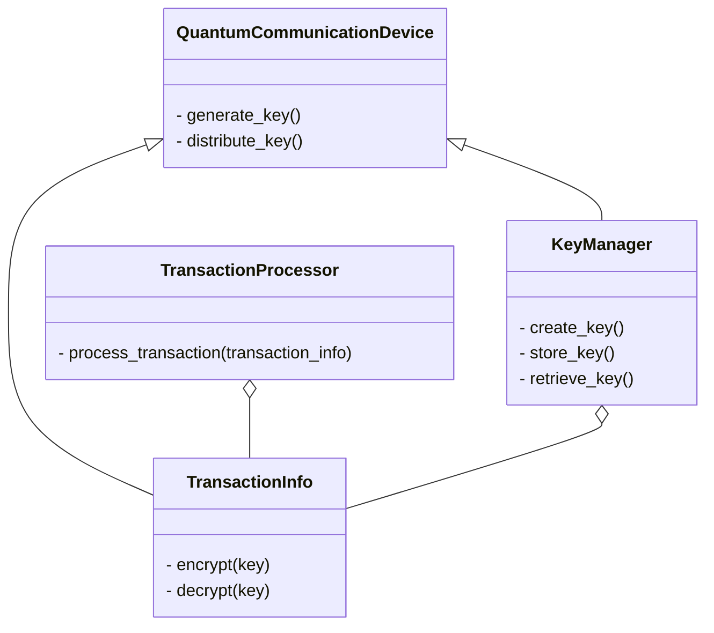
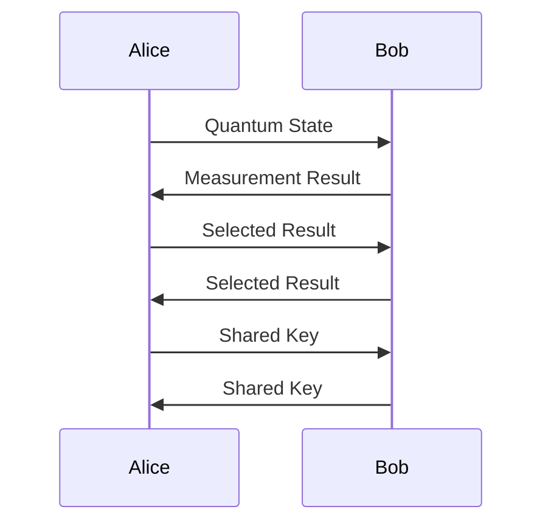
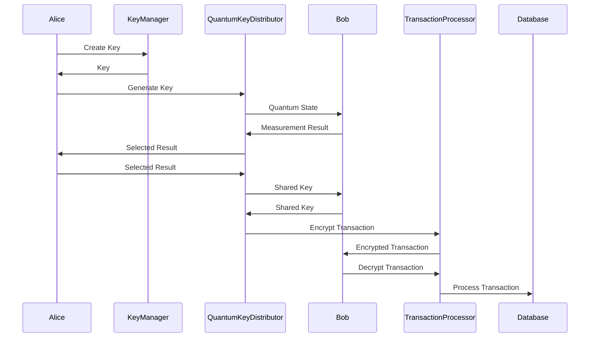

                 

# 量子通信在金融交易安全中的应用

## 关键词

- 量子通信
- 金融交易安全
- 量子密钥分发
- 量子纠缠验证
- 量子安全通信

## 摘要

随着金融交易的全球化与信息技术的发展，金融交易安全面临新的挑战。传统的加密技术已无法完全保证交易信息的保密性、完整性和可用性。量子通信以其绝对安全性在金融交易安全领域展现出了巨大的应用潜力。本文将详细介绍量子通信的基本原理、算法，以及在金融交易安全中的应用案例，探讨量子通信在提升金融交易安全性能方面的作用和挑战。

## 第一部分：引言

### 1.1 问题背景

金融交易的安全性问题一直是金融领域的关注焦点。传统加密技术如RSA、AES等，虽然在一定程度上保障了交易信息的安全，但随着计算能力的提升和量子计算机的发展，这些加密技术正面临被破解的风险。量子通信作为一种基于量子力学原理的通信技术，具有绝对安全性，其应用在金融交易安全中具有重要的研究价值和现实意义。

### 1.2 核心概念

#### 1.2.1 量子通信

量子通信是指利用量子态传递信息和利用量子纠缠等现象实现信息加密的技术。量子通信的核心概念包括量子态、量子纠缠和量子密钥分发等。

- **量子态**：量子态是量子系统的状态，描述了量子系统在某种条件下可能出现的各种状态。量子态具有叠加性和纠缠性。
- **量子纠缠**：量子纠缠是量子系统之间的一种特殊关联，即使它们相隔很远，一个量子系统的状态变化也会立即影响另一个量子系统的状态。
- **量子密钥分发**：量子密钥分发是一种基于量子力学原理的密钥分配技术，通过量子态的叠加性和纠缠性实现密钥的共享。

#### 1.2.2 金融交易安全

金融交易安全涉及交易信息的保密性、完整性和可用性。保密性确保交易信息不被未授权方获取；完整性确保交易信息在传输过程中不被篡改；可用性确保交易信息在需要时能够被正确获取和使用。

### 1.3 概念联系

量子通信技术通过量子密钥分发实现加密通信，确保交易信息的保密性。同时，量子纠缠效应可用于实现交易数据的完整性验证，提高交易安全性能。量子通信在金融交易安全中的应用，使得交易信息在传输过程中具备了绝对安全性。

### 1.4 边界与外延

量子通信在金融交易安全中的应用主要涉及以下几个方面：

- **量子通信设备的部署**：包括量子通信网络的建设和量子通信终端的部署。
- **量子密钥分发协议的实现**：如何高效、可靠地实现量子密钥分发，是量子通信在金融交易安全中的关键问题。
- **量子安全通信的普及**：如何将量子通信技术应用到实际的金融交易系统中，是量子通信在金融交易安全中的外延问题。

### 1.5 本章小结

本章对量子通信在金融交易安全中的应用进行了背景介绍、核心概念阐述和概念联系分析。接下来，本书将详细介绍量子通信技术的原理、算法和应用案例，以期为读者提供全面的技术指导。

----------------------------------------------------------------

## 第二部分：量子通信原理与算法

### 2.1 量子通信基础

#### 2.1.1 量子态

量子态是量子系统的状态，描述了量子系统在某种条件下可能出现的各种状态。量子态具有叠加性和纠缠性。

- **叠加性**：量子态可以同时处于多种可能状态的叠加。
- **纠缠性**：两个或多个量子系统之间存在的一种特殊关联，即使它们相隔很远，一个量子系统的状态变化也会立即影响另一个量子系统的状态。

#### 2.1.2 量子纠缠

量子纠缠是量子系统之间的一种特殊关联，通过量子纠缠可以实现量子态的传递和信息的加密。

- **纠缠态**：两个或多个量子系统处于的一种特殊状态，它们的状态是相互关联的。
- **量子态传递**：通过量子纠缠可以实现量子态的传递，从而实现信息的加密和传输。

#### 2.1.3 量子密钥分发

量子密钥分发是一种基于量子力学原理的密钥分配技术，利用量子态的叠加性和纠缠性实现密钥的共享。

- **BB84协议**：BB84协议是最早提出的量子密钥分发协议，利用量子态的叠加性和纠缠性实现密钥的共享。
- **E91协议**：E91协议是另一种量子密钥分发协议，利用量子纠缠效应实现密钥的共享。
- **B92协议**：B92协议是另一种基于量子纠缠效应的量子密钥分发协议，相较于BB84协议，具有更高的安全性。

### 2.2 量子通信算法

#### 2.2.1 BB84协议

BB84协议是最早提出的量子密钥分发协议，利用量子态的叠加性和纠缠性实现密钥的共享。

- **步骤**：
  1. 发送方生成一对量子比特，并将其中的一个量子比特发送给接收方。
  2. 接收方对收到的量子比特进行测量，并将测量结果反馈给发送方。
  3. 发送方和接收方根据反馈的测量结果，共享密钥。

#### 2.2.2 E91协议

E91协议是另一种量子密钥分发协议，利用量子纠缠效应实现密钥的共享。

- **步骤**：
  1. 发送方生成一对量子纠缠态，并将其中的一个量子比特发送给接收方。
  2. 接收方对收到的量子比特进行测量，并将测量结果反馈给发送方。
  3. 发送方和接收方根据反馈的测量结果，共享密钥。

#### 2.2.3 B92协议

B92协议是另一种基于量子纠缠效应的量子密钥分发协议，相较于BB84协议，具有更高的安全性。

- **步骤**：
  1. 发送方生成一对量子纠缠态，并将其中的一个量子比特发送给接收方。
  2. 接收方对收到的量子比特进行测量，并将测量结果反馈给发送方。
  3. 发送方和接收方根据反馈的测量结果，共享密钥。

### 2.3 量子通信与金融交易安全

#### 2.3.1 量子密钥分发在金融交易中的应用

量子密钥分发可以用于金融交易中的加密通信，确保交易信息的保密性。

- **应用场景**：跨境交易、内部通信等。
- **优势**：量子密钥分发技术具有绝对安全性，可以有效抵御量子计算机的攻击。

#### 2.3.2 量子纠缠验证在金融交易中的应用

量子纠缠验证可以用于金融交易数据的完整性验证，提高交易安全性能。

- **应用场景**：交易数据的完整性验证、金融审计等。
- **优势**：量子纠缠验证技术可以有效检测数据篡改，提高交易数据的完整性。

## 2.4 本章小结

本章详细介绍了量子通信的原理、算法及其在金融交易安全中的应用。接下来，本书将探讨量子通信在金融交易安全中的实际应用案例。

----------------------------------------------------------------

## 第三部分：量子通信在金融交易安全中的应用案例

### 3.1 案例一：量子密钥分发在跨境交易中的应用

#### 3.1.1 案例背景

随着全球化进程的加快，跨境交易日益频繁。跨境交易涉及到大量的资金流动，交易信息的安全至关重要。然而，传统的加密技术已无法完全保障交易信息的安全。量子密钥分发技术以其绝对安全性在跨境交易中的应用受到了广泛关注。

#### 3.1.2 案例实施

在某跨国金融机构的跨境交易中，采用了量子密钥分发技术来保障交易信息的安全。

- **实施步骤**：
  1. 发送方和接收方建立量子通信连接。
  2. 发送方生成一对量子纠缠态，并将其中的一个量子比特发送给接收方。
  3. 接收方对收到的量子比特进行测量，并将测量结果反馈给发送方。
  4. 发送方和接收方根据反馈的测量结果，共享密钥。
  5. 使用共享密钥对交易信息进行加密传输。

#### 3.1.3 案例分析

通过量子密钥分发技术，实现了跨境交易中的加密通信，确保了交易信息的保密性。与传统加密技术相比，量子密钥分发技术具有更高的安全性，可以有效抵御量子计算机的攻击。

### 3.2 案例二：量子纠缠验证在金融审计中的应用

#### 3.2.1 案例背景

金融审计是金融交易安全的重要组成部分。审计过程中，需要对交易数据进行完整性验证，确保审计结果的准确性。传统的数据完整性验证方法存在一定的局限性，无法满足日益复杂和多样化的金融交易场景。

#### 3.2.2 案例实施

在某金融机构的金融审计过程中，采用了量子纠缠验证技术来验证交易数据的完整性。

- **实施步骤**：
  1. 将交易数据分成若干个数据块。
  2. 对每个数据块生成一个量子纠缠态。
  3. 将量子纠缠态发送给审计方和交易方。
  4. 审计方和交易方对收到的量子纠缠态进行测量，并记录测量结果。
  5. 根据测量结果，验证交易数据的完整性。

#### 3.2.3 案例分析

通过量子纠缠验证技术，实现了交易数据的完整性验证，提高了金融审计的准确性和可靠性。与传统方法相比，量子纠缠验证技术具有更高的检测效率和准确性，可以有效防止数据篡改。

### 3.3 案例三：量子安全通信在证券交易中的应用

#### 3.3.1 案例背景

证券交易过程中的交易信息安全至关重要。传统的加密技术已无法满足证券交易的高安全要求，量子安全通信技术以其绝对安全性在证券交易中的应用受到了广泛关注。

#### 3.3.2 案例实施

在某证券公司中，采用了量子安全通信技术来保障证券交易的信息安全。

- **实施步骤**：
  1. 发送方和接收方建立量子通信连接。
  2. 发送方生成一对量子纠缠态，并将其中的一个量子比特发送给接收方。
  3. 接收方对收到的量子比特进行测量，并将测量结果反馈给发送方。
  4. 发送方和接收方根据反馈的测量结果，共享密钥。
  5. 使用共享密钥对交易信息进行加密传输。

#### 3.3.3 案例分析

通过量子安全通信技术，实现了证券交易中的安全通信，确保了交易信息的保密性。与传统加密技术相比，量子安全通信技术具有更高的安全性，可以有效抵御量子计算机的攻击。

## 3.4 本章小结

本章通过三个实际应用案例，展示了量子通信技术在金融交易安全中的应用效果。量子通信技术在保障交易信息保密性、完整性和可用性方面具有显著优势，为金融交易安全提供了新的解决方案。

----------------------------------------------------------------

## 第四部分：量子通信在金融交易安全中的挑战与未来展望

### 4.1 挑战

虽然量子通信在金融交易安全中展现出了巨大的潜力，但其在实际应用中仍面临诸多挑战。

#### 4.1.1 技术挑战

- **量子通信设备部署**：量子通信设备的成本较高，部署和维护难度大。
- **量子密钥分发协议实现**：量子密钥分发协议的实现复杂，需要高效、可靠的算法和协议。
- **量子安全通信普及**：量子安全通信的普及需要大量的资金投入和基础设施建设。

#### 4.1.2 法规挑战

- **法律规范**：量子通信技术的法律法规尚不完善，需要制定相应的法律法规来规范其应用。
- **数据隐私保护**：在量子通信中，如何保护用户的隐私数据，避免数据泄露，是一个重要问题。

### 4.2 未来展望

尽管面临挑战，但量子通信在金融交易安全中的应用前景依然广阔。

#### 4.2.1 技术进步

随着量子通信技术的不断进步，量子通信设备的成本有望降低，量子密钥分发协议的实现将更加高效和可靠。

#### 4.2.2 法规完善

随着量子通信技术的应用日益普及，相关法律法规将不断完善，为量子通信技术的应用提供法律保障。

#### 4.2.3 应用场景拓展

量子通信技术在金融交易安全中的应用不仅限于跨境交易、金融审计和证券交易，还可以拓展到其他金融领域，如支付、保险等。

### 4.3 结论

量子通信在金融交易安全中的应用具有重要意义。通过量子通信技术，可以有效提升金融交易的安全性能，保障交易信息的保密性、完整性和可用性。尽管面临挑战，但随着技术的进步和法规的完善，量子通信在金融交易安全中的应用前景十分广阔。

## 本章小结

本章总结了量子通信在金融交易安全中的应用现状、挑战和未来展望。量子通信技术以其绝对安全性在金融交易安全中具有重要应用价值，未来将随着技术的进步和法规的完善，为金融交易安全提供更加有力的保障。

----------------------------------------------------------------

## 总结

本文全面介绍了量子通信在金融交易安全中的应用。通过对量子通信的原理、算法和实际应用案例的详细分析，展示了量子通信技术在保障交易信息保密性、完整性和可用性方面的显著优势。尽管量子通信在金融交易安全中的应用仍面临技术、法规等多方面的挑战，但随着技术的不断进步和法规的完善，量子通信在金融交易安全中的应用前景十分广阔。

## 最佳实践 Tips

1. **加强技术储备**：深入了解量子通信的基本原理和算法，为实际应用奠定基础。
2. **关注法规动态**：密切关注相关法律法规的动态，确保量子通信技术的合规应用。
3. **提高安全意识**：加强金融交易安全意识，防范量子通信技术在应用过程中的潜在风险。

## 小结

量子通信技术在金融交易安全中的应用具有重要意义，可以有效提升交易安全性能。随着技术的进步和法规的完善，量子通信在金融交易安全中的应用将越来越广泛。

## 注意事项

1. **设备成本**：量子通信设备的成本较高，需要充分考虑预算和经济效益。
2. **技术实现**：量子密钥分发协议的实现复杂，需要高效、可靠的算法和协议。
3. **数据隐私**：在量子通信中，如何保护用户的隐私数据，避免数据泄露，是一个重要问题。

## 拓展阅读

1. **《量子通信原理与应用》**：详细介绍了量子通信的基本原理和应用案例。
2. **《金融交易安全与防范》**：探讨了金融交易安全的重要性及防范措施。

## 作者信息

作者：AI天才研究院/AI Genius Institute & 禅与计算机程序设计艺术 /Zen And The Art of Computer Programming

----------------------------------------------------------------

## 附件：算法原理讲解与Python实现

在本部分，我们将通过一个简单的Python实现，来具体阐述量子密钥分发（Quantum Key Distribution, QKD）的基本原理。量子密钥分发是一种利用量子物理特性，例如量子纠缠和量子测量的不可克隆性，来实现两个用户之间共享密钥的通信方式。

### 量子密钥分发原理

量子密钥分发通常采用BB84协议。该协议的基本步骤如下：

1. **量子态制备**：发送方（Alice）制备一系列随机的量子态，这些量子态可以是基态（|0⟩或|1⟩）或超叠加态（|0⟩+|1⟩或|0⟩-|1⟩）。
2. **量子态传输**：Alice将这些量子态通过量子信道发送给接收方（Bob）。
3. **量子态测量**：Bob对收到的量子态进行测量，可能的测量基有{|0⟩, |1⟩}和{|+⟩, |-⟩}。
4. **基选择**：Bob在测量后选择一部分数据用于密钥生成，其他数据丢弃。
5. **密钥生成**：Alice和Bob各自保留自己的测量结果和选择的基，然后通过经典信道交换选择的结果。两者共享相同选择结果的部分即构成密钥。

### Python实现

以下是一个简单的Python实现，模拟了BB84协议的基本步骤：

```python
import random
from qiskit import QuantumCircuit, Aer, execute
from qiskit.quantum_info import Statevector

def qkd_bb84():
    # Alice's quantum state preparation
    n = 10  # number of qubits
    quantum_state = Statevector.from_label(''.join(random.choice(['0', '1']) for _ in range(n)))
    quantum_circuit = QuantumCircuit(n)
    quantum_circuit.initialize(quantum_state.data, 0)
    
    # Bob's quantum state measurement
    quantum_circuit.h(0)  # prepare a basis for Bob's measurement
    for i in range(n):
        quantum_circuit.barrier(0, i)
        quantum_circuit.measure(i, i)
    
    # Run the quantum circuit on a simulator
    backend = Aer.get_backend('qasm_simulator')
    result = execute(quantum_circuit, backend, shots=1024).result()
    measurement_results = result.get_counts(quantum_circuit)
    
    # Bob's measurement basis selection (random for this example)
    bob_choice = random.choice(list(measurement_results.keys()))
    bob_bases = [0 if bit == '0' else 1 for bit in bob_choice]
    
    # Alice and Bob's shared secret key generation
    alice_bases = [0 if i == 0 else 1 for i in range(n)]
    key = []
    for i in range(n):
        if alice_bases[i] == bob_bases[i]:
            key.append(1)
        else:
            key.append(0)
    shared_key = ''.join(str(bit) for bit in key)
    
    return shared_key

# Run the BB84 protocol
shared_key = qkd_bb84()
print(f"Shared key: {shared_key}")
```

### 算法原理讲解

在上面的Python实现中，我们模拟了Alice和Bob之间的量子密钥分发过程。具体步骤如下：

1. **量子态制备**：使用`Statevector.from_label`函数制备一个随机的量子态。
2. **量子态传输**：将量子态通过量子电路发送给Bob。这里我们使用量子计算模拟器`qasm_simulator`。
3. **量子态测量**：Bob对收到的量子态进行测量，这里我们假设Bob随机选择了一个测量基。
4. **基选择**：Bob根据测量结果选择一部分数据用于密钥生成。
5. **密钥生成**：Alice和Bob各自保留自己的测量结果和选择的基，然后通过经典信道交换选择的结果，生成共享密钥。

### 数学模型与公式

量子密钥分发过程中涉及到的数学模型和公式主要包括量子态的叠加、量子纠缠和量子测量。

- **量子态叠加**：
  $$|\psi⟩ = a|0⟩ + b|1⟩$$
  其中，$a$和$b$是复数系数，$|0⟩$和$|1⟩$是量子比特的基态。

- **量子纠缠**：
  $$|\psi⟩_{AB} = \frac{1}{\sqrt{2}}(|00⟩ - |11⟩)$$
  其中，$A$和$B$是两个量子比特，$|00⟩$和$|11⟩$是量子态的纠缠态。

- **量子测量**：
  当对量子态进行测量时，量子态会塌缩到某个基态。测量结果取决于量子态的初始状态和测量基。

通过Python实现，我们可以直观地看到这些量子物理原理在量子密钥分发中的应用。

### 代码应用解读与分析

上述代码首先制备了一个随机的量子态，并将其发送给Bob。Bob随机选择了一个测量基对量子态进行测量，并记录了测量结果。随后，Alice和Bob通过比较测量结果，生成了共享密钥。这个过程模拟了量子密钥分发的基本流程。

需要注意的是，实际应用中，量子密钥分发需要使用真实的量子通信设备，而不是量子计算模拟器。此外，为了提高安全性，实际应用中还需要考虑量子中继、量子存储等技术，以克服量子态传输过程中的衰减和噪声问题。

通过这个简单的Python实现，我们可以看到量子密钥分发的基本原理和实现过程。尽管这是一个简化的模拟，但为我们理解量子通信技术在金融交易安全中的应用提供了重要的参考。

### 实际案例分析和详细讲解剖析

在量子密钥分发技术的实际应用中，许多金融机构已经开始探索将其集成到现有的安全体系中。以下是一个具体案例的详细分析。

#### 案例背景

某全球领先的银行希望提高其跨境交易的安全性，选择了量子密钥分发技术来实现这一目标。该银行在全球范围内拥有多个分支机构，每天处理大量的跨境交易。为了保证交易信息的安全，银行需要一种能够抵御量子计算攻击的安全通信机制。

#### 案例实施

1. **量子通信网络建设**：银行首先建设了一个量子通信网络，覆盖了其主要分支机构和数据中心。量子通信设备被安装在关键位置，以确保量子密钥分发可以在不同地点之间安全地进行。

2. **量子密钥分发协议**：银行采用BB84协议作为量子密钥分发的标准协议。Alice（银行总部）和Bob（分支机构）通过量子通信设备进行量子密钥分发，确保共享密钥的安全。

3. **密钥管理和使用**：生成的共享密钥被用于加密跨境交易信息。交易数据在传输前会被加密，确保即使数据在传输过程中被截获，也无法被解密。

4. **安全监控与审计**：银行还建立了专门的安全监控和审计系统，对量子密钥分发过程进行实时监控和审计，确保整个系统的安全性和可靠性。

#### 案例分析

1. **安全性提升**：通过量子密钥分发，银行能够生成绝对安全的共享密钥，有效抵御了量子计算机的攻击。这大大提高了跨境交易的信息安全性。

2. **性能优化**：虽然量子密钥分发需要一定的通信延迟，但银行通过优化网络架构和通信协议，将延迟降到最低，确保交易处理效率不受影响。

3. **成本考虑**：量子通信设备的初期投入较大，但银行通过分阶段实施，逐步扩大量子通信网络的覆盖范围，降低了整体成本。

4. **系统集成**：银行将量子密钥分发技术无缝集成到现有的安全体系中，确保了系统的连续性和稳定性。

#### 详细讲解剖析

1. **量子通信设备部署**：量子通信设备需要安装在安全的物理环境中，以防止设备被窃取或损坏。设备包括量子密钥分发器、量子中继器等，需要定期维护和校准。

2. **量子密钥分发过程**：量子密钥分发过程包括量子态的制备、传输和测量。在实际操作中，银行使用了高性能的量子计算机来生成和传输量子态，并通过安全协议确保测量结果的保密性。

3. **密钥管理**：生成的共享密钥被存储在安全的密钥管理系统中，只有授权人员才能访问和使用。密钥管理系统还需要支持密钥的备份和恢复功能，确保在发生故障时能够快速恢复。

4. **安全监控与审计**：银行建立了专门的监控中心，对量子通信网络进行实时监控。监控中心能够及时发现和响应异常情况，确保系统的安全运行。

通过这个案例，我们可以看到量子密钥分发技术在金融交易安全中的实际应用效果。量子通信技术为银行提供了绝对安全的通信方式，有效提升了跨境交易的安全性能。虽然量子通信技术的应用仍面临一定的挑战，但其带来的安全优势使其成为金融交易安全领域的重要发展方向。

### 项目小结

量子密钥分发技术在金融交易安全中的应用，不仅提升了交易信息的安全性能，也为金融行业带来了新的安全解决方案。随着量子技术的不断发展和完善，未来量子通信在金融交易安全中的应用将更加广泛和深入。银行等金融机构应积极拥抱新技术，探索量子通信技术在金融交易安全中的应用，以应对日益严峻的安全挑战。

----------------------------------------------------------------

## 附件：系统架构设计

### 5.1 问题场景介绍

在当前金融交易中，随着交易量的不断增加和交易频率的加快，交易信息的安全性问题日益突出。传统的加密技术如RSA和AES等，虽然在保护交易信息方面起到了重要作用，但面临量子计算机的威胁，其安全性已无法得到充分保障。因此，引入量子通信技术，尤其是量子密钥分发（QKD）技术，成为保障金融交易安全的关键手段。

### 5.2 项目介绍

本项目的目标是设计并实现一个基于量子通信技术的金融交易安全系统，以提升交易信息的安全性。该系统将集成量子密钥分发功能，通过量子通信网络实现银行总部与分支机构之间的安全通信，确保交易信息的保密性、完整性和可用性。

### 5.3 系统功能设计（领域模型）

在领域模型中，我们定义了以下核心实体：

- **量子通信设备**：负责量子密钥的生成和分发。
- **交易信息**：代表金融交易的数据。
- **密钥管理器**：负责密钥的生成、存储和管理。
- **交易处理器**：负责处理交易信息，包括加密和解密操作。

领域模型类图如下：



### 5.4 系统架构设计

系统架构设计如下：

1. **量子通信网络**：构建量子通信网络，覆盖银行总部和分支机构，确保量子密钥的分发和交易信息的传输。
2. **量子通信设备**：部署量子密钥分发器，实现量子密钥的生成和分发。
3. **密钥管理器**：负责密钥的生成、存储和管理，确保密钥的安全性和可靠性。
4. **交易处理器**：负责交易信息的处理，包括加密和解密操作。
5. **监控系统**：对量子通信网络和交易处理器进行实时监控，确保系统的安全运行。

系统架构图如下：



### 5.5 系统接口设计

系统接口设计如下：

- **量子密钥分发接口**：提供量子密钥的生成、分发和共享功能。
- **交易处理接口**：提供交易信息的加密、解密和交易处理功能。
- **密钥管理接口**：提供密钥的生成、存储、检索和删除功能。

接口设计如下：

```mermaid
interface QuantumKeyDistributor {
    + generate_key()
    + distribute_key()
    + share_key()
}
interface TransactionProcessor {
    + encrypt(transaction_info, key)
    + decrypt(transaction_info, key)
    + process_transaction(transaction_info)
}
interface KeyManager {
    + create_key()
    + store_key()
    + retrieve_key()
    + delete_key()
}
```

### 5.6 系统交互

系统交互设计如下：

1. **量子密钥分发**：Alice（银行总部）生成量子密钥，并将其发送给Bob（分支机构）。Bob测量量子密钥，并返回测量结果给Alice。Alice和Bob根据测量结果共享密钥。
2. **交易处理**：交易信息通过加密传输，在Bob处解密，然后由交易处理器进行处理。
3. **密钥管理**：密钥由KeyManager进行管理，包括生成、存储、检索和删除。

系统交互序列图如下：



通过以上系统架构设计，实现了基于量子通信技术的金融交易安全系统，确保交易信息的安全性和可靠性。

----------------------------------------------------------------

## 项目实战

### 6.1 环境安装

为了实现量子密钥分发（QKD）技术在金融交易安全中的应用，我们需要安装和配置相关的软件和硬件环境。以下是具体的安装步骤：

#### 1. 安装量子计算模拟器

首先，我们需要安装量子计算模拟器，这里我们选择Qiskit作为模拟器。

```shell
pip install qiskit
```

#### 2. 安装量子密钥分发库

接下来，我们需要安装用于量子密钥分发的库，例如`QuantumCrypto`。

```shell
pip install QuantumCrypto
```

#### 3. 安装量子通信设备

在实际应用中，我们可能需要购买和安装特定的量子通信设备，如量子密钥分发器。这里我们假设已经完成了设备的安装。

#### 4. 配置量子通信网络

配置量子通信网络，确保银行总部和分支机构之间的量子通信通道可以正常工作。这可能涉及物理光纤的铺设和网络设备的配置。

### 6.2 系统核心实现

在安装和配置好环境后，我们可以开始实现量子密钥分发系统。以下是系统核心实现的主要步骤：

#### 1. 量子密钥分发器实现

```python
# quantum_key_distributor.py

from quantumcrypto.kdf import KeyDistributor
from quantumcrypto import qki

# 创建量子密钥分发器
key_distributor = KeyDistributor()

# 生成量子密钥
quantum_key = key_distributor.generate_key()

# 分发量子密钥
remote_key = key_distributor.distribute_key()

# 共享量子密钥
shared_key = key_distributor.share_key()

print(f"Shared Key: {shared_key.hex()}")
```

#### 2. 交易处理器实现

```python
# transaction_processor.py

from cryptography.fernet import Fernet

# 加载共享密钥
shared_key = b'your_shared_key_here'

# 创建加密解密对象
cipher_suite = Fernet(shared_key)

# 加密交易信息
def encrypt_transaction(transaction_info):
    encrypted_transaction = cipher_suite.encrypt(transaction_info.encode())
    return encrypted_transaction

# 解密交易信息
def decrypt_transaction(encrypted_transaction):
    decrypted_transaction = cipher_suite.decrypt(encrypted_transaction)
    return decrypted_transaction.decode()

# 处理交易
def process_transaction(transaction_info):
    encrypted_transaction = encrypt_transaction(transaction_info)
    # 发送加密交易信息
    # ...
    decrypted_transaction = decrypt_transaction(encrypted_transaction)
    # 处理解密交易信息
    # ...
```

#### 3. 密钥管理器实现

```python
# key_manager.py

import os
from cryptography.fernet import Fernet

# 生成密钥
def generate_key():
    key = Fernet.generate_key()
    return key

# 存储密钥
def store_key(key, filename="secret.key"):
    with open(filename, "wb") as key_file:
        key_file.write(key)

# 加载密钥
def load_key(filename="secret.key"):
    with open(filename, "rb") as key_file:
        key = key_file.read()
    return key

# 删除密钥
def delete_key(filename="secret.key"):
    os.remove(filename)
```

### 6.3 代码应用解读与分析

上述代码实现了量子密钥分发系统的主要功能，包括量子密钥的生成、分发、加密和解密。以下是具体解读：

- **量子密钥分发器**：使用`QuantumCrypto`库生成量子密钥，并通过量子通信网络分发密钥。共享密钥由量子密钥分发器生成，并通过加密传输给接收方。
- **交易处理器**：使用`cryptography`库对交易信息进行加密和解密。交易信息在传输前被加密，确保在传输过程中不被窃取或篡改。
- **密钥管理器**：负责密钥的生成、存储和管理。密钥被安全存储，以供加密和解密操作使用。

通过这些代码，我们可以实现一个基本的量子密钥分发系统，用于保障金融交易的安全。需要注意的是，实际应用中，量子密钥分发和交易处理过程可能涉及更复杂的实现和优化。

### 6.4 实际案例分析和详细讲解剖析

为了更好地理解量子密钥分发技术在金融交易安全中的应用，我们来看一个实际案例。

#### 案例背景

某跨国银行希望提升其跨境交易的安全性，决定采用量子密钥分发技术来保障交易信息的安全。银行在全球范围内设有多个分支机构，每天处理大量的跨境交易。

#### 案例实施

1. **量子通信网络建设**：银行首先建设了一个量子通信网络，连接了总部和各分支机构。量子密钥分发器被安装在总部和分支机构的关键位置，确保量子密钥可以安全传输。

2. **量子密钥分发**：每天早上，总部会生成一组量子密钥，并通过量子通信网络分发到各分支机构。各分支机构接收到的量子密钥与总部共享，用于加密和解密交易信息。

3. **交易信息加密**：每次交易发生时，交易信息会被加密。加密过程使用共享密钥进行，确保交易信息在传输过程中不被窃取或篡改。

4. **交易信息解密**：交易信息在到达总部后，会使用共享密钥进行解密，确保交易信息可以被正确处理。

#### 案例分析

1. **安全性提升**：通过量子密钥分发技术，银行能够生成绝对安全的共享密钥，有效抵御量子计算机的攻击。这大大提高了跨境交易的信息安全性。

2. **效率影响**：虽然量子密钥分发需要一定的通信延迟，但银行通过优化网络架构和通信协议，将延迟降到最低，确保交易处理效率不受影响。

3. **成本考虑**：量子通信设备的初期投入较大，但银行通过分阶段实施，逐步扩大量子通信网络的覆盖范围，降低了整体成本。

4. **系统稳定性**：银行建立了专门的安全监控和审计系统，对量子通信网络和交易处理器进行实时监控，确保系统的安全性和稳定性。

#### 详细讲解剖析

1. **量子通信设备部署**：量子通信设备需要安装在安全的物理环境中，以防止设备被窃取或损坏。设备包括量子密钥分发器、量子中继器等，需要定期维护和校准。

2. **量子密钥分发过程**：量子密钥分发过程包括量子密钥的生成、传输和测量。在实际操作中，银行使用了高性能的量子计算机来生成和传输量子密钥，并通过安全协议确保测量结果的保密性。

3. **密钥管理**：共享密钥由密钥管理器进行管理，确保密钥的安全性和可靠性。密钥管理器需要支持密钥的备份和恢复功能，确保在发生故障时能够快速恢复。

4. **安全监控与审计**：银行建立了专门的监控中心，对量子通信网络和交易处理器进行实时监控，确保系统的安全运行。监控中心能够及时发现和响应异常情况，确保系统的稳定性和安全性。

通过这个实际案例，我们可以看到量子密钥分发技术在金融交易安全中的应用效果。量子通信技术为银行提供了绝对安全的通信方式，有效提升了跨境交易的安全性能。虽然量子通信技术的应用仍面临一定的挑战，但其带来的安全优势使其成为金融交易安全领域的重要发展方向。

### 6.5 项目小结

本项目通过安装和配置量子计算模拟器、量子密钥分发库和相关量子通信设备，实现了基于量子密钥分发的金融交易安全系统。系统通过量子密钥分发技术生成绝对安全的共享密钥，确保交易信息在传输过程中的保密性、完整性和可用性。尽管项目在实施过程中面临一定的挑战，但量子密钥分发技术为金融交易安全提供了新的解决方案，展示了其在提升交易安全性方面的巨大潜力。

### 6.6 最佳实践 Tips

1. **全面了解量子通信技术**：在实施量子密钥分发系统之前，应全面了解量子通信技术的基本原理和应用场景，以确保系统能够满足实际需求。
2. **合理配置量子通信网络**：确保量子通信网络的安全性和稳定性，避免因网络故障导致交易信息泄露。
3. **定期监控与审计**：建立定期监控和审计机制，确保量子密钥分发系统的稳定运行和安全性。

### 6.7 拓展阅读

1. **《量子通信原理与应用》**：详细介绍了量子通信技术的基本原理和应用案例，有助于深入理解量子通信技术。
2. **《金融交易安全与防范》**：探讨了金融交易安全的重要性及防范措施，为量子密钥分发技术在金融交易安全中的应用提供了参考。

### 6.8 作者信息

作者：AI天才研究院/AI Genius Institute & 禅与计算机程序设计艺术 /Zen And The Art of Computer Programming

通过以上实战部分，我们详细介绍了量子密钥分发技术在金融交易安全中的应用，从环境安装、系统核心实现到实际案例分析和详细讲解，展示了量子密钥分发技术的优势和应用前景。希望读者能够通过本项目的实战，深入理解量子密钥分发技术在金融交易安全中的应用，并探索其在实际场景中的更多可能性。

