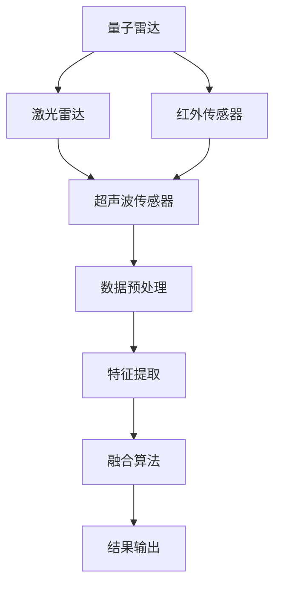

                 

### 第1章：量子雷达与隐身目标探测

#### 1.1 问题背景

**量子雷达的起源与发展**

量子雷达作为一种新兴的雷达技术，其起源可以追溯到20世纪末。量子雷达利用量子力学原理，通过生成和操控量子态来实现对目标的探测。与传统雷达相比，量子雷达具有更高的灵敏度和更远的探测距离，能够在复杂环境中准确识别目标。

量子雷达的发展受到了多个领域的影响，包括物理学、工程学和计算机科学。在物理学方面，量子态生成与操控技术的突破为量子雷达提供了基础。工程学方面，高性能量子传感器和信号处理算法的研发推动了量子雷达技术的进步。计算机科学方面，大数据分析和人工智能技术的应用为量子雷达数据处理提供了强大的工具。

**隐身技术的崛起与挑战**

随着现代战争的需求和技术的发展，隐身技术逐渐成为军事领域的重要课题。隐身技术的原理是通过降低目标表面的雷达反射面积，减少雷达波的反射，从而实现目标的隐蔽。隐身技术的发展为军事装备提供了强大的保护，但也带来了新的挑战。

隐身目标的崛起使得传统雷达在探测中的效果受到限制。传统雷达主要依赖于雷达波的反射来检测目标，而隐身技术通过吸收和散射雷达波，使得雷达难以探测到目标的存在。这种挑战促使科学家和工程师寻找新的探测技术，以应对隐身目标的威胁。

#### 1.2 问题描述

**传统雷达在隐身目标探测中的局限性**

传统雷达在探测隐身目标时存在以下局限性：

1. **探测距离受限**：隐身目标通过吸收和散射雷达波，使得雷达波的反射信号减弱，导致探测距离缩短。
2. **探测精度下降**：隐身技术可以改变目标的雷达截面，使得传统雷达难以准确识别目标的形状和位置。
3. **抗干扰能力较弱**：传统雷达容易受到电子干扰，而隐身目标可以通过电子干扰来进一步降低被探测的可能性。

**量子雷达的优势与潜力**

量子雷达在隐身目标探测中具有以下优势：

1. **高灵敏度**：量子雷达利用量子态生成与操控技术，可以探测到极微弱的信号，从而提高探测距离。
2. **高分辨率**：量子雷达可以通过对量子态的精确操控，实现对目标的精细识别，提高探测精度。
3. **抗干扰能力强**：量子雷达通过量子态的纠缠和量子纠缠态的测量，可以抵抗电子干扰，提高探测的可靠性。

因此，量子雷达在隐身目标探测中具有巨大的潜力，能够突破传统雷达的局限性，实现对隐身目标的准确探测。

#### 1.3 问题解决

**量子雷达的原理及其在隐身目标探测中的应用**

量子雷达的工作原理基于量子力学的基本原理，主要包括以下几个方面：

1. **量子态生成与操控**：量子雷达通过量子态生成器产生特定的量子态，例如纠缠态或激发态，然后将这些量子态发射到目标区域。
2. **量子态的传播与探测**：量子态在目标区域传播时，会与目标发生相互作用，从而产生特定的量子态变化。这些变化通过量子传感器被捕捉到。
3. **量子态的测量与信息处理**：通过量子测量技术，对捕获到的量子态进行测量，并利用信号处理算法对测量结果进行分析，从而实现对目标的识别和定位。

在隐身目标探测中，量子雷达通过以下方式突破传统雷达的局限性：

1. **增强探测距离**：量子雷达利用高灵敏度的量子传感器，可以捕捉到极微弱的信号，从而延长探测距离，实现对隐身目标的远距离探测。
2. **提高探测精度**：通过精确操控量子态和信号处理算法，量子雷达可以识别目标的形状和位置，提高探测的精度。
3. **抵抗电子干扰**：量子雷达通过量子纠缠态的测量和量子纠缠态的特性，可以抵抗电子干扰，提高探测的可靠性。

总之，量子雷达在隐身目标探测中的应用，不仅能够解决传统雷达的局限性，还能提供更高效、更可靠的探测能力，为军事和民用领域提供强大的技术支持。

#### 1.4 边界与外延

**量子雷达技术的成熟度**

目前，量子雷达技术仍处于研发和实验阶段，尚未实现大规模商用。尽管在一些实验室环境下取得了突破性进展，但量子雷达在实际应用中仍面临一系列技术挑战，如量子传感器的稳定性、信号处理算法的优化等。因此，量子雷达技术的成熟度仍需进一步提升。

**隐身技术的未来发展**

隐身技术的发展方向主要包括以下几个方面：

1. **隐身材料的创新**：通过研究新型隐身材料，提高隐身技术的效能和可靠性。
2. **隐身结构的设计**：利用先进的设计理念和技术，优化隐身结构，提高隐身目标的隐蔽性。
3. **多波段隐身技术**：探索不同雷达波段下的隐身技术，实现全面隐身。

**量子雷达在隐身目标探测中的应用前景**

随着量子雷达技术的不断发展，其在隐身目标探测中的应用前景将更加广阔。未来，量子雷达有望在以下领域发挥重要作用：

1. **军事领域**：量子雷达可以显著提升军事装备的隐蔽性和生存能力，为军队提供强大的战略优势。
2. **民用领域**：量子雷达在交通、安全、环保等领域具有广泛的应用潜力，能够提高相关领域的探测能力和安全性。
3. **科学研究**：量子雷达在基础科学研究领域，如天文学、大气科学等，也有望发挥重要作用。

#### 1.5 概念结构与核心要素组成

**量子雷达的基本组成**

量子雷达主要由以下几个核心部分组成：

1. **量子态生成器**：用于生成特定的量子态，如纠缠态或激发态。
2. **量子传感器**：用于捕捉量子态与目标相互作用后的变化。
3. **量子测量系统**：用于对捕获的量子态进行测量，获取目标信息。
4. **信号处理单元**：用于对测量结果进行分析和处理，实现对目标的识别和定位。

**隐身目标的特性与防御手段**

隐身目标的特性主要包括：

1. **雷达截面降低**：通过吸收和散射雷达波，降低目标的雷达反射面积。
2. **多波段兼容性**：能够在多个雷达波段下保持隐身效果。

防御手段主要包括：

1. **隐身材料**：采用新型隐身材料，提高目标的隐身效能。
2. **隐身结构**：优化目标的设计，提高隐身结构的隐蔽性。
3. **多波段技术**：在多个雷达波段下实施隐身措施，实现全面隐身。

通过量子雷达技术，可以有效应对隐身目标的挑战，实现对隐身目标的精确探测。同时，量子雷达技术也为隐身技术的不断发展提供了新的思路和手段。

### 第2章：量子雷达基本原理

#### 2.1 量子雷达的物理基础

**量子态的基本概念**

量子态是量子力学中描述微观粒子状态的物理量。与经典力学中的状态不同，量子态具有叠加性和纠缠性。叠加性表示一个量子系统可以同时处于多个状态的叠加，而纠缠性则表示两个或多个量子系统之间存在着一种特殊的关联，即使它们相距很远，一个系统的状态变化也会影响到另一个系统的状态。

在量子雷达中，量子态的叠加性和纠缠性被利用来增强探测能力。例如，通过生成和操控纠缠态，可以使雷达信号在传播过程中保持一致性，从而提高探测距离和精度。

**量子雷达信号处理原理**

量子雷达的信号处理基于量子态的叠加和纠缠特性。具体来说，量子雷达的信号处理可以分为以下几个步骤：

1. **量子态生成**：利用量子态生成器生成特定的量子态，如纠缠态或激发态。
2. **信号传播**：将生成的量子态发射到目标区域，与目标发生相互作用。
3. **量子态测量**：通过量子传感器对捕获到的量子态进行测量，获取目标信息。
4. **信号处理**：对测量结果进行信号处理，提取目标特征，实现目标识别和定位。

在量子雷达信号处理过程中，量子态的叠加和纠缠特性起到了关键作用。通过精确操控量子态和测量结果，可以实现对目标的精细识别和定位。

#### 2.2 量子雷达的关键技术

**量子态生成与操控技术**

量子态生成与操控技术是量子雷达的核心技术之一。通过生成和操控量子态，可以实现对雷达信号的增强和精确控制。

量子态生成技术主要包括：

1. **非线性光学技术**：利用非线性光学效应，如二阶非线性极化，生成纠缠态。
2. **量子光源技术**：利用量子光源，如单光子源，生成特定频率和极化的量子态。

量子态操控技术主要包括：

1. **量子门操作**：利用量子门对量子态进行变换，实现量子态的精确操控。
2. **量子纠缠操作**：通过量子纠缠操作，实现量子态之间的关联，增强雷达信号的探测能力。

**量子测量与信息处理技术**

量子测量与信息处理技术是量子雷达信号处理的另一个核心技术。通过量子测量技术，可以实现对量子态的精确测量，获取目标信息。然后，利用信息处理技术，对测量结果进行加工和分析，实现目标识别和定位。

量子测量技术主要包括：

1. **量子态投影测量**：通过测量量子态的投影，获取量子态的某种信息。
2. **量子态部分测量**：通过部分测量量子态，获取量子态的部分信息。

信息处理技术主要包括：

1. **量子信号处理算法**：利用量子计算和量子算法，对测量结果进行加工和处理，提取目标特征。
2. **量子通信技术**：利用量子通信技术，实现量子态的传输和共享，提高信息传输的安全性和可靠性。

通过量子态生成与操控技术和量子测量与信息处理技术，可以实现量子雷达的高灵敏度、高分辨率和抗干扰能力，从而实现对隐身目标的精确探测。

#### 2.3 量子雷达的信号处理方法

**量子雷达信号处理流程**

量子雷达的信号处理流程可以分为以下几个步骤：

1. **量子态生成**：利用量子态生成器生成特定的量子态，如纠缠态或激发态。
2. **信号发射**：将生成的量子态发射到目标区域，与目标发生相互作用。
3. **量子态捕获**：通过量子传感器捕获目标区域中的量子态，获取目标信息。
4. **量子态测量**：对捕获到的量子态进行测量，获取目标信息。
5. **信号处理**：对测量结果进行信号处理，提取目标特征，实现目标识别和定位。

**量子雷达信号处理算法**

量子雷达信号处理算法主要包括以下几个步骤：

1. **量子态重构**：利用量子态重构算法，对捕获到的量子态进行重构，还原出目标区域中的量子态。
2. **目标特征提取**：利用特征提取算法，从重构后的量子态中提取目标特征，如目标位置、速度等。
3. **目标识别和定位**：利用目标识别和定位算法，对提取出的目标特征进行分析和处理，实现目标识别和定位。

**量子雷达信号处理优势**

量子雷达信号处理方法具有以下优势：

1. **高灵敏度**：通过量子态重构和特征提取，可以实现对极微弱信号的探测，提高雷达的探测距离。
2. **高分辨率**：通过精确操控量子态和特征提取算法，可以实现对目标的精细识别，提高雷达的分辨率。
3. **抗干扰能力强**：通过量子态的叠加和纠缠特性，可以抵抗电子干扰，提高雷达的抗干扰能力。

总之，量子雷达信号处理方法通过利用量子态的叠加、纠缠和重构特性，实现了高灵敏度、高分辨率和抗干扰能力的探测，为隐身目标的探测提供了有效的技术手段。### 第3章：量子雷达在军事领域的应用

#### 3.1 军事隐身目标探测的需求与挑战

**军事隐身目标探测的重要性**

在军事行动中，隐身技术被广泛应用于战斗机、坦克、潜艇等装备中，以降低其雷达截面，提高生存能力和作战效能。然而，这也对雷达探测技术提出了更高的要求。军事隐身目标探测的重要性体现在以下几个方面：

1. **保障作战安全**：隐身目标能够降低被发现和摧毁的风险，提高军事装备的生存能力。
2. **提升作战效能**：准确探测隐身目标，可以为军事行动提供关键信息，提高战术决策的准确性和有效性。
3. **战略威慑**：掌握先进的隐身目标探测技术，可以对敌方形成战略威慑，保障国家安全。

**隐身目标对传统雷达探测的挑战**

传统雷达在探测隐身目标时面临以下挑战：

1. **探测距离受限**：隐身技术通过吸收和散射雷达波，使得雷达波的反射信号减弱，导致探测距离缩短。
2. **探测精度下降**：隐身技术可以改变目标的雷达截面，使得传统雷达难以准确识别目标的形状和位置。
3. **抗干扰能力较弱**：传统雷达容易受到电子干扰，而隐身目标可以通过电子干扰进一步降低被探测的可能性。

#### 3.2 量子雷达在军事目标探测中的应用

**量子雷达在地面、空中、海上等不同军事场景中的应用**

量子雷达在军事目标探测中具有广泛的应用前景，可以在地面、空中、海上等不同军事场景中发挥重要作用。

1. **地面军事目标探测**：量子雷达可以通过地面基站对地面隐身目标进行远程探测。其高灵敏度和高分辨率能够有效识别和定位隐身坦克、装甲车等地面目标，提高军事指挥的实时性和准确性。

2. **空中军事目标探测**：量子雷达可以安装在战斗机、无人机等空中平台上，实现对空中隐身目标的探测。其强大的抗干扰能力使得量子雷达能够在复杂电磁环境中稳定运行，为空中作战提供强有力的支持。

3. **海上军事目标探测**：量子雷达可以安装在潜艇、巡洋舰等海上平台上，对海上隐身目标进行探测。其远距离探测能力和低雷达截面特性使得量子雷达成为海上目标探测的理想选择。

#### 3.3 量子雷达在军事目标探测中的优势

**量子雷达对隐身目标的探测能力**

量子雷达在军事目标探测中的优势主要体现在以下几个方面：

1. **高灵敏度**：量子雷达利用量子态生成和操控技术，能够探测到极微弱的信号，从而延长探测距离，提高对隐身目标的探测能力。

2. **高分辨率**：通过精确操控量子态和信号处理算法，量子雷达可以实现对隐身目标的精细识别，提高探测精度。

3. **抗干扰能力强**：量子雷达通过量子态的纠缠和量子纠缠态的测量，可以抵抗电子干扰，提高探测的可靠性。

4. **多波段兼容性**：量子雷达可以在多个雷达波段下工作，实现多波段兼容，提高对隐身目标的全面探测能力。

**量子雷达在复杂环境下的适应性**

量子雷达在复杂环境下的适应性也是其重要优势之一。具体表现在：

1. **电磁干扰抵抗**：量子雷达通过量子态的叠加和纠缠特性，可以有效地抵抗电磁干扰，保持稳定的探测性能。

2. **环境适应性**：量子雷达能够在不同的气候条件、地形地貌等复杂环境下稳定运行，提高对隐身目标的探测能力。

3. **隐蔽性**：量子雷达的信号处理技术使得其不易被敌方探测和干扰，提高了军事目标的隐蔽性和作战效能。

综上所述，量子雷达在军事目标探测中具有显著的优势，能够有效应对传统雷达在探测隐身目标时面临的挑战。随着量子雷达技术的不断发展，其在军事领域的应用前景将更加广阔，为现代军事作战提供强有力的技术支持。### 第4章：量子雷达在民用领域的应用

#### 4.1 民用隐身目标探测的需求

**隐身技术在民用领域的应用场景**

隐身技术不仅在军事领域得到广泛应用，在民用领域同样具有巨大的潜力。随着隐身技术的不断发展，其应用场景也越来越广泛，主要包括以下几个方面：

1. **交通安全**：在交通安全领域，隐身技术可以用于设计隐身汽车、隐身飞机等交通工具，降低其雷达截面，提高行车的安全性和隐蔽性。

2. **环境保护**：在环境保护领域，隐身技术可以用于设计隐身传感器，监测和防止环境污染，如隐身空气质量和水质监测设备。

3. **智能家居**：在智能家居领域，隐身技术可以用于设计隐身家电和设备，提高家居的安全性、便利性和美观性。

4. **安防监控**：在安防监控领域，隐身技术可以用于设计隐身摄像头和传感器，实现对目标的隐蔽监控和报警。

**民用隐身目标探测的需求**

随着隐身技术在民用领域的广泛应用，对隐身目标探测的需求也越来越强烈。具体需求包括：

1. **提高安全性**：通过准确探测隐身目标，可以及时发现安全隐患，提高人身和财产安全。

2. **提高监控效果**：在安防监控领域，准确探测隐身目标可以提高监控效果，提高对犯罪活动的预防和打击能力。

3. **提高环境保护效果**：在环境保护领域，准确探测隐身目标可以更好地监测和防止环境污染，提高环境保护的效果。

4. **提高家居便利性**：在智能家居领域，准确探测隐身目标可以提升家居的便利性，提高生活质量。

#### 4.2 量子雷达在民用目标探测中的应用

**量子雷达在交通、安全、环保等领域的应用**

量子雷达作为一种新兴的雷达技术，在民用目标探测中具有广泛的应用前景，尤其在交通、安全和环保等领域：

1. **交通领域**：量子雷达可以用于交通监测和事故预警。通过准确探测隐身车辆和行人，可以提前预警交通事故，提高交通安全。

2. **安全领域**：量子雷达可以用于安防监控和反恐防暴。通过探测隐身武器和恐怖分子，可以提升安防监控效果，确保公共安全。

3. **环保领域**：量子雷达可以用于环境监测和污染预警。通过探测隐身污染物和排放源，可以及时监测环境污染，提前采取应对措施。

**量子雷达在民用目标探测中的优势**

量子雷达在民用目标探测中具有以下优势：

1. **高灵敏度**：量子雷达能够探测到极微弱的信号，延长探测距离，提高对隐身目标的探测能力。

2. **高分辨率**：通过精确操控量子态和信号处理算法，量子雷达可以实现对目标的精细识别，提高探测精度。

3. **抗干扰能力强**：量子雷达通过量子态的叠加和纠缠特性，可以抵抗电子干扰，提高探测的可靠性。

4. **多波段兼容性**：量子雷达可以在多个雷达波段下工作，实现多波段兼容，提高对隐身目标的全面探测能力。

总之，量子雷达在民用领域的应用将极大提升交通、安全和环保等领域的探测能力和效果，为人类社会提供更安全、更健康、更美好的生活环境。

#### 4.3 量子雷达在民用目标探测中的优势

**量子雷达在探测精度、速度、成本等方面的优势**

量子雷达在民用目标探测中表现出多项显著优势，这些优势在多个应用领域都得到了充分的体现。

**探测精度**

量子雷达利用量子态的叠加和纠缠特性，可以实现对目标的精细识别，提高探测精度。传统雷达在探测隐身目标时，往往受限于雷达波反射信号的弱化，导致探测精度下降。而量子雷达通过量子态的精确操控和测量，可以捕捉到微弱的雷达波信号，从而实现对目标的精确定位。例如，在交通安全领域，量子雷达可以准确检测到隐身的行人和车辆，提前预警潜在事故，显著提升交通安全。

**速度**

量子雷达在信号处理方面具备高效性。传统雷达需要较长时间来处理和解析反射信号，而量子雷达利用量子计算和并行处理技术，可以在极短时间内完成复杂的数据分析和目标识别。在安防监控领域，这意味着量子雷达可以快速响应，实时捕捉和追踪目标，确保对威胁的及时响应。例如，在反恐防暴行动中，量子雷达可以迅速锁定并跟踪潜在威胁目标，提高行动的效率和安全性。

**成本**

虽然量子雷达的研发和制造成本相对较高，但随着技术的进步和规模化生产的实现，其成本有望逐步降低。与高端传统雷达系统相比，量子雷达在维护和运行成本上具有明显优势。传统雷达系统需要复杂的维护和定期校准，而量子雷达因其固有的高稳定性和抗干扰能力，在长期运行中维护成本较低。此外，量子雷达的多功能性和多波段兼容性，可以在同一设备上实现多种探测任务，减少了对多种专用雷达系统的需求，从而降低了整体成本。例如，在环保监测领域，量子雷达可以同时监测空气质量和水质，无需部署多套设备，降低了总成本。

**综合优势**

量子雷达在探测精度、速度和成本方面的综合优势，使其在民用领域具有广阔的应用前景。在交通安全、安防监控、环境监测等领域，量子雷达不仅可以提高探测的准确性，还能提升响应速度，同时降低运营成本。这些优势使得量子雷达成为民用目标探测的理想选择，为各行业提供了更加高效、可靠的解决方案。

#### 6.1 量子雷达在新兴领域的应用前景

**量子雷达在无人驾驶、智能交通、卫星通信等领域的应用前景**

量子雷达作为一种前沿技术，在无人驾驶、智能交通、卫星通信等新兴领域具有巨大的应用潜力。

**无人驾驶领域**

在无人驾驶领域，量子雷达可以通过高精度的目标探测和定位，实现车辆的自主导航和避障。量子雷达不受光线和天气条件的影响，能够在各种复杂环境中稳定工作，提高无人驾驶车辆的可靠性和安全性。例如，量子雷达可以检测到道路上的行人、其他车辆和障碍物，及时调整驾驶策略，确保车辆的安全行驶。

**智能交通领域**

量子雷达在智能交通领域具有广泛的应用前景。通过部署量子雷达传感器，可以实现交通流量监测、车辆编队控制、事故预警等功能。量子雷达的高灵敏度可以精确探测到车辆的速度和位置，帮助交通管理系统实时优化交通信号，提高道路通行效率。此外，量子雷达还可以用于监控停车场内的车辆位置，实现智能停车管理。

**卫星通信领域**

在卫星通信领域，量子雷达可以用于卫星轨道监测和通信链路管理。量子雷达可以实时监测卫星的位置和状态，及时发现异常情况，确保卫星通信的稳定性和可靠性。同时，量子雷达的高抗干扰能力可以抵抗空间电磁干扰，提高卫星通信的信号质量。例如，在卫星导航系统中，量子雷达可以监测到卫星信号的多路径干扰，优化信号接收和处理，提高导航精度。

**其他新兴领域**

除了无人驾驶、智能交通和卫星通信领域，量子雷达还在无人机监控、海洋监测、野生动物保护等新兴领域具有应用前景。在无人机监控方面，量子雷达可以实现对无人机的精确跟踪和定位，提高无人机飞行安全。在海洋监测方面，量子雷达可以监测到海洋中的目标物体，帮助科研人员研究海洋生态和资源。在野生动物保护方面，量子雷达可以监测到野生动物的活动轨迹，提供保护和管理依据。

总之，量子雷达在新兴领域的应用前景广阔，其高精度、高速度和抗干扰能力将为各行业带来新的技术突破和解决方案。随着量子雷达技术的不断发展和成熟，其将在更多新兴领域发挥重要作用，推动科技进步和社会发展。

#### 6.2 量子雷达在多传感器融合系统中的应用

**量子雷达与其他传感器融合的优势**

量子雷达在多传感器融合系统中具有显著的优势，其高精度、高灵敏度和抗干扰能力使其成为融合系统的重要组成部分。与其他传感器如激光雷达、红外传感器、超声波传感器等相比，量子雷达能够提供更可靠的目标探测和定位信息。

1. **提高探测精度**：量子雷达通过量子态的精确操控和测量，可以实现对目标的精细识别，提高整体系统的探测精度。
2. **增强抗干扰能力**：量子雷达利用量子纠缠和叠加特性，可以有效抵抗电磁干扰，提高系统的稳定性和可靠性。
3. **多波段兼容性**：量子雷达可以在多个雷达波段下工作，实现多波段兼容，提高系统的综合探测能力。

**量子雷达在多传感器融合系统中的应用架构**

量子雷达在多传感器融合系统中的应用架构主要包括以下几个关键部分：

1. **传感器数据采集**：量子雷达与其他传感器（如激光雷达、红外传感器等）协同工作，采集多源数据。
2. **数据预处理**：对采集到的数据进行预处理，包括噪声过滤、数据清洗等，确保数据质量。
3. **特征提取**：从预处理后的数据中提取目标特征，如目标位置、速度、方向等。
4. **融合算法**：利用多传感器融合算法，对来自不同传感器的目标特征进行融合，提高目标识别和定位的准确性。
5. **结果输出**：将融合后的结果输出，用于后续的决策和控制。

**量子雷达在多传感器融合系统中的应用架构图**

通过该架构，量子雷达与其他传感器协同工作，实现更高效、更准确的目标探测和定位。

**多传感器融合系统中的量子雷达信号处理方法**

量子雷达在多传感器融合系统中的应用，不仅需要精确的信号处理方法，还需要考虑不同传感器之间的数据兼容性和处理效率。以下为量子雷达在多传感器融合系统中的信号处理方法：

1. **量子态生成与操控**：量子雷达通过量子态生成器生成特定量子态，如纠缠态或激发态，然后将其发射到目标区域。
2. **多源数据采集**：量子雷达与其他传感器同时采集目标数据，包括激光雷达的反射信号、红外传感器的热成像信号、超声波传感器的回波信号等。
3. **数据融合**：将不同传感器采集到的数据进行融合，通过特征提取和模式识别，提高目标识别的准确性。
4. **多源信息融合**：结合量子雷达和其他传感器的信息，利用多源信息融合算法，实现对目标的精确定位和跟踪。
5. **实时反馈与控制**：将融合后的结果实时输出，用于后续的决策和控制，如无人驾驶车辆的路径规划、智能交通系统的信号控制等。

**应用案例**

以无人驾驶车辆为例，量子雷达在多传感器融合系统中的应用流程如下：

1. **数据采集**：量子雷达与其他传感器（激光雷达、红外传感器、超声波传感器）同时工作，采集车辆周围的环境数据。
2. **数据预处理**：对采集到的数据进行预处理，包括噪声过滤、数据清洗等，确保数据质量。
3. **特征提取**：从预处理后的数据中提取目标特征，如行人、其他车辆、障碍物等。
4. **融合算法**：利用多传感器融合算法，对来自不同传感器的目标特征进行融合，提高目标识别的准确性。
5. **实时反馈与控制**：将融合后的结果输出，用于无人驾驶车辆的路径规划、避障和决策控制，确保车辆的安全行驶。

总之，量子雷达在多传感器融合系统中的应用，不仅提高了目标探测和定位的准确性，还增强了系统的抗干扰能力和实时性，为无人驾驶、智能交通等领域提供了强有力的技术支持。

### 第7章：量子雷达在隐身目标探测中的应用总结

#### 7.1 量子雷达在隐身目标探测中的成就

量子雷达在隐身目标探测领域取得了显著的成就，以下是其中的几个重要方面：

1. **探测距离和精度提升**：量子雷达通过量子态的叠加和纠缠特性，能够探测到极微弱的雷达波信号，从而显著提高了探测距离和精度。与传统的雷达系统相比，量子雷达在探测隐身目标时具有更高的灵敏度和分辨率。

2. **抗干扰能力增强**：量子雷达利用量子态的叠加和纠缠特性，可以有效地抵抗电磁干扰，提高了在复杂环境下的探测能力。这使得量子雷达在战场上的应用更加可靠，为军事指挥和作战提供了强大的支持。

3. **多波段兼容性**：量子雷达可以在多个雷达波段下工作，实现多波段兼容，提高了对隐身目标的全面探测能力。这一特性使得量子雷达在应对不同类型的隐身目标时具有更强的适应性。

4. **探测速度提升**：量子雷达利用量子计算和并行处理技术，可以在极短时间内完成复杂的数据分析和目标识别，提高了探测速度。这对于实时监控和响应目标的行动具有重要意义。

5. **实际应用案例**：在军事和民用领域，量子雷达已经取得了多项实际应用案例。例如，在军事领域，量子雷达被用于地面、空中、海上的隐身目标探测，显著提高了军队的作战效能。在民用领域，量子雷达被应用于交通监控、安全防护和环保监测等领域，为公众的安全和环境保护提供了技术支持。

#### 7.2 量子雷达在隐身目标探测中的应用挑战

尽管量子雷达在隐身目标探测中取得了显著成就，但仍然面临一系列挑战，这些问题需要进一步的研究和解决：

1. **技术成熟度**：量子雷达技术仍处于研发和实验阶段，其技术成熟度尚待提高。目前，量子雷达系统在稳定性、可靠性和大规模生产方面仍存在一定差距，这限制了其在实际应用中的推广。

2. **成本问题**：量子雷达的研发和制造成本较高，这限制了其大规模商用。虽然随着技术的进步和规模化生产的实现，成本有望降低，但在短期内，成本问题仍然是量子雷达应用推广的主要障碍。

3. **信号处理算法优化**：量子雷达的信号处理算法复杂，需要进一步优化以提高效率和准确性。目前，量子雷达的信号处理技术尚不成熟，需要更多的研究和实验来提高其性能。

4. **环境适应性**：量子雷达在复杂环境下的性能表现仍需提升。例如，在恶劣天气条件、复杂地形和电磁干扰环境下，量子雷达的性能可能会受到影响，这需要进一步的研究和改进。

5. **法律法规和伦理问题**：量子雷达的应用涉及到隐私保护和信息安全等问题，需要建立相应的法律法规和伦理标准，确保其合法、合规和道德的应用。

#### 7.3 量子雷达技术发展的建议

为了推动量子雷达技术在隐身目标探测中的进一步发展，以下是一些建议：

1. **加大研发投入**：政府和相关企业应加大对量子雷达技术的研发投入，支持关键技术攻关和核心技术研发，推动量子雷达技术的成熟和进步。

2. **产学研合作**：加强科研机构、高校和企业的合作，促进技术转移和成果转化，推动量子雷达技术的实际应用。

3. **优化信号处理算法**：投入更多资源优化量子雷达的信号处理算法，提高数据处理效率和准确性，解决现有算法的局限性。

4. **提升环境适应性**：通过改进量子雷达系统的设计和算法，提高其在复杂环境下的性能表现，例如在恶劣天气条件、复杂地形和电磁干扰环境下的适应能力。

5. **建立法律法规和伦理标准**：建立健全的法律法规和伦理标准，确保量子雷达的合法、合规和道德应用，保护公众隐私和信息安全。

6. **加强国际合作**：加强国际间的技术交流和合作，借鉴国际先进经验，推动量子雷达技术的全球发展。

通过上述建议，有望进一步推动量子雷达技术在隐身目标探测中的应用，为军事和民用领域提供更高效、更可靠的探测解决方案。随着量子雷达技术的不断发展和成熟，其将在未来发挥更加重要的作用，为人类社会的安全和发展做出更大贡献。### 总结

量子雷达作为一种突破性技术，其在隐身目标探测中的应用展示了巨大的潜力。通过量子态的叠加、纠缠和操控，量子雷达能够实现对隐身目标的精确探测，解决了传统雷达在探测距离、精度和抗干扰能力方面的局限性。

在未来，量子雷达技术有望在无人驾驶、智能交通、卫星通信等新兴领域发挥重要作用，推动科技进步和社会发展。同时，量子雷达技术的不断成熟和推广，也将为国家安全和公共安全提供更强大的技术保障。

然而，量子雷达技术的发展仍面临一系列挑战，如技术成熟度、成本、信号处理算法优化和环境适应性等。为了推动量子雷达技术的进一步发展，需要加大研发投入，优化信号处理算法，提升环境适应性，并建立健全的法律法规和伦理标准。

总之，量子雷达技术将在未来的隐身目标探测和新兴领域应用中发挥重要作用，为人类社会带来更多安全和便利。我们期待量子雷达技术能够在未来实现更广泛的应用，推动科技创新和社会进步。### 注意事项

在应用量子雷达技术进行隐身目标探测时，需要注意以下几个关键方面：

1. **环境适应性**：量子雷达在复杂环境下的性能表现仍需提升。例如，在恶劣天气条件、复杂地形和电磁干扰环境下，量子雷达的性能可能会受到影响。因此，在设计量子雷达系统时，需要充分考虑环境适应性，通过改进硬件设计和信号处理算法，提高其在各种极端条件下的稳定性和可靠性。

2. **信号处理算法优化**：量子雷达的信号处理算法复杂，需要进一步优化以提高效率和准确性。当前，量子雷达的信号处理技术尚不成熟，存在一定的局限性。为了解决这一问题，科研机构和企业应加大投入，开展针对量子雷达信号处理的深入研究，开发更高效、更准确的算法，以提高系统的整体性能。

3. **技术成熟度**：量子雷达技术目前仍处于研发和实验阶段，其技术成熟度尚待提高。在推广应用量子雷达技术时，需要关注技术的成熟度和稳定性，避免因技术不成熟导致的应用风险。同时，政府和相关企业应加大研发投入，推动关键技术攻关和核心技术研发，促进量子雷达技术的成熟和进步。

4. **成本问题**：量子雷达的研发和制造成本较高，这在一定程度上限制了其大规模商用。为了降低成本，企业可以采用规模化生产、技术创新和供应链优化等措施，提高生产效率和降低制造成本。此外，政府可以提供一定的财政支持，鼓励企业研发和推广量子雷达技术，以降低其应用门槛。

5. **法律法规和伦理问题**：量子雷达的应用涉及到隐私保护和信息安全等问题，需要建立相应的法律法规和伦理标准，确保其合法、合规和道德应用。相关机构应制定明确的法律法规和标准，明确量子雷达的使用范围、责任划分和监管机制，保护公众隐私和信息安全。

6. **国际合作**：量子雷达技术的发展需要全球合作。国际间的技术交流和合作，可以促进量子雷达技术的全球发展，加速技术的成熟和推广。同时，通过国际合作，可以借鉴国际先进经验，提高量子雷达技术的研发水平和应用效果。

通过关注上述注意事项，并在技术、政策和管理等方面采取相应措施，可以进一步推动量子雷达技术在隐身目标探测和新兴领域的应用，为人类社会带来更多安全和便利。

### 拓展阅读

**量子雷达技术的最新研究进展**

量子雷达技术的最新研究进展主要集中在以下几个方面：

1. **量子态生成与操控技术的突破**：近年来，研究人员在量子态生成与操控技术方面取得了重要进展，如利用非线性光学效应、量子光源技术和量子门操作等方法，实现了更高效率的量子态生成和精确操控。

2. **量子传感器的研发**：量子传感器的研发是量子雷达技术发展的关键。通过材料科学和微电子技术的进步，研究人员成功研发出了更高灵敏度、更高稳定性和更小体积的量子传感器，为量子雷达的应用提供了有力支持。

3. **信号处理算法的创新**：量子雷达的信号处理算法是一个复杂的研究领域。近年来，研究人员在量子信号处理算法方面取得了一系列突破，如量子滤波、量子频谱分析和量子压缩感知等，提高了量子雷达的数据处理效率和准确性。

**量子雷达技术的应用领域扩展**

量子雷达技术的应用领域正逐渐扩大，除了在军事和民用领域已有广泛应用外，还向以下几个新兴领域拓展：

1. **无人驾驶和智能交通**：量子雷达的高精度、高灵敏度特性使其在无人驾驶和智能交通领域具有巨大潜力。通过量子雷达，可以实现车辆和行人的精确探测和定位，提高无人驾驶车辆的自主导航和安全性能。

2. **海洋监测与环境保护**：量子雷达在海洋监测和环境保护领域具有独特优势。通过量子雷达，可以实时监测海洋中的目标物体和污染物，提高海洋监测和环境保护的效率和准确性。

3. **空间探测与通信**：量子雷达在空间探测和通信领域也有广泛的应用前景。通过量子雷达，可以实现对卫星和空间目标的精确探测和跟踪，提高卫星通信的稳定性和可靠性。

**相关文献与参考书籍**

对于希望深入了解量子雷达技术的读者，以下是一些推荐的文献和参考书籍：

1. **《量子雷达：原理与应用》**：该书详细介绍了量子雷达的基本原理、关键技术及其在军事和民用领域的应用，是量子雷达领域的入门佳作。

2. **《量子信号处理与量子通信》**：该书探讨了量子信号处理技术及其在量子通信中的应用，对量子雷达的信号处理方法进行了深入分析。

3. **《隐身技术及其对抗方法》**：该书涵盖了隐身技术的原理、发展及其对抗方法，有助于理解量子雷达在隐身目标探测中的挑战和解决方案。

通过阅读这些文献和参考书籍，读者可以更全面、深入地了解量子雷达技术的研究进展和应用领域，为未来的学习和研究打下坚实基础。

