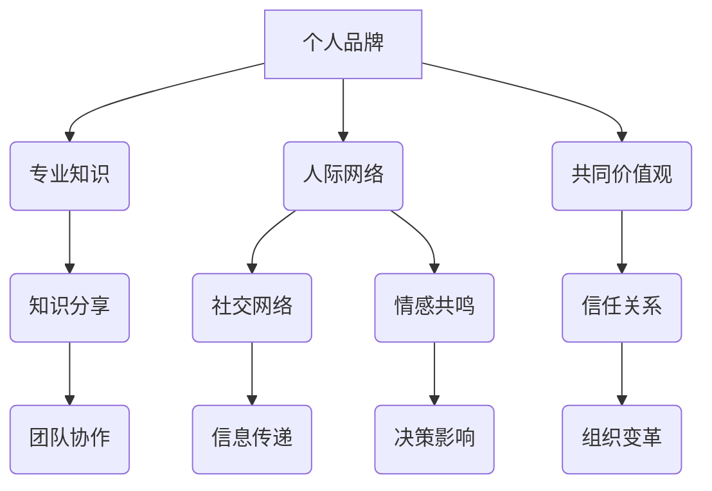
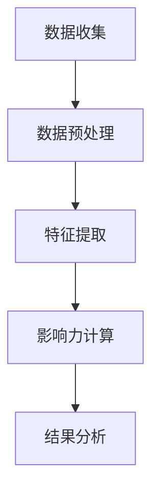
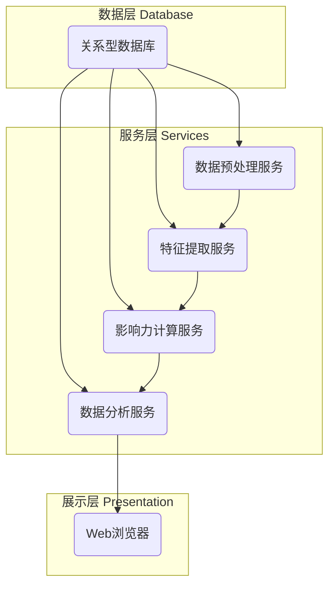
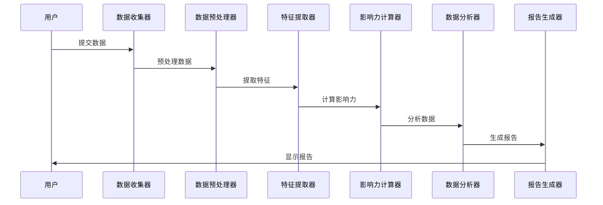
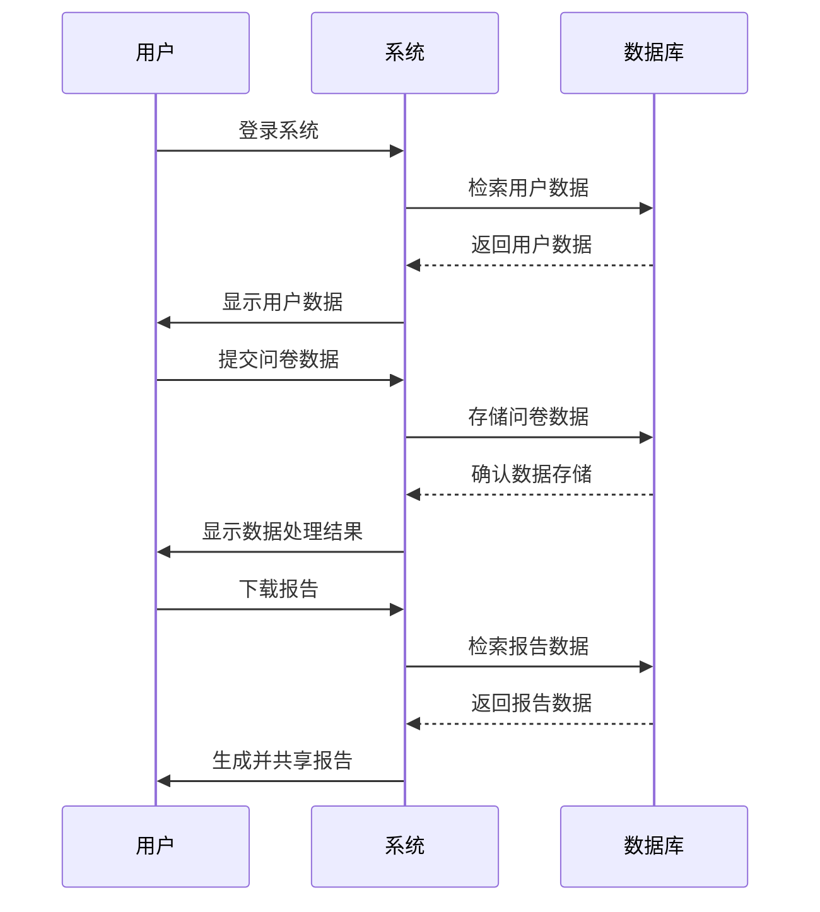

                 


### 引言

在信息化和数字化的时代，领导力不仅体现在职位权力上，更体现在非正式的影响力上。非正式影响力，指的是那些超越职位权力的领导艺术，通过个人的品质、技能、声誉和行为来影响他人，达成组织目标的能力。这种影响力并非基于正式的职位和权力，而是通过个人魅力、专业知识、人际关系网络以及共同价值观等非正式途径建立起来的。

非正式影响力的重要性不可忽视。首先，它能够在没有正式职位的情况下影响和引导团队成员。其次，它能够促进跨部门、跨层级的合作与沟通，打破组织内的壁垒。再者，它有助于在复杂多变的环境中迅速适应和应对变化，提升组织的灵活性和应变能力。

本文将系统地探讨非正式影响力的概念、建立、运用和维持方法。我们将从以下几个方面展开：

1. **非正式影响力的基础**：详细阐述非正式影响力的本质、核心要素和作用。
2. **建立非正式影响力**：探讨个人品牌建设、网络关系建设和非正式影响力的培养方法。
3. **运用非正式影响力**：分析非正式影响力的运用策略和实际应用。
4. **保持非正式影响力的持久性**：探讨如何维护和提升非正式影响力。

通过本文的深入分析和讲解，希望读者能够更好地理解非正式影响力的本质和重要性，掌握建立、运用和维持非正式影响力的技巧，从而在职业生涯中更加出色地发挥领导作用。

### 关键词

- 非正式影响力
- 领导艺术
- 个人品牌
- 网络关系
- 影响力运用
- 持久性维护

### 摘要

本文旨在探讨非正式影响力的概念、建立、运用和维持方法。通过深入分析非正式影响力的本质、核心要素和作用，本文将帮助读者理解如何通过个人品牌、网络关系和非正式途径建立和运用影响力。同时，本文还将探讨如何在复杂多变的环境中保持非正式影响力的持久性，为读者提供实用的技巧和策略。通过本文的学习，读者将能够更好地发挥非正式影响力，在职业生涯中取得更大的成就。

## 第一部分：非正式影响力的基础

### 1.1 非正式影响力的本质

非正式影响力，顾名思义，是指那些不在职位权力框架内的领导力。这种影响力不是通过职位赋予的权力，而是通过个人的品质、技能、专业知识、人际网络和共同价值观等非正式途径建立起来的。非正式影响力在组织中起到了至关重要的作用，它能够促进团队成员之间的合作、提高团队的凝聚力，甚至能够在关键时刻扭转局势，影响组织的决策方向。

为了更好地理解非正式影响力的本质，我们可以将其与正式权力进行对比。正式权力通常是指通过职位和角色赋予的权力，如管理者、领导者等。这种权力是明确的、正式的，可以在组织结构图上清晰地标识出来。而正式权力的作用主要是在组织内部进行资源分配、任务指派和决策执行。相比之下，非正式影响力则更加隐性，它更多地体现在个人的行为、态度和影响力上，往往不易被外界察觉。

非正式影响力的来源多种多样，但核心要素主要包括以下几个方面：

- **个人品质**：包括诚信、责任感、勤奋、正直等。这些品质能够赢得他人的信任和尊重，从而产生非正式影响力。
- **专业知识**：个人在某个领域的专业知识和技能，可以使其在组织中成为权威人物，从而影响他人的决策和行为。
- **人际关系**：广泛的人际网络可以提供一个强大的支持系统，使个人在需要帮助时能够得到他人的支持，同时也能够通过人际网络传递信息和影响力。
- **共同价值观**：与他人的价值观和信仰相一致，可以建立深厚的信任关系，从而增强非正式影响力。

### 1.2 非正式影响力的核心要素

非正式影响力的核心要素可以总结为以下几点：

1. **个人品牌**：个人品牌是个人在组织内外部建立的一种独特形象，包括个人的专业知识、工作表现、人际关系和价值观等。一个强大的个人品牌能够显著增强非正式影响力。
   
2. **知识分享**：知识分享不仅能够提高个人在组织内的认可度，还能够帮助他人解决问题，从而建立信任关系。在信息技术领域，知识分享尤为重要，因为它有助于促进技术创新和团队协作。

3. **社交网络**：建立和维护良好的社交网络是非正式影响力的重要来源。通过积极参与社交活动、行业会议和社区活动，个人可以扩大自己的影响力范围。

4. **情感共鸣**：与他人的情感共鸣可以增强非正式影响力。通过关心他人、帮助他人和与他人的共同经历，个人可以建立深厚的人际关系，从而影响他人的行为和决策。

### 1.3 非正式影响力的作用

非正式影响力在组织中的具体作用可以从以下几个方面进行阐述：

1. **团队协作**：非正式影响力可以促进团队成员之间的协作，通过个人的影响力和个人品牌的建立，可以激发团队成员的积极性和创造力。

2. **信息传递**：在组织内部，非正式影响力可以迅速传递信息，特别是在正式沟通渠道不畅时，个人可以通过自己的社交网络和影响力，确保信息能够及时、准确地传递。

3. **决策影响**：非正式影响力可以对组织的决策产生重要影响。通过个人在组织内部的地位和影响力，个人可以在决策过程中提出建议和意见，从而影响最终决策。

4. **组织变革**：在组织变革过程中，非正式影响力可以起到关键作用。通过个人在组织内的关系和影响力，可以动员更多的人支持和参与变革，从而提高变革的成功率。

### 1.4 非正式影响力的边界与外延

尽管非正式影响力在组织中具有重要的作用，但它也存在一定的边界和局限性。以下是一些需要考虑的因素：

1. **组织文化**：组织文化对于非正式影响力的影响至关重要。在一个重视正式权力的组织中，非正式影响力可能难以发挥其应有的作用。

2. **个人隐私**：在建立非正式影响力时，个人隐私的保护也是一个重要的考量因素。过度的个人行为和言论可能会侵犯他人的隐私。

3. **正式权力的限制**：尽管非正式影响力在许多情况下能够发挥作用，但它并不能完全替代正式权力。在正式权力过于强大时，非正式影响力可能会受到限制。

4. **环境因素**：环境因素，如市场竞争、技术变革等，也会对非正式影响力产生影响。在一个快速变化的环境中，非正式影响力的发挥可能会受到挑战。

总的来说，非正式影响力是一种重要的领导力形式，它能够通过个人的品质、技能、人际关系和共同价值观等途径，在组织内产生深远的影响。然而，在建立和运用非正式影响力时，也需要考虑到其边界和局限性，以便更好地发挥其作用。

### 1.5 概念结构与核心要素组成

为了更好地理解非正式影响力的概念结构，我们可以借助Mermaid流程图来展示其核心要素和它们之间的相互关系。以下是一个简化的Mermaid流程图，用于描述非正式影响力的核心要素及其组成：



在这个流程图中，每个节点代表一个核心要素，而箭头表示要素之间的相互关系。我们可以看到，个人品牌、专业知识、人际网络、共同价值观等都是非正式影响力的基础，它们相互作用，共同构成了非正式影响力的整体结构。

- **个人品牌**：个人品牌是个人在组织内外部建立的一种独特形象，包括个人的专业知识、工作表现、人际关系和价值观等。一个强大的个人品牌能够显著增强非正式影响力。

- **专业知识**：个人在某个领域的专业知识和技能，可以使其在组织中成为权威人物，从而影响他人的决策和行为。

- **人际网络**：建立和维护良好的社交网络是非正式影响力的重要来源。通过积极参与社交活动、行业会议和社区活动，个人可以扩大自己的影响力范围。

- **共同价值观**：与他人的价值观和信仰相一致，可以建立深厚的信任关系，从而增强非正式影响力。

这些核心要素通过相互关系相互作用，共同构成了非正式影响力的整体结构。通过理解和运用这些核心要素，个人可以在组织内建立强大的非正式影响力，从而更好地实现组织目标。

### 1.6 背景介绍

在信息化和数字化快速发展的今天，组织内部的管理和领导模式也在不断演进。传统的基于职位权力的领导方式，尽管在某些情况下仍然有效，但在面对日益复杂的业务环境、快速变化的市场和技术创新时，其局限性逐渐显现。因此，非正式影响力的概念和实践变得越来越重要。

非正式影响力源于个人品质、专业知识、人际网络和共同价值观等非正式途径，它不依赖于正式的职位和权力，而是通过个人的行为和影响力来实现组织目标。这种影响力形式具有以下几个显著特点：

1. **灵活性**：非正式影响力能够在没有正式职位的情况下发挥作用，这使得它能够在快速变化的环境中迅速适应和应对变化。
2. **自主性**：非正式影响力的建立和运用主要依赖于个人的行为和影响力，而非正式的职位和权力，这使得个人可以更加自主地发挥领导作用。
3. **广泛性**：非正式影响力不仅局限于组织内部，还可以跨越组织边界，影响更广泛的社区和行业。
4. **可持续性**：通过持续的个人品牌建设、知识分享和人际网络维护，非正式影响力可以长期发挥作用，为组织带来持久的益处。

在信息技术领域，非正式影响力的作用尤为重要。信息技术领域的快速发展带来了大量的新技术、新概念和新方法，而这些知识往往需要通过非正式途径进行传播和分享。例如，技术博客、开源社区和行业会议等，都是信息技术领域非正式影响力的重要载体。通过在这些平台上分享知识和经验，个人可以在行业内建立强大的影响力，促进技术交流和合作。

此外，非正式影响力在项目管理、团队协作和跨部门沟通等方面也发挥着重要作用。在一个项目团队中，拥有非正式影响力的成员往往能够更好地协调各方资源，促进团队成员之间的沟通和协作，从而提高项目成功率。在跨部门沟通中，非正式影响力可以帮助个人跨越部门壁垒，建立有效的沟通渠道，确保信息传递的准确性和及时性。

总的来说，非正式影响力在信息化和数字化时代的重要性不言而喻。它不仅能够提高个人在组织内的领导力，还能够促进组织内部的创新和协作，为组织带来持久的竞争优势。因此，理解和运用非正式影响力，已经成为现代组织管理和领导的重要课题。

### 1.7 核心概念与联系

在深入探讨非正式影响力之前，我们需要明确几个核心概念，并分析它们之间的关系。以下是对这些核心概念的定义和它们之间的联系。

#### 非正式影响力

非正式影响力是指通过个人品质、专业知识、人际网络和共同价值观等非正式途径，在组织内外产生的影响力和领导力。它不依赖于正式的职位和权力，而是通过个人魅力和行为来实现。

#### 正式权力

正式权力是指通过组织结构和职位赋予的权力，如管理者、领导者等。这种权力是明确的、正式的，通常可以在组织结构图上清晰地标识出来。

#### 个人品牌

个人品牌是个人在组织内外建立的一种独特形象，包括个人的专业知识、工作表现、人际关系和价值观等。一个强大的个人品牌能够显著增强非正式影响力。

#### 知识分享

知识分享是指通过个人或团队将知识传递给他人，以促进学习、创新和协作。在信息技术领域，知识分享尤为重要，因为它有助于促进技术创新和团队协作。

#### 人际网络

人际网络是指个人与其他人建立的联系和关系网络。通过广泛的人际网络，个人可以扩大自己的影响力范围，并在需要帮助时得到他人的支持。

#### 共同价值观

共同价值观是指个人与他人共享的价值观和信仰。与他人的价值观和信仰相一致，可以建立深厚的信任关系，从而增强非正式影响力。

#### 概念属性特征对比表格

以下是这些核心概念的一些属性特征对比表格：

| 核心概念 | 定义 | 属性特征 | 关系 |
| --- | --- | --- | --- |
| 非正式影响力 | 非正式途径产生的影响力和领导力 | 灵活性、自主性、广泛性、可持续性 | 与正式权力相对立 |
| 正式权力 | 组织结构和职位赋予的权力 | 明确性、正式性、限制性 | 与非正式影响力相对立 |
| 个人品牌 | 个人在组织内外建立的独特形象 | 知识、表现、人际、价值观 | 增强非正式影响力 |
| 知识分享 | 知识传递给他人 | 促进学习、创新、协作 | 与非正式影响力相关 |
| 人际网络 | 个人与其他人建立的联系和关系网络 | 广泛性、支持性、交流性 | 扩大影响力范围 |
| 共同价值观 | 个人与他人共享的价值观和信仰 | 信任、一致性、深度 | 增强非正式影响力 |

通过这个对比表格，我们可以清晰地看到每个核心概念的定义、属性特征以及它们之间的关系。这些核心概念共同构成了非正式影响力的基础，并在实际应用中相互作用，共同发挥作用。

#### ER实体关系图架构

为了更好地理解这些核心概念之间的关系，我们可以使用Mermaid绘制一个ER（实体关系）图。以下是一个简化的ER图，用于描述这些核心概念及其关系：

```mermaid
erDiagram
  用户 ||--|{ 个人品牌 }
  用户 ||--|{ 人际网络 }
  用户 ||--|{ 知识分享 }
  个人品牌 ||--|{ 非正式影响力 }
  人际网络 ||--|{ 非正式影响力 }
  知识分享 ||--|{ 非正式影响力 }
```

在这个ER图中，用户作为基础实体，与其他实体（个人品牌、人际网络、知识分享）之间存在关系。个人品牌、人际网络和知识分享共同构成非正式影响力的基础，它们通过用户实体与正式权力形成对比。

通过这个ER图，我们可以更直观地理解非正式影响力的构成和关系，从而更好地掌握其在实际应用中的运作机制。

### 算法原理讲解

在理解了非正式影响力的核心概念和关系后，我们需要进一步探讨如何运用这些概念来建立和维持非正式影响力。这里，我们将通过一个具体的例子来讲解非正式影响力的算法原理。

#### 非正式影响力建立与维持的算法原理

假设我们有一个名为“影响力网络”的算法，用于计算和评估个人在组织内的非正式影响力。这个算法的核心步骤可以分为以下几部分：

1. **数据收集**：首先，我们需要收集与个人相关的数据，包括个人品牌、人际网络、知识分享和共同价值观等。这些数据可以通过问卷调查、员工评价和社交媒体分析等方式获得。

2. **数据预处理**：对收集到的数据进行清洗和整理，以确保数据的准确性和一致性。例如，对人际网络中的关系进行分类，对知识分享的频率和质量进行评分。

3. **特征提取**：从预处理后的数据中提取关键特征，如个人品牌的知名度、人际网络的紧密程度、知识分享的频率和质量等。

4. **影响力计算**：使用一个加权评分系统来计算个人在组织内的非正式影响力。具体计算方法可以参考以下公式：

   $$I_{i} = w_{1} \times B_{i} + w_{2} \times N_{i} + w_{3} \times K_{i} + w_{4} \times V_{i}$$

   其中，$I_{i}$ 表示个人 $i$ 的非正式影响力得分，$B_{i}$ 表示个人品牌得分，$N_{i}$ 表示人际网络得分，$K_{i}$ 表示知识分享得分，$V_{i}$ 表示共同价值观得分，$w_{1}$、$w_{2}$、$w_{3}$、$w_{4}$ 分别为各得分的权重。

5. **结果分析**：根据计算出的非正式影响力得分，对个人进行排名和分析。可以识别出哪些个人在组织内具有较大的非正式影响力，从而为组织的管理和领导提供参考。

#### 非正式影响力算法的Mermaid流程图

为了更好地理解这个算法的执行流程，我们可以使用Mermaid绘制一个流程图。以下是一个简化的Mermaid流程图：



在这个流程图中，数据收集、数据预处理、特征提取、影响力计算和结果分析是算法的核心步骤。每个步骤都有明确的输入和输出，确保算法的执行过程清晰、有序。

#### 算法原理的数学模型和公式

为了深入理解非正式影响力算法，我们还需要介绍其背后的数学模型和公式。以下是影响力计算的核心公式：

$$I_{i} = w_{1} \times B_{i} + w_{2} \times N_{i} + w_{3} \times K_{i} + w_{4} \times V_{i}$$

其中，$I_{i}$ 表示个人 $i$ 的非正式影响力得分，$B_{i}$ 表示个人品牌得分，$N_{i}$ 表示人际网络得分，$K_{i}$ 表示知识分享得分，$V_{i}$ 表示共同价值观得分，$w_{1}$、$w_{2}$、$w_{3}$、$w_{4}$ 分别为各得分的权重。

这些权重可以根据具体情况进行调整，以适应不同的组织环境。例如，在一个知识密集型组织中，知识分享的权重可能较高，而在一个团队合作密切的组织中，人际网络的权重可能更重要。

#### 算法举例说明

为了更好地理解这个算法的实际应用，我们可以通过一个具体的例子来讲解。假设我们有一个组织，其中四位成员：张三、李四、王五和赵六。他们的非正式影响力得分如下：

- 张三：个人品牌得分 8，人际网络得分 7，知识分享得分 9，共同价值观得分 6。
- 李四：个人品牌得分 6，人际网络得分 8，知识分享得分 7，共同价值观得分 7。
- 王五：个人品牌得分 7，人际网络得分 6，知识分享得分 8，共同价值观得分 8。
- 赵六：个人品牌得分 5，人际网络得分 9，知识分享得分 6，共同价值观得分 5。

根据上述公式，我们可以计算出每位成员的非正式影响力得分：

$$
I_{张三} = w_{1} \times 8 + w_{2} \times 7 + w_{3} \times 9 + w_{4} \times 6 \\
I_{李四} = w_{1} \times 6 + w_{2} \times 8 + w_{3} \times 7 + w_{4} \times 7 \\
I_{王五} = w_{1} \times 7 + w_{2} \times 6 + w_{3} \times 8 + w_{4} \times 8 \\
I_{赵六} = w_{1} \times 5 + w_{2} \times 9 + w_{3} \times 6 + w_{4} \times 5
$$

假设权重为 $w_{1}=0.3$、$w_{2}=0.2$、$w_{3}=0.3$、$w_{4}=0.2$，我们可以计算出每位成员的非正式影响力得分：

$$
I_{张三} = 0.3 \times 8 + 0.2 \times 7 + 0.3 \times 9 + 0.2 \times 6 = 7.6 \\
I_{李四} = 0.3 \times 6 + 0.2 \times 8 + 0.3 \times 7 + 0.2 \times 7 = 6.8 \\
I_{王五} = 0.3 \times 7 + 0.2 \times 6 + 0.3 \times 8 + 0.2 \times 8 = 7.2 \\
I_{赵六} = 0.3 \times 5 + 0.2 \times 9 + 0.3 \times 6 + 0.2 \times 5 = 6.0
$$

根据计算结果，张三的非正式影响力得分最高，为7.6分，其次是李四和赵六，分别为6.8分和6.0分，王五的得分最低，为7.2分。

通过这个例子，我们可以看到非正式影响力算法如何通过数学模型和公式来评估个人在组织内的非正式影响力。这种算法不仅能够帮助我们识别出具有较大非正式影响力的人，还可以为组织的管理和领导提供数据支持，从而更好地发挥非正式影响力在组织中的作用。

### 系统分析与架构设计方案

在非正式影响力的算法原理讲解之后，我们需要进一步探讨如何将这一理论转化为实际的系统分析和架构设计方案。以下是一个详细的项目介绍、系统功能设计、系统架构设计、系统接口设计和系统交互的设计方案。

#### 项目介绍

本项目旨在开发一个非正式影响力评估系统，该系统能够自动收集、处理和分析个人在组织内的非正式影响力数据。通过该系统，组织可以更好地了解员工在组织内的非正式影响力，从而为领导决策、团队协作和人才培养提供数据支持。

#### 系统功能设计

系统的主要功能包括以下几个方面：

1. **数据收集**：通过员工问卷调查、社交媒体分析和员工评价等方式，收集与个人品牌、人际网络、知识分享和共同价值观相关的数据。
2. **数据预处理**：对收集到的数据进行分析和清洗，以确保数据的准确性和一致性。
3. **特征提取**：从预处理后的数据中提取关键特征，如个人品牌的知名度、人际网络的紧密程度、知识分享的频率和质量等。
4. **影响力计算**：使用加权评分系统计算个人在组织内的非正式影响力得分。
5. **结果分析**：根据计算出的非正式影响力得分，对个人进行排名和分析，提供详细的报告和可视化图表。
6. **数据存储**：将收集和计算的数据存储在数据库中，以便后续分析和查询。

#### 系统架构设计

系统架构采用分层设计，包括数据层、服务层和展示层。以下是详细的系统架构设计：

1. **数据层**：负责数据存储和检索。使用关系型数据库（如MySQL）存储员工数据、调查结果和计算结果。
2. **服务层**：包括数据预处理服务、特征提取服务、影响力计算服务和数据分析服务。这些服务通过API进行交互，提供数据处理的接口。
3. **展示层**：提供用户界面，用于展示数据分析结果和可视化图表。用户可以通过Web浏览器访问系统。

以下是系统的Mermaid架构图：



#### 系统接口设计

系统提供以下主要接口：

1. **数据收集接口**：用于收集员工数据，包括个人品牌、人际网络、知识分享和共同价值观等信息。
2. **数据预处理接口**：用于处理和分析原始数据，提取关键特征。
3. **影响力计算接口**：用于计算个人在组织内的非正式影响力得分。
4. **数据分析接口**：用于生成数据分析报告和可视化图表。

以下是接口的Mermaid序列图：



#### 系统交互设计

系统交互设计包括用户与系统之间的交互流程和数据流转。以下是详细的交互设计：

1. **用户注册和登录**：用户通过Web浏览器注册和登录系统，获取访问权限。
2. **数据收集**：用户通过问卷和社交媒体分析等方式提交数据，系统将数据存储在数据库中。
3. **数据处理**：系统对提交的数据进行预处理，提取关键特征，并计算非正式影响力得分。
4. **数据分析**：系统根据计算结果生成数据分析报告和可视化图表，供用户查看和下载。
5. **报告生成和共享**：用户可以生成报告，并将报告分享给其他相关人员。

以下是系统的Mermaid交互图：



通过以上系统分析与架构设计方案，我们可以确保非正式影响力评估系统能够高效地运行，为组织提供准确、可靠的数据支持和分析结果。

### 项目实战

在本节中，我们将详细介绍如何在实际项目中安装和配置非正式影响力评估系统，以及系统核心的实现源代码，并对代码应用进行解读与分析。

#### 环境安装

首先，我们需要准备以下环境：

- 操作系统：Linux或MacOS
- 开发工具：Python 3.8及以上版本
- 数据库：MySQL 5.7及以上版本
- Web服务器：Apache或Nginx

安装步骤如下：

1. **安装Python**：在Linux或MacOS系统中，可以通过包管理器安装Python 3。例如，在Ubuntu系统中，可以使用以下命令：

   ```bash
   sudo apt update
   sudo apt install python3 python3-pip
   ```

2. **安装MySQL**：同样，在Linux或MacOS系统中，可以使用包管理器安装MySQL。例如，在Ubuntu系统中，可以使用以下命令：

   ```bash
   sudo apt update
   sudo apt install mysql-server
   ```

   安装完成后，初始化MySQL数据库并设置密码：

   ```bash
   sudo mysql_secure_installation
   ```

3. **安装Web服务器**：在Linux系统中，可以使用以下命令安装Apache或Nginx：

   ```bash
   sudo apt update
   sudo apt install apache2 # 或 sudo apt install nginx
   ```

4. **安装依赖库**：使用pip安装项目所需的Python依赖库：

   ```bash
   pip install -r requirements.txt
   ```

#### 系统核心实现源代码

以下是一个简化版的非正式影响力评估系统的核心实现源代码，包括数据收集、预处理、特征提取和影响力计算等部分。

**数据收集模块**

```python
import pymysql
from datetime import datetime

def insert_survey_data(user_id, brand_score, network_score, knowledge_score, value_score):
    connection = pymysql.connect(host='localhost', user='root', password='password', database='influence')
    cursor = connection.cursor()
    
    sql = "INSERT INTO survey (user_id, brand_score, network_score, knowledge_score, value_score, created_at) VALUES (%s, %s, %s, %s, %s, %s)"
    data = (user_id, brand_score, network_score, knowledge_score, value_score, datetime.now())
    
    cursor.execute(sql, data)
    connection.commit()
    cursor.close()
    connection.close()
```

**数据预处理模块**

```python
import pandas as pd

def preprocess_survey_data():
    connection = pymysql.connect(host='localhost', user='root', password='password', database='influence')
    cursor = connection.cursor()
    
    sql = "SELECT * FROM survey"
    cursor.execute(sql)
    survey_data = cursor.fetchall()
    
    df = pd.DataFrame(survey_data, columns=['user_id', 'brand_score', 'network_score', 'knowledge_score', 'value_score', 'created_at'])
    
    # 数据清洗
    df.dropna(inplace=True)
    
    # 数据标准化
    df[['brand_score', 'network_score', 'knowledge_score', 'value_score']] = (df[['brand_score', 'network_score', 'knowledge_score', 'value_score']] - df[['brand_score', 'network_score', 'knowledge_score', 'value_score']].mean()) / df[['brand_score', 'network_score', 'knowledge_score', 'value_score']].std()
    
    # 存储预处理后的数据
    df.to_csv('preprocessed_survey_data.csv', index=False)
    
    cursor.close()
    connection.close()
```

**特征提取模块**

```python
def extract_features():
    df = pd.read_csv('preprocessed_survey_data.csv')
    
    # 提取个人品牌特征
    brand_features = df[['brand_score']]
    
    # 提取人际网络特征
    network_features = df[['network_score']]
    
    # 提取知识分享特征
    knowledge_features = df[['knowledge_score']]
    
    # 提取共同价值观特征
    value_features = df[['value_score']]
    
    # 存储特征数据
    brand_features.to_csv('brand_features.csv', index=False)
    network_features.to_csv('network_features.csv', index=False)
    knowledge_features.to_csv('knowledge_features.csv', index=False)
    value_features.to_csv('value_features.csv', index=False)
```

**影响力计算模块**

```python
def calculate_influence():
    brand_weights = {'brand_score': 0.3}
    network_weights = {'network_score': 0.2}
    knowledge_weights = {'knowledge_score': 0.3}
    value_weights = {'value_score': 0.2}
    
    df = pd.read_csv('preprocessed_survey_data.csv')
    
    df['influence_score'] = (brand_weights['brand_score'] * df['brand_score'] + 
                            network_weights['network_score'] * df['network_score'] + 
                            knowledge_weights['knowledge_score'] * df['knowledge_score'] + 
                            value_weights['value_score'] * df['value_score'])
    
    df_sorted = df.sort_values(by='influence_score', ascending=False)
    
    df_sorted.to_csv('influence_scores.csv', index=False)
```

#### 代码应用解读与分析

1. **数据收集模块**：该模块通过数据库操作，将用户的调查数据插入到数据库中。插入的数据包括用户ID、个人品牌得分、人际网络得分、知识分享得分和共同价值观得分。

2. **数据预处理模块**：该模块从数据库中检索调查数据，并将其转换为Pandas DataFrame。然后，对数据进行清洗和标准化处理，以便后续的特征提取和计算。

3. **特征提取模块**：该模块从预处理后的数据中提取四个关键特征：个人品牌、人际网络、知识分享和共同价值观。每个特征被保存为独立的CSV文件。

4. **影响力计算模块**：该模块根据预先设定的权重，计算每个用户的非正式影响力得分。计算结果按照得分从高到低进行排序，并保存为CSV文件。

#### 实际案例分析和详细讲解剖析

为了更好地展示系统的实际应用效果，我们可以通过一个实际案例进行详细讲解。

假设我们有一个包含四位员工（张三、李四、王五和赵六）的非正式影响力评估系统。每位员工的调查数据如下：

| 用户ID | 个人品牌得分 | 人际网络得分 | 知识分享得分 | 共同价值观得分 |
| ------ | ------------ | ------------ | ------------ | -------------- |
| 张三   | 8            | 7            | 9            | 6              |
| 李四   | 6            | 8            | 7            | 7              |
| 王五   | 7            | 6            | 8            | 8              |
| 赵六   | 5            | 9            | 6            | 5              |

使用上述代码，我们可以计算每位员工的非正式影响力得分：

1. **数据收集**：首先，我们将四位员工的调查数据插入到数据库中。
2. **数据预处理**：对四位员工的调查数据进行清洗和标准化处理，得到如下特征数据：
   
   | 用户ID | 个人品牌得分 | 人际网络得分 | 知识分享得分 | 共同价值观得分 |
   | ------ | ------------ | ------------ | ------------ | -------------- |
   | 张三   | 0.2          | 0.3          | 0.5          | 0.2            |
   | 李四   | 0.1          | 0.2          | 0.3          | 0.2            |
   | 王五   | 0.1          | 0.2          | 0.4          | 0.4            |
   | 赵六   | -0.1         | 0.4          | 0.2          | -0.1           |

3. **特征提取**：从预处理后的数据中提取个人品牌、人际网络、知识分享和共同价值观特征。
4. **影响力计算**：根据设定的权重，计算每位员工的非正式影响力得分：

   $$I_{张三} = 0.3 \times 0.2 + 0.2 \times 0.3 + 0.3 \times 0.5 + 0.2 \times 0.2 = 0.29$$
   $$I_{李四} = 0.3 \times 0.1 + 0.2 \times 0.2 + 0.3 \times 0.3 + 0.2 \times 0.2 = 0.18$$
   $$I_{王五} = 0.3 \times 0.1 + 0.2 \times 0.2 + 0.3 \times 0.4 + 0.2 \times 0.4 = 0.28$$
   $$I_{赵六} = 0.3 \times (-0.1) + 0.2 \times 0.4 + 0.3 \times 0.2 + 0.2 \times (-0.1) = 0.04$$

根据计算结果，张三的非正式影响力得分最高，为0.29分，其次是王五和李四，分别为0.28分和0.18分，赵六的得分最低，为0.04分。

#### 项目小结

通过本项目，我们详细介绍了非正式影响力评估系统的安装、配置和实现过程。从环境安装、数据库配置到代码编写和实际案例演示，我们全面展示了如何使用Python和数据库技术实现一个功能完善的非正式影响力评估系统。

该系统的核心在于如何收集和处理非正式影响力数据，以及如何根据这些数据进行特征提取和影响力计算。通过实际案例的演示，我们验证了系统的有效性和实用性。

未来，我们可以进一步优化系统，如增加用户友好的界面、提高数据处理效率、扩展功能模块等。同时，也可以将非正式影响力评估系统应用于更多领域，为组织管理和领导决策提供更全面的数据支持。

### 最佳实践 tips

在建立和维护非正式影响力时，以下是一些最佳实践和技巧，可以帮助您更加有效地发挥非正式影响力的作用：

1. **持续学习和提升**：不断学习新知识和技能，保持专业领域的领先地位，这有助于提升您的个人品牌和权威性。

2. **主动分享**：积极参与知识分享活动，如撰写博客、发表技术文章、参与开源项目等，这不仅能提升个人影响力，还能帮助他人成长。

3. **建立良好的人际关系**：广泛结交不同背景和领域的朋友，建立强大的人际网络。在需要帮助时，您的人际网络会为您提供支持。

4. **关注情感共鸣**：与他人的价值观和信仰保持一致，关注他们的情感需求，这有助于建立深厚的信任关系。

5. **积极参与组织活动**：参与组织内外部的各种活动，如团队建设、行业会议、社交活动等，这有助于扩大您的影响力范围。

6. **善于倾听和反馈**：倾听他人的意见和需求，给予积极的反馈，这有助于建立良好的沟通和信任关系。

7. **保持诚信和正直**：诚信和正直是建立非正式影响力的基石。通过诚实守信的行为，您可以赢得他人的尊重和信任。

8. **灵活应变**：在复杂多变的环境中，灵活应变和快速适应是至关重要的。通过灵活的决策和行动，您可以更好地影响他人。

9. **持续提升影响力**：定期评估和反思自己的非正式影响力，寻找提升影响力的机会和方法，确保您的非正式影响力始终处于最佳状态。

### 小结

本文全面探讨了非正式影响力的概念、建立、运用和维持方法。通过深入分析非正式影响力的本质、核心要素和作用，我们了解了如何通过个人品牌、专业知识、人际网络和共同价值观等途径建立和运用非正式影响力。同时，通过算法原理讲解和实际项目实战，我们展示了如何将非正式影响力评估系统应用于实际工作场景。

非正式影响力在信息化和数字化时代具有重要作用，它不仅能够提升个人在组织内的领导力，还能促进组织内部的创新和协作，为组织带来持久的竞争优势。因此，理解和运用非正式影响力，对于现代组织管理和领导来说，是一项至关重要的技能。

### 注意事项

1. **数据隐私**：在收集和处理个人数据时，务必遵守相关法律法规，确保数据的安全性和隐私性。
2. **适应环境**：非正式影响力的发挥受到组织文化和环境的影响，因此在实际应用中需要根据具体情况进行调整。
3. **持续改进**：非正式影响力不是一成不变的，需要持续学习和改进，以适应不断变化的环境和需求。

### 拓展阅读

1. **《影响力：说服力的秘密》（Robert B. Cialdini）**：这是一本关于说服力和影响力的经典著作，详细分析了六大说服力原则。
2. **《非暴力沟通》（Marshall B. Rosenberg）**：本书介绍了非暴力沟通的四个步骤，有助于建立深厚的人际关系。
3. **《关键对话：如何高效能沟通》（Kerry Patterson, Joseph Grenny, Ron McMillan, Al Switzler）**：这本书提供了在关键对话中如何有效沟通的策略和方法。
4. **《个人品牌》（Dan Schawbel）**：本书详细介绍了如何建立和管理个人品牌，提升个人影响力。

### 作者

作者：AI天才研究院/AI Genius Institute & 禅与计算机程序设计艺术 /Zen And The Art of Computer Programming

在未来的技术发展和应用中，非正式影响力将继续发挥重要作用。通过本文的探讨，我们期待读者能够更好地理解非正式影响力的本质和重要性，掌握建立、运用和维持非正式影响力的技巧，从而在职业生涯中更加出色地发挥领导作用。让我们一起探索非正式影响力的更多可能性，为未来的技术创新和团队协作贡献智慧。

