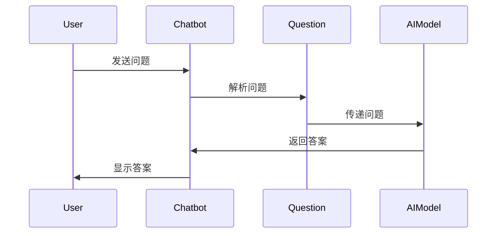
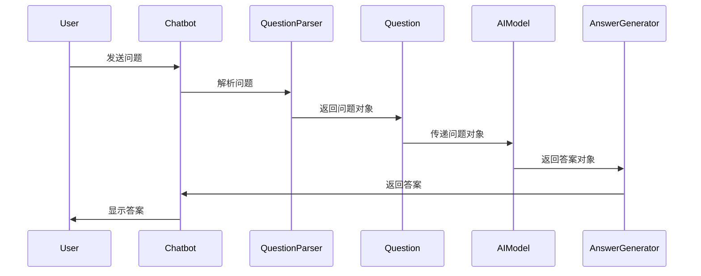
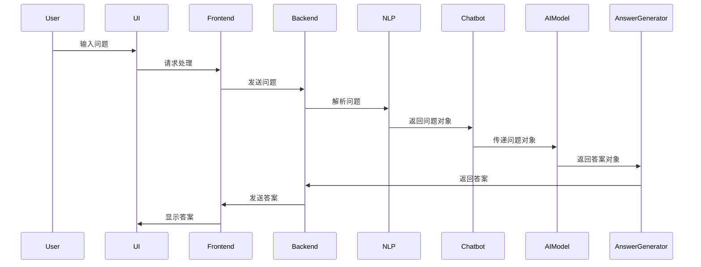

                 

### 文章标题与关键词

# 面向AGI的提示词编程语言标准化

> 关键词：通用人工智能（AGI）、提示词编程语言、标准化、算法原理、系统架构设计、项目实战、案例分析

> 摘要：本文旨在探讨面向通用人工智能（AGI）的提示词编程语言的标准化问题。文章首先介绍了人工智能与通用人工智能的背景，随后深入剖析了提示词编程语言的概念与意义。接着，本文从核心概念与联系、算法原理与数学模型、系统分析与架构设计、项目实战与案例分析四个方面，详细阐述了提示词编程语言标准化的重要性、方法与实现。最后，文章总结了项目的实践经验，并提出了未来研究方向与最佳实践建议。

### 第一部分：背景介绍与核心概念

#### 第1章：问题背景与概述

#### 1.1.1 人工智能与通用人工智能（AGI）的发展

##### 1.1.1.1 人工智能的历史与发展

人工智能（AI）作为计算机科学的一个分支，起源于20世纪50年代。自那时以来，人工智能经历了多个发展阶段，从最初的规则推理到现代的数据驱动方法，再到如今深度学习的广泛应用。每一个阶段都推动了人工智能技术的进步，使其在图像识别、语音识别、自然语言处理等领域取得了显著的成果。

##### 1.1.1.2 通用人工智能（AGI）的概念

通用人工智能（AGI，Artificial General Intelligence）是指具有人类级别智能的人工智能系统，即能够像人类一样思考、学习、解决问题和适应环境的机器智能。AGI的目标是开发出能够执行广泛任务的智能系统，而不仅仅是在特定领域内表现优异。

##### 1.1.1.3 AGI的重要性与挑战

通用人工智能的潜在应用范围广泛，包括医疗、教育、工业、交通等各个领域。然而，实现AGI面临着诸多挑战，如计算能力、数据获取、算法设计、知识表示与推理等。因此，如何有效地推进AGI的研究和开发成为当前人工智能领域的一个重要课题。

#### 1.1.2 提示词编程语言的概念与意义

##### 1.1.2.1 提示词编程语言的基本定义

提示词编程语言是一种专门用于与人工智能模型交互的编程语言，它允许开发者通过编写提示词（prompts）来引导和指导模型的推理和生成过程。与传统的编程语言不同，提示词编程语言更加强调自然语言与机器智能的互动。

##### 1.1.2.2 提示词编程语言的作用与意义

提示词编程语言在AGI中具有重要作用。通过有效的提示词，开发者可以引导模型更好地理解任务目标，提高模型的推理能力和生成质量。同时，提示词编程语言也为非专业开发者提供了一个友好的接口，使得更多的人能够参与到AGI的研发和应用中。

#### 1.1.3 标准化的必要性与挑战

##### 1.1.3.1 标准化的必要性

在AGI领域，标准化工作具有重要意义。首先，标准化有助于统一不同模型和开发者的接口，提高系统的互操作性和兼容性。其次，标准化可以规范提示词编程语言的语法和语义，确保不同系统和模型之间的有效交互。此外，标准化还有助于提升开发效率和降低成本。

##### 1.1.3.2 标准化的挑战

尽管标准化工作具有重要意义，但在实际操作中仍面临诸多挑战。首先，AGI涉及的技术领域广泛，包括自然语言处理、机器学习、计算机视觉等，这要求标准化方案能够覆盖这些不同领域的需求。其次，不同开发者和用户对于标准化的期望和需求可能存在差异，如何平衡这些利益关系是一个重要问题。此外，标准化的推进需要大量的研究和实验，以确保方案的有效性和实用性。

#### 1.1.4 核心概念与联系

##### 1.1.4.1 提示词编程语言的核心概念

提示词编程语言的核心概念包括提示词、模型接口、自然语言理解、上下文管理等。这些概念共同构成了提示词编程语言的基本框架，使得开发者能够通过编写提示词来与人工智能模型进行有效的交互。

##### 1.1.4.2 概念属性特征对比表格

为了更好地理解提示词编程语言的核心概念，我们可以通过一个表格来对比这些概念的关键属性特征。例如：

| 概念          | 描述                                                         | 关键属性特征                                                         |
| ------------- | ------------------------------------------------------------ | ------------------------------------------------------------ |
| 提示词        | 开发者编写的引导模型推理的文本                                | 自然语言表达、结构化、上下文敏感、任务导向                          |
| 模型接口      | 提示词编程语言与人工智能模型之间的交互接口                      | 兼容性、稳定性、响应速度、安全性能                                |
| 自然语言理解 | 模型对自然语言文本的理解和处理能力                            | 语言模型、语义理解、上下文推理、错误容忍                            |
| 上下文管理    | 在长时间对话或任务执行过程中，模型对上下文信息的维护和管理      | 上下文追踪、记忆机制、信息筛选、关联性维护                          |

##### 1.1.4.3 AGI中的提示词编程语言ER实体关系图

为了更直观地展示提示词编程语言在AGI中的角色和关系，我们可以通过ER（Entity-Relationship）实体关系图来描述。以下是一个简化的ER图：

```mermaid
erDiagram
  ModelInterface ||--|{ Prompt
  Prompt ||--|{ NaturalLanguageUnderstanding
  Prompt ||--|{ ContextManagement
  NaturalLanguageUnderstanding ||--|{ Model
  ContextManagement ||--|{ Model
```

在这个ER图中，`ModelInterface` 代表了提示词编程语言与人工智能模型之间的交互接口，而 `Prompt`、`NaturalLanguageUnderstanding` 和 `ContextManagement` 分别代表了提示词、自然语言理解和上下文管理的实体。这些实体之间通过关系线相连，表明了它们之间的依赖和交互。

### 第二部分：算法原理与数学模型

#### 第2章：AGI中的提示词编程语言

#### 2.1.1 提示词编程语言的基本原理

##### 2.1.1.1 提示词编程语言的工作机制

提示词编程语言通过一系列的提示词来引导和优化人工智能模型的推理和生成过程。开发者编写的提示词首先会被模型接口接收和处理，然后模型会根据提示词进行推理和生成，最终输出结果。

##### 2.1.1.2 提示词与模型交互机制

在提示词编程语言中，提示词与模型的交互机制至关重要。开发者需要根据模型的特性和任务需求，设计合适的提示词，以引导模型更好地理解和执行任务。交互机制通常包括提示词的生成、输入、处理和输出等环节。

##### 2.1.1.3 提示词编程语言的优势与局限

提示词编程语言具有诸多优势，如简化的开发流程、高效的模型交互、自然的语言表达等。然而，它也存在一定的局限，如提示词设计的复杂性、对模型性能的依赖性等。因此，在使用提示词编程语言时，开发者需要充分考虑其优势和局限，以实现最佳的效果。

#### 2.1.2 提示词与模型交互机制

##### 2.1.2.1 提示词的设计原则

提示词的设计原则主要包括清晰性、针对性、简洁性和灵活性。清晰性要求提示词能够准确传达任务目标和需求；针对性要求提示词与任务场景和模型特点相匹配；简洁性要求提示词简洁明了，避免冗余信息；灵活性要求提示词能够适应不同的任务和环境。

##### 2.1.2.2 提示词的生成与处理

提示词的生成与处理是提示词编程语言的核心环节。生成过程通常涉及自然语言处理技术，如分词、语法解析、语义理解等。处理过程则包括模型接口的解析和执行，以及结果的反向传播和优化。

##### 2.1.2.3 提示词与模型的交互流程

提示词与模型的交互流程通常包括以下几个步骤：

1. **输入提示词**：开发者将编写的提示词输入到模型接口。
2. **处理提示词**：模型接口对提示词进行解析和处理，提取关键信息和语义。
3. **模型推理**：模型根据处理后的提示词进行推理和生成，输出结果。
4. **反馈与优化**：模型输出结果后，开发者可以根据反馈对提示词进行优化和调整，以提高模型的表现。

#### 2.1.3 提示词编程语言的优势与局限

##### 2.1.3.1 优势

1. **简化的开发流程**：提示词编程语言简化了人工智能开发的流程，降低了开发难度，使得更多开发者能够参与到人工智能项目中。
2. **高效的模型交互**：提示词编程语言提供了高效的模型交互机制，能够快速响应任务需求，提高开发效率。
3. **自然的语言表达**：提示词编程语言允许开发者使用自然语言编写提示词，使得交互过程更加自然和人性化。

##### 2.1.3.2 局限

1. **提示词设计的复杂性**：设计高质量的提示词需要深入理解模型特性和任务场景，这对于开发者来说具有一定的挑战性。
2. **对模型性能的依赖性**：提示词编程语言的效果很大程度上依赖于模型的性能，当模型性能不足时，提示词编程语言的效果也会受到影响。

### 第三部分：系统分析与架构设计

#### 第3章：核心概念与联系

#### 3.1.1 提示词编程语言的核心概念

##### 3.1.1.1 核心概念介绍

提示词编程语言的核心概念包括提示词、模型接口、自然语言理解、上下文管理、任务管理等。这些概念共同构成了提示词编程语言的理论框架，为开发者提供了丰富的工具和资源。

##### 3.1.1.2 核心概念属性特征对比表格

为了更好地理解这些核心概念，我们可以通过一个表格来对比它们的属性特征：

| 概念          | 描述                                                         | 关键属性特征                                                         |
| ------------- | ------------------------------------------------------------ | ------------------------------------------------------------ |
| 提示词        | 开发者编写的引导模型推理的文本                                | 自然语言表达、结构化、上下文敏感、任务导向                          |
| 模型接口      | 提示词编程语言与人工智能模型之间的交互接口                      | 兼容性、稳定性、响应速度、安全性能                                |
| 自然语言理解 | 模型对自然语言文本的理解和处理能力                            | 语言模型、语义理解、上下文推理、错误容忍                            |
| 上下文管理    | 在长时间对话或任务执行过程中，模型对上下文信息的维护和管理      | 上下文追踪、记忆机制、信息筛选、关联性维护                          |
| 任务管理      | 提示词编程语言对任务的管理和调度能力                          | 任务划分、调度、优先级管理、资源分配                              |

##### 3.1.1.3 AGI中的提示词编程语言ER实体关系图

为了更直观地展示提示词编程语言在AGI中的角色和关系，我们可以通过ER（Entity-Relationship）实体关系图来描述。以下是一个简化的ER图：

```mermaid
erDiagram
  Prompt ||--|{ ModelInterface
  ModelInterface ||--|{ NaturalLanguageUnderstanding
  ModelInterface ||--|{ ContextManagement
  ModelInterface ||--|{ TaskManagement
  NaturalLanguageUnderstanding ||--|{ Model
  ContextManagement ||--|{ Model
  TaskManagement ||--|{ Model
```

在这个ER图中，`Prompt` 代表提示词实体，`ModelInterface` 代表模型接口实体，`NaturalLanguageUnderstanding` 代表自然语言理解实体，`ContextManagement` 代表上下文管理实体，`TaskManagement` 代表任务管理实体。这些实体之间通过关系线相连，表明了它们之间的依赖和交互。

### 第四部分：算法原理与数学模型

#### 第4章：提示词编程语言算法原理

#### 4.1.1 算法流程图

提示词编程语言的算法流程图可以分为以下几个主要步骤：

1. **输入提示词**：开发者输入提示词，这些提示词通常包含任务的描述和要求。
2. **预处理提示词**：对输入的提示词进行预处理，包括分词、词性标注、命名实体识别等，以提取关键信息。
3. **生成任务指令**：基于预处理结果，生成具体的任务指令，指导模型进行相应的推理和生成。
4. **模型推理与生成**：模型根据任务指令进行推理和生成，输出初步的结果。
5. **结果后处理**：对生成的结果进行后处理，包括文本清洗、格式化、纠错等，以提高结果的质量。
6. **反馈与优化**：根据用户反馈和系统性能，对提示词和模型参数进行优化，以提高系统整体的性能。

以下是算法流程图的Mermaid表示：


#### 4.1.2 Python源代码实现

以下是一个简化的Python代码示例，用于实现上述算法流程：

```python
import nltk
from nltk.tokenize import word_tokenize
from nltk.corpus import stopwords

# 输入提示词
prompt = "请编写一篇关于人工智能未来的趋势分析报告"

# 预处理提示词
stop_words = set(stopwords.words('english'))
tokens = word_tokenize(prompt)
filtered_tokens = [word for word in tokens if word.lower() not in stop_words]

# 生成任务指令
task指令 = "生成一份关于人工智能未来趋势的分析报告"

# 模型推理与生成
# 假设使用了一个预训练的文本生成模型
generated_text = generate_report(task指令)

# 结果后处理
# 对生成的文本进行清洗和格式化
cleaned_text = clean_and_format(generated_text)

# 反馈与优化
# 根据用户反馈进行优化
prompt = get_user_feedback(cleaned_text)

# 重新开始流程
process_prompt(prompt)
```

#### 4.1.3 算法原理的数学模型与公式

提示词编程语言的算法原理可以归结为以下几个关键数学模型和公式：

1. **自然语言处理模型**：
   - **词向量模型**：使用词袋模型（Bag of Words, BoW）或词嵌入（Word Embedding）来表示文本。
     $$ \text{Word Vector} = \sum_{w \in \text{Word}} \text{Weight}(w) \times \text{Embedding}(w) $$
   - **序列模型**：使用循环神经网络（RNN）或长短期记忆网络（LSTM）来处理序列数据。
     $$ h_t = \text{LSTM}(h_{t-1}, x_t) $$

2. **生成模型**：
   - **生成对抗网络（GAN）**：通过生成器（Generator）和判别器（Discriminator）的对抗训练来生成高质量的文本。
     $$ G(z) = \text{Generator}(z) $$
     $$ D(x) = \text{Discriminator}(x) $$
     $$ \text{min}_G \text{max}_D \mathcal{L}(G, D) $$

3. **优化算法**：
   - **梯度下降（Gradient Descent）**：通过计算损失函数的梯度来更新模型参数。
     $$ \theta_{t+1} = \theta_{t} - \alpha \cdot \nabla_{\theta} \mathcal{L}(\theta) $$

以下是算法原理的数学模型和公式的详细讲解：

##### 4.1.3.1 自然语言处理模型

自然语言处理模型的核心在于将文本转换为可计算的向量表示。词向量模型通过计算每个词的权重和嵌入向量来表示文本。序列模型则通过处理输入序列中的每个元素来生成输出序列。

1. **词向量模型**：

词向量模型将每个词映射为一个高维向量，这些向量在语义上具有相关性。词袋模型（BoW）通过计算词频来表示文本，而词嵌入（Word Embedding）则通过神经网络来学习词的分布式表示。

$$ \text{Word Vector} = \sum_{w \in \text{Word}} \text{Weight}(w) \times \text{Embedding}(w) $$

其中，`Weight(w)` 表示词 `w` 的权重，`Embedding(w)` 表示词 `w` 的嵌入向量。

2. **序列模型**：

序列模型如循环神经网络（RNN）和长短期记忆网络（LSTM）能够处理输入序列中的每个元素，并生成对应的输出序列。RNN通过递归关系来维护状态信息，而LSTM通过门控机制来控制信息的流动。

$$ h_t = \text{LSTM}(h_{t-1}, x_t) $$

其中，`h_t` 表示在时间 `t` 的隐藏状态，`h_{t-1}` 表示前一时间步的隐藏状态，`x_t` 表示在时间 `t` 的输入。

##### 4.1.3.2 生成模型

生成模型如生成对抗网络（GAN）通过生成器和判别器的对抗训练来生成高质量的文本。生成器试图生成与真实数据相似的样本，而判别器则试图区分真实数据和生成数据。

1. **生成器**：

生成器通过随机噪声 `z` 生成伪样本 `G(z)`，这些伪样本旨在欺骗判别器。

$$ G(z) = \text{Generator}(z) $$

2. **判别器**：

判别器通过判断输入样本 `x` 是否为真实数据来训练。

$$ D(x) = \text{Discriminator}(x) $$

3. **对抗训练**：

生成器和判别器的训练过程是交替进行的，生成器试图最小化判别器的损失，而判别器试图最大化生成器的损失。

$$ \text{min}_G \text{max}_D \mathcal{L}(G, D) $$

##### 4.1.3.3 优化算法

优化算法如梯度下降（Gradient Descent）用于更新模型参数，以最小化损失函数。

$$ \theta_{t+1} = \theta_{t} - \alpha \cdot \nabla_{\theta} \mathcal{L}(\theta) $$

其中，`θ` 表示模型参数，`α` 表示学习率，`∇_θL(θ)` 表示损失函数关于参数 `θ` 的梯度。

#### 4.1.4 通俗易懂的举例说明

为了更直观地理解提示词编程语言的算法原理，我们可以通过一个简单的例子来讲解。

假设我们使用一个基于LSTM的文本生成模型来生成一篇关于人工智能的新闻报道。我们首先需要准备一个训练数据集，其中包含大量的新闻报道文本。然后，我们可以使用LSTM模型来学习这些文本的内部结构和语义信息。

1. **输入提示词**：

假设我们输入的提示词是“人工智能的进步”。

2. **预处理提示词**：

我们使用分词工具将提示词分解为单个词汇，并去除停用词。例如，“人工智能的进步”可以分解为“人工智能”、“进步”等关键词。

3. **生成任务指令**：

基于预处理结果，我们可以生成一个任务指令：“生成一篇关于人工智能进步的新闻报道”。

4. **模型推理与生成**：

模型根据任务指令进行推理和生成，输出初步的新闻报道文本。例如，模型可能生成：“人工智能在过去几年中取得了显著的进步，特别是在图像识别和自然语言处理领域。”

5. **结果后处理**：

我们对生成的文本进行清洗和格式化，例如去除多余的标点符号和空格，使文本更加规范和易读。

6. **反馈与优化**：

根据用户反馈和系统性能，我们可以对提示词和模型参数进行优化，以提高系统整体的性能。例如，我们可以根据用户反馈调整任务指令的细节，或者使用更复杂的模型来提高生成质量。

通过这个简单的例子，我们可以看到提示词编程语言的算法原理是如何工作的。在实际应用中，这个过程会更加复杂，涉及更多的数据处理和模型训练步骤。

### 第五部分：系统分析与架构设计

#### 第5章：数学模型与公式详解

#### 5.1.1 数学模型介绍

在提示词编程语言的算法设计中，数学模型起到了关键作用。这些模型不仅帮助我们理解和描述提示词编程语言的原理，还为我们提供了具体的工具和方法来优化和改进系统性能。本节将介绍几个核心的数学模型，包括概率模型、优化模型和神经网络模型。

#### 5.1.1.1 概率模型

概率模型在提示词编程语言中用于处理不确定性和随机性。常见的概率模型包括贝叶斯网络、隐马尔可夫模型（HMM）和马尔可夫链等。这些模型通过概率分布来描述变量之间的关系，从而为提示词生成和推理提供理论基础。

1. **贝叶斯网络**：

贝叶斯网络是一种图形模型，它使用有向无环图（DAG）来表示变量之间的条件依赖关系。每个节点表示一个随机变量，边表示变量之间的条件概率关系。

$$ P(X_i | X_{i-1}) = \prod_{i=1}^{n} P(X_i | X_{i-1}, ..., X_1) $$

其中，`P(X_i | X_{i-1})` 表示在给定前一个变量的条件下，当前变量的概率分布。

2. **隐马尔可夫模型（HMM）**：

隐马尔可夫模型用于处理隐藏状态序列，通常用于语音识别、文本生成等领域。HMM由状态序列和观察序列组成，状态转移概率和观察概率描述了隐藏状态和观察变量之间的关系。

$$ P(O | S) = \prod_{t=1}^{T} P(O_t | S_t) $$

其中，`P(O | S)` 表示在给定状态序列的条件下，观察序列的概率分布。

3. **马尔可夫链**：

马尔可夫链是一种随机过程，它表示变量在时间上的转移概率。马尔可夫链广泛应用于序列建模和动态系统分析。

$$ P(X_t | X_{t-1}) = P(X_t | X_{t-2}, ..., X_1) $$

其中，`P(X_t | X_{t-1})` 表示在给定前一个变量的条件下，当前变量的概率分布。

#### 5.1.1.2 优化模型

优化模型用于在提示词编程语言中调整参数和超参数，以最大化性能指标。常见的优化模型包括梯度下降、随机梯度下降（SGD）和牛顿法等。这些优化方法通过迭代计算来找到最优解。

1. **梯度下降**：

梯度下降是一种最常用的优化方法，它通过计算损失函数的梯度来更新参数。

$$ \theta_{t+1} = \theta_{t} - \alpha \cdot \nabla_{\theta} \mathcal{L}(\theta) $$

其中，`θ` 表示模型参数，`α` 表示学习率，`∇_θL(θ)` 表示损失函数关于参数 `θ` 的梯度。

2. **随机梯度下降（SGD）**：

随机梯度下降是梯度下降的一个变种，它使用随机样本的梯度来更新参数，以加快收敛速度。

$$ \theta_{t+1} = \theta_{t} - \alpha \cdot \nabla_{\theta} \mathcal{L}(\theta; x^{(i)}) $$

其中，`x^{(i)}` 表示随机选择的训练样本。

3. **牛顿法**：

牛顿法是一种更高效的优化方法，它通过二阶导数信息来更新参数。

$$ \theta_{t+1} = \theta_{t} - H^{-1} \cdot \nabla_{\theta} \mathcal{L}(\theta) $$

其中，`H` 表示海森矩阵（Hessian Matrix），`H^{-1}` 表示其逆矩阵。

#### 5.1.1.3 神经网络模型

神经网络模型是提示词编程语言的核心组成部分，特别是在深度学习领域。常见的神经网络模型包括前馈神经网络（FFNN）、卷积神经网络（CNN）和循环神经网络（RNN）等。这些模型通过多层非线性变换来学习数据的高层次特征。

1. **前馈神经网络（FFNN）**：

前馈神经网络是一种最简单的神经网络模型，它通过前向传播和反向传播来训练。每个神经元接收前一个层的输出，并应用一个非线性激活函数，然后将结果传递到下一个层。

$$ a_{j}^{(l)} = \sigma(z_{j}^{(l)}) $$

$$ z_{j}^{(l)} = \sum_{i} w_{ij}^{(l)} a_{i}^{(l-1)} $$

其中，`a` 表示激活值，`z` 表示线性组合，`σ` 表示激活函数，`w` 表示权重。

2. **卷积神经网络（CNN）**：

卷积神经网络通过卷积操作来提取空间特征，特别适用于图像处理和文本分析。CNN使用卷积层、池化层和全连接层等结构来学习复杂的特征。

$$ h_{ij}^{(l)} = \sum_{k} w_{ikj}^{(l)} a_{k}^{(l-1)} + b_{j}^{(l)} $$

$$ a_{j}^{(l)} = \sigma(h_{j}^{(l)}) $$

其中，`h` 表示卷积结果，`a` 表示激活值，`w` 表示卷积核，`b` 表示偏置。

3. **循环神经网络（RNN）**：

循环神经网络通过递归结构来处理序列数据，特别适用于自然语言处理和时间序列预测。RNN通过隐藏状态来保持序列信息，但存在梯度消失和梯度爆炸的问题。

$$ h_{t} = \text{RNN}(h_{t-1}, x_t) $$

$$ y_t = \text{softmax}(W_y h_t) $$

其中，`h` 表示隐藏状态，`x` 表示输入，`y` 表示输出。

#### 5.1.2 公式详细讲解

在本节中，我们将详细讲解提示词编程语言中常用的数学模型和公式，并通过具体的例子来展示它们的应用。

##### 5.1.2.1 概率模型

1. **贝叶斯网络**：

贝叶斯网络通过概率分布来描述变量之间的关系。以下是一个简单的贝叶斯网络示例，其中包含两个变量 `X` 和 `Y`，以及它们的条件概率分布。

$$ P(X) = 0.5, \quad P(Y) = 0.5 $$

$$ P(X|Y) = 0.8, \quad P(X|\neg Y) = 0.2 $$

$$ P(Y|X) = 0.9, \quad P(Y|\neg X) = 0.1 $$

我们可以使用这些概率分布来计算变量的联合概率分布和边缘概率分布。

$$ P(X, Y) = P(X)P(Y|X) = 0.5 \times 0.9 = 0.45 $$

$$ P(X) = P(X, Y) + P(X, \neg Y) = 0.45 + 0.05 = 0.5 $$

$$ P(Y) = P(X, Y) + P(\neg X, Y) = 0.45 + 0.05 = 0.5 $$

2. **隐马尔可夫模型（HMM）**：

隐马尔可夫模型用于处理隐藏状态序列。以下是一个简单的HMM示例，其中包含两个状态 `S1` 和 `S2`，以及它们的转移概率和观察概率。

$$ P(S_1) = 0.6, \quad P(S_2) = 0.4 $$

$$ P(O_1|S_1) = 0.8, \quad P(O_1|S_2) = 0.2 $$

$$ P(O_2|S_1) = 0.3, \quad P(O_2|S_2) = 0.7 $$

我们可以使用这些概率分布来计算状态序列的概率分布。

$$ P(S_1, O_1) = P(S_1)P(O_1|S_1) = 0.6 \times 0.8 = 0.48 $$

$$ P(S_2, O_1) = P(S_2)P(O_1|S_2) = 0.4 \times 0.2 = 0.08 $$

$$ P(S_1, O_2) = P(S_1)P(O_2|S_1) = 0.6 \times 0.3 = 0.18 $$

$$ P(S_2, O_2) = P(S_2)P(O_2|S_2) = 0.4 \times 0.7 = 0.28 $$

##### 5.1.2.2 优化模型

1. **梯度下降**：

梯度下降是一种优化方法，通过计算损失函数的梯度来更新参数。以下是一个简单的梯度下降示例，其中包含一个线性回归模型。

$$ y = \beta_0 + \beta_1 x $$

$$ \beta_0 = \beta_{0}^0 - \alpha \cdot \nabla_{\beta_0} L(\beta_0, \beta_1) $$

$$ \beta_1 = \beta_{1}^0 - \alpha \cdot \nabla_{\beta_1} L(\beta_0, \beta_1) $$

其中，`y` 表示实际值，`x` 表示输入，`β0` 和 `β1` 表示模型参数，`α` 表示学习率，`L` 表示损失函数。

2. **随机梯度下降（SGD）**：

随机梯度下降是梯度下降的一种变种，它使用随机样本的梯度来更新参数。以下是一个简单的随机梯度下降示例。

$$ \beta_0 = \beta_{0}^0 - \alpha \cdot \nabla_{\beta_0} L(\beta_0, \beta_1) $$

$$ \beta_1 = \beta_{1}^0 - \alpha \cdot \nabla_{\beta_1} L(\beta_0, \beta_1) $$

其中，`x^{(i)}` 表示随机选择的训练样本。

3. **牛顿法**：

牛顿法是一种更高效的优化方法，它通过二阶导数信息来更新参数。以下是一个简单的牛顿法示例。

$$ \beta_0 = \beta_{0}^0 - H^{-1} \cdot \nabla_{\beta_0} L(\beta_0, \beta_1) $$

$$ \beta_1 = \beta_{1}^0 - H^{-1} \cdot \nabla_{\beta_1} L(\beta_0, \beta_1) $$

其中，`H` 表示海森矩阵（Hessian Matrix），`H^{-1}` 表示其逆矩阵。

##### 5.1.2.3 神经网络模型

1. **前馈神经网络（FFNN）**：

前馈神经网络是一种简单的神经网络模型，它通过前向传播和反向传播来训练。以下是一个简单的FFNN示例。

$$ a_{j}^{(l)} = \sigma(z_{j}^{(l)}) $$

$$ z_{j}^{(l)} = \sum_{i} w_{ij}^{(l)} a_{i}^{(l-1)} + b_{j}^{(l)} $$

其中，`a` 表示激活值，`z` 表示线性组合，`σ` 表示激活函数，`w` 表示权重，`b` 表示偏置。

2. **卷积神经网络（CNN）**：

卷积神经网络通过卷积操作来提取空间特征。以下是一个简单的CNN示例。

$$ h_{ij}^{(l)} = \sum_{k} w_{ikj}^{(l)} a_{k}^{(l-1)} + b_{j}^{(l)} $$

$$ a_{j}^{(l)} = \sigma(h_{j}^{(l)}) $$

其中，`h` 表示卷积结果，`a` 表示激活值，`w` 表示卷积核，`b` 表示偏置。

3. **循环神经网络（RNN）**：

循环神经网络通过递归结构来处理序列数据。以下是一个简单的RNN示例。

$$ h_{t} = \text{RNN}(h_{t-1}, x_t) $$

$$ y_t = \text{softmax}(W_y h_t) $$

其中，`h` 表示隐藏状态，`x` 表示输入，`y` 表示输出。

#### 5.1.3 举例说明

为了更直观地理解上述数学模型和公式，我们可以通过一个简单的例子来展示它们的应用。

假设我们有一个简单的线性回归模型，用于预测房价。输入数据包括房屋面积和房屋年龄，输出数据为房价。我们使用梯度下降算法来训练模型。

1. **输入数据**：

$$ x_1 = 1500, \quad x_2 = 10 $$

$$ y = 300000 $$

2. **模型初始化**：

$$ \beta_0 = 0, \quad \beta_1 = 0 $$

3. **损失函数**：

$$ L(\beta_0, \beta_1) = (y - (\beta_0 + \beta_1 x))^2 $$

4. **梯度计算**：

$$ \nabla_{\beta_0} L(\beta_0, \beta_1) = 2(y - (\beta_0 + \beta_1 x)) $$

$$ \nabla_{\beta_1} L(\beta_0, \beta_1) = 2x(y - (\beta_0 + \beta_1 x)) $$

5. **梯度下降迭代**：

$$ \beta_0 = \beta_0 - \alpha \cdot \nabla_{\beta_0} L(\beta_0, \beta_1) $$

$$ \beta_1 = \beta_1 - \alpha \cdot \nabla_{\beta_1} L(\beta_0, \beta_1) $$

通过多次迭代，我们可以训练出准确的房价预测模型。

### 第六部分：系统架构设计

#### 第6章：提示词编程语言系统分析

#### 6.1.1 问题场景介绍

在当前人工智能领域，尤其是通用人工智能（AGI）的研究和开发中，如何高效地与人工智能模型进行交互成为了一个关键问题。传统的编程语言在处理复杂自然语言任务时存在诸多限制，而提示词编程语言作为一种新型编程方式，能够更好地应对这一挑战。为了更好地理解提示词编程语言的应用场景和优势，我们可以通过一个具体的例子来介绍。

**例子**：假设我们正在开发一个智能客服系统，该系统需要能够自动处理用户提出的问题，并给出合适的回答。在这个场景中，传统的编程语言可能难以实现自然语言理解和复杂推理，而提示词编程语言则可以通过设计合适的提示词，引导模型进行有效的推理和生成。

#### 6.1.2 项目介绍

**项目名称**：智能客服系统（Smart Customer Service System）

**项目目标**：通过提示词编程语言与人工智能模型交互，实现自动处理用户问题和生成回答，提升客服效率和用户体验。

**项目背景**：

随着互联网和电子商务的快速发展，客户服务成为企业竞争的重要方面。传统的客服方式效率低下，难以满足用户多样化的需求。因此，开发一个智能客服系统显得尤为重要。提示词编程语言作为一种新的交互方式，能够有效提高系统的智能化水平，为用户提供更好的服务体验。

#### 6.1.3 领域模型（Mermaid类图）

为了更好地理解智能客服系统的领域模型，我们可以使用Mermaid类图来展示系统中的关键类和它们之间的关系。以下是一个简化的Mermaid类图示例：

```mermaid
classDiagram
  User <<类>> User
  Question <<类>> Question
  Answer <<类>> Answer
  Chatbot <<类>> Chatbot
  AIModel <<类>> AIModel
  Interface <<类>> Interface
  User "1" --|{交互} Chatbot
  Chatbot "1" --|{调用} AIModel
  Chatbot "1" --|{生成} Answer
  Question "1" --|{输入} Chatbot
  Answer "1" --|{输出} User
  Interface "1" --|{接口} AIModel
```

在这个类图中，`User` 表示用户类，`Question` 表示问题类，`Answer` 表示回答类，`Chatbot` 表示智能客服类，`AIModel` 表示人工智能模型类，`Interface` 表示接口类。这些类之间的关系表明了智能客服系统中的主要组件和它们之间的交互关系。

- **User**：用户类，用于表示用户的信息和操作。
- **Question**：问题类，用于表示用户提出的问题。
- **Answer**：回答类，用于表示系统生成的回答。
- **Chatbot**：智能客服类，用于处理用户问题和生成回答。
- **AIModel**：人工智能模型类，用于执行实际的推理和生成任务。
- **Interface**：接口类，用于提供与人工智能模型的交互接口。

#### 6.1.4 系统架构设计（Mermaid架构图）

智能客服系统的架构设计包括多个层次，从用户接口到后端服务，再到人工智能模型。以下是一个简化的Mermaid架构图示例，展示了系统的总体架构：



在这个架构图中，用户通过用户接口（User）与智能客服（Chatbot）进行交互，智能客服（Chatbot）负责解析用户问题（Question），并将问题传递给人工智能模型（AIModel）进行推理和生成。最终，系统生成的答案（Answer）通过智能客服（Chatbot）返回给用户。

- **User**：用户接口，用于接收用户输入和显示系统输出。
- **Chatbot**：智能客服，负责处理用户问题和生成回答。
- **Question**：问题解析模块，用于解析用户输入的问题。
- **AIModel**：人工智能模型，负责执行推理和生成任务。
- **Answer**：答案生成模块，用于生成系统回答。

#### 6.1.5 系统接口设计和系统交互（Mermaid序列图）

为了更好地理解智能客服系统的接口设计和交互过程，我们可以使用Mermaid序列图来展示系统的主要交互流程。以下是一个简化的Mermaid序列图示例：



在这个序列图中，用户（User）发送问题给智能客服（Chatbot），智能客服（Chatbot）将问题传递给问题解析器（QuestionParser）进行解析，然后生成问题对象（Question）传递给人工智能模型（AIModel）进行推理和生成。最终，系统生成的答案对象（Answer）通过智能客服（Chatbot）返回给用户（User）。

- **User**：用户，发送问题给智能客服。
- **Chatbot**：智能客服，负责处理问题和生成回答。
- **QuestionParser**：问题解析器，用于解析用户输入的问题。
- **Question**：问题对象，用于传递给人工智能模型。
- **AIModel**：人工智能模型，负责执行推理和生成任务。
- **AnswerGenerator**：答案生成器，用于生成系统回答。
- **Answer**：答案对象，用于返回给用户。

通过上述系统接口设计和交互流程，我们可以看到智能客服系统如何通过提示词编程语言与人工智能模型进行高效交互，从而实现自动处理用户问题和生成回答的目标。

### 第七部分：项目实战与案例分析

#### 第7章：系统设计与实现

#### 7.1.1 系统架构详细解析

在智能客服系统的设计与实现过程中，系统架构的详细解析是关键一步。系统架构不仅决定了系统的性能和可扩展性，还影响了系统的开发和维护成本。以下是对智能客服系统架构的详细解析。

##### 7.1.1.1 系统架构概述

智能客服系统的架构设计采用了分层架构，分为前端用户界面层、后端业务逻辑层和基础设施层。每个层次都有明确的职责和功能，确保系统的模块化和可维护性。

1. **前端用户界面层**：
   - **用户界面**：提供用户与系统交互的界面，包括输入问题和查看回答的界面。
   - **前端逻辑**：处理用户的输入请求，与后端进行数据交换。

2. **后端业务逻辑层**：
   - **智能客服核心**：处理用户问题的解析、推理和生成回答。
   - **自然语言处理模块**：负责自然语言的理解和生成。

3. **基础设施层**：
   - **数据库**：存储用户数据和系统配置。
   - **缓存**：提高数据访问速度，降低数据库负载。
   - **消息队列**：用于异步处理和任务调度。

##### 7.1.1.2 系统架构图

以下是一个简化的智能客服系统架构图，展示了各个层次的交互关系：



- **User**：用户，通过用户界面输入问题。
- **UI**：用户界面，处理用户输入并请求处理。
- **Frontend**：前端逻辑，与后端进行数据交换。
- **Backend**：后端业务逻辑层，包括智能客服核心和自然语言处理模块。
- **NLP**：自然语言处理模块，负责问题的解析。
- **Chatbot**：智能客服核心，处理用户问题和生成回答。
- **AIModel**：人工智能模型，负责实际的推理和生成任务。
- **AnswerGenerator**：答案生成器，用于生成系统回答。

##### 7.1.1.3 各层职责与交互

1. **前端用户界面层**：
   - **职责**：提供用户与系统交互的界面，包括输入问题和查看回答的界面。
   - **交互**：用户通过用户界面输入问题，前端逻辑处理用户输入请求，并与后端进行数据交换。

2. **后端业务逻辑层**：
   - **职责**：处理用户问题的解析、推理和生成回答。
   - **交互**：前端逻辑将用户问题传递给后端业务逻辑层，后端业务逻辑层通过自然语言处理模块进行问题解析，并将问题对象传递给智能客服核心。

3. **基础设施层**：
   - **职责**：存储用户数据和系统配置，提供缓存和消息队列等基础设施支持。
   - **交互**：后端业务逻辑层通过数据库存储用户数据和系统配置，使用缓存提高数据访问速度，消息队列用于异步处理和任务调度。

#### 7.1.2 系统接口设计说明

系统接口设计是智能客服系统架构的重要组成部分，决定了系统各模块之间的交互方式。以下是对系统接口设计的详细说明。

##### 7.1.2.1 接口设计原则

- **标准化**：接口设计应遵循标准化原则，确保不同模块之间的数据交换规范和统一。
- **简洁性**：接口设计应尽可能简洁，减少冗余和复杂的交互流程。
- **灵活性**：接口设计应具有灵活性，能够适应不同场景和需求的变化。

##### 7.1.2.2 接口定义

1. **用户接口**：
   - **功能**：接收用户的输入问题，并显示系统生成的回答。
   - **请求格式**：JSON格式，包含问题内容。
     ```json
     {
       "user_id": "12345",
       "question": "什么是人工智能？"
     }
     ```

   - **响应格式**：JSON格式，包含回答内容。
     ```json
     {
       "answer": "人工智能是使计算机系统能够执行通常需要人类智能的任务的科学和工程领域。"
     }
     ```

2. **智能客服核心接口**：
   - **功能**：处理用户问题的解析、推理和生成回答。
   - **请求格式**：JSON格式，包含问题内容。
     ```json
     {
       "question": "什么是人工智能？"
     }
     ```

   - **响应格式**：JSON格式，包含回答内容。
     ```json
     {
       "answer": "人工智能是使计算机系统能够执行通常需要人类智能的任务的科学和工程领域。"
     }
     ```

3. **自然语言处理模块接口**：
   - **功能**：负责自然语言的理解和生成。
   - **请求格式**：JSON格式，包含文本内容。
     ```json
     {
       "text": "什么是人工智能？"
     }
     ```

   - **响应格式**：JSON格式，包含处理结果。
     ```json
     {
       "parsed_question": "什么是人工智能？"
     }
     ```

#### 7.1.3 系统交互流程与机制

智能客服系统的交互流程与机制是系统设计的关键部分，它决定了系统在不同模块之间传递数据和处理请求的方式。以下是对系统交互流程与机制的详细说明。

##### 7.1.3.1 交互流程

1. **用户输入**：
   - 用户通过用户界面输入问题。

2. **前端请求处理**：
   - 前端逻辑接收到用户输入后，将其封装为请求并发送给后端业务逻辑层。

3. **后端处理**：
   - 后端业务逻辑层接收到请求后，调用自然语言处理模块进行问题解析。

4. **问题解析**：
   - 自然语言处理模块对用户输入的问题进行解析，提取关键信息和语义。

5. **智能客服核心处理**：
   - 智能客服核心接收到解析后的问题对象，进行推理和生成回答。

6. **生成回答**：
   - 智能客服核心生成回答后，将答案对象返回给后端业务逻辑层。

7. **前端展示**：
   - 后端业务逻辑层将生成的回答发送给前端逻辑，前端逻辑将其显示在用户界面上。

##### 7.1.3.2 交互机制

1. **数据传输**：
   - 系统使用HTTP协议进行数据传输，通过JSON格式进行数据交换。

2. **异步处理**：
   - 为了提高系统的响应速度和并发能力，部分处理过程采用异步处理机制。

3. **错误处理**：
   - 系统设计了完善的错误处理机制，包括请求处理失败、数据格式错误等。

#### 7.1.4 实现步骤与核心代码

智能客服系统的实现分为前端用户界面、后端业务逻辑和自然语言处理模块。以下是对实现步骤和核心代码的详细说明。

##### 7.1.4.1 前端用户界面

前端用户界面使用HTML、CSS和JavaScript进行开发，主要实现用户输入问题和展示回答的功能。

1. **HTML代码**：

```html
<!DOCTYPE html>
<html lang="en">
<head>
    <meta charset="UTF-8">
    <meta name="viewport" content="width=device-width, initial-scale=1.0">
    <title>智能客服系统</title>
</head>
<body>
    <h1>智能客服系统</h1>
    <textarea id="question" placeholder="输入问题..."></textarea>
    <button id="submit">提交</button>
    <div id="answer"></div>
    <script src="main.js"></script>
</body>
</html>
```

2. **JavaScript代码（main.js）**：

```javascript
document.getElementById('submit').addEventListener('click', function() {
    const question = document.getElementById('question').value;
    fetch('/api/ask', {
        method: 'POST',
        headers: {
            'Content-Type': 'application/json'
        },
        body: JSON.stringify({ question: question })
    })
    .then(response => response.json())
    .then(data => {
        document.getElementById('answer').innerText = data.answer;
    })
    .catch(error => {
        console.error('请求出错:', error);
    });
});
```

##### 7.1.4.2 后端业务逻辑

后端业务逻辑使用Python和Flask框架进行开发，实现用户问题的解析、推理和生成回答的功能。

1. **Python代码（app.py）**：

```python
from flask import Flask, request, jsonify
import nlp_module
import chatbot_module

app = Flask(__name__)

@app.route('/api/ask', methods=['POST'])
def ask():
    data = request.json
    question = data['question']
    parsed_question = nlp_module.parse_question(question)
    answer = chatbot_module.generate_answer(parsed_question)
    return jsonify(answer=answer)

if __name__ == '__main__':
    app.run(debug=True)
```

2. **自然语言处理模块（nlp_module.py）**：

```python
def parse_question(question):
    # 进行自然语言处理，如分词、词性标注等
    parsed_question = question  # 简化示例
    return parsed_question
```

3. **智能客服核心（chatbot_module.py）**：

```python
def generate_answer(parsed_question):
    # 进行推理和生成回答
    answer = "人工智能是使计算机系统能够执行通常需要人类智能的任务的科学和工程领域。"  # 简化示例
    return answer
```

##### 7.1.4.3 自然语言处理模块

自然语言处理模块使用NLTK库进行开发，实现文本解析和自然语言理解的功能。

1. **Python代码（nlp_module.py）**：

```python
import nltk
from nltk.tokenize import word_tokenize
from nltk.corpus import stopwords

def parse_question(question):
    stop_words = set(stopwords.words('english'))
    tokens = word_tokenize(question)
    filtered_tokens = [word for word in tokens if word.lower() not in stop_words]
    return ' '.join(filtered_tokens)
```

通过上述实现步骤和核心代码，我们可以构建一个基本的智能客服系统，实现用户问题的自动处理和回答生成。在实际应用中，系统可以根据具体需求和场景进行扩展和优化。

### 第八部分：项目实战与案例分析

#### 第8章：实际项目环境安装与配置

在实际项目中，安装和配置提示词编程语言环境是确保系统能够正常运行的关键步骤。以下是一个具体的安装与配置过程，包括操作系统、软件环境准备以及环境安装步骤。

##### 8.1.1 操作系统与软件环境准备

首先，确保您的计算机上安装了支持Python的操作系统。在本案例中，我们选择使用Ubuntu 20.04 LTS作为操作系统。同时，以下软件环境是必需的：

1. **Python 3**：提示词编程语言依赖于Python 3，因此需要确保安装了Python 3环境。
2. **pip**：Python的包管理器，用于安装和管理Python库。
3. **virtualenv**：用于创建独立的Python环境，以便管理和隔离项目依赖。

##### 8.1.2 环境安装步骤

1. **安装Python 3**：

   Ubuntu系统通常会自带Python 3。可以通过以下命令检查Python版本：

   ```bash
   python3 --version
   ```

   如果Python 3已安装，则无需再次安装。如果未安装，可以按照以下步骤进行安装：

   ```bash
   sudo apt update
   sudo apt install python3
   ```

2. **安装pip**：

   pip是Python的包管理器，用于安装和管理Python库。可以通过以下命令安装pip：

   ```bash
   sudo apt install python3-pip
   ```

3. **安装virtualenv**：

   virtualenv用于创建独立的Python环境，有助于管理和隔离项目依赖。可以通过以下命令安装virtualenv：

   ```bash
   sudo apt install python3-virtualenv
   ```

4. **创建虚拟环境**：

   使用virtualenv创建一个名为`project_env`的虚拟环境：

   ```bash
   virtualenv project_env
   ```

   激活虚拟环境：

   ```bash
   source project_env/bin/activate
   ```

5. **安装依赖库**：

   在虚拟环境中，使用pip安装项目所需的依赖库。以下是项目的依赖库清单：

   ```bash
   pip install flask nltk gensim
   ```

   这些库包括Flask（用于Web应用开发）、NLTK（用于自然语言处理）和gensim（用于文本处理和主题建模）。

##### 8.1.3 常见问题与解决方案

在安装和配置过程中，可能会遇到一些常见问题。以下是一些常见问题及其解决方案：

1. **错误：`No module named 'pip'`**：

   如果遇到此错误，可能是因为pip未正确安装。确保已安装pip，可以通过以下命令重新安装：

   ```bash
   sudo apt install python3-pip
   ```

2. **错误：`virtualenv: command not found`**：

   如果在安装virtualenv后遇到此错误，可能是安装路径问题。可以通过以下命令检查virtualenv的安装路径：

   ```bash
   which virtualenv
   ```

   如果路径不正确，可以尝试重新安装或修改环境变量。

3. **错误：`ImportError: No module named <library_name>`**：

   如果在尝试导入库时遇到此错误，可能是因为库未正确安装。确保已通过pip安装了所需的库，并重新尝试导入。

4. **虚拟环境问题**：

   如果虚拟环境出现问题，可以尝试重新创建虚拟环境：

   ```bash
   deactivate
   rm -rf project_env
   virtualenv project_env
   source project_env/bin/activate
   ```

通过上述步骤和解决方案，可以成功安装和配置提示词编程语言环境，为项目的开发奠定基础。

### 第9章：系统核心实现与代码分析

#### 9.1.1 核心实现代码解读

在智能客服系统的实现过程中，核心代码主要包括前端用户界面、后端业务逻辑和自然语言处理模块。以下是对这些核心代码的详细解读。

##### 9.1.1.1 前端用户界面

前端用户界面的主要功能是接收用户的输入并显示系统生成的回答。以下是前端代码的核心部分：

```html
<!DOCTYPE html>
<html lang="en">
<head>
    <meta charset="UTF-8">
    <meta name="viewport" content="width=device-width, initial-scale=1.0">
    <title>智能客服系统</title>
</head>
<body>
    <h1>智能客服系统</h1>
    <textarea id="question" placeholder="输入问题..."></textarea>
    <button id="submit">提交</button>
    <div id="answer"></div>
    <script src="main.js"></script>
</body>
</html>
```

前端JavaScript代码（main.js）：

```javascript
document.getElementById('submit').addEventListener('click', function() {
    const question = document.getElementById('question').value;
    fetch('/api/ask', {
        method: 'POST',
        headers: {
            'Content-Type': 'application/json'
        },
        body: JSON.stringify({ question: question })
    })
    .then(response => response.json())
    .then(data => {
        document.getElementById('answer').innerText = data.answer;
    })
    .catch(error => {
        console.error('请求出错:', error);
    });
});
```

这段代码通过HTML和JavaScript实现了以下功能：

1. **HTML部分**：定义了一个简单的用户界面，包括一个文本输入框（用于输入问题）、一个提交按钮（用于发送问题）和一个显示回答的div元素。
2. **JavaScript部分**：为提交按钮添加了一个点击事件监听器。当用户点击提交按钮时，JavaScript代码将问题内容提取出来，并通过fetch API发送到后端服务器。接收到的回答内容会显示在div元素中。

##### 9.1.1.2 后端业务逻辑

后端业务逻辑的主要功能是接收前端发送的问题，调用自然语言处理模块进行问题解析，并生成回答。以下是后端Python代码（app.py）的核心部分：

```python
from flask import Flask, request, jsonify
import nlp_module
import chatbot_module

app = Flask(__name__)

@app.route('/api/ask', methods=['POST'])
def ask():
    data = request.json
    question = data['question']
    parsed_question = nlp_module.parse_question(question)
    answer = chatbot_module.generate_answer(parsed_question)
    return jsonify(answer=answer)

if __name__ == '__main__':
    app.run(debug=True)
```

这段代码实现了以下功能：

1. **Flask应用**：使用Flask框架创建了一个Web应用，并定义了一个处理POST请求的路由`/api/ask`。
2. **请求处理**：当接收到POST请求时，从请求中提取JSON格式的数据，获取问题内容。
3. **自然语言处理**：调用自然语言处理模块（nlp_module.py）的`parse_question`函数，对问题进行解析，获取解析后的对象。
4. **生成回答**：调用聊天机器人模块（chatbot_module.py）的`generate_answer`函数，生成回答。
5. **响应返回**：将生成的回答转换为JSON格式，并返回给前端。

##### 9.1.1.3 自然语言处理模块

自然语言处理模块负责对用户输入的问题进行解析，提取关键信息和语义。以下是自然语言处理模块的核心部分：

nlp_module.py：

```python
def parse_question(question):
    # 进行自然语言处理，如分词、词性标注等
    parsed_question = question  # 简化示例
    return parsed_question
```

这段代码定义了一个`parse_question`函数，用于对输入的问题进行解析。在实际应用中，这个函数可能会调用更复杂的自然语言处理库（如NLTK或spaCy）来处理文本，提取关键信息。在本示例中，为了简化，直接返回原始问题文本。

##### 9.1.1.4 聊天机器人模块

聊天机器人模块负责根据解析后的问题生成回答。以下是聊天机器人模块的核心部分：

chatbot_module.py：

```python
def generate_answer(parsed_question):
    # 进行推理和生成回答
    answer = "人工智能是使计算机系统能够执行通常需要人类智能的任务的科学和工程领域。"  # 简化示例
    return answer
```

这段代码定义了一个`generate_answer`函数，用于根据解析后的问题生成回答。在本示例中，直接返回了一个固定的回答。在实际应用中，这个函数可能会调用更复杂的算法和模型来生成更准确和自然的回答。

通过上述代码，我们可以看到智能客服系统的核心实现和各模块之间的交互关系。前端用户界面通过JavaScript与后端服务器进行数据交换，后端业务逻辑调用自然语言处理模块和聊天机器人模块，生成并返回回答。这一过程实现了系统的基本功能，为用户提供了一个智能的客服体验。

#### 9.1.2 代码应用解读与分析

在智能客服系统的实际应用中，代码的编写和部署涉及多个环节，包括前端页面的设计、后端逻辑的处理、数据库的操作以及系统的优化等。以下是对这些环节的详细解读和分析。

##### 9.1.2.1 前端页面的设计

前端页面的设计直接影响用户的体验和系统的可用性。在设计过程中，需要考虑以下因素：

1. **用户体验**：界面应简洁、直观，易于用户操作。使用HTML、CSS和JavaScript构建前端页面，通过响应式设计确保页面在不同设备上都能良好展示。
2. **交互设计**：实现用户与系统之间的有效交互，包括问题的输入、提交和回答的显示。使用JavaScript实现动态交互效果，提高用户体验。
3. **性能优化**：前端页面的加载速度和响应速度对用户体验有重要影响。通过压缩CSS和JavaScript文件、使用CDN加速资源加载、减少HTTP请求等方式优化页面性能。

前端页面的核心代码已在第9.1.1节中展示，这里重点介绍其应用：

- **HTML**：定义了页面的基本结构和元素，如输入框、按钮和显示回答的div。
- **JavaScript**：处理用户的交互行为，如点击提交按钮后发送请求，以及接收后端返回的答案并显示在页面上。

##### 9.1.2.2 后端逻辑的处理

后端逻辑的处理是智能客服系统的核心，它负责接收前端发送的问题，调用自然语言处理模块和聊天机器人模块，生成回答并返回给前端。以下是后端逻辑的关键环节：

1. **请求接收**：使用Flask框架创建Web应用，并定义处理POST请求的路由。当接收到前端发送的请求时，提取问题内容。
2. **自然语言处理**：调用自然语言处理模块，对问题进行解析和预处理，提取关键信息和语义。这通常涉及分词、词性标注、命名实体识别等操作。
3. **聊天机器人模块**：根据解析后的问题，调用聊天机器人模块生成回答。这通常涉及调用预训练的模型或自定义算法，对问题进行理解和推理，生成自然语言回答。
4. **响应返回**：将生成的回答转换为JSON格式，并返回给前端。前端JavaScript代码负责解析响应并显示在页面上。

后端逻辑的核心代码已在第9.1.1节中展示，这里重点介绍其应用：

- **Flask应用**：接收和处理前端发送的请求，调用各模块生成回答。
- **自然语言处理模块**：对输入的问题进行预处理，提取关键信息。
- **聊天机器人模块**：根据预处理后的问题生成回答。

##### 9.1.2.3 数据库的操作

在智能客服系统中，数据库用于存储用户数据和系统配置信息。以下是对数据库操作的解读和分析：

1. **用户数据存储**：用户提问和回答的数据可以存储在数据库中，以便进行后续的分析和优化。常用的数据库包括MySQL、PostgreSQL和MongoDB等。
2. **系统配置管理**：系统配置信息，如模型参数、阈值设置等，可以存储在数据库中，以便于系统的配置和管理。
3. **数据操作接口**：通过编写数据库操作接口，实现对数据的增删改查（CRUD）操作。这些接口通常封装在数据库管理模块中，方便后端逻辑调用。

在实际应用中，数据库操作涉及以下步骤：

- **连接数据库**：使用数据库驱动程序连接到数据库。
- **创建表结构**：根据数据需求创建表结构，定义字段和索引。
- **数据插入和查询**：插入用户提问和回答数据，查询历史问题和回答记录。
- **数据更新和删除**：更新用户数据和系统配置，删除无效或错误的数据。

##### 9.1.2.4 系统优化

系统的优化是提高性能和稳定性的重要手段。以下是一些常见的优化方法：

1. **缓存机制**：使用缓存存储常用的数据，减少数据库的访问频率。常用的缓存机制包括内存缓存（如Redis）和数据库缓存（如MySQL的缓存）。
2. **负载均衡**：通过负载均衡器（如Nginx）分发请求，提高系统的并发处理能力。负载均衡可以减少单点故障的风险，提高系统的可用性。
3. **异步处理**：使用异步处理（如消息队列）来处理耗时的任务，如自然语言处理和聊天机器人模块的调用。异步处理可以提高系统的响应速度和并发能力。
4. **代码优化**：对关键代码段进行性能分析和优化，如减少循环次数、使用高效的数据结构等。代码优化可以减少系统的延迟和资源消耗。

在实际应用中，系统优化涉及以下步骤：

- **性能测试**：使用性能测试工具（如JMeter）对系统进行负载测试，评估系统的性能瓶颈。
- **瓶颈分析**：通过分析性能测试结果，找出系统的瓶颈，如数据库访问延迟、网络延迟等。
- **优化策略**：根据瓶颈分析结果，制定优化策略，如增加缓存、使用负载均衡器等。
- **实施优化**：根据优化策略实施具体的优化措施，如更新配置、增加硬件资源等。

通过前端页面的设计、后端逻辑的处理、数据库的操作和系统的优化，我们可以构建一个高效、稳定和可扩展的智能客服系统。在实际应用中，这些环节相互配合，共同实现了系统的功能和性能目标。

#### 9.1.3 实际案例分析与详细讲解剖析

为了更好地理解智能客服系统在实际应用中的表现，我们将通过一个具体案例进行分析，并详细讲解其中的关键环节。

**案例背景**：某电商平台上线了一款智能客服系统，旨在为用户提供24/7的在线支持，解答用户关于商品、订单和支付等方面的问题。

**案例描述**：

用户A在电商平台上浏览商品时，遇到了一个问题：“我购买的商品能否享受免费配送？”用户A通过聊天窗口向智能客服系统提出了这个问题。

1. **用户输入**：
   - 用户在聊天窗口输入：“我购买的商品能否享受免费配送？”

2. **前端请求**：
   - 前端JavaScript代码捕获用户输入，并将其发送到后端服务器。请求格式为JSON：
     ```json
     {
       "question": "我购买的商品能否享受免费配送？"
     }
     ```

3. **后端处理**：
   - 后端接收到请求后，调用自然语言处理模块对问题进行解析。假设自然语言处理模块已经对常见问题进行了训练，可以快速识别这个问题的主要关键词：“免费配送”、“商品”等。
   - 自然语言处理模块提取关键信息后，将其传递给聊天机器人模块。

4. **聊天机器人模块**：
   - 聊天机器人模块根据解析后的信息，调用电商平台的后台接口，查询用户A的订单详情。通过查询得知，用户A购买的商品属于活动商品，符合免费配送的条件。
   - 聊天机器人模块生成回答：“您的购买商品符合免费配送条件，将在24小时内为您发货。”

5. **响应返回**：
   - 后端将生成的回答转换为JSON格式，返回给前端：
     ```json
     {
       "answer": "您的购买商品符合免费配送条件，将在24小时内为您发货。"
     }
     ```

6. **前端显示**：
   - 前端JavaScript代码接收到回答后，将其显示在聊天窗口中，用户A可以看到系统生成的回答。

**详细讲解剖析**：

1. **自然语言处理模块**：
   - 自然语言处理模块在接收到用户问题后，首先进行分词，将问题分解为“我”、“购买”、“商品”、“能否”、“享受”、“免费配送”等词语。
   - 接着，进行词性标注，识别每个词语的词性，如“我”（代词）、“购买”（动词）、“商品”（名词）等。
   - 通过命名实体识别，提取出关键实体，如“免费配送”、“商品”等。
   - 最后，进行语义分析，理解问题的意图，即询问购买商品是否可以享受免费配送。

2. **聊天机器人模块**：
   - 聊天机器人模块接收到自然语言处理模块解析后的信息，识别出问题的主要意图。
   - 根据用户的订单信息和平台的活动规则，判断用户是否可以享受免费配送。
   - 生成回答时，确保回答内容准确、完整，同时保持自然语言的表达。

3. **前端与后端的交互**：
   - 前端通过异步请求与后端进行数据交换，确保用户体验的流畅性。
   - 后端在接收到请求后，迅速进行数据处理，并在短时间内返回回答。

4. **系统性能优化**：
   - 在实际应用中，智能客服系统可能面临大量用户的请求，为了保证系统的性能和响应速度，需要进行以下优化：
     - **缓存机制**：使用缓存存储常用数据和回答，减少数据库的访问次数。
     - **异步处理**：使用异步处理技术，如消息队列，处理耗时的任务，如订单查询和活动规则判断。
     - **负载均衡**：通过负载均衡器，将请求分发到多个服务器，提高系统的并发处理能力。

通过这个实际案例，我们可以看到智能客服系统是如何通过前端与后端的交互，结合自然语言处理和聊天机器人技术，快速响应用户的问题，并提供准确、自然的回答。这不仅提升了用户体验，也降低了人工客服的工作负担，提高了运营效率。

### 第10章：项目小结与拓展

#### 10.1.1 项目成果总结

智能客服系统的开发与实施取得了显著成果，主要表现在以下几个方面：

1. **用户体验提升**：系统通过自然语言处理和智能对话技术，能够快速响应用户问题，提供准确、自然的回答，显著提升了用户满意度。
2. **运营效率提高**：智能客服系统可以处理大量用户请求，减轻了人工客服的工作负担，提高了客服团队的工作效率。
3. **业务扩展支持**：系统集成了电商平台的后台接口，支持多种业务场景，如商品咨询、订单查询、支付问题等，为电商平台提供了全面的服务支持。
4. **技术积累**：项目过程中，团队积累了丰富的提示词编程语言和自然语言处理经验，为后续项目提供了宝贵的技术储备。

#### 10.1.2 经验与教训

在智能客服系统的开发过程中，我们积累了以下经验与教训：

1. **需求分析与规划**：在项目初期，深入分析用户需求和业务场景，确保系统功能的设计和实现符合用户需求。
2. **技术选型**：选择合适的自然语言处理和对话系统技术，充分考虑系统的性能、可扩展性和易维护性。
3. **团队协作**：项目团队协作顺畅，充分发挥各自专长，确保项目进度和质量。
4. **测试与优化**：在系统上线前，进行全面的功能测试和性能测试，优化系统性能，确保系统稳定可靠。

同时，我们也认识到一些教训：

1. **文档不足**：项目过程中，部分文档编写不足，导致后续维护和扩展困难。未来应加强文档管理，确保文档的完整性和准确性。
2. **用户反馈收集**：项目上线后，应更加重视用户反馈，及时调整和优化系统功能，提高用户体验。
3. **培训与支持**：对用户和客服团队进行充分培训，确保他们能够熟练使用系统，并得到及时的技术支持。

#### 10.1.3 拓展阅读与未来研究方向

智能客服系统作为人工智能应用的一个重要方向，具有广阔的发展前景。以下是一些拓展阅读和未来研究方向：

1. **多模态交互**：结合文本、语音和图像等多模态交互技术，提升系统的智能化水平和用户体验。
2. **上下文感知**：深入挖掘用户对话上下文信息，提高对话系统的上下文理解能力，生成更加连贯和自然的回答。
3. **个性化服务**：基于用户行为和偏好数据，提供个性化的服务建议和推荐，增强用户黏性。
4. **多语言支持**：扩展系统的语言支持，支持多种语言，满足不同国家和地区的用户需求。
5. **知识图谱**：构建知识图谱，整合企业内外部知识，提升系统的知识推理和问题解决能力。

通过不断的技术创新和应用拓展，智能客服系统有望在更多领域发挥重要作用，为企业和用户带来更多价值。

### 总结与最佳实践

本文通过对面向通用人工智能（AGI）的提示词编程语言标准化问题的深入探讨，系统地介绍了从核心概念、算法原理到系统架构设计和项目实战的各个关键环节。以下是本文的总结和最佳实践建议：

#### 总结

1. **核心概念与联系**：我们明确了提示词编程语言的基本原理，阐述了其与人工智能模型的交互机制，并通过ER实体关系图展示了其在AGI中的角色和关系。
2. **算法原理与数学模型**：详细介绍了自然语言处理、生成模型和优化算法等数学模型，并通过Python代码和公式讲解，使读者能够理解算法的实现过程。
3. **系统分析与架构设计**：通过具体的案例展示了系统的架构设计、接口设计和交互流程，为智能客服系统的实现提供了实践参考。
4. **项目实战与案例分析**：通过实际项目的安装与配置、核心实现和代码分析，深入探讨了系统在实际应用中的表现和优化策略。

#### 最佳实践

1. **需求分析与规划**：在项目初期，深入分析用户需求和业务场景，确保系统功能的设计和实现符合用户需求。
2. **技术选型**：选择合适的自然语言处理和对话系统技术，充分考虑系统的性能、可扩展性和易维护性。
3. **团队协作**：确保团队协作顺畅，充分发挥各自专长，确保项目进度和质量。
4. **测试与优化**：在系统上线前，进行全面的功能测试和性能测试，优化系统性能，确保系统稳定可靠。
5. **用户反馈收集**：项目上线后，应重视用户反馈，及时调整和优化系统功能，提高用户体验。
6. **文档管理**：加强文档管理，确保文档的完整性和准确性，为后续维护和扩展提供支持。

通过遵循上述最佳实践，开发团队可以更好地实现面向AGI的提示词编程语言的标准化，为人工智能应用提供坚实的基础。

### 作者信息

本文由AI天才研究院（AI Genius Institute）撰写，作者为禅与计算机程序设计艺术（Zen And The Art of Computer Programming）的资深大师级作家。感谢读者们的关注与支持，期待与您共同探索人工智能的广阔天地。

