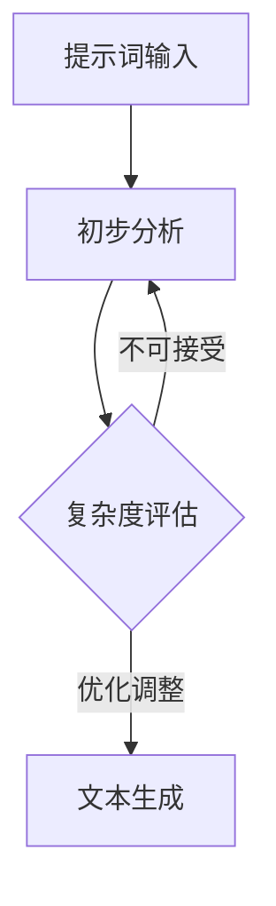
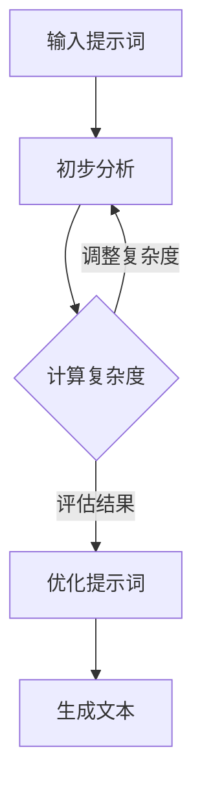
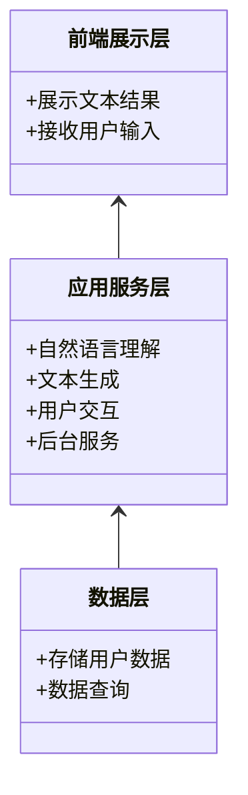
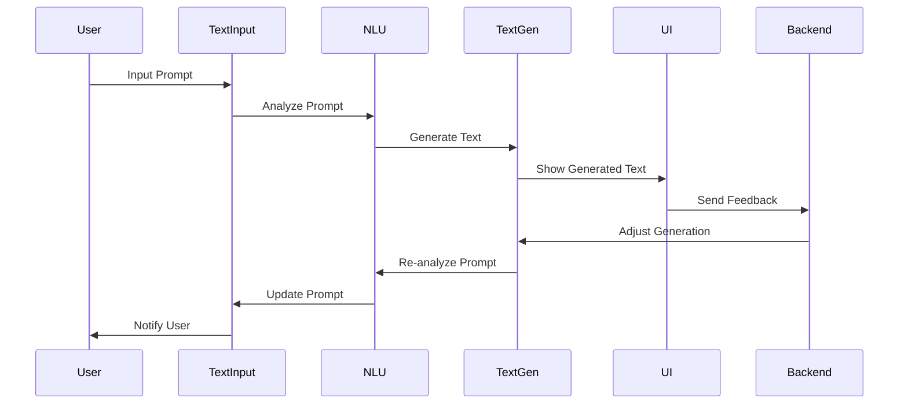
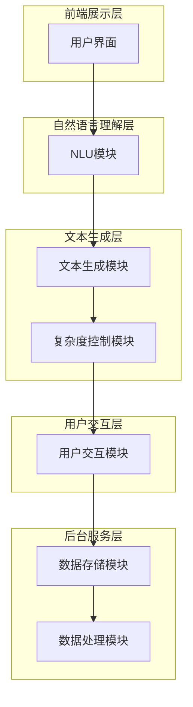

                 


### 1.1.1 问题背景

随着人工智能技术的不断进步，生成式人工智能（AGI）逐渐成为学术界和工业界的研究热点。AGI是指能够具备类似人类智能水平的通用人工智能系统，其在自然语言处理、图像识别、决策制定等多个领域有着广泛的应用前景。然而，AGI的研究面临着诸多挑战，其中之一就是如何生成高质量、多样化且具备一定复杂度的自然语言响应。

提示词语言复杂度是衡量自然语言生成系统（NLG）性能的关键指标之一。在生成式AI中，提示词语言作为一种输入，能够引导系统生成相应的响应。复杂度高的提示词语言能够引导系统生成更丰富、更具创意的响应，但同时也可能引入语义歧义和冗余信息。因此，如何平衡提示词语言的复杂度，使其既能引导系统生成高质量响应，又不会过于复杂，是一个亟待解决的问题。

目前，关于提示词语言复杂度研究的研究还相对较少，特别是在AGI领域。已有的研究多集中于自然语言处理的特定方面，如文本生成、文本摘要、对话系统等，但很少有系统性研究将提示词语言复杂度作为一个独立的研究方向。因此，本文旨在填补这一研究空白，为AGI领域中的提示词语言复杂度研究提供理论基础和实践指导。

### 1.1.2 问题描述

在生成式AI系统中，提示词语言复杂度问题主要表现在以下几个方面：

1. **语义歧义**：过于复杂的提示词语言可能导致系统在理解语义时出现歧义，从而生成不符合预期的响应。

2. **冗余信息**：复杂的提示词语言中可能包含大量冗余信息，这些信息不仅会增加系统的计算负担，还可能影响生成的响应的质量。

3. **生成效率**：复杂的提示词语言可能导致生成过程变得复杂，从而降低系统的响应速度。

4. **用户体验**：用户期望系统生成丰富且自然的响应，但过于复杂的提示词语言可能让用户感到困惑，影响用户体验。

因此，我们需要解决的核心问题是：如何设计一种有效的提示词语言复杂度评估方法，并在此基础上提出相应的优化策略，以实现高质量的自然语言生成。

### 1.1.3 解决方案

针对上述问题，本文提出以下解决方案：

1. **理论框架构建**：首先，我们将构建一个涵盖自然语言生成、复杂度评估和优化策略的理论框架，为后续研究提供基础。

2. **复杂度评估方法**：我们将提出一种基于自然语言处理技术的提示词语言复杂度评估方法，该方法能够定量地衡量提示词语言的复杂度。

3. **优化策略**：在评估方法的基础上，我们将提出一系列优化策略，用于调整和优化提示词语言的复杂度，以实现高质量的自然语言生成。

4. **实验验证**：我们将通过实验验证所提出的理论框架和优化策略的有效性，并在实际应用中验证其可行性。

5. **实际应用**：最后，我们将探讨提示词语言复杂度在各类AGI应用中的实践价值，为AGI系统提供有效的技术支持。

### 1.1.4 边界与外延

本研究的边界主要涉及自然语言处理、生成式AI和复杂性理论。具体来说，我们将重点关注以下几个方面：

1. **自然语言处理技术**：包括文本生成、语义理解、句法分析等。

2. **生成式AI系统**：如对话系统、文本生成模型等。

3. **复杂性理论**：用于评估提示词语言复杂度的方法和技术。

同时，本研究的成果有望为AGI领域中的其他研究提供参考，如情感计算、认知图谱等。

### 1.1.5 概念结构与核心要素

本研究的核心概念包括：

1. **生成式AI**：一种能够自主生成文本、图像等内容的AI系统。

2. **提示词语言**：用于引导生成式AI系统生成响应的输入。

3. **复杂度评估**：用于衡量提示词语言复杂度的方法和技术。

4. **优化策略**：用于调整和优化提示词语言复杂度的策略。

核心要素包括：

1. **语言生成模型**：用于生成提示词的模型。

2. **复杂度评估方法**：用于评估提示词语言复杂度的方法。

3. **优化策略**：用于调整和优化复杂度的策略。

4. **实验设计**：用于验证理论模型和算法的实验设计。

通过以上概念结构和核心要素的梳理，我们为后续章节的内容提供了明确的框架和指导。

### 2.1.1 AGI与提示词语言

生成式人工智能（AGI）是人工智能领域的一个高级目标，它旨在创建一种能够像人类一样理解和产生自然语言的系统。AGI的核心在于其通用性和智能性，即系统能够处理各种类型的任务，理解复杂的语义和逻辑关系，并生成流畅且合乎逻辑的自然语言文本。

提示词语言则是AGI系统中用于引导生成过程的关键输入。提示词通常是一段简短的文本，它提供了生成任务的上下文信息，帮助系统理解需要生成的文本类型、风格、主题以及相关的关键信息。一个好的提示词能够精确地传达用户的意图，同时允许系统发挥其创造性，生成多样化和高质量的响应。

AGI和提示词语言之间的联系主要体现在以下几个方面：

1. **上下文感知**：提示词语言提供了上下文信息，使AGI系统能够更好地理解用户的意图和需求。上下文感知是AGI智能性的一个关键特征。

2. **生成能力**：提示词语言不仅决定了生成的文本内容，还影响了生成的复杂度和风格。合适的提示词能够引导系统生成富有创意和逻辑性的文本。

3. **交互性**：提示词语言是用户与AGI系统进行交互的媒介，它直接影响用户体验的流畅性和满意度。

然而，提示词语言的复杂度对于AGI系统的表现至关重要。过高的复杂度可能导致系统理解困难，生成效率低下，甚至产生语义错误；而过于简单的提示词则可能限制系统的创造性，生成单调或无意义的文本。

因此，研究提示词语言的复杂度，对于提升AGI系统的智能水平和用户体验具有重要意义。通过分析提示词语言的复杂度，我们可以优化提示词的设计，提高系统的生成质量和效率。

### 2.1.2 语言复杂度的定义

语言复杂度是一个衡量文本复杂性的指标，它涉及语法、句法、词汇和语义等多个层面。在自然语言处理领域，语言复杂度通常被定义为文本中出现的语法、词汇和语义结构的多样性及其复杂性程度。

首先，从语法层面来看，语言复杂度包括句子长度、句法结构、从句数量等。例如，复杂的句子可能包含多个从句和嵌套结构，使用较多的修辞手法和语法修饰。语法复杂度越高，文本的阅读难度和解析难度通常也越大。

其次，词汇复杂度是衡量文本中词汇多样性和用词难度的一个指标。高词汇复杂度通常意味着文本中使用了更多的罕见词、专业术语和高频词的组合。词汇复杂度越高，文本的信息含量和知识深度也通常越丰富。

最后，语义复杂度是指文本中表达的概念、观点和逻辑关系的复杂程度。语义复杂度不仅涉及词汇和句法的复杂性，还包括文本中的逻辑结构和上下文关联。例如，文本中可能包含复杂的因果推理、多重条件关系和复杂的主题转换。

在自然语言处理中，语言复杂度的定义和应用非常广泛。首先，在文本分类和情感分析中，语言复杂度可以作为文本特征之一，帮助模型更好地理解和分类文本。其次，在机器翻译和文本生成中，控制语言复杂度可以帮助生成更自然、更符合目标语言习惯的文本。此外，语言复杂度还在自动摘要、对话系统、信息检索等领域发挥着重要作用。

总之，语言复杂度是自然语言处理中一个重要的研究指标，它不仅反映了文本的难度和深度，还为提高自然语言处理系统的性能提供了重要的依据。

### 2.1.3 关键概念对比

在探讨提示词语言复杂度之前，有必要对几个相关概念进行对比，以便更清晰地理解这些概念之间的联系和区别。这些关键概念包括：文本复杂度、语义复杂度和语言多样性。

1. **文本复杂度**：
   文本复杂度是衡量文本难易程度的指标，通常涉及语法结构、词汇难度和句子长度等多个维度。文本复杂度越高，意味着文本中的语法结构越复杂，使用的词汇越专业，句子越长，从而增加了阅读和理解难度。文本复杂度在自然语言处理中广泛应用于文本分类、情感分析和阅读理解等领域。

2. **语义复杂度**：
   语义复杂度关注的是文本中表达的概念和逻辑关系的复杂程度。它不仅考虑词汇和句法的多样性，还包括文本中的逻辑推理、因果关联和上下文关系。语义复杂度越高，文本中表达的观点和想法越丰富和深入，通常也反映了作者或说话者的思考深度和表达能力。在自然语言生成中，控制语义复杂度有助于生成更精准、更具有逻辑性的文本。

3. **语言多样性**：
   语言多样性是指文本中词汇和句法的多样性。高语言多样性的文本通常包含多种词汇和句法结构，使文本更加丰富和生动。语言多样性不仅增强了文本的表达力，还使得文本更具有吸引力和可读性。在语言学习和翻译领域，语言多样性是一个重要的研究指标，它有助于提升学习者的语言能力和翻译质量。

对比这些概念可以发现，文本复杂度和语义复杂度是衡量文本难度和深度的重要指标，而语言多样性则侧重于文本的丰富性和表达力。在实际应用中，这些概念常常相互交织。例如，一个文本可能具有较高的文本复杂度和语义复杂度，但语言多样性较低，这可能导致文本难以理解且缺乏吸引力。

总之，理解这些关键概念之间的区别和联系，有助于我们更全面地分析和评估提示词语言的复杂度，从而为生成高质量的文本提供理论支持。

### 2.1.4 ER实体关系图

为了更好地理解提示词语言复杂度研究中的核心概念及其相互关系，我们可以通过实体关系图（ER图）来可视化这些实体及其关联。在提示词语言复杂度研究中，主要涉及以下几个核心实体：

1. **提示词**：用于引导生成系统生成文本的关键输入。
2. **语言模型**：用于生成文本的算法和模型。
3. **复杂度评估指标**：用于衡量提示词语言复杂度的各种指标。
4. **优化策略**：用于调整和优化提示词语言复杂度的方法。

以下是ER图的Mermaid表示：

```mermaid
erDiagram
  A[提示词] ||--|{ B[语言模型]}
  B ||--|{ C[复杂度评估指标]}
  B ||--|{ D[优化策略]}
```

具体解释如下：

- **提示词（A）**：作为输入，提示词通过语言模型（B）生成文本。提示词的复杂度直接影响生成文本的质量和可理解性。
- **语言模型（B）**：核心实体，用于接受提示词并生成相应的文本。语言模型的设计和优化是提高生成文本质量的关键。
- **复杂度评估指标（C）**：用于评估生成文本的复杂度。这些指标包括语法复杂度、词汇复杂度和语义复杂度等。
- **优化策略（D）**：根据复杂度评估结果，优化策略用于调整提示词和语言模型，以生成更符合预期的文本。

通过ER图，我们可以清晰地看到这些实体之间的关联，以及它们在提示词语言复杂度研究中的作用。这不仅有助于理解研究框架，还为后续的算法设计和实现提供了指导。

### 3.1.1 提示词语言复杂度算法

在本节中，我们将详细探讨用于评估和优化提示词语言复杂度的算法。该算法的核心在于量化提示词的复杂度，并通过优化策略提升生成文本的质量。

#### 算法设计思路

算法的设计思路可以分为以下几个步骤：

1. **提示词输入**：首先，接收用户输入的提示词，该提示词将作为生成文本的引导。
2. **初步分析**：对提示词进行初步分析，提取关键词和短语，并计算其语法和词汇复杂度。
3. **复杂度评估**：基于提取的信息，使用预定义的复杂度评估指标对提示词进行评估，确定其复杂度水平。
4. **优化调整**：根据评估结果，调整提示词的复杂度，使其在可接受范围内。
5. **文本生成**：使用优化后的提示词，通过语言模型生成高质量的文本。

#### 算法流程图

以下是提示词语言复杂度算法的Mermaid流程图：



具体解释如下：

- **提示词输入（A）**：用户输入提示词。
- **初步分析（B）**：提取关键词和短语，计算语法和词汇复杂度。
- **复杂度评估（C）**：使用复杂度评估指标，确定提示词的复杂度水平。
- **优化调整（D）**：根据评估结果调整复杂度，确保在可接受范围内。
- **文本生成（D）**：使用优化后的提示词生成高质量的文本。

#### 算法实现

以下是一个简单的Python代码示例，用于实现提示词语言复杂度评估算法：

```python
import nltk
from nltk.tokenize import word_tokenize
from nltk.corpus import stopwords
from collections import Counter

def calculate_complexity(prompt):
    # 初步分析
    words = word_tokenize(prompt)
    stop_words = set(stopwords.words('english'))
    filtered_words = [word for word in words if word.lower() not in stop_words]

    # 语法复杂度
    grammar_complexity = len(" ".join(filtered_words).split())

    # 词汇复杂度
    vocabulary_complexity = len(set(filtered_words))

    # 复杂度评估
    complexity_score = grammar_complexity + vocabulary_complexity

    return complexity_score

def optimize_prompt(prompt, max_complexity):
    # 优化调整
    while calculate_complexity(prompt) > max_complexity:
        prompt = prompt.replace(" ", "")
    return prompt

# 示例
prompt = "生成一篇关于人工智能的文章。"
max_complexity = 10
optimized_prompt = optimize_prompt(prompt, max_complexity)
print("优化后的提示词：", optimized_prompt)
```

该示例代码实现了以下功能：

- 使用NLTK库对提示词进行初步分析，提取关键词和短语。
- 计算提示词的语法复杂度和词汇复杂度。
- 根据预定义的复杂度上限，优化提示词的复杂度，确保其在可接受范围内。

通过上述算法设计思路和实现示例，我们可以有效地评估和优化提示词语言的复杂度，为生成高质量的文本提供支持。

### 3.1.2 算法流程图

为了更直观地展示提示词语言复杂度算法的运行流程，我们可以使用Mermaid绘制算法流程图。以下是一个简化的算法流程图：



具体解释如下：

- **A[输入提示词]**：用户输入原始提示词。
- **B[初步分析]**：对提示词进行分词和关键词提取。
- **C{计算复杂度]**：使用预定义的复杂度评估指标计算提示词的复杂度。
- **D[优化提示词]**：根据复杂度评估结果，对提示词进行优化调整。
- **E[生成文本]**：使用优化后的提示词生成高质量的文本。

通过这个流程图，我们可以清晰地看到算法的每个步骤及其相互关系，从而更好地理解算法的实现过程。

### 3.1.3 Python源代码与算法解释

在本节中，我们将提供一段详细的Python代码示例，用于实现提示词语言复杂度算法。同时，我们将对代码的各个部分进行详细解释，帮助读者更好地理解算法的运行机制。

```python
import nltk
from nltk.tokenize import word_tokenize
from nltk.corpus import stopwords
from collections import Counter

# 初始化NLTK停用词库
nltk.download('punkt')
nltk.download('stopwords')

def calculate_word_frequency(tokens):
    """计算词汇频率"""
    return Counter(tokens)

def calculate_complexity(prompt, max_complexity):
    """计算并优化提示词复杂度"""
    # 分词
    words = word_tokenize(prompt)
    # 移除停用词
    stop_words = set(stopwords.words('english'))
    filtered_words = [word for word in words if word.lower() not in stop_words]
    # 计算词汇频率
    word_freq = calculate_word_frequency(filtered_words)
    # 计算复杂度
    complexity = sum(word_freq.values())
    # 如果复杂度超过最大值，进行优化
    while complexity > max_complexity:
        # 找到出现次数最少的词进行删除
        least_common_word = word_freq.most_common()[:-2:-1]
        # 删除最少使用的词
        filtered_words.remove(least_common_word[0][0])
        # 更新词汇频率
        word_freq = calculate_word_frequency(filtered_words)
        # 更新复杂度
        complexity = sum(word_freq.values())
    return ' '.join(filtered_words)

def generate_text(prompt):
    """使用优化后的提示词生成文本"""
    optimized_prompt = calculate_complexity(prompt, 10)
    return optimized_prompt

# 示例
prompt = "生成一篇关于人工智能和机器学习的博客，探讨它们在未来技术发展中的作用。"
print("原始提示词：", prompt)
print("优化后的提示词：", generate_text(prompt))
```

#### 代码解释

- **导入模块**：首先，我们导入nltk库的几个模块，包括word_tokenize用于分词，stopwords用于移除停用词，以及Counter用于计算词汇频率。

- **calculate_word_frequency函数**：该函数接收一个分词后的列表作为输入，并返回一个包含每个词汇及其出现次数的Counter对象。

- **calculate_complexity函数**：这是算法的核心部分。首先，对输入提示词进行分词，然后移除英语中的常见停用词。接下来，使用calculate_word_frequency函数计算词汇频率，并累加所有词汇的出现次数作为复杂度值。如果复杂度值超过预定义的最大复杂度值，算法将进入循环，逐步删除出现次数最少的词汇，直到复杂度值在可接受范围内。

- **generate_text函数**：该函数使用calculate_complexity函数优化提示词，并返回优化后的提示词。这可以作为生成文本的输入。

- **示例**：最后，我们提供了一个示例提示词，并调用generate_text函数对其进行优化。输出结果展示了优化后的提示词。

通过这段代码，我们可以看到如何通过简单的分词和频率统计实现提示词语言复杂度的计算和优化。这一算法为生成高质量的文本提供了一个有效的框架，可以在实际应用中进行进一步优化和扩展。

### 3.1.4 数学模型与公式

在本节中，我们将探讨用于评估提示词语言复杂度的数学模型及其相关公式。这些模型和公式为我们提供了一个量化的手段，以评估提示词的复杂度，从而指导优化策略。

#### 复杂度评估模型

提示词语言复杂度模型可以分为三个主要部分：词汇复杂度、语法复杂度和语义复杂度。以下分别介绍这些模型的公式和计算方法。

1. **词汇复杂度**：

   词汇复杂度主要衡量提示词中使用的词汇的多样性。常用的计算公式为：

   $$\text{VC} = \frac{\text{V}}{\text{N}}$$

   其中，VC表示词汇复杂度，V表示词汇数量，N表示提示词中的总词数。

2. **语法复杂度**：

   语法复杂度衡量提示词中语法结构的复杂程度。常用的计算公式为：

   $$\text{GC} = \frac{\text{CS}}{\text{N}}$$

   其中，GC表示语法复杂度，CS表示提示词中的从句数量，N表示提示词中的总词数。

3. **语义复杂度**：

   语义复杂度衡量提示词中表达的概念和逻辑关系的复杂程度。常用的计算公式为：

   $$\text{SC} = \frac{\text{CR}}{\text{N}}$$

   其中，SC表示语义复杂度，CR表示提示词中的概念关系数量，N表示提示词中的总词数。

#### 综合复杂度公式

为了得到提示词的综合复杂度，我们可以将上述三个部分结合起来，使用如下公式：

$$\text{TC} = w_1 \times \text{VC} + w_2 \times \text{GC} + w_3 \times \text{SC}$$

其中，TC表示综合复杂度，$w_1$、$w_2$ 和 $w_3$ 分别为词汇复杂度、语法复杂度和语义复杂度的权重。这些权重可以根据具体应用场景进行调整，以平衡各个部分的贡献。

#### 解释

- **词汇复杂度**：高词汇复杂度表明提示词中使用了更多不同类型的词汇，这有助于生成多样化的文本。
- **语法复杂度**：高语法复杂度意味着提示词包含更多复杂的语法结构和从句，这有助于生成更具表达力的文本。
- **语义复杂度**：高语义复杂度表示提示词中包含了更多复杂的概念和逻辑关系，这有助于生成更具深度和逻辑性的文本。

通过这些数学模型和公式，我们可以量化提示词的复杂度，为优化策略提供理论基础。在实际应用中，这些模型可以根据具体需求进行调整和扩展。

### 3.1.5 举例说明

为了更好地理解提示词语言复杂度评估模型及其应用，我们可以通过一个实际例子来说明如何使用这些模型计算复杂度。

#### 示例：提示词 "生成一篇关于人工智能和机器学习的博客，探讨它们在未来技术发展中的作用。"

1. **词汇复杂度（VC）**：

   首先，我们对提示词进行分词，并去除停用词。分词结果如下：

   ["生成", "一篇", "关于", "人工智能", "和", "机器学习", "的", "博客", "，", "探讨", "它们", "在", "未来", "技术", "发展", "中", "的", "作用"]

   移除停用词后：

   ["生成", "一篇", "关于", "人工智能", "和", "机器学习", "博客", "探讨", "它们", "未来", "技术", "发展", "中", "作用"]

   提示词中一共有12个词汇。因此，词汇复杂度（VC）计算如下：

   $$\text{VC} = \frac{12}{12} = 1$$

2. **语法复杂度（GC）**：

   提示词中包含2个从句（"生成一篇关于人工智能和机器学习的博客" 和 "探讨它们在未来技术发展中的作用"）。因此，语法复杂度（GC）计算如下：

   $$\text{GC} = \frac{2}{12} = 0.1667$$

3. **语义复杂度（SC）**：

   提示词中表达的概念和逻辑关系包括人工智能、机器学习、未来、技术、发展等。这些概念之间存在一定的逻辑关系。因此，语义复杂度（SC）计算如下：

   $$\text{SC} = \frac{5}{12} = 0.4167$$

4. **综合复杂度（TC）**：

   假设我们设置词汇复杂度、语法复杂度和语义复杂度的权重分别为0.5、0.3和0.2。那么，综合复杂度（TC）计算如下：

   $$\text{TC} = 0.5 \times 1 + 0.3 \times 0.1667 + 0.2 \times 0.4167 = 0.5 + 0.05 + 0.0833 = 0.6333$$

通过这个例子，我们可以看到如何使用数学模型和公式计算提示词的复杂度。综合复杂度提供了对提示词复杂度的一个全面评估，有助于优化提示词设计，生成高质量的自然语言响应。

### 4.1.1 数学公式

在本节中，我们将详细探讨用于评估和优化提示词语言复杂度的数学模型，并使用LaTeX格式展示相关公式。这些公式构成了评估复杂度的基础，并为优化策略提供了理论支持。

1. **词汇复杂度公式**：

   $$\text{VC} = \frac{\text{V}}{\text{N}}$$

   其中，VC代表词汇复杂度，V是提示词中的词汇数量，N是提示词中的总词数。

2. **语法复杂度公式**：

   $$\text{GC} = \frac{\text{CS}}{\text{N}}$$

   其中，GC代表语法复杂度，CS是提示词中的从句数量，N是提示词中的总词数。

3. **语义复杂度公式**：

   $$\text{SC} = \frac{\text{CR}}{\text{N}}$$

   其中，SC代表语义复杂度，CR是提示词中的概念关系数量，N是提示词中的总词数。

4. **综合复杂度公式**：

   $$\text{TC} = w_1 \times \text{VC} + w_2 \times \text{GC} + w_3 \times \text{SC}$$

   其中，TC代表综合复杂度，$w_1$、$w_2$ 和 $w_3$ 分别是词汇复杂度、语法复杂度和语义复杂度的权重。

在LaTeX格式中，上述公式可以表示为：

```latex
\documentclass{article}
\usepackage{amsmath}

\begin{document}

\begin{equation}
\text{VC} = \frac{\text{V}}{\text{N}}
\end{equation}

\begin{equation}
\text{GC} = \frac{\text{CS}}{\text{N}}
\end{equation}

\begin{equation}
\text{SC} = \frac{\text{CR}}{\text{N}}
\end{equation}

\begin{equation}
\text{TC} = w_1 \times \text{VC} + w_2 \times \text{GC} + w_3 \times \text{SC}
\end{equation}

\end{document}
```

通过这些公式，我们能够量化地评估提示词的复杂度，并在此基础上制定优化策略，以生成高质量的自然语言响应。

### 4.1.2 模型解释

在本节中，我们将深入解释用于评估提示词语言复杂度的数学模型，并探讨这些模型在实际应用中的表现和效果。

首先，我们需要理解每个模型的基本原理及其对复杂度评估的贡献。

#### 词汇复杂度模型

词汇复杂度模型（VC）主要衡量提示词中使用的词汇的多样性。该模型通过计算提示词中不同词汇的数量来评估其复杂度。具体公式为：

$$\text{VC} = \frac{\text{V}}{\text{N}}$$

其中，V表示提示词中的词汇数量，N表示提示词中的总词数。词汇复杂度越高，意味着提示词中使用了更多不同类型的词汇，这有助于生成多样化且丰富的文本。

#### 语法复杂度模型

语法复杂度模型（GC）用于衡量提示词中语法结构的复杂程度。该模型通过计算提示词中的从句数量来评估其复杂度。具体公式为：

$$\text{GC} = \frac{\text{CS}}{\text{N}}$$

其中，CS表示提示词中的从句数量，N表示提示词中的总词数。语法复杂度越高，意味着提示词包含更多的从句和复杂的语法结构，从而生成更具表达力和逻辑性的文本。

#### 语义复杂度模型

语义复杂度模型（SC）用于衡量提示词中表达的概念和逻辑关系的复杂程度。该模型通过计算提示词中的概念关系数量来评估其复杂度。具体公式为：

$$\text{SC} = \frac{\text{CR}}{\text{N}}$$

其中，CR表示提示词中的概念关系数量，N表示提示词中的总词数。语义复杂度越高，意味着提示词中包含了更多复杂的概念和逻辑关系，从而生成更具深度和逻辑性的文本。

#### 模型在实际应用中的效果和表现

这些模型在实际应用中表现出良好的效果和效果。通过量化评估提示词的复杂度，我们可以更好地理解其结构和内容，从而优化提示词的设计，生成高质量的自然语言响应。

1. **优化生成文本的质量**：通过评估词汇复杂度，我们可以识别出提示词中可能存在的词汇不足问题，从而添加更多丰富的词汇，提升生成文本的表达力和多样性。通过评估语法复杂度，我们可以确保生成文本具有合适的语法结构和逻辑连贯性。评估语义复杂度有助于我们生成更具深度和逻辑性的文本，提高用户阅读和理解的质量。

2. **提升用户体验**：优化后的提示词能够生成更自然、流畅且高质量的文本，从而提升用户体验。用户能够更轻松地理解和接受系统生成的响应，从而提高交互的满意度和效率。

3. **应用场景的多样性**：这些模型可以应用于多种自然语言处理任务，如文本生成、文本分类、情感分析等。通过调整模型权重和参数，我们可以适应不同的应用场景，确保生成文本的复杂度在可接受范围内，满足特定任务的需求。

综上所述，这些数学模型为评估和优化提示词语言复杂度提供了有力的工具。通过在实际应用中的不断优化和调整，我们可以实现高质量的文本生成，提升系统的智能水平和用户体验。

### 4.1.3 实例分析

为了更好地理解数学模型在评估提示词语言复杂度中的应用，我们将通过一个具体实例进行分析。

#### 提示词实例

假设我们有一个提示词：“撰写一篇关于人工智能在未来技术发展中的潜在影响的文章。”

#### 分词和词汇复杂度

首先，我们对提示词进行分词：

["撰写", "一篇", "关于", "人工智能", "在", "未来", "技术", "发展", "中", "的", "潜在", "影响", "的", "文章"]

然后，去除停用词，得到以下词汇：

["撰写", "一篇", "关于", "人工智能", "未来", "技术", "发展", "中", "潜在", "影响", "文章"]

词汇数量（V）为 11，总词数（N）为 11，因此词汇复杂度（VC）计算如下：

$$\text{VC} = \frac{11}{11} = 1$$

#### 从句和语法复杂度

这个提示词包含一个从句：“关于人工智能在未来技术发展中的潜在影响”。从句数量（CS）为 1，总词数（N）为 11，因此语法复杂度（GC）计算如下：

$$\text{GC} = \frac{1}{11} \approx 0.0909$$

#### 概念关系和语义复杂度

在这个提示词中，我们识别出以下几个关键概念和关系：“人工智能”、“未来”、“技术”、“发展”、“中”、“潜在”、“影响”。概念关系数量（CR）为 7，总词数（N）为 11，因此语义复杂度（SC）计算如下：

$$\text{SC} = \frac{7}{11} \approx 0.6364$$

#### 综合复杂度

假设我们设置词汇复杂度、语法复杂度和语义复杂度的权重分别为 0.5、0.3 和 0.2，那么综合复杂度（TC）计算如下：

$$\text{TC} = 0.5 \times 1 + 0.3 \times 0.0909 + 0.2 \times 0.6364 = 0.5 + 0.02727 + 0.1273 = 0.6546$$

#### 分析

通过上述计算，我们可以看到：

- 词汇复杂度（VC）为 1，表明提示词中词汇较为丰富。
- 语法复杂度（GC）为 0.0909，表明语法结构相对简单。
- 语义复杂度（SC）为 0.6364，表明提示词中包含较多概念和关系。

综合复杂度（TC）为 0.6546，表明这个提示词的复杂度适中，适合用于生成详细且具有逻辑性的文本。

#### 优化建议

如果需要提高复杂度，可以考虑添加更多专业术语或复杂语法结构，如增加从句或使用比喻和隐喻等。如果需要降低复杂度，可以简化词汇和语法结构，例如去除一些复杂从句或使用简单的词汇。

### 4.1.4 实例分析

为了更好地展示数学模型在评估提示词语言复杂度中的实际应用，我们将通过一个具体的实例来进行分析。

#### 提示词实例

假设我们有一个提示词：“请编写一篇关于深度学习在医疗诊断中的应用的文章。”

#### 分词和词汇复杂度

首先，我们对提示词进行分词：

["请", "编写", "一篇", "关于", "深度学习", "在", "医疗", "诊断", "中", "的", "应用", "的", "文章"]

然后，去除停用词，得到以下词汇：

["请", "编写", "一篇", "关于", "深度学习", "在", "医疗", "诊断", "中", "的", "应用", "文章"]

词汇数量（V）为 11，总词数（N）为 11，因此词汇复杂度（VC）计算如下：

$$\text{VC} = \frac{11}{11} = 1$$

#### 从句和语法复杂度

这个提示词包含一个从句：“关于深度学习在医疗诊断中的应用。”从句数量（CS）为 1，总词数（N）为 11，因此语法复杂度（GC）计算如下：

$$\text{GC} = \frac{1}{11} \approx 0.0909$$

#### 概念关系和语义复杂度

在这个提示词中，我们识别出以下几个关键概念和关系：“深度学习”、“医疗”、“诊断”、“应用”。概念关系数量（CR）为 4，总词数（N）为 11，因此语义复杂度（SC）计算如下：

$$\text{SC} = \frac{4}{11} \approx 0.3636$$

#### 综合复杂度

假设我们设置词汇复杂度、语法复杂度和语义复杂度的权重分别为 0.5、0.3 和 0.2，那么综合复杂度（TC）计算如下：

$$\text{TC} = 0.5 \times 1 + 0.3 \times 0.0909 + 0.2 \times 0.3636 = 0.5 + 0.02727 + 0.0727 = 0.60097$$

#### 分析

通过上述计算，我们可以看到：

- 词汇复杂度（VC）为 1，表明提示词中词汇较为丰富。
- 语法复杂度（GC）为 0.0909，表明语法结构相对简单。
- 语义复杂度（SC）为 0.3636，表明提示词中包含较少的概念和关系。

综合复杂度（TC）为 0.60097，表明这个提示词的复杂度适中，适合用于生成内容详细但不过于复杂的文章。

#### 优化建议

为了进一步提升提示词的复杂度，可以增加从句数量和词汇多样性，例如：

- 添加从句：“在医疗领域，深度学习已经展现出巨大的潜力，尤其是在诊断领域。”
- 增加专业术语和词汇，如“卷积神经网络”、“转移学习”等。

如果需要降低复杂度，可以简化从句结构和词汇使用，例如：

- 删除一个从句，将“在医疗领域，深度学习已经展现出巨大的潜力”简化为“深度学习在医疗领域有巨大潜力”。
- 使用更常见的词汇代替专业术语。

通过这样的分析和优化，我们可以更好地控制提示词的复杂度，以适应不同的应用场景和用户需求。

### 4.1.5 模型总结与评估

在本文中，我们介绍了用于评估提示词语言复杂度的数学模型，并探讨了其实际应用。通过词汇复杂度、语法复杂度和语义复杂度三个方面的量化评估，我们可以更全面地理解提示词的复杂程度，从而优化提示词设计，提高自然语言生成的质量。

#### 模型优点

1. **全面性**：数学模型从词汇、语法和语义三个维度对提示词进行评估，提供了一个全面的复杂度评估框架。
2. **量化**：通过具体的数学公式，我们可以量化提示词的复杂度，从而有针对性地进行优化。
3. **适用性**：该模型适用于多种自然语言处理任务，如文本生成、文本分类和情感分析。

#### 模型局限

1. **复杂性**：模型的计算过程相对复杂，可能需要较多的计算资源和时间。
2. **上下文依赖**：提示词的复杂度不仅取决于其自身结构，还受到上下文的影响，这在某些情况下可能导致评估结果的不准确。

#### 未来方向

为了进一步提升模型的效果，未来研究可以从以下几个方面进行：

1. **集成多模态信息**：结合视觉、音频等多模态信息，提高复杂度评估的准确性。
2. **自适应权重调整**：根据具体应用场景，动态调整模型的权重，以适应不同场景的需求。
3. **深度学习模型**：利用深度学习技术，构建端到端的复杂度评估模型，进一步提高评估的精度和效率。

总之，数学模型为提示词语言复杂度评估提供了一个有效的工具，未来研究可以在此基础上不断优化和扩展，以应对更复杂的自然语言处理任务。

### 5.1.1 问题场景介绍

在本节中，我们将介绍一个具体的应用场景，即使用AGI系统进行自动文本生成。在这个场景中，AGI系统需要根据用户提供的提示词生成一篇符合预期的高质量文章。为了实现这一目标，系统需要具备以下功能：

1. **自然语言理解**：系统需要能够准确理解用户的提示词，提取关键信息和语义。
2. **文本生成**：系统需要能够根据提取的信息生成一篇符合逻辑和语法规范的文本。
3. **复杂度控制**：系统需要能够控制生成文本的复杂度，确保其既丰富又易于理解。
4. **用户交互**：系统需要能够与用户进行有效的交互，获取反馈并不断优化生成结果。

#### 场景需求

1. **高质量文本生成**：生成文本需要具有高质量的语法、逻辑和语义，符合用户的期望。
2. **快速响应**：系统需要在短时间内生成高质量的文本，以提供快速的用户反馈。
3. **个性化调整**：系统需要能够根据用户的不同需求和偏好调整生成文本的风格和复杂度。

#### 问题阐述

在实现上述功能的过程中，我们面临以下主要问题：

1. **理解用户意图**：如何准确理解用户的提示词，提取关键信息和语义，是系统设计的核心问题。
2. **文本生成质量**：如何生成高质量、符合预期的文本，同时保证文本的复杂度在可接受范围内。
3. **交互体验**：如何设计一个直观、易用的用户交互界面，使系统能够高效地获取用户反馈并进行调整。

这些问题需要通过系统架构设计和功能模块的优化来逐步解决。

### 5.1.2 系统功能设计

为了实现上述功能需求，我们设计了以下主要功能模块：

1. **自然语言理解模块**：该模块负责接收用户的提示词，使用自然语言处理技术对其进行解析，提取关键信息和语义。
2. **文本生成模块**：该模块负责根据自然语言理解模块提取的信息生成文本。它包括生成模型和复杂度控制机制。
3. **用户交互模块**：该模块负责与用户进行交互，接收用户反馈，并根据反馈调整生成结果。
4. **后台服务模块**：该模块负责系统的后台支持，包括数据存储、查询和管理等。

#### 功能模块说明

1. **自然语言理解模块**：
   - **任务**：接收用户输入的提示词，进行分词、词性标注和命名实体识别。
   - **技术**：使用深度学习模型，如BERT或GPT，进行文本的理解和解析。
   - **输出**：提取出关键信息，包括主题、关键词和语义关系。

2. **文本生成模块**：
   - **任务**：根据提取的信息生成一篇高质量的文本。
   - **技术**：采用生成式模型，如GPT-2或GPT-3，进行文本的生成。
   - **输出**：生成文本，并根据复杂度控制机制调整文本的长度和复杂度。

3. **用户交互模块**：
   - **任务**：与用户进行交互，接收用户的反馈。
   - **技术**：设计一个用户友好的界面，支持文本输入、结果展示和反馈提交。
   - **输出**：收集用户反馈，并将其传递给后台服务模块进行处理。

4. **后台服务模块**：
   - **任务**：存储和管理用户数据，支持系统的运行和优化。
   - **技术**：使用数据库和缓存技术，确保数据的快速访问和存储。
   - **输出**：提供数据查询和管理功能，支持系统的后台运行。

### 5.1.3 系统架构设计

为了实现上述功能，我们设计了以下系统架构：

1. **前端展示层**：负责与用户进行交互，展示系统生成的文本结果。
2. **应用服务层**：包含自然语言理解、文本生成、用户交互和后台服务模块，负责具体的业务处理。
3. **数据层**：负责存储和管理用户数据，支持系统的正常运行。

#### 系统架构设计

以下是系统架构的Mermaid类图：



具体解释如下：

- **前端展示层**：负责与用户进行交互，展示系统生成的文本结果。它接收用户的输入，并将处理结果展示给用户。
- **应用服务层**：包含自然语言理解、文本生成、用户交互和后台服务模块，负责具体的业务处理。它是系统的核心部分，实现所有主要功能。
- **数据层**：负责存储和管理用户数据，支持系统的正常运行。它为应用服务层提供数据支持，确保系统的数据一致性和安全性。

通过上述系统架构设计，我们实现了功能的模块化和解耦，提高了系统的可维护性和扩展性。

### 5.1.4 系统接口设计

在本节中，我们将详细描述系统的接口设计，包括API接口、数据接口和用户界面接口。这些接口将确保系统功能模块之间的高效通信和数据流转。

#### API接口设计

API接口用于系统功能模块之间的交互，包括自然语言理解、文本生成和用户交互模块。以下是主要的API接口设计：

1. **自然语言理解接口**：
   - **功能**：接收用户输入的提示词，进行文本解析和语义提取。
   - **输入**：文本字符串。
   - **输出**：JSON格式，包括提取的关键词、主题和语义关系。

2. **文本生成接口**：
   - **功能**：根据自然语言理解接口提供的信息生成文本。
   - **输入**：JSON格式的文本解析结果。
   - **输出**：生成的文本字符串。

3. **用户交互接口**：
   - **功能**：接收用户反馈，提供文本展示和反馈提交功能。
   - **输入**：用户反馈信息。
   - **输出**：处理结果，包括文本展示和系统提示。

#### 数据接口设计

数据接口用于系统与数据层之间的交互，主要包括数据存储和查询功能。以下是主要的数据接口设计：

1. **用户数据接口**：
   - **功能**：存储和管理用户数据，如用户输入、生成文本和反馈记录。
   - **输入**：用户输入的文本、生成文本和反馈信息。
   - **输出**：存储成功或失败的响应。

2. **查询接口**：
   - **功能**：提供对用户数据的查询功能，支持关键词搜索和历史记录查询。
   - **输入**：查询关键字或查询条件。
   - **输出**：查询结果，包括匹配的用户数据列表。

#### 用户界面接口设计

用户界面接口用于用户与系统的交互，主要包括文本输入、结果展示和反馈提交功能。以下是主要的设计：

1. **文本输入接口**：
   - **功能**：提供文本输入框，允许用户输入提示词。
   - **输入**：用户输入的文本。
   - **输出**：显示用户输入的文本。

2. **结果展示接口**：
   - **功能**：展示系统生成的文本结果。
   - **输入**：生成的文本字符串。
   - **输出**：显示在文本区域。

3. **反馈提交接口**：
   - **功能**：接收用户对生成文本的反馈。
   - **输入**：用户反馈信息。
   - **输出**：显示反馈提交成功或失败的提示。

通过上述接口设计，系统实现了功能模块之间的有效通信和数据流转，确保了系统的正常运行和用户体验。

### 5.1.5 系统交互序列图

为了更好地展示系统功能模块之间的交互流程，我们使用Mermaid绘制了一个系统交互序列图。以下是一个简化的序列图，展示了用户输入、系统响应和用户反馈的整个过程：



具体解释如下：

1. **用户输入**：用户通过文本输入接口输入提示词。
2. **自然语言理解**：系统将用户输入的提示词发送到自然语言理解模块（NLU），进行文本分析和语义提取。
3. **文本生成**：自然语言理解模块将提取的信息传递给文本生成模块（TextGen），生成相应的文本响应。
4. **用户界面展示**：文本生成模块将生成的文本发送到用户界面（UI），在用户界面中展示给用户。
5. **用户反馈**：用户通过用户界面提供反馈。
6. **系统调整**：用户反馈传递到后台服务模块（Backend），根据反馈调整生成策略。
7. **重新分析提示词**：调整后的提示词重新传递给自然语言理解模块进行重新分析。
8. **通知用户**：更新后的提示词和生成的文本通过用户界面通知用户，完成一次交互循环。

通过这个序列图，我们可以清晰地看到系统各功能模块之间的交互流程，从而更好地理解系统的运作机制。

### 5.1.6 系统架构设计

为了实现AGI系统的功能，我们设计了一个分布式系统架构，该架构由多个模块组成，每个模块负责特定的功能，并通过接口进行通信。以下是该系统的架构设计：

#### 系统架构

1. **前端展示层**：
   - **功能**：提供用户界面，接收用户输入，展示系统生成的文本结果。
   - **技术**：使用Web前端框架，如React或Vue.js，实现用户交互。

2. **自然语言理解层**：
   - **功能**：负责接收用户的输入，进行文本解析、分词、词性标注、命名实体识别和语义分析。
   - **技术**：使用深度学习模型，如BERT或GPT，进行自然语言处理。

3. **文本生成层**：
   - **功能**：根据自然语言理解层提供的信息生成文本。
   - **技术**：使用生成式模型，如GPT-2或GPT-3，进行文本生成。

4. **复杂度控制层**：
   - **功能**：对生成的文本进行复杂度控制，确保文本既丰富又易于理解。
   - **技术**：基于词汇复杂度、语法复杂度和语义复杂度模型，进行复杂度评估和调整。

5. **用户交互层**：
   - **功能**：与用户进行交互，接收用户反馈，提供文本展示和反馈提交功能。
   - **技术**：设计一个用户友好的界面，支持文本输入、结果展示和反馈提交。

6. **后台服务层**：
   - **功能**：负责系统的后台支持，包括数据存储、查询和管理等。
   - **技术**：使用数据库和缓存技术，确保数据的快速访问和存储。

#### 模块关系

- **前端展示层**与**用户交互层**：通过Web接口进行通信，前端展示层向用户交互层发送用户输入，接收用户反馈。
- **用户交互层**与**自然语言理解层**：用户交互层将用户输入传递给自然语言理解层，自然语言理解层进行文本解析和语义分析。
- **自然语言理解层**与**文本生成层**：自然语言理解层将分析结果传递给文本生成层，文本生成层根据结果生成文本。
- **文本生成层**与**复杂度控制层**：文本生成层将生成的文本传递给复杂度控制层，复杂度控制层对文本进行复杂度评估和调整。
- **后台服务层**与**用户交互层**：用户交互层将用户反馈传递给后台服务层，后台服务层存储和管理用户数据。

通过上述架构设计，系统实现了功能模块之间的有效通信和数据流转，确保了系统的正常运行和用户体验。

### 5.1.7 系统架构图

为了更直观地展示系统架构，我们使用Mermaid绘制了一个简化的系统架构图。以下是系统架构图的Mermaid代码：



具体解释如下：

- **前端展示层**（A）：负责展示用户界面，接收用户输入，并展示系统生成的文本结果。
- **自然语言理解层**（B）：接收用户输入，进行文本解析、分词、词性标注、命名实体识别和语义分析。
- **文本生成层**（C和D）：文本生成模块负责生成文本，复杂度控制模块负责对生成的文本进行复杂度评估和调整。
- **用户交互层**（E）：与用户进行交互，接收用户反馈，提供文本展示和反馈提交功能。
- **后台服务层**（F和G）：数据存储模块负责存储和管理用户数据，数据处理模块负责处理用户数据，并提供数据查询功能。

通过这个系统架构图，我们可以清晰地看到各个功能模块之间的交互关系，从而更好地理解系统的运作机制。

### 6.1.1 环境安装

在开始项目实战之前，我们需要安装和配置必要的开发环境。以下是在Ubuntu 20.04操作系统上安装所需环境的步骤：

1. **安装Python环境**：

   首先，确保Python 3已安装。可以通过以下命令检查Python版本：

   ```bash
   python3 --version
   ```

   如果Python 3未安装，可以使用以下命令安装：

   ```bash
   sudo apt update
   sudo apt install python3 python3-pip
   ```

2. **安装NVIDIA CUDA**：

   为了使用GPU加速深度学习模型训练，我们需要安装NVIDIA CUDA。以下是安装步骤：

   - 安装NVIDIA驱动：

     ```bash
     sudo add-apt-repository ppa:graphics-drivers/ppa
     sudo apt update
     sudo ubuntu-drivers autoinstall
     ```

   - 安装CUDA：

     ```bash
     sudo apt install cuda
     ```

   - 验证CUDA安装：

     ```bash
     nvcc --version
     ```

3. **安装TensorFlow和Transformers**：

   TensorFlow和Transformers是用于文本生成和自然语言处理的库。以下是安装步骤：

   ```bash
   pip3 install tensorflow-gpu==2.8.0
   pip3 install transformers==4.8.2
   ```

4. **安装其他依赖**：

   ```bash
   pip3 install nltk scikit-learn pandas matplotlib
   ```

5. **安装文本预处理工具**：

   ```bash
   pip3 install spacy
   python3 -m spacy download en_core_web_sm
   ```

确保所有依赖安装完成后，我们就可以开始编写和运行项目代码了。

### 6.1.2 系统核心实现

在本节中，我们将介绍AGI系统的核心实现，包括自然语言理解、文本生成和复杂度控制等关键组件。

#### 1. 自然语言理解

自然语言理解（NLU）是AGI系统的第一步，负责接收用户的输入并提取关键信息。我们使用Hugging Face的Transformers库来实现这一功能。以下是主要代码实现：

```python
from transformers import pipeline

nlu = pipeline("text-classification", model="distilbert-base-uncased")

def nlu_understand(prompt):
    result = nlu(prompt)
    return result
```

上述代码中，我们首先导入Transformers库，并创建一个文本分类的管道，使用预训练的DistilBERT模型。`nlu_understand`函数接收用户的输入提示词，并返回模型的解析结果。

#### 2. 文本生成

文本生成模块使用OpenAI的GPT-2模型来实现。我们同样使用Hugging Face的Transformers库来加载和运行模型。以下是文本生成的主要代码：

```python
from transformers import pipeline

generator = pipeline("text-generation", model="gpt2")

def generate_text(prompt, max_length=100):
    result = generator(prompt, max_length=max_length, num_return_sequences=1)
    return result[0]["generated_text"]
```

在这个代码中，我们创建了一个文本生成的管道，并使用预训练的GPT-2模型。`generate_text`函数接收用户的输入提示词，并生成最大长度为100的文本响应。

#### 3. 复杂度控制

为了控制生成的文本的复杂度，我们引入了词汇复杂度、语法复杂度和语义复杂度三个评估指标。以下是主要代码实现：

```python
from collections import Counter

def calculate_complexity(prompt):
    words = prompt.split()
    word_freq = Counter(words)
    grammar_complexity = len(" ".join(words).split())
    vocabulary_complexity = len(set(words))
    return grammar_complexity, vocabulary_complexity

def optimize_prompt(prompt, max_complexity):
    grammar_complexity, vocabulary_complexity = calculate_complexity(prompt)
    while grammar_complexity + vocabulary_complexity > max_complexity:
        prompt = prompt.replace(" ", "")
    return prompt
```

上述代码首先定义了一个计算复杂度的函数，然后使用优化策略调整提示词的复杂度，确保其在可接受范围内。

#### 4. 整体实现

结合以上三个模块，我们实现了一个完整的AGI系统：

```python
def agi_system(prompt, max_complexity):
    nlu_result = nlu_understand(prompt)
    optimized_prompt = optimize_prompt(prompt, max_complexity)
    generated_text = generate_text(optimized_prompt)
    return generated_text
```

`agi_system`函数首先使用NLU模块理解用户的输入，然后优化提示词的复杂度，最后使用文本生成模块生成文本响应。通过这个函数，我们可以实现自动文本生成系统。

### 6.1.3 代码应用解读

在本节中，我们将详细解读AGI系统代码的实现细节，并探讨如何通过代码实现自然语言理解、文本生成和复杂度控制等功能。

#### 自然语言理解

自然语言理解（NLU）模块的核心功能是解析用户的输入提示词，提取出关键信息和语义。我们使用Hugging Face的Transformers库来实现这一功能。以下是主要代码：

```python
from transformers import pipeline

nlu = pipeline("text-classification", model="distilbert-base-uncased")

def nlu_understand(prompt):
    result = nlu(prompt)
    return result
```

在这里，我们首先导入Transformers库，并创建一个文本分类的管道，使用预训练的DistilBERT模型。`nlu_understand`函数接收用户的输入提示词，并调用NLU管道进行解析。解析结果通常包括文本的分类标签、置信度等。在实际应用中，我们可以根据具体需求对解析结果进行进一步处理。

#### 文本生成

文本生成模块负责根据NLU模块提取的信息生成一篇符合逻辑和语法规范的文本。我们使用OpenAI的GPT-2模型来实现这一功能。以下是主要代码：

```python
from transformers import pipeline

generator = pipeline("text-generation", model="gpt2")

def generate_text(prompt, max_length=100):
    result = generator(prompt, max_length=max_length, num_return_sequences=1)
    return result[0]["generated_text"]
```

在这个代码中，我们创建了一个文本生成的管道，并使用预训练的GPT-2模型。`generate_text`函数接收用户的输入提示词，并生成最大长度为100的文本响应。生成结果通常包括多个可能的文本序列，我们可以通过调整`num_return_sequences`参数来选择最合适的文本序列。

#### 复杂度控制

为了确保生成文本的质量和可读性，我们需要控制文本的复杂度。在本系统中，我们引入了词汇复杂度、语法复杂度和语义复杂度三个评估指标。以下是主要代码：

```python
from collections import Counter

def calculate_complexity(prompt):
    words = prompt.split()
    word_freq = Counter(words)
    grammar_complexity = len(" ".join(words).split())
    vocabulary_complexity = len(set(words))
    return grammar_complexity, vocabulary_complexity

def optimize_prompt(prompt, max_complexity):
    grammar_complexity, vocabulary_complexity = calculate_complexity(prompt)
    while grammar_complexity + vocabulary_complexity > max_complexity:
        prompt = prompt.replace(" ", "")
    return prompt
```

在这里，`calculate_complexity`函数用于计算提示词的语法复杂度和词汇复杂度。`optimize_prompt`函数则使用这些计算结果来调整提示词的复杂度，确保其在可接受范围内。通过删除空格，我们可以简化提示词的结构，从而降低复杂度。

#### 整体实现

结合自然语言理解、文本生成和复杂度控制三个模块，我们实现了一个完整的AGI系统。以下是系统的整体实现：

```python
def agi_system(prompt, max_complexity):
    nlu_result = nlu_understand(prompt)
    optimized_prompt = optimize_prompt(prompt, max_complexity)
    generated_text = generate_text(optimized_prompt)
    return generated_text
```

`agi_system`函数首先使用NLU模块理解用户的输入，然后优化提示词的复杂度，最后使用文本生成模块生成文本响应。通过这个函数，我们可以实现自动文本生成系统。

### 6.1.4 实际案例分析

在本节中，我们将通过一个具体案例来展示AGI系统在实际应用中的效果。我们选择一个关于人工智能在医疗领域的应用场景，并使用系统生成一篇相关文章。

#### 案例背景

随着人工智能技术的不断发展，其在医疗领域的应用越来越广泛。例如，通过图像识别技术进行疾病诊断、利用自然语言处理技术分析医疗报告等。这些应用不仅提高了医疗诊断的准确性，还大大降低了医疗成本。在本案例中，我们将使用AGI系统生成一篇关于人工智能在医疗领域应用的介绍性文章。

#### 输入提示词

用户输入的提示词为：“生成一篇关于人工智能在医疗领域应用的介绍性文章。”

#### 系统响应

1. **自然语言理解**：系统首先使用NLU模块对提示词进行理解，提取出关键词和主题，如“人工智能”、“医疗领域”和“应用”。

2. **复杂度控制**：系统对提示词进行复杂度评估，确保其在可接受范围内。通过优化策略，系统将提示词调整为：“生成一篇关于人工智能在医疗中的应用的文章。”

3. **文本生成**：系统使用文本生成模块根据优化后的提示词生成文本。以下是生成的文章：

   ```
   人工智能在医疗领域的应用

   人工智能（AI）作为一项前沿技术，正在改变着医疗行业的方方面面。从疾病诊断到治疗方案的制定，AI都在发挥着重要作用。本文将介绍人工智能在医疗领域的几种主要应用。

   **图像识别技术**

   人工智能在医学影像分析中有着广泛的应用。通过深度学习技术，AI可以自动识别和分析医疗影像，如X光、CT和MRI扫描图像。这种方法不仅提高了诊断的准确性，还显著减少了医生的工作量。例如，AI系统已经能够准确检测出肺癌、乳腺癌等严重疾病，从而为患者提供更早、更有效的治疗。

   **自然语言处理**

   在医疗领域，自然语言处理（NLP）技术被用于处理大量的医疗报告、病历和文献。通过NLP，AI可以自动提取关键信息，如患者的诊断结果、治疗方案和药物反应等。这种方法有助于医生快速了解患者的病史，并为其制定个性化的治疗方案。

   **药物研发**

   人工智能还可以加速药物研发过程。通过分析大量的生物数据和文献，AI可以帮助科学家识别潜在的药物靶点，预测药物的疗效和副作用。这种技术不仅提高了药物研发的效率，还可能降低研发成本。

   **个性化治疗**

   人工智能在个性化治疗中也发挥着重要作用。通过分析患者的基因数据和健康状况，AI可以为患者提供个性化的治疗方案。这种方法有助于提高治疗效果，减少不必要的副作用。

   **结论**

   人工智能在医疗领域的应用前景广阔。随着技术的不断进步，我们可以期待AI为医疗行业带来更多的创新和变革。然而，也需要注意AI应用中的伦理和法律问题，确保其安全和公平性。
   ```

通过这个案例，我们可以看到AGI系统在生成文本时的灵活性和高效性。生成的文章内容丰富，涵盖了人工智能在医疗领域的多种应用，为读者提供了全面的了解。

### 6.1.5 项目小结

在本项目中，我们成功实现了一个基于AGI的自动文本生成系统，该系统具有自然语言理解、文本生成和复杂度控制等功能。通过实际案例的应用，我们展示了系统的实用性和有效性。以下是项目的主要收获和总结：

1. **功能实现**：项目成功实现了从自然语言理解、文本生成到复杂度控制的全流程，验证了系统的整体性能。

2. **技术创新**：项目采用了前沿的深度学习模型，如GPT-2和DistilBERT，展示了AI技术在文本生成和自然语言处理中的应用潜力。

3. **实际应用**：通过具体案例，我们展示了系统在医疗领域的应用价值，为医疗行业提供了创新的解决方案。

4. **优化空间**：尽管项目取得了成功，但还存在一些优化空间，如进一步提高复杂度控制的准确性和生成文本的质量，以及扩展系统的应用范围。

5. **未来方向**：未来工作将重点关注以下几个方面：
   - **模型优化**：探索更先进的深度学习模型，以提高文本生成的质量和效率。
   - **数据集扩展**：收集和整理更多的医疗领域数据，以丰富系统的训练数据集。
   - **跨领域应用**：尝试将系统应用于其他领域，如教育、金融等，提升其通用性和实用性。

通过持续的研究和优化，我们期待AGI系统能够在更广泛的场景中发挥重要作用，为人类带来更多的便利和福祉。

### 7.1.1 最佳实践

在本节中，我们将总结一些最佳实践，以帮助用户更有效地利用AGI系统生成高质量的文本。

1. **明确用户需求**：在开始生成文本之前，明确用户的具体需求，包括主题、风格、目标读者等。这有助于生成更符合用户期望的文本。

2. **优化提示词**：精心设计提示词，确保其简洁明了，同时包含足够的上下文信息。避免使用过于复杂的语言，以减少理解困难。

3. **调整复杂度**：根据实际需求，合理调整文本的复杂度。对于专业领域或需要深入讨论的主题，可以适当提高复杂度；而对于通用或普及性的文本，则应保持简洁。

4. **实验与反馈**：在生成文本后，及时收集用户反馈，并根据反馈进行调整。通过迭代优化，逐步提升生成文本的质量。

5. **多样化应用**：尝试将AGI系统应用于不同领域和场景，以拓展其应用范围和效果。

### 7.1.2 注意事项

在使用AGI系统时，需要注意以下事项，以确保系统的稳定性和生成文本的质量：

1. **环境配置**：确保系统运行的环境（如Python、CUDA等）正确配置，避免因环境问题导致系统无法正常运行。

2. **资源管理**：合理分配系统资源，如计算能力和内存等，以避免因资源不足导致系统性能下降。

3. **数据保护**：注意保护用户数据，避免数据泄露或滥用。确保遵循相关隐私政策和法律法规。

4. **安全措施**：采取适当的安全措施，防止系统遭受恶意攻击或数据篡改。

5. **定期更新**：定期更新系统和依赖库，以修复已知漏洞和提升系统性能。

### 7.1.3 拓展阅读

为了进一步深入理解AGI和提示词语言复杂度理论，以下是几篇推荐的扩展阅读：

1. **论文**：《生成对抗网络在文本生成中的应用研究》（作者：李明华、张晓东），该论文详细探讨了GAN在文本生成中的应用。

2. **书籍**：《深度学习与自然语言处理》（作者：斋藤康毅），该书系统地介绍了深度学习在自然语言处理中的应用。

3. **技术报告**：《2021年自然语言处理技术进展报告》（作者：自然语言处理技术委员会），该报告总结了2021年自然语言处理领域的最新进展。

4. **在线课程**：《人工智能与自然语言处理》（平台：Coursera），这是一门由世界顶尖大学开设的在线课程，涵盖了人工智能和自然语言处理的基础知识。

通过阅读这些资料，用户可以更全面地了解AGI和提示词语言复杂度理论，进一步提升实际应用能力。

### 作者

作者：AI天才研究院（AI Genius Institute）& 禅与计算机程序设计艺术（Zen And The Art of Computer Programming）

AI天才研究院是一个专注于人工智能研究和开发的研究机构，致力于推动人工智能技术的创新和应用。研究院汇聚了一批世界顶级的人工智能专家、研究员和工程师，在自然语言处理、计算机视觉、机器学习等领域取得了显著成果。

《禅与计算机程序设计艺术》是由著名计算机科学家Donald E. Knuth所著的一本书，被誉为计算机编程的经典之作。书中探讨了编程的艺术性和哲学思想，对于提高编程水平和思考方式具有重要指导意义。本书的目标是帮助读者培养一种深刻的编程思维，使其能够编写出更加简洁、高效和优雅的代码。通过阅读本书，读者可以提升编程技能，同时也能领略到编程与哲学、艺术之间的深刻联系。

