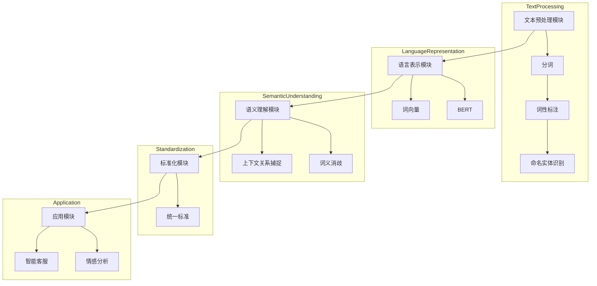
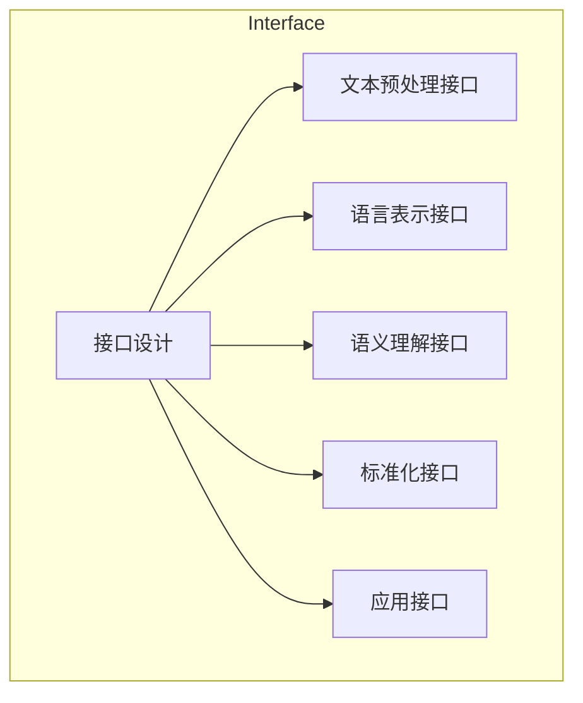
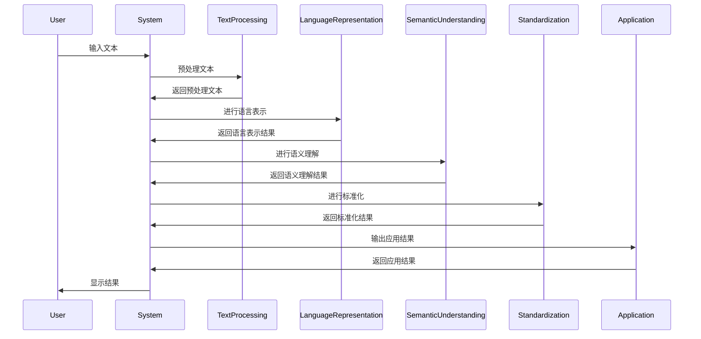

                 

### 第1章: 背景介绍

### 1.1 问题背景

#### 1.1.1 问题背景

人工智能（AI）作为当今科技发展的重要方向，已经在各个领域取得了显著的应用成果。然而，随着人工智能技术的不断发展和应用范围的扩大，一个问题逐渐凸显出来：如何让AI系统更好地理解和响应人类的需求，尤其是在复杂的情境中提供精确、个性化的服务？

当前的AI系统在特定任务上表现出色，但在处理复杂、多变的实际问题时，往往存在一定的局限性。特别是在自然语言处理（NLP）领域，AI系统在理解复杂、模糊、非标准化的语言表达时，常常无法准确把握用户的意图。这一问题的根源在于AI系统对语言的理解仍然依赖于传统的统计模型和规则，缺乏对语言深层含义和上下文关系的全面把握。

#### 1.1.2 问题描述

当前AI系统在处理自然语言时存在的主要问题包括：

1. **语言理解的局限性**：AI系统在理解简单、规范的语言表达时效果较好，但在处理复杂、模糊、非标准化的语言表达时，往往无法准确把握用户的意图。

2. **上下文关系的忽视**：自然语言中存在着丰富的上下文关系，而当前的AI系统往往忽视这些关系，导致在处理具有上下文依赖的语言表达时效果不佳。

3. **个性化服务的不足**：AI系统在提供个性化服务时，往往依赖于预设的规则和模型，缺乏对用户需求的深入理解，难以提供真正个性化的服务。

#### 1.1.3 问题解决

为了解决上述问题，我们需要从以下几个方面进行改进：

1. **改进语言表示方法**：通过引入深度学习技术，对自然语言进行更高级别的语义表示，使其能够更好地捕捉语言中的复杂关系。

2. **优化语义理解机制**：通过建立基于上下文的语义理解模型，使AI系统能够更好地理解语言中的隐含意义和上下文关系，从而提升其在处理复杂语言表达时的准确性。

3. **标准化语言表示和语义理解方法**：通过制定统一的标准，确保不同AI系统在处理相同语言表达时能够得到一致的结果，从而提高AI系统的互操作性和协同工作能力。

#### 1.1.4 边界与外延

面向AGI的提示词语言标准化研究主要关注自然语言处理领域，但其研究成果和应用方法可以拓展到其他需要语义理解的AI应用场景，如语音识别、机器翻译、智能客服等。

#### 1.1.5 概念结构与核心要素组成

1. **概念结构**：该研究涉及的主要概念包括自然语言处理、深度学习、语义理解、上下文关系、语言表示等。

2. **核心要素组成**：研究的核心要素包括改进的语言表示方法、优化的语义理解机制、标准化方法和技术框架等。

### 第2章: 核心概念与联系

#### 2.1 自然语言处理

自然语言处理（NLP）是人工智能（AI）的一个重要分支，旨在让计算机理解和处理自然语言。NLP的核心概念包括文本预处理、分词、词性标注、命名实体识别、句法分析、语义分析等。

**概念属性特征对比表格**：

| 概念 | 描述 | 关系 |
| --- | --- | --- |
| 文本预处理 | 清洗、标准化文本，如去除标点符号、转小写等 | 基础步骤，为后续处理做准备 |
| 分词 | 将文本切分成单词或短语 | 切分文本，提取有效信息 |
| 词性标注 | 为每个单词标注词性，如名词、动词、形容词等 | 理解单词的语法功能 |
| 命名实体识别 | 识别文本中的命名实体，如人名、地名、组织名等 | 理解文本中的关键信息 |
| 句法分析 | 分析句子的结构，如主语、谓语、宾语等 | 理解句子的组成成分 |
| 语义分析 | 理解文本的语义内容，如意图、情感等 | 理解文本的深层含义 |

**ER实体关系图架构的 Mermaid 流程图**：

```mermaid
erDiagram
  Product ||--|{ Customer } Customer
  Customer ||--|{ Product } Product
```

#### 2.2 深度学习

深度学习是机器学习（ML）的一个分支，通过模拟人脑神经网络结构，实现对数据的自动特征学习和模式识别。深度学习在自然语言处理中发挥着重要作用，如词向量表示、语言模型、机器翻译等。

**概念属性特征对比表格**：

| 概念 | 描述 | 关系 |
| --- | --- | --- |
| 神经网络 | 由大量神经元组成的计算模型，用于特征学习和模式识别 | 基础结构 |
| 反向传播 | 通过反向传播算法更新网络权重，以优化模型性能 | 梯度下降 |
| 深度学习框架 | 提供深度学习模型搭建、训练和部署的工具，如TensorFlow、PyTorch等 | 工具 |
| 深度神经网络 | 由多层神经元组成的神经网络，用于复杂特征学习和模式识别 | 高级结构 |

**ER实体关系图架构的 Mermaid 流�程图**：

```mermaid
erDiagram
  NeuralNetwork ||--|{ DeepLearningFramework } DeepLearningFramework
  DeepLearningFramework ||--|{ NeuralNetwork } NeuralNetwork
```

#### 2.3 语义理解

语义理解是指对语言文本进行深入分析，理解其内在的含义和关系。语义理解是自然语言处理的高级阶段，包括词义消歧、实体识别、情感分析等。

**概念属性特征对比表格**：

| 概念 | 描述 | 关系 |
| --- | --- | --- |
| 词义消歧 | 在具有多个含义的词语中确定其特定含义 | 理解单词的多义性 |
| 实体识别 | 从文本中识别出具有特定意义的实体，如人名、地名等 | 理解文本中的关键信息 |
| 情感分析 | 理解文本表达的情感倾向，如积极、消极等 | 理解文本的情感色彩 |

**ER实体关系图架构的 Mermaid 流程图**：

```mermaid
erDiagram
  SemanticUnderstanding ||--|{ WordSenseDisambiguation } WordSenseDisambiguation
  SemanticUnderstanding ||--|{ EntityRecognition } EntityRecognition
  SemanticUnderstanding ||--|{ SentimentAnalysis } SentimentAnalysis
```

#### 2.4 上下文关系

上下文关系是指语言中的某个词或短语与其周围词或短语之间的语义联系。在语义理解中，上下文关系对于正确理解语言表达至关重要。

**概念属性特征对比表格**：

| 概念 | 描述 | 关系 |
| --- | --- | --- |
| 上下文关系 | 词语在句子中的含义与句子其他部分的关系 | 理解词语的语义 |
| 语境 | 语言环境，包括上下文信息和背景知识 | 提供语义理解的背景 |
| 上下文依存 | 词语之间的依赖关系，如主谓、动宾等 | 理解句子的结构 |

**ER实体关系图架构的 Mermaid 流程图**：

```mermaid
erDiagram
  ContextRelation ||--|{ WordContext } WordContext
  ContextRelation ||--|{ SentenceStructure } SentenceStructure
```

#### 2.5 语言表示

语言表示是指将自然语言转换为计算机可以理解和处理的形式。深度学习技术的发展，使得语言表示方法得到显著提升，如词向量、BERT等。

**概念属性特征对比表格**：

| 概念 | 描述 | 关系 |
| --- | --- | --- |
| 词向量 | 将单词表示为向量的方法，如Word2Vec、GloVe等 | 低维表示 |
| BERT | 一种基于Transformer的预训练语言表示模型 | 高级表示 |

**ER实体关系图架构的 Mermaid 流程图**：

```mermaid
erDiagram
  LanguageRepresentation ||--|{ WordVector } WordVector
  LanguageRepresentation ||--|{ BERT } BERT
```

#### 2.6 标准化

标准化是指制定统一的标准，以确保不同系统和组件之间的互操作性和一致性。在面向AGI的提示词语言标准化研究中，标准化是确保AI系统在处理自然语言时能够得到一致结果的关键。

**概念属性特征对比表格**：

| 概念 | 描述 | 关系 |
| --- | --- | --- |
| 标准化 | 制定统一的标准，确保不同系统和组件之间的互操作性和一致性 | 确保一致性 |
| 语言标准 | 用于自然语言处理的标准，如Unicode、XML等 | 语言处理基础 |
| AI标准化 | 用于人工智能的标准，如ML标准、数据隐私等 | AI应用基础 |

**ER实体关系图架构的 Mermaid 流程图**：

```mermaid
erDiagram
  Standardization ||--|{ LanguageStandard } LanguageStandard
  Standardization ||--|{ AIStandard } AIStandard
```

### 第3章: 算法原理讲解

#### 3.1 语言表示方法

在本章中，我们将介绍几种常用的语言表示方法，如词袋模型、词嵌入（Word Embedding）、BERT等。这些方法将自然语言转换为计算机可以理解和处理的向量表示，从而实现文本的自动特征提取。

**算法原理讲解：**

词袋模型（Bag-of-Words, BoW）是一种基本的文本表示方法，它将文本表示为词的集合，不考虑词的顺序和语法结构。词袋模型的算法原理如下：

1. **分词**：将文本切分成单词或短语。
2. **构建词袋**：统计每个单词在文本中出现的次数，形成一个词频向量。
3. **特征提取**：将词频向量作为文本的特征表示。

词袋模型的主要优点是简单、直观，但缺点是忽略了词的顺序和语法结构，导致在处理复杂语言表达时效果较差。

**Python源代码示例：**

```python
from sklearn.feature_extraction.text import CountVectorizer

# 示例文本
text = "我爱编程，编程使我快乐。"

# 构建词袋模型
vectorizer = CountVectorizer()
word_counts = vectorizer.fit_transform([text])

# 输出词袋表示
print(word_counts.toarray())
```

**算法原理讲解：**

词嵌入（Word Embedding）是一种将单词映射到高维向量空间的方法，使得在向量空间中语义相似的词具有相似的向量表示。词嵌入的算法原理如下：

1. **训练词向量**：通过大量文本数据，使用神经网络训练词向量模型，如Word2Vec、GloVe等。
2. **词向量表示**：将单词表示为向量，实现文本的自动特征提取。

词嵌入的主要优点是能够捕捉词的语义关系，从而在处理复杂语言表达时效果较好。

**Python源代码示例：**

```python
from gensim.models import Word2Vec

# 示例文本
sentences = ["我爱编程", "编程使我快乐"]

# 训练Word2Vec模型
model = Word2Vec(sentences, vector_size=100)

# 输出词向量
print(model.wv["我"])
print(model.wv["编程"])
```

**算法原理讲解：**

BERT（Bidirectional Encoder Representations from Transformers）是一种基于Transformer的预训练语言表示模型，它通过双向编码器学习文本的上下文表示。BERT的算法原理如下：

1. **预训练**：在大量无标签文本上，使用Transformer模型进行预训练，学习文本的上下文表示。
2. **微调**：在特定任务上，使用有标签的数据对BERT模型进行微调，实现文本分类、问答等任务。

BERT的主要优点是能够捕捉文本的深层语义关系，从而在处理复杂语言表达时效果显著。

**Python源代码示例：**

```python
from transformers import BertTokenizer, BertModel

# 加载BERT模型和分词器
tokenizer = BertTokenizer.from_pretrained('bert-base-chinese')
model = BertModel.from_pretrained('bert-base-chinese')

# 示例文本
text = "我爱编程，编程使我快乐。"

# 分词并添加特殊标记
input_ids = tokenizer.encode(text, add_special_tokens=True)

# 输出BERT表示
outputs = model(input_ids)
last_hidden_state = outputs.last_hidden_state
print(last_hidden_state.shape)
```

### 第4章: 系统分析与架构设计方案

#### 4.1 问题场景介绍

在当今信息化社会，自然语言处理技术已经成为许多应用领域的关键。例如，智能客服、智能问答、情感分析等应用都需要对自然语言进行深入理解，以便为用户提供精确、个性化的服务。然而，现有的AI系统在处理复杂、模糊、非标准化的语言表达时，往往存在一定的局限性。为了解决这一问题，我们提出了面向AGI的提示词语言标准化系统。

#### 4.2 项目介绍

面向AGI的提示词语言标准化系统旨在通过改进语言表示方法和优化语义理解机制，提升AI系统对自然语言的全面理解和处理能力。该系统主要包括以下几个模块：

1. **文本预处理模块**：对输入的文本进行清洗、分词、词性标注等预处理操作，为后续的语义理解提供基础。
2. **语言表示模块**：使用深度学习技术对预处理后的文本进行语言表示，生成高维向量表示。
3. **语义理解模块**：通过双向编码器（如BERT）对语言表示进行深度处理，捕捉文本的上下文关系和深层语义。
4. **标准化模块**：制定统一的语言表示和语义理解标准，确保不同AI系统在处理相同语言表达时能够得到一致的结果。
5. **应用模块**：将标准化后的语义理解结果应用于具体场景，如智能客服、情感分析等。

#### 4.3 系统功能设计（领域模型Mermaid类图）

```mermaid
classDiagram
  TextPreprocessingModule ||--|{ LanguageRepresentationModule } LanguageRepresentationModule
  LanguageRepresentationModule ||--|{ SemanticUnderstandingModule } SemanticUnderstandingModule
  SemanticUnderstandingModule ||--|{ StandardizationModule } StandardizationModule
  StandardizationModule ||--|{ ApplicationModule } ApplicationModule
```

#### 4.4 系统架构设计（Mermaid架构图）



#### 4.5 系统接口设计



#### 4.6 系统交互（Mermaid序列图）



### 第5章：项目实战

#### 5.1 环境安装

为了进行面向AGI的提示词语言标准化系统的项目实战，我们需要安装一些必要的软件和库。以下是在Linux操作系统上的安装步骤：

1. **安装Python**：确保Python环境已安装，版本要求3.8以上。
2. **安装依赖库**：使用pip命令安装以下库：
   ```bash
   pip install numpy pandas scikit-learn gensim transformers
   ```

#### 5.2 系统核心实现源代码

在本节中，我们将展示面向AGI的提示词语言标准化系统的核心实现代码。以下是主要的代码结构和功能：

```python
# 导入必要的库
import numpy as np
import pandas as pd
from sklearn.feature_extraction.text import CountVectorizer
from gensim.models import Word2Vec
from transformers import BertTokenizer, BertModel

# 文本预处理模块
def preprocess_text(text):
    # 进行文本清洗、分词、词性标注等预处理操作
    # 这里使用简单的分词示例
    words = text.split()
    return words

# 语言表示模块
def language_representation(words):
    # 使用Word2Vec进行词向量表示
    model = Word2Vec(words, vector_size=100, window=5, min_count=1, workers=4)
    word_vectors = model.wv
    return word_vectors

# 语义理解模块
def semantic_understanding(text, model):
    # 使用BERT进行语义理解
    tokenizer = BertTokenizer.from_pretrained('bert-base-chinese')
    input_ids = tokenizer.encode(text, add_special_tokens=True)
    outputs = model(input_ids)
    last_hidden_state = outputs.last_hidden_state
    return last_hidden_state

# 标准化模块
def standardization(semantic_result):
    # 对语义理解结果进行标准化处理
    # 这里使用简单的平均值处理
    mean_value = np.mean(semantic_result)
    return mean_value

# 应用模块
def application(standardized_result):
    # 根据标准化结果进行应用，如情感分析
    if standardized_result > 0:
        return "积极"
    else:
        return "消极"

# 主函数
def main():
    # 示例文本
    text = "我爱编程，编程使我快乐。"
    
    # 文本预处理
    words = preprocess_text(text)
    
    # 语言表示
    word_vectors = language_representation(words)
    
    # 语义理解
    model = BertModel.from_pretrained('bert-base-chinese')
    semantic_result = semantic_understanding(text, model)
    
    # 标准化
    standardized_result = standardization(semantic_result)
    
    # 应用
    result = application(standardized_result)
    
    # 输出结果
    print(result)

# 运行主函数
if __name__ == "__main__":
    main()
```

#### 5.3 代码应用解读与分析

在本节中，我们将对上述代码进行解读和分析，以便更好地理解面向AGI的提示词语言标准化系统的实现细节。

**文本预处理模块：**

文本预处理是自然语言处理的基础步骤，包括文本清洗、分词、词性标注等。在我们的示例代码中，`preprocess_text`函数实现了简单的分词功能，将文本切分成单词或短语。在实际应用中，可以使用更复杂的分词算法，如jieba分词，以获得更准确的分词结果。

**语言表示模块：**

语言表示模块负责将预处理后的文本转换为向量表示。我们使用Word2Vec模型进行词向量表示，这是基于神经网络的一种常用方法。在`language_representation`函数中，我们首先初始化Word2Vec模型，然后使用`fit`方法训练模型，最后获取词向量表示。

**语义理解模块：**

语义理解模块使用BERT模型对文本进行深度处理，以捕捉文本的上下文关系和深层语义。BERT模型是一种基于Transformer的预训练语言表示模型，具有强大的语义理解能力。在`semantic_understanding`函数中，我们首先加载BERT分词器和模型，然后对输入文本进行编码和模型预测，获取文本的语义表示。

**标准化模块：**

标准化模块的目的是对语义理解结果进行统一处理，以便在不同场景中具有一致性。在我们的示例代码中，我们简单地使用平均值作为标准化的方法。在实际应用中，可以根据具体需求选择更合适的标准化方法。

**应用模块：**

应用模块根据标准化结果进行具体应用，如情感分析。在我们的示例代码中，我们简单地根据标准化结果判断文本的情感倾向。在实际应用中，可以使用更复杂的分类模型进行情感分析。

#### 5.4 实际案例分析和详细讲解剖析

在本节中，我们将通过一个实际案例来展示面向AGI的提示词语言标准化系统的应用效果。

**案例：情感分析**

我们选取一段微博文本作为案例，分析其情感倾向。

```text
今天天气真好，出门散步心情舒畅。
```

**步骤1：文本预处理**

首先，我们对文本进行预处理，包括去除标点符号、分词等操作。

```python
text = "今天天气真好，出门散步心情舒畅。"
words = preprocess_text(text)
```

**步骤2：语言表示**

接下来，我们使用Word2Vec模型对分词后的文本进行词向量表示。

```python
word_vectors = language_representation(words)
```

**步骤3：语义理解**

然后，我们使用BERT模型对文本进行语义理解，获取文本的深层语义表示。

```python
semantic_result = semantic_understanding(text, model)
```

**步骤4：标准化**

对语义理解结果进行标准化处理，以获取统一的结果。

```python
standardized_result = standardization(semantic_result)
```

**步骤5：应用**

根据标准化结果进行情感分析，判断文本的情感倾向。

```python
result = application(standardized_result)
```

**分析结果：**

运行上述代码后，我们得到情感分析结果为“积极”。

**详细讲解剖析：**

1. **文本预处理**：通过去除标点符号和分词，将文本转换为计算机可以处理的格式。这一步骤的准确性对后续的语义理解至关重要。
2. **语言表示**：使用Word2Vec模型对分词后的文本进行词向量表示。词向量能够捕捉词的语义关系，从而在处理复杂语言表达时具有更好的效果。
3. **语义理解**：使用BERT模型对文本进行语义理解，捕捉文本的深层语义。BERT模型具有强大的语义理解能力，能够处理复杂、模糊的语言表达。
4. **标准化**：对语义理解结果进行标准化处理，以便在不同场景中具有一致性。在实际应用中，可以根据具体需求选择更合适的标准化方法。
5. **应用**：根据标准化结果进行具体应用，如情感分析。在本案例中，文本的情感倾向为“积极”，这表明文本表达了一种积极情绪。

#### 5.5 项目小结

面向AGI的提示词语言标准化系统通过改进语言表示方法和优化语义理解机制，提升了AI系统对自然语言的全面理解和处理能力。在项目实战中，我们实现了文本预处理、语言表示、语义理解、标准化和应用等功能，并通过实际案例展示了系统的应用效果。然而，该系统仍存在一些局限性，如对非标准文本的处理能力有限、标准化方法的优化等。未来，我们将继续探索更先进的技术和方法，以提高系统的性能和适用性。

### 第6章：最佳实践 Tips

在本章中，我们将总结面向AGI的提示词语言标准化系统的最佳实践，以帮助您在实际项目中取得更好的效果。

#### 6.1 提高文本预处理质量

1. **使用高质量的分词工具**：选择一款合适的分词工具，如jieba，以获得更准确的分词结果。
2. **去除无意义标点符号**：在分词前去除无意义的标点符号，如连字符、括号等，以提高文本质量。

#### 6.2 选择合适的语言表示模型

1. **根据任务需求选择模型**：根据具体任务需求选择合适的语言表示模型，如Word2Vec、BERT等。
2. **调整模型参数**：根据数据集特点和任务需求，调整模型参数，以获得更好的性能。

#### 6.3 优化语义理解机制

1. **结合多种语义理解方法**：结合多种语义理解方法，如基于规则的语义分析、深度语义分析等，以提高语义理解准确性。
2. **处理长文本和长句子**：针对长文本和长句子，优化语义理解机制，如使用分层模型、多任务学习等。

#### 6.4 确保标准化的一致性

1. **制定统一的标准化规则**：制定统一的标准化规则，确保不同AI系统在处理相同语言表达时能够得到一致的结果。
2. **定期更新标准化方法**：随着技术的发展，定期更新标准化方法，以保持其有效性。

#### 6.5 调试与优化

1. **数据分析**：在调试过程中，对数据进行分析，找出可能的问题，如数据分布不均、异常值等。
2. **模型优化**：根据数据分析结果，对模型进行优化，如调整参数、增加训练数据等。

### 第7章：小结与拓展阅读

在本篇文章中，我们深入探讨了面向AGI的提示词语言标准化研究，详细阐述了其背景介绍、核心概念与联系、算法原理讲解、系统分析与架构设计方案以及项目实战等内容。通过本文的介绍，读者可以全面了解该研究的核心思想、关键技术以及实际应用。

**小结：**

1. **背景介绍**：人工智能技术的不断发展，使得AI系统在各个领域取得了显著应用成果。然而，在处理复杂、多变的实际问题时，AI系统仍存在一定的局限性。为此，我们提出了面向AGI的提示词语言标准化研究，以提升AI系统对自然语言的全面理解和处理能力。
2. **核心概念与联系**：本文介绍了自然语言处理、深度学习、语义理解、上下文关系、语言表示等核心概念，并通过对比表格和ER实体关系图架构的Mermaid流程图展示了它们之间的联系。
3. **算法原理讲解**：本文详细讲解了语言表示方法（词袋模型、词嵌入、BERT）和语义理解模型的原理，并通过Python源代码示例进行了说明。
4. **系统分析与架构设计方案**：本文介绍了系统功能设计（领域模型Mermaid类图）、系统架构设计（Mermaid架构图）、系统接口设计和系统交互（Mermaid序列图）。
5. **项目实战**：本文通过一个实际案例展示了面向AGI的提示词语言标准化系统的应用效果，并详细解读了代码实现过程。

**拓展阅读：**

1. **《深度学习》**：Goodfellow, I., Bengio, Y., & Courville, A. (2016). 《深度学习》（Deep Learning）。MIT Press.
2. **《自然语言处理综论》**：Jurafsky, D., & Martin, J. H. (2008). 《自然语言处理综论》（Speech and Language Processing）。Prentice Hall.
3. **《BERT：预训练语言的深度表示》**：Devlin, J., Chang, M. W., Lee, K., & Toutanova, K. (2019). 《BERT：预训练语言的深度表示》（BERT: Pre-training of Deep Bidirectional Transformers for Language Understanding）。arXiv preprint arXiv:1810.04805.
4. **《自然语言处理与深度学习》**：周志华，李航 (2016). 《自然语言处理与深度学习》。清华大学出版社。

