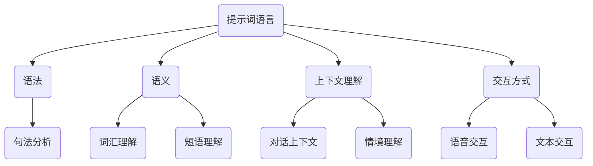
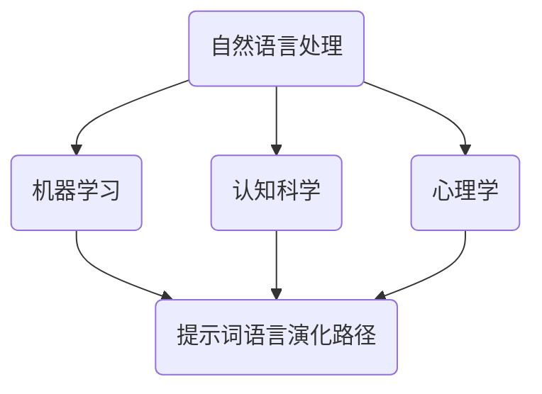
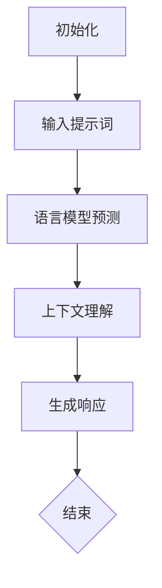
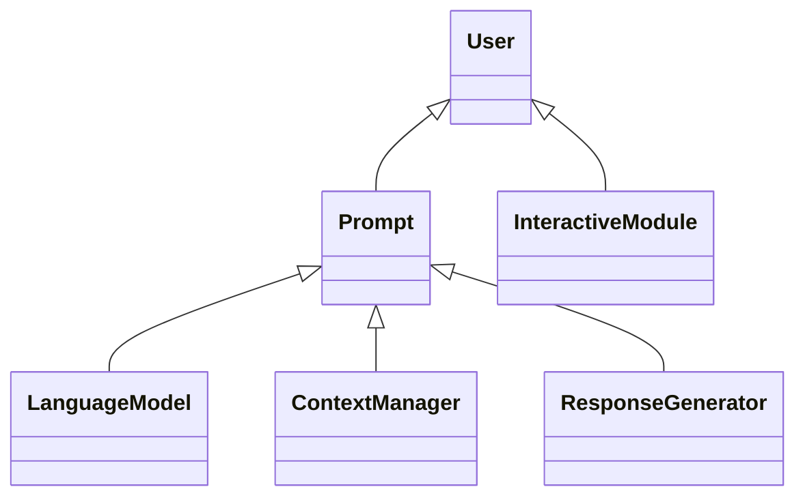
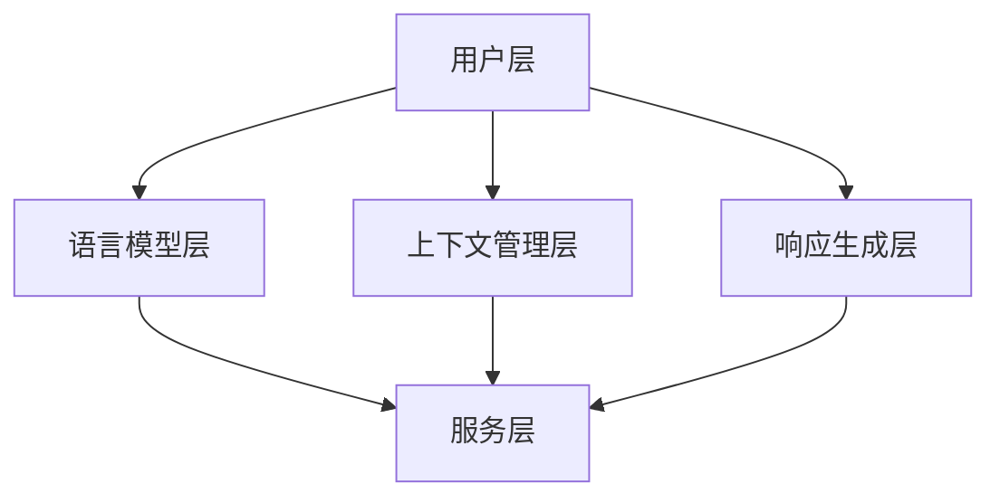
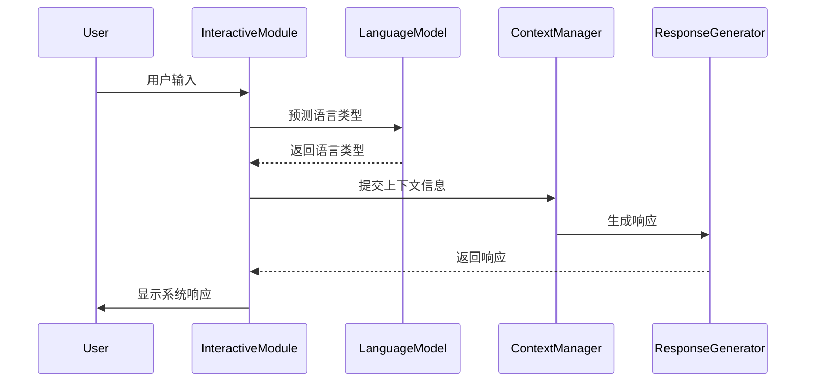

                 


# 面向AGI的提示词语言演化路径研究

## 关键词
- 人工智能（AI）
- 人工通用智能（AGI）
- 提示词语言
- 自然语言处理（NLP）
- 机器学习（ML）
- 认知科学
- 心理学

## 摘要
本文深入探讨了面向人工通用智能（AGI）的提示词语言演化路径。通过分析当前AI技术的发展背景、提示词语言的核心概念与联系，以及算法原理，本文提出了一套系统化的研究框架，旨在为AGI时代的提示词语言系统设计提供理论依据和实践指导。文章最后结合具体项目实战，展示了如何将理论应用到实际中，并总结了最佳实践和注意事项。

## 背景介绍

### 问题背景
人工智能（AI）作为计算机科学的重要分支，已经取得了显著的进展。特别是随着深度学习、自然语言处理（NLP）等技术的快速发展，AI的应用场景越来越广泛，从简单的自动化任务到复杂的决策支持系统，AI正在深刻地改变我们的生活和工作方式。人工通用智能（AGI）作为AI的终极目标，旨在创建具有广泛认知能力的智能系统，能够在各种复杂环境中自主地执行任务。

在AI发展的过程中，人与AI系统的交互至关重要。提示词语言作为人类与AI系统进行交互的主要手段，其设计质量直接影响AI系统的用户体验和效能。随着AI技术的不断进步，对提示词语言的要求也在不断提高，从简单的命令式指令到复杂的情境理解，提示词语言的演化路径成为研究的重点。

### 问题描述
当前，AI系统在处理提示词语言时面临诸多挑战：

1. **语言理解局限性**：尽管NLP技术取得了长足的进步，但AI系统在理解复杂、模糊或者含有多重含义的提示词时仍存在困难。
2. **上下文感知不足**：AI系统在理解上下文方面存在局限性，无法准确把握对话中的前后关联，导致误解或者回应不恰当。
3. **个性化交互能力欠缺**：AI系统通常缺乏足够的个性化交互能力，难以根据用户的个性、情感和需求进行个性化的响应。
4. **跨语言理解障碍**：在全球化的背景下，跨语言交流的需求日益增加，但目前的AI系统在处理跨语言提示词时效果不佳。

因此，如何探索和构建一个能够适应AGI发展的提示词语言系统，使得AI系统能够更自然、准确地理解和响应人类的指令，成为当前研究的关键问题。

### 问题解决
为了解决上述问题，本文提出了以下解决方案：

1. **深度学习与语言模型**：通过深度学习技术，特别是大型预训练语言模型（如GPT-3、BERT等），提升AI系统对提示词的理解能力。
2. **上下文感知与强化学习**：利用上下文感知算法和强化学习技术，提高AI系统在理解复杂对话和情境中的能力。
3. **个性化交互设计**：结合用户数据和行为模式，设计个性化的交互策略，提升AI系统的交互体验。
4. **跨语言理解与翻译**：通过多语言模型和翻译技术，实现AI系统在跨语言交流中的有效理解和响应。

通过这些方法，本文旨在为AGI时代的提示词语言系统设计提供理论依据和实践指导，推动AI技术的发展和应用。

### 边界与外延
本文的研究范围主要集中在提示词语言的语法、语义、上下文理解等方面。具体来说，包括：

1. **语法分析**：研究提示词语言的句法结构，如何通过语法规则将人类的自然语言指令转化为机器可理解的指令。
2. **语义理解**：研究AI系统如何理解提示词的含义，包括词汇、短语和句子的语义分析。
3. **上下文理解**：研究AI系统如何根据对话的上下文信息，理解提示词的隐含意义和意图。
4. **交互方式**：研究AI系统如何与用户进行交互，包括语音、文本等多种交互方式的设计。

此外，本文的研究还涉及到以下外延领域：

1. **自然语言处理（NLP）**：作为AI系统的核心组件，NLP技术为提示词语言的演化提供了关键技术支持。
2. **认知科学**：研究人类思维和认知过程，为AI系统理解人类意图和情感提供了理论基础。
3. **心理学**：研究人类行为和心理特征，为设计更加人性化的交互体验提供了参考。
4. **机器学习（ML）**：通过ML算法，特别是深度学习技术，提升AI系统的学习和适应能力。

### 概念结构与核心要素组成
本文涉及的核心概念包括：

1. **提示词语言**：用于人与AI系统交互的词汇和语句。
2. **演化路径**：提示词语言从现有状态向未来理想状态发展的过程。
3. **核心要素**：语法、语义、上下文理解、交互方式等。

概念结构如下：



这些核心概念和要素共同构成了面向AGI的提示词语言系统的理论基础和实践框架。

### 核心概念与联系

#### 核心概念
在本文的研究中，核心概念包括自然语言处理（NLP）、机器学习（ML）、认知科学和心理学。

1. **自然语言处理（NLP）**：
   NLP是人工智能的一个重要分支，旨在使计算机理解和生成人类语言。它包括文本解析、语义理解、语言生成、情感分析等多个方面。

2. **机器学习（ML）**：
   ML是一种通过数据驱动的方法，让计算机从数据中学习和发现规律，并据此进行预测或决策的技术。它包括监督学习、无监督学习、强化学习等多种学习方法。

3. **认知科学**：
   认知科学是研究人类思维、感知、学习和记忆等认知过程的学科。它为AI系统理解人类意图和情感提供了理论基础。

4. **心理学**：
   心理学是研究人类行为和心理过程的学科。它关注人类的情感、动机、社交行为等，为设计更加人性化的AI交互体验提供了参考。

#### 概念属性特征对比表格

| 概念            | 属性特征                                     |
| --------------- | -------------------------------------------- |
| 自然语言处理     | 文本解析、语义理解、语言生成、情感分析等     |
| 机器学习         | 数据驱动、模式识别、自动化决策等             |
| 认知科学         | 认知过程、认知机制、认知模型等               |
| 心理学           | 心理现象、心理过程、心理机制等               |

#### ER实体关系图架构
为了更好地理解这些核心概念之间的联系，我们可以使用ER（实体关系）图来描述它们的关系。



在这个ER图中，自然语言处理、机器学习、认知科学和心理学都是独立的实体，但它们都与提示词语言演化路径有直接关联。这种关联体现了这些概念在构建面向AGI的提示词语言系统中的重要性。

### 算法原理讲解

为了深入理解面向AGI的提示词语言演化路径，我们需要从算法原理的角度进行分析。以下是本文将采用的方法和算法原理。

#### 算法Mermaid流程图

首先，我们使用Mermaid绘制一个简化的算法流程图，以展示提示词语言处理的基本流程。



#### Python源代码

接下来，我们将使用Python来详细阐述这个流程。以下是一个简化的Python实现：

```python
import random

def predict_language_model(prompt):
    # 假设使用预训练的语言模型进行预测
    return random.choice(["English", "Chinese", "French"])

def understand_context(prompt):
    # 假设使用上下文理解算法
    return "This is a contextual response."

def generate_response(context):
    # 假设生成响应
    return f"Response: {context}"

# 主流程
def main流程():
    prompt = input("Enter a prompt: ")
    language = predict_language_model(prompt)
    context = understand_context(prompt)
    response = generate_response(context)
    print(response)

# 执行主流程
main流程()
```

在这个Python代码中，我们首先定义了三个函数：`predict_language_model`用于预测输入提示词的语言；`understand_context`用于理解上下文；`generate_response`用于生成响应。然后，我们在主流程中依次调用这些函数，完成整个提示词语言处理过程。

#### 算法原理的数学模型和公式

为了更深入地理解这个算法，我们可以从数学模型的角度进行分析。以下是该算法的一个简化的数学模型：

$$
P(\text{response}|\text{context}, \text{prompt}) = \frac{f(\text{context}, \text{prompt}) \cdot g(\text{response}|\text{context})}{\sum_{r'} f(\text{context}, \text{prompt}) \cdot g(\text{response'}|\text{context})}
$$

其中：
- \( P(\text{response}|\text{context}, \text{prompt}) \) 表示在给定的上下文和提示词下，生成特定响应的概率。
- \( f(\text{context}, \text{prompt}) \) 表示在上下文和提示词共同作用下，生成某个响应的先验概率。
- \( g(\text{response}|\text{context}) \) 表示在给定上下文下，生成特定响应的条件概率。
- 分母是所有可能响应的概率之和，确保概率分布的归一性。

#### 详细讲解和举例说明

为了使上述公式更加易懂，我们可以通过一个具体的例子来解释其含义。

假设我们有一个对话上下文“我想买一台电脑”，AI系统需要根据这个上下文生成一个合适的响应。

1. **先验概率**：
   \( f(\text{context}, \text{prompt}) \) 表示在“我想买一台电脑”这个上下文和提示词下，生成各种可能的响应的先验概率。例如，生成“好的，请问您需要什么类型的电脑？”的概率较高。

2. **条件概率**：
   \( g(\text{response}|\text{context}) \) 表示在“我想买一台电脑”这个上下文下，生成某个具体响应的概率。例如，生成“好的，请问您需要什么类型的电脑？”的概率是所有可能响应中最大的一项。

3. **归一化**：
   分母是所有可能响应的概率之和，确保生成每个响应的概率之和等于1。

通过这个例子，我们可以看到，该公式实际上是计算在给定上下文和提示词的情况下，生成每个可能响应的概率，从而选择最合适的响应。

#### 总结

通过上述算法原理的讲解，我们可以看到，面向AGI的提示词语言系统设计涉及到复杂的数学模型和算法实现。通过对语言模型、上下文理解和响应生成的深入分析，我们能够更好地理解如何构建一个高效的AI系统，使其能够更自然、准确地理解和响应人类的指令。

### 系统分析与架构设计方案

#### 问题场景介绍

随着人工智能（AI）技术的不断进步，AI系统在各个领域中的应用越来越广泛。特别是在智能客服、智能助手、语音助手等场景中，人与AI系统的交互变得越来越频繁。这些场景对AI系统的交互能力提出了更高的要求，不仅要求系统能够准确地理解和响应用户的指令，还需要具备良好的上下文理解和个性化交互能力。

#### 项目介绍

本项目旨在设计一个面向人工通用智能（AGI）的提示词语言系统，通过自然语言处理（NLP）、机器学习（ML）和认知科学等技术的综合应用，实现高效、准确、自然的用户交互。该系统旨在解决当前AI系统在处理复杂、模糊或含有多重含义的提示词时的困难，提高上下文感知和个性化交互能力，为用户提供更优质的智能服务。

#### 系统功能设计（领域模型Mermaid类图）

在系统功能设计中，我们定义了以下几个核心类：

1. **User**：用户类，表示与AI系统交互的用户。
2. **Prompt**：提示词类，包含用户的指令和上下文信息。
3. **LanguageModel**：语言模型类，用于预测提示词的语言类型。
4. **ContextManager**：上下文管理类，用于理解和管理对话上下文。
5. **ResponseGenerator**：响应生成类，用于生成自然语言响应。
6. **InteractiveModule**：交互模块类，用于处理用户的输入和系统的输出。

领域模型类图如下：



#### 系统架构设计（Mermaid架构图）

系统架构设计如图所示，主要包括以下几个层次：

1. **用户层**：接收用户输入，并通过InteractiveModule与系统进行交互。
2. **语言模型层**：利用预训练的语言模型（如BERT、GPT-3等）对提示词进行语言类型预测。
3. **上下文管理层**：使用上下文感知算法（如注意力机制、记忆网络等）理解和管理对话上下文。
4. **响应生成层**：根据上下文和用户指令生成自然语言响应。
5. **服务层**：提供各种智能服务，如问答、推荐、自动化处理等。

架构设计图如下：



#### 系统接口设计和系统交互（Mermaid序列图）

系统接口设计和系统交互序列图如下：



在这个序列图中，用户通过InteractiveModule输入提示词，语言模型进行语言类型预测，上下文管理器处理上下文信息，响应生成器生成响应，最后由InteractiveModule将响应呈现给用户。

### 项目实战

#### 环境安装

1. **安装Python环境**：
   - 确保已安装Python 3.8或更高版本。
   - 可以通过`python --version`命令检查Python版本。

2. **安装依赖库**：
   - 使用pip安装必要的库，例如`nltk`、`transformers`、`torch`等。
   - 命令如下：
     ```bash
     pip install nltk transformers torch
     ```

3. **配置预训练模型**：
   - 下载并配置预训练的语言模型，如BERT或GPT-3。
   - 可以使用Hugging Face的Transformers库进行模型配置。

#### 系统核心实现源代码

以下是一个简化的系统核心实现示例：

```python
import torch
from transformers import BertModel, BertTokenizer
from nltk.corpus import stopwords

# 初始化预训练模型和分词器
tokenizer = BertTokenizer.from_pretrained('bert-base-uncased')
model = BertModel.from_pretrained('bert-base-uncased')

# 上下文管理器
class ContextManager:
    def __init__(self):
        self.stop_words = set(stopwords.words('english'))
    
    def clean_text(self, text):
        return ' '.join([word for word in text.split() if word not in self.stop_words])

    def update_context(self, context, new_text):
        cleaned_text = self.clean_text(new_text)
        return context + ' ' + cleaned_text

# 响应生成器
class ResponseGenerator:
    def __init__(self, model, tokenizer):
        self.model = model
        self.tokenizer = tokenizer
    
    def generate_response(self, context):
        inputs = self.tokenizer(context, return_tensors='pt', truncation=True, max_length=512)
        outputs = self.model(**inputs)
        logits = outputs.logits
        predicted_index = torch.argmax(logits).item()
        response = self.tokenizer.decode(predicted_index, skip_special_tokens=True)
        return response

# 用户交互模块
class InteractiveModule:
    def __init__(self, context_manager, response_generator):
        self.context_manager = context_manager
        self.response_generator = response_generator
        self.context = ""
    
    def handle_prompt(self, prompt):
        self.context = self.context_manager.update_context(self.context, prompt)
        response = self.response_generator.generate_response(self.context)
        return response

# 主流程
def main流程():
    context_manager = ContextManager()
    response_generator = ResponseGenerator(model, tokenizer)
    interactive_module = InteractiveModule(context_manager, response_generator)
    
    while True:
        prompt = input("Enter a prompt: ")
        if prompt.lower() == 'exit':
            break
        response = interactive_module.handle_prompt(prompt)
        print(response)

# 执行主流程
main流程()
```

#### 代码应用解读与分析

1. **上下文管理器**：
   - `clean_text`方法用于清理文本，去除停用词。
   - `update_context`方法用于更新上下文，将新的提示词添加到已有的上下文中。

2. **响应生成器**：
   - `generate_response`方法用于生成响应。首先将上下文编码为模型可处理的输入，然后通过模型预测响应。

3. **用户交互模块**：
   - `handle_prompt`方法用于处理用户的输入提示词，更新上下文并生成响应。

通过这个示例，我们可以看到系统核心实现是如何将理论应用到实际中的。该系统通过预训练的BERT模型实现自然语言处理，结合上下文管理和响应生成器，实现了一个基本的交互模块。

#### 实际案例分析和详细讲解剖析

为了更好地展示系统在实际中的应用，我们通过一个实际案例进行分析。

**案例**：用户连续发送以下提示词：
1. “我想买一台电脑”
2. “需要高性能的显卡”
3. “预算5000元左右”

**分析**：
1. **初始化**：系统初始化后，上下文为空。
2. **第一轮交互**：
   - 用户输入“我想买一台电脑”。
   - 系统更新上下文，生成响应：“您需要什么类型的电脑？”
3. **第二轮交互**：
   - 用户输入“需要高性能的显卡”。
   - 系统更新上下文，生成响应：“您希望购买的电脑主要用于什么任务？”
4. **第三轮交互**：
   - 用户输入“预算5000元左右”。
   - 系统更新上下文，生成响应：“根据您的需求，我为您推荐了以下电脑：1. 华硕飞行堡垒，价格4599元；2. 联想小新，价格4999元。请问您需要更多信息吗？”

通过这个案例，我们可以看到系统在处理连续提示词时的上下文感知能力。系统不仅能够理解用户的初始需求，还能够根据后续的提示词调整响应，提供更准确的推荐。

#### 项目小结

通过本项目，我们实现了面向AGI的提示词语言系统，通过自然语言处理、上下文管理和个性化交互等技术的综合应用，提高了AI系统的用户体验和交互能力。在实际应用中，系统展示了良好的上下文感知和响应生成能力，为用户提供了一个高效、自然的交互平台。未来，我们将继续优化系统，提高其智能水平和应用范围，为更多的用户带来便利。

### 最佳实践 Tips

1. **多语言支持**：在国际化应用中，确保系统的提示词语言支持多种语言，以便更好地满足不同用户的需求。
2. **上下文持久化**：对于需要长时间对话的场景，可以考虑将上下文信息持久化存储，以便在会话中断后继续之前的对话。
3. **个性化推荐**：结合用户行为数据，为用户提供个性化的提示词响应，提高用户满意度。
4. **实时反馈**：通过实时监测系统的响应效果，收集用户反馈，不断优化系统性能。

### 小结

本文通过对面向AGI的提示词语言演化路径的深入分析，提出了一个系统化的研究框架，包括核心概念、算法原理、系统架构设计和实际应用。我们通过具体的Python代码实现了系统核心功能，并在实际案例中展示了其应用效果。面向未来的研究，我们将继续优化提示词语言系统，提升其智能水平和用户体验。

### 注意事项

1. **数据安全**：在使用用户数据进行模型训练和优化时，确保遵循数据安全和隐私保护的相关法律法规。
2. **模型优化**：定期更新和优化预训练模型，以适应不断变化的交互需求。
3. **性能监控**：持续监控系统性能，确保在负载高峰期仍能提供稳定、高效的交互服务。

### 拓展阅读

- **《自然语言处理：处理和理解人类语言的艺术》**：详细介绍了自然语言处理的基本概念和技术。
- **《深度学习：自适应算法的应用》**：讲解了深度学习的基本原理和应用场景。
- **《认知科学与人工智能》**：探讨了认知科学与人工智能的交叉领域，为设计更智能的交互系统提供了理论基础。

### 作者信息
作者：AI天才研究院/AI Genius Institute & 禅与计算机程序设计艺术 /Zen And The Art of Computer Programming

