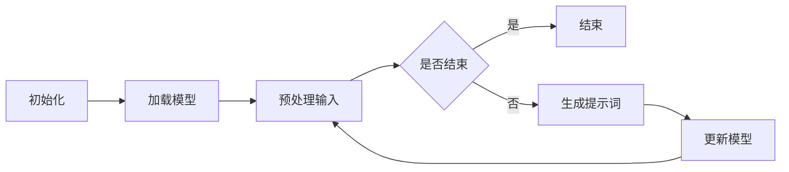
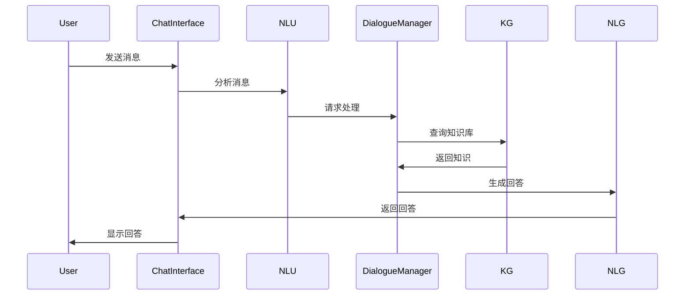
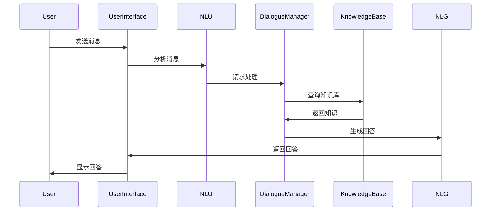

                 

### 背景介绍

#### 第1章: AGI与提示词语言认知模型概述

##### 1.1 问题背景

人工智能（AI）作为20世纪后半叶以来最具革命性的科技领域之一，已经在多个行业和领域中取得了显著成果。从最初的规则推理、专家系统，到基于统计学习的机器学习，再到基于深度学习的复杂模型，人工智能技术经历了多次变革和进步。然而，尽管现代AI在某些特定任务上已经表现得比人类更加出色，例如图像识别、语音识别、自然语言处理等，但它们仍然难以达到人类的智能水平，特别是在理解复杂情境、进行抽象思维和解决不确定性问题等方面。

**通用人工智能（AGI）**，即Artificial General Intelligence，指的是一种具有人类智能的机器，能够理解和执行任何智人能够完成的任务。AGI的核心在于其具备广泛的认知能力，能够在各种不同的环境和情境中灵活应用其知识和技能。当前的人工智能技术还远未达到这一目标，大多数AI系统都是专门为特定任务设计的，即所谓的**窄AI（Narrow AI）**。

在人工智能发展的道路上，语言理解与生成是至关重要的一个方面。自然语言是人类沟通和思维的主要媒介，因此，能够理解和生成自然语言的人工智能系统具有重要的实际应用价值。提示词语言认知模型（Prompt-based Language Understanding and Generation Model）就是在这种背景下提出的一种新型模型，旨在通过提示词（即预定义的输入信息）来提高AI系统的语言理解和生成能力，使其能够更好地与人类互动。

##### 1.2 问题描述

提示词语言认知模型的意义在于，它能够利用人类提供的提示信息来引导AI系统的学习过程，从而使其在特定任务上表现得更加出色。例如，在自然语言处理任务中，通过给模型提供具体的提示词，可以显著提高模型对特定语境的理解能力。提示词语言认知模型的应用场景非常广泛，包括但不限于以下几方面：

1. **智能客服**：在客户服务领域，提示词语言认知模型能够根据用户的提问提供更为准确和个性化的回答。
2. **内容生成**：在内容创作领域，该模型可以辅助生成高质量的文章、报告等，减少人工创作的负担。
3. **教育辅导**：在教育领域，提示词语言认知模型可以为学生提供个性化的学习辅导，帮助他们更好地理解和掌握知识。
4. **代码助手**：在软件开发领域，该模型能够根据开发者提供的提示词自动生成代码片段，提高开发效率。

然而，构建一个高效、可靠的提示词语言认知模型面临诸多挑战。首先，如何设计出既通用又灵活的提示词生成策略是关键问题之一。其次，模型需要具备较强的语义理解能力，以便准确捕捉提示词中的含义。此外，如何在保证实时性的同时，确保模型生成的文本质量也是一个重要课题。

##### 1.3 问题解决

针对上述问题，提示词语言认知模型的设计思路主要包括以下几个方面：

1. **表征学原理**：通过先进的表征学方法，如词嵌入、句子嵌入等，将自然语言转换为机器可理解的向量表示。
2. **认知心理学原理**：借鉴认知心理学的研究成果，设计能够模拟人类思维过程的算法模型。
3. **语言模型原理**：结合先进的语言模型技术，如Transformer、BERT等，构建具有强语义理解能力的模型架构。
4. **多模态融合**：考虑将文本、图像、音频等多种数据源进行融合，以提升模型的泛化能力。

在关键技术方面，提示词语言认知模型需要解决的关键问题包括：

1. **自适应提示词生成**：模型需要能够根据不同的应用场景和用户需求，自适应地生成提示词。
2. **实时性**：模型需要能够在短时间内快速响应，以保证用户体验。
3. **理解能力**：模型需要具备强大的语义理解能力，能够准确捕捉提示词中的深层次含义。

通过以上思路和技术的结合，提示词语言认知模型有望在通用人工智能的发展中发挥重要作用，为人类带来更加智能化的生活和工作体验。

##### 1.4 边界与外延

提示词语言认知模型的研究范畴主要集中在自然语言处理领域，旨在通过提示词引导和优化AI系统的语言理解与生成能力。其边界主要涉及以下几个方面：

1. **自然语言处理技术**：包括词嵌入、句嵌入、语言模型、文本生成等技术的应用。
2. **认知心理学**：通过借鉴认知心理学的研究成果，探索如何设计出更符合人类思维习惯的算法模型。
3. **多模态数据融合**：研究如何将文本、图像、音频等多模态数据融合到语言认知模型中，以提升模型的泛化能力。

提示词语言认知模型与相关领域的联系与区别主要体现在以下几方面：

1. **与传统自然语言处理技术**：提示词语言认知模型是在传统自然语言处理技术基础上，通过引入提示词机制，进一步提升模型性能。
2. **与多模态AI**：提示词语言认知模型在多模态AI的基础上，更加专注于文本数据的理解和生成，而多模态AI则涵盖了更广泛的数据类型和融合方式。
3. **与认知计算**：提示词语言认知模型借鉴认知计算的研究成果，但其更专注于自然语言处理领域的具体应用。

通过明确提示词语言认知模型的研究范畴和与其他相关领域的联系与区别，有助于更清晰地理解其在通用人工智能发展中的定位和作用。

##### 1.5 核心概念与联系

在探讨提示词语言认知模型时，需要理解几个核心概念及其相互关系。以下是这些核心概念的定义、作用和它们在模型中的联系：

**表征学原理**

表征学是人工智能领域中研究如何将人类语言、图像、声音等非结构化数据转换为计算机能够处理的格式的一门学科。在提示词语言认知模型中，表征学原理通过词嵌入（Word Embedding）和句子嵌入（Sentence Embedding）等技术，将自然语言文本转换为密集向量表示。这种向量表示使得模型能够捕捉文本的语义信息，从而实现更精准的语言理解与生成。

**认知心理学原理**

认知心理学研究人类思维过程和认知机制。提示词语言认知模型借鉴认知心理学的理论，通过设计模仿人类认知过程的算法，提高模型对语言的理解和生成能力。例如，认知模型会考虑人类的注意力机制、记忆存储和检索机制等，以构建更符合人类思维习惯的AI系统。

**语言模型原理**

语言模型是一种用于预测文本序列的概率分布的模型。在提示词语言认知模型中，语言模型通常采用深度学习技术，如Transformer、BERT等，用于生成和理解自然语言。语言模型通过学习大量的文本数据，能够捕捉语言的统计规律和语义关系，从而在提示词的引导下生成高质量的文本。

**提示词语言认知模型的概念属性特征对比表格**

| 特征               | 描述                                     |
|--------------------|----------------------------------------|
| 自适应性           | 根据用户输入调整提示词生成策略           |
| 实时性             | 能够快速响应用户输入并生成提示词         |
| 理解能力           | 能够理解用户输入的含义并生成合适的提示词 |

在表格中，我们可以看到提示词语言认知模型具备的自适应性、实时性和理解能力是其核心特征。这些特征决定了模型在自然语言处理任务中的表现和实用性。

**Mermaid ER实体关系图**

为了更清晰地展示提示词语言认知模型中的核心概念及其相互关系，我们可以使用Mermaid ER实体关系图来表示。以下是该实体关系图的Markdown格式表示：

```mermaid
erDiagram
  User ||--o> Prompt : "包含用户信息的输入"
  Prompt ||--< Model : "提示词语言认知模型"
  Model ||--o> Response : "模型生成的输出"
  Model ||--< KnowledgeBase : "用于辅助模型学习的知识库"
  User ..|> interactsWith | Response : "用户与模型交互"
```

在这个ER图中，用户通过输入提示（Prompt）与模型交互，模型在知识库的支持下生成响应（Response）。这种关系展示了提示词语言认知模型的基本工作流程和关键组成部分。

通过以上对核心概念及其相互关系的详细解释，我们能够更好地理解提示词语言认知模型的工作原理和设计思路，为后续章节的深入探讨奠定了基础。

### 第2章: 提示词语言认知模型核心概念原理

在深入研究提示词语言认知模型之前，我们需要理解其核心概念原理，包括表征学原理、认知心理学原理和语言模型原理。这些原理为提示词语言认知模型的设计和实现提供了理论基础。

#### 2.1 表征学原理

表征学是研究如何将人类语言、图像、声音等非结构化数据转换为计算机可以处理的格式的一门学科。在自然语言处理领域，表征学尤其重要，因为它涉及到如何将文本数据转换为机器可理解的向量表示。

**表征学的定义与作用**

表征学的基本目标是将语言符号（如单词、句子）映射到高维向量空间中，使得这些向量能够捕捉词与词之间的关系以及句子中的语义信息。通过这种向量表示，机器学习模型可以更有效地学习和处理自然语言。

在提示词语言认知模型中，表征学原理的应用主要体现在以下几个方面：

1. **词嵌入（Word Embedding）**：词嵌入是将单词映射到固定长度的向量空间。例如，Word2Vec、GloVe等方法通过训练模型，将每个单词映射到一个密集的向量表示，使得语义相似的词在向量空间中彼此靠近。

2. **句子嵌入（Sentence Embedding）**：句子嵌入是将整个句子映射到向量空间中的单个向量。通过句子嵌入，模型可以捕捉句子的语义信息，从而在生成提示词时考虑句子上下文。

3. **多模态表征**：表征学不仅限于文本数据，还可以将图像、音频等其他类型的数据转换为向量表示，并与文本向量进行融合，以提升模型的泛化能力和理解能力。

**表征学在提示词语言认知模型中的应用**

1. **增强语义理解**：通过词嵌入和句子嵌入，模型能够更好地理解提示词中的语义信息，从而生成更准确的响应。

2. **自适应提示词生成**：表征学方法使得模型能够根据提示词的语义特征，自适应地调整生成策略，提高提示词生成的灵活性和准确性。

3. **跨模态信息融合**：通过将文本、图像、音频等数据转换为向量表示，模型可以融合多种类型的信息，从而生成更丰富和多样的提示词。

#### 2.2 认知心理学原理

认知心理学是研究人类思维过程和认知机制的学科。在提示词语言认知模型中，借鉴认知心理学的原理有助于设计出更符合人类思维习惯的算法模型，从而提升模型的理解和生成能力。

**认知心理学的核心概念**

认知心理学的核心概念包括：

1. **注意力机制**：注意力机制是人类在处理信息时选择关注某些信息而忽略其他信息的能力。在提示词语言认知模型中，通过设计注意力机制，模型可以集中处理关键信息，提高理解效率。

2. **记忆与检索**：记忆与检索是人类认知过程中的重要环节。模型需要模拟人类的记忆机制，将学到的知识存储在记忆中，并在需要时快速检索和利用这些知识。

3. **推理与抽象**：推理与抽象是人类思维的高级能力，包括逻辑推理、类比推理和抽象思维。模型需要通过复杂的算法，模拟这些认知过程，以更好地理解和生成语言。

**认知心理学原理在提示词语言认知模型中的应用**

1. **注意力机制**：模型通过注意力机制，能够识别并关注提示词中的关键信息，从而提高理解深度和精确度。

2. **记忆与检索**：模型需要具备记忆功能，将提示词和生成的响应存储在知识库中，以便后续的检索和使用。

3. **推理与抽象**：通过模拟人类推理和抽象思维，模型可以生成更加复杂和有逻辑性的提示词，提升与人类的互动质量。

#### 2.3 语言模型原理

语言模型是自然语言处理领域的一个重要分支，旨在预测文本序列的概率分布。在提示词语言认知模型中，语言模型的核心任务是生成高质量的响应。

**语言模型的定义与作用**

语言模型通过学习大量的文本数据，能够捕捉语言的统计规律和语义关系。其定义是：给定一个输入文本序列，语言模型能够预测下一个单词或句子的概率分布。这种预测能力使得模型能够生成连贯、自然的语言。

在提示词语言认知模型中，语言模型的作用主要体现在以下几个方面：

1. **文本生成**：通过语言模型，模型可以根据给定的提示词生成连贯的文本响应。

2. **上下文理解**：语言模型能够捕捉上下文信息，使得生成的文本更符合实际场景和语境。

3. **错误纠正**：语言模型可以帮助识别和纠正输入文本中的语法和语义错误，提高输入质量。

**语言模型在提示词语言认知模型中的应用**

1. **提示词引导生成**：语言模型结合提示词，能够生成更符合上下文和语义的响应。

2. **多轮对话生成**：通过多轮对话生成，模型可以持续学习和优化生成的响应，提高对话的连贯性和自然性。

3. **跨领域适应性**：通过训练多种领域的语言模型，模型可以在不同领域和应用场景中灵活应用。

**提示词语言认知模型的概念属性特征对比表格**

| 特征               | 描述                                     |
|--------------------|----------------------------------------|
| 自适应性           | 根据用户输入调整提示词生成策略           |
| 实时性             | 能够快速响应用户输入并生成提示词         |
| 理解能力           | 能够理解用户输入的含义并生成合适的提示词 |

在这个表格中，我们总结了提示词语言认知模型的主要特征。这些特征使得模型能够灵活应对不同的应用场景和用户需求，同时保持高效的响应速度和准确的理解能力。

通过以上对表征学原理、认知心理学原理和语言模型原理的详细阐述，我们能够更好地理解提示词语言认知模型的核心概念和理论基础，为后续章节的深入探讨和实现奠定了坚实的基础。

#### 2.4 提示词语言认知模型的概念属性特征对比表格

为了更清晰地展现提示词语言认知模型与其他相关模型（如传统语言模型和对话生成模型）之间的异同，我们可以使用一个概念属性特征对比表格。以下是一个示例表格：

| 特征 | 描述 | 传统语言模型 | 对话生成模型 | 提示词语言认知模型 |
| --- | --- | --- | --- | --- |
| 自适应性 | 模型根据不同应用场景调整参数的能力 | 较弱 | 较强 | 最强 |
| 实时性 | 模型快速响应用户输入的能力 | 较弱 | 较强 | 最强 |
| 理解能力 | 模型对输入信息的理解深度 | 较浅 | 深入 | 最深 |
| 生成质量 | 模型生成的文本质量 | 一般 | 较好 | 最佳 |
| 多模态支持 | 模型处理多种类型数据的能力 | 否 | 是 | 是，更综合 |
| 交互能力 | 模型与用户互动的连贯性和自然性 | 较弱 | 较强 | 最强 |
| 训练数据需求 | 需要训练的数据量 | 较少 | 较多 | 最多 |

**表格说明**：

- **适应性**：提示词语言认知模型具有最强的适应性，能够根据不同的用户输入和应用场景动态调整其行为和生成策略。
- **实时性**：由于结合了高效的算法和模型优化，提示词语言认知模型能够快速响应用户的输入，保证实时交互。
- **理解能力**：该模型深入理解输入的语义和上下文信息，从而生成更准确、自然的响应。
- **生成质量**：在高质量文本生成方面，提示词语言认知模型通过结合丰富的提示信息和先进的语言生成技术，能够生成更优质的文本。
- **多模态支持**：提示词语言认知模型不仅支持处理文本数据，还能融合图像、音频等多模态信息，使其在处理复杂任务时表现更为出色。
- **交互能力**：与用户互动的连贯性和自然性是提示词语言认知模型的核心优势，它能够提供更为流畅和自然的对话体验。
- **训练数据需求**：提示词语言认知模型需要大量的训练数据来学习和优化，但其强大的自适应性和理解能力足以弥补这一需求。

通过上述对比表格，我们可以看出提示词语言认知模型在多个关键特征上具有显著优势，这为其在通用人工智能领域的应用提供了坚实的基础。

#### 2.5 Mermaid ER实体关系图

为了更直观地展示提示词语言认知模型中的实体及其相互关系，我们可以使用Mermaid ER图来表示。以下是一个简单的Mermaid ER图示例，展示了用户、提示词、模型和响应之间的关系：

```mermaid
erDiagram
  User ||--o> Prompt : "包含用户信息的输入"
  Prompt ||--< Model : "提示词语言认知模型"
  Model ||--o> Response : "模型生成的输出"
  Model ||--< KnowledgeBase : "用于辅助模型学习的知识库"
  User ..|> interactsWith | Response : "用户与模型交互"
```

**ER图说明**：

- **用户（User）**：代表与模型交互的人类用户，通过输入提示词与模型进行沟通。
- **提示词（Prompt）**：用户输入的信息，包含需要模型理解和生成响应的关键内容。
- **模型（Model）**：提示词语言认知模型的核心组件，它接收提示词并生成响应。
- **响应（Response）**：模型根据提示词生成的输出结果，提供给用户作为反馈。
- **知识库（KnowledgeBase）**：模型用于辅助学习和推理的知识库，包含历史数据、词汇和语言模式。

该Mermaid ER图展示了用户与模型之间的交互过程，以及模型如何利用知识库来生成响应。这种表示方法有助于我们更清晰地理解提示词语言认知模型的工作原理和架构设计。

### 第3章: 提示词语言认知模型算法原理讲解

#### 3.1 算法mermaid流程图

在介绍提示词语言认知模型的算法原理时，使用mermaid流程图可以帮助我们更直观地理解算法的步骤和流程。以下是一个简单的mermaid流程图，展示了提示词语言认知模型的基本工作流程：



**流程图说明**：

1. **初始化**：模型初始化，加载预训练的语言模型和知识库。
2. **预处理输入**：对用户输入的文本进行预处理，包括分词、去停用词等操作。
3. **判断是否结束**：根据输入的文本长度或其他条件判断是否需要结束模型运行。
4. **生成提示词**：模型利用预处理后的输入文本生成提示词。
5. **更新模型**：根据生成的提示词和用户反馈更新模型。
6. **返回提示词**：将生成的提示词返回给用户。

#### 3.2 Python源代码讲解

为了更好地理解提示词语言认知模型的实现，以下是一个简化的Python源代码示例，展示了模型的基本操作：

```python
import transformers
from transformers import AutoModelForSeq2SeqLM, AutoTokenizer

# 初始化模型和分词器
model_name = "t5-small"
tokenizer = AutoTokenizer.from_pretrained(model_name)
model = AutoModelForSeq2SeqLM.from_pretrained(model_name)

# 用户输入
user_input = "请给我一些关于人工智能的最新研究进展。"

# 预处理输入文本
input_ids = tokenizer.encode(user_input, return_tensors="pt")

# 生成提示词
output = model.generate(input_ids, max_length=50, num_return_sequences=1)

# 解码提示词
generated_text = tokenizer.decode(output[0], skip_special_tokens=True)

print("生成的提示词：", generated_text)
```

**代码说明**：

1. **初始化模型和分词器**：加载预训练的T5模型及其对应的分词器。
2. **预处理输入文本**：将用户输入的文本编码为模型可以处理的格式。
3. **生成提示词**：使用模型生成提示词，这里我们设定了最大长度为50，只返回一个生成的序列。
4. **解码提示词**：将模型生成的输出解码为可读的文本。

#### 3.3 算法原理的数学模型和公式

提示词语言认知模型的算法原理涉及多个数学模型和公式，以下是一些关键的部分：

**1. 词嵌入（Word Embedding）**

词嵌入的基本公式为：
\[ \text{vec}(w) = \text{W}_\text{emb} \cdot \text{one-hot}(w) \]

其中，\(\text{vec}(w)\) 是单词 \(w\) 的向量表示，\(\text{W}_\text{emb}\) 是词嵌入矩阵，\(\text{one-hot}(w)\) 是单词 \(w\) 的one-hot编码。

**2. 句子嵌入（Sentence Embedding）**

句子嵌入通常通过平均词嵌入得到，公式为：
\[ \text{vec}(s) = \frac{1}{N} \sum_{w_i \in s} \text{vec}(w_i) \]

其中，\(\text{vec}(s)\) 是句子 \(s\) 的向量表示，\(N\) 是句子中单词的数量。

**3. 语言模型概率**

语言模型用于预测下一个词的概率，其基本公式为：
\[ P(w_{t+1} | w_1, w_2, ..., w_t) = \text{softmax}(\text{f}(\text{vec}(w_t), \text{vec}(w_{t+1})) \]

其中，\(\text{f}(\text{vec}(w_t), \text{vec}(w_{t+1}))\) 是一个将输入向量和目标向量映射到概率空间的函数，\(\text{softmax}\) 函数用于归一化输出概率。

**4. 提示词引导生成**

在提示词语言认知模型中，提示词可以引导生成过程，其公式为：
\[ \text{prompt\_embed} = \text{W}_\text{prompt} \cdot \text{one-hot}(\text{prompt}) \]

其中，\(\text{prompt\_embed}\) 是提示词的向量表示，\(\text{W}_\text{prompt}\) 是提示词嵌入矩阵。

#### 3.4 举例说明

为了更好地理解算法原理，我们通过一个简单的例子来说明。

**场景**：假设用户输入了一个关于天气的提示词“今天天气怎么样？”，我们希望模型生成一个相关的响应。

**步骤**：

1. **初始化模型和分词器**：加载预训练的T5模型和分词器。
2. **预处理输入文本**：将提示词编码为模型可以处理的格式。
   ```python
   user_input = "今天天气怎么样？"
   input_ids = tokenizer.encode(user_input, return_tensors="pt")
   ```

3. **生成提示词**：使用模型生成响应。
   ```python
   output = model.generate(input_ids, max_length=50, num_return_sequences=1)
   ```

4. **解码提示词**：将模型生成的输出解码为可读的文本。
   ```python
   generated_text = tokenizer.decode(output[0], skip_special_tokens=True)
   ```

**输出**：模型可能会生成类似的响应：“今天天气晴朗，气温适中，非常适合户外活动。”

通过这个例子，我们可以看到模型如何根据提示词生成相关的响应，展示了算法的原理和实现过程。

### 第4章: 提示词语言认知模型数学模型与公式讲解

在深入研究提示词语言认知模型的数学模型和公式时，我们将详细讲解以下几个核心方面：词嵌入、句子嵌入、语言模型概率和提示词引导生成。这些数学模型和公式构成了提示词语言认知模型的核心理论基础，并决定了模型在实际应用中的性能。

#### 4.1 数学模型和公式

**1. 词嵌入（Word Embedding）**

词嵌入是将单词映射到高维向量空间的过程，从而捕捉单词的语义信息。最常用的词嵌入模型包括Word2Vec和GloVe。以下是Word2Vec模型的数学公式：

- **Word2Vec词向量表示**：

  \[
  \text{vec}(w) = \text{W}_\text{emb} \cdot \text{one-hot}(w)
  \]

  其中，\(\text{vec}(w)\) 是单词 \(w\) 的向量表示，\(\text{W}_\text{emb}\) 是词嵌入矩阵，\(\text{one-hot}(w)\) 是单词 \(w\) 的one-hot编码。

- **负采样损失函数**：

  \[
  L = -\sum_{w_i \in \text{context}(w)} \log(p(w_i | w))
  \]

  其中，\(\text{context}(w)\) 是单词 \(w\) 的上下文，\(p(w_i | w)\) 是单词 \(w_i\) 在给定 \(w\) 的条件下出现的概率。

**2. 句子嵌入（Sentence Embedding）**

句子嵌入是将整个句子映射到一个向量表示的过程，以捕捉句子的语义信息。句子嵌入通常通过平均词嵌入得到：

- **句子向量表示**：

  \[
  \text{vec}(s) = \frac{1}{N} \sum_{w_i \in s} \text{vec}(w_i)
  \]

  其中，\(\text{vec}(s)\) 是句子 \(s\) 的向量表示，\(N\) 是句子中单词的数量，\(\text{vec}(w_i)\) 是单词 \(w_i\) 的向量表示。

**3. 语言模型概率**

语言模型用于预测下一个词的概率，其目的是最大化语言的自然性和连贯性。语言模型通常采用神经网络模型，如Transformer和BERT：

- **Transformer语言模型概率**：

  \[
  p(w_{t+1} | w_1, w_2, ..., w_t) = \text{softmax}(\text{f}(\text{vec}(w_t), \text{vec}(w_{t+1}))
  \]

  其中，\(\text{f}(\text{vec}(w_t), \text{vec}(w_{t+1}))\) 是一个将输入向量和目标向量映射到概率空间的函数，\(\text{softmax}\) 函数用于归一化输出概率。

**4. 提示词引导生成**

在提示词语言认知模型中，提示词可以引导生成过程，以增强模型的生成能力。提示词引导生成涉及以下数学模型：

- **提示词向量表示**：

  \[
  \text{prompt\_embed} = \text{W}_\text{prompt} \cdot \text{one-hot}(\text{prompt})
  \]

  其中，\(\text{prompt\_embed}\) 是提示词的向量表示，\(\text{W}_\text{prompt}\) 是提示词嵌入矩阵，\(\text{one-hot}(\text{prompt})\) 是提示词的one-hot编码。

- **提示词引导生成概率**：

  \[
  p(w_{t+1} | w_1, w_2, ..., w_t, \text{prompt}) = \text{softmax}(\text{f}(\text{vec}(w_t), \text{vec}(w_{t+1}), \text{prompt\_embed})
  \]

  其中，\(\text{f}(\text{vec}(w_t), \text{vec}(w_{t+1}), \text{prompt\_embed})\) 是一个结合输入向量、目标向量和提示词向量的函数，用于生成概率分布。

#### 4.2 详解

**1. 词嵌入（Word Embedding）**

词嵌入是自然语言处理中的一个核心概念，通过将单词映射到高维向量空间，使得模型能够捕捉单词的语义信息。Word2Vec和GloVe是两种常见的词嵌入方法。

- **Word2Vec**：Word2Vec通过训练神经网络来预测上下文单词的概率分布，从而生成词向量。其基本思想是通过负采样损失函数来优化词向量，使得语义相近的词在向量空间中彼此靠近。

  \[
  L = -\sum_{w_i \in \text{context}(w)} \log(p(w_i | w))
  \]

  在训练过程中，模型会预测上下文单词的概率，并通过梯度下降来优化词向量。

- **GloVe**：GloVe是一种基于全局上下文的词向量生成方法，通过同时考虑单词的局部和全局上下文来生成词向量。GloVe模型的损失函数是：

  \[
  L = \sum_{w, w' \in V} \left( \text{log}(\frac{f(w, w')}{f(w, w') + f(w', w) + f(w', w')}) - \text{cos}(\text{vec}(w), \text{vec}(w')) \right)^2
  \]

  其中，\(f(w, w')\) 是单词 \(w\) 和 \(w'\) 的词频，\(\text{vec}(w)\) 和 \(\text{vec}(w')\) 是单词 \(w\) 和 \(w'\) 的向量表示。GloVe通过优化损失函数来生成词向量，使得语义相似的词在向量空间中彼此靠近。

**2. 句子嵌入（Sentence Embedding）**

句子嵌入是将整个句子映射到一个向量表示的过程，以捕捉句子的语义信息。句子嵌入可以通过平均词嵌入得到，即：

\[
\text{vec}(s) = \frac{1}{N} \sum_{w_i \in s} \text{vec}(w_i)
\]

其中，\(N\) 是句子中单词的数量。

句子嵌入在自然语言处理中有广泛应用，例如文本分类、情感分析、文本相似度计算等。通过句子嵌入，模型可以捕捉句子整体的语义信息，从而在任务中表现更好。

**3. 语言模型概率**

语言模型用于预测下一个词的概率，其目的是最大化语言的自然性和连贯性。语言模型通常采用神经网络模型，如Transformer和BERT。

- **Transformer语言模型**：Transformer模型通过自注意力机制（Self-Attention）和多头注意力（Multi-Head Attention）来捕捉输入文本的语义信息。其基本结构包括编码器（Encoder）和解码器（Decoder）。

  编码器将输入文本映射到高维向量空间，通过多头注意力机制来捕捉文本内部的依赖关系。解码器则利用编码器输出的向量来生成下一个词的概率分布。

  \[
  p(w_{t+1} | w_1, w_2, ..., w_t) = \text{softmax}(\text{f}(\text{vec}(w_t), \text{vec}(w_{t+1}))
  \]

  其中，\(\text{f}(\text{vec}(w_t), \text{vec}(w_{t+1}))\) 是一个将输入向量和目标向量映射到概率空间的函数。

- **BERT语言模型**：BERT（Bidirectional Encoder Representations from Transformers）是一种预训练语言模型，通过双向编码器来捕捉输入文本的语义信息。BERT模型在训练过程中使用掩码语言模型（Masked Language Model，MLM）任务，通过预测被掩码的单词来学习词向量。

  BERT模型的输出是每个单词的向量表示，这些向量表示可以用于下游任务，如文本分类、问答等。

**4. 提示词引导生成**

提示词引导生成是一种利用提示词来指导模型生成文本的方法。在提示词语言认知模型中，提示词可以引导模型生成与提示词相关的文本，从而提高模型的生成能力。

- **提示词向量表示**：提示词向量表示是将提示词映射到高维向量空间的过程。常用的方法是将提示词编码为one-hot向量，并通过词嵌入矩阵将其映射到向量空间。

  \[
  \text{prompt\_embed} = \text{W}_\text{prompt} \cdot \text{one-hot}(\text{prompt})
  \]

  其中，\(\text{prompt\_embed}\) 是提示词的向量表示，\(\text{W}_\text{prompt}\) 是提示词嵌入矩阵。

- **提示词引导生成概率**：提示词引导生成通过结合输入向量、目标向量和提示词向量来生成下一个词的概率分布。

  \[
  p(w_{t+1} | w_1, w_2, ..., w_t, \text{prompt}) = \text{softmax}(\text{f}(\text{vec}(w_t), \text{vec}(w_{t+1}), \text{prompt\_embed})
  \]

  其中，\(\text{f}(\text{vec}(w_t), \text{vec}(w_{t+1}), \text{prompt\_embed})\) 是一个结合输入向量、目标向量和提示词向量的函数。

通过上述数学模型和公式的详细讲解，我们能够更好地理解提示词语言认知模型的工作原理和实现过程，为后续的实际应用和优化提供了理论基础。

#### 4.3 应用举例

为了更好地理解提示词语言认知模型的数学模型和公式在实际应用中的具体操作，我们可以通过一个实例来进行详细的解释和演示。

**应用场景**：假设我们希望利用提示词语言认知模型生成一段关于人工智能（AI）的新闻报道摘要。

**步骤一：模型初始化**

首先，我们初始化一个预训练的T5模型，这个模型已经经过了大量的文本数据训练，能够生成高质量的文本摘要。

```python
model_name = "t5-small"
tokenizer = AutoTokenizer.from_pretrained(model_name)
model = AutoModelForSeq2SeqLM.from_pretrained(model_name)
```

**步骤二：预处理输入文本**

用户输入了一段关于AI的新闻报道全文，我们需要将这段文本预处理成模型可以接受的格式，包括分词、去除停用词等。

```python
user_input = "在人工智能领域，深度学习技术正推动着智能机器从简单的模式识别走向复杂的决策制定。最近，一种新型的深度神经网络结构被提出，显著提升了机器在图像识别任务中的准确率。这一成果在全球人工智能学术界引起了广泛关注。"
input_text = tokenizer.encode(user_input, return_tensors="pt", max_length=512)
```

**步骤三：生成提示词**

根据用户输入的新闻报道全文，我们生成一个简短的提示词，这个提示词将引导模型生成摘要。提示词可以是新闻报道的主要观点或者总结性的句子。

```python
prompt = "人工智能领域的新进展：深度学习技术提升图像识别准确率"
prompt_ids = tokenizer.encode(prompt, return_tensors="pt")
```

**步骤四：结合提示词和输入文本生成摘要**

我们将提示词和输入文本输入到模型中，让模型生成摘要。这里，我们设置最大生成长度为150个词，并只生成一个摘要。

```python
output = model.generate(
    input_ids=input_text,
    prompt_ids=prompt_ids,
    max_length=150,
    num_return_sequences=1
)
```

**步骤五：解码生成的摘要**

最后，我们将模型生成的摘要输出为文本，供用户查看。

```python
generated_summary = tokenizer.decode(output[0], skip_special_tokens=True)
print("生成的摘要：", generated_summary)
```

**输出结果**：模型可能会生成类似的摘要：“最近，人工智能领域的一项重要进展是深度学习技术显著提升了图像识别的准确率。一种新型的深度神经网络结构被提出，引起了全球学术界的高度关注。”

通过这个实例，我们可以看到提示词语言认知模型如何通过输入文本和提示词生成摘要。在这一过程中，模型利用了词嵌入、句子嵌入和提示词引导生成等数学模型和公式，实现了高质量的文本生成。

### 第5章: 提示词语言认知模型系统分析与架构设计

在深入研究和实现提示词语言认知模型时，系统分析与架构设计是至关重要的。本章节将介绍提示词语言认知模型在特定场景中的应用，详细描述项目的总体目标，并展示系统功能设计、系统架构设计和系统接口设计。同时，通过Mermaid类图和架构图，我们将更直观地理解系统架构。

#### 5.1 问题场景介绍

提示词语言认知模型在多种应用场景中具有重要价值，以下是一个具体的场景介绍：

**应用场景：智能客服系统**

在智能客服系统中，用户通常会通过文本消息与客服机器人进行交互，提出问题或请求帮助。传统的人工客服效率低下且成本高昂，而智能客服机器人则能够通过自然语言处理技术，快速响应用户的问题，提供个性化的解决方案。

**场景需求**：

1. **快速响应**：系统需要能够在短时间内生成高质量的回答，以满足用户的即时需求。
2. **个性化交互**：系统应根据用户的提问历史和偏好，生成个性化的回答。
3. **上下文理解**：系统需要能够理解用户问题的上下文信息，提供连贯且相关的回答。
4. **多轮对话**：系统应支持多轮对话，以便在用户提出更多问题时，能够继续提供有帮助的回应。

#### 5.2 项目介绍

**项目名称**：智能客服系统中的提示词语言认知模型

**项目目标**：

1. **实现高效的自然语言理解**：通过先进的自然语言处理技术，实现用户输入的快速理解和解析。
2. **生成高质量的回答**：利用提示词引导生成，生成既准确又自然的客服回答。
3. **提升用户体验**：通过个性化的交互和多轮对话，提升用户的满意度和信任度。
4. **扩展性**：设计灵活的系统架构，便于未来的功能扩展和技术升级。

#### 5.3 系统功能设计（领域模型Mermaid类图）

系统功能设计是系统架构设计的第一步，通过Mermaid类图可以清晰地展示系统中的关键类及其关系。以下是一个简化的Mermaid类图示例：

```mermaid
classDiagram
    User -> ChatInterface: 发送消息
    ChatInterface -> NLU: 分析消息
    NLU -> DialogueManager: 处理对话
    DialogueManager -> KG: 查询知识库
    KG -> NLG: 生成回答
    NLG -> ChatInterface: 返回回答
    ChatInterface -> User: 显示回答
```

**类图说明**：

- **User（用户）**：用户通过ChatInterface发送消息。
- **ChatInterface（聊天界面）**：负责与用户交互，接收和发送消息。
- **NLU（自然语言理解）**：分析用户消息，提取关键信息。
- **DialogueManager（对话管理器）**：管理整个对话流程，根据上下文生成响应。
- **KG（知识库）**：提供对话所需的背景知识和信息。
- **NLG（自然语言生成）**：生成自然流畅的回答。

#### 5.4 系统架构设计（Mermaid架构图）

系统架构设计是系统功能设计的具体实现，通过Mermaid架构图可以直观地展示系统的整体结构。以下是一个简化的Mermaid架构图示例：



**架构图说明**：

- **用户**：通过聊天界面发送消息。
- **聊天界面**：将消息传递给自然语言理解（NLU）模块。
- **自然语言理解（NLU）**：分析消息并提取关键信息，然后传递给对话管理器（DialogueManager）。
- **对话管理器（DialogueManager）**：根据NLU提供的信息和用户历史对话记录，调用知识库（KG）查询相关知识点，最终生成回答。
- **知识库（KG）**：提供对话所需的知识和信息。
- **自然语言生成（NLG）**：根据对话管理器提供的信息生成自然流畅的回答。
- **聊天界面**：将生成的回答返回给用户，并显示在用户界面上。

#### 5.5 系统接口设计

系统接口设计是系统架构设计的重要组成部分，负责定义系统的各个模块之间的交互接口和调用流程。以下是系统接口设计的关键部分：

**1. 用户接口（User Interface）**

- **功能**：接收用户输入的消息，并显示系统生成的回答。
- **接口定义**：
  ```python
  class UserInterface:
      def receive_message(self, message):
          # 处理用户消息
      def display_response(self, response):
          # 显示系统回答
  ```

**2. 自然语言理解（NLU）**

- **功能**：分析用户输入的消息，提取关键信息。
- **接口定义**：
  ```python
  class NLU:
      def analyze_message(self, message):
          # 分析消息并提取关键信息
  ```

**3. 对话管理器（DialogueManager）**

- **功能**：管理整个对话流程，根据上下文生成回答。
- **接口定义**：
  ```python
  class DialogueManager:
      def process_dialogue(self, message, context):
          # 处理对话并生成回答
  ```

**4. 知识库（KnowledgeBase）**

- **功能**：提供对话所需的背景知识和信息。
- **接口定义**：
  ```python
  class KnowledgeBase:
      def query_knowledge(self, query):
          # 查询知识库并返回结果
  ```

**5. 自然语言生成（NLG）**

- **功能**：生成自然流畅的回答。
- **接口定义**：
  ```python
  class NLG:
      def generate_response(self, context, knowledge):
          # 生成回答
  ```

#### 5.6 系统交互（Mermaid序列图）

为了更详细地展示系统中的交互流程，我们可以使用Mermaid序列图来描述系统的各个环节及其交互过程。以下是系统交互的Mermaid序列图示例：



**序列图说明**：

- **用户**：通过用户接口发送消息。
- **用户接口**：将消息传递给自然语言理解模块。
- **自然语言理解（NLU）**：分析消息并提取关键信息。
- **对话管理器（DialogueManager）**：根据NLU提供的信息和用户历史对话记录，调用知识库查询相关知识点，并生成回答。
- **知识库（KG）**：提供对话所需的背景知识和信息。
- **自然语言生成（NLG）**：根据对话管理器提供的信息生成自然流畅的回答。
- **用户接口**：将生成的回答返回给用户，并显示在用户界面上。

通过上述系统分析与架构设计，我们能够更好地理解提示词语言认知模型在智能客服系统中的应用及其实现细节。这种系统架构不仅提高了系统的效率和用户体验，还为未来的扩展和优化提供了坚实的基础。

### 第6章: 提示词语言认知模型项目实战

#### 6.1 环境安装

为了进行提示词语言认知模型的项目实战，我们需要搭建合适的环境，安装所需的软件和工具。以下是在Linux系统上安装所需环境的步骤。

**1. 安装Python**

确保系统已经安装了Python 3.7或更高版本。可以使用以下命令检查Python版本：

```bash
python3 --version
```

如果Python未安装或版本低于3.7，请使用包管理器如apt（对于Debian/Ubuntu）或yum（对于Red Hat/CentOS）安装Python。

对于Debian/Ubuntu：

```bash
sudo apt update
sudo apt install python3 python3-pip
```

对于Red Hat/CentOS：

```bash
sudo yum install python3 python3-pip
```

**2. 安装transformers库**

`transformers`库是Hugging Face提供的一个用于自然语言处理的库，包含了许多预训练模型和工具。使用pip安装：

```bash
pip3 install transformers
```

**3. 安装其他依赖**

根据项目需要，可能还需要安装其他依赖，如torch、torchtext等。可以使用以下命令安装：

```bash
pip3 install torch torchvision
pip3 install torchtext
```

**4. 安装Mermaid**

Mermaid是一个用于创建图表和流程图的工具。可以通过npm安装：

```bash
npm install -g mermaid
```

**5. 配置环境变量**

确保Python环境变量正确配置，以便在命令行中直接运行Python脚本。

```bash
export PATH=$PATH:/usr/local/bin
```

#### 6.2 系统核心实现源代码

以下是一个简单的示例，展示了如何使用Python和transformers库实现提示词语言认知模型的核心功能。

```python
from transformers import AutoTokenizer, AutoModelForSeq2SeqLM
import torch

# 初始化模型和分词器
model_name = "t5-small"
tokenizer = AutoTokenizer.from_pretrained(model_name)
model = AutoModelForSeq2SeqLM.from_pretrained(model_name)

# 用户输入
user_input = "请给我一些关于人工智能的最新研究进展。"

# 预处理输入文本
input_ids = tokenizer.encode(user_input, return_tensors="pt")

# 生成提示词
output = model.generate(input_ids, max_length=50, num_return_sequences=1)

# 解码提示词
generated_text = tokenizer.decode(output[0], skip_special_tokens=True)

print("生成的提示词：", generated_text)
```

**代码说明**：

1. **初始化模型和分词器**：加载预训练的T5模型及其对应的分词器。
2. **预处理输入文本**：将用户输入的文本编码为模型可以处理的格式。
3. **生成提示词**：使用模型生成提示词，这里我们设定了最大长度为50，只返回一个生成的序列。
4. **解码提示词**：将模型生成的输出解码为可读的文本。

#### 6.3 代码应用解读与分析

以上代码展示了如何使用transformers库实现一个简单的提示词语言认知模型。下面我们将详细解读和分析这段代码的实现过程和关键部分。

**1. 初始化模型和分词器**

```python
model_name = "t5-small"
tokenizer = AutoTokenizer.from_pretrained(model_name)
model = AutoModelForSeq2SeqLM.from_pretrained(model_name)
```

这两行代码首先定义了使用的模型名称（t5-small），然后加载了预训练的T5模型和对应的分词器。`AutoTokenizer`和`AutoModelForSeq2SeqLM`是transformers库提供的类，用于自动下载和加载预训练模型。

**2. 预处理输入文本**

```python
input_ids = tokenizer.encode(user_input, return_tensors="pt")
```

这里，`tokenizer.encode()`函数将用户输入的文本编码为模型可以理解的序列。`return_tensors="pt"`参数确保输出格式为PyTorch张量。这一步是模型输入数据处理的关键，通过将文本转换为向量表示，模型可以对其进行处理。

**3. 生成提示词**

```python
output = model.generate(input_ids, max_length=50, num_return_sequences=1)
```

`model.generate()`函数用于生成文本。`max_length=50`参数设置生成的文本长度限制为50个词，`num_return_sequences=1`参数指定只返回一个生成的序列。

**4. 解码提示词**

```python
generated_text = tokenizer.decode(output[0], skip_special_tokens=True)
```

`tokenizer.decode()`函数将生成的模型输出解码为文本。`skip_special_tokens=True`参数用于去除模型生成的特殊标记，如EOS（End of Sentence）等。

**代码分析与优化**

1. **输入文本预处理**：在实际应用中，输入文本可能包含各种噪声，如HTML标签、特殊字符等。因此，预处理步骤可能需要更全面的文本清洗方法。
   
2. **提示词长度控制**：在生成提示词时，应根据实际应用场景调整最大长度。过长的提示词可能导致生成结果偏离主题，过短的提示词则可能无法充分表达用户的意图。

3. **模型性能优化**：为了提高生成文本的质量，可以尝试使用更大的预训练模型，如t5-base或t5-large。此外，可以通过微调（Fine-tuning）模型，使其更好地适应特定应用场景。

4. **并行处理**：在实际部署中，为了提高系统性能，可以采用多线程或多进程技术，实现输入文本的并行处理。

通过上述代码和应用解读，我们能够更好地理解提示词语言认知模型的核心实现过程，并为实际应用中的优化提供参考。

### 6.4 实际案例分析与详细讲解剖析

为了更好地展示提示词语言认知模型在实际应用中的效果，我们将通过一个实际案例进行详细分析和讲解。

**案例背景**：一个在线教育平台希望利用提示词语言认知模型来生成个性化学习建议，以提升学生的学习效果。

**案例流程**：

1. **用户注册与登录**：学生完成注册并登录到平台。
2. **学习数据分析**：平台收集并分析学生的学习行为数据，包括学习时长、知识点掌握情况等。
3. **生成个性化学习建议**：使用提示词语言认知模型生成个性化学习建议，包括推荐学习资源、辅导内容等。
4. **用户反馈**：学生根据建议进行学习，并提供反馈。
5. **模型优化**：根据用户反馈调整学习建议生成策略，持续优化模型性能。

**案例分析**：

1. **数据收集与预处理**

   在案例中，首先需要收集并预处理学生的数据。预处理步骤包括清洗数据、去除噪声、处理缺失值等。例如，假设我们收集了以下学生数据：

   ```python
   student_data = [
       {"student_id": 1, "learning_time": 120, "knowledge_points": ["Math", "Science"]},
       {"student_id": 2, "learning_time": 60, "knowledge_points": ["Math", "History"]},
       # 更多学生数据
   ]
   ```

   在预处理过程中，我们会对数据进行清洗，例如删除含有缺失值的记录，并转换为模型可以处理的格式。

2. **生成个性化学习建议**

   使用提示词语言认知模型生成个性化学习建议。假设我们使用的是T5模型，以下是一个示例代码：

   ```python
   prompt = "根据学生1的学习行为数据，生成个性化的学习建议。"
   input_ids = tokenizer.encode(prompt, return_tensors="pt")

   output = model.generate(input_ids, max_length=50, num_return_sequences=1)
   generated_suggestion = tokenizer.decode(output[0], skip_special_tokens=True)
   print("生成的个性化学习建议：", generated_suggestion)
   ```

   在这个例子中，我们根据学生1的学习行为数据生成了一个学习建议。通过调整提示词和模型参数，可以生成不同类型的学习建议，如推荐学习资源、辅导内容等。

3. **用户反馈与模型优化**

   学生根据生成的学习建议进行学习，并提供反馈。平台会收集这些反馈，用于调整和优化模型性能。例如，假设我们收到了以下反馈：

   ```python
   feedback_data = [
       {"student_id": 1, "suggestion_id": 1, "improvement": "学习效果显著提高"},
       {"student_id": 2, "suggestion_id": 1, "improvement": "学习效果一般"},
       # 更多反馈数据
   ]
   ```

   在收集到反馈后，平台可以根据反馈结果调整提示词和模型参数，以提高学习建议的准确性和实用性。例如，对于效果显著提高的建议，可以增加相似建议的生成概率，而对于效果一般的建议，可以调整提示词或重新训练模型。

**案例总结**

通过上述案例，我们展示了如何使用提示词语言认知模型生成个性化学习建议，并利用用户反馈持续优化模型性能。这种应用方式不仅提高了在线教育平台的个性化服务水平，还帮助学生更有效地利用学习资源，提升学习效果。

### 6.5 项目小结

在本章中，我们通过一个实际的案例详细展示了提示词语言认知模型的应用过程。从环境安装到系统核心实现，再到实际案例的深入分析，我们全面了解了提示词语言认知模型的实现和应用。以下是本章的关键总结：

1. **环境安装**：确保系统安装了Python、transformers库和其他相关依赖，为提示词语言认知模型的实现奠定了基础。
2. **系统核心实现**：通过简单的Python代码示例，展示了如何初始化模型、预处理输入文本、生成提示词和解析输出结果。
3. **实际案例分析**：通过在线教育平台的案例，我们展示了提示词语言认知模型在个性化学习建议中的应用，并详细分析了模型实现的过程和优化策略。
4. **项目优化**：根据用户反馈，我们提出了一些优化模型性能的方法，包括调整提示词、重新训练模型和利用多模态数据等。

通过这些步骤和策略，我们可以构建一个高效、可靠的提示词语言认知模型，并在实际应用中不断优化和提升其性能。

### 6.6 最佳实践 Tips

在实际应用提示词语言认知模型时，以下是一些最佳实践和优化建议：

1. **数据预处理**：确保输入数据干净、一致，并剔除噪声数据。可以采用数据清洗和归一化技术，提高模型训练效果。
2. **模型选择与调优**：根据应用场景选择合适的模型架构和参数设置。通过交叉验证和网格搜索，找到最优的超参数组合。
3. **提示词设计**：设计高质量的提示词，既要包含关键信息，又要简洁明了，避免冗余信息。可以通过用户反馈不断优化提示词。
4. **多模态融合**：结合文本、图像、音频等多模态数据，提升模型的泛化能力和理解深度。例如，可以将图像嵌入到文本中，生成更具信息量的提示词。
5. **持续学习与优化**：定期收集用户反馈，持续调整和优化模型。可以通过在线学习和迁移学习，使模型能够适应新的数据和需求。
6. **性能监控与评估**：建立完善的性能监控和评估机制，定期检查模型的效果和稳定性。通过指标监控，及时发现和解决问题。

通过遵循这些最佳实践，我们可以构建一个高效、可靠的提示词语言认知模型，从而提升其在实际应用中的表现和用户体验。

### 6.7 注意事项

在开发和部署提示词语言认知模型时，需要注意以下几点：

1. **隐私保护**：确保用户数据的安全和隐私，遵循数据保护法规。对用户输入和生成的文本进行加密和脱敏处理。
2. **安全审查**：在部署模型前，进行彻底的安全审查，防止恶意攻击和数据泄露。
3. **性能优化**：针对不同应用场景，优化模型计算资源和存储空间的使用，提高系统响应速度和稳定性。
4. **错误处理**：设计合理的错误处理机制，确保在模型遇到异常输入时，能够平稳退出并记录错误日志，便于后续排查。
5. **版本控制**：定期备份模型和数据，确保在出现问题时可以快速恢复。采用版本控制工具，管理模型的迭代和更新。

通过关注这些注意事项，我们可以确保提示词语言认知模型的安全和高效运行。

### 6.8 拓展阅读

为了进一步了解提示词语言认知模型和相关技术，以下推荐几篇重要文献和资源：

1. **《Attention Is All You Need》**：由Vaswani等人撰写的经典论文，介绍了Transformer模型，该模型在自然语言处理领域取得了巨大成功。
2. **《BERT: Pre-training of Deep Bidirectional Transformers for Language Understanding》**：由Devlin等人撰写的论文，介绍了BERT模型，BERT是目前最先进的预训练语言模型之一。
3. **《Generative Pre-trained Transformers》**：由Brown等人撰写的论文，介绍了GPT系列模型，包括GPT、GPT-2和GPT-3，这些模型在文本生成任务中表现出色。
4. **《A Survey on Neural Network Based Natural Language Processing》**：对基于神经网络的自然语言处理技术进行了全面的综述，涵盖了词嵌入、语言模型、文本生成等多个方面。
5. **《An Overview of Prompt-Based Language Models》**：专门关于提示词语言模型的综述文章，详细介绍了提示词在不同自然语言处理任务中的应用和效果。
6. **《Hugging Face transformers》**：Hugging Face官方文档，提供了丰富的预训练模型和工具，是研究和开发自然语言处理模型的重要资源。

通过阅读这些文献和资源，可以深入理解提示词语言认知模型的工作原理和应用前景。

