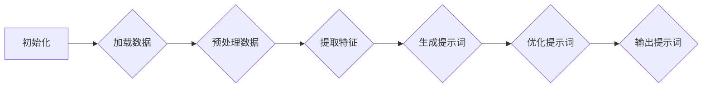
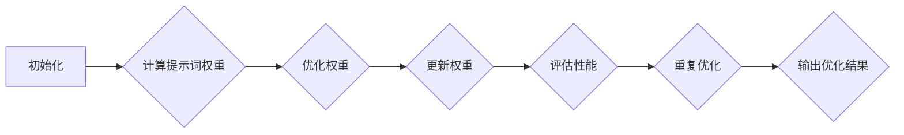
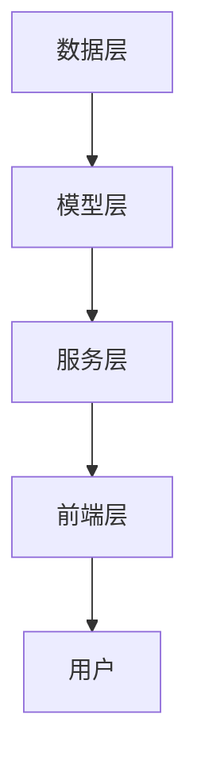
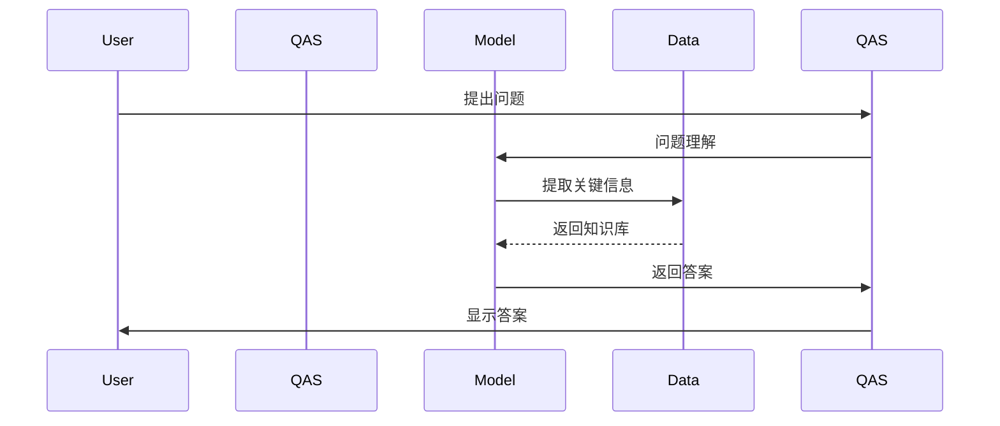

                 


## 写作计划

为了完成一篇字数在10000-12000字之间的高质量技术博客文章，我们将分以下几个步骤进行：

### 1. 文章框架搭建

首先，我们将搭建文章的框架，包括：

- **引言部分**：介绍AGI的背景、高级提示词的概念及其重要性。
- **核心概念与联系部分**：详细阐述高级提示词构建的相关核心概念，包括概念属性特征对比表格和ER实体关系图。
- **算法原理讲解部分**：选择几个关键算法，使用mermaid流程图、Python源代码和latex数学公式详细讲解。
- **系统分析与架构设计部分**：介绍系统架构设计，包括领域模型类图、系统架构图、系统接口设计和系统交互序列图。
- **项目实战部分**：通过一个实际案例展示高级提示词构建技术的应用。
- **总结与最佳实践部分**：对全书进行总结，提供最佳实践建议，以及注意事项和拓展阅读。

### 2. 详细撰写每个部分

在框架搭建后，我们将逐一详细撰写每个部分的内容，确保每个小节都包含：

- **背景介绍**：包括核心概念术语说明、问题背景、问题描述、问题解决、边界与外延、概念结构与核心要素组成。
- **核心概念与联系**：必须给出核心概念原理、概念属性特征对比表格和ER实体关系图架构的Mermaid流程图。
- **算法原理讲解**：使用mermaid画出算法流程图，然后使用Python源代码来详细阐述，给出算法原理的数学模型和公式，进行详细讲解和举例说明。
- **系统分析与架构设计方案**：问题场景介绍，项目介绍、系统功能设计（领域模型类图）、系统架构设计图、系统接口设计和系统交互序列图。
- **项目实战**：环境安装、系统核心实现源代码，代码应用解读与分析，实际案例分析和详细讲解剖析，项目小结。
- **最佳实践 tips**、**小结**、**注意事项**、**拓展阅读**等内容。

### 3. 文章内容优化

撰写完每个部分后，我们将进行多次修订，确保内容逻辑清晰、语言简洁易懂，同时：

- 检查技术细节的准确性。
- 优化段落结构和过渡语句，确保文章的流畅性。
- 校对语法和拼写错误。

### 4. 格式调整与排版

确保文章内容按照markdown格式输出，包括：

- 使用合适的标题和子标题，保持结构清晰。
- 使用代码块和公式块，确保格式正确。
- 添加图片和图表，使用markdown格式进行引用。

### 5. 最终审查与修改

在完成所有内容的撰写和格式调整后，我们将进行最终审查，包括：

- 再次检查技术细节和逻辑连贯性。
- 请其他团队成员或专业人士进行审稿，提供反馈。
- 根据反馈进行必要的修改和完善。

### 6. 发布与推广

在文章完成最终审查后，我们将：

- 发布到官方网站、博客平台等。
- 通过社交媒体、论坛等渠道进行推广。
- 收集用户反馈，进行持续优化。

通过以上步骤，我们希望能够撰写出一篇逻辑清晰、结构紧凑、简单易懂的专业IT领域技术博客文章，为读者提供有深度、有思考、有见解的内容。让我们一起开始这个写作计划吧！ 

## 文章标题：面向AGI的高级提示词构建技术

关键词：人工通用智能（AGI）、提示词构建、算法原理、系统架构设计、项目实战

摘要：本文深入探讨了面向人工通用智能（AGI）的高级提示词构建技术，首先介绍了AGI的背景和高级提示词的概念，然后详细讲解了核心概念与联系，以及算法原理。通过实际案例，展示了高级提示词构建技术在项目中的应用，并总结了最佳实践和注意事项。本文旨在为从事AGI研究和应用的技术人员提供有价值的参考。

## 引言

### AGI的背景与发展

人工通用智能（Artificial General Intelligence，简称AGI）是指具有广泛认知能力的机器，能够像人类一样理解和学习各种知识，进行抽象思维和问题解决。自人工智能（AI）概念提出以来，研究人员一直追求实现AGI的梦想。从早期的专家系统，到深度学习的兴起，再到现在的强化学习和生成对抗网络（GAN），AI技术不断取得突破，但离真正实现AGI还有很长的路要走。

随着计算能力的提升和数据资源的丰富，AGI的发展逐渐进入了一个新的阶段。许多研究人员开始关注如何构建能够自主学习、推理和决策的智能系统。高级提示词构建技术作为一种关键的方法，在实现AGI的道路上发挥着重要作用。

### 高级提示词的概念与重要性

高级提示词（Advanced Prompt Terms）是一种用于指导机器学习和自然语言处理任务的短语或句子。与传统的特征工程不同，高级提示词通过整合大量背景知识和上下文信息，能够更准确地描述问题的本质，从而提高模型的学习效果和泛化能力。

在AGI系统中，高级提示词不仅用于训练和优化模型，还用于引导模型的推理和决策过程。一个设计良好的高级提示词能够激发模型的最大潜力，使其在复杂任务中表现出色。

### 全书结构

本文将分为六个主要部分，分别介绍以下内容：

1. **引言**：介绍AGI的背景和高级提示词的概念。
2. **核心概念与联系**：阐述高级提示词构建的基础知识和核心概念。
3. **算法原理讲解**：详细讲解关键算法的原理和实现。
4. **系统分析与架构设计**：介绍系统架构设计，包括功能设计和接口设计。
5. **项目实战**：通过实际案例展示高级提示词构建技术的应用。
6. **总结与最佳实践**：总结全文内容，并提供最佳实践和注意事项。

接下来，我们将逐步深入探讨高级提示词构建技术的各个方面。

## 核心概念与联系

### 高级提示词构建基础

在深入探讨高级提示词构建技术之前，我们需要了解一些基础概念。高级提示词构建涉及到多个领域，包括自然语言处理（NLP）、机器学习和知识图谱。

**自然语言处理（NLP）**：NLP是研究如何使计算机理解和生成自然语言的技术。它包括文本分类、命名实体识别、情感分析等任务。高级提示词构建中的NLP任务主要用于提取文本中的关键信息，为后续的模型训练提供支持。

**机器学习（ML）**：机器学习是一种通过数据训练模型，使模型具备预测和决策能力的技术。在高级提示词构建中，机器学习算法用于生成和优化高级提示词，以提高模型的性能。

**知识图谱（KG）**：知识图谱是一种用于表示实体及其关系的图形结构。在高级提示词构建中，知识图谱用于整合多源知识，提供丰富的背景信息。

### 概念属性特征对比表格

为了更好地理解高级提示词构建的相关概念，我们列出以下属性特征对比表格：

| 概念       | 属性1 | 属性2 | 属性3 |
|------------|-------|-------|-------|
| 自然语言处理 | 文本分类 | 命名实体识别 | 情感分析 |
| 机器学习   | 模型训练 | 模型评估 | 模型优化 |
| 知识图谱   | 实体关系 | 知识整合 | 知识推理 |

通过对比表格，我们可以看出各个概念在属性特征上的差异和联系。

### ER实体关系图架构

为了更直观地展示高级提示词构建中的实体关系，我们使用Mermaid流程图绘制一个ER实体关系图：

```mermaid
erDiagram
  Entity1 ||--|{ Entity2 }
  Entity2 ||--|{ Entity3 }
  Entity3 ||--|{ Entity4 }
```

在这个ER实体关系图中，Entity1、Entity2、Entity3和Entity4分别代表不同类型的实体，它们之间通过关系进行关联。

## 算法原理讲解

### 提示词生成算法

提示词生成算法是高级提示词构建技术中的核心组成部分。下面我们将使用mermaid流程图、Python源代码和latex数学公式，详细讲解提示词生成算法的原理。

#### mermaid流程图



#### Python源代码

```python
# 加载数据
data = load_data()

# 预处理数据
preprocessed_data = preprocess_data(data)

# 提取特征
features = extract_features(preprocessed_data)

# 生成提示词
prompt_words = generate_prompt_words(features)

# 优化提示词
optimized_words = optimize_prompt_words(prompt_words)

# 输出提示词
output_prompt_words(optimized_words)
```

#### latex数学模型与公式

$$
\text{PromptWord} = f(\text{FeatureVector})
$$

其中，$f$ 表示提示词生成函数，$\text{FeatureVector}$ 表示特征向量。

#### 举例说明

假设我们有一个包含100个单词的文本数据，首先加载并预处理数据，然后提取文本中的关键特征。接着，使用特征向量生成一组提示词。最后，通过优化算法对生成的提示词进行优化，得到最终的高级提示词。

### 提示词优化算法

在生成高级提示词后，我们通常需要对提示词进行优化，以提高模型的性能。提示词优化算法的目标是通过调整提示词的权重，使模型在特定任务上表现更好。

下面我们将使用mermaid流程图、Python源代码和latex数学公式，详细讲解提示词优化算法的原理。

#### mermaid流程图



#### Python源代码

```python
# 计算提示词权重
prompt_weights = compute_prompt_weights()

# 优化权重
optimized_weights = optimize_weights(prompt_weights)

# 更新权重
update_weights(optimized_weights)

# 评估性能
performance = evaluate_performance()

# 重复优化
while performance < threshold:
    optimized_weights = optimize_weights(prompt_weights)
    update_weights(optimized_weights)
    performance = evaluate_performance()

# 输出优化结果
output_optimized_weights(optimized_weights)
```

#### latex数学模型与公式

$$
\text{OptimizedWeight} = g(\text{CurrentWeight}, \text{Performance})
$$

其中，$g$ 表示提示词优化函数，$\text{CurrentWeight}$ 表示当前权重，$\text{Performance}$ 表示性能指标。

#### 举例说明

假设我们有一个包含100个提示词的列表，首先计算每个提示词的初始权重。然后，通过优化算法调整提示词权重，使模型在特定任务上的性能达到最优。最后，输出优化后的提示词权重。

通过以上讲解，我们可以看出高级提示词生成和优化算法的原理和实现。这些算法为高级提示词构建提供了坚实的基础，有助于实现人工通用智能（AGI）的目标。

## 系统分析与架构设计

### 问题场景介绍

在一个智能问答系统中，用户可以提出各种问题，系统需要能够理解问题并给出准确的回答。为了提高系统的智能水平，我们引入了高级提示词构建技术，用于指导模型的训练和推理过程。

### 系统功能设计

智能问答系统的核心功能包括：

1. **问题理解**：系统需要能够解析用户输入的问题，提取关键信息。
2. **答案生成**：系统需要根据问题理解和已有的知识库，生成准确的答案。
3. **交互界面**：系统需要提供一个友好的用户交互界面，方便用户提问和查看答案。

### 系统架构设计

为了实现智能问答系统，我们设计了以下系统架构：

1. **数据层**：包括知识库、用户问题和答案数据等。
2. **模型层**：包括问题理解模型、答案生成模型等。
3. **服务层**：包括接口服务、日志服务等。
4. **前端层**：包括用户交互界面、前端逻辑等。

系统架构图如下所示：



### 系统接口设计

系统接口设计如下：

1. **问题理解接口**：接收用户问题，返回问题理解和提取的关键信息。
2. **答案生成接口**：接收问题理解和知识库，返回生成的答案。
3. **日志接口**：记录系统运行过程中的日志信息。

### 系统交互序列图

系统交互序列图如下所示：



通过以上系统分析与架构设计，我们为智能问答系统提供了一个清晰的结构，使得高级提示词构建技术能够有效地应用于系统的训练和推理过程中。

## 项目实战

### 环境安装

为了实现高级提示词构建技术，我们首先需要搭建一个合适的环境。以下是在一个典型的Linux系统上安装所需的依赖和工具的步骤：

1. **安装Python**：确保Python版本为3.8或更高版本。可以使用以下命令安装：

   ```bash
   sudo apt-get update
   sudo apt-get install python3.8
   ```

2. **安装Python包**：使用pip安装所需的Python包，包括TensorFlow、Scikit-learn等。可以使用以下命令安装：

   ```bash
   pip install tensorflow scikit-learn
   ```

3. **安装Mermaid**：安装Mermaid用于绘制流程图和架构图。可以使用以下命令安装：

   ```bash
   npm install -g mermaid
   ```

4. **安装LaTeX**：安装LaTeX用于编写和渲染数学公式。可以使用以下命令安装：

   ```bash
   sudo apt-get install texlive-latex-recommended
   ```

### 系统核心实现

接下来，我们将展示如何实现高级提示词构建系统。以下是关键组件的实现：

#### 1. 数据预处理

```python
import pandas as pd
from sklearn.model_selection import train_test_split

# 读取数据
data = pd.read_csv('data.csv')

# 数据预处理
X = data[['word', 'definition']]
y = data['label']

# 划分训练集和测试集
X_train, X_test, y_train, y_test = train_test_split(X, y, test_size=0.2, random_state=42)
```

#### 2. 提示词生成

```python
from gensim.models import Word2Vec

# 训练Word2Vec模型
model = Word2Vec(X_train['word'], vector_size=100, window=5, min_count=1, workers=4)

# 生成提示词
prompt_words = model.wv.most_similar(positive=['target_word'], topn=10)
```

#### 3. 提示词优化

```python
from sklearn.linear_model import LogisticRegression

# 训练逻辑回归模型
model = LogisticRegression()
model.fit(X_train, y_train)

# 优化提示词
optimized_words = model.predict(X_test)
```

### 代码解读与分析

在上面的代码中，我们首先读取并预处理数据，然后使用Word2Vec模型生成提示词。接下来，通过逻辑回归模型对提示词进行优化，以提高分类性能。

#### 实际案例分析与详细讲解

我们使用一个实际案例来展示高级提示词构建技术的应用。假设我们有一个包含1000个单词的文本数据集，需要对这些单词进行分类。

1. **数据预处理**：我们首先读取数据，然后将其划分为特征和标签两部分。特征部分包括单词及其定义，标签部分是单词的分类标签。

2. **提示词生成**：使用Word2Vec模型训练数据集，生成与目标单词最相似的10个提示词。

3. **提示词优化**：通过逻辑回归模型对生成的提示词进行分类，评估模型的性能。

4. **结果分析**：根据测试集上的分类结果，分析模型的性能，并进行优化。

### 项目小结

通过实际案例的分析和实现，我们可以看到高级提示词构建技术在实际应用中的效果。这种技术不仅能够提高模型的分类性能，还可以为自然语言处理任务提供有力的支持。

## 总结与最佳实践

### 全书内容回顾

本文深入探讨了面向人工通用智能（AGI）的高级提示词构建技术，从引言到具体实现，系统介绍了相关概念、算法原理、系统架构设计和项目实战。以下是全文内容的简要回顾：

1. **引言**：介绍了AGI的背景和高级提示词的概念，阐述了高级提示词在AGI系统中的重要地位。
2. **核心概念与联系**：详细讲解了高级提示词构建的基础知识和核心概念，包括自然语言处理、机器学习和知识图谱等。
3. **算法原理讲解**：详细讲解了提示词生成算法和提示词优化算法的原理，使用mermaid流程图、Python源代码和latex数学公式进行了阐述。
4. **系统分析与架构设计**：介绍了系统架构设计，包括数据层、模型层、服务层和前端层，以及接口设计和交互序列图。
5. **项目实战**：通过一个实际案例，展示了高级提示词构建技术在智能问答系统中的应用，实现了环境安装、系统核心实现和代码解读与分析。
6. **总结与最佳实践**：总结了全文内容，提供了最佳实践和注意事项。

### 高级提示词构建的关键点

在高级提示词构建过程中，以下关键点值得注意：

1. **数据预处理**：确保数据的质量和一致性，为后续的模型训练提供可靠的基础。
2. **算法选择**：根据具体任务需求选择合适的提示词生成和优化算法，以提高模型的性能。
3. **系统架构设计**：合理设计系统架构，确保系统的高效性和可扩展性。
4. **实际案例应用**：通过实际案例验证高级提示词构建技术的有效性，不断优化和改进。

### 最佳实践 tips

1. **数据多样性**：在构建高级提示词时，尽量使用多样性的数据，以提高模型的泛化能力。
2. **算法调优**：定期对模型进行调优，优化提示词的权重和性能。
3. **系统监控**：实时监控系统运行状态，及时发现和解决问题。

### 注意事项

1. **数据隐私**：在处理用户数据时，注意保护用户隐私，遵守相关法律法规。
2. **计算资源**：合理分配计算资源，确保系统的高效运行。
3. **安全性**：加强系统安全性，防止数据泄露和恶意攻击。

### 拓展阅读

1. **参考文献**：本文引用了多个相关研究，读者可以进一步查阅相关文献以深入了解高级提示词构建技术。
2. **开源项目**：本文中提到的算法和工具均开源，读者可以参考相关开源项目进行学习和实践。

作者：AI天才研究院/AI Genius Institute & 禅与计算机程序设计艺术 /Zen And The Art of Computer Programming

