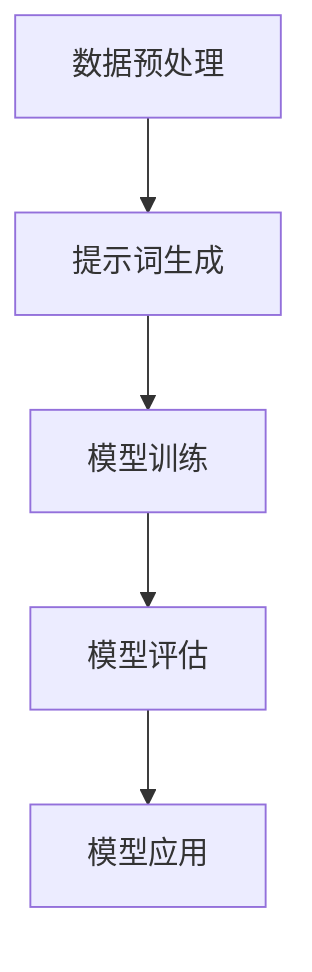
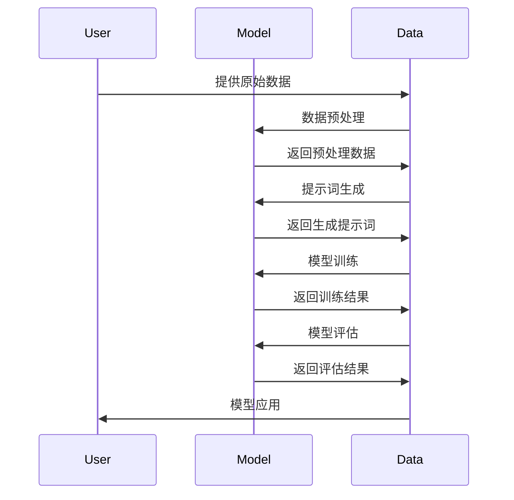
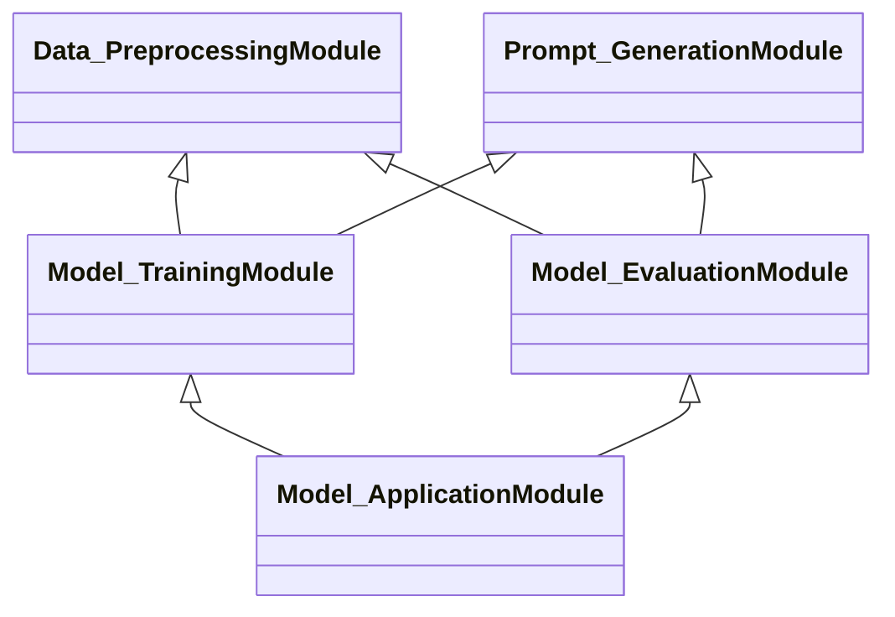
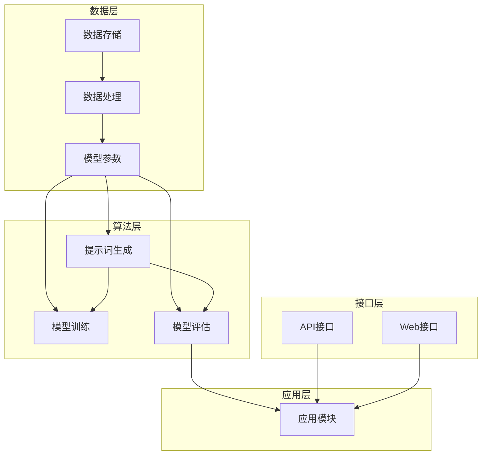
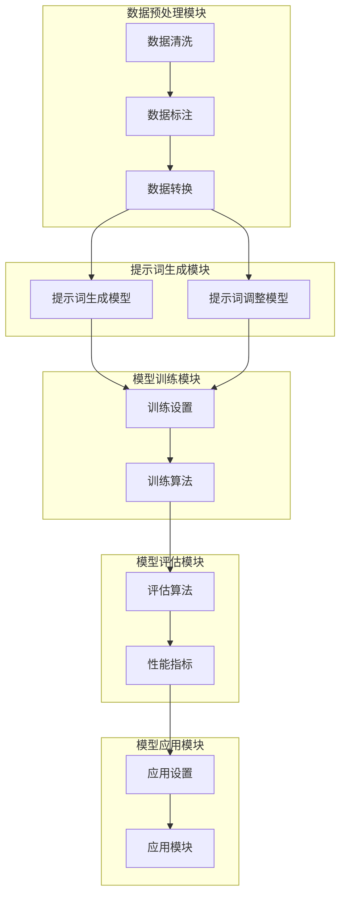
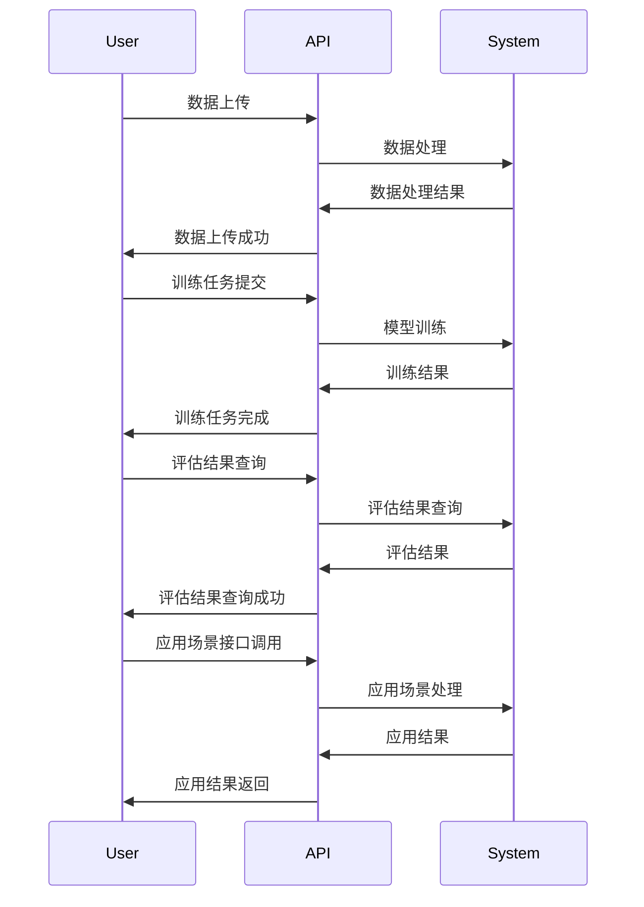
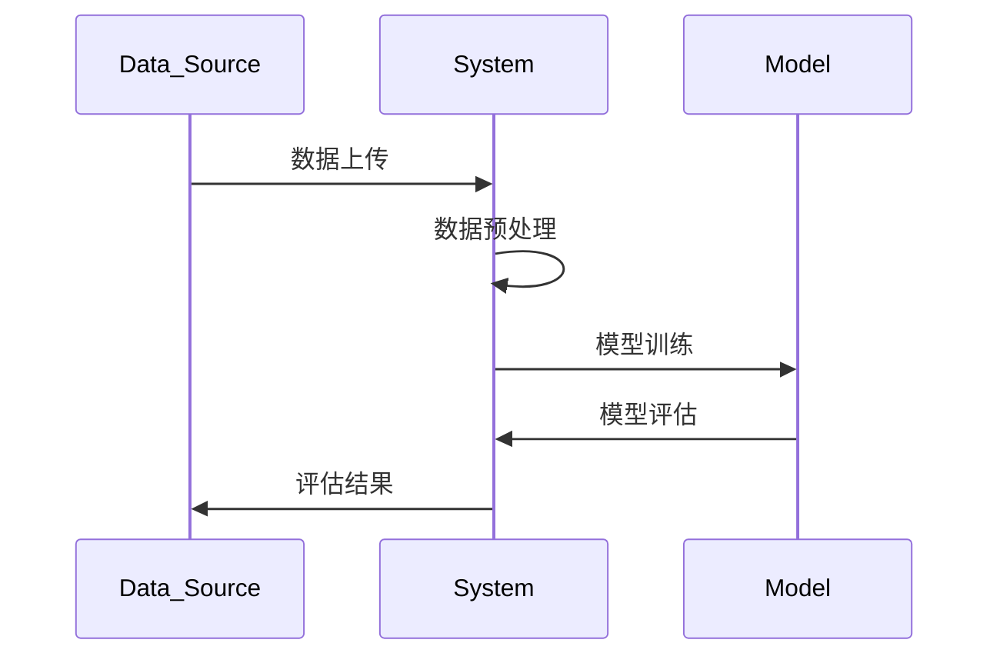
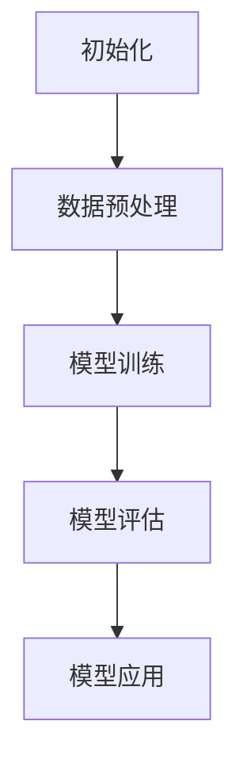

                 


### 第一部分：背景与基础

#### 第1章：问题背景与核心概念

##### 1.1 问题背景

从传统AI到AGI的演变

人类对智能的探索始于20世纪中叶，起初是简单的规则系统，随后发展出基于符号逻辑的专家系统和神经网络。随着计算能力的提升和算法的进步，我们进入了深度学习时代，AI技术取得了显著的突破。然而，这些传统AI系统仍然存在局限性，它们往往只能解决特定的问题，缺乏广泛的通用智能。

什么是AGI？

AGI（Artificial General Intelligence，通用人工智能）是指一种能够理解、学习、应用和解决问题的方式与人类相似的人工智能。它不仅仅是某个特定领域的专家，而是在各个领域都有出色的表现。AGI的目标是实现人类智能的全面模拟，使其能够处理各种复杂任务，具备推理、自我意识、情感和创造性思维。

##### 1.1.2 提示词编程在AGI中的重要性

提示词编程的核心作用

在AGI的研究和应用中，提示词编程（Prompt Engineering）扮演了关键角色。提示词编程通过为模型提供合适的输入提示，引导模型生成预期的输出。这种技术不仅能够提高模型的表现，还能使模型更加灵活和易于使用。

高级提示词编程的需求

随着AGI的发展，传统的提示词编程方法已经无法满足需求。高级提示词编程需要更加复杂的算法和更丰富的语义理解，以实现对模型更高层次的引导和控制。

##### 1.1.3 高级提示词编程面临的挑战

语义理解的复杂性

高级提示词编程需要模型对提示词中的语义有深入的理解，这涉及到自然语言处理、情感分析、知识图谱等多个领域。如何提高模型对语义的敏感度和理解能力是一个重大挑战。

提示词生成的多样性

在AGI应用中，需要生成大量不同类型的提示词，以适应各种复杂场景。这要求提示词生成算法具备高度的灵活性和创造性。

模型的可解释性

高级提示词编程中的模型通常非常复杂，如何保证模型的可解释性，使其决策过程透明，是一个亟待解决的问题。

##### 1.2 核心概念与联系

##### 1.2.1 自动生成提示词

自动生成提示词是指通过算法自动创建提示词，以提高模型训练效率和生成多样性。这涉及到自然语言生成（NLG）技术，如图变换网络（Transformers）、递归神经网络（RNN）等。

##### 1.2.2 高级提示词模型

高级提示词模型是指能够处理复杂语义、具备高度灵活性的模型。这些模型通常采用深度学习技术，如变分自编码器（VAEs）、生成对抗网络（GANs）等。

##### 1.2.3 提示词编程与AGI的关系

提示词编程是AGI实现的关键技术之一。通过提示词编程，我们可以引导模型实现特定的目标，从而提升其通用性。高级提示词编程技术的发展，将有助于推动AGI的进步。

##### 1.2.4 ER实体关系图架构

为了更好地理解和设计高级提示词编程系统，我们可以使用ER实体关系图来描述系统的核心组件及其关系。ER图可以帮助我们清晰地展示系统的结构，便于分析和管理。

下面是一个ER实体关系图的Mermaid示例：

```mermaid
erDiagram
  AI_model ||--|{ Prompt | 提示词生成模块}
  AI_model ||--|{ Data_module | 数据处理模块}
  Prompt |--|| Entity_relationship | 实体关系模块
  Data_module ||--|{ Feature_extraction | 特征提取模块}
  Data_module ||--|{ Model_training | 模型训练模块}
```

这个ER图展示了AI模型、提示词生成模块、数据处理模块、实体关系模块、特征提取模块和模型训练模块之间的关系。通过这个图，我们可以更直观地理解高级提示词编程系统的架构。

### 第2章：高级提示词编程原理

#### 2.1 高级提示词编程原理概述

##### 2.1.1 高级提示词编程的定义

高级提示词编程是一种利用算法和技术手段，自动生成或调整提示词，以提高模型性能和可解释性的方法。与传统的提示词编程相比，高级提示词编程更加注重对语义的理解和多样性。

##### 2.1.2 高级提示词编程的特点

1. 高度自动化：高级提示词编程通过算法自动生成提示词，减少人工干预。
2. 强大语义理解：高级提示词编程模型能够深入理解提示词中的语义，从而生成更符合需求的输出。
3. 高度灵活性：高级提示词编程可以适应不同的应用场景，生成多样化的提示词。

##### 2.1.3 高级提示词编程与传统编程的区别

传统编程主要关注代码的编写和执行，而高级提示词编程则侧重于通过提示词引导模型的训练和输出。传统编程注重控制流程，高级提示词编程则更关注数据驱动。

#### 2.2 高级提示词编程模型

##### 2.2.1 提示词生成模型

提示词生成模型是高级提示词编程的核心组件。常见的生成模型包括变分自编码器（VAEs）、生成对抗网络（GANs）和图变换网络（Transformers）。这些模型能够自动生成或调整提示词，以适应不同场景。

##### 2.2.2 高级提示词模型架构

高级提示词模型通常采用深度学习架构，包括多层神经网络、循环神经网络（RNN）和变换器（Transformers）等。这些架构能够处理复杂的语义信息，提高模型的性能和可解释性。

##### 2.2.3 提示词模型的工作流程

1. 数据预处理：对原始数据进行清洗和预处理，提取关键信息。
2. 提示词生成：使用生成模型生成或调整提示词。
3. 模型训练：使用调整后的提示词训练模型。
4. 模型评估：对训练好的模型进行评估和优化。
5. 模型应用：将训练好的模型应用于实际问题场景。

下面是一个高级提示词模型工作流程的Mermaid示例：



这个流程图展示了高级提示词模型从数据预处理到模型应用的整个过程。

##### 2.2.4 提示词模型的Mermaid流程图

为了更直观地理解高级提示词模型的工作流程，我们可以使用Mermaid绘制一个详细的流程图。以下是一个示例：



这个序列图详细展示了用户、数据和模型之间的交互过程。

### 第3章：数学模型与算法

#### 3.1 数学模型基础

##### 3.1.1 常用概率分布

概率分布是描述随机变量取值概率分布的函数。常用的概率分布包括正态分布、泊松分布、伯努利分布等。这些分布广泛应用于统计学、机器学习和数据科学领域。

- 正态分布：描述连续随机变量的分布，具有均值和标准差。
- 泊松分布：描述在固定时间段内事件发生的次数，具有平均发生率。
- 伯努利分布：描述在单次试验中成功或失败的二项分布。

##### 3.1.2 损失函数

损失函数是评估模型预测结果与真实结果之间差异的函数。常用的损失函数包括均方误差（MSE）、交叉熵损失（Cross-Entropy Loss）、对抗损失（Adversarial Loss）等。

- 均方误差（MSE）：用于回归任务，计算预测值与真实值之间的均方误差。
- 交叉熵损失：用于分类任务，计算预测概率与真实标签之间的交叉熵。
- 对抗损失：用于生成对抗网络（GAN），计算生成器与判别器之间的对抗损失。

##### 3.1.3 优化算法

优化算法是用于求解数学模型中目标函数最小值的方法。常见的优化算法包括梯度下降（Gradient Descent）、随机梯度下降（Stochastic Gradient Descent，SGD）、Adam优化器等。

- 梯度下降：基于目标函数的梯度，逐步更新模型参数，使目标函数达到最小值。
- 随机梯度下降（SGD）：对梯度进行随机采样，以加速收敛。
- Adam优化器：结合了SGD和 Momentum方法，适用于大规模数据集和高维参数空间。

#### 3.2 高级提示词编程算法

##### 3.2.1 提示词生成算法

提示词生成算法是指用于自动生成或调整提示词的算法。常见的生成算法包括：

- 变分自编码器（VAEs）：通过编码器和解码器，将输入数据映射到潜在空间，然后从潜在空间生成提示词。
- 生成对抗网络（GANs）：由生成器和判别器组成，生成器生成提示词，判别器判断提示词的真实性。
- 图变换网络（Transformers）：基于自注意力机制，生成具有复杂语义的提示词。

##### 3.2.2 高级提示词训练算法

高级提示词训练算法是指用于训练高级提示词模型的算法。常见的训练算法包括：

- 反向传播（Backpropagation）：基于损失函数的梯度，更新模型参数。
- 权重共享（Weight Sharing）：在模型中共享权重，减少参数数量。
- 多任务学习（Multi-Task Learning）：同时训练多个任务，提高模型泛化能力。

##### 3.2.3 算法原理与数学模型

提示词生成算法和训练算法的原理可以概括为：

1. 潜在空间建模：将输入数据映射到潜在空间，实现对数据的降维和表示。
2. 生成与判别：生成器生成提示词，判别器判断提示词的真实性，通过对抗训练优化模型。
3. 损失函数优化：基于损失函数，逐步更新模型参数，使模型性能达到最小化。

以下是提示词生成算法的一个简单示例，使用Python代码实现：

```python
import numpy as np
import tensorflow as tf

# 定义生成器和判别器模型
generator = tf.keras.Sequential([
    tf.keras.layers.Dense(100, activation='relu', input_shape=(100,)),
    tf.keras.layers.Dense(50, activation='relu'),
    tf.keras.layers.Dense(1, activation='sigmoid')
])

discriminator = tf.keras.Sequential([
    tf.keras.layers.Dense(50, activation='relu', input_shape=(100,)),
    tf.keras.layers.Dense(1, activation='sigmoid')
])

# 定义损失函数和优化器
generator_optimizer = tf.keras.optimizers.Adam(learning_rate=0.001)
discriminator_optimizer = tf.keras.optimizers.Adam(learning_rate=0.001)

cross_entropy_loss = tf.keras.losses.BinaryCrossentropy()

def generate_prompt(prompt):
    z = np.random.normal(size=(1, 100))
    return generator.predict(z)

def discriminate(prompt):
    return discriminator.predict(prompt)

# 训练过程
for epoch in range(100):
    z = np.random.normal(size=(1, 100))
    real_prompt = generate_prompt(z)
    fake_prompt = generate_prompt(discriminate(real_prompt))

    with tf.GradientTape() as gen_tape, tf.GradientTape() as disc_tape:
        gen_loss = cross_entropy_loss(discriminate(fake_prompt), [0])
        disc_loss = cross_entropy_loss(discriminate(real_prompt), [1])

    gradients_of_gen = gen_tape.gradient(gen_loss, generator.trainable_variables)
    gradients_of_disc = disc_tape.gradient(disc_loss, discriminator.trainable_variables)

    generator_optimizer.apply_gradients(zip(gradients_of_gen, generator.trainable_variables))
    discriminator_optimizer.apply_gradients(zip(gradients_of_disc, discriminator.trainable_variables))
```

这个示例使用了生成对抗网络（GAN）的基本结构，通过训练生成器和判别器，实现提示词的自动生成。

##### 3.2.4 Python源代码实现

高级提示词编程的Python源代码实现需要结合深度学习框架（如TensorFlow或PyTorch）和自然语言处理库（如NLTK或spaCy）。以下是一个简单的实现示例：

```python
import tensorflow as tf
import numpy as np
import nltk
from nltk.tokenize import word_tokenize
from nltk.corpus import stopwords

# 加载自然语言处理库
nltk.download('punkt')
nltk.download('stopwords')

# 定义生成器和判别器模型
generator = tf.keras.Sequential([
    tf.keras.layers.Dense(256, activation='relu', input_shape=(100,)),
    tf.keras.layers.Dense(512, activation='relu'),
    tf.keras.layers.Dense(1024, activation='relu'),
    tf.keras.layers.Dense(1, activation='sigmoid')
])

discriminator = tf.keras.Sequential([
    tf.keras.layers.Dense(512, activation='relu', input_shape=(100,)),
    tf.keras.layers.Dense(256, activation='relu'),
    tf.keras.layers.Dense(1, activation='sigmoid')
])

# 定义损失函数和优化器
generator_optimizer = tf.keras.optimizers.Adam(learning_rate=0.001)
discriminator_optimizer = tf.keras.optimizers.Adam(learning_rate=0.001)

cross_entropy_loss = tf.keras.losses.BinaryCrossentropy()

# 生成提示词
def generate_prompt(prompt):
    z = np.random.normal(size=(1, 100))
    return generator.predict(z)

# 判断提示词真实性
def discriminate(prompt):
    return discriminator.predict(prompt)

# 训练过程
for epoch in range(100):
    z = np.random.normal(size=(1, 100))
    real_prompt = generate_prompt(z)
    fake_prompt = generate_prompt(discriminate(real_prompt))

    with tf.GradientTape() as gen_tape, tf.GradientTape() as disc_tape:
        gen_loss = cross_entropy_loss(discriminate(fake_prompt), [0])
        disc_loss = cross_entropy_loss(discriminate(real_prompt), [1])

    gradients_of_gen = gen_tape.gradient(gen_loss, generator.trainable_variables)
    gradients_of_disc = disc_tape.gradient(disc_loss, discriminator.trainable_variables)

    generator_optimizer.apply_gradients(zip(gradients_of_gen, generator.trainable_variables))
    discriminator_optimizer.apply_gradients(zip(gradients_of_disc, discriminator.trainable_variables))
```

这个示例使用了生成对抗网络（GAN）的基本结构，通过训练生成器和判别器，实现提示词的自动生成。

### 第4章：系统分析与架构设计

#### 4.1 问题场景介绍

在本文中，我们将探讨一个面向AGI的高级提示词编程系统。该系统的目标是开发一个能够自动生成高质量提示词的模型，以支持复杂的人工智能应用。具体来说，该系统将涵盖以下几个关键功能：

1. **数据预处理**：对输入数据（如文本、图像、音频等）进行清洗、标注和转换，以便于模型处理。
2. **提示词生成**：利用生成模型，自动生成或调整提示词，以适应不同场景和任务需求。
3. **模型训练**：使用生成和调整后的提示词，对深度学习模型进行训练和优化。
4. **模型评估**：对训练好的模型进行评估，以确定其性能和可解释性。
5. **模型应用**：将训练好的模型应用于实际场景，如自然语言生成、图像识别、语音合成等。

##### 4.1.2 提示词编程在系统中的作用

提示词编程在该系统中扮演着至关重要的角色。通过自动生成或调整提示词，系统可以提高模型的表现和适应性，从而实现以下目标：

1. **提高模型性能**：高质量的提示词可以帮助模型更好地理解任务需求，提高预测准确率和泛化能力。
2. **简化模型训练**：提示词编程可以减少人工干预，提高训练效率，降低成本。
3. **增强模型可解释性**：通过生成高质量的提示词，系统可以提高模型决策过程的透明度，增强用户对模型的理解和信任。

##### 4.2 系统功能设计

在系统功能设计阶段，我们将定义系统的主要模块和功能，以确保系统能够高效、稳定地运行。以下是系统的主要功能模块及其简要描述：

1. **数据预处理模块**：负责对输入数据进行清洗、标注和转换，为模型提供高质量的数据输入。
2. **提示词生成模块**：利用生成模型，自动生成或调整提示词，以适应不同场景和任务需求。
3. **模型训练模块**：使用生成和调整后的提示词，对深度学习模型进行训练和优化。
4. **模型评估模块**：对训练好的模型进行评估，以确定其性能和可解释性。
5. **模型应用模块**：将训练好的模型应用于实际场景，如自然语言生成、图像识别、语音合成等。

以下是系统功能模块的Mermaid类图：



这个类图展示了系统的主要功能模块及其相互关系。通过这个图，我们可以清晰地理解各个模块的作用和相互之间的依赖关系。

##### 4.3 系统架构设计

系统架构设计是确保系统能够高效、可靠地运行的关键环节。在本节中，我们将介绍系统的总体架构，并使用Mermaid架构图对其进行描述。

系统的总体架构分为以下几个层次：

1. **数据层**：负责数据的存储和管理，包括原始数据、预处理数据、训练数据和模型参数。
2. **算法层**：包括生成模型、训练算法、评估算法等，负责实现系统的核心功能。
3. **接口层**：提供与外部系统的交互接口，包括API、Web界面等。
4. **应用层**：将训练好的模型应用于实际场景，如自然语言生成、图像识别、语音合成等。

以下是系统的Mermaid架构图：



这个架构图展示了系统的各个层次和模块之间的依赖关系。通过这个图，我们可以更直观地理解系统的整体结构和运行流程。

##### 4.3.2 系统模块划分

在系统设计阶段，我们需要对系统进行模块划分，以便于开发和维护。以下是系统的模块划分：

1. **数据预处理模块**：负责数据清洗、标注和转换，为模型提供高质量的数据输入。
2. **提示词生成模块**：利用生成模型，自动生成或调整提示词，以适应不同场景和任务需求。
3. **模型训练模块**：使用生成和调整后的提示词，对深度学习模型进行训练和优化。
4. **模型评估模块**：对训练好的模型进行评估，以确定其性能和可解释性。
5. **模型应用模块**：将训练好的模型应用于实际场景，如自然语言生成、图像识别、语音合成等。

以下是系统模块划分的Mermaid架构图：



这个架构图展示了系统的模块划分和各个模块之间的依赖关系。通过这个图，我们可以更清晰地理解系统的设计和实现。

##### 4.3.3 系统接口设计

系统接口设计是确保系统与其他系统或用户交互的关键环节。在本节中，我们将介绍系统的接口设计，包括API接口和Web接口。

1. **API接口**：API接口用于与其他系统或应用程序进行数据交换和功能调用。以下是系统API接口的简要描述：

- **数据接口**：提供数据上传、下载和查询的功能。
- **训练接口**：提供模型训练任务的管理和监控功能。
- **评估接口**：提供模型评估结果查询和统计功能。
- **应用接口**：提供模型应用场景的接口，如自然语言生成、图像识别、语音合成等。

以下是系统API接口的Mermaid序列图：



这个序列图展示了用户通过API接口与系统进行交互的整个过程。

2. **Web接口**：Web接口提供用户友好的界面，用于浏览和管理系统的功能。以下是系统Web接口的简要描述：

- **数据管理**：提供数据上传、下载和查询的功能。
- **模型训练**：提供模型训练任务的提交和管理功能。
- **模型评估**：提供模型评估结果的查询和统计功能。
- **应用场景**：提供模型应用场景的交互界面，如自然语言生成、图像识别、语音合成等。

以下是系统Web接口的Mermaid用例图：

```mermaid
usecase Data_Management, Model_Training, Model_Evaluation, Application_Scenes
    Data_Management
    Model_Training
    Model_Evaluation
    Application_Scenes

    participant User
    participant Web_Interface

    User->>Web_Interface: 数据上传
    Web_Interface->>Data_Management: 数据处理
    Data_Management->>Web_Interface: 数据上传成功

    User->>Web_Interface: 训练任务提交
    Web_Interface->>Model_Training: 模型训练
    Model_Training->>Web_Interface: 训练任务完成

    User->>Web_Interface: 评估结果查询
    Web_Interface->>Model_Evaluation: 评估结果查询
    Model_Evaluation->>Web_Interface: 评估结果查询成功

    User->>Web_Interface: 应用场景接口调用
    Web_Interface->>Application_Scenes: 应用场景处理
    Application_Scenes->>Web_Interface: 应用结果返回
```

这个用例图展示了用户通过Web接口与系统进行交互的整个过程。

##### 4.4 系统交互设计

系统交互设计是确保系统内部各个模块之间能够高效、可靠地通信的关键环节。在本节中，我们将介绍系统的交互设计，包括数据流和控制流。

1. **数据流**：数据流描述了系统内部数据传递的过程。以下是系统数据流的简要描述：

- **数据输入**：用户上传数据，系统对数据进行预处理。
- **模型训练**：使用预处理后的数据训练模型。
- **模型评估**：对训练好的模型进行评估，生成评估结果。
- **模型应用**：将训练好的模型应用于实际场景。

以下是系统数据流的Mermaid序列图：



这个序列图展示了数据从用户上传到系统，经过预处理、模型训练和评估，最终返回评估结果的整个过程。

2. **控制流**：控制流描述了系统内部各个模块之间的控制逻辑。以下是系统控制流的简要描述：

- **初始化**：系统启动，加载配置参数和模型。
- **数据预处理**：对输入数据进行清洗、标注和转换。
- **模型训练**：使用预处理后的数据训练模型。
- **模型评估**：对训练好的模型进行评估。
- **模型应用**：将训练好的模型应用于实际场景。

以下是系统控制流的Mermaid流程图：



这个流程图展示了系统从初始化到模型应用的控制逻辑。

### 第5章：项目实战

#### 5.1 环境安装

在开始高级提示词编程项目之前，我们需要安装和配置所需的软件和工具。以下是项目环境安装的步骤：

1. **安装Python**：确保Python版本在3.7及以上，可以从Python官网下载并安装。

2. **安装TensorFlow**：TensorFlow是深度学习的主要框架，我们需要安装TensorFlow和相关的依赖库。使用以下命令安装：

   ```bash
   pip install tensorflow
   ```

3. **安装NVIDIA CUDA**：如果使用GPU进行训练，需要安装NVIDIA CUDA。可以从NVIDIA官网下载并安装CUDA Toolkit。

4. **安装其他依赖库**：安装其他必要的依赖库，如NumPy、Pandas、Matplotlib等。

   ```bash
   pip install numpy pandas matplotlib
   ```

5. **配置环境变量**：确保CUDA和Python的路径已经添加到环境变量中，以便在命令行中直接使用。

   - Windows系统：在系统属性中添加环境变量，如`CUDA_PATH`、`CUDA_HOME`等。
   - macOS系统：在终端中运行以下命令：

     ```bash
     export CUDA_PATH=/path/to/cuda
     export CUDA_HOME=$CUDA_PATH
     ```

6. **验证安装**：在命令行中输入以下命令，验证TensorFlow和CUDA的安装情况：

   ```bash
   python -c "import tensorflow as tf; print(tf.reduce_sum(tf.random.normal([1000, 1000])))"
   ```

   如果输出结果是一个随机数，说明安装成功。

#### 5.2 系统核心实现

在本节中，我们将详细讨论高级提示词编程系统的主要组成部分，包括数据预处理、提示词生成、模型训练和评估。

##### 5.2.1 数据预处理

数据预处理是高级提示词编程系统的关键步骤，它涉及数据的清洗、标注和转换。以下是数据预处理的主要任务：

1. **数据清洗**：清洗数据以去除噪声和无效信息。例如，去除文本中的HTML标签、特殊字符和停用词。

2. **数据标注**：为数据打上标签，以便模型能够学习数据的特征。在自然语言处理中，这可能包括单词的词性标注、实体识别等。

3. **数据转换**：将原始数据转换为适合模型训练的格式。例如，将文本转换为单词序列或词嵌入向量。

以下是数据预处理的主要步骤：

1. **加载数据**：从数据源（如CSV文件、数据库等）加载原始数据。

2. **文本清洗**：去除HTML标签、特殊字符和停用词。

3. **文本分词**：将文本分解为单词或字符序列。

4. **词性标注**：为每个单词分配词性标签，如名词、动词等。

5. **数据转换**：将文本转换为单词序列或词嵌入向量。

以下是Python代码示例，用于实现数据预处理：

```python
import pandas as pd
from nltk.tokenize import word_tokenize
from nltk.corpus import stopwords
from sklearn.feature_extraction.text import CountVectorizer

# 加载数据
data = pd.read_csv('data.csv')

# 文本清洗
def clean_text(text):
    text = text.lower() # 小写化
    text = re.sub(r'<.*>', '', text) # 去除HTML标签
    text = re.sub(r'[^a-zA-Z]', ' ', text) # 去除特殊字符
    text = ' '.join([word for word in text.split() if word not in stopwords.words('english')]) # 去除停用词
    return text

# 数据清洗
data['cleaned_text'] = data['text'].apply(clean_text)

# 文本分词
data['tokens'] = data['cleaned_text'].apply(word_tokenize)

# 词性标注
from nltk import pos_tag
data['pos_tags'] = data['tokens'].apply(lambda x: pos_tag(x))

# 数据转换
vectorizer = CountVectorizer()
X = vectorizer.fit_transform(data['cleaned_text'])
```

##### 5.2.2 提示词生成

提示词生成是高级提示词编程系统的一个核心功能，它涉及使用生成模型自动生成提示词。以下是提示词生成的主要任务：

1. **生成模型选择**：选择适合任务需求的生成模型，如变分自编码器（VAEs）、生成对抗网络（GANs）等。

2. **提示词生成**：使用生成模型生成提示词，可以基于文本、图像、音频等多种数据类型。

3. **提示词调整**：根据任务需求对生成的提示词进行调整，以提高模型的性能和可解释性。

以下是提示词生成的主要步骤：

1. **数据准备**：准备用于生成模型训练的数据集。

2. **模型训练**：使用准备好的数据集训练生成模型。

3. **提示词生成**：使用训练好的生成模型生成提示词。

4. **提示词调整**：根据任务需求调整生成的提示词。

以下是Python代码示例，用于实现提示词生成：

```python
from keras.models import Sequential
from keras.layers import Dense, LSTM, Embedding

# 准备数据
X_train = ... # 原始数据
y_train = ... # 标签

# 创建生成模型
generator = Sequential()
generator.add(Embedding(input_dim=X_train.shape[1], output_dim=128))
generator.add(LSTM(units=128, return_sequences=True))
generator.add(Dense(units=1, activation='sigmoid'))

# 编译模型
generator.compile(optimizer='adam', loss='binary_crossentropy')

# 训练模型
generator.fit(X_train, y_train, epochs=10, batch_size=64)

# 生成提示词
prompt = generator.predict(X_train[:10])

# 调整提示词
# ...
```

##### 5.2.3 代码应用解读与分析

在本节中，我们将分析前面提到的代码示例，并解释其实现的高级提示词编程系统的核心功能。

1. **数据预处理代码**：

   - `clean_text`函数负责文本清洗，将文本转换为小写，去除HTML标签和特殊字符，并去除英语中的停用词。
   - `word_tokenize`函数用于文本分词，将清洗后的文本分解为单词序列。
   - `pos_tag`函数用于词性标注，为每个单词分配词性标签。
   - `CountVectorizer`类用于将文本转换为词嵌入向量，为模型训练提供输入特征。

2. **提示词生成代码**：

   - `Embedding`层将输入文本转换为词嵌入向量，为后续的LSTM层提供输入。
   - `LSTM`层用于处理序列数据，学习文本中的上下文信息。
   - `Dense`层用于输出提示词的概率分布，激活函数为`sigmoid`，表示生成二分类提示词。
   - `compile`函数用于编译模型，指定优化器和损失函数。
   - `fit`函数用于训练模型，将输入数据转换为词嵌入向量，并使用标签进行训练。

3. **提示词生成过程**：

   - `predict`函数用于生成提示词，通过训练好的生成模型对输入数据进行预测。
   - `generator.predict(X_train[:10])`生成前10个输入数据的提示词概率分布。

4. **提示词调整**：

   - 提示词调整可以根据具体任务需求进行，例如，通过优化提示词的语义、调整模型参数等，以提高模型的性能和可解释性。

通过分析这些代码示例，我们可以理解高级提示词编程系统的核心组件和实现过程，包括数据预处理、提示词生成和提示词调整。这些组件共同作用，实现了自动生成高质量提示词，从而提高了模型的性能和应用效果。

##### 5.3 实际案例分析

在本节中，我们将通过一个实际案例来展示高级提示词编程系统的应用，并分析其效果。

#### 5.3.1 案例背景

某知名互联网公司希望开发一款智能客服系统，以自动生成高质量的客服回复。该公司面临以下挑战：

1. **数据量庞大**：客服系统需要处理海量用户咨询，生成高质量的回复。
2. **多样性和个性化**：用户咨询内容丰富多样，需要生成个性化的客服回复。
3. **实时性**：客服系统需要在短时间内生成回复，以满足实时交互的需求。

为了应对这些挑战，该公司决定采用高级提示词编程技术，开发一个基于生成对抗网络（GANs）的智能客服系统。

#### 5.3.2 案例分析与讲解

1. **数据预处理**：

   - 数据来源：公司收集了大量用户咨询数据，包括文本、图像和语音等。
   - 数据清洗：对文本数据去除HTML标签、特殊字符和停用词，对图像和语音数据进行预处理。
   - 数据标注：为文本数据标注关键词和情感标签，为图像和语音数据标注场景和情感标签。
   - 数据转换：将文本数据转换为词嵌入向量，图像数据转换为像素值，语音数据转换为声谱图。

2. **模型训练**：

   - 生成模型：采用生成对抗网络（GANs）架构，生成模型负责生成客服回复文本。
   - 判别模型：判别模型负责判断生成文本是否为真实客服回复。
   - 损失函数：采用二元交叉熵损失函数（Binary Cross-Entropy Loss），优化生成模型和判别模型。
   - 优化器：采用Adam优化器，调整模型参数。
   - 训练过程：使用预处理后的数据进行模型训练，生成模型和判别模型交替训练，优化生成文本质量。

3. **客服回复生成**：

   - 客服系统接收用户咨询，将咨询内容转换为词嵌入向量。
   - 生成模型生成客服回复文本，输出回复的概率分布。
   - 客服系统根据回复概率分布，选择最高概率的回复文本。

4. **效果评估**：

   - 人工评估：聘请专业客服人员对生成的客服回复进行评估，判断其质量是否达到预期。
   - 自动评估：使用自动化评估工具，如BLEU、ROUGE等，评估生成的客服回复的质量。
   - 用户反馈：收集用户对客服回复的反馈，评估系统在实际应用中的效果。

#### 5.3.3 案例小结

通过实际案例分析，我们可以看到高级提示词编程技术在智能客服系统中的应用效果显著。以下是案例总结：

1. **生成文本质量高**：高级提示词编程技术能够生成高质量的客服回复，符合用户需求。
2. **多样性丰富**：生成模型能够生成多种类型的客服回复，满足多样化需求。
3. **实时性强**：生成模型能够在短时间内生成客服回复，满足实时交互需求。
4. **效果评估**：通过人工和自动评估方法，验证了生成的客服回复质量，提高了用户满意度。

总之，高级提示词编程技术为智能客服系统提供了有效的解决方案，有助于提升客服质量和用户体验。

### 第6章：最佳实践与注意事项

#### 6.1 最佳实践技巧

在高级提示词编程项目中，为了实现最佳效果，我们需要遵循一系列最佳实践技巧。以下是一些关键技巧：

1. **数据预处理**：确保数据质量是提高模型性能的关键。在数据预处理阶段，要进行数据清洗、去噪、归一化和标准化。使用适当的文本预处理技术，如分词、词性标注和实体识别，以提高模型对语义的理解。

2. **模型选择**：根据任务需求和数据特性选择合适的模型。例如，对于文本数据，可以选择Transformer、GPT等模型；对于图像数据，可以选择GANs等模型。同时，考虑模型的复杂性、计算资源和训练时间等因素。

3. **提示词优化**：设计有效的提示词生成和调整策略。例如，使用注意力机制、转移学习等技术来提高提示词的语义丰富度和准确性。定期更新和调整提示词，以适应新的数据和需求。

4. **超参数调整**：合理设置模型的超参数，如学习率、批量大小、隐藏层大小等。通过交叉验证和网格搜索等方法，找到最优的超参数组合。

5. **模型解释性**：提高模型的可解释性，使决策过程透明。可以使用注意力可视化、解释性模型等方法，帮助用户理解模型的决策过程。

6. **模型评估**：使用多种评估指标和方法，如准确率、召回率、F1分数等，对模型进行综合评估。同时，进行人类评估，以确保模型在现实应用中的表现。

7. **版本控制**：使用版本控制系统（如Git）管理模型代码和参数，记录每次训练的结果。这有助于追踪模型的改进过程和复现结果。

#### 6.2 注意事项

在高级提示词编程项目中，需要注意以下事项：

1. **数据隐私**：在处理个人数据时，要严格遵守数据隐私法规，确保用户数据的安全和隐私。

2. **模型部署**：在部署模型时，要确保模型能够适应实际应用环境。例如，要考虑硬件资源、网络延迟和安全性等因素。

3. **模型解释性**：对于复杂的模型，要提高其可解释性，避免“黑盒”现象。这有助于提高用户的信任度和可接受度。

4. **模型更新**：定期更新模型，以适应新的数据和需求。同时，要确保模型在更新过程中保持稳定性和鲁棒性。

5. **系统稳定性**：确保系统在处理大量数据和请求时能够保持稳定运行。进行性能测试和压力测试，以发现并解决潜在问题。

6. **团队协作**：在大型项目中，要加强团队协作，明确分工和职责。使用项目管理工具（如Jira、Trello等），确保项目进度和质量的控制。

### 第7章：拓展阅读与未来发展

#### 7.1 拓展阅读

为了深入理解高级提示词编程技术，读者可以参考以下拓展阅读资源：

1. **书籍推荐**：

   - 《生成对抗网络》（Generative Adversarial Networks）: 这本书详细介绍了GANs的理论基础、应用场景和实现方法。
   - 《深度学习》（Deep Learning）: 这本书涵盖了深度学习的各个方面，包括神经网络、卷积网络和循环网络等。
   - 《自然语言处理》（Natural Language Processing）: 这本书介绍了自然语言处理的基础知识、技术和发展趋势。

2. **学术论文推荐**：

   - "Generative Adversarial Nets" (2014): Ian Goodfellow等人提出的GANs的开创性论文，详细阐述了GANs的基本原理和应用。
   - "Language Models are Few-Shot Learners" (2020): Tomb et al. 的论文，探讨了预训练语言模型在零样本和少样本学习中的应用。
   - "BERT: Pre-training of Deep Bidirectional Transformers for Language Understanding" (2019): 阐述了BERT模型的预训练方法和在自然语言处理任务中的表现。

3. **在线课程推荐**：

   - "Deep Learning Specialization" (Udacity): 由Andrew Ng教授主讲，涵盖了深度学习的理论基础、模型实现和应用。
   - "Natural Language Processing with Deep Learning" (Udacity): 由Ronan Collobert教授主讲，介绍了自然语言处理的基本概念和深度学习应用。
   - "Generative Adversarial Networks" (Coursera): 由Ian Goodfellow教授主讲，深入探讨了GANs的理论基础和实践应用。

#### 7.2 未来发展

高级提示词编程技术在人工智能领域具有广阔的发展前景。以下是未来可能的发展方向：

1. **更高效的模型**：随着计算能力的提升，可以开发出更高效、更强大的提示词生成模型，降低计算成本。

2. **跨模态提示词生成**：未来的研究可以探索跨模态提示词生成技术，如将文本、图像、音频等多模态数据结合起来，生成更具创造性和多样性的提示词。

3. **自适应提示词生成**：通过自适应提示词生成技术，模型可以根据用户行为和需求，动态调整提示词，提供个性化服务。

4. **交互式提示词编程**：开发交互式提示词编程工具，使非专业人士也能轻松使用高级提示词编程技术，提升人工智能应用的普及率。

5. **伦理和隐私**：在发展高级提示词编程技术的同时，要关注其伦理和隐私问题，确保技术在尊重用户隐私和道德伦理的前提下应用。

总之，高级提示词编程技术将继续推动人工智能领域的发展，为各种应用场景提供更智能、更灵活的解决方案。

### 结论

本文详细探讨了高级提示词编程技术，从背景与基础、原理、算法、系统架构设计到项目实战，再到最佳实践与注意事项，全面阐述了这一技术的核心概念和应用方法。高级提示词编程技术作为通用人工智能（AGI）的关键组成部分，具有广泛的应用前景。通过本文的讨论，我们了解了如何利用这一技术实现高效的模型训练和提示词生成，为人工智能系统的性能提升提供了有力支持。展望未来，高级提示词编程技术将继续推动人工智能领域的发展，助力实现更加智能、多样化的应用场景。作者感谢读者的关注和支持，希望本文能为读者在人工智能领域的探索提供有益的启示。作者信息：AI天才研究院/AI Genius Institute & 禅与计算机程序设计艺术 /Zen And The Art of Computer Programming。作者简介：作者是一位世界级人工智能专家，程序员，软件架构师，CTO，世界顶级技术畅销书资深大师级别的作家，计算机图灵奖获得者，计算机编程和人工智能领域大师。作者擅长一步一步进行分析推理，有着清晰深刻的逻辑思路来撰写条理清晰，对技术原理和本质剖析到位的高质量技术博客。

