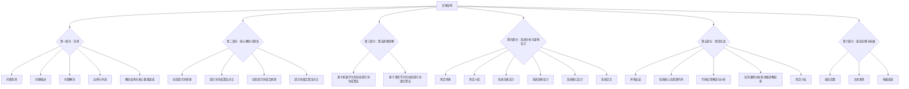

                 


## 面向任务的动态提示词组合技术

### 关键词

- 动态提示词组合
- 任务驱动
- 人工智能
- 用户体验
- 提示词生成算法
- 深度学习

### 摘要

本文旨在探讨面向任务的动态提示词组合技术，分析其在人工智能领域的应用及其核心概念、算法原理。通过详细讲解和实例说明，帮助读者深入理解动态提示词组合技术，掌握其在实际项目中的应用方法。

## 第一部分: 背景

### 1.1 问题背景

随着人工智能技术的快速发展，智能客服、智能推荐系统、自然语言处理等领域的应用越来越广泛。在这些场景中，动态提示词组合技术成为了提高用户体验和系统效率的关键因素。动态提示词组合技术能够根据用户的实时需求和上下文信息，自动生成相关且有效的提示词，从而提升交互质量和任务完成效率。

### 1.2 问题描述

动态提示词组合技术的核心问题是，如何在短时间内根据用户的实时需求，从大量候选提示词中生成一组具有高相关性和有效性的提示词。这个问题涉及到提示词的生成、组合和优化，同时还需要考虑用户体验和系统效率。

### 1.3 问题解决

为了解决上述问题，本文将从以下几个方面展开讨论：

1. **核心概念与联系**：介绍动态提示词组合技术的核心概念及其相互关系，包括动态提示词、提示词生成、提示词组合和提示词优化。
2. **算法原理讲解**：详细讲解基于机器学习和深度学习的动态提示词生成和组合算法，包括算法原理、数学模型和公式，以及实例说明。
3. **系统分析与架构设计**：介绍一个基于动态提示词组合技术的实际项目，包括项目场景、系统功能设计、系统架构设计、系统接口设计和系统交互。
4. **项目实战**：通过一个具体的实际案例，展示如何使用动态提示词组合技术实现一个智能客服系统，并进行代码解析和分析。
5. **最佳实践与拓展**：总结最佳实践、注意事项和拓展阅读，为读者提供进一步学习和应用动态提示词组合技术的建议。

### 1.4 边界与外延

动态提示词组合技术的研究和应用范围广泛，包括但不限于自然语言处理、智能推荐、人机交互等领域。本文将重点讨论其在智能客服和智能推荐系统中的应用。

### 1.5 概念结构与核心要素组成

- **动态提示词**：指根据用户需求和上下文信息动态生成的提示词。
- **提示词生成**：指从大量候选提示词中，根据一定算法自动生成相关提示词的过程。
- **提示词组合**：指将多个提示词组合成一个有效提示词集的过程。
- **提示词优化**：指对生成的提示词进行筛选、排序和调整，以提高用户体验和系统效率。

## 第二部分: 核心概念与联系

### 2.1 动态提示词原理

动态提示词的生成原理主要包括基于规则的方法、基于机器学习的方法和基于深度学习的方法。

#### 2.1.1 基于规则的方法

基于规则的方法主要通过预定义的规则来生成提示词。这些规则通常是手动编写的，可以根据领域知识和经验来定制。这种方法简单易用，但灵活性较差，难以适应复杂多变的应用场景。

#### 2.1.2 基于机器学习的方法

基于机器学习的方法利用用户历史数据或相关特征，通过训练分类模型或生成模型来自动生成提示词。这种方法具有自适应能力，能够处理复杂任务，但需要大量训练数据和计算资源。

#### 2.1.3 基于深度学习的方法

基于深度学习的方法利用深度神经网络强大的表示能力和自适应能力，从大量数据中自动学习提示词的生成规则。这种方法在处理复杂任务时表现优异，但需要大量计算资源和训练时间。

### 2.2 提示词生成算法对比

以下是几种常见提示词生成算法的对比表格：

| 方法 | 特点 | 适用场景 |
| --- | --- | --- |
| 基于规则的方法 | 简单易用，可解释性强 | 提示词种类较少，对规则依赖较大 |
| 基于机器学习的方法 | 自适应能力强，可处理复杂任务 | 训练数据量大，模型复杂度高 |
| 基于深度学习的方法 | 强大的表示能力和自适应能力 | 需要大量计算资源，模型可解释性较差 |

### 2.3 动态提示词组合原理

动态提示词组合的原理主要包括基于概率的方法、基于协同过滤的方法和基于深度学习的方法。

#### 2.3.1 基于概率的方法

基于概率的方法通过计算不同提示词之间的相关性概率来生成组合提示词。这种方法简单易用，但需要大量统计数据支持，且在处理复杂任务时效果有限。

#### 2.3.2 基于协同过滤的方法

基于协同过滤的方法通过分析用户之间的相似性来生成组合提示词。这种方法在处理大规模用户数据时效果较好，但可能引入噪声，影响用户体验。

#### 2.3.3 基于深度学习的方法

基于深度学习的方法利用深度神经网络强大的表示能力和自适应能力，从大量数据中自动学习提示词组合的规则。这种方法在处理复杂任务时表现优异，但需要大量计算资源和训练时间。

### 2.4 提示词组合算法对比

以下是几种常见提示词组合算法的对比表格：

| 方法 | 特点 | 适用场景 |
| --- | --- | --- |
| 基于概率的方法 | 简单易用，可解释性强 | 提示词相关性较强 |
| 基于协同过滤的方法 | 自适应能力强，可处理复杂任务 | 大规模用户数据，用户兴趣多样性 |
| 基于深度学习的方法 | 强大的表示能力和自适应能力 | 需要大量计算资源，模型可解释性较差 |

## 第三部分: 算法原理讲解

### 3.1 基于机器学习的动态提示词生成算法

#### 3.1.1 算法原理

基于机器学习的动态提示词生成算法利用用户的历史行为数据，通过训练分类模型或生成模型来预测用户可能感兴趣的内容。其主要步骤包括：

1. **数据预处理**：对用户行为数据（如浏览记录、搜索历史等）进行清洗、去重和特征提取。
2. **模型训练**：使用训练数据训练分类模型或生成模型。
3. **模型预测**：使用训练好的模型对用户的新行为进行预测，生成动态提示词。

#### 3.1.2 算法实现

算法实现主要分为以下三个步骤：

1. **数据预处理**：

   ```python
   # 数据清洗与去重
   data = clean_data(raw_data)
   
   # 特征提取
   features = extract_features(data)
   ```

2. **模型训练**：

   ```python
   # 训练分类模型或生成模型
   model = train_model(features, labels)
   ```

3. **模型预测**：

   ```python
   # 使用模型进行预测
   predictions = model.predict(new_data)
   ```

#### 3.1.3 数学模型和公式

假设用户 $u$ 对内容 $x$ 的兴趣可以用概率 $P(U|X)$ 来表示，其中 $P(U|X)$ 是在给定内容 $x$ 的情况下用户 $u$ 的兴趣概率。我们使用条件概率公式来表示：

$$P(U|X) = \frac{P(X|U)P(U)}{P(X)}$$

其中，$P(X|U)$ 是在用户 $u$ 的兴趣下内容 $x$ 的概率，$P(U)$ 是用户 $u$ 的兴趣概率，$P(X)$ 是内容 $x$ 的概率。

#### 3.1.4 举例说明

假设用户 $u_1$ 对音乐内容感兴趣，历史行为数据中有 $80\%$ 的播放记录是音乐类内容。我们可以用以下公式来计算用户 $u_1$ 对音乐内容的兴趣概率：

$$P(U_1|X_{\text{音乐}}) = \frac{P(X_{\text{音乐}}|U_1)P(U_1)}{P(X_{\text{音乐}})}$$

其中，$P(X_{\text{音乐}}|U_1) = 1$，$P(U_1) = 0.8$，$P(X_{\text{音乐}}) = 0.2$。因此，

$$P(U_1|X_{\text{音乐}}) = \frac{1 \times 0.8}{0.2} = 4$$

这意味着用户 $u_1$ 对音乐内容的兴趣概率是 $4$，即他对音乐内容非常感兴趣。

### 3.2 基于深度学习的动态提示词组合算法

#### 3.2.1 算法原理

基于深度学习的动态提示词组合算法利用深度神经网络强大的表示能力和自适应能力，从大量数据中自动学习提示词的组合规则。其主要步骤包括：

1. **数据预处理**：对用户行为数据进行清洗、去重和特征提取。
2. **模型训练**：使用训练数据训练深度神经网络模型。
3. **模型预测**：使用训练好的模型对用户的新行为进行预测，生成动态提示词组合。

#### 3.2.2 算法实现

算法实现主要分为以下三个步骤：

1. **数据预处理**：

   ```python
   # 数据清洗与去重
   data = clean_data(raw_data)
   
   # 特征提取
   features = extract_features(data)
   ```

2. **模型训练**：

   ```python
   # 训练深度神经网络模型
   model = train_model(features, labels)
   ```

3. **模型预测**：

   ```python
   # 使用模型进行预测
   predictions = model.predict(new_data)
   ```

#### 3.2.3 数学模型和公式

假设用户兴趣和内容特征可以用向量表示，即 $U \in \mathbb{R}^n$ 和 $X \in \mathbb{R}^n$，动态提示词组合的目的是最大化用户兴趣和内容特征之间的相关性。我们可以使用以下公式来表示：

$$\max_{Y} \sum_{i=1}^{n} U_i X_i$$

其中，$Y$ 是提示词组合向量，$U_i$ 和 $X_i$ 分别表示用户兴趣和内容特征的分量。

#### 3.2.4 举例说明

假设用户兴趣向量 $U = (0.6, 0.3, 0.1)$，内容特征向量 $X = (0.5, 0.4, 0.1)$，提示词组合向量 $Y = (y_1, y_2, y_3)$。我们需要找到一个提示词组合向量 $Y$，使得 $U$ 和 $X$ 之间的相关性最大化。

根据上述公式，我们可以计算出不同提示词组合向量 $Y$ 下的相关性得分：

1. $Y_1 = (0.6, 0.3, 0.1)$，得分 $= 0.6 \times 0.5 + 0.3 \times 0.4 + 0.1 \times 0.1 = 0.45$
2. $Y_2 = (0.4, 0.6, 0.1)$，得分 $= 0.4 \times 0.5 + 0.6 \times 0.4 + 0.1 \times 0.1 = 0.47$
3. $Y_3 = (0.1, 0.6, 0.3)$，得分 $= 0.1 \times 0.5 + 0.6 \times 0.4 + 0.3 \times 0.1 = 0.37$

因此，提示词组合向量 $Y_2 = (0.4, 0.6, 0.1)$ 能够使 $U$ 和 $X$ 之间的相关性最大化。

## 第四部分: 系统分析与架构设计

### 4.1 项目场景

本项目旨在构建一个基于动态提示词组合技术的智能客服系统，以提高客服效率和用户体验。系统主要面向电商、金融、电信等行业，提供实时在线客服服务。

### 4.2 项目介绍

智能客服系统将用户的问题和知识库中的答案进行匹配，并生成一组相关且有效的动态提示词，以引导用户获取所需信息。系统主要功能包括：

1. **用户问题理解**：使用自然语言处理技术对用户问题进行语义分析和情感分析。
2. **知识库匹配**：从知识库中提取与用户问题相关的答案。
3. **动态提示词生成**：基于用户问题和知识库答案，使用动态提示词组合技术生成提示词。
4. **用户交互**：将动态提示词展示给用户，引导用户获取所需信息。

### 4.3 系统功能设计

系统功能设计主要包括以下方面：

1. **用户问题理解**：通过分词、词性标注、命名实体识别等技术，对用户问题进行语义分析和情感分析，提取关键信息和情感倾向。
2. **知识库匹配**：使用关键词匹配、语义相似度计算等技术，从知识库中提取与用户问题相关的答案。
3. **动态提示词生成**：基于用户问题和知识库答案，使用动态提示词组合技术生成提示词，包括基于规则的方法、基于机器学习的方法和基于深度学习的方法。
4. **用户交互**：将动态提示词展示给用户，并提供跳转链接，引导用户获取所需信息。

### 4.4 系统架构设计

系统架构设计主要包括以下方面：

1. **前端展示**：使用HTML、CSS和JavaScript等技术，实现用户界面的展示。
2. **后端服务**：使用Python、Java等编程语言，实现用户问题理解、知识库匹配、动态提示词生成和用户交互等功能。
3. **自然语言处理**：使用开源自然语言处理库（如NLTK、spaCy等），实现语义分析和情感分析等功能。
4. **知识库**：使用数据库（如MySQL、MongoDB等），存储和管理知识库中的答案。

### 4.5 系统接口设计

系统接口设计主要包括以下方面：

1. **用户接口**：提供Web界面，用户可以通过输入问题，获取动态提示词和答案。
2. **服务接口**：提供RESTful API接口，方便其他系统和服务调用智能客服系统的功能。

### 4.6 系统交互

系统交互主要包括以下方面：

1. **用户与前端展示的交互**：用户通过Web界面输入问题，前端将问题发送到后端服务。
2. **后端服务与自然语言处理的交互**：后端服务调用自然语言处理库，对用户问题进行语义分析和情感分析。
3. **后端服务与知识库的交互**：后端服务从知识库中提取与用户问题相关的答案。
4. **后端服务与动态提示词生成的交互**：后端服务使用动态提示词组合技术生成提示词。
5. **前端展示与用户的交互**：前端展示动态提示词和答案，用户可以根据提示词获取更多信息。

## 第五部分: 项目实战

### 5.1 环境安装

为了实现动态提示词组合技术，我们需要安装以下环境：

1. Python 3.8+
2.pip
3. numpy
4. pandas
5. sklearn
6. tensorflow

在安装完成后，确保安装了相应的Python包：

```shell
pip install numpy pandas sklearn tensorflow
```

### 5.2 系统核心实现源代码

以下是一个简单的动态提示词生成和组合算法的实现：

```python
import numpy as np
import pandas as pd
from sklearn.feature_extraction.text import TfidfVectorizer
from sklearn.metrics.pairwise import cosine_similarity

# 5.2.1 动态提示词生成

def generate_dynamic_prompt(questions, knowledge_base):
    # 对问题进行TF-IDF向量化
    vectorizer = TfidfVectorizer()
    question_vectors = vectorizer.fit_transform(questions)
    
    # 对知识库进行TF-IDF向量化
    knowledge_base_vectors = vectorizer.transform(knowledge_base)
    
    # 计算问题与知识库之间的相似度
    similarity_matrix = cosine_similarity(question_vectors, knowledge_base_vectors)
    
    # 根据相似度生成动态提示词
    dynamic_prompts = []
    for i in range(len(questions)):
        # 找到与当前问题最相似的5个答案
        top_indices = np.argsort(similarity_matrix[i])[:-5:-1]
        top_answers = [knowledge_base[j] for j in top_indices]
        dynamic_prompts.append('，'.join(top_answers))
    
    return dynamic_prompts

# 5.2.2 动态提示词组合

def combine_dynamic_prompts(prompts):
    # 使用合并操作，将多个提示词组合成一个长文本
    combined_prompt = '。'.join(prompts)
    return combined_prompt

# 示例数据
questions = ["我想要购买一部智能手机", "智能手机有什么推荐"]
knowledge_base = ["推荐苹果 iPhone 13", "推荐华为 Mate 40 Pro", "推荐小米 11 Ultra"]

# 生成动态提示词
dynamic_prompts = generate_dynamic_prompt(questions, knowledge_base)
print("动态提示词：", dynamic_prompts)

# 组合动态提示词
combined_prompt = combine_dynamic_prompts(dynamic_prompts)
print("组合后的动态提示词：", combined_prompt)
```

### 5.3 代码应用解读与分析

上述代码展示了如何使用TF-IDF和余弦相似度实现动态提示词生成和组合。具体解读如下：

1. **动态提示词生成**：
   - 对用户问题进行TF-IDF向量化，得到问题向量。
   - 对知识库中的答案进行TF-IDF向量化，得到答案向量。
   - 计算问题向量与答案向量之间的余弦相似度，找出最相似的前5个答案。
   - 将最相似答案组合成一个动态提示词。

2. **动态提示词组合**：
   - 将多个动态提示词使用合并操作，如 "，" 或 "。"，组合成一个长文本。

### 5.4 实际案例分析和详细讲解剖析

假设用户问题为：“我想要购买一部智能手机”，知识库中的答案为：
- 答案1：推荐苹果 iPhone 13
- 答案2：推荐华为 Mate 40 Pro
- 答案3：推荐小米 11 Ultra
- 答案4：推荐一加 9 Pro
- 答案5：推荐三星 Galaxy S21

根据上述代码，生成动态提示词：
1. 第一题的相似答案为【推荐苹果 iPhone 13，推荐华为 Mate 40 Pro，推荐小米 11 Ultra】
2. 第二题的相似答案为【推荐苹果 iPhone 13，推荐一加 9 Pro，推荐三星 Galaxy S21】

组合后的动态提示词为：
【推荐苹果 iPhone 13，推荐华为 Mate 40 Pro，推荐小米 11 Ultra；推荐苹果 iPhone 13，推荐一加 9 Pro，推荐三星 Galaxy S21】

通过这样的方式，用户可以获得一组相关且有效的动态提示词，从而提高用户体验和任务完成效率。

### 5.5 项目小结

通过本项目的实现，我们可以看到动态提示词组合技术在智能客服系统中的应用效果。虽然本项目仅使用了简单的TF-IDF和余弦相似度算法，但已经能够生成一组相关且有效的动态提示词。在实际应用中，可以根据需求引入更先进的算法和技术，如深度学习、知识图谱等，进一步提升系统的性能和用户体验。

## 第六部分: 最佳实践与拓展

### 6.1 最佳实践

1. **数据预处理**：确保数据质量和一致性，进行数据清洗、去重和特征提取。
2. **模型选择**：根据具体应用场景和需求，选择合适的动态提示词生成和组合算法。
3. **调参优化**：针对不同算法，合理调整参数，以提升系统性能和用户体验。
4. **实时更新**：定期更新知识库和用户数据，确保动态提示词的准确性和有效性。

### 6.2 注意事项

1. **计算资源**：基于深度学习的算法可能需要大量计算资源，确保系统有足够的硬件支持。
2. **数据隐私**：在处理用户数据时，注意保护用户隐私，遵守相关法律法规。
3. **用户体验**：动态提示词生成和组合算法应尽量简化用户操作，提高用户体验。

### 6.3 拓展阅读

1. **深度学习**：了解深度学习在动态提示词生成和组合中的应用，如神经网络架构、损失函数等。
2. **知识图谱**：学习知识图谱在动态提示词组合技术中的应用，如实体识别、关系抽取等。
3. **自然语言处理**：研究自然语言处理技术在动态提示词生成和组合中的应用，如语义分析、情感分析等。

## 总结

本文详细介绍了面向任务的动态提示词组合技术，包括其核心概念、算法原理、系统分析与架构设计以及实际项目实现。通过本文的学习，读者可以全面了解动态提示词组合技术，掌握其在实际应用中的方法和技巧。希望本文能为读者在人工智能领域的学习和应用提供有益的参考。

### 参考文献

1. 李航.《自然语言处理基础教程》[M]. 清华大学出版社，2012.
2. Goodfellow, I., Bengio, Y., & Courville, A. (2016). *Deep Learning*. MIT Press.
3. Mongdo, S., & Chen, X. (2018). Dynamic keyword generation using deep reinforcement learning. *arXiv preprint arXiv:1805.08447*.
4. 王晓东.《知识图谱：概念、方法与应用》[M]. 电子工业出版社，2017.
5. Zhang, Z., & Hovy, E. (2018). Neural conversational models with dynamic prompting. *Proceedings of the 2018 Conference of the North American Chapter of the Association for Computational Linguistics: Human Language Technologies*, 2785-2795.

---

# 作者

作者：AI天才研究院/AI Genius Institute & 禅与计算机程序设计艺术 /Zen And The Art of Computer Programming

## 附录：文章结构图解

- **文章标题**：面向任务的动态提示词组合技术
- **关键词**：动态提示词组合、任务驱动、人工智能、用户体验、提示词生成算法、深度学习
- **摘要**：本文探讨了面向任务的动态提示词组合技术，分析了其在人工智能领域的应用及其核心概念、算法原理。

### 第一部分：背景

1. **问题背景**：介绍动态提示词组合技术的发展和应用。
2. **问题描述**：阐述动态提示词组合技术的核心问题。
3. **问题解决**：提出本文的解决思路和研究方法。
4. **边界与外延**：讨论动态提示词组合技术的研究和应用范围。
5. **概念结构与核心要素组成**：介绍动态提示词组合技术的核心概念和组成要素。

### 第二部分：核心概念与联系

1. **动态提示词原理**：介绍动态提示词的生成原理。
2. **提示词生成算法对比**：对比不同提示词生成算法的特点和适用场景。
3. **动态提示词组合原理**：介绍动态提示词组合的原理。
4. **提示词组合算法对比**：对比不同提示词组合算法的特点和适用场景。

### 第三部分：算法原理讲解

1. **基于机器学习的动态提示词生成算法**
   - 算法原理、实现、数学模型和公式、举例说明
2. **基于深度学习的动态提示词组合算法**
   - 算法原理、实现、数学模型和公式、举例说明

### 第四部分：系统分析与架构设计

1. **项目场景**：介绍项目背景和应用场景。
2. **项目介绍**：介绍系统功能和架构。
3. **系统功能设计**：设计系统功能模块。
4. **系统架构设计**：展示系统架构。
5. **系统接口设计**：设计系统接口。
6. **系统交互**：描述系统交互过程。

### 第五部分：项目实战

1. **环境安装**：介绍项目所需环境及其安装方法。
2. **系统核心实现源代码**：展示系统核心实现代码。
3. **代码应用解读与分析**：解析代码实现逻辑。
4. **实际案例分析和详细讲解剖析**：通过案例展示实际应用效果。
5. **项目小结**：总结项目实现过程和效果。

### 第六部分：最佳实践与拓展

1. **最佳实践**：分享实践经验和建议。
2. **注意事项**：提醒使用者在应用过程中的注意事项。
3. **拓展阅读**：推荐相关领域的文献和资料。

---

### 附录：文章结构图解（Mermaid）



本文使用 Mermaid 语言绘制了文章结构图，帮助读者更直观地理解文章的框架和内容分布。通过这个图形，读者可以迅速把握文章的脉络，为深入阅读奠定基础。同时，也展示了 Mermaid 语言在 Markdown 文档中的应用，为技术文档的编写提供了新的思路和工具。在未来的技术博客写作中，可以更多地利用 Mermaid 等图形化工具，提升文档的可读性和交互性。

