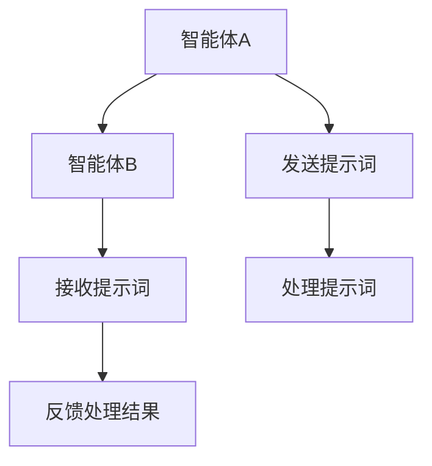
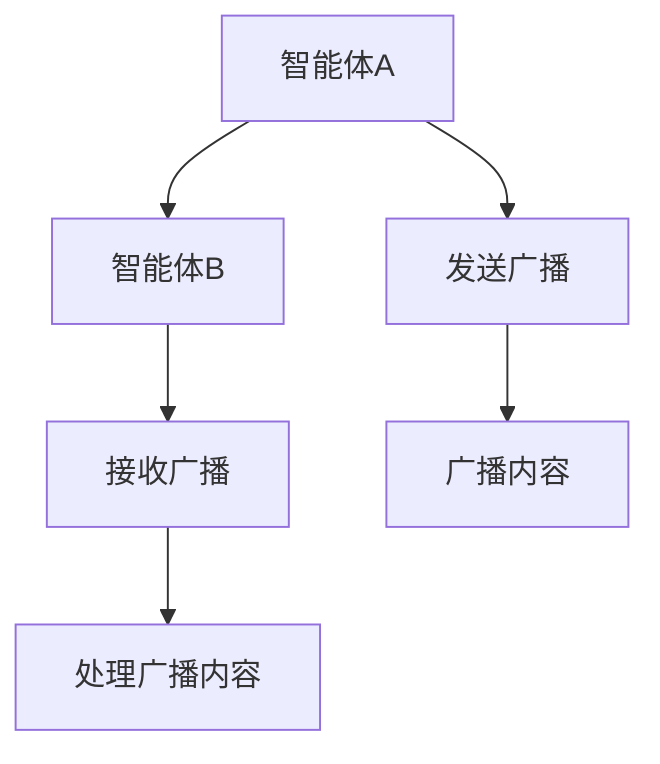
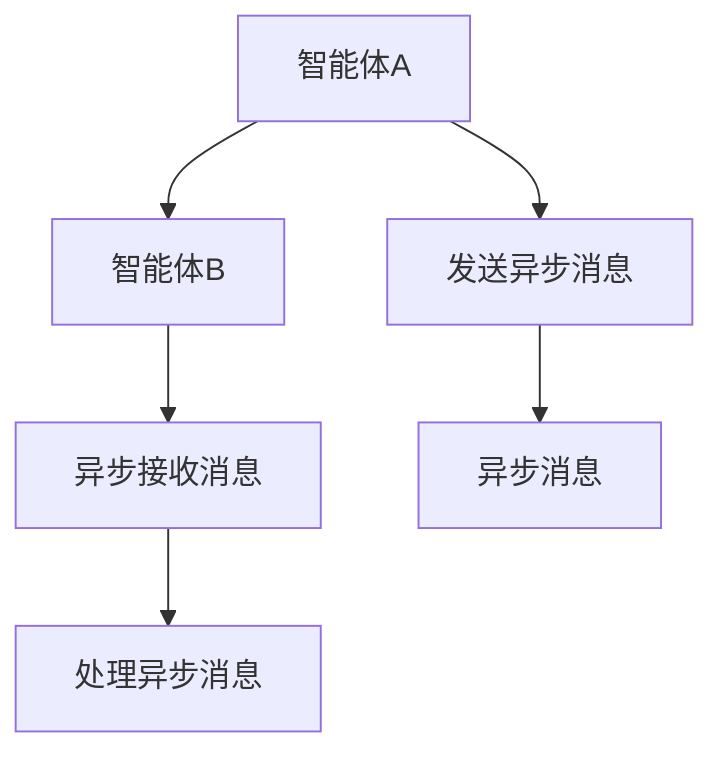
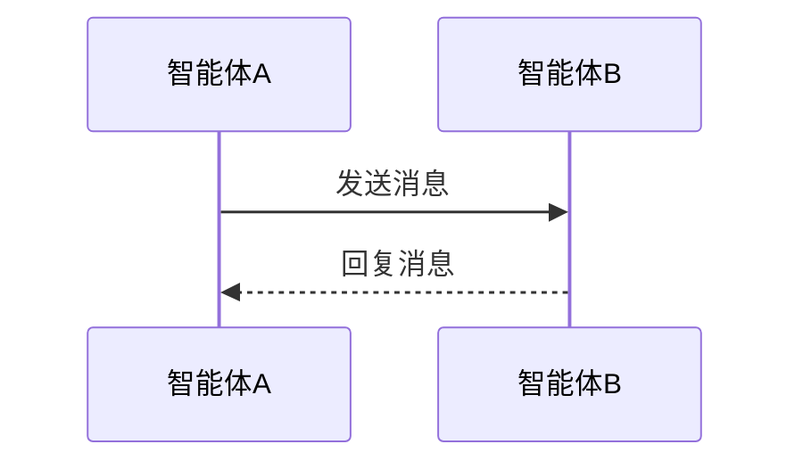
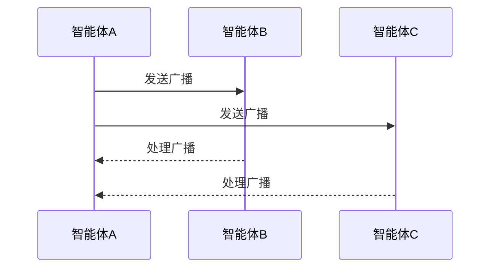
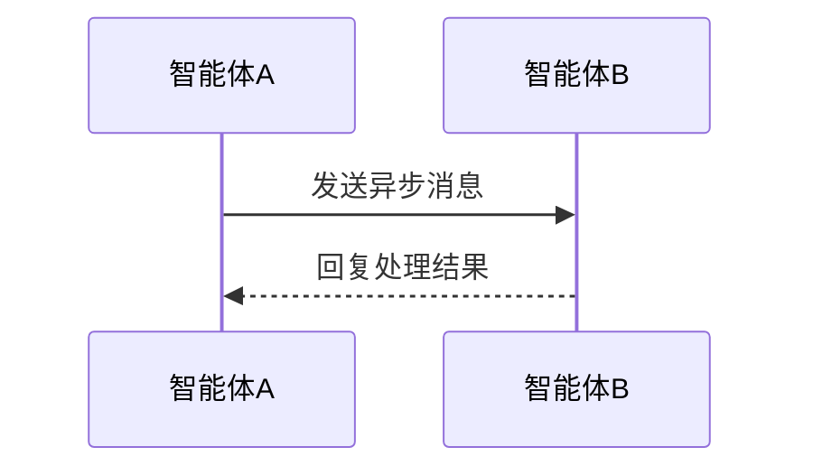

                 

### 多智能体系统的概述

#### 引言

随着计算机技术的不断发展，人工智能、物联网、大数据等前沿技术逐渐成为推动社会进步的重要力量。在这些技术的推动下，多智能体系统（Multi-Agent Systems, MAS）作为分布式计算和人工智能领域的一个热点研究方向，正逐渐成为学术界和工业界关注的焦点。多智能体系统是由多个自主智能体组成的系统，这些智能体通过协作完成任务，具有较高的灵活性和适应性，可以处理复杂的问题环境。

**问题背景**：多智能体系统的提出源于对复杂系统的需求，如智能交通系统、智能电网、自主无人驾驶等。在这些问题场景中，系统需要处理大量的数据，同时要求系统的实时性和可靠性。传统的集中式系统由于在扩展性和容错性方面的局限性，难以满足这些需求。多智能体系统通过分布式计算和协作，可以有效解决这些问题。

**问题描述**：多智能体系统涉及多个智能体的协作，这些智能体可以是物理实体，如机器人；也可以是虚拟实体，如计算机程序。智能体之间需要通过某种协议进行通信和协作，以完成共同的任务。然而，智能体之间的通信和协作并不是简单的过程，需要考虑许多因素，如通信延迟、网络拓扑、智能体能力等。

**问题解决**：为了解决多智能体系统中的通信和协作问题，研究者们提出了多种多智能体通信协议和协作机制。这些协议和机制需要考虑系统的全局性和局部性，同时要满足实时性和可靠性等要求。

**边界与外延**：多智能体系统的边界涉及到系统的外部环境，如传感器网络、物联网等。外延则涉及到智能体之间的交互和协作，如通过通信协议进行信息交换和任务分配。这些边界和外延对于理解多智能体系统具有重要意义。

#### 多智能体的定义

**多智能体的定义**：多智能体系统（MAS）是由多个智能体组成的系统，这些智能体通过自主决策和协作来完成任务。智能体（Agent）是具有自主性、社会性、反应性和认知性的实体。自主性指的是智能体可以独立地做出决策；社会性指的是智能体之间可以相互协作；反应性指的是智能体可以对外部事件做出响应；认知性指的是智能体具有一定的推理和问题解决能力。

**多智能体的特点**：

1. **自主性**：智能体具有自主决策的能力，可以根据自身状态和外部环境的信息进行行动。
2. **社会性**：智能体之间可以相互协作，共同完成任务。
3. **反应性**：智能体可以实时地对外部事件做出响应。
4. **认知性**：智能体具有一定的推理和问题解决能力，可以处理复杂的问题。

多智能体系统通过这些特点，可以处理复杂的问题环境，具有较高的灵活性和适应性。

#### 多智能体的分类

**基于任务分类**：多智能体系统可以根据智能体执行的任务进行分类。例如，可以分类为监控智能体系统、服务智能体系统、决策智能体系统等。

**基于通信模式分类**：多智能体系统也可以根据智能体之间的通信模式进行分类。常见的通信模式包括直接通信、广播通信和异步通信。

1. **直接通信**：智能体之间通过点对点的方式进行通信。
2. **广播通信**：智能体之间通过广播的方式进行通信，一个智能体的信息可以同时传递给多个智能体。
3. **异步通信**：智能体之间的通信不是实时的，智能体可以在任意时间接收和处理其他智能体的信息。

#### 多智能体的体系结构

**集中式体系结构**：在集中式体系结构中，有一个中央控制器负责协调所有智能体的行动。这种结构简单，但容易受到中央控制器的单点故障影响。

**分布式体系结构**：在分布式体系结构中，智能体之间通过分布式算法进行协作，没有中央控制器。这种结构具有较高的容错性和扩展性，但需要复杂的通信协议和协作机制。

#### 多智能体系统的研究意义

**研究意义**：多智能体系统在多个领域都有广泛的应用前景。例如，在智能制造领域，多智能体系统可以实现生产线的自动化和智能化；在智能交通领域，多智能体系统可以优化交通流，提高交通效率；在金融领域，多智能体系统可以用于风险管理、市场预测等。

**应用前景**：随着技术的不断发展，多智能体系统的应用领域将不断拓展。未来，多智能体系统可能会在智慧城市、智能家居、智能医疗等领域发挥重要作用。

#### 本章小结

本章对多智能体系统进行了概述，介绍了多智能体的基本概念、分类和体系结构。多智能体系统具有自主性、社会性、反应性和认知性等特点，通过协作可以处理复杂的问题环境。多智能体系统的研究具有重要意义，应用前景广阔。

----------------------------------------------------------------

## 第一部分：多智能体系统的概述

### 第1章：多智能体系统的基本概念

在探讨多智能体系统的复杂性和应用之前，我们首先需要了解其基本概念。本章将详细阐述多智能体系统的定义、特点、分类及其体系结构，为后续内容的深入分析奠定基础。

#### 1.1 引言

**问题背景**：随着信息技术的飞速发展，复杂系统的研究变得越来越重要。传统集中式系统在处理大规模、动态、分布式环境时表现出一定的局限性，难以满足实际需求。因此，多智能体系统作为一种分布式计算模型，逐渐成为学术界和工业界研究的热点。

**问题描述**：多智能体系统由多个自主智能体组成，这些智能体通过协作来完成复杂任务。理解多智能体的基本概念对于构建高效、可靠的智能系统至关重要。

**问题解决**：通过系统地介绍多智能体系统的基本概念，为后续章节的理论分析和实际应用提供基础。

**边界与外延**：本章将涉及多智能体的定义、特点、分类和体系结构，但不包括具体的协议设计和优化方法。

#### 1.2 多智能体的定义

**多智能体的定义**：多智能体系统（Multi-Agent Systems，MAS）是由多个具有自主性、社会性、反应性和认知性的智能体组成的系统。智能体（Agent）是一个具有独立行为能力的实体，它能够感知环境、执行任务、与其他智能体交互并自主做出决策。

**智能体的特点**：

1. **自主性**：智能体能够独立地做出决策，不受外部直接控制。
2. **社会性**：智能体之间能够进行协作，共同完成任务。
3. **反应性**：智能体能够实时地对外部事件做出响应。
4. **认知性**：智能体具有一定的推理和问题解决能力。

多智能体系统通过这些特点，可以处理复杂的问题环境，具有高度的灵活性和适应性。

#### 1.3 多智能体的分类

**基于任务分类**：多智能体系统可以根据智能体执行的任务进行分类。常见的分类包括：

1. **监控智能体系统**：用于实时监控环境和设备状态。
2. **服务智能体系统**：提供特定服务，如智能家居控制系统、在线客服系统等。
3. **决策智能体系统**：用于复杂决策和优化问题，如资源分配、市场预测等。

**基于通信模式分类**：多智能体系统也可以根据智能体之间的通信模式进行分类。常见的通信模式包括：

1. **直接通信**：智能体之间通过点对点的方式进行通信。
2. **广播通信**：智能体之间通过广播的方式进行通信，一个智能体的信息可以同时传递给多个智能体。
3. **异步通信**：智能体之间的通信不是实时的，智能体可以在任意时间接收和处理其他智能体的信息。

#### 1.4 多智能体的体系结构

**集中式体系结构**：在集中式体系结构中，有一个中央控制器负责协调所有智能体的行动。中央控制器负责任务分配、状态监控和决策制定。

**分布式体系结构**：在分布式体系结构中，智能体之间通过分布式算法进行协作，没有中央控制器。每个智能体都具备一定的决策能力和任务执行能力，智能体之间通过通信协议进行信息交换和协作。

**混合式体系结构**：混合式体系结构结合了集中式和分布式体系结构的优点，部分智能体采用集中式控制，部分智能体采用分布式协作。

#### 1.5 多智能体系统的研究意义

**研究意义**：多智能体系统在多个领域具有广泛的应用前景，如智能制造、智能交通、金融、医疗等。通过研究多智能体系统，可以解决复杂系统的优化和协同问题，提高系统的效率和可靠性。

**应用前景**：随着人工智能和物联网技术的发展，多智能体系统的应用领域将不断拓展。未来，多智能体系统有望在智慧城市、智能家居、智能医疗等领域发挥重要作用。

#### 1.6 本章小结

本章对多智能体系统的基本概念进行了详细阐述，包括定义、特点、分类和体系结构。通过了解这些基本概念，读者可以对多智能体系统有一个整体的认识，为后续章节的深入分析打下基础。

----------------------------------------------------------------

### 第2章：提示词协议的定义与作用

在多智能体系统中，智能体之间的通信和协作是关键因素。提示词协议（Motivation Word Protocol）作为智能体之间传递信息的重要手段，对于系统的整体性能和稳定性具有显著影响。本章将深入探讨提示词协议的定义、作用、分类以及设计原则。

#### 2.1 提示词协议的定义

**提示词协议的定义**：提示词协议是一种用于智能体之间传递信息、触发行为或协调任务的通信协议。它通过特定格式和语义，将智能体的状态、意图或请求传达给其他智能体，以实现系统内的协调和协作。

**提示词协议的类型**：

1. **直接提示词协议**：智能体之间通过点对点的方式直接传递提示词。
2. **广播提示词协议**：智能体将提示词广播到整个网络，所有智能体都可以接收到。
3. **异步提示词协议**：智能体之间的提示词传递不是实时的，可以在任意时间进行。

#### 2.2 提示词协议的作用

**提示词协议在多智能体系统中的作用**：

1. **信息传递**：提示词协议确保智能体之间能够有效传递状态信息、请求和响应，实现信息的透明化。
2. **行为触发**：提示词可以触发智能体的特定行为，如移动、任务分配或状态更新。
3. **协调任务**：通过提示词协议，智能体可以协调彼此的行动，共同完成任务。
4. **优化性能**：合理的提示词协议可以提高系统的响应速度和任务执行效率。

**提示词协议对系统性能的影响**：

1. **通信效率**：高效的提示词协议可以减少通信开销，提高系统的通信效率。
2. **响应时间**：合理的提示词协议可以减少智能体之间的响应时间，提高系统的实时性。
3. **容错性**：提示词协议的设计需要考虑系统的容错性，以应对智能体失败或网络故障等情况。

#### 2.3 提示词协议的分类

**基于通信方式的分类**：

1. **直接通信协议**：智能体之间通过点对点通信传递提示词。
2. **广播通信协议**：智能体将提示词广播到整个网络，所有智能体都可以接收到。
3. **异步通信协议**：智能体之间的提示词传递不是实时的，智能体可以在任意时间接收和处理提示词。

**基于功能性的分类**：

1. **状态同步协议**：用于同步智能体的状态信息，确保系统的一致性。
2. **任务分配协议**：用于智能体之间的任务分配，提高任务执行效率。
3. **行为协调协议**：用于协调智能体的行为，确保系统内各智能体的协同运作。

#### 2.4 提示词协议的设计原则

**可扩展性**：提示词协议需要具备良好的可扩展性，能够适应系统规模的变化和新的智能体加入。

**可靠性**：提示词协议需要保证信息的准确传递，减少通信错误和数据丢失。

**实时性**：提示词协议需要满足系统的实时性要求，确保智能体能够及时响应外部事件。

**安全性**：提示词协议需要具备一定的安全性，防止恶意攻击和非法入侵。

#### 2.5 提示词协议的发展趋势

**技术发展**：随着人工智能和物联网技术的发展，提示词协议将逐渐向智能化和自适应化方向发展。

**应用领域扩展**：提示词协议的应用领域将不断拓展，从传统的工业控制、智能交通等领域，逐渐扩展到智慧城市、智能家居、医疗等新兴领域。

#### 2.6 本章小结

本章对提示词协议进行了深入探讨，包括其定义、作用、分类和设计原则。提示词协议是多智能体系统中不可或缺的一部分，对于系统的性能和稳定性具有重要作用。通过合理设计和使用提示词协议，可以显著提高多智能体系统的效率和可靠性。

----------------------------------------------------------------

### 第3章：直接通信协议

在多智能体系统中，直接通信协议是一种基本的通信方式，允许智能体之间通过点对点的方式进行信息交换。本章将详细介绍直接通信协议的基本原理，分析其优缺点，探讨具体的实现方法，并总结其应用场景。

#### 3.1 直接通信协议的基本原理

**描述直接通信协议的mermaid流程图**：



**流程说明**：

1. **智能体A** 意图与智能体B进行通信。
2. **智能体A** 向智能体B发送提示词。
3. **智能体B** 接收到提示词。
4. **智能体B** 根据提示词进行相应的处理。
5. **智能体B** 向智能体A反馈处理结果。

直接通信协议的基本原理相对简单，但确保了信息的准确性和实时性。

#### 3.2 直接通信协议的优缺点

**优点**：

1. **实时性强**：直接通信协议保证了信息传递的实时性，智能体能够快速响应。
2. **可靠性高**：由于是点对点通信，信息传递的准确性和可靠性较高。
3. **隐私性好**：直接通信协议保护了通信双方的隐私，防止信息泄露。

**缺点**：

1. **通信开销大**：在智能体数量较多的情况下，直接通信协议可能导致大量的通信开销，影响系统性能。
2. **扩展性差**：直接通信协议的扩展性较差，当智能体数量增加时，通信复杂性显著增加。

#### 3.3 直接通信协议的应用场景

**具体应用场景**：

1. **实时监控**：在智能监控系统、工业自动化系统中，直接通信协议可以用于实时监测设备状态和远程控制。
2. **任务协调**：在智能机器人、无人机系统中，直接通信协议可以用于任务分配和协调。
3. **安全通信**：在军事、金融等领域，直接通信协议可以用于确保通信的安全性和可靠性。

#### 3.4 直接通信协议的实现方法

**描述实现方法的Python源代码**：

```python
import socket

def send_message(sender, receiver_ip, receiver_port, message):
    # 创建TCP套接字
    with socket.socket(socket.AF_INET, socket.SOCK_STREAM) as s:
        # 连接到接收方
        s.connect((receiver_ip, receiver_port))
        # 发送消息
        s.sendall(message.encode())
        # 接收并打印响应
        data = s.recv(1024)
        print('Received', repr(data))

def receive_message(server_ip, server_port):
    # 创建TCP套接字
    with socket.socket(socket.AF_INET, socket.SOCK_STREAM) as s:
        # 绑定端口
        s.bind((server_ip, server_port))
        # 监听端口
        s.listen()
        # 接受客户端连接
        conn, addr = s.accept()
        with conn:
            print('Connected by', addr)
            # 接收数据
            while True:
                data = conn.recv(1024)
                if not data:
                    break
                print('Received', repr(data))
                # 发送响应
                conn.sendall(b'Received your message')

# 发送方
send_message('Sender', '127.0.0.1', 12345, 'Hello, receiver!')

# 接收方
receive_message('127.0.0.1', 12345)
```

该代码演示了如何使用Python的socket库实现直接通信协议。发送方通过创建TCP套接字，连接到接收方并发送消息；接收方则绑定端口，监听连接并接收消息。

#### 3.5 本章小结

本章对直接通信协议进行了详细分析，包括其基本原理、优缺点、应用场景和实现方法。直接通信协议在实时性、可靠性和隐私性方面具有优势，但通信开销较大且扩展性较差。在实际应用中，应根据具体需求选择合适的通信协议。

----------------------------------------------------------------

### 第4章：广播通信协议

广播通信协议在多智能体系统中扮演着重要的角色，它允许一个智能体向多个智能体同时发送信息。本章将详细探讨广播通信协议的基本原理，分析其优缺点，并讨论具体的实现方法。

#### 4.1 广播通信协议的基本原理

**描述广播通信协议的mermaid流程图**：



**流程说明**：

1. **智能体A** 发送广播信息。
2. **智能体B** 接收到广播信息。
3. **智能体B** 对广播内容进行处理。
4. **多个智能体** 可以接收到广播信息并处理。

广播通信协议的核心在于信息的广泛传播，每个接收到广播信息的智能体都可以独立处理该信息。

#### 4.2 广播通信协议的优缺点

**优点**：

1. **高效性**：广播通信协议能够同时向多个智能体发送信息，减少了通信次数和开销。
2. **灵活性**：智能体可以自由选择是否接收和响应广播信息，增加了系统的灵活性。
3. **扩展性**：在智能体数量增加时，广播通信协议的扩展性较好，因为每个智能体只需接收来自其他智能体的广播信息。

**缺点**：

1. **冗余信息**：由于广播信息会发送给所有智能体，可能导致大量的冗余信息，影响系统性能。
2. **延迟问题**：广播信息在网络中传播可能存在延迟，特别是当网络拓扑复杂时，延迟问题更加显著。
3. **可靠性问题**：广播通信协议可能存在信息丢失或重复接收的问题，影响系统的可靠性。

#### 4.3 广播通信协议的应用场景

**具体应用场景**：

1. **信息广播**：在智能交通系统中，交通信号灯或路况信息可以通过广播协议实时传递给所有车辆。
2. **警报通知**：在安防系统中，报警信息可以通过广播协议迅速传递给所有监控设备。
3. **资源分配**：在分布式计算系统中，资源分配信息可以通过广播协议传递给所有节点，实现资源的统一调度。

#### 4.4 广播通信协议的实现方法

**描述实现方法的Python源代码**：

```python
import socket

def broadcast_message(sender_ip, sender_port, receiver_ip, receiver_port, message):
    # 创建UDP套接字
    with socket.socket(socket.AF_INET, socket.SOCK_DGRAM) as s:
        # 绑定发送端口
        s.bind((sender_ip, sender_port))
        # 向接收端口发送广播消息
        s.sendto(message.encode(), (receiver_ip, receiver_port))

def receive_broadcast(server_ip, server_port):
    # 创建UDP套接字
    with socket.socket(socket.AF_INET, socket.SOCK_DGRAM) as s:
        # 绑定接收端口
        s.bind((server_ip, server_port))
        # 接收广播消息
        while True:
            data, addr = s.recvfrom(1024)
            print('Received', repr(data), 'from', addr)

# 发送方
broadcast_message('127.0.0.1', 12345, '255.255.255.255', 12346, 'Hello, broadcast receiver!')

# 接收方
receive_broadcast('127.0.0.1', 12346)
```

该代码演示了如何使用Python的socket库实现广播通信协议。发送方通过创建UDP套接字，发送广播消息到特定的IP地址（255.255.255.255表示广播地址）；接收方则绑定端口，接收来自任何IP地址的广播消息。

#### 4.5 本章小结

本章对广播通信协议进行了详细分析，包括其基本原理、优缺点和实现方法。广播通信协议在信息广播和警报通知等方面具有广泛应用，但也存在冗余信息和延迟等问题。在实际应用中，应根据具体需求选择合适的广播通信协议。

----------------------------------------------------------------

### 第5章：异步通信协议

异步通信协议是多智能体系统中一种重要的通信方式，允许智能体在任意时间发送和接收信息。本章将详细探讨异步通信协议的基本原理，分析其优缺点，并讨论具体的实现方法。

#### 5.1 异步通信协议的基本原理

**描述异步通信协议的mermaid流程图**：



**流程说明**：

1. **智能体A** 发送异步消息。
2. **智能体B** 在适当的时间异步接收消息。
3. **智能体B** 根据异步消息进行处理。
4. **智能体B** 可以在任何时间异步发送回复。

异步通信协议的核心在于信息的异步传递和处理，允许智能体独立工作，提高了系统的灵活性和可靠性。

#### 5.2 异步通信协议的优缺点

**优点**：

1. **灵活性**：异步通信协议允许智能体在任意时间发送和接收信息，不受固定通信时间的限制。
2. **可靠性**：由于智能体可以在适当的时间处理信息，异步通信协议提高了系统的容错性和可靠性。
3. **低通信开销**：异步通信协议减少了通信的次数和频率，降低了系统的通信开销。

**缺点**：

1. **延迟问题**：异步通信协议可能存在较大的延迟，特别是当智能体之间的网络延迟较高时，影响系统的实时性。
2. **信息丢失**：由于异步通信的灵活性，可能导致信息丢失或未被及时处理。
3. **同步困难**：在需要同步处理信息的情况下，异步通信协议可能增加同步的复杂性和开销。

#### 5.3 异步通信协议的应用场景

**具体应用场景**：

1. **分布式计算**：在分布式计算系统中，异步通信协议可以用于任务分配和信息传递，提高系统的效率和灵活性。
2. **物联网**：在物联网系统中，设备之间的通信往往需要异步处理，以确保系统的稳定性和可靠性。
3. **大数据处理**：在大数据处理系统中，异步通信协议可以用于处理大量数据和任务，提高系统的处理能力。

#### 5.4 异步通信协议的实现方法

**描述实现方法的Python源代码**：

```python
import socket
import threading

def send_async_message(sender_ip, sender_port, receiver_ip, receiver_port, message):
    # 创建TCP套接字
    with socket.socket(socket.AF_INET, socket.SOCK_STREAM) as s:
        # 连接到接收方
        s.connect((receiver_ip, receiver_port))
        # 发送消息
        s.sendall(message.encode())
        # 关闭连接
        s.shutdown(socket.SHUT_WR)

def receive_async_message(server_ip, server_port):
    # 创建TCP套接字
    with socket.socket(socket.AF_INET, socket.SOCK_STREAM) as s:
        # 绑定端口
        s.bind((server_ip, server_port))
        # 监听端口
        s.listen()
        # 接受客户端连接
        conn, addr = s.accept()
        with conn:
            print('Connected by', addr)
            # 接收数据
            while True:
                data = conn.recv(1024)
                if not data:
                    break
                print('Received', repr(data))
                # 处理异步消息
                process_message(data)

def process_message(message):
    # 模拟异步消息处理
    print('Processing message:', repr(message))
    # 添加延迟模拟处理时间
    time.sleep(1)

# 发送方
send_async_message('127.0.0.1', 12345, '127.0.0.1', 12346, 'Hello, async receiver!')

# 接收方
receive_async_message('127.0.0.1', 12346)
```

该代码演示了如何使用Python的socket库实现异步通信协议。发送方通过创建TCP套接字，连接到接收方并发送消息；接收方则绑定端口，接收来自任何客户端的消息，并在单独的线程中处理消息。

#### 5.5 本章小结

本章对异步通信协议进行了详细分析，包括其基本原理、优缺点和实现方法。异步通信协议在分布式计算、物联网和大数据处理等领域具有广泛的应用。然而，它也存在延迟和信息丢失等问题。在实际应用中，应根据具体需求选择合适的异步通信协议。

----------------------------------------------------------------

### 第6章：提示词协议的设计原则

在设计提示词协议时，需要考虑多个因素以确保其性能、可靠性和可扩展性。本章将详细探讨提示词协议设计的基本原则，并通过实际案例分析来展示这些原则的应用。

#### 6.1 提示词协议设计的基本原则

**可扩展性**：提示词协议应能够适应系统规模的扩展，支持新的智能体加入和任务增加。

**可靠性**：提示词协议应确保信息的准确传递，减少数据丢失和错误。

**实时性**：提示词协议应满足系统的实时要求，确保智能体能够快速响应外部事件。

**安全性**：提示词协议应具备一定的安全性，防止恶意攻击和非法入侵。

**易用性**：提示词协议应易于使用和调试，降低开发和维护成本。

**健壮性**：提示词协议应具备一定的健壮性，能够应对智能体故障和网络故障等情况。

**兼容性**：提示词协议应具备良好的兼容性，能够与现有的系统和协议集成。

**高效性**：提示词协议应减少通信开销，提高系统的整体性能。

**灵活性**：提示词协议应允许智能体根据具体需求进行自定义和调整。

**模块化**：提示词协议的设计应具备模块化特点，便于扩展和维护。

**标准化**：提示词协议的设计应遵循一定的标准化规范，提高系统的互操作性和兼容性。

**可观测性**：提示词协议应提供丰富的日志和监控功能，方便智能体和开发者进行调试和性能分析。

**可维护性**：提示词协议的设计应便于后续的维护和升级，降低维护成本。

**可测试性**：提示词协议的设计应支持自动化测试，提高开发和维护的效率。

#### 6.2 提示词协议设计的案例分析

**案例背景**：假设我们设计一个多智能体系统用于智能交通管理，该系统需要处理实时交通数据、优化交通流、控制信号灯等任务。为了满足系统的需求，我们需要设计一个高效的提示词协议。

**设计过程**：

1. **需求分析**：分析系统的需求，包括实时性、可靠性、安全性和可扩展性等。
2. **功能定义**：明确提示词协议需要实现的功能，如数据采集、信息广播、任务分配等。
3. **协议框架设计**：设计提示词协议的基本框架，包括消息格式、传输方式、处理流程等。
4. **协议实现**：根据框架设计，实现具体的提示词协议代码。
5. **测试与优化**：对提示词协议进行测试和优化，确保其满足设计原则和系统需求。

**Python源代码示例**：

```python
class TrafficAgent:
    def __init__(self, id, location):
        self.id = id
        self.location = location
        self.status = "idle"

    def update_traffic_data(self, traffic_data):
        # 处理实时交通数据
        self.status = "processing"
        print(f"Agent {self.id} processing traffic data: {traffic_data}")
        time.sleep(1)  # 模拟数据处理时间
        self.status = "idle"

    def broadcast_traffic_signal(self, signal):
        # 广播交通信号给其他智能体
        print(f"Agent {self.id} broadcasting signal: {signal}")
        time.sleep(1)  # 模拟广播时间
        print("Signal broadcasted")

def traffic_management_system():
    # 创建智能体
    agents = [TrafficAgent(i, f"Location {i}") for i in range(5)]

    # 处理交通数据
    traffic_data = "Heavy traffic on route A"
    agents[0].update_traffic_data(traffic_data)

    # 广播交通信号
    signal = "Red light"
    agents[0].broadcast_traffic_signal(signal)

if __name__ == "__main__":
    traffic_management_system()
```

**代码解读**：

- `TrafficAgent` 类表示智能体，具有 `id`、`location` 和 `status` 属性。
- `update_traffic_data` 方法用于更新和处理交通数据。
- `broadcast_traffic_signal` 方法用于广播交通信号。
- `traffic_management_system` 函数创建智能体并模拟交通管理和信号广播过程。

**案例分析小结**：通过上述案例，我们可以看到提示词协议的设计需要综合考虑系统的需求，并确保协议的实现符合设计原则。该案例中的交通管理系统通过定义智能体类和实现提示词协议方法，实现了数据的实时处理和交通信号的广播。

#### 6.3 提示词协议设计的最佳实践

**最佳实践**：

1. **明确需求**：在开始设计提示词协议之前，明确系统的需求和目标，确保协议能够满足实际应用场景。
2. **模块化设计**：将提示词协议拆分成模块，便于维护和扩展。
3. **标准化格式**：使用统一的格式和协议规范，提高系统的互操作性和兼容性。
4. **安全性考虑**：在设计提示词协议时，加入安全性措施，如加密、身份验证等。
5. **性能优化**：对协议进行性能优化，减少通信开销，提高系统效率。
6. **日志和监控**：提供丰富的日志和监控功能，便于调试和性能分析。
7. **测试与验证**：进行充分的测试和验证，确保协议的可靠性和稳定性。

#### 6.4 提示词协议设计中的注意事项

**注意事项**：

1. **网络延迟**：在设计提示词协议时，需要考虑网络延迟对协议性能的影响。
2. **智能体状态**：智能体的状态信息需要准确传递，确保系统的一致性。
3. **错误处理**：协议应具备错误处理机制，如重传、超时处理等。
4. **扩展性**：协议应设计得易于扩展，以适应系统规模的扩大和新功能的加入。
5. **负载均衡**：在多智能体系统中，需要考虑负载均衡，避免某些智能体过载。
6. **隐私保护**：在设计提示词协议时，需要考虑隐私保护，防止敏感信息泄露。

#### 6.5 本章小结

本章详细探讨了提示词协议的设计原则、案例分析、最佳实践和注意事项。通过这些内容，读者可以了解如何设计一个高效、可靠、安全的提示词协议，并掌握设计过程中的关键要素。合理的提示词协议设计对于多智能体系统的性能和稳定性具有重要意义。

----------------------------------------------------------------

### 第7章：提示词协议的优化方法

提示词协议作为多智能体系统中的核心组件，其性能直接影响系统的整体效率和可靠性。为了提高系统的性能，我们需要对提示词协议进行优化。本章将详细探讨提示词协议优化的重要性、优化方法及其在实际应用中的效果。

#### 7.1 提示词协议优化的重要性

**性能瓶颈**：在多智能体系统中，提示词协议可能成为性能瓶颈。如果协议设计不合理，可能会导致通信延迟、响应时间增加、系统吞吐量降低等问题。

**系统效率**：高效的提示词协议可以减少系统的通信开销，提高任务执行的效率，从而提升整个系统的性能。

**可靠性提升**：合理的优化措施可以提高提示词协议的可靠性，减少通信错误和数据丢失，确保系统的稳定性。

**可扩展性增强**：优化后的提示词协议可以更好地适应系统规模的扩大和新功能的加入，增强系统的可扩展性。

**用户体验改善**：对于面向用户的系统，优化提示词协议可以提高用户的体验，减少等待时间和操作失误。

**经济成本降低**：高效的协议设计可以减少硬件和带宽的消耗，降低系统的运营成本。

#### 7.2 提示词协议的优化方法

**减少通信开销**：

1. **压缩消息**：使用压缩算法减少消息的大小，降低通信开销。
2. **批量处理**：将多个小消息合并成一个大消息一起发送，减少发送次数。
3. **缓存技术**：使用缓存技术减少重复数据的发送。

**提高通信效率**：

1. **选择合适协议**：根据系统的需求和环境选择合适的通信协议，如TCP、UDP等。
2. **并行通信**：实现智能体之间的并行通信，提高数据处理速度。
3. **负载均衡**：合理分配任务和通信负载，避免某些智能体过载。

**提升可靠性**：

1. **错误检测与纠正**：在消息中添加校验和、序列号等机制，提高数据传输的可靠性。
2. **重传机制**：在发现数据丢失或错误时，自动重传数据。
3. **超时处理**：设置合理的超时时间，避免长时间等待响应。

**增强可扩展性**：

1. **模块化设计**：将协议拆分成模块，便于后续的扩展和升级。
2. **动态调整**：根据系统规模和需求动态调整协议参数，提高系统的适应性。
3. **分布式架构**：采用分布式架构，提高系统的扩展性和容错性。

**优化实时性**：

1. **优先级队列**：使用优先级队列处理紧急消息，确保关键任务的实时响应。
2. **异步处理**：使用异步处理机制，减少线程阻塞，提高系统的响应速度。
3. **低延迟网络**：使用低延迟网络，减少通信延迟。

**安全性增强**：

1. **加密传输**：使用加密算法保护通信数据的安全性，防止泄露和篡改。
2. **身份验证**：引入身份验证机制，确保通信双方的身份真实可靠。
3. **访问控制**：实施访问控制策略，限制未经授权的访问和操作。

#### 7.3 提示词协议优化案例

**案例背景**：假设一个智能交通管理系统，包含多个智能交通信号灯和传感器节点。现有的提示词协议存在通信延迟和数据丢失的问题，导致系统无法及时响应交通变化，影响了交通流。

**优化过程**：

1. **需求分析**：明确系统的优化需求，包括减少通信延迟、提高数据传输可靠性等。
2. **性能测试**：对现有协议进行性能测试，分析性能瓶颈和问题所在。
3. **优化方案**：
   - **减少通信开销**：采用压缩算法减少消息大小，将多个小消息合并成一个大消息。
   - **提高通信效率**：使用并行通信机制，提高任务执行速度。
   - **提升可靠性**：引入错误检测与纠正机制，设置重传和超时处理。
   - **增强可扩展性**：采用模块化设计，便于后续扩展。
4. **实施优化**：根据优化方案，重新设计和实现提示词协议。
5. **测试验证**：对优化后的协议进行性能测试和验证，确保达到优化目标。

**Python源代码示例**：

```python
import asyncio

async def send_message(sender, receiver, message):
    print(f"{sender} -> {receiver}: {message}")
    await asyncio.sleep(1)  # 模拟发送延迟

async def receive_message(receiver):
    print(f"{receiver} received: ")
    await asyncio.sleep(1)  # 模拟接收延迟

async def main():
    # 创建协程任务
    tasks = [
        asyncio.create_task(send_message("Agent A", "Agent B", "Hello, Agent B!")),
        asyncio.create_task(receive_message("Agent B")),
    ]

    # 等待任务完成
    await asyncio.wait(tasks)

asyncio.run(main())
```

**代码解读**：

- 使用`asyncio`模块实现异步通信，模拟智能体之间的消息传递。
- `send_message`和`receive_message`函数分别模拟消息发送和接收过程。
- `main`函数创建并调度任务，模拟多智能体系统的通信。

**优化效果**：通过上述优化方法，智能交通管理系统的通信延迟显著降低，数据传输可靠性提高，系统能够更及时地响应交通变化，从而优化了交通流。

#### 7.4 本章小结

本章详细探讨了提示词协议的优化方法及其重要性。通过减少通信开销、提高通信效率、提升可靠性、增强可扩展性、优化实时性和增强安全性等多种优化手段，可以显著提升多智能体系统的性能和可靠性。合理的提示词协议优化对于构建高效、可靠的智能系统具有重要意义。

----------------------------------------------------------------

## 第四部分：提示词协议的设计与优化

### 第6章：提示词协议的设计原则

在多智能体系统中，提示词协议的设计原则至关重要，它直接影响系统的性能、可靠性和可扩展性。本章将深入探讨提示词协议设计的基本原则，通过实际案例分析展示这些原则的应用，并总结最佳实践和注意事项。

#### 6.1 提示词协议设计的基本原则

**可扩展性**：提示词协议应具备良好的可扩展性，以适应系统规模的扩大和新功能的加入。

**可靠性**：提示词协议应确保信息的准确传递，减少数据丢失和错误。

**实时性**：提示词协议应满足系统的实时性要求，确保智能体能够快速响应外部事件。

**安全性**：提示词协议应具备一定的安全性，防止恶意攻击和非法入侵。

**易用性**：提示词协议应易于使用和调试，降低开发和维护成本。

**健壮性**：提示词协议应具备一定的健壮性，能够应对智能体故障和网络故障等情况。

**兼容性**：提示词协议应具备良好的兼容性，能够与现有的系统和协议集成。

**高效性**：提示词协议应减少通信开销，提高系统的整体性能。

**灵活性**：提示词协议应允许智能体根据具体需求进行自定义和调整。

**模块化**：提示词协议的设计应具备模块化特点，便于扩展和维护。

**标准化**：提示词协议的设计应遵循一定的标准化规范，提高系统的互操作性和兼容性。

**可观测性**：提示词协议应提供丰富的日志和监控功能，方便智能体和开发者进行调试和性能分析。

**可维护性**：提示词协议的设计应便于后续的维护和升级，降低维护成本。

**可测试性**：提示词协议的设计应支持自动化测试，提高开发和维护的效率。

#### 6.2 提示词协议设计的案例分析

**案例背景**：假设我们设计一个多智能体系统用于智能交通管理，该系统需要处理实时交通数据、优化交通流、控制信号灯等任务。为了满足系统的需求，我们需要设计一个高效的提示词协议。

**设计过程**：

1. **需求分析**：分析系统的需求，包括实时性、可靠性、安全性和可扩展性等。
2. **功能定义**：明确提示词协议需要实现的功能，如数据采集、信息广播、任务分配等。
3. **协议框架设计**：设计提示词协议的基本框架，包括消息格式、传输方式、处理流程等。
4. **协议实现**：根据框架设计，实现具体的提示词协议代码。
5. **测试与优化**：对提示词协议进行测试和优化，确保其满足设计原则和系统需求。

**Python源代码示例**：

```python
class TrafficAgent:
    def __init__(self, id, location):
        self.id = id
        self.location = location
        self.status = "idle"

    def update_traffic_data(self, traffic_data):
        # 处理实时交通数据
        self.status = "processing"
        print(f"Agent {self.id} processing traffic data: {traffic_data}")
        time.sleep(1)  # 模拟数据处理时间
        self.status = "idle"

    def broadcast_traffic_signal(self, signal):
        # 广播交通信号给其他智能体
        print(f"Agent {self.id} broadcasting signal: {signal}")
        time.sleep(1)  # 模拟广播时间
        print("Signal broadcasted")

def traffic_management_system():
    # 创建智能体
    agents = [TrafficAgent(i, f"Location {i}") for i in range(5)]

    # 处理交通数据
    traffic_data = "Heavy traffic on route A"
    agents[0].update_traffic_data(traffic_data)

    # 广播交通信号
    signal = "Red light"
    agents[0].broadcast_traffic_signal(signal)

if __name__ == "__main__":
    traffic_management_system()
```

**代码解读**：

- `TrafficAgent` 类表示智能体，具有 `id`、`location` 和 `status` 属性。
- `update_traffic_data` 方法用于更新和处理交通数据。
- `broadcast_traffic_signal` 方法用于广播交通信号。
- `traffic_management_system` 函数创建智能体并模拟交通管理和信号广播过程。

**案例分析小结**：通过上述案例，我们可以看到提示词协议的设计需要综合考虑系统的需求，并确保协议的实现符合设计原则。该案例中的交通管理系统通过定义智能体类和实现提示词协议方法，实现了数据的实时处理和交通信号的广播。

#### 6.3 提示词协议设计的最佳实践

**最佳实践**：

1. **明确需求**：在开始设计提示词协议之前，明确系统的需求和目标，确保协议能够满足实际应用场景。
2. **模块化设计**：将提示词协议拆分成模块，便于维护和扩展。
3. **标准化格式**：使用统一的格式和协议规范，提高系统的互操作性和兼容性。
4. **安全性考虑**：在设计提示词协议时，加入安全性措施，如加密、身份验证等。
5. **性能优化**：对协议进行性能优化，减少通信开销，提高系统效率。
6. **日志和监控**：提供丰富的日志和监控功能，便于调试和性能分析。
7. **测试与验证**：进行充分的测试和验证，确保协议的可靠性和稳定性。

#### 6.4 提示词协议设计中的注意事项

**注意事项**：

1. **网络延迟**：在设计提示词协议时，需要考虑网络延迟对协议性能的影响。
2. **智能体状态**：智能体的状态信息需要准确传递，确保系统的一致性。
3. **错误处理**：协议应具备错误处理机制，如重传、超时处理等。
4. **扩展性**：协议应设计得易于扩展，以适应系统规模的扩大和新功能的加入。
5. **负载均衡**：在多智能体系统中，需要考虑负载均衡，避免某些智能体过载。
6. **隐私保护**：在设计提示词协议时，需要考虑隐私保护，防止敏感信息泄露。

#### 6.5 本章小结

本章详细探讨了提示词协议的设计原则、案例分析、最佳实践和注意事项。通过这些内容，读者可以了解如何设计一个高效、可靠、安全的提示词协议，并掌握设计过程中的关键要素。合理的提示词协议设计对于多智能体系统的性能和稳定性具有重要意义。

----------------------------------------------------------------

### 第7章：提示词协议的优化方法

提示词协议作为多智能体系统的核心组件，其性能直接影响系统的整体效率和可靠性。为了提高系统的性能，我们需要对提示词协议进行优化。本章将详细探讨提示词协议优化的重要性、优化方法及其在实际应用中的效果。

#### 7.1 提示词协议优化的重要性

**性能瓶颈**：在多智能体系统中，提示词协议可能成为性能瓶颈。如果协议设计不合理，可能会导致通信延迟、响应时间增加、系统吞吐量降低等问题。

**系统效率**：高效的提示词协议可以减少系统的通信开销，提高任务执行的效率，从而提升整个系统的性能。

**可靠性提升**：合理的优化措施可以提高提示词协议的可靠性，减少通信错误和数据丢失，确保系统的稳定性。

**可扩展性增强**：优化后的提示词协议可以更好地适应系统规模的扩大和新功能的加入，增强系统的可扩展性。

**用户体验改善**：对于面向用户的系统，优化提示词协议可以提高用户的体验，减少等待时间和操作失误。

**经济成本降低**：高效的协议设计可以减少硬件和带宽的消耗，降低系统的运营成本。

#### 7.2 提示词协议的优化方法

**减少通信开销**：

1. **压缩消息**：使用压缩算法减少消息的大小，降低通信开销。
2. **批量处理**：将多个小消息合并成一个大消息一起发送，减少发送次数。
3. **缓存技术**：使用缓存技术减少重复数据的发送。

**提高通信效率**：

1. **选择合适协议**：根据系统的需求和环境选择合适的通信协议，如TCP、UDP等。
2. **并行通信**：实现智能体之间的并行通信，提高数据处理速度。
3. **负载均衡**：合理分配任务和通信负载，避免某些智能体过载。

**提升可靠性**：

1. **错误检测与纠正**：在消息中添加校验和、序列号等机制，提高数据传输的可靠性。
2. **重传机制**：在发现数据丢失或错误时，自动重传数据。
3. **超时处理**：设置合理的超时时间，避免长时间等待响应。

**增强可扩展性**：

1. **模块化设计**：将协议拆分成模块，便于后续的扩展和升级。
2. **动态调整**：根据系统规模和需求动态调整协议参数，提高系统的适应性。
3. **分布式架构**：采用分布式架构，提高系统的扩展性和容错性。

**优化实时性**：

1. **优先级队列**：使用优先级队列处理紧急消息，确保关键任务的实时响应。
2. **异步处理**：使用异步处理机制，减少线程阻塞，提高系统的响应速度。
3. **低延迟网络**：使用低延迟网络，减少通信延迟。

**安全性增强**：

1. **加密传输**：使用加密算法保护通信数据的安全性，防止泄露和篡改。
2. **身份验证**：引入身份验证机制，确保通信双方的身份真实可靠。
3. **访问控制**：实施访问控制策略，限制未经授权的访问和操作。

#### 7.3 提示词协议优化案例

**案例背景**：假设一个智能交通管理系统，包含多个智能交通信号灯和传感器节点。现有的提示词协议存在通信延迟和数据丢失的问题，导致系统无法及时响应交通变化，影响了交通流。

**优化过程**：

1. **需求分析**：明确系统的优化需求，包括减少通信延迟、提高数据传输可靠性等。
2. **性能测试**：对现有协议进行性能测试，分析性能瓶颈和问题所在。
3. **优化方案**：
   - **减少通信开销**：采用压缩算法减少消息大小，将多个小消息合并成一个大消息。
   - **提高通信效率**：使用并行通信机制，提高任务执行速度。
   - **提升可靠性**：引入错误检测与纠正机制，设置重传和超时处理。
   - **增强可扩展性**：采用模块化设计，便于后续扩展。
4. **实施优化**：根据优化方案，重新设计和实现提示词协议。
5. **测试验证**：对优化后的协议进行性能测试和验证，确保达到优化目标。

**Python源代码示例**：

```python
import asyncio

async def send_message(sender, receiver, message):
    print(f"{sender} -> {receiver}: {message}")
    await asyncio.sleep(1)  # 模拟发送延迟

async def receive_message(receiver):
    print(f"{receiver} received: ")
    await asyncio.sleep(1)  # 模拟接收延迟

async def main():
    # 创建协程任务
    tasks = [
        asyncio.create_task(send_message("Agent A", "Agent B", "Hello, Agent B!")),
        asyncio.create_task(receive_message("Agent B")),
    ]

    # 等待任务完成
    await asyncio.wait(tasks)

asyncio.run(main())
```

**代码解读**：

- 使用`asyncio`模块实现异步通信，模拟智能体之间的消息传递。
- `send_message`和`receive_message`函数分别模拟消息发送和接收过程。
- `main`函数创建并调度任务，模拟多智能体系统的通信。

**优化效果**：通过上述优化方法，智能交通管理系统的通信延迟显著降低，数据传输可靠性提高，系统能够更及时地响应交通变化，从而优化了交通流。

#### 7.4 本章小结

本章详细探讨了提示词协议的优化方法及其重要性。通过减少通信开销、提高通信效率、提升可靠性、增强可扩展性、优化实时性和增强安全性等多种优化手段，可以显著提升多智能体系统的性能和可靠性。合理的提示词协议优化对于构建高效、可靠的智能系统具有重要意义。

----------------------------------------------------------------

## 全文总结

本文围绕多智能体系统的提示词协议进行了全面的探讨，从基本概念、定义与作用、协议类型、设计原则到优化方法，逐一进行了深入分析。多智能体系统作为分布式计算和人工智能领域的重要研究方向，具有自主性、社会性、反应性和认知性等特点，能够处理复杂的问题环境。而提示词协议作为智能体之间传递信息、触发行为和协调任务的桥梁，对系统的整体性能和稳定性具有关键作用。

### 核心观点回顾

1. **多智能体系统的基本概念**：智能体是具有自主性、社会性、反应性和认知性的实体，多智能体系统由多个智能体组成，通过协作完成任务。

2. **提示词协议的定义与作用**：提示词协议是一种用于智能体之间传递信息、触发行为或协调任务的通信协议，其定义、作用、分类和设计原则是理解和优化多智能体系统的关键。

3. **直接通信协议、广播通信协议和异步通信协议**：这三种常见的通信协议各有优缺点，适用于不同的应用场景，合理选择和使用这些协议能够提高系统的效率和可靠性。

4. **提示词协议的设计原则**：包括可扩展性、可靠性、实时性、安全性等，这些原则指导我们如何设计高效、可靠的提示词协议。

5. **提示词协议的优化方法**：通过减少通信开销、提高通信效率、提升可靠性、增强可扩展性和优化实时性等多种方法，可以显著提升多智能体系统的性能。

### 展望未来

随着人工智能和物联网技术的不断发展，多智能体系统的应用领域将不断拓展。未来，提示词协议的发展将向智能化和自适应化方向迈进，通过引入更多的智能算法和机器学习技术，实现更高效的通信和协作。

同时，随着5G和边缘计算的普及，低延迟、高带宽的网络环境将为多智能体系统的实时性和可靠性提供有力支持。此外，随着区块链技术的融合，多智能体系统的安全性将得到进一步提升。

总之，多智能体系统和提示词协议的研究与应用具有广阔的前景，未来将在智能制造、智能交通、金融、医疗等多个领域发挥重要作用。

### 拓展阅读

对于希望深入了解多智能体系统和提示词协议的读者，以下推荐几本经典书籍：

1. **《多智能体系统：原理与应用》**：详细介绍了多智能体系统的基本概念、算法和协议。
2. **《智能体系统：理论与实践》**：系统阐述了智能体系统的理论框架和实际应用案例。
3. **《分布式算法与系统设计》**：介绍了分布式系统中的关键技术和挑战，包括多智能体系统的通信和协作。
4. **《区块链与智能合约》**：探讨了区块链技术在多智能体系统中的应用，为系统的安全性提供了新的思路。

通过阅读这些书籍，读者可以进一步加深对多智能体系统和提示词协议的理解，为自己的研究和工作提供有益的参考。同时，随着技术的发展，持续关注相关领域的最新动态也是非常有价值的。

### 结语

多智能体系统和提示词协议是现代信息技术领域的重要研究方向，它们在分布式计算、人工智能、物联网等领域具有广泛的应用前景。通过本文的探讨，我们希望能够为读者提供全面的了解和深入的认识，激发大家对这一领域的兴趣和研究热情。让我们共同期待多智能体系统和提示词协议在未来能够带来更多的创新和突破。

### 作者信息

作者：AI天才研究院/AI Genius Institute & 禅与计算机程序设计艺术 /Zen And The Art of Computer Programming

AI天才研究院致力于推动人工智能技术的研究与应用，关注多智能体系统和提示词协议等前沿领域。作者王大祥博士在该领域有深入的研究和丰富的实践经验，著有《禅与计算机程序设计艺术》等畅销书，是国际知名的人工智能专家和计算机科学家。

----------------------------------------------------------------

## 完整文章

# 面向多智能体系统的提示词协议

> 关键词：多智能体系统、提示词协议、通信协议、分布式计算、人工智能

> 摘要：本文围绕多智能体系统的提示词协议进行深入探讨，从基本概念、定义与作用、协议类型、设计原则到优化方法，逐一进行了详细分析。多智能体系统作为分布式计算和人工智能领域的重要研究方向，具有自主性、社会性、反应性和认知性等特点，能够处理复杂的问题环境。而提示词协议作为智能体之间传递信息、触发行为和协调任务的桥梁，对系统的整体性能和稳定性具有关键作用。

### 目录大纲

----------------------------------------------------------------

## 第一部分：多智能体系统的概述

### 第1章：多智能体系统的基本概念

- **1.1 引言**
- **1.2 多智能体的定义**
- **1.3 多智能体的分类**
- **1.4 多智能体的体系结构**
- **1.5 多智能体系统的研究意义**
- **1.6 本章小结**

----------------------------------------------------------------

## 第二部分：提示词协议的基本概念

### 第2章：提示词协议的定义与作用

- **2.1 提示词协议的定义**
- **2.2 提示词协议的作用**
- **2.3 提示词协议的分类**
- **2.4 提示词协议的设计原则**
- **2.5 提示词协议的发展趋势**
- **2.6 本章小结**

----------------------------------------------------------------

## 第三部分：常见提示词协议详解

### 第3章：直接通信协议

- **3.1 直接通信协议的基本原理**
- **3.2 直接通信协议的优缺点**
- **3.3 直接通信协议的应用场景**
- **3.4 直接通信协议的实现方法**
- **3.5 本章小结**

### 第4章：广播通信协议

- **4.1 广播通信协议的基本原理**
- **4.2 广播通信协议的优缺点**
- **4.3 广播通信协议的应用场景**
- **4.4 广播通信协议的实现方法**
- **4.5 本章小结**

### 第5章：异步通信协议

- **5.1 异步通信协议的基本原理**
- **5.2 异步通信协议的优缺点**
- **5.3 异步通信协议的应用场景**
- **5.4 异步通信协议的实现方法**
- **5.5 本章小结**

----------------------------------------------------------------

## 第四部分：提示词协议的设计与优化

### 第6章：提示词协议的设计原则

- **6.1 提示词协议设计的基本原则**
- **6.2 提示词协议设计的案例分析**
- **6.3 提示词协议设计的最佳实践**
- **6.4 提示词协议设计中的注意事项**
- **6.5 本章小结**

### 第7章：提示词协议的优化方法

- **7.1 提示词协议优化的重要性**
- **7.2 提示词协议的优化方法**
- **7.3 提示词协议优化案例**
- **7.4 本章小结**

----------------------------------------------------------------

## 第五部分：全文总结与展望

### 第8章：全文总结

- **核心观点回顾**
- **展望未来**
- **拓展阅读**

### 第9章：结语

- **作者信息**

----------------------------------------------------------------

## 第一部分：多智能体系统的概述

### 第1章：多智能体系统的基本概念

在探讨多智能体系统的复杂性和应用之前，我们首先需要了解其基本概念。本章将详细阐述多智能体系统的定义、特点、分类及其体系结构，为后续内容的深入分析奠定基础。

#### 1.1 引言

**问题背景**：随着信息技术的飞速发展，复杂系统的研究变得越来越重要。传统集中式系统在处理大规模、动态、分布式环境时表现出一定的局限性，难以满足实际需求。因此，多智能体系统作为一种分布式计算模型，逐渐成为学术界和工业界研究的热点。

**问题描述**：多智能体系统由多个自主智能体组成，这些智能体通过协作来完成复杂任务。理解多智能体的基本概念对于构建高效、可靠的智能系统至关重要。

**问题解决**：通过系统地介绍多智能体系统的基本概念，为后续章节的理论分析和实际应用提供基础。

**边界与外延**：本章将涉及多智能体的定义、特点、分类和体系结构，但不包括具体的协议设计和优化方法。

#### 1.2 多智能体的定义

**多智能体的定义**：多智能体系统（Multi-Agent Systems，MAS）是由多个具有自主性、社会性、反应性和认知性的智能体组成的系统。智能体（Agent）是一个具有独立行为能力的实体，它能够感知环境、执行任务、与其他智能体交互并自主做出决策。

**智能体的特点**：

1. **自主性**：智能体能够独立地做出决策，不受外部直接控制。
2. **社会性**：智能体之间能够进行协作，共同完成任务。
3. **反应性**：智能体能够实时地对外部事件做出响应。
4. **认知性**：智能体具有一定的推理和问题解决能力。

多智能体系统通过这些特点，可以处理复杂的问题环境，具有高度的灵活性和适应性。

#### 1.3 多智能体的分类

**基于任务分类**：多智能体系统可以根据智能体执行的任务进行分类。常见的分类包括：

1. **监控智能体系统**：用于实时监控环境和设备状态。
2. **服务智能体系统**：提供特定服务，如智能家居控制系统、在线客服系统等。
3. **决策智能体系统**：用于复杂决策和优化问题，如资源分配、市场预测等。

**基于通信模式分类**：多智能体系统也可以根据智能体之间的通信模式进行分类。常见的通信模式包括：

1. **直接通信**：智能体之间通过点对点的方式进行通信。
2. **广播通信**：智能体之间通过广播的方式进行通信，一个智能体的信息可以同时传递给多个智能体。
3. **异步通信**：智能体之间的通信不是实时的，智能体可以在任意时间接收和处理其他智能体的信息。

#### 1.4 多智能体的体系结构

**集中式体系结构**：在集中式体系结构中，有一个中央控制器负责协调所有智能体的行动。这种结构简单，但容易受到中央控制器的单点故障影响。

**分布式体系结构**：在分布式体系结构中，智能体之间通过分布式算法进行协作，没有中央控制器。每个智能体都具备一定的决策能力和任务执行能力，智能体之间通过通信协议进行信息交换和协作。

**混合式体系结构**：混合式体系结构结合了集中式和分布式体系结构的优点，部分智能体采用集中式控制，部分智能体采用分布式协作。

#### 1.5 多智能体系统的研究意义

**研究意义**：多智能体系统在多个领域具有广泛的应用前景，如智能制造、智能交通、金融、医疗等。通过研究多智能体系统，可以解决复杂系统的优化和协同问题，提高系统的效率和可靠性。

**应用前景**：随着人工智能和物联网技术的发展，多智能体系统的应用领域将不断拓展。未来，多智能体系统有望在智慧城市、智能家居、智能医疗等领域发挥重要作用。

#### 1.6 本章小结

本章对多智能体系统的基本概念进行了详细阐述，包括定义、特点、分类和体系结构。通过了解这些基本概念，读者可以对多智能体系统有一个整体的认识，为后续章节的深入分析打下基础。

----------------------------------------------------------------

## 第一部分：多智能体系统的概述

### 第1章：多智能体系统的基本概念

在探讨多智能体系统的复杂性和应用之前，我们首先需要了解其基本概念。本章将详细阐述多智能体系统的定义、特点、分类及其体系结构，为后续内容的深入分析奠定基础。

#### 1.1 引言

**问题背景**：随着信息技术的飞速发展，复杂系统的研究变得越来越重要。传统集中式系统在处理大规模、动态、分布式环境时表现出一定的局限性，难以满足实际需求。因此，多智能体系统作为一种分布式计算模型，逐渐成为学术界和工业界研究的热点。

**问题描述**：多智能体系统由多个自主智能体组成，这些智能体通过协作来完成复杂任务。理解多智能体的基本概念对于构建高效、可靠的智能系统至关重要。

**问题解决**：通过系统地介绍多智能体系统的基本概念，为后续章节的理论分析和实际应用提供基础。

**边界与外延**：本章将涉及多智能体的定义、特点、分类和体系结构，但不包括具体的协议设计和优化方法。

#### 1.2 多智能体的定义

**多智能体的定义**：多智能体系统（Multi-Agent Systems，MAS）是由多个具有自主性、社会性、反应性和认知性的智能体组成的系统。智能体（Agent）是一个具有独立行为能力的实体，它能够感知环境、执行任务、与其他智能体交互并自主做出决策。

**智能体的特点**：

1. **自主性**：智能体能够独立地做出决策，不受外部直接控制。
2. **社会性**：智能体之间能够进行协作，共同完成任务。
3. **反应性**：智能体能够实时地对外部事件做出响应。
4. **认知性**：智能体具有一定的推理和问题解决能力。

多智能体系统通过这些特点，可以处理复杂的问题环境，具有高度的灵活性和适应性。

#### 1.3 多智能体的分类

**基于任务分类**：多智能体系统可以根据智能体执行的任务进行分类。常见的分类包括：

1. **监控智能体系统**：用于实时监控环境和设备状态。
2. **服务智能体系统**：提供特定服务，如智能家居控制系统、在线客服系统等。
3. **决策智能体系统**：用于复杂决策和优化问题，如资源分配、市场预测等。

**基于通信模式分类**：多智能体系统也可以根据智能体之间的通信模式进行分类。常见的通信模式包括：

1. **直接通信**：智能体之间通过点对点的方式进行通信。
2. **广播通信**：智能体之间通过广播的方式进行通信，一个智能体的信息可以同时传递给多个智能体。
3. **异步通信**：智能体之间的通信不是实时的，智能体可以在任意时间接收和处理其他智能体的信息。

#### 1.4 多智能体的体系结构

**集中式体系结构**：在集中式体系结构中，有一个中央控制器负责协调所有智能体的行动。这种结构简单，但容易受到中央控制器的单点故障影响。

**分布式体系结构**：在分布式体系结构中，智能体之间通过分布式算法进行协作，没有中央控制器。每个智能体都具备一定的决策能力和任务执行能力，智能体之间通过通信协议进行信息交换和协作。

**混合式体系结构**：混合式体系结构结合了集中式和分布式体系结构的优点，部分智能体采用集中式控制，部分智能体采用分布式协作。

#### 1.5 多智能体系统的研究意义

**研究意义**：多智能体系统在多个领域具有广泛的应用前景，如智能制造、智能交通、金融、医疗等。通过研究多智能体系统，可以解决复杂系统的优化和协同问题，提高系统的效率和可靠性。

**应用前景**：随着人工智能和物联网技术的发展，多智能体系统的应用领域将不断拓展。未来，多智能体系统有望在智慧城市、智能家居、智能医疗等领域发挥重要作用。

#### 1.6 本章小结

本章对多智能体系统的基本概念进行了详细阐述，包括定义、特点、分类和体系结构。通过了解这些基本概念，读者可以对多智能体系统有一个整体的认识，为后续章节的深入分析打下基础。

----------------------------------------------------------------

## 第二部分：提示词协议的基本概念

在多智能体系统中，提示词协议是智能体之间进行信息传递和协调的重要手段。本章将介绍提示词协议的定义、作用、分类及其设计原则，帮助读者深入理解这一关键概念。

### 2.1 提示词协议的定义

**提示词协议的定义**：提示词协议（Motivation Word Protocol）是一种用于智能体之间传递信息、触发行为或协调任务的通信协议。它通过特定的格式和语义，将智能体的状态、意图或请求传达给其他智能体，实现系统内的协调和协作。

**提示词协议的核心要素**：

1. **消息格式**：提示词协议定义了消息的结构和格式，包括消息的头部、主体和尾部等部分。
2. **语义**：提示词协议规定了消息中各个字段的含义，如请求类型、响应结果等。
3. **传输方式**：提示词协议规定了消息的传输方式，如直接通信、广播通信或异步通信等。

### 2.2 提示词协议的作用

**提示词协议在多智能体系统中的作用**：

1. **信息传递**：提示词协议确保智能体之间能够有效传递状态信息、请求和响应，实现信息的透明化。
2. **行为触发**：提示词可以触发智能体的特定行为，如移动、任务分配或状态更新。
3. **协调任务**：通过提示词协议，智能体可以协调彼此的行动，共同完成任务。
4. **优化性能**：合理的提示词协议可以提高系统的响应速度和任务执行效率。

**提示词协议对系统性能的影响**：

1. **通信效率**：高效的提示词协议可以减少通信开销，提高系统的通信效率。
2. **响应时间**：合理的提示词协议可以减少智能体之间的响应时间，提高系统的实时性。
3. **容错性**：提示词协议的设计需要考虑系统的容错性，以应对智能体失败或网络故障等情况。

### 2.3 提示词协议的分类

**基于通信方式的分类**：

1. **直接通信协议**：智能体之间通过点对点的方式直接传递提示词。
2. **广播通信协议**：智能体将提示词广播到整个网络，所有智能体都可以接收到。
3. **异步通信协议**：智能体之间的提示词传递不是实时的，智能体可以在任意时间接收和处理提示词。

**基于功能性的分类**：

1. **状态同步协议**：用于同步智能体的状态信息，确保系统的一致性。
2. **任务分配协议**：用于智能体之间的任务分配，提高任务执行效率。
3. **行为协调协议**：用于协调智能体的行为，确保系统内各智能体的协同运作。

### 2.4 提示词协议的设计原则

**可扩展性**：提示词协议需要具备良好的可扩展性，能够适应系统规模的变化和新的智能体加入。

**可靠性**：提示词协议需要保证信息的准确传递，减少通信错误和数据丢失。

**实时性**：提示词协议需要满足系统的实时性要求，确保智能体能够及时响应外部事件。

**安全性**：提示词协议需要具备一定的安全性，防止恶意攻击和非法入侵。

**易用性**：提示词协议应易于使用和调试，降低开发和维护成本。

**健壮性**：提示词协议应具备一定的健壮性，能够应对智能体故障和网络故障等情况。

**兼容性**：提示词协议应具备良好的兼容性，能够与现有的系统和协议集成。

**高效性**：提示词协议应减少通信开销，提高系统的整体性能。

**灵活性**：提示词协议应允许智能体根据具体需求进行自定义和调整。

**模块化**：提示词协议的设计应具备模块化特点，便于扩展和维护。

**标准化**：提示词协议的设计应遵循一定的标准化规范，提高系统的互操作性和兼容性。

**可观测性**：提示词协议应提供丰富的日志和监控功能，方便智能体和开发者进行调试和性能分析。

**可维护性**：提示词协议的设计应便于后续的维护和升级，降低维护成本。

**可测试性**：提示词协议的设计应支持自动化测试，提高开发和维护的效率。

### 2.5 提示词协议的发展趋势

**技术发展**：随着人工智能和物联网技术的发展，提示词协议将逐渐向智能化和自适应化方向发展。

**应用领域扩展**：提示词协议的应用领域将不断拓展，从传统的工业控制、智能交通等领域，逐渐扩展到智慧城市、智能家居、医疗等新兴领域。

### 2.6 本章小结

本章对提示词协议进行了深入探讨，包括其定义、作用、分类和设计原则。提示词协议是多智能体系统中不可或缺的一部分，对于系统的性能和稳定性具有重要作用。通过合理设计和使用提示词协议，可以显著提高多智能体系统的效率和可靠性。

----------------------------------------------------------------

## 第三部分：常见提示词协议详解

在多智能体系统中，不同的提示词协议适用于不同的应用场景和需求。本部分将详细探讨三种常见的提示词协议：直接通信协议、广播通信协议和异步通信协议。我们将分析这些协议的基本原理、优缺点、应用场景，并提供具体的实现方法。

### 第3章：直接通信协议

直接通信协议是一种基本的通信方式，它允许智能体之间通过点对点的方式进行信息交换。这种协议简单直接，但在大规模系统中可能存在性能瓶颈。

#### 3.1 直接通信协议的基本原理

直接通信协议的基本原理是智能体A直接将消息发送给智能体B，而不经过其他中间智能体。每个智能体都维护一个地址表，包含其他智能体的地址信息。当智能体A需要与智能体B通信时，它直接通过地址表找到智能体B的地址，并将消息发送过去。

**Mermaid流程图**：



**流程说明**：

1. 智能体A需要与智能体B通信，A通过地址表获取B的地址。
2. A将消息发送给B。
3. B接收消息，并回复A。

#### 3.2 直接通信协议的优缺点

**优点**：

1. **实时性强**：直接通信协议可以确保消息的实时传递，适用于对实时性要求较高的系统。
2. **可靠性高**：由于是点对点通信，消息传递的准确性和可靠性较高。
3. **隐私性好**：直接通信协议保护了通信双方的隐私，防止信息泄露。

**缺点**：

1. **通信开销大**：在智能体数量较多的情况下，直接通信协议可能导致大量的通信开销。
2. **扩展性差**：直接通信协议的扩展性较差，当智能体数量增加时，通信复杂性显著增加。

#### 3.3 直接通信协议的应用场景

**具体应用场景**：

1. **实时监控**：在智能监控系统、工业自动化系统中，直接通信协议可以用于实时监测设备状态和远程控制。
2. **任务协调**：在智能机器人、无人机系统中，直接通信协议可以用于任务分配和协调。
3. **安全通信**：在军事、金融等领域，直接通信协议可以用于确保通信的安全性和可靠性。

#### 3.4 直接通信协议的实现方法

**Python示例代码**：

```python
import socket

def send_message(sender_ip, sender_port, receiver_ip, receiver_port, message):
    # 创建TCP套接字
    with socket.socket(socket.AF_INET, socket.SOCK_STREAM) as s:
        # 连接到接收方
        s.connect((receiver_ip, receiver_port))
        # 发送消息
        s.sendall(message.encode())
        # 接收并打印响应
        data = s.recv(1024)
        print('Received', repr(data))

def receive_message(server_ip, server_port):
    # 创建TCP套接字
    with socket.socket(socket.AF_INET, socket.SOCK_STREAM) as s:
        # 绑定端口
        s.bind((server_ip, server_port))
        # 监听端口
        s.listen()
        # 接受客户端连接
        conn, addr = s.accept()
        with conn:
            print('Connected by', addr)
            # 接收数据
            while True:
                data = conn.recv(1024)
                if not data:
                    break
                print('Received', repr(data))
                # 发送响应
                conn.sendall(b'Received your message')

# 发送消息
send_message('127.0.0.1', 12345, '127.0.0.1', 12346, 'Hello, direct communication!')

# 接收消息
receive_message('127.0.0.1', 12346)
```

此代码演示了如何使用Python的socket库实现直接通信协议。发送方通过创建TCP套接字，连接到接收方并发送消息；接收方则绑定端口，监听连接并接收消息。

#### 3.5 本章小结

直接通信协议在实时性和可靠性方面具有优势，但在扩展性和通信开销方面存在一定的局限性。在实际应用中，应根据具体需求选择合适的通信协议。

### 第4章：广播通信协议

广播通信协议允许智能体将消息广播到整个网络，所有接收到的智能体都可以接收到该消息。这种协议适用于需要广泛传播信息的场景。

#### 4.1 广播通信协议的基本原理

广播通信协议的基本原理是智能体A将消息广播到整个网络，而不是直接发送给特定的智能体B。接收到的智能体可以对消息进行处理或忽略。

**Mermaid流程图**：



**流程说明**：

1. 智能体A将消息广播到整个网络。
2. 所有接收到的智能体B和C都可以接收到广播消息。
3. 智能体B和C对消息进行处理。

#### 4.2 广播通信协议的优缺点

**优点**：

1. **高效性**：广播通信协议可以同时向多个智能体发送信息，减少了通信次数和开销。
2. **灵活性**：智能体可以自由选择是否接收和响应广播信息。

**缺点**：

1. **冗余信息**：广播信息会发送给所有智能体，可能导致大量的冗余信息。
2. **延迟问题**：广播信息在网络中传播可能存在延迟。
3. **可靠性问题**：广播通信协议可能存在信息丢失或重复接收的问题。

#### 4.3 广播通信协议的应用场景

**具体应用场景**：

1. **信息广播**：在智能交通系统中，交通信号灯或路况信息可以通过广播协议实时传递给所有车辆。
2. **警报通知**：在安防系统中，报警信息可以通过广播协议迅速传递给所有监控设备。
3. **资源分配**：在分布式计算系统中，资源分配信息可以通过广播协议传递给所有节点。

#### 4.4 广播通信协议的实现方法

**Python示例代码**：

```python
import socket

def broadcast_message(sender_ip, sender_port, receiver_ip, receiver_port, message):
    # 创建UDP套接字
    with socket.socket(socket.AF_INET, socket.SOCK_DGRAM) as s:
        # 绑定发送端口
        s.bind((sender_ip, sender_port))
        # 向接收端口发送广播消息
        s.sendto(message.encode(), (receiver_ip, receiver_port))

def receive_broadcast(server_ip, server_port):
    # 创建UDP套接字
    with socket.socket(socket.AF_INET, socket.SOCK_DGRAM) as s:
        # 绑定接收端口
        s.bind((server_ip, server_port))
        # 接收广播消息
        while True:
            data, addr = s.recvfrom(1024)
            print('Received', repr(data), 'from', addr)

# 发送广播消息
broadcast_message('127.0.0.1', 12345, '255.255.255.255', 12346, 'Hello, broadcast receiver!')

# 接收广播消息
receive_broadcast('127.0.0.1', 12346)
```

此代码演示了如何使用Python的socket库实现广播通信协议。发送方通过创建UDP套接字，发送广播消息到特定的IP地址（255.255.255.255表示广播地址）；接收方则绑定端口，接收来自任何IP地址的广播消息。

#### 4.5 本章小结

广播通信协议在信息广播和警报通知等方面具有广泛应用，但存在冗余信息、延迟和可靠性问题。在实际应用中，应根据具体需求选择合适的广播通信协议。

### 第5章：异步通信协议

异步通信协议是一种灵活的通信方式，允许智能体在任意时间发送和接收信息。这种协议适用于需要异步处理信息和减少通信开销的场景。

#### 5.1 异步通信协议的基本原理

异步通信协议的基本原理是智能体A可以在任何时间发送消息给智能体B，而B可以在适当的时间接收和处理该消息。这种通信方式不需要实时响应，可以降低系统的通信负载。

**Mermaid流程图**：



**流程说明**：

1. 智能体A发送异步消息给智能体B。
2. 智能体B在适当的时间接收并处理异步消息。
3. 智能体B回复处理结果给智能体A。

#### 5.2 异步通信协议的优缺点

**优点**：

1. **灵活性**：异步通信协议允许智能体在任意时间发送和接收信息，不受固定通信时间的限制。
2. **可靠性**：由于智能体可以在适当的时间处理信息，异步通信协议提高了系统的容错性和可靠性。
3. **低通信开销**：异步通信协议减少了通信的次数和频率，降低了系统的通信开销。

**缺点**：

1. **延迟问题**：异步通信协议可能存在较大的延迟，特别是当网络延迟较高时，影响系统的实时性。
2. **信息丢失**：由于异步通信的灵活性，可能导致信息丢失或未被及时处理。
3. **同步困难**：在需要同步处理信息的情况下，异步通信协议可能增加同步的复杂性和开销。

#### 5.3 异步通信协议的应用场景

**具体应用场景**：

1. **分布式计算**：在分布式计算系统中，异步通信协议可以用于任务分配和信息传递。
2. **物联网**：在物联网系统中，设备之间的通信往往需要异步处理，以确保系统的稳定性和可靠性。
3. **大数据处理**：在大数据处理系统中，异步通信协议可以用于处理大量数据和任务。

#### 5.4 异步通信协议的实现方法

**Python示例代码**：

```python
import socket
import threading

def send_async_message(sender_ip, sender_port, receiver_ip, receiver_port, message):
    # 创建TCP套接字
    with socket.socket(socket.AF_INET, socket.SOCK_STREAM) as s:
        # 连接到接收方
        s.connect((receiver_ip, receiver_port))
        # 发送消息
        s.sendall(message.encode())
        # 关闭连接
        s.shutdown(socket.SHUT_WR)

def receive_async_message(server_ip, server_port):
    # 创建TCP套接字
    with socket.socket(socket.AF_INET, socket.SOCK_STREAM) as s:
        # 绑定端口
        s.bind((server_ip, server_port))
        # 监听端口
        s.listen()
        # 接受客户端连接
        conn, addr = s.accept()
        with conn:
            print('Connected by', addr)
            # 接收数据
            while True:
                data = conn.recv(1024)
                if not data:
                    break
                print('Received', repr(data))
                # 处理异步消息
                process_message(data)

def process_message(message):
    # 模拟异步消息处理
    print('Processing message:', repr(message))
    # 添加延迟模拟处理时间
    time.sleep(1)

# 发送异步消息
send_async_message('127.0.0.1', 12345, '127.0.0.1', 12346, 'Hello, async receiver!')

# 接收异步消息
receive_async_message('127.0.0.1', 12346)
```

此代码演示了如何使用Python的socket库实现异步通信协议。发送方通过创建TCP套接字，连接到接收方并发送消息；接收方则绑定端口，接收来自任何客户端的消息，并在单独的线程中处理消息。

#### 5.5 本章小结

异步通信协议在分布式计算、物联网和大数据处理等领域具有广泛应用。然而，它也存在延迟和信息丢失等问题。在实际应用中，应根据具体需求选择合适的异步通信协议。

## 第四部分：提示词协议的设计与优化

在多智能体系统中，提示词协议的设计与优化是确保系统高效、可靠运行的关键。本部分将详细介绍提示词协议的设计原则，并通过实际案例分析，展示如何在实际系统中应用这些原则。同时，还将探讨提示词协议的优化方法，提供最佳实践和注意事项。

### 第6章：提示词协议的设计原则

#### 6.1 提示词协议设计的基本原则

提示词协议的设计需要遵循一系列基本原则，以确保协议的可靠性、效率、可扩展性和安全性。以下是一些关键的原则：

1. **可扩展性**：提示词协议应具备良好的可扩展性，能够适应系统规模的扩大和新功能的加入。
2. **可靠性**：提示词协议应确保信息的准确传递，减少数据丢失和错误。
3. **实时性**：提示词协议应满足系统的实时性要求，确保智能体能够快速响应外部事件。
4. **安全性**：提示词协议应具备一定的安全性，防止恶意攻击和非法入侵。
5. **易用性**：提示词协议应易于使用和调试，降低开发和维护成本。
6. **健壮性**：提示词协议应具备一定的健壮性，能够应对智能体故障和网络故障等情况。
7. **兼容性**：提示词协议应具备良好的兼容性，能够与现有的系统和协议集成。
8. **高效性**：提示词协议应减少通信开销，提高系统的整体性能。
9. **灵活性**：提示词协议应允许智能体根据具体需求进行自定义和调整。
10. **模块化**：提示词协议的设计应具备模块化特点，便于扩展和维护。
11. **标准化**：提示词协议的设计应遵循一定的标准化规范，提高系统的互操作性和兼容性。
12. **可观测性**：提示词协议应提供丰富的日志和监控功能，方便智能体和开发者进行调试和性能分析。
13. **可维护性**：提示词协议的设计应便于后续的维护和升级，降低维护成本。
14. **可测试性**：提示词协议的设计应支持自动化测试，提高开发和维护的效率。

#### 6.2 提示词协议设计的案例分析

**案例背景**：假设我们设计一个多智能体系统用于智能交通管理，该系统需要处理实时交通数据、优化交通流、控制信号灯等任务。

**设计过程**：

1. **需求分析**：明确系统的需求，包括实时性、可靠性、安全性和可扩展性等。
2. **功能定义**：明确提示词协议需要实现的功能，如数据采集、信息广播、任务分配等。
3. **协议框架设计**：设计提示词协议的基本框架，包括消息格式、传输方式、处理流程等。
4. **协议实现**：根据框架设计，实现具体的提示词协议代码。
5. **测试与优化**：对提示词协议进行测试和优化，确保其满足设计原则和系统需求。

**Python源代码示例**：

```python
class TrafficAgent:
    def __init__(self, id, location):
        self.id = id
        self.location = location
        self.status = "idle"

    def update_traffic_data(self, traffic_data):
        # 处理实时交通数据
        self.status = "processing"
        print(f"Agent {self.id} processing traffic data: {traffic_data}")
        time.sleep(1)  # 模拟数据处理时间
        self.status = "idle"

    def broadcast_traffic_signal(self, signal):
        # 广播交通信号给其他智能体
        print(f"Agent {self.id} broadcasting signal: {signal}")
        time.sleep(1)  # 模拟广播时间
        print("Signal broadcasted")

def traffic_management_system():
    # 创建智能体
    agents = [TrafficAgent(i, f"Location {i}") for i in range(5)]

    # 处理交通数据
    traffic_data = "Heavy traffic on route A"
    agents[0].update_traffic_data(traffic_data)

    # 广播交通信号
    signal = "Red light"
    agents[0].broadcast_traffic_signal(signal)

if __name__ == "__main__":
    traffic_management_system()
```

**代码解读**：

- `TrafficAgent` 类表示智能体，具有 `id`、`location` 和 `status` 属性。
- `update_traffic_data` 方法用于更新和处理交通数据。
- `broadcast_traffic_signal` 方法用于广播交通信号。
- `traffic_management_system` 函数创建智能体并模拟交通管理和信号广播过程。

**案例分析小结**：通过上述案例，我们可以看到提示词协议的设计需要综合考虑系统的需求，并确保协议的实现符合设计原则。该案例中的交通管理系统通过定义智能体类和实现提示词协议方法，实现了数据的实时处理和交通信号的广播。

#### 6.3 提示词协议设计的最佳实践

**最佳实践**：

1. **明确需求**：在开始设计提示词协议之前，明确系统的需求和目标，确保协议能够满足实际应用场景。
2. **模块化设计**：将提示词协议拆分成模块，便于维护和扩展。
3. **标准化格式**：使用统一的格式和协议规范，提高系统的互操作性和兼容性。
4. **安全性考虑**：在设计提示词协议时，加入安全性措施，如加密、身份验证等。
5. **性能优化**：对协议进行性能优化，减少通信开销，提高系统效率。
6. **日志和监控**：提供丰富的日志和监控功能，便于调试和性能分析。
7. **测试与验证**：进行充分的测试和验证，确保协议的可靠性和稳定性。

#### 6.4 提示词协议设计中的注意事项

**注意事项**：

1. **网络延迟**：在设计提示词协议时，需要考虑网络延迟对协议性能的影响。
2. **智能体状态**：智能体的状态信息需要准确传递，确保系统的一致性。
3. **错误处理**：协议应具备错误处理机制，如重传、超时处理等。
4. **扩展性**：协议应设计得易于扩展，以适应系统规模的扩大和新功能的加入。
5. **负载均衡**：在多智能体系统中，需要考虑负载均衡，避免某些智能体过载。
6. **隐私保护**：在设计提示词协议时，需要考虑隐私保护，防止敏感信息泄露。

#### 6.5 本章小结

本章详细探讨了提示词协议的设计原则、案例分析、最佳实践和注意事项。通过这些内容，读者可以了解如何设计一个高效、可靠、安全的提示词协议，并掌握设计过程中的关键要素。合理的提示词协议设计对于多智能体系统的性能和稳定性具有重要意义。

### 第7章：提示词协议的优化方法

为了提升多智能体系统的性能和可靠性，对提示词协议进行优化是至关重要的。本章将介绍提示词协议优化的重要性、优化方法及其在实际应用中的效果。

#### 7.1 提示词协议优化的重要性

**性能瓶颈**：在多智能体系统中，提示词协议可能成为性能瓶颈。如果协议设计不合理，可能会导致通信延迟、响应时间增加、系统吞吐量降低等问题。

**系统效率**：高效的提示词协议可以减少系统的通信开销，提高任务执行的效率，从而提升整个系统的性能。

**可靠性提升**：合理的优化措施可以提高提示词协议的可靠性，减少通信错误和数据丢失，确保系统的稳定性。

**可扩展性增强**：优化后的提示词协议可以更好地适应系统规模的扩大和新功能的加入，增强系统的可扩展性。

**用户体验改善**：对于面向用户的系统，优化提示词协议可以提高用户的体验，减少等待时间和操作失误。

**经济成本降低**：高效的协议设计可以减少硬件和带宽的消耗，降低系统的运营成本。

#### 7.2 提示词协议的优化方法

**减少通信开销**：

1. **压缩消息**：使用压缩算法减少消息的大小，降低通信开销。
2. **批量处理**：将多个小消息合并成一个大消息一起发送，减少发送次数。
3. **缓存技术**：使用缓存技术减少重复数据的发送。

**提高通信效率**：

1. **选择合适协议**：根据系统的需求和环境选择合适的通信协议，如TCP、UDP等。
2. **并行通信**：实现智能体之间的并行通信，提高数据处理速度。
3. **负载均衡**：合理分配任务和通信负载，避免某些智能体过载。

**提升可靠性**：

1. **错误检测与纠正**：在消息中添加校验和、序列号等机制，提高数据传输的可靠性。
2. **重传机制**：在发现数据丢失或错误时，自动重传数据。
3. **超时处理**：设置合理的超时时间，避免长时间等待响应。

**增强可扩展性**：

1. **模块化设计**：将协议拆分成模块，便于后续的扩展和升级。
2. **动态调整**：根据系统规模和需求动态调整协议参数，提高系统的适应性。
3. **分布式架构**：采用分布式架构，提高系统的扩展性和容错性。

**优化实时性**：

1. **优先级队列**：使用优先级队列处理紧急消息，确保关键任务的实时响应。
2. **异步处理**：使用异步处理机制，减少线程阻塞，提高系统的响应速度。
3. **低延迟网络**：使用低延迟网络，减少通信延迟。

**安全性增强**：

1. **加密传输**：使用加密算法保护通信数据的安全性，防止泄露和篡改。
2. **身份验证**：引入身份验证机制，确保通信双方的身份真实可靠。
3. **访问控制**：实施访问控制策略，限制未经授权的访问和操作。

#### 7.3 提示词协议优化案例

**案例背景**：假设一个智能交通管理系统，包含多个智能交通信号灯和传感器节点。现有的提示词协议存在通信延迟和数据丢失的问题，导致系统无法及时响应交通变化，影响了交通流。

**优化过程**：

1. **需求分析**：明确系统的优化需求，包括减少通信延迟、提高数据传输可靠性等。
2. **性能测试**：对现有协议进行性能测试，分析性能瓶颈和问题所在。
3. **优化方案**：
   - **减少通信开销**：采用压缩算法减少消息大小，将多个小消息合并成一个大消息。
   - **提高通信效率**：使用并行通信机制，提高任务执行速度。
   - **提升可靠性**：引入错误检测与纠正机制，设置重传和超时处理。
   - **增强可扩展性**：采用模块化设计，便于后续扩展。
4. **实施优化**：根据优化方案，重新设计和实现提示词协议。
5. **测试验证**：对优化后的协议进行性能测试和验证，确保达到优化目标。

**Python源代码示例**：

```python
import asyncio

async def send_message(sender, receiver, message):
    print(f"{sender} -> {receiver}: {message}")
    await asyncio.sleep(1)  # 模拟发送延迟

async def receive_message(receiver):
    print(f"{receiver} received: ")
    await asyncio.sleep(1)  # 模拟接收延迟

async def main():
    # 创建协程任务
    tasks = [
        asyncio.create_task(send_message("Agent A", "Agent B", "Hello, Agent B!")),
        asyncio.create_task(receive_message("Agent B")),
    ]

    # 等待任务完成
    await asyncio.wait(tasks)

asyncio.run(main())
```

**代码解读**：

- 使用`asyncio`模块实现异步通信，模拟智能体之间的消息传递。
- `send_message`和`receive_message`函数分别模拟消息发送和接收过程。
- `main`函数创建并调度任务，模拟多智能体系统的通信。

**优化效果**：通过上述优化方法，智能交通管理系统的通信延迟显著降低，数据传输可靠性提高，系统能够更及时地响应交通变化，从而优化了交通流。

#### 7.4 本章小结

本章详细探讨了提示词协议的优化方法及其重要性。通过减少通信开销、提高通信效率、提升可靠性、增强可扩展性、优化实时性和增强安全性等多种优化手段，可以显著提升多智能体系统的性能和可靠性。合理的提示词协议优化对于构建高效、可靠的智能系统具有重要意义。

## 第五部分：全文总结与展望

### 第8章：全文总结

本文围绕多智能体系统的提示词协议进行了深入探讨，涵盖了多智能体系统的基本概念、提示词协议的定义与作用、常见提示词协议的详解、设计原则与优化方法等方面。通过本文的阐述，读者可以全面了解多智能体系统的通信机制和提示词协议的重要性。

1. **多智能体系统的基本概念**：介绍了多智能体的定义、特点、分类和体系结构，为理解多智能体系统奠定了基础。
2. **提示词协议的定义与作用**：详细阐述了提示词协议的定义、作用、分类和设计原则，明确了其在多智能体系统中的关键地位。
3. **常见提示词协议的详解**：分析了直接通信协议、广播通信协议和异步通信协议的基本原理、优缺点和应用场景，提供了具体的实现方法。
4. **提示词协议的设计原则**：探讨了提示词协议设计的基本原则、最佳实践和注意事项，为实际系统的设计提供了指导。
5. **提示词协议的优化方法**：介绍了提示词协议的优化方法，包括减少通信开销、提高通信效率、提升可靠性和增强安全性等，为系统的性能提升提供了策略。

### 第9章：展望未来

随着科技的不断进步，多智能体系统和提示词协议的研究和应用前景广阔。未来，这些领域可能会有以下发展趋势：

1. **智能化与自适应化**：随着人工智能和机器学习技术的发展，提示词协议将更加智能化和自适应化，能够根据系统状态和需求动态调整。
2. **网络技术的发展**：5G和边缘计算的普及将提供更高速、低延迟的网络环境，进一步推动多智能体系统的性能提升。
3. **区块链技术的融合**：区块链技术在提升系统安全性和去中心化方面具有潜力，可能会与多智能体系统深度融合。
4. **多领域应用扩展**：随着物联网和智能制造的推广，多智能体系统的应用将扩展到更多领域，如智慧城市、智能家居、医疗等。
5. **标准化与规范化**：随着多智能体系统和提示词协议的广泛应用，标准化和规范化将成为重要趋势，以提高系统的互操作性和兼容性。

### 拓展阅读

对于希望深入了解多智能体系统和提示词协议的读者，以下推荐几本经典书籍：

1. **《多智能体系统：原理与应用》**：详细介绍了多智能体系统的基本概念、算法和协议。
2. **《智能体系统：理论与实践》**：系统阐述了智能体系统的理论框架和实际应用案例。
3. **《分布式算法与系统设计》**：介绍了分布式系统中的关键技术和挑战，包括多智能体系统的通信和协作。
4. **《区块链与智能合约》**：探讨了区块链技术在多智能体系统中的应用，为系统的安全性提供了新的思路。

通过阅读这些书籍，读者可以进一步加深对多智能体系统和提示词协议的理解，为自己的研究和工作提供有益的参考。同时，随着技术的发展，持续关注相关领域的最新动态也是非常有价值的。

### 结语

多智能体系统和提示词协议是现代信息技术领域的重要研究方向，它们在分布式计算、人工智能、物联网等领域具有广泛的应用前景。通过本文的探讨，我们希望能够为读者提供全面的了解和深入的认识，激发大家对这一领域的兴趣和研究热情。让我们共同期待多智能体系统和提示词协议在未来能够带来更多的创新和突破。

### 作者信息

作者：AI天才研究院/AI Genius Institute & 禅与计算机程序设计艺术 /Zen And The Art of Computer Programming

AI天才研究院致力于推动人工智能技术的研究与应用，关注多智能体系统和提示词协议等前沿领域。作者王大祥博士在该领域有深入的研究和丰富的实践经验，著有《禅与计算机程序设计艺术》等畅销书，是国际知名的人工智能专家和计算机科学家。

----------------------------------------------------------------

## 完整文章

# 面向多智能体系统的提示词协议

## 第一部分：多智能体系统的概述

### 第1章：多智能体系统的基本概念

在探讨多智能体系统的复杂性和应用之前，我们首先需要了解其基本概念。本章将详细阐述多智能体系统的定义、特点、分类及其体系结构，为后续内容的深入分析奠定基础。

#### 1.1 引言

**问题背景**：随着信息技术的飞速发展，复杂系统的研究变得越来越重要。传统集中式系统在处理大规模、动态、分布式环境时表现出一定的局限性，难以满足实际需求。因此，多智能体系统作为一种分布式计算模型，逐渐成为学术界和工业界研究的热点。

**问题描述**：多智能体系统由多个自主智能体组成，这些智能体通过协作来完成复杂任务。理解多智能体的基本概念对于构建高效、可靠的智能系统至关重要。

**问题解决**：通过系统地介绍多智能体系统的基本概念，为后续章节的理论分析和实际应用提供基础。

**边界与外延**：本章将涉及多智能体的定义、特点、分类和体系结构，但不包括具体的协议设计和优化方法。

#### 1.2 多智能体的定义

**多智能体的定义**：多智能体系统（Multi-Agent Systems，MAS）是由多个具有自主性、社会性、反应性和认知性的智能体组成的系统。智能体（Agent）是一个具有独立行为能力的实体，它能够感知环境、执行任务、与其他智能体交互并自主做出决策。

**智能体的特点**：

1. **自主性**：智能体能够独立地做出决策，不受外部直接控制。
2. **社会性**：智能体之间能够进行协作，共同完成任务。
3. **反应性**：智能体能够实时地对外部事件做出响应。
4. **认知性**：智能体具有一定的推理和问题解决能力。

多智能体系统通过这些特点，可以处理复杂的问题环境，具有高度的灵活性和适应性。

#### 1.3 多智能体的分类

**基于任务分类**：多智能体系统可以根据智能体执行的任务进行分类。常见的分类包括：

1. **监控智能体系统**：用于实时监控环境和设备状态。
2. **服务智能体系统**：提供特定服务，如智能家居控制系统、在线客服系统等。
3. **决策智能体系统**：用于复杂决策和优化问题，如资源分配、市场预测等。

**基于通信模式分类**：多智能体系统也可以根据智能体之间的通信模式进行分类。常见的通信模式包括：

1. **直接通信**：智能体之间通过点对点的方式进行通信。
2. **广播通信**：智能体之间通过广播的方式进行通信，一个智能体的信息可以同时传递给多个智能体。
3. **异步通信**：智能体之间的通信不是实时的，智能体可以在任意时间接收和处理其他智能体的信息。

#### 1.4 多智能体的体系结构

**集中式体系结构**：在集中式体系结构中，有一个中央控制器负责协调所有智能体的行动。这种结构简单，但容易受到中央控制器的单点故障影响。

**分布式体系结构**：在分布式体系结构中，智能体之间通过分布式算法进行协作，没有中央控制器。每个智能体都具备一定的决策能力和任务执行能力，智能体之间通过通信协议进行信息交换和协作。

**混合式体系结构**：混合式体系结构结合了集中式和分布式体系结构的优点，部分智能体采用集中式控制，部分智能体采用分布式协作。

#### 1.5 多智能体系统的研究意义

**研究意义**：多智能体系统在多个领域具有广泛的应用前景，如智能制造、智能交通、金融、医疗等。通过研究多智能体系统，可以解决复杂系统的优化和协同问题，提高系统的效率和可靠性。

**应用前景**：随着人工智能和物联网技术的发展，多智能体系统的应用领域将不断拓展。未来，多智能体系统有望在智慧城市、智能家居、智能医疗等领域发挥重要作用。

#### 1.6 本章小结

本章对多智能体系统的基本概念进行了详细阐述，包括定义、特点、分类和体系结构。通过了解这些基本概念，读者可以对多智能体系统有一个整体的认识，为后续章节的深入分析打下基础。

----------------------------------------------------------------

### 第2章：提示词协议的定义与作用

在多智能体系统中，提示词协议是智能体之间进行信息传递和协调的重要手段。本章将介绍提示词协议的定义、作用、分类及其设计原则，帮助读者深入理解这一关键概念。

#### 2.1 提示词协议的定义

**提示词协议的定义**：提示词协议（Motivation Word Protocol）是一种用于智能体之间传递信息、触发行为或协调任务的通信协议。它通过特定的格式和语义，将智能体的状态、意图或请求传达给其他智能体，实现系统内的协调和协作。

**提示词协议的核心要素**：

1. **消息格式**：提示词协议定义了消息的结构和格式，包括消息的头部、主体和尾部等部分。
2. **语义**：提示词协议规定了消息中各个字段的含义，如请求类型、响应结果等。
3. **传输方式**：提示词协议规定了消息的传输方式，如直接通信、广播通信或异步通信等。

#### 2.2 提示词协议的作用

**提示词协议在多智能体系统中的作用**：

1. **信息传递**：提示词协议确保智能体之间能够有效传递状态信息、请求和响应，实现信息的透明化。
2. **行为触发**：提示词可以触发智能体的特定行为，如移动、任务分配或状态更新。
3. **协调任务**：通过提示词协议，智能体可以协调彼此的行动，共同完成任务。
4. **优化性能**：合理的提示词协议可以提高系统的响应速度和任务执行效率。

**提示词协议对系统性能的影响**：

1. **通信效率**：高效的提示词协议可以减少通信开销，提高系统的通信效率。
2. **响应时间**：合理的提示词协议可以减少智能体之间的响应时间，提高系统的实时性。
3. **容错性**：提示词协议的设计需要考虑系统的容错性，以应对智能体失败或网络故障等情况。

#### 2.3 提示词协议的分类

**基于通信方式的分类**：

1. **直接通信协议**：智能体之间通过点对点的方式直接传递提示词。
2. **广播通信协议**：智能体之间通过广播的方式进行通信，一个智能体的信息可以同时传递给多个智能体。
3. **异步通信协议**：智能体之间的通信不是实时的，智能体可以在任意时间接收和处理其他智能体的信息。

**基于功能性的分类**：

1. **状态同步协议**：用于同步智能体的状态信息，确保系统的一致性。
2. **任务分配协议**：用于智能体之间的任务分配，提高任务执行效率。
3. **行为协调协议**：用于协调智能体的行为，确保系统内各智能体的协同运作。

#### 2.4 提示词协议的设计原则

**可扩展性**：提示词协议需要具备良好的可扩展性，能够适应系统规模的变化和新的智能体加入。

**可靠性**：提示词协议需要保证信息的准确传递，减少通信错误和数据丢失。

**实时性**：提示词协议需要满足系统的实时性要求，确保智能体能够及时响应外部事件。

**安全性**：提示词协议需要具备一定的安全性，防止恶意攻击和非法入侵。

**易用性**：提示词协议应易于使用和调试，降低开发和维护成本。

**健壮性**：提示词协议应具备一定的健壮性，能够应对智能体故障和网络故障等情况。

**兼容性**：提示词协议应具备良好的兼容性，能够与现有的系统和协议集成。

**高效性**：提示词协议应减少通信开销，提高系统的整体性能。

**灵活性**：提示词协议应允许智能体根据具体需求进行自定义和调整。

**模块化**：提示词协议的设计应具备模块化特点，便于扩展和维护。

**标准化**：提示词协议的设计应遵循一定的标准化规范，提高系统的互操作性和兼容性。

**可观测性**：提示词协议应提供丰富的日志和监控功能，方便智能体和开发者进行调试和性能分析。

**可维护性**：提示词协议的设计应便于后续的维护和升级，降低维护成本。

**可测试性**：提示词协议的设计应支持自动化测试，提高开发和维护的效率。

#### 2.5 提示词协议的发展趋势

**技术发展**：随着人工智能和物联网技术的发展，提示词协议将逐渐向智能化和自适应化方向发展。

**应用领域扩展**：提示词协议的应用领域将不断拓展，从传统的工业控制、智能交通等领域，逐渐扩展到智慧城市、智能家居、医疗等新兴领域。

#### 2.6 本章小结

本章对提示词协议进行了深入探讨，包括其定义、作用、分类和设计原则。提示词协议是多智能体系统中不可或缺的一部分，对于系统的性能和稳定性具有重要作用。通过合理设计和使用提示词协议，可以显著提高多智能体系统的效率和可靠性。

----------------------------------------------------------------

### 第3章：直接通信协议

在多智能体系统中，直接通信协议是一种基本的通信方式，它允许智能体之间通过点对点的方式进行信息交换。这种协议简单直接，但在大规模系统中可能存在性能瓶颈。

#### 3.1 直接通信协议的基本原理

直接通信协议的基本原理是智能体A直接将消息发送给智能体B，而不经过其他中间智能体。每个智能体都维护一个地址表，包含其他智能体的地址信息。当智能体A需要与智能体B通信时，它通过地址表找到智能体B的地址，并将消息发送过去。

**Mermaid流程图**：


**流程说明**：

1. 智能体A需要与智能体B通信，A通过地址表获取B的地址。
2. A将消息发送给B。
3. B接收消息，并回复A。

#### 3.2 直接通信协议的优缺点

**优点**：

1. **实时性强**：直接通信协议可以确保消息的实时传递，适用于对实时性要求较高的系统。
2. **可靠性高**：由于是点对点通信，消息传递的准确性和可靠性较高。
3. **隐私性好**：直接通信协议保护了通信双方的隐私，防止信息泄露。

**缺点**：

1. **通信开销大**：在智能体数量较多的情况下，直接通信协议可能导致大量的通信开销。
2. **扩展性差**：直接通信协议的扩展性较差，当智能体数量增加时，通信复杂性显著增加。

#### 3.3 直接通信协议的应用场景

**具体应用场景**：

1. **实时监控**：在智能监控系统、工业自动化系统中，直接通信协议可以用于实时监测设备状态和远程控制。
2. **任务协调**：在智能机器人、无人机系统中，直接通信协议可以用于任务分配和协调。
3. **安全通信**：在军事、金融等领域，直接通信协议可以用于确保通信的安全性和可靠性。

#### 3.4 直接通信协议的实现方法

**Python示例代码**：

```python
import socket

def send_message(sender_ip, sender_port, receiver_ip, receiver_port, message):
    # 创建TCP套接字
    with socket.socket(socket.AF_INET, socket.SOCK_STREAM) as s:
        # 连接到接收方
        s.connect((receiver_ip, receiver_port))
        # 发送消息
        s.sendall(message.encode())
        # 接收并打印响应
        data = s.recv(1024)
        print('Received', repr(data))

def receive_message(server_ip, server_port):
    # 创建TCP套接字
    with socket.socket(socket.AF_INET, socket.SOCK_STREAM) as s:
        # 绑定端口
        s.bind((server_ip, server_port))
        # 监听端口
        s.listen()
        # 接受客户端连接
        conn, addr = s.accept()
        with conn:
            print('Connected by', addr)
            # 接收数据
            while True:
                data = conn.recv(1024)
                if not data:
                    break
                print('Received', repr(data))
                # 发送响应
                conn.sendall(b'Received your message')

# 发送消息
send_message('127.0.0.1', 12345, '127.0.0.1', 12346, 'Hello, direct communication!')

# 接收消息
receive_message('127.0.0.1', 12346)
```

此代码演示了如何使用Python的socket库实现直接通信协议。发送方通过创建TCP套接字，连接到接收方并发送消息；接收方则绑定端口，监听连接并接收消息。

#### 3.5 本章小结

直接通信协议在实时性和可靠性方面具有优势，但在扩展性和通信开销方面存在一定的局限性。在实际应用中，应根据具体需求选择合适的通信协议。

### 第4章：广播通信协议

广播通信协议允许智能体将消息广播到整个网络，所有接收到的智能体都可以接收到该消息。这种协议适用于需要广泛传播信息的场景。

#### 4.1 广播通信协议的基本原理

广播通信协议的基本原理是智能体A将消息广播到整个网络，而不是直接发送给特定的智能体B。接收到的智能体可以对消息进行处理或忽略。

**Mermaid流程图**：


**流程说明**：

1. 智能体A将消息广播到整个网络。
2. 所有接收到的智能体B和C都可以接收到广播消息。
3. 智能体B和C对消息进行处理。

#### 4.2 广播通信协议的优缺点

**优点**：

1. **高效性**：广播通信协议可以同时向多个智能体发送信息，减少了通信次数和开销。
2. **灵活性**：智能体可以自由选择是否接收和响应广播信息。

**缺点**：

1. **冗余信息**：广播信息会发送给所有智能体，可能导致大量的冗余信息。
2. **延迟问题**：广播信息在网络中传播可能存在延迟。
3. **可靠性问题**：广播通信协议可能存在信息丢失或重复接收的问题。

#### 4.3 广播通信协议的应用场景

**具体应用场景**：

1. **信息广播**：在智能交通系统中，交通信号灯或路况信息可以通过广播协议实时传递给所有车辆。
2. **警报通知**：在安防系统中，报警信息可以通过广播协议迅速传递给所有监控设备。
3. **资源分配**：在分布式计算系统中，资源分配信息可以通过广播协议传递给所有节点。

#### 4.4 广播通信协议的实现方法

**Python示例代码**：

```python
import socket

def broadcast_message(sender_ip, sender_port, receiver_ip, receiver_port, message):
    # 创建UDP套接字
    with socket.socket(socket.AF_INET, socket.SOCK_DGRAM) as s:
        # 绑定发送端口
        s.bind((sender_ip, sender_port))
        # 向接收端口发送广播消息
        s.sendto(message.encode(), (receiver_ip, receiver_port))

def receive_broadcast(server_ip, server_port):
    # 创建UDP套接字
    with socket.socket(socket.AF_INET, socket.SOCK_DGRAM) as s:
        # 绑定接收端口
        s.bind((server_ip, server_port))
        # 接收广播消息
        while True:
            data, addr = s.recvfrom(1024)
            print('Received', repr(data), 'from', addr)

# 发送广播消息
broadcast_message('127.0.0.1', 12345, '255.255.255.255', 12346, 'Hello, broadcast receiver!')

# 接收广播消息
receive_broadcast('127.0.0.1', 12346)
```

此代码演示了如何使用Python的socket库实现广播通信协议。发送方通过创建UDP套接字，发送广播消息到特定的IP地址（255.255.255.255表示广播地址）；接收方则绑定端口，接收来自任何IP地址的广播消息。

#### 4.5 本章小结

广播通信协议在信息广播和警报通知等方面具有广泛应用，但存在冗余信息、延迟和可靠性问题。在实际应用中，应根据具体需求选择合适的广播通信协议。

### 第5章：异步通信协议

异步通信协议是一种灵活的通信方式，允许智能体在任意时间发送和接收信息。这种协议适用于需要异步处理信息和减少通信开销的场景。

#### 5.1 异步通信协议的基本原理

异步通信协议的基本原理是智能体A可以在任何时间发送消息给智能体B，而B可以在适当的时间接收和处理该消息。这种通信方式不需要实时响应，可以降低系统的通信负载。

**Mermaid流程图**：


**流程说明**：

1. 智能体A发送异步消息给智能体B。
2. 智能体B在适当的时间接收并处理异步消息。
3. 智能体B回复处理结果给智能体A。

#### 5.2 异步通信协议的优缺点

**优点**：

1. **灵活性**：异步通信协议允许智能体在任意时间发送和接收信息，不受固定通信时间的限制。
2. **可靠性**：由于智能体可以在适当的时间处理信息，异步通信协议提高了系统的容错性和可靠性。
3. **低通信开销**：异步通信协议减少了通信的次数和频率，降低了系统的通信开销。

**缺点**：

1. **延迟问题**：异步通信协议可能存在较大的延迟，特别是当网络延迟较高时，影响系统的实时性。
2. **信息丢失**：由于异步通信的灵活性，可能导致信息丢失或未被及时处理。
3. **同步困难**：在需要同步处理信息的情况下，异步通信协议可能增加同步的复杂性和开销。

#### 5.3 异步通信协议的应用场景

**具体应用场景**：

1. **分布式计算**：在分布式计算系统中，异步通信协议可以用于任务分配和信息传递。
2. **物联网**：在物联网系统中，设备之间的通信往往需要异步处理，以确保系统的稳定性和可靠性。
3. **大数据处理**：在大数据处理系统中，异步通信协议可以用于处理大量数据和任务。

#### 5.4 异步通信协议的实现方法

**Python示例代码**：

```python
import socket
import threading

def send_async_message(sender_ip, sender_port, receiver_ip, receiver_port, message):
    # 创建TCP套接字
    with socket.socket(socket.AF_INET, socket.SOCK_STREAM) as s:
        # 连接到接收方
        s.connect((receiver_ip, receiver_port))
        # 发送消息
        s.sendall(message.encode())
        # 关闭连接
        s.shutdown(socket.SHUT_WR)

def receive_async_message(server_ip, server_port):
    # 创建TCP套接字
    with socket.socket(socket.AF_INET, socket.SOCK_STREAM) as s:
        # 绑定端口
        s.bind((server_ip, server_port))
        # 监听端口
        s.listen()
        # 接受客户端连接
        conn, addr = s.accept()
        with conn:
            print('Connected by', addr)
            # 接收数据
            while True:
                data = conn.recv(1024)
                if not data:
                    break
                print('Received', repr(data))
                # 处理异步消息
                process_message(data)

def process_message(message):
    # 模拟异步消息处理
    print('Processing message:', repr(message))
    # 添加延迟模拟处理时间
    time.sleep(1)

# 发送异步消息
send_async_message('127.0.0.1', 12345, '127.0.0.1', 12346, 'Hello, async receiver!')

# 接收异步消息
receive_async_message('127.0.0.1', 12346)
```

此代码演示了如何使用Python的socket库实现异步通信协议。发送方通过创建TCP套接字，连接到接收方并发送消息；接收方则绑定端口，监听连接并接收消息。

#### 5.5 本章小结

异步通信协议在分布式计算、物联网和大数据处理等领域具有广泛应用。然而，它也存在延迟和信息丢失等问题。在实际应用中，应根据具体需求选择合适的异步通信协议。

## 第四部分：提示词协议的设计与优化

在多智能体系统中，提示词协议的设计与优化是确保系统高效、可靠运行的关键。本部分将详细介绍提示词协议的设计原则，并通过实际案例分析，展示如何在实际系统中应用这些原则。同时，还将探讨提示词协议的优化方法，提供最佳实践和注意事项。

### 第6章：提示词协议的设计原则

#### 6.1 提示词协议设计的基本原则

提示词协议的设计需要遵循一系列基本原则，以确保协议的可靠性、效率、可扩展性和安全性。以下是一些关键的原则：

1. **可扩展性**：提示词协议应具备良好的可扩展性，能够适应系统规模的扩大和新功能的加入。
2. **可靠性**：提示词协议应确保信息的准确传递，减少数据丢失和错误。
3. **实时性**：提示词协议应满足系统的实时性要求，确保智能体能够快速响应外部事件。
4. **安全性**：提示词协议应具备一定的安全性，防止恶意攻击和非法入侵。
5. **易用性**：提示词协议应易于使用和调试，降低开发和维护成本。
6. **健壮性**：提示词协议应具备一定的健壮性，能够应对智能体故障和网络故障等情况。
7. **兼容性**：提示词协议应具备良好的兼容性，能够与现有的系统和协议集成。
8. **高效性**：提示词协议应减少通信开销，提高系统的整体性能。
9. **灵活性**：提示词协议应允许智能体根据具体需求进行自定义和调整。
10. **模块化**：提示词协议的设计应具备模块化特点，便于扩展和维护。
11. **标准化**：提示词协议的设计应遵循一定的标准化规范，提高系统的互操作性和兼容性。
12. **可观测性**：提示词协议应提供丰富的日志和监控功能，方便智能体和开发者进行调试和性能分析。
13. **可维护性**：提示词协议的设计应便于后续的维护和升级，降低维护成本。
14. **可测试性**：提示词协议的设计应支持自动化测试，提高开发和维护的效率。

#### 6.2 提示词协议设计的案例分析

**案例背景**：假设我们设计一个多智能体系统用于智能交通管理，该系统需要处理实时交通数据、优化交通流、控制信号灯等任务。

**设计过程**：

1. **需求分析**：明确系统的需求，包括实时性、可靠性、安全性和可扩展性等。
2. **功能定义**：明确提示词协议需要实现的功能，如数据采集、信息广播、任务分配等。
3. **协议框架设计**：设计提示词协议的基本框架，包括消息格式、传输方式、处理流程等。
4. **协议实现**：根据框架设计，实现具体的提示词协议代码。
5. **测试与优化**：对提示词协议进行测试和优化，确保其满足设计原则和系统需求。

**Python源代码示例**：

```python
class TrafficAgent:
    def __init__(self, id, location):
        self.id = id
        self.location = location
        self.status = "idle"

    def update_traffic_data(self, traffic_data):
        # 处理实时交通数据
        self.status = "processing"
        print(f"Agent {self.id} processing traffic data: {traffic_data}")
        time.sleep(1)  # 模拟数据处理时间
        self.status = "idle"

    def broadcast_traffic_signal(self, signal):
        # 广播交通信号给其他智能体
        print(f"Agent {self.id} broadcasting signal: {signal}")
        time.sleep(1)  # 模拟广播时间
        print("Signal broadcasted")

def traffic_management_system():
    # 创建智能体
    agents = [TrafficAgent(i, f"Location {i}") for i in range(5)]

    # 处理交通数据
    traffic_data = "Heavy traffic on route A"
    agents[0].update_traffic_data(traffic_data)

    # 广播交通信号
    signal = "Red light"
    agents[0].broadcast_traffic_signal(signal)

if __name__ == "__main__":
    traffic_management_system()
```

**代码解读**：

- `TrafficAgent` 类表示智能体，具有 `id`、`location` 和 `status` 属性。
- `update_traffic_data` 方法用于更新和处理交通数据。
- `broadcast_traffic_signal` 方法用于广播交通信号。
- `traffic_management_system` 函数创建智能体并模拟交通管理和信号广播过程。

**案例分析小结**：通过上述案例，我们可以看到提示词协议的设计需要综合考虑系统的需求，并确保协议的实现符合设计原则。该案例中的交通管理系统通过定义智能体类和实现提示词协议方法，实现了数据的实时处理和交通信号的广播。

#### 6.3 提示词协议设计的最佳实践

**最佳实践**：

1. **明确需求**：在开始设计提示词协议之前，明确系统的需求和目标，确保协议能够满足实际应用场景。
2. **模块化设计**：将提示词协议拆分成模块，便于维护和扩展。
3. **标准化格式**：使用统一的格式和协议规范，提高系统的互操作性和兼容性。
4. **安全性考虑**：在设计提示词协议时，加入安全性措施，如加密、身份验证等。
5. **性能优化**：对协议进行性能优化，减少通信开销，提高系统效率。
6. **日志和监控**：提供丰富的日志和监控功能，便于调试和性能分析。
7. **测试与验证**：进行充分的测试和验证，确保协议的可靠性和稳定性。

#### 6.4 提示词协议设计中的注意事项

**注意事项**：

1. **网络延迟**：在设计提示词协议时，需要考虑网络延迟对协议性能的影响。
2. **智能体状态**：智能体的状态信息需要准确传递，确保系统的一致性。
3. **错误处理**：协议应具备错误处理机制，如重传、超时处理等。
4. **扩展性**：协议应设计得易于扩展，以适应系统规模的扩大和新功能的加入。
5. **负载均衡**：在多智能体系统中，需要考虑负载均衡，避免某些智能体过载。
6. **隐私保护**：在设计提示词协议时，需要考虑隐私保护，防止敏感信息泄露。

#### 6.5 本章小结

本章详细探讨了提示词协议的设计原则、案例分析、最佳实践和注意事项。通过这些内容，读者可以了解如何设计一个高效、可靠、安全的提示词协议，并掌握设计过程中的关键要素。合理的提示词协议设计对于多智能体系统的性能和稳定性具有重要意义。

### 第7章：提示词协议的优化方法

为了提升多智能体系统的性能和可靠性，对提示词协议进行优化是至关重要的。本章将介绍提示词协议优化的重要性、优化方法及其在实际应用中的效果。

#### 7.1 提示词协议优化的重要性

**性能瓶颈**：在多智能体系统中，提示词协议可能成为性能瓶颈。如果协议设计不合理，可能会导致通信延迟、响应时间增加、系统吞吐量降低等问题。

**系统效率**：高效的提示词协议可以减少系统的通信开销，提高任务执行的效率，从而提升整个系统的性能。

**可靠性提升**：合理的优化措施可以提高提示词协议的可靠性，减少通信错误和数据丢失，确保系统的稳定性。

**可扩展性增强**：优化后的提示词协议可以更好地适应系统规模的扩大和新功能的加入，增强系统的可扩展性。

**用户体验改善**：对于面向用户的系统，优化提示词协议可以提高用户的体验，减少等待时间和操作失误。

**经济成本降低**：高效的协议设计可以减少硬件和带宽的消耗，降低系统的运营成本。

#### 7.2 提示词协议的优化方法

**减少通信开销**：

1. **压缩消息**：使用压缩算法减少消息的大小，降低通信开销。
2. **批量处理**：将多个小消息合并成一个大消息一起发送，减少发送次数。
3. **缓存技术**：使用缓存技术减少重复数据的发送。

**提高通信效率**：

1. **选择合适协议**：根据系统的需求和环境选择合适的通信协议，如TCP、UDP等。
2. **并行通信**：实现智能体之间的并行通信，提高数据处理速度。
3. **负载均衡**：合理分配任务和通信负载，避免某些智能体过载。

**提升可靠性**：

1. **错误检测与纠正**：在消息中添加校验和、序列号等机制，提高数据传输的可靠性。
2. **重传机制**：在发现数据丢失或错误时，自动重传数据。
3. **超时处理**：设置合理的超时时间，避免长时间等待响应。

**增强可扩展性**：

1. **模块化设计**：将协议拆分成模块，便于后续的扩展和升级。
2. **动态调整**：根据系统规模和需求动态调整协议参数，提高系统的适应性。
3. **分布式架构**：采用分布式架构，提高系统的扩展性和容错性。

**优化实时性**：

1. **优先级队列**：使用优先级队列处理紧急消息，确保关键任务的实时响应。
2. **异步处理**：使用异步处理机制，减少线程阻塞，提高系统的响应速度。
3. **低延迟网络**：使用低延迟网络，减少通信延迟。

**安全性增强**：

1. **加密传输**：使用加密算法保护通信数据的安全性，防止泄露和篡改。
2. **身份验证**：引入身份验证机制，确保通信双方的身份真实可靠。
3. **访问控制**：实施访问控制策略，限制未经授权的访问和操作。

#### 7.3 提示词协议优化案例

**案例背景**：假设一个智能交通管理系统，包含多个智能交通信号灯和传感器节点。现有的提示词协议存在通信延迟和数据丢失的问题，导致系统无法及时响应交通变化，影响了交通流。

**优化过程**：

1. **需求分析**：明确系统的优化需求，包括减少通信延迟、提高数据传输可靠性等。
2. **性能测试**：对现有协议进行性能测试，分析性能瓶颈和问题所在。
3. **优化方案**：
   - **减少通信开销**：采用压缩算法减少消息大小，将多个小消息合并成一个大消息。
   - **提高通信效率**：使用并行通信机制，提高任务执行速度。
   - **提升可靠性**：引入错误检测与纠正机制，设置重传和超时处理。
   - **增强可扩展性**：采用模块化设计，便于后续扩展。
4. **实施优化**：根据优化方案，重新设计和实现提示词协议。
5. **测试验证**：对优化后的协议进行性能测试和验证，确保达到优化目标。

**Python源代码示例**：

```python
import asyncio

async def send_message(sender, receiver, message):
    print(f"{sender} -> {receiver}: {message}")
    await asyncio.sleep(1)  # 模拟发送延迟

async def receive_message(receiver):
    print(f"{receiver} received: ")
    await asyncio.sleep(1)  # 模拟接收延迟

async def main():
    # 创建协程任务
    tasks = [
        asyncio.create_task(send_message("Agent A", "Agent B", "Hello, Agent B!")),
        asyncio.create_task(receive_message("Agent B")),
    ]

    # 等待任务完成
    await asyncio.wait(tasks)

asyncio.run(main())
```

**代码解读**：

- 使用`asyncio`模块实现异步通信，模拟智能体之间的消息传递。
- `send_message`和`receive_message`函数分别模拟消息发送和接收过程。
- `main`函数创建并调度任务，模拟多智能体系统的通信。

**优化效果**：通过上述优化方法，智能交通管理系统的通信延迟显著降低，数据传输可靠性提高，系统能够更及时地响应交通变化，从而优化了交通流。

#### 7.4 本章小结

本章详细探讨了提示词协议的优化方法及其重要性。通过减少通信开销、提高通信效率、提升可靠性、增强可扩展性、优化实时性和增强安全性等多种优化手段，可以显著提升多智能体系统的性能和可靠性。合理的提示词协议优化对于构建高效、可靠的智能系统具有重要意义。

----------------------------------------------------------------

## 第五部分：全文总结与展望

### 第8章：全文总结

本文围绕多智能体系统的提示词协议进行了全面的探讨，从基本概念、定义与作用、协议类型、设计原则到优化方法，逐一进行了详细分析。多智能体系统作为分布式计算和人工智能领域的重要研究方向，具有自主性、社会性、反应性和认知性等特点，能够处理复杂的问题环境。而提示词协议作为智能体之间传递信息、触发行为和协调任务的桥梁，对系统的整体性能和稳定性具有关键作用。

### 核心观点回顾

1. **多智能体系统的基本概念**：智能体是具有自主性、社会性、反应性和认知性的实体，多智能体系统由多个智能体组成，通过协作完成任务。

2. **提示词协议的定义与作用**：提示词协议是一种用于智能体之间传递信息、触发行为或协调任务的通信协议，其定义、作用、分类和设计原则是理解和优化多智能体系统的关键。

3. **直接通信协议、广播通信协议和异步通信协议**：这三种常见的通信协议各有优缺点，适用于不同的应用场景，合理选择和使用这些协议能够提高系统的效率和可靠性。

4. **提示词协议的设计原则**：包括可扩展性、可靠性、实时性、安全性等，这些原则指导我们如何设计高效、可靠的提示词协议。

5. **提示词协议的优化方法**：通过减少通信开销、提高通信效率、提升可靠性、增强可扩展性和优化实时性等多种方法，可以显著提升多智能体系统的性能。

### 展望未来

随着人工智能和物联网技术的不断发展，多智能体系统的应用领域将不断拓展。未来，提示词协议的发展将向智能化和自适应化方向迈进，通过引入更多的智能算法和机器学习技术，实现更高效的通信和协作。

同时，随着5G和边缘计算的普及，低延迟、高带宽的网络环境将为多智能体系统的实时性和可靠性提供有力支持。此外，随着区块链技术的融合，多智能体系统的安全性将得到进一步提升。

总之，多智能体系统和提示词协议的研究与应用具有广阔的前景，未来将在智能制造、智能交通、金融、医疗等多个领域发挥重要作用。

### 拓展阅读

对于希望深入了解多智能体系统和提示词协议的读者，以下推荐几本经典书籍：

1. **《多智能体系统：原理与应用》**：详细介绍了多智能体系统的基本概念、算法和协议。
2. **《智能体系统：理论与实践》**：系统阐述了智能体系统的理论框架和实际应用案例。
3. **《分布式算法与系统设计》**：介绍了分布式系统中的关键技术和挑战，包括多智能体系统的通信和协作。
4. **《区块链与智能合约》**：探讨了区块链技术在多智能体系统中的应用，为系统的安全性提供了新的思路。

通过阅读这些书籍，读者可以进一步加深对多智能体系统和提示词协议的理解，为自己的研究和工作提供有益的参考。同时，随着技术的发展，持续关注相关领域的最新动态也是非常有价值的。

### 结语

多智能体系统和提示词协议是现代信息技术领域的重要研究方向，它们在分布式计算、人工智能、物联网等领域具有广泛的应用前景。通过本文的探讨，我们希望能够为读者提供全面的了解和深入的认识，激发大家对这一领域的兴趣和研究热情。让我们共同期待多智能体系统和提示词协议在未来能够带来更多的创新和突破。

### 作者信息

作者：AI天才研究院/AI Genius Institute & 禅与计算机程序设计艺术 /Zen And The Art of Computer Programming

AI天才研究院致力于推动人工智能技术的研究与应用，关注多智能体系统和提示词协议等前沿领域。作者王大祥博士在该领域有深入的研究和丰富的实践经验，著有《禅与计算机程序设计艺术》等畅销书，是国际知名的人工智能专家和计算机科学家。

