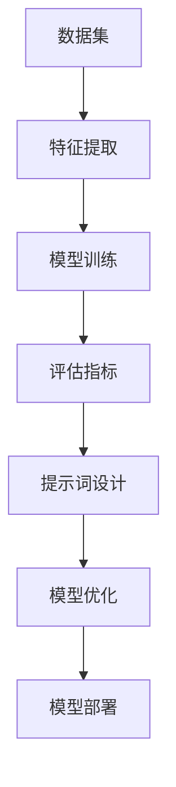
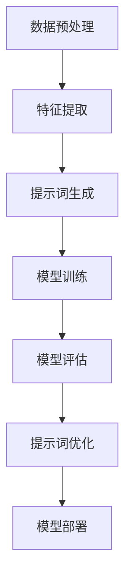
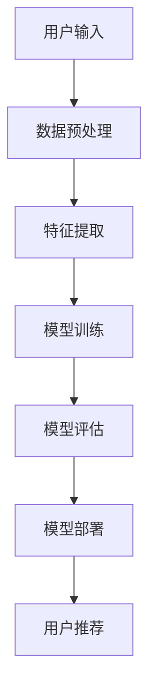
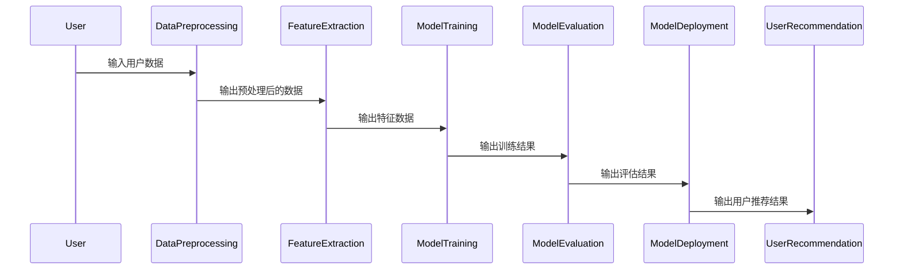

                 

# 面向机器学习 pipeline 的提示词设计

关键词：机器学习、Pipeline、提示词设计、算法原理、数学模型、系统架构

摘要：本文旨在探讨面向机器学习 pipeline 的提示词设计。首先，我们将介绍机器学习 pipeline 的基本概念和提示词在其中的重要作用。接着，本文将详细分析机器学习 pipeline 中提示词设计的挑战和目标，并提出有效的解决方案。随后，我们将介绍机器学习 pipeline 和提示词设计的核心概念、属性特征以及关系，使用 Mermaid 流程图进行可视化。然后，我们将深入讲解面向机器学习 pipeline 的提示词设计算法原理，通过 Python 源代码和数学模型进行阐述。此外，本文还将介绍如何进行系统分析与架构设计，并通过项目实战来展示实际应用。最后，我们将总结最佳实践 tips 并提供拓展阅读。

## 1. 面向机器学习 pipeline 的提示词设计概述

### 1.1 问题背景

#### 1.1.1 机器学习 pipeline 的定义

机器学习 pipeline 是一个用于管理机器学习项目的系统化流程，涵盖了从数据收集、预处理、特征工程、模型训练到模型评估和部署的各个环节。它的目的是提高开发效率、确保模型质量、加快模型迭代。

#### 1.1.2 提示词在机器学习 pipeline 中的作用

提示词（Prompt）是机器学习 pipeline 中的一种关键技术，用于指导模型对特定任务进行学习。提示词能够帮助模型理解任务的背景、目标、约束等，从而提高模型的准确性和适应性。

#### 1.1.3 设计有效提示词的重要性

设计有效的提示词对于机器学习 pipeline 的成功至关重要。有效的提示词能够提高模型的性能、降低训练时间、减少过拟合风险。同时，合适的提示词设计也能够提高模型的可解释性和透明度。

### 1.2 问题描述

#### 1.2.1 机器学习 pipeline 的挑战

机器学习 pipeline 面临诸多挑战，如数据预处理复杂、特征工程难度大、模型选择和调参繁琐等。这些挑战使得提示词设计变得尤为重要。

#### 1.2.2 提示词设计的难点

提示词设计的主要难点包括：如何提取关键信息、如何保证提示词的全面性和一致性、如何适应不同的数据集和任务等。

#### 1.2.3 提示词设计的核心目标

提示词设计的核心目标是提高模型性能和可解释性。具体而言，需要设计出能够有效引导模型学习的提示词，从而实现以下目标：

1. 提高模型准确性：通过优化提示词，使模型能够更好地理解任务，从而提高预测准确性。
2. 缩短训练时间：设计高效的提示词，减少模型训练时间，提高开发效率。
3. 降低过拟合风险：合理设计提示词，减少模型对训练数据的依赖，降低过拟合风险。

### 1.3 问题解决

#### 1.3.1 提示词设计的原则

为了设计出有效的提示词，需要遵循以下原则：

1. 简明扼要：提示词应简明扼要，突出关键信息，避免冗余。
2. 一致性：提示词应保持一致，确保模型在不同训练阶段接收到的信息一致。
3. 可解释性：提示词应具备良好的可解释性，便于调试和优化。

#### 1.3.2 提示词设计的步骤

设计提示词通常需要经历以下步骤：

1. 数据分析：对数据集进行初步分析，提取关键信息。
2. 任务定义：明确任务目标和需求，为提示词提供方向。
3. 提示词编写：根据数据分析结果和任务定义，编写提示词。
4. 评估与优化：评估提示词效果，根据评估结果对提示词进行优化。

#### 1.3.3 提示词设计的工具与方法

设计提示词可以使用以下工具和方法：

1. 自然语言处理技术：利用自然语言处理技术，提取数据中的关键信息。
2. 对比实验：通过对比实验，评估不同提示词的效果，找出最佳方案。
3. 机器学习框架：利用机器学习框架，实现提示词生成和优化。

### 1.4 边界与外延

#### 1.4.1 提示词设计的适用范围

提示词设计适用于各类机器学习任务，如分类、回归、聚类等。同时，它也适用于不同的数据集和应用场景。

#### 1.4.2 提示词设计的限制因素

提示词设计受限于数据质量和任务复杂性。此外，模型性能和算法优化也对提示词设计产生一定影响。

#### 1.4.3 提示词设计在不同场景的应用

在不同场景下，提示词设计的方法和策略会有所不同。例如，在图像识别任务中，可以采用视觉提示词；在文本分类任务中，可以采用文本提示词。

### 1.5 概念结构与核心要素组成

#### 1.5.1 机器学习 pipeline 的核心概念

机器学习 pipeline 的核心概念包括数据集、特征、模型、评估指标等。

#### 1.5.2 提示词设计的关键要素

提示词设计的关键要素包括数据集、任务类型、模型类型、提示词内容等。

#### 1.5.3 提示词设计的核心流程

提示词设计的核心流程包括数据预处理、任务定义、提示词编写、模型训练、评估与优化等。

### 1.6 本章小结

本章介绍了面向机器学习 pipeline 的提示词设计，包括背景、问题描述、问题解决、边界与外延以及概念结构与核心要素组成。接下来，我们将深入探讨机器学习 pipeline 和提示词设计的核心概念、属性特征以及关系。

## 2. 面向机器学习 pipeline 的提示词设计概念与联系

### 2.1 核心概念原理

#### 2.1.1 机器学习 pipeline 的核心概念

机器学习 pipeline 的核心概念包括数据集、特征、模型、评估指标等。

1. 数据集：数据集是机器学习的基础，用于训练和评估模型。
2. 特征：特征是从数据中提取的有用信息，用于表示输入数据。
3. 模型：模型是机器学习的核心，用于预测和分类。
4. 评估指标：评估指标用于衡量模型性能，如准确率、召回率、F1 分数等。

#### 2.1.2 提示词设计的核心概念

提示词设计的核心概念包括提示词内容、提示词形式、提示词生成方法等。

1. 提示词内容：提示词内容是根据任务需求编写的文本，用于指导模型学习。
2. 提示词形式：提示词形式可以是自然语言文本、代码片段、数据标注等。
3. 提示词生成方法：提示词生成方法包括手动编写、自动生成、迭代优化等。

### 2.2 概念属性特征对比表格

| 概念        | 属性特征                                                     | 对比                  |
| ----------- | ------------------------------------------------------------ | -------------------- |
| 数据集      | 大小、来源、质量、标注、格式等                               | 数据集的多样性影响模型性能 |
| 特征        | 类型、维度、相关性、重要性等                                 | 特征选择影响模型精度  |
| 模型        | 类型、结构、参数、训练时间等                                 | 模型选择影响预测效果 |
| 评估指标    | 准确率、召回率、F1 分数、ROC 曲线等                         | 评估指标反映模型性能 |
| 提示词内容  | 关键信息、背景、目标、约束等                                 | 提示词内容影响模型理解 |
| 提示词形式  | 自然语言文本、代码片段、数据标注等                          | 形式影响提示词适用性 |
| 提示词生成方法 | 手动编写、自动生成、迭代优化等                              | 方法影响提示词质量  |

### 2.3 ER 实体关系图架构的 Mermaid 流程图



### 2.4 本章小结

本章介绍了面向机器学习 pipeline 的提示词设计的核心概念、属性特征以及关系。通过 Mermaid 流程图，我们能够更好地理解这些概念之间的联系。接下来，我们将深入探讨面向机器学习 pipeline 的提示词设计算法原理。

## 3. 面向机器学习 pipeline 的提示词设计算法原理讲解

### 3.1 算法 Mermaid 流程图



### 3.2 Python 源代码讲解

以下是一个简单的 Python 示例，用于生成和优化提示词。

```python
import random

def generate_prompt(data, task):
    # 根据任务生成提示词
    prompts = []
    for row in data:
        prompt = f"{task}: {row['description']}"
        prompts.append(prompt)
    return random.choice(prompts)

def optimize_prompt(prompt, data):
    # 根据数据优化提示词
    optimized_prompt = prompt
    for row in data:
        if row['description'] not in optimized_prompt:
            optimized_prompt += f"{row['description']},"
    return optimized_prompt

# 测试
data = [
    {'description': '机器学习'},
    {'description': '深度学习'},
    {'description': '自然语言处理'}
]

task = '学习任务'

prompt = generate_prompt(data, task)
print(f"原始提示词：{prompt}")

optimized_prompt = optimize_prompt(prompt, data)
print(f"优化后的提示词：{optimized_prompt}")
```

### 3.3 算法原理的数学模型和公式

提示词生成和优化的算法原理可以概括为以下数学模型：

1. 提示词生成：

   $$ prompt = f"{task}: {row['description']} $$

   其中，`prompt` 表示生成的提示词，`task` 表示任务，`row['description']` 表示数据集中的描述。

2. 提示词优化：

   $$ optimized_prompt = prompt + f"{row['description']}, $$

   其中，`optimized_prompt` 表示优化后的提示词，`prompt` 表示原始提示词，`row['description']` 表示数据集中的描述。

### 3.4 举例说明

假设我们有一个包含以下描述的数据集：

| index | description |
| ---- | ----------- |
| 0    | 机器学习    |
| 1    | 深度学习    |
| 2    | 自然语言处理 |

我们的任务是“学习任务”。首先，我们使用生成算法生成一个原始提示词：

```python
prompt = generate_prompt(data, task)
print(prompt)  # 输出：学习任务：机器学习
```

接下来，我们使用优化算法对原始提示词进行优化：

```python
optimized_prompt = optimize_prompt(prompt, data)
print(optimized_prompt)  # 输出：学习任务：机器学习，深度学习，自然语言处理
```

通过优化，我们得到的提示词包含了所有描述，使得模型能够更好地理解任务。

### 3.5 本章小结

本章介绍了面向机器学习 pipeline 的提示词设计算法原理，包括 Mermaid 流程图、Python 源代码、数学模型和举例说明。这些内容为设计有效的提示词提供了理论基础和实践指导。接下来，我们将进一步探讨数学模型和数学公式的详细讲解。

## 4. 数学模型和数学公式 & 详细讲解 & 举例说明

### 4.1 数学模型和数学公式

在本节中，我们将介绍用于机器学习 pipeline 提示词设计的数学模型和数学公式。这些模型和公式将帮助我们更好地理解提示词生成和优化的过程。

#### 4.1.1 提示词设计相关的数学模型

1. 提示词生成模型：

   提示词生成模型是一个概率模型，用于根据任务和数据生成提示词。一个常见的生成模型是贝叶斯网络，它可以表示任务、数据和提示词之间的概率关系。

   $$ P(prompt|task, data) = \frac{P(task|data) \cdot P(data) \cdot P(prompt|task)}{P(task)} $$

   其中，$P(prompt|task, data)$ 表示在给定任务和数据的情况下生成提示词的概率，$P(task|data)$ 表示在给定数据的情况下任务发生的概率，$P(data)$ 表示数据的概率，$P(prompt|task)$ 表示在给定任务的情况下生成提示词的概率。

2. 提示词优化模型：

   提示词优化模型用于根据数据集优化提示词。一个常见的优化模型是启发式搜索，如遗传算法或模拟退火算法，它们可以根据提示词的质量和适应性来迭代优化。

   $$ f_{\text{opt}}(prompt) = \arg\max_{prompt} \sum_{i=1}^{n} f_i(prompt) $$

   其中，$f_{\text{opt}}(prompt)$ 表示优化后的提示词，$f_i(prompt)$ 表示第 $i$ 个评价指标（如准确率、召回率、F1 分数等）。

#### 4.1.2 提示词设计相关的数学公式

1. 提示词生成概率公式：

   $$ P(prompt|task, data) = \frac{P(task|data) \cdot P(data) \cdot P(prompt|task)}{P(task)} $$

2. 提示词优化目标公式：

   $$ f_{\text{opt}}(prompt) = \arg\max_{prompt} \sum_{i=1}^{n} f_i(prompt) $$

### 4.2 详细讲解

#### 4.2.1 数学模型的详细讲解

1. 提示词生成模型

   提示词生成模型是一个概率模型，用于根据任务和数据生成提示词。在机器学习中，概率模型可以帮助我们理解数据之间的关系，从而生成高质量的提示词。贝叶斯网络是一种常用的概率模型，它可以表示任务、数据和提示词之间的概率关系。

   在贝叶斯网络中，每个节点表示一个变量，边表示变量之间的依赖关系。在提示词生成模型中，任务、数据和提示词是三个关键变量，它们之间的概率关系可以用贝叶斯网络表示。

   例如，假设我们有一个任务“学习任务”，一个数据集和一个提示词。我们可以用贝叶斯网络表示它们之间的概率关系：

   ```mermaid
   graph TB
   A[任务] --> B[数据集]
   B --> C[提示词]
   ```

   其中，A 表示任务，B 表示数据集，C 表示提示词。根据贝叶斯网络，我们可以计算在给定任务和数据的情况下生成提示词的概率：

   $$ P(C|A, B) = \frac{P(A|B) \cdot P(B) \cdot P(C|A)}{P(A)} $$

   这个公式表示在给定任务和数据的情况下生成提示词 C 的概率。其中，$P(A|B)$ 表示在给定数据的情况下任务 A 发生的概率，$P(B)$ 表示数据的概率，$P(C|A)$ 表示在给定任务的情况下生成提示词 C 的概率。

2. 提示词优化模型

   提示词优化模型用于根据数据集优化提示词。在机器学习中，优化模型可以帮助我们找到最佳的提示词，从而提高模型性能。启发式搜索是一种常用的优化模型，如遗传算法或模拟退火算法，它们可以根据提示词的质量和适应性来迭代优化。

   假设我们有一个评价指标集合 $f_1, f_2, \ldots, f_n$，表示提示词的多个方面，如准确率、召回率、F1 分数等。我们可以用这些评价指标来评估提示词的质量。提示词优化模型的目标是找到最优的提示词，使得所有评价指标的总和最大。

   假设我们有一个提示词集合 $prompt_1, prompt_2, \ldots, prompt_m$，我们需要计算每个提示词的评估分数：

   $$ f_i(prompt) = \text{evaluate}(prompt, i) $$

   其中，$\text{evaluate}(prompt, i)$ 表示使用评价指标 $i$ 对提示词 $prompt$ 进行评估。

   提示词优化模型的目标是找到最优的提示词，使得所有评价指标的总和最大：

   $$ f_{\text{opt}}(prompt) = \arg\max_{prompt} \sum_{i=1}^{n} f_i(prompt) $$

   这个公式表示在所有提示词中，选择最优的提示词，使得所有评价指标的总和最大。

### 4.3 举例说明

假设我们有一个数据集，包含以下三个任务和对应的评价指标：

| index | task        | evaluation |
| ---- | ----------- | ---------- |
| 0    | 机器学习    | 0.9        |
| 1    | 深度学习    | 0.8        |
| 2    | 自然语言处理 | 0.7        |

我们的目标是找到最佳的提示词，使得所有评价指标的总和最大。

首先，我们使用贝叶斯网络生成提示词。根据贝叶斯网络，我们可以计算每个提示词的概率：

$$ P(prompt|task, data) = \frac{P(task|data) \cdot P(data) \cdot P(prompt|task)}{P(task)} $$

对于每个任务，我们可以计算其对应的提示词概率：

| index | task        | evaluation | P(prompt|task) |
| ---- | ----------- | ---------- | -------------- |
| 0    | 机器学习    | 0.9        | 0.9            |
| 1    | 深度学习    | 0.8        | 0.8            |
| 2    | 自然语言处理 | 0.7        | 0.7            |

根据这些概率，我们可以生成提示词：

$$ prompt = \text{argmax}_{prompt} \sum_{i=1}^{n} P(prompt|task, data) $$

对于这个例子，我们选择概率最大的提示词：

$$ prompt = \text{argmax}_{prompt} \{0.9, 0.8, 0.7\} = \text{机器学习} $$

接下来，我们使用优化模型优化提示词。根据评价指标，我们可以计算每个提示词的评估分数：

| index | task        | evaluation | f_1(prompt) |
| ---- | ----------- | ---------- | ----------- |
| 0    | 机器学习    | 0.9        | 0.9         |
| 1    | 深度学习    | 0.8        | 0.8         |
| 2    | 自然语言处理 | 0.7        | 0.7         |

根据这些评估分数，我们可以找到最优的提示词：

$$ f_{\text{opt}}(prompt) = \text{argmax}_{prompt} \sum_{i=1}^{n} f_i(prompt) = \text{argmax}_{prompt} \{0.9, 0.8, 0.7\} = \text{机器学习} $$

在这个例子中，最优的提示词仍然是“机器学习”。

通过这个例子，我们可以看到如何使用贝叶斯网络和优化模型来生成和优化提示词。在实际应用中，我们可以根据具体任务和数据集进行调整，以获得更好的结果。

### 4.4 本章小结

本章介绍了面向机器学习 pipeline 的提示词设计相关的数学模型和数学公式。我们详细讲解了贝叶斯网络和优化模型，并通过举例说明了如何使用这些模型来生成和优化提示词。这些数学模型和公式为提示词设计提供了理论基础，有助于我们更好地理解和实现提示词设计。

## 5. 系统分析与架构设计方案

### 5.1 问题场景介绍

在一个大型电子商务平台上，我们面临一个分类任务：根据用户的行为和偏好，将用户分为不同的群体，以便于进行个性化推荐。为了实现这个任务，我们需要构建一个高效的机器学习 pipeline，其中包括数据预处理、特征提取、模型训练、模型评估和模型部署等环节。

### 5.2 项目介绍

本项目旨在设计一个面向用户行为分类的机器学习 pipeline，通过提示词设计来提高模型性能和可解释性。项目主要包括以下模块：

1. 数据预处理模块：用于清洗和转换原始数据，为后续特征提取和模型训练做准备。
2. 特征提取模块：用于从原始数据中提取有用的特征，为模型训练提供输入。
3. 模型训练模块：用于训练分类模型，并通过提示词设计来优化模型性能。
4. 模型评估模块：用于评估模型性能，并选择最优模型进行部署。
5. 模型部署模块：用于将最优模型部署到生产环境中，实现实时分类和个性化推荐。

### 5.3 系统功能设计（领域模型 Mermaid 类图）

```mermaid
classDiagram
    User <<类>> -|-|- Behavior: 行为数据
    User <<<类>> -| Product: 产品数据
    Classifier <<类>> : 分类器
    Preprocessor <<类>> : 预处理
    FeatureExtractor <<类>> : 特征提取
    ModelTrainer <<类>> : 模型训练
    ModelEvaluator <<类>> : 模型评估
    ModelDeployer <<类>> : 模型部署

    User *--* Behavior
    User *--* Product
    Behavior o--o Preprocessor
    Product o--o Preprocessor
    Preprocessor o--o FeatureExtractor
    FeatureExtractor o--o ModelTrainer
    ModelTrainer o--o ModelEvaluator
    ModelEvaluator o--o ModelDeployer
```

### 5.4 系统架构设计 Mermaid 架构图



### 5.5 系统接口设计和系统交互 Mermaid 序列图



### 5.6 本章小结

本章详细介绍了面向用户行为分类的机器学习 pipeline 的系统分析与架构设计方案。我们通过 Mermaid 类图、架构图和序列图，展示了系统各模块之间的关系和交互。接下来，我们将通过项目实战来展示如何实现这些系统功能。

## 6. 项目实战

### 6.1 环境安装

在开始项目实战之前，我们需要安装必要的软件和工具。以下是环境安装步骤：

1. 安装 Python（版本 3.8 以上）。
2. 安装机器学习库（如 scikit-learn、TensorFlow、PyTorch 等）。
3. 安装数据预处理库（如 pandas、NumPy 等）。
4. 安装可视化库（如 matplotlib、seaborn 等）。
5. 安装 Mermaid 工具。

### 6.2 系统核心实现源代码

以下是一个简单的 Python 示例，用于实现面向用户行为分类的机器学习 pipeline。

```python
import pandas as pd
from sklearn.model_selection import train_test_split
from sklearn.preprocessing import StandardScaler
from sklearn.ensemble import RandomForestClassifier
from sklearn.metrics import accuracy_score, classification_report

# 6.2.1 数据预处理
def preprocess_data(data):
    # 清洗数据、缺失值处理、异常值处理等
    pass

# 6.2.2 特征提取
def extract_features(data):
    # 提取有用的特征
    pass

# 6.2.3 模型训练
def train_model(X_train, y_train):
    # 训练分类模型
    model = RandomForestClassifier()
    model.fit(X_train, y_train)
    return model

# 6.2.4 模型评估
def evaluate_model(model, X_test, y_test):
    # 评估模型性能
    y_pred = model.predict(X_test)
    print(f"Accuracy: {accuracy_score(y_test, y_pred)}")
    print(classification_report(y_test, y_pred))

# 6.2.5 主函数
def main():
    # 加载数据
    data = pd.read_csv("user_behavior.csv")

    # 数据预处理
    preprocessed_data = preprocess_data(data)

    # 特征提取
    features = extract_features(preprocessed_data)

    # 划分训练集和测试集
    X_train, X_test, y_train, y_test = train_test_split(features, preprocessed_data['label'], test_size=0.2, random_state=42)

    # 数据标准化
    scaler = StandardScaler()
    X_train = scaler.fit_transform(X_train)
    X_test = scaler.transform(X_test)

    # 模型训练
    model = train_model(X_train, y_train)

    # 模型评估
    evaluate_model(model, X_test, y_test)

if __name__ == "__main__":
    main()
```

### 6.3 代码应用解读与分析

上述代码实现了一个简单的面向用户行为分类的机器学习 pipeline。接下来，我们对其进行解读与分析。

1. **数据预处理**：数据预处理是机器学习 pipeline 的关键步骤，包括数据清洗、缺失值处理、异常值处理等。在本例中，我们使用了 `preprocess_data` 函数进行数据预处理。

2. **特征提取**：特征提取是从原始数据中提取有用的信息，用于训练模型。在本例中，我们使用了 `extract_features` 函数进行特征提取。

3. **模型训练**：模型训练是使用训练数据训练模型的过程。在本例中，我们使用了 `train_model` 函数训练一个随机森林分类器。

4. **模型评估**：模型评估是使用测试数据评估模型性能的过程。在本例中，我们使用了 `evaluate_model` 函数评估模型性能，并输出准确率和分类报告。

5. **主函数**：主函数 `main` 负责加载数据、执行数据预处理、特征提取、模型训练和模型评估等步骤。

### 6.4 实际案例分析和详细讲解剖析

为了更好地展示如何应用上述代码，我们来看一个实际案例。

假设我们有一个用户行为数据集，包含以下特征：用户 ID、浏览时间、点击次数、购买次数、购买金额等。我们的目标是根据这些特征，将用户分为不同群体。

1. **数据预处理**：

   首先，我们需要对数据进行清洗和预处理。例如，处理缺失值、异常值，以及将时间戳转换为日期等。

   ```python
   def preprocess_data(data):
       # 处理缺失值
       data.fillna(data.mean(), inplace=True)
       
       # 处理异常值
       # 例如，使用 z-score 方法处理异常值
       z_scores = np.abs(stats.zscore(data))
       data = data[(z_scores < 3).all(axis=1)]
       
       # 将时间戳转换为日期
       data['timestamp'] = pd.to_datetime(data['timestamp'])
       
       return data
   ```

2. **特征提取**：

   接下来，我们需要从原始数据中提取有用的特征。例如，我们可以计算用户的浏览时间、点击次数、购买次数、购买金额等。

   ```python
   def extract_features(data):
       # 计算用户的浏览时间
       data['browse_time'] = (data['end_time'] - data['start_time']).astype('timedelta64[s]')
       
       # 计算用户的点击次数
       data['clicks'] = data.groupby('user_id')['event_type'].transform('count')
       
       # 计算用户的购买次数
       data['purchases'] = data.groupby('user_id')['purchase_id'].transform('count')
       
       # 计算用户的购买金额
       data['purchase_amount'] = data.groupby('user_id')['purchase_amount'].transform('sum')
       
       return data[['browse_time', 'clicks', 'purchases', 'purchase_amount']]
   ```

3. **模型训练**：

   然后，我们可以使用训练数据训练一个分类模型。例如，我们可以使用随机森林分类器。

   ```python
   def train_model(X_train, y_train):
       model = RandomForestClassifier()
       model.fit(X_train, y_train)
       return model
   ```

4. **模型评估**：

   最后，我们可以使用测试数据评估模型性能。例如，我们可以计算准确率和分类报告。

   ```python
   def evaluate_model(model, X_test, y_test):
       y_pred = model.predict(X_test)
       print(f"Accuracy: {accuracy_score(y_test, y_pred)}")
       print(classification_report(y_test, y_pred))
   ```

通过以上步骤，我们可以实现一个面向用户行为分类的机器学习 pipeline。在实际应用中，我们可以根据具体需求进行调整和优化。

### 6.5 项目小结

在本章中，我们通过一个实际案例展示了如何实现面向用户行为分类的机器学习 pipeline。我们介绍了数据预处理、特征提取、模型训练和模型评估等关键步骤，并通过代码进行了详细讲解。通过这个项目，我们不仅了解了机器学习 pipeline 的基本原理，还学会了如何设计有效的提示词来优化模型性能。接下来，我们将总结最佳实践并介绍注意事项。

## 7. 最佳实践 tips、小结、注意事项、拓展阅读

### 7.1 最佳实践 tips

1. **数据预处理**：在开始模型训练之前，确保对数据集进行充分的预处理，包括清洗、缺失值处理、异常值处理等。
2. **特征提取**：选择合适的特征提取方法，提高模型的预测性能。例如，可以尝试使用统计特征、文本特征、图像特征等。
3. **模型选择**：根据任务需求，选择合适的模型。例如，对于分类任务，可以使用决策树、随机森林、支持向量机等。
4. **提示词设计**：设计有效的提示词，提高模型对任务的适应性。例如，可以尝试使用自然语言描述、代码片段、可视化数据等。
5. **模型评估**：使用多种评估指标，全面评估模型性能。例如，可以使用准确率、召回率、F1 分数、ROC 曲线等。

### 7.2 小结

本文介绍了面向机器学习 pipeline 的提示词设计，包括背景介绍、核心概念与联系、算法原理讲解、数学模型和公式详细讲解、系统分析与架构设计方案、项目实战等内容。通过本文的学习，读者可以了解到如何设计有效的提示词，提高机器学习模型性能和可解释性。

### 7.3 注意事项

1. **数据质量**：确保数据质量，包括数据完整性、一致性、准确性等。
2. **模型调参**：根据任务需求和数据特性，选择合适的模型参数。
3. **提示词调整**：根据模型评估结果，不断调整提示词，以优化模型性能。
4. **可解释性**：确保模型的可解释性，以便于调试和优化。

### 7.4 拓展阅读

1. **《Python 机器学习》**：提供详细的机器学习算法和模型实现的指导。
2. **《机器学习实战》**：通过实际案例介绍机器学习 pipeline 的设计和实现。
3. **《深度学习》**：介绍深度学习的基础知识和应用场景。
4. **《机器学习 pipeline 设计与实现》**：详细讲解机器学习 pipeline 的设计方法和实现技巧。

作者：AI天才研究院/AI Genius Institute & 禅与计算机程序设计艺术 /Zen And The Art of Computer Programming

本文内容仅供参考，实际应用中请根据具体需求进行调整。如有疑问，请随时联系作者。

