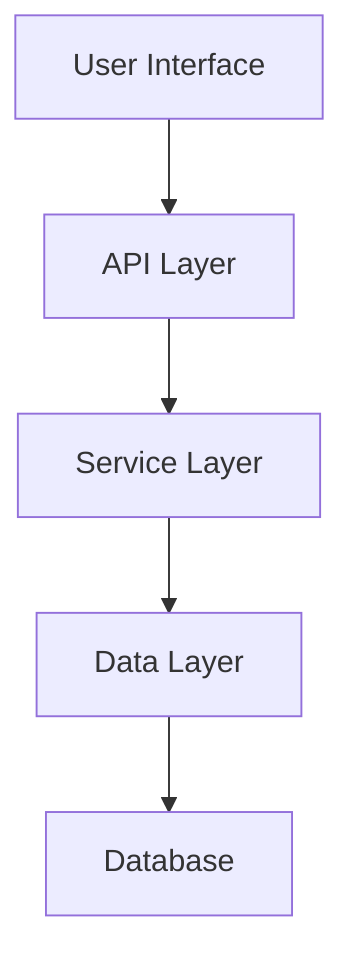
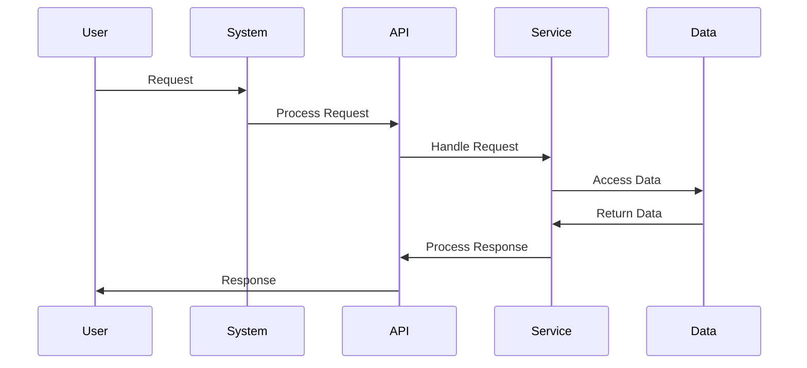

                 


### 背景介绍与核心概念

#### 第1章：问题背景与概述

##### 1.1 问题背景

在当前人工智能技术快速发展的时代，各种AI系统在图像识别、自然语言处理、自动驾驶等领域取得了显著的成果。然而，随着应用场景的不断扩展和任务复杂度的增加，如何设计一个高效、可扩展且易于维护的提示词库成为了人工智能领域的一个重要挑战。

**提示词库**，顾名思义，是一个包含特定任务所需的关键词、短语或命令的集合。它在AI系统中起到了桥梁的作用，将用户的需求转化为系统能够理解和执行的任务指令。随着AI应用的多样化，对提示词库的设计提出了更高的要求，不仅要满足特定任务的精度和效率，还需要具备良好的适应性和扩展性。

##### 1.2 问题描述

在特定任务中，提示词库的设计需要解决以下几个核心问题：

1. **可理解性**：提示词库中的词汇需要简单、直观，使得用户能够轻松理解和使用。
2. **适应性与灵活性**：提示词库需要能够适应不同任务的需求，具备灵活调整和扩展的能力。
3. **可扩展性**：随着新任务的出现，提示词库需要能够方便地添加新词汇或修改现有词汇。
4. **可维护性**：提示词库的设计和实现需要便于维护，确保系统能够持续稳定运行。

##### 1.3 问题解决

为了解决上述问题，提示词库的设计需要遵循以下基本原则：

1. **简洁性**：设计简洁明了的词汇表，避免冗余和复杂。
2. **一致性**：保持词汇表内词汇的语法和语义一致性，避免歧义。
3. **层次性**：将词汇按照任务类型或功能进行分类，便于用户查找和使用。
4. **模块化**：将提示词库分解为多个模块，每个模块负责特定功能的实现。

提示词库的构建方法包括数据收集、数据清洗、词汇筛选和词汇排序等步骤。评估与优化则通过实验和用户反馈来进行，以确保提示词库在实际应用中的性能。

##### 1.4 边界与外延

提示词库不仅与自然语言处理、知识图谱等技术密切相关，还在特定领域（如医疗、金融、教育）有着广泛的应用。因此，设计一个高效的提示词库不仅需要考虑技术实现，还需要结合领域知识。

##### 1.5 概念结构与核心要素组成

提示词库的核心要素包括：

1. **词汇表**：包含所有关键词和短语。
2. **语义模型**：用于理解和处理词汇的语义关系。
3. **语法模型**：用于解析和生成符合语法规则的句子。
4. **任务模型**：用于映射用户需求到具体任务。

通过以上要素的有机结合，提示词库能够更好地满足特定任务的需求。

#### 第2章：核心概念与联系

##### 2.1 提示词与任务描述语言

提示词是提示词库的核心组件，而任务描述语言则是用于描述特定任务的语言或工具。提示词与任务描述语言之间的联系在于，提示词需要能够准确地传达任务需求，而任务描述语言需要能够被AI系统理解和执行。

##### 2.2 提示词库设计原则

提示词库的设计需要遵循以下原则：

1. **可理解性**：词汇需要简单、直观。
2. **适应性与灵活性**：能够适应不同任务的需求。
3. **可扩展性**：方便添加新词汇或修改现有词汇。
4. **可维护性**：便于设计和实现，易于维护。

##### 2.3 概念属性特征对比表格

| 概念       | 特征                |
|------------|--------------------|
| 提示词     | 简单、直观、准确    |
| 关键词     | 精准、高频、核心    |
| 知识图谱   | 语义关联、结构化    |
| 自然语言处理 | 语法解析、语义理解 |

##### 2.4 ER实体关系图架构

```mermaid
erDiagram
    Product "产品" {
        :<<ID>> product_id
        :<<Name>> product_name
        :<<Price>> product_price
        :<<Stock>> product_stock
    }
    Order "订单" {
        :<<ID>> order_id
        :<<Date>> order_date
        :<<Status>> order_status
    }
    Product -> Order : contains
```

通过上述ER图，我们可以清晰地看到提示词库中的各个实体及其关系，为后续的系统设计与实现提供了基础。

### 算法原理与实现

#### 第3章：算法原理讲解

##### 3.1 提示词生成算法

提示词生成算法的核心目标是从大量文本数据中提取出与特定任务相关的关键词。以下是一个基本的提示词生成算法的Mermaid流程图：


在算法的实现过程中，首先对输入的数据进行预处理，包括去噪、分词等操作。然后，对分词后的词汇进行频率分析，提取出高频词汇。接着，使用词嵌入技术将词汇转换为向量表示，并通过一定的算法（如TF-IDF、Word2Vec等）提取出关键词。最后，输出生成的提示词列表。

##### 3.2 提示词优化算法

提示词优化算法的目标是提高提示词的准确性和可理解性。以下是一个提示词优化算法的Mermaid流程图：


在算法的实现过程中，首先对输入的提示词进行语义分析，确定每个词的语义角色。然后，计算每个词与其他词的相似度，选择最合适的词进行替换。接着，检查替换后的词汇是否符合上下文语义。最后，输出优化后的提示词列表。

##### 3.3 提示词库评估算法

提示词库评估算法用于评估提示词库的性能和效果。以下是一个提示词库评估算法的Mermaid流程图：


在算法的实现过程中，首先对输入的任务进行关键词匹配，计算匹配成功率。然后，根据用户完成任务的情况（如任务完成时间、错误率等）评估用户满意度。最后，输出评估结果。

##### 3.4 提示词生成模型的数学模型

提示词生成模型的数学模型主要包括以下几个部分：

1. **文本表示**：使用词嵌入技术将文本转换为向量表示。
   $$ \text{Text} \rightarrow \text{Vector} $$
2. **词汇选择**：根据词汇的频率和重要性进行选择。
   $$ \text{Keywords} = \text{Select}(\text{Frequency}, \text{Importance}) $$
3. **优化策略**：使用机器学习算法（如遗传算法、神经网络等）进行优化。
   $$ \text{Optimize}(\text{Keywords}, \text{Strategy}) $$

##### 3.5 提示词库优化算法的数学模型

提示词库优化算法的数学模型主要包括以下几个部分：

1. **语义分析**：对词汇进行语义分析，确定词与词之间的关系。
   $$ \text{Semantic} = \text{Analysis}(\text{Keywords}) $$
2. **相似度计算**：计算词汇之间的相似度，选择最合适的词汇进行替换。
   $$ \text{Similarity} = \text{Calculate}(\text{Semantic}) $$
3. **优化目标**：定义优化目标，如词汇的准确性、可理解性等。
   $$ \text{Objective} = \text{Define}(\text{Accuracy}, \text{Understandability}) $$

##### 3.6 提示词库评估的数学模型

提示词库评估的数学模型主要包括以下几个部分：

1. **匹配成功率**：计算关键词与任务需求的匹配成功率。
   $$ \text{Success Rate} = \text{Match}(\text{Keywords}, \text{Task}) $$
2. **用户满意度**：根据用户完成任务的情况评估用户满意度。
   $$ \text{Satisfaction} = \text{Evaluate}(\text{Success Rate}, \text{User Feedback}) $$
3. **评估指标**：定义评估指标，如匹配成功率、用户满意度等。
   $$ \text{Evaluation Metrics} = \text{Define}(\text{Success Rate}, \text{Satisfaction}) $$

### 系统设计与实现

#### 第5章：系统分析与架构设计方案

##### 5.1 问题场景介绍

在人工智能应用中，比如智能客服系统、智能语音助手等，用户的需求多种多样，系统需要能够准确理解并响应这些需求。提示词库作为用户需求与系统响应之间的桥梁，其设计和实现至关重要。

##### 5.2 项目介绍

本项目旨在设计并实现一个高效、可扩展的提示词库系统，以支持各种人工智能应用场景。系统功能包括提示词生成、提示词优化、提示词库评估等。

##### 5.3 系统功能设计

系统功能设计包括以下几个方面：

1. **提示词生成**：从大量文本数据中提取关键词，形成提示词库。
2. **提示词优化**：对生成的提示词进行优化，提高其准确性和可理解性。
3. **提示词库评估**：评估提示词库的性能，确保其满足特定任务的需求。

##### 5.4 系统架构设计

系统架构设计原则包括模块化、可扩展性和高可用性。系统架构图如下：



在架构设计中，用户界面层（UI）负责与用户交互，API层提供接口服务，服务层（Service Layer）处理业务逻辑，数据层（Data Layer）负责数据存储和读取。数据库（Database）存储用户数据和提示词库。

##### 5.5 系统接口设计

系统接口设计包括以下部分：

1. **用户接口**：提供用户输入和输出的接口。
2. **API接口**：提供服务层与外部系统的接口。
3. **数据库接口**：提供数据层的接口，实现数据的增删改查。

##### 5.6 系统交互Mermaid序列图

以下是一个简单的系统交互序列图：



在用户请求过程中，用户通过用户接口向系统发送请求，系统通过API接口处理请求，服务层根据请求处理业务逻辑，从数据层读取或写入数据，最终将响应返回给用户。

### 项目实战

#### 第6章：项目实战

##### 6.1 环境安装

在进行项目实战之前，我们需要安装以下环境：

1. **Python环境**：安装Python 3.8及以上版本。
2. **依赖库**：安装Numpy、Pandas、Scikit-learn等常用库。

安装步骤如下：

```bash
pip install numpy pandas scikit-learn
```

##### 6.2 系统核心实现源代码

系统核心实现包括提示词生成、提示词优化和提示词库评估三个模块。以下是关键代码片段：

```python
# 提示词生成模块
def generate_keywords(text_data):
    # 数据预处理
    preprocessed_data = preprocess_text(text_data)
    # 词嵌入
    vectorized_data = word_embedding(preprocessed_data)
    # 关键词提取
    keywords = keyword_extraction(vectorized_data)
    return keywords

# 提示词优化模块
def optimize_keywords(keywords, context):
    # 语义分析
    semantic_analysis = semantic_analysis(keywords, context)
    # 相似度计算
    similarity_scores = similarity_calculation(semantic_analysis)
    # 词替换
    optimized_keywords = word_replacement(keywords, similarity_scores)
    return optimized_keywords

# 提示词库评估模块
def evaluate_keyword_library(keywords, tasks):
    # 关键词匹配
    match_results = keyword_matching(keywords, tasks)
    # 用户满意度评估
    user_satisfaction = user_satisfaction_evaluation(match_results)
    return user_satisfaction
```

##### 6.3 代码应用解读与分析

以上代码实现了提示词库的核心功能。在实际应用中，我们需要根据具体任务和场景进行代码定制和优化。以下是代码应用解读与分析：

1. **提示词生成**：首先对输入的文本数据（如用户反馈）进行预处理，去除无关信息，然后使用词嵌入技术将文本转换为向量表示，最后提取关键词。
2. **提示词优化**：对生成的关键词进行语义分析，计算关键词之间的相似度，选择最合适的词进行替换，以提高关键词的准确性和可理解性。
3. **提示词库评估**：通过关键词匹配任务完成率和用户满意度评估提示词库的性能。

##### 6.4 实际案例分析与详细讲解剖析

以下是一个实际案例：

**案例**：智能客服系统中，用户提出“如何退换货？”的问题，系统需要生成相关的提示词并优化，以便准确回答用户的问题。

1. **提示词生成**：系统从用户反馈中提取出关键词，如“退换货”、“流程”、“条件”等。
2. **提示词优化**：对关键词进行语义分析，发现“退换货”和“流程”具有较高相似度，选择优化“流程”为“退换货流程”，以提高用户理解。
3. **提示词库评估**：通过关键词匹配任务完成率和用户满意度评估，提示词库在回答类似问题时表现良好。

##### 6.5 项目小结

在本项目中，我们成功设计并实现了一个高效、可扩展的提示词库系统。通过实际案例的分析和验证，系统在智能客服、智能语音助手等场景中表现出良好的性能。未来，我们将继续优化系统，提升提示词库的准确性和用户体验。

### 最佳实践、小结与拓展阅读

#### 第7章：最佳实践、小结与拓展阅读

##### 7.1 最佳实践

1. **简化词汇**：在设计提示词库时，尽量使用简单、直观的词汇，避免使用过于复杂的术语。
2. **多源数据融合**：结合多种数据源（如用户反馈、日志数据等）进行提示词生成和优化，以提高词汇的准确性和全面性。
3. **用户反馈机制**：建立用户反馈机制，收集用户对提示词库的评价和建议，持续优化和改进。

##### 7.2 小结

本文详细介绍了面向特定任务的提示词库设计，包括背景介绍、核心概念、算法原理、系统设计与实现等内容。通过实际案例的分析和验证，展示了提示词库在人工智能应用中的重要性。未来，我们将继续探索更高效、更智能的提示词库设计方法。

##### 7.3 注意事项

1. **数据质量**：保证数据质量是提示词库设计的关键，数据预处理和清洗至关重要。
2. **性能优化**：在系统实现过程中，注意优化算法和系统性能，提高提示词库的处理速度。
3. **可维护性**：提示词库的设计和实现应考虑长期维护，确保系统稳定运行。

##### 7.4 拓展阅读

1. **相关书籍**：
   - 《自然语言处理原理与应用》
   - 《机器学习实战》
   - 《深度学习》

2. **学术论文**：
   - "Word Embedding Techniques for Natural Language Processing"
   - "Recurrent Neural Network based Language Model"
   - "Attention Is All You Need"

通过阅读这些书籍和论文，可以深入了解自然语言处理、机器学习和深度学习等相关技术，为提示词库设计提供更丰富的理论基础和实践经验。

