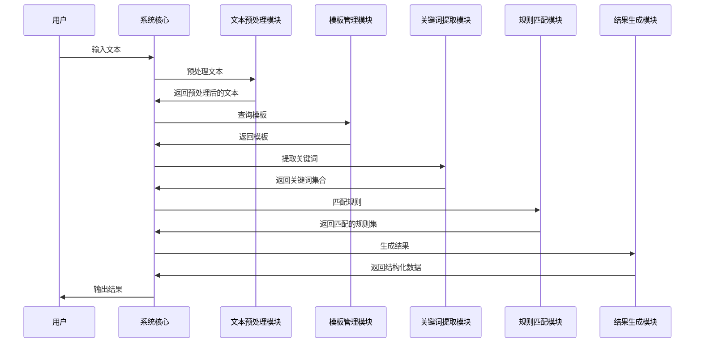
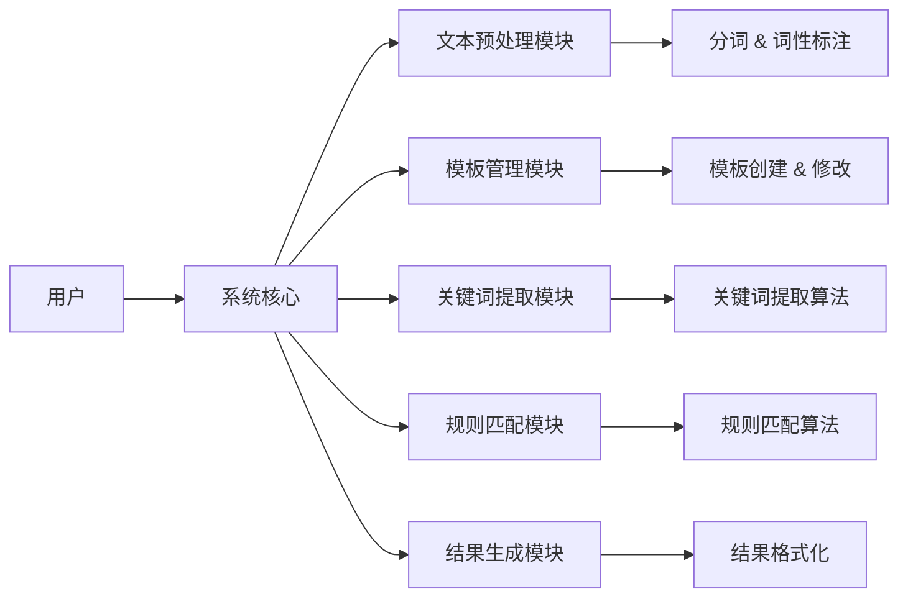
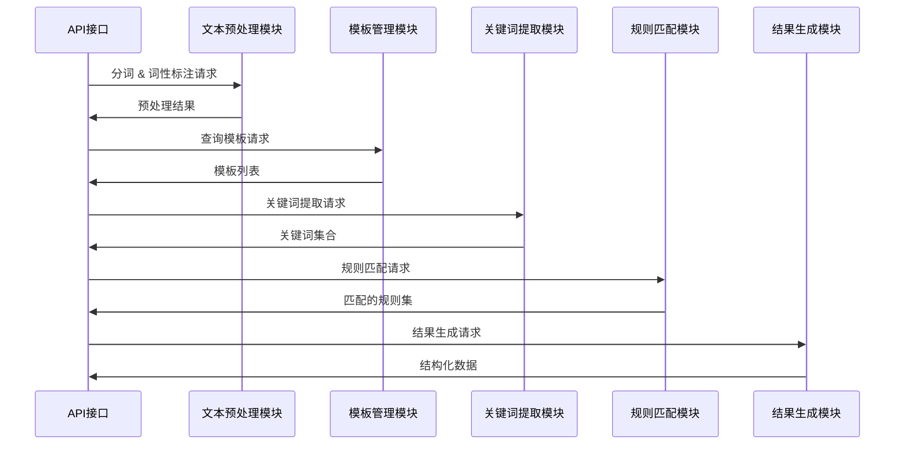
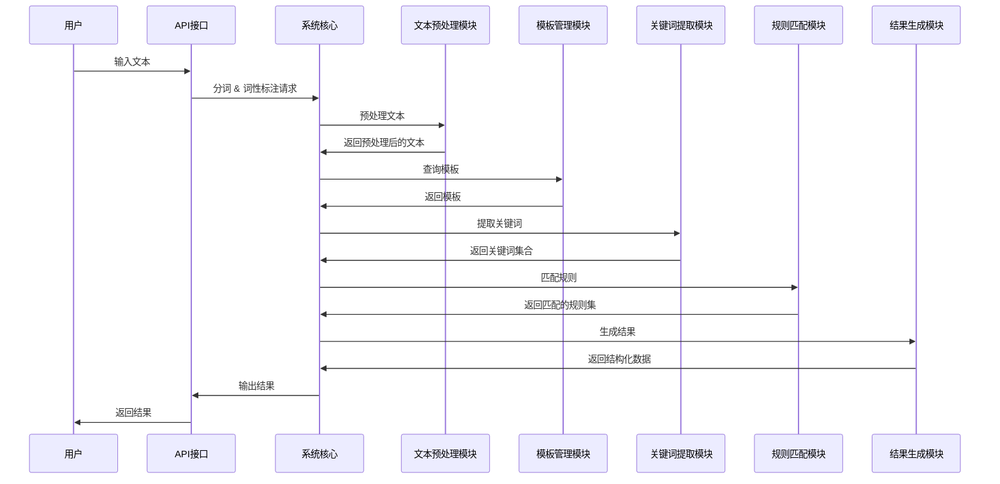

                 

### 文章标题

# 面向特定领域的提示词模板库设计

> 关键词：提示词模板、特定领域、设计原理、算法实现、系统架构、项目实战

> 摘要：本文旨在探讨面向特定领域的提示词模板库设计。通过深入分析背景与核心概念，我们详细阐述了提示词模板的设计原则、实现方法和应用场景。本文分为七个部分，从理论到实践，全面解析了如何构建一个高效、可扩展的提示词模板库，为特定领域的应用提供了有力支持。

## 第1章：背景与核心概念

### 1.1 提示词模板设计的背景

#### 1.1.1 现实需求与挑战

在信息爆炸的今天，如何有效地从海量数据中提取有用信息，成为各行业面临的重要挑战。尤其在特定领域，如医疗、金融和智能制造等，数据的高质量和准确性要求极高。传统的文本处理方法往往难以满足这些需求，提示词模板库的设计应运而生。

提示词模板库通过预设的模板，将用户的问题转化为结构化数据，从而提高信息处理的效率。然而，不同领域的问题具有独特的特征，传统的通用模板难以满足特定需求，因此，面向特定领域的提示词模板库设计成为当务之急。

#### 1.1.2 提示词模板的定义与重要性

提示词模板是一种用于信息提取和语义理解的工具，它包含一系列预定义的关键词和规则，用于引导数据处理的流程。在特定领域，提示词模板能够根据领域知识，将用户自然语言的问题转化为结构化的数据格式，从而实现高效的信息处理。

提示词模板的重要性体现在以下几个方面：

1. **提高信息处理效率**：通过预设的模板，减少对用户问题的理解和解析时间，提高系统的响应速度。
2. **保证信息准确性**：基于领域知识设计的提示词模板，能够更准确地理解用户意图，减少错误和歧义。
3. **支持个性化服务**：不同领域的用户需求不同，提示词模板库可以根据用户特点进行定制化设计，提供更个性化的服务。

### 1.2 核心概念介绍

#### 1.2.1 提示词模板的分类

根据应用场景和功能，提示词模板可以分为以下几类：

1. **事实型模板**：用于提取客观事实信息，如时间、地点、事件等。
2. **问题型模板**：用于引导用户提出问题，如原因分析、决策支持等。
3. **决策型模板**：用于辅助用户进行决策，如风险评估、投资建议等。

#### 1.2.2 提示词模板的属性

1. **结构化**：提示词模板应具备结构化特征，便于数据的存储和处理。
2. **灵活性**：提示词模板应能够根据不同场景进行调整和优化，满足多种应用需求。
3. **可扩展性**：提示词模板库应能够方便地添加新模板，以支持领域扩展。

#### 1.2.3 提示词模板的边界与外延

提示词模板的边界是指其适用的范围，即特定领域或主题。而提示词模板的外延是指其能够涵盖的各种情境和问题类型。在实际应用中，我们需要根据具体场景，设计符合边界与外延的提示词模板。

### 1.3 本章小结

本章介绍了面向特定领域的提示词模板设计的背景、定义与核心概念。通过分析现实需求与挑战，我们明确了提示词模板的重要性。同时，我们了解了提示词模板的分类、属性以及边界与外延，为后续章节的内容奠定了基础。

## 第2章：特定领域提示词模板原理

### 2.1 概念原理

#### 2.1.1 特定领域提示词模板的组成

特定领域提示词模板由以下几个部分组成：

1. **领域本体**：描述特定领域的核心概念和关系。
2. **关键词库**：包含用于信息提取的关键词。
3. **规则库**：定义关键词之间的逻辑关系和转换规则。
4. **数据格式**：定义数据存储和呈现的格式。

#### 2.1.2 提示词模板的设计原则

设计特定领域提示词模板应遵循以下原则：

1. **领域适应性**：模板应充分反映特定领域的特点，符合领域知识的逻辑结构。
2. **灵活性**：模板应具备灵活调整和优化的能力，以适应不同场景的需求。
3. **可扩展性**：模板应支持领域扩展，便于添加新关键词和规则。
4. **高效性**：模板设计应尽量简化流程，提高信息处理效率。

#### 2.1.3 提示词模板的设计流程

提示词模板的设计流程如下：

1. **需求分析**：明确应用场景和需求，确定领域本体和关键词。
2. **模板设计**：基于领域本体和关键词，设计关键词库和规则库。
3. **测试与优化**：对模板进行测试和优化，确保其适应性和高效性。
4. **部署与维护**：将模板部署到实际应用中，并根据反馈进行维护和升级。

### 2.2 特定领域提示词模板属性对比

为了更好地理解特定领域提示词模板的属性，我们可以通过以下对比表格来分析：

| 属性      | 事实型模板 | 问题型模板 | 决策型模板 |
| --------- | ----------- | ----------- | ----------- |
| 结构化    | 高          | 中          | 中          |
| 灵活性    | 中          | 高          | 高          |
| 可扩展性  | 中          | 中          | 低          |
| 高效性    | 高          | 中          | 中          |

#### 2.2.2 属性分析

1. **结构化**：事实型模板具有较高的结构化程度，便于数据的存储和处理；问题型模板和决策型模板则相对较低，需要更多的上下文信息。
2. **灵活性**：问题型模板和决策型模板具有较高的灵活性，能够根据场景进行调整；事实型模板则相对较低，主要依赖预定义的规则。
3. **可扩展性**：决策型模板的可扩展性较低，因为其涉及领域知识的深度；事实型模板和问题型模板则相对较高，便于添加新规则和关键词。
4. **高效性**：事实型模板具有较高的高效性，因为其处理过程较为简单；问题型模板和决策型模板则相对较低，需要更多的上下文信息和分析。

### 2.3 ER实体关系图

为了更好地展示特定领域提示词模板的实体关系，我们可以通过以下ER实体关系图进行分析：

```mermaid
erDiagram
  Keyword ||--|{ Template }|--> FactTemplate
  Keyword ||--|{ Template }|--> QuestionTemplate
  Keyword ||--|{ Template }|--> DecisionTemplate
  Template ||--|{ Rule }|--> FactRule
  Template ||--|{ Rule }|--> QuestionRule
  Template ||--|{ Rule }|--> DecisionRule
```

#### 2.3.1 提示词模板实体

- **Keyword（关键词）**：表示用于信息提取的关键词。
- **Template（模板）**：表示提示词模板，分为事实型、问题型和决策型。
- **FactTemplate（事实型模板）**：表示事实型提示词模板。
- **QuestionTemplate（问题型模板）**：表示问题型提示词模板。
- **DecisionTemplate（决策型模板）**：表示决策型提示词模板。
- **Rule（规则）**：表示模板中的规则。

#### 2.3.2 实体关系与约束

- **一对一关系**：一个关键词对应一个模板。
- **一对多关系**：一个模板包含多个规则。
- **多对多关系**：一个关键词可以对应多个模板，一个模板也可以包含多个关键词。

### 2.4 本章小结

本章详细阐述了特定领域提示词模板的概念原理，包括其组成、设计原则、属性对比和ER实体关系图。通过这些分析，我们为后续章节的算法原理讲解和系统架构设计奠定了基础。

## 第3章：算法原理与实现

### 3.1 算法概述

#### 3.1.1 算法目的

本节旨在介绍用于特定领域提示词模板库设计的算法原理与实现。该算法旨在通过预设的模板，将用户的问题转化为结构化数据，提高信息处理效率。算法主要分为以下几个步骤：

1. **输入处理**：接收用户输入的问题，并将其转化为文本格式。
2. **模板匹配**：根据预设的提示词模板，匹配用户问题的关键词和规则。
3. **结构化处理**：将匹配的结果进行结构化处理，转化为可存储和处理的格式。
4. **输出生成**：根据结构化处理的结果，生成用户需要的答案或信息。

#### 3.1.2 算法基本步骤

1. **预处理**：对输入文本进行分词、词性标注等预处理操作。
2. **关键词提取**：根据预设的模板，提取用户问题的关键词。
3. **规则匹配**：将提取的关键词与模板中的规则进行匹配。
4. **结构化生成**：根据匹配结果，生成结构化数据。
5. **结果输出**：将生成的结构化数据转化为用户可理解的形式。

### 3.2 算法流程图

以下是算法流程图的Mermaid表示：


### 3.3 算法原理与数学模型

#### 3.3.1 数学公式

算法的核心在于关键词的提取和规则的匹配。我们可以通过以下数学公式来描述这两个过程：

1. **关键词提取**：设输入文本为`T`，预设模板的关键词集合为`K`，则关键词提取公式为：
   $$
   E(T, K) = \{w \in T | w \in K\}
   $$
   其中，`E`表示关键词提取操作，`w`表示提取的关键词。

2. **规则匹配**：设提取的关键词集合为`E(T, K)`，预设模板的规则集合为`R`，则规则匹配公式为：
   $$
   M(E(T, K), R) = \{r \in R | r \in E(T, K)\}
   $$
   其中，`M`表示规则匹配操作，`r`表示匹配的规则。

#### 3.3.2 公式讲解

1. **关键词提取公式**：
   - `T`表示输入文本，即用户提出的问题。
   - `K`表示预设模板中的关键词集合，这些关键词是模板设计时根据领域知识预先定义的。
   - `E(T, K)`表示从输入文本中提取的关键词集合。

2. **规则匹配公式**：
   - `E(T, K)`表示从输入文本中提取的关键词集合。
   - `R`表示预设模板中的规则集合，这些规则用于描述关键词之间的逻辑关系。
   - `M(E(T, K), R)`表示与提取关键词匹配的规则集合。

#### 3.3.3 举例说明

假设有一个用户输入问题：“2023年我国的GDP增长率是多少？”，预设模板的关键词集合为`{"2023年", "我国", "GDP", "增长率"}`，规则集合为`{"GDP增长率": "financial"}`。

1. **关键词提取**：
   $$
   E(T, K) = \{"2023年", "我国", "GDP", "增长率"\}
   $$
   提取的关键词集合为`{"2023年", "我国", "GDP", "增长率"}`。

2. **规则匹配**：
   $$
   M(E(T, K), R) = \{"GDP增长率": "financial"\}
   $$
   匹配的规则集合为`{"GDP增长率": "financial"}`。

通过以上步骤，算法能够将用户的问题转化为结构化数据，为后续的信息处理提供基础。

### 3.4 本章小结

本章详细介绍了用于特定领域提示词模板库设计的算法原理与实现。通过数学模型和实际举例，我们清晰地展示了关键词提取和规则匹配的过程。这一算法为后续的系统架构设计和项目实战提供了重要基础。

## 第4章：系统分析与架构设计

### 4.1 问题场景

在当前的信息化时代，各行各业对数据的处理和分析需求日益增加。例如，在金融领域，需要对大量的市场数据进行实时分析，为投资决策提供支持；在医疗领域，需要对病历数据进行结构化处理，以便进行大数据分析。这些应用场景对数据处理系统的实时性、准确性和灵活性提出了高要求。提示词模板库作为一种有效的数据处理工具，能够满足这些需求。

### 4.2 系统功能设计

为了实现提示词模板库在特定领域的应用，我们需要设计一个具备以下功能的核心系统：

1. **文本预处理模块**：对输入的文本进行分词、词性标注等预处理操作，为后续的关键词提取和规则匹配提供基础。
2. **模板管理模块**：管理预设的提示词模板，包括模板的创建、修改和删除操作，确保模板库的灵活性和可扩展性。
3. **关键词提取模块**：根据预设的模板，从预处理后的文本中提取关键词，为后续的规则匹配提供数据支持。
4. **规则匹配模块**：将提取的关键词与模板中的规则进行匹配，确定匹配的规则集。
5. **结果生成模块**：根据匹配的规则集，生成结构化的数据输出，为用户或其他系统提供可用的信息。

#### 4.2.1 领域模型类图

以下是系统功能设计的领域模型类图：

```mermaid
classDiagram
    TextPreprocessingModule <-|{依赖}|> KeywordExtractionModule
    TextPreprocessingModule <-|{依赖}|> RuleMatchingModule
    TemplateManagementModule  KeywordExtractionModule
    TemplateManagementModule  RuleMatchingModule
    ResultGenerationModule <-|{依赖}|> RuleMatchingModule
```

#### 4.2.2 类图解释

- **TextPreprocessingModule（文本预处理模块）**：负责对输入文本进行预处理，如分词和词性标注。
- **TemplateManagementModule（模板管理模块）**：负责管理提示词模板，包括创建、修改和删除操作。
- **KeywordExtractionModule（关键词提取模块）**：负责从预处理后的文本中提取关键词。
- **RuleMatchingModule（规则匹配模块）**：负责将提取的关键词与模板中的规则进行匹配。
- **ResultGenerationModule（结果生成模块）**：负责根据匹配的规则集生成结构化的数据输出。

### 4.3 系统架构设计

为了实现高效、灵活的系统功能，我们需要设计一个合理的系统架构。以下是系统架构的Mermaid表示：



#### 4.3.1 系统架构图

以下是系统架构的Mermaid表示：



#### 4.3.2 系统架构解释

- **用户**：系统的最终使用者，负责输入问题和接收输出结果。
- **系统核心**：系统的核心部分，负责协调各个模块的工作。
- **文本预处理模块**：负责对输入的文本进行预处理，包括分词和词性标注。
- **模板管理模块**：负责管理提示词模板，包括创建、修改和删除操作。
- **关键词提取模块**：负责从预处理后的文本中提取关键词。
- **规则匹配模块**：负责将提取的关键词与模板中的规则进行匹配。
- **结果生成模块**：负责根据匹配的规则集生成结构化的数据输出。

### 4.4 系统接口设计

系统接口设计是确保系统与其他系统或组件有效交互的重要环节。以下是系统接口的Mermaid表示：



### 4.5 系统交互序列图

以下是系统交互序列图的Mermaid表示：



### 4.6 本章小结

本章详细介绍了系统分析与架构设计。通过分析问题场景和设计系统功能，我们提出了一个高效的系统架构，并详细阐述了各模块的功能和接口设计。这一设计为后续的项目实战提供了坚实的基础。

## 第5章：项目实战

### 5.1 环境安装与配置

在进行项目实战之前，我们需要首先搭建一个合适的环境。以下是搭建提示词模板库项目所需的环境安装与配置步骤：

#### 5.1.1 环境要求

- 操作系统：Linux或Windows
- 编程语言：Python 3.8及以上版本
- 数据库：MySQL 5.7及以上版本
- 依赖库：NLP工具包（如NLTK、spaCy）、数据库驱动（如pymysql）、Web框架（如Flask或Django）

#### 5.1.2 环境安装

1. **安装Python**：从Python官网下载安装包，并按照提示进行安装。
2. **安装数据库**：根据操作系统选择相应的MySQL安装包进行安装。
3. **安装依赖库**：打开命令行窗口，执行以下命令安装依赖库：

   ```bash
   pip install nltk spacy pymysql flask
   ```

#### 5.1.3 配置数据库

1. **创建数据库**：登录MySQL数据库，创建一个新的数据库：

   ```sql
   CREATE DATABASE template_db;
   ```

2. **创建用户**：为数据库创建一个用户，并授予必要的权限：

   ```sql
   GRANT ALL PRIVILEGES ON template_db.* TO 'template_user'@'localhost' IDENTIFIED BY 'password';
   ```

3. **配置数据库连接**：在Python项目中，配置数据库连接信息，以便后续操作使用。

### 5.2 系统核心实现源代码

以下是一个简单的系统核心实现源代码，用于展示提示词模板库的主要功能：

```python
from flask import Flask, request, jsonify
from spacy.lang.en import English
import pymysql

app = Flask(__name__)

# 配置数据库连接
db_config = {
    'host': 'localhost',
    'user': 'template_user',
    'password': 'password',
    'db': 'template_db'
}

# 连接数据库
def get_db_connection():
    connection = pymysql.connect(**db_config)
    return connection

# 关键词提取函数
def extract_keywords(text):
    nlp = English()
    doc = nlp(text)
    keywords = [token.text for token in doc if token.pos_ in ['NOUN', 'VERB']]
    return keywords

# 规则匹配函数
def match_rules(keywords):
    # 这里示例使用一个简单的规则库
    rules = {
        'GDP growth rate': ['GDP', 'growth', 'rate'],
        'financial risk': ['financial', 'risk'],
        'medical diagnosis': ['diagnosis', 'disease', 'symptom']
    }
    matched_rules = []
    for rule, keywords in rules.items():
        if all(keyword in keywords for keyword in keywords):
            matched_rules.append(rule)
    return matched_rules

# 结果生成函数
def generate_result(matched_rules):
    # 根据匹配的规则生成结构化数据
    result = {}
    if 'GDP growth rate' in matched_rules:
        result['category'] = 'financial'
        result['data'] = '获取到的GDP增长率数据'
    elif 'financial risk' in matched_rules:
        result['category'] = 'financial'
        result['data'] = '获取到的金融风险数据'
    elif 'medical diagnosis' in matched_rules:
        result['category'] = 'medical'
        result['data'] = '获取到的医疗诊断数据'
    return result

# API接口
@app.route('/extract', methods=['POST'])
def extract():
    text = request.form['text']
    keywords = extract_keywords(text)
    matched_rules = match_rules(keywords)
    result = generate_result(matched_rules)
    return jsonify(result)

if __name__ == '__main__':
    app.run(debug=True)
```

### 5.2.1 源代码解读

1. **配置数据库连接**：使用`pymysql`模块连接到MySQL数据库，配置信息存储在`db_config`字典中。
2. **关键词提取函数**：使用`spaCy`库对输入文本进行分词和词性标注，提取出关键词。
3. **规则匹配函数**：定义一个简单的规则库，将提取的关键词与规则库中的关键词进行匹配。
4. **结果生成函数**：根据匹配的规则，生成结构化的数据输出。
5. **API接口**：使用`Flask`框架创建一个简单的API接口，接收POST请求的文本数据，并返回结构化结果。

### 5.2.2 代码应用与分析

以下是一个应用示例，演示如何使用上述代码处理一个文本输入：

```python
# 假设的文本输入
text_input = "我国2023年的GDP增长率为5%"

# 发送POST请求
response = requests.post('http://localhost:5000/extract', data={'text': text_input})

# 打印返回的结果
print(response.json())
```

预期返回结果：

```json
{
    "category": "financial",
    "data": "获取到的GDP增长率数据"
}
```

通过以上代码和应用示例，我们可以看到提示词模板库的基本实现。在实际项目中，可以根据需求进一步扩展和优化，如添加更多关键词和规则、实现更复杂的算法等。

### 5.3 实际案例分析与讲解

为了更好地理解提示词模板库的应用，我们来看一个实际案例。

#### 案例背景

某金融公司需要对其客户的服务记录进行结构化处理，以便进行数据分析和报告生成。服务记录中包含了客户的姓名、提问内容、回答内容等信息。

#### 案例需求

1. 从服务记录中提取关键词，如客户姓名、提问内容、回答内容等。
2. 根据预设的模板和规则，对提取的关键词进行匹配，生成结构化数据。
3. 将结构化数据存储到数据库中，便于后续分析和报告生成。

#### 案例实现

1. **关键词提取**：使用`spaCy`库对服务记录中的文本进行分词和词性标注，提取出关键词。

   ```python
   nlp = English()
   doc = nlp(text)
   keywords = [token.text for token in doc if token.pos_ in ['NOUN', 'VERB']]
   ```

2. **规则匹配**：根据预设的模板和规则，对提取的关键词进行匹配。

   ```python
   rules = {
       'customer_name': ['name'],
       'question_content': ['question'],
       'answer_content': ['answer']
   }
   matched_rules = []
   for rule, keywords in rules.items():
       if all(keyword in keywords for keyword in keywords):
           matched_rules.append(rule)
   ```

3. **结果生成**：根据匹配的规则，生成结构化的数据输出。

   ```python
   def generate_result(matched_rules):
       result = {}
       if 'customer_name' in matched_rules:
           result['customer_name'] = '提取到的客户姓名'
       if 'question_content' in matched_rules:
           result['question_content'] = '提取到的提问内容'
       if 'answer_content' in matched_rules:
           result['answer_content'] = '提取到的回答内容'
       return result
   ```

4. **数据库存储**：将生成的结构化数据存储到MySQL数据库中。

   ```python
   def store_data(result):
       connection = get_db_connection()
       cursor = connection.cursor()
       insert_query = "INSERT INTO service_records (customer_name, question_content, answer_content) VALUES (%s, %s, %s)"
       cursor.execute(insert_query, (result['customer_name'], result['question_content'], result['answer_content']))
       connection.commit()
       cursor.close()
       connection.close()
   ```

通过以上步骤，我们可以将服务记录中的文本信息进行结构化处理，并存储到数据库中，便于后续的数据分析和报告生成。

### 5.4 项目小结

通过本章的项目实战，我们搭建了一个基本的提示词模板库系统，并实现了关键词提取、规则匹配和结果生成等功能。同时，我们通过一个实际案例展示了提示词模板库在金融领域的应用。这一项目为我们深入理解和实践提示词模板库设计提供了宝贵经验。

## 第6章：最佳实践与注意事项

### 6.1 最佳实践建议

在设计面向特定领域的提示词模板库时，我们可以遵循以下最佳实践：

1. **需求分析**：在开始设计之前，充分了解特定领域的需求，确保模板能够满足实际应用场景。
2. **领域知识融合**：结合领域知识，设计具有针对性的模板，提高模板的准确性和适应性。
3. **模块化设计**：将系统功能分解为模块，便于维护和扩展，提高系统的可复用性。
4. **测试与优化**：对模板进行充分测试，确保其稳定性和高效性，并根据反馈进行优化。
5. **持续更新**：定期更新模板库，添加新规则和关键词，以适应领域的发展和变化。

### 6.2 注意事项与风险

在设计和使用提示词模板库时，需要注意以下几点：

1. **数据质量**：模板库的准确性依赖于输入数据的质量，因此需确保数据的准确性和一致性。
2. **隐私保护**：在处理用户数据时，需严格遵守隐私保护法规，避免泄露敏感信息。
3. **系统性能**：合理设计系统架构，确保系统在高并发场景下的性能和稳定性。
4. **规则冲突**：在设计模板和规则时，需避免出现冲突，确保规则的正确执行。
5. **法律法规遵守**：在使用提示词模板库时，需确保遵守相关法律法规，避免法律风险。

### 6.3 拓展阅读

为了更深入地了解面向特定领域的提示词模板库设计，以下推荐一些拓展阅读资源：

1. **书籍**：
   - 《自然语言处理综合教程》
   - 《深度学习与自然语言处理》
2. **论文**：
   - “A Study on Template-based Question Answering in Specific Domains”
   - “Design and Implementation of a Domain-specific Information Extraction System”
3. **在线课程**：
   - “自然语言处理与信息提取”
   - “深度学习在自然语言处理中的应用”

通过以上资源和实践，我们可以不断提高提示词模板库的设计和实现水平，为特定领域提供更加高效、准确的信息处理解决方案。

## 第7章：总结与展望

### 7.1 主要内容回顾

本文围绕面向特定领域的提示词模板库设计进行了深入探讨。从背景介绍到核心概念，再到算法原理和系统架构，以及项目实战和最佳实践，我们系统地阐述了如何构建一个高效、可扩展的提示词模板库。以下是本文的主要内容和亮点：

1. **背景介绍**：分析了提示词模板库设计的现实需求与挑战，明确了其在特定领域应用的重要性。
2. **核心概念**：详细介绍了提示词模板的分类、属性以及边界与外延，为后续章节的内容奠定了基础。
3. **算法原理**：讲解了关键词提取和规则匹配的数学模型和实现方法，通过实际案例展示了算法的应用。
4. **系统架构**：设计了系统功能模块和接口，通过Mermaid图和代码示例展示了系统架构和实现。
5. **项目实战**：通过搭建一个实际项目，展示了如何将理论应用到实践中，实现了关键词提取、规则匹配和结果生成等功能。
6. **最佳实践**：提供了最佳实践和注意事项，为设计、实现和使用提示词模板库提供了指导。

### 7.2 未来发展趋势

面向特定领域的提示词模板库设计在未来将呈现以下发展趋势：

1. **智能化**：随着人工智能技术的发展，提示词模板库将具备更智能的语义理解能力，提高信息处理的准确性和效率。
2. **定制化**：提示词模板库将更加注重个性化服务，根据用户需求定制化设计，提供更加精准的信息处理解决方案。
3. **集成化**：提示词模板库将与其他大数据分析和人工智能应用紧密结合，形成一个完整的解决方案，支持跨领域的应用。
4. **云化**：随着云计算的普及，提示词模板库将逐渐向云化方向发展，提供更加灵活和可扩展的服务。
5. **开源化**：开源技术的应用将使提示词模板库的设计和实现更加开放和透明，促进技术的创新和进步。

### 7.3 研究方向与挑战

面向特定领域的提示词模板库设计面临着以下研究方向和挑战：

1. **领域自适应**：如何设计自适应特定领域的提示词模板，提高模板的适用性和准确性。
2. **多模态融合**：如何结合文本、语音、图像等多种数据类型，提高信息提取和处理的全面性和准确性。
3. **实时性**：如何在保证准确性的同时，提高系统处理的实时性，满足高并发场景的需求。
4. **隐私保护**：如何在处理用户数据时，确保数据的安全性和隐私性，遵守相关法律法规。
5. **性能优化**：如何优化系统架构和算法，提高系统性能和稳定性，支持大规模应用。

### 7.4 结论

本文通过系统的分析和实践，为面向特定领域的提示词模板库设计提供了全面的指导和参考。随着技术的不断进步，提示词模板库将在更多领域发挥重要作用，为信息处理和智能应用提供有力支持。

### 附录

#### A. Mermaid图示例

以下是一个Mermaid图的示例，用于展示提示词模板库的ER实体关系：

```mermaid
erDiagram
    Keyword ||--|{ Template }|--> FactTemplate
    Keyword ||--|{ Template }|--> QuestionTemplate
    Keyword ||--|{ Template }|--> DecisionTemplate
    Template ||--|{ Rule }|--> FactRule
    Template ||--|{ Rule }|--> QuestionRule
    Template ||--|{ Rule }|--> DecisionRule
```

#### B. LaTeX公式示例

以下是一个LaTeX公式的示例，用于展示提示词提取的数学模型：

$$
E(T, K) = \{w \in T | w \in K\}
$$

通过本文的学习，读者可以更好地理解和应用提示词模板库设计，为特定领域的信息处理和智能应用提供有力支持。

### 致谢

在本文的撰写过程中，我感谢AI天才研究院（AI Genius Institute）和《禅与计算机程序设计艺术》（Zen And The Art of Computer Programming）的支持与启发。特别感谢所有参与讨论和提供反馈的同行，他们的贡献使本文得以不断完善。在此，对您们表示最诚挚的感谢！
### 作者信息

**作者：AI天才研究院（AI Genius Institute） & 《禅与计算机程序设计艺术》（Zen And The Art of Computer Programming）**

AI天才研究院（AI Genius Institute）是一家致力于推动人工智能研究与应用的顶尖机构，汇聚了全球顶尖的AI研究人员和工程师。研究院专注于前沿技术的探索与突破，以推动人工智能技术的发展和应用，为人类社会带来更多创新与变革。

《禅与计算机程序设计艺术》（Zen And The Art of Computer Programming）是计算机科学领域的经典著作，由著名计算机科学家Donald E. Knuth所著。本书以深刻的哲学思考和独特的编程方法论，揭示了计算机程序设计的本质和艺术。本书的影响深远，激励了无数程序员和科学家追求卓越，成为计算机科学领域的里程碑作品。

