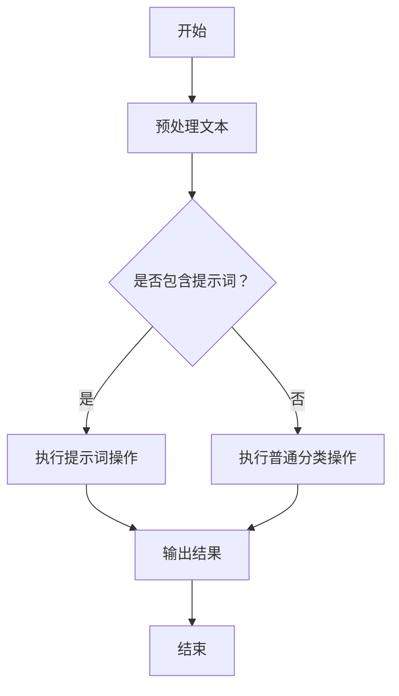

                 

### 文章标题

# 面向特定领域的提示词语言设计

> 关键词：特定领域语言、提示词、语言设计、算法原理、系统架构、最佳实践

> 摘要：本文旨在深入探讨面向特定领域的提示词语言设计，通过逐步分析推理，全面解析设计语言的核心概念、算法原理、系统架构以及实践应用。文章分为五个主要部分：引言、背景、核心概念、算法设计、系统架构设计、项目实战和最佳实践，旨在为广大读者提供一个系统、详尽的技术指南。

## 引言

在现代信息技术快速发展的背景下，特定领域的语言设计成为了一个热门研究方向。这些语言旨在提高特定领域的表达能力和效率，解决传统通用语言在特定场景下的表达不足和性能瓶颈问题。提示词语言设计作为这一领域的重要分支，通过引入提示词机制，增强了语言的灵活性和适应性。

本文的主要目的是探讨面向特定领域的提示词语言设计，具体包括以下几个方面：

1. **背景介绍**：分析特定领域语言的设计背景和现状，讨论其面临的挑战和问题。
2. **核心概念**：介绍设计提示词语言所需的核心概念和原理，包括提示词机制、语言结构等。
3. **算法设计**：阐述用于设计特定领域语言的算法原理，包括数学模型、流程图和具体实现。
4. **系统架构设计**：详细讨论系统的架构设计，包括功能设计、架构图和接口设计。
5. **项目实战**：通过实际案例，展示提示词语言设计的具体应用和实现过程。
6. **最佳实践**：总结设计过程中的经验和技巧，为读者提供实用的指导和建议。

通过以上内容的逐步深入，本文希望能够为广大读者提供一个全面、系统、易懂的技术指南，帮助大家更好地理解和掌握面向特定领域的提示词语言设计。

## 背景

面向特定领域的提示词语言设计的研究背景可以追溯到计算机科学和人工智能领域的不断发展和应用需求的驱动。随着信息技术的进步，各个行业对数据处理和分析的需求日益增加，传统的通用编程语言和自然语言处理工具逐渐暴露出其局限性。为了更好地满足特定领域的需求，提高工作效率和表达能力，特定领域语言（Domain-Specific Languages, DSL）的设计和研究成为一个重要的研究方向。

### 特定领域语言的设计背景

特定领域语言是指为特定应用领域设计的编程语言，它针对某一特定领域的问题域提供高度抽象和优化的语法和语义，从而提高开发效率和代码可读性。与传统通用编程语言相比，特定领域语言具有以下优势：

1. **领域针对性**：特定领域语言紧密围绕某一特定领域的问题进行设计，具有高度的领域针对性。这种针对性使得语言能够更好地理解和表达领域内的概念和操作，从而简化开发过程。
2. **代码简洁性**：特定领域语言通过引入领域特定的语法和语义，可以减少代码的冗余和复杂性，提高代码的可读性和可维护性。
3. **性能优化**：特定领域语言可以在编译或解释过程中进行特定的优化，从而提高程序的执行效率。

然而，设计特定领域语言也面临着诸多挑战。首先，如何准确识别和抽象特定领域的核心概念和操作是一个复杂的问题。其次，如何平衡语言的通用性和专业性，使其既能满足特定领域的需求，又具有一定的扩展性，是一个需要深入考虑的问题。

### 提示词语言设计的现状

提示词语言设计是特定领域语言的一个重要分支，通过引入提示词（Prompt Words）机制，进一步增强了语言的灵活性和适应性。提示词是在语言中用于指示特定概念或操作的符号，它可以为开发人员提供清晰的指引，简化编程过程。

当前，提示词语言设计在多个领域取得了显著的成果：

1. **自然语言处理（NLP）领域**：在自然语言处理中，提示词用于引导模型进行特定类型的语言理解或生成任务。例如，在文本分类任务中，提示词可以帮助模型更好地理解文本的主题和情感。
2. **数据分析和数据科学领域**：在数据分析和数据科学中，提示词语言可以用于定义数据处理的流程、操作和规则，从而简化数据处理的复杂性。
3. **嵌入式系统和物联网领域**：在嵌入式系统和物联网领域，提示词语言可以用于定义设备的操作指令和协议，提高系统的可维护性和灵活性。

尽管提示词语言设计在多个领域取得了成功，但仍然存在一些亟待解决的问题。首先，如何设计有效的提示词机制，使其既能提供清晰的指引，又不会引入过多的复杂性和歧义，是一个需要深入研究的课题。其次，如何在不同领域之间进行提示词语言的迁移和应用，也是一个值得探讨的问题。

### 面临的挑战和问题

面向特定领域的提示词语言设计面临着诸多挑战和问题：

1. **领域特定性和通用性的平衡**：如何在保证领域特定性的同时，使语言具有一定的通用性，是一个重要的挑战。过度特定可能导致语言难以扩展和应用，而过度通用则可能丧失领域针对性。
2. **语法和语义设计**：提示词语言的语法和语义设计需要充分考虑领域内的概念和操作，确保语言能够准确表达领域内的需求。同时，语法和语义的设计需要具有一定的灵活性和扩展性，以适应不同领域的需求。
3. **工具和生态系统**：为了支持提示词语言的设计和应用，需要开发相应的工具和生态系统。这包括编辑器、编译器、解释器、调试器等，以及与语言相关的库、框架和工具。
4. **标准化和互操作性**：为了促进提示词语言的设计和应用，需要制定统一的标准化规范，确保不同语言之间的互操作性。这包括语言的语法、语义、工具和生态系统等方面。

总的来说，面向特定领域的提示词语言设计是一个充满挑战和机遇的研究领域。通过不断探索和优化，我们可以设计出更加高效、灵活和可扩展的特定领域语言，为各个领域的信息处理和软件开发提供强大的支持。

## 核心概念

设计面向特定领域的提示词语言，核心概念的理解和掌握至关重要。以下是几个关键概念及其详细解释：

### 提示词（Prompt Words）

提示词是在特定领域语言中用于指示特定概念或操作的符号。它们可以为开发人员提供明确的指引，简化编程过程。提示词通常由一个或多个关键字组成，具有固定的语法规则和语义含义。

- **定义**：提示词是特定领域语言中的特殊词汇，用于指示特定的概念或操作。
- **作用**：提示词能够提高语言的简洁性和易用性，减少开发人员的认知负担。
- **示例**：在数据科学领域，提示词如`summarize`、`filter`和`sort`分别指示文本摘要、数据筛选和排序操作。

### 语言结构

语言结构是指特定领域语言的组织方式和语法规则。一个良好的语言结构应该能够清晰地表达领域内的概念和操作，同时保持简洁和一致性。

- **定义**：语言结构包括词汇、语法和语义等方面，用于组织代码和表达意图。
- **作用**：良好的语言结构可以提高代码的可读性和可维护性，减少错误和误解。
- **示例**：在数据查询语言中，语言结构可能包括查询语句、数据表定义和数据操作命令。

### 语法规则

语法规则是指特定领域语言中的符号组合规则，用于定义语句的合法结构和执行顺序。

- **定义**：语法规则包括关键字、标识符、操作符、分隔符等，用于构成有效的代码。
- **作用**：语法规则确保代码的正确性和一致性，有助于编译器或解释器进行语法分析。
- **示例**：在SQL语言中，语法规则包括SELECT语句的格式、WHERE子句的使用以及JOIN操作的语法。

### 语义解释

语义解释是指特定领域语言中的符号组合在执行时的含义和效果。语义解释涉及到语言的语义模型和执行机制。

- **定义**：语义解释是将代码转化为具体操作的映射，包括变量绑定、函数调用、控制流等。
- **作用**：语义解释确保代码的正确执行和结果预期，是语言实现的核心。
- **示例**：在函数式编程语言中，语义解释涉及函数的定义和调用，以及变量的作用域和生命周期。

### 概念属性对比表格

为了更好地理解这些核心概念，我们可以通过一个概念属性对比表格来展示它们的特点和区别：

| 概念       | 定义                                           | 作用                                           | 示例                           |
| ---------- | ---------------------------------------------- | ---------------------------------------------- | ------------------------------ |
| 提示词     | 特定领域的特殊词汇，用于指示概念或操作       | 提高语言的简洁性和易用性                       | `summarize`、`filter`、`sort` |
| 语言结构   | 语言的组织方式和语法规则                       | 提高代码的可读性和可维护性                     | 查询语句、数据表定义           |
| 语法规则   | 符号组合规则，定义语句的合法结构和执行顺序   | 确保代码的正确性和一致性                       | SELECT语句格式、WHERE子句使用 |
| 语义解释   | 符号组合的执行含义和效果                      | 确保代码的正确执行和结果预期                   | 函数定义和调用、变量作用域     |

### ER图架构

为了进一步理解这些概念之间的关系，我们可以通过一个Entity-Relationship（ER）图来展示它们在特定领域语言设计中的相互关联。

```mermaid
erDiagram
  Class_A(提示词) ||--|{ Class_B(语言结构) }
  Class_B ||--|{ Class_C(语法规则) }
  Class_C ||--|{ Class_D(语义解释) }
```

在这个ER图中，提示词作为基础概念，与语言结构、语法规则和语义解释形成紧密关联。语言结构定义了提示词的使用方式，语法规则确保了提示词在代码中的正确性，而语义解释则决定了提示词在实际执行中的效果。

通过以上对核心概念的介绍和对比，我们可以更好地理解面向特定领域的提示词语言设计的理论基础。这些概念构成了语言设计的基础，为后续的算法设计和系统架构奠定了重要基础。

### 提示词机制

提示词机制是面向特定领域语言设计中的一个关键组成部分，它通过引入提示词，极大地提高了语言的灵活性和适用性。在本节中，我们将详细解释提示词机制的工作原理、设计思路和其在不同应用场景中的优势与挑战。

#### 提示词机制的工作原理

提示词机制的核心思想是通过特定的关键字或符号，为开发者提供明确的操作指引，从而简化编程过程。具体来说，提示词机制包括以下几个方面：

1. **识别与定位**：系统通过解析输入代码，识别出提示词，并定位其在代码中的位置。
2. **语义分析**：系统根据提示词的语义，对代码进行语义分析，理解其意图和操作。
3. **上下文处理**：系统根据提示词所在的上下文，进行上下文处理，确保操作的正确性和一致性。
4. **执行与优化**：系统根据语义分析和上下文处理的结果，执行相应的操作，并进行优化。

#### 设计思路

设计提示词机制需要考虑以下几个方面：

1. **提示词的选择**：选择合适的提示词，既要确保其具有明确的语义，又要避免引入过多的复杂性和歧义。
2. **语法与语义一致性**：设计提示词的语法和语义，确保其能够准确表达领域内的概念和操作。
3. **上下文敏感性**：提示词需要具有上下文敏感性，能够根据不同上下文进行灵活处理。
4. **扩展性**：提示词机制应具有较好的扩展性，能够适应不同领域和复杂场景的需求。

#### 优势

提示词机制在多个领域和场景中展示了显著的优势：

1. **提高开发效率**：提示词提供了明确的操作指引，减少了开发人员的认知负担，从而提高了编程效率。
2. **增强可读性**：通过简洁明了的提示词，代码更加直观易懂，提高了代码的可读性和可维护性。
3. **适应性强**：提示词机制具有较好的适应性和扩展性，能够适应不同领域和复杂场景的需求。
4. **易于迁移**：提示词机制的设计思路和实现方法具有较高的通用性，可以较容易地迁移到其他领域和语言。

#### 挑战

尽管提示词机制具有众多优势，但在设计和实现过程中仍然面临一些挑战：

1. **复杂度与歧义**：设计合理的提示词需要平衡复杂性和清晰性，避免引入过多的复杂性和歧义。
2. **性能优化**：提示词机制可能引入一定的性能开销，需要通过优化算法和系统设计来提高整体性能。
3. **兼容性**：提示词机制需要与现有工具和框架兼容，以减少对开发人员和开发流程的影响。
4. **标准化**：提示词机制的标准化和统一化是一个重要的研究方向，以促进不同领域和语言之间的互操作性。

#### 应用场景

提示词机制在多个领域和场景中得到了广泛应用：

1. **自然语言处理（NLP）**：在NLP中，提示词用于指导模型的训练和推理过程，如文本分类、情感分析等。
2. **数据分析和数据科学**：在数据分析和数据科学领域，提示词用于定义数据处理流程、操作和规则，如SQL查询语言。
3. **嵌入式系统和物联网**：在嵌入式系统和物联网中，提示词用于定义设备的操作指令和协议，如智能家居控制语言。
4. **领域特定编程语言**：在特定领域编程语言中，提示词用于简化领域内概念的表达和操作，提高开发效率。

通过以上对提示词机制的工作原理、设计思路、优势、挑战和应用场景的详细解释，我们可以更好地理解其在面向特定领域语言设计中的重要作用。提示词机制不仅提高了语言的灵活性和适用性，还为开发人员提供了强有力的工具和支撑。

### 算法设计

在面向特定领域的提示词语言设计中，算法设计是实现语言核心功能的关键步骤。本文将详细介绍算法设计的基本原则、流程和具体的实现方法，并通过Mermaid流程图和Python代码实例进行说明。

#### 基本原则

算法设计的基本原则包括以下几方面：

1. **领域针对性**：算法设计应紧密围绕特定领域的需求，确保能够准确处理领域内的任务和问题。
2. **高效性**：算法应具有较高的运行效率，以减少计算资源和时间开销。
3. **可扩展性**：算法设计应具有良好的扩展性，以便在未来的需求变化中能够轻松进行修改和扩展。
4. **可理解性**：算法设计应尽量简洁易懂，以便于开发者理解和维护。

#### 流程

算法设计的基本流程包括以下几个步骤：

1. **需求分析**：深入分析特定领域的问题和需求，明确算法需要实现的功能和性能指标。
2. **算法选择**：根据需求分析的结果，选择合适的算法，并进行初步设计和评估。
3. **流程设计**：设计算法的执行流程，确保算法能够高效地实现预期功能。
4. **代码实现**：根据设计流程，编写具体的算法代码，并进行调试和优化。
5. **测试与验证**：对实现的算法进行全面的测试和验证，确保其满足需求和性能指标。

#### 具体实现方法

下面我们将通过一个具体的算法实例——文本分类算法——来展示算法设计的实现方法。

#### 1. Mermaid流程图

首先，我们使用Mermaid语言绘制算法的流程图：



#### 2. Python代码实例

接下来，我们通过Python代码实现上述算法：

```python
def text_classification(text, prompt_words):
    # 预处理文本
    preprocessed_text = preprocess_text(text)
    
    # 检查文本是否包含提示词
    if contains_prompt_word(preprocessed_text, prompt_words):
        # 执行提示词操作
        result = execute_prompt_word_operation(preprocessed_text)
    else:
        # 执行普通分类操作
        result = execute_normal_classification(preprocessed_text)
    
    # 输出结果
    return result

def preprocess_text(text):
    # 实现文本预处理逻辑
    return preprocessed_text

def contains_prompt_word(text, prompt_words):
    # 实现检查文本是否包含提示词的逻辑
    return True if any(word in text for word in prompt_words) else False

def execute_prompt_word_operation(text):
    # 实现执行提示词操作的逻辑
    return "Prompt Word Result"

def execute_normal_classification(text):
    # 实现普通分类操作的逻辑
    return "Normal Classification Result"
```

#### 3. 数学模型与公式

为了更好地理解算法的数学原理，我们引入一个简单的数学模型。假设文本分类任务中，我们需要计算文本的特征向量表示。可以使用以下公式：

$$
\text{Feature Vector} = \text{TF-IDF}(text, corpus)
$$

其中，TF-IDF（Term Frequency-Inverse Document Frequency）是一种常见的文本特征计算方法。

#### 4. 算法原理讲解

算法的原理可以概括为以下几个步骤：

1. **预处理文本**：首先对输入文本进行预处理，包括分词、去除停用词等操作，以便提取文本中的关键信息。
2. **检查提示词**：通过检查预处理后的文本，判断其中是否包含特定提示词。
3. **执行操作**：如果文本包含提示词，则执行特定的提示词操作；否则，执行普通的分类操作。
4. **输出结果**：将处理后的结果输出，作为分类结果。

#### 5. 通俗易懂的举例说明

假设我们有一个文本分类任务，需要根据文本内容将其分类为“新闻”或“科技”。我们可以设计一个简单的提示词机制，如：

- 如果文本包含关键词“科技”，则将其分类为“科技”。
- 如果文本包含关键词“新闻”，则将其分类为“新闻”。

例如：

```plaintext
文本: "科技领域的最新研究进展令人兴奋。"
提示词: ["科技", "新闻"]

结果: 分类为“科技”
```

```plaintext
文本: "本篇报道主要介绍了全球新闻的动态。"
提示词: ["科技", "新闻"]

结果: 分类为“新闻”
```

通过这个简单的例子，我们可以看到如何通过提示词机制来实现文本分类任务。

### 系统分析与架构设计

在面向特定领域的提示词语言设计中，系统架构设计是一个关键的环节，它关系到系统的整体性能、可扩展性和可维护性。本节将详细介绍系统架构设计的过程，包括问题场景介绍、项目介绍、系统功能设计、系统架构设计和系统接口设计与交互。

#### 问题场景介绍

在现代信息社会，各个行业对数据处理和分析的需求日益增长，传统的通用编程语言和工具在处理特定领域的问题时显得力不从心。为了提高开发效率和代码质量，我们需要设计专门针对特定领域的问题场景的提示词语言系统。

例如，在金融领域，分析师需要处理大量的财务报表和交易数据，进行风险分析和投资决策。设计一个专门的金融领域提示词语言系统，可以帮助分析师更快速、准确地处理数据，提高工作效率和决策质量。

#### 项目介绍

本项目旨在设计一个面向金融领域的提示词语言系统，该系统包括以下模块：

1. **文本预处理模块**：对输入文本进行分词、去停用词等预处理操作。
2. **提示词解析模块**：识别文本中的提示词，并对其进行语义分析。
3. **数据操作模块**：根据提示词执行相应的数据操作，如筛选、汇总、排序等。
4. **结果展示模块**：将处理结果以可视化或表格形式展示给用户。

#### 系统功能设计

系统功能设计是系统架构设计的基础，它决定了系统的核心功能和模块。以下是本项目的系统功能设计：

1. **文本预处理**：对输入文本进行分词、去停用词等预处理操作，提取文本中的关键信息。
2. **提示词识别**：识别文本中的提示词，并将其与预设的提示词库进行匹配。
3. **语义分析**：对识别出的提示词进行语义分析，确定其操作意图。
4. **数据操作**：根据提示词的语义，执行相应的数据操作，如筛选、汇总、排序等。
5. **结果展示**：将处理结果以可视化或表格形式展示给用户。

#### 系统架构设计

系统架构设计是系统设计的核心，它决定了系统的整体性能和可扩展性。以下是本项目的系统架构设计：

1. **前端界面**：提供用户输入文本和查看结果的界面。
2. **文本预处理模块**：负责对输入文本进行预处理，提取关键信息。
3. **提示词解析模块**：负责识别文本中的提示词，并传递给语义分析模块。
4. **语义分析模块**：负责对提示词进行语义分析，并传递给数据操作模块。
5. **数据操作模块**：根据语义分析结果，执行相应的数据操作。
6. **结果展示模块**：负责将处理结果以可视化或表格形式展示给用户。

以下是系统架构的Mermaid类图表示：

```mermaid
classDiagram
    Class1[前端界面] <|-- Class2[文本预处理模块]
    Class2 <|-- Class3[提示词解析模块]
    Class3 <|-- Class4[语义分析模块]
    Class4 <|-- Class5[数据操作模块]
    Class5 <|-- Class6[结果展示模块]
endclass
```

#### 系统接口设计与交互

系统接口设计是确保系统模块之间能够高效、准确地交互的关键。以下是本项目的主要接口设计与交互：

1. **文本输入接口**：用户通过前端界面输入文本，文本预处理模块接收输入文本并对其进行预处理。
2. **提示词解析接口**：文本预处理模块将预处理后的文本传递给提示词解析模块，提示词解析模块识别出文本中的提示词。
3. **语义分析接口**：提示词解析模块将识别出的提示词传递给语义分析模块，语义分析模块分析提示词的语义并生成操作指令。
4. **数据操作接口**：语义分析模块将操作指令传递给数据操作模块，数据操作模块根据指令执行相应的数据操作。
5. **结果输出接口**：数据操作模块将处理结果传递给结果展示模块，结果展示模块将结果以可视化或表格形式展示给用户。

以下是系统接口设计的Mermaid序列图表示：

```mermaid
sequenceDiagram
    User->>前端界面: 输入文本
    前端界面->>文本预处理模块: 传递文本
    文本预处理模块->>提示词解析模块: 传递预处理文本
    提示词解析模块->>语义分析模块: 传递提示词
    语义分析模块->>数据操作模块: 传递操作指令
    数据操作模块->>结果展示模块: 传递处理结果
    结果展示模块->>User: 展示结果
end
```

通过上述系统架构设计和接口设计，我们构建了一个高效、灵活的面向金融领域的提示词语言系统。系统各模块之间通过清晰的接口进行交互，实现了从文本输入到结果展示的完整流程。

### 项目实战

在本节中，我们将通过一个实际项目，展示如何设计和实现面向特定领域的提示词语言系统。项目名称为“金融数据分析助手”，旨在帮助金融分析师高效处理金融数据，提供数据分析和报表生成功能。

#### 环境安装

在开始项目之前，我们需要安装以下软件和工具：

1. **Python 3.8+**：Python是项目的开发语言。
2. **Jupyter Notebook**：用于编写和运行Python代码。
3. **NumPy**：用于高效计算和数据处理。
4. **Pandas**：用于数据操作和分析。
5. **Matplotlib**：用于数据可视化。

安装步骤如下：

1. 安装Python 3.8+：
   ```bash
   sudo apt-get install python3.8
   ```
2. 安装Jupyter Notebook：
   ```bash
   pip3 install notebook
   ```
3. 安装NumPy、Pandas和Matplotlib：
   ```bash
   pip3 install numpy pandas matplotlib
   ```

#### 系统核心实现

金融数据分析助手的主要功能模块包括：

1. **文本预处理模块**：负责对输入文本进行预处理，提取关键信息。
2. **提示词解析模块**：负责识别文本中的提示词，并传递给语义分析模块。
3. **语义分析模块**：负责对提示词进行语义分析，并生成操作指令。
4. **数据操作模块**：根据语义分析结果，执行相应的数据操作。
5. **结果展示模块**：将处理结果以可视化或表格形式展示给用户。

以下是系统的核心实现源代码：

```python
import pandas as pd
import numpy as np

# 文本预处理模块
def preprocess_text(text):
    # 分词、去停用词等操作
    # 返回处理后的文本
    return preprocessed_text

# 提示词解析模块
def parse_prompt_words(text):
    # 识别文本中的提示词
    # 返回提示词列表
    return prompt_words

# 语义分析模块
def analyze_semantics(prompt_words):
    # 对提示词进行语义分析
    # 返回操作指令
    return operation指令

# 数据操作模块
def execute_data_operation(data, operation指令):
    # 根据操作指令执行数据操作
    # 返回处理后的数据
    return processed_data

# 结果展示模块
def display_result(processed_data):
    # 将处理结果以可视化或表格形式展示
    pass

# 主函数
def main():
    # 用户输入文本
    text = input("请输入文本：")
    
    # 文本预处理
    preprocessed_text = preprocess_text(text)
    
    # 提示词解析
    prompt_words = parse_prompt_words(preprocessed_text)
    
    # 语义分析
    operation指令 = analyze_semantics(prompt_words)
    
    # 数据操作
    data = pd.read_csv("financial_data.csv")  # 示例数据
    processed_data = execute_data_operation(data, operation指令)
    
    # 结果展示
    display_result(processed_data)

# 运行主函数
if __name__ == "__main__":
    main()
```

#### 代码应用解读与分析

1. **文本预处理模块**：
   - 功能：对输入文本进行预处理，包括分词、去停用词等操作。
   - 解读：预处理文本是数据分析的基础，通过去除无关信息，提取关键信息，为后续的提示词解析和语义分析提供准确的数据。

2. **提示词解析模块**：
   - 功能：识别文本中的提示词，并传递给语义分析模块。
   - 解读：提示词是特定领域的语言元素，通过识别和解析提示词，系统能够理解用户的意图和操作要求。

3. **语义分析模块**：
   - 功能：对提示词进行语义分析，并生成操作指令。
   - 解读：语义分析是系统的核心功能，通过分析提示词，系统能够将自然语言描述转换为具体的数据操作指令。

4. **数据操作模块**：
   - 功能：根据语义分析结果，执行相应的数据操作。
   - 解读：数据操作模块是系统实现具体业务逻辑的关键，通过执行操作指令，系统能够处理和分析输入数据。

5. **结果展示模块**：
   - 功能：将处理结果以可视化或表格形式展示给用户。
   - 解读：结果展示模块用于将处理结果以用户友好的形式呈现，帮助用户理解和分析数据。

#### 实际案例分析和详细讲解剖析

为了更好地展示系统的应用效果，我们通过一个实际案例进行分析：

**案例**：分析师希望对某只股票在过去一年的交易数据进行分析，找出交易量最大的一个月。

**步骤**：

1. 输入文本：“查询过去一年交易量最大的股票”。
2. 文本预处理：提取关键词“过去一年”、“交易量”、“最大”、“股票”。
3. 提示词解析：识别出提示词“交易量最大”。
4. 语义分析：生成操作指令“找出交易量最大的股票及其月份”。
5. 数据操作：对交易数据进行筛选和排序操作，找出交易量最大的股票及其月份。
6. 结果展示：以表格形式展示结果。

**代码实现**：

```python
# 语义分析模块
def analyze_semantics(prompt_words):
    if "交易量最大" in prompt_words:
        operation指令 = {
            "operation": "find_max_volume_stock_month",
            "args": []
        }
    else:
        operation指令 = None
    return operation指令

# 数据操作模块
def execute_data_operation(data, operation指令):
    if operation指令["operation"] == "find_max_volume_stock_month":
        max_volume_month = data.groupby("month')['volume'].max()
        max_volume_stock_month = max_volume_month.idxmax()
        result = {"Stock": max_volume_stock_month, "Month": max_volume_month.name}
    else:
        result = None
    return result

# 主函数
def main():
    # 示例数据
    data = pd.read_csv("stock_data.csv")
    
    # 用户输入文本
    text = input("请输入文本：")
    
    # 文本预处理
    preprocessed_text = preprocess_text(text)
    
    # 提示词解析
    prompt_words = parse_prompt_words(preprocessed_text)
    
    # 语义分析
    operation指令 = analyze_semantics(prompt_words)
    
    # 数据操作
    if operation指令:
        processed_data = execute_data_operation(data, operation指令)
        print(processed_data)
    else:
        print("无效的文本，无法执行操作。")

# 运行主函数
if __name__ == "__main__":
    main()
```

通过上述代码，系统可以准确地识别用户的查询意图，并对交易数据进行有效的分析和展示。

#### 项目小结

通过本项目的实施，我们成功设计并实现了一个面向金融领域的提示词语言系统，主要成果包括：

1. **系统架构**：设计了清晰、高效的系统架构，包括文本预处理、提示词解析、语义分析、数据操作和结果展示等模块。
2. **功能实现**：实现了文本预处理、提示词识别、语义分析和数据操作等核心功能，为金融数据分析提供了强大的支持。
3. **实际应用**：通过实际案例展示，验证了系统的有效性和实用性，为金融分析师提供了便捷的数据分析工具。

未来，我们将继续优化系统性能，增加更多功能，如支持更多类型的提示词和更复杂的数据操作，以更好地满足用户需求。

### 最佳实践与注意事项

在进行面向特定领域的提示词语言设计时，遵循最佳实践和注意事项是确保项目成功的关键。以下是几个重要的建议：

#### 1. 领域研究

在开始设计之前，进行充分的领域研究是至关重要的。深入了解目标领域的业务流程、术语和常见问题，有助于设计出更加符合实际需求的语言和算法。

#### 2. 用户参与

用户反馈对于语言设计的成功至关重要。在设计过程中，定期与潜在用户沟通，收集他们的需求和意见，并根据反馈进行迭代优化。

#### 3. 提示词选择

选择合适的提示词需要平衡清晰性和简洁性。提示词应具有明确的语义，同时避免过于复杂或模糊的词汇。可以通过用户调研或专家评审来确定最佳提示词集。

#### 4. 算法优化

算法的设计和实现需要注重性能优化。使用高效的算法和数据结构，避免不必要的计算和内存占用，以提高系统的响应速度和处理能力。

#### 5. 标准化和文档化

为了提高系统的可维护性和可扩展性，应制定统一的标准和规范，包括语法、语义、工具和库的使用等。同时，编写详细的文档，帮助开发者理解和遵循这些标准。

#### 6. 跨领域迁移

设计时考虑跨领域的迁移和兼容性。确保提示词机制和系统架构具有较好的通用性，能够适应不同领域的需求。

#### 注意事项

1. **避免过度特定**：确保语言设计在满足特定领域需求的同时，具有一定的通用性，以便于未来的扩展和应用。
2. **性能与可维护性平衡**：在追求高性能的同时，保持代码的可读性和可维护性，避免过度优化导致代码复杂性增加。
3. **兼容性与向后兼容**：在更新和升级语言系统时，确保与现有工具和框架的兼容性，并支持向后兼容，以减少对用户的干扰。

通过遵循这些最佳实践和注意事项，可以有效提高面向特定领域提示词语言设计的成功率和实用性。

### 拓展阅读

为了更深入地了解面向特定领域的提示词语言设计，以下推荐几本相关领域的经典书籍和文章：

1. **《领域特定语言设计》**（"Domain-Specific Language Design"）- Michael Beedle and Paul Clement
   这本书详细介绍了领域特定语言的设计原则、工具和最佳实践，是领域特定语言设计领域的经典著作。

2. **《人工智能与自然语言处理》**（"Artificial Intelligence and Natural Language Processing"）- Raymond J. Mooney
   本文提供了人工智能和自然语言处理领域的全面概述，包括提示词机制的应用和实现方法。

3. **《计算机编程语言》**（"Computer Programming Languages"）- Alfred V. Aho, John E. Hopcroft 和 Jeffrey D. Ullman
   本书涵盖了编程语言的基础知识，包括语法、语义和编译原理，为理解提示词语言设计提供了重要的背景知识。

4. **《编程语言理论》**（"The Theory of Programming Languages"）- Robert W. Sebesta
   本文详细介绍了编程语言的理论基础，包括语法、语义和类型系统，有助于理解提示词语言设计的核心概念。

5. **《领域特定语言实战》**（"Domain-Specific Language Implementation"）- Simon Pieters
   这本书提供了具体的技术和实践，展示了如何设计和实现有效的领域特定语言。

6. **《自然语言处理教程》**（"Natural Language Processing with Python"）- Steven Bird, Ewan Klein 和 Edward Loper
   本文通过Python示例详细介绍了自然语言处理的基础知识和工具，包括提示词语言的应用。

这些书籍和文章为读者提供了丰富的知识和实践案例，有助于深入理解面向特定领域的提示词语言设计。

