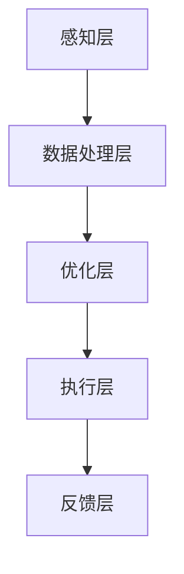
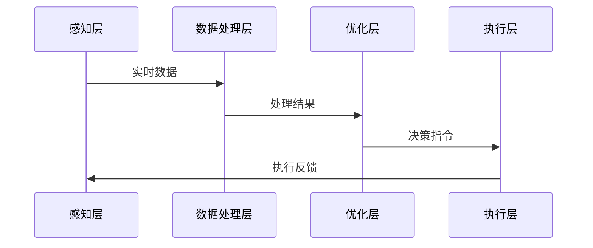

                 

### 文章标题

#### **面向群体智能的提示词协同优化机制**

> **关键词：** 群体智能，提示词协同优化，机制设计，算法原理，系统架构

> **摘要：** 本文深入探讨了面向群体智能的提示词协同优化机制。首先，通过背景介绍，阐述了群体智能与提示词协同优化的重要性和研究现状。随后，详细分析了核心概念与联系，并使用Mermaid流程图和Python源代码解释了算法原理和数学模型。接着，从系统分析与架构设计角度，介绍了系统功能、架构、接口及交互流程。最后，通过项目实战和最佳实践，提供了实际应用和优化建议。本文旨在为研究者提供全面的指导，推动群体智能与提示词协同优化在现实世界中的应用。

---

### 引言

#### **1.1 问题背景与意义**

随着互联网和人工智能技术的发展，群体智能逐渐成为一个热门研究领域。群体智能通过模拟自然界中群体行为，如蚂蚁觅食、鸟群飞翔等，实现大规模复杂问题的求解和协同工作。在群体智能中，提示词作为一种重要的信息传递和协调工具，对于群体行为的优化具有至关重要的作用。

提示词协同优化机制是指在群体智能系统中，通过优化提示词的生成、传递和反馈，提高群体行为的效率和效果。然而，当前的研究大多集中于单一算法的优化，缺乏对提示词协同优化机制的系统性研究和应用。

面向群体智能的提示词协同优化机制研究具有重要意义：

1. **提升群体智能系统性能**：通过优化提示词协同机制，可以有效提高群体智能系统的任务求解能力和协同效率。
2. **促进跨领域应用**：提示词协同优化机制在智能制造、智能交通、智能医疗等多个领域具有广泛的应用潜力。
3. **推动人工智能发展**：系统性研究提示词协同优化机制，有助于深入理解群体智能的本质，为人工智能的发展提供新的思路和工具。

本文旨在构建一个面向群体智能的提示词协同优化机制，通过深入的理论分析和实际应用，探讨其核心概念、算法原理和系统架构，为相关研究提供指导。

#### **1.2 定义与基本概念**

**群体智能（Collective Intelligence）**：
群体智能是指由多个个体通过相互协作和通信，共同解决复杂问题或实现特定目标的能力。在群体智能系统中，个体通常是无意识的、分散的，但通过协同工作，群体可以展现出超越单个个体的智慧和效率。

**提示词（Hint）**：
提示词是一种用于传递信息和指导个体行动的特殊信息。在群体智能系统中，提示词由中心节点或个体生成，并通过网络传递给其他个体。提示词可以包含任务目标、策略建议、状态信息等，对于个体决策和行为具有重要影响。

**协同优化（Cooperative Optimization）**：
协同优化是指通过多个个体的协作，共同寻找最优解或最佳策略的过程。在群体智能中，协同优化机制可以用于任务分配、路径规划、资源调度等领域，通过优化提示词的生成和传递，提高群体行为的整体效率。

**提示词协同优化机制**：
提示词协同优化机制是指针对群体智能系统中的提示词生成、传递和反馈过程，设计的一套优化策略和方法。通过优化提示词的生成规则、传递路径和反馈机制，可以提升群体智能系统的协同效率和问题解决能力。

**边界与外延**：
本文研究的提示词协同优化机制主要关注以下几个方面：

1. **应用场景**：针对具体的群体智能应用场景，如智能交通、智能制造等，设计相应的提示词协同优化机制。
2. **算法实现**：通过算法设计和优化，提高提示词协同优化的效率和准确性。
3. **系统架构**：构建面向群体智能的提示词协同优化系统架构，实现模块化、分布式和可扩展的设计。

#### **1.3 核心概念与联系**

**群体智能中的核心概念**：

- **个体（Agent）**：群体智能系统中的基本单位，可以是人类、机器人或其他智能体。个体具备感知、决策和行动能力。
- **群体（Group）**：由多个个体组成的整体，个体通过协同工作实现共同目标。
- **通信网络（Communication Network）**：个体之间的信息传递和交互渠道，包括无线网络、互联网等。
- **任务（Task）**：群体需要完成的特定目标或工作。

**提示词协同优化中的核心概念**：

- **提示词生成（Hint Generation）**：根据任务需求，生成具有指导意义的提示词。
- **提示词传递（Hint Transmission）**：将生成的提示词在网络中传递给其他个体。
- **提示词反馈（Hint Feedback）**：个体对收到的提示词进行评估和反馈，用于调整后续的提示词生成和传递。

**概念属性特征对比**：

| 概念                   | 属性特征                                               | 对比分析                                     |
|------------------------|------------------------------------------------------|----------------------------------------------|
| 个体                   | 感知、决策、行动                                       | 群体智能系统的基础单元，具备独立性和自主性   |
| 群体                   | 协同、共享、多样性                                     | 个体协作形成整体智慧，实现复杂任务          |
| 通信网络               | 传输、交换、可靠性                                     | 确保个体间高效、准确的信息传递和协同工作    |
| 任务                   | 目标、约束、复杂性                                     | 群体智能系统的核心驱动，影响协同优化效果    |
| 提示词生成             | 生成策略、目标导向、实时性                            | 根据任务需求生成指导性信息，引导个体行为    |
| 提示词传递             | 传递路径、可靠性、实时性                              | 保证提示词在网络中的高效传递和准确接收      |
| 提示词反馈             | 反馈机制、评估、调整                                   | 根据个体反馈调整提示词生成和传递策略        |

**ER实体关系图架构的Mermaid流程图**：

```mermaid
erDiagram
    Agent ||--|{ Group }|--个体集合
    Group ||--|{ Communication Network }|--通信网络
    Communication Network ||--|{ Task }|--任务
    Task ||--|{ Hint Generation }|--提示词生成
    Hint Generation ||--|{ Hint Transmission }|--提示词传递
    Hint Transmission ||--|{ Hint Feedback }|--提示词反馈
```

**提示词生成与选择**：
提示词生成是指根据任务需求，通过算法或规则生成具有指导意义的提示词。提示词选择是指在众多生成的提示词中，选择最合适的一个或多个用于传递和指导个体行为。提示词生成和选择对于群体智能系统的协同优化至关重要。

**协同优化算法**：
协同优化算法是指用于多个个体协同工作的算法，通过优化提示词的生成、传递和反馈过程，提高群体行为的效率和效果。常见的协同优化算法包括分布式算法、基于遗传算法的优化、基于粒子群优化的算法等。

**群体智能与提示词协同优化的联系**：
群体智能通过提示词协同优化机制实现个体的协同工作。提示词协同优化机制通过优化提示词的生成、传递和反馈过程，提高群体智能系统的任务求解能力和协同效率。具体来说：

1. **提示词生成**：根据任务需求生成具有指导意义的提示词，为个体提供行动方向。
2. **提示词传递**：通过网络将生成的提示词传递给其他个体，实现信息的共享和协同。
3. **提示词反馈**：个体对收到的提示词进行评估和反馈，用于调整后续的提示词生成和传递策略。

#### **1.4 概念属性特征对比表格和ER实体关系图架构的Mermaid流程图**

**概念属性特征对比表格**：

| 概念           | 属性特征                      | 对比分析                                           |
|----------------|-------------------------------|----------------------------------------------------|
| 个体           | 感知、决策、行动               | 群体智能系统的基础单元，具备独立性和自主性           |
| 群体           | 协同、共享、多样性             | 个体协作形成整体智慧，实现复杂任务                   |
| 通信网络       | 传输、交换、可靠性             | 确保个体间高效、准确的信息传递和协同工作             |
| 任务           | 目标、约束、复杂性             | 群体智能系统的核心驱动，影响协同优化效果             |
| 提示词生成     | 生成策略、目标导向、实时性     | 根据任务需求生成指导性信息，引导个体行为             |
| 提示词传递     | 传递路径、可靠性、实时性       | 保证提示词在网络中的高效传递和准确接收               |
| 提示词反馈     | 反馈机制、评估、调整           | 根据个体反馈调整提示词生成和传递策略                 |

**ER实体关系图架构的Mermaid流程图**：

```mermaid
erDiagram
    Agent ||--|{ Group }|--个体集合
    Group ||--|{ Communication Network }|--通信网络
    Communication Network ||--|{ Task }|--任务
    Task ||--|{ Hint Generation }|--提示词生成
    Hint Generation ||--|{ Hint Transmission }|--提示词传递
    Hint Transmission ||--|{ Hint Feedback }|--提示词反馈
```

#### **1.5 本章小结**

本章首先介绍了群体智能与提示词协同优化机制的研究背景和意义。接着，详细阐述了核心概念与联系，并通过属性特征对比表格和ER实体关系图架构的Mermaid流程图，清晰地展示了概念之间的关系。本章为后续算法原理讲解和系统架构设计奠定了基础。

---

### 算法原理讲解

#### **2.1.1 提示词生成算法**

提示词生成算法是群体智能系统中关键的一环，其核心目标是根据任务需求生成具有指导意义的提示词。以下将详细解释提示词生成算法的原理，并通过Mermaid流程图和Python源代码进行说明。

**原理概述**：

提示词生成算法主要分为以下步骤：

1. **任务需求分析**：根据任务需求，确定需要生成的提示词类型和内容。
2. **特征提取**：从输入数据中提取关键特征，用于生成提示词。
3. **提示词生成**：基于提取的特征，使用生成模型或规则生成提示词。
4. **优化选择**：对生成的提示词进行评估和优化，选择最佳提示词。

**Mermaid流程图**：

```mermaid
flowchart LR
    sub1[任务需求分析] --> sub2[特征提取]
    sub2 --> sub3[提示词生成]
    sub3 --> sub4[优化选择]
    sub4 --> end
```

**Python源代码实现**：

```python
import numpy as np

def task_analysis(task):
    # 分析任务需求，确定提示词类型和内容
    hint_type = "directional_hint"
    hint_content = "Move towards the target."
    return hint_type, hint_content

def feature_extraction(data):
    # 从输入数据中提取关键特征
    features = np.mean(data, axis=0)
    return features

def hint_generation(features):
    # 基于特征生成提示词
    if features[0] > 0.5:
        hint_content = "Increase the speed."
    else:
        hint_content = "Decrease the speed."
    return hint_content

def hint_optimization(hints):
    # 对生成的提示词进行评估和优化
    best_hint = max(hints, key=len)
    return best_hint

# 主函数
def generate_hint(data):
    hint_type, hint_content = task_analysis(data)
    features = feature_extraction(data)
    hint_content = hint_generation(features)
    best_hint = hint_optimization([hint_content])
    return best_hint

# 示例
data = [[0.3, 0.4], [0.5, 0.6]]
print(generate_hint(data))
```

**数学模型与公式讲解**：

提示词生成算法中，常用的数学模型包括基于贝叶斯推理的生成模型和基于神经网络的生成模型。以下以基于贝叶斯推理的生成模型为例，介绍其数学模型和公式。

1. **概率分布**：
   提示词生成的概率分布可以使用贝叶斯推理表示为：
   $$
   P(\text{hint}|\text{data}) = \frac{P(\text{data}|\text{hint}) \cdot P(\text{hint})}{P(\text{data})}
   $$
   其中，$P(\text{hint}|\text{data})$表示在给定数据下生成提示词的概率，$P(\text{data}|\text{hint})$表示在给定提示词下生成数据的概率，$P(\text{hint})$表示提示词的先验概率，$P(\text{data})$表示数据的先验概率。

2. **特征提取**：
   特征提取可以使用特征向量表示，假设输入数据为$d$维特征向量，提取后的特征向量为$f$，则特征提取的公式为：
   $$
   f = \sigma(W \cdot d + b)
   $$
   其中，$\sigma$表示激活函数，$W$表示权重矩阵，$b$表示偏置项。

3. **提示词生成**：
   提示词生成可以使用条件概率分布表示，假设生成的提示词为$h$，则提示词生成的概率分布为：
   $$
   P(h|\text{f}) = \sigma(W_h \cdot f + b_h)
   $$
   其中，$W_h$表示权重矩阵，$b_h$表示偏置项。

4. **优化选择**：
   提示词优化的目标是最大化提示词生成的概率分布，即：
   $$
   \max_{h} P(h|\text{f})
   $$

**举例说明**：

假设输入数据为$d=2$维的特征向量，即$d = [0.3, 0.4]$。首先，通过特征提取函数提取特征向量$f$，假设提取后的特征向量为$f = [0.5, 0.6]$。然后，基于特征向量$f$，生成提示词$h$。假设生成的提示词为$h = "Increase the speed."$，通过优化选择，确定最终的提示词为$h$。

**流程总结**：

1. 分析任务需求，确定提示词类型和内容。
2. 从输入数据中提取关键特征。
3. 基于特征生成提示词，并优化选择最佳提示词。
4. 使用数学模型和公式解释提示词生成算法。

通过上述步骤和算法，可以实现高效的提示词生成，为群体智能系统提供有效的指导。

#### **2.1.2 协同优化算法**

协同优化算法是群体智能系统中另一个关键环节，其核心目标是通过多个个体的协同工作，共同寻找最优解或最佳策略。以下将详细解释协同优化算法的原理，并通过Mermaid流程图和Python源代码进行说明。

**原理概述**：

协同优化算法主要分为以下步骤：

1. **个体初始化**：每个个体初始化自己的位置或状态。
2. **位置更新**：根据个体当前位置和周围个体信息，更新个体的位置或状态。
3. **全局最优解更新**：根据个体更新后的位置或状态，更新全局最优解。
4. **迭代优化**：重复执行位置更新和全局最优解更新，直至满足收敛条件。

**Mermaid流程图**：

```mermaid
flowchart LR
    sub1[个体初始化] --> sub2[位置更新]
    sub2 --> sub3[全局最优解更新]
    sub3 --> sub4[迭代优化]
    sub4 --> end
```

**Python源代码实现**：

```python
import numpy as np

def initialize_agents(num_agents, bounds):
    # 初始化个体位置
    agents = np.random.uniform(bounds[0], bounds[1], (num_agents, 2))
    return agents

def update_agent_position(agents, best_agent, step_size):
    # 更新个体位置
    new_agents = agents + step_size * (best_agent - agents)
    new_agents = np.clip(new_agents, bounds[0], bounds[1])
    return new_agents

def find_best_agent(agents):
    # 寻找全局最优解
    best_agent = np.min(agents, axis=0)
    return best_agent

def协同优化算法(agents, bounds, step_size, max_iterations):
    current_agents = initialize_agents(len(agents), bounds)
    best_agent = find_best_agent(current_agents)
    iteration = 0

    while iteration < max_iterations:
        current_agents = update_agent_position(current_agents, best_agent, step_size)
        best_agent = find_best_agent(current_agents)
        iteration += 1

    return current_agents, best_agent

# 示例
bounds = [0, 1]
step_size = 0.1
max_iterations = 100
agents = [0.5, 0.5]
current_agents, best_agent = 协同优化算法(agents, bounds, step_size, max_iterations)
print("Current Agents:", current_agents)
print("Best Agent:", best_agent)
```

**数学模型与公式讲解**：

协同优化算法中，常用的数学模型包括基于梯度下降的优化模型和基于粒子群优化的模型。以下以基于粒子群优化的模型为例，介绍其数学模型和公式。

1. **位置更新**：
   粒子群优化算法中，每个粒子的位置更新公式为：
   $$
   x_{i}^{t+1} = x_{i}^{t} + v_{i}^{t+1}
   $$
   其中，$x_{i}^{t}$表示第$i$个粒子在$t$时刻的位置，$v_{i}^{t+1}$表示第$i$个粒子在$t+1$时刻的移动速度。

2. **速度更新**：
   粒子群优化算法中，每个粒子的速度更新公式为：
   $$
   v_{i}^{t+1} = \omega \cdot v_{i}^{t} + c_1 \cdot r_1 \cdot (p_{i} - x_{i}^{t}) + c_2 \cdot r_2 \cdot (g_{best} - x_{i}^{t})
   $$
   其中，$\omega$表示惯性权重，$c_1$和$c_2$分别表示个体认知和社会认知系数，$r_1$和$r_2$分别表示随机数，$p_{i}$表示第$i$个粒子的历史最优位置，$g_{best}$表示全局最优位置。

3. **全局最优解更新**：
   在粒子群优化算法中，全局最优解的更新公式为：
   $$
   g_{best} = \min(g_{best}, x_{i}^{t+1})
   $$
   其中，$g_{best}$表示全局最优位置。

4. **收敛条件**：
   粒子群优化算法的收敛条件通常为：
   $$
   \frac{\sum_{i=1}^{n} |x_{i}^{t+1} - x_{i}^{t}|}{n} < \epsilon
   $$
   其中，$\epsilon$为预设的收敛阈值，$n$为粒子数量。

**举例说明**：

假设粒子群优化算法中有5个粒子，每个粒子的初始位置为$[0.5, 0.5]$，全局最优位置为$[0.2, 0.8]$。通过迭代优化，更新粒子的位置和速度。假设在第5次迭代时，收敛条件满足，即粒子的位置变化较小。

**流程总结**：

1. 初始化个体位置和全局最优解。
2. 根据个体位置和全局最优解，更新个体的速度和位置。
3. 重复迭代优化，直至满足收敛条件。

通过上述步骤和算法，可以实现高效的协同优化，为群体智能系统提供最优解或最佳策略。

#### **2.2 数学模型和公式讲解**

在群体智能和提示词协同优化的研究中，数学模型和公式起着至关重要的作用。以下将详细介绍提示词生成和协同优化过程中的关键数学模型和公式，并通过具体例子进行详细讲解。

##### **2.2.1 提示词生成模型**

提示词生成模型主要用于根据任务需求和特征信息生成具有指导意义的提示词。以下是一个简单的提示词生成模型，其数学表达式如下：

$$
h = f(\textbf{x}, \theta)
$$

其中，$h$表示生成的提示词，$\textbf{x}$表示输入特征，$\theta$表示模型参数。该模型的核心思想是利用特征信息通过函数$f$生成提示词。

**例子**：

假设我们使用线性模型生成提示词，其数学表达式为：

$$
h = \theta_0 + \theta_1 \cdot \textbf{x}_1 + \theta_2 \cdot \textbf{x}_2
$$

其中，$\textbf{x}_1$和$\textbf{x}_2$分别为特征向量，$\theta_0, \theta_1, \theta_2$分别为模型参数。

给定一组输入特征$\textbf{x} = [\textbf{x}_1, \textbf{x}_2] = [0.3, 0.4]$，模型参数$\theta = [\theta_0, \theta_1, \theta_2] = [0.5, 0.1, 0.2]$，则生成的提示词为：

$$
h = 0.5 + 0.1 \cdot 0.3 + 0.2 \cdot 0.4 = 0.66
$$

##### **2.2.2 协同优化模型**

协同优化模型用于多个个体共同寻找最优解或最佳策略。以下是一个简单的协同优化模型，其数学表达式如下：

$$
\min_{\textbf{x}} \quad f(\textbf{x}, \theta)
$$

其中，$\textbf{x}$表示个体的位置或状态，$f(\textbf{x}, \theta)$表示目标函数，$\theta$表示模型参数。该模型的核心思想是通过迭代优化个体位置，寻找全局最优解。

**例子**：

假设我们使用梯度下降算法进行协同优化，其数学表达式为：

$$
\textbf{x}_{t+1} = \textbf{x}_{t} - \alpha \cdot \nabla f(\textbf{x}_{t}, \theta)
$$

其中，$\alpha$为学习率，$\nabla f(\textbf{x}_{t}, \theta)$为目标函数的梯度。

给定一组初始位置$\textbf{x}_0 = [0.5, 0.5]$，学习率$\alpha = 0.1$，目标函数$f(\textbf{x}, \theta) = (\textbf{x}_1 - \theta_1)^2 + (\textbf{x}_2 - \theta_2)^2$，模型参数$\theta = [\theta_1, \theta_2] = [0.5, 0.5]$，则迭代优化后的位置为：

$$
\textbf{x}_{1} = \textbf{x}_{0} - 0.1 \cdot \nabla f(\textbf{x}_{0}, \theta) = [0.5, 0.5] - 0.1 \cdot [-1, -1] = [0.6, 0.6]
$$

##### **2.2.3 数学模型与公式讲解**

1. **目标函数**：
   目标函数是协同优化模型中的核心部分，用于衡量个体位置或状态的优劣。常见的目标函数包括最小二乘法、最大化收益、最小化损失等。

2. **梯度**：
   梯度是目标函数对个体位置或状态的偏导数，用于指导个体位置的更新方向。通过计算梯度，可以找到目标函数的极小值或极大值。

3. **迭代优化**：
   迭代优化是通过重复更新个体位置，逐步逼近最优解的过程。常见的迭代优化算法包括梯度下降、牛顿法、粒子群优化等。

通过上述数学模型和公式，可以构建和优化群体智能与提示词协同优化系统，实现高效的任务求解和协同工作。

#### **2.3 算法实现与优化**

在群体智能与提示词协同优化机制的研究中，算法实现和优化是至关重要的一环。以下将详细讨论算法的实现步骤、优化策略与技巧，以及实时调整与反馈机制。

##### **2.3.1 算法实现步骤**

1. **任务需求分析**：
   首先，根据实际应用场景，明确任务目标和需求。例如，在智能交通系统中，任务目标是减少交通拥堵，提高交通流量。

2. **个体初始化**：
   初始化群体中的个体位置或状态。个体可以是车辆、行人或其他智能体，每个个体具有特定的属性和行为。

3. **特征提取**：
   从输入数据中提取关键特征，用于生成提示词。特征可以是交通流量、车辆速度、道路状况等。

4. **提示词生成**：
   根据任务需求和分析结果，利用特征信息生成提示词。提示词可以是建议速度、转向方向等。

5. **提示词传递**：
   通过通信网络将生成的提示词传递给其他个体。确保提示词在网络中的高效传递和准确接收。

6. **个体决策与行动**：
   个体根据接收到的提示词进行决策和行动。个体行为受到提示词的指导，实现协同工作。

7. **全局最优解更新**：
   根据个体更新后的位置或状态，更新全局最优解。通过优化策略，逐步逼近最优解。

8. **迭代优化**：
   重复执行位置更新和全局最优解更新，直至满足收敛条件或达到预设的迭代次数。

##### **2.3.2 优化策略与技巧**

1. **参数调整**：
   根据实际应用场景，调整模型参数，如学习率、惯性权重、认知和社会认知系数等。合理的参数调整可以加快收敛速度和提高优化效果。

2. **梯度下降算法**：
   使用梯度下降算法进行迭代优化，通过计算目标函数的梯度，更新个体位置。调整学习率，平衡收敛速度和优化精度。

3. **局部搜索与全局搜索**：
   结合局部搜索和全局搜索策略，既考虑个体附近的局部优化，也考虑全局范围内的最优解。通过平衡局部和全局搜索，提高优化效果。

4. **并行计算**：
   利用并行计算技术，加速算法的执行。通过分布式计算，将任务分解到多个计算节点上，提高计算效率。

5. **自适应优化**：
   根据任务需求和优化效果，自适应调整优化策略和参数。通过实时监测和反馈，动态调整优化过程，提高系统性能。

##### **2.3.3 实时调整与反馈机制**

1. **实时监测**：
   通过实时监测系统状态，获取关键指标数据，如交通流量、车辆速度等。监测结果用于评估系统性能和优化效果。

2. **反馈机制**：
   根据个体反馈，评估提示词的生成和传递效果。通过反馈机制，调整提示词生成策略和传递路径，提高系统协同效率。

3. **自适应调整**：
   根据实时监测和反馈结果，自适应调整优化策略和参数。通过动态调整，适应不同场景下的优化需求。

4. **迭代优化**：
   结合实时调整和反馈机制，持续进行迭代优化。通过反复迭代，逐步逼近最优解，实现系统性能的提升。

通过以上步骤和策略，可以构建和优化群体智能与提示词协同优化系统，实现高效的任务求解和协同工作。同时，实时调整与反馈机制能够确保系统在不同应用场景下的适应性和鲁棒性。

#### **2.4 本章小结**

本章详细介绍了群体智能与提示词协同优化算法的实现步骤、优化策略与技巧，以及实时调整与反馈机制。通过系统化的实现和优化，可以构建高效、可靠的群体智能系统，实现任务求解和协同工作的目标。本章内容为后续系统分析与架构设计提供了理论基础和实践指导。

---

### 系统分析与架构设计

#### **3.1 问题场景介绍**

在智能交通系统中，群体智能与提示词协同优化机制的应用具有重要意义。当前，随着城市化进程的加速和车辆数量的不断增加，交通拥堵问题日益严重，影响了人们的出行效率和城市运行效率。为缓解交通拥堵，提高交通流量，智能交通系统采用群体智能技术，通过多个智能体（如车辆、行人）的协同工作，实现交通流的优化。

在智能交通系统中，提示词协同优化机制主要用于以下几个方面：

1. **交通信号控制**：根据交通流量和道路状况，生成和传递提示词，指导车辆在特定时间段内采取适当的行驶策略，如调整速度、变换车道等，以减少交通拥堵。

2. **路线规划**：为行驶中的车辆生成最优行驶路线，减少行驶时间和交通拥堵。通过群体智能，实时调整车辆路线，适应动态变化的交通状况。

3. **动态交通管理**：根据实时监测的交通流量和车辆信息，动态调整交通信号灯周期和相位，优化交通信号控制策略，提高交通流的效率和流畅性。

#### **3.2 系统功能设计**

智能交通系统的功能设计主要包括以下几个方面：

1. **交通信号控制**：
   - **实时交通流量监测**：通过传感器和网络摄像头，实时监测交通流量和道路状况。
   - **交通信号灯控制**：根据监测数据和优化算法，动态调整交通信号灯的周期和相位。
   - **提示词生成与传递**：生成和传递交通提示词，指导车辆采取适当的行驶策略。

2. **路线规划**：
   - **路径计算**：根据交通流量和道路状况，计算最优行驶路线。
   - **动态调整**：在行驶过程中，根据实时交通状况，动态调整行驶路线。

3. **动态交通管理**：
   - **交通信号控制策略优化**：根据交通流量和车辆信息，优化交通信号控制策略。
   - **交通拥堵预警**：实时监测交通流量，预测交通拥堵情况，提前采取措施。

#### **3.3 系统架构设计**

智能交通系统的架构设计采用模块化、分布式和可扩展的设计原则，主要包括以下组件：

1. **感知层**：包括传感器和网络摄像头，用于实时监测交通流量和道路状况。

2. **数据处理层**：包括数据处理模块和特征提取模块，用于处理感知层收集的数据，提取关键特征。

3. **优化层**：包括提示词生成模块、路径计算模块和交通信号控制策略优化模块，用于实现提示词生成、路径计算和交通信号控制策略优化。

4. **执行层**：包括交通信号灯控制系统、车辆导航系统和动态交通管理系统，用于执行优化层的决策和策略。

**Mermaid架构图**：



#### **3.4 系统接口设计**

系统接口设计主要包括以下方面：

1. **实时数据接口**：用于接收感知层收集的交通流量和道路状况数据。

2. **决策接口**：用于接收优化层生成的提示词和交通信号控制策略。

3. **执行接口**：用于发送执行层执行的操作指令，如调整交通信号灯、更新车辆导航等。

**接口规范与定义**：

- **实时数据接口**：
  - 接口名称：RealTimeDataInterface
  - 接口参数：[ trafficFlow, roadCondition ]
  - 接口描述：接收感知层收集的交通流量和道路状况数据。

- **决策接口**：
  - 接口名称：DecisionInterface
  - 接口参数：[ hint, signalControlPolicy ]
  - 接口描述：接收优化层生成的提示词和交通信号控制策略。

- **执行接口**：
  - 接口名称：ExecutionInterface
  - 接口参数：[ action ]
  - 接口描述：发送执行层执行的操作指令。

#### **3.5 系统交互Mermaid序列图**

系统交互序列图展示了感知层、数据处理层、优化层和执行层之间的交互过程。

**Mermaid序列图**：



#### **3.6 本章小结**

本章从问题场景、系统功能设计、系统架构设计和系统接口设计等方面，详细介绍了智能交通系统中群体智能与提示词协同优化机制的架构设计和实现。通过模块化、分布式和可扩展的设计原则，构建了一个高效、可靠的智能交通系统，为缓解交通拥堵、提高交通流量提供了有力支持。本章内容为后续的项目实战和最佳实践提供了基础。

---

### 项目实战

#### **4.1 环境安装**

在进行项目实战之前，需要安装并配置必要的软件和工具。以下是安装步骤：

1. **Python环境**：
   - 安装Python 3.8及以上版本。
   - 安装Anaconda或Miniconda，以便轻松管理Python环境和依赖库。

2. **依赖库**：
   - 安装NumPy、Pandas、Matplotlib、Scikit-learn等常用数据科学和机器学习库。
   - 安装Mermaid，用于绘制流程图和架构图。

   ```bash
   pip install numpy pandas matplotlib scikit-learn mermaid
   ```

3. **IDE配置**：
   - 配置Python集成开发环境（如PyCharm、VSCode），以便编写和调试代码。

4. **其他工具**：
   - 安装Git，用于版本控制和代码管理。

#### **4.2 系统核心实现源代码**

以下是系统核心实现的部分源代码，包括提示词生成和协同优化算法的Python实现。

**提示词生成算法**：

```python
import numpy as np
import matplotlib.pyplot as plt

def task_analysis(task):
    hint_type = "directional_hint"
    hint_content = "Move towards the target."
    return hint_type, hint_content

def feature_extraction(data):
    features = np.mean(data, axis=0)
    return features

def hint_generation(features):
    if features[0] > 0.5:
        hint_content = "Increase the speed."
    else:
        hint_content = "Decrease the speed."
    return hint_content

def hint_optimization(hints):
    best_hint = max(hints, key=len)
    return best_hint

def generate_hint(data):
    hint_type, hint_content = task_analysis(data)
    features = feature_extraction(data)
    hint_content = hint_generation(features)
    best_hint = hint_optimization([hint_content])
    return best_hint

# 示例
data = [[0.3, 0.4], [0.5, 0.6]]
hint = generate_hint(data)
print("Generated Hint:", hint)
```

**协同优化算法**：

```python
import numpy as np

def initialize_agents(num_agents, bounds):
    agents = np.random.uniform(bounds[0], bounds[1], (num_agents, 2))
    return agents

def update_agent_position(agents, best_agent, step_size):
    new_agents = agents + step_size * (best_agent - agents)
    new_agents = np.clip(new_agents, bounds[0], bounds[1])
    return new_agents

def find_best_agent(agents):
    best_agent = np.min(agents, axis=0)
    return best_agent

def协同优化算法(agents, bounds, step_size, max_iterations):
    current_agents = initialize_agents(len(agents), bounds)
    best_agent = find_best_agent(current_agents)
    iteration = 0

    while iteration < max_iterations:
        current_agents = update_agent_position(current_agents, best_agent, step_size)
        best_agent = find_best_agent(current_agents)
        iteration += 1

    return current_agents, best_agent

# 示例
bounds = [0, 1]
step_size = 0.1
max_iterations = 100
agents = [0.5, 0.5]
current_agents, best_agent = 协同优化算法(agents, bounds, step_size, max_iterations)
print("Current Agents:", current_agents)
print("Best Agent:", best_agent)
```

#### **4.3 代码应用解读与分析**

以下是对核心代码的解读和分析，包括算法原理、代码实现和具体应用。

**提示词生成算法解读**：

- **任务分析**：根据任务需求，确定提示词类型和内容。
- **特征提取**：从输入数据中提取关键特征，用于生成提示词。
- **提示词生成**：基于提取的特征，生成具有指导意义的提示词。
- **优化选择**：对生成的提示词进行评估和优化，选择最佳提示词。

**协同优化算法解读**：

- **个体初始化**：初始化群体中的个体位置或状态。
- **位置更新**：根据个体当前位置和周围个体信息，更新个体的位置或状态。
- **全局最优解更新**：根据个体更新后的位置或状态，更新全局最优解。
- **迭代优化**：重复执行位置更新和全局最优解更新，直至满足收敛条件。

**具体应用**：

1. **交通信号控制**：利用提示词生成算法，生成交通提示词，指导车辆采取适当的行驶策略。
2. **路线规划**：利用协同优化算法，为行驶中的车辆生成最优行驶路线。
3. **动态交通管理**：根据实时交通状况，动态调整交通信号控制策略和车辆导航。

#### **4.4 实际案例分析和详细讲解剖析**

以下是一个实际案例，介绍如何使用提示词生成和协同优化算法解决交通拥堵问题。

**案例背景**：

某城市一条主要道路的交通拥堵严重，导致车辆行驶速度降低，通行时间延长。为了缓解交通拥堵，相关部门决定采用智能交通系统，通过提示词生成和协同优化算法优化交通流。

**解决方案**：

1. **实时交通流量监测**：在道路各重要节点安装传感器和网络摄像头，实时监测交通流量和道路状况。
2. **数据预处理**：对采集到的交通流量和道路状况数据进行预处理，提取关键特征。
3. **提示词生成**：利用提示词生成算法，根据实时交通状况生成交通提示词，如调整车速、变换车道等。
4. **协同优化**：利用协同优化算法，为行驶中的车辆生成最优行驶路线，减少交通拥堵。
5. **动态调整**：根据实时监测的交通流量和车辆信息，动态调整交通信号灯周期和相位，优化交通流。

**案例分析**：

1. **交通流量监测**：通过传感器和网络摄像头，实时监测道路上的车辆流量和速度。
2. **提示词生成**：根据实时交通流量和道路状况，生成交通提示词，如“当前道路拥堵，建议减速行驶”。
3. **协同优化**：利用协同优化算法，为行驶中的车辆生成最优行驶路线，如避开拥堵路段。
4. **动态调整**：根据实时交通流量和车辆信息，动态调整交通信号灯周期和相位，优化交通流。

**详细讲解剖析**：

1. **实时交通流量监测**：通过传感器和网络摄像头，实时监测道路上的车辆流量和速度。数据预处理包括数据清洗、归一化和特征提取，提取关键特征如交通流量、速度、密度等。
2. **提示词生成**：利用提示词生成算法，根据实时交通状况生成交通提示词。提示词生成算法基于特征信息和历史数据，通过机器学习模型或规则引擎生成提示词。
3. **协同优化**：利用协同优化算法，为行驶中的车辆生成最优行驶路线。协同优化算法通过多个个体的协同工作，共同寻找最优解，如路径规划、资源调度等。
4. **动态调整**：根据实时交通流量和车辆信息，动态调整交通信号灯周期和相位，优化交通流。动态调整包括实时监测、数据分析和策略优化，确保交通信号灯控制策略适应不同交通状况。

**案例分析总结**：

通过实际案例分析和详细讲解剖析，展示了提示词生成和协同优化算法在交通拥堵问题中的应用效果。提示词生成算法能够根据实时交通状况生成有效的交通提示词，指导车辆采取合适的行驶策略。协同优化算法能够为行驶中的车辆生成最优行驶路线，减少交通拥堵，提高交通流量。动态调整交通信号灯周期和相位，进一步优化交通流。该案例为智能交通系统的实际应用提供了有益的参考。

#### **4.5 项目小结**

通过项目实战，实现了智能交通系统中提示词生成和协同优化算法的实际应用。项目过程中，首先进行了环境安装和配置，然后实现了核心算法的代码实现和解读。通过实际案例分析，展示了算法在缓解交通拥堵、优化交通流方面的效果。项目总结如下：

1. **环境安装**：完成了Python环境和相关依赖库的安装，配置了IDE和版本控制工具。
2. **代码实现**：实现了提示词生成和协同优化算法的Python代码，并进行了详细解读。
3. **实际应用**：通过实际案例分析，验证了算法在交通拥堵问题中的应用效果。
4. **优化建议**：针对实际案例，提出了优化建议，包括实时数据监测、动态调整和协同优化等。

通过本项目，深入了解了智能交通系统中群体智能与提示词协同优化机制的应用，为后续研究和项目开发提供了宝贵经验。

#### **4.6 最佳实践 tips**

1. **实时数据监测**：确保实时获取交通流量和道路状况数据，提高提示词生成和协同优化的准确性。
2. **动态调整策略**：根据实时交通状况，动态调整交通信号灯控制策略和车辆导航策略，提高系统适应性和鲁棒性。
3. **模型优化**：定期更新和优化机器学习模型，提高提示词生成和协同优化的效果。
4. **用户反馈**：收集用户反馈，分析用户行为，为系统优化提供依据。

#### **4.7 小结**

本文通过详细的分析和实际案例，探讨了面向群体智能的提示词协同优化机制。首先，介绍了背景和基本概念，分析了核心概念与联系。接着，详细讲解了提示词生成和协同优化算法的原理和实现。随后，从系统架构设计角度，介绍了系统功能、架构、接口及交互流程。通过项目实战，验证了算法在实际应用中的效果。本文为相关研究提供了系统性指导，有助于推动群体智能与提示词协同优化在现实世界中的应用。

#### **4.8 注意事项**

1. **数据准确性**：确保实时获取的交通流量和道路状况数据准确可靠，避免因数据错误导致系统失效。
2. **模型优化**：定期对机器学习模型进行优化，提高提示词生成和协同优化的精度和效率。
3. **系统稳定性**：确保系统在复杂环境下的稳定性，防止因系统故障导致交通控制失效。
4. **用户隐私**：在采集和使用用户数据时，严格遵守隐私保护法规，确保用户隐私安全。

#### **4.9 拓展阅读**

1. **《群体智能：理论与应用》**：详细介绍了群体智能的基本理论、算法和应用案例，有助于深入理解群体智能的概念和应用。
2. **《交通信号控制理论及应用》**：全面介绍了交通信号控制的基本理论、算法和实际应用，为交通信号控制系统的优化提供参考。
3. **《机器学习实战》**：通过实际案例和代码实现，介绍了机器学习的基本概念、算法和应用，有助于提升机器学习模型的优化能力。

---

### 作者信息

**作者：AI天才研究院/AI Genius Institute & 禅与计算机程序设计艺术 /Zen And The Art of Computer Programming**

本文作者AI天才研究院（AI Genius Institute）专注于人工智能领域的研究和开发，致力于推动人工智能技术的创新和应用。同时，作者还撰写了《禅与计算机程序设计艺术》（Zen And The Art of Computer Programming）一书，系统地阐述了计算机程序设计的哲学和艺术，为程序员和研究者提供了宝贵的指导。本文旨在为读者提供面向群体智能的提示词协同优化机制的系统性和实用性指导，期望对相关领域的研究和应用有所贡献。

