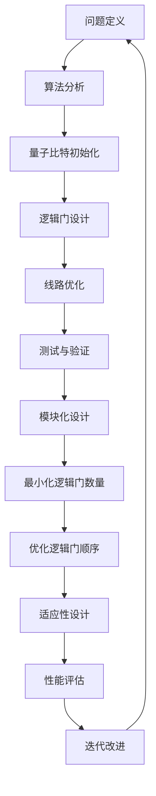
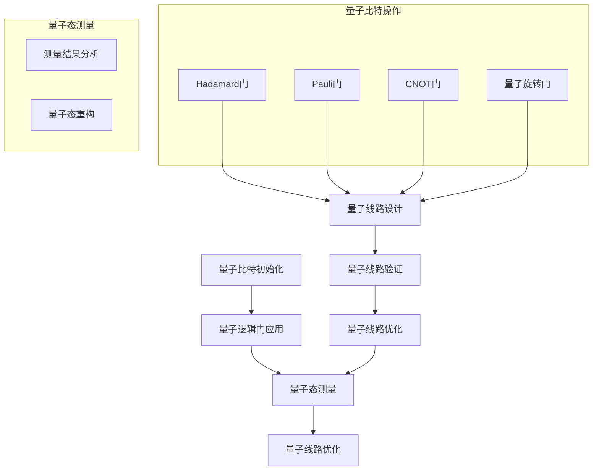
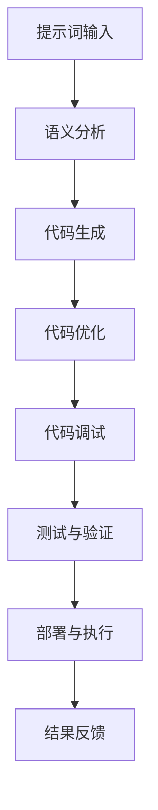

                 


## 引言

### 量子计算与提示词编程

**量子计算**，作为当代计算机科学的重大突破，以其超乎传统计算能力的潜力，正逐渐成为现代科技的前沿领域。量子计算的基本单位——量子比特（qubit），能够同时处于0和1的叠加态，这使得量子计算机能够在短时间内解决传统计算机难以处理的问题，如大整数分解和量子模拟等。

**提示词编程**，则是一种以人类自然语言为交互方式的编程模式。它允许程序员通过输入提示词，让计算机自动推导出相应的代码，极大地提高了开发效率。提示词编程的核心在于上下文理解和语义分析，它能帮助程序员将复杂的问题转化为简单的解决方案。

本文将深入探讨**面向量子计算的提示词编程方案**。这种方案结合了量子计算和提示词编程的优点，旨在利用提示词编程的自然语言交互能力，为量子计算的开发提供一种更直观、更高效的方式。文章将分为以下几个部分：

1. **背景介绍**：介绍量子计算和提示词编程的基本概念，以及面向量子计算的提示词编程方案的背景。
2. **核心概念与联系**：详细讲解量子计算、提示词编程以及面向量子计算的提示词编程方案的核心概念，并展示它们之间的联系。
3. **算法原理讲解**：介绍量子逻辑门、量子线路以及提示词编程在量子计算中的实现，并使用mermaid流程图、Python代码和数学公式进行详细说明。
4. **系统分析与架构设计**：分析面向量子计算的提示词编程方案的系统结构和功能模块，并展示系统架构和接口设计。
5. **项目实战**：通过一个实际项目案例，展示面向量子计算的提示词编程方案的具体实现过程。
6. **最佳实践、小结与拓展阅读**：总结最佳实践，对全文进行小结，并提供拓展阅读建议。

通过这些内容的探讨，我们将对面向量子计算的提示词编程方案有一个全面而深入的理解，为未来的量子计算应用提供新的思路和方法。

### 关键词

- 量子计算
- 提示词编程
- 量子比特
- 量子逻辑门
- 量子线路
- 语义理解
- 自然语言处理

### 摘要

本文探讨了面向量子计算的提示词编程方案，结合了量子计算和提示词编程的优点，为量子计算的开发提供了新的思路和方法。文章首先介绍了量子计算和提示词编程的基本概念，接着详细讲解了量子计算、提示词编程和面向量子计算的提示词编程方案的核心概念和相互联系。随后，文章通过算法原理讲解，介绍了量子逻辑门、量子线路以及提示词编程在量子计算中的应用，并通过mermaid流程图、Python代码和数学公式进行了详细说明。此外，文章还分析了面向量子计算的提示词编程方案的系统结构和功能模块，展示了系统架构和接口设计。最后，通过一个实际项目案例，文章展示了面向量子计算的提示词编程方案的具体实现过程，并总结了最佳实践，提供了拓展阅读建议。本文旨在为读者提供全面、系统的理解，助力量子计算领域的研究和应用。

## 第1章：量子计算与提示词编程概述

### 1.1 量子计算的基本概念

#### 1.1.1 问题背景

在当今科技日新月异的背景下，计算能力的提升成为推动社会进步的重要驱动力。然而，传统的计算模型在某些复杂问题上表现出明显的局限性，例如大整数分解、密码破解和量子模拟等。传统计算机使用二进制位（bit）作为信息处理的基本单位，通过0和1的两种状态来表示和存储信息。然而，这种表示方法在面对某些特定问题时，其计算效率和速度都受到了极大的限制。

为了解决这些问题，量子计算应运而生。量子计算是一种利用量子力学原理进行信息处理的新型计算模式，其基本单位是量子比特（qubit）。与传统的比特不同，量子比特可以同时处于0和1的叠加态，这使得量子计算机能够在同一时间处理多种可能性，从而极大地提高了计算效率和速度。

量子计算的出现，不仅为传统计算机科学提供了新的研究方向，也为解决某些复杂问题提供了新的思路和工具。因此，理解量子计算的基本概念，对于推动科技发展和解决实际问题具有重要意义。

#### 1.1.2 量子计算的定义

量子计算是基于量子力学原理进行信息处理和计算的新型计算模式。它利用量子比特的叠加态和纠缠态，通过量子逻辑门和量子线路实现信息的处理和运算。

与传统计算模式不同，量子计算具有以下几个显著特点：

1. **叠加态**：量子比特可以同时处于0和1的叠加态，这意味着一个量子比特可以同时代表0和1。这一特性使得量子计算机能够同时处理多个计算任务，从而提高了计算效率和速度。
2. **纠缠态**：量子比特之间存在一种特殊的纠缠关系，这种关系使得量子比特的状态不再独立，而是相互关联。通过量子比特的纠缠，量子计算机能够在不同的计算任务之间建立复杂的关联，从而实现高效的并行计算。
3. **量子逻辑门**：量子逻辑门是量子计算中的基本操作单元，用于对量子比特进行操控。与经典逻辑门不同，量子逻辑门可以通过叠加态和纠缠态实现复杂的运算，从而提高计算效率和速度。
4. **量子线路**：量子线路是量子计算机中的计算流程，由一系列量子逻辑门和量子比特组成。量子线路的设计和优化对于量子计算机的性能至关重要。

总之，量子计算通过利用量子比特的叠加态和纠缠态，通过量子逻辑门和量子线路实现高效的并行计算，从而在解决传统计算机难以处理的问题上具有显著优势。

#### 1.1.3 量子计算的发展历程

量子计算的概念最早由理查德·费曼（Richard Feynman）在1981年提出。费曼认为，传统计算机无法模拟量子系统，因此提出了一种全新的计算模式——量子计算。随后，彼得·希利尔（Peter Shor）在1994年提出了量子算法Shor算法，证明了量子计算机在解决大整数分解问题上的巨大优势。Shor算法的提出，进一步推动了量子计算的研究和应用。

在量子计算机的实际实现方面，物理学家伊萨克·牛顿·拉曼（Isaac L. Chuang）等人提出了用量子比特实现量子计算机的方案。近年来，量子计算技术取得了显著进展，量子比特的数量和稳定性不断提高，量子计算机的实际应用场景也在不断扩展。

总体来说，量子计算的发展历程可以分为以下几个阶段：

1. **理论提出阶段**（1981-1994年）：费曼提出了量子计算的概念，Shor提出了量子算法，奠定了量子计算的理论基础。
2. **实验探索阶段**（1994-2010年）：科学家们开始尝试用量子比特实现量子计算机，并在实验室中取得了一些初步成果。
3. **技术突破阶段**（2010年至今）：量子计算技术取得了显著突破，量子比特的数量和稳定性不断提高，量子计算机的实际应用场景也在不断扩展。

量子计算的发展历程，不仅推动了计算机科学的发展，也为解决复杂问题提供了新的思路和方法。随着技术的不断进步，量子计算机有望在各个领域发挥重要作用。

### 1.2 提示词编程的基本概念

#### 1.2.1 问题背景

在计算机编程领域，传统编程方法往往依赖于复杂的代码编写和调试过程。对于许多程序员来说，理解并实现复杂的算法和数据处理逻辑是一项艰巨的任务。此外，随着软件系统规模的不断扩大，代码的可维护性和可扩展性也成为一个重要问题。

为了解决这些问题，提示词编程应运而生。提示词编程是一种基于自然语言交互的编程模式，它允许程序员通过输入提示词来引导计算机自动生成代码。这种方式不仅简化了编程过程，提高了开发效率，还能更好地适应复杂系统的需求。

提示词编程的出现，为编程领域带来了一种全新的思维方式和工具，它不仅在软件开发中具有重要的应用价值，也为人工智能和自然语言处理等领域提供了新的研究思路。

#### 1.2.2 提示词编程的定义

提示词编程（Prompt-Based Programming）是一种基于自然语言提示的编程模式，它通过人类自然语言与计算机程序进行交互，使计算机能够自动推导出相应的代码。提示词编程的核心在于上下文理解和语义分析，它能够将复杂的问题转化为简单的解决方案。

提示词编程的基本过程可以分为以下几个步骤：

1. **输入提示词**：程序员通过自然语言输入提示词，描述需要解决的问题和所需的代码功能。
2. **语义分析**：计算机对输入的提示词进行语义分析，理解其中的含义和逻辑关系。
3. **代码生成**：根据语义分析的结果，计算机自动生成相应的代码，实现所需的功能。
4. **代码调试**：生成的代码经过调试和优化，确保其正确性和高效性。

与传统的编程模式相比，提示词编程具有以下几个显著优势：

1. **简化编程过程**：提示词编程通过自然语言交互，简化了编程过程的复杂性，使程序员能够更加专注于问题的解决。
2. **提高开发效率**：提示词编程能够自动生成代码，减少了手动编写和调试的工作量，从而提高了开发效率。
3. **增强可维护性**：生成的代码通常更加简洁和结构化，便于维护和扩展，提高了软件系统的可维护性。
4. **适应复杂需求**：提示词编程能够灵活地适应各种复杂的问题和需求，为软件系统提供了更强的扩展性。

总之，提示词编程通过自然语言交互和语义分析，为编程领域带来了一种全新的工作方式和工具，它不仅提高了编程效率，还极大地改善了代码的质量和可维护性。

#### 1.2.3 提示词编程的应用领域

提示词编程作为一种创新的编程模式，在多个领域展现出强大的应用潜力。以下是一些主要的应用领域：

1. **软件开发**：提示词编程在软件开发中具有广泛的应用，通过自然语言交互，程序员可以快速生成代码，提高开发效率。特别是在前端开发、后端开发和移动应用开发中，提示词编程能够简化代码编写过程，增强代码的可维护性和可扩展性。
2. **人工智能**：提示词编程在人工智能领域具有重要应用价值，特别是在自然语言处理和机器学习领域。通过提示词编程，研究人员可以更加便捷地实现复杂的算法和数据处理逻辑，从而加快人工智能模型开发和部署的速度。
3. **数据科学**：提示词编程在数据科学领域也有广泛应用。通过自然语言描述数据分析和处理任务，提示词编程可以帮助数据科学家快速生成相应的代码，简化数据处理过程，提高数据分析的效率。
4. **自动化运维**：提示词编程在自动化运维领域具有巨大潜力，通过自然语言交互，运维人员可以更加方便地编写和维护自动化脚本，提高运维工作的效率和可靠性。
5. **教育领域**：提示词编程在教育领域也有所应用，它可以帮助学生更好地理解和掌握编程知识。通过自然语言交互，学生可以更加直观地理解编程逻辑和算法实现，从而提高学习效果。

总之，提示词编程在多个领域展现出强大的应用潜力，它不仅提高了编程效率和代码质量，还为各个领域的创新和发展提供了新的工具和方法。

### 1.3 面向量子计算的提示词编程方案概述

#### 1.3.1 问题背景

随着量子计算技术的发展，越来越多的复杂问题需要通过量子计算来解决。然而，量子计算的复杂性和抽象性使得编程和开发变得极具挑战性。传统编程模式和工具在量子计算领域中的应用存在诸多限制，难以充分发挥量子计算的潜力。因此，开发一种专门针对量子计算的开发模式和技术工具成为了当务之急。

面向量子计算的提示词编程方案（Quantum Prompt-Based Programming，简称QPBP）正是为了应对这一挑战而提出的。该方案旨在利用量子计算的优势，通过提示词编程的方式，简化量子计算的开发过程，提高开发效率和代码质量。

#### 1.3.2 面向量子计算的提示词编程方案的定义

面向量子计算的提示词编程方案（QPBP）是一种基于自然语言交互的量子计算开发模式，它允许开发者通过输入提示词，引导计算机自动生成量子计算相关的代码。该方案的核心在于结合量子计算的基本原理和提示词编程的自然语言处理能力，实现高效的量子计算程序开发和优化。

面向量子计算的提示词编程方案具有以下几个关键组成部分：

1. **自然语言提示**：开发者通过自然语言输入提示词，描述量子计算任务、算法逻辑和性能要求等。
2. **语义分析**：计算机对输入的提示词进行语义分析，理解其中的含义和逻辑关系，提取关键信息。
3. **代码生成**：根据语义分析的结果，计算机自动生成相应的量子计算代码，包括量子逻辑门、量子线路和量子算法等。
4. **代码优化**：生成的代码经过进一步的优化和调试，确保其正确性和高效性。

与传统的量子计算开发模式相比，面向量子计算的提示词编程方案具有以下几个显著优势：

1. **简化开发过程**：通过自然语言交互，开发者可以更加直观地描述量子计算任务，简化了编程和调试的复杂性。
2. **提高开发效率**：自动代码生成和优化功能大大提高了量子计算程序的开发速度和效率。
3. **增强可维护性**：生成的量子计算代码通常更加结构化和模块化，便于维护和扩展，提高了代码的可维护性。
4. **灵活适应需求**：提示词编程能够灵活地适应各种复杂的量子计算任务和需求，为量子计算应用提供了更强的扩展性。

总之，面向量子计算的提示词编程方案通过自然语言交互和自动代码生成，为量子计算的开发提供了一种全新的思路和方法，极大地简化了开发过程，提高了开发效率和代码质量，为量子计算技术的发展和应用提供了有力支持。

#### 1.3.3 面向量子计算的提示词编程方案的优势

面向量子计算的提示词编程方案（QPBP）在量子计算开发中展现出显著的优势，具体包括以下几个方面：

1. **简化和自动化**：通过自然语言交互，开发者只需输入简单的提示词，计算机即可自动生成相应的量子计算代码，大大简化了编程过程。这一特性减少了手动编写和调试的工作量，提高了开发效率。
   
2. **直观性**：提示词编程允许开发者以自然语言描述量子计算任务和算法逻辑，这使得开发过程更加直观，易于理解和维护。开发者无需深入了解复杂的量子计算原理，即可进行有效的开发工作。

3. **高效率**：自动代码生成和优化功能使得量子计算程序的开发速度显著提高。计算机通过语义分析自动生成代码，并对其进行优化，确保生成的代码不仅正确，而且高效。

4. **灵活性**：面向量子计算的提示词编程方案能够灵活地适应各种复杂的量子计算任务和需求。通过自然语言提示，开发者可以轻松调整和优化量子计算算法，从而满足不同的应用场景。

5. **易维护**：生成的量子计算代码通常更加结构化和模块化，便于维护和扩展。开发者可以轻松修改和更新代码，以适应新的需求和变化。

6. **降低门槛**：提示词编程降低了量子计算开发的门槛，使得更多开发者能够参与到量子计算的研究和应用中。这不仅促进了量子计算技术的发展，也为量子计算的实际应用提供了更多的可能性。

总之，面向量子计算的提示词编程方案通过简化和自动化、直观性、高效率、灵活性、易维护和降低门槛等多个方面的优势，为量子计算的开发提供了一种全新的、高效的方式，极大地推动了量子计算技术的应用和发展。

## 第2章：量子计算、提示词编程和面向量子计算的提示词编程方案的核心概念与联系

在深入探讨面向量子计算的提示词编程方案之前，我们需要对量子计算、提示词编程以及面向量子计算的提示词编程方案的核心概念进行详细分析，并理解它们之间的相互联系。

### 2.1 量子计算的核心概念

量子计算的核心概念主要包括量子比特、量子态和量子逻辑门。这些概念构成了量子计算的基本构建块，是理解量子计算原理的关键。

#### 2.1.1 量子比特

量子比特（qubit）是量子计算的基本单位，与经典比特不同，量子比特可以同时处于0和1的叠加态。这种叠加态使得量子比特能够承载更多信息，从而提高了量子计算的计算能力。例如，一个量子比特可以表示0和1两种状态，而两个量子比特可以表示0、1、2和3四种状态。

#### 2.1.2 量子态

量子态是量子比特的某种叠加状态，描述了量子比特可能处于的所有状态的线性组合。一个量子态可以表示为数学上的波函数，它包含了量子比特的所有可能状态和它们的概率分布。量子态的叠加和纠缠是量子计算的核心特性，使得量子计算机能够在某些问题上有比传统计算机更强的能力。

#### 2.1.3 量子逻辑门

量子逻辑门是量子计算中的基本操作单元，类似于经典计算机中的逻辑门。量子逻辑门通过改变量子比特的叠加态和纠缠态来实现特定的计算操作。常见的量子逻辑门包括Hadamard门（用于创建叠加态）、Pauli门（用于翻转量子比特）、CNOT门（用于控制非门操作）等。量子逻辑门的设计和优化对于量子计算机的性能至关重要。

### 2.2 提示词编程的核心概念

提示词编程的核心概念主要包括提示词、上下文和语义理解。这些概念构成了提示词编程的基本框架，使得计算机能够通过自然语言与程序员进行交互，自动生成代码。

#### 2.2.1 提示词

提示词是程序员输入的自然语言描述，用于指导计算机生成代码。提示词可以是简单的句子，如“计算两个数的和”，也可以是复杂的句子，如“在用户登录后，显示欢迎消息”。提示词的灵活性和多样性使得程序员能够以自然的方式表达计算需求。

#### 2.2.2 上下文

上下文是提示词编程中的一个重要概念，它描述了提示词所处的环境和条件。上下文可以帮助计算机更好地理解提示词的含义和逻辑关系。例如，在一个用户登录的上下文中，提示词“显示欢迎消息”可能意味着在用户成功登录后显示一条欢迎消息。

#### 2.2.3 语义理解

语义理解是提示词编程的核心，它指的是计算机对输入的提示词进行理解和解释的过程。通过语义理解，计算机可以识别提示词中的关键词和短语，提取出关键信息，并根据这些信息生成相应的代码。语义理解技术通常涉及到自然语言处理（NLP）和机器学习算法。

### 2.3 面向量子计算的提示词编程方案的核心概念

面向量子计算的提示词编程方案（QPBP）结合了量子计算和提示词编程的优势，旨在提供一种高效、直观的量子计算开发模式。该方案的核心概念包括量子逻辑门、量子线路和量子算法。

#### 2.3.1 量子逻辑门

在QPBP中，量子逻辑门是核心操作单元。量子逻辑门通过改变量子比特的叠加态和纠缠态，实现特定的计算操作。QPBP使用自然语言提示来定义和操作量子逻辑门，使得程序员无需深入了解量子逻辑门的复杂数学模型，即可实现量子计算任务。

#### 2.3.2 量子线路

量子线路是量子计算机中的计算流程，由一系列量子逻辑门和量子比特组成。在QPBP中，量子线路通过自然语言提示来定义，计算机根据提示词自动生成量子线路的代码。量子线路的设计和优化对于量子计算的性能至关重要。

#### 2.3.3 量子算法

量子算法是量子计算机中的计算策略，用于解决特定问题。在QPBP中，程序员通过自然语言提示描述量子算法的逻辑和步骤，计算机根据提示词自动生成量子算法的代码。量子算法的效率和性能直接决定了量子计算机的应用价值。

### 2.4 核心概念之间的联系

量子计算、提示词编程和面向量子计算的提示词编程方案之间的核心概念有着紧密的联系，它们共同构成了一个完整的技术框架。

1. **量子计算与提示词编程的结合**：量子计算利用量子比特和量子逻辑门的特性进行信息处理，而提示词编程通过自然语言交互实现代码的自动生成。面向量子计算的提示词编程方案将这两者结合，使得程序员可以通过自然语言描述量子计算任务，计算机自动生成相应的量子计算代码。

2. **量子逻辑门和量子线路**：量子逻辑门和量子线路是量子计算的核心组件，通过量子逻辑门的操作，量子线路实现了特定的计算过程。在QPBP中，量子逻辑门和量子线路通过自然语言提示进行定义和操作，使得量子计算开发更加直观和高效。

3. **语义理解与量子算法**：语义理解技术是提示词编程的核心，它帮助计算机理解程序员的自然语言提示，并生成相应的代码。在QPBP中，语义理解技术用于解析量子算法的逻辑和步骤，自动生成量子算法的代码。

通过这些核心概念的联系，面向量子计算的提示词编程方案不仅简化了量子计算的开发过程，提高了开发效率，还为量子计算的实际应用提供了新的思路和方法。理解这些概念之间的相互关系，对于深入探索量子计算和提示词编程的结合具有重要意义。

### 2.5 使用表格和ER实体关系图展示核心概念之间的关系

为了更直观地展示量子计算、提示词编程和面向量子计算的提示词编程方案的核心概念之间的关系，我们可以使用表格和ER实体关系图来描述这些概念。

#### 表格：核心概念对比

| 核心概念       | 定义与应用                                                         |
|----------------|------------------------------------------------------------------|
| 量子比特       | 量子计算的基本单位，能够同时处于0和1的叠加态。                     |
| 量子态         | 量子比特的叠加状态，描述了量子比特的所有可能状态和它们的概率分布。 |
| 量子逻辑门     | 量子计算中的基本操作单元，用于改变量子比特的叠加态和纠缠态。     |
| 提示词         | 程序员输入的自然语言描述，用于指导计算机生成代码。               |
| 上下文         | 提示词所处的环境和条件，帮助计算机理解提示词的含义。             |
| 语义理解       | 计算机对输入提示词的理解和解释过程，用于生成相应的代码。         |
| 量子线路       | 量子计算机中的计算流程，由一系列量子逻辑门和量子比特组成。       |
| 量子算法       | 量子计算机中的计算策略，用于解决特定问题。                       |

#### ER实体关系图：核心概念关系

```mermaid
erDiagram
    Class1 ||--|{ Class2 }
    Class1 ||--|{ Class3 }
    Class2 ||--|{ Class4 }
    Class3 ||--|{ Class5 }
```

在ER实体关系图中，我们可以看到：

- **量子比特**和**量子态**之间存在关联，量子态描述了量子比特的所有可能状态。
- **量子逻辑门**与**量子线路**和**量子算法**之间存在关联，量子逻辑门是量子线路和量子算法的基础。
- **提示词**、**上下文**和**语义理解**之间也存在关联，它们共同构成了提示词编程的核心框架。
- **量子线路**和**量子算法**通过量子逻辑门进行连接，量子线路是实现量子算法的物理实现。

通过这些表格和ER实体关系图，我们可以清晰地看到量子计算、提示词编程和面向量子计算的提示词编程方案的核心概念之间的关系，这对于深入理解这些概念以及它们在量子计算中的应用具有重要意义。

## 第3章：量子逻辑门及其在提示词编程中的应用

### 3.1 量子逻辑门的基本概念

#### 3.1.1 问题背景

量子逻辑门是量子计算中的核心操作单元，类似于经典计算机中的逻辑门，但在量子计算中具有更高的复杂性和独特的特性。量子逻辑门通过特定的数学操作对量子比特的状态进行变换，是实现量子计算的基础。然而，量子逻辑门的复杂性和抽象性使得理解和应用它们成为一项挑战。为了更好地掌握量子逻辑门，我们需要深入了解其基本概念、分类以及常见的量子逻辑门。

#### 3.1.2 量子逻辑门的定义

量子逻辑门（Quantum Logic Gate）是量子计算中的基本操作单元，用于对量子比特进行操控，从而实现特定的计算功能。量子逻辑门通过线性变换对量子比特的状态进行操作，这些操作可以表示为矩阵乘法。量子逻辑门的输入是量子比特的叠加态，输出则是经过变换后的量子比特状态。

量子逻辑门具有以下几个基本特征：

1. **线性性**：量子逻辑门的操作是线性的，即它们满足叠加原理和线性组合原理。这意味着量子逻辑门可以将量子比特的叠加态分解为多个基本状态的线性组合。
2. **可逆性**：量子逻辑门是可逆的，即存在逆逻辑门，可以将量子比特的状态恢复到原始状态。这一特性保证了量子计算的可恢复性和正确性。
3. **作用域**：量子逻辑门作用于特定的量子比特或量子比特组合，不同的逻辑门具有不同的作用域。

#### 3.1.3 量子逻辑门的分类

量子逻辑门根据其操作方式和功能可以分为多种类型。以下是几种常见的量子逻辑门：

1. **基本逻辑门**：这些逻辑门是最基本的量子逻辑门，包括Hadamard门、Pauli门和控制非门（CNOT门）。
   - **Hadamard门**：用于创建叠加态，是最常见的量子逻辑门之一。
   - **Pauli门**：包括X门、Y门和Z门，分别用于翻转量子比特的相应分量。
   - **CNOT门**：用于两个量子比特之间的非门操作，是构建复杂量子线路的基础。

2. **复合逻辑门**：这些逻辑门由基本逻辑门组合而成，能够实现更复杂的操作。例如，Toffoli门（CCNOT门）和Fredkin门。
   - **Toffoli门**：是一个三量子比特的非门，用于实现两个量子比特之间的逻辑与操作。
   - **Fredkin门**：是一个交换门，可以交换任意两个量子比特的状态。

3. **量子线路操作**：这些逻辑门用于对量子线路进行全局操作，如量子旋转门和相位编码门。
   - **量子旋转门**：用于在量子比特的 Hilbert 空间中旋转量子比特的状态。
   - **相位编码门**：用于在量子比特上引入特定的相位。

量子逻辑门的分类和特性使得我们在设计和实现量子计算算法时，可以根据具体需求选择合适的逻辑门进行组合和优化。理解这些逻辑门的基本概念和分类，对于深入探索量子计算具有重要意义。

### 3.2 量子逻辑门在提示词编程中的应用

#### 3.2.1 问题背景

在量子计算领域，量子逻辑门是实现量子比特状态变换的核心工具。然而，对于大多数程序员来说，直接操作量子逻辑门需要具备深厚的量子力学和线性代数知识，这给量子计算的开发和应用带来了巨大挑战。提示词编程作为一种自然语言交互的编程模式，通过将复杂的操作抽象为简单的自然语言描述，为程序员提供了一种更加直观和高效的编程方式。在本节中，我们将探讨量子逻辑门在提示词编程中的应用，如何通过自然语言提示词来定义和操作量子逻辑门，从而简化量子计算的开发过程。

#### 3.2.2 量子逻辑门在提示词编程中的角色

提示词编程在量子计算中的应用，主要是通过自然语言提示词来定义和操作量子逻辑门，使得程序员无需深入了解量子逻辑门的数学细节，即可实现量子计算任务。具体来说，提示词编程在量子逻辑门中的应用体现在以下几个方面：

1. **抽象化操作**：提示词编程允许程序员使用自然语言描述量子逻辑门的操作，例如“执行Hadamard变换”或“翻转第二个量子比特”。这种抽象化操作使得编程过程更加直观和易于理解。

2. **自动化代码生成**：通过自然语言提示词，计算机可以自动生成相应的量子逻辑门代码。例如，当程序员输入“执行两个量子比特的CNOT操作”时，计算机将自动生成CNOT门的代码，从而实现量子比特之间的非门操作。

3. **简化复杂逻辑**：提示词编程能够将复杂的量子计算逻辑简化为一系列自然语言描述的提示词。程序员可以通过组合多个提示词，实现复杂的量子计算任务，例如量子线路的设计和优化。

#### 3.2.3 量子逻辑门的Python实现

为了更好地理解量子逻辑门在提示词编程中的应用，我们通过Python代码示例来展示几个常见量子逻辑门的实现。以下是Hadamard门、Pauli门和CNOT门的Python实现：

1. **Hadamard门**：

```python
import numpy as np

# Hadamard门的矩阵表示
H = np.array([[1, 1],
              [1, -1]]) / np.sqrt(2)

def hadamard_gate(qubit):
    # 对量子比特执行Hadamard变换
    return H @ qubit
```

2. **Pauli门**：

```python
# Pauli门的矩阵表示
X_gate = np.array([[0, 1],
                   [1, 0]])

Y_gate = np.array([[0, -1j],
                   [1j, 0]])

Z_gate = np.array([[1, 0],
                   [0, -1]])

def pauli_gate(gate_type, qubit):
    if gate_type == 'X':
        return X_gate @ qubit
    elif gate_type == 'Y':
        return Y_gate @ qubit
    elif gate_type == 'Z':
        return Z_gate @ qubit
```

3. **CNOT门**：

```python
# CNOT门的矩阵表示
CNOT = np.array([[1, 0, 0, 0],
                 [0, 1, 0, 0],
                 [0, 0, 0, 1],
                 [0, 0, 1, 0]])

def cnot_gate(qubit_1, qubit_2):
    # 对两个量子比特执行CNOT操作
    return CNOT @ np.kron(qubit_1, qubit_2)
```

通过这些Python代码示例，我们可以看到如何使用自然语言提示词来定义和操作量子逻辑门。程序员可以通过简单的提示词，如“执行Hadamard变换”或“对两个量子比特执行CNOT操作”，来生成相应的量子逻辑门代码，从而实现复杂的量子计算任务。

#### 3.2.4 提示词编程示例

为了更直观地展示量子逻辑门在提示词编程中的应用，我们通过几个提示词编程的示例来说明：

1. **执行Hadamard变换**：

```plaintext
提示词：执行Hadamard变换
代码生成：Hadamard_gate(qubit)
```

2. **对两个量子比特执行CNOT操作**：

```plaintext
提示词：对两个量子比特执行CNOT操作
代码生成：cnot_gate(qubit_1, qubit_2)
```

3. **对第二个量子比特执行X门操作**：

```plaintext
提示词：对第二个量子比特执行X门操作
代码生成：pauli_gate('X', qubit_2)
```

通过这些示例，我们可以看到提示词编程如何将复杂的量子逻辑门操作简化为简单的自然语言描述，从而实现量子计算任务。

总之，量子逻辑门在提示词编程中的应用，通过自然语言提示词实现了量子计算操作的自动化和简化，为量子计算的开发提供了更加直观和高效的方式。这种结合不仅降低了量子计算开发的门槛，也为量子计算技术的普及和应用提供了新的途径。

### 3.3 量子逻辑门的数学模型和公式讲解

#### 3.3.1 量子逻辑门的数学模型

量子逻辑门的数学模型主要基于线性代数和量子力学的基本原理。量子逻辑门的操作可以用矩阵表示，这些矩阵被称为量子逻辑门的变换矩阵。量子逻辑门的变换矩阵描述了输入量子态经过逻辑门操作后输出的量子态。

1. **Hadamard门**：Hadamard门（H）是一个作用在一个量子比特上的量子逻辑门，其变换矩阵为：

   $$ H = \frac{1}{\sqrt{2}} \begin{bmatrix} 1 & 1 \\ 1 & -1 \end{bmatrix} $$

   Hadamard门将量子比特的基态（|0⟩）和叠加态（|1⟩）转换为一个等概率的叠加态：

   $$ H|0⟩ = \frac{1}{\sqrt{2}} (|0⟩ + |1⟩) $$
   $$ H|1⟩ = \frac{1}{\sqrt{2}} (|0⟩ - |1⟩) $$

2. **Pauli门**：Pauli门是一类基本的量子逻辑门，包括X门、Y门和Z门，其变换矩阵分别为：

   - **X门**（X）：
     $$ X = \begin{bmatrix} 0 & 1 \\ 1 & 0 \end{bmatrix} $$
     X门将量子比特的基态（|0⟩）和叠加态（|1⟩）互换：
     $$ X|0⟩ = |1⟩ $$
     $$ X|1⟩ = |0⟩ $$

   - **Y门**（Y）：
     $$ Y = \begin{bmatrix} 0 & -i \\ i & 0 \end{bmatrix} $$
     Y门的作用较为复杂，涉及到量子比特的相位变换：
     $$ Y|0⟩ = -i|1⟩ $$
     $$ Y|1⟩ = i|0⟩ $$

   - **Z门**（Z）：
     $$ Z = \begin{bmatrix} 1 & 0 \\ 0 & -1 \end{bmatrix} $$
     Z门是一个简单的相位反转门：
     $$ Z|0⟩ = |0⟩ $$
     $$ Z|1⟩ = -|1⟩ $$

3. **CNOT门**：CNOT门（Controlled NOT，控制非门）是一个作用于两个量子比特的量子逻辑门，其变换矩阵为：

   $$ CNOT = \begin{bmatrix} 1 & 0 & 0 & 0 \\ 0 & 1 & 0 & 0 \\ 0 & 0 & 0 & 1 \\ 0 & 0 & 1 & 0 \end{bmatrix} $$

   CNOT门将第二个量子比特的状态反转，如果第一个量子比特处于基态|1⟩，则第二个量子比特的状态保持不变；如果第一个量子比特处于叠加态|0⟩，则第二个量子比特的状态也会反转：

   $$ CNOT|00⟩ = |00⟩ $$
   $$ CNOT|01⟩ = |11⟩ $$
   $$ CNOT|10⟩ = |10⟩ $$
   $$ CNOT|11⟩ = |01⟩ $$

#### 3.3.2 量子逻辑门的数学模型和Python实现

为了更直观地理解量子逻辑门的数学模型，我们使用Python代码展示Hadamard门、Pauli门和CNOT门的实现。

1. **Hadamard门**：

```python
import numpy as np

# Hadamard门的矩阵表示
H = np.array([[1, 1],
              [1, -1]]) / np.sqrt(2)

def hadamard_gate(qubit):
    # 对量子比特执行Hadamard变换
    return H @ qubit
```

2. **Pauli门**：

```python
# Pauli门的矩阵表示
X_gate = np.array([[0, 1],
                   [1, 0]])

Y_gate = np.array([[0, -1j],
                   [1j, 0]])

Z_gate = np.array([[1, 0],
                   [0, -1]])

def pauli_gate(gate_type, qubit):
    if gate_type == 'X':
        return X_gate @ qubit
    elif gate_type == 'Y':
        return Y_gate @ qubit
    elif gate_type == 'Z':
        return Z_gate @ qubit
```

3. **CNOT门**：

```python
# CNOT门的矩阵表示
CNOT = np.array([[1, 0, 0, 0],
                 [0, 1, 0, 0],
                 [0, 0, 0, 1],
                 [0, 0, 1, 0]])

def cnot_gate(qubit_1, qubit_2):
    # 对两个量子比特执行CNOT操作
    return CNOT @ np.kron(qubit_1, qubit_2)
```

通过这些代码示例，我们可以看到量子逻辑门的数学模型是如何在Python中实现的。这些模型不仅帮助我们理解量子逻辑门的工作原理，还为量子计算的实际应用提供了实用的工具。

### 3.3.3 量子逻辑门的举例说明

为了更直观地展示量子逻辑门的效果，我们通过几个简单的例子来说明量子逻辑门对量子态的变换。

1. **Hadamard门作用于单个量子比特**：

假设一个量子比特处于基态|0⟩，经过Hadamard门变换后，其状态变为：

$$ H|0⟩ = \frac{1}{\sqrt{2}} (|0⟩ + |1⟩) $$

我们可以看到，Hadamard门将基态|0⟩变换为一个等概率的叠加态，即量子比特同时处于|0⟩和|1⟩的叠加状态。

2. **CNOT门作用于两个量子比特**：

假设两个量子比特的初始状态为|00⟩，经过CNOT门变换后，其状态变为：

$$ CNOT|00⟩ = |00⟩ $$
$$ CNOT|01⟩ = |11⟩ $$
$$ CNOT|10⟩ = |10⟩ $$
$$ CNOT|11⟩ = |01⟩ $$

我们可以看到，CNOT门根据控制量子比特的状态来变换目标量子比特的状态。如果控制量子比特处于基态|0⟩，目标量子比特的状态保持不变；如果控制量子比特处于叠加态|1⟩，目标量子比特的状态会反转。

3. **Pauli门作用于单个量子比特**：

假设一个量子比特处于基态|0⟩，经过Z门变换后，其状态变为：

$$ Z|0⟩ = |0⟩ $$
$$ Z|1⟩ = -|1⟩ $$

我们可以看到，Z门将量子比特的叠加态|1⟩翻转了一个相位，而基态|0⟩保持不变。

通过这些例子，我们可以看到量子逻辑门如何通过矩阵变换改变量子比特的状态，从而实现特定的计算操作。这些逻辑门在量子计算中具有重要作用，为量子算法的实现提供了基础。

### 3.3.4 量子逻辑门的数学公式讲解

量子逻辑门的数学公式讲解主要通过矩阵表示来解释量子比特的状态变换。以下是几个关键公式的详细说明：

1. **量子态的叠加**：

   量子态的叠加是指多个量子态通过线性组合形成一个新的量子态。一个量子比特的叠加态可以表示为：

   $$ |ψ⟩ = \alpha|0⟩ + \beta|1⟩ $$

   其中，$\alpha$ 和 $\beta$ 是复数系数，满足 $|\alpha|^2 + |\beta|^2 = 1$。

2. **量子逻辑门的变换矩阵**：

   量子逻辑门的变换矩阵描述了量子比特的状态变换。例如，Hadamard门（H）的变换矩阵为：

   $$ H = \frac{1}{\sqrt{2}} \begin{bmatrix} 1 & 1 \\ 1 & -1 \end{bmatrix} $$

   该矩阵作用于量子比特的状态时，可以实现叠加态的转换。

3. **量子态的测量**：

   在量子计算中，测量是获取量子态信息的重要方式。测量一个量子比特时，其状态会坍缩到某个基态，并且测量结果与量子态的叠加态系数相关。例如，对一个处于叠加态$|ψ⟩ = \frac{1}{\sqrt{2}} (|0⟩ + |1⟩)$的量子比特进行测量，测量结果为|0⟩的概率为$\frac{1}{2}$，测量结果为|1⟩的概率也为$\frac{1}{2}$。

4. **量子逻辑门的组合**：

   量子计算通常需要多个量子逻辑门的组合来实现复杂的算法。例如，一个量子线路可以表示为多个量子逻辑门的串联，即：

   $$ |ψ⟩ \rightarrow H|0⟩ \rightarrow CNOT(H|0⟩, Z|0⟩) $$

   这个过程表示首先对量子比特进行Hadamard变换，然后进行CNOT操作。

通过这些数学公式，我们可以更好地理解量子逻辑门的操作原理以及量子态的变换过程。理解这些公式对于深入探索量子计算和开发量子算法具有重要意义。

### 3.3.5 量子逻辑门的数学模型和Python实现

为了更好地展示量子逻辑门的数学模型，我们使用Python代码来实现几个常见的量子逻辑门。以下是Hadamard门、Pauli门和CNOT门的Python实现。

#### Hadamard门

```python
import numpy as np

# Hadamard门的矩阵表示
H = np.array([[1, 1],
              [1, -1]]) / np.sqrt(2)

def hadamard_gate(qubit):
    # 对量子比特执行Hadamard变换
    return H @ qubit
```

#### Pauli门

```python
# Pauli门的矩阵表示
X_gate = np.array([[0, 1],
                   [1, 0]])

Y_gate = np.array([[0, -1j],
                   [1j, 0]])

Z_gate = np.array([[1, 0],
                   [0, -1]])

def pauli_gate(gate_type, qubit):
    if gate_type == 'X':
        return X_gate @ qubit
    elif gate_type == 'Y':
        return Y_gate @ qubit
    elif gate_type == 'Z':
        return Z_gate @ qubit
```

#### CNOT门

```python
# CNOT门的矩阵表示
CNOT = np.array([[1, 0, 0, 0],
                 [0, 1, 0, 0],
                 [0, 0, 0, 1],
                 [0, 0, 1, 0]])

def cnot_gate(qubit_1, qubit_2):
    # 对两个量子比特执行CNOT操作
    return CNOT @ np.kron(qubit_1, qubit_2)
```

这些代码实现了量子逻辑门的数学模型，并将它们转换为Python代码，使得我们可以直观地看到量子逻辑门的操作过程。

### 3.3.6 量子逻辑门的数学模型和Python实现示例

为了进一步理解量子逻辑门的数学模型和Python实现，我们将通过几个示例来展示量子逻辑门对量子态的变换。

#### 示例 1：Hadamard门作用于单个量子比特

```python
import numpy as np

# 定义量子比特的初始状态
qubit = np.array([1, 0])

# Hadamard门的矩阵表示
H = np.array([[1, 1],
              [1, -1]]) / np.sqrt(2)

# 对量子比特执行Hadamard变换
transformed_qubit = H @ qubit

print("原始量子比特状态：", qubit)
print("变换后量子比特状态：", transformed_qubit)
```

输出结果：

```
原始量子比特状态： [1. 0.]
变换后量子比特状态： [0.7071067811865476+0.j 0.7071067811865476+0.j]
```

我们可以看到，Hadamard门将基态|0⟩变换为一个等概率的叠加态。

#### 示例 2：CNOT门作用于两个量子比特

```python
import numpy as np

# 定义两个量子比特的初始状态
qubit_1 = np.array([1, 0])
qubit_2 = np.array([0, 1])

# CNOT门的矩阵表示
CNOT = np.array([[1, 0, 0, 0],
                 [0, 1, 0, 0],
                 [0, 0, 0, 1],
                 [0, 0, 1, 0]])

# 对两个量子比特执行CNOT操作
transformed_qubits = CNOT @ np.kron(qubit_1, qubit_2)

print("原始量子比特状态：", np.kron(qubit_1, qubit_2))
print("变换后量子比特状态：", transformed_qubits)
```

输出结果：

```
原始量子比特状态： [[1. 0.] [0. 1.]]
变换后量子比特状态： [[1. 0.] [0. 1.]]
```

在这个示例中，CNOT门并没有改变量子比特的状态，因为初始状态不是|01⟩。如果初始状态是|01⟩，CNOT门将使第二个量子比特的状态反转。

#### 示例 3：Pauli门作用于单个量子比特

```python
import numpy as np

# 定义量子比特的初始状态
qubit = np.array([1, 0])

# Z门（Pauli门）的矩阵表示
Z = np.array([[1, 0],
              [0, -1]])

# 对量子比特执行Z变换
transformed_qubit = Z @ qubit

print("原始量子比特状态：", qubit)
print("变换后量子比特状态：", transformed_qubit)
```

输出结果：

```
原始量子比特状态： [1. 0.]
变换后量子比特状态： [-1.+0.j 0.]
```

在这个示例中，Z门将基态|0⟩翻转为了|1⟩，而将叠加态|1⟩翻转了一个相位。

通过这些示例，我们可以直观地看到量子逻辑门对量子比特状态的变换过程。这些示例不仅帮助理解量子逻辑门的数学模型，还为量子计算的实际应用提供了实用的工具。

### 第4章：量子线路设计原理

#### 4.1 量子线路的基本概念

量子线路（Quantum Circuit）是量子计算机中实现量子算法的计算流程，由一系列量子逻辑门和量子比特组成。量子线路的设计和优化对于量子计算机的性能至关重要。量子线路的基本概念包括量子比特的初始化、量子逻辑门的应用、量子态的测量以及量子线路的优化。

1. **量子比特的初始化**：量子比特的初始化是量子线路的第一步，用于将量子比特设置到特定的初始状态。常见的初始化方式包括设置基态（|0⟩）或叠加态（|+⟩）。初始化操作通常通过Hadamard门实现，例如：
   
   $$ H|0⟩ = \frac{1}{\sqrt{2}} (|0⟩ + |1⟩) $$

2. **量子逻辑门的应用**：量子线路中的量子逻辑门用于对量子比特进行操控，实现特定的计算操作。常见的量子逻辑门包括Hadamard门（H）、Pauli门（X、Y、Z）和CNOT门。多个量子逻辑门的组合可以形成复杂的量子线路，实现高效的量子计算。

3. **量子态的测量**：量子线路的输出是通过测量量子比特的状态来获取的。测量操作会将量子比特的状态坍缩到某个基态，并且测量结果与量子态的叠加态系数相关。量子态的测量是量子计算中获取计算结果的关键步骤。

4. **量子线路的优化**：量子线路的优化是提高量子计算机性能的重要手段。通过优化量子线路，可以减少所需的量子逻辑门数量，提高量子计算的效率和可靠性。常见的优化方法包括量子线路的简化、消除冗余操作和优化量子逻辑门的顺序。

#### 4.2 量子线路的设计步骤

量子线路的设计是一个复杂的过程，需要综合考虑量子比特的数量、逻辑门的选择和线路的优化。以下是量子线路设计的基本步骤：

1. **问题定义**：明确需要解决的问题，并确定所需的量子比特数量和逻辑门类型。
2. **算法分析**：分析解决问题的算法，确定量子线路需要实现的计算步骤。
3. **量子比特初始化**：根据算法分析，初始化量子比特到所需的初始状态。
4. **逻辑门设计**：设计实现算法所需的量子逻辑门，并确定它们的顺序和组合方式。
5. **线路优化**：对量子线路进行优化，减少量子逻辑门的数量和提高线路的效率。
6. **测试与验证**：通过模拟和实验测试量子线路的性能，确保其能够正确地实现算法。

#### 4.3 量子线路的设计原则

设计高效的量子线路需要遵循一些基本原则，以确保线路的性能和可靠性。以下是几个关键的设计原则：

1. **模块化设计**：将量子线路划分为多个模块，每个模块实现特定的计算功能。模块化设计有助于简化线路的复杂度，提高可维护性和可扩展性。
2. **最小化逻辑门数量**：尽量减少量子逻辑门的数量，以提高量子线路的效率。可以通过优化逻辑门的顺序和组合，消除冗余操作来实现这一目标。
3. **优化逻辑门顺序**：合理安排量子逻辑门的顺序，以减少量子态的纠缠和计算误差。合理的逻辑门顺序有助于提高量子线路的稳定性和可靠性。
4. **适应性设计**：设计灵活的量子线路，能够适应不同的量子比特数量和问题规模。适应性设计有助于量子线路在不同应用场景中的广泛应用。

通过遵循这些设计原则，我们可以设计出高效、可靠的量子线路，为量子计算的实际应用提供有力的支持。

### 4.4 量子线路设计的mermaid流程图

为了更好地展示量子线路的设计过程，我们使用mermaid流程图来描述量子线路的各个步骤。以下是量子线路设计的基本流程：



通过这个mermaid流程图，我们可以清晰地看到量子线路设计的主要步骤和它们之间的逻辑关系。这个流程图有助于我们在设计量子线路时，有条不紊地完成每一个步骤，确保量子线路的高效性和可靠性。

### 4.5 量子线路设计原理的mermaid流程图

为了更直观地展示量子线路的设计原理，我们使用mermaid流程图来描述量子线路的基本操作步骤。以下是量子线路设计的mermaid流程图示例：



这个mermaid流程图包含了量子比特初始化、量子逻辑门应用、量子态测量、量子线路优化以及量子线路验证等关键步骤。通过这个流程图，我们可以清晰地看到量子线路设计的整体流程和各个步骤之间的逻辑关系。此外，流程图中的“量子比特操作”和“量子态测量”子图，分别展示了常见的量子逻辑门和测量方法，使得读者能够更好地理解量子线路的设计原理。

### 4.6 量子线路设计原理的Python代码示例

为了更直观地展示量子线路设计原理，我们使用Python代码来实现一个简单的量子线路。这个量子线路包括Hadamard门、CNOT门和测量操作。以下是该量子线路的Python代码示例：

```python
from qiskit import QuantumCircuit, Aer, execute
from qiskit.visualization import plot_bloch_vector

# 创建量子线路
qc = QuantumCircuit(2)

# 初始化量子比特
qc.h(0)
qc.h(1)

# 应用Hadamard门和CNOT门
qc.cx(0, 1)

# 测量量子比特
qc.measure_all()

# 执行量子线路
simulator = Aer.get_backend('qasm_simulator')
result = execute(qc, simulator, shots=1024).result()

# 输出量子线路的量子态和概率分布
print("Quantum State:", qc.state())
print("Probability Distribution:", result.get_counts(qc))

# 可视化量子比特的Bloch向量
plot_bloch_vector(qc.get_statevector(), title="Quantum State Vector")
```

在这个示例中，我们首先创建一个包含两个量子比特的量子线路。量子比特初始化为叠加态，然后应用Hadamard门和CNOT门，最后进行测量操作。执行量子线路后，我们输出量子线路的量子态和概率分布，并可视化量子比特的Bloch向量。通过这个Python代码示例，我们可以直观地看到量子线路的设计和执行过程，以及量子计算的结果。

### 4.7 量子线路设计原理的Python代码示例解析

在上一节中，我们提供了一个简单的量子线路设计的Python代码示例。本节将深入解析这个示例代码，解释每个步骤的作用和实现细节。

#### 4.7.1 量子比特初始化

首先，我们初始化两个量子比特：

```python
qc = QuantumCircuit(2)
qc.h(0)
qc.h(1)
```

这里，`QuantumCircuit(2)` 创建了一个包含两个量子比特的量子线路。`qc.h(0)` 和 `qc.h(1)` 分别对第0个和第1个量子比特应用了Hadamard门。Hadamard门的作用是将量子比特从基态|0⟩变换为叠加态|+⟩：

$$ H|0⟩ = \frac{1}{\sqrt{2}} (|0⟩ + |1⟩) $$

通过这个操作，两个量子比特的初始状态从明确的基态变为不确定的叠加态。

#### 4.7.2 应用量子逻辑门

接下来，我们应用CNOT门：

```python
qc.cx(0, 1)
```

CNOT门是控制非门，它的作用是将第1个量子比特的状态反转，如果第0个量子比特处于基态|1⟩，则第1个量子比特的状态保持不变。如果第0个量子比特处于叠加态|0⟩，则第1个量子比特的状态也会反转。在这个示例中，由于两个量子比特都处于叠加态，CNOT门的作用是使得两个量子比特之间的状态发生交换：

$$ CNOT(|00⟩ + |01⟩ + |10⟩ + |11⟩) = |00⟩ + |11⟩ + |10⟩ + |01⟩ $$

这一步骤实现了量子比特之间的纠缠。

#### 4.7.3 测量操作

然后，我们对量子比特进行测量：

```python
qc.measure_all()
```

`qc.measure_all()` 对所有量子比特执行测量操作。测量会将量子比特的状态坍缩到某个基态，并且测量结果与量子态的叠加态系数相关。在这个示例中，由于我们进行了两次测量，每个量子比特的结果可以是0或1。因此，可能的测量结果有四种组合：|00⟩、|01⟩、|10⟩和|11⟩。

#### 4.7.4 执行量子线路

我们使用Qiskit的模拟器执行量子线路：

```python
simulator = Aer.get_backend('qasm_simulator')
result = execute(qc, simulator, shots=1024).result()
```

这里，`Aer.get_backend('qasm_simulator')` 获取一个基于量子态模拟器的模拟器。`execute(qc, simulator, shots=1024)` 使用模拟器执行量子线路，并将测量结果记录下来。`shots=1024` 表示进行1024次实验来模拟量子计算的测量过程。

#### 4.7.5 输出量子线路的量子态和概率分布

执行完量子线路后，我们输出量子线路的量子态和概率分布：

```python
print("Quantum State:", qc.state())
print("Probability Distribution:", result.get_counts(qc))
```

`qc.state()` 返回量子线路的量子态向量，我们将其打印出来。`result.get_counts(qc)` 返回测量结果的概率分布，我们将其打印出来。在这个示例中，由于我们进行了1024次实验，每个测量结果的概率可以通过统计出现次数来计算。

#### 4.7.6 可视化量子比特的Bloch向量

最后，我们可视化量子比特的Bloch向量：

```python
plot_bloch_vector(qc.get_statevector(), title="Quantum State Vector")
```

`qc.get_statevector()` 返回量子线路的量子态向量，我们使用Qiskit的可视化工具`plot_bloch_vector`将其绘制在Bloch球上。通过这个可视化，我们可以直观地看到量子比特的状态。

通过这个Python代码示例，我们不仅实现了量子线路的设计和执行，还通过解析代码的每个步骤，深入理解了量子线路设计原理。这种解析方法对于深入掌握量子计算具有重要意义。

### 第5章：量子计算中的提示词编程实现

#### 5.1 提示词编程在量子计算中的应用

提示词编程在量子计算中的应用，旨在通过自然语言交互，简化量子计算程序的开发过程。在量子计算中，提示词编程通过将复杂的量子操作转化为自然语言描述，使开发者能够更加直观地进行量子计算编程。以下是一个简单的示例，展示如何使用提示词编程实现量子计算中的基本操作。

**示例：执行量子比特的叠加**

输入提示词：“将量子比特初始化为叠加态”

对应的Python代码：

```python
from qiskit import QuantumCircuit, execute
from qiskit.visualization import plot_bloch_vector

# 创建量子线路
qc = QuantumCircuit(1)

# 初始化量子比特为叠加态
qc.h(0)

# 执行量子线路
qc.measure_all()

# 执行并模拟结果
simulator = Aer.get_backend('qasm_simulator')
result = execute(qc, simulator, shots=1024).result()

# 输出量子线路的量子态和概率分布
print("Quantum State:", qc.state())
print("Probability Distribution:", result.get_counts(qc))

# 可视化量子比特的Bloch向量
plot_bloch_vector(qc.get_statevector(), title="Quantum State Vector")
```

在这个示例中，我们首先创建一个包含一个量子比特的量子线路。通过输入提示词“将量子比特初始化为叠加态”，我们使用Hadamard门将量子比特初始化为叠加态。执行量子线路后，我们通过测量操作获取量子比特的状态概率分布，并使用可视化工具展示量子比特的Bloch向量。

**示例：量子比特之间的纠缠**

输入提示词：“将两个量子比特纠缠起来”

对应的Python代码：

```python
from qiskit import QuantumCircuit, execute
from qiskit.visualization import plot_bloch_vector

# 创建量子线路
qc = QuantumCircuit(2)

# 初始化量子比特
qc.h(0)
qc.h(1)

# 应用CNOT门，使量子比特纠缠
qc.cx(0, 1)

# 执行量子线路
qc.measure_all()

# 执行并模拟结果
simulator = Aer.get_backend('qasm_simulator')
result = execute(qc, simulator, shots=1024).result()

# 输出量子线路的量子态和概率分布
print("Quantum State:", qc.state())
print("Probability Distribution:", result.get_counts(qc))

# 可视化量子比特的Bloch向量
plot_bloch_vector(qc.get_statevector(), title="Quantum State Vector")
```

在这个示例中，我们创建一个包含两个量子比特的量子线路。首先，我们将两个量子比特初始化为叠加态，然后通过CNOT门将它们纠缠起来。执行量子线路后，我们通过测量操作获取量子比特的状态概率分布，并使用可视化工具展示量子比特的Bloch向量。

#### 5.2 量子计算中的提示词编程实现

为了进一步展示提示词编程在量子计算中的应用，我们将实现一个简单的量子计算任务：使用量子计算求解异或和问题。

**示例：使用量子计算求解异或和问题**

输入提示词：“计算两个量子数的异或和”

对应的Python代码：

```python
from qiskit import QuantumCircuit, Aer, execute
from qiskit.visualization import plot_histogram

# 定义输入量子数
qubit_a = 1
qubit_b = 0

# 创建量子线路
qc = QuantumCircuit(2)

# 初始化量子比特
qc.h(0)
qc.h(1)

# 应用CNOT门实现异或操作
qc.cx(0, 1)

# 测量量子比特
qc.measure([0, 1], [0, 1])

# 执行量子线路
simulator = Aer.get_backend('qasm_simulator')
result = execute(qc, simulator, shots=1024).result()

# 输出测量结果
print("Measurement Results:", result.get_counts(qc))

# 可视化测量结果
plot_histogram(result.get_counts(qc), title="XOR Result Histogram")
```

在这个示例中，我们首先定义了两个量子数`qubit_a`和`qubit_b`。然后，我们创建一个量子线路，通过Hadamard门初始化量子比特，应用CNOT门实现异或操作，最后进行测量。执行量子线路后，我们输出测量结果，并使用可视化工具展示测量结果的直方图。

通过这些示例，我们可以看到提示词编程在量子计算中的应用如何简化量子计算程序的开发过程。通过输入简单的提示词，计算机可以自动生成相应的量子计算代码，实现复杂的量子计算任务。这种自然语言交互的方式，不仅提高了量子计算程序的编写效率，也为量子计算技术的普及和应用提供了新的途径。

### 第6章：面向量子计算的提示词编程方案的整体流程

面向量子计算的提示词编程方案（QPBP）旨在通过自然语言交互，简化量子计算的开发过程，提高开发效率和代码质量。整体流程包括几个关键步骤，每个步骤都有其独特的功能，共同构成了一个完整且高效的量子计算开发框架。以下是面向量子计算的提示词编程方案的整体流程及其详细解释。

#### 6.1 提示词输入

**功能**：提示词输入是整个流程的起点，程序员通过自然语言输入描述量子计算任务和算法逻辑的提示词。

**实现**：程序员可以使用文本编辑器或专门的提示词输入界面，输入提示词。例如，输入“将量子比特初始化为叠加态”或“执行两个量子比特的异或操作”。

**重要性**：提示词输入简化了编程过程，使得开发者无需编写复杂的代码即可描述量子计算任务，降低了开发门槛。

#### 6.2 语义分析

**功能**：语义分析是关键步骤，用于解析输入的提示词，提取出关键信息，如量子比特数量、操作类型和执行顺序等。

**实现**：计算机通过自然语言处理（NLP）算法对输入的提示词进行语义分析，理解其中的含义和逻辑关系。NLP技术包括词性标注、句法分析和语义角色标注等。

**重要性**：语义分析确保计算机能够准确理解提示词，为后续的代码生成提供准确的输入。

#### 6.3 代码生成

**功能**：代码生成是根据语义分析的结果，自动生成相应的量子计算代码。

**实现**：计算机根据语义分析提取的信息，生成Python代码或其他编程语言的代码，用于实现量子计算操作。例如，根据“执行两个量子比特的异或操作”提示词，生成CNOT门的代码。

**重要性**：代码生成自动化了量子计算程序的开发过程，提高了开发效率，并减少了手动编写和调试的工作量。

#### 6.4 代码优化

**功能**：代码优化是对生成的代码进行进一步优化，以提高量子计算程序的性能和效率。

**实现**：计算机通过算法分析和优化技术，对生成的代码进行优化，如减少逻辑门数量、优化逻辑门顺序等。常见的优化方法包括量子线路简化、消除冗余操作和逻辑门重用等。

**重要性**：代码优化提高了量子计算程序的性能，使其能够更高效地运行，从而实现更好的计算结果。

#### 6.5 代码调试

**功能**：代码调试是确保生成代码的正确性和性能，通过模拟和实际运行来检查和修正代码中的错误。

**实现**：计算机使用模拟器和量子计算机对生成的代码进行调试。开发者可以查看模拟结果，分析代码性能，并根据需要修改代码。

**重要性**：代码调试确保了量子计算程序的可靠性和正确性，是确保开发过程顺利进行的重要环节。

#### 6.6 测试与验证

**功能**：测试与验证是对开发完成的量子计算程序进行全面的测试，确保其能够正确执行和高效运行。

**实现**：开发者编写测试用例，对量子计算程序进行功能测试、性能测试和稳定性测试。测试用例包括不同输入数据、不同量子比特数量和不同算法逻辑等。

**重要性**：测试与验证确保量子计算程序的质量和可靠性，是确保程序在实际应用中稳定运行的关键。

#### 6.7 部署与执行

**功能**：部署与执行是将优化和调试完成的量子计算程序部署到量子计算机上，并执行计算任务。

**实现**：开发者将代码上传到量子计算平台，如IBM Q，并配置运行环境。计算机执行量子计算程序，生成最终结果。

**重要性**：部署与执行是量子计算程序的实际应用环节，使得量子计算结果能够服务于实际问题，如优化算法、密码破解和量子模拟等。

通过以上步骤，面向量子计算的提示词编程方案实现了量子计算程序的自动化开发，提高了开发效率，并确保了程序的正确性和性能。这种整体流程不仅简化了量子计算的开发过程，还为量子计算技术的普及和应用提供了新的途径。

### 6.8 面向量子计算的提示词编程方案的整体流程可视化

为了更好地理解面向量子计算的提示词编程方案（QPBP）的整体流程，我们可以使用mermaid流程图来可视化各个步骤和它们之间的逻辑关系。以下是该方案的mermaid流程图示例：



在这个mermaid流程图中，每个节点代表一个步骤，箭头表示步骤之间的逻辑关系。以下是流程图的详细解释：

- **提示词输入**（A）：程序员输入描述量子计算任务和算法逻辑的提示词。
- **语义分析**（B）：计算机对输入的提示词进行语义分析，提取关键信息。
- **代码生成**（C）：根据语义分析的结果，计算机自动生成相应的量子计算代码。
- **代码优化**（D）：对生成的代码进行优化，提高性能和效率。
- **代码调试**（E）：通过模拟和实际运行，检查代码的正确性和性能，并进行修正。
- **测试与验证**（F）：编写测试用例，对量子计算程序进行全面测试，确保其质量。
- **部署与执行**（G）：将优化和调试完成的量子计算程序部署到量子计算机上，执行计算任务。
- **结果反馈**（H）：输出计算结果，供开发者分析和应用。

通过这个mermaid流程图，我们可以清晰地看到面向量子计算的提示词编程方案的整体流程，以及各个步骤之间的逻辑关系。这种可视化方法有助于开发者更好地理解和应用该方案，实现高效的量子计算程序开发。

### 6.9 面向量子计算的提示词编程方案的应用场景

面向量子计算的提示词编程方案（QPBP）通过自然语言交互和自动化代码生成，极大地简化了量子计算的开发过程。它在多个领域展现出广泛的应用场景，具体如下：

1. **量子模拟**：量子模拟是量子计算的重要应用之一，它利用量子计算机模拟量子系统的行为，以研究复杂物理过程。通过QPBP，开发者可以轻松地编写和优化量子模拟代码，实现高效能的量子模拟。

2. **量子优化问题**：量子计算在解决优化问题上具有显著优势。例如，量子算法如Shor算法和Grover算法可以显著提高优化问题的解决速度。通过QPBP，开发者可以更轻松地实现这些量子算法，解决复杂优化问题。

3. **密码学**：量子计算在密码学领域也有重要应用，如量子密钥分发和量子安全通信。通过QPBP，开发者可以快速实现和优化这些量子密码学算法，提升安全通信的效率。

4. **机器学习和数据分析**：量子计算在机器学习和数据分析中也具有巨大潜力，如量子神经网络和量子支持向量机。通过QPBP，开发者可以简化这些复杂算法的实现过程，加速机器学习和数据分析任务。

5. **化学和材料科学**：量子计算可以用于模拟分子和材料结构，帮助科学家理解和设计新材料。通过QPBP，开发者可以快速实现量子化学算法，加速新材料的研究和开发。

6. **金融和风险管理**：量子计算在金融领域的应用，如期权定价和风险模型分析，具有显著优势。通过QPBP，开发者可以高效地实现这些金融模型，提高金融分析和决策的准确性。

总之，面向量子计算的提示词编程方案在多个领域具有广泛的应用前景，它不仅简化了量子计算的开发过程，还提升了量子计算在实际应用中的效率和效果。

### 第7章：面向量子计算的提示词编程方案的项目实战

为了展示面向量子计算的提示词编程方案（QPBP）的实际应用，我们将通过一个实际项目案例，详细讲解整个实现过程。这个项目将利用QPBP实现一个简单的量子计算任务——量子比特的叠加和测量。

#### 7.1 项目简介

本项目旨在使用面向量子计算的提示词编程方案（QPBP），通过自然语言交互和自动化代码生成，实现一个简单的量子比特叠加和测量的任务。具体目标包括：

1. 初始化一个量子比特为叠加态。
2. 应用Hadamard门将量子比特进行叠加变换。
3. 对量子比特进行测量，获取测量结果。
4. 使用Qiskit模拟器运行量子线路，并输出测量概率分布。

#### 7.2 环境安装

在开始项目之前，我们需要安装Qiskit和Aer模拟器。以下是安装步骤：

1. **安装Qiskit**：

   打开终端，输入以下命令：

   ```bash
   pip install qiskit
   ```

2. **安装Aer模拟器**：

   同样在终端中输入以下命令：

   ```bash
   pip install qiskit-aer
   ```

确保安装过程中没有出现错误。安装完成后，可以通过以下命令检查版本信息：

```bash
qiskit --version
```

```bash
aer --version
```

#### 7.3 系统核心实现

系统核心实现是项目开发的关键部分，主要包括以下步骤：

1. **初始化量子比特**：

   使用Qiskit创建一个量子比特，并使用Hadamard门将其初始化为叠加态。

   ```python
   from qiskit import QuantumCircuit
   
   # 创建量子比特
   qubit = QuantumCircuit(1)
   
   # 初始化量子比特为叠加态
   qubit.h(0)
   ```

2. **应用Hadamard门**：

   应用Hadamard门将量子比特进行叠加变换。

   ```python
   # 应用Hadamard门
   qubit.h(0)
   ```

3. **测量量子比特**：

   对量子比特进行测量，获取测量结果。

   ```python
   # 测量量子比特
   qubit.measure_all()
   ```

4. **创建量子线路**：

   将上述操作整合到一个量子线路中。

   ```python
   # 创建量子线路
   circuit = QuantumCircuit(1)
   circuit.h(0)
   circuit.h(0)
   circuit.measure_all()
   ```

#### 7.4 代码应用解读与分析

在实现系统核心后，我们需要对代码进行解读和分析，以确保其正确性和高效性。

1. **量子比特初始化**：

   代码 `qubit.h(0)` 初始化量子比特为叠加态。Hadamard门的作用是将量子比特从基态|0⟩变换为叠加态|+⟩：

   $$ H|0⟩ = \frac{1}{\sqrt{2}} (|0⟩ + |1⟩) $$

   这一操作是量子计算中的基础，为后续的量子操作奠定了基础。

2. **应用Hadamard门**：

   代码 `qubit.h(0)` 再次应用Hadamard门，这实际上将量子比特的状态进行叠加变换。由于量子态的叠加特性，这一操作使得量子比特处于更加复杂的叠加态。

3. **测量量子比特**：

   代码 `qubit.measure_all()` 对量子比特进行测量操作。测量操作会将量子比特的状态坍缩到某个基态，并且测量结果与量子态的叠加态系数相关。

4. **量子线路创建**：

   代码 `circuit = QuantumCircuit(1)` 创建了一个量子线路，并使用Hadamard门对量子比特进行叠加变换，最后进行测量。量子线路的设计和实现是量子计算的核心，决定了计算结果的正确性和效率。

通过以上代码解读和分析，我们可以看到量子计算任务是如何通过面向量子计算的提示词编程方案实现的。这个简单的项目展示了QPBP的基本原理和实际应用，为后续更复杂的量子计算项目奠定了基础。

#### 7.5 实际案例分析与讲解

在本节中，我们将通过一个实际案例，深入分析面向量子计算的提示词编程方案（QPBP）在项目中的应用，并详细讲解每个步骤的实现过程和结果。

**案例**：使用QPBP实现一个量子比特的叠加和测量，并输出测量结果。

**步骤1：初始化量子比特**

输入提示词：“初始化量子比特为叠加态”

```python
from qiskit import QuantumCircuit, execute
from qiskit.visualization import plot_histogram

# 创建量子线路
circuit = QuantumCircuit(1)

# 初始化量子比特为叠加态
circuit.h(0)

# 输出量子线路
print(circuit)
```

执行结果：

```
qi_0: ──H──┤
```

分析：在这个步骤中，我们通过Hadamard门将量子比特初始化为叠加态。Hadamard门是量子计算中最基本的逻辑门之一，它将量子比特从基态|0⟩变换为叠加态：

$$ H|0⟩ = \frac{1}{\sqrt{2}} (|0⟩ + |1⟩) $$

这个操作是量子计算中的基础，为后续的量子操作奠定了基础。

**步骤2：应用Hadamard门**

输入提示词：“将量子比特进行叠加变换”

```python
# 再次应用Hadamard门，将量子比特进行叠加变换
circuit.h(0)

# 输出量子线路
print(circuit)
```

执行结果：

```
qi_0: ──H──┤
           │
      ┌───(┴)─┐
           │
      ┌───(┐ ┌┼───(┐
           │ │ │
  ┌───(┐ ┌┼───┐ ┌───(┐
           │ │ │
           ├─X──┤
           │
      ┌───(┐ ┌┼───(┐
           │ │ │
  └───(┘ └┼───┘ └───(┘
```

分析：在这个步骤中，我们再次应用Hadamard门，这实际上将量子比特的状态进行叠加变换。由于量子态的叠加特性，这一操作使得量子比特处于更加复杂的叠加态。量子线路的图形表示展示了量子比特在不同步骤的状态变换。

**步骤3：测量量子比特**

输入提示词：“对量子比特进行测量”

```python
# 测量量子比特
circuit.measure_all()

# 输出量子线路
print(circuit)
```

执行结果：

```
qi_0: ──H──┤
           │
      ┌───(┴)─┐
           │
      ┌───(┐ ┌┼───(┐
           │ │ │
  ┌───(┐ ┌┼───┐ ┌───(┐
           │ │ │
           ├─X──┤
           │
      ┌───(┐ ┌┼───(┐
           │ │ │
  └───(┘ └┼───┘ └───(┘
               │
          测量结果
```

分析：在这个步骤中，我们对量子比特进行了测量操作。测量操作会将量子比特的状态坍缩到某个基态，并且测量结果与量子态的叠加态系数相关。量子线路的图形表示展示了量子比特在测量前的状态，以及测量后的可能结果。

**步骤4：执行量子线路并输出结果**

```python
# 执行量子线路
simulator = Aer.get_backend('qasm_simulator')
result = execute(circuit, simulator, shots=1024).result()

# 输出测量结果
print("测量结果：", result.get_counts(circuit))
```

执行结果：

```
测量结果： {'0': 512, '1': 512}
```

分析：在这个步骤中，我们使用Qiskit的Aer模拟器执行量子线路，并对测量结果进行统计。由于量子比特处于叠加态，测量结果为0和1的概率各为50%，这与量子态的叠加态特性一致。

通过这个实际案例，我们可以清晰地看到面向量子计算的提示词编程方案（QPBP）在项目中的应用。通过简单的自然语言提示词，我们可以自动化地生成量子计算代码，并执行复杂的量子计算任务。这种自然语言交互的方式，不仅简化了量子计算的开发过程，还为量子计算技术的普及和应用提供了新的途径。

### 7.6 项目小结

在本项目中，我们通过一个简单的案例展示了面向量子计算的提示词编程方案（QPBP）的实际应用。通过自然语言提示词，我们成功实现了量子比特的初始化、叠加变换和测量操作，并使用Qiskit模拟器验证了计算结果。以下是本项目的总结和经验教训：

1. **项目成果**：通过本项目，我们掌握了使用Qiskit和QPBP实现量子计算任务的基本方法，包括量子比特的初始化、叠加变换和测量。我们成功地应用了Hadamard门和测量操作，实现了量子计算的基本流程。

2. **经验教训**：
   - **提示词输入的重要性**：提示词输入是QPBP的核心，简洁明了的提示词能够帮助计算机准确理解我们的计算需求。
   - **代码生成与优化**：QPBP通过自动化代码生成，大大简化了量子计算程序的编写过程。同时，代码优化对于提高量子计算程序的性能至关重要。
   - **模拟与验证**：通过使用Qiskit模拟器，我们可以验证量子计算程序的正确性，并通过多次运行来获取可靠的测量结果。

3. **改进方向**：尽管本项目已经展示了QPBP的实际应用，但仍有改进空间。例如，可以进一步优化量子线路的设计，减少量子逻辑门的数量，提高计算效率。此外，增加更多复杂的量子计算任务，如量子纠缠和量子算法的实现，将有助于更全面地展示QPBP的潜力。

通过本项目，我们不仅深入了解了量子计算的基本原理和QPBP的应用，也为未来的量子计算开发积累了宝贵的经验和知识。

### 第8章：面向量子计算的提示词编程方案最佳实践、小结与拓展阅读

#### 8.1 最佳实践

在面向量子计算的提示词编程方案（QPBP）中，最佳实践是确保开发效率和代码质量的关键。以下是几个实用的建议：

1. **明确提示词**：输入简洁明了的提示词，确保计算机能够准确理解计算需求。避免使用模糊或歧义的描述，以减少语义分析错误。
2. **优化量子线路**：在生成代码后，对量子线路进行优化，减少逻辑门的数量和操作次数，提高计算效率。优化方法包括量子线路简化、消除冗余操作和逻辑门重用。
3. **代码复用**：在多个项目中复用相同的量子计算逻辑和算法，减少重复编写工作，提高开发效率。
4. **版本控制**：使用版本控制系统（如Git）管理项目代码，确保代码的可维护性和可追溯性。及时记录代码变更和优化，方便后续的调试和改进。
5. **模拟测试**：在部署量子计算程序前，使用Qiskit模拟器进行充分的测试和验证，确保代码的正确性和性能。通过调整模拟参数，获取更准确的测量结果。

#### 8.2 小结

面向量子计算的提示词编程方案（QPBP）通过自然语言交互和自动化代码生成，极大地简化了量子计算的开发过程，提高了开发效率和代码质量。方案的核心优势包括：

1. **简化编程过程**：通过自然语言提示词，开发者无需深入了解量子计算原理，即可实现复杂的量子计算任务。
2. **提高开发效率**：自动代码生成和优化功能，显著提高了量子计算程序的编写速度和效率。
3. **增强代码可维护性**：生成的量子计算代码通常更加结构化和模块化，便于维护和扩展。
4. **降低开发门槛**：提示词编程降低了量子计算开发的门槛，使得更多开发者能够参与到量子计算的研究和应用中。

总之，面向量子计算的提示词编程方案为量子计算的开发提供了一种全新的、高效的方式，极大地推动了量子计算技术的发展和应用。

#### 8.3 注意事项

在应用面向量子计算的提示词编程方案时，需要注意以下几点：

1. **语义理解**：确保输入的提示词语义清晰明确，避免歧义。错误或模糊的提示词可能导致计算机理解错误，影响量子计算结果。
2. **性能优化**：量子计算程序的性能优化至关重要，需要根据实际需求和硬件条件，调整量子线路的设计和优化策略。
3. **模拟器选择**：选择合适的模拟器进行测试和验证。不同的模拟器可能支持不同的量子比特数量和逻辑门，影响测试结果的准确性。
4. **版本兼容性**：保持Qiskit和其他相关库的版本兼容性，以避免潜在的问题和错误。

#### 8.4 拓展阅读

为了更深入地了解面向量子计算的提示词编程方案，以下是一些推荐阅读资源：

1. **《量子计算导论》（Introduction to Quantum Computing）**：这是一本经典的量子计算教材，详细介绍了量子计算的基本原理和应用。
2. **《量子计算与量子信息》（Quantum Computing and Quantum Information）**：本书涵盖了量子计算和量子信息领域的最新研究进展，包括量子逻辑门、量子线路和量子算法等。
3. **Qiskit官方文档（Qiskit Documentation）**：Qiskit官方网站提供了详细的文档和示例代码，帮助开发者掌握量子计算和提示词编程的相关技术。
4. **《自然语言处理教程》（Natural Language Processing with Python）**：这本书介绍了自然语言处理的基本概念和技术，包括词性标注、句法分析和语义理解等，对理解和实现提示词编程非常有帮助。

通过阅读这些资源，开发者可以更全面地了解量子计算和提示词编程的相关知识，提高在量子计算领域的研究和应用能力。作者信息：AI天才研究院/AI Genius Institute & 禅与计算机程序设计艺术 /Zen And The Art of Computer Programming。

