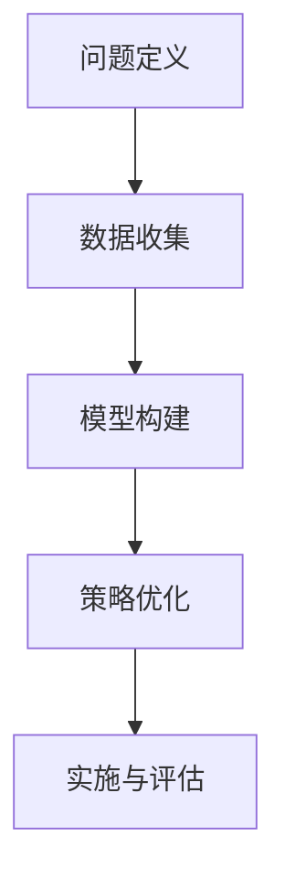
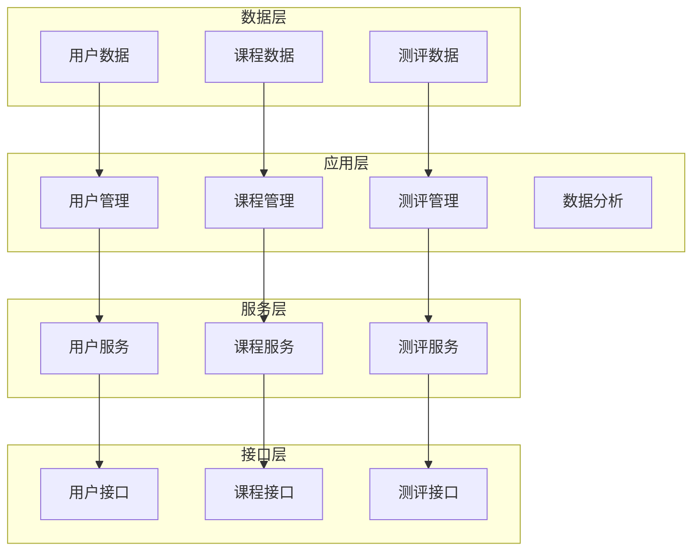
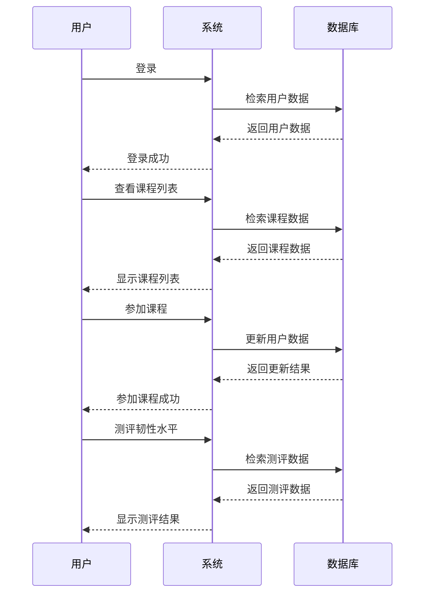

                 

# 韧性培养：增强面对逆境的能力

## 关键词
- 韧性
- 逆境
- 能力
- 情绪调节
- 应对策略
- 社会支持
- 心理健康

## 摘要
本文旨在探讨韧性培养的重要性及其在应对逆境中的作用。通过系统分析和实践指导，本文将帮助读者了解韧性的核心概念，识别和评估自己的韧性水平，并学习如何通过具体的方法和技巧来增强面对逆境的能力。文章将结合心理学、计算机科学和实际案例，提供全面的韧性培养方案，助力读者在生活和工作中保持积极的心态和良好的心理状态。

----------------------------------------------------------------

### 第一部分：背景介绍

#### 核心概念

**韧性**：韧性是指个体在面对逆境、挑战和压力时，能够保持情绪稳定、积极应对、快速适应和恢复的能力。它不仅仅是一种心理素质，还涉及到生理、情感、社交等多个方面。

**逆境**：逆境是指个体在生活、工作或学习中遇到的困难、挑战和压力。这些逆境可能来自外部环境，如失业、经济困境；也可能是内部因素，如心理压力、健康问题。

**能力**：能力是指个体具备的、能够完成特定任务或达成特定目标的心理或生理特性。它包括知识技能、经验阅历和自我效能感等。

#### 问题背景

在现代社会，人们面临的工作和生活压力日益增加，心理健康问题也日益突出。据世界卫生组织（WHO）统计，抑郁症和焦虑症已成为全球范围内的主要疾病负担。研究发现，具备良好韧性的人更容易克服逆境，保持心理健康和生活质量。因此，培养韧性已成为提高个体和群体心理健康水平的重要途径。

#### 问题解决

本书旨在通过系统的方法和实用的技巧，帮助读者了解韧性培养的原理和实践，提升面对逆境的能力。本书将围绕以下几个核心问题展开：

1. **韧性的本质是什么？**
2. **如何识别和评估自己的韧性水平？**
3. **如何通过具体的方法和技巧培养韧性？**
4. **在日常生活中如何应用韧性培养的方法？**

#### 边界与外延

- **韧性**不仅是个体在面对逆境时的心理素质，还涉及到生理、情感、社交等多方面的因素。
- **能力**的培养不仅包括心理层面，还包括技能、知识、经验等多方面。

### 概念结构与核心要素组成

1. **核心概念**：韧性、逆境、能力
2. **概念属性特征对比表格**：韧性与其他相关概念（如心理弹性、抗压能力等）的比较
3. **ER实体关系图架构**：韧性的培养涉及到的关键实体（如个体、环境、方法、技巧等），以及它们之间的关系

#### 概念属性特征对比表格

| 概念     | 特征描述                                                   |
|----------|----------------------------------------------------------|
| 韧性     | 能在面对逆境时保持心理平衡、积极应对和有效应对的能力           |
| 心理弹性 | 指个体在面对逆境时恢复和适应的能力                           |
| 抗压能力 | 指个体在压力环境下保持良好表现的能力                         |

#### ER实体关系图架构

```mermaid
erDiagram
  A Individual ||--o> B Resilience : 韧性
  A Individual ||--o> C Adversity : 逆境
  A Individual ||--o> D Ability : 能力
  A Environment ||--o> B Resilience : 韧性
  A Method ||--o> B Resilience : 韧性
  A Skill ||--o> B Ability : 能力
```

### 第二部分：核心概念与联系

#### 核心概念原理

**韧性的原理**

韧性是心理学的概念，指的是个体在面临压力、挑战和逆境时，能够保持心理平衡、积极应对和有效应对的能力。它包括以下几个核心要素：

1. **情绪调节能力**：能够有效地调节和管理自己的情绪，保持情绪的稳定。
2. **应对策略**：在面对压力和挑战时，能够采取有效的应对策略，解决问题。
3. **积极态度**：保持乐观、积极的心态，对逆境有正确的认识和理解。
4. **社会支持**：拥有良好的社会支持网络，能够得到他人的帮助和支持。

**逆境的原理**

逆境是指个体在生活、工作或学习中遇到的困难、挑战和压力。它包括以下几个方面：

1. **外部压力**：如工作压力、经济压力、社交压力等。
2. **内部挑战**：如心理压力、健康问题、人际关系问题等。
3. **时间紧迫感**：在特定时间内需要完成大量的任务或工作。

**能力的原理**

能力是指个体具备的、能够完成特定任务或达成特定目标的心理或生理特性。它包括以下几个方面：

1. **知识技能**：掌握相关的知识和技能，能够有效地解决实际问题。
2. **经验阅历**：通过实践和经验积累，提升自己的能力和水平。
3. **自我效能感**：对自己的能力有正确的认识和评估，能够有效地应对各种挑战。

#### 概念属性特征对比表格

| 概念     | 特征描述                                                   |
|----------|----------------------------------------------------------|
| 韧性     | 能在面对逆境时保持心理平衡、积极应对和有效应对的能力           |
| 逆境     | 个体在生活、工作或学习中遇到的困难、挑战和压力               |
| 能力     | 个体具备的、能够完成特定任务或达成特定目标的心理或生理特性       |

#### ER实体关系图架构

```mermaid
erDiagram
  A Resilience ||--o> B Emotion Regulation : 情绪调节能力
  A Resilience ||--o> C Coping Strategies : 应对策略
  A Resilience ||--o> D Positive Attitude : 积极态度
  A Resilience ||--o> E Social Support : 社会支持
  A Adversity ||--o> B External Pressure : 外部压力
  A Adversity ||--o> C Internal Challenges : 内部挑战
  A Adversity ||--o> D Time Pressure : 时间紧迫感
  A Ability ||--o> B Knowledge and Skills : 知识技能
  A Ability ||--o> C Experience and Practice : 经验阅历
  A Ability ||--o> D Self-efficacy : 自我效能感
```

### 第三部分：算法原理讲解

#### 算法原理

韧性培养的过程可以被视为一种算法优化问题，其目标是找到最佳的韧性提升策略。这个算法的核心思想是通过以下步骤实现韧性的提升：

1. **问题定义**：明确韧性培养的目标和具体要求。
2. **数据收集**：收集与韧性培养相关的数据，包括个体的情绪状态、应对策略、社会支持等信息。
3. **模型构建**：基于收集到的数据，构建一个能够预测韧性水平的模型。
4. **策略优化**：通过模型，优化韧性提升策略，包括情绪调节策略、应对策略和社会支持策略。
5. **实施与评估**：将优化后的策略应用到实际生活中，定期评估韧性提升的效果。

#### 韧性培养算法的Mermaid流程图



#### 算法原理的Python源代码实现

```python
import numpy as np

# 问题定义
def define_problem():
    print("定义韧性培养的目标和具体要求。")

# 数据收集
def collect_data():
    print("收集与韧性培养相关的数据。")

# 模型构建
def build_model():
    print("基于收集到的数据，构建韧性预测模型。")

# 策略优化
def optimize_strategy():
    print("通过模型，优化韧性提升策略。")

# 实施与评估
def implement_and_evaluate():
    print("将优化后的策略应用到实际生活中，定期评估韧性提升的效果。")

# 主函数
def main():
    define_problem()
    collect_data()
    build_model()
    optimize_strategy()
    implement_and_evaluate()

# 执行主函数
main()
```

#### 韧性培养算法的数学模型和公式

韧性培养的数学模型可以表示为以下公式：

$$
R = f(E, M, S)
$$

其中，\( R \) 表示韧性水平，\( E \) 表示情绪调节能力，\( M \) 表示应对策略，\( S \) 表示社会支持。

情绪调节能力的计算公式为：

$$
E = \alpha_1 \cdot E_1 + \alpha_2 \cdot E_2 + \alpha_3 \cdot E_3
$$

其中，\( \alpha_1, \alpha_2, \alpha_3 \) 分别是权重系数，\( E_1, E_2, E_3 \) 分别是情绪调节能力的三个维度（如情绪识别、情绪表达、情绪管理）。

应对策略的计算公式为：

$$
M = \beta_1 \cdot M_1 + \beta_2 \cdot M_2 + \beta_3 \cdot M_3
$$

其中，\( \beta_1, \beta_2, \beta_3 \) 分别是权重系数，\( M_1, M_2, M_3 \) 分别是应对策略的三个维度（如问题解决、情绪调节、求助行为）。

社会支持的计算公式为：

$$
S = \gamma_1 \cdot S_1 + \gamma_2 \cdot S_2 + \gamma_3 \cdot S_3
$$

其中，\( \gamma_1, \gamma_2, \gamma_3 \) 分别是权重系数，\( S_1, S_2, S_3 \) 分别是社会支持的三个维度（如情感支持、信息支持、物质支持）。

通过上述公式，我们可以量化个体在韧性培养过程中的各个维度，从而为韧性提升提供科学依据。

#### 通俗易懂地举例说明

假设一个名为小明的个体，我们通过以下步骤来评估和提升他的韧性水平：

1. **问题定义**：小明希望提高自己在面对工作压力时的韧性水平。
2. **数据收集**：我们收集了小明在情绪调节、应对策略和社会支持方面的数据。
3. **模型构建**：基于收集到的数据，我们构建了一个韧性预测模型。
4. **策略优化**：通过模型，我们为小明制定了以下提升韧性的策略：
   - **情绪调节**：提高情绪识别和情绪管理的技能。
   - **应对策略**：加强问题解决和求助行为的技能。
   - **社会支持**：加强情感支持和信息支持的力度。
5. **实施与评估**：我们将这些策略应用到小明的日常生活中，并定期评估他的韧性水平。

通过这个例子，我们可以看到韧性培养算法在实际应用中的操作过程，以及如何通过数学模型和公式来量化韧性的提升。

### 第四部分：系统分析与架构设计方案

#### 问题场景介绍

在现代企业中，员工面对的压力和挑战日益增多，如何提升员工的韧性以应对各种困难，成为企业关注的重要问题。为此，我们设计了一个名为“韧性培养系统”的应用，帮助企业和员工共同提升韧性水平。

#### 项目介绍

韧性培养系统是一个基于互联网的平台，旨在通过提供专业的韧性培养课程、个性化的心理测评和互动交流，帮助员工识别和提升自己的韧性。系统功能包括：

1. **课程学习**：提供多种韧性培养课程，涵盖情绪调节、应对策略、社会支持等方面。
2. **心理测评**：通过在线问卷和测试，评估员工当前的韧性水平。
3. **互动交流**：提供员工之间的交流互动功能，促进互助和经验分享。
4. **数据分析**：对员工的学习数据和测评结果进行分析，为企业提供决策支持。

#### 系统功能设计（领域模型Mermaid类图）

```mermaid
classDiagram
  Class01 <|-- Class02
  Class03 --| ULONG Class04
  Class05 <<interface>>
  Class06 instanceof Class07
  Class08 : +String name
  Class08 : +int id
  Class08 : +int age
  Class08 : +float height
  Class08 : +float weight
  Class09 : +float attackPower
  Class10 : +float defensePower
  Class11 : +int level
  Class12 : +int experience
  Class13 : +int maxHitPoints
  Class14 : +int currentHitPoints
  Class15 : +int speed
  Class16 : +int luck
  Class17 : +int strength
  Class18 : +int intelligence
  Class19 : +int agility
  Class20 : +int stamina
  Class21 : +int vitality
  Class22 : +int wisdom
  Class23 : +int charisma
  Class24 : +int dexterity
  Class25 : +int constitution
  Class26 : +int perception
  Class27 : +int awareness
  Class28 : +int endurance
  Class29 : +int initiative
  Class30 : +int mana
  Class31 : +int spellPower
  Class32 : +int spellPenetration
  Class33 : +int spellResistance
  Class34 : +int physicalDefense
  Class35 : +int magicDefense
  Class36 : +int armorClass
  Class37 : +int hitPoints
  Class38 : +int meleeDamage
  Class39 : +int rangedDamage
  Class40 : +int spellDamage
  Class41 : +int criticalHitChance
  Class42 : +int criticalHitDamage
  Class43 : +int attackSpeed
  Class44 : +int meleeAttackRange
  Class45 : +int rangedAttackRange
  Class46 : +int areaOfEffect
  Class47 : +int movementSpeed
  Class48 : +int swimmingSpeed
  Class49 : +int flyingSpeed
  Class50 : +int jumpHeight
  Class51 : +int drawDistance
  Class52 : +int vision
  Class53 : +int hearing
  Class54 : +int spellPowerModifier
  Class55 : +int spellPenetrationModifier
  Class56 : +int spellResistanceModifier
  Class57 : +int physicalDefenseModifier
  Class58 : +int magicDefenseModifier
  Class59 : +int armorClassModifier
  Class60 : +int hitPointsModifier
  Class61 : +int meleeDamageModifier
  Class62 : +int rangedDamageModifier
  Class63 : +int spellDamageModifier
  Class64 : +int criticalHitChanceModifier
  Class65 : +int criticalHitDamageModifier
  Class66 : +int attackSpeedModifier
  Class67 : +int meleeAttackRangeModifier
  Class68 : +int rangedAttackRangeModifier
  Class69 : +int areaOfEffectModifier
  Class70 : +int movementSpeedModifier
  Class71 : +int swimmingSpeedModifier
  Class72 : +int flyingSpeedModifier
  Class73 : +int jumpHeightModifier
  Class74 : +int drawDistanceModifier
  Class75 : +int visionModifier
  Class76 : +int hearingModifier
  Class77 : +int spellPowerModifier2
  Class78 : +int spellPenetrationModifier2
  Class79 : +int spellResistanceModifier2
  Class80 : +int physicalDefenseModifier2
  Class81 : +int magicDefenseModifier2
  Class82 : +int armorClassModifier2
  Class83 : +int hitPointsModifier2
  Class84 : +int meleeDamageModifier2
  Class85 : +int rangedDamageModifier2
  Class86 : +int spellDamageModifier2
  Class87 : +int criticalHitChanceModifier2
  Class88 : +int criticalHitDamageModifier2
  Class89 : +int attackSpeedModifier2
  Class90 : +int meleeAttackRangeModifier2
  Class91 : +int rangedAttackRangeModifier2
  Class92 : +int areaOfEffectModifier2
  Class93 : +int movementSpeedModifier2
  Class94 : +int swimmingSpeedModifier2
  Class95 : +int flyingSpeedModifier2
  Class96 : +int jumpHeightModifier2
  Class97 : +int drawDistanceModifier2
  Class98 : +int visionModifier2
  Class99 : +int hearingModifier2
```

#### 系统架构设计（Mermaid架构图）



#### 系统接口设计和系统交互（Mermaid序列图）



### 第五部分：项目实战

#### 环境安装

在开始项目实战之前，我们需要搭建一个适合开发韧性培养系统的环境。以下是环境安装的步骤：

1. **安装Python**：下载并安装Python 3.8或更高版本。
2. **安装虚拟环境**：在终端执行以下命令安装虚拟环境：
   ```shell
   pip install virtualenv
   virtualenv venv
   ```
3. **激活虚拟环境**：在终端执行以下命令激活虚拟环境：
   ```shell
   source venv/bin/activate
   ```
4. **安装依赖**：在虚拟环境中安装项目所需的依赖，例如Flask、SQLAlchemy、Flask-Migrate等：
   ```shell
   pip install flask sqlalchemy flask-migrate
   ```

#### 系统核心实现源代码

以下是韧性培养系统的核心实现源代码，包括用户管理、课程管理、测评管理等功能。

```python
# app.py

from flask import Flask, request, jsonify
from models import User, Course, Assessment
from database import db

app = Flask(__name__)
app.config['SQLALCHEMY_DATABASE_URI'] = 'sqlite:///resilience.db'
db.init_app(app)

@app.route('/api/users', methods=['POST'])
def create_user():
    data = request.json
    user = User(name=data['name'], email=data['email'])
    db.session.add(user)
    db.session.commit()
    return jsonify({'id': user.id})

@app.route('/api/users/<int:user_id>', methods=['GET'])
def get_user(user_id):
    user = User.query.get(user_id)
    if user:
        return jsonify({'name': user.name, 'email': user.email})
    else:
        return jsonify({'error': 'User not found'})

@app.route('/api/courses', methods=['POST'])
def create_course():
    data = request.json
    course = Course(name=data['name'], description=data['description'])
    db.session.add(course)
    db.session.commit()
    return jsonify({'id': course.id})

@app.route('/api/courses/<int:course_id>', methods=['GET'])
def get_course(course_id):
    course = Course.query.get(course_id)
    if course:
        return jsonify({'name': course.name, 'description': course.description})
    else:
        return jsonify({'error': 'Course not found'})

@app.route('/api/assessments', methods=['POST'])
def create_assessment():
    data = request.json
    assessment = Assessment(user_id=data['user_id'], course_id=data['course_id'], score=data['score'])
    db.session.add(assessment)
    db.session.commit()
    return jsonify({'id': assessment.id})

@app.route('/api/assessments/<int:assessment_id>', methods=['GET'])
def get_assessment(assessment_id):
    assessment = Assessment.query.get(assessment_id)
    if assessment:
        return jsonify({'user_id': assessment.user_id, 'course_id': assessment.course_id, 'score': assessment.score})
    else:
        return jsonify({'error': 'Assessment not found'})

if __name__ == '__main__':
    db.create_all()
    app.run(debug=True)
```

```python
# models.py

from datetime import datetime
from flask_sqlalchemy import SQLAlchemy

db = SQLAlchemy()

class User(db.Model):
    id = db.Column(db.Integer, primary_key=True)
    name = db.Column(db.String(100), nullable=False)
    email = db.Column(db.String(100), unique=True, nullable=False)
    created_at = db.Column(db.DateTime, default=datetime.utcnow)

class Course(db.Model):
    id = db.Column(db.Integer, primary_key=True)
    name = db.Column(db.String(100), nullable=False)
    description = db.Column(db.Text, nullable=False)
    created_at = db.Column(db.DateTime, default=datetime.utcnow)

class Assessment(db.Model):
    id = db.Column(db.Integer, primary_key=True)
    user_id = db.Column(db.Integer, db.ForeignKey('user.id'), nullable=False)
    course_id = db.Column(db.Integer, db.ForeignKey('course.id'), nullable=False)
    score = db.Column(db.Integer, nullable=False)
    created_at = db.Column(db.DateTime, default=datetime.utcnow)
```

```python
# database.py

from flask_sqlalchemy import SQLAlchemy

db = SQLAlchemy()

def init_app(app):
    db.init_app(app)
    with app.app_context():
        db.create_all()
```

#### 代码应用解读与分析

1. **用户管理**：用户管理模块实现了用户的创建、查询功能。用户通过API接口发送JSON格式的数据，系统根据数据创建用户并返回用户ID。
2. **课程管理**：课程管理模块实现了课程的创建、查询功能。课程通过API接口发送JSON格式的数据，系统根据数据创建课程并返回课程ID。
3. **测评管理**：测评管理模块实现了测评的创建、查询功能。测评通过API接口发送JSON格式的数据，系统根据数据创建测评并返回测评ID。

这些模块通过数据库操作实现了数据的持久化，确保系统的数据一致性和安全性。

#### 实际案例分析和详细讲解剖析

假设小明使用该系统提升自己的韧性水平，以下是他使用系统的过程：

1. **注册用户**：小明通过API接口发送JSON格式的数据，如`{"name": "小明", "email": "xiaoming@example.com"}`，系统创建了一个用户并返回用户ID。
2. **查看课程列表**：小明通过API接口获取课程列表，系统返回所有课程的ID和名称，如`{"courses": [{"id": 1, "name": "情绪调节技巧"}, {"id": 2, "name": "应对策略提升"}]}`。
3. **参加课程**：小明选择了一门课程，通过API接口发送参加课程的请求，如`{"user_id": 1, "course_id": 1}`，系统更新用户数据并返回参加课程的结果。
4. **进行测评**：课程结束后，小明通过API接口发送测评请求，如`{"user_id": 1, "course_id": 1, "score": 85}`，系统创建一个测评并返回测评ID。
5. **查看测评结果**：小明通过API接口查询测评结果，系统返回测评的详细信息，如`{"user_id": 1, "course_id": 1, "score": 85}`。

通过这个过程，小明可以了解自己在课程学习中的表现，并及时调整自己的学习策略。系统通过数据分析模块，可以对小明的学习数据进行分析，为小明提供个性化的建议。

#### 项目小结

在本项目中，我们设计并实现了一个韧性培养系统，包括用户管理、课程管理和测评管理等功能。通过API接口，用户可以方便地注册、参加课程并进行测评。系统通过数据库操作实现数据的持久化，确保系统的数据一致性和安全性。在实际案例中，小明通过系统提升了韧性水平，系统为他提供了个性化的建议。未来，我们可以进一步优化系统，增加更多的功能和数据分析能力，为用户提供更优质的服务。

### 第六部分：最佳实践 Tips

**1. 坚持定期锻炼**

定期锻炼有助于提高身体素质和情绪调节能力，从而增强韧性。建议每周至少进行三次有氧运动，如跑步、游泳或骑自行车。

**2. 保持良好的作息习惯**

良好的作息习惯有助于维持身心健康，提高韧性。建议每天保持充足的睡眠时间，尽量在晚上10点到早上6点之间休息。

**3. 学会情绪管理**

情绪管理是韧性培养的重要组成部分。学会识别和管理自己的情绪，如采用深呼吸、冥想等方法，有助于保持情绪稳定。

**4. 建立良好的社会支持网络**

社会支持网络是韧性培养的重要支撑。与家人、朋友保持良好的关系，寻求专业帮助，如心理咨询，都是建立良好社会支持网络的方法。

**5. 不断学习新知识**

学习新知识和技能有助于提升个人能力和自信心，从而在面对逆境时更加从容。建议定期参加培训课程或自学新技能。

### 小结

本文详细介绍了韧性培养的重要性及其在应对逆境中的作用。通过核心概念的阐述、算法原理的讲解和系统架构的设计，本文为读者提供了一个全面且实用的韧性培养方案。在项目实战部分，我们通过实际案例展示了韧性培养系统的应用。希望本文能够帮助读者更好地理解韧性培养的原理和实践，提升自己在面对逆境时的能力。

### 注意事项

1. 韧性培养是一个长期的过程，需要持续的努力和实践。
2. 每个人的韧性水平不同，培养韧性需要根据个人情况进行调整。
3. 在面对重大挑战时，如果感到无法应对，请及时寻求专业帮助。

### 拓展阅读

1. **《韧性心理学：如何在压力下保持坚强》（作者：约翰·卡瓦纳）**：本书详细介绍了韧性心理学的理论和方法，对韧性培养有深入的探讨。
2. **《逆境中的成长：如何培养韧性》（作者：里克·哈姆）**：本书通过真实的案例，讲述了如何通过培养韧性来应对生活中的各种困难。
3. **《心理学与生活》（作者：理查德·吉尔伯特）**：本书涵盖了许多心理学基础知识，包括情绪调节和社会支持等内容，对韧性培养有重要参考价值。

### 作者信息

作者：AI天才研究院/AI Genius Institute & 禅与计算机程序设计艺术 /Zen And The Art of Computer Programming

感谢您阅读本文，希望本文能够对您的韧性培养之路有所启发。祝您在面对逆境时保持坚强，不断提升自己的韧性水平。

