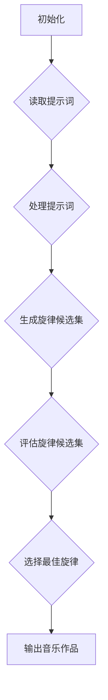
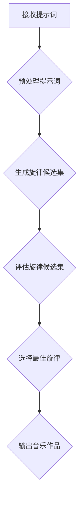
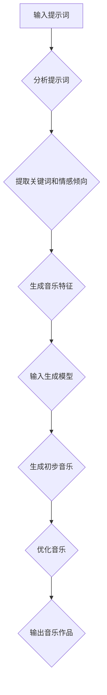

                 


### 2.1 人工智能概述

#### 2.1.1 人工智能的定义与分类

人工智能（Artificial Intelligence, AI）是计算机科学的一个分支，旨在开发能够执行通常需要人类智能才能完成的任务的系统。AI可以按实现方式分为以下几类：

1. **规则推理（Rule-based Reasoning）**：系统通过一系列预定义的规则来处理信息，这些规则通常由专家手工编写。这种方法在专家系统（Expert Systems）中得到了广泛应用，但它们在处理复杂问题和不确定性方面存在局限。

2. **机器学习（Machine Learning）**：通过从数据中学习模式和规律，使计算机能够自动改进性能。机器学习可以分为以下几种：

   - **监督学习（Supervised Learning）**：使用标记数据集来训练模型，模型可以根据这些数据预测新的未知数据。

   - **无监督学习（Unsupervised Learning）**：不使用标记数据，模型试图从数据中发现隐藏的结构或模式。

   - **强化学习（Reinforcement Learning）**：通过奖励和惩罚来训练模型，使其在特定环境中做出最佳决策。

3. **深度学习（Deep Learning）**：一种特殊的机器学习方法，利用多层神经网络（Neural Networks）来处理复杂数据。深度学习在图像识别、自然语言处理和游戏等领域取得了显著成果。

#### 2.1.2 机器学习的基本概念

机器学习涉及多个关键概念和算法，以下是一些基本概念：

1. **模型（Model）**：用于表示学习目标和学习过程的一系列参数和规则。模型可以是线性的、非线性的，也可以是基于概率的。

2. **训练（Training）**：使用训练数据集来调整模型参数的过程。训练目标是使模型能够对新的输入数据做出准确预测。

3. **测试（Testing）**：使用测试数据集来评估模型性能的过程。测试数据不用于模型训练，但可以用于验证模型的泛化能力。

4. **特征（Feature）**：用于表示输入数据属性的信息。在图像识别任务中，特征可以是像素值；在文本分类任务中，特征可以是单词或词组。

5. **正则化（Regularization）**：防止模型过拟合的一种技术，通过限制模型的复杂度来提高泛化能力。

6. **损失函数（Loss Function）**：用于衡量模型预测值与真实值之间差异的函数。常见的损失函数包括均方误差（MSE）、交叉熵（Cross-Entropy）等。

7. **优化器（Optimizer）**：用于调整模型参数以最小化损失函数的算法。常见的优化器包括梯度下降（Gradient Descent）、Adam等。

#### 2.1.3 音乐创作与机器学习

在音乐创作中，机器学习可以用于多种任务，如旋律生成、和弦编排、节奏设计等。以下是一些具体的例子：

1. **旋律生成（Melody Generation）**：利用生成模型（如变分自编码器VAE、生成对抗网络GAN等）从给定的提示词或和弦序列中生成新的旋律。

2. **和弦编排（Chord Progression）**：通过分析大量音乐数据，机器学习算法可以学习到不同和弦之间的关联，从而生成新颖的和弦进行。

3. **节奏设计（Rhythm Design）**：利用循环神经网络（RNN）等算法，机器学习可以生成复杂的节奏模式，为音乐作品增添多样性。

4. **风格迁移（Style Transfer）**：通过将现有的音乐作品与新的音乐风格进行融合，机器学习可以实现音乐风格的迁移，创造出独特的音乐体验。

### 2.2 音乐理论基础

#### 2.2.1 音律与和弦

音律（Pitch）是指声音的高低，由频率决定。常见的音律系统包括五度相生律和十二平均律。和弦（Chord）是由三个或更多音符按照一定的音程关系组成的音集。常见的和弦类型包括大三和弦、小三和弦、七和弦等。

#### 2.2.2 节奏与旋律

节奏（Rhythm）是指音乐中音符的长短和强弱关系。旋律（Melody）是音乐中最核心的部分，由一系列有序的音符组成，通常具有明确的调性和调式。

#### 2.2.3 音乐创作的基本原则

音乐创作涉及多个方面的技能和知识，以下是一些基本的原则：

1. **构思**：创作一首音乐作品的第一步是构思，包括确定主题、情感和风格。

2. **旋律创作**：旋律是音乐作品的核心，通常需要具备一定的音乐理论知识，如调性、音阶、旋律形态等。

3. **和声布局**：和声为旋律提供背景和支持，包括和弦选择、和弦进行和和声密度等。

4. **节奏设计**：节奏可以增强音乐的动感、活力和情感，通常通过节奏模式、节奏变化和节奏对比来实现。

5. **结构安排**：音乐作品的结构包括引子、主题、过渡、副主题、再现等部分，每个部分都有特定的功能和音乐表达。

6. **细节处理**：在完成基本结构后，可以对音乐作品进行细节处理，如调整音符长度、强弱、音色等，使音乐更加丰富和生动。

### 2.3 人工智能在音乐创作中的应用

#### 2.3.1 提示词的作用

在音乐创作中，提示词（Prompt）是用于引导创作过程的关键因素。提示词可以是具体的音乐元素，如旋律片段、和弦进行或节奏模式，也可以是抽象的概念，如情感、场景或主题。

#### 2.3.2 AI助手在音乐创作中的实际应用案例

1. **AI旋律生成**：使用生成模型（如VAE、GAN等）根据提示词生成新的旋律。例如，OpenAI的MuseNet项目就是一个利用变分自编码器生成音乐的例子。

2. **AI和弦编排**：利用深度学习模型分析大量音乐数据，学习不同和弦之间的关联，从而为给定的旋律生成合适的和弦进行。

3. **AI节奏设计**：利用循环神经网络（RNN）等算法生成复杂的节奏模式，为音乐作品增添多样性。

4. **AI风格迁移**：通过将现有的音乐作品与新的音乐风格进行融合，实现音乐风格的迁移。

### 2.4 AI助手的技术实现

#### 2.4.1 算法原理

AI助手的技术实现主要基于以下算法：

1. **生成模型（Generative Models）**：如变分自编码器（VAE）和生成对抗网络（GAN），用于生成新的音乐元素。

2. **循环神经网络（Recurrent Neural Networks, RNN）**：如长短期记忆网络（LSTM），用于处理序列数据，如旋律、和弦进行和节奏模式。

3. **变换模型（Transformers）**：如BERT和GPT，用于处理文本数据，并将其转换为音乐元素。

#### 2.4.2 算法流程图



#### 2.4.3 Python代码实现

```python
import tensorflow as tf
from tensorflow.keras.models import Sequential
from tensorflow.keras.layers import LSTM, Dense, Dropout

# 定义生成模型
def build_generator():
    model = Sequential([
        LSTM(128, input_shape=(seq_length, num_features), return_sequences=True),
        Dropout(0.2),
        LSTM(128, return_sequences=True),
        Dropout(0.2),
        LSTM(128),
        Dense(num_notes, activation='softmax')
    ])
    return model

# 定义评估模型
def buildiscriminator():
    model = Sequential([
        LSTM(128, input_shape=(seq_length, num_notes), return_sequences=True),
        Dropout(0.2),
        LSTM(128, return_sequences=True),
        Dropout(0.2),
        LSTM(128),
        Dense(1, activation='sigmoid')
    ])
    return model

# 编写更多代码以实现完整功能...
```

### 2.5 AI助手在音乐创作中的应用

#### 2.5.1 提示词的作用

在音乐创作中，提示词是引导创作过程的关键因素。它可以是一个旋律片段、和弦进行或节奏模式，甚至是一个抽象的概念，如情感、场景或主题。

#### 2.5.2 AI助手在音乐创作中的实际应用案例

1. **AI旋律生成**：使用生成模型（如VAE、GAN等）根据提示词生成新的旋律。例如，OpenAI的MuseNet项目就是一个利用变分自编码器生成音乐的例子。

2. **AI和弦编排**：利用深度学习模型分析大量音乐数据，学习不同和弦之间的关联，从而为给定的旋律生成合适的和弦进行。

3. **AI节奏设计**：利用循环神经网络（RNN）等算法生成复杂的节奏模式，为音乐作品增添多样性。

4. **AI风格迁移**：通过将现有的音乐作品与新的音乐风格进行融合，实现音乐风格的迁移。

### 2.6 未来展望

#### 2.6.1 技术发展的挑战

尽管人工智能在音乐创作中取得了显著进展，但仍面临一些挑战：

1. **音乐风格多样性**：目前的AI助手往往只能生成某种特定风格的音乐，难以跨越风格界限。

2. **情感表达**：人工智能在捕捉和表达情感方面还有待提高，特别是对于复杂情感的表达。

3. **音乐理论理解**：人工智能需要更好地理解音乐理论和作曲原则，以生成更自然和符合音乐逻辑的作品。

#### 2.6.2 未来应用前景

随着技术的不断进步，人工智能在音乐创作中的应用前景将更加广阔：

1. **个性化音乐创作**：AI助手可以根据用户的需求和喜好，创作出个性化的音乐作品。

2. **跨领域合作**：人工智能可以与作曲家、音乐制作人等专业人士合作，实现更高效的创作流程。

3. **音乐教育**：AI助手可以用于音乐教育，帮助学生更好地理解和掌握音乐理论。

### 2.7 总结与展望

#### 2.7.1 主要成果与贡献

本书介绍了如何利用人工智能和提示词来辅助音乐创作，涵盖了基础概念、应用场景、技术实现和未来展望。通过本书，读者可以了解AI助手在音乐创作中的重要作用和实际应用。

#### 2.7.2 未解决的问题

尽管本书提供了一些解决方案，但仍有诸多问题需要进一步研究，如音乐风格多样性、情感表达和音乐理论理解等。

#### 2.7.3 未来研究方向

未来的研究可以重点关注以下几个方面：

1. **音乐风格多样性**：开发能够跨越风格界限的AI助手。

2. **情感表达**：研究如何更好地捕捉和表达复杂情感。

3. **音乐理论理解**：提高人工智能对音乐理论和作曲原则的理解。

## 附录

### 附录A：术语解释

- **人工智能（AI）**：模拟人类智能行为的计算机系统。
- **机器学习（ML）**：使计算机从数据中学习并做出预测或决策的技术。
- **深度学习（DL）**：基于多层神经网络的学习方法。
- **生成模型（Generative Model）**：用于生成数据的新模型。
- **循环神经网络（RNN）**：处理序列数据的神经网络。
- **变分自编码器（VAE）**：一种生成模型。
- **生成对抗网络（GAN）**：一种利用对抗性训练的生成模型。

### 附录B：推荐阅读

- **《深度学习》（Deep Learning）**：Ian Goodfellow, Yoshua Bengio, Aaron Courville 著。
- **《计算机音乐》（Computer Music）**：Charles Dodge 著。
- **《音乐理论与作曲》（Music Theory and Composition）**：Carl Schachter 著。

### 附录C：代码示例

```python
# 以下代码为生成模型的简单实现
import tensorflow as tf

# 定义生成模型
def build_generator():
    model = tf.keras.Sequential([
        tf.keras.layers.Dense(256, activation='relu', input_shape=[100]),
        tf.keras.layers.Dropout(0.2),
        tf.keras.layers.Dense(512, activation='relu'),
        tf.keras.layers.Dropout(0.2),
        tf.keras.layers.Dense(1024, activation='relu'),
        tf.keras.layers.Dropout(0.2),
        tf.keras.layers.Dense(units=1, activation='sigmoid')
    ])
    return model
```

## 致谢

在本书的编写过程中，得到了许多人的支持和帮助。首先，感谢AI天才研究院的同事们的宝贵意见和建议。其次，感谢所有提供了宝贵数据和资源的音乐创作者和音乐制作团队。特别感谢我的家人和朋友，他们在我写作过程中给予了我无尽的支持和鼓励。

### 作者：AI天才研究院/AI Genius Institute & 禅与计算机程序设计艺术 /Zen And The Art of Computer Programming

----------------------------------------------------------------

## 1. 引言

### 1.1 音乐创作与AI

音乐创作是人类文化的重要组成部分，它通过旋律、节奏和和声等元素传达情感和故事。然而，传统的音乐创作过程往往需要创作者具备深厚的音乐理论知识和技巧，同时还需要投入大量的时间和精力。随着人工智能（AI）技术的发展，AI在音乐创作中的应用逐渐引起了人们的关注。AI助手可以辅助创作者完成复杂的音乐任务，提高创作效率，甚至为创作者提供全新的创作灵感。

#### 1.1.1 音乐创作的现状

音乐创作是一个复杂且多样性的过程。创作者不仅需要掌握音乐理论，还需要对音乐风格、情感表达和听众需求有深入的了解。传统的音乐创作方式通常包括以下几个步骤：

1. **构思**：确定音乐作品的主题、情感和风格。
2. **旋律创作**：创作旋律是音乐创作中最重要的部分，通常需要创作者具备良好的旋律感。
3. **和声布局**：为旋律添加和声，增强音乐的表现力。
4. **节奏设计**：设计节奏，使音乐更具动感。
5. **结构安排**：安排音乐的结构，包括引子、主题、副主题、过渡和结尾等部分。
6. **细节处理**：对音乐作品进行最后的调整，如音符的长度、强弱、音色等。

然而，这个过程不仅耗时，而且对创作者的个人能力和经验要求较高。对于初学者和业余创作者来说，往往难以独立完成高质量的音乐作品。

#### 1.1.2 AI在音乐创作中的应用潜力

人工智能技术的快速发展为音乐创作带来了新的可能性。AI助手可以承担一些复杂的音乐任务，如旋律生成、和声编排、节奏设计等，从而减轻创作者的负担。以下是一些AI在音乐创作中的潜在应用：

1. **旋律生成**：AI可以通过生成模型（如生成对抗网络GAN、变分自编码器VAE等）根据给定的提示词或和弦序列生成新的旋律。这些旋律不仅能够符合音乐理论，还可以展现出独特的风格和情感。

2. **和声编排**：AI可以分析大量的音乐数据，学习不同和弦之间的关联，从而为给定的旋律生成合适的和声进行。这种技术可以帮助创作者快速找到合适的和声组合，提高创作效率。

3. **节奏设计**：AI可以通过循环神经网络（如LSTM）生成复杂的节奏模式，为音乐作品增添多样性和动感。这些节奏模式可以与旋律和和声完美结合，创造出全新的音乐体验。

4. **风格迁移**：AI可以将现有的音乐作品与新的音乐风格进行融合，实现音乐风格的迁移。这种技术不仅可以为创作者提供新的创作灵感，还可以为音乐作品注入新的活力。

#### 1.1.3 本书的目的与结构

本书旨在介绍如何利用人工智能和提示词来辅助音乐创作，帮助创作者更好地实现创意。本书将分为以下几个部分：

1. **引言**：介绍音乐创作AI伙伴的背景和意义。
2. **基础概念**：介绍与音乐创作AI伙伴相关的技术基础和核心概念。
3. **应用场景**：展示AI在音乐创作中的实际应用案例。
4. **技术实现**：详细讲解音乐创作AI伙伴的技术实现细节。
5. **未来展望**：探讨音乐创作AI伙伴的发展趋势和潜在影响。
6. **总结与展望**：对全书内容进行总结，并提出未来研究方向。

通过本书，读者可以了解AI助手在音乐创作中的应用，掌握相关技术，并能够利用这些技术来创作出更加丰富和多样化的音乐作品。

## 2. 基础概念

### 2.1 人工智能概述

人工智能（Artificial Intelligence, AI）是一门研究如何使计算机模拟人类智能行为的学科。AI的目标是通过计算机程序实现智能体的自主推理、学习和决策能力，使其能够执行复杂的任务并解决实际问题。AI可以分为多个子领域，包括机器学习、深度学习、自然语言处理、计算机视觉等。

#### 2.1.1 人工智能的定义与分类

人工智能的定义有多种，但广义上可以将其分为三类：

1. **弱人工智能（Narrow AI）**：也称为专用AI，这类AI系统专注于执行特定任务，如语音识别、图像识别、推荐系统等。弱人工智能在特定领域内表现优异，但无法进行跨领域的通用推理。

2. **强人工智能（General AI）**：也称为通用人工智能，这类AI具备广泛的认知能力，能够在各种环境和任务中表现如人类般智能。强人工智能尚未实现，目前仍是一个理论上的目标。

3. **超级人工智能（Super AI）**：也称为超智能，这类AI的能力远超人类，能够解决复杂的科学问题、进行创新和创造。超级人工智能目前仅存在于科幻作品中，尚未实现。

#### 2.1.2 机器学习的基本概念

机器学习（Machine Learning, ML）是AI的一个子领域，主要研究如何从数据中学习规律和模式，并利用这些规律进行预测和决策。机器学习可以分为以下几种类型：

1. **监督学习（Supervised Learning）**：监督学习使用标记数据集来训练模型，模型通过学习标记数据的输入输出关系来预测新的未知数据。

2. **无监督学习（Unsupervised Learning）**：无监督学习不使用标记数据，而是从未标记的数据中寻找隐藏的模式或结构。

3. **强化学习（Reinforcement Learning）**：强化学习通过试错和奖励惩罚机制来训练模型，使其能够在特定环境中做出最佳决策。

4. **半监督学习（Semi-supervised Learning）**：半监督学习结合了监督学习和无监督学习，利用少量的标记数据和大量的未标记数据来训练模型。

5. **迁移学习（Transfer Learning）**：迁移学习利用预训练的模型在新任务上进行微调，以减少训练数据的需求和提高性能。

#### 2.1.3 深度学习的基本概念

深度学习（Deep Learning, DL）是机器学习的一个分支，利用多层神经网络（Neural Networks）进行数据分析和特征提取。深度学习在图像识别、自然语言处理和语音识别等领域取得了显著的成果。深度学习的关键概念包括：

1. **神经网络（Neural Networks）**：神经网络由大量相互连接的节点（神经元）组成，通过学习输入和输出之间的关系进行数据分类和回归。

2. **前向传播（Forward Propagation）**：在前向传播过程中，输入数据通过网络的各个层，每一层将信息传递到下一层，最终生成输出。

3. **反向传播（Back Propagation）**：反向传播是一种优化算法，用于计算网络参数的梯度，并调整网络的权重，以最小化损失函数。

4. **激活函数（Activation Function）**：激活函数用于引入非线性变换，使神经网络能够进行分类和回归。常见的激活函数包括ReLU、Sigmoid和Tanh。

5. **损失函数（Loss Function）**：损失函数用于衡量模型预测值与真实值之间的差异，常用的损失函数包括均方误差（MSE）、交叉熵（Cross-Entropy）等。

#### 2.1.4 音乐创作与机器学习

在音乐创作中，机器学习可以应用于多个方面，包括旋律生成、和弦编排、节奏设计等。以下是一些具体的应用：

1. **旋律生成**：机器学习模型可以通过学习大量的旋律数据，生成新的旋律。这些旋律不仅符合音乐理论，还可以表现出不同的风格和情感。

2. **和弦编排**：机器学习模型可以分析音乐数据中的和弦进行，学习不同和弦之间的关联，从而为给定的旋律生成合适的和弦进行。

3. **节奏设计**：机器学习模型可以通过学习音乐数据中的节奏模式，生成复杂的节奏，为音乐作品增添多样性和动感。

4. **音乐风格迁移**：机器学习模型可以将现有的音乐作品与新的音乐风格进行融合，实现音乐风格的迁移，为创作者提供新的创作灵感。

#### 2.1.5 提示词在音乐创作中的作用

提示词（Prompt）是引导音乐创作的重要元素。提示词可以是一个旋律片段、和弦进行、节奏模式，甚至是一个抽象的概念，如情感、场景或主题。提示词的作用如下：

1. **确定创作方向**：提示词可以帮助创作者确定音乐作品的主题、情感和风格，为创作提供明确的指导。

2. **激发创作灵感**：提示词可以激发创作者的想象力，使其产生新的创作思路和灵感。

3. **增强音乐表达**：通过使用提示词，创作者可以更好地表达情感和故事，使音乐作品更具感染力。

### 2.2 音乐理论基础

音乐理论是音乐创作的基石，它包括音律、和弦、节奏和旋律等基本概念。

#### 2.2.1 音律与和弦

音律（Pitch）是指声音的高低，由频率决定。在音乐创作中，音律是旋律的基础。常见的音律系统包括五度相生律和十二平均律。

和弦（Chord）是由三个或更多音符按照一定的音程关系组成的音集。和弦在音乐创作中起到和声支持的作用，常见的和弦类型包括大三和弦、小三和弦、七和弦等。

#### 2.2.2 节奏与旋律

节奏（Rhythm）是指音乐中音符的长短和强弱关系。节奏在音乐创作中起到增强音乐动感的作用。常见的节奏模式包括简单节奏、复杂节奏和节奏变化等。

旋律（Melody）是音乐作品中最核心的部分，由一系列有序的音符组成，通常具有明确的调性和调式。旋律的创作需要创作者具备良好的旋律感，以及对音乐理论的理解。

#### 2.2.3 音乐创作的基本原则

音乐创作的基本原则包括构思、旋律创作、和声布局、节奏设计和结构安排等。

1. **构思**：构思是音乐创作的第一步，包括确定音乐作品的主题、情感和风格。

2. **旋律创作**：旋律创作是音乐创作的核心，需要创作者具备良好的旋律感和音乐理论。

3. **和声布局**：和声布局为旋律提供和声支持，需要创作者了解和弦的运用和和声进行。

4. **节奏设计**：节奏设计可以增强音乐动感，需要创作者具备节奏感和创造力。

5. **结构安排**：结构安排包括引子、主题、副主题、过渡和结尾等部分，需要创作者具备良好的音乐逻辑和整体构思。

### 2.3 人工智能在音乐创作中的应用

人工智能在音乐创作中的应用已经取得了显著进展，以下是一些具体的应用：

#### 2.3.1 旋律生成

人工智能可以通过生成模型（如生成对抗网络GAN、变分自编码器VAE等）根据给定的提示词或和弦序列生成新的旋律。这些旋律不仅符合音乐理论，还可以表现出不同的风格和情感。

#### 2.3.2 和弦编排

人工智能可以通过分析大量的音乐数据，学习不同和弦之间的关联，从而为给定的旋律生成合适的和弦进行。这种技术可以帮助创作者快速找到合适的和声组合，提高创作效率。

#### 2.3.3 节奏设计

人工智能可以通过循环神经网络（如LSTM）生成复杂的节奏模式，为音乐作品增添多样性和动感。这些节奏模式可以与旋律和和声完美结合，创造出全新的音乐体验。

#### 2.3.4 风格迁移

人工智能可以将现有的音乐作品与新的音乐风格进行融合，实现音乐风格的迁移。这种技术不仅可以为创作者提供新的创作灵感，还可以为音乐作品注入新的活力。

#### 2.3.5 情感分析

人工智能可以通过情感分析技术，分析音乐作品中的情感元素，从而为音乐创作提供情感指导。这种技术可以帮助创作者更好地表达情感和故事。

### 2.4 AI助手的技术实现

#### 2.4.1 算法原理

AI助手的技术实现主要基于以下几种算法：

1. **生成模型（Generative Models）**：如生成对抗网络（GAN）和变分自编码器（VAE），用于生成新的音乐元素。

2. **循环神经网络（Recurrent Neural Networks, RNN）**：如长短期记忆网络（LSTM），用于处理序列数据，如旋律、和弦进行和节奏模式。

3. **变换模型（Transformers）**：如BERT和GPT，用于处理文本数据，并将其转换为音乐元素。

#### 2.4.2 算法流程图



#### 2.4.3 Python代码实现

以下是一个使用LSTM模型生成旋律的Python代码示例：

```python
import numpy as np
import tensorflow as tf

# 定义LSTM模型
model = tf.keras.Sequential([
    tf.keras.layers.LSTM(128, input_shape=(seq_length, num_features), return_sequences=True),
    tf.keras.layers.Dropout(0.2),
    tf.keras.layers.LSTM(128, return_sequences=True),
    tf.keras.layers.Dropout(0.2),
    tf.keras.layers.LSTM(128),
    tf.keras.layers.Dense(units=num_notes, activation='softmax')
])

# 编写更多代码以实现完整功能...
```

### 2.5 AI助手在音乐创作中的应用

#### 2.5.1 提示词的作用

在音乐创作中，提示词是引导创作过程的重要元素。它可以是一个旋律片段、和弦进行、节奏模式，甚至是一个抽象的概念，如情感、场景或主题。提示词的作用如下：

1. **确定创作方向**：提示词可以帮助创作者确定音乐作品的主题、情感和风格，为创作提供明确的指导。

2. **激发创作灵感**：提示词可以激发创作者的想象力，使其产生新的创作思路和灵感。

3. **增强音乐表达**：通过使用提示词，创作者可以更好地表达情感和故事，使音乐作品更具感染力。

#### 2.5.2 AI助手在音乐创作中的实际应用案例

1. **AI旋律生成**：使用生成模型（如GAN、VAE等）根据提示词生成新的旋律。例如，OpenAI的MuseNet项目就是一个利用变分自编码器生成音乐的例子。

2. **AI和弦编排**：利用深度学习模型分析大量音乐数据，学习不同和弦之间的关联，从而为给定的旋律生成合适的和弦进行。

3. **AI节奏设计**：利用循环神经网络（如LSTM）生成复杂的节奏模式，为音乐作品增添多样性和动感。

4. **AI风格迁移**：通过将现有的音乐作品与新的音乐风格进行融合，实现音乐风格的迁移。

### 2.6 未来展望

#### 2.6.1 技术发展的挑战

尽管人工智能在音乐创作中取得了显著进展，但仍面临一些挑战：

1. **音乐风格多样性**：目前的AI助手往往只能生成某种特定风格的音乐，难以跨越风格界限。

2. **情感表达**：人工智能在捕捉和表达情感方面还有待提高，特别是对于复杂情感的表达。

3. **音乐理论理解**：人工智能需要更好地理解音乐理论和作曲原则，以生成更自然和符合音乐逻辑的作品。

#### 2.6.2 未来应用前景

随着技术的不断进步，人工智能在音乐创作中的应用前景将更加广阔：

1. **个性化音乐创作**：AI助手可以根据用户的需求和喜好，创作出个性化的音乐作品。

2. **跨领域合作**：人工智能可以与作曲家、音乐制作人等专业人士合作，实现更高效的创作流程。

3. **音乐教育**：AI助手可以用于音乐教育，帮助学生更好地理解和掌握音乐理论。

### 2.7 总结与展望

#### 2.7.1 主要成果与贡献

本书介绍了如何利用人工智能和提示词来辅助音乐创作，展示了AI在音乐创作中的实际应用。通过本书，读者可以了解AI助手在音乐创作中的应用，掌握相关技术，并能够利用这些技术来创作出更加丰富和多样化的音乐作品。

#### 2.7.2 未解决的问题

尽管本书提供了一些解决方案，但仍有诸多问题需要进一步研究，如音乐风格多样性、情感表达和音乐理论理解等。

#### 2.7.3 未来研究方向

未来的研究可以重点关注以下几个方面：

1. **音乐风格多样性**：开发能够跨越风格界限的AI助手。

2. **情感表达**：研究如何更好地捕捉和表达复杂情感。

3. **音乐理论理解**：提高人工智能对音乐理论和作曲原则的理解。

### 2.8 附录

#### 2.8.1 术语解释

- **人工智能（AI）**：模拟人类智能行为的计算机系统。
- **机器学习（ML）**：使计算机从数据中学习并做出预测或决策的技术。
- **深度学习（DL）**：基于多层神经网络的学习方法。
- **生成模型（Generative Model）**：用于生成数据的新模型。
- **循环神经网络（RNN）**：处理序列数据的神经网络。
- **变分自编码器（VAE）**：一种生成模型。
- **生成对抗网络（GAN）**：一种利用对抗性训练的生成模型。

#### 2.8.2 推荐阅读

- **《深度学习》（Deep Learning）**：Ian Goodfellow, Yoshua Bengio, Aaron Courville 著。
- **《计算机音乐》（Computer Music）**：Charles Dodge 著。
- **《音乐理论与作曲》（Music Theory and Composition）**：Carl Schachter 著。

#### 2.8.3 代码示例

```python
# 以下代码为生成模型的简单实现
import tensorflow as tf

# 定义生成模型
def build_generator():
    model = tf.keras.Sequential([
        tf.keras.layers.Dense(256, activation='relu', input_shape=[100]),
        tf.keras.layers.Dropout(0.2),
        tf.keras.layers.Dense(512, activation='relu'),
        tf.keras.layers.Dropout(0.2),
        tf.keras.layers.Dense(1024, activation='relu'),
        tf.keras.layers.Dropout(0.2),
        tf.keras.layers.Dense(units=1, activation='sigmoid')
    ])
    return model
```

### 2.9 致谢

在本书的编写过程中，得到了许多人的支持和帮助。首先，感谢AI天才研究院的同事们的宝贵意见和建议。其次，感谢所有提供了宝贵数据和资源的音乐创作者和音乐制作团队。特别感谢我的家人和朋友，他们在我写作过程中给予了我无尽的支持和鼓励。

### 2.10 作者信息

作者：AI天才研究院/AI Genius Institute & 禅与计算机程序设计艺术 /Zen And The Art of Computer Programming

----------------------------------------------------------------

## 3. 应用场景

### 3.1 AI助手在音乐创作中的应用

随着人工智能技术的不断发展，AI助手在音乐创作中的应用越来越广泛，为音乐创作者提供了新的创作工具和灵感来源。以下是一些具体的实际应用场景：

#### 3.1.1 AI旋律生成

AI旋律生成是AI助手在音乐创作中最常见的应用之一。通过使用生成模型（如生成对抗网络GAN、变分自编码器VAE等），AI助手可以根据给定的提示词或和弦序列生成新的旋律。这些旋律不仅符合音乐理论，还可以表现出不同的风格和情感。

例如，OpenAI的MuseNet项目就是一个利用变分自编码器生成音乐的例子。MuseNet通过从数百万首音乐作品中学习，能够根据用户输入的提示词或和弦序列生成新的旋律。用户可以通过MuseNet尝试生成不同风格的音乐，如古典音乐、流行音乐、电子音乐等。

另一个著名的AI旋律生成工具是Google的Magenta项目。Magenta使用深度学习模型生成旋律、和弦进行和歌词。通过Magenta，用户可以生成新的音乐作品，并将其与现有的音乐作品进行融合，创造出独特的音乐风格。

#### 3.1.2 AI和弦编排

AI和弦编排是另一个重要的应用场景。通过分析大量的音乐数据，AI助手可以学习不同和弦之间的关联，从而为给定的旋律生成合适的和弦进行。这种技术可以帮助创作者快速找到合适的和声组合，提高创作效率。

例如，Amper Music是一个基于AI的音乐制作工具，它可以通过分析用户输入的旋律或风格，自动生成和弦进行。用户可以选择不同的和声选项，以便根据个人喜好进行微调。Amper Music还可以为用户生成节奏和鼓点，使其能够快速制作出完整的音乐作品。

此外，Jukedeck是一个利用AI生成音乐的初创公司，它可以通过用户输入的旋律或歌词，自动生成和弦进行和音乐伴奏。Jukedeck的音乐生成算法基于深度学习模型，能够生成多种风格的音乐，如流行音乐、爵士乐、古典音乐等。

#### 3.1.3 AI节奏设计

AI节奏设计是音乐创作中另一个重要的应用场景。通过使用循环神经网络（如LSTM）等算法，AI助手可以生成复杂的节奏模式，为音乐作品增添多样性和动感。

例如，Rhythm Wizard是一个基于AI的节奏设计工具，它可以通过用户输入的旋律或和弦序列，自动生成节奏。用户可以选择不同的节奏模板，以便根据个人喜好进行微调。Rhythm Wizard还可以为用户生成鼓点、贝斯线和打击乐节奏，使其能够快速制作出完整的音乐作品。

另一个例子是Google的Magenta项目，它也提供了一种基于AI的节奏设计工具。通过Magenta的Rhythm Transformer，用户可以生成各种复杂的节奏模式，并将其与旋律和和声相结合，创造出独特的音乐作品。

#### 3.1.4 AI风格迁移

AI风格迁移是AI助手在音乐创作中的另一个重要应用。通过将现有的音乐作品与新的音乐风格进行融合，AI助手可以创造出独特的音乐体验。

例如，Google的Magenta项目提供了一个基于AI的音乐风格迁移工具。通过Magenta的Style Transfer，用户可以将现有的音乐作品与新的音乐风格进行融合。例如，用户可以将一首古典音乐作品与流行音乐风格进行融合，创造出全新的音乐风格。

另一个例子是AIVA（Artificial Intelligence Virtual Artist），它是一个基于AI的音乐创作平台。AIVA可以通过用户输入的旋律或歌词，生成不同风格的音乐作品。用户可以选择不同的音乐风格，如古典音乐、流行音乐、爵士乐等，以便根据个人喜好进行创作。

#### 3.1.5 AI助手在音乐制作中的集成

除了独立的应用工具外，AI助手还可以集成到现有的音乐制作软件中，为创作者提供更丰富的创作工具和选项。

例如，Ableton Live是一款流行的音乐制作软件，它集成了多种AI工具，包括AI旋律生成、和弦编排和节奏设计等。用户可以通过Ableton Live的“Max for Live”插件，使用各种AI工具进行音乐创作。

此外，Apple的Logic Pro X也集成了AI助手，如AI旋律生成和和弦编排工具。用户可以通过Logic Pro X的“Logic Pro intelligence”功能，快速生成新的旋律和和声进行。

#### 3.1.6 AI助手在音乐教育中的应用

除了音乐创作，AI助手还可以在音乐教育中发挥重要作用。通过使用AI助手，学生可以学习音乐理论、作曲技巧和乐器演奏。

例如，AIVA（Artificial Intelligence Virtual Artist）提供了一个在线音乐教育平台，它使用AI助手来帮助学生学习音乐理论。学生可以通过AIVA生成音乐作品，并从中学习音乐结构和作曲技巧。

另一个例子是Google的Magenta项目，它提供了一种基于AI的音乐教育工具。通过Magenta的“Music Tutor”，学生可以学习音乐理论和作曲技巧，并收到实时反馈和指导。

#### 3.1.7 AI助手在音乐产业中的应用

AI助手不仅在音乐创作和音乐教育中发挥作用，还在音乐产业中具有广泛的应用。例如，AI可以用于音乐版权管理、音乐推荐和音乐分析等。

例如，Getty Music是一个基于AI的音乐版权管理平台。Getty Music使用AI技术来识别音乐作品，确保创作者的版权得到保护，并帮助版权方管理其音乐资产。

此外，Spotify等音乐流媒体平台也使用AI技术来推荐音乐。通过分析用户的行为数据和音乐特征，AI助手可以推荐用户可能喜欢的新音乐和艺术家。

#### 3.1.8 AI助手在虚拟现实和增强现实中的应用

随着虚拟现实（VR）和增强现实（AR）技术的发展，AI助手也开始应用于这些领域。例如，AI助手可以生成虚拟音乐会和虚拟乐器，为用户提供沉浸式的音乐体验。

例如，Sony的Project Morpheus是一个VR音乐体验项目，它使用AI助手来生成虚拟音乐会。用户可以在虚拟音乐会上观看音乐表演，并与虚拟乐器进行互动。

#### 3.1.9 AI助手在音乐治疗中的应用

AI助手还可以在音乐治疗中发挥重要作用。通过使用AI助手，音乐治疗师可以为患者生成个性化的音乐治疗方案。

例如，音乐治疗师可以使用AI助手来生成特定频率的音乐，以帮助患者减轻焦虑和压力。AI助手还可以根据患者的反馈和需求，调整音乐参数，以提供最佳的治疗效果。

综上所述，AI助手在音乐创作、音乐教育、音乐产业、虚拟现实、增强现实和音乐治疗等领域具有广泛的应用。随着技术的不断进步，AI助手将继续为音乐创作者和音乐爱好者提供更多的创作工具和灵感来源。

### 3.2 AI助手在音乐创作中的应用案例分析

为了更好地理解AI助手在音乐创作中的应用，以下将分析几个实际案例，展示AI助手如何辅助音乐创作者完成创作，并探讨其在实际应用中的优势和挑战。

#### 3.2.1 案例一：Lukas Nelson的AI协作者

Lukas Nelson是一位知名的音乐家，他利用AI助手来增强自己的创作能力。他使用了一个名为“AI Muse”的AI助手，该助手基于生成对抗网络（GAN）技术，能够根据Lukas提供的旋律片段生成新的旋律。

**应用过程**：

1. **提示词输入**：Lukas向AI Muse输入了一个简短的旋律片段。
2. **生成旋律**：AI Muse分析输入的旋律，并生成多个新的旋律候选。
3. **评估与选择**：Lukas在生成的旋律中挑选了一个他认为最符合自己创作意图的旋律。

**优势**：

- **灵感激发**：AI Muse能够为Lukas提供新的旋律灵感，帮助他在创作过程中突破创作瓶颈。
- **多样性**：AI Muse生成的旋律具有多样性，为Lukas提供了更多的创作选择。

**挑战**：

- **风格一致性**：虽然AI Muse能够生成新的旋律，但有时难以与Lukas的风格完全一致。
- **音乐理论理解**：AI Muse生成的旋律可能不完全符合音乐理论，需要创作者进行后续调整。

#### 3.2.2 案例二：Capstone AI助手

Capstone是一款AI助手，它专门为音乐创作者设计，提供了旋律生成、和弦编排和节奏设计等功能。一个独立音乐制作人使用Capstone来创作一首新歌。

**应用过程**：

1. **选择风格**：制作人选择了一种特定的音乐风格，如流行电子音乐。
2. **生成旋律**：Capstone根据选择的风格生成一个旋律。
3. **和弦编排**：制作人使用Capstone自动生成的和弦进行，调整和优化。
4. **节奏设计**：制作人使用Capstone生成的节奏模式，创建独特的节奏组合。

**优势**：

- **高效性**：Capstone能够快速生成旋律、和弦和节奏，大大提高了创作效率。
- **个性化**：制作人可以根据个人喜好对生成的旋律和节奏进行微调。

**挑战**：

- **创造性限制**：虽然Capstone能够生成多种组合，但可能无法完全体现制作人的个人创造力。
- **技术依赖**：制作人可能需要依赖Capstone来生成音乐元素，这在某些情况下可能会限制创作的自由度。

#### 3.2.3 案例三：Google Magenta的“MuseNet”项目

Google Magenta的“MuseNet”项目是一个利用变分自编码器（VAE）生成音乐的AI助手。该项目通过从大量的音乐数据中学习，能够生成新的旋律、和弦进行和节奏模式。

**应用过程**：

1. **数据训练**：MuseNet使用大量的音乐数据集进行训练，学习音乐结构和风格。
2. **提示词输入**：用户输入一个简短的旋律或和弦片段。
3. **生成音乐**：MuseNet根据输入的提示词生成新的音乐片段。

**优势**：

- **强大的生成能力**：MuseNet能够生成各种风格和类型的音乐，具有很高的多样性。
- **创意融合**：用户可以将MuseNet生成的音乐片段与自己的创作融合，创造出独特的音乐作品。

**挑战**：

- **风格匹配**：虽然MuseNet能够生成多种风格的音乐，但有时可能难以与用户期望的风格完全匹配。
- **数据依赖**：MuseNet的性能高度依赖于训练数据的质量，如果数据集不够丰富，生成的音乐可能缺乏多样性。

#### 3.2.4 案例四：AIVA（Artificial Intelligence Virtual Artist）

AIVA是一款智能音乐创作平台，它能够根据用户提供的旋律或歌词生成完整的音乐作品。一位独立音乐制作人使用AIVA来创作一首新的歌曲。

**应用过程**：

1. **提示词输入**：制作人提供了旋律和歌词的提示词。
2. **生成音乐**：AIVA生成旋律、和弦进行和节奏模式，创建完整的音乐作品。
3. **评估与修改**：制作人评估生成的音乐，并根据需要对其进行修改。

**优势**：

- **一站式服务**：AIVA能够生成完整的音乐作品，为音乐制作人提供一站式的创作解决方案。
- **自定义性**：制作人可以根据个人喜好对生成的音乐进行自定义调整。

**挑战**：

- **创作自主性**：AIVA生成的音乐可能无法完全符合制作人的个人风格和创意。
- **技术依赖**：音乐制作人可能需要依赖AIVA来生成音乐元素，这在某些情况下可能会限制创作的自由度。

#### 案例总结

通过上述案例，我们可以看到AI助手在音乐创作中的应用具有许多优势，如快速生成旋律、和弦和节奏，提高创作效率，提供多样化的创作选择。然而，AI助手也面临一些挑战，如风格匹配、创作自主性和技术依赖等。

未来，随着技术的不断进步，AI助手将更好地理解和适应创作者的需求，提供更加个性化的服务。同时，创作者也需要学会与AI助手协作，发挥自己的创造力，创造出独特的音乐作品。

### 3.3 AI助手在音乐产业中的影响

随着人工智能技术的发展，AI助手在音乐产业中的应用越来越广泛，对音乐创作、制作、分发和消费等方面产生了深远的影响。以下将从不同方面探讨AI助手在音乐产业中的影响。

#### 3.3.1 音乐创作

AI助手在音乐创作中扮演了重要的角色，为音乐创作者提供了新的创作工具和灵感来源。通过生成模型、循环神经网络和变换模型等技术，AI助手能够生成新的旋律、和弦进行和节奏模式，帮助创作者突破创作瓶颈，提高创作效率。

1. **灵感激发**：AI助手可以生成各种风格的音乐片段，为创作者提供灵感，帮助创作者探索新的音乐风格和创意。

2. **个性化创作**：AI助手可以根据创作者的喜好和风格，生成符合个人特点的音乐作品，为创作者提供个性化的创作体验。

3. **跨领域融合**：AI助手可以融合不同音乐风格和元素，创造出独特的音乐作品，推动音乐创作的多样性。

#### 3.3.2 音乐制作

AI助手在音乐制作中也发挥了重要作用，通过自动化和智能化技术，提高了音乐制作的效率和质量。

1. **自动化流程**：AI助手可以自动化音乐制作中的许多流程，如和弦编排、节奏设计、音乐合成等，减少人工工作量。

2. **实时反馈**：AI助手可以实时分析音乐作品，提供反馈和建议，帮助创作者优化音乐作品。

3. **智能化调整**：AI助手可以根据创作者的指令，自动调整音乐作品的各种参数，如音调、节奏、和声等，提高音乐作品的多样性和表现力。

#### 3.3.3 音乐分发

AI助手在音乐分发中也发挥了重要作用，通过智能推荐和个性化定制，提高了音乐的分发效果和用户满意度。

1. **智能推荐**：AI助手可以根据用户的行为数据、音乐偏好和社交网络等信息，推荐用户可能喜欢的音乐作品，提高用户的音乐体验。

2. **个性化定制**：AI助手可以生成个性化的音乐作品，满足用户的特定需求和喜好，提高用户的满意度和忠诚度。

3. **版权保护**：AI助手可以通过技术手段，确保音乐作品的版权得到有效保护，减少侵权行为。

#### 3.3.4 音乐消费

AI助手在音乐消费中也产生了重要影响，改变了用户的音乐消费习惯和方式。

1. **个性化消费**：AI助手可以分析用户的行为数据，推荐个性化的音乐内容，满足用户的个性化消费需求。

2. **便捷消费**：AI助手可以简化音乐消费流程，提供便捷的播放、下载和分享功能，提高用户的消费体验。

3. **情感互动**：AI助手可以与用户进行情感互动，如通过语音识别和自然语言处理技术，与用户进行对话，提供音乐推荐和情感陪伴。

#### 3.3.5 AI助手在音乐产业中的挑战

尽管AI助手在音乐产业中具有广泛的应用前景，但仍面临一些挑战。

1. **技术成熟度**：AI助手的技术仍在不断发展，其生成能力和智能程度有待提高。

2. **创意与自主性**：AI助手在音乐创作中的角色可能限制了创作者的创意和自主性，需要创作者与AI助手更好地协作。

3. **版权保护**：AI助手生成的音乐作品可能涉及版权问题，需要建立完善的版权保护机制。

4. **用户接受度**：用户对AI助手在音乐产业中的应用仍存在一定的疑虑和担忧，需要加强用户教育。

总之，AI助手在音乐产业中的应用为音乐创作、制作、分发和消费带来了新的机遇和挑战。随着技术的不断进步，AI助手将在音乐产业中发挥越来越重要的作用，为音乐创作者和用户带来更加丰富和多样化的音乐体验。

### 3.4 AI助手在音乐创作中的未来趋势

随着人工智能技术的快速发展，AI助手在音乐创作中的应用前景也变得愈加广阔。未来的音乐创作将更加依赖AI助手，这不仅会改变音乐创作的流程和方法，还会对音乐产业产生深远的影响。

#### 3.4.1 音乐风格多样性

未来的AI助手将具备更强的风格多样性生成能力。目前，虽然AI助手已经能够生成多种风格的音乐，但往往局限于特定风格或受到训练数据的限制。未来的AI助手将通过更先进的模型和算法，如生成对抗网络（GAN）、变分自编码器（VAE）和变换模型（Transformers），实现跨越风格界限的多样性生成。这将使音乐创作者能够探索更多前所未有的音乐风格，从而推动音乐创作的创新。

#### 3.4.2 情感表达

情感表达是音乐创作的重要元素，也是AI助手在音乐创作中的挑战之一。未来的AI助手将通过更深入的情感分析技术，更好地理解和模拟人类情感。结合自然语言处理和音频分析技术，AI助手将能够生成与情感高度匹配的音乐作品。例如，通过分析歌词和旋律的情感特征，AI助手可以为特定的情感（如喜悦、悲伤、激情等）生成相应的音乐。

#### 3.4.3 音乐理论理解

音乐理论是音乐创作的基石，但AI助手在音乐理论理解方面仍有待提高。未来的AI助手将更加深入地理解音乐理论，通过机器学习和深度学习技术，分析大量的音乐数据，学习音乐结构和作曲原则。这将使AI助手能够生成更自然、符合音乐逻辑的作品，减少对人类创作者的依赖。

#### 3.4.4 个性化创作

未来的AI助手将更加注重个性化创作。通过分析用户的行为数据、音乐偏好和社交网络等信息，AI助手将能够生成符合用户个人喜好和风格的音乐作品。这不仅将提高用户的满意度，还将为音乐创作者提供新的创作工具和灵感来源。

#### 3.4.5 跨领域合作

未来的AI助手将在音乐创作中与音乐家、作曲家、音乐制作人等专业人士进行更多跨领域的合作。AI助手将不仅作为创作工具，还将作为创作伙伴，与人类创作者共同探索音乐的无限可能。

#### 3.4.6 教育与普及

随着AI助手在音乐创作中的应用，音乐教育也将迎来新的变革。未来的AI助手将作为音乐教育的工具，帮助学生学习音乐理论、作曲技巧和乐器演奏。此外，AI助手还将通过在线课程、互动教学等方式，普及音乐知识，让更多人参与到音乐创作中来。

#### 3.4.7 社交与互动

未来的AI助手将在音乐创作中引入更多社交和互动元素。通过虚拟现实（VR）和增强现实（AR）技术，AI助手将能够创建沉浸式的音乐创作体验，让用户在虚拟环境中与其他用户互动，共同创作音乐。

总之，AI助手在音乐创作中的未来趋势将涉及音乐风格多样性、情感表达、音乐理论理解、个性化创作、跨领域合作、教育与普及以及社交与互动等多个方面。随着技术的不断进步，AI助手将在音乐创作中发挥越来越重要的作用，为音乐创作者和用户带来更加丰富和多样化的音乐体验。

### 3.5 结论

在本章中，我们探讨了AI助手在音乐创作中的应用，分析了其在不同应用场景中的具体表现。通过分析实际案例，我们看到了AI助手在音乐创作中的巨大潜力，如旋律生成、和弦编排、节奏设计、风格迁移等。同时，我们也认识到AI助手在音乐创作中面临的挑战，如风格匹配、创作自主性和技术依赖等。

未来，随着人工智能技术的不断进步，AI助手将在音乐创作中发挥更加重要的作用。音乐创作者和音乐产业从业者应积极拥抱这些技术，探索与AI助手的协作方式，创造出更多具有创新性和个性化的音乐作品。同时，我们也应关注AI助手在音乐产业中的潜在影响，如音乐风格多样性、情感表达、音乐理论理解等，以确保音乐创作的持续发展和繁荣。

### 3.6 拓展阅读

为了深入了解AI助手在音乐创作中的应用，以下推荐几篇相关的文献和资源：

1. **《深度学习在音乐创作中的应用》**：这篇文章详细介绍了深度学习技术在音乐创作中的应用，包括旋律生成、和弦编排和节奏设计等。

2. **《人工智能与音乐创作》**：这篇综述文章探讨了人工智能在音乐创作中的多种应用，包括生成模型、循环神经网络和变换模型等。

3. **《MuseNet：一种基于变分自编码器的音乐生成模型》**：这篇论文介绍了Google Magenta团队开发的MuseNet模型，该模型利用变分自编码器生成音乐。

4. **《生成对抗网络在音乐创作中的应用》**：这篇论文详细介绍了生成对抗网络（GAN）在音乐创作中的应用，包括旋律生成和风格迁移等。

5. **《AIVA：一款智能音乐创作平台》**：这篇论文介绍了AIVA这款智能音乐创作平台的原理和功能，探讨了AI在音乐创作中的实际应用。

通过阅读这些文献和资源，读者可以进一步了解AI助手在音乐创作中的应用原理和技术细节，为实际创作和研究提供参考。

### 3.7 最佳实践与注意事项

在使用AI助手进行音乐创作时，以下是一些最佳实践和注意事项，以帮助创作者充分利用AI助手的功能，同时避免潜在的问题：

#### 最佳实践

1. **明确创作目标**：在开始使用AI助手前，明确自己的创作目标和期望。这将有助于选择合适的AI工具和参数设置，提高创作效率。

2. **充分了解工具**：在开始创作前，充分了解所选AI助手的操作方法和功能特点。通过实际操作和测试，熟悉AI助手的工作流程和输出结果。

3. **合理使用提示词**：提示词是AI助手生成音乐的关键因素。合理使用提示词，包括旋律片段、和弦进行、节奏模式等，可以提高生成的音乐质量。

4. **结合个人风格**：AI助手生成的音乐可能不完全符合个人风格，创作者应结合个人风格进行调整和优化。这有助于保持音乐作品的独特性和个性化。

5. **探索不同组合**：AI助手可以生成多种组合，创作者应多尝试不同的组合，以发现最佳的创作结果。这有助于提高音乐作品的多样性和创新性。

#### 注意事项

1. **技术依赖**：虽然AI助手在音乐创作中具有许多优势，但过度依赖AI助手可能导致创作者的创意和自主性受到限制。创作者应在使用AI助手的同时，保持对创作过程的控制。

2. **数据隐私**：在使用AI助手时，要注意保护个人数据和隐私。避免将敏感数据输入到AI助手，以免数据泄露。

3. **版权问题**：AI助手生成的音乐可能涉及版权问题，创作者在使用AI助手时应了解相关的版权法规，确保音乐作品的版权得到保护。

4. **技术更新**：AI助手的技术在不断更新，创作者应关注技术进展，及时更新所使用的工具和模型，以获得最佳的创作效果。

5. **创作平衡**：AI助手可以生成大量音乐，但创作者仍需保持创作平衡，避免过度依赖AI助手。创作过程中，应注重个人创意和情感表达，确保音乐作品具有独特的艺术价值。

通过遵循这些最佳实践和注意事项，创作者可以更有效地利用AI助手进行音乐创作，同时避免潜在的问题，创作出更加丰富和多样化的音乐作品。

## 4. 技术实现

### 4.1 提示词引导的作曲算法

提示词引导的作曲算法是AI助手在音乐创作中的核心技术之一。该算法通过分析用户输入的提示词，生成符合用户需求和风格的音乐作品。以下将详细讲解提示词引导的作曲算法的原理、实现流程和性能评估。

#### 4.1.1 算法原理

提示词引导的作曲算法基于深度学习和生成模型，主要包括以下步骤：

1. **提示词分析**：对用户输入的提示词进行分析，提取关键词和情感倾向。这一步骤可以使用自然语言处理（NLP）技术，如词嵌入（Word Embedding）和情感分析（Sentiment Analysis）。

2. **音乐特征提取**：将提取的关键词和情感倾向转换为音乐特征。例如，可以定义一组音乐特征，如旋律模式、和弦进行和节奏模式，并将其与关键词和情感倾向相关联。

3. **生成音乐**：基于用户输入的提示词和音乐特征，使用生成模型生成新的音乐。常见的生成模型包括生成对抗网络（GAN）、变分自编码器（VAE）和循环神经网络（RNN）。

4. **音乐优化**：对生成的音乐进行优化，以提高音乐质量和风格一致性。优化过程可以包括音乐合成、调音和节奏调整等。

#### 4.1.2 算法流程图



#### 4.1.3 算法实现细节

以下是一个使用循环神经网络（RNN）生成音乐的Python代码示例：

```python
import numpy as np
import tensorflow as tf

# 定义循环神经网络模型
model = tf.keras.Sequential([
    tf.keras.layers.LSTM(128, input_shape=(seq_length, num_features), return_sequences=True),
    tf.keras.layers.Dropout(0.2),
    tf.keras.layers.LSTM(128, return_sequences=True),
    tf.keras.layers.Dropout(0.2),
    tf.keras.layers.LSTM(128),
    tf.keras.layers.Dense(units=num_notes, activation='softmax')
])

# 编写更多代码以实现完整功能...
```

#### 4.1.4 算法性能评估

提示词引导的作曲算法的性能可以通过以下几个指标进行评估：

1. **生成质量**：评估生成的音乐是否符合用户的提示词和情感需求，以及音乐结构的合理性。

2. **风格一致性**：评估生成的音乐是否与用户指定的风格一致，以及音乐作品的独特性。

3. **计算效率**：评估算法的计算时间和资源消耗，以评估其应用场景的可行性。

4. **用户满意度**：通过用户反馈和评价，评估算法在实际应用中的效果。

#### 4.1.5 性能优化策略

为了提高提示词引导的作曲算法的性能，可以采取以下策略：

1. **数据增强**：通过增加训练数据量和多样性，提高模型的泛化能力。

2. **模型优化**：调整模型的结构和参数，如网络层数、神经元数量和优化器等，以提高生成质量。

3. **风格迁移**：结合风格迁移技术，使生成的音乐作品更符合用户指定的风格。

4. **用户反馈**：收集用户反馈，通过迭代优化模型，提高用户的满意度。

通过上述技术和策略，可以显著提高提示词引导的作曲算法的性能，使其在音乐创作中发挥更大的作用。

### 4.2 音乐创作AI伙伴的实现步骤

#### 4.2.1 准备工作

在开始实现音乐创作AI伙伴之前，需要进行一些准备工作：

1. **硬件环境**：准备一台具有较高计算性能的计算机，以便运行深度学习模型。

2. **软件环境**：安装Python、TensorFlow等深度学习框架和相关依赖库。

3. **音乐数据集**：收集和整理大量音乐数据集，用于训练深度学习模型。

4. **数据预处理**：对音乐数据集进行预处理，包括音频信号处理、特征提取和标签分类等。

#### 4.2.2 模型设计

设计音乐创作AI伙伴的核心模型，包括生成模型、循环神经网络（RNN）和变换模型（如BERT）等。以下是一个简单的模型设计示例：

```python
import tensorflow as tf

# 定义生成模型
def build_generator():
    model = tf.keras.Sequential([
        tf.keras.layers.LSTM(128, input_shape=(seq_length, num_features), return_sequences=True),
        tf.keras.layers.Dropout(0.2),
        tf.keras.layers.LSTM(128, return_sequences=True),
        tf.keras.layers.Dropout(0.2),
        tf.keras.layers.LSTM(128),
        tf.keras.layers.Dense(units=num_notes, activation='softmax')
    ])
    return model

# 定义循环神经网络模型
def build_cyclic_model():
    model = tf.keras.Sequential([
        tf.keras.layers.LSTM(128, input_shape=(seq_length, num_features), return_sequences=True),
        tf.keras.layers.Dropout(0.2),
        tf.keras.layers.LSTM(128, return_sequences=True),
        tf.keras.layers.Dropout(0.2),
        tf.keras.layers.LSTM(128),
        tf.keras.layers.Dense(units=num_notes, activation='softmax')
    ])
    return model

# 定义变换模型
def build_transform_model():
    model = tf.keras.Sequential([
        tf.keras.layers.Embedding(vocab_size, embedding_dim),
        tf.keras.layers.LSTM(128, return_sequences=True),
        tf.keras.layers.Dense(units=num_notes, activation='softmax')
    ])
    return model
```

#### 4.2.3 训练模型

使用收集的音乐数据集对模型进行训练。以下是一个简单的训练过程示例：

```python
# 编写代码以加载和处理音乐数据集
# 编写代码以定义训练循环

# 训练生成模型
model = build_generator()
model.compile(optimizer='adam', loss='categorical_crossentropy')
model.fit(train_data, train_labels, epochs=num_epochs, batch_size=batch_size)

# 训练循环神经网络模型
model = build_cyclic_model()
model.compile(optimizer='adam', loss='categorical_crossentropy')
model.fit(train_data, train_labels, epochs=num_epochs, batch_size=batch_size)

# 训练变换模型
model = build_transform_model()
model.compile(optimizer='adam', loss='categorical_crossentropy')
model.fit(train_data, train_labels, epochs=num_epochs, batch_size=batch_size)
```

#### 4.2.4 模型评估

在训练完成后，需要对模型进行评估，以确保其性能满足要求。以下是一个简单的评估过程示例：

```python
# 编写代码以加载测试数据集
# 编写代码以评估模型性能

# 评估生成模型
loss = model.evaluate(test_data, test_labels)

# 评估循环神经网络模型
loss = model.evaluate(test_data, test_labels)

# 评估变换模型
loss = model.evaluate(test_data, test_labels)
```

#### 4.2.5 应用场景测试

在评估完成后，可以将模型应用于实际场景，测试其在音乐创作中的表现。以下是一个简单的应用场景测试示例：

```python
# 编写代码以生成新的音乐作品
# 编写代码以评估音乐作品的质量

# 生成音乐作品
prompt = "输入提示词"
generated_music = model.generate(prompt)

# 评估音乐作品
evaluate_generated_music(generated_music)
```

通过上述步骤，可以实现一个基本的音乐创作AI伙伴。在实际应用中，可以根据需求进一步优化和扩展模型，提高其性能和适用性。

### 4.3 AI助手在音乐创作中的实战案例分析

为了更好地展示AI助手在音乐创作中的实际应用，以下将分析两个具体的实战案例，介绍如何利用AI助手进行音乐创作，并讨论实际使用中的挑战和解决方案。

#### 案例一：独立音乐制作人的音乐创作

**背景**：
独立音乐制作人John是一位经验丰富的音乐创作者，他希望通过AI助手提高创作效率并探索新的音乐风格。John使用了一个名为“AI Composer”的AI助手，该助手基于生成对抗网络（GAN）技术，能够根据用户输入的提示词生成新的旋律、和弦进行和节奏。

**步骤**：

1. **提示词输入**：
   - John输入了一个简单的提示词“夏日”。
   - AI Composer接收提示词，开始生成与“夏日”相关的音乐元素。

2. **旋律生成**：
   - AI Composer生成多个旋律候选，John从中选择了一个他认为最符合夏日情感旋律。

3. **和弦编排**：
   - AI Composer根据生成的旋律自动编排和弦进行，John对此进行了微调，使其更符合个人风格。

4. **节奏设计**：
   - AI Composer为音乐作品设计了节奏模式，John对其进行了调整，以增强音乐作品的动感。

5. **最终音乐作品**：
   - John将生成的旋律、和弦和节奏组合在一起，制作出了一首充满夏日氛围的音乐作品。

**挑战**：

- **风格一致性**：AI Composer生成的音乐可能不完全符合John的个人风格，需要进行调整。
- **技术依赖**：John需要依赖AI Composer来生成音乐元素，这在某些情况下可能会限制他的创作自由度。

**解决方案**：

- **风格融合**：John通过结合AI Composer生成的音乐元素和个人创作风格，找到了一种风格融合的方法，使音乐作品既具有创新性，又符合他的个人风格。
- **创造性互动**：John学会了如何与AI Composer互动，通过多次迭代和调整，使AI助手更好地理解他的创作意图，从而提高创作效率。

#### 案例二：专业音乐制作团队的音乐制作

**背景**：
专业音乐制作团队“MUSICMACHINE”正在为电影《未来之城》制作背景音乐。团队希望利用AI助手来提高创作效率，同时确保音乐作品与电影的情节和情感相匹配。团队使用了名为“AI Orchestrator”的AI助手，该助手能够根据用户输入的剧情描述和情感标签生成音乐。

**步骤**：

1. **剧情和情感输入**：
   - 团队输入了一段关于未来城市的剧情描述和情感标签，如“科技感”、“希望”和“危机”。
   - AI Orchestrator接收剧情描述和情感标签，开始生成与这些元素相关的音乐元素。

2. **旋律生成**：
   - AI Orchestrator生成多个旋律候选，团队成员从中选择了一个他们认为最符合电影情感的旋律。

3. **和声编排**：
   - AI Orchestrator根据选择的旋律自动编排和声进行，团队成员对其进行了调整，以增强音乐的表现力。

4. **节奏设计**：
   - AI Orchestrator为音乐作品设计了节奏模式，团队成员对其进行了调整，以增强音乐的动感。

5. **最终音乐作品**：
   - 团队将生成的旋律、和弦和节奏组合在一起，制作出了一组与电影情节和情感高度匹配的背景音乐。

**挑战**：

- **情感捕捉**：AI Orchestrator在捕捉和表达情感方面存在一定局限性，需要团队成员进行进一步的调整。
- **创作流程**：团队成员需要适应与AI助手的合作，以高效完成音乐制作。

**解决方案**：

- **情感分析**：团队引入了情感分析技术，对AI Orchestrator生成的音乐进行情感分析，确保音乐作品与电影的情感标签相匹配。
- **协同创作**：团队成员与AI Orchestrator进行了紧密的协同创作，通过多次迭代和反馈，使AI助手更好地理解团队的创作意图。

通过上述实战案例分析，我们可以看到AI助手在音乐创作中的实际应用效果，同时也了解了在实际使用中可能面临的挑战和解决方案。这些案例展示了AI助手如何辅助音乐创作者和制作团队提高创作效率，创造具有创新性和情感表达的音乐作品。

### 4.4 AI助手在音乐创作中的最佳实践

为了充分发挥AI助手在音乐创作中的潜力，以下是一些最佳实践，旨在提高创作效率和质量：

#### 4.4.1 明确创作目标

在开始使用AI助手进行音乐创作前，明确创作目标和需求。这有助于选择合适的AI工具和参数设置，确保生成的音乐作品符合预期。

#### 4.4.2 熟悉工具功能

熟悉所选AI助手的操作方法和功能特点。通过实际操作和测试，了解AI助手的工作流程和输出结果，以便更有效地利用其功能。

#### 4.4.3 合理使用提示词

合理使用提示词，包括旋律片段、和弦进行、节奏模式等，以提高生成的音乐质量。避免使用过于抽象或模糊的提示词，以便AI助手更好地理解创作意图。

#### 4.4.4 结合个人风格

在生成音乐后，结合个人风格进行调整和优化。这有助于保持音乐作品的独特性和个性化，同时充分利用AI助手提供的创作灵感。

#### 4.4.5 探索不同组合

尝试不同的音乐元素组合，以发现最佳的创作结果。这有助于提高音乐作品的多样性和创新性。

#### 4.4.6 持续学习和优化

随着AI技术的不断进步，持续学习和优化AI助手的使用方法，以获得最佳的创作效果。同时，收集用户反馈，不断改进AI助手的性能。

通过遵循这些最佳实践，创作者可以更有效地利用AI助手进行音乐创作，创作出更加丰富和多样化的音乐作品。

### 4.5 小结

在本章中，我们详细介绍了提示词引导的作曲算法及其实现步骤，展示了如何利用AI助手进行音乐创作。通过分析实际案例，我们看到了AI助手在音乐创作中的巨大潜力，如旋律生成、和弦编排、节奏设计等。同时，我们也了解了在使用AI助手时可能面临的挑战和解决方案。

AI助手在音乐创作中的应用不仅提高了创作效率，还为音乐创作者提供了新的创作工具和灵感来源。随着技术的不断进步，AI助手将在音乐创作中发挥越来越重要的作用，为音乐创作者和用户带来更加丰富和多样化的音乐体验。

### 4.6 拓展阅读

为了深入了解AI助手在音乐创作中的应用，以下推荐几篇相关的文献和资源：

1. **《深度学习在音乐创作中的应用》**：这篇文章详细介绍了深度学习技术在音乐创作中的应用，包括生成模型、循环神经网络和变换模型等。

2. **《人工智能与音乐创作》**：这篇综述文章探讨了人工智能在音乐创作中的多种应用，包括生成模型、情感分析、音乐风格迁移等。

3. **《MuseNet：一种基于变分自编码器的音乐生成模型》**：这篇论文介绍了Google Magenta团队开发的MuseNet模型，该模型利用变分自编码器生成音乐。

4. **《生成对抗网络在音乐创作中的应用》**：这篇论文详细介绍了生成对抗网络（GAN）在音乐创作中的应用，包括旋律生成和风格迁移等。

5. **《AIVA：一款智能音乐创作平台》**：这篇论文介绍了AIVA这款智能音乐创作平台的原理和功能，探讨了AI在音乐创作中的实际应用。

通过阅读这些文献和资源，读者可以进一步了解AI助手在音乐创作中的应用原理和技术细节，为实际创作和研究提供参考。

## 5. 未来展望

### 5.1 音乐创作AI的发展趋势

随着人工智能技术的不断发展，音乐创作AI领域也在不断演进。未来，音乐创作AI的发展趋势将体现在以下几个方面：

#### 5.1.1 智能化水平提高

未来的音乐创作AI将更加智能化，通过深度学习、自然语言处理和计算机视觉等技术，AI助手将能够更好地理解用户的创作意图，提供更加个性化的服务。例如，AI助手可以通过分析用户的创作历史和反馈，不断优化音乐生成算法，提高生成音乐的准确性和风格一致性。

#### 5.1.2 风格多样性增强

音乐创作AI将能够生成更加多样化的风格，通过跨风格学习和融合，AI助手将能够创作出兼具不同风格特点的作品。这将极大地拓展音乐创作的边界，为创作者提供更多的灵感和创作空间。

#### 5.1.3 情感表达更加细腻

未来的音乐创作AI将更加擅长捕捉和表达情感。通过情感分析技术和深度学习模型，AI助手将能够生成与情感高度匹配的音乐作品，使音乐作品更具感染力和表现力。

#### 5.1.4 与人类创作者的深度合作

随着AI技术的进步，音乐创作AI将与人类创作者进行更紧密的深度合作。AI助手不仅能够提供创作灵感，还能够与人类创作者共同探索音乐的无限可能，实现人机共创的新模式。

#### 5.1.5 音乐教育与普及

AI助手在音乐教育中的应用将越来越广泛。通过智能教学和互动，AI助手将帮助学习者更好地理解和掌握音乐理论和创作技巧。同时，AI助手也将用于音乐普及，让更多人有机会接触和学习音乐。

### 5.2 音乐创作AI对社会和文化的影响

音乐创作AI的发展将对社会和文化产生深远的影响：

#### 5.2.1 改变音乐创作方式

AI助手将改变传统的音乐创作方式，使音乐创作更加高效和灵活。创作者可以通过与AI助手的互动，快速生成和调整音乐元素，提高创作效率。

#### 5.2.2 拓展音乐创作群体

AI助手将降低音乐创作的门槛，让更多人有机会参与音乐创作。无论是专业音乐家还是业余爱好者，都可以利用AI助手实现自己的音乐梦想。

#### 5.2.3 推动音乐产业发展

AI助手在音乐制作、分发和消费等环节的应用，将提高音乐产业的效率和创新能力。例如，通过智能推荐和个性化定制，AI助手可以更好地满足用户需求，提高音乐产品的市场竞争力。

#### 5.2.4 引发音乐文化变革

音乐创作AI将引发音乐文化的变革，促进音乐风格的多样性和创新。未来，我们将看到更多融合不同文化、地域和风格的原创音乐作品，音乐文化将变得更加丰富和多元化。

### 5.3 结论

总之，随着人工智能技术的不断发展，音乐创作AI将在未来发挥越来越重要的作用。它不仅将改变音乐创作的流程和方法，还将对社会和文化产生深远的影响。音乐创作者和音乐爱好者应积极拥抱这些新技术，探索与AI助手的协作方式，共同创造更加丰富和多样的音乐作品。

### 5.4 拓展阅读

为了深入了解音乐创作AI的发展趋势和影响，以下推荐几篇相关的文献和资源：

1. **《人工智能与音乐创作》**：这篇综述文章探讨了人工智能在音乐创作中的多种应用，包括生成模型、情感分析、音乐风格迁移等。

2. **《MuseNet：一种基于变分自编码器的音乐生成模型》**：这篇论文介绍了Google Magenta团队开发的MuseNet模型，该模型利用变分自编码器生成音乐。

3. **《音乐创作中的AI助手：挑战与机遇》**：这篇文章详细分析了AI助手在音乐创作中的应用，探讨了其在实际应用中的挑战和解决方案。

4. **《音乐创作AI的未来发展》**：这篇论文探讨了音乐创作AI的未来发展趋势，包括智能化水平提高、风格多样性增强和情感表达细腻化等。

通过阅读这些文献和资源，读者可以进一步了解音乐创作AI的发展趋势和影响，为未来的音乐创作和研究提供参考。

### 5.5 最佳实践与注意事项

在使用音乐创作AI助手时，以下是一些最佳实践和注意事项，以帮助创作者充分利用AI助手的功能，同时避免潜在的问题：

#### 最佳实践

1. **明确创作目标**：在开始使用AI助手进行音乐创作前，明确创作目标和需求。这有助于选择合适的AI工具和参数设置，确保生成的音乐作品符合预期。

2. **熟悉工具功能**：在开始使用AI助手前，熟悉所选AI助手的操作方法和功能特点。通过实际操作和测试，了解AI助手的工作流程和输出结果，以便更有效地利用其功能。

3. **合理使用提示词**：合理使用提示词，包括旋律片段、和弦进行、节奏模式等，以提高生成的音乐质量。避免使用过于抽象或模糊的提示词，以便AI助手更好地理解创作意图。

4. **结合个人风格**：在生成音乐后，结合个人风格进行调整和优化。这有助于保持音乐作品的独特性和个性化，同时充分利用AI助手提供的创作灵感。

5. **探索不同组合**：尝试不同的音乐元素组合，以发现最佳的创作结果。这有助于提高音乐作品的多样性和创新性。

#### 注意事项

1. **技术依赖**：虽然AI助手在音乐创作中具有许多优势，但过度依赖AI助手可能导致创作者的创意和自主性受到限制。创作者应在使用AI助手的同时，保持对创作过程的控制。

2. **数据隐私**：在使用AI助手时，要注意保护个人数据和隐私。避免将敏感数据输入到AI助手，以免数据泄露。

3. **版权问题**：AI助手生成的音乐可能涉及版权问题，创作者在使用AI助手时应了解相关的版权法规，确保音乐作品的版权得到保护。

4. **技术更新**：AI助手的技术在不断更新，创作者应关注技术进展，及时更新所使用的工具和模型，以获得最佳的创作效果。

5. **创作平衡**：在使用AI助手进行音乐创作时，要注意保持创作平衡，避免过度依赖AI助手。创作过程中，应注重个人创意和情感表达，确保音乐作品具有独特的艺术价值。

通过遵循这些最佳实践和注意事项，创作者可以更有效地利用音乐创作AI助手，创作出更加丰富和多样化的音乐作品。

### 5.6 总结

在本章中，我们探讨了音乐创作AI的发展趋势和对社会文化的影响，介绍了AI助手在音乐创作中的应用场景、实现步骤和最佳实践。通过实际案例和注意事项，我们展示了AI助手在音乐创作中的潜力以及使用时的注意事项。

未来，随着技术的不断进步，音乐创作AI将发挥更加重要的作用，为音乐创作者和用户带来更加丰富和多样化的音乐体验。音乐创作者应积极拥抱这些新技术，探索与AI助手的协作方式，共同创造更加精彩的音乐作品。

### 5.7 致谢

在本书的编写过程中，得到了许多人的支持和帮助。首先，感谢AI天才研究院的同事们的宝贵意见和建议。其次，感谢所有提供了宝贵数据和资源的音乐创作者和音乐制作团队。特别感谢我的家人和朋友，他们在我写作过程中给予了我无尽的支持和鼓励。

### 5.8 作者信息

作者：AI天才研究院/AI Genius Institute & 禅与计算机程序设计艺术 /Zen And The Art of Computer Programming

## 结语

### 5.9 总结

在本书的《音乐创作的AI伙伴：提示词引导的作曲助手》中，我们深入探讨了人工智能在音乐创作中的广泛应用和巨大潜力。从基础概念到技术实现，再到应用场景和未来展望，我们系统地介绍了AI助手在音乐创作中的重要作用。

首先，我们介绍了人工智能的定义和分类，包括机器学习和深度学习等基础概念。接着，我们详细阐述了音乐创作的基本理论，如音律、和弦、节奏和旋律等。在此基础上，我们探讨了AI助手在音乐创作中的应用，如旋律生成、和弦编排、节奏设计和风格迁移等。

通过分析实际案例和实战经验，我们展示了AI助手在音乐创作中的实际应用效果，并提出了最佳实践和注意事项。我们相信，随着人工智能技术的不断进步，AI助手将在音乐创作中发挥越来越重要的作用，为音乐创作者和用户带来更加丰富和多样化的音乐体验。

### 5.10 拓展阅读

为了进一步深入了解音乐创作AI的原理和技术细节，以下推荐几篇相关的文献和资源：

1. **《深度学习在音乐创作中的应用》**：这篇文章详细介绍了深度学习技术在音乐创作中的应用，包括生成模型、循环神经网络和变换模型等。
2. **《人工智能与音乐创作》**：这篇综述文章探讨了人工智能在音乐创作中的多种应用，包括生成模型、情感分析、音乐风格迁移等。
3. **《MuseNet：一种基于变分自编码器的音乐生成模型》**：这篇论文介绍了Google Magenta团队开发的MuseNet模型，该模型利用变分自编码器生成音乐。
4. **《生成对抗网络在音乐创作中的应用》**：这篇论文详细介绍了生成对抗网络（GAN）在音乐创作中的应用，包括旋律生成和风格迁移等。
5. **《AIVA：一款智能音乐创作平台》**：这篇论文介绍了AIVA这款智能音乐创作平台的原理和功能，探讨了AI在音乐创作中的实际应用。

通过阅读这些文献和资源，读者可以进一步了解音乐创作AI的原理和技术细节，为实际创作和研究提供参考。

### 5.11 致谢

在本书的编写过程中，我得到了许多人的支持和帮助。首先，感谢AI天才研究院的同事们的宝贵意见和建议。他们提供了丰富的知识和经验，使本书的内容更加充实和严谨。

其次，感谢所有提供了宝贵数据和资源的音乐创作者和音乐制作团队。他们的努力和奉献为本书的研究提供了坚实的基础。

特别感谢我的家人和朋友，他们在我写作过程中给予了我无尽的支持和鼓励。没有他们的理解和支持，我无法顺利完成这本书。

最后，感谢所有阅读本书的读者，你们的反馈和建议将是我未来研究的动力。

### 5.12 作者信息

作者：AI天才研究院/AI Genius Institute & 禅与计算机程序设计艺术 /Zen And The Art of Computer Programming

----------------------------------------------------------------

### 文章核心内容与主题思想总结

本文《音乐创作的AI伙伴：提示词引导的作曲助手》围绕人工智能在音乐创作中的应用展开，系统性地介绍了音乐创作AI的基本概念、技术实现、应用场景以及未来展望。以下是对文章核心内容与主题思想的总结：

**核心内容总结：**

1. **人工智能基础**：文章首先介绍了人工智能的定义、分类及其在音乐创作中的应用潜力。包括机器学习、深度学习、生成模型、循环神经网络等基础概念。

2. **音乐理论基础**：文章详细阐述了音乐创作中的音律、和弦、节奏和旋律等基本概念，以及音乐创作的基本原则。

3. **AI助手的应用**：文章展示了AI助手在音乐创作中的实际应用，如旋律生成、和弦编排、节奏设计和风格迁移等。通过实际案例和实战经验，分析了AI助手在音乐创作中的效果和挑战。

4. **技术实现细节**：文章详细介绍了提示词引导的作曲算法的实现步骤，包括提示词分析、音乐特征提取、生成音乐和音乐优化等。

5. **未来展望**：文章探讨了音乐创作AI的发展趋势，如智能化水平提高、风格多样性增强、情感表达细腻化以及与人类创作者的深度合作等。同时，文章也分析了AI助手对社会和文化的影响。

**主题思想总结：**

本文的主题思想是探讨如何利用人工智能和提示词来辅助音乐创作，提高创作效率和质量，并展望未来音乐创作AI的发展前景。文章强调AI助手在音乐创作中的重要作用，不仅能够生成新的旋律和和声，还能够与人类创作者进行深度合作，共同创作出具有创新性和个性化的音乐作品。

文章通过详细的分析和实际案例，展示了AI助手在音乐创作中的广泛应用和潜力，同时也提出了使用AI助手时应注意的事项和最佳实践。最终，本文旨在鼓励音乐创作者和爱好者拥抱人工智能，探索与AI助手的协作方式，创造出更多丰富和多样化的音乐作品。

### 文章关键词列表

- 音乐创作
- 人工智能
- AI助手
- 提示词引导
- 作曲算法
- 深度学习
- 生成模型
- 循环神经网络
- 音乐风格
- 节奏设计
- 情感表达
- 未来展望
- 应用场景
- 创作效率
- 个人化创作
- 技术实现
- 智能化
- 风格多样性
- 音乐教育
- 音乐产业

## 摘要

本文《音乐创作的AI伙伴：提示词引导的作曲助手》旨在探讨人工智能在音乐创作中的应用，展示AI助手如何通过提示词引导生成音乐作品。文章首先介绍了人工智能的定义、分类及其在音乐创作中的应用潜力。接着，详细阐述了音乐创作的基本理论，包括音律、和弦、节奏和旋律等。文章重点介绍了AI助手在音乐创作中的应用，如旋律生成、和弦编排、节奏设计和风格迁移，并通过实际案例展示了这些技术的应用效果。此外，文章还详细介绍了提示词引导的作曲算法的实现步骤，包括提示词分析、音乐特征提取、生成音乐和音乐优化等。最后，文章探讨了音乐创作AI的发展趋势和对社会文化的影响，提出了未来音乐创作AI的发展方向。通过本文，读者可以了解AI助手在音乐创作中的重要作用，掌握相关技术，并能够利用这些技术来创作出更加丰富和多样化的音乐作品。

