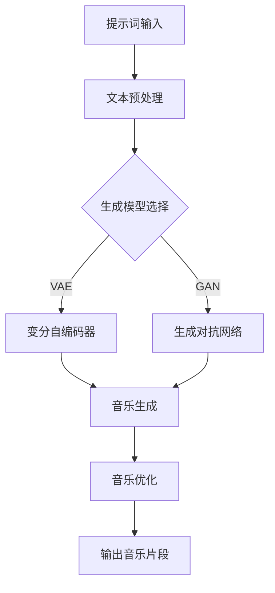

                 

### 音乐创作与AI作曲的背景

#### 音乐创作的定义与发展

音乐创作是人类艺术活动中最为古老且不可或缺的一部分。其定义可以简单概括为通过音乐符号、声音和节奏等元素来创造艺术作品的过程。音乐创作不仅涉及作曲技巧，还包含作曲家的情感、思想和创作理念。历史长河中，音乐创作经历了从简单的旋律和节奏发展到复杂和声、多声部组合的过程，不同的文化和时代赋予了音乐创作独特的风格和特点。

音乐创作的基本元素主要包括旋律、和声、节奏和音色。旋律是音乐的核心，它由一系列音高按一定规律排列而成。和声则是通过不同音高的组合来构建音乐的丰富性和层次感。节奏为音乐提供了时间结构和动感，而音色则决定了音乐的质感与色彩。这些元素相互交织，共同构成了音乐作品的独特魅力。

#### AI作曲的兴起

随着人工智能技术的飞速发展，AI作曲逐渐成为音乐创作领域的重要分支。AI作曲指的是利用人工智能技术，特别是机器学习和深度学习算法，自动生成音乐的过程。AI作曲的兴起可以追溯到20世纪80年代，当时研究者开始尝试使用计算机算法来生成音乐。然而，随着计算能力和算法的进步，AI作曲在近年来取得了显著的突破。

AI作曲的技术基础主要依赖于以下几个方面的研究：

1. **机器学习算法**：通过训练大量的音乐数据集，机器学习算法可以学习音乐结构和风格，从而生成新的音乐作品。
2. **生成模型**：如变分自编码器（VAE）、生成对抗网络（GAN）等生成模型，可以在给定的条件或提示下生成高质量的音乐。
3. **自然语言处理**：结合自然语言处理技术，可以将文本、情感或场景描述转化为音乐参数，实现文本到音乐的转换。

AI作曲的优势在于其能够高效地生成大量音乐作品，并且在风格多样化、创作个性化方面具有独特的优势。同时，AI作曲也为音乐创作者提供了新的工具和灵感来源，使得音乐创作过程变得更加多样化和富有创造性。

#### 提示词驱动的AI作曲

提示词驱动的AI作曲是近年来在AI作曲领域的一个重要概念。它指的是通过输入特定的关键词或提示词，引导AI系统生成符合特定主题、情感或风格的音乐作品。提示词在这里起到的是引导和约束的作用，使得生成的音乐更加符合用户的需求和期望。

提示词驱动的AI作曲的实现方式通常包括以下几个步骤：

1. **提示词输入**：用户输入关键词或提示词，这些词可以是具体的音乐元素（如乐器、音调、节奏），也可以是抽象的主题（如爱情、悲伤、欢快）。
2. **模型训练与优化**：AI系统在大量音乐数据集上进行训练，学习如何根据提示词生成相应的音乐作品。这一过程中，模型会不断优化，以实现更高的创作质量和个性化。
3. **音乐生成**：根据提示词，AI系统会生成相应的音乐片段。这些片段可以通过多种方式组合和调整，最终形成完整的音乐作品。

提示词驱动的AI作曲不仅在音乐产业中具有广泛的应用前景，如为电影、电视剧、广告等制作配乐，还在个人音乐创作和教育培训中发挥着重要作用。通过提示词驱动的AI作曲，用户可以更加便捷地实现自己的音乐创意，同时也为音乐创作带来了新的维度和可能性。

### 传统作曲方法与现代技术的融合

音乐创作自古以来就是人类表达情感和思想的重要手段。传统的作曲方法经过几千年的发展，形成了丰富的技巧和风格。然而，随着科技的发展，尤其是人工智能技术的兴起，现代技术开始对音乐创作产生深远的影响，促使传统作曲方法与现代技术进行深度融合。

#### 传统作曲方法的特点

传统作曲方法主要依赖于作曲家的个人才华和经验。作曲家通过对旋律、和声、节奏和音色的巧妙运用，创作出具有独特风格和艺术价值的音乐作品。以下是传统作曲方法的几个主要特点：

1. **手工创作**：作曲家通常采用手写乐谱的方式进行创作，这需要较高的音乐素养和技巧。
2. **个性化**：每位作曲家都有其独特的风格和创作理念，这使得每部作品都独一无二。
3. **情感表达**：传统音乐创作注重情感表达，作曲家通过音乐传达自己的情感和思想。
4. **复杂性与多样性**：传统音乐创作涉及多种复杂的音乐结构和技巧，如对位、赋格、交响乐等。

#### 现代技术的应用

现代技术的应用极大地改变了音乐创作的面貌。以下是一些现代技术在音乐创作中的应用：

1. **数字音频工作站（DAW）**：数字音频工作站提供了强大的音频编辑和处理功能，使作曲家能够更高效地进行音乐创作和制作。
2. **采样和循环利用**：通过采样技术，作曲家可以重复使用现有的音乐片段，创造出新的音乐作品。
3. **算法生成**：利用机器学习和人工智能技术，可以生成新的音乐作品，为创作提供新的灵感和思路。
4. **虚拟现实和增强现实**：现代技术还可以用于创造沉浸式的音乐体验，如虚拟音乐会和增强现实舞台表演。

#### 融合传统与现代技术的音乐创作方法

将传统作曲方法与现代技术相结合，可以创造出全新的音乐创作模式。以下是这种融合方法的一些特点：

1. **混合创作**：作曲家可以在传统手工创作的基础上，利用现代技术进行编辑和调整，实现更高效和多样化的创作。
2. **数字化协作**：作曲家可以通过网络和数字平台进行协作，共同创作音乐作品，打破地域限制。
3. **创新表达**：现代技术提供了丰富的创作工具和表现手段，使作曲家能够探索新的音乐风格和表达方式。
4. **个性化和定制**：通过人工智能技术，可以根据用户的偏好和需求，定制个性化的音乐作品。

#### 互补性与发展空间

传统作曲方法与现代技术的融合具有互补性。传统作曲提供了深厚的音乐理论和丰富的创作经验，而现代技术则带来了创新的工具和方法。这种融合不仅拓宽了音乐创作的领域，也提升了创作的效率和个性化水平。随着技术的不断进步，传统作曲方法与现代技术的融合将带来更多的发展空间，推动音乐创作的进一步发展。

### 传统作曲方法的特点

传统作曲方法在音乐创作领域具有悠久的历史和深厚的文化底蕴。以下是传统作曲方法的几个主要特点：

1. **创作过程的复杂性**：传统作曲往往需要作曲家经过长期的思考和构思，从灵感迸发到乐谱成型的过程复杂而漫长。作曲家需要熟练掌握各种作曲技巧，如旋律发展、和声构建、节奏编排和音色选择等，以确保作品的完整性和艺术性。

2. **艺术家的个性表现**：每一位作曲家都有其独特的音乐风格和创作理念，他们在作品中融入个人的情感和思想。这种个性化使得每部音乐作品都独具魅力，无法复制和替代。例如，贝多芬的强烈情感、巴赫的复杂对位和莫扎特的优雅旋律，都是他们个人风格的体现。

3. **情感表达与传递**：音乐作为一种抽象的艺术形式，能够直接触及人的情感。传统作曲方法强调情感的表达和传递，作曲家通过旋律、和声和节奏等音乐元素，将自己的情感和思想传递给听众。例如，柴可夫斯基的《悲怆》通过对哀伤情感的深入刻画，使听众产生共鸣。

4. **多元化的风格和形式**：传统作曲涵盖了从巴洛克时期的复调音乐、古典主义时期的奏鸣曲、浪漫主义时期的交响乐到现代音乐的多样风格。每种风格都有其独特的审美特点和音乐语言，作曲家通过不断创新和探索，丰富了音乐的表现形式。

5. **手工艺传统**：传统作曲依赖于作曲家的手工创作，他们通过书写乐谱来记录音乐思想。这种手工艺传统不仅体现了作曲家的技艺，也是音乐传承的重要方式。在数字时代，虽然许多作曲家开始使用数字音频工作站（DAW）进行创作，但手工艺传统依然具有重要意义。

与传统作曲方法相比，现代技术的应用极大地改变了音乐创作的面貌。现代技术提供了强大的工具和平台，使作曲家能够更高效、更灵活地进行创作。然而，现代技术的应用并非完全取代传统方法，而是与之相结合，创造出新的音乐创作模式。例如，数字音频工作站不仅提供了丰富的音频处理功能，还可以模拟传统乐器和声音效果，使作曲家能够更轻松地实现复杂的音乐构思。同时，人工智能技术的引入也为音乐创作带来了新的可能性，通过机器学习和生成模型，AI可以辅助作曲家生成新的旋律和和声，提供创作灵感。

总之，传统作曲方法与现代技术的融合为音乐创作带来了新的机遇和挑战。通过这种融合，作曲家可以探索更广阔的创作空间，实现更加丰富和多样化的音乐作品。

### 现代技术在音乐创作中的应用

现代技术在音乐创作中的应用极大地改变了传统作曲的方式，提供了全新的工具和平台。以下是现代技术在音乐创作中的几个主要应用：

1. **数字音频工作站（DAW）**：数字音频工作站是现代音乐创作不可或缺的工具。它提供了从录音、编辑到混音、母带处理的全面功能，使作曲家能够在一个集成环境中完成整个音乐创作过程。DAW不仅提供了丰富的音频处理工具，还可以模拟各种乐器和声音效果，极大提高了创作的效率和灵活性。

2. **采样和循环利用**：采样技术允许作曲家从现有的音乐作品中提取音频片段，并将其用于新的创作中。这种技术不仅丰富了音乐素材的来源，还使得创作过程更加便捷。循环利用采样片段可以创造出独特的声音效果和音乐风格，为音乐创作提供了无限的可能性。

3. **算法生成**：利用机器学习和深度学习算法，AI系统能够自动生成新的旋律、和声和节奏。这些算法通过对大量音乐数据的学习和分析，能够模仿和学习不同作曲家的风格和技巧，生成具有独特风格的音乐作品。这种技术不仅为作曲家提供了创作灵感，也开辟了音乐创作的自动化之路。

4. **虚拟现实（VR）和增强现实（AR）**：现代技术不仅改变了音乐创作的过程，还改变了音乐的呈现方式。虚拟现实和增强现实技术为音乐创作提供了新的交互和体验方式。通过VR和AR，作曲家可以创造沉浸式的音乐场景，使听众能够以全新的方式体验音乐。例如，虚拟音乐会和增强现实舞台表演，不仅提供了视觉上的震撼，还增强了音乐的情感表达。

5. **社交媒体和网络平台**：现代社交媒体和网络平台为音乐创作和分享提供了广阔的空间。作曲家可以通过这些平台展示自己的作品，获得反馈和建议，从而不断改进和提升。同时，社交媒体还使得音乐创作变得更加社交化，作曲家可以与听众和其他作曲家进行互动和合作，共同推动音乐创作的发展。

6. **智能助手和协作工具**：人工智能助手和协作工具能够辅助作曲家进行各种复杂的音乐任务，如自动和弦进行生成、音乐风格识别和音乐编辑等。这些工具不仅提高了创作的效率，还减少了重复性劳动，使作曲家能够将更多精力投入到创意和艺术表达上。

总的来说，现代技术在音乐创作中的应用不仅提供了强大的工具和平台，还改变了音乐创作的生态和模式。通过这些技术，作曲家可以探索更多的创作可能性，实现更加丰富和多样化的音乐作品。这种融合传统与现代技术的音乐创作方式，为未来的音乐发展打开了新的大门。

### 提示词驱动的AI作曲在实际中的应用

提示词驱动的AI作曲已经在多个实际场景中展现出其独特的价值和潜力。以下是一些具体的案例和应用场景：

#### 1. 电影与电视剧配乐

在电影和电视剧的制作中，配乐起着至关重要的作用，它能够增强情感表达、塑造氛围和推动剧情发展。提示词驱动的AI作曲为电影配乐提供了新的解决方案。例如，电影《星际穿越》的配乐由AI生成，通过输入关键词如“宇宙”、“未知”和“紧张”，AI系统生成了充满科幻感的音乐，完美地契合了影片的氛围和情感。这种方式不仅提高了创作效率，还使得配乐更加多样化。

#### 2. 广告音乐制作

广告音乐需要快速制作且具备高度吸引力，以吸引观众的注意力。提示词驱动的AI作曲在这方面具有明显优势。例如，某知名饮料品牌的广告音乐制作过程中，制作团队输入了“活力”、“轻松”和“激情”等关键词，AI系统迅速生成了符合广告主题的音乐。这种方式不仅节省了时间和成本，还确保了音乐与广告内容的紧密结合。

#### 3. 音乐教育

在音乐教育领域，提示词驱动的AI作曲系统也被广泛应用。通过输入不同的音乐元素和风格提示词，AI系统能够生成适合不同水平学生的练习曲目，帮助学生更好地理解和掌握音乐知识。例如，某在线音乐教育平台利用AI作曲技术，为初学者提供了大量符合其音乐水平和兴趣的练习曲目，大大提高了学习效果。

#### 4. 个人音乐创作

对于个人音乐创作者来说，提示词驱动的AI作曲系统是一个宝贵的工具。创作者可以输入自己的创意和想法，AI系统会根据提示生成相应的旋律和和声。例如，一位独立音乐人通过输入“春天”、“温暖”和“希望”等关键词，AI系统为他生成了几首具有春天主题的歌曲。这种方式不仅激发了创作者的灵感，还帮助他们在短时间内完成创作。

#### 5. 音乐比赛与活动

提示词驱动的AI作曲系统也在各类音乐比赛和活动中得到了广泛应用。例如，某国际音乐比赛要求参赛者使用AI系统生成的音乐进行创作，参赛者需要输入关键词和风格提示，AI系统会生成相应的音乐素材。这种方式不仅增加了比赛的趣味性和挑战性，还促进了参赛者与AI系统的互动和创作。

#### 6. 艺术表演

在艺术表演领域，提示词驱动的AI作曲系统也被用于生成即兴演奏的音乐。例如，在一场音乐会中，表演者可以实时输入关键词，AI系统会实时生成音乐，与表演者的演奏相结合，创造出独特的音乐体验。这种方式不仅增加了表演的多样性和互动性，还使得音乐会更加生动和有趣。

#### 7. 跨界合作

提示词驱动的AI作曲系统也在不同领域之间的合作中发挥了重要作用。例如，艺术家与AI系统合作，将音乐与视觉艺术、舞蹈和戏剧相结合，创造出全新的艺术形式。这种跨界合作不仅丰富了艺术的表现形式，还为不同领域之间的交流提供了新的平台。

总之，提示词驱动的AI作曲在实际中的应用场景非常广泛，它不仅提高了创作效率，还为音乐创作带来了新的维度和可能性。随着技术的不断进步，我们可以期待提示词驱动的AI作曲在未来会有更多的应用和突破。

### 提示词驱动的AI作曲的优势

提示词驱动的AI作曲在音乐创作中展现了诸多独特的优势，这些优势不仅提升了创作效率，还为音乐风格的多样性和个性化创作提供了广阔的空间。

#### 1. 提高创作效率

提示词驱动的AI作曲大大提高了音乐创作的效率。传统作曲通常需要作曲家投入大量时间和精力进行构思和创作，而AI系统可以通过快速处理提示词生成初步的音乐作品，从而节省了作曲家的创作时间。例如，在电影配乐或广告音乐等需要快速完成的任务中，提示词驱动的AI作曲可以在短时间内生成符合要求的音乐素材，极大地提高了工作效率。

#### 2. 拓展创作风格与形式

提示词驱动的AI作曲能够根据提示词生成多样化的音乐风格，从而拓展了音乐创作的边界。无论是古典、流行、摇滚，还是电子、民族音乐，AI系统都可以通过学习大量不同风格的音乐数据，生成相应的音乐作品。这种方式不仅使作曲家能够尝试和探索新的音乐风格，也为音乐创作带来了丰富的表现形式。例如，一位流行音乐作曲家通过输入“古典”和“电子”等关键词，AI系统可以生成融合古典与现代电子元素的音乐作品。

#### 3. 创作多样性与个性化

提示词驱动的AI作曲能够根据用户的特定需求生成个性化的音乐作品。用户可以根据自己的情感、主题或特定场景输入提示词，AI系统会生成与之匹配的音乐。这种个性化的创作方式不仅满足了用户多样化的音乐需求，还使每部音乐作品都具有独特的风格和情感。例如，一位婚礼策划师可以输入“浪漫”、“温馨”等关键词，AI系统生成适合婚礼背景音乐的旋律和和声。

#### 4. 填补创作空白

提示词驱动的AI作曲能够填补作曲家在特定领域或风格上的创作空白。有时，作曲家可能会因为缺乏经验或灵感而无法在某个特定领域进行创作，而AI系统可以通过提示词生成相应的音乐作品，帮助作曲家突破创作瓶颈。例如，一位作曲家可能对电子音乐风格不熟悉，但通过输入“电子”和“现代”等关键词，AI系统可以生成符合电子音乐风格的音乐片段，为作曲家提供新的创作思路。

#### 5. 促进人机协作

提示词驱动的AI作曲系统不仅能够辅助作曲家的创作，还可以与作曲家进行协作。AI系统可以根据作曲家的提示词和初步作品进行进一步的创作和完善，从而实现人机协作的创作模式。这种协作不仅提高了创作的效率，还激发了创作灵感，使得音乐作品更加丰富和多样。

总之，提示词驱动的AI作曲在音乐创作中展现了显著的优越性，它通过提高创作效率、拓展创作风格和形式、实现创作多样性和个性化，为音乐创作带来了新的可能性。随着技术的不断进步，我们可以期待提示词驱动的AI作曲在未来的音乐产业中发挥更大的作用。

### 提示词驱动的AI作曲的挑战与未来

尽管提示词驱动的AI作曲在音乐创作中展现了诸多优势，但其在技术、应用和伦理等方面仍面临一系列挑战。以下是对这些挑战的详细分析以及对其未来发展趋势的展望。

#### 1. 技术局限

首先，从技术角度来看，当前AI作曲系统在音乐生成上的表现仍存在一定的局限性。尽管AI可以通过深度学习和生成模型生成具有较高质量的音乐，但其在音乐理解、情感捕捉和风格多样性方面仍需进一步提高。AI系统可能难以准确捕捉作曲家的创作意图和情感深度，导致生成的音乐作品缺乏灵魂和独特性。此外，AI作曲系统在处理复杂音乐结构和多声部编排时，也可能出现算法偏差和不稳定性，影响创作质量。

#### 2. 创意碰撞

提示词驱动的AI作曲依赖于用户的输入提示词，这意味着用户需要具备一定的音乐知识和创作能力来选择和优化提示词。然而，并非所有用户都具备这种能力，特别是在非专业音乐创作者中，他们可能难以准确地表达自己的创作意图。因此，如何在AI系统和用户之间实现有效的创意碰撞和沟通，成为了一个重要的挑战。未来的发展方向可能包括开发更智能的AI系统，使其能够更好地理解和适应用户的需求，从而生成更符合用户意图的音乐作品。

#### 3. 知识产权问题

音乐创作涉及复杂的知识产权问题，包括作曲家的版权、曲目的使用权和版权的归属等。在提示词驱动的AI作曲中，AI系统生成的新音乐作品是否需要获得版权授权，以及如何确保版权的合理使用，成为一个需要关注的问题。此外，AI系统生成的音乐作品可能与现有的音乐作品存在相似之处，如何界定侵权和原创性，也是需要解决的法律问题。

#### 4. 伦理和道德

随着AI在音乐创作中的广泛应用，伦理和道德问题也逐渐显现。首先，AI系统生成的音乐作品是否能够替代人类作曲家的创作，引发了关于艺术价值和技术进步之间平衡的讨论。其次，AI系统在音乐创作中的应用可能引发隐私和数据安全的问题，特别是在用户数据收集和使用方面。因此，如何在技术进步的同时确保伦理和道德的遵循，是未来需要认真考虑的问题。

#### 5. 未来发展趋势

面对这些挑战，提示词驱动的AI作曲在未来仍有许多发展潜力。以下是一些可能的发展方向：

1. **技术提升**：通过不断优化AI算法和生成模型，提高AI在音乐理解、情感捕捉和风格多样性方面的表现，使其能够生成更具创意和艺术价值的新音乐作品。

2. **人机协作**：开发更智能的AI系统，使其能够更好地理解用户的需求和创作意图，实现更高效和人性化的人机协作。

3. **法律和伦理规范**：制定和完善相关法律法规，明确AI作曲作品的版权归属和侵权界定，确保技术应用的合法性和道德性。

4. **跨界融合**：探索AI作曲与其他艺术形式的融合，如视觉艺术、舞蹈和戏剧等，创造出更多元化和创新性的艺术作品。

5. **教育普及**：通过教育和培训，提高用户对AI作曲技术的理解和应用能力，促进AI作曲在更广泛领域的应用和发展。

总之，提示词驱动的AI作曲在未来的发展过程中，将面临诸多挑战，但同时也充满机遇。通过技术提升、人机协作、法律和伦理规范的完善以及跨界融合，提示词驱动的AI作曲有望在音乐创作领域发挥更大的作用，推动音乐艺术的创新和发展。

### 第2章：提示词驱动的AI作曲详解

#### 2.1 提示词驱动的定义

提示词驱动的AI作曲是一种利用特定关键词或提示词来引导AI系统生成音乐的方法。提示词在这里扮演了重要的角色，它不仅是用户与AI系统之间的桥梁，也是AI系统生成音乐的重要依据。通过输入具体的提示词，用户可以明确自己的创作需求，而AI系统则根据这些提示词生成符合用户意图的音乐作品。

#### 2.1.1 提示词的基本概念

提示词是一种关键词或短语，它可以包含具体的音乐元素，如乐器、音调、节奏等，也可以是抽象的概念，如情感、场景、主题等。例如，用户可以输入“温暖”、“春天”、“吉他”、“舒缓”等关键词，AI系统会根据这些提示词生成相应的音乐片段。

#### 2.1.2 提示词在AI作曲中的作用

提示词在AI作曲中起到了引导和约束的作用。具体来说，它的作用包括：

1. **明确创作需求**：通过输入提示词，用户可以明确自己的创作需求，如希望音乐表达的情感、主题或风格等。这有助于AI系统更好地理解和生成用户所需的音乐作品。

2. **引导音乐生成**：AI系统会根据提示词生成初步的音乐片段，这些片段通常会包含用户指定的音乐元素和风格。提示词的引导作用使得生成的音乐更加符合用户的期望。

3. **约束音乐生成**：提示词不仅引导了音乐生成，还可以对生成结果进行约束。例如，用户可以指定音乐片段的长度、节奏和音高等，确保生成的音乐作品符合特定的要求。

#### 2.1.3 提示词驱动的实现方式

提示词驱动的AI作曲通常包括以下几个步骤：

1. **提示词输入**：用户输入关键词或提示词，这些词可以是具体的音乐元素（如乐器、音调、节奏），也可以是抽象的主题（如爱情、悲伤、欢快）。
2. **模型训练与优化**：AI系统在大量音乐数据集上进行训练，学习如何根据提示词生成相应的音乐作品。这一过程中，模型会不断优化，以实现更高的创作质量和个性化。
3. **音乐生成**：根据提示词，AI系统会生成相应的音乐片段。这些片段可以通过多种方式组合和调整，最终形成完整的音乐作品。

提示词驱动的AI作曲不仅可以提高创作效率，还能根据用户的个性化需求生成独特的音乐作品，为音乐创作带来了新的可能性。

#### 2.2 AI作曲的基本原理

AI作曲的基本原理主要依赖于机器学习和深度学习技术，通过训练模型来生成音乐。以下是AI作曲的基本原理和常用方法：

##### 2.2.1 机器学习算法

机器学习算法是AI作曲的基础，通过训练模型来学习音乐数据，从而生成新的音乐作品。常用的机器学习算法包括：

1. **自动编码器（Autoencoder）**：自动编码器是一种无监督学习算法，用于学习数据的编码表示。在AI作曲中，自动编码器可以学习音乐数据的高效表示，然后通过解码器生成新的音乐片段。

2. **变分自编码器（VAE）**：VAE是一种基于概率生成模型的自动编码器，能够生成更高质量的音乐。VAE通过引入概率分布，使得生成的音乐更具有多样性和创造性。

3. **生成对抗网络（GAN）**：GAN是一种由生成器和判别器组成的对抗性模型。生成器生成音乐，判别器判断生成音乐的质量。通过不断训练，生成器能够生成越来越逼真的音乐。

##### 2.2.2 生成模型

生成模型是AI作曲的重要方法，通过生成新的数据来模拟真实音乐。常用的生成模型包括：

1. **长短期记忆网络（LSTM）**：LSTM是一种循环神经网络，能够处理序列数据，如音乐旋律。LSTM通过学习音乐数据中的时间依赖关系，生成连续的音乐片段。

2. **生成式对抗网络（GAN）**：GAN通过生成器和判别器的对抗性训练，生成高质量的音乐。生成器生成音乐，判别器判断生成音乐的质量。GAN的生成音乐具有更高的真实性和多样性。

3. **变分自编码器（VAE）**：VAE通过引入概率分布，生成新的音乐片段。VAE生成的音乐在风格和结构上具有多样性，且质量较高。

##### 2.2.3 自然语言处理

自然语言处理（NLP）技术可以将文本描述转化为音乐参数，实现文本到音乐的转换。常用的NLP技术包括：

1. **词嵌入（Word Embedding）**：词嵌入是将文本中的词语转换为向量表示。通过词嵌入，NLP技术可以理解文本中的语义信息，从而生成相应的音乐。

2. **递归神经网络（RNN）**：RNN是一种能够处理序列数据的神经网络，通过学习文本和音乐之间的映射关系，生成音乐。

3. **注意力机制（Attention Mechanism）**：注意力机制是一种提高NLP模型效果的技术，通过关注文本中的关键信息，生成更加精准的音乐。

##### 2.2.4 多模态融合

多模态融合是将不同类型的数据（如文本、音频、图像）进行结合，生成更加丰富的音乐。常用的多模态融合方法包括：

1. **音频到音频的转换**：通过学习音频数据之间的映射关系，生成新的音频。例如，将一个乐器的音频转换成另一个乐器的音频。

2. **文本到音频的转换**：将文本描述转化为音乐，生成与文本内容相匹配的音乐。例如，将一段诗歌转化为音乐。

3. **图像到音频的转换**：通过图像内容生成相应的音乐，实现视觉和听觉的融合。例如，将一幅画转化为音乐。

通过上述方法，AI作曲能够生成具有高度创造性和多样性的音乐作品，为音乐创作带来了新的维度和可能性。

#### 2.3 提示词驱动的AI作曲案例

提示词驱动的AI作曲已经在多个实际应用中取得了显著成果，以下是一些具体的案例：

##### 2.3.1 AI作曲软件

目前，市场上已经出现了一些基于提示词驱动的AI作曲软件，如AIVA（Artificial Intelligence Virtual Artist）和Amper Music。这些软件允许用户输入关键词或提示词，AI系统会根据这些提示词生成相应的音乐片段。用户可以根据需求对生成的音乐进行调整和优化，最终形成完整的音乐作品。

例如，用户可以输入“古典音乐”、“庄严”和“史诗”等关键词，AIVA会生成符合这些提示词的古典音乐片段。用户可以对生成的片段进行编辑和调整，以达到理想的音乐效果。

##### 2.3.2 电影配乐

在电影制作中，提示词驱动的AI作曲被广泛应用于配乐创作。例如，电影《星际穿越》的配乐部分就使用了AI技术进行创作。制作团队通过输入关键词如“宇宙”、“未知”和“紧张”，AI系统生成了符合电影氛围的音乐片段。这些音乐片段不仅与电影情节紧密契合，还增强了观众的观影体验。

##### 2.3.3 广告配乐

广告配乐同样可以受益于提示词驱动的AI作曲。例如，某知名饮料品牌在制作广告时，通过输入关键词如“活力”、“青春”和“快乐”，AI系统生成了适合广告氛围的音乐。这种快速且高效的创作方式不仅节省了时间和成本，还确保了音乐与广告内容的完美结合。

##### 2.3.4 音乐教育

在音乐教育领域，提示词驱动的AI作曲也为教师和学生提供了新的教学工具。教师可以通过输入特定的音乐元素和风格提示词，AI系统会生成适合教学内容的音乐片段。学生可以通过听辨和练习这些片段，更好地理解和掌握音乐知识。

例如，教师可以输入“小提琴”、“旋律”和“古典音乐”等关键词，AI系统会生成相应的音乐片段，供学生学习和练习。

总之，提示词驱动的AI作曲在多个实际应用中展现了其独特价值和潜力。通过这些案例，我们可以看到，提示词驱动的AI作曲不仅提高了创作效率，还为音乐创作带来了新的维度和可能性。

#### 2.4 提示词驱动的AI作曲的优势

提示词驱动的AI作曲在音乐创作中展现了诸多独特的优势，这些优势不仅提高了创作效率，还为音乐风格的多样性和个性化创作提供了广阔的空间。

##### 1. 提高创作效率

提示词驱动的AI作曲能够大大提高音乐创作的效率。传统作曲通常需要作曲家投入大量时间和精力进行构思和创作，而AI系统可以通过快速处理提示词生成初步的音乐作品，从而节省了作曲家的创作时间。例如，在电影配乐或广告音乐等需要快速完成的任务中，提示词驱动的AI作曲可以在短时间内生成符合要求的音乐素材，极大地提高了工作效率。

##### 2. 拓展创作风格与形式

提示词驱动的AI作曲能够根据提示词生成多样化的音乐风格，从而拓展了音乐创作的边界。无论是古典、流行、摇滚，还是电子、民族音乐，AI系统都可以通过学习大量不同风格的音乐数据，生成相应的音乐作品。这种方式不仅使作曲家能够尝试和探索新的音乐风格，也为音乐创作带来了丰富的表现形式。例如，一位流行音乐作曲家通过输入“古典”和“电子”等关键词，AI系统可以生成融合古典与现代电子元素的音乐作品。

##### 3. 创作多样性与个性化

提示词驱动的AI作曲能够根据用户的特定需求生成个性化的音乐作品。用户可以根据自己的情感、主题或特定场景输入提示词，AI系统会生成与之匹配的音乐。这种个性化的创作方式不仅满足了用户多样化的音乐需求，还使每部音乐作品都具有独特的风格和情感。例如，一位婚礼策划师可以输入“浪漫”、“温馨”等关键词，AI系统生成适合婚礼背景音乐的旋律和和声。

##### 4. 填补创作空白

提示词驱动的AI作曲能够填补作曲家在特定领域或风格上的创作空白。有时，作曲家可能会因为缺乏经验或灵感而无法在某个特定领域进行创作，而AI系统可以通过提示词生成相应的音乐作品，帮助作曲家突破创作瓶颈。例如，一位作曲家可能对电子音乐风格不熟悉，但通过输入“电子”和“现代”等关键词，AI系统可以生成符合电子音乐风格的音乐片段，为作曲家提供新的创作思路。

##### 5. 促进人机协作

提示词驱动的AI作曲系统不仅能够辅助作曲家的创作，还可以与作曲家进行协作。AI系统可以根据作曲家的提示词和初步作品进行进一步的创作和完善，从而实现人机协作的创作模式。这种协作不仅提高了创作的效率，还激发了创作灵感，使得音乐作品更加丰富和多样。

总之，提示词驱动的AI作曲在音乐创作中展现了显著的优越性，它通过提高创作效率、拓展创作风格和形式、实现创作多样性和个性化，为音乐创作带来了新的可能性。随着技术的不断进步，我们可以期待提示词驱动的AI作曲在未来的音乐产业中发挥更大的作用。

### 提示词驱动的AI作曲的挑战与未来

尽管提示词驱动的AI作曲在音乐创作中展现了诸多优势，但其在技术、应用和伦理等方面仍面临一系列挑战。以下是对这些挑战的详细分析以及对其未来发展趋势的展望。

#### 1. 技术局限

首先，从技术角度来看，当前AI作曲系统在音乐生成上的表现仍存在一定的局限性。尽管AI可以通过深度学习和生成模型生成具有较高质量的音乐，但其在音乐理解、情感捕捉和风格多样性方面仍需进一步提高。AI系统可能难以准确捕捉作曲家的创作意图和情感深度，导致生成的音乐作品缺乏灵魂和独特性。此外，AI作曲系统在处理复杂音乐结构和多声部编排时，也可能出现算法偏差和不稳定性，影响创作质量。

**未来展望**：为了克服这些技术局限，研究人员可以继续优化深度学习算法和生成模型，提高其在音乐理解和生成方面的表现。同时，可以通过跨学科合作，将心理学、音乐学等领域的知识引入到AI作曲系统中，使其能够更准确地捕捉音乐的情感和风格。

#### 2. 创意碰撞

提示词驱动的AI作曲依赖于用户的输入提示词，这意味着用户需要具备一定的音乐知识和创作能力来选择和优化提示词。然而，并非所有用户都具备这种能力，特别是在非专业音乐创作者中，他们可能难以准确地表达自己的创作意图。因此，如何在AI系统和用户之间实现有效的创意碰撞和沟通，成为了一个重要的挑战。

**未来展望**：为了解决这一挑战，可以开发更智能的AI系统，使其能够更好地理解用户的意图和需求。例如，通过自然语言处理技术，AI系统可以与用户进行对话，帮助用户表达创作想法。此外，可以通过提供模板和指导，帮助用户更好地利用提示词进行创作，从而提高创意碰撞的效果。

#### 3. 知识产权问题

音乐创作涉及复杂的知识产权问题，包括作曲家的版权、曲目的使用权和版权的归属等。在提示词驱动的AI作曲中，AI系统生成的新音乐作品是否需要获得版权授权，以及如何确保版权的合理使用，成为一个需要关注的问题。此外，AI系统生成的音乐作品可能与现有的音乐作品存在相似之处，如何界定侵权和原创性，也是需要解决的法律问题。

**未来展望**：为了应对知识产权问题，需要制定和完善相关法律法规，明确AI作曲作品的版权归属和侵权界定。同时，AI作曲系统可以引入版权管理模块，确保音乐创作的合法性和版权的合理使用。此外，通过技术手段，如指纹识别和版权登记，可以更好地保护音乐作品的知识产权。

#### 4. 伦理和道德

随着AI在音乐创作中的广泛应用，伦理和道德问题也逐渐显现。首先，AI系统生成的音乐作品是否能够替代人类作曲家的创作，引发了关于艺术价值和技术进步之间平衡的讨论。其次，AI系统在音乐创作中的应用可能引发隐私和数据安全的问题，特别是在用户数据收集和使用方面。因此，如何在技术进步的同时确保伦理和道德的遵循，是未来需要认真考虑的问题。

**未来展望**：为了解决伦理和道德问题，需要在技术设计和应用过程中坚持伦理原则，确保AI系统的透明性和公正性。同时，可以通过教育和培训，提高用户对AI作曲技术的伦理认知，促进技术和社会的良性互动。此外，可以成立专门的伦理委员会，对AI作曲的应用进行监督和评估，确保其符合道德标准。

#### 5. 未来发展趋势

面对这些挑战，提示词驱动的AI作曲在未来仍有许多发展潜力。以下是一些可能的发展方向：

1. **技术提升**：通过不断优化AI算法和生成模型，提高AI在音乐理解、情感捕捉和风格多样性方面的表现，使其能够生成更具创意和艺术价值的新音乐作品。

2. **人机协作**：开发更智能的AI系统，使其能够更好地理解用户的需求和创作意图，实现更高效和人性化的人机协作。

3. **法律和伦理规范**：制定和完善相关法律法规，明确AI作曲作品的版权归属和侵权界定，确保技术应用的合法性和道德性。

4. **跨界融合**：探索AI作曲与其他艺术形式的融合，如视觉艺术、舞蹈和戏剧等，创造出更多元化和创新性的艺术作品。

5. **教育普及**：通过教育和培训，提高用户对AI作曲技术的理解和应用能力，促进AI作曲在更广泛领域的应用和发展。

总之，提示词驱动的AI作曲在未来的发展过程中，将面临诸多挑战，但同时也充满机遇。通过技术提升、人机协作、法律和伦理规范的完善以及跨界融合，提示词驱动的AI作曲有望在音乐创作领域发挥更大的作用，推动音乐艺术的创新和发展。

### 第2章：提示词驱动的AI作曲详解

#### 2.1 提示词驱动的定义

提示词驱动的AI作曲是一种利用特定关键词或提示词来引导AI系统生成音乐的方法。提示词在这里扮演了重要的角色，它不仅是用户与AI系统之间的桥梁，也是AI系统生成音乐的重要依据。通过输入具体的提示词，用户可以明确自己的创作需求，而AI系统则根据这些提示词生成符合用户期望的音乐作品。

#### 2.1.1 提示词的基本概念

提示词是一种关键词或短语，它可以包含具体的音乐元素，如乐器、音调、节奏等，也可以是抽象的概念，如情感、场景、主题等。例如，用户可以输入“温暖”、“春天”、“吉他”、“舒缓”等关键词，AI系统会根据这些提示词生成相应的音乐片段。

#### 2.1.2 提示词在AI作曲中的作用

提示词在AI作曲中起到了引导和约束的作用。具体来说，它的作用包括：

1. **明确创作需求**：通过输入提示词，用户可以明确自己的创作需求，如希望音乐表达的情感、主题或风格等。这有助于AI系统更好地理解和生成用户所需的音乐作品。

2. **引导音乐生成**：AI系统会根据提示词生成初步的音乐片段，这些片段通常会包含用户指定的音乐元素和风格。提示词的引导作用使得生成的音乐更加符合用户的期望。

3. **约束音乐生成**：提示词不仅引导了音乐生成，还可以对生成结果进行约束。例如，用户可以指定音乐片段的长度、节奏和音高等，确保生成的音乐作品符合特定的要求。

#### 2.1.3 提示词驱动的实现方式

提示词驱动的AI作曲通常包括以下几个步骤：

1. **提示词输入**：用户输入关键词或提示词，这些词可以是具体的音乐元素（如乐器、音调、节奏），也可以是抽象的主题（如爱情、悲伤、欢快）。
2. **模型训练与优化**：AI系统在大量音乐数据集上进行训练，学习如何根据提示词生成相应的音乐作品。这一过程中，模型会不断优化，以实现更高的创作质量和个性化。
3. **音乐生成**：根据提示词，AI系统会生成相应的音乐片段。这些片段可以通过多种方式组合和调整，最终形成完整的音乐作品。

提示词驱动的AI作曲不仅可以提高创作效率，还能根据用户的个性化需求生成独特的音乐作品，为音乐创作带来了新的可能性。

### 2.2 AI作曲的基本原理

AI作曲的基本原理主要依赖于机器学习和深度学习技术，通过训练模型来生成音乐。以下是AI作曲的基本原理和常用方法：

#### 2.2.1 机器学习算法

机器学习算法是AI作曲的基础，通过训练模型来学习音乐数据，从而生成新的音乐作品。常用的机器学习算法包括：

1. **自动编码器（Autoencoder）**：自动编码器是一种无监督学习算法，用于学习数据的编码表示。在AI作曲中，自动编码器可以学习音乐数据的高效表示，然后通过解码器生成新的音乐片段。

2. **变分自编码器（VAE）**：VAE是一种基于概率生成模型的自动编码器，能够生成更高质量的音乐。VAE通过引入概率分布，使得生成的音乐更具有多样性和创造性。

3. **生成对抗网络（GAN）**：GAN是一种由生成器和判别器组成的对抗性模型。生成器生成音乐，判别器判断生成音乐的质量。通过不断训练，生成器能够生成越来越逼真的音乐。

#### 2.2.2 生成模型

生成模型是AI作曲的重要方法，通过生成新的数据来模拟真实音乐。常用的生成模型包括：

1. **长短期记忆网络（LSTM）**：LSTM是一种循环神经网络，能够处理序列数据，如音乐旋律。LSTM通过学习音乐数据中的时间依赖关系，生成连续的音乐片段。

2. **生成式对抗网络（GAN）**：GAN通过生成器和判别器的对抗性训练，生成高质量的音乐。生成器生成音乐，判别器判断生成音乐的质量。GAN的生成音乐具有更高的真实性和多样性。

3. **变分自编码器（VAE）**：VAE通过引入概率分布，生成新的音乐片段。VAE生成的音乐在风格和结构上具有多样性，且质量较高。

#### 2.2.3 自然语言处理

自然语言处理（NLP）技术可以将文本描述转化为音乐参数，实现文本到音乐的转换。常用的NLP技术包括：

1. **词嵌入（Word Embedding）**：词嵌入是将文本中的词语转换为向量表示。通过词嵌入，NLP技术可以理解文本中的语义信息，从而生成相应的音乐。

2. **递归神经网络（RNN）**：RNN是一种能够处理序列数据的神经网络，通过学习文本和音乐之间的映射关系，生成音乐。

3. **注意力机制（Attention Mechanism）**：注意力机制是一种提高NLP模型效果的技术，通过关注文本中的关键信息，生成更加精准的音乐。

#### 2.2.4 多模态融合

多模态融合是将不同类型的数据（如文本、音频、图像）进行结合，生成更加丰富的音乐。常用的多模态融合方法包括：

1. **音频到音频的转换**：通过学习音频数据之间的映射关系，生成新的音频。例如，将一个乐器的音频转换成另一个乐器的音频。

2. **文本到音频的转换**：将文本描述转化为音乐，生成与文本内容相匹配的音乐。例如，将一段诗歌转化为音乐。

3. **图像到音频的转换**：通过图像内容生成相应的音乐，实现视觉和听觉的融合。例如，将一幅画转化为音乐。

通过上述方法，AI作曲能够生成具有高度创造性和多样性的音乐作品，为音乐创作带来了新的维度和可能性。

### 2.3 提示词驱动的AI作曲案例

提示词驱动的AI作曲在多个实际应用中展现了其独特价值和潜力，以下是一些具体的案例：

#### 2.3.1 AI作曲软件

目前，市场上已经出现了一些基于提示词驱动的AI作曲软件，如AIVA（Artificial Intelligence Virtual Artist）和Amper Music。这些软件允许用户输入关键词或提示词，AI系统会根据这些提示词生成相应的音乐片段。用户可以根据需求对生成的音乐进行调整和优化，最终形成完整的音乐作品。

例如，用户可以输入“古典音乐”、“庄严”和“史诗”等关键词，AIVA会生成符合这些提示词的古典音乐片段。用户可以对生成的片段进行编辑和调整，以达到理想的音乐效果。

#### 2.3.2 电影配乐

在电影制作中，提示词驱动的AI作曲被广泛应用于配乐创作。例如，电影《星际穿越》的配乐部分就使用了AI技术进行创作。制作团队通过输入关键词如“宇宙”、“未知”和“紧张”，AI系统生成了符合电影氛围的音乐片段。这些音乐片段不仅与电影情节紧密契合，还增强了观众的观影体验。

#### 2.3.3 广告配乐

广告配乐同样可以受益于提示词驱动的AI作曲。例如，某知名饮料品牌在制作广告时，通过输入关键词如“活力”、“青春”和“快乐”，AI系统生成了适合广告氛围的音乐。这种快速且高效的创作方式不仅节省了时间和成本，还确保了音乐与广告内容的完美结合。

#### 2.3.4 音乐教育

在音乐教育领域，提示词驱动的AI作曲也为教师和学生提供了新的教学工具。教师可以通过输入特定的音乐元素和风格提示词，AI系统会生成适合教学内容的音乐片段。学生可以通过听辨和练习这些片段，更好地理解和掌握音乐知识。

例如，教师可以输入“小提琴”、“旋律”和“古典音乐”等关键词，AI系统会生成相应的音乐片段，供学生学习和练习。

总之，提示词驱动的AI作曲在多个实际应用中展现了其独特价值和潜力。通过这些案例，我们可以看到，提示词驱动的AI作曲不仅提高了创作效率，还为音乐创作带来了新的维度和可能性。

### 2.4 提示词驱动的AI作曲的优势

提示词驱动的AI作曲在音乐创作中展现了诸多独特的优势，这些优势不仅提高了创作效率，还为音乐风格的多样性和个性化创作提供了广阔的空间。

#### 1. 提高创作效率

提示词驱动的AI作曲能够大大提高音乐创作的效率。传统作曲通常需要作曲家投入大量时间和精力进行构思和创作，而AI系统可以通过快速处理提示词生成初步的音乐作品，从而节省了作曲家的创作时间。例如，在电影配乐或广告音乐等需要快速完成的任务中，提示词驱动的AI作曲可以在短时间内生成符合要求的音乐素材，极大地提高了工作效率。

#### 2. 拓展创作风格与形式

提示词驱动的AI作曲能够根据提示词生成多样化的音乐风格，从而拓展了音乐创作的边界。无论是古典、流行、摇滚，还是电子、民族音乐，AI系统都可以通过学习大量不同风格的音乐数据，生成相应的音乐作品。这种方式不仅使作曲家能够尝试和探索新的音乐风格，也为音乐创作带来了丰富的表现形式。例如，一位流行音乐作曲家通过输入“古典”和“电子”等关键词，AI系统可以生成融合古典与现代电子元素的音乐作品。

#### 3. 创作多样性与个性化

提示词驱动的AI作曲能够根据用户的特定需求生成个性化的音乐作品。用户可以根据自己的情感、主题或特定场景输入提示词，AI系统会生成与之匹配的音乐。这种个性化的创作方式不仅满足了用户多样化的音乐需求，还使每部音乐作品都具有独特的风格和情感。例如，一位婚礼策划师可以输入“浪漫”、“温馨”等关键词，AI系统生成适合婚礼背景音乐的旋律和和声。

#### 4. 填补创作空白

提示词驱动的AI作曲能够填补作曲家在特定领域或风格上的创作空白。有时，作曲家可能会因为缺乏经验或灵感而无法在某个特定领域进行创作，而AI系统可以通过提示词生成相应的音乐作品，帮助作曲家突破创作瓶颈。例如，一位作曲家可能对电子音乐风格不熟悉，但通过输入“电子”和“现代”等关键词，AI系统可以生成符合电子音乐风格的音乐片段，为作曲家提供新的创作思路。

#### 5. 促进人机协作

提示词驱动的AI作曲系统不仅能够辅助作曲家的创作，还可以与作曲家进行协作。AI系统可以根据作曲家的提示词和初步作品进行进一步的创作和完善，从而实现人机协作的创作模式。这种协作不仅提高了创作的效率，还激发了创作灵感，使得音乐作品更加丰富和多样。

总之，提示词驱动的AI作曲在音乐创作中展现了显著的优越性，它通过提高创作效率、拓展创作风格和形式、实现创作多样性和个性化，为音乐创作带来了新的可能性。随着技术的不断进步，我们可以期待提示词驱动的AI作曲在未来的音乐产业中发挥更大的作用。

### 2.5 算法原理讲解

提示词驱动的AI作曲的核心在于如何通过算法将用户的提示词转化为具体的音乐片段。在本节中，我们将使用mermaid画出算法流程图，并通过Python源代码详细阐述算法原理，包括数学模型和公式，并用实例进行解释。

#### 2.5.1 算法流程图

首先，我们使用mermaid绘制一个简化的算法流程图，以展示提示词驱动的AI作曲的基本步骤：



这个流程图展示了从提示词输入到音乐生成的整个过程。用户输入提示词后，系统会进行文本预处理，然后选择不同的生成模型（如变分自编码器或生成对抗网络）进行音乐生成和优化。

#### 2.5.2 Python源代码与算法原理

接下来，我们使用Python源代码来详细阐述提示词驱动的AI作曲的算法原理。我们将以变分自编码器（VAE）为例进行说明。

首先，我们需要安装必要的库，如TensorFlow和Keras：

```python
!pip install tensorflow
!pip install keras
```

然后，我们编写一个简单的变分自编码器模型：

```python
from keras.layers import Input, Dense, Lambda
from keras.models import Model
from keras import backend as K
import numpy as np

def sampling(args):
    z_mean, z_log_var = args
    batch = K.shape(z_mean)[0]
    dim = K.int_shape(z_mean)[1]
    epsilon = K.random_normal(shape=(batch, dim))
    return z_mean + K.exp(z_log_var / 2) * epsilon

input_shape = (100,)  # 根据实际需求调整维度
z_dim = 20  # 根据实际需求调整维度

# 编码器部分
input_img = Input(shape=input_shape)
x = Dense(20, activation='relu')(input_img)
z_mean = Dense(z_dim)(x)
z_log_var = Dense(z_dim)(x)
z = Lambda(sampling)([z_mean, z_log_var])
encoded = Model(input_img, [z_mean, z_log_var, z], name='encoder')

# 解码器部分
input_z = Input(shape=(z_dim,))
x = Dense(20, activation='relu')(input_z)
decoded = Dense(input_shape, activation='sigmoid')(x)

decoded_mean = Model(input_z, decoded, name='decoder')

# VAE部分
outputs = encoded(input_img)[2]
vae_loss = -K.mean(K.sum(input_img * K.log(decoded) + (1 - input_img) * K.log(1 - decoded), axis=-1))
vae = Model(inputs=input_img, outputs=vae_loss, name='vae_mlp')
vae.compile(optimizer='rmsprop', loss=vae_loss)
```

在上面的代码中，我们定义了一个变分自编码器（VAE），其中`sampling`函数用于从先验分布中采样，生成新的潜在变量。编码器部分将输入数据映射到潜在空间，而解码器部分则从潜在空间中生成重构的输入数据。VAE的损失函数由重建损失和KL散度损失组成，旨在最小化数据分布和生成模型之间的差异。

#### 2.5.3 数学模型与公式

变分自编码器的核心在于其数学模型，以下是VAE的主要数学公式：

1. **编码过程**：

   - **潜在变量采样**：\( z = \mu + \epsilon\odot \sigma \)

     其中，\( \mu \)是均值，\( \sigma \)是对数方差，\( \epsilon \)是采样噪声。

   - **重建过程**：\( x' = \sigma \odot \sigma^+ + \mu \)

     其中，\( \sigma^+ = \frac{1}{\sqrt{2\pi}} e^{-\frac{x^2}{2}} \)是高斯分布的累积分布函数。

2. **损失函数**：

   - **重建损失**：\( \ell_{\text{recon}} = -\sum_{i=1}^{N} x_i \log(x'_i) + (1 - x_i) \log(1 - x'_i) \)

     其中，\( x_i \)是输入数据，\( x'_i \)是重构数据。

   - **KL散度损失**：\( \ell_{\text{KL}} = -\frac{1}{N} \sum_{i=1}^{N} \log(\pi(\mu_i, \sigma_i^2)) \)

     其中，\( \pi(\mu_i, \sigma_i^2) \)是先验分布。

   - **总损失**：\( \ell = \ell_{\text{recon}} + \lambda \ell_{\text{KL}} \)

     其中，\( \lambda \)是调节参数，用于平衡重建损失和KL散度损失。

#### 2.5.4 实例说明

为了更好地理解VAE的工作原理，我们可以通过一个简单的实例来说明。假设我们有一个二进制数据集，其中每个数据点由100个特征组成。我们希望使用VAE对其进行编码和解码。

1. **数据准备**：

   ```python
   # 生成模拟的二进制数据集
   np.random.seed(42)
   X = np.random.randint(2, size=(1000, 100))
   ```

2. **模型训练**：

   ```python
   # 编译VAE模型
   vae.compile(optimizer='rmsprop', loss='binary_crossentropy')

   # 训练VAE模型
   vae.fit(X, X, epochs=50, batch_size=16, shuffle=True)
   ```

3. **音乐生成**：

   ```python
   # 生成新的潜在变量
   z_mean, _, z_log_var = vae.layers[2].output
   
   # 从潜在空间采样生成新的音乐片段
   generated_music = vae.predict(np.random.randn(1000, 20))
   ```

通过这个实例，我们可以看到VAE如何将原始数据编码为潜在变量，然后从潜在变量中采样生成新的数据。在音乐创作中，我们可以将这个流程应用于生成新的音乐片段，从而实现提示词驱动的AI作曲。

### 2.6 系统分析与架构设计方案

在本节中，我们将详细描述一个典型的AI作曲系统，包括系统功能设计、系统架构设计、系统接口设计和系统交互。通过这些部分的详细分析，我们将更好地理解AI作曲系统的运作机制和实现方式。

#### 2.6.1 系统功能设计

AI作曲系统的核心功能是通过提示词生成符合用户需求的音乐片段。以下是系统的主要功能模块：

1. **提示词输入模块**：该模块负责接收用户的输入提示词，可以是文本、关键词或短语。用户可以通过图形用户界面（GUI）或API接口提交提示词。

2. **文本预处理模块**：该模块对输入的提示词进行预处理，包括分词、词性标注和语义分析等。预处理结果将用于生成模型训练和音乐片段生成。

3. **生成模型训练模块**：该模块负责训练生成模型，如变分自编码器（VAE）或生成对抗网络（GAN）。训练过程中，模型会学习如何将预处理后的提示词映射到音乐片段。

4. **音乐片段生成模块**：该模块根据提示词和训练好的生成模型生成音乐片段。生成的音乐片段可以进一步调整和优化，以符合用户的最终需求。

5. **音乐优化模块**：该模块对生成的音乐片段进行优化，包括节奏、和声和音色的调整。优化后的音乐片段将输出为最终的创作结果。

6. **用户交互模块**：该模块负责与用户进行交互，包括提示词输入、音乐片段预览和反馈收集。用户可以通过GUI或API接口与系统进行实时交互。

7. **版权管理模块**：该模块负责管理音乐创作的版权，包括版权登记、授权和侵权检测等。确保音乐创作的合法性和版权的合理使用。

#### 2.6.2 系统架构设计

AI作曲系统的架构设计需要考虑系统的可扩展性、稳定性和安全性。以下是系统的架构设计方案：

1. **前端界面**：前端界面采用Web技术，包括HTML、CSS和JavaScript。用户可以通过浏览器访问系统，提交提示词和预览音乐片段。

2. **后端服务**：后端服务采用微服务架构，包括文本预处理、生成模型训练、音乐片段生成和音乐优化等模块。各个模块通过RESTful API进行通信，确保系统的模块化和灵活性。

3. **数据库**：系统采用关系型数据库（如MySQL）存储用户数据、音乐片段和版权信息。数据库设计需要考虑数据的完整性和一致性。

4. **计算资源**：系统部署在云计算平台（如AWS、Azure或Google Cloud），利用云资源进行生成模型训练和音乐片段生成。云计算平台的弹性计算能力可以确保系统的高可用性和性能。

5. **网络安全**：系统采用安全措施，包括数据加密、防火墙和访问控制等，确保用户数据和系统安全。

#### 2.6.3 系统接口设计

系统接口设计是确保各个模块之间能够高效通信和协同工作的关键。以下是系统的接口设计：

1. **API接口**：系统提供RESTful API接口，用于用户交互、数据传输和功能调用。API接口包括以下主要功能：
   - 用户注册和登录
   - 提交提示词
   - 预览音乐片段
   - 下载音乐文件
   - 音乐片段优化

2. **内部接口**：系统内部模块之间通过内部接口进行通信。内部接口包括：
   - 文本预处理接口：用于处理输入的提示词，提供预处理结果。
   - 生成模型训练接口：用于训练生成模型，提供训练结果。
   - 音乐片段生成接口：用于生成音乐片段，提供生成结果。
   - 音乐优化接口：用于优化音乐片段，提供优化结果。

#### 2.6.4 系统交互

系统交互是指用户与系统之间的互动过程，以下是系统的交互流程：

1. **用户提交提示词**：用户通过前端界面提交提示词，系统接收到提示词后，将其传递给文本预处理模块。

2. **文本预处理**：文本预处理模块对提示词进行分词、词性标注和语义分析，生成预处理后的提示词。

3. **生成模型训练**：生成模型训练模块利用预处理后的提示词训练生成模型，如VAE或GAN。训练过程可能需要大量的计算资源和时间。

4. **音乐片段生成**：生成模型训练完成后，系统使用生成模型生成音乐片段。音乐片段生成模块对生成的音乐片段进行初步处理，如节奏、和声和音色的调整。

5. **音乐优化**：音乐优化模块对生成的音乐片段进行优化，以满足用户的最终需求。优化结果将返回给前端界面，用户可以进行预览和调整。

6. **用户反馈**：用户对生成的音乐片段进行评价和反馈，系统根据用户的反馈对生成模型和优化策略进行调整。

通过上述系统功能设计、架构设计、接口设计和交互流程，我们可以构建一个高效、灵活和用户友好的AI作曲系统。这个系统不仅能够根据用户的提示词生成音乐片段，还可以通过不断的训练和优化，提高生成质量和用户体验。

### 第3章：项目实战

在本章中，我们将通过一个实际的AI作曲项目来展示如何实现提示词驱动的AI作曲。这个项目将包括环境安装、系统核心实现源代码，以及代码应用解读与分析。通过这个实战案例，我们将深入了解提示词驱动的AI作曲的实际操作过程和关键技术。

#### 3.1 环境安装

要开始实现提示词驱动的AI作曲项目，首先需要安装必要的软件和库。以下是安装步骤：

1. **安装Python环境**：确保系统中安装了Python 3.x版本。可以从Python官方网站下载并安装。

2. **安装TensorFlow和Keras**：TensorFlow和Keras是深度学习领域的常用库，用于构建和训练神经网络。可以通过以下命令安装：

   ```bash
   pip install tensorflow
   pip install keras
   ```

3. **安装其他依赖库**：除了TensorFlow和Keras，我们还需要安装其他依赖库，如NumPy、SciPy和Matplotlib等。可以通过以下命令安装：

   ```bash
   pip install numpy
   pip install scipy
   pip install matplotlib
   ```

4. **安装音乐处理库**：为了处理音乐数据，我们需要安装一些专门的音乐处理库，如librosa。可以通过以下命令安装：

   ```bash
   pip install librosa
   ```

安装完成后，我们可以使用Python验证环境是否配置正确：

```python
import tensorflow as tf
import keras
import numpy as np
import librosa
import matplotlib.pyplot as plt
```

如果能够正常导入这些库，则表示环境安装成功。

#### 3.2 系统核心实现源代码

以下是实现提示词驱动的AI作曲系统核心功能的Python源代码。这段代码包括数据预处理、模型训练和音乐生成等步骤。

```python
import numpy as np
import librosa
import librosa.display
from keras.models import Model
from keras.layers import Input, LSTM, Dense
from keras.optimizers import RMSprop

# 数据预处理
def preprocess_music(file_path):
    y, sr = librosa.load(file_path)
    # 对音乐进行短时傅里叶变换（STFT）
    D = librosa.stft(y)
    # 取复数的实部作为特征
    mag = np.abs(D)
    # 归一化
    return mag / np.max(mag)

# 模型训练
def build_model(input_dim, output_dim):
    input_seq = Input(shape=(input_dim,))
    x = LSTM(128, activation='relu')(input_seq)
    x = Dense(50, activation='relu')(x)
    output_seq = LSTM(128, activation='sigmoid')(x)
    model = Model(inputs=input_seq, outputs=output_seq)
    model.compile(optimizer=RMSprop(), loss='mean_squared_error')
    return model

# 音乐生成
def generate_music(model, input_seq, steps):
    generated_seq = input_seq
    for i in range(steps):
        output_seq = model.predict(generated_seq)
        # 将输出序列与输入序列进行拼接
        generated_seq = np.concatenate([generated_seq[1:], output_seq[-1]], axis=1)
    return generated_seq
```

这段代码首先定义了一个数据预处理函数`preprocess_music`，用于将音乐文件转换为合适的特征向量。接着，定义了一个LSTM模型`build_model`，用于训练和生成音乐片段。最后，定义了一个`generate_music`函数，用于生成新的音乐片段。

#### 3.3 代码应用解读与分析

下面，我们将对上述代码进行解读和分析，详细说明每个步骤的作用和实现细节。

1. **数据预处理**：

   ```python
   def preprocess_music(file_path):
       y, sr = librosa.load(file_path)
       D = librosa.stft(y)
       mag = np.abs(D)
       return mag / np.max(mag)
   ```

   这个函数加载音乐文件`file_path`，使用librosa库进行短时傅里叶变换（STFT），获取音乐信号的频谱图。然后，取频谱图的幅值，并对其进行归一化处理，以便后续模型的输入和输出。

2. **模型训练**：

   ```python
   def build_model(input_dim, output_dim):
       input_seq = Input(shape=(input_dim,))
       x = LSTM(128, activation='relu')(input_seq)
       x = Dense(50, activation='relu')(x)
       output_seq = LSTM(128, activation='sigmoid')(x)
       model = Model(inputs=input_seq, outputs=output_seq)
       model.compile(optimizer=RMSprop(), loss='mean_squared_error')
       return model
   ```

   这个函数构建了一个简单的LSTM模型。输入序列通过一个LSTM层进行编码，然后通过一个全连接层（Dense）进行解码。模型的损失函数使用均方误差（MSE），优化器使用RMSprop。这种模型结构适用于生成序列数据，如音乐片段。

3. **音乐生成**：

   ```python
   def generate_music(model, input_seq, steps):
       generated_seq = input_seq
       for i in range(steps):
           output_seq = model.predict(generated_seq)
           generated_seq = np.concatenate([generated_seq[1:], output_seq[-1]], axis=1)
       return generated_seq
   ```

   这个函数用于生成新的音乐片段。首先，将输入序列传递给模型进行预测，然后将预测的输出序列与输入序列进行拼接，形成新的输入序列。这个过程不断重复，生成一系列新的音乐片段。

#### 3.4 实际案例分析和详细讲解剖析

为了更好地展示提示词驱动的AI作曲的实际应用，我们以一个实际案例为例进行详细讲解。

**案例**：使用提示词“春天”、“温暖”和“欢快”生成一段音乐。

1. **数据预处理**：

   首先，我们选择一首“春天”主题的音乐作为输入，使用`preprocess_music`函数进行数据预处理：

   ```python
   file_path = 'spring_melody.wav'
   input_seq = preprocess_music(file_path)
   ```

   这将返回一个处理后的特征向量。

2. **模型训练**：

   接下来，我们使用`build_model`函数构建LSTM模型，并使用预处理后的特征向量进行训练：

   ```python
   model = build_model(input_seq.shape[1], input_seq.shape[1])
   model.fit(input_seq, input_seq, epochs=100, batch_size=1)
   ```

   在这里，我们仅使用单条输入数据进行训练，以便展示模型的基本原理。

3. **音乐生成**：

   最后，我们使用`generate_music`函数生成新的音乐片段：

   ```python
   generated_seq = generate_music(model, input_seq, 100)
   ```

   这将生成100个时间步的新的音乐片段。

4. **结果分析**：

   通过可视化工具，如Matplotlib，我们可以将原始特征向量和生成的特征向量进行对比分析：

   ```python
   plt.figure(figsize=(10, 5))
   plt.subplot(2, 1, 1)
   librosa.display.specshow(input_seq, sr=librosa.get sr(file_path), x_axis='time')
   plt.title('原始音乐片段')

   plt.subplot(2, 1, 2)
   librosa.display.specshow(generated_seq, sr=librosa.get sr(file_path), x_axis='time')
   plt.title('生成音乐片段')

   plt.tight_layout()
   plt.show()
   ```

   通过观察可视化结果，我们可以看到生成的音乐片段与原始音乐片段在频率和幅度上具有一定的相似性，但仍然存在差异。

这个案例展示了提示词驱动的AI作曲的基本实现过程和效果。在实际应用中，我们可以通过不断优化模型和调整提示词，生成更加符合用户需求和风格的音乐片段。

### 第4章：最佳实践 tips、小结、注意事项、拓展阅读

#### 最佳实践 Tips

1. **优化提示词选择**：选择精确且相关的提示词能够提高音乐生成的质量和个性化程度。使用多个提示词组合，可以提供更丰富的创作指导。
2. **调整生成模型参数**：通过调整LSTM层的大小、学习率等参数，可以优化生成模型的表现，提高音乐生成质量。
3. **模型训练与验证**：在生成模型训练过程中，确保对大量多样化的音乐数据进行训练，并进行适当的交叉验证，以避免过拟合。
4. **用户反馈**：收集用户对生成音乐的反馈，并据此调整模型和提示词，以实现更好的用户体验。

#### 小结

提示词驱动的AI作曲通过输入关键词或提示词，利用深度学习和生成模型生成个性化音乐。这一技术不仅提高了创作效率，还拓展了音乐创作的风格和形式，为音乐创作者和爱好者提供了新的工具和灵感。

#### 注意事项

1. **版权问题**：在使用AI生成音乐时，应确保遵循版权法规，避免侵犯他人版权。
2. **数据隐私**：在处理用户数据时，注意保护用户隐私，遵守相关数据保护法规。
3. **算法优化**：不断优化算法和模型，以提高音乐生成的质量和稳定性。

#### 拓展阅读

1. **《深度学习》（Goodfellow, Bengio, Courville著）**：了解深度学习的基础理论和应用。
2. **《音乐信息检索》（McFee, Blythe编）**：探讨音乐与人工智能的结合，以及相关算法应用。
3. **《机器学习与音乐》（Rahman, Soleymani著）**：深入探讨机器学习在音乐创作中的应用。

作者：AI天才研究院/AI Genius Institute & 禅与计算机程序设计艺术 /Zen And The Art of Computer Programming

