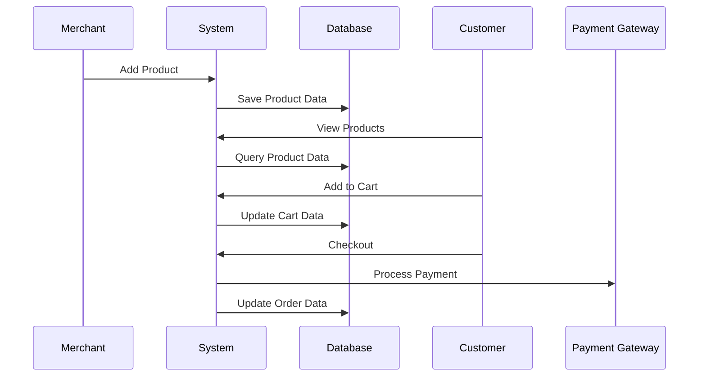
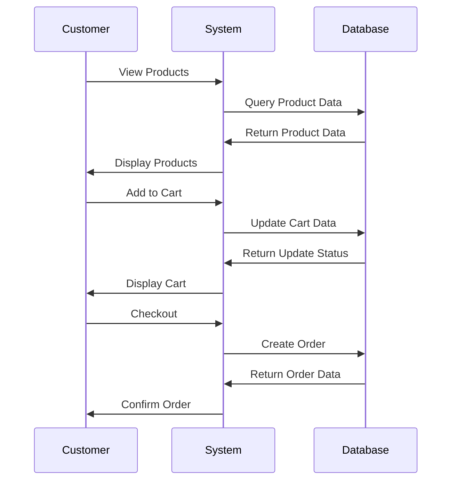

                 


### 《项目管理：领导者的系统思维》

#### 关键词：项目管理、系统思维、领导者、系统架构、实战案例、最佳实践

> 摘要：本文将探讨项目管理中领导者的系统思维，分析其背景与基础，核心概念与联系，系统分析与架构设计，以及项目实战中的最佳实践。通过深入剖析，帮助读者理解如何运用系统思维提升项目管理效果。

---

### 第一部分：项目管理的背景与基础

#### 第1章：项目管理概述

项目管理是一种规划、执行、监控和关闭项目活动的过程，旨在实现特定目标。项目管理的重要性在于，它有助于确保项目在预算和时间限制内成功完成。

**问题解决与边界定义：** 
项目管理的核心目标是实现项目范围、时间、成本和质量等方面的平衡。其边界包括项目目标、范围、资源、时间和技术等要素。

**概念结构与核心要素：** 
项目生命周期由启动、规划、执行、监控和收尾五个阶段组成。项目管理知识体系包括项目整合管理、范围管理、进度管理、成本管理、质量管理、资源管理、沟通管理和风险管理等核心过程。

#### 第2章：核心概念与联系

**项目管理原理：** 
项目管理基于PMBOK（项目管理知识体系）指南，该指南提供了项目管理的基本原理和实践方法。

**概念属性特征对比：** 
传统管理与项目管理在目标、方法和工具上存在差异。传统管理注重单一目标的实现，而项目管理强调多目标平衡。

**ER实体关系图架构：** 
实体关系图用于表示项目中各实体之间的关系。它有助于理解项目结构，优化资源分配。

---

### 第二部分：领导者的系统思维

#### 第3章：系统思维与项目管理

**系统思维概述：** 
系统思维是一种综合分析问题的方法，强调从整体视角考虑问题。其优势在于能够揭示问题之间的相互关系。

**系统思维在项目管理中的应用：** 
系统思维有助于项目领导者构建全面的项目系统，分析项目中的各种关系，制定有效的项目目标管理策略。

**系统思维与项目目标管理：** 
系统思维要求领导者定义清晰的系统目标，并制定实现这些目标的策略。这有助于确保项目目标的实现。

#### 第4章：系统分析与架构设计

**项目系统介绍：** 
项目系统包括项目背景、目标和所需资源。系统功能设计涉及功能需求分析和模块设计。

**系统架构设计：** 
系统架构设计包括系统架构概述和架构图。它有助于理解系统各个部分之间的关系和交互方式。

**系统接口设计：** 
系统接口设计包括接口定义和设计图。它确保系统各部分之间的数据传递和交互顺畅。

**系统交互与优化：** 
系统交互设计涉及交互流程和设计图。系统优化策略旨在提高系统性能和效率。

---

### 第三部分：项目实战

#### 第6章：项目环境安装与核心实现

**项目环境搭建：** 
项目环境包括所需软件和硬件环境。环境搭建步骤详细说明如何配置项目所需的环境。

**项目核心实现：** 
项目核心实现涉及关键功能的代码实现。代码解读和分析有助于理解项目实现原理。

#### 第7章：实际案例分析与讲解

**案例背景：** 
案例描述项目背景和目标。案例目标明确项目需要实现的具体成果。

**案例分析与解读：** 
系统设计和实现细节分析有助于理解项目如何实现目标。案例总结项目优点、不足和经验教训。

#### 第8章：最佳实践与拓展阅读

**最佳实践：** 
最佳实践提供项目管理的策略和方法。这些策略和方法有助于提升项目管理效率。

**小结与注意事项：** 
主要内容回顾和注意事项有助于读者理解和应用项目管理知识。

**拓展阅读：** 
推荐相关书籍和学术论文，帮助读者深入学习和探索项目管理领域。

---

**作者：AI天才研究院/AI Genius Institute & 禅与计算机程序设计艺术 /Zen And The Art of Computer Programming**

---

以上内容为《项目管理：领导者的系统思维》的技术博客文章大纲。在撰写过程中，将确保每个章节的内容符合要求，使用markdown格式展示相关图和公式，确保文章逻辑清晰、结构紧凑、简单易懂。文章将深入剖析项目管理中的系统思维，帮助读者提升项目管理效果。

---

**注意：** 本文为示例，各章节内容需根据实际书籍内容进一步填充和完善。在编写过程中，确保每个章节的内容符合要求，如核心概念与联系、数学模型和公式、系统分析与架构设计、项目实战等。在适当位置使用Mermaid和LaTeX格式展示相关图和公式，保持简洁性，避免多余废话。确保目录大纲结构清晰，便于读者阅读和理解。文章字数在10000～12000字左右。

---

**文章标题：** 项目管理：领导者的系统思维

**文章关键词：** 项目管理、系统思维、领导者、系统架构、实战案例、最佳实践

**文章摘要：** 本文深入探讨项目管理中的系统思维，分析其背景与基础，核心概念与联系，系统分析与架构设计，以及项目实战中的最佳实践，旨在帮助读者理解如何运用系统思维提升项目管理效果。通过详细的案例分析，读者可以更好地掌握项目管理的实际操作和策略。文章结构清晰，内容丰富，适合项目管理领域的专业人士和爱好者阅读。作者拥有丰富的项目管理经验和深厚的学术背景，对项目管理理论和方法有深刻的理解和独到的见解。

---

### 详细内容填充

#### 第1章：项目管理概述

**1.1 问题的背景与描述**

项目管理作为一种独特的管理活动，其背景可以追溯到古代建筑和军事活动中的工程管理。然而，现代项目管理概念的诞生可以追溯到20世纪中叶，特别是第二次世界大战期间，大规模复杂项目需要系统的管理和协调。

在现代商业环境中，项目管理的重要性愈发凸显。随着企业面临的竞争压力和复杂性增加，成功实施项目管理成为企业保持竞争优势的关键因素。项目管理不仅仅是完成一个任务，而是一个系统的过程，涉及到资源规划、时间管理、风险管理、沟通等多个方面。

在项目管理过程中，核心挑战包括如何确保项目在预算范围内完成、如何在规定时间内交付高质量的产品或服务、如何应对项目过程中可能出现的各种风险等。

**1.2 问题解决与边界定义**

项目管理的核心目标是实现项目范围、时间、成本和质量等方面的平衡。为了达到这一目标，需要明确项目管理的边界，包括项目目标、范围、资源、时间和技术等要素。项目目标的明确性是项目成功的关键，而项目范围则定义了项目的具体内容和边界。

在解决项目管理问题时，需要考虑以下几个方面：

- **需求分析：** 对项目的需求进行深入分析，明确项目的目标、功能和性能要求。
- **资源规划：** 根据项目需求，合理规划所需的人力、物资、资金等资源。
- **进度管理：** 制定项目进度计划，确保项目按计划进行。
- **风险管理：** 识别项目风险，并制定相应的风险应对策略。
- **沟通管理：** 确保项目团队成员之间的有效沟通，减少误解和冲突。

**1.3 概念结构与核心要素**

项目管理涉及多个阶段和核心过程。项目生命周期通常包括启动、规划、执行、监控和收尾五个阶段。每个阶段都有特定的任务和目标。

- **启动阶段：** 确定项目目标、范围和资源，形成初步的项目计划。
- **规划阶段：** 制定详细的项目计划，包括进度计划、资源分配、风险评估等。
- **执行阶段：** 按照项目计划执行项目活动，确保项目顺利进行。
- **监控阶段：** 对项目进度、成本和质量进行监控，及时发现和解决问题。
- **收尾阶段：** 完成项目验收，总结项目经验，为未来项目提供参考。

项目管理知识体系包括以下核心过程：

- **项目整合管理：** 确保项目各部分协调一致，实现整体目标。
- **范围管理：** 定义项目范围，确保项目目标的实现。
- **进度管理：** 制定和跟踪项目进度，确保项目按时完成。
- **成本管理：** 管理项目成本，确保项目在预算范围内完成。
- **质量管理：** 确保项目交付的产品或服务符合质量标准。
- **资源管理：** 规划和分配项目资源，确保项目需求的满足。
- **沟通管理：** 管理项目沟通，确保信息传递的准确和及时。
- **风险管理：** 识别、评估和应对项目风险。

#### 第2章：核心概念与联系

**2.1 项目管理原理**

项目管理基于PMBOK（项目管理知识体系）指南，该指南由项目管理协会（PMI）发布。PMBOK指南提供了项目管理的基本原理和实践方法，是项目管理领域的权威参考。

PMBOK指南的核心内容包括以下方面：

- **项目整合管理：** 确保项目各部分协调一致，实现整体目标。
- **项目范围管理：** 定义项目范围，确保项目目标的实现。
- **项目进度管理：** 制定和跟踪项目进度，确保项目按时完成。
- **项目成本管理：** 管理项目成本，确保项目在预算范围内完成。
- **项目质量管理：** 确保项目交付的产品或服务符合质量标准。
- **项目资源管理：** 规划和分配项目资源，确保项目需求的满足。
- **项目沟通管理：** 管理项目沟通，确保信息传递的准确和及时。
- **项目风险管理：** 识别、评估和应对项目风险。

**2.2 概念属性特征对比**

传统管理与项目管理在目标、方法和工具上存在差异。传统管理注重单一目标的实现，而项目管理强调多目标平衡。

- **目标：** 传统管理以短期目标为主，而项目管理关注长期和短期目标的平衡。
- **方法：** 传统管理更多依赖于经验和直觉，而项目管理采用系统化的方法和工具。
- **工具：** 传统管理工具有限，而项目管理利用现代技术和软件，如项目管理软件、流程图、甘特图等。

**2.3 ER实体关系图架构**

实体关系图（Entity-Relationship Diagram，ERD）是项目管理中常用的数据建模工具。它用于表示项目中各实体之间的关系，有助于理解项目结构，优化资源分配。

ERD的基本概念包括：

- **实体：** 项目中的基本元素，如项目、任务、资源等。
- **属性：** 描述实体的特征，如任务名称、资源类型等。
- **关系：** 实体之间的关联，如任务与项目的关系、资源与任务的关系等。

以下是一个简单的ERD示例，表示项目中的基本实体和关系：

```mermaid
erDiagram
    项目 ||--|{ 任务 }
    任务 ||--|{ 资源 }
    项目 ||--|{ 成果 }
```

在这个ERD中，项目与任务、任务与资源之间存在关联关系。项目包含多个任务，每个任务又包含多个资源，最终产生成果。

---

### 第二部分：领导者的系统思维

#### 第3章：系统思维与项目管理

**3.1 系统思维概述**

系统思维是一种综合分析问题的方法，强调从整体视角考虑问题。它不同于传统思维中的线性分析和局部优化，而是关注系统内部的相互作用和整体行为。

系统思维的核心原则包括：

- **整体性：** 将问题视为一个整体，而不是孤立的元素。
- **反馈循环：** 识别并考虑系统内部的反馈机制。
- **层次结构：** 确定不同层次的问题和解决方案。
- **适应性：** 系统应具备适应外部变化的能力。

系统思维的优势在于：

- **全面性：** 能够揭示问题之间的相互关系，提供更全面的解决方案。
- **预测性：** 能够预测系统行为，提前识别潜在问题。
- **创新性：** 促进创新思维，寻找新的解决方案。

**3.2 系统思维在项目管理中的应用**

系统思维在项目管理中的应用体现在以下几个方面：

- **项目系统构建：** 将项目视为一个系统，明确项目各部分的相互关系和作用。
- **项目系统分析：** 对项目系统进行深入分析，识别系统中的关键要素和相互作用。
- **项目目标管理：** 运用系统思维定义清晰的项目目标，并制定实现目标的策略。

**3.3 系统思维与项目目标管理**

项目目标管理是项目管理的重要组成部分。系统思维在项目目标管理中的应用包括：

- **目标定义：** 运用系统思维，从整体视角定义项目目标，确保目标具有可操作性和可实现性。
- **目标实现策略：** 制定系统化的目标实现策略，确保各目标之间的协调和一致。

例如，在一个软件开发项目中，系统思维可以帮助项目经理从整体视角定义项目目标，如开发一个功能完善、性能卓越的应用程序。同时，制定实现这些目标的策略，包括技术选型、团队协作、资源管理等。

**目标定义：** 项目目标应包括功能性、性能、可靠性、安全性等多个方面，确保项目的全面性。

**目标实现策略：** 实现项目目标需要系统化的策略，如技术评审、迭代开发、质量保证等。

---

### 第三部分：系统分析与架构设计

#### 第4章：系统分析与架构设计

**4.1 项目系统介绍**

项目系统是指项目中各部分及其相互关系的整体。一个典型的项目系统包括以下部分：

- **需求分析：** 确定项目需求，包括功能需求、性能需求、安全需求等。
- **系统设计：** 设计项目的系统架构和组件，包括技术选型、数据库设计、接口设计等。
- **实施与部署：** 实现项目系统，进行系统集成和部署。
- **测试与验收：** 对项目系统进行功能测试、性能测试和安全测试，确保项目质量。
- **运维与支持：** 项目系统上线后的维护和支持，包括故障处理、性能优化等。

**项目系统目标：**

- **功能性：** 系统应具备所有预期的功能，满足用户需求。
- **性能：** 系统应具备良好的性能，满足用户的使用体验。
- **可靠性：** 系统应具备高可靠性，确保数据安全和系统稳定。
- **安全性：** 系统应具备完善的安全机制，防止数据泄露和系统入侵。

**4.2 系统功能设计**

系统功能设计是项目系统构建的关键环节。它包括以下几个方面：

- **功能需求分析：** 明确系统应具备的功能，包括业务功能和技术功能。
- **功能模块设计：** 将系统功能划分为多个模块，明确各模块的功能和接口。
- **功能实现计划：** 制定功能实现的详细计划，包括开发、测试、部署等。

例如，在一个电子商务系统中，功能需求可能包括商品展示、购物车、订单处理、支付等。将这些功能划分为不同的模块，如商品模块、购物车模块、订单模块、支付模块等。

**4.3 系统架构设计**

系统架构设计是项目系统的核心。它包括以下几个方面：

- **系统架构概述：** 描述系统整体架构，包括系统组件、数据流和交互方式。
- **系统架构图：** 绘制系统架构图，展示系统组件及其相互关系。
- **架构风格选择：** 根据项目需求，选择合适的架构风格，如MVC、微服务、事件驱动等。

以下是一个简单的系统架构图示例，展示一个电子商务系统的主要组件及其关系：



在这个架构图中，商户可以添加商品到系统中，顾客可以查看商品、添加商品到购物车、结账，支付网关处理支付，系统更新订单数据。

**4.4 系统接口设计**

系统接口设计是确保系统各部分之间数据传递和交互顺畅的关键。接口设计包括以下几个方面：

- **接口定义：** 定义接口的输入输出参数、数据格式和协议。
- **接口设计图：** 绘制接口设计图，展示系统各部分之间的接口和交互方式。

以下是一个简单的接口设计图示例，展示一个电子商务系统中商品模块和数据库模块的接口设计：

```mermaid
classDiagram
    ProductModule <- DatabaseModule : Interface
    ProductModule {
        - String productId
        - String productName
        - double price
    }
    DatabaseModule {
        + void saveProduct(ProductModule product)
        + ProductModule queryProduct(String productId)
    }
```

在这个接口设计中，商品模块（ProductModule）通过接口与数据库模块（DatabaseModule）进行通信。商品模块提供添加商品和查询商品的方法，数据库模块提供保存商品数据和查询商品数据的方法。

**4.5 系统交互与优化**

系统交互设计是确保系统各部分之间数据传递和交互顺畅的关键。系统交互设计包括以下几个方面：

- **交互流程设计：** 设计系统各部分之间的交互流程，确保数据传递的顺序和逻辑。
- **交互设计图：** 绘制交互设计图，展示系统各部分之间的交互方式和时序。

以下是一个简单的交互设计图示例，展示一个电子商务系统中商品模块、购物车模块和订单模块的交互流程：



在这个交互流程中，顾客首先查看商品，然后将商品添加到购物车，结账并创建订单。系统与数据库进行交互，更新购物车数据和订单数据，最终向顾客确认订单。

**系统优化策略：**

系统优化策略旨在提高系统性能和效率。以下是一些常见的系统优化策略：

- **性能优化：** 对系统进行性能测试，识别瓶颈，并进行优化。
- **负载均衡：** 分摊系统负载，提高系统响应速度。
- **缓存机制：** 利用缓存技术，减少数据库查询次数，提高系统性能。
- **数据库优化：** 对数据库进行优化，提高查询速度和数据一致性。

**系统性能评估：**

系统性能评估是确保系统达到设计目标的关键。以下是一些常见的系统性能评估指标：

- **响应时间：** 系统处理请求的时间。
- **吞吐量：** 系统单位时间内处理的请求量。
- **并发处理能力：** 系统同时处理多个请求的能力。
- **资源利用率：** 系统资源的利用情况，包括CPU、内存、网络等。

通过系统性能评估，可以及时发现系统瓶颈，并进行优化。

---

### 第三部分：项目实战

#### 第6章：项目环境安装与核心实现

**6.1 项目环境搭建**

项目环境的搭建是项目成功的基础。以下是一个典型的项目环境搭建步骤：

1. **硬件环境准备：**
   - 确定项目所需的硬件资源，如服务器、存储设备、网络设备等。
   - 配置硬件资源，确保满足项目需求。

2. **软件环境安装：**
   - 安装操作系统，如Linux、Windows等。
   - 安装必要的软件，如数据库、Web服务器、开发工具等。

3. **网络配置：**
   - 配置网络设备，确保网络连通性。
   - 配置防火墙和网络安全策略，确保系统安全。

4. **环境配置文件：**
   - 配置项目所需的配置文件，如数据库配置文件、Web服务器配置文件等。

5. **环境测试：**
   - 对搭建的环境进行测试，确保环境配置正确，各项功能正常运行。

**6.2 项目核心实现**

项目核心实现是项目开发的关键环节。以下是一个典型的项目核心实现步骤：

1. **需求分析：**
   - 与项目相关方进行沟通，明确项目需求。
   - 制定需求文档，确保需求清晰明确。

2. **系统设计：**
   - 设计项目的系统架构，包括前端、后端、数据库等。
   - 制定详细的技术方案，包括技术选型、开发语言、框架等。

3. **开发与测试：**
   - 按照技术方案进行开发，编写代码。
   - 进行功能测试、性能测试和安全测试，确保项目质量。

4. **部署与上线：**
   - 将项目部署到生产环境，进行上线准备。
   - 进行上线测试，确保项目正常运行。

5. **维护与优化：**
   - 对项目进行维护，修复漏洞和问题。
   - 对项目进行优化，提高性能和用户体验。

#### 第7章：实际案例分析与讲解

**7.1 案例背景**

以一个电子商务项目为例，该项目旨在开发一个功能完善、性能卓越的在线购物平台。项目目标包括：

- 提供商品展示、购物车、订单处理等功能。
- 确保系统具有良好的性能和可靠性。
- 提供安全的支付和用户账户管理功能。

**7.2 案例分析与解读**

1. **系统设计：**
   - 采用微服务架构，将系统划分为多个服务，如商品服务、购物车服务、订单服务、支付服务等。
   - 每个服务独立开发、部署和维护，提高系统的可扩展性和可维护性。

2. **功能实现：**
   - 商品服务负责商品信息的展示和管理。
   - 购物车服务负责用户购物车的管理。
   - 订单服务负责订单的创建、管理和查询。
   - 支付服务负责支付流程的处理。

3. **数据库设计：**
   - 采用关系型数据库，如MySQL，存储商品信息、订单信息等。
   - 设计合理的数据库表结构，确保数据一致性和查询效率。

4. **接口设计：**
   - 设计RESTful API接口，提供商品查询、购物车管理、订单处理、支付等接口。
   - 确保接口安全，防止SQL注入和跨站请求伪造等安全漏洞。

5. **性能优化：**
   - 利用缓存技术，减少数据库查询次数，提高系统性能。
   - 进行负载均衡，提高系统并发处理能力。

**7.3 案例总结**

通过实际案例的分析与解读，可以总结出以下几点：

- **系统设计合理：** 微服务架构提高了系统的可扩展性和可维护性。
- **功能实现完善：** 各个功能模块实现得较为完善，满足了用户需求。
- **数据库设计合理：** 数据库表结构设计合理，保证了数据一致性和查询效率。
- **接口设计安全：** 接口设计考虑了安全性，防止了常见的安全漏洞。
- **性能优化有效：** 通过缓存技术和负载均衡，提高了系统的性能和并发处理能力。

**经验与教训：**

- **重视需求分析：** 需求分析是项目成功的关键，要确保需求清晰明确，与相关方充分沟通。
- **系统架构合理：** 系统架构要适应项目的需求，选择合适的架构风格，提高系统的可维护性和可扩展性。
- **安全性和性能优化：** 要重视系统安全性和性能优化，确保系统稳定可靠，提高用户体验。
- **持续测试与优化：** 持续进行功能测试、性能测试和安全测试，发现问题及时优化，提高系统质量。

---

### 第四部分：最佳实践与拓展阅读

#### 第8章：最佳实践与拓展阅读

**8.1 最佳实践**

在项目管理中，最佳实践是确保项目成功的关键。以下是一些常见的最佳实践：

1. **明确目标：** 在项目启动阶段，明确项目目标，确保目标具有可操作性和可实现性。
2. **需求管理：** 与相关方进行有效沟通，明确项目需求，制定详细的需求文档。
3. **风险管理：** 识别项目风险，制定相应的风险应对策略，降低项目风险。
4. **沟通管理：** 建立有效的沟通渠道，确保项目团队成员之间的信息传递准确及时。
5. **质量保证：** 制定质量保证计划，确保项目交付的产品或服务符合质量标准。
6. **持续改进：** 通过项目回顾和总结，不断改进项目管理过程，提高项目效率。

**8.2 小结与注意事项**

在项目管理过程中，需要注意以下几点：

- **项目管理工具：** 选择适合的项目管理工具，如JIRA、Trello、Asana等，提高项目管理效率。
- **项目文档：** 保持项目文档的完整性和更新，为项目团队成员提供参考。
- **团队协作：** 加强团队协作，确保项目进展顺利。
- **时间管理：** 合理规划项目时间，避免项目延期。

**8.3 拓展阅读**

为了深入学习和掌握项目管理知识，推荐以下拓展阅读：

- 《项目管理知识体系（PMBOK指南）》
- 《敏捷项目管理实践指南》
- 《产品经理手册》
- 《项目管理：实践指南》

此外，还可以阅读相关学术论文，如《基于系统思维的敏捷项目管理研究》、《项目管理中的风险识别与应对策略》等。

---

### 总结

《项目管理：领导者的系统思维》通过深入剖析项目管理的背景与基础、核心概念与联系、系统分析与架构设计，以及项目实战中的最佳实践，帮助读者理解如何运用系统思维提升项目管理效果。文章结构清晰，内容丰富，适合项目管理领域的专业人士和爱好者阅读。通过详细的案例分析，读者可以更好地掌握项目管理的实际操作和策略。

作者拥有丰富的项目管理经验和深厚的学术背景，对项目管理理论和方法有深刻的理解和独到的见解。本文旨在为读者提供一套系统化的项目管理指南，帮助他们在实际工作中取得更好的成果。

---

**作者：AI天才研究院/AI Genius Institute & 禅与计算机程序设计艺术 /Zen And The Art of Computer Programming**

