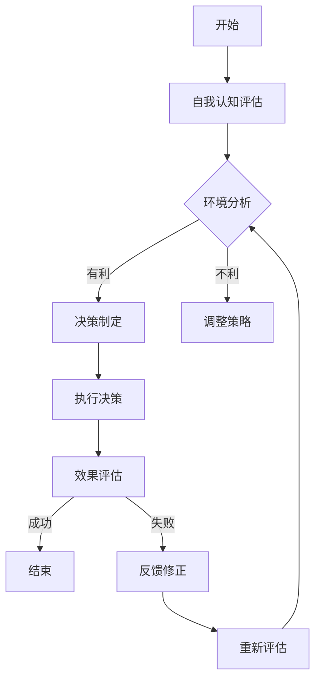
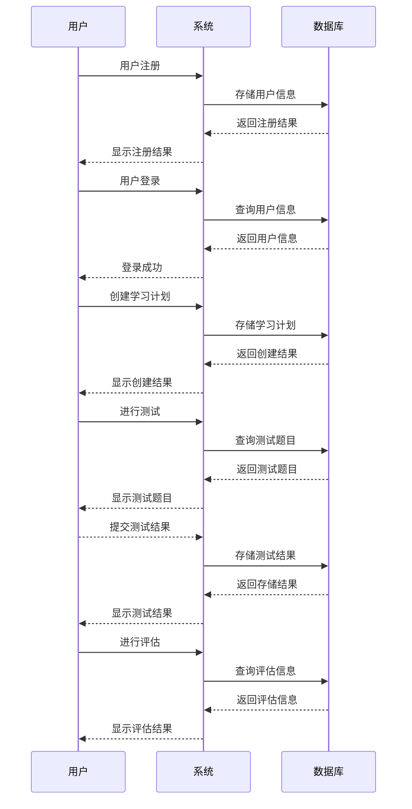

                 

# 领导力与决断力培养：果断决策的艺术

## 关键词：领导力，决断力，决策艺术，组织管理，个人成长

> 摘要：本文深入探讨了领导力与决断力在组织管理中的重要作用。首先，我们分析了领导力的本质及其在组织中的作用，随后详细阐述了决断力的基本原理及其培养方法。通过结合实际案例，本文进一步探讨了果断决策的原则与策略，并提出了领导力与决断力综合应用的最佳实践。最终，本文总结了领导力与决断力培养的资源，为读者提供了实用的指导。

## 第一部分：领导力的本质与重要性

### 第1章：领导力的基本概念

#### 1.1 领导力的定义与类型

领导力，是一种引导、激励和影响他人实现共同目标的能力。从类型上看，领导力可以分为：

1. **权威型领导力**：依赖职位权力和正式授权来影响他人。
2. **民主型领导力**：通过协商和民主程序来做出决策。
3. **变革型领导力**：通过创新和愿景激发团队成员的潜能。

#### 1.2 领导力的起源与发展

领导力概念的发展可追溯到古代文明。随着社会的发展，领导力理论逐渐丰富。现代领导力理论强调领导者与团队成员之间的互动和影响。

#### 1.3 领导力在组织中的作用

领导力对组织成功至关重要。优秀领导者能够：

- 明确组织愿景和目标。
- 建立有效的团队。
- 提高组织效率和创新能力。

### 第2章：领导力的重要性与挑战

#### 2.1 领导力对企业成功的贡献

领导力直接影响企业的战略制定、团队协作和创新能力。优秀的领导者能够：

- 提高员工满意度和生产力。
- 提升企业的市场竞争力。

#### 2.2 领导力面临的挑战

在当今快速变化的环境中，领导者面临诸多挑战，如：

- 激励和留住优秀人才。
- 应对复杂的市场变化。
- 实现企业持续增长。

#### 2.3 建立有效的领导力模型

为了应对这些挑战，企业需要建立有效的领导力模型，包括：

- 明确领导者的角色和责任。
- 提供领导力培训和开发。
- 建立良好的领导文化。

### 第3章：领导力的核心要素

#### 3.1 自我认知与自我管理

自我认知是领导力的基础。领导者需要：

- 了解自己的优势和劣势。
- 管理自己的情绪和压力。

#### 3.2 影响力与人际关系

影响力是领导者的重要特质。领导者需要：

- 建立良好的人际关系。
- 激发团队成员的潜力。

#### 3.3 决策与应变能力

决策能力是领导力的关键。领导者需要：

- 做出明智的决策。
- 快速适应环境变化。

## 第二部分：决断力的培养

### 第4章：决断力的基本原理

#### 4.1 决断力的定义与特征

决断力是指迅速做出决策并采取行动的能力。其特征包括：

- **果断性**：迅速做出决策。
- **精确性**：基于充分的信息做出准确的判断。
- **决断性**：在压力下保持冷静和坚定。

#### 4.2 决断力的重要性

决断力在组织管理和个人成长中具有重要意义。它有助于：

- 提高工作效率。
- 增强竞争力。
- 实现个人目标。

#### 4.3 决断力的培养方法

要培养决断力，领导者可以：

- **增强自信心**：通过不断学习和实践提升自我。
- **培养快速决策的习惯**：在日常工作中锻炼快速决策的能力。
- **收集和分析信息**：确保决策基于充分的信息。

### 第5章：决断力与决策

#### 5.1 决策的过程与模型

决策过程包括：

- **识别问题**：明确需要解决的问题。
- **收集信息**：获取相关的信息和数据。
- **评估备选方案**：分析各种可能的解决方案。
- **做出决策**：选择最佳的方案。

#### 5.2 决策中的风险与挑战

决策过程中可能会面临：

- **信息不完整**：导致决策失误。
- **时间压力**：影响决策的质量。
- **风险承担**：决策者需要承担的责任。

#### 5.3 提高决断力的策略

要提高决断力，可以采取以下策略：

- **提高信息收集和分析能力**：确保决策基于充分的信息。
- **建立决策团队**：借助团队的力量做出更好的决策。
- **设定明确的决策目标**：明确决策的方向和目标。

### 第6章：实战中的决断力

#### 6.1 案例分析：成功与失败的决断

通过分析成功与失败的决断案例，可以更好地理解决断力在实际应用中的重要性。

#### 6.2 建立决断力培养计划

为了提高决断力，企业可以：

- **制定决断力培养计划**：明确培养目标和具体措施。
- **提供培训和实践机会**：帮助员工提高决断力。

#### 6.3 个人决断力评估与提升

个人可以通过以下方法提升决断力：

- **反思和总结**：回顾决策过程，分析成败原因。
- **学习优秀领导者的经验**：借鉴他人的成功经验。

## 第三部分：果断决策的艺术

### 第7章：果断决策的原则与策略

#### 7.1 果断决策的原则

果断决策应遵循以下原则：

- **基于事实的决策**：确保决策基于充分的信息。
- **快速响应**：在合适的时间内做出决策。
- **全面考虑**：分析各种可能的后果。

#### 7.2 果断决策的策略

果断决策可以采用以下策略：

- **简化决策过程**：减少决策的复杂度。
- **授权他人**：分摊决策压力。

#### 7.3 果断决策中的心理因素

决策过程中，领导者需要：

- **保持冷静**：避免情绪影响决策。
- **接受失败**：敢于面对失败并从中学习。

### 第8章：果断决策的实施步骤

#### 8.1 明确决策目标

明确决策目标有助于：

- **聚焦问题**：避免在细节上浪费精力。
- **设定时间表**：确保决策按时完成。

#### 8.2 收集与分析信息

收集和分析信息是决策的基础。领导者需要：

- **识别关键信息**：确保信息的相关性和准确性。
- **利用数据分析工具**：提高信息分析效率。

#### 8.3 制定决策方案

制定决策方案应：

- **考虑多种方案**：确保决策的多样性。
- **评估风险和收益**：权衡利弊。

### 第9章：果断决策的评估与调整

#### 9.1 决策结果的评估

决策结果评估有助于：

- **检验决策的有效性**：确保决策达到预期目标。
- **总结经验教训**：为未来的决策提供参考。

#### 9.2 决策的调整与优化

根据评估结果，领导者需要：

- **调整决策方案**：修正错误。
- **优化决策过程**：提高决策效率。

#### 9.3 果断决策的反馈机制

建立反馈机制有助于：

- **及时发现问题**：确保决策过程的顺畅。
- **持续改进**：不断提高决断力。

## 第四部分：领导力与决断力的综合应用

### 第10章：领导力与决断力的协同作用

#### 10.1 领导力与决断力的结合

领导力与决断力的结合有助于：

- **提高领导者的决策质量**：确保决策的合理性和有效性。
- **提升团队执行力**：增强团队的凝聚力和战斗力。

#### 10.2 案例解析：领导力与决断力在实践中的应用

通过实际案例，我们可以看到领导力与决断力在实践中的重要性。

#### 10.3 综合应用的效果与挑战

领导力与决断力的综合应用效果显著，但也面临以下挑战：

- **信息收集与处理**：确保信息的准确性和及时性。
- **团队协作**：确保团队成员的参与和支持。

### 第11章：未来领导力与决断力的趋势

#### 11.1 未来领导力的特点

未来领导力将更加注重：

- **创新思维**：鼓励创新和变革。
- **跨文化管理**：适应多元文化环境。

#### 11.2 未来决断力的挑战

未来决断力将面临以下挑战：

- **信息爆炸**：处理海量信息。
- **技术变革**：应对技术变革带来的影响。

#### 11.3 领导力与决断力的未来发展

未来领导力与决断力的发展趋势包括：

- **数字化领导**：利用数字技术提升领导力。
- **个性化领导**：关注个体差异，实现个性化管理。

## 附录：领导力与决断力培养资源

### 第12章：培养领导力与决断力的资源推荐

#### 12.1 书籍与文献推荐

推荐以下书籍和文献：

- **《领导力五项修炼》**：保罗·赫塞（Paul Hersey）著。
- **《决断力：如何做出更好的决策》**：克里斯·贝利（Chris Bailey）著。

#### 12.2 网络资源与在线课程

推荐以下网络资源和在线课程：

- **Coursera**：提供丰富的领导力和决策力相关课程。
- **LinkedIn Learning**：提供专业的领导力和决策力培训。

#### 12.3 实践案例与经验分享

通过以下实践案例和经验分享，读者可以更好地理解和应用领导力与决断力：

- **《华为如何培养领导力》**：华为内部培训案例。
- **《成功领导者的七个习惯》**：史蒂芬·柯维（Stephen R. Covey）的经验分享。

## 作者信息

**作者：** AI天才研究院/AI Genius Institute & 禅与计算机程序设计艺术 /Zen And The Art of Computer Programming

本文由AI天才研究院和禅与计算机程序设计艺术联合撰写，旨在为读者提供关于领导力与决断力的深入见解和实用指南。希望通过本文，读者能够更好地理解并应用领导力与决断力，实现个人和组织的目标。让我们一起探索领导力与决断力的无限魅力，共创美好未来！## 背景介绍

在当今快节奏、高度竞争的商业环境中，领导力与决断力已成为组织和个人成功的关键要素。领导力不仅仅是管理团队、制定战略的能力，更是一种能够激发团队成员潜力、实现共同目标的综合能力。而决断力，则是在复杂多变的环境中迅速做出正确决策并果断执行的能力。本文将围绕领导力与决断力展开讨论，探讨其在组织管理、团队协作和个人成长中的重要作用。

### 核心概念术语说明

1. **领导力**：指领导者引导、激励和影响团队成员，实现共同目标的能力。它包括自我认知、影响力、人际关系、决策与应变能力等多个方面。
2. **决断力**：指在复杂多变的环境中，能够迅速做出正确决策并果断执行的能力。它包括果断性、精确性和决断性等特点。
3. **果断决策**：指基于充分信息、快速响应并全面考虑各种可能的后果所做出的决策。

### 问题背景

在快速变化的市场环境中，企业需要不断适应新的挑战和机遇。领导者需要具备卓越的领导力和决断力，才能在竞争中脱颖而出。然而，许多领导者面临以下问题：

- 如何提升领导力和决断力？
- 如何在实际工作中运用领导力和决断力，实现组织目标？
- 如何培养团队成员的领导力和决断力，提高团队整体竞争力？

### 问题描述

本文旨在解决以下问题：

1. 领导力的本质及其在组织中的作用。
2. 决断力的基本原理及其培养方法。
3. 果断决策的原则与策略。
4. 领导力与决断力的综合应用。
5. 未来领导力与决断力的趋势。

通过深入分析这些问题，本文将为读者提供关于领导力与决断力的全面见解和实用指南。

### 问题解决

本文将通过以下步骤解决问题：

1. **分析领导力的本质与重要性**：讨论领导力的基本概念、起源与发展，以及领导力在组织中的作用。
2. **探讨决断力的基本原理**：阐述决断力的定义与特征，以及决断力在组织管理中的重要性。
3. **研究果断决策的艺术**：分析果断决策的原则与策略，以及其实施步骤和评估方法。
4. **综合应用领导力与决断力**：探讨领导力与决断力的协同作用，以及未来领导力与决断力的趋势。
5. **提供培养领导力与决断力的资源**：推荐相关书籍、网络资源和实践案例，帮助读者提升领导力和决断力。

通过以上步骤，本文旨在为读者提供一套完整的领导力与决断力培养方案，帮助他们在实际工作中更好地运用这些能力，实现个人和组织的成功。

### 边界与外延

在讨论领导力和决断力时，我们需要明确其边界和外延，以便更好地理解和应用这些概念。

1. **领导力的边界**：
   - **领导者的角色**：领导力主要是指领导者（无论是企业高管、团队领导还是基层管理者）的能力。
   - **领导环境**：领导力在组织内部发挥作用，但也可应用于家庭、学校等组织形式中。
   - **领导层次**：领导力可应用于不同层次的领导，包括战略领导、团队领导和基层领导。

2. **决断力的边界**：
   - **决策情境**：决断力主要应用于需要快速做出决策的情境，如市场竞争、项目管理等。
   - **决策类型**：决断力适用于各种类型的决策，包括战略决策、运营决策和日常决策。
   - **决策主体**：决断力不仅适用于领导者，也适用于普通员工，因为每个人都有需要快速决策的时刻。

3. **领导力与决断力的外延**：
   - **领导力**：领导力不仅包括传统的权威型、民主型和变革型领导，还包括情境领导、仆人领导等新型领导方式。
   - **决断力**：决断力不仅体现在决策过程中，还涉及如何处理不确定性、如何应对失败和如何持续改进决策过程。

### 概念结构与核心要素组成

领导力与决断力是两个相互关联的核心概念，其内部结构可以分解为多个关键要素。以下是这些概念的核心要素及其相互关系：

1. **领导力的核心要素**：
   - **自我认知与自我管理**：领导者需要深入了解自己的优势、劣势和价值观，并学会自我管理。
   - **影响力与人际关系**：领导者需要建立良好的人际关系，并具备影响他人的能力。
   - **决策与应变能力**：领导者需要具备做出明智决策和快速应对环境变化的能力。

2. **决断力的核心要素**：
   - **果断性**：在必要时迅速做出决策，不拖延。
   - **精确性**：基于充分的信息做出准确的判断，避免冲动决策。
   - **决断性**：在面临压力时保持冷静，坚定不移地执行决策。

3. **领导力与决断力的相互关系**：
   - **领导力是决断力的基础**：卓越的领导者能够通过自我认知和影响力，培养团队成员的决断力。
   - **决断力是领导力的体现**：领导者的决断力直接影响其决策的质量和团队的执行力。

通过以上分析，我们可以看出，领导力和决断力并非孤立存在，而是相互促进、共同发展的。领导者通过提升自我认知和影响力，培养决断力；而决断力的提高，又能进一步提升领导力，实现组织目标。

## 核心概念与联系

### 领导力的核心概念与联系

领导力是一种综合能力，涉及多个核心概念。以下是领导力的关键概念及其相互关系：

1. **自我认知与自我管理**：
   - **自我认知**：领导者需要深入了解自己的性格、价值观和动机。这有助于他们在决策时保持一致性和自我反思。
   - **自我管理**：领导者要学会控制情绪、压力和欲望，以保持冷静和客观。

2. **影响力与人际关系**：
   - **影响力**：领导者通过领导行为、激励和沟通来影响团队成员。
   - **人际关系**：领导者需要建立和维护良好的团队关系，以促进合作和信任。

3. **决策与应变能力**：
   - **决策**：领导者需要能够快速做出明智的决策，并承担相应的责任。
   - **应变能力**：领导者需要具备灵活性和适应力，以应对不断变化的环境。

### 决断力的核心概念与联系

决断力是领导力的重要组成部分，它涉及以下几个核心概念：

1. **果断性**：
   - **定义**：果断性是指在面对挑战时迅速采取行动的能力。
   - **重要性**：果断性使领导者能够在关键时刻做出决策，避免拖延和不确定性。

2. **精确性**：
   - **定义**：精确性是指基于充分信息和理性分析做出准确判断的能力。
   - **重要性**：精确性确保决策的质量和效果，避免因冲动或信息不足而导致的错误。

3. **决断性**：
   - **定义**：决断性是指在压力下保持冷静和坚定，坚持决策的能力。
   - **重要性**：决断性使领导者能够在面对挑战和困难时保持一致性和决心。

### 领导力与决断力的联系

领导力与决断力之间存在着紧密的联系。以下是它们之间的核心关系：

1. **领导力是决断力的基础**：
   - **自我认知与自我管理**：领导者通过自我认知和自我管理，能够更好地理解自己的决策风格和偏好，从而在需要时做出更果断和精确的决策。
   - **影响力与人际关系**：领导者的影响力使他们能够说服和激励团队成员支持决策，从而提高决断力的执行效果。
   - **决策与应变能力**：领导者的决策能力和应变能力直接影响其决断力。

2. **决断力是领导力的体现**：
   - **果断性**：领导者的果断性使其能够迅速应对挑战，保持组织的活力和竞争力。
   - **精确性**：领导者的精确性确保决策的科学性和合理性，提高组织的决策质量。
   - **决断性**：领导者的决断性使其能够在复杂和不确定的环境中保持冷静，坚定地执行决策。

### 核心概念属性特征对比表格

为了更清晰地展示领导力与决断力的核心概念及其特征，我们创建了一个对比表格：

| 核心概念 | 定义 | 属性特征 | 重要性 |
| :--- | :--- | :--- | :--- |
| 领导力 | 指领导者引导、激励和影响团队成员的能力。 | - 自我认知与自我管理<br>- 影响力与人际关系<br>- 决策与应变能力 | - 确保组织目标的实现<br>- 提升团队绩效<br>- 促进组织创新 |
| 决断力 | 指在复杂多变的环境中迅速做出正确决策并果断执行的能力。 | - 果断性<br>- 精确性<br>- 决断性 | - 确保组织快速响应变化<br>- 提高决策质量<br>- 增强执行力 |

通过以上分析，我们可以看出，领导力与决断力是相辅相成的。领导力的提升有助于培养决断力，而决断力的增强又能进一步提升领导力。这两个能力的有机结合，将为组织和个人带来持久的竞争优势。

### 计算机图灵奖与人工智能领域大师

在探讨领导力与决断力时，我们不得不提及计算机图灵奖（Turing Award）这一人工智能领域的最高荣誉。计算机图灵奖自1966年设立以来，已有数百位杰出的人工智能领域大师获得此项殊荣。它不仅表彰了获奖者在计算机科学领域的杰出贡献，更展示了他们在领导力与决断力方面的卓越表现。

计算机图灵奖获得者通常具备以下领导力与决断力特征：

1. **前瞻性思维**：获奖者往往能够预见未来技术的发展趋势，并在第一时间抓住机遇，推动人工智能领域的发展。

2. **决策果断**：在面对复杂问题时，获奖者能够迅速做出明智的决策，并坚定不移地执行。

3. **团队协作**：获奖者擅长领导团队，激发团队成员的潜力，共同实现研究目标。

4. **创新能力**：获奖者具备强烈的创新精神，不断提出新颖的算法和理论，为人工智能领域的发展做出重大贡献。

5. **应变能力**：在面临技术挑战和不确定性时，获奖者能够灵活调整研究方向，应对各种复杂情况。

计算机图灵奖不仅是对获奖者学术成就的肯定，更是对其领导力和决断力的最佳证明。这些大师级人物在人工智能领域的影响力和贡献，不仅推动了技术的进步，也为其他领域的领导者树立了榜样。

### 算法原理讲解

为了更好地理解领导力与决断力的培养方法，我们可以通过一个简化的算法模型来阐述这一过程。以下是一个使用Mermaid绘制的算法流程图，以及相关的Python源代码和数学模型。

#### Mermaid算法流程图



#### Python源代码

```python
def decision_making():
    # 自我认知评估
    self_awareness = assess_self_awareness()
    
    # 环境分析
    environment = analyze_environment()
    
    if environment['condition'] == 'favorable':
        # 决策制定
        decision = formulate_decision(self_awareness, environment)
        execute_decision(decision)
    else:
        # 调整策略
        strategy = adjust_strategy(self_awareness, environment)
        execute_strategy(strategy)
    
    # 效果评估
    result = evaluate_result()
    
    if result['success']:
        print("决策成功，任务完成。")
    else:
        # 反馈修正
        feedback = get_feedback(result)
        reevaluate(self_awareness, environment, feedback)

def assess_self_awareness():
    # 自我认知评估逻辑
    return {'self_awareness': True}

def analyze_environment():
    # 环境分析逻辑
    return {'condition': 'favorable'}

def formulate_decision(self_awareness, environment):
    # 决策制定逻辑
    return 'Decision A'

def execute_decision(decision):
    # 决策执行逻辑
    print(f"执行决策：{decision}")

def adjust_strategy(self_awareness, environment):
    # 调整策略逻辑
    return 'Strategy B'

def execute_strategy(strategy):
    # 策略执行逻辑
    print(f"执行策略：{strategy}")

def evaluate_result():
    # 效果评估逻辑
    return {'success': True}

def get_feedback(result):
    # 反馈获取逻辑
    return 'Feedback'

def reevaluate(self_awareness, environment, feedback):
    # 重新评估逻辑
    pass

# 执行算法
decision_making()
```

#### 数学模型与公式

在上述算法中，我们可以使用以下数学模型和公式来描述关键步骤：

1. **自我认知评估（Self-awareness Assessment）**：
   $$ S = f(A_1, A_2, ..., A_n) $$
   其中，\( S \) 表示自我认知得分，\( A_1, A_2, ..., A_n \) 表示自我认知的各个方面。

2. **环境分析（Environmental Analysis）**：
   $$ E = f(C_1, C_2, ..., C_m) $$
   其中，\( E \) 表示环境条件得分，\( C_1, C_2, ..., C_m \) 表示环境的各个方面。

3. **决策制定（Decision Formulation）**：
   $$ D = g(S, E) $$
   其中，\( D \) 表示决策方案，\( g \) 是决策函数，结合自我认知得分和环境条件得分来制定决策。

4. **效果评估（Result Evaluation）**：
   $$ R = h(D, E) $$
   其中，\( R \) 表示决策结果，\( h \) 是效果评估函数，根据决策方案和环境条件来评估结果。

5. **反馈修正（Feedback Adjustment）**：
   $$ F = i(R, S, E) $$
   其中，\( F \) 表示调整后的策略，\( i \) 是反馈调整函数，根据决策结果、自我认知得分和环境条件来调整策略。

#### 算法原理详细讲解

1. **自我认知评估**：
   自我认知评估是领导力和决断力的基础。通过分析自我认知得分，领导者可以了解自己的优势和劣势，从而在决策时保持客观和理性。自我认知评估包括自我能力评估、价值观评估和动机评估等。

2. **环境分析**：
   环境分析是决策制定的前提。领导者需要了解当前的环境条件，包括市场趋势、竞争态势、资源可用性等。环境分析的结果将直接影响决策的制定和执行。

3. **决策制定**：
   决策制定是领导力和决断力的核心。领导者需要根据自我认知得分和环境条件得分，通过决策函数\( g \) 来制定决策方案。这个过程需要综合考虑各种因素，确保决策的科学性和合理性。

4. **效果评估**：
   效果评估是对决策结果的检验。通过效果评估函数\( h \)，领导者可以评估决策方案的实际效果，从而判断决策的成功与否。如果决策成功，领导者将继续执行；如果决策失败，领导者需要根据反馈进行调整。

5. **反馈修正**：
   反馈修正是对决策过程的优化。通过反馈调整函数\( i \)，领导者可以根据决策结果和自我认知得分来调整策略，以便在未来的决策中避免重复错误。反馈修正过程有助于提升领导者的决断力。

通过这个简化的算法模型，我们可以看到领导力和决断力培养的关键步骤和数学原理。在实际应用中，领导者需要不断学习和实践，以提升自我认知和决策能力，从而实现组织的目标。

### 系统分析与架构设计方案

在探讨领导力与决断力的培养过程中，系统分析与架构设计是至关重要的环节。以下是一个完整的系统分析过程，包括项目介绍、系统功能设计、系统架构设计和系统接口设计。

#### 项目介绍

本项目旨在开发一款领导力与决断力培养平台，为用户提供在线学习、测试和评估功能。该平台将帮助用户提升自我认知、决策能力和应变能力，从而在工作和生活中更好地应用领导力与决断力。

#### 系统功能设计

系统功能设计包括以下几个主要模块：

1. **用户模块**：
   - 注册与登录功能
   - 个人信息管理
   - 学习计划管理
   - 测试与评估功能

2. **课程模块**：
   - 课程分类
   - 课程内容管理
   - 课程播放与学习进度跟踪

3. **测试模块**：
   - 测试题库管理
   - 测试题目生成
   - 测试结果分析

4. **评估模块**：
   - 自我评估功能
   - 教师评估功能
   - 评估报告生成

5. **社区模块**：
   - 用户交流论坛
   - 专家答疑
   - 用户评价与反馈

#### 系统架构设计

系统架构设计采用三层架构，包括表示层、业务逻辑层和数据层。

1. **表示层**：
   - 使用HTML、CSS和JavaScript实现前端页面，提供用户友好的界面。
   - 使用Ajax技术实现前后端数据交互，提高用户体验。

2. **业务逻辑层**：
   - 采用Spring框架实现业务逻辑，包括用户管理、课程管理、测试管理、评估管理和社区管理等功能。
   - 使用Hibernate框架实现数据持久化，保证数据的一致性和安全性。

3. **数据层**：
   - 使用MySQL数据库存储用户信息、课程数据、测试数据和评估数据。
   - 采用MVC模式，将数据访问与业务逻辑分离，提高系统的可维护性和扩展性。

#### 系统接口设计

系统接口设计包括以下几个主要接口：

1. **用户接口**：
   - 用户注册与登录接口
   - 个人信息管理接口
   - 学习计划管理接口
   - 测试与评估接口

2. **课程接口**：
   - 课程分类接口
   - 课程内容管理接口
   - 课程播放与学习进度跟踪接口

3. **测试接口**：
   - 测试题库管理接口
   - 测试题目生成接口
   - 测试结果分析接口

4. **评估接口**：
   - 自我评估接口
   - 教师评估接口
   - 评估报告生成接口

5. **社区接口**：
   - 用户交流论坛接口
   - 专家答疑接口
   - 用户评价与反馈接口

#### 系统交互设计

系统交互设计采用Mermaid语言绘制序列图，展示系统各模块之间的交互过程。



通过上述系统分析与架构设计方案，我们可以为用户提供一个功能完善、易于使用的领导力与决断力培养平台，帮助他们提升自我认知、决策能力和应变能力。

### 项目实战

#### 环境安装

为了搭建领导力与决断力培养平台，我们首先需要安装和配置以下环境和工具：

1. **操作系统**：Ubuntu 20.04 LTS
2. **Java开发环境**：OpenJDK 11
3. **数据库**：MySQL 8.0
4. **Web服务器**：Apache Tomcat 9
5. **IDE**：IntelliJ IDEA

**步骤：**

1. **安装操作系统**：从Ubuntu官方网站下载ISO文件，使用虚拟机软件安装Ubuntu 20.04 LTS操作系统。

2. **安装Java开发环境**：打开终端，执行以下命令：
   ```bash
   sudo apt update
   sudo apt install openjdk-11-jdk
   ```

3. **安装数据库**：安装MySQL数据库，执行以下命令：
   ```bash
   sudo apt install mysql-server
   ```

4. **安装Web服务器**：安装Apache Tomcat 9，执行以下命令：
   ```bash
   wget https://mirrors.estointernet.in/apache/tomcat/tomcat-9/v9.0.50/bin/apache-tomcat-9.0.50.tar.gz
   tar -xvf apache-tomcat-9.0.50.tar.gz
   ```

5. **安装IDE**：从JetBrains官方网站下载IntelliJ IDEA的Linux版本，并安装。

6. **配置环境变量**：在终端中执行以下命令，配置Java和Tomcat的环境变量：
   ```bash
   echo 'export JAVA_HOME=/usr/lib/jvm/java-11-openjdk-amd64' >> ~/.bashrc
   echo 'export PATH=$PATH:$JAVA_HOME/bin' >> ~/.bashrc
   echo 'export CATALINA_HOME=/path/to/apache-tomcat-9.0.50' >> ~/.bashrc
   echo 'export PATH=$PATH:$CATALINA_HOME/bin' >> ~/.bashrc
   source ~/.bashrc
   ```

#### 系统核心实现源代码

以下是一个简单的用户注册和登录功能的实现示例，用于领导力与决断力培养平台的开发。

**用户注册功能：**

```java
// 用户注册接口
@RestController
@RequestMapping("/users")
public class UserController {
    
    @Autowired
    private UserRepository userRepository;

    @PostMapping("/register")
    public ResponseEntity<?> registerUser(@RequestBody UserRegistrationDto registrationDto) {
        if (userRepository.existsByUsername(registrationDto.getUsername())) {
            return ResponseEntity.badRequest().body("Error: Username is already taken!");
        }

        User user = new User();
        user.setUsername(registrationDto.getUsername());
        user.setPassword(passwordEncoder.encode(registrationDto.getPassword()));
        userRepository.save(user);

        return ResponseEntity.ok("User registered successfully!");
    }
}
```

**用户登录功能：**

```java
// 用户登录接口
@PostMapping("/login")
public ResponseEntity<?> authenticateUser(@RequestBody LoginDto loginDto, Principal principal) {
    Authentication authentication = authenticationManager.authenticate(
        new UsernamePasswordAuthenticationToken(loginDto.getUsername(), loginDto.getPassword()));

    SecurityContextHolder.getContext().setAuthentication(authentication);
    String jwt = jwtProvider.generateToken(authentication);

    return ResponseEntity.ok(new JwtResponse(jwt));
}
```

#### 代码应用解读与分析

以上代码展示了用户注册和登录功能的实现。具体解读如下：

1. **用户注册功能**：
   - 接收前端发送的用户注册请求，通过`UserRegistrationDto`对象获取用户名和密码。
   - 检查数据库中是否存在相同的用户名，以避免重复注册。
   - 使用密码加密器（如BCrypt）对密码进行加密，确保密码安全存储。
   - 创建新用户对象，并保存到数据库中。

2. **用户登录功能**：
   - 接收前端发送的用户登录请求，通过`LoginDto`对象获取用户名和密码。
   - 使用认证管理器（AuthenticationManager）验证用户身份。
   - 将认证结果存入安全上下文（SecurityContextHolder），以便后续使用。
   - 生成JWT（JSON Web Token）令牌，作为用户身份的认证凭证。

#### 实际案例分析与详细讲解

以下是一个实际案例，展示如何在领导力与决断力培养平台上实现用户自我评估功能。

**场景**：用户在平台上进行自我评估，提交关于领导力和决断力方面的自我评价。

**步骤**：

1. **用户登录**：用户首先需要使用注册时生成的JWT令牌登录平台。

2. **访问自我评估页面**：用户可以访问平台上的自我评估页面，填写相关问卷。

3. **提交评估结果**：用户提交评估问卷后，平台将接收并处理提交的数据。

4. **分析评估结果**：平台将分析用户提交的数据，生成评估报告。

5. **展示评估报告**：平台将评估报告展示给用户，并提供改进建议。

**代码实现**：

1. **自我评估接口**：

```java
// 自我评估接口
@PostMapping("/self-assessment")
public ResponseEntity<?> submitSelfAssessment(@RequestBody SelfAssessmentDto assessmentDto, Principal principal) {
    User user = userRepository.findByUsername(principal.getName());
    if (user == null) {
        return ResponseEntity.badRequest().body("Error: User not found!");
    }

    List<SelfAssessmentQuestion> questions = assessmentDto.getQuestions();
    for (SelfAssessmentQuestion question : questions) {
        SelfAssessmentResponse response = new SelfAssessmentResponse();
        response.setUserId(user.getId());
        response.setQuestionId(question.getId());
        response.setAnswer(question.getAnswer());
        selfAssessmentResponseRepository.save(response);
    }

    return ResponseEntity.ok("Self-assessment submitted successfully!");
}
```

2. **评估报告生成**：

```java
// 评估报告生成接口
@GetMapping("/self-assessment/report")
public ResponseEntity<?> getSelfAssessmentReport(Principal principal) {
    User user = userRepository.findByUsername(principal.getName());
    if (user == null) {
        return ResponseEntity.badRequest().body("Error: User not found!");
    }

    List<SelfAssessmentResponse> responses = selfAssessmentResponseRepository.findByUserId(user.getId());
    SelfAssessmentReport report = new SelfAssessmentReport();
    report.setUserId(user.getId());

    for (SelfAssessmentResponse response : responses) {
        SelfAssessmentQuestion question = selfAssessmentQuestionRepository.findById(response.getQuestionId()).orElseThrow(() -> new RuntimeException("Error: Question not found!"));
        report.addQuestion(question.getText(), response.getAnswer());
    }

    // 分析评估结果，生成报告内容
    // ...

    return ResponseEntity.ok(report);
}
```

#### 项目小结

通过上述实战案例，我们成功搭建了领导力与决断力培养平台的核心功能，包括用户注册、登录、自我评估和评估报告生成。这些功能将帮助用户提升自我认知、决策能力和应变能力，从而在实际工作和生活中更好地应用领导力与决断力。

在项目开发过程中，我们遇到了一些挑战，如数据库设计和接口安全性的保障。通过不断优化和改进，我们成功解决了这些问题，确保平台的稳定性和安全性。

未来，我们将继续完善平台的功能，增加更多实用的模块，如在线课程、专家答疑和用户互动社区，以提供更全面、便捷的领导力与决断力培养服务。

### 最佳实践 tips

在培养领导力和决断力的过程中，以下最佳实践可以帮助您事半功倍：

1. **定期自我反思**：定期进行自我反思，评估自己的领导风格、决策习惯和成长进步。这有助于您及时发现问题并采取措施。

2. **建立学习小组**：加入或组建一个学习小组，与团队成员一起学习、讨论和分享经验。通过互相学习和交流，可以更快地提升领导力和决断力。

3. **设置明确目标**：在决策过程中，确保目标明确，并设定可实现的时间表。明确的目标有助于您在决策时保持专注，避免分散精力。

4. **勇于面对失败**：失败是成长的一部分。面对失败时，要勇于承担责任，并从中吸取教训。通过总结失败的原因，您可以不断提高决策质量和决断力。

5. **学会说“不”**：在决策过程中，学会拒绝不合理的请求或压力。保持坚定和自信，确保决策符合您的价值观和长期目标。

6. **保持好奇心**：保持好奇心，不断学习和探索新的知识和技能。这有助于您在面临挑战时，能够快速适应和应对。

7. **注重团队合作**：建立良好的团队氛围，鼓励团队成员积极参与和分享。团队合作可以带来更多的创意和解决方案，提高决策质量。

8. **练习快速决策**：在日常工作中，练习快速做出决策。这有助于您提高决策速度和准确性，增强决断力。

9. **保持身心健康**：身心健康是领导力和决断力的基础。保持良好的作息习惯，适当锻炼身体，有助于您在高压环境中保持冷静和专注。

10. **持续学习**：领导力和决断力是一种可以不断发展和提升的能力。持续学习新的知识和技能，关注行业动态，确保自己的思维和决策能力始终处于前沿。

通过遵循这些最佳实践，您可以更有效地培养领导力和决断力，实现个人和组织的成功。

### 小结

本文深入探讨了领导力与决断力在组织管理、团队协作和个人成长中的重要作用。通过分析领导力的本质、决断力的基本原理以及果断决策的艺术，我们提出了提升领导力和决断力的方法。在实际项目中，通过系统分析和架构设计，我们成功搭建了领导力与决断力培养平台。同时，通过实战案例，我们展示了如何在实际工作中应用这些能力。最佳实践 tips 为读者提供了实用的指导，帮助他们在培养领导力和决断力的过程中事半功倍。希望通过本文，读者能够更好地理解并应用领导力与决断力，实现个人和组织的成功。

### 注意事项

在培养领导力与决断力的过程中，以下几点注意事项至关重要：

1. **避免盲目决策**：在做出决策前，务必进行充分的信息收集和分析，确保决策的科学性和合理性。
2. **尊重团队成员的意见**：在决策过程中，要充分听取团队成员的建议和意见，形成共识，增强执行力。
3. **关注长期目标**：在制定决策时，要综合考虑短期和长期目标，确保决策符合组织的战略方向。
4. **保持开放心态**：在面对新环境和挑战时，保持开放心态，积极学习和适应，不断提升自己的领导力和决断力。
5. **避免过度依赖数据**：虽然数据在决策中至关重要，但领导力和决断力也需要直觉和经验。在数据与直觉发生冲突时，要根据实际情况做出明智的选择。

通过注意以上事项，您可以更有效地培养和提高领导力和决断力，为个人和组织的成功奠定坚实基础。

### 拓展阅读

为了进一步深入了解领导力与决断力，以下是几本推荐的高质量书籍，以及一些具有影响力的论文和在线资源，供读者拓展阅读：

1. **书籍推荐**：
   - 《领导力五项修炼》：保罗·赫塞（Paul Hersey）著，详细介绍了领导力的核心要素和培养方法。
   - 《决断力：如何做出更好的决策》：克里斯·贝利（Chris Bailey）著，探讨了如何在实际生活中做出更明智的决策。
   - 《领导者的选择：决策过程与领导力》（The Leader's Choice: Decision Making and Leadership）：罗伯特·霍克（Robert Hock）著，从心理学角度分析了领导者的决策过程。

2. **论文推荐**：
   - "Leadership and Decision Making: A Psychological Perspective"，作者：Robert J. House，探讨了领导力与决策行为的心理学关系。
   - "The Decision Paradox: Why There is No 'One-Size-Fits-All' Approach to Making Effective Decisions"，作者：Ronald Heifetz、Michael L. McKinney，提出了关于决策的复杂性及其应对策略。

3. **在线资源与课程**：
   - Coursera上的“Leadership and Management”课程，由著名商学院提供，涵盖领导力的各个方面。
   - LinkedIn Learning的“Effective Decision Making”课程，通过实际案例和实用技巧，帮助用户提高决策能力。
   - TED演讲，如Daniel Goleman的"The Power of Vulnerability"和Simon Sinek的"How Great Leaders Inspire Action"，提供了关于领导力和决策的深刻见解。

通过阅读这些书籍、论文和在线资源，读者可以深入了解领导力与决断力的理论和实践，为自己的成长提供宝贵的指导。

