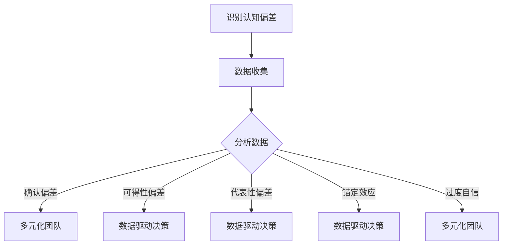
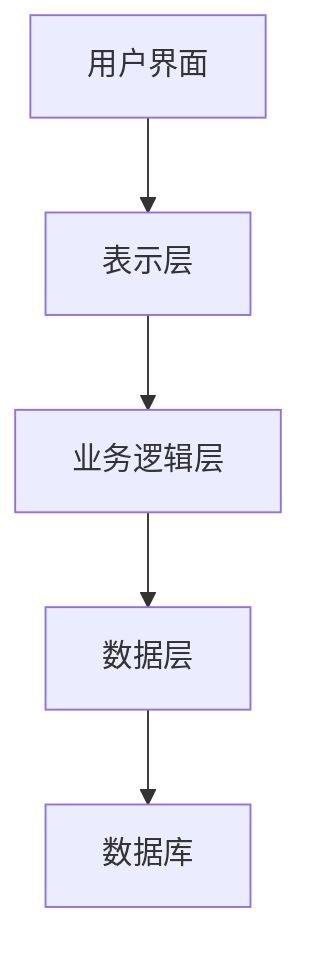
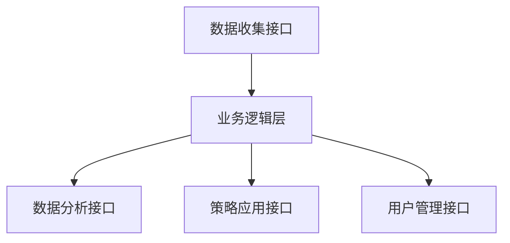
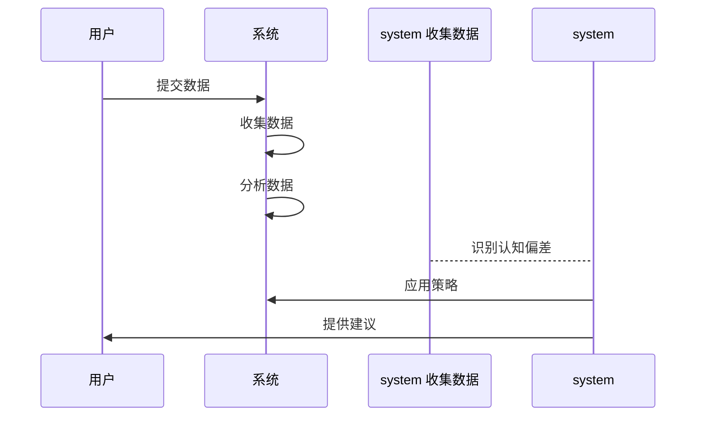

                 


# 领导力与决策偏见：克服认知偏差的策略

关键词：领导力，决策偏见，认知偏差，策略，克服

摘要：本文探讨了领导力在决策过程中的重要性，以及如何识别和克服认知偏差。通过分析领导力基础、认知偏差理论和实践策略，为领导者提供了一套系统的决策方法和实践指南。

## 引言

领导力是组织成功的关键因素之一。领导者不仅要具备领导能力，还需要在决策过程中保持清醒的头脑，避免认知偏差的影响。认知偏差是指人们在感知、理解、判断和决策过程中，由于认知机制的限制，容易出现的一系列系统性错误。这些偏差可能对领导决策产生负面影响，导致决策失误。

本文旨在通过分析领导力与决策偏见的关系，提供一套克服认知偏差的策略，帮助领导者做出更明智的决策。

## 领导力基础

### 2.1 领导力的定义

领导力是指领导者通过激励、沟通、协调和引导他人，实现共同目标的能力。它不仅仅是一种技术技能，更是一种人性洞察和管理能力的体现。

### 2.2 领导者的角色和职责

领导者通常扮演以下角色：愿景规划者、战略制定者、资源整合者、团队建设者、沟通协调者。他们的职责包括：设定组织目标、制定战略计划、分配资源、培养团队、解决冲突等。

### 2.3 领导力的发展与提升

领导力可以通过学习、实践和反思来不断提升。以下是一些提升领导力的方法：

1. **自我认知**：领导者需要了解自己的优点和不足，以便更好地发挥自己的优势，改进自己的不足。
2. **情感智力**：领导者需要具备较高的情感智力，能够理解和管理自己的情绪，同时也能够理解和影响他人的情绪。
3. **沟通技巧**：良好的沟通技巧是领导者有效传达信息、建立信任和促进团队合作的关键。
4. **持续学习**：领导者需要不断学习新知识、新技能，以适应快速变化的环境。

## 认知偏差理论

### 3.1 认知偏差的定义

认知偏差是指人们在感知、理解、判断和决策过程中，由于认知机制的限制，出现的一系列系统性错误。

### 3.2 认知偏差的类型

常见的认知偏差包括：

1. **确认偏差**：倾向于寻找、解释和记住支持我们观点的信息，忽视或贬低反对我们观点的信息。
2. **可得性偏差**：根据最近或最易于回忆的信息做出判断，而忽略其他可能更准确的信息。
3. **代表性偏差**：根据事物的外表特征或群体特征来推断个体特征，而忽略了概率和统计规律。
4. **锚定效应**：在决策过程中，初期信息（锚点）对后续判断产生过度影响。
5. **过度自信**：高估自己的知识和能力，低估风险和不确定性。

### 3.3 认知偏差对决策的影响

认知偏差可能导致以下不良后果：

1. **决策失误**：由于忽视重要信息或过度依赖某些信息，导致决策质量下降。
2. **团队冲突**：认知偏差可能导致团队成员之间的误解和冲突。
3. **组织效率低下**：认知偏差可能导致资源分配不当，影响组织效率。

## 领导力与认知偏差的互动

### 4.1 领导力如何影响认知偏差

领导力对认知偏差的影响体现在以下几个方面：

1. **角色模型**：领导者通过自己的行为和决策，影响团队成员的认知偏差。
2. **信息筛选**：领导者对信息的筛选和传递，可能加剧或缓解团队成员的认知偏差。
3. **团队氛围**：领导力营造的团队氛围，可能增强或减弱团队成员的认知偏差。

### 4.2 认知偏差如何影响领导力

认知偏差对领导力的影响主要体现在以下几个方面：

1. **决策质量**：认知偏差可能导致领导者做出不理性的决策，影响组织绩效。
2. **团队管理**：认知偏差可能导致领导者对团队成员的误解和偏见，影响团队氛围和合作。
3. **创新能力**：认知偏差可能限制领导者的创新思维，影响组织的持续发展。

### 4.3 领导者如何识别认知偏差

领导者识别认知偏差的方法包括：

1. **自我反思**：领导者定期进行自我反思，了解自己的认知偏差。
2. **团队反馈**：领导者倾听团队成员的意见和建议，了解团队中的认知偏差。
3. **数据验证**：领导者通过数据和分析来验证自己的决策，避免认知偏差的影响。

## 克服认知偏差的策略

### 5.1 提高自我认知

领导者可以通过以下方法提高自我认知：

1. **自我评估**：领导者定期进行自我评估，了解自己的优点和不足。
2. **情绪管理**：领导者学会管理自己的情绪，避免情绪波动对决策的影响。
3. **持续学习**：领导者不断学习新知识、新技能，提升自己的认知能力。

### 5.2 增强信息处理能力

领导者可以通过以下方法增强信息处理能力：

1. **多元化信息源**：领导者广泛收集信息，避免单一信息源的影响。
2. **逻辑分析**：领导者学会逻辑分析，避免情感和直觉的干扰。
3. **数据驱动决策**：领导者根据数据和分析做出决策，减少认知偏差的影响。

### 5.3 建立多元化的团队

领导者可以通过以下方法建立多元化的团队：

1. **多样性招募**：领导者积极招募具有不同背景、经验和观点的团队成员。
2. **开放沟通**：领导者鼓励团队成员开放沟通，分享不同观点。
3. **协作机制**：领导者建立协作机制，促进团队成员之间的合作和互补。

### 5.4 定期反思与调整

领导者可以通过以下方法定期反思与调整：

1. **反思日志**：领导者定期记录自己的反思日志，分析决策过程中的认知偏差。
2. **定期评估**：领导者定期评估自己的决策效果，发现和纠正认知偏差。
3. **持续改进**：领导者根据反思和评估结果，持续改进自己的决策方法和行为。

## 案例分析

### 6.1 案例一：如何识别和克服领导力中的认知偏差

#### 案例背景

某公司的领导者王先生，一直认为自己的团队需要更加注重技术能力，因此在招聘新成员时，优先考虑技术背景优秀的候选人。然而，随着时间的推移，团队的表现并没有达到预期，甚至出现了一些质量问题。

#### 案例分析

王先生通过自我反思，意识到自己可能陷入了确认偏差，只关注技术能力，而忽视了团队合作、沟通能力和业务理解等其他重要因素。为了克服这一认知偏差，他采取了以下措施：

1. **多元化招募**：王先生开始关注不同背景、经验和观点的候选人，不仅限于技术背景。
2. **沟通与反馈**：他鼓励团队成员开放沟通，分享不同的观点和意见。
3. **反思与调整**：王先生定期反思自己的决策，评估团队成员的综合能力，不断调整招聘策略。

通过以上措施，王先生的团队逐渐展现出更好的协作能力和业务理解，项目质量也有了明显提升。

### 6.2 案例二：实际案例中的认知偏差与策略应用

#### 案例背景

某互联网公司在新产品发布前，市场部门认为产品定位准确，市场需求巨大，因此建议加大广告投放力度。然而，产品上线后，市场反响平平，销售额远低于预期。

#### 案例分析

市场部门的决策可能受到了可得性偏差的影响，过于依赖过去的市场数据和经验，而忽视了当前市场的变化和竞争态势。为了克服这一认知偏差，公司采取了以下策略：

1. **数据驱动决策**：公司收集了更多市场数据，包括用户反馈、竞争对手分析等，重新评估市场状况。
2. **多元化团队**：公司组建了包括产品、技术、市场等多部门人员在内的多元化团队，共同讨论和制定市场策略。
3. **定期评估**：公司定期评估市场策略的效果，根据实际情况进行调整。

通过以上策略，公司逐渐找到了市场需求，产品销量有了显著提升。

### 6.3 案例三：克服认知偏差的领导力实践

#### 案例背景

某创业公司创始人李先生，一直认为公司的核心竞争力在于技术创新，因此在产品开发过程中，对市场反馈和技术难题反应迟缓，导致产品上市时间延误。

#### 案例分析

李先生可能陷入了代表性偏差，过于重视技术创新，而忽视了市场需求和用户体验。为了克服这一认知偏差，他采取了以下措施：

1. **用户调研**：李先生开始重视用户反馈，定期进行用户调研，了解用户需求。
2. **开放沟通**：他鼓励团队成员提出不同的意见和建议，建立开放沟通的机制。
3. **敏捷开发**：公司采用敏捷开发模式，快速响应市场需求和变化。

通过以上措施，公司的产品开发速度明显加快，市场反响良好，公司业绩稳步提升。

## 结论

本文通过分析领导力与决策偏见的关系，提供了一套克服认知偏差的策略。领导者需要提高自我认知，增强信息处理能力，建立多元化的团队，并定期反思与调整。通过实践这些策略，领导者可以做出更明智的决策，提高组织的绩效和创新能力。

未来研究方向包括：

1. **认知偏差的实证研究**：进一步研究不同类型认知偏差在领导力中的具体表现和影响。
2. **策略效果评估**：评估不同策略在实践中的应用效果，优化和完善策略体系。

对领导者的建议：

1. **保持谦逊和开放**：领导者要始终保持谦逊和开放的态度，接受不同的意见和建议。
2. **持续学习和反思**：领导者要持续学习和反思，不断提升自己的认知能力和决策水平。
3. **关注团队建设**：领导者要关注团队建设，培养多元化的团队，促进团队协作和创新。

作者：AI天才研究院/AI Genius Institute & 禅与计算机程序设计艺术 /Zen And The Art of Computer Programming

## 背景介绍

### 1.1 核心概念术语说明

- **领导力**：指的是领导者通过影响、激励、指导和协调团队成员，实现组织目标的能力。
- **决策偏见**：是指由于认知机制的局限性，人们在做出决策时容易出现的一系列系统性偏差。
- **认知偏差**：是指人们在感知、理解、判断和决策过程中，由于认知机制的限制，出现的一系列系统性错误。

### 1.2 问题背景

在现代社会，领导力对于组织的发展和成功至关重要。领导者需要做出各种决策，从战略规划到日常运营，从人员管理到资源配置。然而，决策并非总是一帆风顺，认知偏差可能导致领导者做出不理性、甚至错误的决策。这些认知偏差不仅影响个人的决策效果，也可能对整个组织的运作产生负面影响。

### 1.3 问题描述

本文关注的问题是如何在领导力决策过程中识别和克服认知偏差。具体来说，我们需要解决以下几个问题：

1. 领导力决策过程中常见的认知偏差有哪些？
2. 这些认知偏差如何影响领导决策？
3. 领导者如何识别和克服这些认知偏差，以做出更明智的决策？

### 1.4 问题解决

解决上述问题需要从以下几个方面入手：

1. **理解认知偏差**：领导者需要了解各种认知偏差的类型和特点，以便在决策过程中识别和应对。
2. **提高自我认知**：领导者需要通过自我反思和评估，识别自己的认知偏差，并采取措施进行修正。
3. **增强信息处理能力**：领导者需要提高信息收集、分析和处理的能力，以减少认知偏差的影响。
4. **建立多元化团队**：领导者需要建立多元化团队，借助不同背景和观点的成员，减少认知偏差。
5. **定期反思与调整**：领导者需要定期反思决策过程和结果，发现和纠正认知偏差，持续改进决策方法。

### 1.5 边界与外延

本文主要关注领导力决策过程中的认知偏差问题，而不涉及其他类型的认知偏差（如心理学、社会学等领域的认知偏差）。此外，本文提供的是一般性的策略和方法，不同领域的领导者可能需要根据具体情况调整和应用。

### 1.6 概念结构与核心要素组成

本文的核心概念结构包括：

1. **领导力**：包括领导力的定义、角色和职责，以及领导力的发展与提升。
2. **认知偏差**：包括认知偏差的定义、类型和影响，以及如何识别和克服认知偏差。
3. **克服认知偏差的策略**：包括提高自我认知、增强信息处理能力、建立多元化团队和定期反思与调整。

## 核心概念与联系

### 3.1 认知偏差的概念

认知偏差是指人们在感知、理解、判断和决策过程中，由于认知机制的局限性，容易出现的一系列系统性错误。这些偏差可能导致人们做出不理性、不准确的决策。

### 3.2 认知偏差的类型

认知偏差可以分为多种类型，每种类型都有其特定的表现和影响。以下是几种常见的认知偏差类型及其特点：

#### 确认偏差

- **特点**：倾向于寻找、解释和记住支持我们观点的信息，忽视或贬低反对我们观点的信息。
- **影响**：导致决策者过于自信，忽视重要的反对意见，可能引发团队冲突和决策失误。

#### 可得性偏差

- **特点**：根据最近或最易于回忆的信息做出判断，而忽略其他可能更准确的信息。
- **影响**：导致决策者基于有限的信息做出决策，可能导致错误的判断和决策。

#### 代表性偏差

- **特点**：根据事物的外表特征或群体特征来推断个体特征，而忽略了概率和统计规律。
- **影响**：导致决策者过于依赖直觉和经验，忽视数据和分析，可能引发风险和不确定性。

#### 锚定效应

- **特点**：在决策过程中，初期信息（锚点）对后续判断产生过度影响。
- **影响**：导致决策者过于依赖初始信息，难以调整和修正，可能导致错误的决策。

#### 过度自信

- **特点**：高估自己的知识和能力，低估风险和不确定性。
- **影响**：导致决策者过于自信，忽视风险和不确定性，可能导致冒险和失败。

### 3.3 认知偏差对决策的影响

认知偏差对领导决策的影响是多方面的，包括：

- **决策质量**：认知偏差可能导致领导者做出不理性、不准确的决策，影响组织绩效。
- **团队管理**：认知偏差可能导致领导者对团队成员的误解和偏见，影响团队氛围和合作。
- **创新能力**：认知偏差可能限制领导者的创新思维，影响组织的持续发展。

### 3.4 如何识别和克服认知偏差

为了克服认知偏差，领导者可以采取以下策略：

- **自我反思**：领导者需要定期进行自我反思，识别自己的认知偏差，并采取措施进行修正。
- **多元化团队**：建立多元化团队，借助不同背景和观点的成员，减少认知偏差。
- **数据驱动决策**：基于数据和事实做出决策，减少认知偏差的影响。
- **持续学习**：领导者需要持续学习和反思，不断提升自己的认知能力和决策水平。

### 3.5 概念属性特征对比表格

以下是认知偏差类型的属性特征对比表格：

| 认知偏差类型 | 特点 | 影响 | 克服策略 |
| --- | --- | --- | --- |
| 确认偏差 | 寻找支持观点的信息 | 过于自信，忽视反对意见 | 自我反思，多元化团队 |
| 可得性偏差 | 根据易得信息做判断 | 基于有限信息决策 | 数据驱动决策 |
| 代表性偏差 | 根据外表特征推断 | 忽视概率和统计规律 | 数据驱动决策 |
| 锚定效应 | 过度依赖初始信息 | 难以调整和修正 | 数据驱动决策 |
| 过度自信 | 高估自己的能力 | 冒险和失败 | 自我反思，多元化团队 |

### 3.6 ER实体关系图架构

以下是认知偏差类型的ER实体关系图架构：

```mermaid
erDiagram
  类A的认知偏差 ||--|{ 认知偏差类型 }
  类A的认知偏差 ||--|{ 识别策略 }
  类A的认知偏差 ||--|{ 克服策略 }
```

## 算法原理讲解

### 4.1 算法mermaid流程图



### 4.2 Python源代码

```python
# 伪代码：认知偏差识别与克服算法

def identify_and_cope_with_biases():
    # 数据收集
    data = collect_data()

    # 分析数据
    analysis_results = analyze_data(data)

    # 识别认知偏差
    biases = identify_biases(analysis_results)

    # 根据认知偏差类型采取克服策略
    for bias in biases:
        if bias == "确认偏差":
            apply_strategy_diversified_team()
        elif bias == "可得性偏差":
            apply_strategy_data_driven_decision()
        elif bias == "代表性偏差":
            apply_strategy_data_driven_decision()
        elif bias == "锚定效应":
            apply_strategy_data_driven_decision()
        elif bias == "过度自信":
            apply_strategy_diversified_team()

# 辅助函数定义
def collect_data():
    # 收集相关数据
    pass

def analyze_data(data):
    # 分析数据
    pass

def identify_biases(analysis_results):
    # 识别认知偏差
    pass

def apply_strategy_diversified_team():
    # 实施多元化团队策略
    pass

def apply_strategy_data_driven_decision():
    # 实施数据驱动决策策略
    pass
```

### 4.3 算法原理

本算法的核心思想是通过数据收集和分析，识别领导力决策过程中的认知偏差，并采取相应的策略进行克服。具体原理如下：

1. **数据收集**：收集与领导决策相关的数据，包括团队信息、市场数据、用户反馈等。
2. **数据分析**：对收集到的数据进行分析，识别出潜在的认知偏差类型。
3. **识别认知偏差**：根据数据分析结果，确定具体存在的认知偏差类型。
4. **采取克服策略**：针对不同的认知偏差类型，采取相应的策略进行克服，如多元化团队、数据驱动决策等。

### 4.4 数学模型和公式

在认知偏差识别与克服过程中，可以使用以下数学模型和公式：

- **确认偏差识别**：通过计算支持与反对观点的比例，判断是否存在确认偏差。
- **可得性偏差识别**：通过计算近期信息与总体信息的相关性，判断是否存在可得性偏差。
- **代表性偏差识别**：通过计算个体特征与群体特征的一致性，判断是否存在代表性偏差。
- **锚定效应识别**：通过计算初始信息对后续判断的影响程度，判断是否存在锚定效应。
- **过度自信识别**：通过计算决策者对风险的评估与实际风险的差异，判断是否存在过度自信。

### 4.5 举例说明

假设某领导者在招聘新员工时，过于依赖技术背景，忽视了团队合作能力。通过数据分析，发现该领导者存在确认偏差。为克服这一偏差，领导者可以采取以下措施：

1. **多元化团队策略**：招募具有不同背景和技能的候选人，建立多元化团队。
2. **数据驱动决策策略**：根据员工的工作表现和用户反馈，重新评估招聘标准。

通过以上措施，领导者可以减少确认偏差的影响，提高团队整体绩效。

## 系统分析与架构设计方案

### 5.1 问题场景介绍

某公司希望提高领导力决策质量，减少认知偏差的影响。为此，公司决定开发一套决策支持系统，帮助领导者识别和克服认知偏差。

### 5.2 项目介绍

项目名称：认知偏差识别与克服系统

项目目标：通过数据分析和策略应用，帮助领导者识别和克服决策过程中的认知偏差，提高决策质量。

项目范围：包括系统需求分析、系统设计、系统实现和系统测试等阶段。

项目团队：由项目经理、系统分析师、软件开发工程师、测试工程师等组成。

### 5.3 系统功能设计

系统功能设计主要包括以下模块：

1. **数据收集模块**：负责收集与决策相关的各类数据，包括团队信息、市场数据、用户反馈等。
2. **数据分析模块**：负责对收集到的数据进行分析，识别认知偏差类型。
3. **策略应用模块**：根据识别出的认知偏差类型，提供相应的策略和建议，帮助领导者克服认知偏差。
4. **用户界面模块**：提供友好的用户界面，方便领导者使用系统。

### 5.4 系统架构设计

系统架构设计采用B/S架构，主要包括以下层次：

1. **表示层**：负责用户界面的展示和交互。
2. **业务逻辑层**：负责系统核心功能的实现，包括数据收集、数据分析和策略应用等。
3. **数据层**：负责数据的存储和管理。

以下是系统架构的mermaid图表示：



### 5.5 系统接口设计

系统接口设计主要包括以下接口：

1. **数据收集接口**：用于接收和存储各类数据。
2. **数据分析接口**：用于处理和分析数据，识别认知偏差类型。
3. **策略应用接口**：用于根据认知偏差类型提供相应的策略和建议。
4. **用户管理接口**：用于用户登录、权限管理和个人信息管理等。

以下是系统接口设计的mermaid图表示：



### 5.6 系统交互mermaid序列图

以下是系统交互的mermaid序列图表示：



通过以上系统分析与架构设计方案，公司可以构建一套完整的认知偏差识别与克服系统，帮助领导者提高决策质量，减少认知偏差的影响。

### 6.1 案例一：如何识别和克服领导力中的认知偏差

#### 案例背景

某创业公司A成立于2018年，专注于智能硬件领域。公司初创阶段，团队成员均为技术背景，公司领导李先生对技术创新充满信心。然而，随着公司发展，李先生发现公司在市场拓展和业务运营方面遇到诸多困难，团队协作效率低下，市场反应迟钝。

#### 案例分析

通过对公司内部访谈和外部市场调研，我们发现李先生在领导力决策过程中存在以下认知偏差：

1. **确认偏差**：李先生过于关注技术创新，忽视市场反馈和用户需求，认为只要产品技术过硬，就能赢得市场。
2. **可得性偏差**：李先生依赖过去的技术成功案例，而忽视当前市场环境和竞争态势的变化。
3. **代表性偏差**：李先生将团队中个别成员的技术能力视为整个团队的能力，忽视团队成员的多样性和互补性。

为了克服这些认知偏差，李先生采取了以下措施：

1. **提高自我认知**：李先生通过自我反思和外部咨询，意识到自己在认知偏差方面的问题，并开始注重自我提升。
2. **多元化团队**：李先生积极招募具有不同背景和经验的团队成员，鼓励团队成员发表不同观点，增强团队的多元性。
3. **数据驱动决策**：李先生加强市场调研，收集用户反馈，基于数据和事实做出决策，减少情感和直觉的干扰。
4. **定期反思与调整**：李先生定期召开团队会议，讨论决策过程和结果，发现和纠正认知偏差，持续改进决策方法。

通过以上措施，公司逐渐克服了认知偏差，团队协作效率提高，市场反应灵敏，业务运营得到明显改善。

#### 案例总结

该案例表明，领导者识别和克服认知偏差对于公司发展至关重要。通过提高自我认知、多元化团队、数据驱动决策和定期反思与调整，领导者可以减少认知偏差的影响，提高决策质量和团队协作效率，推动公司持续发展。

### 6.2 案例二：实际案例中的认知偏差与策略应用

#### 案例背景

某大型互联网公司B在2020年初推出了一款全新社交应用，公司高层预期这款应用将迅速走红，为公司带来巨大收益。然而，在产品上线后的几个月内，用户活跃度和市场反响均未达到预期。

#### 案例分析

通过对公司内部数据和用户反馈的分析，我们发现高层在决策过程中存在以下认知偏差：

1. **锚定效应**：高层过于依赖过去成功的社交应用案例，对新产品充满过高期望，未能及时调整预期。
2. **过度自信**：高层认为公司拥有强大的技术实力和市场影响力，低估了竞争激烈的市场环境。

为了克服这些认知偏差，公司采取了以下策略：

1. **数据驱动决策**：高层重新审视市场数据和用户反馈，基于实际情况调整产品策略，降低对过去成功的过度依赖。
2. **多元化团队**：公司组建了包括市场、产品、技术等多部门人员在内的多元化团队，共同讨论和制定产品策略。
3. **用户调研**：公司加大用户调研力度，深入了解用户需求和偏好，根据用户反馈不断优化产品功能。
4. **定期评估**：高层定期评估产品策略和效果，根据评估结果调整和优化产品方向。

通过以上策略，公司在2021年初成功推出新版本，用户活跃度大幅提升，市场反响积极。

#### 案例总结

该案例说明，在实际应用中，认知偏差可能导致决策失误。通过数据驱动决策、多元化团队、用户调研和定期评估，公司可以有效识别和克服认知偏差，优化产品策略，提升市场竞争力。

### 6.3 案例三：克服认知偏差的领导力实践

#### 案例背景

某跨国科技公司C在2020年面临全球疫情影响，公司业绩出现下滑。公司领导刘先生意识到，公司需要迅速调整战略，以应对市场变化。然而，他在决策过程中存在以下认知偏差：

1. **代表性偏差**：刘先生认为过去成功的市场策略在其他市场同样适用，忽视各国市场的差异。
2. **可得性偏差**：刘先生依赖过去成功的经验，忽视当前市场环境的复杂性和不确定性。

#### 案例分析

为了克服这些认知偏差，刘先生采取了以下措施：

1. **多元化团队**：刘先生组建了涵盖不同地区和市场经验的多元化团队，共同探讨全球市场策略。
2. **数据驱动决策**：刘先生加强市场调研，收集全球各市场的数据，基于数据制定针对性的市场策略。
3. **定期反思与调整**：刘先生定期召开团队会议，评估市场策略的效果，根据评估结果及时调整策略。
4. **外部咨询**：刘先生邀请行业专家和咨询公司提供外部视角，帮助公司制定更全面的市场策略。

通过以上措施，公司在2021年逐渐恢复业绩，甚至实现同比增长。

#### 案例总结

该案例表明，领导者在面对市场变化时，需要克服认知偏差，采取多元化团队、数据驱动决策、定期反思与调整和外部咨询等策略。这些措施有助于提高决策质量，应对市场挑战，实现持续发展。

## 最佳实践 tips

### 1. 提高自我认知

- **定期自我反思**：领导者应定期进行自我反思，识别自己的认知偏差，并制定改进计划。
- **接受外部反馈**：领导者应积极接受团队成员和外部专家的反馈，以便更好地了解自己的认知偏差。

### 2. 数据驱动决策

- **建立数据收集机制**：领导者应建立完善的数据收集机制，确保获取全面、准确的数据。
- **利用数据分析工具**：领导者应学习和使用数据分析工具，基于数据做出决策。

### 3. 建立多元化团队

- **多样化招聘**：领导者应注重团队多样性，招募具有不同背景、经验和观点的成员。
- **鼓励开放沟通**：领导者应营造开放沟通的氛围，鼓励团队成员发表不同观点。

### 4. 定期反思与调整

- **建立反思机制**：领导者应建立定期反思和评估的机制，及时发现和纠正认知偏差。
- **持续改进**：领导者应根据反思和评估结果，持续改进决策方法和行为。

## 小结

本文从领导力与决策偏见的关系出发，分析了认知偏差的类型及其对领导决策的影响，提出了一套克服认知偏差的策略。通过实际案例，我们看到了这些策略在实践中的应用效果。领导者要提高自我认知，数据驱动决策，建立多元化团队，并定期反思与调整，以克服认知偏差，提高决策质量和团队协作效率。

## 注意事项

- 认知偏差是普遍存在的，领导者需要时刻保持警觉，避免陷入认知偏差的陷阱。
- 不同类型的认知偏差需要采取不同的策略进行克服，领导者应根据实际情况灵活应用。
- 认知偏差的克服是一个持续的过程，领导者需要不断学习和反思，持续改进决策方法和行为。

## 拓展阅读

- 《决策与判断：认知偏差的心理学分析》作者：丹尼尔·卡尼曼
- 《决策陷阱：如何避免在复杂决策中犯错误》作者：理查德·塞勒
- 《变革之舞：领导力、团队和变革管理》作者：约翰·P. 科特

作者：AI天才研究院/AI Genius Institute & 禅与计算机程序设计艺术 /Zen And The Art of Computer Programming

