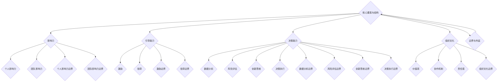
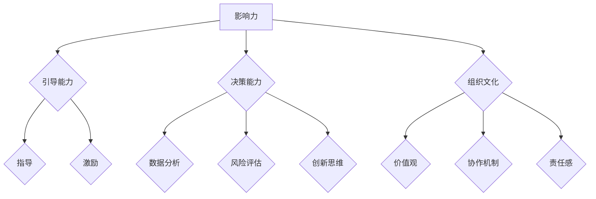
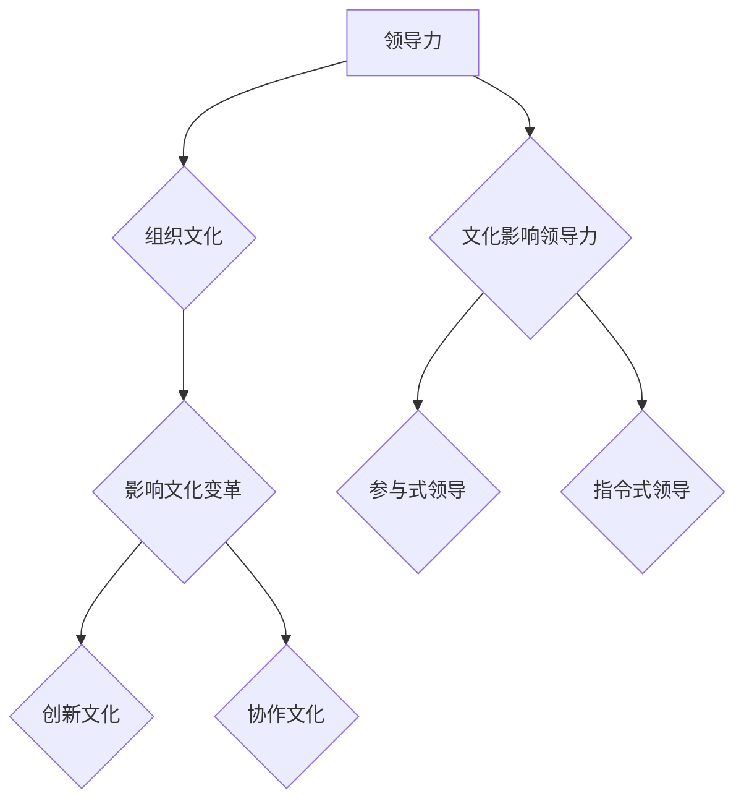
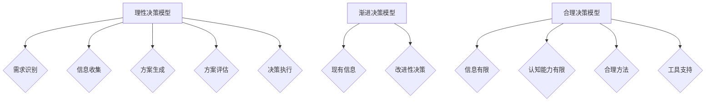
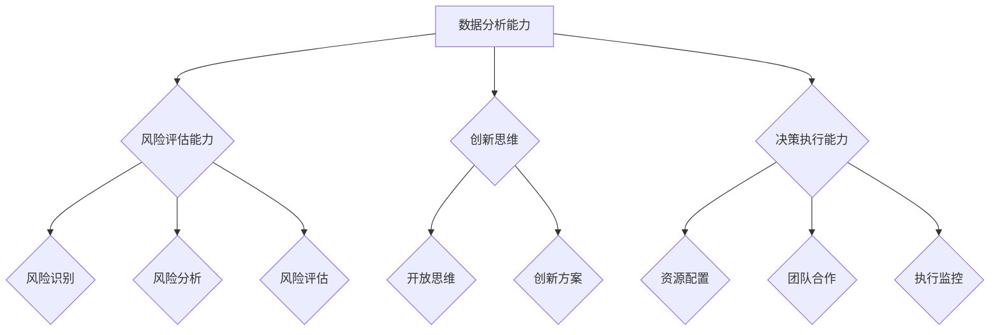
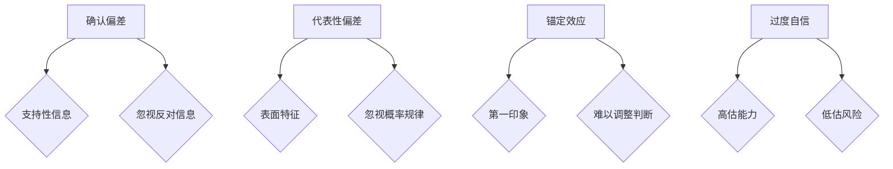
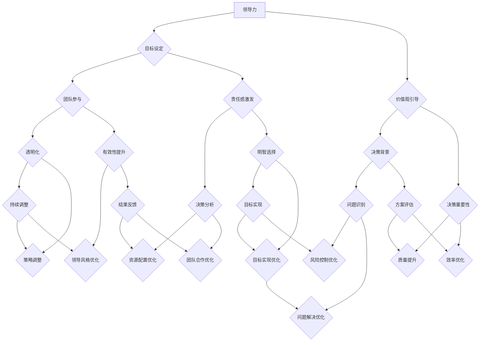
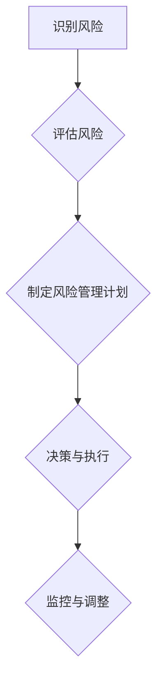
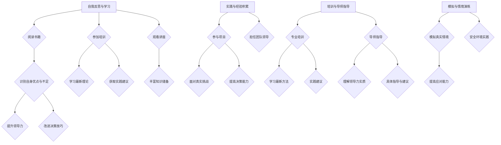
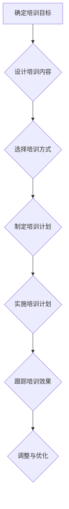

                 

### 第一部分：引言与背景

在现代信息技术飞速发展的时代，领导力和决策能力在企业和组织中的重要性日益凸显。无论是面对复杂的项目管理，还是应对市场的快速变化，领导者都必须具备敏锐的洞察力和精准的决策能力，以便在不确定性中把握方向，引领团队朝着既定目标前进。

#### 1.1 领导力的重要性

领导力是一种影响力，它能够激励和引导他人实现共同的目标。在组织中，领导力不仅关乎个人的能力和素质，更是组织能否持续发展的关键。成功的领导者能够建立高效的团队，激发团队成员的潜力，并在面临挑战时保持冷静和果断。

#### 1.2 决策能力在领导力中的角色

决策能力是领导力的重要组成部分。有效的决策能力可以帮助领导者迅速识别问题、分析问题并找到解决方案。特别是在不确定性较高的情况下，领导者需要基于事实和数据做出明智的决策，以降低风险并最大化收益。

#### 1.3 在不确定性中领导与决策的挑战

现代社会充满了不确定性，技术革新、市场波动、政策变化等因素使得领导者在决策过程中面临诸多挑战。如何在不确定性中保持清晰的方向，如何在复杂的环境中做出正确的决策，这是每一个领导者都需要思考的问题。

#### 1.4 研究目的与内容框架

本书旨在深入探讨领导力和决策能力在不确定性环境中的应用，帮助领导者提升应对不确定性的能力。本书将分为八个部分，从领导力的核心概念、决策能力的框架和方法，到实际应用策略和培养方法，全面剖析领导与决策的核心要素。

**核心概念与联系**

在探讨领导力与决策能力之前，我们需要明确一些核心概念和它们之间的联系。以下是领导力和决策能力的一些基本概念及其属性特征对比表：

| 核心概念       | 概念属性       | 特征对比                   |
|--------------|--------------|-------------------------|
| **领导力**     | 影响力和引导能力 | - 知识与智慧<br>- 情感和激励<br>- 道德和责任 |
| **决策能力**   | 分析和解决问题的能力 | - 数据和信息分析<br>- 风险评估<br>- 创新思维 |
| **不确定性**   | 现实情境的不可预测性 | - 情境变化快<br>- 信息不完整<br>- 影响难以预测 |

图1：领导力、决策能力和不确定性的ER实体关系图

```mermaid
erDiagram
  Leader            ||--|{ DecisionMaker } Decision : 领导者的决策能力
  Uncertainty       ||--|{ DecisionMaker } Impact : 不确定性对决策的影响
  Leader            ||--|{ Uncertainty } React : 领导者对不确定性的应对
```

通过上述的表格和ER实体关系图，我们可以清晰地看到领导力、决策能力和不确定性三者之间的内在联系。领导者的决策能力直接影响其应对不确定性的效果，而不确定性又对决策产生重要影响。了解这些核心概念及其关系，是理解领导力与决策能力在不确定性环境中应用的基础。

### 第2章：问题背景与概念界定

在探讨领导力和决策能力之前，我们需要明确几个关键概念，并了解当前面临的问题背景。这不仅有助于我们更好地理解领导与决策的重要性，也能为后续章节的深入讨论奠定基础。

#### 2.1 问题背景

在现代社会，企业和组织面临的不确定性因素日益增多。这些不确定性可能源于技术变革、市场波动、政策调整等多种因素。例如，随着人工智能、大数据等新兴技术的快速发展，企业需要迅速适应这些变化，以保持竞争力。同时，全球经济环境的复杂性和不确定性也增加了企业经营的难度。在这种背景下，领导者的决策能力和领导力显得尤为重要。

#### 2.2 领导力定义

领导力是一种影响力，它能够激励和引导他人共同实现目标。领导力不仅涉及个人的能力和素质，还包括组织文化、团队协作等多个方面。根据不同的理论，领导力可以有不同的定义。例如，特质理论认为领导力是一种天生的特质；行为理论则认为领导力是可以通过学习和实践培养的能力。在本书中，我们采用综合定义，将领导力视为一种通过影响力、引导能力和决策能力来推动组织目标实现的综合能力。

#### 2.3 决策能力定义

决策能力是指一个人在面对复杂问题时，能够迅速分析、评估各种可能的解决方案，并做出明智选择的能力。决策能力不仅涉及逻辑思维和判断力，还需要具备风险管理、创新思维等多方面的能力。有效的决策能力可以帮助领导者降低风险，提高组织的竞争力。

#### 2.4 不确定性概念及其影响

不确定性是指未来事件的不确定性，它可能表现为信息的不完整性、情境的快速变化或结果的不可预测性。在组织中，不确定性可能来源于外部环境的变化，如市场波动、政策调整，也可能来源于内部因素，如技术变革、组织结构调整。不确定性对决策的影响是显著的，它可能导致决策者面临更大的风险，增加决策的复杂性。

#### 2.5 边界与外延

为了更准确地理解领导力、决策能力和不确定性，我们需要明确这些概念的边界与外延。领导力的边界在于其影响范围，它不仅限于个人，还包括对团队和组织的影响力。决策能力的边界则在于决策的情境和问题类型，它需要针对具体的问题和情境进行有效的分析和判断。不确定性的外延则包括所有可能导致未来事件不确定性的因素。

#### 2.6 概念结构与核心要素组成

理解这些概念的结构和核心要素，对于深入探讨领导力和决策能力在不确定性环境中的应用至关重要。以下是领导力、决策能力和不确定性的核心要素及其组成结构：

- **领导力**：核心要素包括影响力、引导能力、决策能力和组织文化。这些要素共同作用，形成一个完整的领导力体系。
- **决策能力**：核心要素包括数据分析能力、风险评估能力、创新思维和决策执行能力。这些要素共同作用，形成一个有效的决策过程。
- **不确定性**：核心要素包括信息不完整性、情境快速变化和结果不可预测性。这些要素相互作用，形成不确定性的整体特征。

图2：领导力、决策能力和不确定性的核心要素与结构



通过上述的表格和ER实体关系图，我们可以清晰地看到领导力、决策能力和不确定性三者之间的内在联系。领导者的决策能力直接影响其应对不确定性的效果，而不确定性又对决策产生重要影响。理解这些核心概念及其关系，是理解领导力与决策能力在不确定性环境中应用的基础。

### 第3章：领导力核心概念与联系

在深入探讨领导力核心概念及其联系之前，我们需要首先了解几个基础理论和模型。这些理论和模型为我们提供了分析领导力的框架和视角，帮助我们更全面地理解领导力的本质和功能。

#### 3.1 领导力理论综述

领导力理论是研究领导行为和领导效果的理论体系，它为我们理解领导力的多样性和复杂性提供了重要参考。以下是几种主要的领导力理论：

- **特质理论**：特质理论认为，领导力是由一系列天生的特质和性格特征构成的。例如，自信、决断力、责任感等。这种理论侧重于领导者个人品质的研究。
- **行为理论**：行为理论则关注领导者的具体行为和领导方式。不同的领导者会采取不同的行为模式，如指令型、支持型、参与型等。行为理论强调领导力是可以通过学习和模仿培养的。
- **情境理论**：情境理论认为，领导力是情境依赖的，不同的情境需要不同的领导方式。领导者需要根据具体情境灵活调整自己的领导风格，以达到最佳效果。
- **权力基础理论**：权力基础理论从社会交换的角度出发，认为领导力是建立在权力基础上的。领导者通过交换资源和承诺来获得追随者的支持。

#### 3.2 领导力模型与框架

为了更好地理解和应用领导力理论，我们可以采用一些具体的领导力模型和框架。以下是一些常用的领导力模型：

- **费德勒模型**：费德勒模型认为，领导力效果取决于领导风格和情境控制。领导者可以选择参与型或任务型领导风格，并根据情境的不同进行灵活调整。
- **赫赛-布兰查德模型**：赫赛-布兰查德模型将领导风格分为指令型、支持型、参与型等，并分析了不同领导风格在不同情境下的效果。
- **变革型领导理论**：变革型领导理论强调领导者通过激励、启发和激励追随者来实现变革。这种领导方式能够激发追随者的内在动力，推动组织创新和变革。

#### 3.3 领导力核心要素分析

理解领导力的核心要素，有助于我们更深入地认识领导力的本质和功能。以下是领导力的几个核心要素及其重要性：

- **影响力**：领导力首先是影响力，领导者通过影响他人来实现共同目标。影响力可以是基于权威、知识、情感等多方面因素。
- **引导能力**：领导者需要具备引导团队的能力，包括指导、激励和培养团队成员。引导能力是领导力的关键组成部分。
- **决策能力**：领导者在不确定性环境中需要做出明智的决策，决策能力直接影响组织的成败。有效的决策能力需要领导者具备数据分析、风险评估和创新能力。
- **组织文化**：领导力与组织文化密切相关。领导者需要建立和维护一种积极向上的组织文化，这种文化能够激励团队成员，提高组织的凝聚力和创新能力。

图3：领导力核心要素与关系



通过上述的分析，我们可以看到领导力的核心要素及其相互作用。影响力、引导能力、决策能力和组织文化共同构成了领导力的基本框架，这些要素相互支持，共同推动组织的发展和进步。

#### 3.4 领导力与组织文化的关系

领导力与组织文化之间存在着密切的关系。一方面，领导力是塑造和引导组织文化的重要力量；另一方面，组织文化又对领导力产生深远的影响。以下是领导力与组织文化之间的几种重要关系：

- **领导力对组织文化的影响**：领导者通过自身的言行和决策，塑造和引导组织文化。领导者的价值观、行为方式和决策风格直接影响组织的价值观和行为规范。例如，一个注重创新和开放的领导者能够推动组织形成鼓励创新和包容失败的文化。
- **组织文化对领导力的影响**：组织文化对领导者的行为和决策产生重要影响。在一个重视团队协作和共同目标的文化中，领导者更倾向于采取参与式领导风格，鼓励团队成员参与决策和目标设定。而在一个强调权威和等级的文化中，领导者可能更倾向于采取指令式领导风格。
- **领导力与组织文化的互动**：领导力和组织文化之间存在一种动态的互动关系。领导力可以影响组织文化，而组织文化又反过来影响领导力。例如，一个成功的领导者可能会通过推动文化变革来应对组织面临的挑战，而组织文化的变革也可能反过来促进领导力的提升。

图4：领导力与组织文化的互动关系



通过上述分析，我们可以看到领导力与组织文化之间的紧密联系。领导者不仅是组织文化的塑造者，也是组织文化变革的推动者。而组织文化不仅影响领导力的实施方式，也反过来影响领导力的效果。理解这种互动关系，有助于领导者更好地发挥领导力，推动组织的发展。

### 第4章：决策能力核心概念与联系

在探讨决策能力之前，我们需要首先理解几个关键概念和它们之间的联系。这些概念包括决策理论的发展历程、决策模型与框架、决策能力核心要素以及决策过程中常见的认知偏差。通过这些内容的深入分析，我们可以更好地理解决策能力的本质和应用。

#### 4.1 决策理论发展历程

决策理论是研究决策过程、决策方法和决策效果的学术领域。其发展历程可以追溯到20世纪中期，当时学者们开始系统地研究决策行为。以下是决策理论的主要发展历程：

- **早期决策理论**：20世纪50年代，赫伯特·西蒙（Herbert A. Simon）提出了“有限理性决策理论”（Bounded Rationality Theory），该理论认为决策者在信息有限、时间有限和认知能力有限的情况下做出决策。
- **期望效用理论**：20世纪60年代，冯·诺伊曼（John von Neumann）和摩根斯坦（Oskar Morgenstern）提出的期望效用理论（Expected Utility Theory）成为经济学和决策理论的重要基石。该理论认为，决策者会在不同结果和概率的基础上，通过计算期望效用来选择最佳方案。
- **风险决策理论**：20世纪70年代，阿罗（Karl Arrow）和德布鲁（Kenneth Arrow）提出的风险决策理论（Risk Aversion Theory）进一步丰富了决策理论。该理论强调决策者在面对不确定性时的风险偏好。
- **情境决策理论**：20世纪80年代，丹尼尔·卡内曼（Daniel Kahneman）和阿莫斯·特沃斯基（Amos Tversky）提出的情境决策理论（Prospect Theory）挑战了期望效用理论的某些假设，指出人们在面对潜在损失和潜在收益时的行为模式。

#### 4.2 决策模型与框架

为了更好地理解和应用决策理论，我们可以采用一些具体的决策模型和框架。以下是一些常用的决策模型：

- **理性决策模型**：理性决策模型（Rational Decision Making Model）是一个经典的决策框架，它包括需求识别、信息收集、方案生成、方案评估和决策执行五个步骤。该模型假设决策者具有完全的理性和信息，能够通过最大化期望效用做出最优决策。
- **渐进决策模型**：渐进决策模型（Incremental Decision Making Model）认为，决策者无法在短时间内获取所有信息，因此决策过程是逐步进行的。该模型强调在现有信息基础上做出改进性决策。
- **合理决策模型**：合理决策模型（Reasoned Decision Making Model）结合了理性决策模型和渐进决策模型的优点，认为决策者在信息有限和认知能力有限的情况下，通过合理的方法和工具做出合理的决策。

图5：决策模型与框架



通过上述的决策模型和框架，我们可以看到决策过程的系统性和复杂性。不同的决策模型适用于不同的情境和需求，领导者需要根据具体情况进行选择和调整。

#### 4.3 决策能力核心要素分析

决策能力是一个综合能力，它涉及多个方面的要素。以下是决策能力的几个核心要素及其重要性：

- **数据分析能力**：数据分析能力是决策能力的基础。领导者需要能够收集、处理和分析数据，从中提取有价值的信息。有效的数据分析可以帮助领导者更准确地评估问题和方案。
- **风险评估能力**：在决策过程中，领导者需要评估不同方案的风险和潜在收益。风险评估能力包括对风险的识别、分析和评估。通过有效的风险评估，领导者可以更好地理解风险的性质和可能的影响。
- **创新思维**：创新思维是决策能力的核心要素之一。领导者需要具备开放和创新的思维，能够从不同角度和维度思考问题，并提出新颖的解决方案。创新思维有助于克服传统思维模式的限制，推动组织变革和进步。
- **决策执行能力**：决策执行能力是决策能力的重要组成部分。领导者需要确保决策能够得到有效的执行，包括资源的配置、团队的合作和执行过程的监控。有效的决策执行能力可以确保决策目标的实现。

图6：决策能力核心要素与关系



通过上述分析，我们可以看到决策能力的核心要素及其相互作用。这些要素共同构成了决策能力的完整体系，领导者需要在这些方面不断学习和提升，以提高决策的效果和质量。

#### 4.4 决策过程与认知偏差

在决策过程中，认知偏差是领导者需要特别注意的问题。认知偏差是指人们在决策过程中由于认知局限和信息处理方式的不同，导致判断和选择出现偏差。以下是几种常见的认知偏差：

- **确认偏差**（Confirmation Bias）：决策者倾向于关注和记住支持自己观点的信息，而忽视反对自己观点的信息。这种偏差可能导致决策者做出偏见性决策。
- **代表性偏差**（Representativeness Bias）：决策者根据事物的表面特征进行判断，而忽视概率和统计规律。例如，当面对一个高风险项目时，决策者可能会根据以往类似项目的成功经验做出乐观判断。
- **锚定效应**（Anchoring Effect）：决策者受到第一印象或初始信息的影响，难以调整自己的判断。这种偏差可能导致决策者过度依赖初始信息，而忽视其他重要信息。
- **过度自信**（Overconfidence）：决策者高估自己的能力和知识，低估不确定性和风险。过度自信可能导致决策者冒险和冒进，增加决策的风险。

图7：决策过程中的认知偏差



通过识别和克服这些认知偏差，领导者可以更客观、更理性地做出决策。认知偏差是决策过程中普遍存在的现象，领导者需要通过自我反思和不断学习，提高自己的认知能力和决策质量。

### 第5章：领导力与决策能力的综合应用

在了解了领导力与决策能力的基本概念之后，我们需要进一步探讨这些能力在实际应用中的综合作用。通过分析领导力与决策能力的互动机制，我们可以更清楚地看到如何将理论与实践相结合，以应对复杂多变的环境。

#### 5.1 领导力与决策能力互动机制

领导力与决策能力之间的互动机制是确保领导者能够在不确定性环境中有效决策的关键。以下是这些能力之间相互作用的几个关键点：

- **领导力引导决策**：领导力为决策提供了方向和指导。领导者通过设定目标和价值观，引导团队成员理解决策的背景和重要性。这种领导力能够激发团队成员的参与和责任感，使决策过程更加透明和有效。
- **决策能力支持领导**：决策能力是领导力的重要组成部分，它为领导者提供了分析和解决问题的工具。有效的决策能力使领导者能够迅速识别问题、评估解决方案并做出明智选择，从而提高决策的质量和速度。
- **互动反馈循环**：领导力和决策能力之间的互动是一个动态的反馈循环。领导者的决策会影响团队的行为和结果，而团队的反应和结果又反过来影响领导者的决策。这种互动机制有助于领导者不断调整和优化领导风格和决策策略。

图8：领导力与决策能力的互动机制



通过上述的互动机制，我们可以看到领导力与决策能力之间的密切联系。有效的领导力能够激发团队成员的积极性和参与度，提高决策的透明度和有效性；而有效的决策能力则能够为领导者提供科学的分析和工具，帮助其做出更加明智和高效的决策。

#### 5.2 综合案例分析

为了更具体地展示领导力与决策能力的综合应用，我们可以通过一个实际案例进行分析。以下是一个关于科技公司如何在不确定的市场环境中进行战略决策的案例：

**案例背景**：某科技公司在市场竞争激烈的环境下，需要决定是否投入大量资源开发一款具有前瞻性的新产品。这款产品具有很高的市场潜力，但也伴随着巨大的风险。

**领导力应用**：公司的CEO作为领导者，首先明确了公司的愿景和目标，并设定了开发新产品的战略方向。他通过召开团队会议，向全体员工传达了决策的重要性和背景，激发了团队的参与感和责任感。

- **目标设定**：CEO设定了明确的开发目标，包括市场定位、产品功能和时间表。
- **价值观引导**：CEO强调了创新和风险承担的重要性，鼓励团队成员敢于尝试和接受失败。

**决策能力应用**：在明确了目标和价值观之后，CEO利用他的决策能力，进行了以下步骤：

- **问题识别**：CEO组织了一个跨部门的团队，收集了市场数据、竞争对手分析以及技术可行性报告。
- **方案评估**：团队分析了多个方案，包括完全自主研发、部分外包开发以及与合作伙伴联合开发等。
- **风险评估**：CEO对每个方案的潜在风险进行了详细评估，包括技术风险、市场风险和财务风险。
- **决策执行**：CEO综合考虑了各种因素后，做出了最终决策，选择了部分外包开发和与合作伙伴联合开发的方案，以降低风险并最大化收益。

**结果与反馈**：最终，新产品成功上市，并获得了市场的积极反馈。这一成功案例不仅验证了领导力和决策能力的综合应用，也为公司未来的发展提供了宝贵经验。

通过上述案例，我们可以看到领导力与决策能力在实际应用中的具体体现。领导力为决策提供了方向和动力，而决策能力则为领导力提供了科学的分析和工具。两者结合，使领导者在不确定性环境中能够做出更加明智和高效的决策。

#### 5.3 成功领导与决策的关键因素

成功领导与决策的关键因素包括以下几个方面：

- **清晰的目标和愿景**：领导者需要设定明确的目标和愿景，以引导团队的方向。清晰的目标能够帮助团队成员理解决策的重要性，增强团队的凝聚力和动力。
- **有效的沟通和协作**：领导者需要具备良好的沟通和协作能力，确保信息透明，鼓励团队成员参与决策过程。有效的沟通和协作可以减少误解和冲突，提高决策的质量和效率。
- **科学的数据分析**：决策能力依赖于数据分析，领导者需要能够收集、处理和分析数据，从中提取有价值的信息。科学的数据分析可以帮助领导者做出更准确和合理的决策。
- **创新思维和灵活性**：在不确定性环境中，领导者需要具备创新思维和灵活性，能够迅速适应变化和应对挑战。创新思维和灵活性使领导者能够提出新颖的解决方案，灵活调整策略。
- **持续学习和反思**：领导者和团队成员需要不断学习和反思，从成功和失败中汲取经验教训，提高自身的领导力和决策能力。持续学习和反思是领导力与决策能力不断提升的重要途径。

通过这些关键因素的综合应用，领导者可以在不确定性环境中有效应对挑战，做出成功的决策。

### 第6章：不确定性环境中的领导力策略

在不确定性环境中，领导者需要采取一系列策略来应对挑战和不确定性，确保组织的稳定和持续发展。以下是一些关键策略：

#### 6.1 应对不确定性的领导策略

1. **增强适应性**：领导者需要培养组织的适应性，使其能够快速响应外部环境的变化。这包括建立灵活的组织结构、鼓励创新思维和培养学习型文化。
   
2. **加强风险管理**：领导者需要建立全面的风险管理体系，对潜在风险进行识别、评估和应对。这包括定期进行风险评估、制定风险管理计划以及设立应急响应机制。

3. **强化沟通和协作**：在不确定性环境中，领导者需要加强内部沟通和协作，确保信息透明，使团队成员能够及时了解组织的战略和目标。这有助于减少误解和冲突，提高决策的效率和质量。

4. **提高灵活性和敏捷性**：领导者需要提高组织的灵活性和敏捷性，使其能够迅速调整战略和资源分配，以应对环境变化。这包括采用敏捷管理方法、建立跨职能团队和优化流程。

#### 6.2 风险管理与决策

1. **识别风险**：领导者需要首先识别组织面临的各种风险，包括市场风险、技术风险、财务风险等。通过系统的方法和工具，如SWOT分析、情景分析等，可以全面了解潜在风险。

2. **评估风险**：在识别风险之后，领导者需要对这些风险进行评估，包括风险的概率、影响程度和紧迫性。这有助于确定哪些风险需要优先处理。

3. **制定风险管理计划**：根据风险评估的结果，领导者需要制定具体的风险管理计划，包括风险规避、风险减轻、风险接受和风险转移等策略。

4. **决策与执行**：在风险管理计划制定之后，领导者需要做出决策，并确保这些决策得到有效执行。这包括资源配置、团队协作和监控执行过程。

图9：风险管理与决策流程



通过上述的策略和流程，领导者可以有效地管理风险，减少不确定性对组织的影响，从而提高决策的准确性和可靠性。

#### 6.3 建立适应性的组织文化

1. **鼓励创新和试错**：领导者需要鼓励团队成员尝试新的方法和思路，并容忍失败。这种文化有助于激发创新，提高组织的适应能力。

2. **促进学习与分享**：领导者需要创造一个学习和分享的环境，鼓励团队成员通过培训、研讨会和跨部门交流等方式，不断提升自己的知识和技能。

3. **建立反馈机制**：领导者需要建立有效的反馈机制，使团队成员能够及时了解自身的表现和组织的运行状况。这有助于及时调整和优化组织行为。

4. **强化团队协作**：领导者需要推动跨部门、跨职能的团队协作，打破信息孤岛，提高团队的协作效率和创新能力。

通过建立适应性的组织文化，领导者可以增强组织的灵活性和韧性，使其能够在不确定性环境中迅速应对挑战，实现长期稳定发展。

### 第7章：培养领导力与决策能力

#### 7.1 领导力与决策能力培养方法

领导力与决策能力的培养是一个持续的过程，需要通过系统的训练和实践来实现。以下是一些有效的培养方法：

**1. 自我反思与学习**

自我反思是提升领导力和决策能力的重要途径。领导者需要定期对自己的行为、决策和领导效果进行反思，识别自身的优点和不足。通过阅读相关书籍、参加培训课程、观看领导力讲座等方式，领导者可以不断丰富自己的知识和经验。

**2. 实践与经验积累**

实践是检验领导力和决策能力的最佳方式。领导者可以通过参与实际项目、担任团队领导等角色，积累实际经验。在实践中，领导者需要面对真实的问题和挑战，通过实践中的锻炼，不断提高自己的决策能力和领导技巧。

**3. 培训与导师指导**

专业培训和导师指导是提升领导力和决策能力的重要手段。通过参加专业培训，领导者可以学习最新的领导理论和实践方法。导师指导则可以帮助领导者更好地理解领导力的实质，并提供具体的指导和建议。

**4. 模拟与情境演练**

模拟和情境演练是一种有效的训练方法，它可以让领导者在一个安全的环境中模拟真实情境，进行决策和领导实践。通过模拟和演练，领导者可以更好地理解不确定环境下的决策过程，提高应对复杂问题的能力。

图10：领导力与决策能力培养方法



#### 7.2 培训计划与实施方案

为了有效地培养领导力和决策能力，组织可以制定一个系统的培训计划，并确保其顺利实施。以下是培训计划的关键步骤：

**1. 确定培训目标**：首先，组织需要明确培训的目标，包括提高领导者的决策能力、增强团队的协作能力以及提升组织的适应性。

**2. 设计培训内容**：根据培训目标，设计具体的培训内容。这包括领导力理论、决策框架、案例分析、情境演练等。

**3. 选择培训方式**：结合培训内容，选择适合的培训方式。这可以包括内部培训、外部培训、在线课程、研讨会、工作坊等。

**4. 制定培训计划**：制定详细的培训计划，包括培训时间、地点、培训内容、培训讲师、参与人员等。

**5. 实施培训计划**：按照培训计划进行实施，确保每个步骤都按计划进行。培训过程中，需要及时收集反馈，以便进行调整和优化。

**6. 跟踪培训效果**：培训结束后，对培训效果进行评估，包括参与者的满意度、知识掌握情况、实际应用能力等。根据评估结果，对培训计划进行调整和改进。

图11：培训计划与实施方案流程



通过上述步骤，组织可以有效地实施领导力和决策能力培训计划，帮助领导者提升自身能力，推动组织的持续发展。

#### 7.3 反思与实践：个人领导力与决策能力提升

**1. 反思与总结**

个人领导力与决策能力的提升不仅需要理论学习和实践锻炼，更需要不断地反思和总结。领导者可以通过以下方式进行反思和总结：

- **定期回顾**：定期回顾自己的领导行为和决策过程，分析成功和失败的原因，从中吸取教训。
- **倾听反馈**：倾听团队成员和下属的反馈，了解他们对领导行为的看法和建议，识别自身的不足。
- **记录心得**：记录领导过程中的心得体会，包括遇到的挑战、采取的策略以及最终的成果。

**2. 实践与应用**

理论学习和反思只是提升领导力和决策能力的起点，真正的提升需要通过实践和应用来实现。以下是一些具体的实践方法：

- **实际项目领导**：参与实际项目，担任项目负责人或关键角色，通过实践锻炼领导力和决策能力。
- **情景模拟**：通过情景模拟和案例分析，模拟真实情境中的决策过程，提高应对不确定性的能力。
- **跨部门协作**：参与跨部门协作项目，与其他部门的团队成员共同工作，提高团队合作和决策效率。

**3. 持续学习与提升**

领导力和决策能力的提升是一个持续的过程，需要不断地学习和提升。以下是一些持续学习和提升的方法：

- **专业培训**：参加专业培训和研讨会，学习最新的领导力和决策理论和方法。
- **读书交流**：阅读相关的书籍和文章，参加读书俱乐部或读书会，与他人交流心得和体会。
- **网络课程**：利用网络平台，参加在线课程和讲座，获取最新的知识和信息。

通过反思、实践和持续学习，领导者可以不断提升自己的领导力和决策能力，更好地应对不确定性环境中的挑战。

### 第8章：最佳实践与启示

在领导力和决策能力的培养过程中，许多企业和组织已经积累了许多宝贵的经验和方法。以下是一些行业领导力与决策能力的最佳实践，以及通过案例分析得出的成功与失败的经验教训。

#### 8.1 行业领导力与决策能力的最佳实践

1. **谷歌公司**：谷歌以其独特的领导文化和创新决策著称。其领导力最佳实践包括：
   - **扁平化管理**：谷歌采用扁平化的组织结构，鼓励员工自由表达意见，促进创新和团队合作。
   - **OKR目标管理**：谷歌采用OKR（Objectives and Key Results）目标管理方法，明确目标和关键结果，提高决策的透明度和执行力。

2. **苹果公司**：苹果公司以其卓越的产品设计和决策能力闻名。其决策最佳实践包括：
   - **专注与创新**：苹果公司专注于核心产品和领域，通过持续创新保持竞争优势。
   - **快速决策**：苹果公司鼓励领导者快速做出决策，减少决策过程中的拖延和复杂性。

#### 8.2 案例分析：成功与失败的经验教训

1. **成功案例：丰田公司**

**背景**：丰田公司在20世纪90年代面临激烈的市场竞争和产品质量问题。

**成功经验**：
- **持续改进**：丰田通过实施精益生产方式和持续改进（Kaizen）理念，提高了生产效率和质量。
- **员工参与**：丰田鼓励员工参与决策过程，提出改进建议，提高了员工的积极性和责任感。

2. **失败案例：诺基亚公司**

**背景**：诺基亚曾是手机市场的领导者，但在智能手机时代未能及时转型，导致市场份额大幅下降。

**失败教训**：
- **忽视市场变化**：诺基亚忽视了智能手机市场的快速变化，未能及时调整战略和产品线。
- **缺乏创新**：诺基亚在决策过程中缺乏创新思维，未能及时推出具有竞争力的智能手机产品。

#### 8.3 注意事项与未来展望

1. **持续学习和创新**：领导者需要持续学习和创新，以适应快速变化的环境和市场需求。这包括学习最新的领导力和决策理论，关注行业动态，推动组织内部的知识分享和交流。

2. **灵活应对不确定性**：在不确定性环境中，领导者需要具备灵活应对的能力，能够迅速调整战略和决策，以应对市场变化和内部挑战。

3. **加强团队协作**：领导者需要加强团队协作，建立良好的沟通和协作机制，提高团队的执行力和创新能力。

4. **未来展望**：随着人工智能、大数据等新兴技术的发展，领导者需要更加关注这些技术对决策和领导力的影响，积极探索新的决策方法和领导模式。

通过最佳实践和案例分析，我们可以得出以下启示：

- **灵活应对不确定性**：领导者需要具备灵活应对不确定性环境的能力，快速调整战略和决策。
- **持续学习和创新**：领导者需要不断学习和创新，以适应快速变化的市场和技术环境。
- **加强团队协作**：领导者需要加强团队协作，提高团队的整体执行力和创新能力。

### 拓展阅读

- **《领导力的五项修炼》**：史蒂芬·柯维（Stephen R. Covey）的这本书详细介绍了领导力的五个核心要素，包括品格、关系、思想、组织和行动。
- **《决策与判断》**：丹尼尔·卡内曼（Daniel Kahneman）的这本经典之作深入探讨了人类决策和判断中的认知偏差，为领导者提供了宝贵的启示。
- **《精益创新》**：约翰·舒尔茨（John Shewchuk）的这本书介绍了精益创新的方法和实践，帮助领导者提高创新能力和决策质量。

通过这些拓展阅读，读者可以更深入地理解领导力和决策能力的本质和应用，进一步提升自身的领导力和决策能力。

### 附录

#### A. 主要术语表

- **领导力**：影响力、引导能力、决策能力和组织文化的综合体现，用于推动组织实现共同目标的能力。
- **决策能力**：分析问题、评估方案和做出决策的能力，包括数据分析能力、风险评估能力、创新思维和决策执行能力。
- **不确定性**：未来事件的不确定性，可能表现为信息不完整性、情境快速变化和结果不可预测性。
- **情境理论**：认为领导力是情境依赖的，不同的情境需要不同的领导方式。
- **渐进决策模型**：认为决策过程是逐步进行的，决策者在信息有限和认知能力有限的情况下做出改进性决策。

#### B. 参考文献

- 西蒙，赫伯特·A.（Herbert A. Simon）. 《有限理性决策理论》（Bounded Rationality Theory）.
- 冯·诺伊曼，约翰·冯·诺伊曼（John von Neumann）和摩根斯坦，奥斯卡·摩根斯坦（Oskar Morgenstern）. 《期望效用理论》（Expected Utility Theory）.
- 卡内曼，丹尼尔·卡内曼（Daniel Kahneman）和阿莫斯·特沃斯基（Amos Tversky）. 《情境决策理论》（Prospect Theory）.
- 柯维，史蒂芬·R.（Stephen R. Covey）. 《领导力的五项修炼》.
- 舒尔茨，约翰·舒尔茨（John Shewchuk）. 《精益创新》.

以上术语表和参考文献为读者提供了更深入的背景知识和理论支持，有助于更好地理解和应用本书中的内容。通过阅读这些资料，读者可以进一步深化对领导力、决策能力和不确定性环境下的领导决策的理解。

### 总结与展望

在本书中，我们深入探讨了领导力与决策能力在不确定性环境中的应用。首先，我们明确了领导力和决策能力的重要性，并介绍了相关的基本概念和理论框架。接着，我们分析了领导力和决策能力在实际应用中的互动机制，并通过案例展示了这些能力如何综合应用于复杂环境中。在不确定性环境中，领导者需要采取适应性策略，加强风险管理和建立适应性的组织文化。此外，我们还介绍了领导力和决策能力的培养方法，以及通过反思和实践不断提升个人能力的重要性。

未来，领导力和决策能力的发展将受到人工智能、大数据和区块链等新兴技术的影响。领导者需要不断学习和适应这些技术带来的变革，以提高决策的准确性和效率。同时，全球化趋势和市场复杂性也将对领导力和决策能力提出更高的要求。领导者需要具备全球视野和跨文化沟通能力，以应对跨国经营中的挑战。

在结束本书之前，我们要感谢读者的耐心阅读和关注。希望本书能够为读者提供有价值的见解和实践指导，帮助其在领导力和决策能力方面取得长足进步。同时，我们鼓励读者继续深入研究和探索这个领域，不断提升自身的领导力和决策能力，以应对不断变化的环境和挑战。

### 作者信息

**作者：AI天才研究院/AI Genius Institute & 禅与计算机程序设计艺术 /Zen And The Art of Computer Programming**

