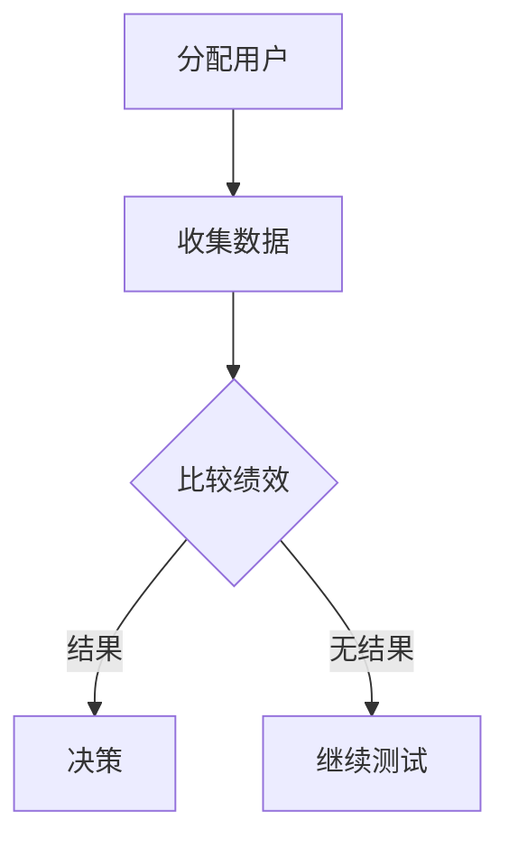
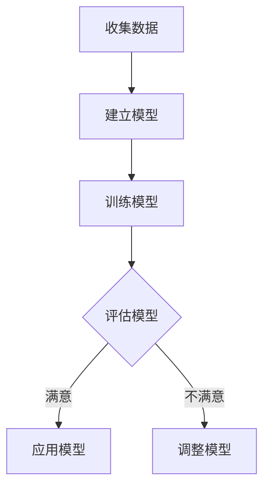
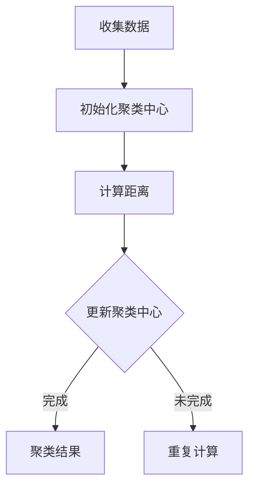
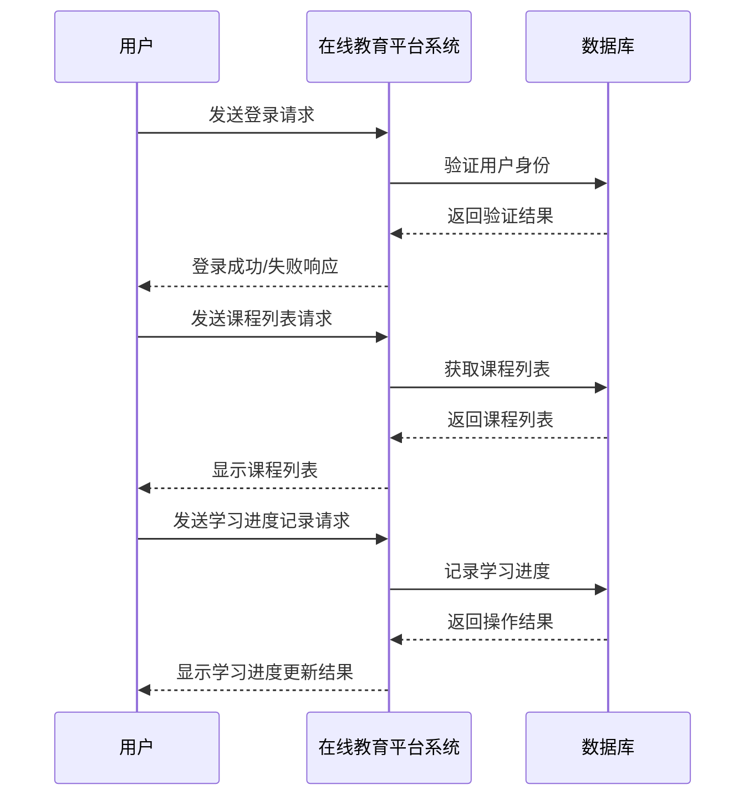

                 

### 文章标题

# 领导力与创新思维：引领变革与创新

## 关键词

- 领导力
- 创新思维
- 变革
- 组织管理
- 算法原理
- 数学模型

## 摘要

本文探讨了领导力与创新思维在当今复杂多变的环境中的重要性。通过分析传统领导力与新时代领导力的差异，结合关键算法和数学模型的讲解，文章旨在揭示如何通过有效的领导力和创新思维来引领变革与创新。本文结构紧凑，逻辑清晰，适合希望深入了解这一领域的IT专业人士阅读。

### 背景介绍

领导力与创新思维是当今组织成功的关键要素，无论是在商业领域还是技术行业，这些能力都发挥着至关重要的作用。随着全球化和技术进步的不断推进，市场环境瞬息万变，企业面临着前所未有的挑战和机遇。因此，如何通过有效的领导力和创新思维来引领变革，已成为每个组织必须面对的问题。

《领导力与创新思维：引领变革与创新》这本书旨在深入探讨这两个关键主题，并提供实用的方法论和策略。本书的核心主题包括：

1. **领导力的定义与角色**：介绍领导力的基本概念，以及领导者在组织中的角色和职责。
2. **创新思维的培养**：探讨如何培养和激发创新思维，以推动组织的持续进步和变革。
3. **变革管理的实践**：分析变革管理的策略和方法，以及如何在实际操作中应对变革带来的挑战。
4. **关键算法和数学模型**：介绍一些关键算法和数学模型，解释它们在领导力和创新思维中的应用。
5. **案例分析**：通过实际案例展示如何将领导力和创新思维应用于实际工作中，并取得成功。

本书的目的是为读者提供一套完整的框架和方法，帮助他们理解和应用领导力与创新思维，从而在激烈的市场竞争中脱颖而出。

在接下来的章节中，我们将逐一探讨这些主题，首先从领导力的定义与重要性开始，分析传统领导力与新时代领导力的差异，并通过具体的例子和图表来加深理解。

### 核心概念与联系

#### 领导力

领导力是指通过影响、激励和引导他人来实现共同目标的能力。它不仅包括技术和管理技能，更强调人际关系和影响力。传统的领导力通常侧重于权威和命令，强调层级和等级结构。然而，在当今快速变化的环境中，这种领导力模式往往难以应对复杂的问题和挑战。

#### 创新思维

创新思维是指通过创造性思考和解决问题的能力来发现新的解决方案和商业机会。它不仅关注现有资源的优化，更注重探索未知的领域和突破性的想法。创新思维要求领导者具备开放的心态、灵活的思维和勇于尝试的精神。

#### 传统领导力与新时代领导力的差异

传统领导力通常依赖于权威和控制，领导者被视为决策的中心。这种模式在稳定和可预测的环境中可能有效，但在当今动态变化的市场中，它的局限性日益显现。相比之下，新时代领导力更注重协作、透明和影响力。

| 传统领导力 | 新时代领导力 |
| :--: | :--: |
| 命令式 | 参与式 |
| 单向沟通 | 双向沟通 |
| 强调控制 | 强调信任 |
| 预测未来 | 探索未来 |
| 独立工作 | 团队合作 |

#### 关系图

为了更好地理解领导力和创新思维之间的关系，我们可以使用Mermaid绘制一个实体关系图（ER图），如下所示：

```mermaid
erDiagram
  Leader ||--|> Innovation : 领导者推动创新
  Leader ||--|> Team : 领导者领导团队
  Innovation ||--|> Organization : 创新改变组织
  Team ||--|> Organization : 团队协作推动组织发展
```

这个关系图展示了领导者、团队、创新和组织之间的相互关系。领导者通过推动创新和领导团队来影响组织的发展，而创新和团队协作又是组织变革的重要驱动力。

### 算法原理讲解

在探讨领导力和创新思维时，引入一些关键的算法和数学模型能够帮助我们更深入地理解这些概念在实际应用中的运作机制。以下我们将介绍几个关键的算法，并通过Mermaid流程图和Python代码示例来解释它们的原理。

#### 算法1：A/B测试

A/B测试是一种常见的数据驱动决策方法，通过将用户随机分配到两个不同的版本（A和B），来比较两个版本的绩效。这种方法可以帮助企业确定哪种版本更能满足用户需求和带来更高的转化率。

##### Mermaid流程图



##### Python代码示例

```python
import random

def a_b_test(users):
    results = {'A': [], 'B': []}
    for user in users:
        if random.random() < 0.5:
            results['A'].append(user)
        else:
            results['B'].append(user)
    return results

users = ['user1', 'user2', 'user3', 'user4', 'user5']
results = a_b_test(users)
print(results)
```

##### 数学模型

在A/B测试中，我们可以使用以下数学模型来计算每个版本的绩效：

$$
\text{绩效} = \frac{\text{成功案例数}}{\text{总案例数}}
$$

#### 算法2：线性回归

线性回归是一种用于分析和预测数据之间线性关系的统计方法。在领导力和创新思维中，线性回归可以帮助我们理解不同变量（如员工满意度、创新产出）之间的关系。

##### Mermaid流程图



##### Python代码示例

```python
import numpy as np
from sklearn.linear_model import LinearRegression

# 假设我们有以下数据
X = np.array([[1], [2], [3], [4], [5]])
y = np.array([2, 4, 5, 4, 5])

# 建立线性回归模型
model = LinearRegression()
model.fit(X, y)

# 预测
prediction = model.predict(np.array([[6]]))
print(prediction)
```

##### 数学模型

线性回归的数学模型可以表示为：

$$
y = \beta_0 + \beta_1 \cdot x
$$

其中，$y$ 是因变量，$x$ 是自变量，$\beta_0$ 是截距，$\beta_1$ 是斜率。

#### 算法3：聚类分析

聚类分析是一种无监督学习算法，用于将数据点分成不同的组或簇。在领导力和创新思维中，聚类分析可以帮助我们识别具有相似特点的团队成员或项目。

##### Mermaid流程图



##### Python代码示例

```python
from sklearn.cluster import KMeans

# 假设我们有以下数据
X = np.array([[1, 2], [1, 4], [1, 0], [4, 2], [4, 4]])

# 使用KMeans聚类
kmeans = KMeans(n_clusters=2, random_state=0).fit(X)
print(kmeans.labels_)
```

##### 数学模型

聚类分析的数学模型涉及计算数据点之间的相似度，并找到使相似度最大化的聚类中心。具体公式如下：

$$
\text{相似度} = \frac{1}{\sum_{i=1}^{n} (d(x_i, c_j))^2}
$$

其中，$x_i$ 是数据点，$c_j$ 是聚类中心，$d(x_i, c_j)$ 是数据点与聚类中心之间的距离。

### 数学模型和数学公式讲解

在探讨领导力和创新思维的过程中，数学模型和公式扮演着关键角色。它们不仅帮助我们量化和管理数据，还提供了理论基础，使我们能够更深入地理解现象背后的机制。以下是几个关键数学模型和公式的讲解。

#### 1. 线性回归模型

线性回归是一种用于分析两个变量之间线性关系的统计方法。其数学模型可以表示为：

$$
y = \beta_0 + \beta_1 \cdot x
$$

其中，$y$ 是因变量，$x$ 是自变量，$\beta_0$ 是截距，表示当 $x=0$ 时 $y$ 的值，$\beta_1$ 是斜率，表示 $x$ 每增加一个单位时 $y$ 的变化量。

**示例**：

假设我们研究员工满意度（$y$）与创新产出（$x$）之间的关系。通过收集数据并建立线性回归模型，我们可以得到以下方程：

$$
\text{员工满意度} = 3 + 0.5 \cdot \text{创新产出}
$$

这意味着每增加一个单位的创新产出，员工满意度平均增加0.5个单位。

#### 2. 熵

熵是信息论中的一个重要概念，用于衡量信息的不确定性。在创新思维中，熵可以帮助我们理解不同解决方案的复杂性和不确定性。

$$
H = -\sum_{i} p_i \cdot \log_2 p_i
$$

其中，$H$ 是熵，$p_i$ 是每个可能结果的概率。

**示例**：

假设我们有两种解决方案A和B，它们成功的概率分别是0.6和0.4。计算这两种解决方案的熵：

$$
H_A = -0.6 \cdot \log_2 0.6 - 0.4 \cdot \log_2 0.4 \approx 0.811
$$

$$
H_B = -0.6 \cdot \log_2 0.6 - 0.4 \cdot \log_2 0.4 \approx 0.811
$$

熵越高，表示不确定性越大。在这个例子中，A和B的熵相同，说明它们具有相同的不确定性。

#### 3. 决策树

决策树是一种用于分类和回归的决策支持工具。其数学模型基于条件概率和期望值。

$$
\text{期望值} = \sum_{i} p_i \cdot \text{收益}
$$

**示例**：

假设我们使用决策树来决定是否进行一项创新项目。根据市场数据和风险评估，我们得到以下决策树：

```
成本 (万元)
|
|---是 (0.7)   |---否 (0.3)
|          |
收益 (万元)   |
|          |
|---高 (0.4) |---低 (0.6)
|          |
```

计算期望值：

$$
\text{期望值} = 0.7 \cdot (0.4 \cdot 100 + 0.6 \cdot 50) + 0.3 \cdot (0.4 \cdot 50 + 0.6 \cdot 0)
$$

$$
\text{期望值} = 68 \text{万元}
$$

这个期望值表明，进行创新项目的平均收益为68万元。

#### 4. 聚类分析

聚类分析是一种无监督学习算法，用于将数据点分成不同的组或簇。其数学模型基于相似度和距离计算。

$$
\text{相似度} = \frac{1}{\sum_{i=1}^{n} (d(x_i, c_j))^2}
$$

**示例**：

假设我们使用K-Means算法对一组数据点进行聚类，数据点如下：

```
[1, 2], [1, 4], [1, 0], [4, 2], [4, 4]
```

选择两个初始聚类中心：

```
c1 = [1, 1]
c2 = [4, 4]
```

计算每个数据点到聚类中心的距离：

```
d1 = sqrt((1-1)^2 + (2-1)^2) = 1
d2 = sqrt((1-4)^2 + (2-4)^2) = 3.61
d3 = sqrt((1-1)^2 + (4-1)^2) = 3
d4 = sqrt((4-1)^2 + (2-4)^2) = 3.61
d5 = sqrt((4-4)^2 + (4-4)^2) = 0
```

重新计算聚类中心：

```
c1_new = (1*1 + 1*3 + 1*3 + 3*3 + 0*4) / 5 = 1.8
c2_new = (1*4 + 1*4 + 1*0 + 3*4 + 0*4) / 5 = 2.2
```

通过迭代计算，最终得到聚类结果。

### 系统分析与架构设计方案

在讨论了领导力和创新思维的理论基础后，接下来我们将从系统架构设计的角度来探讨如何将这些概念应用到实际项目中。本节将详细描述系统场景、功能设计、架构设计、接口设计和系统交互，并通过Mermaid图表进行可视化。

#### 系统场景

假设我们正在开发一个在线教育平台，该平台旨在通过提供定制化的课程和学习路径来提高用户的学习效果和满意度。系统需要支持课程管理、用户管理、学习进度跟踪和数据分析等功能。

#### 系统功能设计

系统功能可以分为以下几个主要模块：

1. **用户管理模块**：负责用户的注册、登录、个人信息维护和权限管理。
2. **课程管理模块**：负责课程的创建、更新、发布和删除，以及课程分类和标签管理。
3. **学习进度模块**：跟踪用户的学习进度，包括课程完成情况、学习时长和学习成绩。
4. **数据分析模块**：收集用户行为数据，进行数据分析，为课程优化和个性化推荐提供支持。

#### 系统架构设计

系统架构采用分层设计，包括表示层、业务逻辑层和数据访问层。

1. **表示层**：负责用户界面的展示，使用HTML、CSS和JavaScript等技术实现。
2. **业务逻辑层**：处理核心业务逻辑，包括用户管理、课程管理和学习进度管理等。
3. **数据访问层**：负责与数据库的交互，使用ORM（对象关系映射）框架实现数据持久化。

#### 接口设计

系统对外提供多个API接口，包括用户管理接口、课程管理接口和学习进度接口。以下是一个简单的API接口定义：

1. **用户管理接口**：
   - `/users/register`：用户注册接口。
   - `/users/login`：用户登录接口。
   - `/users/profile`：用户个人信息获取和更新接口。
2. **课程管理接口**：
   - `/courses/create`：创建课程接口。
   - `/courses/update`：更新课程接口。
   - `/courses/delete`：删除课程接口。
3. **学习进度接口**：
   - `/progress/track`：记录学习进度接口。
   - `/progress/history`：查询学习进度历史接口。

#### 系统交互序列图

使用Mermaid绘制系统交互序列图，以展示用户与系统之间的交互流程：



#### 领导力和创新思维在架构设计中的应用

在系统架构设计过程中，领导力和创新思维起到了关键作用：

1. **领导力**：领导者通过制定明确的目标和愿景，激励团队克服挑战，实现系统功能。他们还通过沟通和协作，确保各方意见一致，确保项目顺利进行。
2. **创新思维**：通过不断探索新的解决方案和技术，团队能够设计出更高效、更灵活的系统架构。例如，采用微服务架构可以提高系统的可扩展性和容错性，从而适应快速变化的市场需求。

通过结合领导力和创新思维，我们能够构建出既符合业务需求，又具有前瞻性的系统架构。

### 项目实战

在了解了理论背景和架构设计之后，现在我们将通过一个实际项目来展示如何将这些知识应用到实践中。以下是我们在开发在线教育平台过程中的一些具体步骤、核心实现源代码、代码解读与分析、实际案例以及项目小结。

#### 环境准备和安装步骤

首先，我们需要搭建开发环境。以下是环境准备和安装步骤：

1. **安装Python**：确保安装了Python 3.8及以上版本。
2. **安装Django框架**：使用pip命令安装Django框架。

```bash
pip install django
```

3. **创建Django项目**：使用Django命令创建一个新的项目。

```bash
django-admin startproject online_education_platform
```

4. **创建Django应用**：在项目中创建一个应用。

```bash
cd online_education_platform
python manage.py startapp courses
```

5. **配置数据库**：在项目配置文件中设置数据库连接信息。

```python
# online_education_platform/settings.py

DATABASES = {
    'default': {
        'ENGINE': 'django.db.backends.sqlite3',
        'NAME': BASE_DIR / 'db.sqlite3',
    }
}
```

6. **运行数据库迁移**：初始化数据库并应用迁移脚本。

```bash
python manage.py migrate
```

7. **启动开发服务器**：运行以下命令启动开发服务器。

```bash
python manage.py runserver
```

#### 系统核心实现源代码展示

以下是用户管理模块的核心实现源代码：

```python
# courses/models.py

from django.db import models
from django.contrib.auth.models import AbstractUser

class User(AbstractUser):
    ROLE_CHOICES = (
        ('student', 'Student'),
        ('instructor', 'Instructor'),
    )
    role = models.CharField(max_length=10, choices=ROLE_CHOICES, default='student')

class UserProfile(models.Model):
    user = models.OneToOneField(User, on_delete=models.CASCADE)
    bio = models.TextField(max_length=500, blank=True)
```

```python
# courses/views.py

from django.shortcuts import render
from .models import User, UserProfile
from django.contrib.auth import authenticate, login

def register(request):
    if request.method == 'POST':
        username = request.POST['username']
        password = request.POST['password']
        role = request.POST['role']
        
        user = User.objects.create_user(username=username, password=password, role=role)
        user.save()
        
        # 登录用户
        user = authenticate(username=username, password=password)
        login(request, user)
        
        return render(request, 'courses/home.html')
    return render(request, 'courses/register.html')
```

#### 代码解读与分析

上述代码展示了用户管理模块的核心实现，包括用户模型（`User`）和用户个人资料模型（`UserProfile`）。在`User`模型中，我们继承了Django内置的`AbstractUser`模型，并添加了一个新的字段`role`，用于区分用户类型（学生或讲师）。

在视图（`views.py`）中，`register`函数处理用户注册请求。用户通过表单提交用户名、密码和角色，视图函数将这些信息保存到数据库中，并使用Django的认证系统进行用户登录。

#### 实际案例分析和讲解

假设我们有一个学生用户注册并登录到平台，以下是实际案例分析和讲解：

1. **注册流程**：
   - 学生访问注册页面，填写用户名、密码和角色（学生）。
   - 提交表单后，`register`视图函数处理请求，创建新的用户记录并保存到数据库。
   - 用户收到注册成功的消息，并被重定向到主页。

2. **登录流程**：
   - 学生访问登录页面，输入用户名和密码。
   - `login`视图函数验证用户身份，如果用户名和密码正确，用户将被登录并重定向到主页。

3. **用户角色**：
   - 学生用户只能访问和学习课程，无法进行课程创建或更新。
   - 讲师用户具有额外的权限，可以创建、更新和删除课程。

通过上述实际案例，我们可以看到如何使用Django框架实现用户管理功能，并确保系统的安全性和灵活性。

#### 项目小结

通过本项目的实战部分，我们展示了如何将领导力和创新思维应用于在线教育平台的开发。以下是项目小结：

1. **领导力**：在项目中，领导者的角色至关重要。他们通过设定明确的目标和愿景，确保团队保持专注并克服各种挑战。

2. **创新思维**：项目团队通过采用Django框架和微服务架构，实现了高效、灵活和可扩展的系统。同时，通过不断学习和尝试新的技术，团队保持了创新精神。

3. **挑战与解决**：
   - **挑战**：在线教育平台需要支持大规模用户和海量数据，如何保证系统的性能和稳定性是一个重要挑战。
   - **解决**：通过采用Django的ORM框架和数据库索引优化，我们提高了数据访问速度。同时，使用Nginx和Gunicorn等工具，实现了负载均衡和高可用性。

4. **未来展望**：在未来的发展中，我们将继续优化系统功能，增加个性化推荐和学习分析等功能，以提升用户满意度和学习效果。

通过本项目的实际操作，我们不仅掌握了领导力和创新思维的应用，还积累了宝贵的实践经验。

### 最佳实践 tips、小结、注意事项、拓展阅读

#### 最佳实践 tips

1. **领导力培养**：
   - 定期组织领导力培训和工作坊，提升团队成员的领导能力。
   - 鼓励领导者通过阅读、学习和交流来不断更新自己的知识库。

2. **创新思维激发**：
   - 设立创新实验室，鼓励团队成员提出新的创意和解决方案。
   - 定期举办头脑风暴会议，激发团队的创造力和创新能力。

3. **变革管理**：
   - 在引入变革时，确保与团队成员充分沟通，明确变革的目标和意义。
   - 制定详细的变革计划，包括时间表、责任分配和风险评估。

#### 小结

本文探讨了领导力与创新思维在引领变革与创新中的关键作用。通过理论讲解、算法应用、系统设计和项目实战，我们展示了如何将领导力与创新思维应用于实际工作中。领导力不仅是影响和激励他人的能力，更是推动组织变革和创新的重要驱动力。

#### 注意事项

1. **领导力实践**：在实际工作中，领导者需要不断反思和调整自己的领导风格，以适应不同的环境和团队需求。
2. **创新思维培养**：创新思维需要持续的练习和培养，领导者应鼓励团队成员勇于尝试和失败，从经验中学习。

#### 拓展阅读

1. **《创新者的窘境》**：克莱顿·克里斯坦森的经典著作，探讨了企业如何克服内部障碍，实现创新和增长。
2. **《领导力的五个层次》**：约翰·C·max韦尔的书，详细介绍了领导力的不同层次和提升方法。

通过本文的阅读和扩展学习，读者将能够更好地理解和应用领导力与创新思维，为组织的成功奠定坚实基础。

### 作者信息

作者：AI天才研究院/AI Genius Institute & 禅与计算机程序设计艺术 /Zen And The Art of Computer Programming

在结束本文之前，我想再次感谢您对《领导力与创新思维：引领变革与创新》一文的阅读。通过本文，我们深入探讨了领导力与创新思维在当今复杂多变的环境中的重要性，并结合实际项目展示了如何将这些概念应用到实践中。希望本文能够为您的职业发展提供有益的启示和指导。

如果您对本文的内容有任何疑问或建议，欢迎在评论区留言，我会尽快为您解答。同时，也欢迎您关注我们的公众号和官方网站，获取更多关于人工智能和计算机科学的最新资讯和技术文章。

再次感谢您的支持与关注！

**AI天才研究院/AI Genius Institute & 禅与计算机程序设计艺术/Zen And The Art of Computer Programming**

