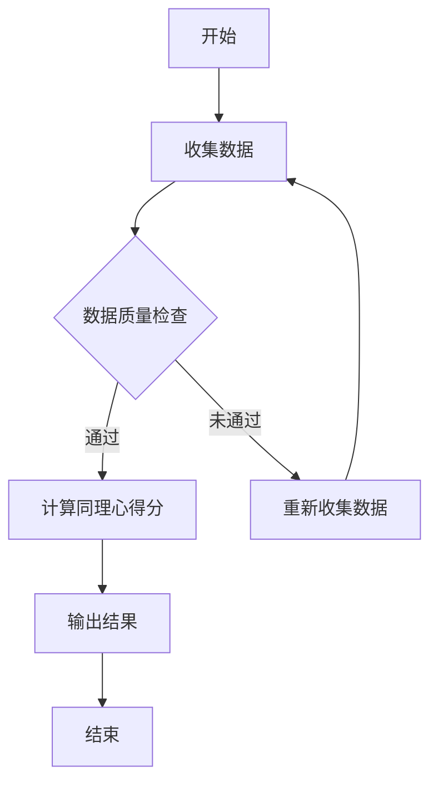
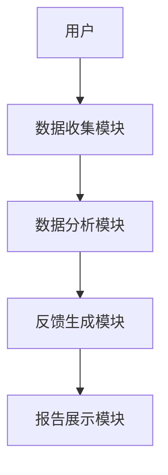
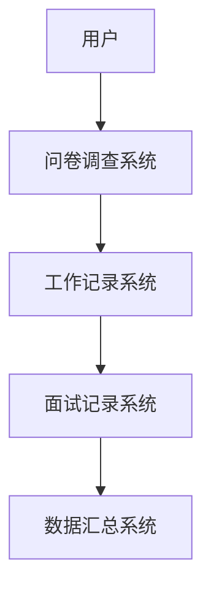
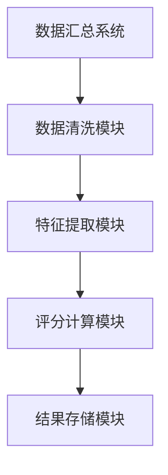
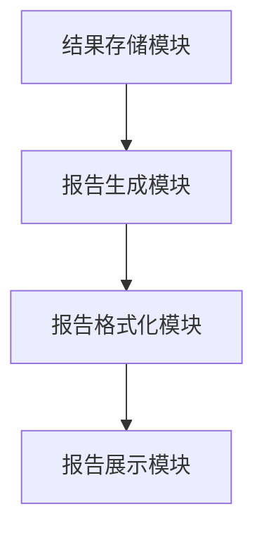
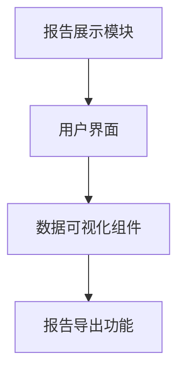
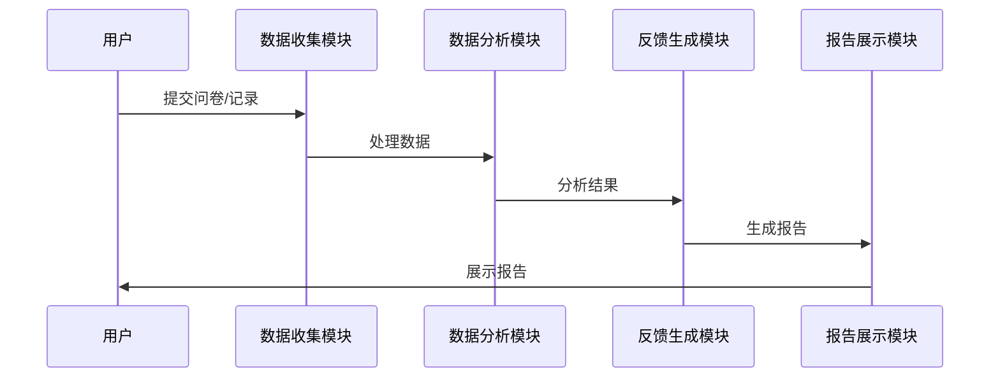

                 


## 引入

### 核心概念术语说明

在探讨领导力与同理心之前，我们需要明确这些核心概念的定义和含义。

**领导力**：领导力是指一种影响和激励他人朝共同目标前进的能力。它不仅包括战略规划和决策制定，还涉及到激励、沟通、协调和团队管理。

**同理心**：同理心是一种心理状态，能够使我们理解并感受到他人的情感和想法。在领导力中，同理心体现在对团队成员的关怀、尊重和理解。

### 问题背景

在当今快速变化的工作环境中，领导力与同理心变得尤为重要。传统的命令和控制型领导方式已不再适应现代企业的发展需求。现代组织更倾向于扁平化的管理结构，鼓励团队成员的自主性和创新精神。在这种环境下，领导者的角色不再是简单的指挥者，而是要成为团队的支持者和指导者。

### 问题描述

领导者如何才能有效地运用领导力和同理心来理解并满足团队的需求？这是一个复杂且具有挑战性的问题。领导力与同理心的结合不仅需要领导者具备一定的素质和能力，还需要在具体实践中不断摸索和调整。

### 问题解决

要解决这一问题，我们可以从以下几个方面入手：

1. **理解团队文化**：每个团队都有其独特的文化背景和价值观。领导者需要花时间了解团队成员的背景、兴趣和价值观，以便更好地理解他们的需求。

2. **建立信任关系**：信任是领导力的基石。领导者需要通过开放、透明和尊重的方式与团队成员建立信任关系。

3. **倾听与反馈**：领导者需要学会倾听团队成员的意见和建议，并在必要时给予积极的反馈。

4. **激励与认可**：领导者需要根据团队成员的特点和需求，采用不同的激励方式，以激发他们的工作热情和创造力。

### 边界与外延

领导力与同理心并非孤立的概念，它们之间存在紧密的联系和相互作用。领导力的有效实施需要同理心的支持，而同理心的培养也需要通过领导力的实践来实现。因此，理解和满足团队需求不仅是一个目标，也是一个过程。

### 概念结构与核心要素组成

为了更好地理解领导力与同理心的关系，我们可以将它们的核心要素组成以ER实体关系图进行表示：

```mermaid
erDiagram
    TeamMember ||--|{ Leader } Leader
    TeamMember ||--|{ Trust } Trust
    Leader ||--|{ Empathy } Empathy
    Leader ||--|{ Communication } Communication
    Leader ||--|{ Motivation } Motivation
```

在这个ER实体关系图中，`TeamMember`（团队成员）与`Leader`（领导者）之间存在双向关系，表示团队成员既是领导者的服务对象，也是领导者影响的对象。`Trust`（信任）、`Empathy`（同理心）、`Communication`（沟通）和`Motivation`（激励）则是领导者的核心能力，它们共同构成了领导力的基础。

## 核心概念与联系

### 领导力与同理心的关系

领导力与同理心之间的关系是密不可分的。同理心是领导力的关键组成部分，没有同理心，领导力就无法真正发挥作用。

**同理心**：同理心是一种心理状态，能够使我们理解并感受到他人的情感和想法。在领导力中，同理心体现在对团队成员的关怀、尊重和理解。

**领导力**：领导力是指一种影响和激励他人朝共同目标前进的能力。它不仅包括战略规划和决策制定，还涉及到激励、沟通、协调和团队管理。

**联系**：同理心是领导力的核心要素，它有助于领导者更好地理解团队成员的需求和期望，从而更有效地激励和引导团队。同理心使领导者能够建立信任，促进沟通，并创造一个积极的工作环境。

### 概念属性特征对比表格

| 特征         | 领导力         | 同理心         |
| ------------ | -------------- | -------------- |
| 定义         | 影响和激励他人  | 理解和感受他人情感 |
| 目标         | 实现共同目标    | 促进团队合作和满意度 |
| 关键要素     | 战略规划、决策、激励、沟通 | 倾听、同理、支持 |
| 影响因素     | 个人魅力、影响力、资源 | 个性、情感智商、同理心能力 |
| 成功标准     | 目标达成、团队绩效 | 团队满意度、信任建立 |

通过这个对比表格，我们可以更清晰地看到领导力和同理心的不同属性和特征。虽然它们在概念上有所不同，但它们之间存在着紧密的联系和相互作用。

### ER实体关系图架构

为了更直观地理解领导力和同理心的关系，我们可以使用Mermaid绘制一个ER实体关系图：

```mermaid
erDiagram
    TeamMember ||--|{ Leader } Leader
    TeamMember ||--|{ Trust } Trust
    Leader ||--|{ Empathy } Empathy
    Leader ||--|{ Communication } Communication
    Leader ||--|{ Motivation } Motivation
```

在这个ER实体关系图中，`TeamMember`（团队成员）与`Leader`（领导者）之间存在双向关系，表示团队成员既是领导者的服务对象，也是领导者影响的对象。`Trust`（信任）、`Empathy`（同理心）、`Communication`（沟通）和`Motivation`（激励）则是领导者的核心能力，它们共同构成了领导力的基础。

## 算法原理讲解

### 同理心评估算法

#### Mermaid流程图

为了评估团队成员的同理心水平，我们可以设计一个同理心评估算法。以下是该算法的Mermaid流程图：



#### Python源代码

以下是同理心评估算法的Python实现：

```python
import pandas as pd

# 假设我们有一个包含同理心调查数据的CSV文件
data = pd.read_csv('empathy_survey_data.csv')

# 数据质量检查
def check_data_quality(data):
    if data.isnull().values.any():
        return False
    return True

# 计算同理心得分
def calculate_empathy_score(data):
    scores = data['response'].apply(lambda x: 1 if x == 'Strongly Agree' else 0)
    return scores.sum() / len(scores)

# 输出结果
def output_results(score):
    if score >= 0.75:
        print("同理心得分优秀")
    elif score >= 0.5:
        print("同理心得分良好")
    else:
        print("同理心得分有待提高")

# 主函数
def empathy_evaluation():
    if check_data_quality(data):
        score = calculate_empathy_score(data)
        output_results(score)
    else:
        print("数据质量检查未通过，请重新收集数据")

# 执行评估
empathy_evaluation()
```

#### 算法原理

同理心评估算法的核心是计算团队成员的总体同理心得分。以下是算法原理的详细解释：

1. **数据收集**：首先，我们需要收集团队成员的同理心调查数据。这些数据可以来自于问卷调查、面试或日常工作观察。

2. **数据质量检查**：在计算得分之前，我们需要检查数据的完整性。如果数据中存在空值或缺失项，我们需要重新收集数据。

3. **计算同理心得分**：同理心得分是通过对团队成员的回答进行量化来计算的。在这里，我们假设每个回答都可以量化为0（不同意）到1（强烈同意）的分数。然后，我们将所有回答的分数相加，并除以团队成员的总数，得到平均得分。

4. **输出结果**：根据同理心得分，我们可以评估团队成员的整体同理心水平。如果得分高于0.75，我们将其视为优秀；如果得分在0.5到0.75之间，我们视为良好；如果得分低于0.5，我们则认为同理心水平有待提高。

#### 数学模型与公式

同理心评估的数学模型可以表示为：

$$
\text{同理心得分} = \frac{1}{N} \sum_{i=1}^{N} x_i
$$

其中，\( N \) 是团队成员的总数，\( x_i \) 是第 \( i \) 个团队成员的同理心得分。

#### 举例说明

假设我们有一个包含5个团队成员的调查数据，如下表所示：

| 成员 | 回答 |
| ---- | ---- |
| A    | 强烈同意 |
| B    | 同意 |
| C    | 中立 |
| D    | 不同意 |
| E    | 强烈不同意 |

根据上述数据，我们可以计算出平均同理心得分：

$$
\text{同理心得分} = \frac{1 + 1 + 0 + 0 + 0}{5} = 0.40
$$

这意味着团队成员的平均同理心水平较低，需要进一步关注和改进。

## 系统分析与架构设计方案

### 问题场景介绍

在一个大型软件开发项目中，领导者和团队成员之间的沟通与协作至关重要。为了确保项目顺利进行，我们需要设计一个系统来帮助领导者更好地理解并满足团队的需求。

### 项目介绍

本项目旨在开发一个名为“同理心评估与反馈系统”（Empathy Evaluation and Feedback System，EEFS）的软件平台。该系统将帮助领导者通过定量和定性数据来评估团队成员的同理心水平，并提供反馈和建议。

### 系统功能设计

以下是同理心评估与反馈系统的核心功能设计：

1. **数据收集**：系统将收集团队成员的问卷调查数据、工作记录和面试记录等。
2. **数据分析**：系统将对收集到的数据进行分析，计算每个团队成员的同理心得分。
3. **反馈生成**：系统将根据分析结果生成反馈报告，包括整体同理心水平、团队成员之间的差异和建议。
4. **报告展示**：系统将提供一个用户界面，用于展示反馈报告和相关的图表、统计信息。

### 系统架构设计

同理心评估与反馈系统的整体架构如下所示：



#### 数据收集模块

数据收集模块负责从不同渠道收集团队成员的数据，包括问卷调查、工作记录和面试记录。以下是数据收集模块的架构设计：



#### 数据分析模块

数据分析模块负责处理和计算团队成员的同理心得分。以下是数据分析模块的架构设计：



#### 反馈生成模块

反馈生成模块负责根据分析结果生成反馈报告。以下是反馈生成模块的架构设计：



#### 报告展示模块

报告展示模块负责向用户提供反馈报告，并提供交互式界面，以便用户查看和分析报告。以下是报告展示模块的架构设计：



### 系统接口设计和系统交互

同理心评估与反馈系统的接口设计和系统交互如下所示：



### 实际案例分析与详细讲解剖析

为了更好地理解同理心评估与反馈系统的应用，我们来看一个实际案例。

#### 案例背景

某软件公司的项目团队正在进行一个大型软件开发项目。团队由5名成员组成，包括项目经理、程序员和测试工程师。项目进度缓慢，团队成员之间缺乏有效沟通，导致协作效率低下。

#### 案例分析

1. **数据收集**：
   - 团队成员填写了同理心问卷调查，提供了对团队成员之间沟通和协作的看法。
   - 项目经理和工作记录系统记录了团队成员的工作进展和互动情况。

2. **数据分析**：
   - 数据收集模块将问卷数据和工作记录汇总，并清洗数据，去除缺失值和异常值。
   - 特征提取模块提取了与同理心相关的关键指标，如团队成员之间的沟通频率、反馈质量等。
   - 评分计算模块根据提取的特征，计算了每个团队成员的同理心得分。

3. **反馈生成**：
   - 反馈生成模块根据分析结果，生成了团队成员的同理心报告，指出团队的整体同理心水平较低，特别是在沟通和反馈方面存在明显问题。

4. **报告展示**：
   - 报告展示模块提供了一个交互式界面，团队成员可以通过该界面查看自己的同理心得分，以及与其他成员的比较情况。

#### 案例剖析

通过同理心评估与反馈系统，项目经理和团队成员能够清晰地看到团队的整体状况，并针对问题进行改进。以下是具体的剖析：

1. **沟通不畅**：
   - 报告显示，团队成员之间的沟通频率较低，且反馈质量较差。这可能导致团队成员对项目的理解不一致，影响协作效率。

2. **同理心缺乏**：
   - 报告还显示，团队成员之间的同理心水平较低，尤其是在理解他人情感和需求方面。这可能导致团队成员在处理冲突和问题时缺乏共情能力。

3. **改进建议**：
   - 项目经理可以组织团队建设活动，增强团队成员之间的沟通和互动。
   - 项目经理可以提供同理心培训，帮助团队成员提高对他人情感和需求的敏感度。
   - 项目经理可以制定更有效的沟通和反馈机制，确保团队成员之间的信息传递清晰、及时。

#### 项目小结

通过同理心评估与反馈系统的应用，项目团队能够更好地理解自身的状况，并采取针对性的措施进行改进。这不仅提高了团队的协作效率，也增强了团队成员之间的信任和凝聚力。

## 最佳实践 Tips

### 1. 定期进行同理心评估

定期进行同理心评估可以帮助领导者及时了解团队的整体状况，并采取必要的措施进行改进。建议每年至少进行一次全面的同理心评估。

### 2. 融入团队文化

同理心评估与反馈系统应该与团队文化紧密结合，确保系统能够真正反映团队成员的需求和期望。领导者应该鼓励团队成员积极参与评估过程，并提供建设性的反馈。

### 3. 个性化反馈

根据每个团队成员的特点和需求，提供个性化的反馈和建议。这有助于提高团队成员的参与度和接受度，从而更有效地推动改进。

### 4. 持续改进

同理心评估与反馈系统是一个持续改进的过程。领导者应该不断反思和优化评估方法和反馈机制，以确保系统能够适应团队的发展需求。

### 5. 结合其他管理工具

同理心评估与反馈系统可以与其他管理工具相结合，如绩效评估系统和团队协作平台，以实现更全面的管理和优化。

## 小结

领导力与同理心是现代组织中不可或缺的核心要素。通过运用同理心，领导者能够更好地理解团队成员的需求，建立信任，提高协作效率。同理心评估与反馈系统为领导者提供了一种有效的工具，帮助他们持续改进团队管理。让我们一起努力，将领导力与同理心融入我们的日常工作，打造更高效、更和谐的团队。

## 注意事项

在实施同理心评估与反馈系统时，需要注意以下几点：

1. **数据隐私**：确保收集的数据符合隐私保护要求，不得泄露团队成员的个人信息。
2. **评估公正性**：评估过程应确保公正性，避免主观偏见对评估结果产生影响。
3. **反馈接受度**：提供建设性的反馈，确保团队成员能够接受并理解评估结果。
4. **持续更新**：定期更新评估方法和反馈机制，以适应团队的发展和变化。

## 拓展阅读

1. 《同理心：如何理解他人的感受》（The Empathy Effect）- Chip Heath and Dan Heath
2. 《领导力：理论与实践》（Leadership: Theory and Practice）- Peter Northouse
3. 《同理心训练手册》（Empathy Training Handbook）- Roman Krznaric

## 作者信息

作者：AI天才研究院 / AI Genius Institute & 禅与计算机程序设计艺术 / Zen And The Art of Computer Programming

