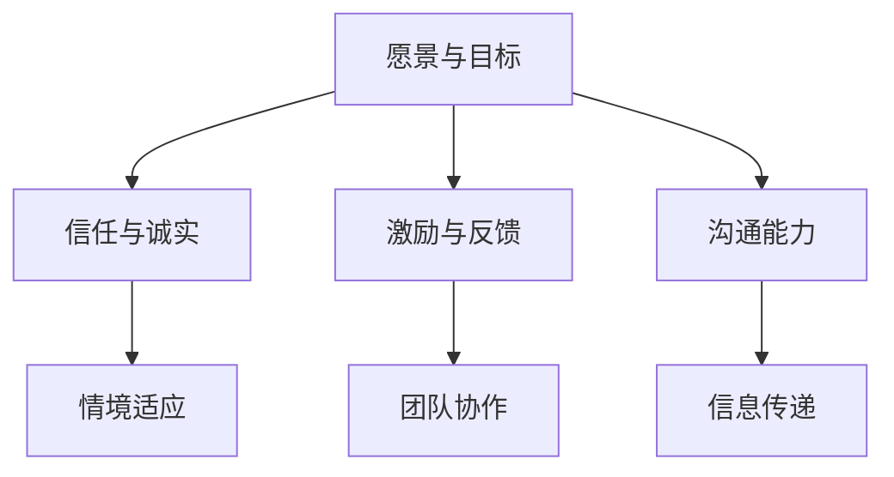
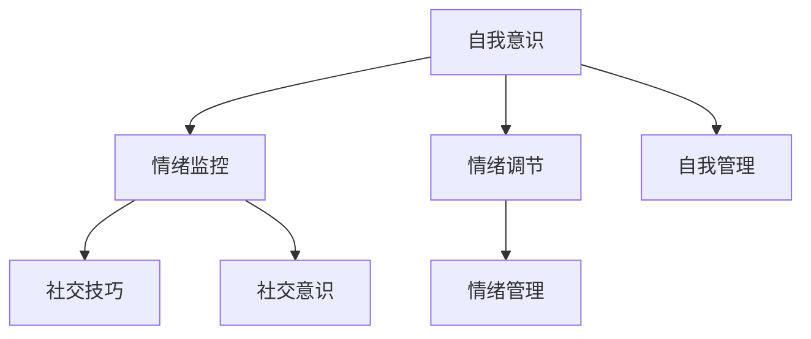
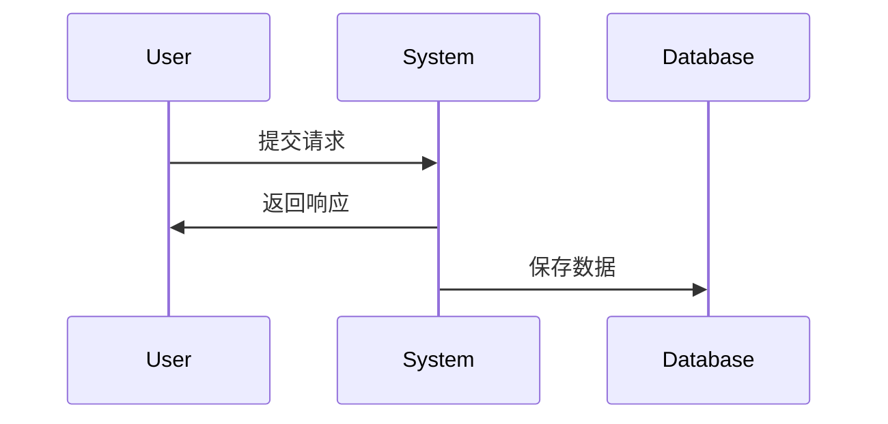
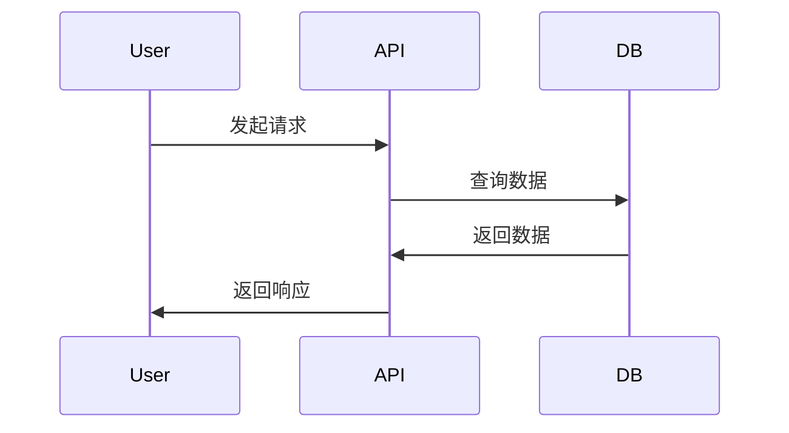

                 


## 领导力与情商：理解并影响他人的能力

### 关键词

- **领导力**
- **情商**
- **人际交往**
- **团队管理**
- **心理学**
- **行为科学**
- **算法模型**

### 摘要

本文深入探讨领导力与情商的关系，通过定义、核心概念、模型及实际应用等方面，系统地分析两者在组织和个人生活中的重要性。文章采用技术语言和图表，结合Python代码和数学公式，旨在帮助读者全面理解并提升领导力和情商，从而更好地影响和激励他人。

## 引言

### 1.1 书籍背景

领导力与情商是现代管理和组织行为研究的核心主题。领导力涉及到如何影响、激励和指导他人，而情商则关注个体识别、理解和管理自己情绪的能力。两者在组织和个人生活中发挥着至关重要的作用，但它们之间的关系和相互作用如何，仍然是一个复杂且富有挑战性的研究领域。

### 1.2 书籍结构

本文结构分为八个章节。第一章节是引言，介绍领导力与情商的基本概念。接下来，第二章节和第三章节分别深入探讨领导力和情商的核心要素及其在组织中的应用。第四章节和第五章节从算法和数学模型的角度，详细解释领导力和情商的原理。第六章节和第七章节通过系统分析与架构设计，介绍如何在实际项目中应用领导力和情商。最后，第八章节总结全文，提供最佳实践和拓展阅读。

## 领导力的基础

### 2.1 领导力的核心要素

领导力不仅仅是权威的体现，它涉及多个核心要素，包括但不限于：

- **愿景与目标**：领导者需要有一个清晰的愿景和目标，以便指导团队的方向。
- **信任与诚实**：建立信任是领导力的基础，诚实则是信任的基石。
- **激励与反馈**：领导者需要能够激励团队成员，并提供及时的反馈。
- **沟通能力**：有效的沟通能够确保信息准确传达，减少误解和冲突。

### 2.2 领导力模型

领导力模型是对领导行为和效果进行系统化描述的工具。以下介绍两个常见的领导力模型：

#### 2.2.1 权变领导理论

权变领导理论（Contingency Theory）认为，领导行为的效果取决于情境因素。具体来说，领导者的风格和决策应该根据具体情境进行调整，以达到最佳效果。

#### 2.2.2 布坎南领导力模型

布坎南领导力模型（Buchanan Leadership Model）强调领导者与团队成员之间的互动关系。该模型分为三个层次：个人特质、团队关系和组织战略。

### 2.3 领导力与情商的联系

情商对领导力有着重要的影响。情商高的领导者能够更好地理解和管理自己情绪，从而更有效地与团队成员沟通和协作。以下是一些具体的联系：

- **情绪识别与理解**：领导者需要能够识别和理解团队成员的情绪，以便提供适当的帮助和支持。
- **冲突管理**：情商高的领导者能够更有效地管理冲突，减少负面情绪对团队的影响。
- **团队协作**：情商高的领导者能够建立更加和谐、高效的团队环境。

## 情商的核心概念

### 3.1 情商的定义

情商（Emotional Intelligence，简称EQ）是指个体识别、理解和管理自己情绪的能力。情商不仅仅关乎情绪的识别和理解，还包括以下三个方面：

- **自我意识**：了解自己的情绪状态，并能够对其进行有效管理。
- **自我管理**：控制自己的情绪反应，避免负面情绪对行为和决策的干扰。
- **社交意识**：理解他人的情绪，并能够建立和维护良好的人际关系。

### 3.2 情商的属性特征对比表格

| 特征         | 自我意识         | 自我管理         | 社交意识         |
| ------------ | --------------- | --------------- | --------------- |
| 描述         | 了解自己的情绪   | 控制情绪反应   | 理解他人的情绪   |
| 关键能力     | 情绪监控         | 情绪调节         | 社交技巧         |
| 应用场景     | 自我反思         | 压力管理         | 人际沟通         |

### 3.3 情商的ER实体关系图

使用Mermaid绘制ER实体关系图如下：

```mermaid
erDiagram
  Person ||--|{ Emotional_Quotient } : 情商测量
  Emotional_Quotient ||--|{ Self_Awareness } : 自我意识
  Emotional_Quotient ||--|{ Self_Management } : 自我管理
  Emotional_Quotient ||--|{ Social_Awareness } : 社交意识
```

## 领导力与情商的实践应用

### 4.1 领导力在组织中的应用

领导力在组织中的应用非常广泛，以下是一些关键方面：

- **团队建设**：通过建立共同目标、促进团队沟通和增强团队凝聚力，提高团队的整体绩效。
- **项目管理**：领导者需要具备良好的项目管理技能，包括时间管理、资源分配和风险控制。
- **领导风格**：不同的领导风格适用于不同的情境，领导者需要根据具体情境灵活调整。

### 4.2 情商在个人发展中的应用

情商在个人发展中的应用同样重要，以下是一些关键方面：

- **情绪管理**：通过自我反思和情绪调节技巧，提高个人情绪稳定性，减少负面情绪对生活和工作的影响。
- **人际沟通**：通过提高社交意识和社交技巧，建立良好的人际关系，提升个人影响力和领导力。

## 领导力与情商的数学模型

### 5.1 领导力模型的数学公式

使用Mermaid绘制领导力模型流程图：



### 5.2 情商模型的数学公式

使用Mermaid绘制情商模型流程图：



### 5.3 数学公式与Python代码结合

以下是一个简单的Python代码示例，用于计算情绪指数（Emotional Index，EI）：

```python
def calculate_ei(self_awareness, self_management, social_awareness):
    ei = (self_awareness + self_management + social_awareness) / 3
    return ei
```

情绪指数的数学公式为：

$$ EI = \frac{SA + SM + SA}{3} $$

其中，$SA$ 代表自我意识，$SM$ 代表自我管理，$SA$ 代表社交意识。

## 领导力与情商的系统分析

### 6.1 系统功能设计

#### 6.1.1 领导力与情商培训系统

系统功能设计主要包括以下几个方面：

- **用户管理**：用户注册、登录、权限管理。
- **课程管理**：课程添加、修改、删除、课程内容发布。
- **测评管理**：测评题目添加、修改、删除，测评结果记录与分析。

#### 6.1.2 领导力与情商测评系统

系统功能设计主要包括以下几个方面：

- **测评题目管理**：测评题目添加、修改、删除。
- **测评执行**：用户参与测评，系统自动评分。
- **测评结果分析**：生成个人测评报告，提供改进建议。

### 6.2 系统架构设计

系统架构设计采用分层架构，主要包括以下三层：

- **表示层**：提供用户交互界面，包括登录页面、课程页面、测评页面等。
- **业务逻辑层**：处理用户请求，包括用户管理、课程管理、测评管理等。
- **数据访问层**：提供数据存储和访问接口，包括用户数据、课程数据、测评数据等。

使用Mermaid绘制系统架构图：



### 6.3 系统接口设计与交互

系统接口设计采用RESTful架构风格，主要接口包括：

- **用户接口**：用户注册、登录、权限验证。
- **课程接口**：课程查询、添加、修改、删除。
- **测评接口**：测评查询、执行、结果分析。

使用Mermaid绘制系统交互序列图：



## 领导力与情商的项目实战

### 7.1 环境安装与配置

#### 7.1.1 系统要求

- 操作系统：Linux或Windows
- 开发工具：Python 3.8及以上版本
- 数据库：MySQL 5.7及以上版本

#### 7.1.2 安装步骤

1. 安装Python 3.8及以上版本。
2. 安装MySQL 5.7及以上版本。
3. 安装依赖库，如Django、SQLAlchemy等。

### 7.2 核心代码实现

#### 7.2.1 领导力与情商分析算法

以下是一个简单的领导力与情商分析算法示例：

```python
class LeadershipEQAnalysis:
    def __init__(self, self_awareness, self_management, social_awareness):
        self.self_awareness = self_awareness
        self.self_management = self_management
        self.social_awareness = social_awareness
    
    def calculate_ei(self):
        ei = (self.self_awareness + self.self_management + self.social_awareness) / 3
        return ei
    
    def evaluate_leadership(self):
        ei = self.calculate_ei()
        if ei > 0.8:
            return "优秀领导者"
        elif ei > 0.6:
            return "合格领导者"
        else:
            return "需改进领导者"
```

#### 7.2.2 系统核心代码解读

系统核心代码主要涉及用户管理、课程管理、测评管理等功能。以下是一个用户管理示例：

```python
class UserManager:
    def __init__(self, database):
        self.database = database
    
    def register_user(self, username, password):
        user = self.database.query("SELECT * FROM users WHERE username = %s", [username])
        if user:
            return "用户已存在"
        else:
            self.database.execute("INSERT INTO users (username, password) VALUES (%s, %s)", [username, password])
            return "注册成功"

    def login_user(self, username, password):
        user = self.database.query("SELECT * FROM users WHERE username = %s AND password = %s", [username, password])
        if user:
            return "登录成功"
        else:
            return "用户名或密码错误"
```

### 7.3 案例分析与讲解

#### 7.3.1 案例背景

某公司新上任的部门经理需要在短时间内提高团队的领导力和情商，以提高团队绩效。

#### 7.3.2 案例分析

1. **评估当前状况**：通过领导力与情商测评系统，了解团队成员的领导力和情商水平。
2. **制定培训计划**：根据评估结果，制定有针对性的培训计划，包括领导力培训、情商培训等。
3. **实施培训**：组织培训活动，提高团队成员的领导力和情商。
4. **跟踪评估**：在培训结束后，再次进行测评，评估培训效果。

#### 7.3.3 案例讲解

1. **领导力提升**：通过培训，团队成员学会了如何制定目标、建立信任、激励员工和有效沟通，领导力水平得到了显著提升。
2. **情商提升**：团队成员学会了如何识别和管理自己情绪，以及如何理解和管理他人情绪，情商水平得到了提高。
3. **团队绩效提升**：领导力和情商的提升，使得团队协作更加和谐，工作效率和绩效得到了显著提高。

### 7.4 项目小结

通过本项目，我们深入探讨了领导力与情商的概念、模型、应用和实践。项目结果表明，领导力和情商的提升对团队绩效和组织发展具有积极影响。未来，我们应继续关注领导力与情商的研究，探索更多有效的方法和技术，以帮助组织和个人实现更好的发展。

## 最佳实践与拓展

### 8.1 最佳实践 tips

1. **持续学习**：领导力和情商是不断发展的领域，领导者应持续学习，提升自己的知识和技能。
2. **实践与反思**：将所学知识应用到实际工作中，通过反思和总结，不断提升自己的领导力和情商。
3. **建立良好的团队文化**：积极营造信任、尊重和协作的团队氛围，提高团队的凝聚力和绩效。

### 8.2 小结

本文系统地分析了领导力与情商的关系，从核心概念、数学模型、系统分析和项目实战等方面，提供了全面的理解和实践方法。领导力和情商的提升对组织和个人发展具有重要意义，未来我们将继续深入研究和探索。

### 8.3 注意事项

1. **避免一刀切**：领导力和情商的提升需要根据具体情境和个体差异进行定制化。
2. **长期坚持**：领导力和情商的提升是一个长期的过程，需要持续的努力和耐心。
3. **关注反馈**：及时获取反馈，调整和改进自己的领导力和情商。

### 8.4 拓展阅读

- 《情商：为什么情商比智商更重要》
- 《领导力：如何提升你的领导力》
- 《行为科学：理解人类行为》

## 作者信息

作者：AI天才研究院/AI Genius Institute & 禅与计算机程序设计艺术 /Zen And The Art of Computer Programming

